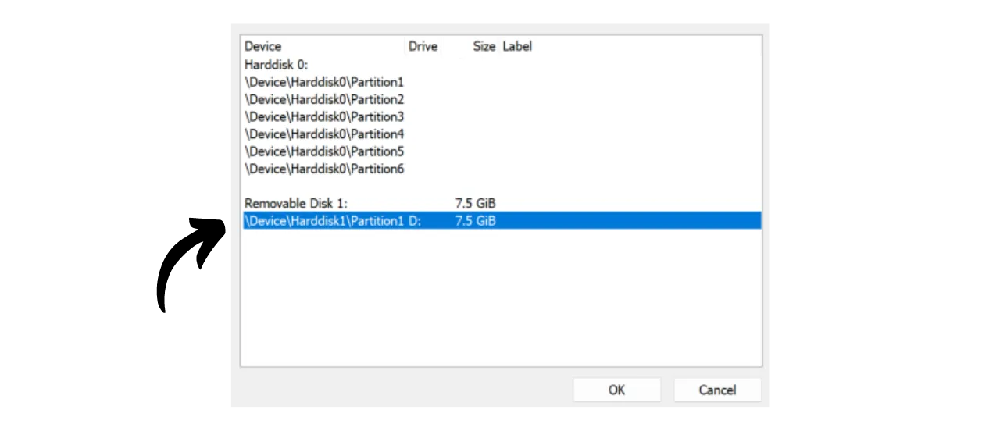
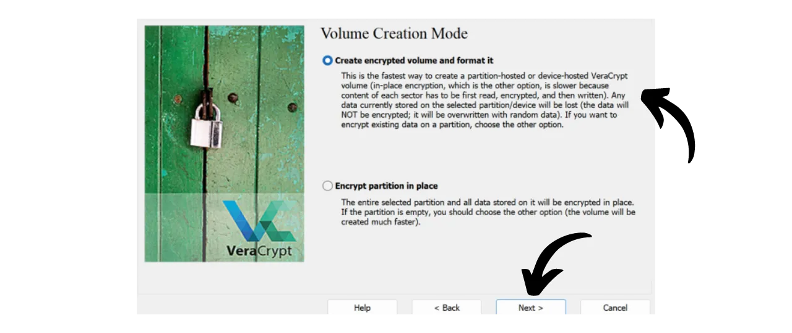
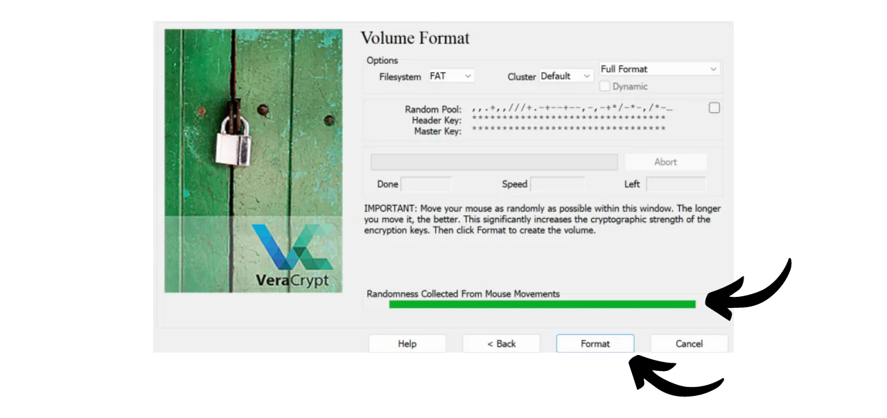

Hoy en día, es importante implementar una estrategia para asegurar la accesibilidad, seguridad y respaldo de tus archivos, como tus documentos personales, fotos o proyectos importantes. Perder estos datos puede ser catastrófico.

Para prevenir estos problemas, te aconsejo mantener múltiples copias de seguridad de tus archivos en diferentes medios. Una estrategia comúnmente utilizada en informática es la estrategia de respaldo "3-2-1", que asegura la protección de tus archivos:
- **3** copias de tus archivos;
- Guardadas en al menos **2** tipos diferentes de medios;
- Con al menos **1** copia mantenida fuera del sitio.

En otras palabras, es aconsejable almacenar tus archivos en 3 ubicaciones diferentes, utilizando medios de diferente naturaleza, como tu computadora, un disco duro externo, una memoria USB o un servicio de almacenamiento en línea. Y finalmente, tener una copia fuera del sitio significa que deberías tener una copia de seguridad almacenada fuera de tu hogar o negocio. Este último punto ayuda a evitar la pérdida total de tus archivos en caso de desastres locales como incendios o inundaciones. Una copia externa, distante de tu hogar o negocio, asegura que tus datos sobrevivirán independientemente de los riesgos locales.

Para implementar fácilmente esta estrategia de respaldo 3-2-1, puedes optar por una solución de almacenamiento en línea, sincronizando automáticamente o periódicamente los archivos de tu computadora con los de tu nube. Entre estas soluciones de respaldo en línea, obviamente están las de grandes compañías digitales que conoces: Google Drive, Microsoft OneDrive o Apple iCloud. Sin embargo, estas no son las mejores soluciones para proteger tu privacidad. En un tutorial anterior, te presenté una alternativa que cifra tus documentos para una mejor confidencialidad: Proton Drive.

https://planb.network/tutorials/others/proton-drive

Al adoptar esta estrategia de respaldo local y en la nube, ya te beneficias de dos tipos diferentes de medios para tus datos, uno de los cuales está fuera del sitio. Para completar la estrategia 3-2-1, simplemente necesitas añadir una copia adicional. Lo que te aconsejo hacer es simplemente exportar periódicamente tus datos presentes localmente y en tu nube a un medio físico, como una memoria USB o un disco duro externo. De esta manera, incluso si los servidores de tu solución de almacenamiento en línea se destruyen y tu computadora se avería simultáneamente, todavía tienes esta tercera copia en un medio externo para no perder tus datos.

Pero también es importante pensar en la seguridad de tu almacenamiento de datos para asegurar que nadie más que tú o tus seres queridos puedan acceder a él. Tanto los datos locales como los en línea normalmente están seguros. En tu computadora, probablemente hayas configurado una contraseña, y los discos duros de las computadoras modernas a menudo están cifrados por defecto. En cuanto a tu almacenamiento en línea (nube), te mostré en el tutorial anterior cómo asegurar tu cuenta con una contraseña fuerte y autenticación de dos factores. Sin embargo, para tu tercera copia almacenada en un medio físico, la única seguridad es su posesión física. Si un ladrón logra robar tu memoria USB o tu disco duro externo, podría acceder fácilmente a todos tus datos.

Para prevenir este riesgo, es aconsejable cifrar tu medio físico. Así, cualquier intento de acceder a los datos requerirá ingresar una contraseña para descifrar el contenido. Sin esta contraseña, será imposible acceder a los datos, asegurando tus archivos personales incluso en caso de robo de tu memoria USB o tu disco duro externo.

En este tutorial, te mostraré cómo cifrar fácilmente un medio de almacenamiento externo utilizando VeraCrypt, una herramienta de código abierto.
## Introducción a VeraCrypt

VeraCrypt es un software de código abierto disponible en Windows, macOS y Linux, que te permite cifrar tus datos de diversas maneras y en diferentes medios.

Este software permite la creación y mantenimiento de volúmenes cifrados al vuelo, lo que significa que tus datos se cifran automáticamente antes de ser guardados y se descifran antes de ser leídos. Este método asegura que tus archivos permanezcan protegidos incluso en caso de robo de tu medio de almacenamiento. VeraCrypt no solo cifra archivos, sino también nombres de archivos, metadatos, carpetas e incluso el espacio libre en tu medio de almacenamiento.

VeraCrypt se puede utilizar para cifrar archivos localmente o particiones enteras, incluido el disco del sistema. También se puede utilizar para cifrar completamente un medio externo, como una memoria USB o un disco, como veremos en este tutorial.

Una gran ventaja de VeraCrypt sobre soluciones propietarias es que es completamente de código abierto, lo que significa que su código puede ser verificado por cualquiera.

## ¿Cómo instalar VeraCrypt?

Ve al [sitio oficial de VeraCrypt](https://www.veracrypt.fr/en/Downloads.html) en la pestaña "*Downloads*".

Descarga la versión adecuada para tu sistema operativo. Si estás en Windows, elige "*EXE Installer*".

Elige el idioma para tu interfaz.

Acepta los términos de la licencia.

Selecciona "*Install*".

Finalmente, elige la carpeta donde se instalará el software, luego haz clic en el botón "*Install*".

Espera a que se complete la instalación.

La instalación ha finalizado.

Si lo deseas, puedes hacer una donación en bitcoins para apoyar el desarrollo de esta herramienta de código abierto.

## ¿Cómo cifrar un dispositivo de almacenamiento con VeraCrypt?

Al iniciar por primera vez, llegarás a esta interfaz:

Para cifrar el dispositivo de almacenamiento de tu elección, comienza por conectarlo a tu máquina. Como verás más adelante, el proceso de crear un nuevo volumen cifrado en una memoria USB o un disco duro tomará mucho más tiempo si el dispositivo ya contiene datos que no deseas eliminar. Por lo tanto, recomiendo usar una memoria USB en blanco o vaciar el dispositivo de antemano para crear el volumen cifrado, con el fin de ahorrar tiempo.

En VeraCrypt, haz clic en la pestaña "*Volumes*".

Luego en el menú "*Create New Volume...*".

En la nueva ventana que se abre, selecciona la opción "*Encrypt a non-system partition/drive*" y haz clic en "*Next*".

Luego tendrás que elegir entre "*Volumen VeraCrypt estándar*" y "*Volumen VeraCrypt Oculto*". La primera opción crea un volumen cifrado estándar en tu dispositivo. La opción "*Volumen VeraCrypt Oculto*" permite crear un volumen oculto dentro de un volumen VeraCrypt estándar. Este método te permite negar la existencia de este volumen oculto en caso de coacción. Por ejemplo, si alguien te obliga físicamente a descifrar tu dispositivo, puedes descifrar solo la parte estándar para satisfacer al agresor pero no revelar la parte oculta. En mi ejemplo, me quedaré con un volumen estándar. 
En la página siguiente, haz clic en el botón "*Seleccionar Dispositivo...*".

Se abrirá una nueva ventana donde puedes seleccionar la partición de tu dispositivo de almacenamiento de la lista de discos disponibles en tu máquina. Normalmente, la partición que deseas cifrar estará listada bajo una línea titulada "*Disco Extraíble N*". Después de seleccionar la partición apropiada, haz clic en el botón "*OK*".

El soporte seleccionado aparece en el cuadro. Ahora puedes hacer clic en el botón "*Siguiente*". 
A continuación, necesitarás elegir entre las opciones "*Crear volumen cifrado y formatearlo*" o "*Cifrar partición en su lugar*". Como se mencionó anteriormente, la primera opción eliminará permanentemente todos los datos en tu memoria USB o disco duro. Elige esta opción solo si tu dispositivo está vacío; de lo contrario, perderás todos los datos que contiene. Si deseas conservar los datos existentes, puedes transferirlos temporalmente a otro lugar, elegir "*Crear volumen cifrado y formatearlo*" para un proceso más rápido que borra todo, o optar por "*Cifrar partición en su lugar*". Esta última opción permite cifrar el volumen sin borrar los datos ya presentes, pero el proceso será mucho más largo. Para este ejemplo, como mi memoria USB está vacía, selecciono "*Crear volumen cifrado y formatearlo*", la opción que borra todo.

A continuación, tendrás la opción de elegir el algoritmo de cifrado y la función hash. A menos que tengas necesidades específicas, te aconsejo mantener las opciones predeterminadas. Haz clic en "*Siguiente*" para continuar.

Asegúrate de que el tamaño indicado para tu volumen sea correcto, para cifrar todo el espacio disponible en la memoria USB, y no solo una parte. Una vez verificado, haz clic en "*Siguiente*".

En esta etapa, necesitarás establecer una contraseña para cifrar y descifrar tu dispositivo. Es importante elegir una contraseña fuerte para evitar que un atacante pueda descifrar tu contenido con ataques de fuerza bruta. La contraseña debe ser aleatoria, lo más larga posible e incluir varios tipos de caracteres. Te aconsejo optar por una contraseña aleatoria de al menos 20 caracteres que incluya letras minúsculas, letras mayúsculas, números y símbolos.

También te aconsejo guardar tu contraseña en un gestor de contraseñas. Esto facilita el acceso y elimina el riesgo de olvido. Para nuestro caso específico, un gestor de contraseñas es preferible a un medio en papel. De hecho, en caso de un robo, aunque tu dispositivo de almacenamiento pueda ser robado, la contraseña en el gestor no puede ser encontrada por el atacante, lo que impedirá el acceso a los datos. Por el contrario, si tu gestor de contraseñas se ve comprometido, aún es necesario el acceso físico al dispositivo para explotar la contraseña y acceder a los datos.

Para más información sobre la gestión de contraseñas, te aconsejo descubrir este otro tutorial completo:
Introduce tu contraseña en los 2 campos designados, luego haz clic en "*Next*". 
VeraCrypt te preguntará si planeas almacenar archivos mayores a 4 GiB en el volumen cifrado. Esta pregunta permite al software seleccionar el sistema de archivos más adecuado. Generalmente, se utiliza el sistema FAT porque es compatible con la mayoría de los sistemas operativos, pero impone un límite máximo de tamaño de archivo de 4 GiB. Si necesitas gestionar archivos más grandes, puedes optar por el sistema exFAT.

A continuación, llegarás a una página que te permite generar una clave aleatoria. Esta clave es importante, ya que se utilizará para cifrar y descifrar tus datos. Se almacenará en una sección específica de tu medio, asegurada por la contraseña que estableciste previamente. Para generar una clave de cifrado fuerte, VeraCrypt necesita entropía. Por eso, el software te pide mover el ratón aleatoriamente sobre la ventana; estos movimientos se utilizan luego para generar la clave. Continúa moviendo el ratón hasta que el medidor de entropía esté completamente lleno. Luego, haz clic en "*Format*" para comenzar a crear el volumen cifrado.

Espera mientras se realiza el formateo. Esto puede tardar mucho tiempo para volúmenes grandes.

Luego recibirás una confirmación.

## ¿Cómo usar una unidad cifrada con VeraCrypt?

Por ahora, tu medio está cifrado y, por lo tanto, no puedes abrirlo. Para descifrarlo, ve a VeraCrypt.

Selecciona una letra de unidad de la lista. Por ejemplo, yo elegí "*L:*".

Haz clic en el botón "*Select Device...*".

De la lista de todos los discos en tu máquina, selecciona el volumen cifrado en tu medio, luego haz clic en el botón "*OK*".

Puedes ver que tu volumen está bien seleccionado.

Haz clic en el botón "*Mount*".

Introduce la contraseña elegida durante la creación del volumen, luego haz clic en "*OK*".

Puedes ver que tu volumen ahora está descifrado y accesible en la letra de unidad "*L:*".

Para acceder a él, abre tu explorador de archivos y ve a la unidad "*L:*" (o a otra letra dependiendo de la que hayas elegido en los pasos anteriores). 
Después de agregar tus archivos personales al medio, para cifrar el volumen nuevamente, simplemente haz clic en el botón "*Dismount*".

Tu volumen ya no aparece bajo la letra "*L:*". Así, está cifrado de nuevo.

Ahora puedes retirar tu medio de almacenamiento.

Felicidades, ahora tienes un medio cifrado para almacenar de manera segura tus datos personales, teniendo así una estrategia completa 3-2-1 además de la copia en tu computadora y tu solución de almacenamiento en línea.
Si deseas apoyar el desarrollo de VeraCrypt, también puedes hacer una donación en bitcoins [en esta página](https://www.veracrypt.fr/en/Donation.html).