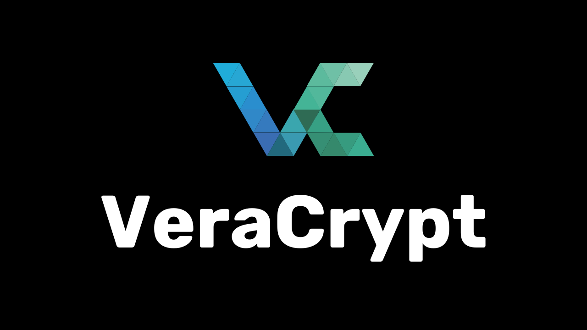
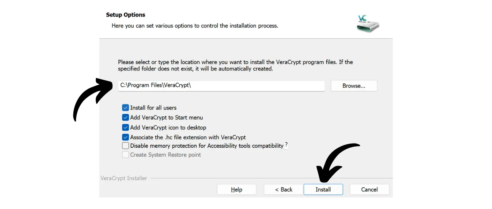
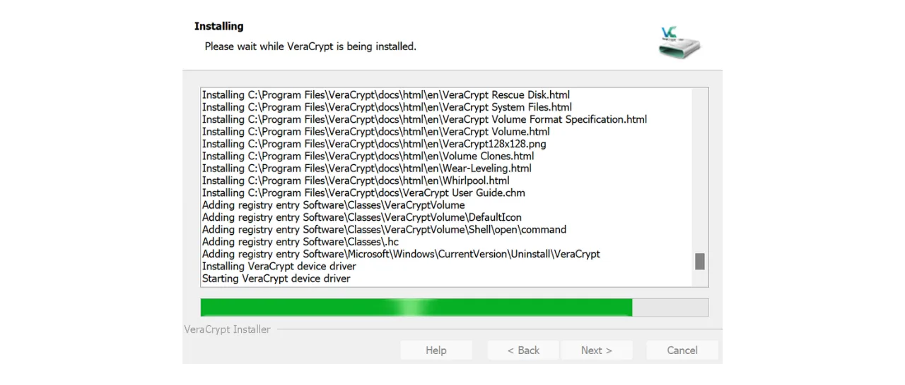
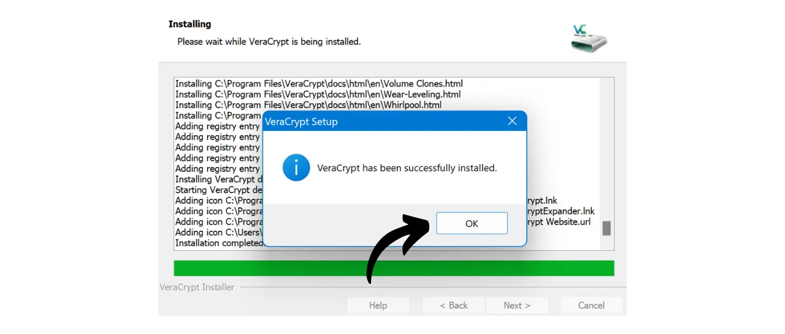
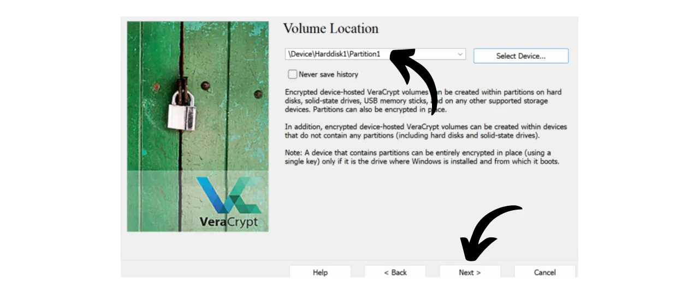

Tänapäeval on oluline rakendada strateegiat, et tagada oma failide, nagu isiklikud dokumendid, fotod või olulised projektid, kättesaadavus, turvalisus ja varundamine. Nende andmete kaotamine võib olla katastroofiline.

Probleemide vältimiseks soovitan teil hoida oma failidest mitut varukoopiat erinevatel meediatel. Arvutustehnikas kasutatakse laialdaselt "3-2-1" varundamise strateegiat, mis tagab teie failide kaitse:
- **3** koopiat teie failidest;
- Salvestatud vähemalt **2** erinevale meedia tüübile;
- Vähemalt **1** koopia hoitakse väljaspool asukohta.

Teisisõnu, on soovitatav hoida oma faile 3 erinevas kohas, kasutades erineva loomusega meediat, nagu teie arvuti, väline kõvaketas, USB mälupulk või veebipõhine salvestusteenus. Ja lõpuks, väljaspool asuva koopia olemasolu tähendab, et peaksite omama varukoopiat väljaspool oma kodu või äri. See viimane punkt aitab vältida teie failide täielikku kaotust kohalike katastroofide, nagu tulekahjud või üleujutused, korral. Väline koopia, mis asub kaugel teie kodust või ärist, tagab, et teie andmed jäävad sõltumatuks kohalikest riskidest.

Selle 3-2-1 varundamise strateegia hõlpsaks rakendamiseks võite valida veebipõhise salvestuslahenduse, sünkroonides automaatselt või perioodiliselt faile oma arvutist pilvega. Nende veebipõhiste varunduslahenduste seas on loomulikult need suurtelt digitaalsetelt ettevõtetelt, mida teate: Google Drive, Microsoft OneDrive või Apple iCloud. Siiski ei ole need parimad lahendused teie privaatsuse kaitsmiseks. Eelmises õpetuses tutvustasin teile alternatiivi, mis krüpteerib teie dokumente parema konfidentsiaalsuse tagamiseks: Proton Drive.

https://planb.network/tutorials/others/proton-drive

Kohaliku ja pilve varundamise strateegia kasutuselevõtuga saate juba kahest erinevast meedia tüübist andmetele juurdepääsu, millest üks asub väljaspool. 3-2-1 strateegia täitmiseks peate lihtsalt lisama veel ühe koopia. Soovitan teil perioodiliselt eksportida oma andmed, mis on kohalikult ja pilves, füüsilisele meediumile, nagu USB mälupulk või väline kõvaketas. Nii, isegi kui teie veebipõhise salvestuslahenduse serverid hävitatakse ja teie arvuti läheb samal ajal rikki, on teil endiselt see kolmas koopia välisel meediumil, et mitte kaotada oma andmeid.

Kuid on oluline mõelda ka oma andmete salvestamise turvalisusele, et tagada, et keegi teine peale teie või teie lähedaste ei pääseks neile juurde. Nii kohalikud kui ka veebipõhised andmed on tavaliselt turvalised. Oma arvutis olete tõenäoliselt seadistanud parooli ja kaasaegsete arvutite kõvakettad on sageli vaikimisi krüpteeritud. Mis puudutab teie veebipõhist salvestust (pilv), siis näitasin eelmises õpetuses, kuidas oma kontot turvalise parooli ja kahefaktorilise autentimisega kaitsta. Siiski, teie kolmanda koopia füüsilisel meediumil ainus turvalisus on selle füüsiline valdamine. Kui varas suudab varastada teie USB mälupulga või välise kõvaketta, võiksid nad kergesti pääseda ligi kõigile teie andmetele.

Selle riski vältimiseks on soovitatav krüpteerida teie füüsiline meedium. Nii nõuab igasugune andmetele juurdepääsu katse sisestada parool sisu dekrüpteerimiseks. Ilma selle paroolita on andmetele juurdepääs võimatu, tagades teie isiklike failide turvalisuse isegi USB mälupulga või välise kõvaketta varguse korral.

Selles õpetuses näitan teile, kuidas hõlpsalt krüpteerida välist salvestusseadet, kasutades VeraCrypti, mis on avatud lähtekoodiga tööriist.
## VeraCrypti tutvustus

VeraCrypt on avatud lähtekoodiga tarkvara, mis on saadaval Windowsi, macOSi ja Linuxi jaoks ning võimaldab teie andmeid mitmel viisil ja erinevatel meediumitel krüpteerida.

See tarkvara võimaldab luua ja hallata krüpteeritud mahte jooksvalt, mis tähendab, et teie andmed krüpteeritakse automaatselt enne salvestamist ja dekrüpteeritakse enne lugemist. See meetod tagab, et teie failid jäävad kaitstuks isegi siis, kui teie salvestusmeedium varastatakse. VeraCrypt krüpteerib mitte ainult faile, vaid ka failinimesid, metaandmeid, kaustu ja isegi teie salvestusmeediumi vaba ruumi.

VeraCrypti saab kasutada failide kohalikuks krüpteerimiseks või terve partitsiooni, sealhulgas süsteemiketta krüpteerimiseks. Samuti saab seda kasutada välise meediumi, nagu USB mälupulk või kõvaketas, täielikuks krüpteerimiseks, nagu me selles õpetuses näeme.

VeraCrypti suur eelis võrreldes autoriõigusega kaitstud lahendustega on see, et see on täielikult avatud lähtekoodiga, mis tähendab, et selle koodi saab igaüks kontrollida.

## Kuidas paigaldada VeraCrypti?

Mine [ametlikule VeraCrypti veebilehele](https://www.veracrypt.fr/en/Downloads.html) vahekaardile "*Downloads*".

Laadige alla teie operatsioonisüsteemile sobiv versioon. Kui kasutate Windowsi, valige "*EXE Installer*".

Valige oma liidese keel.

Nõustuge litsentsi tingimustega.

Valige "*Install*".

Lõpuks valige kaust, kuhu tarkvara paigaldatakse, seejärel klõpsake nupul "*Install*".

Oodake, kuni paigaldamine on lõpule viidud.

Paigaldamine on lõpetatud.

Soovi korral võite teha annetuse bitcoinides, et toetada selle avatud lähtekoodiga tööriista arendamist.

## Kuidas krüpteerida salvestusseadet VeraCryptiga?

Esimesel käivitamisel jõuate sellele liidesele:

Salvestusseadme krüpteerimiseks, mida soovite, alustage selle ühendamisega oma masinaga. Nagu hiljem näete, võtab uue krüpteeritud mahu loomine USB mälupulgal või kõvakettal palju kauem aega, kui seade juba sisaldab andmeid, mida te ei soovi kustutada. Seetõttu soovitan kasutada tühja USB mälupulka või tühjendada seade eelnevalt, et luua krüpteeritud maht ja säästa aega.

VeraCryptis klõpsake vahekaardil "*Volumes*".

Seejärel menüüs "*Create New Volume...*".

Uues aknas, mis avaneb, valige võimalus "*Encrypt a non-system partition/drive*" ja klõpsake nupul "*Next*".

Te peate seejärel valima "*Standard VeraCrypt volume*" ja "*Hidden VeraCrypt Volume*" vahel. Esimene valik loob teie seadmesse standardse krüpteeritud mahu. Valik "*Hidden VeraCrypt Volume*" võimaldab luua peidetud mahu standardse VeraCrypt mahus. See meetod võimaldab teil eitada selle peidetud mahu olemasolu sunni korral. Näiteks, kui keegi füüsiliselt sunnib teid oma seadet dekrüpteerima, saate dekrüpteerida ainult standardosa, et rahuldada ründajat, kuid mitte paljastada peidetud osa. Minu näites jään ma standardmahuga. 
Järgmisel lehel klõpsake nupul "*Select Device...*".

Avaneb uus aken, kus saate oma masinas saadaolevate ketaste loendist valida salvestusseadme partitsiooni. Tavaliselt kuvatakse soovitud partitsioon pealkirja "*Removable Disk N*" all. Pärast sobiva partitsiooni valimist klõpsake nupul "*OK*".

Valitud tugi kuvatakse kastis. Nüüd saate klõpsata nupul "*Next*". 
Järgmisena peate valima valikute "*Create encrypted volume and format it*" või "*Encrypt partition in place*" vahel. Nagu varem mainitud, kustutab esimene valik teie USB mälupulgal või kõvakettal olevad andmed jäädavalt. Valige see valik ainult juhul, kui teie seade on tühi; vastasel juhul kaotate kõik andmed, mida see sisaldab. Kui soovite olemasolevaid andmeid säilitada, võite need ajutiselt mujale üle kanda, valida "*Create encrypted volume and format it*" kiirema protsessi jaoks, mis kustutab kõik, või opteerida "*Encrypt partition in place*". See viimane valik võimaldab krüpteerida mahtu ilma juba olemasolevaid andmeid kustutamata, kuid protsess on palju pikem. Selles näites, kuna minu USB mälupulk on tühi, valin "*Create encrypted volume and format it*", valiku, mis kustutab kõik.

Järgmisena on teil võimalus valida krüpteerimisalgoritm ja räsifunktsioon. Kui teil pole konkreetseid vajadusi, soovitan teil jääda vaikimisi valikute juurde. Jätkamiseks klõpsake nupul "*Next*".

Veenduge, et teie mahu jaoks näidatud suurus on õige, et krüpteerida kogu USB mälupulgal saadaolev ruum, mitte ainult osa sellest. Kui olete kontrollinud, klõpsake nupul "*Next*".

Selles etapis peate määrama parooli, et krüpteerida ja dekrüpteerida oma seadet. On oluline valida tugev parool, et vältida ründaja poolt teie sisu dekrüpteerimist jõumeetodil. Parool peaks olema juhuslik, nii pikk kui võimalik ja sisaldama mitut tüüpi tähemärke. Soovitan valida juhusliku parooli, mis on vähemalt 20 tähemärki pikk ja sisaldab väiketähti, suurtähti, numbreid ja sümboleid.

Soovitan teil samuti salvestada oma parooli paroolihaldurisse. See muudab juurdepääsu lihtsamaks ja kõrvaldab unustamise riski. Meie konkreetse juhtumi puhul on paroolihaldur eelistatavam kui pabermeedium. Tõepoolest, sissemurdmise korral, kuigi teie salvestusseade võib olla varastatud, ei saa ründaja paroolihaldurist parooli leida, mis takistab andmetele juurdepääsu. Vastupidi, kui teie paroolihaldur on kompromiteeritud, on füüsiline juurdepääs seadmele endiselt vajalik, et ära kasutada parooli ja pääseda andmetele ligi.

Paroolide haldamise kohta lisateabe saamiseks soovitan avastada seda teist täielikku õpetust:
Sisestage oma parool mõlemasse ettenähtud välja, seejärel klõpsake nupul "*Järgmine*". 
Seejärel küsib VeraCrypt teilt, kas plaanite salvestada krüpteeritud mahusse suuremaid kui 4 GiB faile. See küsimus võimaldab tarkvaral valida kõige sobivama failisüsteemi. Üldiselt kasutatakse FAT-süsteemi, kuna see on ühilduv enamiku operatsioonisüsteemidega, kuid see seab maksimaalseks failisuuruseks 4 GiB. Kui vajate suuremate failide haldamist, võite valida exFAT-süsteemi.

Järgmisena jõuate lehele, mis võimaldab teil genereerida juhusliku võtme. See võti on oluline, kuna seda kasutatakse teie andmete krüpteerimiseks ja dekrüpteerimiseks. See salvestatakse teie meedia kindlasse sektsiooni, mida kaitseb teie poolt varem määratud parool. Tugeva krüpteerimisvõtme genereerimiseks vajab VeraCrypt entroopiat. Seetõttu palub tarkvara teil hiirt akna peal juhuslikult liigutada; neid liigutusi kasutatakse seejärel võtme genereerimiseks. Jätkake hiire liigutamist, kuni entroopia mõõdik on täielikult täidetud. Seejärel klõpsake nupul "*Formaadi*" krüpteeritud mahu loomise alustamiseks.

Oodake, kuni vormindamine on lõpule viidud. Suurte mahtude puhul võib see võtta kaua aega.

Seejärel saate kinnituse.

## Kuidas kasutada krüpteeritud draivi VeraCryptiga?

Praegu on teie meedia krüpteeritud ja seetõttu ei saa te seda avada. Selle dekrüpteerimiseks minge VeraCrypti.

Valige loendist draivitäht. Näiteks valisin mina "*L:*".

Klõpsake nupul "*Vali Seade...*".

Valige oma arvuti kõikide ketaste hulgast teie meedial olev krüpteeritud maht, seejärel klõpsake nupul "*OK*".

Näete, et teie maht on korralikult valitud.

Klõpsake nupul "*Mount*".

Sisestage mahu loomisel valitud parool, seejärel klõpsake nupul "*OK*".

Näete, et teie maht on nüüd dekrüpteeritud ja kättesaadav draivitähe "*L:*" all.

Sellele juurdepääsuks avage oma failihaldur ja minge draivile "*L:*" (või mõnele teisele tähele, olenevalt sellest, mille valisite eelmistes sammudes). 
Pärast oma isiklike failide lisamist meediale, et maht uuesti krüpteerida, klõpsake lihtsalt nupul "*Dismount*".

Teie maht ei ilmu enam tähe "*L:*" all. See on seega jälle krüpteeritud.

Nüüd võite oma salvestusmeedia eemaldada.

Palju õnne, teil on nüüd krüpteeritud meedium, et turvaliselt oma isiklikke andmeid hoiustada, omades seeläbi täielikku 3-2-1 strateegiat lisaks koopiale teie arvutis ja teie veebipõhises salvestuslahenduses.
Kui soovite toetada VeraCrypt'i arendust, võite teha annetuse ka bitcoinides [sellel lehel](https://www.veracrypt.fr/en/Donation.html).