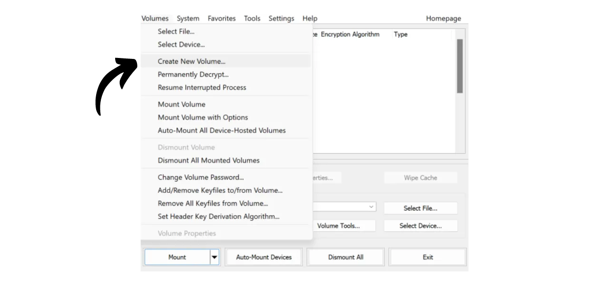

Nykyään on tärkeää toteuttaa strategia tiedostojen, kuten henkilökohtaisten dokumenttien, valokuvien tai tärkeiden projektien, saatavuuden, turvallisuuden ja varmuuskopioinnin varmistamiseksi. Näiden tietojen menettäminen voi olla katastrofaalista.

Näiden ongelmien estämiseksi neuvon sinua ylläpitämään useita varmuuskopioita tiedostoistasi eri medioilla. Tietotekniikassa yleisesti käytetty strategia on "3-2-1" varmuuskopiostrategia, joka varmistaa tiedostojesi suojauksen:
- **3** kappaletta tiedostoistasi;
- Tallennettuna ainakin **2** eri tyyppiselle medialle;
- Vähintään **1** kopio säilytetään ulkopuolisessa sijainnissa.

Toisin sanoen on suositeltavaa säilyttää tiedostosi kolmessa eri paikassa, käyttäen eri luonteisia medioita, kuten tietokonettasi, ulkoista kovalevyä, USB-tikkua tai online-tallennuspalvelua. Ja lopuksi, ulkopuolisen kopion säilyttäminen tarkoittaa, että sinulla tulisi olla varmuuskopio tallennettuna kodin tai yrityksen ulkopuolelle. Tämä viimeinen kohta auttaa välttämään tiedostojen täydellisen menetyksen paikallisten katastrofien, kuten tulipalojen tai tulvien, sattuessa. Ulkoinen kopio, kaukana kodistasi tai yrityksestäsi, varmistaa, että tietosi säilyvät riippumatta paikallisista riskeistä.

Tämän 3-2-1 varmuuskopiostrategian helpoksi toteuttamiseksi voit valita online-tallennusratkaisun, synkronoimalla tiedostot tietokoneeltasi pilveen automaattisesti tai säännöllisesti. Näiden online-varmuuskopioratkaisujen joukossa on tietenkin niitä suurilta digitaalisilta yrityksiltä, joita tunnet: Google Drive, Microsoft OneDrive tai Apple iCloud. Nämä eivät kuitenkaan ole parhaita ratkaisuja yksityisyytesi suojaamiseen. Aiemmassa oppaassa esittelin sinulle vaihtoehdon, joka salaa dokumenttisi paremman luottamuksellisuuden saavuttamiseksi: Proton Drive.

https://planb.network/tutorials/others/proton-drive

Noudattamalla tätä paikallisen ja pilven varmuuskopiointistrategiaa hyödyt jo kahdesta eri tyyppisestä mediasta tiedoillesi, joista toinen on ulkopuolinen. 3-2-1 strategian täydentämiseksi sinun tarvitsee vain lisätä ylimääräinen kopio. Neuvoni on yksinkertaisesti säännöllisesti viedä tietosi paikallisesti ja pilvestä fyysiselle medialle, kuten USB-tikulle tai ulkoiselle kovalevylle. Näin, vaikka online-tallennusratkaisusi palvelimet tuhoutuisivat ja tietokoneesi hajoaisi samanaikaisesti, sinulla on silti tämä kolmas kopio ulkoisella medialla, jotta et menetä tietojasi.

Mutta on myös tärkeää miettiä tallennettujen tietojesi turvallisuutta varmistaaksesi, että kukaan muu kuin sinä tai läheisesi eivät pääse niihin käsiksi. Sekä paikalliset että online-tiedot ovat yleensä turvassa. Tietokoneellasi olet todennäköisesti asettanut salasanan, ja nykyaikaisten tietokoneiden kovalevyt ovat usein oletuksena salattuja. Online-tallennustilasi (pilvi) osalta näytin sinulle edellisessä oppaassa, kuinka voit suojata tilisi vahvalla salasanalla ja kaksivaiheisella todennuksella. Kuitenkin kolmannen kopiosi, joka on tallennettu fyysiselle medialle, ainoa turva on sen fyysinen hallussapito. Jos murtovaras onnistuu varastamaan USB-tikkusi tai ulkoisen kovalevysi, hän voisi helposti päästä käsiksi kaikkiin tietoihisi.

Tämän riskin estämiseksi on suositeltavaa salata fyysinen mediasi. Näin ollen kaikki yritykset päästä käsiksi tietoihin vaativat salasanan syöttämisen sisällön salaamiseksi. Ilman tätä salasanaa tietoihin pääsy on mahdotonta, turvaten henkilökohtaiset tiedostosi jopa USB-tikun tai ulkoisen kovalevyn varkauden sattuessa.

Tässä oppaassa näytän sinulle, kuinka voit helposti salata ulkoisen tallennusvälineen käyttäen VeraCryptia, avoimen lähdekoodin työkalua.
## VeraCryptin esittely

VeraCrypt on avoimen lähdekoodin ohjelmisto, joka on saatavilla Windowsille, macOS:lle ja Linuxille. Se mahdollistaa tietojesi salaamisen eri tavoin ja eri välineillä.

Tämä ohjelmisto mahdollistaa salattujen volyymien luomisen ja ylläpidon lennossa, mikä tarkoittaa, että tietosi salataan automaattisesti ennen tallentamista ja puretaan ennen lukemista. Tämä menetelmä varmistaa, että tiedostosi pysyvät suojattuina jopa tallennusvälineesi varkauden sattuessa. VeraCrypt ei ainoastaan salaa tiedostoja, vaan myös tiedostonimet, metatiedot, kansiot ja jopa tallennusvälineesi vapaan tilan.

VeraCryptia voidaan käyttää tiedostojen salaamiseen paikallisesti tai kokonaisten osioiden, mukaan lukien järjestelmälevy, salaamiseen. Sitä voidaan myös käyttää ulkoisen välineen, kuten USB-tikun tai levyn, täydelliseen salaamiseen, kuten tässä oppaassa näemme.

VeraCryptin suuri etu omistuksellisiin ratkaisuihin verrattuna on, että se on täysin avoimen lähdekoodin, mikä tarkoittaa, että sen koodia voi tarkistaa kuka tahansa.

## Kuinka asentaa VeraCrypt?

Siirry [viralliselle VeraCryptin verkkosivustolle](https://www.veracrypt.fr/en/Downloads.html) "*Lataukset*" -välilehdelle.

Lataa käyttöjärjestelmällesi sopiva versio. Jos käytät Windowsia, valitse "*EXE-asennusohjelma*".

Valitse käyttöliittymäsi kieli.

Hyväksy lisenssiehdot.

Valitse "*Asenna*".

Lopuksi valitse kansio, johon ohjelmisto asennetaan, ja napsauta "*Asenna*" -painiketta.

Odota asennuksen valmistumista.

Asennus on valmis.

Halutessasi voit lahjoittaa bitcoineja tukeaksesi tämän avoimen lähdekoodin työkalun kehitystä.

## Kuinka salata tallennuslaite VeraCryptilla?

Ensimmäisellä käynnistyskerralla saavut tähän käyttöliittymään:

Salataksesi valitsemasi tallennuslaitteen, aloita yhdistämällä se koneeseesi. Kuten myöhemmin näet, uuden salatun volyymin luominen USB-tikulle tai kovalevylle kestää paljon kauemmin, jos laitteessa on jo tietoja, joita et halua poistaa. Siksi suosittelen käyttämään tyhjää USB-tikkua tai tyhjentämään laitteen etukäteen salatun volyymin luomiseksi, jotta säästät aikaa.

VeraCryptissa napsauta "*Volyymit*" -välilehteä.

Sitten valitse "*Luo uusi volyymi...*" -valikko.

Uudessa ikkunassa, joka avautuu, valitse vaihtoehto "*Salaa ei-järjestelmäosio/-asema*" ja napsauta "*Seuraava*".

Sinun täytyy sitten valita "*Standard VeraCrypt volume*" ja "*Hidden VeraCrypt Volume*" välillä. Ensimmäinen vaihtoehto luo standardin salatun tilavuuden laitteellesi. "*Hidden VeraCrypt Volume*" -vaihtoehto mahdollistaa piilotetun tilavuuden luomisen standardin VeraCrypt-tilavuuden sisälle. Tämä menetelmä mahdollistaa sinun kieltää tämän piilotetun tilavuuden olemassaolon pakotilanteessa. Esimerkiksi, jos joku fyysisesti pakottaa sinut salaamaan laitteesi, voit salata vain standardiosan tyydyttääksesi hyökkääjän, mutta et paljasta piilotettua osaa. Esimerkissäni pysyttelen standarditilavuudessa. 
Seuraavalla sivulla, klikkaa "*Select Device...*" -painiketta.

Uusi ikkuna avautuu, jossa voit valita tallennuslaitteesi osion saatavilla olevien levyjen listasta. Normaalisti haluamasi osio on listattu rivillä, joka on otsikoitu "*Removable Disk N*". Valittuasi sopivan osion, klikkaa "*OK*" -painiketta.

Valittu tuki näkyy laatikossa. Voit nyt klikata "*Next*" -painiketta. 
Seuraavaksi sinun täytyy valita vaihtoehdoista "*Create encrypted volume and format it*" tai "*Encrypt partition in place*". Kuten aiemmin mainittiin, ensimmäinen vaihtoehto poistaa pysyvästi kaikki tiedot USB-tikultasi tai kovalevyltäsi. Valitse tämä vaihtoehto vain, jos laitteesi on tyhjä; muuten menetät kaikki sen sisältämät tiedot. Jos haluat säilyttää olemassa olevat tiedot, voit väliaikaisesti siirtää ne muualle, valita "*Create encrypted volume and format it*" nopeammalle prosessille, joka poistaa kaiken, tai valita "*Encrypt partition in place*". Tämä viimeinen vaihtoehto mahdollistaa tilavuuden salaamisen poistamatta jo olemassa olevia tietoja, mutta prosessi on paljon pidempi. Tässä esimerkissä, koska USB-tikkuni on tyhjä, valitsen "*Create encrypted volume and format it*", vaihtoehdon, joka poistaa kaiken.

Seuraavaksi sinulla on mahdollisuus valita salausalgoritmi ja hajautusfunktio. Ellei sinulla ole erityistarpeita, suosittelen pitämään oletusvaihtoehdot. Klikkaa "*Next*" jatkaaksesi.

Varmista, että tilavuutesi ilmoitettu koko on oikea, jotta salaat koko käytettävissä olevan tilan USB-tikulla, eikä vain osaa siitä. Kun olet varmistanut, klikkaa "*Next*".

Tässä vaiheessa sinun täytyy asettaa salasana laitteesi salaamiseen ja salaamisen purkamiseen. On tärkeää valita vahva salasana estääksesi hyökkääjää purkamasta sisältöäsi brute force -hyökkäyksillä. Salasanan tulisi olla satunnainen, mahdollisimman pitkä ja sisältää useita merkkityyppejä. Neuvon sinua valitsemaan satunnaisen salasanan, joka on vähintään 20 merkkiä pitkä ja sisältää pieniä kirjaimia, isoja kirjaimia, numeroita ja symboleita.

Neuvon myös tallentamaan salasanasi salasananhallintaohjelmaan. Tämä helpottaa pääsyä ja eliminoi unohtamisen riskin. Erityistapauksessamme salasananhallintaohjelma on suositeltavampi kuin paperinen väline. Todellakin, murron sattuessa, vaikka tallennuslaitteesi saatettaisiin varastaa, salasana hallintaohjelmassa ei ole hyökkääjän löydettävissä, mikä estää pääsyn tietoihin. Toisaalta, jos salasananhallintaohjelmasi on kompromisoitu, fyysinen pääsy laitteeseen on silti tarpeen hyödyntää salasanaa ja päästä käsiksi tietoihin.

Lisätietoja salasanojen hallinnasta, suosittelen tutustumaan tähän toiseen kattavaan opastukseen:
Syötä salasanasi kahteen määrättyyn kenttään ja napsauta sitten "*Seuraava*". 
VeraCrypt kysyy sinulta, aiotko tallentaa suurempia kuin 4 GiB tiedostoja salattuun taltioon. Tämä kysymys mahdollistaa ohjelmiston valita sopivimman tiedostojärjestelmän. Yleensä käytetään FAT-järjestelmää, koska se on yhteensopiva useimpien käyttöjärjestelmien kanssa, mutta se asettaa maksimitiedostokoon rajaksi 4 GiB. Jos tarvitset suurempien tiedostojen hallintaa, voit valita exFAT-järjestelmän.

Seuraavaksi pääset sivulle, joka mahdollistaa satunnaisen avaimen luomisen. Tämä avain on tärkeä, sillä sitä käytetään tietojesi salaamiseen ja purkamiseen. Se tallennetaan tietovälineesi tiettyyn osioon, joka on suojattu aiemmin asettamallasi salasanalla. Vahvan salausavaimen luomiseksi VeraCrypt tarvitsee entropiaa. Siksi ohjelmisto pyytää sinua liikuttamaan hiirtäsi satunnaisesti ikkunan yli; näitä liikkeitä käytetään sitten avaimen luomiseen. Jatka hiiren liikuttamista, kunnes entropiamittari on täysin täytetty. Sen jälkeen napsauta "*Alusta*" aloittaaksesi salatun taltion luomisen.

Odota, kunnes alustus on valmis. Tämä voi kestää kauan suurille taltioille.

Saat sitten vahvistuksen.

## Kuinka käyttää salattua asemaa VeraCryptin kanssa?

Toistaiseksi tietovälineesi on salattu, joten et voi avata sitä. Salataksesi sen, siirry VeraCryptiin.

Valitse listasta aseman kirjain. Esimerkiksi minä valitsin "*L:*".

Napsauta "*Valitse laite...*" -painiketta.

Valitse koneesi kaikista levyistä salattu taltio tietovälineelläsi ja napsauta sitten "*OK*" -painiketta.

Näet, että taltiosi on hyvin valittu.

Napsauta "*Liitä*" -painiketta.

Syötä taltion luomisen aikana valitsemasi salasana ja napsauta sitten "*OK*".

Näet, että taltiosi on nyt purettu ja käytettävissä aseman kirjaimella "*L:*".

Päästäksesi siihen, avaa tiedostonhallintasi ja siirry asemaan "*L:*" (tai toiseen kirjaimeen riippuen siitä, minkä valitsit aiemmissa vaiheissa). 
Lisättyäsi henkilökohtaisia tiedostoja tietovälineeseen, salataksesi taltion uudelleen, napsauta yksinkertaisesti "*Irrota*" -painiketta.

Taltiosi ei enää näy kirjaimen "*L:*" alla. Se on siis salattu uudelleen.

Voit nyt poistaa tallennusvälineesi.

Onnittelut, sinulla on nyt salattu väline henkilökohtaisten tietojesi turvalliseen säilyttämiseen, mikä täydentää 3-2-1 strategiaasi lisäksi tietokoneesi kopion ja online-tallennusratkaisusi kanssa.
Jos haluat tukea VeraCryptin kehitystä, voit myös lahjoittaa bitcoineja [tällä sivulla](https://www.veracrypt.fr/en/Donation.html).