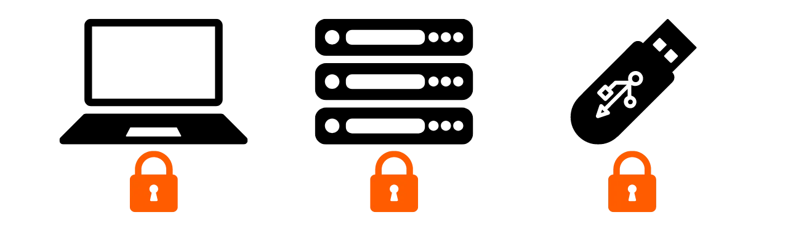
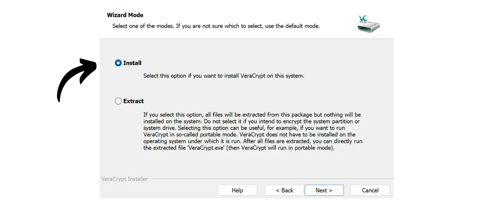

De nos jours, il est important de mettre en place une stratégie pour garantir l'accessibilité, la sécurité et la sauvegarde de vos fichiers, tels que vos documents personnels, vos photos ou vos projets importants. La perte de ces données peut être catastrophique.

Pour prévenir ces problèmes, je vous conseille de maintenir plusieurs sauvegardes de vos fichiers sur des supports différents. Une méthode généralement utilisée en informatique est la stratégie de sauvegarde du "3-2-1", qui assure la protection de vos fichiers :
- **3** copies de vos fichiers ;
- Sauvegardées sur au moins **2** types de supports différents ;
- Avec au moins **1** copie conservée hors site.

Autrement dit, il est conseillé d'enregistrer vos fichiers à 3 endroits différents, en utilisant des supports de nature différente, tels que votre ordinateur, un disque dur externe, une clé USB ou un service de stockage en ligne. Et enfin, avoir une copie hors site signifie que vous devriez avoir une sauvegarde stockée en dehors de votre maison ou de votre entreprise. Ce dernier point permet d'éviter la perte totale de vos fichiers en cas de sinistres locaux tels que des incendies ou des inondations. Une copie externe, éloignée de votre domicile ou de votre entreprise, assure que vos données survivront indépendamment des risques locaux.

Pour mettre en place facilement cette stratégie de sauvegarde 3-2-1, vous pouvez opter pour une solution de stockage en ligne, en synchronisant automatiquement ou périodiquement les fichiers de votre ordinateur avec ceux de votre cloud. Parmi ces solutions de sauvegarde en ligne, il y a évidemment celles des grandes entreprises du numérique que vous connaissez : Google Drive, Microsoft OneDrive ou encore Apple iCloud. Cependant, ce ne sont pas les meilleures solutions pour protéger votre vie privée. Dans un tutoriel précédent, je vous ai présenté une alternative qui chiffre vos documents pour une meilleure confidentialité : Proton Drive.

https://planb.network/tutorials/others/proton-drive

En adoptant cette stratégie de sauvegarde locale et sur le cloud, vous bénéficiez déjà de deux types de supports différents pour vos données, dont un qui est hors site. Pour compléter la stratégie du 3-2-1, il vous suffit d'ajouter une copie supplémentaire. Ce que je vous conseille de faire, c'est tout simplement de réaliser périodiquement des exports de vos données présentes en local et sur votre cloud vers un support physique, comme une clé USB ou un disque dur. De cette manière, même si les serveurs de votre solution de stockage en ligne sont détruits et que votre ordinateur tombe en panne simultanément, vous disposez toujours de cette troisième copie sur un support externe pour ne pas perdre vos données.

Mais il est également important de penser à la sécurité de vos supports de données pour garantir que personne d'autre que vous ou vos proches ne puisse y accéder. Les données locales et en ligne sont normalement sécurisées. Sur votre ordinateur, vous avez probablement mis en place un mot de passe, et les disques durs des ordinateurs modernes sont souvent chiffrés par défaut. Concernant votre stockage en ligne (cloud), je vous ai montré dans un tutoriel précédent comment sécuriser votre compte avec un mot de passe robuste et une authentification à deux facteurs. Cependant, pour votre troisième copie stockée sur un support physique, la seule sécurité est sa possession physique. Si un cambrioleur parvient à voler votre clé USB ou votre disque dur externe, il pourra accéder facilement à toutes vos données.

Pour prévenir ce risque, il est conseillé de chiffrer votre support physique. Ainsi, toute tentative d'accès aux données nécessitera la saisie d'un mot de passe pour déchiffrer le contenu. Sans ce mot de passe, il sera impossible d'accéder aux données, ce qui sécurise vos fichiers personnels même en cas de vol de votre clé USB ou de votre disque dur externe.

Dans ce tutoriel, je vous montre comment chiffrer facilement un support de stockage externe à l'aide de VeraCrypt, un outil open source.

## Présentation de VeraCrypt

VeraCrypt est un logiciel open source disponible sur Windows, macOS et Linux, qui vous permet de chiffrer vos données de différentes manières et sur différents supports.

Ce logiciel permet de créer et de maintenir des volumes chiffrés à la volée, c'est-à-dire que vos données sont automatiquement chiffrées avant d'être sauvegardées et déchiffrées avant d'être lues. Cette méthode vous garantit que vos données restent protégées même en cas de vol de votre support de stockage. Aussi VeraCrypt chiffre non seulement les fichiers, mais également les noms de fichiers, les métadonnées, les dossiers, et même l'espace libre sur votre support de stockage.

Veracrypt peut être utilisé pour chiffrer des fichiers en local, ou bien des partitions entières, y compris le disque système. Il peut également être utilisé pour chiffrer entièrement un support externe tel qu'une clé USB ou un disque comme nous allons le voir dans ce tutoriel.

Le gros avantage de VeraCrypt par rapport aux solutions propriétaires est qu'il est entièrement open source, ce qui signifie que son code peut être vérifié par n'importe qui.

## Comment installer VeraCrypt ?

Rendez-vous sur [le site officiel de VeraCrypt](https://www.veracrypt.fr/en/Downloads.html) dans l'onglet "Downloads".

Téléchargez la version adaptée à votre système d'exploitation. Si vous êtes sous Windows, choisissez "EXE Installer".

Choisissez la langue de votre interface.

Acceptez les termes de la licence.

Sélectionnez "Install".

Enfin, choisissez le dossier où sera installé le logiciel puis cliquez sur le bouton "Install".

Patientez le temps de l'installation.

L'installation est terminée.

Si vous le souhaitez, vous pouvez faire un don en bitcoins pour soutenir le développement de cet outil open source.

## Comment chiffrer un support de stockage avec VeraCrypt ?

Lors du premier lancement, vous arriverez sur cette interface :

Pour chiffrer le support de votre choix, commencez par le brancher à votre machine. Comme vous le constaterez plus loin, le processus de création d'un nouveau volume chiffré sur une clé USB ou un disque dur prendra beaucoup plus de temps si le support contient déjà des données que vous ne souhaitez pas supprimer. Je vous recommande donc d'utiliser une clé USB vierge ou de vider préalablement le support avant de créer le volume chiffré, afin de gagner du temps.

Sur VeraCrypt, cliquez sur l'onglet "Volumes".

Puis sur le menu "Create New Volume...".

Dans la nouvelle fenêtre qui s'ouvre, sélectionnez l'option "Encrypt a non-system partition/drive" et cliquez sur "Next".

Vous aurez ensuite à choisir entre "Standard VeraCrypt volume" et "Hidden VeraCrypt Volume". La première option crée un volume chiffré standard sur votre support. L'option "Hidden VeraCrypt Volume" permet de créer un volume caché à l'intérieur d'un volume VeraCrypt standard. Cette méthode vous permet de nier l'existence de ce volume caché en cas de contrainte. Par exemple, si quelqu'un vous force physiquement à déchiffrer votre support, vous pouvez déchiffrer seulement la partie standard pour satisfaire l'agresseur, mais ne pas révéler la partie cachée. Dans mon exemple, je vais rester sur un volume standard.

Sur la page suivante, cliquez sur le bouton "Select Device...".

Une nouvelle fenêtre s'ouvre où vous pouvez sélectionner la partition de votre support de stockage parmi la liste des disques disponibles sur votre machine. Normalement, la partition que vous souhaitez chiffrer sera listée sous une ligne intitulée "Removable Disk N". Après avoir sélectionné la partition adéquate, cliquez sur le bouton "OK".

Le support sélectionné apparait dans la case. Vous pouvez maintenant cliquer sur le bouton "Next".

Vous devrez ensuite choisir entre les options "Create encrypted volume and format it" ou "Encrypt partition in place". Comme mentionné précédemment, la première option supprimera définitivement toutes les données sur votre clé USB ou votre disque dur. Choisissez cette option uniquement si votre support est vide ; autrement, vous perdrez toutes les données qu'il contient. Si vous souhaitez conserver des données existantes, vous pouvez les transférer temporairement ailleurs, choisir "Create encrypted volume and format it" pour un processus plus rapide qui effacera tout, ou bien opter pour "Encrypt partition in place". Cette dernière option permet de chiffrer le volume sans effacer les données déjà présentes, mais le processus sera beaucoup plus long. Pour cet exemple, comme ma clé USB est vide, je sélectionne "Create encrypted volume and format it", l'option qui efface tout.

Ensuite, vous aurez la possibilité de choisir l'algorithme de chiffrement et la fonction de hachage. Sauf si vous avez des besoins spécifiques, je vous conseille de conserver les options par défaut. Cliquez sur "Next" pour continuer.

Assurez-vous que la taille indiquée pour votre volume est correcte afin de chiffrer l'intégralité de l'espace disponible sur la clé USB, et non seulement une partie. Une fois vérifié, cliquez sur "Next".

À cette étape, vous devrez définir un mot de passe pour chiffrer et déchiffrer votre support. Il est important de choisir un mot de passe robuste afin d'éviter qu'un attaquant puisse déchiffrer votre contenu avec des méthodes de brute force. Le mot de passe doit être aléatoire, le plus long possible, et inclure plusieurs types de caractères. Je vous conseille d'opter pour un mot de passe aléatoire d'au moins 20 caractères comprenant des lettres minuscules, des lettres majuscules, des chiffres et des symboles.

Je vous conseille également d'enregistrer votre mot de passe dans un gestionnaire de mots de passe. Cela permet d'en faciliter l'accès et de supprimer le risque d'oubli. Pour notre cas spécifique, un gestionnaire de mots de passe est préférable à un support papier. En effet, en cas de cambriolage, bien que votre support de stockage puisse être volé, le mot de passe dans le gestionnaire ne pourra pas être trouvé par l'attaquant, ce qui empêchera l'accès aux données. Inversement, si votre gestionnaire de mots de passe est compromis, l'accès physique au support reste nécessaire pour exploiter le mot de passe et accéder aux données.

Pour plus d'informations sur la gestion des mots de passe, je vous conseille de découvrir cet autre tutoriel complet :

https://planb.network/tutorials/others/bitwarden

Renseignez votre mot de passe dans les 2 cases prévues à cet effet, puis cliquez sur "Next".

VeraCrypt vous demande ensuite si vous prévoyez de stocker des fichiers de taille supérieure à 4 GiB dans le volume chiffré. Cette question permet au logiciel de sélectionner le système de fichiers le plus adapté. Généralement, le système FAT est utilisé, car il est compatible avec la majorité des systèmes d'exploitation, mais il impose une limite de taille de fichier à 4 GiB maximum. Si vous avez besoin de gérer des fichiers plus volumineux, vous pouvez opter pour le système exFAT.

Ensuite, vous allez arriver sur une page permettant de générer une clé aléatoire. Cette clé aléatoire est importante, car c'est elle qui permettra de chiffrer et de déchiffrer vos données. Elle sera stockée dans une section spécifique de votre support, sécurisée par le mot de passe que vous avez précédemment établi. Pour générer une clé de chiffrement robuste, VeraCrypt a besoin d'entropie. C'est pour cela que le logiciel vous demande de bouger votre souris de manière aléatoire sur la fenêtre ; ces mouvements sont ensuite utilisés pour générer la clé. Continuez à déplacer la souris jusqu'à ce que la jauge d'entropie soit complètement remplie. Ensuite, cliquez sur "Format" pour commencer la création du volume chiffré.

Patientez le temps que le formatage se fasse. Cela peut prendre longtemps pour de gros volumes.

Vous aurez ensuite une confirmation.

## Comment utiliser un support chiffré avec VeraCrypt ?

Pour le moment, votre support est chiffré et vous ne pouvez donc pas l'ouvrir. Pour le déchiffrer, rendez-vous sur VeraCrypt.

Sélectionnez une lettre de lecteur dans la liste. Par exemple, j'ai choisi "L:".

Cliquez sur le bouton "Select Device...".

Dans la liste de tous les disques de votre machine, sélectionnez le volume chiffré sur votre support puis cliquez sur le bouton "OK".

Vous pouvez voir que votre volume est bien sélectionné.

Cliquez sur le bouton "Mount".

Renseigner le mot de passe choisi lors de la création du volume, puis cliquez sur "OK".

Vous pouvez voir que votre volume est maintenant déchiffré et accessible sur la lettre de lecteur "L:".

Pour y accéder, ouvrez votre explorateur de fichier et rendez-vous sur le disque "L:" (ou une autre lettre en fonction de celle que vous avez choisie dans les étapes précédentes).

Après avoir ajouté vos fichiers personnels sur le support, pour chiffrer de nouveau le volume, il suffit de cliquer sur le bouton "Dismount".

Votre volume n'apparait plus sur la lettre "L:". Il est donc de nouveau chiffré.

Vous pouvez maintenant retirer votre support de stockage.

Félicitations, vous disposez dorénavant d'un support chiffré pour stocker en sécurité vos données personnelles, et ainsi avoir une stratégie du 3-2-1 complète en plus de la copie sur votre ordinateur et sur votre solution de stockage en ligne.

Si vous souhaitez soutenir le développement de VeraCrypt, vous pouvez également faire un don en bitcoins [sur cette page](https://www.veracrypt.fr/en/Donation.html).
