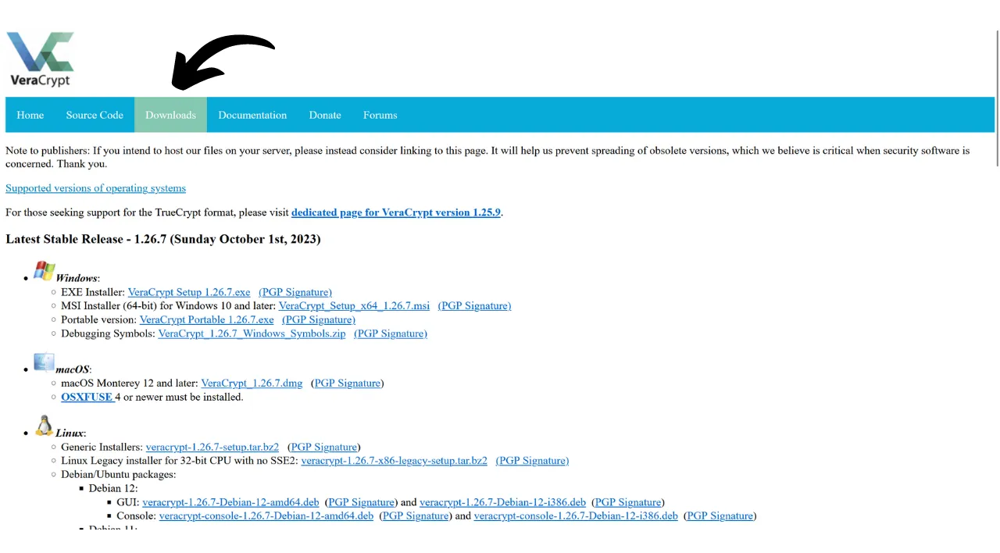

Oggi giorno, è importante implementare una strategia per garantire l'accessibilità, la sicurezza e il backup dei propri file, come documenti personali, foto o progetti importanti. La perdita di questi dati può essere catastrofica.

Per prevenire questi problemi, consiglio di mantenere più backup dei propri file su diversi supporti. Una strategia comunemente utilizzata nell'informatica è la strategia di backup "3-2-1", che garantisce la protezione dei tuoi file:
- **3** copie dei tuoi file;
- Salvate su almeno **2** tipi diversi di supporti;
- Con almeno **1** copia conservata in un luogo esterno.

In altre parole, è consigliabile conservare i propri file in 3 luoghi diversi, utilizzando supporti di natura diversa, come il proprio computer, un disco rigido esterno, una chiavetta USB o un servizio di archiviazione online. E infine, avere una copia esterna significa che si dovrebbe avere un backup conservato fuori dalla propria casa o azienda. Quest'ultimo punto aiuta ad evitare la perdita totale dei propri file in caso di disastri locali come incendi o alluvioni. Una copia esterna, distante dalla propria casa o azienda, garantisce che i propri dati sopravvivranno indipendentemente dai rischi locali.

Per implementare facilmente questa strategia di backup 3-2-1, si può optare per una soluzione di archiviazione online, sincronizzando automaticamente o periodicamente i file dal proprio computer con quelli nel cloud. Tra queste soluzioni di backup online, ci sono ovviamente quelle delle grandi aziende digitali che conoscete: Google Drive, Microsoft OneDrive o Apple iCloud. Tuttavia, queste non sono le migliori soluzioni per proteggere la propria privacy. In un tutorial precedente, vi ho presentato un'alternativa che cripta i vostri documenti per una migliore riservatezza: Proton Drive.

https://planb.network/tutorials/others/proton-drive

Adottando questa strategia di backup locale e cloud, si beneficia già di due tipi diversi di supporti per i propri dati, uno dei quali è esterno. Per completare la strategia 3-2-1, è sufficiente aggiungere una copia aggiuntiva. Quello che consiglio di fare è semplicemente esportare periodicamente i propri dati presenti localmente e sul cloud su un supporto fisico, come una chiavetta USB o un disco rigido esterno. In questo modo, anche se i server della vostra soluzione di archiviazione online vengono distrutti e il vostro computer si guasta simultaneamente, avrete comunque questa terza copia su un supporto esterno per non perdere i vostri dati.

Ma è anche importante pensare alla sicurezza della vostra archiviazione dati per garantire che nessuno, a parte voi o i vostri cari, possa accedervi. Normalmente, sia i dati locali che quelli online sono sicuri. Sul vostro computer, probabilmente avete impostato una password, e i dischi rigidi dei computer moderni sono spesso criptati di default. Riguardo al vostro archivio online (cloud), vi ho mostrato nel tutorial precedente come proteggere il vostro account con una password forte e l'autenticazione a due fattori. Tuttavia, per la vostra terza copia conservata su un supporto fisico, l'unica sicurezza è il suo possesso fisico. Se un ladro riesce a rubare la vostra chiavetta USB o il vostro disco rigido esterno, potrebbe facilmente accedere a tutti i vostri dati.

Per prevenire questo rischio, è consigliabile criptare il proprio supporto fisico. Così, qualsiasi tentativo di accedere ai dati richiederà l'inserimento di una password per decriptare il contenuto. Senza questa password, sarà impossibile accedere ai dati, garantendo la sicurezza dei vostri file personali anche in caso di furto della vostra chiavetta USB o del vostro disco rigido esterno.

In questo tutorial, vi mostrerò come criptare facilmente un supporto di memorizzazione esterno utilizzando VeraCrypt, uno strumento open-source.
## Introduzione a VeraCrypt

VeraCrypt è un software open-source disponibile su Windows, macOS e Linux, che consente di criptare i propri dati in vari modi e su diversi supporti.

Questo software permette la creazione e la manutenzione di volumi criptati al volo, il che significa che i dati vengono automaticamente criptati prima di essere salvati e decriptati prima di essere letti. Questo metodo garantisce che i file rimangano protetti anche in caso di furto del vostro supporto di memorizzazione. VeraCrypt non cripta solo i file, ma anche i nomi dei file, i metadati, le cartelle e persino lo spazio libero sul vostro supporto di memorizzazione.

VeraCrypt può essere utilizzato per criptare file localmente o intere partizioni, inclusi i dischi di sistema. Può anche essere utilizzato per criptare completamente un supporto esterno come una chiavetta USB o un disco come vedremo in questo tutorial.

Un grande vantaggio di VeraCrypt rispetto alle soluzioni proprietarie è che è completamente open source, il che significa che il suo codice può essere verificato da chiunque.

## Come installare VeraCrypt?

Andate sul [sito ufficiale di VeraCrypt](https://www.veracrypt.fr/en/Downloads.html) nella scheda "*Downloads*".

Scaricate la versione adatta al vostro sistema operativo. Se siete su Windows, scegliete "*EXE Installer*".

Scegliete la lingua per la vostra interfaccia.

Accettate i termini della licenza.

Selezionate "*Install*".

Infine, scegliete la cartella dove verrà installato il software, poi cliccate sul pulsante "*Install*".

Attendete il completamento dell'installazione.

L'installazione è terminata.

Se lo desiderate, potete fare una donazione in bitcoin per supportare lo sviluppo di questo strumento open-source.

## Come criptare un dispositivo di memorizzazione con VeraCrypt?

Al primo avvio, arriverete a questa interfaccia:

Per criptare il dispositivo di memorizzazione di vostra scelta, iniziate collegandolo alla vostra macchina. Come vedrete più avanti, il processo di creazione di un nuovo volume criptato su una chiavetta USB o un disco rigido richiederà molto più tempo se il dispositivo contiene già dati che non desiderate cancellare. Pertanto, vi raccomando di utilizzare una chiavetta USB vuota o di svuotare il dispositivo in anticipo per creare il volume criptato, al fine di risparmiare tempo.

Su VeraCrypt, cliccate sulla scheda "*Volumes*".

Poi sul menu "*Create New Volume...*".

Nella nuova finestra che si apre, selezionate l'opzione "*Encrypt a non-system partition/drive*" e cliccate su "*Next*".

Dovrai quindi scegliere tra "*Volume VeraCrypt standard*" e "*Volume VeraCrypt nascosto*". La prima opzione crea un volume crittografato standard sul tuo dispositivo. L'opzione "*Volume VeraCrypt nascosto*" permette di creare un volume nascosto all'interno di un volume VeraCrypt standard. Questo metodo ti consente di negare l'esistenza di questo volume nascosto in caso di coercizione. Ad esempio, se qualcuno ti costringe fisicamente a decrittografare il tuo dispositivo, puoi decrittografare solo la parte standard per soddisfare l'aggressore senza rivelare la parte nascosta. Nel mio esempio, opterò per un volume standard.

Nella pagina successiva, clicca sul pulsante "*Seleziona Dispositivo...*".

Si apre una nuova finestra dove puoi selezionare la partizione del tuo dispositivo di archiviazione dall'elenco dei dischi disponibili sulla tua macchina. Normalmente, la partizione che desideri crittografare sarà elencata sotto una riga intitolata "*Disco Rimovibile N*". Dopo aver selezionato la partizione appropriata, clicca sul pulsante "*OK*".

Il supporto selezionato appare nel riquadro. Ora puoi cliccare sul pulsante "*Avanti*".

Successivamente, dovrai scegliere tra le opzioni "*Crea volume crittografato e formattalo*" o "*Crittografa partizione esistente*". Come accennato in precedenza, la prima opzione cancellerà definitivamente tutti i dati sulla tua chiavetta USB o disco rigido. Scegli questa opzione solo se il tuo dispositivo è vuoto; altrimenti, perderai tutti i dati contenuti. Se desideri mantenere i dati esistenti, puoi trasferirli temporaneamente altrove, scegliere "*Crea volume crittografato e formattalo*" per un processo più veloce che cancella tutto, o optare per "*Crittografa partizione esistente*". Quest'ultima opzione permette di crittografare il volume senza cancellare i dati già presenti, ma il processo sarà molto più lungo. Per questo esempio, dato che la mia chiavetta USB è vuota, seleziono "*Crea volume crittografato e formattalo*", l'opzione che cancella tutto.

Successivamente, avrai l'opzione di scegliere l'algoritmo di crittografia e la funzione hash. A meno che tu non abbia esigenze specifiche, ti consiglio di mantenere le opzioni predefinite. Clicca su "*Avanti*" per continuare.

Assicurati che la dimensione indicata per il tuo volume sia corretta, per crittografare l'intero spazio disponibile sulla chiavetta USB, e non solo una parte. Una volta verificato, clicca su "*Avanti*".

A questo punto, dovrai impostare una password per crittografare e decrittografare il tuo dispositivo. È importante scegliere una password forte per impedire a un attaccante di decrittografare i tuoi contenuti con attacchi di forza bruta. La password dovrebbe essere casuale, il più lunga possibile e includere diversi tipi di caratteri. Ti consiglio di optare per una password casuale di almeno 20 caratteri che includa lettere minuscole, lettere maiuscole, numeri e simboli.

Ti consiglio anche di salvare la tua password in un gestore di password. Questo rende più facile l'accesso ed elimina il rischio di dimenticanza. Per il nostro caso specifico, un gestore di password è preferibile a un supporto cartaceo. Infatti, in caso di furto, anche se il tuo dispositivo di archiviazione potrebbe essere rubato, la password nel gestore non può essere trovata dall'attaccante, il che impedirà l'accesso ai dati. Al contrario, se il tuo gestore di password viene compromesso, l'accesso fisico al dispositivo è comunque necessario per sfruttare la password e accedere ai dati.

Per maggiori informazioni sulla gestione delle password, ti consiglio di scoprire questo altro tutorial completo:
Inserisci la tua password nei 2 campi designati, quindi clicca su "*Avanti*". 
VeraCrypt ti chiederà quindi se prevedi di memorizzare file più grandi di 4 GiB nel volume crittografato. Questa domanda permette al software di selezionare il sistema di file più adatto. Generalmente, viene utilizzato il sistema FAT perché è compatibile con la maggior parte dei sistemi operativi, ma impone un limite massimo di dimensione del file di 4 GiB. Se hai bisogno di gestire file più grandi, puoi optare per il sistema exFAT.

Successivamente, raggiungerai una pagina che ti permette di generare una chiave casuale. Questa chiave è importante, poiché sarà utilizzata per crittografare e decrittografare i tuoi dati. Sarà memorizzata in una sezione specifica del tuo supporto, a sua volta protetta dalla password che hai precedentemente stabilito. Per generare una chiave di crittografia forte, VeraCrypt ha bisogno di entropia. Ecco perché il software ti chiede di muovere casualmente il mouse sulla finestra; questi movimenti sono poi utilizzati per generare la chiave. Continua a muovere il mouse fino a quando l'indicatore di entropia è completamente riempito. Poi, clicca su "*Formatta*" per iniziare a creare il volume crittografato.

Attendi mentre viene eseguita la formattazione. Questo può richiedere molto tempo per volumi grandi.

Riceverai quindi una conferma.

## Come utilizzare un'unità crittografata con VeraCrypt?

Per ora, il tuo supporto è crittografato e quindi non puoi aprirlo. Per decrittografarlo, vai su VeraCrypt.

Seleziona una lettera di unità dall'elenco. Ad esempio, ho scelto "*L:*".

Clicca sul pulsante "*Seleziona Dispositivo...*".

Dall'elenco di tutti i dischi sulla tua macchina, seleziona il volume crittografato sul tuo supporto, poi clicca sul pulsante "*OK*".

Puoi vedere che il tuo volume è ben selezionato.

Clicca sul pulsante "*Monta*".

Inserisci la password scelta durante la creazione del volume, poi clicca su "*OK*".

Puoi vedere che il tuo volume è ora decrittografato e accessibile sulla lettera di unità "*L:*".

Per accedervi, apri l'esplora file e vai all'unità "*L:*" (o un'altra lettera a seconda di quella che hai scelto nei passaggi precedenti). 
Dopo aver aggiunto i tuoi file personali al supporto, per crittografare nuovamente il volume, basta cliccare sul pulsante "*Smonta*".

Il tuo volume non appare più sotto la lettera "*L:*". È quindi crittografato nuovamente.

Ora puoi rimuovere il tuo supporto di memorizzazione.

Congratulazioni, ora hai un supporto crittografato per memorizzare in sicurezza i tuoi dati personali, avendo così una strategia completa 3-2-1 in aggiunta alla copia sul tuo computer e alla tua soluzione di archiviazione online.
Se desideri supportare lo sviluppo di VeraCrypt, puoi anche effettuare una donazione in bitcoin [su questa pagina](https://www.veracrypt.fr/en/Donation.html).