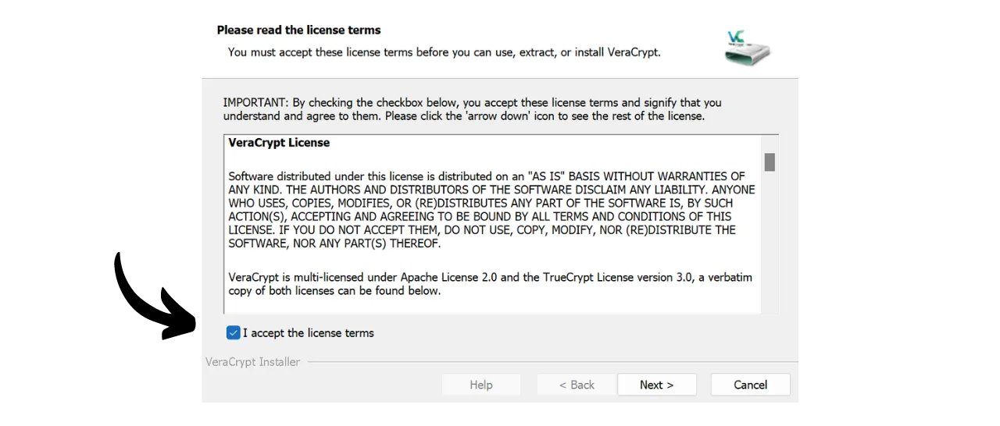
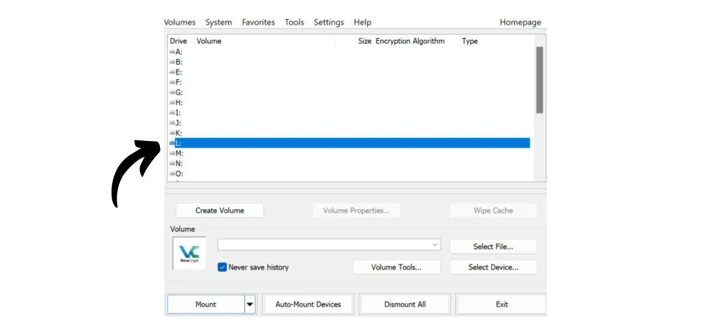

現代では、個人の文書、写真、重要なプロジェクトなどのファイルのアクセシビリティ、セキュリティ、バックアップを確保する戦略を実装することが重要です。これらのデータを失うことは、壊滅的な結果を招く可能性があります。

これらの問題を防ぐために、異なるメディア上にファイルの複数のバックアップを維持することをお勧めします。コンピューティングで一般的に使用される戦略は、「3-2-1」バックアップ戦略であり、ファイルの保護を保証します：
- ファイルの**3**つのコピー；
- 少なくとも**2**種類の異なるメディアに保存される；
- 少なくとも**1**つのコピーはオフサイトに保管される。

言い換えれば、異なる性質のメディアを使用して、3つの異なる場所にファイルを保存することが望ましいです。例えば、あなたのコンピュータ、外付けハードドライブ、USBスティック、またはオンラインストレージサービスなどです。そして最後に、オフサイトにコピーを保持するということは、自宅やビジネスの外にバックアップを保管するべきだということを意味します。この最後の点は、火災や洪水などの地元の災害の場合に、ファイルの全損を避けるのに役立ちます。自宅やビジネスから遠い外部のコピーは、地元のリスクに関係なく、あなたのデータが生き残ることを保証します。

この3-2-1バックアップ戦略を簡単に実装するために、オンラインストレージソリューションを選択できます。これにより、コンピュータのファイルをクラウド内のファイルと自動的または定期的に同期させます。これらのオンラインバックアップソリューションには、Google Drive、Microsoft OneDrive、Apple iCloudなど、あなたが知っている大手デジタル企業からのものがあります。しかし、これらはプライバシーを保護するための最良のソリューションではありません。以前のチュートリアルで、文書を暗号化してより良い機密性を提供する代替手段であるProton Driveを紹介しました。

https://planb.network/tutorials/others/proton-drive

ローカルとクラウドのバックアップ戦略を採用することで、データに対して2種類の異なるメディアを既に利用していることになり、そのうちの1つはオフサイトにあります。3-2-1戦略を完成させるためには、単に追加のコピーを追加する必要があります。私があなたにアドバイスすることは、定期的にローカルおよびクラウドに存在するデータをUSBスティックや外付けハードドライブなどの物理的な媒体にエクスポートすることです。この方法で、オンラインストレージソリューションのサーバーが破壊され、同時にコンピュータが故障したとしても、外部の媒体にこの第三のコピーがあるため、データを失うことはありません。

しかし、あなたやあなたの愛する人以外の誰もがアクセスできないように、データストレージのセキュリティについて考えることも重要です。通常、ローカルおよびオンラインのデータは安全です。コンピュータでは、おそらくパスワードを設定しており、現代のコンピュータのハードドライブはしばしばデフォルトで暗号化されています。オンラインストレージ（クラウド）に関しては、前のチュートリアルで、強力なパスワードと二要素認証でアカウントを保護する方法を示しました。しかし、物理的な媒体に保存された第三のコピーに関しては、その物理的な所持が唯一のセキュリティです。もし泥棒があなたのUSBスティックや外付けハードドライブを盗むことに成功した場合、彼らは簡単にあなたのすべてのデータにアクセスできるでしょう。

このリスクを防ぐために、物理的な媒体を暗号化することが勧められます。このようにして、データにアクセスしようとする任意の試みは、内容を復号するためのパスワードの入力を必要とします。このパスワードなしでは、データにアクセスすることは不可能であり、USBスティックや外付けハードドライブの盗難が発生した場合でも、個人ファイルを安全に保護できます。

このチュートリアルでは、オープンソースツールであるVeraCryptを使用して、外部ストレージメディアを簡単に暗号化する方法をご紹介します。
## VeraCryptの紹介

VeraCryptは、Windows、macOS、Linuxで利用可能なオープンソースソフトウェアで、さまざまな方法とメディアでデータを暗号化することができます。

このソフトウェアは、フライで暗号化されたボリュームの作成と維持を可能にし、つまりデータは保存される前に自動的に暗号化され、読み取られる前に復号化されます。この方法は、ストレージメディアが盗難された場合でもファイルが保護されることを保証します。VeraCryptはファイルだけでなく、ファイル名、メタデータ、フォルダ、さらにはストレージメディアの空き領域まで暗号化します。

VeraCryptは、ローカルファイルやパーティション全体（システムディスクを含む）を暗号化するために使用できます。また、このチュートリアルで見るように、USBスティックやディスクなどの外部メディアを完全に暗号化するためにも使用できます。

VeraCryptの主な利点の一つは、完全にオープンソースであるため、そのコードを誰でも検証できることです。

## VeraCryptのインストール方法

[公式VeraCryptウェブサイト](https://www.veracrypt.fr/en/Downloads.html)の「*Downloads*」タブにアクセスしてください。

お使いのオペレーティングシステムに適したバージョンをダウンロードしてください。Windowsを使用している場合は、「*EXE Installer*」を選択してください。

インターフェースの言語を選択してください。

ライセンスの条件を承諾してください。

「*Install*」を選択してください。

最後に、ソフトウェアをインストールするフォルダを選択し、「*Install*」ボタンをクリックしてください。

インストールが完了するのを待ってください。

インストールが完了しました。

ご希望であれば、このオープンソースツールの開発を支援するためにビットコインで寄付をすることができます。

## VeraCryptでストレージデバイスを暗号化する方法

初めて起動すると、このインターフェースが表示されます：

選択したストレージデバイスを暗号化するには、まずそれをマシンに接続してください。後ほど見るように、デバイスに削除したくないデータが既に含まれている場合、USBスティックやハードドライブに新しい暗号化ボリュームを作成するプロセスははるかに時間がかかります。そのため、時間を節約するために、暗号化ボリュームを作成する前にUSBスティックを空にするか、デバイスを空にすることをお勧めします。

VeraCryptで、「*Volumes*」タブをクリックしてください。

次に、「*Create New Volume...*」メニューをクリックしてください。

開いた新しいウィンドウで、「*Encrypt a non-system partition/drive*」オプションを選択し、「*Next*」をクリックしてください。

次に、「*標準VeraCryptボリューム*」と「*隠しVeraCryptボリューム*」の間で選択する必要があります。最初のオプションは、デバイス上に標準の暗号化ボリュームを作成します。「*隠しVeraCryptボリューム*」オプションでは、標準VeraCryptボリューム内に隠しボリュームを作成することができます。この方法では、強制された場合にこの隠しボリュームの存在を否定することができます。例えば、誰かが物理的にあなたにデバイスの暗号解除を強制した場合、標準部分のみを解除して攻撃者を満足させることができますが、隠し部分は明かさないことができます。私の例では、標準ボリュームを選択します。
次のページで、「*デバイスを選択...*」ボタンをクリックします。

新しいウィンドウが開き、マシンで利用可能なディスクのリストからストレージデバイスのパーティションを選択できます。通常、暗号化したいパーティションは「*取り外し可能ディスクN*」というタイトルの下にリストされます。適切なパーティションを選択した後、「*OK*」ボタンをクリックします。

選択したサポートがボックスに表示されます。「*次へ*」ボタンをクリックすることができます。
次に、「*暗号化ボリュームを作成してフォーマットする*」か「*その場でパーティションを暗号化する*」のオプションを選択する必要があります。前述のように、最初のオプションはUSBスティックまたはハードドライブ上のすべてのデータを永久に削除します。デバイスが空の場合のみこのオプションを選択してください。そうでない場合は、デバイスに含まれるすべてのデータを失うことになります。既存のデータを保持したい場合は、一時的に他の場所にデータを転送し、「*暗号化ボリュームを作成してフォーマットする*」を選択してすべてを消去する速いプロセスを選択するか、または「*その場でパーティションを暗号化する*」を選択できます。この最後のオプションでは、既に存在するデータを消去せずにボリュームを暗号化できますが、プロセスははるかに長くなります。この例では、私のUSBスティックが空なので、「*暗号化ボリュームを作成してフォーマットする*」、すべてを消去するオプションを選択します。

次に、暗号化アルゴリズムとハッシュ関数を選択するオプションがあります。特別なニーズがない限り、デフォルトのオプションを維持することをお勧めします。「*次へ*」をクリックして続行します。

USBスティックの利用可能なスペース全体を暗号化するために、ボリュームのサイズが正しいことを確認してください。確認したら、「*次へ*」をクリックします。

この段階で、デバイスを暗号化および復号化するためのパスワードを設定する必要があります。攻撃者がブルートフォース攻撃でコンテンツを復号化するのを防ぐために、強力なパスワードを選択することが重要です。パスワードはランダムで、できるだけ長く、複数の種類の文字を含むべきです。私は、小文字、大文字、数字、記号を含む少なくとも20文字のランダムなパスワードを選択することをお勧めします。

また、パスワードマネージャーにパスワードを保存することをお勧めします。これにより、アクセスが容易になり、忘れるリスクがなくなります。特定のケースでは、パスワードマネージャーは紙媒体よりも好ましいです。実際、強盗の場合でも、ストレージデバイスが盗まれる可能性がありますが、マネージャー内のパスワードは攻撃者によって見つけられることはなく、データへのアクセスを防ぐことができます。逆に、パスワードマネージャーが侵害された場合でも、デバイスへの物理的アクセスはパスワードを利用してデータにアクセスするために依然として必要です。

パスワードの管理に関する詳細情報については、この他の完全なチュートリアルを発見することをお勧めします：
指定された2つのフィールドにパスワードを入力し、"*次へ*"をクリックしてください。 
VeraCryptは、暗号化されたボリュームに4GiBを超えるファイルを保存する予定があるかどうかを尋ねます。この質問により、ソフトウェアは最も適したファイルシステムを選択できます。一般的に、FATシステムが使用されます。これは、ほとんどのオペレーティングシステムと互換性があるためですが、4GiBという最大ファイルサイズの制限があります。より大きなファイルを管理する必要がある場合は、exFATシステムを選択できます。

次に、ランダムキーを生成するページに進みます。このキーは重要で、データの暗号化と復号に使用されます。これは、以前に設定したパスワードで保護されたメディアの特定のセクションに保存されます。強力な暗号化キーを生成するために、VeraCryptはエントロピーを必要とします。そのため、ソフトウェアはウィンドウ上でマウスをランダムに動かすように求めます。これらの動きはキーを生成するために使用されます。エントロピー計測器が完全に満たされるまでマウスを動かし続けてください。その後、"*フォーマット*"をクリックして暗号化ボリュームの作成を開始します。

フォーマットが完了するのを待ちます。大きなボリュームの場合、長時間かかることがあります。

その後、確認が表示されます。

## VeraCryptで暗号化ドライブを使用する方法は？

現在、あなたのメディアは暗号化されているため、開くことができません。それを復号するには、VeraCryptに移動してください。

リストからドライブ文字を選択します。例えば、私は"*L:*"を選びました。

"*デバイスを選択...*"ボタンをクリックします。

コンピューター上のすべてのディスクのリストから、メディア上の暗号化ボリュームを選択し、"*OK*"ボタンをクリックします。

ボリュームが選択されていることがわかります。

"*マウント*"ボタンをクリックします。

ボリューム作成時に選択したパスワードを入力し、"*OK*"をクリックします。

ボリュームが復号され、ドライブ文字"*L:*"でアクセス可能になったことがわかります。

アクセスするには、ファイルエクスプローラーを開き、"*L:*"ドライブ（または前の手順で選択したものに応じて別の文字）に移動します。 
個人ファイルをメディアに追加した後、ボリュームを再び暗号化するには、単に"*ディスマウント*"ボタンをクリックします。

ボリュームはもはや"*L:*"の文字の下に表示されません。これにより、再び暗号化されます。

これで、ストレージメディアを取り外すことができます。

おめでとうございます。これで、個人データを安全に保存するための暗号化メディアを持つことができ、コンピューター上のコピーとオンラインストレージソリューションに加えて、完全な3-2-1戦略を持つことができました。
VeraCryptの開発を支援したい場合は、[このページ](https://www.veracrypt.fr/en/Donation.html)でビットコインによる寄付もできます。