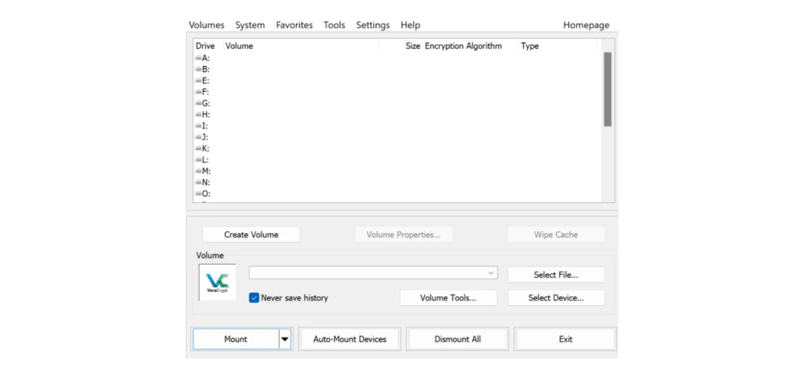

Hoje em dia, é importante implementar uma estratégia para garantir a acessibilidade, segurança e backup dos seus arquivos, como seus documentos pessoais, fotos ou projetos importantes. Perder esses dados pode ser catastrófico.

Para prevenir esses problemas, aconselho você a manter múltiplos backups dos seus arquivos em diferentes mídias. Uma estratégia comumente usada em computação é a estratégia de backup "3-2-1", que garante a proteção dos seus arquivos:
- **3** cópias dos seus arquivos;
- Salvas em pelo menos **2** tipos diferentes de mídia;
- Com pelo menos **1** cópia mantida fora do local.

Em outras palavras, é aconselhável armazenar seus arquivos em 3 locais diferentes, usando mídias de naturezas diferentes, como seu computador, um disco rígido externo, um pendrive ou um serviço de armazenamento online. E, finalmente, ter uma cópia fora do local significa que você deve ter um backup armazenado fora da sua casa ou empresa. Este último ponto ajuda a evitar a perda total dos seus arquivos em caso de desastres locais, como incêndios ou inundações. Uma cópia externa, distante da sua casa ou empresa, garante que seus dados sobreviverão independentemente dos riscos locais.

Para implementar facilmente esta estratégia de backup 3-2-1, você pode optar por uma solução de armazenamento online, sincronizando automaticamente ou periodicamente os arquivos do seu computador com aqueles na sua nuvem. Entre essas soluções de backup online, há obviamente aquelas de grandes empresas digitais que você conhece: Google Drive, Microsoft OneDrive ou Apple iCloud. No entanto, estas não são as melhores soluções para proteger sua privacidade. Em um tutorial anterior, apresentei a você uma alternativa que criptografa seus documentos para melhor confidencialidade: Proton Drive.

https://planb.network/tutorials/others/proton-drive

Ao adotar esta estratégia de backup local e na nuvem, você já beneficia de dois tipos diferentes de mídia para seus dados, um dos quais é fora do local. Para completar a estratégia 3-2-1, você simplesmente precisa adicionar uma cópia adicional. O que aconselho você a fazer é simplesmente exportar periodicamente seus dados presentes localmente e na sua nuvem para um meio físico, como um pendrive ou um disco rígido externo. Desta forma, mesmo que os servidores da sua solução de armazenamento online sejam destruídos e seu computador quebre simultaneamente, você ainda tem essa terceira cópia em um meio externo para não perder seus dados.

Mas também é importante pensar na segurança do seu armazenamento de dados para garantir que ninguém além de você ou seus entes queridos possa acessá-lo. Tanto os dados locais quanto os online são normalmente seguros. No seu computador, você provavelmente configurou uma senha, e os discos rígidos dos computadores modernos são frequentemente criptografados por padrão. Em relação ao seu armazenamento online (nuvem), mostrei no tutorial anterior como proteger sua conta com uma senha forte e autenticação de dois fatores. No entanto, para sua terceira cópia armazenada em um meio físico, a única segurança é a posse física. Se um ladrão conseguir roubar seu pendrive ou seu disco rígido externo, ele poderia facilmente acessar todos os seus dados.

Para prevenir esse risco, é aconselhável criptografar seu meio físico. Assim, qualquer tentativa de acesso aos dados exigirá a entrada de uma senha para descriptografar o conteúdo. Sem essa senha, será impossível acessar os dados, garantindo a segurança dos seus arquivos pessoais mesmo no caso de roubo do seu pendrive ou do seu disco rígido externo.

Neste tutorial, vou mostrar como criptografar facilmente um meio de armazenamento externo usando o VeraCrypt, uma ferramenta de código aberto.
## Introdução ao VeraCrypt

O VeraCrypt é um software de código aberto disponível para Windows, macOS e Linux, que permite criptografar seus dados de várias maneiras e em diferentes meios.

Este software possibilita a criação e manutenção de volumes criptografados em tempo real, significando que seus dados são automaticamente criptografados antes de serem salvos e descriptografados antes de serem lidos. Este método garante que seus arquivos permaneçam protegidos mesmo no caso de roubo do seu meio de armazenamento. O VeraCrypt não apenas criptografa arquivos, mas também nomes de arquivos, metadados, pastas e até o espaço livre no seu meio de armazenamento.

O VeraCrypt pode ser usado para criptografar arquivos localmente ou partições inteiras, incluindo o disco do sistema. Ele também pode ser usado para criptografar completamente um meio externo, como um pendrive ou um disco, como veremos neste tutorial.

Uma grande vantagem do VeraCrypt sobre soluções proprietárias é que ele é totalmente de código aberto, o que significa que seu código pode ser verificado por qualquer pessoa.

## Como instalar o VeraCrypt?

Acesse [o site oficial do VeraCrypt](https://www.veracrypt.fr/en/Downloads.html) na aba "*Downloads*".

Baixe a versão adequada para o seu sistema operacional. Se você estiver no Windows, escolha "*EXE Installer*".

Escolha o idioma para a sua interface.

Aceite os termos da licença.

Selecione "*Instalar*".

Finalmente, escolha a pasta onde o software será instalado e clique no botão "*Instalar*".

Aguarde a conclusão da instalação.

A instalação está concluída.

Se desejar, você pode fazer uma doação em bitcoins para apoiar o desenvolvimento desta ferramenta de código aberto.

## Como criptografar um dispositivo de armazenamento com o VeraCrypt?

Na primeira execução, você chegará a esta interface:

Para criptografar o dispositivo de armazenamento de sua escolha, comece conectando-o à sua máquina. Como veremos mais tarde, o processo de criação de um novo volume criptografado em um pendrive ou em um disco rígido levará muito mais tempo se o dispositivo já contiver dados que você não deseja excluir. Portanto, recomendo usar um pendrive vazio ou esvaziar o dispositivo previamente para criar o volume criptografado, a fim de economizar tempo.

No VeraCrypt, clique na aba "*Volumes*".

Em seguida, no menu "*Criar Novo Volume...*".

Na nova janela que se abre, selecione a opção "*Criptografar uma partição/disco não-sistema*" e clique em "*Próximo*".

Você então terá que escolher entre "*Volume VeraCrypt padrão*" e "*Volume VeraCrypt Oculto*". A primeira opção cria um volume criptografado padrão no seu dispositivo. A opção "*Volume VeraCrypt Oculto*" permite criar um volume oculto dentro de um volume VeraCrypt padrão. Este método permite que você negue a existência deste volume oculto em caso de coerção. Por exemplo, se alguém fisicamente o forçar a descriptografar seu dispositivo, você pode descriptografar apenas a parte padrão para satisfazer o agressor, mas não revelar a parte oculta. No meu exemplo, vou optar por um volume padrão. 
Na página seguinte, clique no botão "*Selecionar Dispositivo...*".

Uma nova janela se abre onde você pode selecionar a partição do seu dispositivo de armazenamento da lista de discos disponíveis na sua máquina. Normalmente, a partição que você deseja criptografar estará listada sob uma linha intitulada "*Disco Removível N*". Após selecionar a partição apropriada, clique no botão "*OK*".

O suporte selecionado aparece na caixa. Agora você pode clicar no botão "*Próximo*". 
Em seguida, você precisará escolher entre as opções "*Criar volume criptografado e formatá-lo*" ou "*Criptografar partição no local*". Como mencionado anteriormente, a primeira opção apagará permanentemente todos os dados no seu pen drive ou disco rígido. Escolha esta opção apenas se o seu dispositivo estiver vazio; caso contrário, você perderá todos os dados que ele contém. Se desejar manter os dados existentes, você pode transferi-los temporariamente para outro lugar, escolher "*Criar volume criptografado e formatá-lo*" para um processo mais rápido que apaga tudo, ou optar por "*Criptografar partição no local*". Esta última opção permite criptografar o volume sem apagar os dados já presentes, mas o processo será muito mais longo. Para este exemplo, como meu pen drive está vazio, seleciono "*Criar volume criptografado e formatá-lo*", a opção que apaga tudo.

Em seguida, você terá a opção de escolher o algoritmo de criptografia e a função hash. A menos que você tenha necessidades específicas, aconselho a manter as opções padrão. Clique em "*Próximo*" para continuar.

Certifique-se de que o tamanho indicado para o seu volume está correto, para criptografar todo o espaço disponível no pen drive, e não apenas uma parte. Uma vez verificado, clique em "*Próximo*".

Nesta etapa, você precisará definir uma senha para criptografar e descriptografar seu dispositivo. É importante escolher uma senha forte para impedir que um atacante descriptografe seu conteúdo com ataques de força bruta. A senha deve ser aleatória, o mais longa possível e incluir vários tipos de caracteres. Aconselho a optar por uma senha aleatória de pelo menos 20 caracteres, incluindo letras minúsculas, letras maiúsculas, números e símbolos.

Também aconselho a salvar sua senha em um gerenciador de senhas. Isso facilita o acesso e elimina o risco de esquecimento. Para o nosso caso específico, um gerenciador de senhas é preferível a um meio em papel. De fato, em caso de roubo, embora seu dispositivo de armazenamento possa ser roubado, a senha no gerenciador não pode ser encontrada pelo atacante, o que impedirá o acesso aos dados. Por outro lado, se o seu gerenciador de senhas for comprometido, ainda será necessário o acesso físico ao dispositivo para explorar a senha e acessar os dados.

Para mais informações sobre gerenciamento de senhas, aconselho a descobrir este outro tutorial completo:
Insira sua senha nos 2 campos designados e, em seguida, clique em "*Next*". 
O VeraCrypt então perguntará se você planeja armazenar arquivos maiores que 4 GiB no volume criptografado. Esta pergunta permite que o software selecione o sistema de arquivos mais adequado. Geralmente, o sistema FAT é usado porque é compatível com a maioria dos sistemas operacionais, mas impõe um limite máximo de tamanho de arquivo de 4 GiB. Se você precisar gerenciar arquivos maiores, pode optar pelo sistema exFAT.

Em seguida, você chegará a uma página que permite gerar uma chave aleatória. Esta chave é importante, pois será usada para criptografar e descriptografar seus dados. Ela será armazenada em uma seção específica do seu meio de armazenamento, ela mesma protegida pela senha que você estabeleceu anteriormente. Para gerar uma chave de criptografia forte, o VeraCrypt precisa de entropia. É por isso que o software pede para você mover o mouse aleatoriamente sobre a janela; esses movimentos são então usados para gerar a chave. Continue movendo o mouse até que o medidor de entropia esteja completamente cheio. Então, clique em "*Format*" para começar a criar o volume criptografado.

Aguarde enquanto a formatação é feita. Isso pode levar muito tempo para volumes grandes.

Você então receberá uma confirmação.

## Como usar um drive criptografado com VeraCrypt?

Por enquanto, seu meio de armazenamento está criptografado e, portanto, você não pode abri-lo. Para descriptografá-lo, vá até o VeraCrypt.

Selecione uma letra de unidade da lista. Por exemplo, eu escolhi "*L:*".

Clique no botão "*Select Device...*".

Da lista de todos os discos em sua máquina, selecione o volume criptografado em seu meio de armazenamento e, em seguida, clique no botão "*OK*".

Você pode ver que seu volume está bem selecionado.

Clique no botão "*Mount*".

Insira a senha escolhida durante a criação do volume e, em seguida, clique em "*OK*".

Você pode ver que seu volume agora está descriptografado e acessível na letra de unidade "*L:*".

Para acessá-lo, abra seu explorador de arquivos e vá para a unidade "*L:*" (ou outra letra, dependendo da que você escolheu nas etapas anteriores). 
Após adicionar seus arquivos pessoais ao meio de armazenamento, para criptografar o volume novamente, basta clicar no botão "*Dismount*".

Seu volume não aparece mais sob a letra "*L:*". Assim, ele está criptografado novamente.

Você pode agora remover seu meio de armazenamento.

Parabéns, você agora possui um meio de armazenamento criptografado para armazenar seus dados pessoais de forma segura, tendo assim uma estratégia completa 3-2-1 além da cópia em seu computador e sua solução de armazenamento online.
Se você deseja apoiar o desenvolvimento do VeraCrypt, também pode fazer uma doação em bitcoins [nesta página](https://www.veracrypt.fr/en/Donation.html).