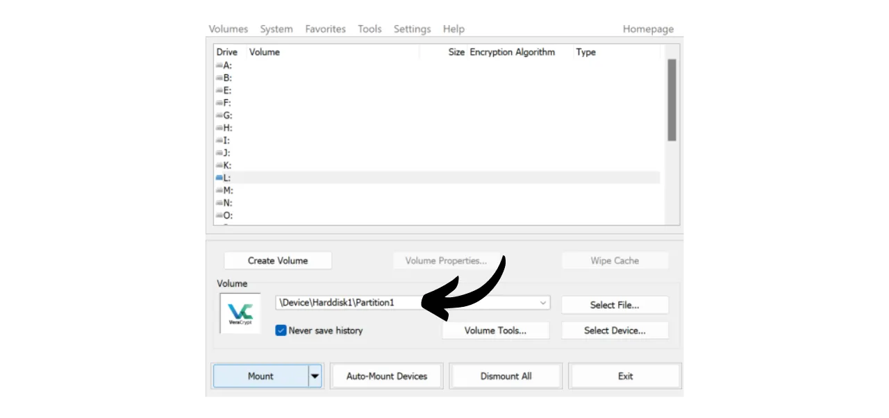

В наше время важно реализовать стратегию, чтобы обеспечить доступность, безопасность и резервное копирование ваших файлов, таких как личные документы, фотографии или важные проекты. Потеря этих данных может быть катастрофической.

Чтобы предотвратить эти проблемы, я советую вам поддерживать несколько резервных копий ваших файлов на разных носителях. Обычно используемая стратегия в информатике - это стратегия резервного копирования "3-2-1", которая обеспечивает защиту ваших файлов:
- **3** копии ваших файлов;
- Сохраненные по крайней мере на **2** разных типах носителей;
- С по меньшей мере **1** копией, хранящейся вне места.

Другими словами, рекомендуется хранить ваши файлы в 3 разных местах, используя носители разной природы, такие как ваш компьютер, внешний жесткий диск, USB-накопитель или онлайн-сервис хранения данных. И, наконец, наличие копии вне места означает, что у вас должна быть резервная копия, хранящаяся вне вашего дома или бизнеса. Этот последний пункт помогает избежать полной потери файлов в случае местных катастроф, таких как пожары или наводнения. Внешняя копия, удаленная от вашего дома или бизнеса, гарантирует, что ваши данные выживут независимо от местных рисков.

Для легкой реализации этой стратегии резервного копирования 3-2-1 вы можете выбрать онлайн-решение для хранения данных, автоматически или периодически синхронизируя файлы с вашего компьютера с теми, что в вашем облаке. Среди этих онлайн-решений для резервного копирования, очевидно, есть те, что предлагают крупные цифровые компании, которые вы знаете: Google Drive, Microsoft OneDrive или Apple iCloud. Однако эти решения не являются лучшими для защиты вашей конфиденциальности. В предыдущем уроке я представил вам альтернативу, которая шифрует ваши документы для лучшей конфиденциальности: Proton Drive.

https://planb.network/tutorials/others/proton-drive

Принимая эту стратегию локального и облачного резервного копирования, вы уже получаете два разных типа носителей для ваших данных, один из которых находится вне места. Чтобы завершить стратегию 3-2-1, вам просто нужно добавить дополнительную копию. Я советую вам просто периодически экспортировать ваши данные, находящиеся локально и в вашем облаке, на физический носитель, например, на USB-накопитель или внешний жесткий диск. Таким образом, даже если серверы вашего онлайн-решения для хранения данных будут уничтожены и ваш компьютер выйдет из строя одновременно, у вас все равно будет эта третья копия на внешнем носителе, чтобы не потерять ваши данные.

Но также важно подумать о безопасности хранения ваших данных, чтобы никто, кроме вас или ваших близких, не мог к ним получить доступ. Как локальные, так и онлайн данные обычно защищены. На вашем компьютере, вероятно, установлен пароль, и жесткие диски современных компьютеров часто шифруются по умолчанию. Что касается вашего онлайн-хранилища (облака), я показал вам в предыдущем уроке, как защитить ваш аккаунт с помощью надежного пароля и двухфакторной аутентификации. Однако для вашей третьей копии, хранящейся на физическом носителе, единственной безопасностью является ее физическое владение. Если вору удастся украсть ваш USB-накопитель или внешний жесткий диск, он сможет легко получить доступ ко всем вашим данным.

Чтобы предотвратить этот риск, рекомендуется зашифровать ваш физический носитель. Таким образом, любая попытка доступа к данным потребует ввода пароля для расшифровки содержимого. Без этого пароля доступ к данным будет невозможен, что обеспечит безопасность ваших личных файлов даже в случае кражи вашего USB-накопителя или внешнего жесткого диска.

В этом руководстве я покажу вам, как легко зашифровать внешний носитель данных с помощью VeraCrypt, инструмента с открытым исходным кодом.
## Введение в VeraCrypt

VeraCrypt — это программное обеспечение с открытым исходным кодом, доступное для Windows, macOS и Linux, которое позволяет шифровать ваши данные различными способами и на разных носителях.

Это программное обеспечение позволяет создавать и поддерживать зашифрованные тома на лету, что означает, что ваши данные автоматически шифруются перед сохранением и расшифровываются перед чтением. Этот метод гарантирует, что ваши файлы останутся защищенными даже в случае кражи вашего носителя данных. VeraCrypt шифрует не только файлы, но и имена файлов, метаданные, папки и даже свободное пространство на вашем носителе данных.

VeraCrypt можно использовать для шифрования файлов локально или целых разделов, включая системный диск. Также его можно использовать для полного шифрования внешнего носителя, такого как USB-накопитель или диск, как мы увидим в этом руководстве.

Одним из основных преимуществ VeraCrypt перед проприетарными решениями является то, что он полностью открытый, что означает, что его код может быть проверен любым желающим.

## Как установить VeraCrypt?

Перейдите на [официальный сайт VeraCrypt](https://www.veracrypt.fr/en/Downloads.html) на вкладку "*Downloads*".

Скачайте версию, подходящую для вашей операционной системы. Если вы используете Windows, выберите "*EXE Installer*".

Выберите язык интерфейса.

Примите условия лицензии.

Выберите "*Install*".

Наконец, выберите папку, в которую будет установлено программное обеспечение, затем нажмите на кнопку "*Install*".

Дождитесь завершения установки.

Установка завершена.

Если желаете, вы можете сделать пожертвование в биткоинах, чтобы поддержать разработку этого инструмента с открытым исходным кодом.

## Как зашифровать носитель данных с помощью VeraCrypt?

При первом запуске вы увидите следующий интерфейс:

Чтобы зашифровать выбранный носитель данных, сначала подключите его к вашему компьютеру. Как вы увидите далее, процесс создания нового зашифрованного тома на USB-накопителе или жестком диске займет гораздо больше времени, если на устройстве уже есть данные, которые вы не хотите удалять. Поэтому я рекомендую использовать пустой USB-накопитель или предварительно очистить устройство для создания зашифрованного тома, чтобы сэкономить время.

В VeraCrypt нажмите на вкладку "*Volumes*".

Затем выберите меню "*Create New Volume...*".

В открывшемся новом окне выберите опцию "*Encrypt a non-system partition/drive*" и нажмите "*Next*".

Затем вам придется выбрать между "*Стандартным томом VeraCrypt*" и "*Скрытым томом VeraCrypt*". Первый вариант создает стандартный зашифрованный том на вашем устройстве. Вариант "*Скрытый том VeraCrypt*" позволяет создать скрытый том внутри стандартного тома VeraCrypt. Этот метод позволяет вам отрицать существование этого скрытого тома в случае принуждения. Например, если кто-то физически заставляет вас расшифровать ваше устройство, вы можете расшифровать только стандартную часть, чтобы удовлетворить агрессора, но не раскрывать скрытую часть. В моем примере я остановлюсь на стандартном томе. 
На следующей странице нажмите кнопку "*Выбрать устройство...*".

Откроется новое окно, где вы можете выбрать раздел вашего устройства хранения из списка доступных на вашем компьютере дисков. Обычно, раздел, который вы хотите зашифровать, будет указан под надписью "*Съемный диск N*". После выбора соответствующего раздела нажмите кнопку "*ОК*".

Выбранный носитель появится в окне. Теперь вы можете нажать кнопку "*Далее*". 
Далее, вам нужно будет выбрать между опциями "*Создать зашифрованный том и отформатировать его*" или "*Зашифровать раздел на месте*". Как было сказано ранее, первый вариант навсегда удалит все данные на вашей флешке или жестком диске. Выбирайте этот вариант только если ваше устройство пустое; в противном случае вы потеряете все данные, которые оно содержит. Если вы хотите сохранить существующие данные, вы можете временно перенести их в другое место, выбрать "*Создать зашифрованный том и отформатировать его*" для более быстрого процесса, который стирает все, или выбрать "*Зашифровать раздел на месте*". Этот последний вариант позволяет зашифровать том без стирания уже присутствующих данных, но процесс будет гораздо дольше. В этом примере, так как моя флешка пуста, я выбираю "*Создать зашифрованный том и отформатировать его*", вариант, который стирает все.

Далее, у вас будет возможность выбрать алгоритм шифрования и хеш-функцию. Если у вас нет специфических потребностей, я советую оставить настройки по умолчанию. Нажмите "*Далее*", чтобы продолжить.

Убедитесь, что указанный размер вашего тома корректен, чтобы зашифровать весь доступный объем на флешке, а не только его часть. После проверки нажмите "*Далее*".

На этом этапе вам нужно будет установить пароль для шифрования и расшифровки вашего устройства. Важно выбрать надежный пароль, чтобы предотвратить возможность его подбора атакующим с помощью методов грубой силы. Пароль должен быть случайным, как можно более длинным и включать несколько типов символов. Я советую выбрать случайный пароль длиной не менее 20 символов, включающий строчные буквы, заглавные буквы, цифры и символы.

Я также советую сохранить ваш пароль в менеджере паролей. Это облегчает доступ и исключает риск его забыть. Для нашего конкретного случая менеджер паролей предпочтительнее бумажного носителя. Действительно, в случае взлома, хотя ваше устройство хранения может быть украдено, пароль в менеджере не может быть найден атакующим, что предотвратит доступ к данным. Напротив, если ваш менеджер паролей скомпрометирован, физический доступ к устройству все еще необходим для использования пароля и доступа к данным.

Для получения дополнительной информации о управлении паролями, я советую вам ознакомиться с этим другим полным руководством:
Введите свой пароль в два предназначенных поля, затем нажмите на "*Далее*". 
После этого VeraCrypt спросит вас, планируете ли вы хранить файлы размером более 4 ГиБ в зашифрованном томе. Этот вопрос позволяет программному обеспечению выбрать наиболее подходящую файловую систему. Обычно используется система FAT, так как она совместима с большинством операционных систем, но она накладывает максимальный лимит размера файла в 4 ГиБ. Если вам нужно управлять более крупными файлами, вы можете выбрать систему exFAT.

Далее вы перейдете на страницу, которая позволяет сгенерировать случайный ключ. Этот ключ важен, так как он будет использоваться для шифрования и дешифрования ваших данных. Он будет храниться в определенном разделе вашего носителя, который, в свою очередь, защищен паролем, установленным ранее. Для генерации надежного ключа шифрования VeraCrypt требуется энтропия. Вот почему программное обеспечение просит вас случайным образом перемещать мышь по окну; эти движения затем используются для генерации ключа. Продолжайте перемещать мышь, пока индикатор энтропии полностью не заполнится. Затем нажмите на "*Форматировать*", чтобы начать создание зашифрованного тома.

Ожидайте, пока идет форматирование. Это может занять много времени для больших объемов.

Затем вы получите подтверждение.

## Как использовать зашифрованный диск с VeraCrypt?

На данный момент ваш носитель зашифрован, и поэтому вы не можете его открыть. Чтобы расшифровать его, перейдите в VeraCrypt.

Выберите букву диска из списка. Например, я выбрал "*L:*".

Нажмите на кнопку "*Выбрать устройство...*".

Из списка всех дисков на вашем компьютере выберите зашифрованный том на вашем носителе, затем нажмите на кнопку "*ОК*".

Вы можете видеть, что ваш том правильно выбран.

Нажмите на кнопку "*Монтировать*".

Введите пароль, выбранный во время создания тома, затем нажмите на "*ОК*".

Вы можете видеть, что ваш том теперь расшифрован и доступен на диске с буквой "*L:*".

Чтобы получить к нему доступ, откройте проводник файлов и перейдите на диск "*L:*" (или другую букву в зависимости от той, которую вы выбрали на предыдущих этапах). 
После добавления ваших личных файлов на носитель, чтобы снова зашифровать том, просто нажмите на кнопку "*Размонтировать*".

Ваш том больше не отображается под буквой "*L:*". Таким образом, он снова зашифрован.

Теперь вы можете извлечь ваш носитель информации.

Поздравляем, теперь у вас есть зашифрованный носитель для безопасного хранения ваших личных данных, что является дополнением к полной стратегии 3-2-1 в дополнение к копии на вашем компьютере и вашему решению для онлайн-хранения.
Если вы хотите поддержать разработку VeraCrypt, вы также можете сделать пожертвование в биткойнах [на этой странице](https://www.veracrypt.fr/en/Donation.html).