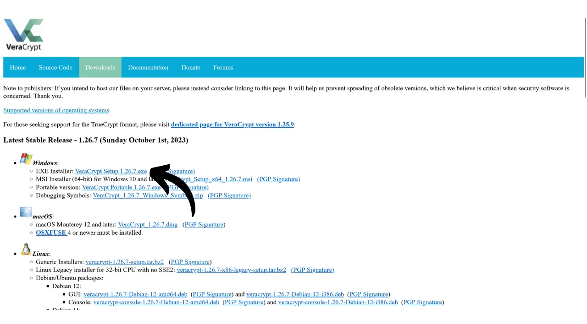
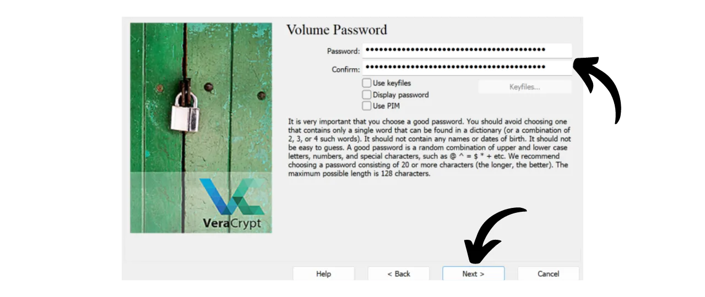
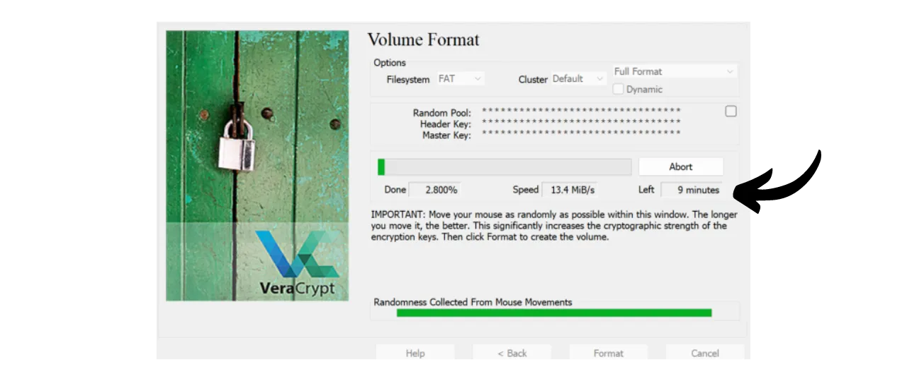
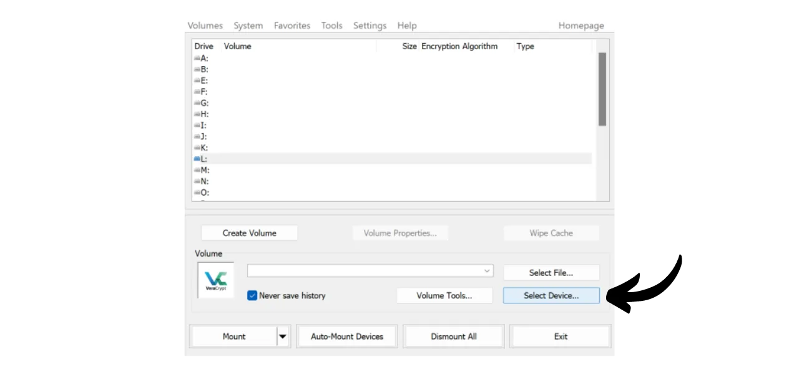
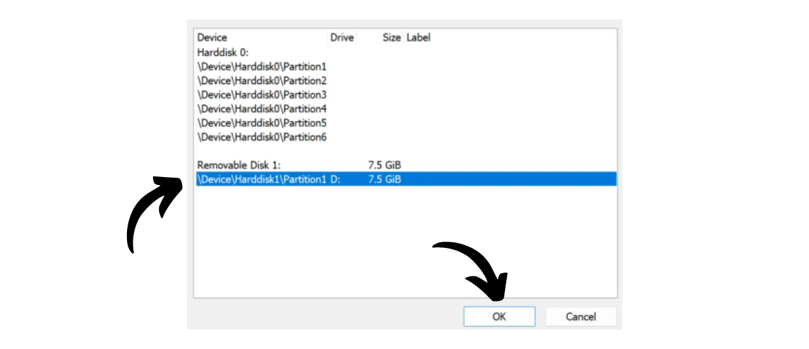

如今，实施策略以确保您的文件（如个人文档、照片或重要项目）的可访问性、安全性和备份非常重要。丢失这些数据可能是灾难性的。

为了预防这些问题，我建议您在不同的媒介上保持文件的多重备份。在计算中常用的策略是“3-2-1”备份策略，它确保了您文件的保护：
- **3**份您的文件副本；
- 保存在至少**2**种不同类型的媒介上；
- 至少**1**份副本存放在异地。

换句话说，建议您在3个不同的位置存储文件，使用不同性质的媒介，如您的电脑、外置硬盘、USB闪存盘或在线存储服务。最后，拥有一个异地副本意味着您应该在家庭或企业之外存储一个备份。这最后一点有助于避免本地灾害（如火灾或洪水）导致文件的全面丢失。一个远离您的家庭或企业的外部副本，确保您的数据能够独立于本地风险而存活。

要轻松实施这一3-2-1备份策略，您可以选择在线存储解决方案，通过自动或定期同步您的电脑文件与云中的文件。在这些在线备份解决方案中，显然有来自您所知道的大型数字公司的解决方案：Google Drive、Microsoft OneDrive或Apple iCloud。然而，这些并不是保护您隐私的最佳解决方案。在之前的教程中，我向您介绍了一个加密您的文档以更好保护机密性的替代方案：Proton Drive。

https://planb.network/tutorials/others/proton-drive

通过采用本地和云备份的策略，您已经从两种不同类型的媒介中受益于您的数据，其中一个是异地的。要完成3-2-1策略，您只需添加一个额外的副本。我建议您做的就是定期将本地和云中的数据导出到物理介质，如USB闪存盘或外置硬盘。这样，即使您的在线存储解决方案的服务器被摧毁且您的电脑同时出现故障，您仍然拥有这第三份副本在外部介质上，以免丢失数据。

但是，考虑到数据存储的安全性也很重要，以确保除您或您的亲人之外，没有人可以访问它。通常情况下，本地和在线数据都是安全的。在您的电脑上，您可能已经设置了密码，而现代电脑的硬盘通常默认加密。关于您的在线存储（云），我在之前的教程中向您展示了如何用强密码和两因素认证来保护您的账户。然而，对于存储在物理介质上的第三份副本，唯一的安全保障是其物理占有。如果窃贼设法偷走了您的USB闪存盘或外置硬盘，他们可以轻松访问所有数据。

为了防止这种风险，建议加密您的物理介质。因此，任何试图访问数据的尝试都将需要输入密码来解密内容。没有这个密码，就无法访问数据，即使是在您的USB闪存盘或外置硬盘被盗的情况下，也能保护您的个人文件安全。

在本教程中，我将向您展示如何使用VeraCrypt这一开源工具轻松加密外部存储介质。
## VeraCrypt简介

VeraCrypt是一款可在Windows、macOS和Linux上使用的开源软件，它允许您以多种方式对数据进行加密，并适用于不同的介质。

该软件支持即时创建和维护加密卷，这意味着您的数据在保存前自动加密，并在读取前解密。这种方法确保了即使存储介质被盗，您的文件也仍然受到保护。VeraCrypt不仅可以加密文件，还可以加密文件名、元数据、文件夹，甚至是存储介质上的空闲空间。

VeraCrypt可以用来加密本地文件或整个分区，包括系统盘。它还可以用来完全加密外部介质，如USB闪存盘或硬盘，正如我们在本教程中将看到的。

VeraCrypt相对于专有解决方案的一个主要优势是它完全开源，这意味着任何人都可以验证其代码。

## 如何安装VeraCrypt？

访问[官方VeraCrypt网站](https://www.veracrypt.fr/en/Downloads.html)的“*Downloads*”标签页。

下载适用于您操作系统的版本。如果您使用的是Windows，选择“*EXE Installer*”。

选择您界面的语言。

接受许可协议的条款。

选择“*Install*”。

最后，选择软件将要安装的文件夹，然后点击“*Install*”按钮。

等待安装完成。

安装完成。

如果您愿意，可以通过比特币捐赠以支持这一开源工具的开发。

## 如何使用VeraCrypt加密存储设备？

首次启动时，您将看到这个界面：

要加密您选择的存储设备，请首先将其连接到您的机器。正如您稍后将看到的，如果设备已经包含您不希望删除的数据，那么在USB闪存盘或硬盘上创建新的加密卷的过程将会花费更长的时间。因此，我建议使用空白的USB闪存盘或事先清空设备来创建加密卷，以节省时间。

在VeraCrypt上，点击“*Volumes*”标签页。

然后点击“*Create New Volume...*”菜单。

在打开的新窗口中，选择“*Encrypt a non-system partition/drive*”选项，然后点击“*Next*”。

接下来，您需要在“*标准VeraCrypt卷*”和“*隐藏VeraCrypt卷*”之间做出选择。第一个选项在您的设备上创建一个标准的加密卷。“*隐藏VeraCrypt卷*”选项允许在标准VeraCrypt卷内创建一个隐藏卷。这种方法使您能够在受到胁迫的情况下否认这个隐藏卷的存在。例如，如果有人身体上强迫您解密您的设备，您可以只解密标准部分以满足攻击者，但不泄露隐藏部分。在我的例子中，我将坚持使用标准卷。
在接下来的页面上，点击“*选择设备...*”按钮。

一个新窗口打开，您可以从列表中选择您存储设备的分区。通常，您希望加密的分区将在标题为“*可移动磁盘N*”的行下列出。选择适当的分区后，点击“*确定*”按钮。

选定的支持出现在框中。您现在可以点击“*下一步*”按钮。
接下来，您需要在“*创建加密卷并格式化*”或“*就地加密分区*”选项之间选择。如前所述，第一个选项将永久删除您的USB闪存盘或硬盘上的所有数据。只有当您的设备为空时才选择此选项；否则，您将丢失其包含的所有数据。如果您希望保留现有数据，您可以临时将其转移至其他地方，选择“*创建加密卷并格式化*”进行更快的过程，该过程会擦除一切，或选择“*就地加密分区*”。这最后一个选项允许在不擦除已存在数据的情况下加密卷，但这个过程将会更长。在这个例子中，由于我的USB闪存盘是空的，我选择“*创建加密卷并格式化*”，这个选项会擦除一切。

接下来，您将有机会选择加密算法和哈希函数。除非您有特定的需求，我建议您保持默认选项。点击“*下一步*”继续。

确保您的卷大小指示正确，以加密USB闪存盘上的全部可用空间，而不仅仅是一部分。验证后，点击“*下一步*”。

在这个阶段，您需要设置一个密码来加密和解密您的设备。选择一个强密码很重要，以防止攻击者通过暴力攻击解密您的内容。密码应该是随机的，尽可能长，并包括几种类型的字符。我建议您选择一个至少包含小写字母、大写字母、数字和符号的随机密码，长度至少20个字符。

我还建议您在密码管理器中保存您的密码。这样更容易访问，并消除了忘记的风险。对于我们的特定情况，密码管理器比纸质介质更可取。实际上，在发生入室盗窃的情况下，尽管您的存储设备可能被盗，但攻击者无法在密码管理器中找到密码，这将阻止访问数据。相反，如果您的密码管理器被泄露，仍然需要物理访问设备才能利用密码并访问数据。

有关管理密码的更多信息，我建议您查看这个完整的教程：
在两个指定的字段中输入您的密码，然后点击“*下一步*”。 
VeraCrypt接下来会询问您是否计划在加密卷中存储大于4 GiB的文件。这个问题让软件选择最适合的文件系统。通常情况下，会使用FAT系统，因为它与大多数操作系统兼容，但它对文件大小有4 GiB的最大限制。如果您需要管理更大的文件，可以选择exFAT系统。

接下来，您将进入一个页面，允许您生成一个随机密钥。这个密钥很重要，因为它将用于加密和解密您的数据。它将被存储在您的媒介的一个特定部分，该部分本身通过您之前设定的密码保护。为了生成一个强加密密钥，VeraCrypt需要熵。这就是为什么软件要求您在窗口上随机移动鼠标；这些移动然后被用来生成密钥。继续移动鼠标，直到熵量表完全填满。然后，点击“*格式化*”开始创建加密卷。

等待格式化完成。对于大容量来说，这可能需要很长时间。

然后，您将收到一个确认。

## 如何使用VeraCrypt加密驱动器？

目前，您的媒介已经加密，因此您无法打开它。要解密它，请转到VeraCrypt。

从列表中选择一个驱动器字母。例如，我选择了“*L:*”。

点击“*选择设备...*”按钮。

从您机器上所有磁盘的列表中，选择您媒介上的加密卷，然后点击“*确定*”按钮。

您可以看到您的卷已经被正确选择。

点击“*挂载*”按钮。

输入在创建卷时选择的密码，然后点击“*确定*”。

您可以看到您的卷现在已经解密并且可以在驱动器字母“*L:*”上访问。

要访问它，请打开您的文件资源管理器并转到“*L:*”驱动器（或根据您在前面的步骤中选择的其他字母）。 
在向媒介添加个人文件后，要再次加密卷，只需点击“*卸载*”按钮。

您的卷不再出现在字母“*L:*”下。因此，它再次被加密。

您现在可以移除您的存储媒介了。

恭喜您，您现在拥有一个加密的媒介，可以安全地存储您的个人数据，从而在您的电脑和在线存储解决方案的副本之外，拥有一个完整的3-2-1策略。
如果您希望支持VeraCrypt的开发，您也可以在[这个页面](https://www.veracrypt.fr/en/Donation.html)上用比特币进行捐赠。