Trước khi làm theo hướng dẫn này để thêm hướng dẫn mới, bạn phải hoàn thành một số bước sơ bộ. Nếu bạn chưa làm như vậy, tôi mời bạn tham khảo hướng dẫn giới thiệu này trước, sau đó quay lại đây:

https://planb.network/tutorials/others/contribution/write-tutorials-4d142a6a-9127-4ffb-9e0a-5aba29f169e2
Bạn đã có:


- Chọn chủ đề cho bài hướng dẫn của bạn;
- Đã liên hệ với nhóm Plan ₿ Network qua [nhóm Telegram](https://t.me/PlanBNetwork_ContentBuilder) hoặc paolo@planb.network;
- Chọn công cụ đóng góp của bạn.

Trong hướng dẫn này, chúng ta sẽ xem cách thêm hướng dẫn của bạn vào Plan ₿ Network bằng cách thiết lập môi trường cục bộ của bạn với GitHub Desktop. Nếu bạn đã thành thạo với Git, hướng dẫn rất chi tiết này có thể không cần thiết đối với bạn. Tôi khuyên bạn nên tham khảo hướng dẫn khác này, trong đó tôi chỉ trình bày các hướng dẫn chính, không có hướng dẫn từng bước chi tiết:


- Người dùng có kinh nghiệm**:

https://planb.network/tutorials/others/contribution/write-tutorials-git-expert-0ce1e490-c28f-4c51-b7e0-9a6ac9728410
Nếu bạn không muốn thiết lập môi trường cục bộ, hãy làm theo hướng dẫn này dành cho người mới bắt đầu, trong đó chúng tôi thực hiện các thay đổi trực tiếp thông qua giao diện web của GitHub:


- Người mới bắt đầu (giao diện web)**:

https://planb.network/tutorials/others/contribution/write-tutorials-github-web-beginner-e64f8fed-4c0b-4225-9ebb-7fc5f1c01a79
## Điều kiện tiên quyết

Software required to follow this tutorial:


- [Máy tính để bàn GitHub](https://desktop.github.com/);
- Trình chỉnh sửa tệp markdown như [Obsidian](https://obsidian.md/);
- Trình soạn thảo mã ([VSC](https://code.visualstudio.com/) hoặc [Sublime Text](https://www.sublimetext.com/)).


Điều kiện tiên quyết trước khi bắt đầu hướng dẫn:


- Have a [GitHub account](https://github.com/signup);
- Có một nhánh của [Kho lưu trữ nguồn Plan ₿ Network](https://github.com/PlanB-Network/bitcoin-educational-content);
- Có [hồ sơ giáo sư trên Plan₿ Network](https://planb.network/professors) (chỉ khi bạn đề xuất một bài hướng dẫn đầy đủ).

Nếu bạn cần trợ giúp để đạt được các điều kiện tiên quyết này, các hướng dẫn khác của tôi sẽ hỗ trợ bạn:

https://planb.network/tutorials/others/contribution/basics-of-github-471f7f00-8b5a-4b63-abb1-f1528b032bbb
Khi mọi thứ đã sẵn sàng và môi trường cục bộ của bạn được thiết lập đúng cách với nhánh Plan ₿ Network của riêng bạn, bạn có thể bắt đầu thêm phần hướng dẫn.

## 1 - Tạo một nhánh mới

Mở trình duyệt của bạn và đi đến trang fork của bạn trong kho lưu trữ Plan ₿ Network. Đây là fork bạn đã thiết lập trên GitHub. URL của fork của bạn sẽ trông giống như sau: `https://github.com/[your-username]/bitcoin-educational-content`:

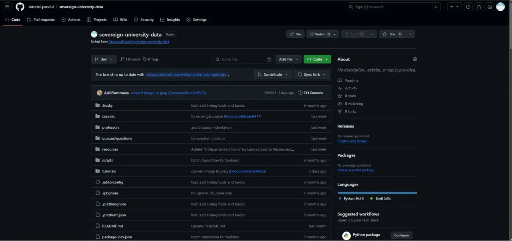

Đảm bảo bạn đang ở nhánh chính `dev` sau đó nhấp vào nút `Sync fork`. Nếu nhánh của bạn chưa được cập nhật, GitHub sẽ đề nghị cập nhật nhánh của bạn. Tiến hành cập nhật này. Ngược lại, nếu nhánh của bạn đã được cập nhật, GitHub sẽ thông báo cho bạn:

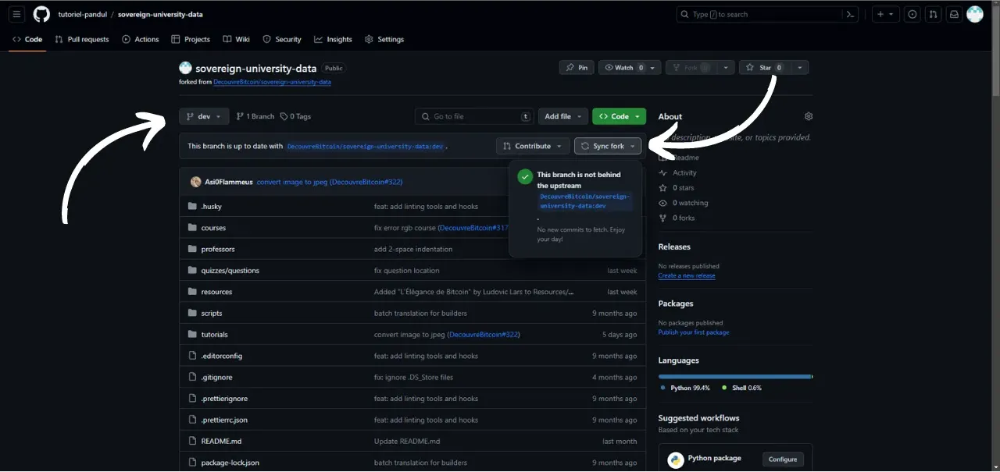

Mở phần mềm GitHub Desktop và đảm bảo rằng nhánh của bạn được chọn đúng ở góc trên bên trái của cửa sổ:

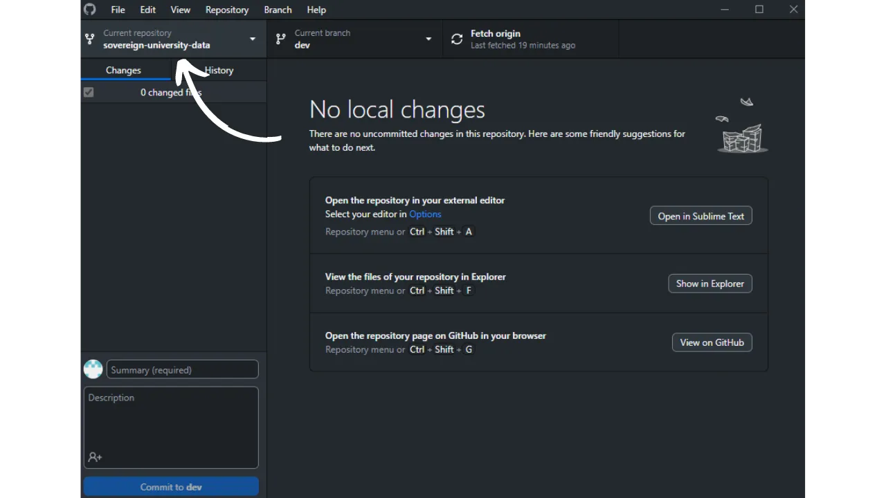

Nhấp vào nút `Fetch origin`. Nếu kho lưu trữ cục bộ của bạn đã được cập nhật, GitHub Desktop sẽ không đề xuất bất kỳ hành động bổ sung nào. Nếu không, tùy chọn `Pull origin` sẽ xuất hiện. Nhấp vào nút này để cập nhật kho lưu trữ cục bộ của bạn:

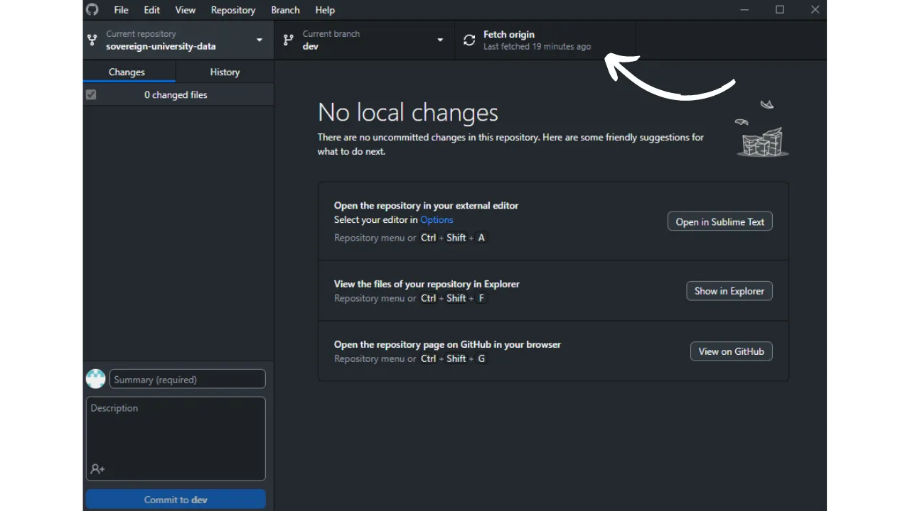

Xác minh rằng bạn thực sự đang ở nhánh chính `dev`:

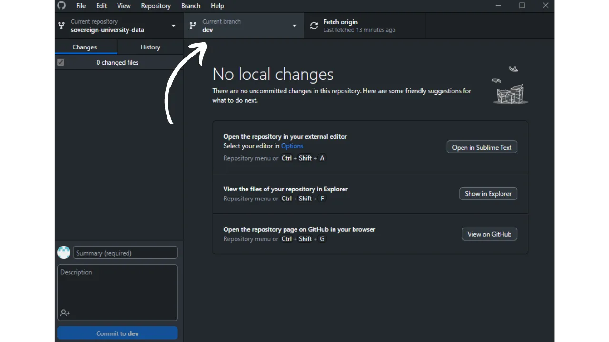

Nhấp vào nhánh này, sau đó nhấp vào nút `Nhánh mới`:

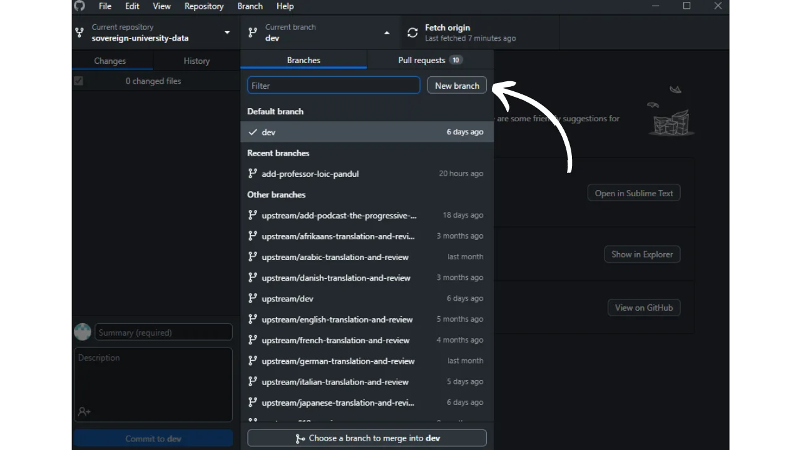

Đảm bảo rằng nhánh mới dựa trên kho lưu trữ nguồn, cụ thể là `PlanB-Network/bitcoin-educational-content`.

Đặt tên cho nhánh của bạn theo cách mà tiêu đề nêu rõ mục đích của nó, sử dụng dấu gạch ngang để phân tách từng từ. Ví dụ, giả sử mục tiêu của chúng ta là viết hướng dẫn sử dụng phần mềm Sparrow Wallet. Trong trường hợp này, nhánh làm việc dành riêng để viết hướng dẫn này có thể được đặt tên là: `tuto-sparrow-wallet-loic`. Sau khi nhập tên phù hợp, hãy nhấp vào `Create branch` để xác nhận việc tạo nhánh:

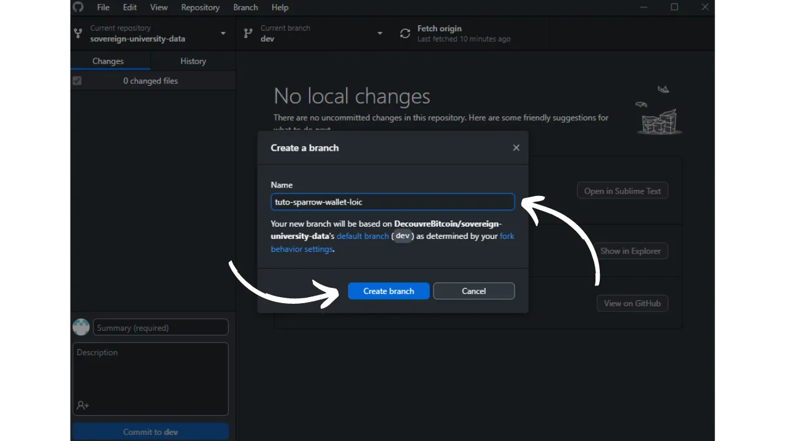

Bây giờ hãy nhấp vào nút `Publish branch` để lưu nhánh làm việc mới của bạn vào nhánh trực tuyến trên GitHub:

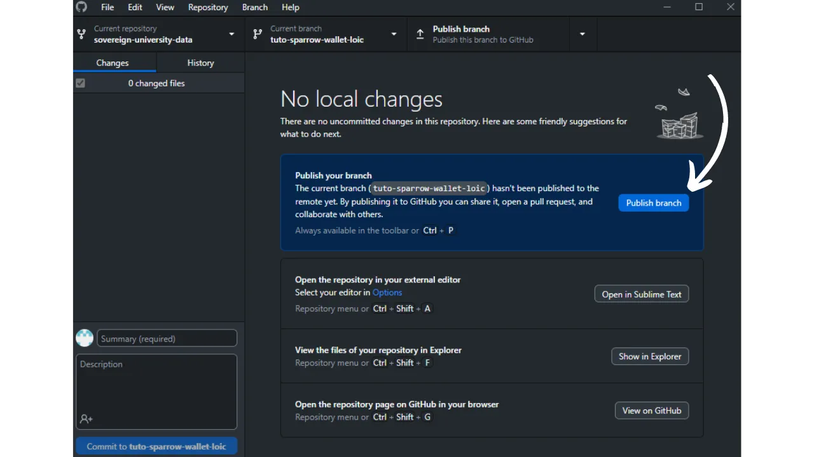

Bây giờ, trên GitHub Desktop, bạn sẽ thấy mình đang ở nhánh mới. Điều này có nghĩa là mọi thay đổi được thực hiện cục bộ trên máy tính của bạn sẽ được lưu riêng trên nhánh cụ thể này. Ngoài ra, miễn là nhánh này vẫn được chọn trên GitHub Desktop, các tệp hiển thị cục bộ trên máy của bạn sẽ tương ứng với các tệp của nhánh này (`tuto-sparrow-wallet-loic`), chứ không phải các tệp của nhánh chính (`dev`).

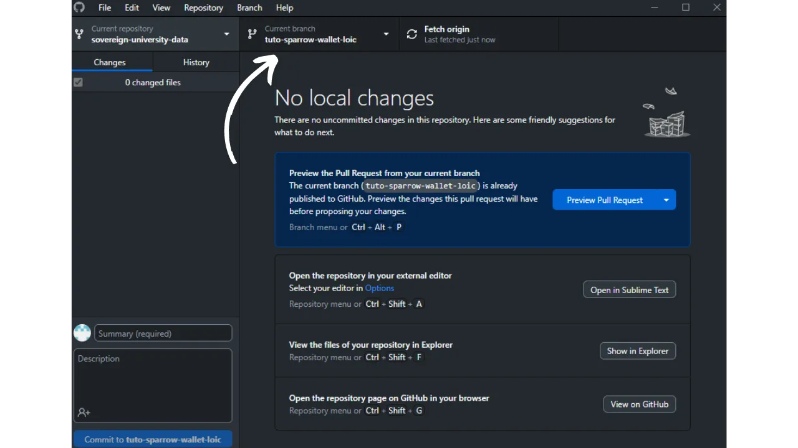

Đối với mỗi bài viết mới mà bạn muốn xuất bản, bạn sẽ cần tạo một nhánh mới từ `dev`. Nhánh trong Git là phiên bản song song của dự án, cho phép bạn thực hiện các thay đổi mà không ảnh hưởng đến nhánh chính, cho đến khi công việc sẵn sàng để hợp nhất.

## 2 - Thêm các tập tin hướng dẫn

Bây giờ nhánh làm việc đã được tạo, đã đến lúc tích hợp hướng dẫn mới của bạn. Bạn có hai lựa chọn: sử dụng tập lệnh Python của tôi, tự động tạo các tài liệu cần thiết hoặc tạo thủ công từng tệp. Chúng ta sẽ xem xét các bước cần thực hiện cho từng tùy chọn.

### Với tập lệnh Python của tôi

Bạn cần cài đặt trên máy của mình:
- Python 3.8 hoặc cao hơn.

Để sử dụng tập lệnh, hãy điều hướng đến thư mục nơi nó được lưu trữ. Tập lệnh này nằm trong kho dữ liệu của Plan ₿ Network tại đường dẫn: `bitcoin-educational-content/scripts/tutorial-related/data-creator`.

Sau khi vào thư mục, cài đặt các gói phụ thuộc:

```bash
pip install -r requirements.txt
```

Sau đó, khởi chạy phần mềm bằng lệnh:

```bash
python3 main.py
```

Một giao diện đồ họa người dùng (GUI) sẽ mở ra. Lần đầu tiên sử dụng, bạn cần nhập tất cả các thông tin cần thiết, nhưng trong các lần sử dụng sau, tập lệnh sẽ ghi nhớ thông tin cá nhân của bạn, giúp bạn không cần phải nhập lại.

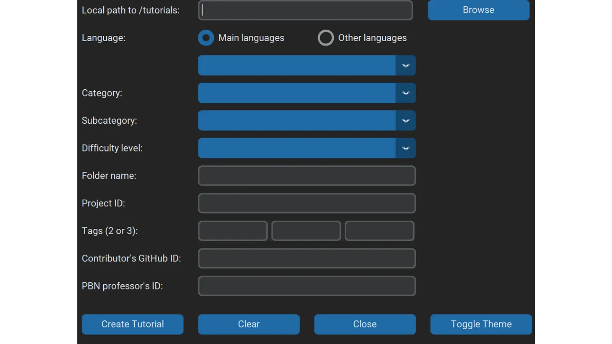

Bắt đầu bằng cách nhập đường dẫn cục bộ đến thư mục `/tutorials` trong kho lưu trữ bạn đã sao chép (`.../bitcoin-educational-content/tutorials/`). Bạn có thể nhập thủ công hoặc nhấp vào nút "Browse" để duyệt qua trình quản lý tệp của mình.

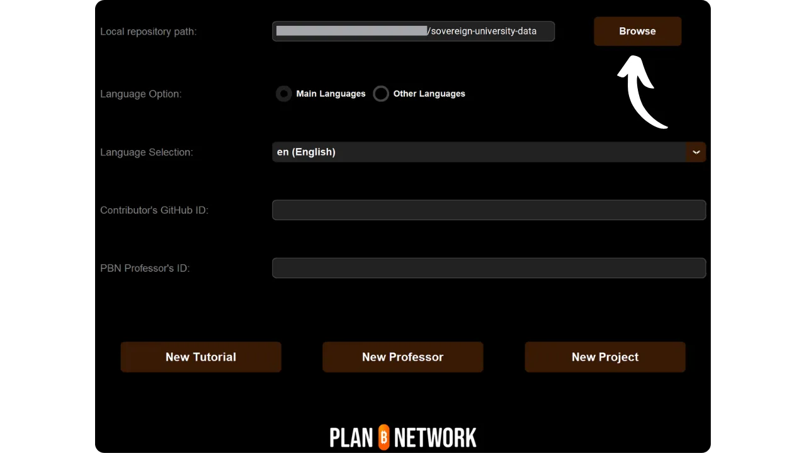

Chọn ngôn ngữ bạn sẽ sử dụng để viết hướng dẫn của mình.

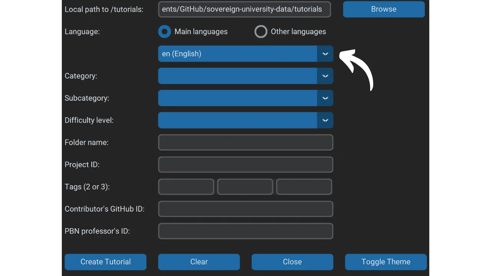

Trong ô "Contributor's GitHub ID", nhập tên người dùng GitHub của bạn.

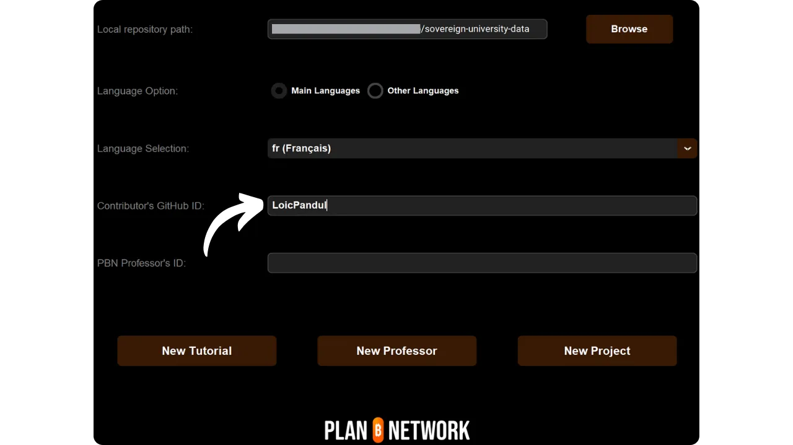

Trong ô "PBN professor's ID", nhập ID của bạn bằng cách sử dụng các từ trong danh sách BIP39, như hiển thị trên [hồ sơ giáo sư của bạn](https://github.com/PlanB-Network/bitcoin-educational-content/tree/dev/professors).

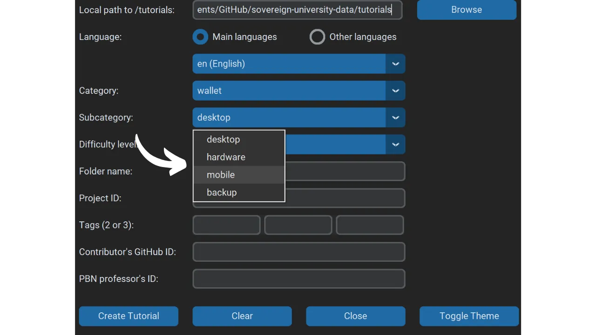

Nếu bạn chưa có hồ sơ giáo sư, hãy tham khảo hướng dẫn này:

https://planb.network/tutorials/others/contribution/create-teacher-profile-8ba9ba49-8fac-437a-a435-c38eebc8f8a4

Sau đó, nhấp vào nút "New Tutorial".

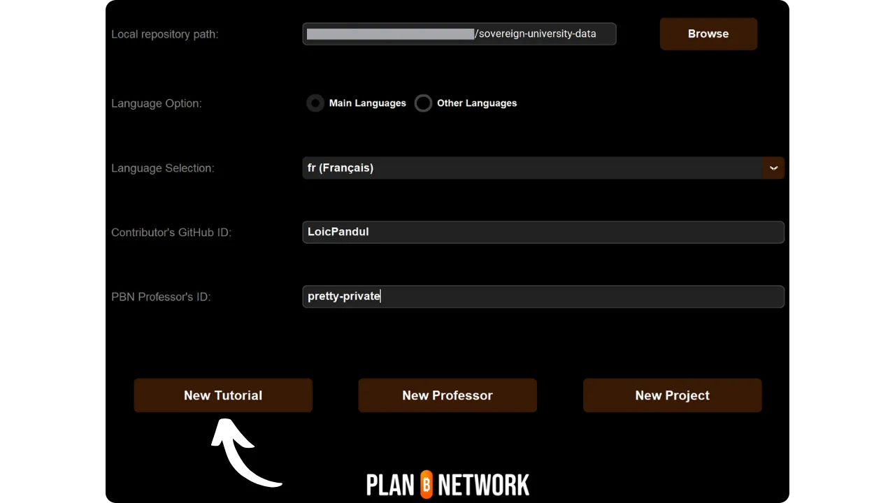

Chọn danh mục chính cho hướng dẫn của bạn. Sau đó, chọn danh mục con phù hợp dựa trên danh mục chính bạn đã chọn.

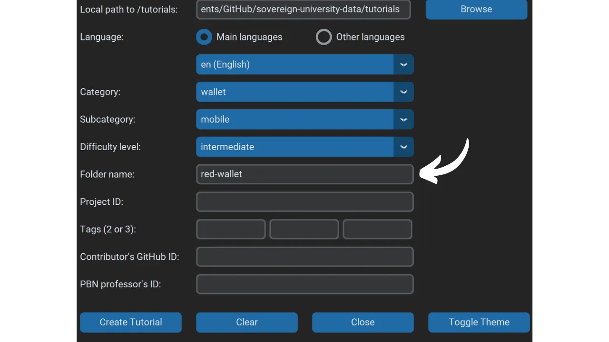

Xác định mức độ khó của hướng dẫn.

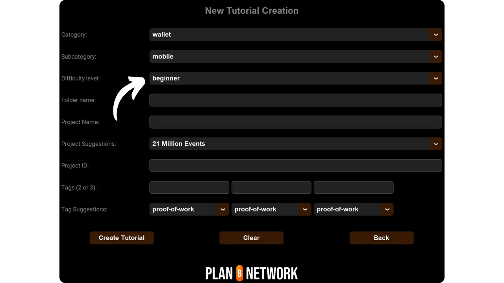

Chọn tên thư mục được tạo riêng cho hướng dẫn của bạn. Tên thư mục này nên phản ánh phần mềm được đề cập trong hướng dẫn và sử dụng dấu gạch ngang để phân tách các từ. Ví dụ: thư mục có thể được đặt tên là `red-wallet`:

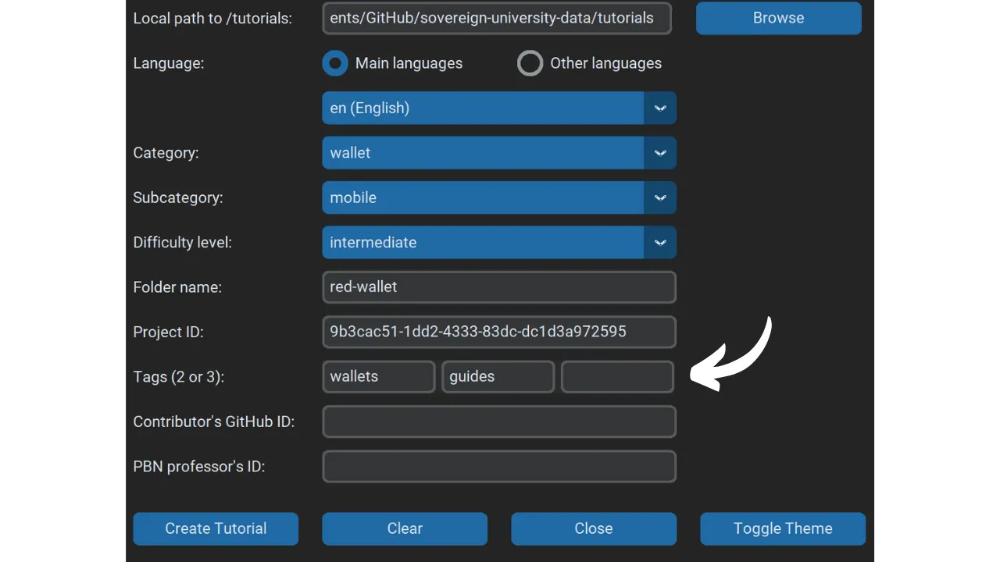

`project_id` là UUID của công ty hoặc tổ chức đứng sau công cụ được trình bày trong hướng dẫn, có sẵn trong [danh sách dự án](https://github.com/PlanB-Network/bitcoin-educational-content/tree/dev/resources/projects). Ví dụ, đối với một hướng dẫn về Sparrow Wallet, bạn có thể tìm thấy `project_id` trong tệp: `bitcoin-educational-content/resources/projects/sparrow/project.yml`. Thông tin này được thêm vào tệp YAML của hướng dẫn của bạn vì Plan ₿ Network duy trì cơ sở dữ liệu về các công ty và tổ chức hoạt động trong lĩnh vực Bitcoin hoặc các dự án liên quan. Bằng cách thêm `project_id` liên kết với hướng dẫn của bạn, bạn tạo ra một kết nối giữa nội dung của bạn và thực thể liên quan.

***Cập nhật:*** Trong phiên bản mới của tập lệnh, bạn không cần nhập thủ công `project_id` nữa. Đã thêm chức năng tìm kiếm để tìm dự án theo tên và tự động truy xuất `project_id` tương ứng. Nhập phần đầu của tên dự án vào ô "Project Name" để tìm kiếm, sau đó chọn công ty mong muốn từ danh sách thả xuống. `project_id` sẽ tự động điền vào ô bên dưới. Bạn cũng có thể nhập nó theo cách thủ công nếu cần.

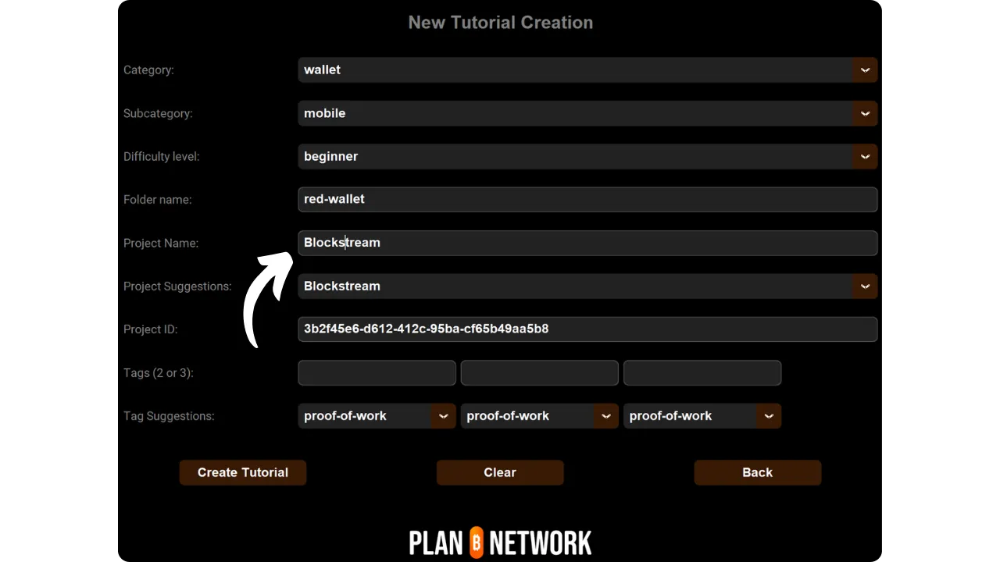

Đối với thẻ (tags), chọn 2 hoặc 3 từ khóa liên quan đến nội dung của hướng dẫn của bạn, chọn chúng duy nhất từ [danh sách thẻ của Plan ₿ Network](https://github.com/PlanB-Network/bitcoin-educational-content/blob/dev/docs/50-planb-tags.md). Phần mềm cũng cung cấp chức năng tìm kiếm từ khóa với danh sách thả xuống.

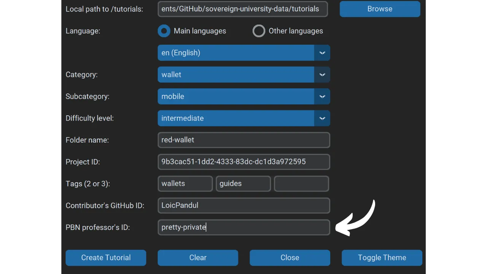

Sau khi nhập và xác minh tất cả thông tin, nhấp vào "Create Tutorial" để xác nhận việc tạo các tệp cho hướng dẫn của bạn. Điều này sẽ tạo thư mục hướng dẫn và tất cả các tệp cần thiết trong danh mục đã chọn trên hệ thống của bạn.

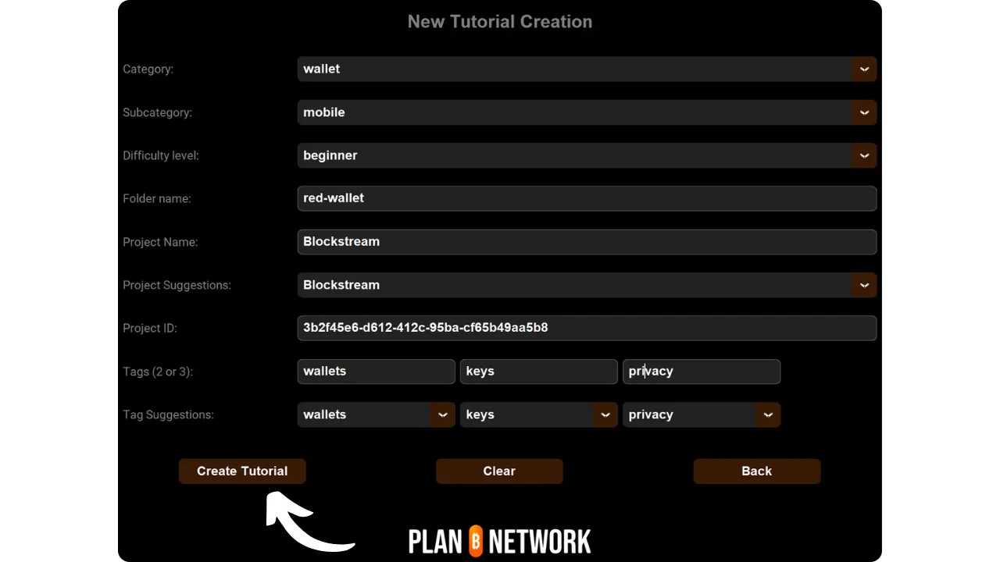

Bây giờ bạn có thể bỏ qua phần "Không sử dụng tập lệnh Python của tôi", cũng như bước 3 "Điền tệp YAML", vì tập lệnh đã tự động thực hiện các hành động này cho bạn. Chuyển thẳng sang bước 4 và bắt đầu viết hướng dẫn của bạn.

Để biết thêm thông tin về tập lệnh Python này, bạn cũng có thể tham khảo [README](https://github.com/PlanB-Network/bitcoin-educational-content/blob/dev/scripts/tutorial-related/new-tutorial-creation/README.md).

### Sans mon script Python
Ouvrez votre gestionnaire de fichiers et dirigez-vous vers le dossier `bitcoin-educational-content`, qui représente le clone local de votre dépôt. Vous devriez normalement le trouver sous `Documents\GitHub\bitcoin-educational-content`.
Au sein de ce répertoire, il sera nécessaire de localiser le sous-dossier adéquat pour le placement de votre tutoriel. L'organisation des dossiers reflète les différentes sections du site web Plan ₿ Network. Dans notre exemple, puisque nous souhaitons ajouter un tutoriel sur Sparrow Wallet, il convient de se rendre dans le chemin suivant : `bitcoin-educational-content\tutorials\wallet` qui correspond à la section `WALLET` sur le site web :
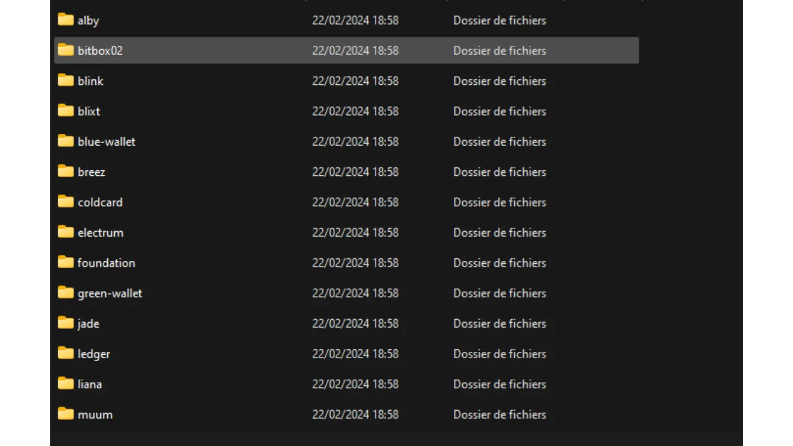

Trong thư mục `wallet`, bạn cần tạo một thư mục mới dành riêng cho hướng dẫn của bạn. Tên của thư mục này phải gợi lên phần mềm được đề cập trong hướng dẫn, đảm bảo kết nối các từ bằng dấu gạch ngang. Đối với ví dụ của tôi, thư mục sẽ có tiêu đề là `sparrow-wallet`:

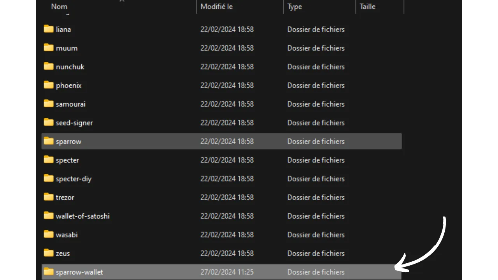

Trong thư mục con mới này dành riêng cho phần hướng dẫn của bạn, một số thành phần cần được thêm vào:


- Tạo một thư mục `assets`, dùng để lưu trữ tất cả các hình ảnh minh họa cần thiết cho bài hướng dẫn của bạn;
- Trong thư mục `assets` này, bạn cần tạo một thư mục con được đặt tên theo mã ngôn ngữ gốc của hướng dẫn. Ví dụ, nếu hướng dẫn được viết bằng tiếng Anh, thư mục con này phải được đặt tên là `en`. Đặt tất cả các hình ảnh của hướng dẫn vào đó (sơ đồ, hình ảnh, ảnh chụp màn hình, v.v.).
- Bạn phải tạo một tệp `tutorial.yml` để ghi lại các chi tiết liên quan đến hướng dẫn của mình;
- Một tệp định dạng markdown sẽ được tạo để viết nội dung thực tế của hướng dẫn của bạn. Tệp này phải được đặt tên theo mã ngôn ngữ của bài viết. Ví dụ, đối với hướng dẫn được viết bằng tiếng Pháp, tệp phải được gọi là `fr.md`.

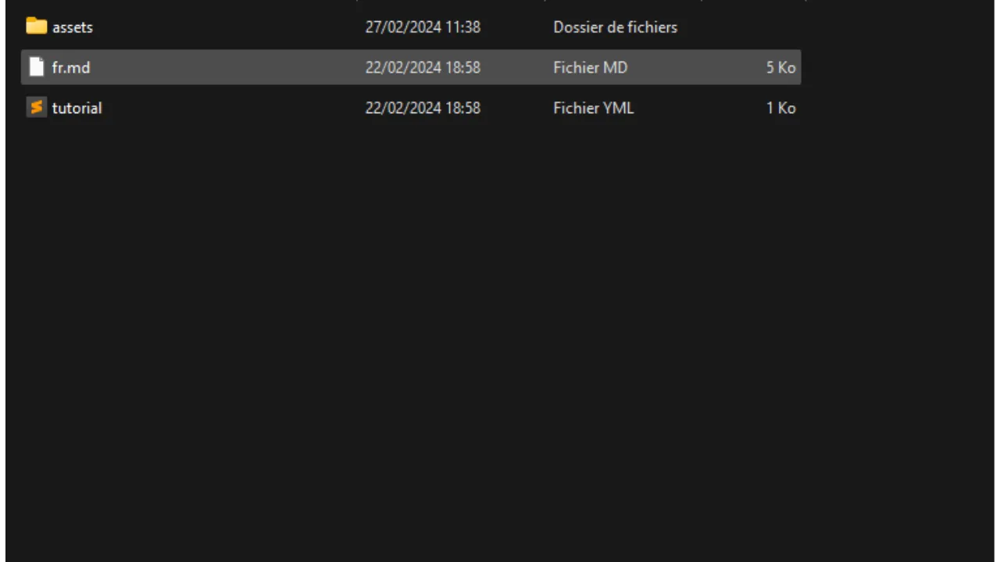

Tóm lại, đây là hệ thống phân cấp các tệp cần tạo:

```plaintext
bitcoin-educational-content/
└── tutorials/
└── wallet/ (to be modified with the correct category)
└── sparrow-wallet/ (to be modified with the name of the tutorial)
├── assets/
│   ├── en/ (to be modified according to the appropriate language code)
├── tutorial.yml
└── en.md (to be modified according to the appropriate language code)
```

## 3 - Điền vào tệp YAML

Điền vào tệp `tutorial.yml` bằng cách sao chép mẫu sau:

```yaml
id:
project_id:
tags:
-
-
-
category:
level:
credits:
professor:
# Proofreading metadata
original_language:
proofreading:
- language:
```

last_contribution_date: tính cấp bách:

người đóng góp_id:

-

phần thưởng:

Sau đây là thông tin chi tiết về các trường bắt buộc:


- id**: UUID (_Universally Unique Identifier_) để nhận dạng duy nhất hướng dẫn. Bạn có thể tạo nó bằng [một công cụ trực tuyến](https://www.uuidgenerator.net/version4). Yêu cầu duy nhất là UUID này phải ngẫu nhiên để tránh xung đột với UUID khác trên nền tảng;
- project_id**: UUID của công ty hoặc tổ chức đứng sau công cụ được trình bày trong hướng dẫn [từ danh sách các dự án](https://github.com/PlanB-Network/bitcoin-educational-content/tree/dev/resources/projects). Ví dụ: nếu bạn đang tạo hướng dẫn về phần mềm Sparrow Wallet, bạn có thể tìm thấy `project_id` này trong tệp sau: `bitcoin-educational-content/resources/projects/sparrow/project.yml`. Thông tin này được thêm vào tệp YAML của hướng dẫn của bạn vì Plan ₿ Network duy trì cơ sở dữ liệu của tất cả các công ty và tổ chức hoạt động trên Bitcoin hoặc các dự án liên quan. Bằng cách thêm `project_id` của thực thể liên quan đến hướng dẫn của bạn, bạn tạo liên kết giữa hai phần tử;
- thẻ**: 2 hoặc 3 từ khóa có liên quan đến nội dung hướng dẫn, được chọn riêng [từ danh sách thẻ của Plan ₿ Network](https://github.com/PlanB-Network/bitcoin-educational-content/blob/dev/docs/50-planb-tags.md);
- category**: Tiểu thể loại tương ứng với nội dung của hướng dẫn, theo cấu trúc của trang web Plan ₿ Network (ví dụ đối với ví: `desktop`, `hardware`, `mobile`, `backup`);
- level**: Mức độ khó của phần hướng dẫn, trong số:
    - `người mới bắt đầu`
    - `trung gian`
    - `nâng cao`
    - `chuyên gia`
- giáo sư**: `contributor_id` của bạn (BIP39 từ) như được hiển thị trên [hồ sơ giáo sư của bạn](https://github.com/PlanB-Network/bitcoin-educational-content/tree/dev/professors);
- original_language**: Ngôn ngữ gốc của hướng dẫn (ví dụ `fr`, `en`, v.v.);
- soát lỗi**: Thông tin về quá trình soát lỗi. Điền vào phần đầu tiên, vì việc soát lỗi hướng dẫn của riêng bạn được tính là xác thực đầu tiên:
    - language**: Mã ngôn ngữ của bản hiệu đính (ví dụ `fr`, `en`, v.v.).
    - last_contribution_date**: Ngày hôm nay.
    - mức độ khẩn cấp**: Để trống.
    - contributors_id**: ID GitHub của bạn.
    - phần thưởng**: Để trống.

Để biết thêm chi tiết về mã định danh giáo sư của bạn, hãy tham khảo hướng dẫn tương ứng:

https://planb.network/tutorials/others/contribution/create-teacher-profile-8ba9ba49-8fac-437a-a435-c38eebc8f8a4
Sau đây là ví dụ về tệp `tutorial.yml` đã hoàn thành cho hướng dẫn về ví Blockstream Green:

```yaml
id: e84edaa9-fb65-48c1-a357-8a5f27996143
project_id: 3b2f45e6-d612-412c-95ba-cf65b49aa5b8
tags:
- wallets
- software
- keys
category: mobile
level: beginner
credits:
professor: pretty-private
# Proofreading metadata
original_language: fr
proofreading:
- language: fr
last_contribution_date: 2024-11-20
urgency:
contributors_id:
- LoicPandul
reward:
Once you have finished modifying your `tutorial.yml` file, save your document by clicking on `File > Save`:
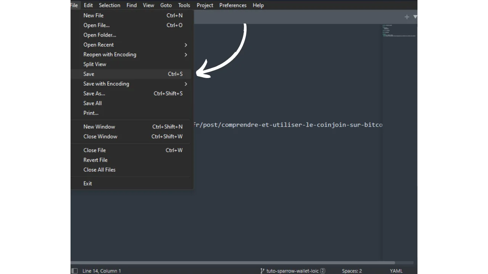
You can now close your code editor.
## 4 - Fill in the Markdown File
Now, you can open your file that will host your tutorial, named with the code of your language, such as `fr.md`. Go to Obsidian, on the left side of the window, scroll through the folder tree until you find the folder of your tutorial and the file you are looking for:
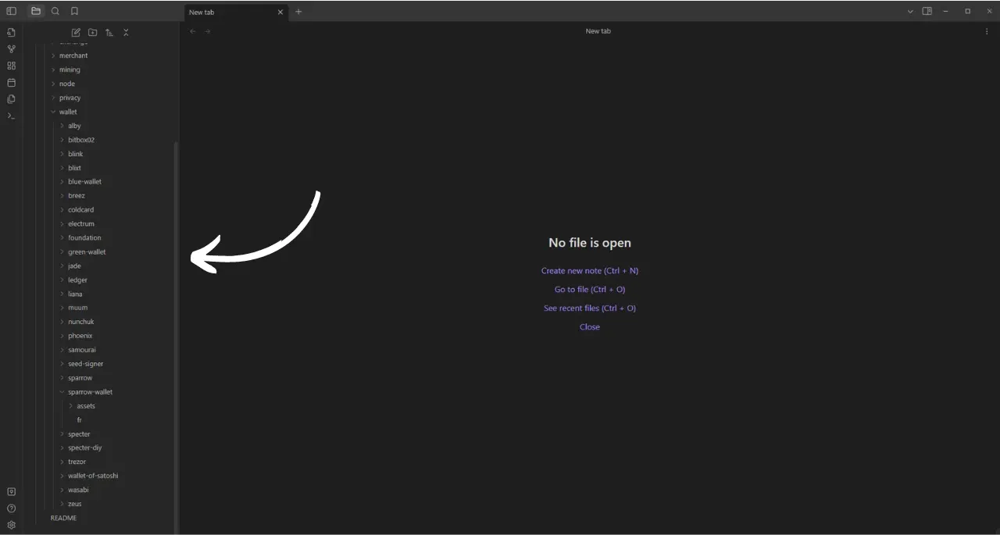
Click on the file to open it:
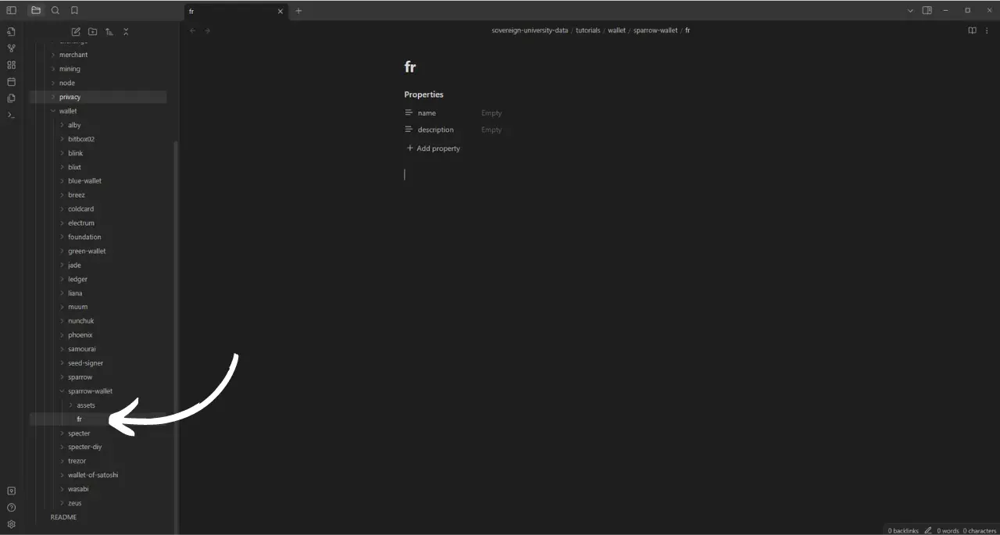
We will start by filling in the `Properties` section at the top of the document.
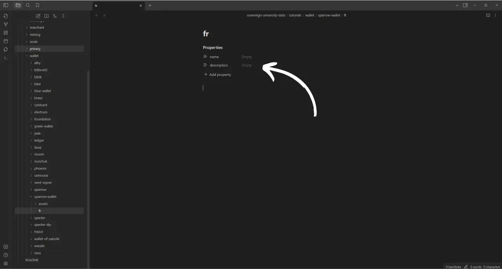
Manually add and fill in the following code block:
```

---
name: [Tiêu đề]
description: [Sự miêu tả]
---
```
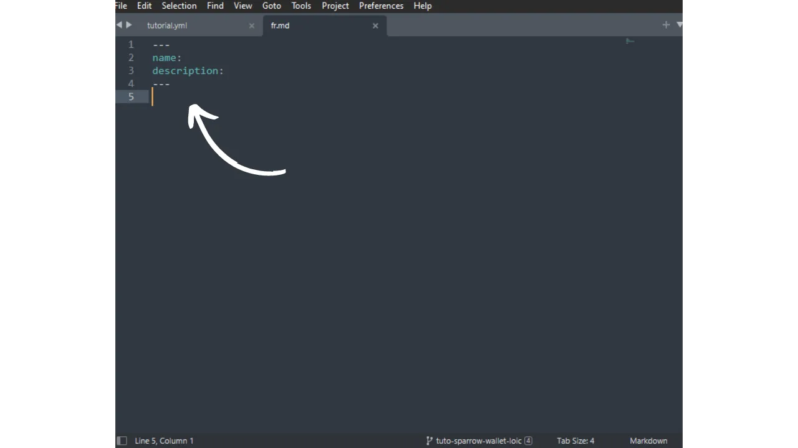
Fill in the name of your tutorial and a short description of it:
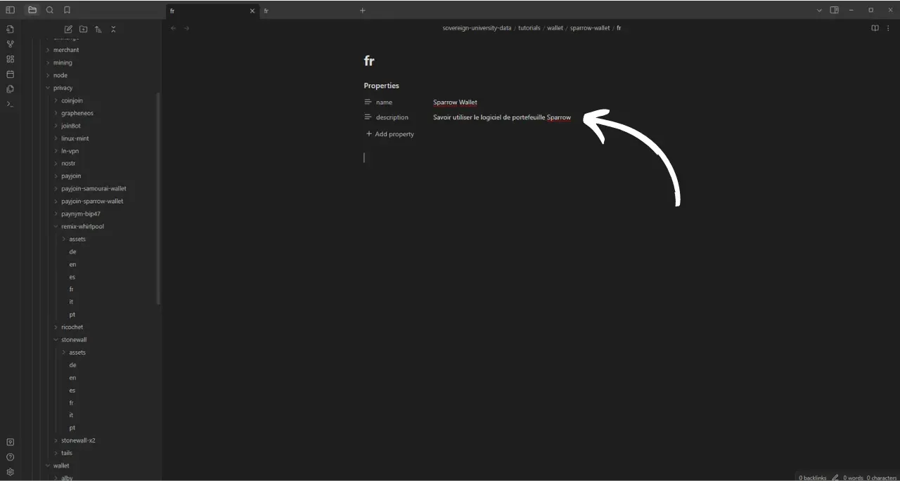
Then, add the path of the cover image at the beginning of your tutorial. To do this, note:
```


```
This syntax will be useful whenever adding an image to your tutorial is necessary. The exclamation point indicates that it is an image, with the alternative text (alt) specified between the brackets. The path to the image is indicated between the parentheses:
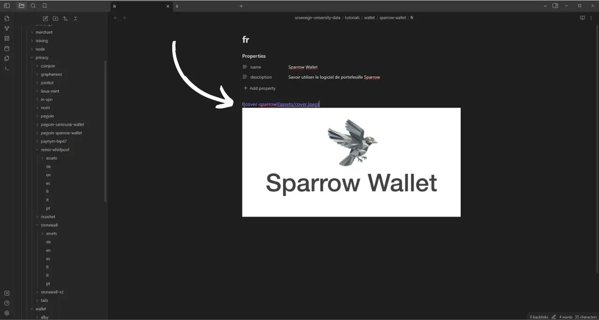
## 5 - Add the Logo and Cover
Within the `assets` folder, you must add a file named `logo.webp`, which will serve as a thumbnail for your article. This image must be in `.webp` format and must respect a square dimension to harmonize with the user interface. You are free to choose the logo of the software covered in the tutorial or any other relevant image, provided that it is free of rights. In addition, also add an image titled `cover.webp` in the same place. This image will be displayed at the top of your tutorial. Ensure that this image, like the logo, respects usage rights and is suitable for the context of your tutorial:
## 6 - Writing the Tutorial and Adding Visuals
Continue writing your tutorial by drafting your content. When you want to integrate a subtitle, apply the appropriate markdown formatting by prefixing the text with `##`:
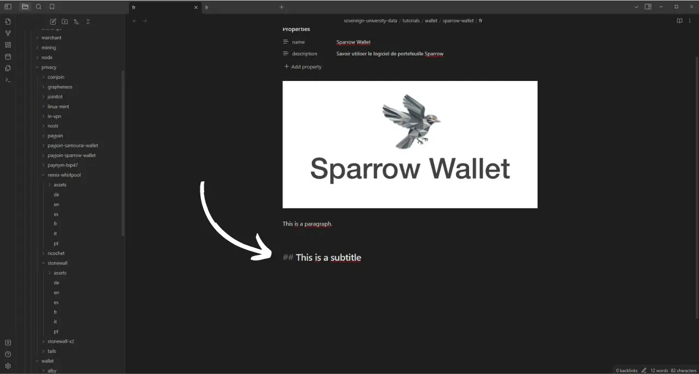
The language subfolder in the `assets` folder is used to store diagrams and visuals that will accompany your tutorial. As much as possible, avoid including text in your images to make your content accessible to an international audience. Of course, the software being presented will contain text, but if you add diagrams or additional indications on software screenshots, do so without text or, if it proves indispensable, use English.

To name your images, simply use numbers corresponding to their order of appearance in the tutorial, formatted with two digits (or three digits if your tutorial contains more than 99 images). For example, name your first image `01.webp`, your second `02.webp`, and so on.
Your images must be in `.webp` format exclusively. If needed, you can use [my image conversion software](https://github.com/LoicPandul/ImagesConverter).
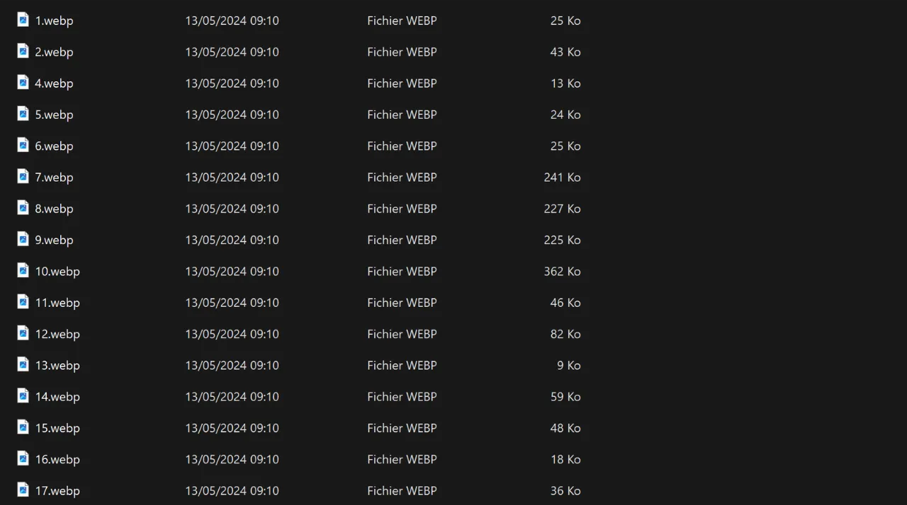
To insert a diagram into your document, use the following Markdown command, making sure to specify the appropriate alternative text as well as the correct path of the image:
```


```