PlanBのミッションは、できるだけ多くの言語でBitcoinに関する最高レベルの教育リソースを提供することです。サイトに公開されているすべてのコンテンツはオープンソースであり、GitHubにホストされているため、誰でもプラットフォームを豊かにするために参加する機会があります。貢献は様々な形を取ることができます：既存のテキストの修正や校正、他の言語への翻訳、情報の更新、またはまだ当サイトにない新しいチュートリアルの作成などです。

このチュートリアルでは、PlanB Networkの「Tutorials」セクションを変更する方法について説明します。新しいチュートリアルを追加したい、または既存のものを改善したい場合、この記事はあなたのためのものです！GitHubを通じてPlanB Networkに貢献する方法について、Obsidianというライティングツールを使用しながら詳しく見ていきます。

## 前提条件

PlanB Networkに貢献するためには、GitHubに関する経験レベルに応じて3つのオプションがあります：
1. **経験豊富なユーザー**：通常の方法を続け、このチュートリアルを参照してPlanBリポジトリの構造、特定の要件、およびワークフローに慣れてください。
2. **学ぶ準備ができている初心者**：独自の作業環境を設定することをお勧めします。このチュートリアルと以下にリストされている他の記事をフォローして、ステップバイステップでガイドします。
3. **小さな貢献のための初心者**：校正や修正など、少ない変更を必要とするタスクの場合は、完全なローカル環境を設定せずに直接GitHubのWebインターフェースを使用してください。

**このチュートリアルをフォローするために必要なソフトウェア：**
- [GitHub Desktop](https://desktop.github.com/)
- [Obsidian](https://obsidian.md/)
- コードエディター（[VSC](https://code.visualstudio.com/)または[Sublime Text](https://www.sublimetext.com/)）

**チュートリアルを始める前の前提条件：**
- [GitHubアカウント](https://github.com/signup)を持っている。
- [PlanB Networkソースリポジトリのフォーク](https://github.com/PlanB-Network/bitcoin-educational-content)を持っている。
- [PlanB Network上での教授プロファイル](https://planb.network/professors)を持っている（完全なチュートリアルを提案する場合のみ）。

**これらの前提条件を得るために助けが必要な場合、私の他のチュートリアルがガイドします：**
- **[GitとGitHubの理解](https://planb.network/tutorials/others/basics-of-github)**
- **[GitHubアカウントの作成](https://planb.network/tutorials/others/create-github-account)**
- **[作業環境の設定](https://planb.network/tutorials/others/github-desktop-work-environment)**
- **[教授プロファイルの作成](https://planb.network/tutorials/others/create-teacher-profile)**
## PlanB Networkにどのようなコンテンツを書くか？
私たちは主に、Bitcoinまたはそのエコシステムに関連するツールに関するチュートリアルを求めています。これらのコンテンツは、以下の六つの主要なカテゴリーに沿って整理することができます：
- ウォレット；
- ノード；
- マイニング；
- マーチャント；
- 交換所；
- プライバシー。
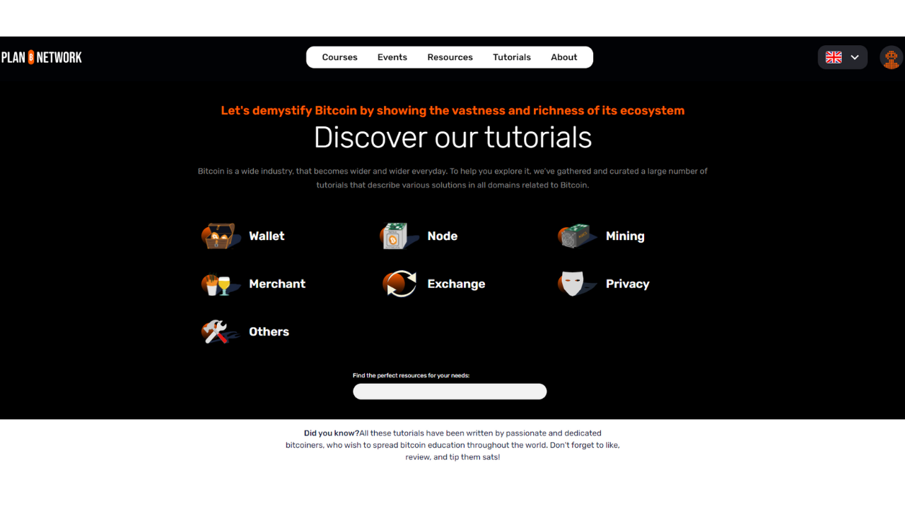
これらのトピックに特に関連するBitcoinに加えて、PlanBは個人の主権を強調するテーマに関する貢献も求めています。例えば：
- オープンソースツール；
- コンピューティング；
- 暗号学；
- エネルギー；
- 数学；
- 経済学；
- DIY；
- ライフハッキング...
例えば、現在私たちはTails、Nostr、GrapheneOSに関するチュートリアルを提供しています。これらのツールはBitcoinと直接関連しているわけではありませんが、デジタル世界での主権を追求するプロセスにおいて、私たちが関心を持つことができるシステムです。これらのコンテンツは「その他」セクションのサブカテゴリに統合することができます。
あなたは、ゼロからチュートリアルを設計するか、またはあなたが著作権を所有している場合に限り、あなたのウェブサイトで以前に公開されたチュートリアルを取り上げ、PlanB Networkにも共有することを選択できます。その際、オリジナル記事へのリンクを追加してください。

どちらを選択するにせよ、PlanB Networkに公開されるすべてのコンテンツは、[CC-BY-SA](https://creativecommons.org/licenses/by-sa/4.0/)のフリーライセンスの下にあることを念頭に置いてください。このライセンスは、オリジナルの出典を適切にクレジットすることを条件に、誰でもあなたのコンテンツをコピーし、潜在的には修正することを許可します。

## PlanB Networkにチュートリアルを提案する方法は？

すべてが準備でき、あなたのローカル環境があなた自身のPlanB Networkのフォークでうまく設定されたら、チュートリアルの追加を開始できます。

### 新しいブランチを作成する

- ブラウザを開き、GitHub上で確立したあなたのPlanBリポジトリのフォークのページに移動します。あなたのフォークのURLは次のようになります：`https://github.com/[your-username]/sovereign-university-data`:

- メインブランチ`dev`にいることを確認し、`Sync fork`ボタンをクリックします。フォークが最新でない場合、GitHubはブランチの更新を提案します。この更新を進めてください。逆に、ブランチが既に最新の場合、GitHubはその旨を通知します：

- GitHub Desktopソフトウェアを開き、ウィンドウの左上隅であなたのフォークが正しく選択されていることを確認します：
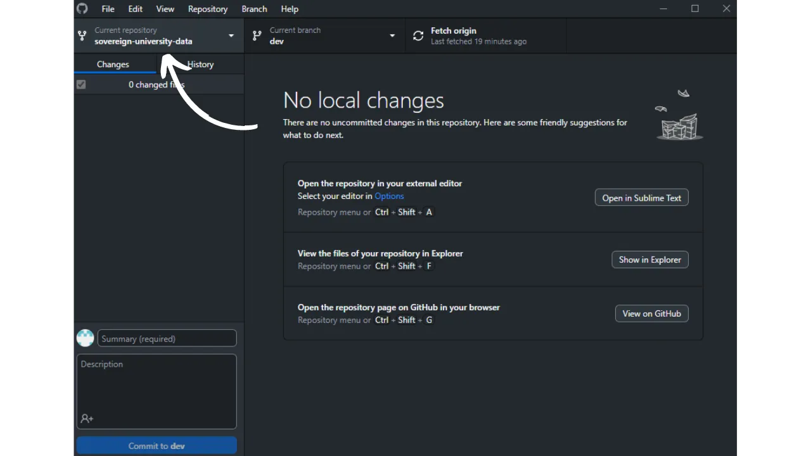
- `Fetch origin`ボタンをクリックします。ローカルリポジトリが既に最新の場合、GitHub Desktopはこれ以上のアクションを提案しません。そうでない場合は、`Pull origin`オプションが表示されます。このボタンをクリックしてローカルリポジトリを更新します： 
- メインブランチ`dev`にいることを確認します：

- このブランチをクリックし、次に`New Branch`ボタンをクリックします：

- 新しいブランチがソースリポジトリ、つまり`DecouvreBitcoin/sovereign-university-data`に基づいていることを確認します。
- その目的が明確になるように、各単語をダッシュで区切ってブランチに名前を付けます。例えば、Sparrow Walletソフトウェアの使用に関するチュートリアルを書くことが目標だとしましょう。この場合、このチュートリアルの作成に専念する作業ブランチは、`tuto-sparrow-wallet-loic`と名付けることができます。適切な名前を入力したら、`Create branch`をクリックしてブランチの作成を確認します：

- 今度は`Publish branch`ボタンをクリックして、新しい作業ブランチをGitHub上のオンラインフォークに保存します：

これで、GitHub Desktop上で新しいブランチにいるはずです。これは、コンピュータ上でローカルに行われたすべての変更が、この特定のブランチにのみ記録されることを意味します。また、このブランチがGitHub Desktop上で選択されている限り、マシン上でローカルに表示されるファイルは、このブランチ(`tuto-sparrow-wallet-loic`)のものであり、メインブランチ(`dev`)のものではありません。

新しい記事を公開したい場合は、`dev`から新しいブランチを作成する必要があります。Gitのブランチはプロジェクトの平行バージョンであり、メインブランチに影響を与えることなく変更を加えることができ、作業がマージの準備が整うまで続けることができます。

### チュートリアルの追加

作業ブランチが作成されたので、新しいチュートリアルを統合する時が来ました。
- ファイルマネージャーを開き、リポジトリのローカルクローンを表す`sovereign-university-data`フォルダに移動します。通常、`Documents\GitHub\sovereign-university-data`の下に見つかるはずです。このディレクトリ内で、チュートリアルを配置する適切なサブフォルダを見つける必要があります。フォルダの構成はPlanB Networkウェブサイトの異なるセクションを反映しています。私たちの例では、Sparrow Walletに関するチュートリアルを追加したいので、次のパスに進むのが適切です：`sovereign-university-data\tutorials\wallet` これはウェブサイトの`WALLET`セクションに対応しています： 
- `wallet`フォルダ内で、チュートリアルに特化した新しいディレクトリを作成する必要があります。このフォルダの名前は、チュートリアルで取り上げられるソフトウェアを連想させ、単語をダッシュで繋ぐことで、明確にする必要があります。私の例では、フォルダは`sparrow-wallet`というタイトルになります：

- この新しいチュートリアル専用のサブフォルダ内には、いくつかの要素を追加する必要があります：
	- チュートリアルに必要な全てのイラストを受け取るための`assets`フォルダを作成します；
    - この`assets`フォルダ内に、対応する言語に応じてビジュアルを分類するために、`fr`、`de`、`en`、`it`、`es`、`ja`、`vi`、`pt`という名前の8つのサブフォルダを作成する必要があります。また、翻訳が不要なビジュアル、例えばスクリーンショットなどのための`notext`サブフォルダも追加する必要があります；
	- チュートリアルに関連する詳細を記録するための`tutorial.yml`ファイルを作成する必要があります；
	- 実際のチュートリアルの内容を書くためのマークダウン形式のファイルを作成する必要があります。このファイルは、執筆の言語コードに応じてタイトルを付ける必要があります。例えば、フランス語で書かれたチュートリアルの場合、ファイルは`fr.md`と呼ばれるべきです。
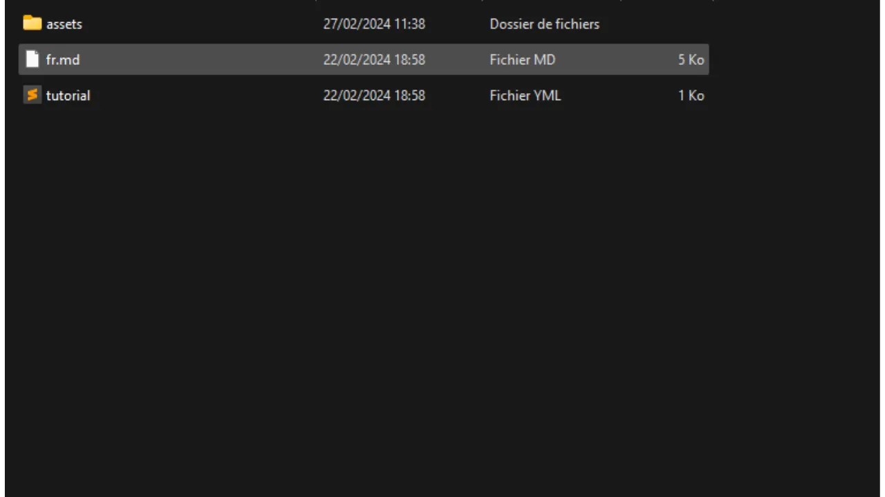
- 作成するファイルの階層をまとめると、以下のようになります：
```plaintext
sovereign-university-data/
└── tutorials/
    └── wallet/ (適切なカテゴリに修正する)
        └── sparrow-wallet/ (チュートリアルの名前に修正する)
            ├── assets/
            │   ├── fr/
            │   ├── de/
            │   ├── en/
            │   ├── it/
            │   ├── es/
            │   ├── pt/
            |   ├── ja/
            |   ├── vi/
            │   └── notext/
            ├── tutorial.yml
            └── fr.md (適切な言語コードに修正する)
```

- まず、コードエディタを使用して`tutorial.yml`ファイルを開きます。
- 以下に指定された情報で各フィールドを埋めてください：
- **builder**: チュートリアルを作成しているソフトウェアを製造している会社の名前を入力してください；
- **tags**: 記事のトピックに密接に関連する一連のキーワードを決定し、その検索とインデックス作成を容易にします；
- **category**: PlanBサイトで利用可能なサブカテゴリーの中から、チュートリアルの内容に基づいて適切なものを選択してください。例えば、`WALLET`セクションのチュートリアルの場合、利用可能なオプションには`Desktop`、`Hardware`、`Mobile`があります。
- **level**: チュートリアルの難易度レベルを以下の4つのカテゴリーから選択して示してください：
    - 初心者 (`beginner`),
    - 中級者 (`intermediary`),
    - 上級者 (`advanced`),
    - 専門家 (`expert`).
- **professor**: 教授プロファイルに表示されるあなたの貢献者IDを提供してください。詳細については、[該当するチュートリアル](https://planb.network/fr/tutorials/others/create-teacher-profile)を参照してください。
- **link** (任意): チュートリアルを開発する際に、自分の個人サイトなどのソースウェブサイトにクレジットを付けたい場合、ここで関連するリンクを追加できます。

- `tutorial.yml`ファイルの修正が完了したら、`File > Save`をクリックしてドキュメントを保存してください：
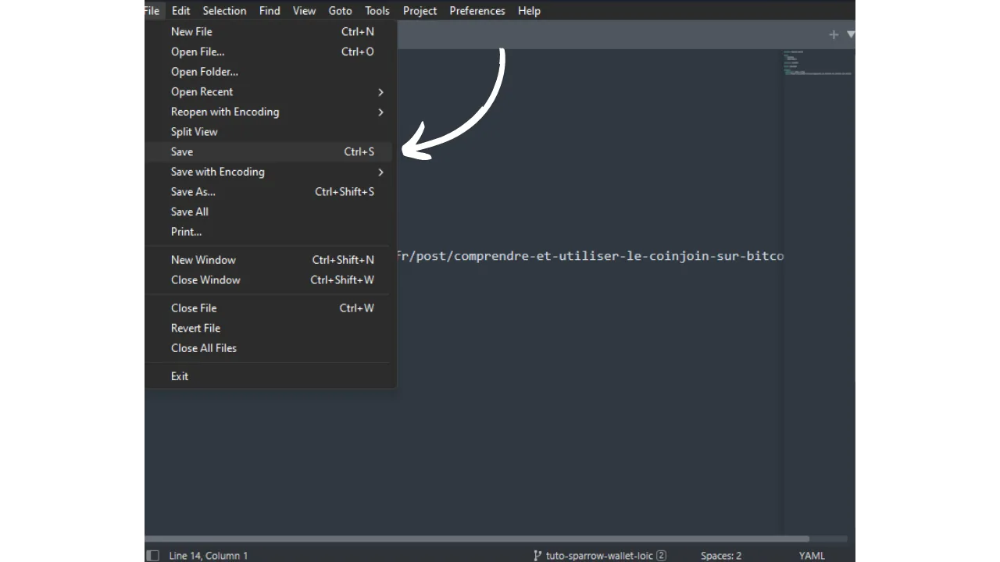
- これでコードエディターを閉じることができます。
- `assets`フォルダーには、記事のサムネイルとして機能する`logo.webp`という名前のファイルを追加する必要があります。この画像は`.webp`形式であり、ユーザーインターフェースと調和するために正方形の寸法を尊重する必要があります。チュートリアルで取り上げられているソフトウェアのロゴ、またはその他の関連する画像を自由に選択できますが、権利が自由であることが条件です。さらに、同じ場所に`cover.webp`というタイトルの画像も追加してください。この画像はチュートリアルの上部に表示されます。この画像もロゴと同様に、使用権を尊重し、チュートリアルの文脈に適していることを確認してください：
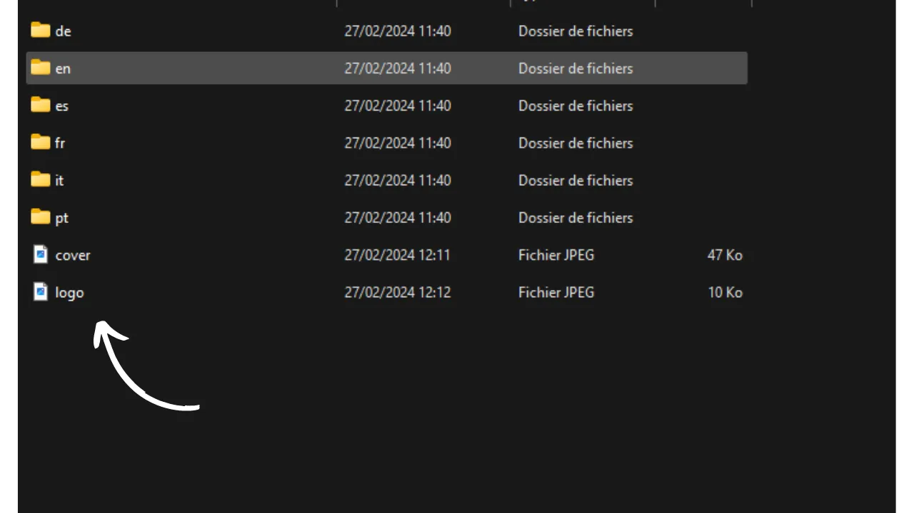
- これで、言語のコードで名付けられたチュートリアルをホストするファイルを開くことができます。例えば`fr.md`などです。Obsidianで、ウィンドウの左側にあるフォルダーツリーをスクロールして、チュートリアルのフォルダーと検索されたファイルに移動します：
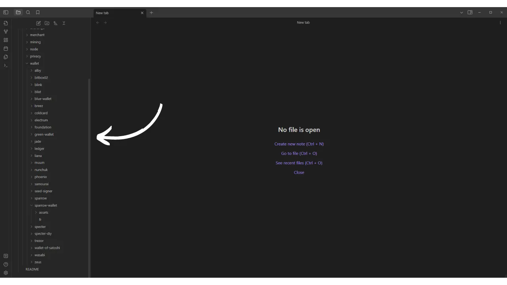
- ファイルをクリックして開きます：

- ドキュメントの上部にある`Properties`セクションを記入することから始めます。このセクションがファイルから欠落している場合（ドキュメントが完全に空白の場合）、他の既存のチュートリアルからコピーして再現することができます： 
- または、このようにコードエディターを使用して手動で追加することもできます：
```markdown
---
name: [タイトル]
description: [説明]
---
```
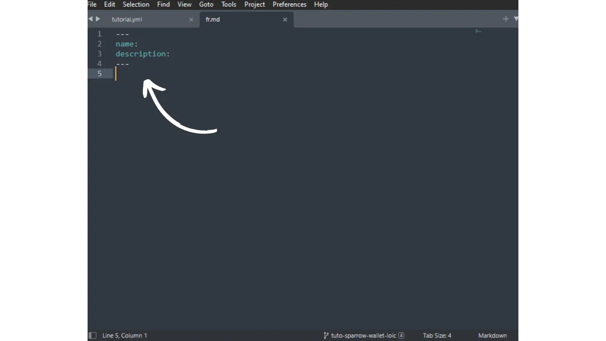
- チュートリアルの名前と短い説明を記入してください：

- 次に、チュートリアルの始めにカバー画像を追加します。これを行うには、次のように入力します：
```markdown

```
- この構文は、チュートリアルに画像を追加する必要がある場合にいつでも役立ちます。感嘆符は画像であることを示し、代替テキスト（alt）は括弧の間に指定され、画像へのパスは括弧の間に示されます：

- サブタイトルを統合したいときは、テキストの前に`##`を付けて適切なマークダウンの書式を適用して、チュートリアルの執筆を続けます：


### チュートリアルに図表を追加する方法は？
`assets`フォルダ内の言語サブフォルダは、チュートリアルに添付される図表やビジュアルを整理するために用意されています。画像にテキストが含まれている場合は、コンテンツを国際的な観客にアクセスしやすくするため、関連する各言語に翻訳してください。翻訳するテキストがない図表やスクリーンショットの場合は、それらを直接`notext`サブフォルダに配置してください。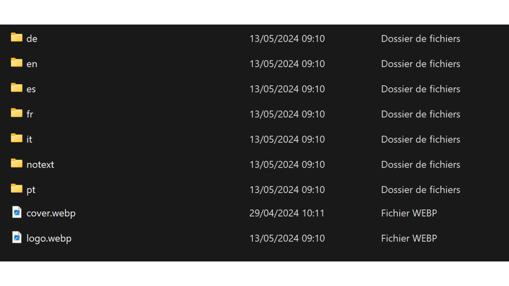
画像に名前を付ける際は、チュートリアル内の出現順に数字を入れるだけです。例えば、最初の画像を`1.webp`、次の画像を`2.webp`というように名付けてください。

同じ図表が複数の言語に翻訳される場合は、言語サブフォルダ内で異なる翻訳に同じファイル名を保持してください。例えば、`en/1.webp`、`fr/1.webp`、`pt/1.webp`などです。

`jpeg`、`png`、`webp`など、異なる画像フォーマットを使用することができます。画像が軽量になるため、`webp`フォーマットを選択することを推奨します。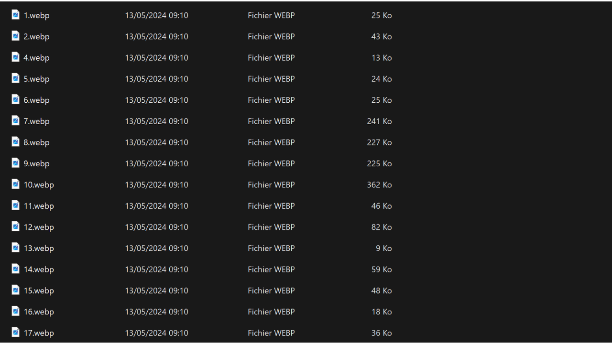
ドキュメントに図表を挿入するには、Markdownで以下のコマンドを使用し、適切な代替テキストと画像の正確なパスを指定してください：
```markdown

```
冒頭の感嘆符は画像であることを示しています。代替テキストは、アクセシビリティとSEOを支援するために、括弧の間に配置されます。最後に、画像へのパスは括弧の間に示されます：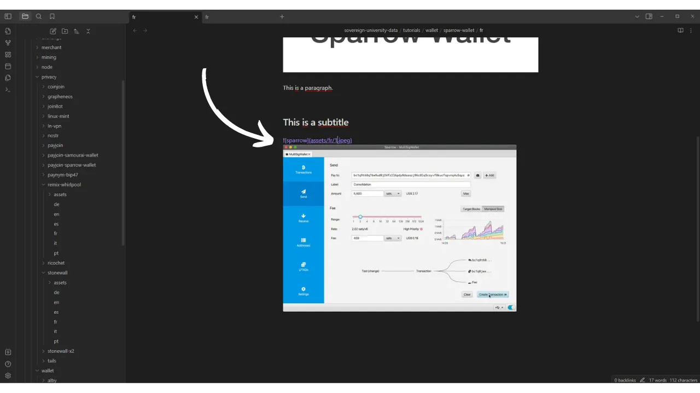
独自の図表を作成する場合は、PlanB Networkのグラフィックチャーターに従って、視覚的な一貫性を確保してください：
- **フォント**：[Rubik](https://fonts.google.com/specimen/Rubik)を使用してください。
- **色**：
	- オレンジ：#FF5C00
	- ブラック：#000000
	- ホワイト：#FFFFFF

**チュートリアルに統合されるすべてのビジュアルは、著作権フリーであるか、ソースファイルのライセンスに準拠している必要があります**。また、PlanB Networkに公開されるすべての図表は、テキストと同様に、CC-BY-SAライセンスの下で利用可能になります。

**-> ヒント：** 画像などのファイルを公開する際は、位置データ、作成日、著者に関する詳細など、機密情報を含む可能性のある余分なメタデータを削除することが重要です。プライバシーを保護するために、このメタデータを削除することをお勧めします。この操作を簡素化するために、[Exif Cleaner](https://exifcleaner.com/)のような、ドキュメントのメタデータをドラッグアンドドロップで簡単にクリーンアップできる専門ツールを使用できます。

### チュートリアルを保存してプッシュする方法は？

選択した言語でチュートリアルの執筆を終えたら、次のステップは**プルリクエスト**を提出することです。その後、管理者が自動翻訳方法を利用して、チュートリアルの不足している翻訳を追加します。

- プルリクエストを進めるには、GitHub Desktopソフトウェアを開きます。
- このソフトウェアは、ローカルで行った変更が元のリポジトリと比較して自動的に検出されるはずです。続行する前に、これらの変更が期待したものと正確に一致するかどうかをインターフェースの左側で慎重に確認してください：
- コミットのタイトルを追加し、その変更を検証するために青い`Commit to [your branch]`ボタンをクリックします：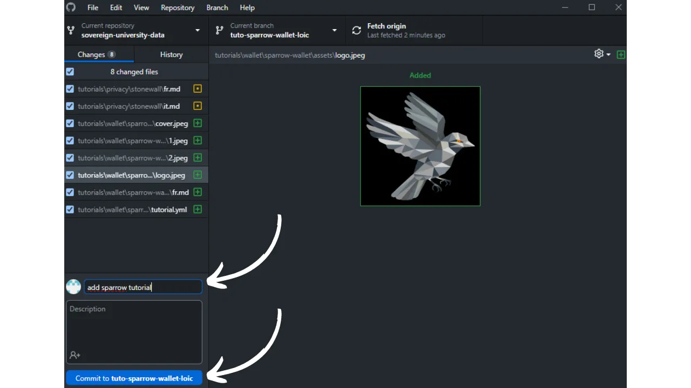
コミットは、ブランチに行われた変更を保存し、説明的なメッセージを伴って、プロジェクトの進化を時間と共に追跡するための一種の中間チェックポイントです。
- まず、`Push origin` ボタンをクリックしてください。これにより、コミットがあなたのフォークに送信されます: 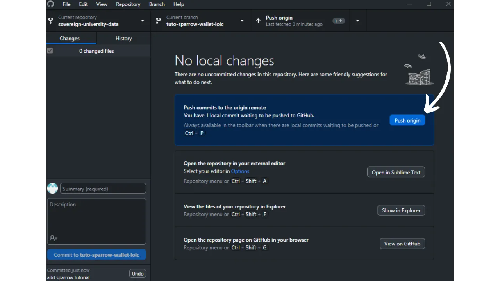 - チュートリアルをまだ終えていない場合は、後で戻って新しいコミットを作成することができます。
- このブランチの編集を終えた場合は、`Preview Pull Request` ボタンをクリックしてください: 
- 変更が正しいことを最後に確認したら、`Create pull request` ボタンをクリックしてください:

プルリクエストは、PlanB Networkリポジトリのメインブランチにあなたのブランチからの変更を統合するためのリクエストであり、マージ前に変更のレビューと議論を可能にします。

- ブラウザが自動的にGitHubのプルリクエスト準備ページにリダイレクトされます:
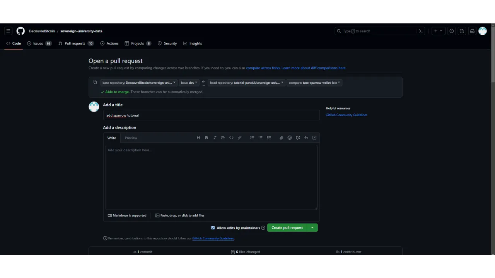
- 変更をソースリポジトリとマージしたい内容を簡潔に要約するタイトルを提供してください。
- これらの変更を説明する簡単なコメントを追加してください。
- 緑色の `Create pull request` ボタンをクリックして、マージリクエストを確認してください:

あなたのPRは、PlanB Networkのメインリポジトリの `Pull Request` タブに表示されます。あとは、管理者があなたに連絡して、あなたの貢献のマージを確認するか、追加の変更を要求するまで待つだけです。

PRがメインブランチとマージされた後、フォーク上の履歴をクリーンに保つために作業ブランチ (`tuto-sparrow-wallet`) を削除することをお勧めします。GitHubは、PRのページで自動的にこのオプションを提供します:
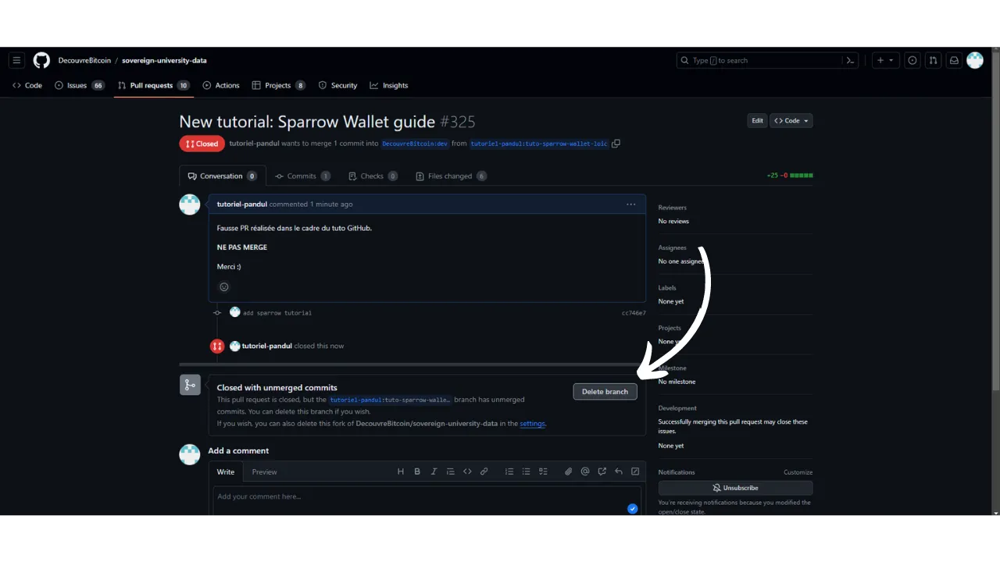
GitHub Desktopソフトウェアでは、フォークのメインブランチ (`dev`) に戻ることができます。

既にPRを提出した後で貢献に変更を加えたい場合、フォローする手順はPRの現在の状態によって異なります:
- PRがまだオープンであり、まだマージされていない場合は、同じブランチにとどまりながらローカルで変更を行います。変更が完了したら、`Push origin` ボタンを使用して、まだオープンなPRに新しいコミットを追加します。
- PRが既にメインブランチとマージされている場合は、新しいブランチを作成し、新しいPRを提出するプロセスを最初からやり直す必要があります。PlanB Networkのソースリポジトリとローカルリポジトリが同期していることを確認してから進めてください。