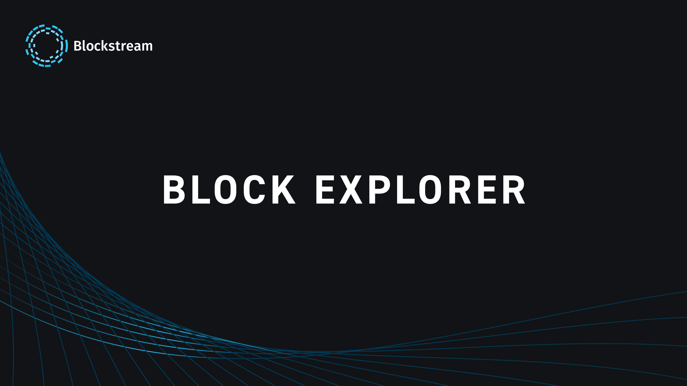

BLOCKSTREAM Explorer to projekt, który ułatwia eksplorację transakcji i Global State protokołu Bitcoin, a także [*Sidechain*](https://planb.network/en/resources/glossary/Sidechain) Liquid opracowanego przez firmę BLOCKSTREAM.

Zainicjowany w 2014 r. przez BLOCKSTREAM, firmę założoną przez Adama Backa, eksplorator [BLOCKSTREAM.info](https://BLOCKSTREAM.info) ma na celu zapewnienie solidnej infrastruktury dla Bitcoin, gwarantującej interoperacyjność i śledzenie transakcji między warstwami (On-Chain i Liquid), przy jednoczesnym zwiększeniu bezpieczeństwa i prywatności użytkowników.

W tym samouczku przedstawiamy, co go wyróżnia, jego usługi i sposób, w jaki oferuje płynne monitorowanie operacji i stanu warstw Bitcoin On-Chain i Liquid.

## Rozpoczęcie pracy z BLOCKSTREAM

### Nawigacja po kanale głównym

Po przejściu do eksploratora BLOCKSTREAM.info, w "**Dashboard**" domyślnie wybrany jest główny kanał protokołu Bitcoin. Z tego Interface można uzyskać przegląd :

- Główny rozmiar łańcucha: Ostatnio wydobyte bloki.

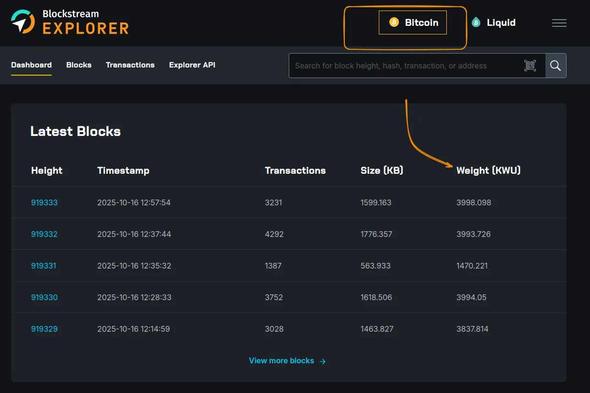

Ta sekcja zawiera informacje o ostatnio wydobytych blokach, Timestamp, liczbie transakcji zawartych w każdym BLOCK, rozmiarze w kilobajtach (kB) i pomiarze każdego BLOCK w jednostkach wagi (**WU** = *Weight Units*). Ten ostatni pomiar jest interesujący, ponieważ pozwala nam ocenić optymalizację BLOCK, biorąc pod uwagę, że każdy BLOCK głównego łańcucha jest ograniczony do `4 000 000 WU` lub `4 000 kWU`.

- Ostatnie transakcje.

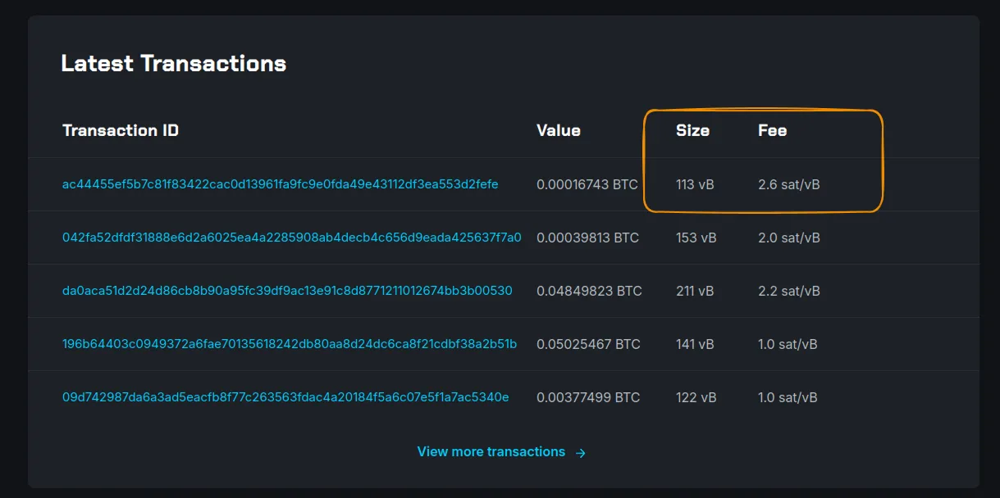

Sekcja transakcji zawiera informacje o unikalnym identyfikatorze transakcji, wartości Bitcoin, rozmiarze w wirtualnych bajtach (vB) - który reprezentuje sumę wszystkich danych (wejściowych i wyjściowych) - oraz powiązanej stawce opłaty. Na przykład transakcja o rozmiarze `153 vB` przy stawce `2 sat/vB` spowoduje naliczenie opłaty w wysokości `306 satoshis`.

### Eksploracja płynów

W menu "**Blocks**" można prześledzić historię całego głównego łańcucha aż do ostatniego wydobytego BLOCK.

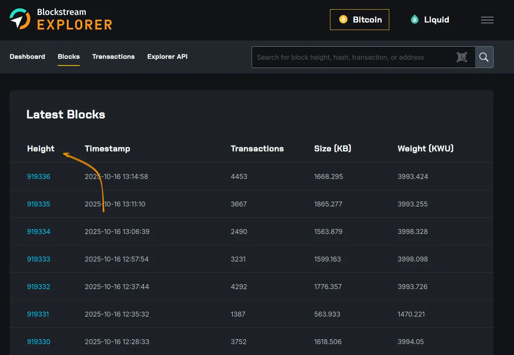

Klikając na konkretny BLOCK, można uzyskać więcej szczegółów na temat zawartych w nim informacji i transakcji. Na przykład dla BLOCK 919330: masz Hash z BLOCK. Można również przejść do poprzedniego BLOCK, ponieważ każdy wydobywany BLOCK (oprócz Genesis) jest powiązany z poprzednim, zachowując Hash swojego poprzednika.

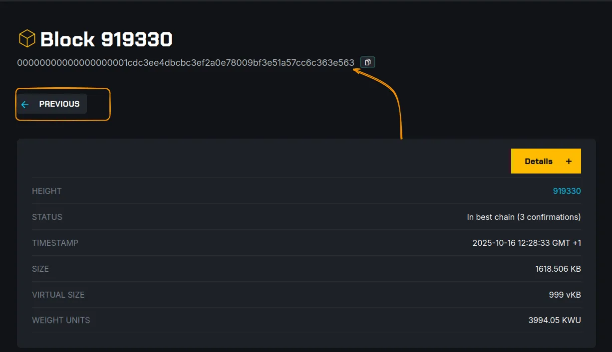

Klikając przycisk **"Szczegóły "**, można uzyskać więcej informacji na temat tego BLOCK, takich jak jego status, który potwierdza, że został on dodany do zachowanego i propagowanego łańcucha głównego. Dostępna jest również trudność, z jaką wydobywany jest ten BLOCK: trudność ta reprezentuje moc obliczeniową wymaganą do rozwiązania problemu kryptograficznego Mining i jest dostosowywana co 2016 bloków (około 2 tygodnie).

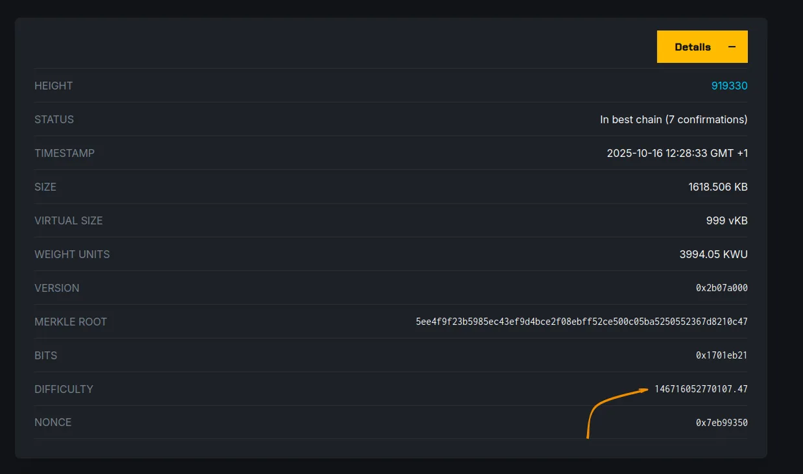

Poniżej tej sekcji szczegółów znajdują się wszystkie transakcje zawarte w tym BLOCK.

Pierwsza transakcja w BLOCK nazywana jest **transakcją coinbase**. Służy ona do przydzielenia nagrody Miner z Mining (wszystkie opłaty związane z transakcjami zawartymi w BLOCK i dotacją BLOCK). Bitcoiny utworzone przez tę transakcję można wydać dopiero po wydobyciu kolejnych 100 kolejnych bloków. Innymi słowy, aby móc z nich skorzystać, Miner będzie musiał poczekać na wyprodukowanie BLOCK **919430**. Jest to znane jako [*"okres zapadalności "*](https://planb.network/fr/resources/glossary/maturity-period).

Coinbase jest szczególną transakcją: jest to jedyna transakcja bez rzeczywistego wkładu, ponieważ nie wydaje żadnych bitcoinów z poprzedniej transakcji.

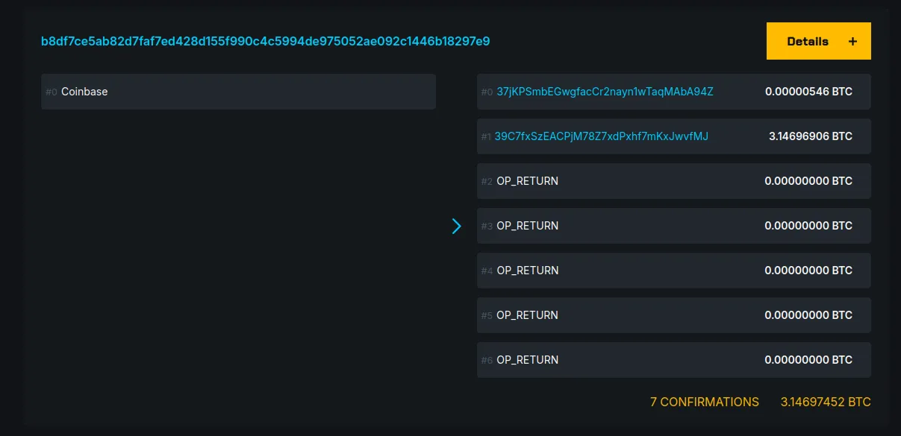

Wszystkie inne transakcje są podzielone na dwie sekcje: wejścia i wyjścia.

Aby bitcoiny mogły zostać użyte jako dane wejściowe w nowej transakcji, inicjator transakcji musi udowodnić ich posiadanie poprzez dostarczenie podpisu odpowiadającego określonemu skryptowi. Każdy kawałek bitcoinów (UTXO) zawiera skrypt wymagający określonego podpisu, który może dostarczyć tylko klucz prywatny posiadacza. Skrypty te to ***scriptSig*** (w ASM), napisane w Bitcoin Script i mogą być różnych typów. W tym przykładzie widzimy, że użyte UTXO były typu P2SH do wyjścia typu P2WPKH (*Pay-to-Witness-Public-Key-Hash*).

Historię konkretnego UTXO można prześledzić za pomocą heurystyki. Zapraszamy do zapoznania się z różnymi heurystykami Bitcoin i sposobami wzmocnienia poufności transakcji Bitcoin:

https://planb.network/courses/65c138b0-4161-4958-bbe3-c12916bc959c

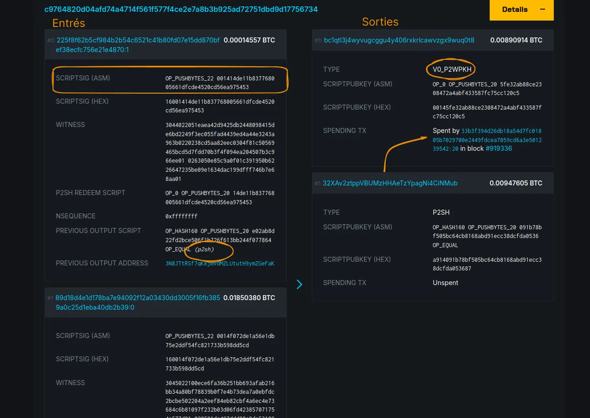

Weźmy przykład wydatków wychodzących z tej transakcji. Klikając na identyfikator transakcji, zostaniemy przekierowani do sekcji **Transakcje** na stronie szczegółów transakcji.

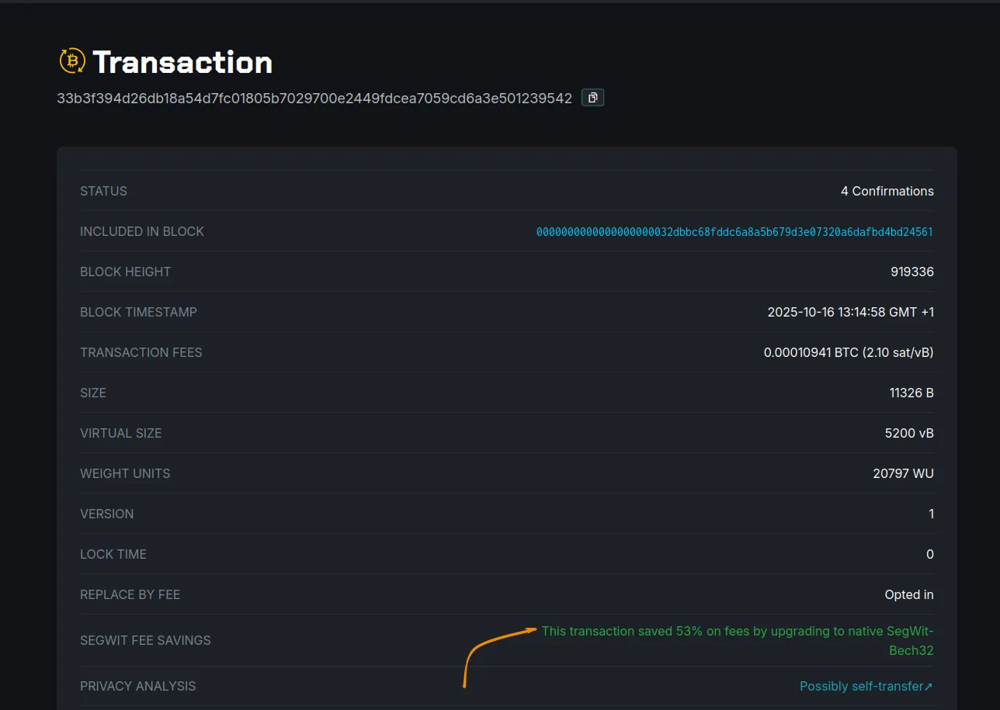

Na tej stronie można dowiedzieć się, w którym BLOCK została zawarta transakcja. W zależności od rodzaju użytego Address, transakcja może zoptymalizować swoje dane (*wirtualne bajty*), a tym samym zapłacić mniej opłat transakcyjnych. Na przykład ta transakcja zaoszczędziła 53% opłat, używając natywnego formatu SegWit BECH32 Address zaczynającego się od `bc1q`.

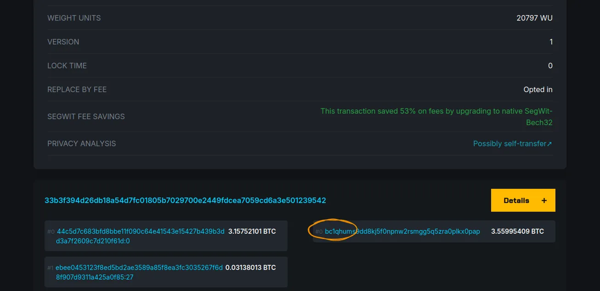

## Powłoka Liquid

Liquid Network to [*Sidechain*](https://planb.network/en/resources/glossary/Sidechain) i rozwiązanie open source poziomu 2 dla protokołu Bitcoin. W szczególności umożliwia szybsze i bardziej poufne transakcje Bitcoin.

W eksploratorze BLOCKSTREAM.info kliknij przycisk **"Liquid"**, aby przełączyć się na Liquid Network.

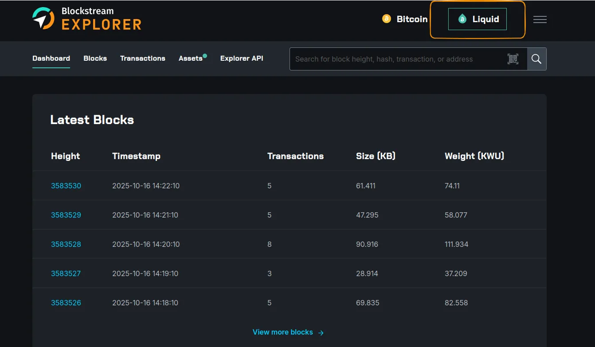

Klikając na jedną z transakcji, które chcemy śledzić, widzimy, że kwoty kawałków Bitcoin są zastąpione słowami "**Poufne**". W tej sieci transakcje mogą być poufne, więc nie możemy zobaczyć kwot każdego UTXO, ani w transakcji, ani poza nią.

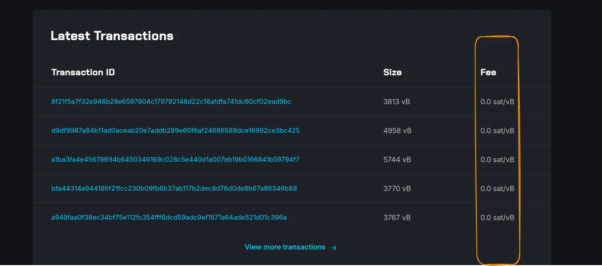

Zwracamy jednak uwagę, że zasady i mechanizmy obecne w głównym Layer protokołu Bitcoin są takie same: skrypty blokujące Bitcoin i identyfikowalność UTXO.

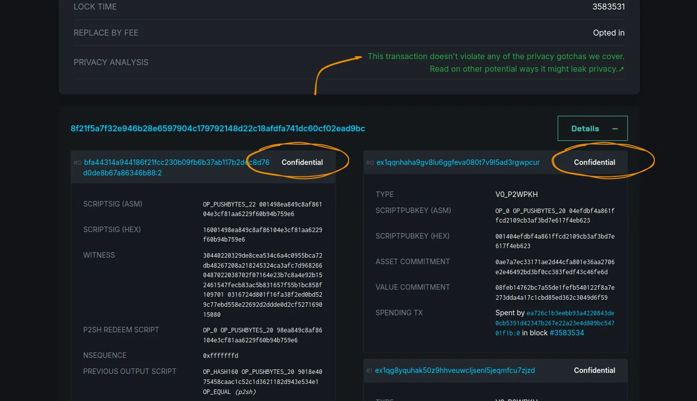

Liquid Network zapewnia również nie-depozytowe zasoby cyfrowe, z których mogą korzystać organizacje. W menu **"Assets "** znajduje się lista zarejestrowanych zasobów, ich suma i domena, do której się odnoszą.

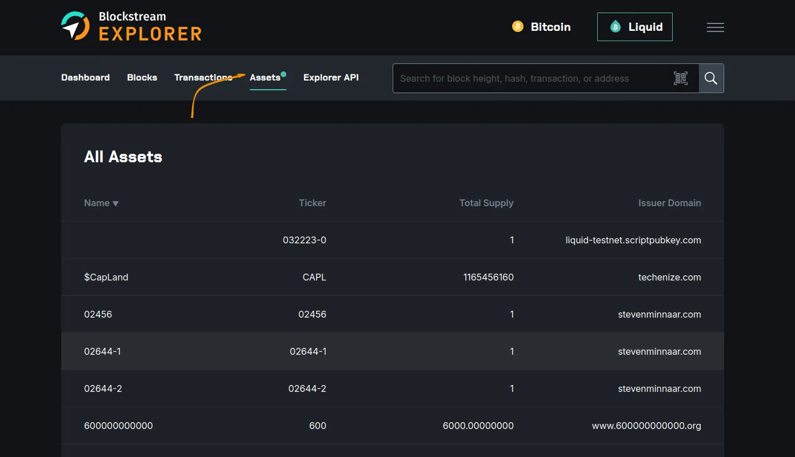

Dla każdego aktywa można prześledzić historię transakcji emisji i spalenia (usuwając sumę w obiegu).

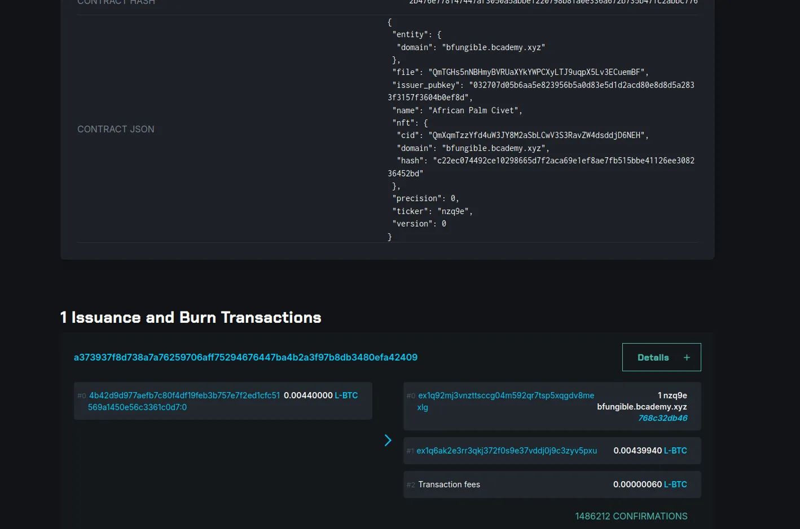

## Więcej opcji

Eksplorator BLOCKSTREAM.info zawiera również wizualizacje i śledzenie transakcji na Testnet, Bitcoin, On-Chain i Liquid Network.

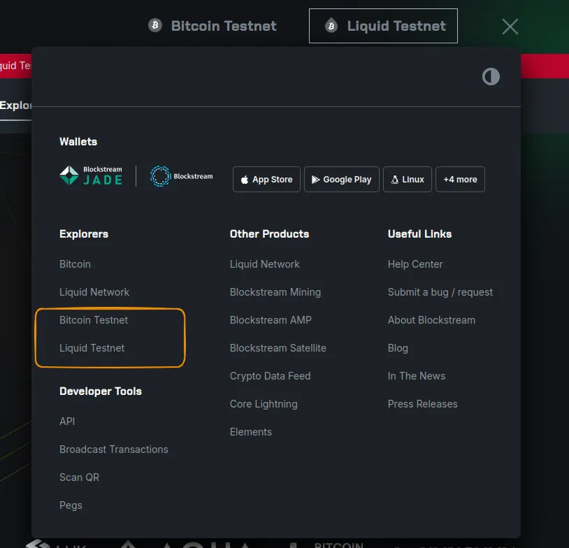

Kiedy przechodzisz do sieci Testnet, nie używasz prawdziwych bitcoinów, ale masz wszystkie funkcje opisane powyżej.

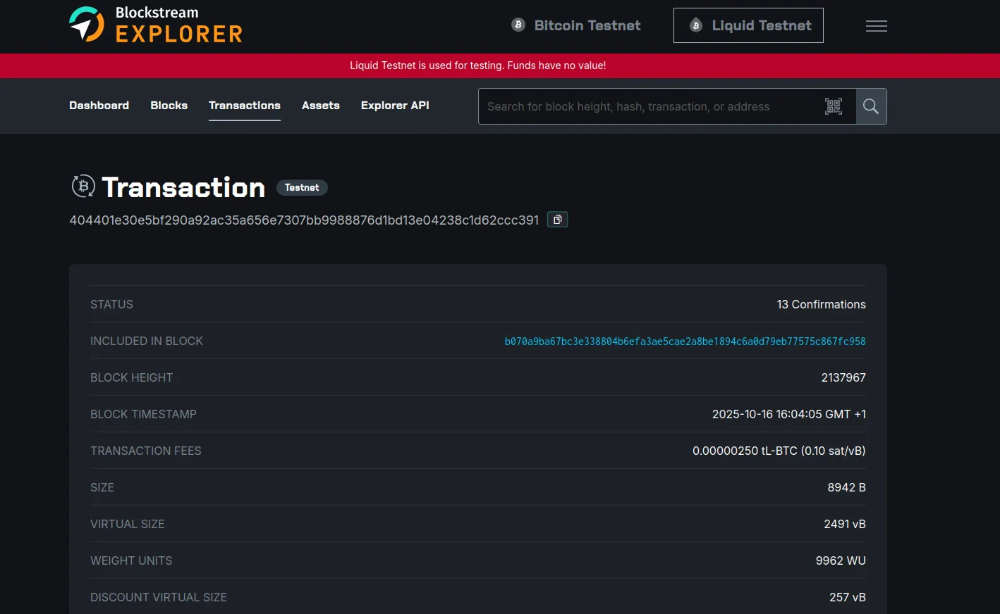

Ta sieć ma inną długość łańcucha, do którego można podłączyć i przetestować działanie mechanizmów Bitcoin i Liquid.

- Sekcja API jest przeznaczona dla każdego, kto chce zintegrować niektóre funkcje Eksploratora z własną aplikacją. Za pomocą API można na przykład przeglądać główny łańcuch różnych warstw (On-Chain i Liquid), śledzić transakcje i sprawdzać średnie opłaty za transakcje w BLOCK.

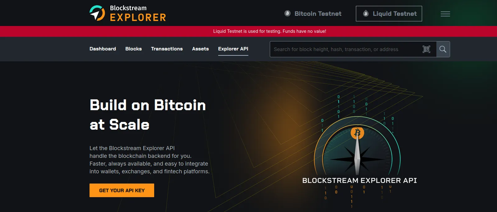

Jesteś teraz gotowy, aby w pełni wykorzystać potencjał BLOCKSTREAM Explorer do odpytywania blockchainów w warstwach On-Chain i Liquid. Mamy nadzieję, że ten samouczek był dla Ciebie pouczający i polecamy nasz samouczek na temat innego Bitcoin Explorer:

https://planb.network/tutorials/privacy/analysis/mempool-space-f3e468a1-92f1-43ce-b2e4-c3298fa0e02f