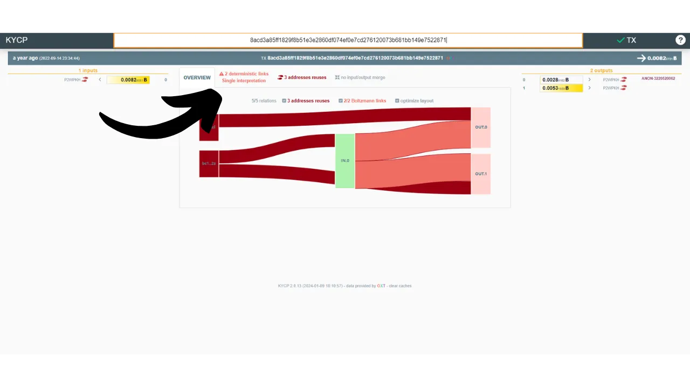
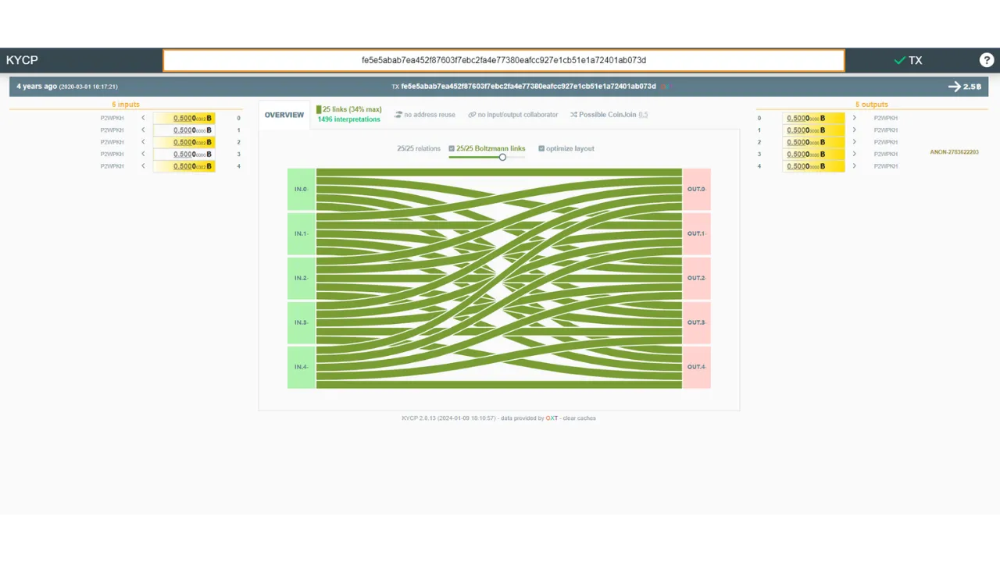
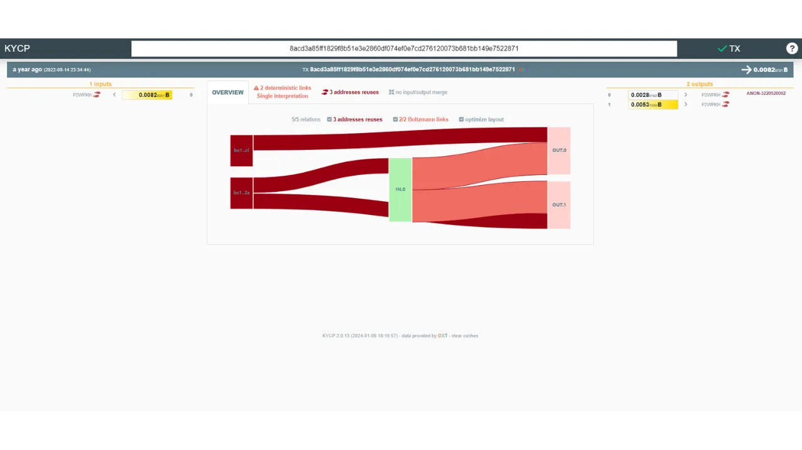

ボルツマン計算機は、エントロピーのレベルとその他の高度な指標を測定することにより、ビットコイン取引を分析するためのツールです。これは、取引の入力と出力の間の接続に関する洞察を提供します。これらの指標は、取引のプライバシーを定量的に評価し、潜在的なエラーを特定するのに役立ちます。

このPythonツールはSamourai WalletとOXTのチームによって開発されましたが、任意のビットコイン取引で使用できます。

## ボルツマン計算機の使用方法は？
ボルツマン計算機を使用するには、2つのオプションがあります。1つ目は、[Pythonツール](https://code.samourai.io/oxt/boltzmann)を直接あなたのマシンにインストールすることです。または、簡易的な使用プラットフォームを提供する[KYCP.org](https://kycp.org/#/) (_Know Your Coin Privacy_) ウェブサイトを選択することもできます。[RoninDojo](https://planb.network/tutorials/node/ronin-dojo-v2)ユーザーの方は、このツールが既にあなたのノードに統合されていることに注意してください。

KYCPサイトの使用は非常に簡単です：分析したい取引の識別子（TXID）を検索バーに入力し、`ENTER`キーを押してください。

すると、取引に関するさまざまな情報、入力と出力の間のリンクを含む情報が表示されます。`deterministic links`をクリックしてください。

すると、ボルツマン計算機の指標に関するページに到着します。

ツールを直接RoninDojoノードから使用することを好む方は、`RoninCLI > Samourai Toolkit > ボルツマン計算機`経由でアクセスできます。

コンピューター上でのローカル使用には、このアドレスでシステムに特有の指示が利用可能です：[https://code.samourai.io/oxt/boltzmann](https://code.samourai.io/oxt/boltzmann)

KYCP.orgサイトと同様に、Pythonツールをインストールしたら、分析したい取引のTXIDを貼り付けるだけです。


その後、`ENTER`キーを押して結果を取得します。


## ボルツマン計算機の指標は何ですか？
### 組み合わせ / 解釈：
ソフトウェアが計算する最初の指標は、`nb combinations`またはツール内の`interpretations`の下に示される可能な組み合わせの総数です。

取引に関与するUTXOの値を考慮に入れると、この指標は入力が出力とどのように関連付けられるかの方法の数を計算します。言い換えれば、外部の観察者がそれを分析する観点から、取引が引き起こす可能性のある解釈の数を決定します。
例えば、Whirlpool 5x5モデルに従って構造化されたcoinjoinは`1,496`の可能な組み合わせを提示します： 
一方、Whirlpool Surge Cycle 8x8のcoinjoinは`9,934,563`の可能な解釈を提示します： 
対照的に、1つの入力と2つの出力を持つより伝統的な取引は、単一の解釈しか提示しません： 

### エントロピー：
計算される2番目の指標は、取引のエントロピーであり、`Entropy`と指定されます。
暗号学と情報の一般的な文脈において、エントロピーはデータソースやランダムプロセスに関連する不確実性や予測不可能性の定量的な尺度です。言い換えれば、エントロピーは情報を予測または推測することがどれだけ難しいかを測る方法です。

チェーン分析の特定の文脈において、エントロピーはまた、Shannonエントロピーから派生し、[LaurentMTによって発明された](https://gist.github.com/LaurentMT/e758767ca4038ac40aaf)指標の名前でもあり、これはBoltzmannツールで計算されます。

トランザクションが多数の可能な組み合わせを提示する場合、そのエントロピーを参照することがしばしばより関連性があります。この指標は、アナリストがトランザクションの正確な構成についての知識の欠如を測定することを可能にします。言い換えれば、エントロピーが高いほど、アナリストが入力と出力の間のビットコインの動きを特定する作業が難しくなります。

実際には、エントロピーは、外部の観察者の観点から、トランザクションが入力と出力の金額に基づいてのみ、他の外部または内部のパターンやヒューリスティックを考慮せずに、複数の可能な解釈を提示するかどうかを明らかにします。高いエントロピーは、その後、トランザクションのより良い機密性と同義です。

エントロピーは、可能な組み合わせの数の二進対数として定義されます。こちらが使用される式です：
```bash
E: トランザクションのエントロピー
C: トランザクションの可能な組み合わせの数

E = log2(C)
```

数学において、二進対数（基数2の対数）は2を指数にする操作の逆操作に相当します。言い換えれば、`x`の二進対数は、`x`を得るために`2`を上げる必要がある指数です。この指標はビットで表されます。

Whirlpool 5x5モデルに従って構造化されたコインジョイントランザクションのエントロピーを計算する例を取り上げましょう。これは、前述のように、`1,496`の可能な組み合わせを提供します：
```bash
C = 1,496
E = log2(1,496)
E = 10.5469 ビット
```
このように、このコインジョイントランザクションは`10.5469 ビット`のエントロピーを示し、これは非常に満足できると考えられます。この値が高いほど、トランザクションはより多くの異なる解釈を許容し、それによってそのプライバシーレベルを強化します。
`9,934,563`の解釈を提示する8x8コインジョイントランザクションの場合、エントロピーは以下のようになります：
```bash
C = 9,934,563
E = log2(9,934,563)
E = 23.244 ビット
```

もう一つの例として、1つの入力と2つの出力を特徴とするより従来のトランザクションを取り上げます：[1b1b0c3f0883a99f1161c64da19471841ed12a1f78e77fab128c69a5f578ccce](https://mempool.space/tx/1b1b0c3f0883a99f1161c64da19471841ed12a1f78e77fab128c69a5f578ccce) このトランザクションの場合、唯一可能な解釈は：`(In.0) > (Out.0 ; Out.1)`です。その結果、そのエントロピーは`0`に設定されます：
```bash
C = 1
E = log2(1)
E = 0 ビット
```

### 効率性：
Boltzmann Calculatorによって提供される第三の指標は`Wallet Efficiency`と名付けられています。この指標は、トランザクションを同一の構成で考えられる最適なトランザクションと比較することによって、トランザクションの効率を評価します。
これは、特定のトランザクション構造が理論的に達成可能な最高のエントロピーに相当する、最大エントロピーの概念を議論するに至るものです。その後、分析されたトランザクションの実際のエントロピーとこの最大エントロピーを対比させることによって、トランザクションの効率が計算されます。
使用される式は以下の通りです：
```bash
ER: トランザクションの実際のエントロピー（ビット単位）
EM: 与えられたトランザクション構造で可能な最大エントロピー（ビット単位）
Ef: トランザクションの効率（ビット単位）

Ef = ER - EM
```

例えば、Whirlpool 5x5タイプのコインジョイン構造において、最大エントロピーは`10.5469`に設定されます：
```bash
ER = 10.5469
EM = 10.5469
Ef = 10.5469 - 10.5469 = 0 ビット
```

この指標はパーセンテージとしても表現され、その式は以下の通りです：
```bash
CR: 実際の可能な組み合わせの数
CM: 同じ構造での可能な最大組み合わせ数
Ef: 効率（パーセンテージとして）

Ef = CR / CM
Ef = 1,496 / 1,496
Ef = 100%
```

したがって、`100%`の効率は、その構造に従ってトランザクションがプライバシーの可能性を最大限に活用していることを示します。

### エントロピー密度：
第四の指標は、ツール`Entropy Density`に記載されているエントロピー密度です。これは、トランザクションの各入力または出力に対するエントロピーを相対的に提供するものです。この指標は、異なるサイズのトランザクションの効率を評価し比較するのに役立ちます。計算するには、トランザクションの総エントロピーを関与する入力と出力の総数で割ります：
```bash
ED: エントロピー密度（ビット単位）
E: トランザクションのエントロピー（ビット単位）
T: トランザクションの入力と出力の総数

ED = E / T
```

Whirlpool 5x5コインジョインの例を取り上げましょう：
```bash
T = 5 + 5 = 10
E = 10.5469
ED = 10.5469 / 10 = 1.054 ビット
```

また、Whirlpool 8x8コインジョインのエントロピー密度を計算しましょう：
```bash
T = 8 + 8 = 16
E = 23.244
ED = 23.244 / 16 = 1.453 ビット
```

### ボルツマンスコア：
Boltzmann Calculatorによって提供される情報の第五は、入力と出力間の一致確率の表です。この表は、ボルツマンスコアを通じて、特定の入力が与えられた出力に関連する条件付き確率を示します。

これは、トランザクション内の入力と出力の間の関連付けが発生する条件付き確率の定量的な尺度であり、解釈のセット内でこのイベントの有利な発生の数を可能な発生の総数に対する比率に基づいています。

再びWhirlpoolコインジョインの例を取り上げると、条件付き確率の表は、各入力と出力間のリンケージの可能性を強調し、トランザクション内の関連付けのあいまいさの定量的な尺度を提供します：

| %       | 出力 0 | 出力 1 | 出力 2 | 出力 3 | 出力 4 |
| ------- | ------ | ------ | ------ | ------ | ------ |
| 入力 0 | 34%    | 34%    | 34%    | 34%    | 34%    |
| 入力 1 | 34%    | 34%    | 34%    | 34%    | 34%    |
ここでは、各入力が任意の出力と関連付けられる可能性が等しく、これにより取引の機密性が高まることが明確に見て取れます。ボルツマンスコアの計算には、特定のイベントが発生する解釈の数を利用可能な解釈の総数で割ることが含まれます。したがって、入力番号0が出力番号3（`512`の解釈）と関連付けられるスコアを決定するためには、以下の手順が使用されます：
```bash
解釈 (IN.0 > OUT.3) = 512
総解釈数 = 1496
スコア = 512 / 1496 = 34%
```

Whirlpool 8x8のコインジョイン（サージサイクル）の例を取ると、ボルツマンテーブルは以下のようになります：

|       | OUT.0 | OUT.1 | OUT.2 | OUT.3 | OUT.4 | OUT.5 | OUT.6 | OUT.7 |
|-------|-------|-------|-------|-------|-------|-------|-------|-------|
| IN.0  | 23%   | 23%   | 23%   | 23%   | 23%   | 23%   | 23%   | 23%   |
| IN.1  | 23%   | 23%   | 23%   | 23%   | 23%   | 23%   | 23%   | 23%   |
| IN.2  | 23%   | 23%   | 23%   | 23%   | 23%   | 23%   | 23%   | 23%   |
| IN.3  | 23%   | 23%   | 23%   | 23%   | 23%   | 23%   | 23%   | 23%   |
| IN.4  | 23%   | 23%   | 23%   | 23%   | 23%   | 23%   | 23%   | 23%   |
| IN.5  | 23%   | 23%   | 23%   | 23%   | 23%   | 23%   | 23%   | 23%   |
| IN.6  | 23%   | 23%   | 23%   | 23%   | 23%   | 23%   | 23%   | 23%   |
| IN.7  | 23%   | 23%   | 23%   | 23%   | 23%   | 23%   | 23%   | 23%   |

しかし、単一の入力と2つの出力を持つ単純な取引の場合、状況は異なります：

| %       | 出力0 | 出力1 |
|---------|-------|-------|
| 入力0 | 100%   | 100%   |
ここでは、各出力が入力No. 0から発生する確率が`100%`であることが観察されます。したがって、確率が低いほど、入力と出力の間の直接的なリンクを希釈することにより、プライバシーが高まります。

### 決定論的リンク:
提供される情報の6番目は、決定論的リンクの数とこれらのリンクの比率によって補完されます。この指標は、分析されたトランザクション内の入力と出力の間に確実に存在する接続がいくつあるかを明らかにし、その確率は`100%`です。一方、比率はこれらの決定論的リンクがトランザクションリンクの全体セット内で占める重みについての視点を提供します。
例えば、Whirlpool型のcoinjoinトランザクションには決定論的リンクが存在せず、したがって指標と比率は`0%`を表示します。逆に、私たちが検討した2番目の単純なトランザクション（1つの入力と2つの出力を持つ）では、指標は`2`に設定され、比率は`100%`に達します。したがって、指標がゼロであることは、入力と出力の間に直接的で確実なリンクがないため、優れた機密性を示します。

**外部リソース:**

- [SamouraiのBoltzmann Code](https://code.samourai.io/oxt/boltzmann) 
- [Bitcoin Transactions & Privacy (Part I) by Laurent MT](https://gist.github.com/LaurentMT/e758767ca4038ac40aaf)
- [Bitcoin Transactions & Privacy (Part II) by Laurent MT](https://gist.github.com/LaurentMT/d361bca6dc52868573a2)
- [Bitcoin Transactions & Privacy (Part III) by Laurent MT](https://gist.github.com/LaurentMT/e8644d5bc903f02613c6)
- [KYCP Website](https://kycp.org/#/)
- [Laurent MTによるBoltzmann Scriptの紹介についてのMedium記事](https://medium.com/@laurentmt/introducing-boltzmann-85930984a159)