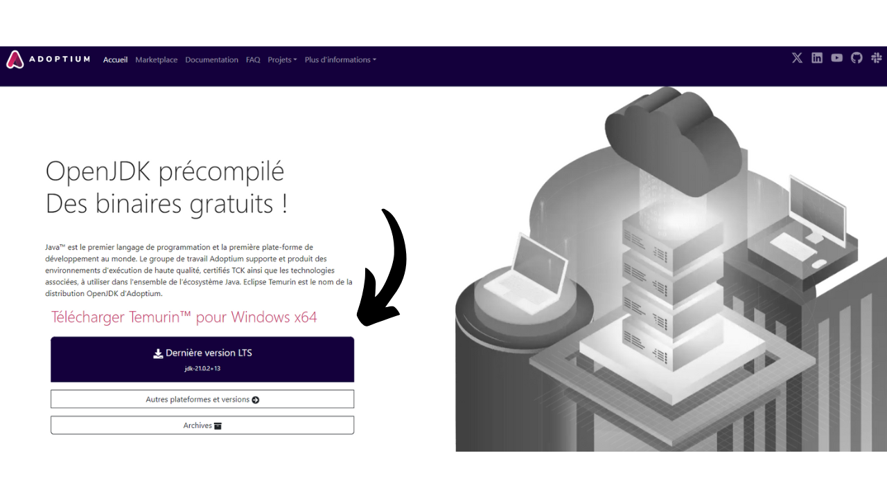

En este tutorial, aprenderás qué es un coinjoin y cómo realizar uno utilizando el software Samourai Wallet y la implementación Whirlpool, utilizando tu propio Dojo. En mi opinión, este método es actualmente el mejor para mezclar tus bitcoins.

## ¿Qué es un coinjoin en Bitcoin?
**Un coinjoin es una técnica que rompe la trazabilidad de los bitcoins en la blockchain**. Se basa en una transacción colaborativa con una estructura específica del mismo nombre: la transacción coinjoin.

Los coinjoins mejoran la privacidad de los usuarios de Bitcoin complicando el análisis de cadena para observadores externos. Su estructura permite fusionar múltiples monedas de diferentes usuarios en una sola transacción, difuminando así los rastros y dificultando determinar los vínculos entre direcciones de entrada y salida.

El principio del coinjoin se basa en un enfoque colaborativo: varios usuarios que desean mezclar sus bitcoins depositan cantidades idénticas como entradas de la misma transacción. Estas cantidades se redistribuyen luego como salidas de igual valor a cada usuario. Al final de la transacción, se vuelve imposible asociar una salida específica con un usuario conocido en la entrada. No existe un vínculo directo entre las entradas y salidas, lo que rompe la asociación entre los usuarios y sus UTXO, así como la historia de cada moneda.

Ejemplo de una transacción coinjoin (no mía): [323df21f0b0756f98336437aa3d2fb87e02b59f1946b714a7b09df04d429dec2](https://mempool.space/es/tx/323df21f0b0756f98336437aa3d2fb87e02b59f1946b714a7b09df04d429dec2)

Para realizar un coinjoin asegurando que cada usuario mantenga el control sobre sus fondos en todo momento, el proceso comienza con la transacción siendo construida por un coordinador, quien luego la transmite a los participantes. Cada usuario firma entonces la transacción después de verificar que les conviene. Todas las firmas recopiladas finalmente se integran en la transacción. Si un usuario o el coordinador intentan desviar fondos, mediante una modificación de las salidas de la transacción coinjoin, las firmas se volverán inválidas, llevando al rechazo de la transacción por los nodos.

Existen varias implementaciones de coinjoin, como Whirlpool, JoinMarket o Wabisabi, cada una con el objetivo de gestionar la coordinación entre participantes y aumentar la eficiencia de las transacciones coinjoin.
En este tutorial, profundizaremos en la implementación de **Whirlpool**, que considero la solución más eficiente para realizar coinjoins en Bitcoin. Aunque disponible en varias billeteras, en este tutorial, exploraremos su uso exclusivamente con la aplicación móvil Samourai Wallet, sin Dojo.

## ¿Por qué realizar coinjoins en Bitcoin?
Uno de los problemas iniciales con cualquier sistema de pago de igual a igual es el doble gasto: ¿cómo prevenir que individuos malintencionados gasten las mismas unidades monetarias múltiples veces sin recurrir a una autoridad central para arbitrar?

Satoshi Nakamoto proporcionó una solución a este dilema a través del protocolo Bitcoin, un sistema de pago electrónico de igual a igual que opera independientemente de cualquier autoridad central. En su documento técnico, enfatiza que la única manera de certificar la ausencia de doble gasto es asegurar la visibilidad de todas las transacciones dentro del sistema de pago.
Para asegurar que cada participante esté al tanto de las transacciones, estas deben ser divulgadas públicamente. Por lo tanto, el funcionamiento de Bitcoin se basa en una infraestructura transparente y distribuida, permitiendo que cualquier operador de nodo verifique la totalidad de las cadenas de firma electrónica y el historial de cada moneda, desde su creación por un minero.
La naturaleza transparente y distribuida de la blockchain de Bitcoin significa que cualquier usuario de la red puede seguir y analizar las transacciones de todos los demás participantes. Como resultado, la anonimidad a nivel de transacción es imposible. Sin embargo, la anonimidad se preserva a nivel de identificación individual. A diferencia del sistema bancario tradicional donde cada cuenta está vinculada a una identidad personal, en Bitcoin, los fondos están asociados con pares de claves criptográficas, ofreciendo así a los usuarios una forma de pseudonimato detrás de identificadores criptográficos.

Por lo tanto, la confidencialidad en Bitcoin se ve comprometida cuando observadores externos logran asociar UTXOs específicos con usuarios identificados. Una vez establecida esta asociación, se hace posible rastrear sus transacciones y analizar el historial de sus bitcoins. Coinjoin es precisamente una técnica desarrollada para romper la trazabilidad de los UTXOs, ofreciendo así una cierta capa de confidencialidad a los usuarios de Bitcoin a nivel de transacción.

## ¿Cómo funciona Whirlpool?
Whirlpool se distingue de otros métodos de coinjoin al usar transacciones "_ZeroLink_", las cuales aseguran que estrictamente no hay un vínculo técnico posible entre todas las entradas y todas las salidas. Esta mezcla perfecta se logra a través de una estructura donde cada participante contribuye con una cantidad idéntica en entrada (excepto por las comisiones de minería), generando así salidas de cantidades perfectamente iguales.
Este enfoque restrictivo para las entradas otorga a las transacciones coinjoin de Whirlpool una característica única: la completa ausencia de enlaces determinísticos entre las entradas y las salidas. En otras palabras, cada salida tiene una probabilidad igual de ser atribuida a cualquier participante, en comparación con todas las otras salidas en la transacción.
Inicialmente, el número de participantes en cada coinjoin de Whirlpool estaba limitado a 5, con 2 nuevos participantes y 3 remezcladores (explicaremos estos conceptos más adelante). Sin embargo, el aumento en las comisiones de transacción en cadena observado en 2023 impulsó a los equipos de Samourai a repensar su modelo para mejorar la privacidad mientras reducen costos. Así, teniendo en cuenta la situación del mercado de comisiones y el número de participantes, el coordinador ahora puede organizar coinjoins incluyendo 6, 7 u 8 participantes. Estas sesiones mejoradas se denominan "_Ciclos de Aumento_". Es importante señalar que, independientemente de la configuración, siempre hay solo 2 nuevos participantes en los coinjoins de Whirlpool.

Así, las transacciones de Whirlpool se caracterizan por un número idéntico de entradas y salidas, que pueden ser:
- 5 entradas y 5 salidas;

- 6 entradas y 6 salidas;

- 7 entradas y 7 salidas;

- 8 entradas y 8 salidas.

El modelo propuesto por Whirlpool se basa así en pequeñas transacciones coinjoin. A diferencia de Wasabi y JoinMarket, donde la robustez de los conjuntos anónimos depende del volumen de participantes en un solo ciclo, Whirlpool apuesta por la cadena de múltiples ciclos de pequeño tamaño.

En este modelo, el usuario paga comisiones solo en su entrada inicial a un pool, permitiéndoles participar en una multitud de remezclas sin comisiones adicionales. Son los nuevos participantes quienes cubren las comisiones de minería para los remezcladores.
Con cada coinjoin adicional en el que participa una moneda, junto con sus pares encontrados anteriormente, los anonsets crecerán exponencialmente. El objetivo es, por lo tanto, aprovechar estos remixes gratuitos que, con cada ocurrencia, contribuyen a aumentar la densidad de los anonsets asociados con cada moneda mezclada.
Whirlpool fue diseñado teniendo en cuenta dos requisitos importantes:
- La accesibilidad de implementación en dispositivos móviles, dado que Samourai Wallet es principalmente una aplicación para smartphones;
- La velocidad de los ciclos de remixing para promover un aumento significativo en los anonsets.
Estos imperativos guiaron las elecciones de los desarrolladores de Samourai Wallet en el diseño de Whirlpool, llevándolos a limitar el número de participantes por ciclo. Demasiados pocos participantes habrían comprometido la eficiencia del coinjoin, reduciendo drásticamente los anonsets generados en cada ciclo, mientras que demasiados participantes habrían planteado problemas de gestión en aplicaciones móviles y habrían obstaculizado el flujo de ciclos.
**En última instancia, no es necesario tener un alto número de participantes por coinjoin en Whirlpool ya que los anonsets se logran a través de la acumulación de varios ciclos de coinjoin.**

[-> Aprende más sobre los anonsets de Whirlpool.](https://planb.network/tutorials/privacy/wst-anonsets)

### Las piscinas y las tarifas de coinjoin
Para que estos múltiples ciclos aumenten efectivamente los anonsets de las monedas mezcladas, se debe establecer un cierto marco para restringir las cantidades de UTXO utilizadas. Whirlpool define diferentes piscinas de esta manera.

Una piscina representa un grupo de usuarios que desean mezclarse juntos, quienes acuerdan la cantidad de UTXO a usar para optimizar el proceso de coinjoin. Cada piscina especifica una cantidad fija para el UTXO, a la cual el usuario debe adherirse para participar. Así, para realizar coinjoins con Whirlpool, necesitas seleccionar una piscina. Las piscinas actualmente disponibles son las siguientes:
- 0.5 bitcoins;
- 0.05 bitcoin;
- 0.01 bitcoin;
- 0.001 bitcoin (= 100,000 sats).

Al unirte a una piscina con tus bitcoins, estos se dividirán para generar UTXOs que son perfectamente homogéneos con los de los otros participantes en la piscina. Cada piscina tiene un límite máximo; por lo tanto, para cantidades que excedan este límite, te verás obligado ya sea a hacer dos entradas separadas dentro de la misma piscina o a moverte a otra piscina con una cantidad mayor:

| Piscina (bitcoin) | Cantidad máxima por entrada (bitcoin) |
|-------------------|---------------------------------------|
| 0.5               | 35                                    |
| 0.05              | 3.5                                   |
| 0.01              | 0.7                                   |
| 0.001             | 0.025                                 |

Como se mencionó anteriormente, un UTXO se considera que pertenece a una piscina cuando está listo para ser integrado en un coinjoin. Sin embargo, esto no significa que el usuario pierda la posesión de este. **A través de los diferentes ciclos de mezcla, retienes el control total de tus claves y, en consecuencia, de tus bitcoins.** Esto es lo que diferencia la técnica de coinjoin de otras técnicas de mezcla centralizadas.

Para entrar en una piscina de coinjoin, se deben pagar tarifas de servicio así como tarifas de minería. Las tarifas de servicio son fijas para cada piscina y están destinadas a compensar a los equipos responsables del desarrollo y mantenimiento de Whirlpool.
Las tarifas de servicio para usar Whirlpool se deben pagar solo una vez al entrar en la piscina. Después de este paso, tienes la oportunidad de participar en un número ilimitado de remixes sin ninguna tarifa adicional. Aquí están las tarifas fijas actuales para cada piscina:
| Piscina (bitcoin) | Tarifa de Entrada (bitcoin) |
|-------------------|-----------------------------|
| 0.5            | 0.0175                    || 0.05           | 0.00175                   |
| 0.01           | 0.0005 (50,000 sats)      |
| 0.001          | 0.00005 (5,000 sats)      |

Estas tarifas funcionan esencialmente como un boleto de entrada para el pool elegido, independientemente de la cantidad que se ingrese en coinjoin. Por lo tanto, ya sea que te unas al pool de 0.01 con exactamente 0.01 BTC o entres con 0.5 BTC, las tarifas permanecerán iguales en valor absoluto.

Antes de proceder a los coinjoins, el usuario, por lo tanto, tiene una elección entre 2 estrategias:
- Optar por un pool más pequeño para minimizar las tarifas de servicio, sabiendo que recibirán varios UTXOs pequeños a cambio;
- O preferir un pool más grande, aceptando pagar tarifas más altas para terminar con un número reducido de UTXOs de mayor valor.

Generalmente se desaconseja fusionar varios UTXOs mezclados después de los ciclos de coinjoin, ya que esto podría comprometer la confidencialidad adquirida, especialmente debido a la Heurística de Propiedad de Entrada Común (CIOH, por sus siglas en inglés). Por lo tanto, puede ser prudente elegir un pool más grande, incluso si eso significa pagar más, para evitar tener demasiados UTXOs de pequeño valor en la salida. El usuario debe sopesar estos compromisos para elegir el pool que prefiera.

Además de las tarifas de servicio, también se deben considerar las tarifas de minería inherentes a cualquier transacción de Bitcoin. Como usuario de Whirlpool, se te requerirá pagar las tarifas de minería para la transacción de preparación (`Tx0`) así como las del primer coinjoin. Todos los remixes subsiguientes serán gratuitos, gracias al modelo de Whirlpool que se basa en el pago de los nuevos participantes.

De hecho, en cada coinjoin de Whirlpool, dos usuarios entre las entradas son nuevos participantes. Las otras entradas provienen de remezcladores. Como resultado, las tarifas de minería para todos los participantes en la transacción son cubiertas por estos dos nuevos participantes, quienes luego también se beneficiarán de remixes gratuitos:

Gracias a este sistema de tarifas, Whirlpool realmente se diferencia de otros servicios de coinjoin ya que los anonsets de los UTXOs no son proporcionales al precio pagado por el usuario. Por lo tanto, es posible alcanzar niveles de anonimato considerablemente altos pagando solo la tarifa de entrada del pool y las tarifas de minería para dos transacciones (la `Tx0` y la mezcla inicial).
Es importante notar que el usuario también tendrá que cubrir las tarifas de minería para retirar sus UTXOs del pool después de completar sus múltiples coinjoins, a menos que hayan seleccionado la opción `mix to`, la cual discutiremos en el tutorial a continuación.

### Las cuentas de billetera HD utilizadas por Whirlpool
Para realizar un coinjoin a través de Whirlpool, la billetera debe generar varias cuentas distintas. Una cuenta, en el contexto de una billetera HD (*Hierarchical Deterministic*), constituye una sección completamente aislada de las demás, esta separación ocurriendo en el tercer nivel de profundidad de la jerarquía de la billetera, es decir, en el nivel del `xpub`.

Una billetera HD puede teóricamente derivar hasta `2^(32/2)` cuentas diferentes. La cuenta inicial, utilizada por defecto en todas las billeteras de Bitcoin, corresponde al índice `0'`.

Para billeteras adaptadas a Whirlpool, como Samourai o Sparrow, se utilizan 4 cuentas para satisfacer las necesidades del proceso de coinjoin:
- La cuenta de **depósito**, identificada por el índice `0'`;
- La cuenta de **banco malo** (o cambio tóxico), identificada por el índice `2 147 483 644`;
- La cuenta de **premezcla**, identificada por el índice `2 147 483 645`;
- La cuenta de **postmezcla**, identificada por el índice `2 147 483 646`.

Cada una de estas cuentas cumple una función específica dentro del coinjoin.

Todas estas cuentas están vinculadas a una única semilla, lo que permite al usuario recuperar el acceso a todos sus bitcoins utilizando su frase de recuperación y, si es necesario, su contraseña. Sin embargo, es necesario especificar al software, durante esta operación de recuperación, los diferentes índices de cuenta que se utilizaron.

Ahora veamos las diferentes etapas de un coinjoin de Whirlpool dentro de estas cuentas.

### Las diferentes etapas de coinjoins en Whirlpool
**Etapa 1: El Tx0**
El punto de partida de cualquier coinjoin de Whirlpool es la cuenta de **depósito**. Esta cuenta es la que automáticamente usas cuando creas una nueva cartera de Bitcoin. Esta cuenta debe ser acreditada con los bitcoins que uno desea mezclar.
El `Tx0` representa el primer paso en el proceso de mezcla de Whirlpool. Su objetivo es preparar e igualar el UTXO para el coinjoin, dividiéndolos en unidades correspondientes a la cantidad de la piscina seleccionada, para asegurar la homogeneidad de la mezcla. Los UTXO igualados son entonces enviados a la cuenta de **premezcla**. En cuanto a la diferencia que no puede entrar en la piscina, se separa en una cuenta específica: el **banco malo** (o "cambio tóxico").
Esta transacción inicial `Tx0` también sirve para liquidar las tarifas de servicio debidas al coordinador de la mezcla. A diferencia de los siguientes pasos, esta transacción no es colaborativa; el usuario debe por lo tanto asumir todas las tarifas de minería:

En este ejemplo de una transacción `Tx0`, una entrada de `372,000 sats` de nuestra cuenta de **depósito** se divide en varios UTXO de salida, que se distribuyen de la siguiente manera:
- Una cantidad de `5,000 sats` destinada al coordinador por tarifas de servicio, correspondiente a la entrada en la piscina de `100,000 sats`;
- Tres UTXO preparados para la mezcla, redirigidos a nuestra cuenta de **premezcla** y registrados con el coordinador. Estos UTXO se igualan a `108,000 sats` cada uno, para cubrir las tarifas de minería de su futura mezcla inicial;
- El excedente que no puede entrar en la piscina, por ser demasiado pequeño, se considera cambio tóxico. Se envía a su cuenta específica. Aquí, este cambio asciende a `40,000 sats`;
- Finalmente, hay `3,000 sats` que no constituyen una salida, pero son las tarifas de minería necesarias para confirmar el `Tx0`.

Por ejemplo, aquí hay un real Whirlpool Tx0 (no mío): [edef60744f539483d868caff49d4848e5cc6e805d6cdc8d0f9bdbbaedcb5fc46](https://mempool.space/es/tx/edef60744f539483d868caff49d4848e5cc6e805d6cdc8d0f9bdbbaedcb5fc46)

**Paso 2: El cambio tóxico**
El excedente que no pudo ser integrado en el pool, aquí equivalente a `40,000 sats`, es redirigido a la cuenta del **banco malo**, también referido como "cambio tóxico", para asegurar una estricta separación de los otros UTXO en la billetera.
Este UTXO es peligroso para la privacidad del usuario porque no solo sigue estando vinculado a su pasado, y por lo tanto posiblemente a la identidad de su propietario, sino que además, se señala como perteneciente a un usuario que ha realizado un coinjoin.
Si este UTXO se fusiona con salidas mezcladas, perderán toda la confidencialidad ganada durante los ciclos de coinjoin, notablemente debido a la Heurística de Propiedad de Entrada Común (CIOH por sus siglas en inglés). Si se fusiona con otros cambios tóxicos, el usuario corre el riesgo de perder confidencialidad ya que esto vinculará las diferentes entradas de los ciclos de coinjoin. Por lo tanto, debe manejarse con precaución. La forma de gestionar este UTXO tóxico se detallará en la última parte de este artículo, y futuros tutoriales cubrirán estos métodos más a fondo en PlanB Network.

**Paso 3: La Mezcla Inicial**
Después de que se completa el `Tx0`, los UTXOs igualados se envían a la cuenta de **premezcla** de nuestra billetera, listos para ser introducidos en su primer ciclo de coinjoin, también llamado la "mezcla inicial". Si, como en nuestro ejemplo, el `Tx0` genera varios UTXOs destinados a la mezcla, cada uno de ellos será integrado en un coinjoin inicial separado.

Al final de estas primeras mezclas, la cuenta de **premezcla** estará vacía, mientras que nuestras monedas, habiendo pagado las tarifas de minería para este primer coinjoin, se ajustarán exactamente a la cantidad definida por el pool elegido. En nuestro ejemplo, nuestros UTXOs iniciales de `108 000 sats` se habrán reducido exactamente a `100 000 sats`.

**Paso 4: Las Remezclas**
Después de la mezcla inicial, los UTXOs se transfieren a la cuenta de **postmezcla**. Esta cuenta reúne los UTXOs ya mezclados y aquellos que esperan ser remezclados. Cuando el cliente Whirlpool está activo, los UTXOs ubicados en la cuenta de **postmezcla** están automáticamente disponibles para remezclas y serán elegidos al azar para participar en estos nuevos ciclos.

Como recordatorio, las remezclas son entonces 100% gratuitas: no se requieren tarifas de servicio adicionales ni tarifas de minería. Mantener los UTXOs en la cuenta de **postmezcla** mantiene así su valor intacto y mejora simultáneamente sus anonsets. Por eso es importante permitir que estas monedas participen en múltiples ciclos de coinjoin. No te cuesta absolutamente nada, y aumenta sus niveles de anonimato.

Cuando decides gastar UTXOs mezclados, puedes hacerlo directamente desde esta cuenta de **postmezcla**. Es aconsejable mantener los UTXOs mezclados en esta cuenta para beneficiarse de las remezclas gratuitas y evitar que salgan del circuito Whirlpool, lo que podría disminuir su confidencialidad.

Como veremos en el siguiente tutorial, también existe la opción de `mezclar hacia`, que ofrece la posibilidad de enviar automáticamente tus monedas mezcladas a otra billetera, como una billetera fría, después de un número definido de coinjoins.
Después de cubrir la teoría, sumerjámonos en la práctica con un tutorial sobre el uso de Whirlpool a través de la aplicación Android de Samourai Wallet, sincronizada con Whirlpool CLI y GUI en tu propio Dojo.
Existen muchas opciones para usar Whirlpool. La que quiero presentar aquí es la opción de Samourai Wallet, una aplicación de gestión de billeteras Bitcoin de código abierto en Android, pero esta vez **con tu propio Dojo**.

Realizar coinjoins a través de Samourai Wallet usando tu propio Dojo es, en mi opinión, la estrategia más efectiva para realizar coinjoins en Bitcoin hasta la fecha. Este enfoque requiere alguna inversión inicial en términos de configuración, pero una vez en su lugar, ofrece la posibilidad de mezclar y remezclar tus bitcoins continuamente, 24 horas al día, 7 días a la semana, sin la necesidad de mantener tu aplicación Samourai activa todo el tiempo. De hecho, gracias a Whirlpool CLI operando en un nodo Bitcoin, siempre estás listo para participar en coinjoins. La aplicación Samourai te da entonces la oportunidad de gastar tus fondos mezclados en cualquier momento, dondequiera que estés, directamente desde tu smartphone. Además, este método tiene la ventaja de nunca conectarte a servidores gestionados por los equipos de Samourai, preservando así tu `xpub` de cualquier exposición externa.

Esta técnica es, por lo tanto, ideal para aquellos que buscan la máxima privacidad y los ciclos de coinjoin de la más alta calidad. Sin embargo, requiere tener un nodo Bitcoin a tu disposición y, como veremos más adelante, requiere cierta configuración. Por lo tanto, es más adecuado para usuarios intermedios a avanzados. Para principiantes, recomiendo familiarizarse con coinjoin a través de estos otros dos tutoriales, que muestran cómo hacerlo desde Sparrow Wallet o Samourai Wallet (sin Dojo):
- **[Tutorial de coinjoin de Sparrow Wallet](https://planb.network/es/tutorials/privacy/coinjoin-sparrow-wallet)**;
- **[Tutorial de coinjoin de Samourai Wallet (sin Dojo)](https://planb.network/es/tutorials/privacy/coinjoin-samourai-wallet)**.

### Entendiendo la Configuración
Para empezar, ¡vas a necesitar un Dojo! Dojo es una implementación de nodo Bitcoin basada en Bitcoin Core, desarrollada por los equipos de Samourai.

Para ejecutar tu propio Dojo, tienes la opción de [instalar un nodo Dojo de forma autónoma](https://samouraiwallet.com/dojo), o aprovechar Dojo sobre otra solución de nodo Bitcoin "todo-en-uno". Actualmente, las opciones disponibles son:
- [RoninDojo](https://ronindojo.io/), que es un Dojo mejorado con herramientas adicionales, incluyendo un asistente de instalación y un asistente de administración. Detallo el procedimiento para configurar y usar RoninDojo en este otro tutorial: [RONINDOJO V2](https://planb.network/es/tutorials/node/ronin-dojo-v2);
- [Umbrel](https://umbrel.com/) con la aplicación "Samourai Server";
- [MyNode](https://mynodebtc.com/) con la aplicación "Dojo";
- [Nodl](https://www.nodl.eu/) con la aplicación "Dojo";
- [Citadel](https://runcitadel.space/) con la aplicación "Samourai".

En nuestra configuración, interactuaremos con tres interfaces distintas:
- **Samourai Wallet**, que alojará nuestra billetera Bitcoin dedicada a coinjoins. Disponible gratuitamente en Android, esta aplicación FOSS te permite controlar tu billetera de mezcla, especialmente para gastar tu postmix desde tu smartphone;
- **Whirlpool CLI** (_Interfaz de Línea de Comandos_), que operará en el nodo que aloja el Dojo. Este software tendrá acceso a las llaves de tu billetera Samourai. Es responsable de comunicarse con el coordinador y gestionar los coinjoins de manera continua. Actúa como una copia de tu billetera Samourai en tu nodo, lista para participar en coinjoins en cualquier momento.
- **Whirlpool GUI** (_Interfaz Gráfica de Usuario_), la interfaz gráfica de usuario que utilizaremos para monitorear la actividad de Whirlpool CLI e iniciar la mezcla de manera remota. Whirlpool GUI proporciona una representación visual de las operaciones realizadas por Whirlpool CLI. Este software debe instalarse en un ordenador separado del Dojo. Para usuarios de Umbrel, MyNode, Nodl y Citadel, Whirlpool GUI es obligatorio. Sin embargo, con RoninDojo, la interfaz Whirlpool GUI ya está integrada en la interfaz web de tu nodo a través de la aplicación `Whirlpool`. Por lo tanto, no necesitarás instalarlo en un PC separado.

En mi opinión, usar RoninDojo representa la mejor solución para realizar coinjoins con un Dojo. Dado que este software de nodo en caja está en asociación directa con los equipos de Samourai, RoninDojo está mucho más optimizado para hacer esto. Además, la integración de Whirlpool GUI en la interfaz web simplifica significativamente el proceso de configuración. En este tutorial, aún explicaré cómo hacerlo con las otras soluciones que integran Dojo (Umbrel, Nodl, MyNode y Citadel).

### Preparando tu Dojo
Para comenzar, necesitarás instalar Dojo y obtener el código QR o el enlace que te permitirá conectarte a él de manera remota. Este enlace es una dirección Tor que termina en `.onion`. Si estás usando RoninDojo, simplemente navega al menú `Pairing` para acceder a esta información.

Debajo de `Samourai Dojo`, haz clic en el botón `Pair now`.

Se mostrarán tu código QR de conexión y el enlace correspondiente.

Si estás en Umbrel, ve a la App Store y busca la aplicación `Samourai Server`. Se encuentra en la pestaña `Bitcoin`.

Instala la aplicación.

Al abrir la aplicación, entonces tendrás acceso al código QR para conectarte a tu Dojo.

Si estás usando otro software de nodo en caja como MyNode, Citadel o Nodl, el proceso es similar al de Umbrel. Necesitas instalar la aplicación Samourai o Dojo para obtener la información necesaria para conectarte a tu Dojo.

### Preparando tu Billetera Samourai
Después de recuperar la información de conexión a tu Dojo, ahora es el momento de configurar tu billetera para coinjoins. Hay dos escenarios: si aún no tienes una Billetera Samourai en tu smartphone, el proceso es simple, solo crea una nueva.
Por otro lado, si ya tienes una Samourai Wallet, necesitarás reinstalar la aplicación para asociarla con un nuevo Dojo. Este paso es necesario porque la conexión a un Dojo solo se puede establecer en el primer lanzamiento de la aplicación. Sin embargo, gracias al archivo de respaldo encriptado generado automáticamente por Samourai en tu teléfono, este procedimiento es simple y rápido.
*Si nunca has usado Samourai, puedes saltarte estos pasos preliminares y proceder directamente a la instalación de la aplicación.*

Antes que nada, asegúrate de que tu aplicación Samourai Wallet esté actualizada. Para hacerlo, verifica en Google Play Store o compara la versión de tu aplicación en `Configuración > Otros` con la disponible [en el sitio web de Samourai](https://samouraiwallet.com/download).

Asegúrate de tener tu frase de recuperación de Samourai Wallet y que sea legible. Luego, realiza una prueba de tu frase de paso BIP39 navegando a `Configuración > Solución de problemas > Prueba de frase de paso/respaldo` para confirmar su precisión.

Ingresa tu frase de paso, luego verifica que Samourai confirme su validez.

Si tu frase de paso es inválida, o si no tienes tu frase de recuperación, ¡es imperativo detener inmediatamente el procedimiento! **Corres el riesgo de perder tus bitcoins durante esta operación.** En este caso, se aconseja transferir tus fondos a otra cartera y comenzar con una nueva Samourai Wallet en blanco. Los siguientes pasos solo deben seguirse si estás seguro de tener toda la información de respaldo necesaria y que tu frase de paso es válida.

Luego procede a crear un respaldo encriptado de tu cartera y cópialo en tu portapapeles. Para realizar esta operación, haz clic en los tres pequeños puntos ubicados en la parte superior derecha de la pantalla, luego selecciona `Exportar respaldo de la cartera`.

**Desde este paso en adelante, ¡no copies nada más a tu portapapeles!** Es absolutamente esencial que mantengas tu respaldo copiado.

Si has ejecutado correctamente los pasos anteriores, ahora puedes eliminar de forma segura tu Samourai Wallet. Para hacerlo, ve a: `Configuración > Cartera > Borrar de forma segura la cartera`.

*Si nunca has usado Samourai y estás instalando la aplicación desde cero, puedes retomar el tutorial en este paso.*

Tu aplicación Samourai ahora está restablecida. Abre la aplicación y procede con los pasos de configuración como si la estuvieras usando por primera vez.

En el siguiente paso, accederás a la página dedicada a configurar tu Dojo. Selecciona la opción `Dojo`, luego ingresa la información de inicio de sesión de tu Dojo. Para hacerlo, tienes la opción de escanear la información presionando `Escanear QR`.

*Para los nuevos usuarios de Samourai, será necesario crear una cartera desde cero. Si necesitas asistencia, puedes consultar las instrucciones para configurar una nueva Samourai Wallet [en este tutorial, específicamente en la sección "Creando una cartera de software"](https://planb.network/tutorials/privacy/coinjoin-samourai-wallet).*

Si estás procediendo con la restauración de una Samourai Wallet ya existente, selecciona `Restaurar cartera existente`, luego elige `Tengo un archivo de respaldo de Samourai`.
Normalmente, siempre deberías tener tu archivo de recuperación en tu portapapeles. Luego haz clic en `PASTE` para insertar tu archivo en la ubicación designada. Para descifrarlo, también será necesario ingresar la frase de paso BIP39 de tu billetera en el campo correspondiente, ubicado justo debajo. Para terminar, haz clic en `FINISH`. 

Entonces serás redirigido a tu Samourai Wallet que, esta vez, estará conectado a tu propio Dojo.

### Instalando Whirlpool GUI
Ahora es el momento de instalar Whirlpool GUI, la interfaz gráfica de usuario que te permitirá gestionar tus ciclos de coinjoin desde tu PC habitual. Para los usuarios de RoninDojo, este paso no es necesario ya que la gestión de coinjoins se puede hacer directamente a través de la interfaz web en `Apps > Whirlpool`. Sin embargo, si estás utilizando otra solución de "nodo en caja" de Bitcoin, es imperativo proceder con esta instalación.

Ve a tu computadora personal y [descarga el software Whirlpool desde el sitio web oficial de Samourai Wallet](https://samouraiwallet.com/download/whirlpool), seleccionando la versión que corresponda a tu sistema operativo.

Antes de lanzar Whirlpool GUI, es necesario instalar JAVA 8 o una versión superior en tu máquina. Para esto, [puedes instalar OpenJDK](https://adoptium.net/).

También es necesario tener Tor Daemon o Tor Browser operativo en segundo plano en tu computadora. Asegúrate de iniciar Tor antes de cada sesión de uso de Whirlpool GUI. Si Tor aún no está instalado en tu máquina, [puedes descargarlo e instalarlo desde el sitio web oficial del proyecto](https://www.torproject.org/download/), luego asegúrate de lanzarlo en segundo plano.

Una vez que JDK está instalado en tu sistema y Tor se lanza en segundo plano, puedes iniciar Whirlpool GUI.

Desde Whirlpool GUI, haz clic en `Advanced: Remote CLI` para conectar tu Whirlpool CLI que está en tu Dojo. Necesitarás la dirección Tor de tu Whirlpool CLI.

Para localizar tu dirección Tor en Umbrel y otras soluciones de "nodo en caja", simplemente inicia la aplicación Samourai Server o Dojo (el nombre puede variar dependiendo del software utilizado). La dirección Tor será directamente visible en la página de la aplicación.

En Whirlpool GUI, ingresa la dirección Tor que obtuviste anteriormente en el campo `CLI address`. Mantén el prefijo `http://`, pero no agregues el puerto `:8899` al final. Pega solo la dirección tal como te fue proporcionada.

En el campo Tor Proxy, ingresa `socks5://127.0.0.1:9050` si estás usando Tor Daemon, o `socks5://127.0.0.1:9150` si es Tor Browser. Cuando te conectes por primera vez a Whirlpool CLI a través de Whirlpool GUI, es posible dejar el campo de la clave API vacío. Si esta no es tu primera conexión, por favor ingresa tu clave API en el espacio dedicado. Esta clave se puede localizar en la misma página que tu dirección Tor.

Una vez que hayas completado todo, haz clic en el botón `Connect`. Por favor, espera, la conexión puede tardar unos minutos.

### Emparejando tu Samourai Wallet con Whirlpool GUI
*Para los usuarios de RoninDojo, pueden continuar el tutorial aquí.*

Ahora vamos a emparejar la Samourai Wallet que configuramos anteriormente con el software Whirlpool GUI, o directamente con RoninDojo para aquellos que usan este software. Ya sea que estés utilizando Whirlpool GUI o RoninDojo, se te pedirá que pegues o escanees la información de emparejamiento de tu Samourai Wallet.

Para encontrar esta información, ve a la configuración de tu billetera.

Haz clic en `Transactions`, luego en `Pair to Whirlpool GUI`.

Samourai te proporcionará entonces la información necesaria para establecer la conexión. ¡Ten cuidado, estos datos son sensibles! Puedes transferirlos a tu PC ya sea copiándolos directamente o escaneando el código QR mostrado, usando la webcam de tu computadora después de hacer clic en el símbolo del código QR.

Después de realizar esta operación, en Whirlpool GUI, selecciona `Initialize GUI`. Por favor, espera, ya que este paso puede tardar un momento.

Ya sea que estés utilizando Whirlpool GUI o RoninDojo, se te pedirá que ingreses la frase de paso de tu Samourai Wallet. Insértala en el campo dedicado, luego presiona el botón `Login` para continuar.

Luego llegarás a la página de inicio de Whirlpool CLI

### Iniciando coinjoins desde Whirlpool GUI
*Para los usuarios de RoninDojo, el proceso a seguir es idéntico. La interfaz de la aplicación Whirlpool integrada en RoninDojo ofrece las mismas opciones y funcionalidades que el software Whirlpool GUI en el escritorio. Por lo tanto, puedes seguir estas instrucciones de la misma manera.*
Ahora que todo está configurado, estás listo para comenzar a mezclar tus bitcoins. Para hacerlo, transfiere los bitcoins que deseas mezclar a la cuenta **Deposit** de tu Samourai Wallet. Esta operación se puede llevar a cabo directamente a través de la aplicación Samourai Wallet o en Whirlpool GUI. Desde la página principal, haz clic en el botón `+ Deposit` ubicado en la parte superior izquierda.

Whirlpool GUI generará una dirección de recepción. También mostrará la cantidad mínima necesaria para participar en cada pool de coinjoin. Esta cantidad varía dependiendo del mercado de tarifas. Se aconseja depositar una cantidad ligeramente superior a la mínima requerida, ya que si las tarifas de minería no disminuyen, tu UTXO podría no ser aceptado en el pool deseado. Por lo tanto, envía tus bitcoins a la dirección proporcionada. Para obtener una nueva dirección, simplemente haz clic en el botón `Renew address`.

Una vez confirmado el depósito, podrás verlo aparecer en la cuenta **Deposit** en Whirlpool GUI.

Para iniciar los ciclos de coinjoin, selecciona los UTXOs que deseas mezclar y presiona el botón `Premix`. Ten cuidado: si seleccionas varios UTXOs diferentes al mismo tiempo, se combinarán durante la transacción de preparación `TX0`. Esta fusión puede llevar a una disminución de la privacidad, especialmente si los UTXOs provienen de diferentes fuentes, debido a la Heurística de Propiedad de Entrada Común (CIOH).

Se abre la página de configuración de Whirlpool. Puedes elegir el pool en el que deseas entrar. También selecciona las tarifas de minería dedicadas al `TX0` y los primeros coinjoins. En la parte inferior de esta página, un resumen te presentará la cantidad de cambio doxxic así como la cantidad y número de UTXOs que serán igualados e incluidos en los ciclos de coinjoin. Si estás satisfecho con esta configuración, presiona el botón `Premix` para iniciar los ciclos de coinjoin.

Una vez creado el `TX0`, podrás ver tus UTXOs igualados en la cuenta **Premix**, esperando confirmación. Para permitir que tus monedas se remezclen automáticamente 24 horas al día, 7 días a la semana, recomiendo activar la opción `Automatically mix premix & postmix`. Encontrarás esta función en la pestaña `Configuration`, ubicada a la izquierda de tu ventana de Whirlpool GUI.

Después de iniciar los coinjoins, puedes salir de Whirlpool GUI así como de Samourai Wallet. Solo tu nodo necesita permanecer conectado para poder participar en coinjoins continuos. Sin embargo, es aconsejable revisar periódicamente el progreso de tus ciclos de coinjoin. Si notas que tus UTXOs ya no están siendo seleccionados para un coinjoin durante algún tiempo, esto puede indicar un error. En este caso, ve a Whirlpool CLI y selecciona `Start` para reiniciar tu disponibilidad para coinjoins.

Tus UTXOs mezclados son visibles desde la cuenta **Postmix** en Whirlpool GUI. Además, tienes la opción de verlos y gastarlos directamente a través de la interfaz de Whirlpool en tu Samourai Wallet. Para acceder a este menú, haz clic en el `+` azul en la parte inferior de tu pantalla, luego selecciona `Whirlpool`.

Las cuentas de Whirlpool son fácilmente identificables en Samourai Wallet por su color azul. Esto te permite gastar tus UTXOs mezclados desde cualquier lugar y en cualquier momento, directamente desde tu smartphone.

Para mantener un seguimiento de tus coinjoins automáticos, también recomiendo configurar una cartera de solo visualización a través de la aplicación Sentinel. Agrega el ZPUB de tu cuenta **Postmix** y monitorea el progreso de tus ciclos de coinjoin en tiempo real. Si quieres entender cómo usar Sentinel, recomiendo consultar este otro tutorial en PlanB Network: [**SENTINEL WATCH-ONLY**](https://planb.network/tutorials/wallet/sentinel).