***HOIATUS:** Pärast Samourai Wallet'i asutajate vahistamist ja nende serverite konfiskeerimist 24. aprillil ei toimi Whirlpooli tööriist enam, isegi mitte isikute jaoks, kes kasutavad oma Dojot või Sparrow Wallet'i. Siiski on võimalik, et see tööriist võidakse järgnevatel nädalatel taaskehtestada või käivitada erineval viisil. Lisaks jääb selle artikli teoreetiline osa asjakohaseks coinjoinide üldiste põhimõtete ja eesmärkide mõistmiseks (mitte ainult Whirlpool), samuti Whirlpooli mudeli tõhususe mõistmiseks.*

_Jälgime selle juhtumi arenguid ning seotud tööriistade arenguid tähelepanelikult. Kinnitame, et uuendame seda õpetust, kui saabub uut teavet._

_Seda õpetust pakutakse ainult hariduslikel ja informatiivsetel eesmärkidel. Me ei toeta ega julgusta nende tööriistade kasutamist kuritegelikel eesmärkidel. Iga kasutaja vastutab oma jurisdiktsiooni seadustega kooskõlas olemise eest._

---

Selles õpetuses saate teada, mis on coinjoin ja kuidas seda teostada kasutades Samourai Wallet tarkvara ja Whirlpooli rakendust, kasutades oma Dojot. Minu arvates on see meetod praegu parim oma bitcoinide segamiseks.

## Mis on coinjoin Bitcoinil?
**Coinjoin on tehnik, mis katkestab bitcoinide jälgitavuse plokiahelas**. See põhineb koostööl põhineval tehingul, millel on sama nimega spetsiifiline struktuur: coinjoin tehing.

Coinjoinid suurendavad Bitcoin'i kasutajate privaatsust, muutes välisvaatlejate jaoks ahela analüüsi keerukamaks. Nende struktuur võimaldab ühendada mitme erineva kasutaja mündid üheks tehinguks, hägustades seeläbi jälgi ja muutes sisend- ja väljundiaadresside vaheliste seoste kindlakstegemise keeruliseks.

Coinjoini põhimõte põhineb koostööl: mitu kasutajat, kes soovivad oma bitcoine segada, panevad samasse tehingusse sisenditena samaväärsed summad. Need summad jaotatakse seejärel väljunditena võrdse väärtusega iga kasutaja vahel. Tehingu lõppedes muutub võimatuks seostada kindlat väljundit teadaoleva kasutajaga sisendis. Sisendite ja väljundite vahel puudub otsene seos, mis katkestab seose kasutajate ja nende UTXO vahel, samuti iga mündi ajaloo.

Näide coinjoin tehingust (mitte minult): [323df21f0b0756f98336437aa3d2fb87e02b59f1946b714a7b09df04d429dec2](https://mempool.space/en/tx/323df21f0b0756f98336437aa3d2fb87e02b59f1946b714a7b09df04d429dec2)

Selleks, et teostada coinjoin, tagades samal ajal, et iga kasutaja säilitab kogu aeg kontrolli oma vahendite üle, algab protsess tehingu koostamisega koordinaatori poolt, kes seejärel edastab selle osalejatele. Iga kasutaja allkirjastab tehingu pärast selle sobivuse kontrollimist. Kõik kogutud allkirjad integreeritakse lõpuks tehingusse. Kui kasutaja või koordinaator üritab vahendeid kõrvale juhtida, muutes coinjoin tehingu väljundeid, muutuvad allkirjad kehtetuks, mis viib tehingu tagasilükkamiseni sõlmede poolt.

Coinjoini rakendusi on mitmeid, nagu Whirlpool, JoinMarket või Wabisabi, millest igaüks püüab hallata koordineerimist osalejate vahel ja suurendada coinjoin tehingute tõhusust.
Selles õpetuses sukeldume **Whirlpool** implementatsiooni, mida pean kõige efektiivsemaks lahenduseks coinjoins'i teostamiseks Bitcoinil. Kuigi see on saadaval mitmes rahakotis, uurime selles õpetuses eksklusiivselt selle kasutamist Samourai Wallet mobiilirakendusega, ilma Dojota.
## Miks teostada coinjoins'e Bitcoinil?
Üks esialgsetest probleemidest mis tahes peer-to-peer maksesüsteemiga on topeltkulutamine: kuidas vältida pahatahtlike isikute poolt samade rahaliste üksuste mitmekordset kulutamist ilma keskse autoriteedi poole pöördumata, et see ära lahendada?

Satoshi Nakamoto pakkus sellele dilemmale lahenduse Bitcoin protokolli kaudu, mis on peer-to-peer elektrooniline maksesüsteem, mis toimib sõltumatult igasugusest kesksest autoriteedist. Oma valges raamatus rõhutab ta, et topeltkulutamise puudumise kinnitamise ainus viis on tagada kõikide tehingute nähtavus maksesüsteemis.

Selleks, et iga osaleja oleks tehingutest teadlik, peavad need olema avalikult avaldatud. Seega toetub Bitcoin läbipaistvale ja jaotatud infrastruktuurile, mis võimaldab igal sõlmeoperaatoril kontrollida kõigi elektrooniliste allkirjade ahelate ja iga mündi ajalugu alates selle loomisest kaevandaja poolt.

Bitcoin'i plokiahela läbipaistev ja jaotatud olemus tähendab, et võrgu iga kasutaja saab jälgida ja analüüsida kõigi teiste osalejate tehinguid. Selle tulemusena on tehingutasandil anonüümsus võimatu. Siiski säilitatakse anonüümsus individuaalse identifitseerimise tasandil. Erinevalt traditsioonilisest pangandussüsteemist, kus iga konto on seotud isikliku identiteediga, on Bitcoinil vahendid seotud krüptograafiliste võtmepaaridega, pakkudes seeläbi kasutajatele pseudonüümsust krüptograafiliste identifikaatorite taga.

Seega on Bitcoinil konfidentsiaalsus kompromiteeritud, kui välised vaatlejad suudavad seostada kindlad UTXO-d tuvastatud kasutajatega. Kui see seos on loodud, muutub nende tehingute jälgimine ja nende bitcoinide ajaloo analüüsimine võimalikuks. Coinjoin on just nimelt tehnika, mis on välja töötatud UTXO-de jälgitavuse katkestamiseks, pakkudes seeläbi Bitcoin'i kasutajatele teatud konfidentsiaalsuse kihti tehingutasandil.

## Kuidas Whirlpool töötab?
Whirlpool eristub teistest coinjoin meetoditest, kasutades "_ZeroLink_" tehinguid, mis tagavad, et sisendite ja väljundite vahel ei ole tehniliselt võimalik mingit seost luua. See täiuslik segamine saavutatakse struktuuriga, kus iga osaleja panustab sisendisse identse summa (v.a kaevandamistasud), genereerides seeläbi täiesti võrdsetes summade väljundid.
See sisenditele seatud piirang annab Whirlpool coinjoin tehingutele unikaalse omaduse: täieliku deterministlike seoste puudumise sisendite ja väljundite vahel. Teisisõnu, igal väljundil on võrdne tõenäosus olla omistatud ükskõik millisele osalejale, võrreldes kõigi teiste tehingu väljunditega.
Algselt oli iga Whirlpool coinjoin'i osalejate arv piiratud 5-ga, 2 uue tulijaga ja 3 remixijaga (selgitame neid mõisteid edasi). Siiski, 2023. aastal täheldatud on-chain tehingutasude suurenemine sundis Samourai meeskondi oma mudelit ümber mõtlema, et parandada privaatsust samal ajal kulusid vähendades. Seega, arvestades tasude turuolukorda ja osalejate arvu, saab koordinaator nüüd korraldada coinjoins'e, mis hõlmavad 6, 7 või 8 osalejat. Neid täiustatud seansse nimetatakse "_Surge Cycles_". On oluline märkida, et sõltumata seadistusest on Whirlpool coinjoins'is alati ainult 2 uut tulijat.

Seega iseloomustavad Whirlpool tehinguid identne arv sisendeid ja väljundeid, mis võivad olla:
- 5 sisendit ja 5 väljundit;

- 6 sisendit ja 6 väljundit;

- 7 sisendit ja 7 väljundit;
 - 8 sisendit ja 8 väljundit.

Whirlpooli pakutud mudel põhineb seega väikestel coinjoin tehingutel. Erinevalt Wasabi'st ja JoinMarketist, kus anonüümsuskomplektide robustsus sõltub ühe tsükli osalejate mahust, panustab Whirlpool mitme väikese suurusega tsükli aheldamisele.

Sel mudelil maksab kasutaja tasusid ainult oma esialgsel sisenemisel basseini, võimaldades neil osaleda paljudes ümbersegamistes ilma lisatasudeta. Uued sisenejad katavad ümbersegajate kaevandamistasud.

Iga täiendava coinjoin'iga, milles münt osaleb, koos selle minevikus kohatud eakaaslastega, kasvavad anonüümsuskomplektid eksponentsiaalselt. Eesmärk on seega ära kasutada neid tasuta ümbersegamisi, mis iga kordumisega aitavad suurendada iga segatud mündiga seotud anonüümsuskomplektide tihedust.

Whirlpool on loodud arvestades kahte olulist nõuet:
- Rakendamise ligipääsetavus mobiilseadmetes, arvestades, et Samourai Wallet on peamiselt nutitelefoni rakendus;
- Ümbersegamistsüklite kiirus, et soodustada anonüümsuskomplektide märkimisväärset suurenemist.
Need imperatiivid juhtisid Samourai Walleti arendajate valikuid Whirlpooli kujundamisel, sundides neid piirama osalejate arvu tsükli kohta. Liiga vähesed osalejad oleksid ohustanud coinjoin'i efektiivsust, drastiliselt vähendades iga tsükli genereeritud anonüümsuskomplekte, samas kui liiga paljud osalejad oleksid tekitanud haldusprobleeme mobiilirakendustes ja takistanud tsüklite voolu.
**Lõppkokkuvõttes pole Whirlpoolis vaja suurt osalejate arvu coinjoin'i kohta, kuna anonüümsuskomplektid saavutatakse mitme coinjoin tsükli kuhjumise kaudu.**

[-> Uuri lähemalt Whirlpooli anonüümsuskomplektide kohta.](https://planb.network/tutorials/privacy/wst-anonsets)

### Basseinid ja coinjoin tasud
Selleks, et need mitmed tsüklid tõhusalt suurendaksid segatud müntide anonüümsuskomplekte, tuleb kehtestada teatud raamistik, et piirata kasutatavate UTXO-de summasid. Whirlpool määratleb seega erinevad basseinid.

Bassein esindab kasutajate gruppi, kes soovivad koos segada, leppides kokku UTXO summas, mida kasutada coinjoin protsessi optimeerimiseks. Iga bassein määrab UTXO jaoks fikseeritud summa, millest kasutaja peab kinni pidama, et osaleda. Seega, et teha coinjoine Whirlpooliga, peate valima basseini. Praegu saadaolevad basseinid on järgmised:
- 0,5 bitcoini;
- 0,05 bitcoini;
- 0,01 bitcoini;
- 0,001 bitcoini (= 100 000 satsi).

Liitudes oma bitcoinidega basseini, jagatakse need, et genereerida UTXO-d, mis on täiesti homogeensed basseini teiste osalejate omadega. Igal basseinil on maksimaalne limiit; seega summade puhul, mis ületavad seda piiri, sunnitakse teid kas tegema kaks eraldi sisenemist samasse basseini või liikuma teise basseini, mille summa on suurem:

| Bassein (bitcoin) | Maksimaalne summa sisenemise kohta (bitcoin) |
|-------------------|----------------------------------------------|
| 0,5               | 35                                           |
| 0,05              | 3,5                                          |
| 0,01              | 0,7                                          |
| 0,001             | 0,025                                        |
Nagu varem mainitud, peetakse UTXO-d basseini kuuluvaks, kui see on valmis integreerimiseks coinjoin'i. Siiski, see ei tähenda, et kasutaja kaotab selle üle omamise. **Erinevate segamistsüklite vältel säilitate täieliku kontrolli oma võtmete ja seega ka oma bitcoinide üle.** See on see, mis eristab coinjoin tehnikat teistest tsentraliseeritud segamistehnikatest.

Coinjoin basseini sisenemiseks tuleb maksta teenustasud ning kaevandamistasud. Teenustasud on iga basseini jaoks fikseeritud ja on mõeldud meeskondade kompenseerimiseks, kes vastutavad Whirlpooli arendamise ja hoolduse eest.
Whirlpooli kasutamise teenustasud tuleb maksta ainult üks kord basseini sisenedes. Pärast seda sammu on teil võimalus osaleda piiramatus arvus uuestisegamistes ilma lisatasudeta. Siin on praegused fikseeritud tasud iga basseini kohta:

| Bassein (bitcoin) | Sisenemistasu (bitcoin) |
|-------------------|-------------------------|
| 0.5               | 0.0175                  |
| 0.05              | 0.00175                 |
| 0.01              | 0.0005 (50,000 sats)    |
| 0.001             | 0.00005 (5,000 sats)    |

Need tasud toimivad sisuliselt sisenemispiletina valitud basseini, olenemata summast, mille panete coinjoin'i. Seega, kas liitute 0.01 basseiniga täpselt 0.01 BTC-ga või sisestate selle 0.5 BTC-ga, jäävad tasud absoluutväärtuses samaks.

Enne coinjoinidega jätkamist on kasutajal seega valik kahe strateegia vahel:
- Eelistada väiksemat basseini, et minimeerida teenustasusid, teades, et nad saavad vastu mitu väikest UTXO-d;
- Või eelistada suuremat basseini, nõustudes maksma kõrgemaid tasusid, et lõpuks saada vähem, kuid suurema väärtusega UTXO-sid.

Üldiselt soovitatakse vältida mitme segatud UTXO ühendamist pärast coinjoin tsükleid, kuna see võib ohustada saavutatud konfidentsiaalsust, eriti Common-Input-Ownership Heuristic (CIOH) tõttu. Seetõttu võib olla mõistlik valida suurem bassein, isegi kui see tähendab rohkema maksmist, et vältida liiga paljude väikese väärtusega UTXO-de saamist väljundis. Kasutaja peab kaaluma neid kompromisse, et valida eelistatud bassein.

Lisaks teenustasudele tuleb arvestada ka igale Bitcoin tehingule omaseid kaevandamistasusid. Whirlpooli kasutajana peate maksma kaevandamistasud ettevalmistustehingu (`Tx0`) ja esimese coinjoini eest. Kõik järgnevad uuestisegamised on tasuta, tänu Whirlpooli mudelile, mis toetub uute osalejate maksetele.

Tõepoolest, igas Whirlpooli coinjoinis on kaks sisendit uued osalejad. Ülejäänud sisendid pärinevad uuestisegajatelt. Selle tulemusena kaetakse kõigi tehingus osalejate kaevandamistasud nende kahe uue osaleja poolt, kes seejärel saavad ka tasuta uuestisegamistest kasu:

Tänu sellele tasusüsteemile eristub Whirlpool tõeliselt teistest coinjoin teenustest, kuna UTXO-de anonüümsuskomplektid ei ole proportsionaalsed kasutaja poolt makstud hinnaga. Seega on võimalik saavutada märkimisväärselt kõrge anonüümsuse tase, makstes ainult basseini sisenemistasu ja kahe tehingu (Tx0 ja esialgne segamine) kaevandamistasud.
On oluline märkida, et kasutaja peab katma kaevandamistasud, et tõmmata oma UTXOd basseinist välja pärast mitme coinjoin'i läbimist, välja arvatud juhul, kui nad on valinud `mix to` valiku, mida me allpool olevas õpetuses arutame.
### Whirlpooli kasutatavad HD rahakoti kontod
Whirlpooli kaudu coinjoin'i sooritamiseks peab rahakott genereerima mitu erinevat kontot. Konto, HD (*Hierarchical Deterministic*) rahakoti kontekstis, kujutab endast täielikult teistest eraldatud sektsiooni, see eraldatus toimub rahakoti hierarhia kolmandal sügavustasemel, ehk `xpub` tasemel.

Teoreetiliselt võib HD rahakott tuletada kuni `2^(32/2)` erinevat kontot. Esialgne konto, mida vaikimisi kasutatakse kõikides Bitcoin rahakottides, vastab indeksile `0'`.

Whirlpoolile kohandatud rahakottide, nagu Samourai või Sparrow, puhul kasutatakse coinjoin protsessi vajaduste rahuldamiseks 4 kontot:
- **Deposit** konto, mida identifitseerib indeks `0'`;
- **Bad bank** (või doxxic change) konto, mida identifitseerib indeks `2 147 483 644'`;
- **Premix** konto, mida identifitseerib indeks `2 147 483 645'`;
- **Postmix** konto, mida identifitseerib indeks `2 147 483 646'`.

Iga nendest kontodest täidab coinjoinis spetsiifilist funktsiooni.

Kõik need kontod on seotud ühe seemnega, mis võimaldab kasutajal taastada juurdepääsu kõigile oma bitcoinidele, kasutades nende taastefraasi ja vajadusel nende paroolilauset. Siiski on vajalik tarkvarale taastamistoimingu ajal erinevate kasutatud kontoindeksite täpsustamine.

Vaadelgem nüüd Whirlpooli coinjoini erinevaid etappe nendes kontodes.

### Coinjoinide erinevad etapid Whirlpoolis
**Etap 1: Tx0**
Iga Whirlpooli coinjoini lähtepunkt on **deposit** konto. See konto on see, mida automaatselt kasutate, kui loote uue Bitcoin rahakoti. Sellele kontole tuleb kanda bitcoine, mida soovitakse segada.
`Tx0` esindab Whirlpooli segamisprotsessi esimest sammu. Selle eesmärk on ette valmistada ja võrdsustada UTXO coinjoini jaoks, jagades need üksusteks, mis vastavad valitud basseini summale, tagamaks segamise homogeensust. Võrdsustatud UTXOd saadetakse seejärel **premix** kontole. Mis puutub erinevusse, mis ei saa basseini siseneda, siis see eraldatakse spetsiifilisse kontosse: **bad bank** (või "doxxic change").
See esialgne tehing `Tx0` teenib ka segamiskoordinaatori teenustasude tasumist. Erinevalt järgnevatest sammudest ei ole see tehing koostööaldis; kasutaja peab seega kandma kõik kaevandamistasud:

Selles `Tx0` tehingu näites jagatakse meie **deposit** kontolt pärit sisend `372,000 sats` mitmeks väljund UTXOks, mis jaotuvad järgmiselt:
- Summa `5,000 sats` on mõeldud koordinaatorile teenustasudeks, vastates basseini sisenemisele `100,000 sats`;
- Kolm UTXOt on ette valmistatud segamiseks, suunatud meie **premix** kontole ja registreeritud koordinaatoriga. Need UTXOd on võrdsustatud `108,000 sats` igaüks, et katta nende tulevaste esialgsete segude kaevandamistasud;
- Ülejääk, mis ei saa basseini siseneda, kuna see on liiga väike, peetakse toksiliseks vahetusrahaks. See suunatakse oma spetsiifilisse kontosse. Siin on see vahetusraha summa `40,000 sats`;
- Lõpuks on `3,000 sats`, mis ei moodusta väljundit, vaid on kaevandustasud, mis on vajalikud `Tx0` kinnitamiseks.

Näiteks siin on päris Whirlpool Tx0 (mitte minult): [edef60744f539483d868caff49d4848e5cc6e805d6cdc8d0f9bdbbaedcb5fc46](https://mempool.space/en/tx/edef60744f539483d868caff49d4848e5cc6e805d6cdc8d0f9bdbbaedcb5fc46)

**2. samm: Toksilise vahetusraha**
Ülejääk, mida ei saanud basseini integreerida, siin võrdne `40,000 sats`-iga, suunatakse **halva panga** kontole, mida nimetatakse ka "toksiliseks vahetusrahaks", et tagada range eraldatus teistest UTXO-dest rahakotis.

See UTXO on kasutaja privaatsuse jaoks ohtlik, kuna see on endiselt seotud oma minevikuga ja seega võimalikult ka oma omaniku identiteediga, lisaks on see märgitud kasutajale, kes on teostanud coinjoin'i.
Kui see UTXO ühendatakse segatud väljunditega, kaotavad need kõik konfidentsiaalsuse, mis saavutati coinjoin-tsüklite jooksul, eriti Common-Input-Ownership-Heuristic (CIOH) tõttu. Kui see ühendatakse teiste toksiliste vahetusrahadega, riskib kasutaja konfidentsiaalsuse kaotamisega, kuna see seob erinevad coinjoin-tsüklite sisendid. Seetõttu tuleb sellega ettevaatlikult ümber käia. Kuidas seda toksilist UTXO-d hallata, kirjeldatakse artikli viimases osas ja tulevased õpetused käsitlevad neid meetodeid PlanB võrgustikus põhjalikumalt.

**3. samm: Esialgne Segamine**
Pärast `Tx0` lõpetamist saadetakse võrdsustatud UTXO-d meie rahakoti **eelsegamise** kontole, valmis olema tutvustatud nende esimesse coinjoin-tsüklisse, mida nimetatakse ka "esialgseks segamiseks". Kui, nagu meie näites, `Tx0` genereerib mitu segamiseks mõeldud UTXO-d, integreeritakse igaüks neist eraldi esialgsesse coinjoin'i.

Nende esimeste segamiste lõppedes on **eelsegamise** konto tühi, samal ajal kui meie mündid, olles maksnud kaevandustasud selle esimese coinjoin'i eest, on täpselt kohandatud valitud basseini määratletud summaga. Meie näites on meie esialgsed UTXO-d `108 000 sats`-ist vähendatud täpselt `100 000 sats`-ini.

**4. samm: Ümbersegamised**
Pärast esialgset segamist kantakse UTXO-d **järelsegamise** kontole. See konto kogub juba segatud UTXO-sid ja neid, mis ootavad ümbersegamist. Kui Whirlpooli klient on aktiivne, on **järelsegamise** kontol asuvad UTXO-d automaatselt saadaval ümbersegamiseks ja need valitakse juhuslikult osalema nendes uutes tsüklites.

Meenutuseks, ümbersegamised on seejärel 100% tasuta: lisateenustasusid ega kaevandustasusid ei nõuta. UTXO-de hoidmine **järelsegamise** kontol säilitab nende väärtuse puutumatuna ja parandab samal ajal nende anonüümsete komplektide taset. Seetõttu on oluline lasta neil müntidel osaleda mitmes coinjoin-tsüklis. See ei maksa teile midagi ja suurendab nende anonüümsuse taset.
Kui otsustate segatud UTXOsid kulutada, saate seda teha otse sellest **postmix** kontolt. On soovitatav hoida segatud UTXOsid selles kontos, et saada kasu tasuta remixidest ja vältida nende lahkumist Whirlpooli ringlusest, mis võib vähendada nende konfidentsiaalsust.
Nagu me järgnevas õpetuses näeme, on olemas ka `mix to` valik, mis pakub võimalust automaatselt saata segatud mündid teise rahakotti, näiteks külma rahakotti, pärast määratud arvu coinjoine.
Pärast teooria läbitöötamist sukeldume praktikasse õpetusega, kuidas kasutada Whirlpooli läbi Samourai Wallet Androidi rakenduse, sünkroniseerituna Whirlpool CLI ja GUI-ga omaenda Dojos!
## Õpetus: Coinjoin Whirlpool omaenda Dojoga
Whirlpooli kasutamiseks on palju võimalusi. Siin tahaksin tutvustada Samourai Walleti valikut, mis on avatud lähtekoodiga Bitcoin'i rahakoti haldamise rakendus Androidil, kuid seekord **omaenda Dojoga**.

Coinjoine läbiviimine Samourai Walleti kaudu, kasutades omaenda Dojot, on minu arvates seni kõige tõhusam strateegia Bitcoinil coinjoine teostamiseks. See lähenemine nõuab algset investeeringut seadistamise osas, kuid kord paigas, pakub see võimalust segada ja remixida oma bitcoine pidevalt, 24 tundi päevas, 7 päeva nädalas, ilma et oleks vaja hoida oma Samourai rakendust kogu aeg aktiivsena. Tõepoolest, tänu Whirlpool CLI töötamisele Bitcoin'i noodil, olete alati valmis osalema coinjoines. Samourai rakendus annab teile seejärel võimaluse kulutada oma segatud vahendeid igal ajal, kus iganes te olete, otse oma nutitelefonist. Lisaks on sellel meetodil eelis, et see ei ühenda teid kunagi Samourai meeskondade hallatavate serveritega, säilitades seeläbi teie `xpub` igasuguse välise kokkupuute eest.

See tehnika on seega ideaalne neile, kes otsivad maksimaalset privaatsust ja kõrgeima kvaliteediga coinjoin tsükleid. Siiski nõuab see Bitcoin'i noodiga omamist ja, nagu me hiljem näeme, nõuab mõningast seadistust. Seega sobib see rohkem kesktaseme kuni edasijõudnud kasutajatele. Algajatele soovitan tutvuda coinjoiniga nende kahe muu õpetuse kaudu, mis näitavad, kuidas seda teha Sparrow Walleti või Samourai Walleti (ilma Dojota) kaudu:
- **[Sparrow Walleti coinjoin õpetus](https://planb.network/en/tutorials/privacy/coinjoin-sparrow-wallet)**;
- **[Samourai Walleti coinjoin õpetus (ilma Dojota)](https://planb.network/en/tutorials/privacy/coinjoin-samourai-wallet)**.

### Seadistuse mõistmine
Alustuseks on teil vaja Dojot! Dojo on Bitcoin'i noodilahendus, mis põhineb Bitcoin Core'il, mille on välja töötanud Samourai meeskonnad.

Omaenda Dojo käitamiseks on teil võimalus kas iseseisvalt paigaldada Dojo nood, või kasutada Dojot koos mõne teise "nood-karbis" Bitcoin'i noodilahendusega. Praegu on saadaval järgmised valikud:
- [RoninDojo](https://ronindojo.io/), mis on Dojo, mida on täiendatud lisatööriistadega, sealhulgas paigaldus- ja haldusabiga. Ma kirjeldan selle teise õpetuse raames RoninDojo seadistamise ja kasutamise protseduuri: [RONINDOJO V2](https://planb.network/en/tutorials/node/ronin-dojo-v2);
- [Umbrel](https://umbrel.com/) koos "Samourai Server" rakendusega;
- [MyNode](https://mynodebtc.com/) koos "Dojo" rakendusega;
- [Nodl](https://www.nodl.eu/) koos "Dojo" rakendusega;
- [Citadel](https://runcitadel.space/) koos "Samourai" rakendusega.

Meie seadistuses suhtleme kolme erineva liidesega:
- **Samourai Wallet**, mis hoiab meie Bitcoin rahakotti, mis on pühendatud coinjoinidele. Tasuta saadaval Androidile, see FOSS rakendus võimaldab teil kontrollida oma segamisrahakotti, eriti oma postmixi kulutamiseks nutitelefonist;
- **Whirlpool CLI** (_Command Line Interface_), mis töötab Dojo hostival noodil. See tarkvara omab juurdepääsu teie Samourai rahakoti võtmetele. See vastutab koordinaatoriga suhtlemise ja coinjoinide pideva haldamise eest. See toimib teie Samourai rahakoti koopiana teie noodil, olles valmis igal ajal coinjoinides osalema;
- **Whirlpool GUI** (_Graphical User Interface_), graafiline kasutajaliides, mida kasutame Whirlpool CLI tegevuse jälgimiseks ja segamise kaugkäivitamiseks. Whirlpool GUI pakub visuaalset esitust Whirlpool CLI poolt teostatud toimingutest. See tarkvara tuleb installida arvutisse, mis on eraldi Dojost. Umbrel, MyNode, Nodl ja Citadel kasutajate jaoks on Whirlpool GUI kohustuslik. RoninDojo puhul on Whirlpool GUI liides juba integreeritud teie noodli veebiliidesesse läbi `Whirlpool` rakenduse. Seega ei pea te seda eraldi arvutisse installima.

Minu arvates esindab RoninDojo parimat lahendust coinjoinide sooritamiseks Dojoga. Kuna see nood-kast tarkvara on otseses partnerluses Samourai meeskondadega, on RoninDojo selleks palju optimeeritum. Lisaks lihtsustab Whirlpool GUI veebiliidesesse integreerimine seadistusprotsessi märkimisväärselt. Selles õpetuses selgitan siiski, kuidas seda teha teiste lahendustega, mis integreerivad Dojo (Umbrel, Nodl, MyNode ja Citadel).

### Oma Dojo ettevalmistamine
Alustuseks peate installima Dojo ja saama QR-koodi või lingi, mis võimaldab teil sellega kaugühendust luua. See link on Tor aadress, mis lõpeb `.onion`-iga. Kui kasutate RoninDojo, lihtsalt navigeerige menüüsse `Pairing`, et pääseda ligi sellele teabele.
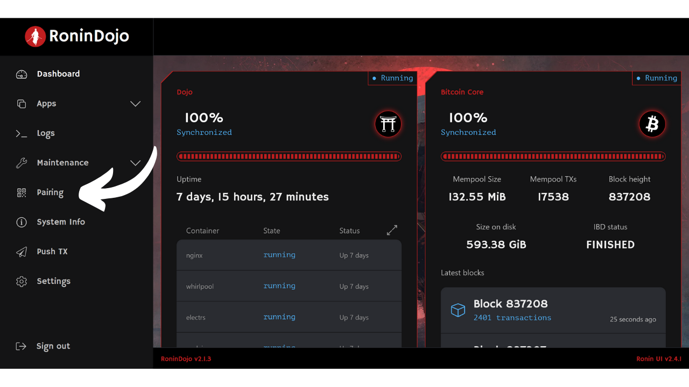

Allpool `Samourai Dojo`, klõpsake nupul `Pair now`.

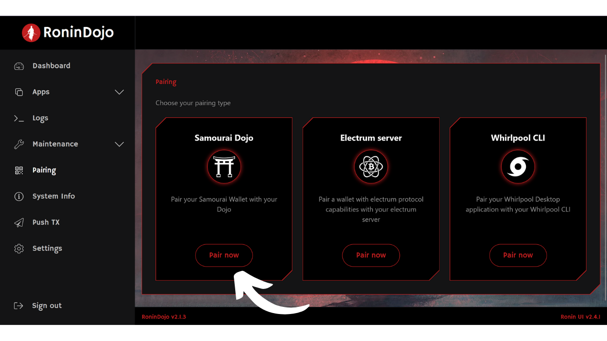

Teie ühenduse QR-kood ja vastav link kuvatakse.

Kui kasutate Umbrelit, minge App Store'i ja otsige `Samourai Server` rakendust. See asub `Bitcoin` vahekaardil.

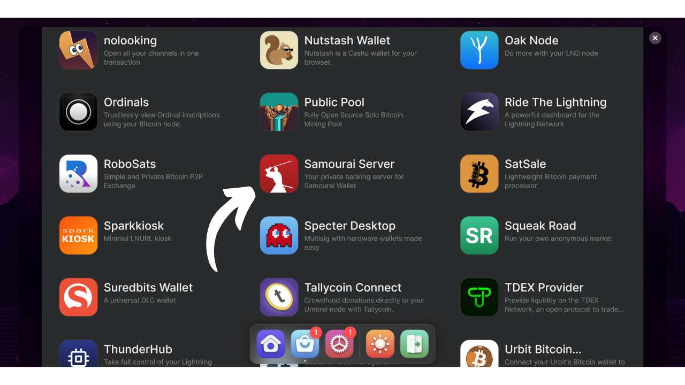

Installige rakendus.

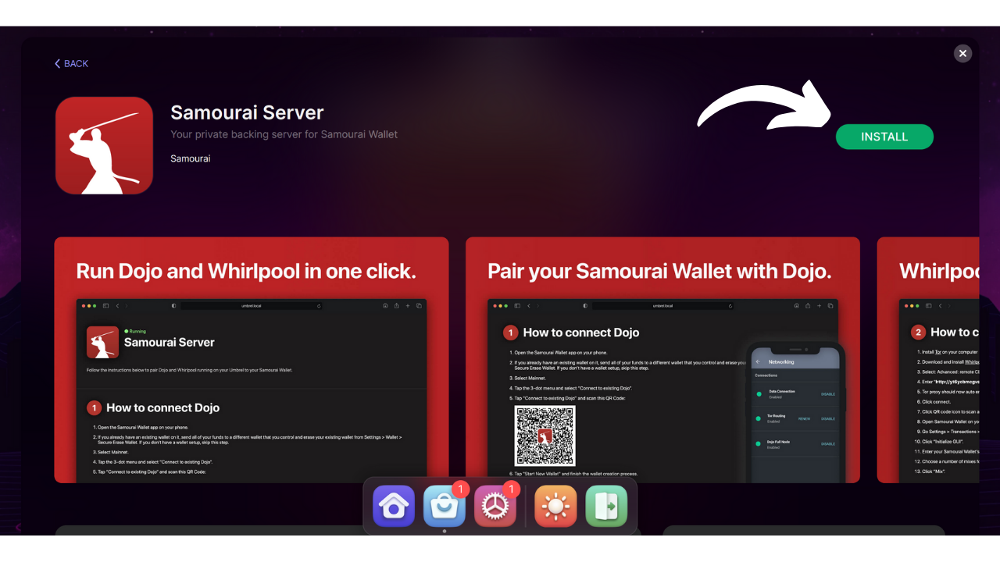

Rakenduse avamisel on teil seejärel juurdepääs QR-koodile, et ühenduda oma Dojoga.

Kui kasutate mõnda muud nood-kast tarkvara nagu MyNode, Citadel või Nodl, on protsess sarnane Umbreli omaga. Peate installima Samourai või Dojo rakenduse, et saada vajalik teave oma Dojoga ühenduse loomiseks.

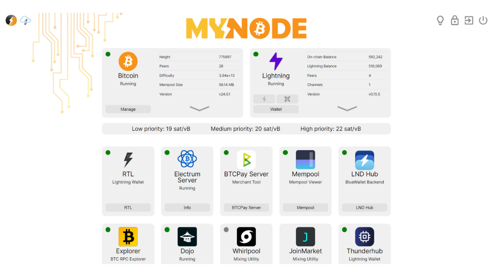

### Oma Samourai rahakoti ettevalmistamine
Pärast oma Dojo ühendusinfo hankimist on nüüd aeg seadistada oma rahakott coinjoinide jaoks. On kaks stsenaariumi: kui teil ei ole veel Samourai Wallet'i oma nutitelefonis, on protsess lihtne, lihtsalt looge uus.

Teisest küljest, kui teil on juba Samourai Wallet, peate rakenduse uuesti installima, et see uue Dojoga seostada. See samm on vajalik, kuna Dojoga ühenduse saab luua ainult rakenduse esmakordsel käivitamisel. Siiski, tänu Samourai poolt teie telefonis automaatselt genereeritud krüpteeritud varundusfailile, on see protseduur lihtne ja kiire.

*Kui te pole kunagi Samourai'd kasutanud, võite need esialgsed sammud vahele jätta ja otse rakenduse installimise juurde asuda.*

Esmalt veenduge, et teie Samourai Wallet rakendus on ajakohane. Selleks kontrollige Google Play poest või võrrelge oma rakenduse versiooni `Settings > Other` sätetes Samourai veebilehel saadaolevaga.

Veenduge, et teil on oma Samourai rahakoti taastefraas ja et see on loetav. Seejärel viige läbi oma BIP39 fraasi test, minnes `Settings > Troubleshoot > Passphrase/Backup test` juurde, et kinnitada selle õigsust.

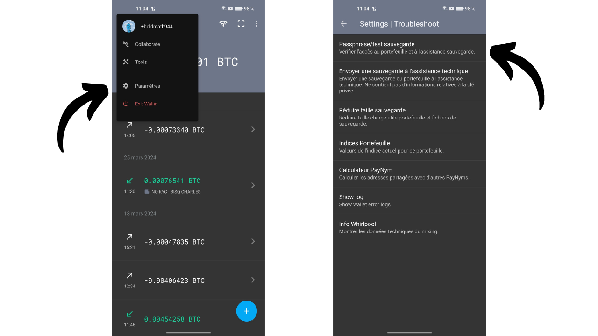
Sisestage oma fraas, seejärel kontrollige, et Samourai kinnitaks selle kehtivust.
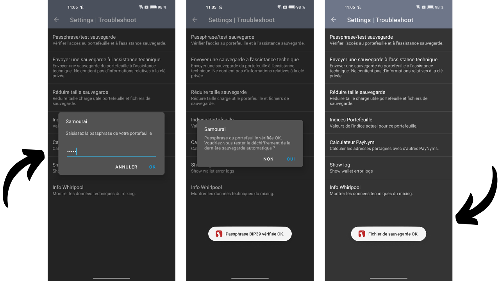

Kui teie fraas on kehtetu või kui teil ei ole oma taastefraasi, on hädavajalik protseduur kohe peatada! **Te riskite selle operatsiooni käigus oma bitcoinide kaotamisega.** Sellisel juhul on soovitatav kanda oma vahendid teise rahakotti ja alustada uue tühja Samourai rahakotiga. Järgmisi samme tuleks järgida ainult siis, kui olete kindel, et teil on kõik vajalik varundusteave ja et teie fraas on kehtiv.

Seejärel jätkake oma rahakoti krüpteeritud varukoopia loomisega ja kopeerige see oma lõikelauale. Selle toimingu sooritamiseks klõpsake ekraani paremas ülanurgas asuvatel kolmel väikesel punktil, seejärel valige `Export wallet backup`.

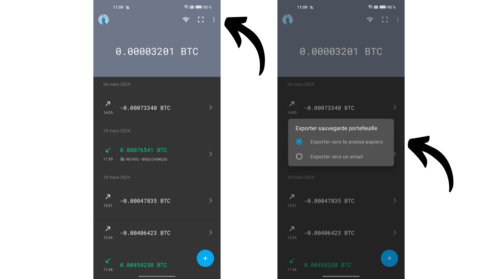

**Alates sellest sammust, ärge kopeerige midagi muud oma lõikelauale!** On absoluutselt oluline, et hoiate oma kopeeritud varukoopiat.

Kui olete eelnevad sammud õigesti sooritanud, olete nüüd valmis oma Samourai rahakoti turvaliselt kustutama. Selleks minge: `Settings > Wallet > Secure erase the wallet`.

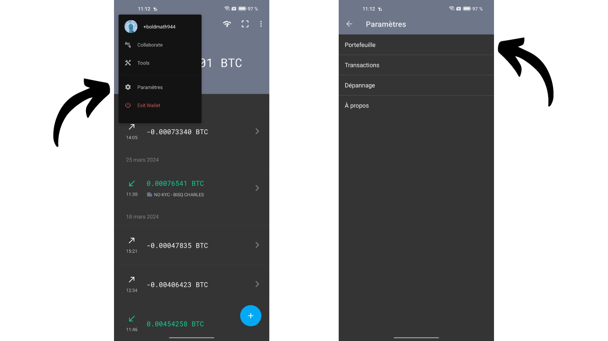

*Kui te pole kunagi Samourai'd kasutanud ja installite rakenduse nullist, võite juhendiga jätkata sellest sammust.*

Teie Samourai rakendus on nüüd lähtestatud. Avage rakendus ja jätkake seadistamise samme, nagu kasutaksite seda esimest korda.

Järgmises sammus pääsete juurde lehele, mis on pühendatud teie Dojo seadistamisele. Valige `Dojo` valik, seejärel sisestage oma Dojo sisselogimisinfo. Selleks on teil võimalus skaneerida info, vajutades `Scan QR`.

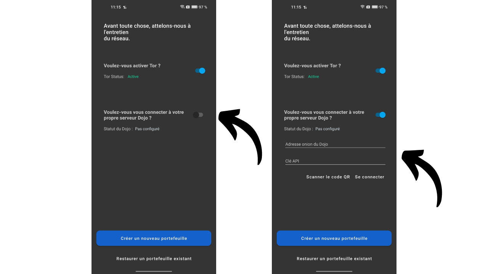

*Uutele Samourai kasutajatele on seejärel vajalik luua rahakott nullist. Kui vajate abi, võite konsulteerida juhiseid uue Samourai rahakoti seadistamiseks [selles õpetuses, eriti jaotises "Creating a software wallet"](https://planb.network/tutorials/privacy/coinjoin-samourai-wallet)*
Kui tegelete juba olemasoleva Samourai rahakoti taastamisega, valige `Restore existing wallet`, seejärel valige `I have a Samourai backup file`.
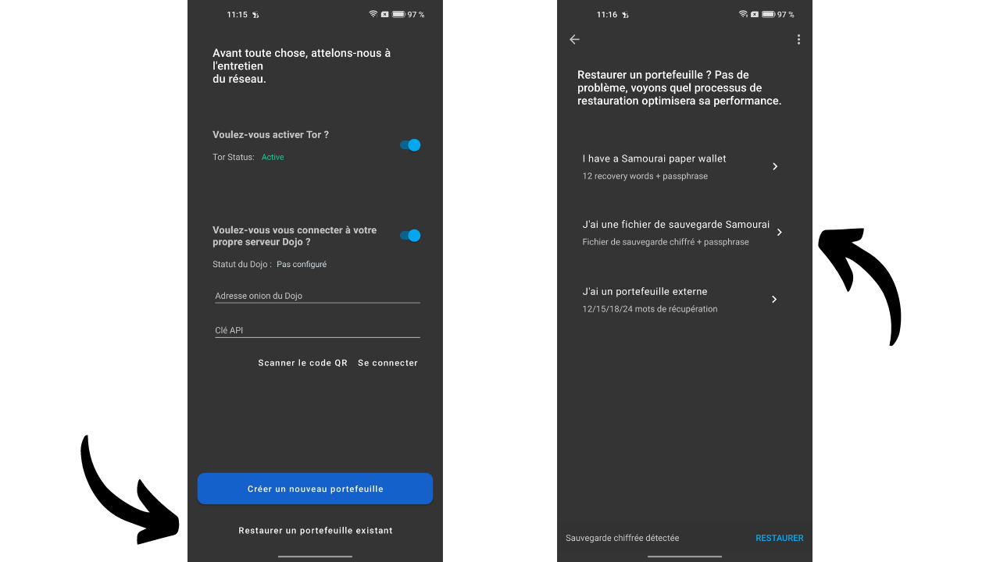
Tavaliselt peaks teie taastefail alati olema teie lõikelauale kopeeritud. Seejärel klõpsake `PASTE`, et sisestada oma fail ettenähtud kohta. Selle dekrüpteerimiseks on vajalik sisestada ka teie rahakoti BIP39 paroolfraas vastavasse väljasse, mis asub kohe allpool. Lõpetamiseks klõpsake `FINISH`.

Seejärel suunatakse teid oma Samourai rahakotti, mis sel korral on ühendatud teie enda Dojoga.

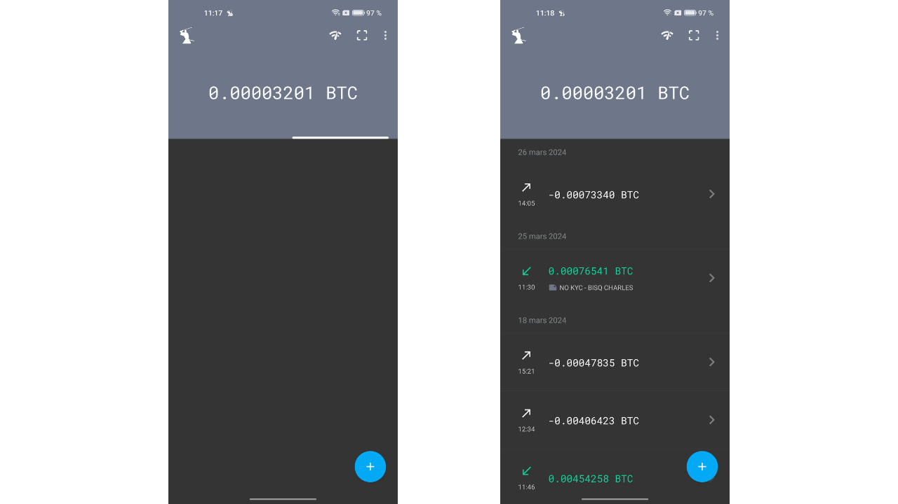

### Whirlpool GUI paigaldamine
On aeg paigaldada Whirlpool GUI, graafiline kasutajaliides, mis võimaldab teil hallata oma coinjoin tsükleid tavalisest arvutist. RoninDojo kasutajatele ei ole see samm vajalik, kuna coinjoinide haldamine on võimalik otse veebiliideses `Apps > Whirlpool`. Kui kasutate aga mõnda muud Bitcoin "node-in-box" lahendust, on selle paigaldamine hädavajalik.
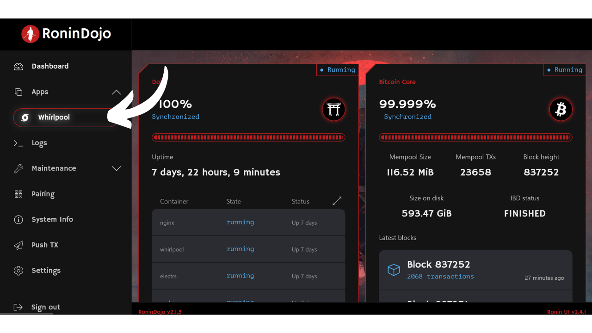
Minge oma isiklikule arvutile ja laadige alla Whirlpool tarkvara ametlikult Samourai Wallet veebilehelt, valides teie operatsioonisüsteemile vastava versiooni.

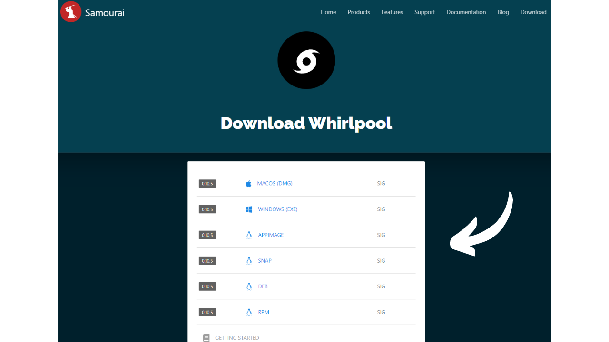

Enne Whirlpool GUI käivitamist on vajalik teie masinasse paigaldada JAVA 8 või kõrgem versioon. Selleks [võite paigaldada OpenJDK](https://adoptium.net/).

Samuti on vajalik, et teie arvutis oleks taustal töötamas Tor Daemon või Tor Browser. Veenduge, et Tor oleks käivitatud enne iga Whirlpool GUI kasutamise sessiooni. Kui Tor ei ole veel teie masinasse paigaldatud, [võite selle alla laadida ja paigaldada ametlikult projekti veebilehelt](https://www.torproject.org/download/), seejärel veenduge, et see töötaks taustal.

Kui JDK on teie süsteemi paigaldatud ja Tor taustal käivitatud, võite alustada Whirlpool GUI kasutamist.

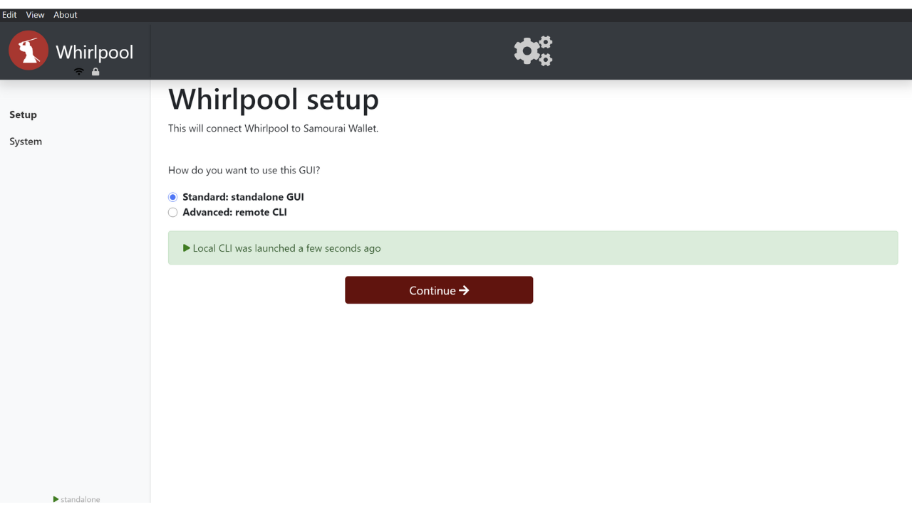

Whirlpool GUI-s klõpsake `Advanced: Remote CLI`, et ühendada oma Whirlpool CLI, mis asub teie Dojos. Teil on vaja oma Whirlpool CLI Tor aadressi.

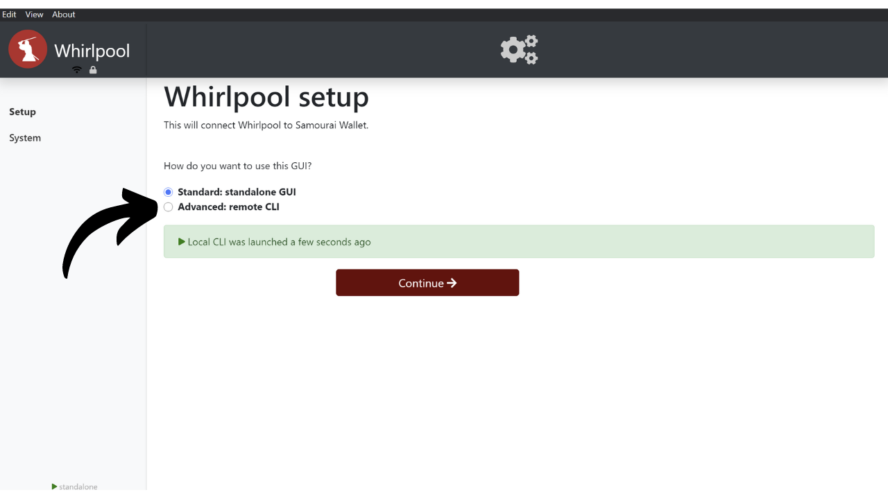

Tor aadressi leidmiseks Umbrelis ja teistes "node-in-box" lahendustes käivitage lihtsalt Samourai Server või Dojo rakendus (nimi võib sõltuvalt kasutatavast tarkvarast erineda). Tor aadress kuvatakse otse rakenduse lehel.

Whirlpool GUI-s sisestage varem saadud Tor aadress `CLI address` väljale. Hoidke `http://` eesliidet, kuid ärge lisage lõppu porti `:8899`. Kleepige ainult aadress, nagu see teile anti.
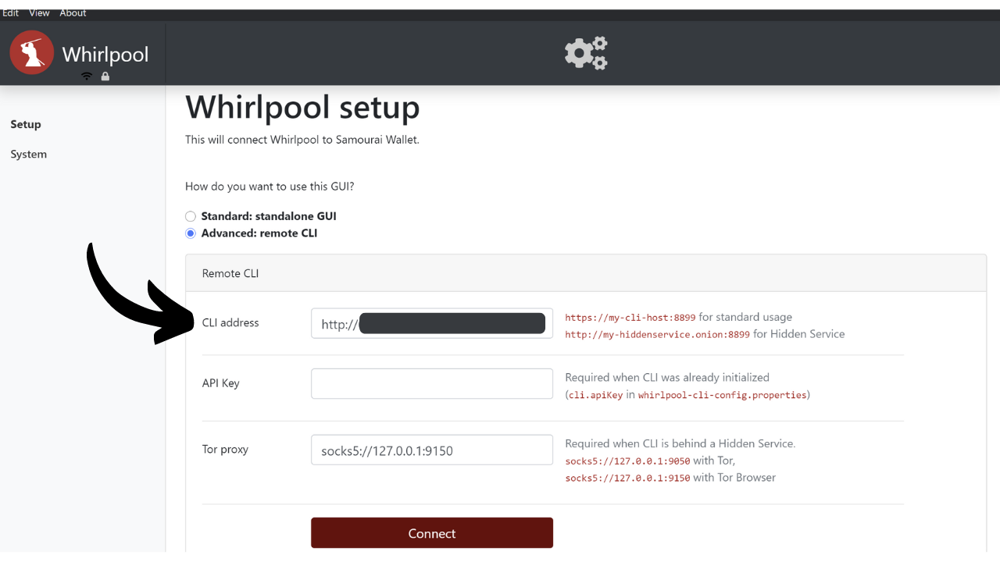
Tor Proxy väljal sisestage `socks5://127.0.0.1:9050`, kui kasutate Tor Daemonit, või `socks5://127.0.0.1:9150`, kui see on Tor Brauser. Kui ühendute esimest korda Whirlpool CLI-ga läbi Whirlpool GUI, on võimalik API võtme väli jätta tühjaks. Kui see ei ole teie esimene ühendus, palun sisestage oma API võti ettenähtud kohta. Seda võtit saab leida samalt lehelt kui teie Tori aadress.
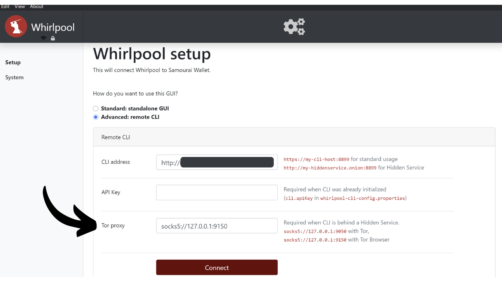

Kui olete kõik ära täitnud, klõpsake nupul `Connect`. Palun oodake, ühenduse loomine võib võtta mõned minutid.

### Oma Samourai Rahakoti sidumine Whirlpool GUI-ga
*RoninDojo kasutajatele, võite jätkata õpetust siit.*

Nüüd sidume varem seadistatud Samourai rahakoti Whirlpool GUI tarkvaraga või otse RoninDojoga neile, kes kasutavad seda tarkvara. Olenemata sellest, kas kasutate Whirlpool GUI-d või RoninDojot, palutakse teil sisestada või skannida oma Samourai rahakoti sidumisinfo.

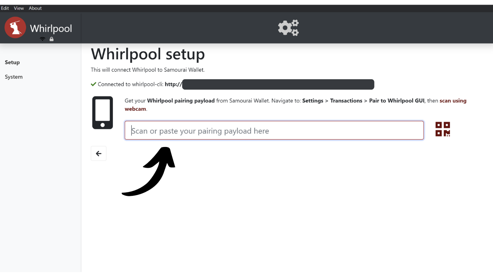

Selle info leidmiseks minge oma rahakoti seadetesse.

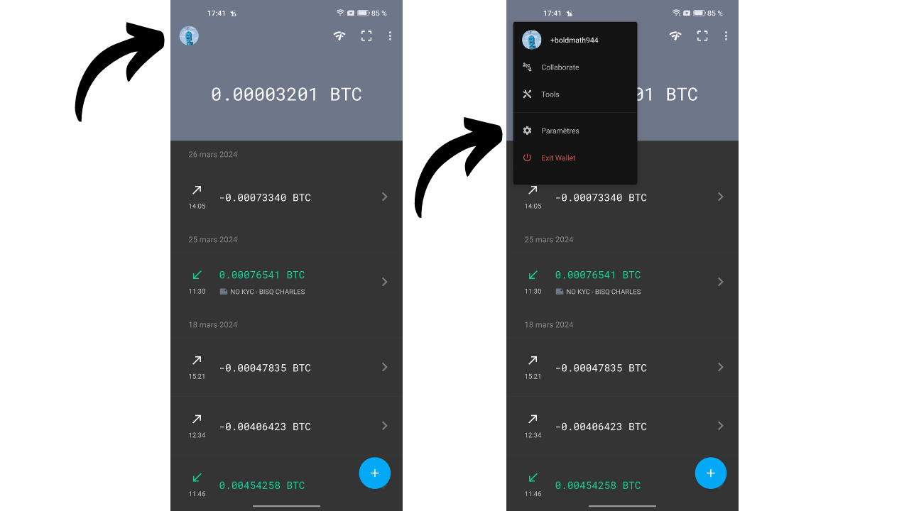

Klõpsake `Transactions`, seejärel `Pair to Whirlpool GUI`.

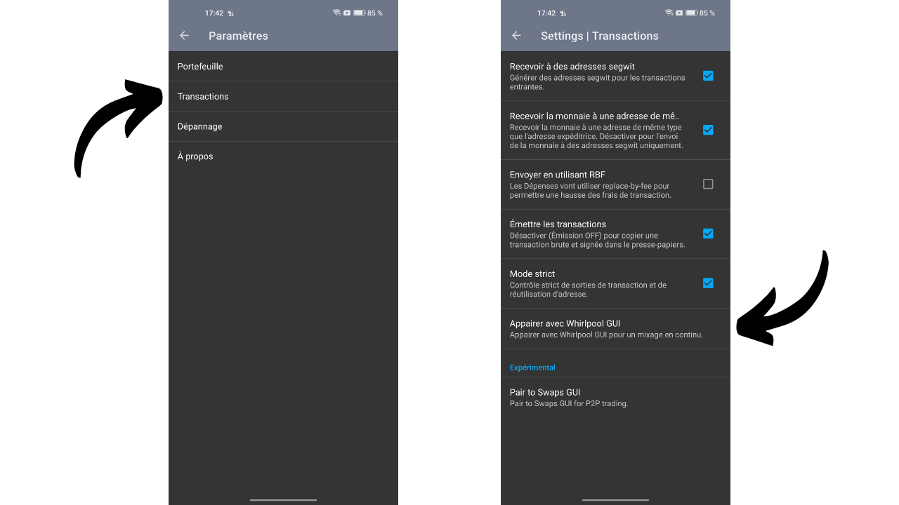

Samourai annab teile seejärel vajaliku info ühenduse loomiseks. Olge ettevaatlik, see andmed on tundlikud! Saate need oma arvutisse üle kanda kas otse kopeerides või kuvatavat QR-koodi skannides, kasutades oma arvuti veebikaamerat pärast QR-koodi sümbolil klõpsamist.

Pärast seda toimingut valige Whirlpool GUI-s `Initialize GUI`. Palun oodake, kuna see samm võib võtta hetke.

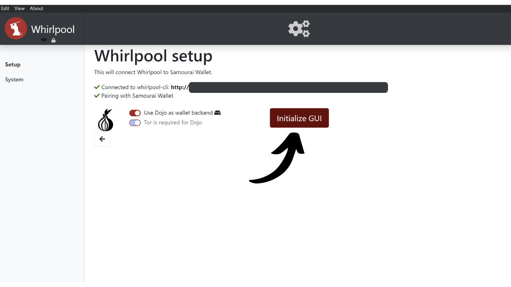

Olenemata sellest, kas kasutate Whirlpool GUI-d või RoninDojot, palutakse teil sisestada oma Samourai rahakoti parool. Sisestage see ettenähtud väljale, seejärel vajutage `Login` nuppu, et jätkata.

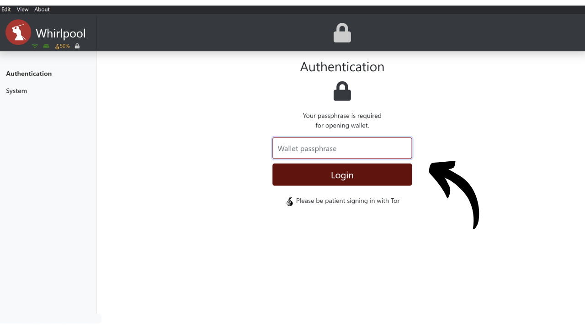

Seejärel jõuate Whirlpool CLI avalehele

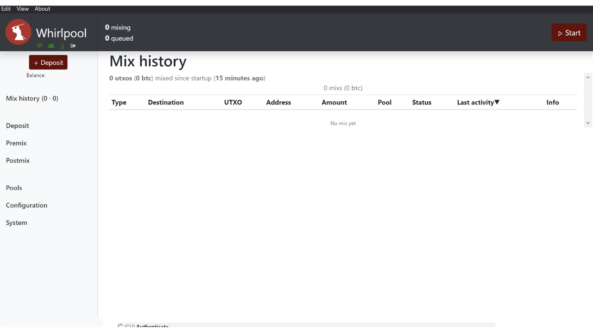

### Coinjoinide algatamine Whirlpool GUI kaudu
*RoninDojo kasutajatele, protsess on identne. RoninDojole integreeritud Whirlpooli rakenduse liides pakub samu valikuid ja funktsionaalsusi nagu Whirlpool GUI tarkvara lauaarvutil. Seega võite järgida neid juhiseid samal viisil.*
Nüüd, kui kõik on seadistatud, olete valmis alustama oma bitcoinide segamist. Selleks kandke bitcoine, mida soovite segada, oma Samourai Rahakoti **Deposit** kontole. Seda toimingut saab teostada kas otse Samourai Rahakoti rakenduse kaudu või Whirlpool GUI-s. Pealehelt klõpsake üleval vasakul asuval `+ Deposit` nupul.

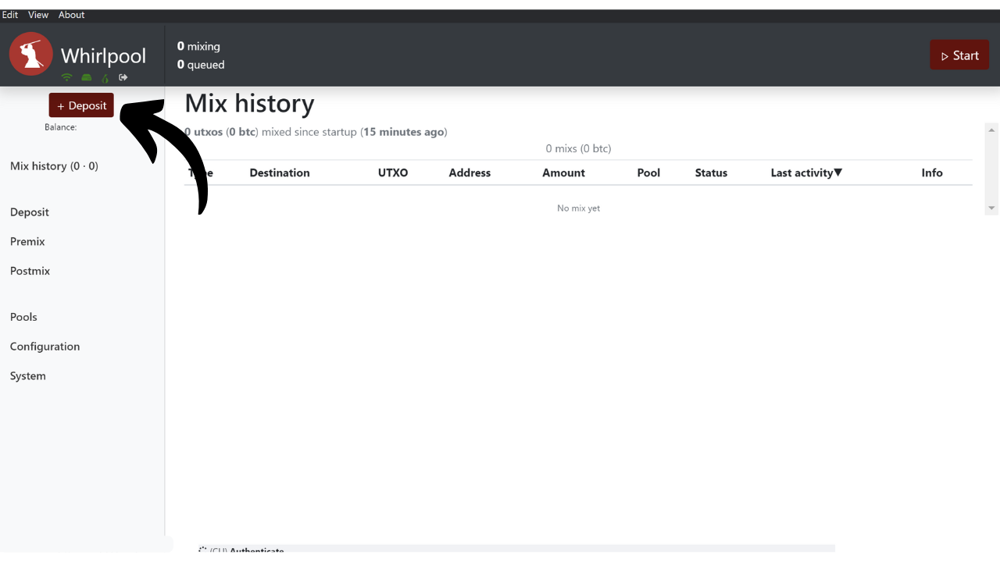
Whirlpool GUI genereerib vastuvõtu aadressi. Samuti kuvatakse minimaalne summa, mis on vajalik igas coinjoin basseinis osalemiseks. See summa varieerub sõltuvalt tasude turust. On soovitatav hoiustada summa, mis on veidi suurem kui minimaalselt nõutav, kuna kui kaevandamistasud ei vähene, ei pruugita teie UTXO-d soovitud basseinis aktsepteerida. Seetõttu saatke oma bitcoineid antud aadressile. Uue aadressi saamiseks klõpsake lihtsalt nupul `Uuenda aadressi`.

Kui hoiust on kinnitatud, näete seda ilmumas Whirlpool GUI **Hoiuste** kontol.

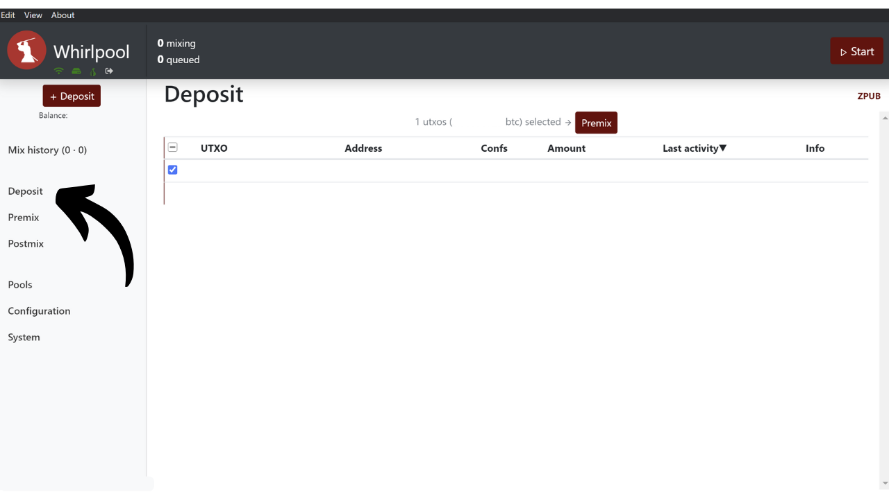

Coinjoin tsüklite alustamiseks valige UTXOd, mida soovite segada, ja vajutage `Eelsegamine` nuppu. Olge ettevaatlik: kui valite korraga mitu erinevat UTXOd, ühendatakse need `TX0` ettevalmistava tehingu käigus. See ühendamine võib privaatsust vähendada, eriti kui UTXOd pärinevad erinevatest allikatest, Common Input Ownership Heuristic (CIOH) tõttu.

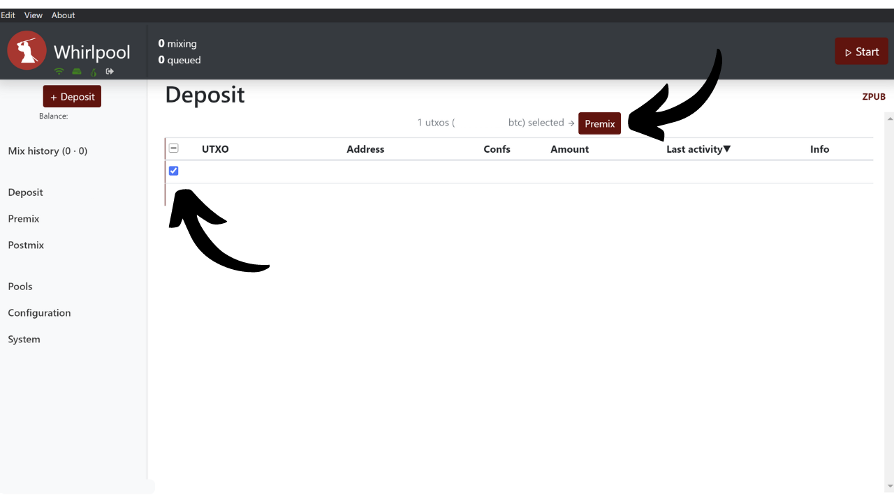

Avaneb Whirlpooli seadistamise leht. Saate valida basseini, kuhu soovite siseneda. Valige ka `TX0` ja esimeste coinjoinide jaoks mõeldud kaevandamistasud. Selle lehe allosas esitatakse kokkuvõte, mis näitab teile doxxic muutuse summat ning summat ja UTXOde arvu, mis võrdsustatakse ja kaasatakse coinjoin tsüklitesse. Kui olete selle seadistusega rahul, vajutage coinjoin tsüklite alustamiseks `Eelsegamine` nuppu.
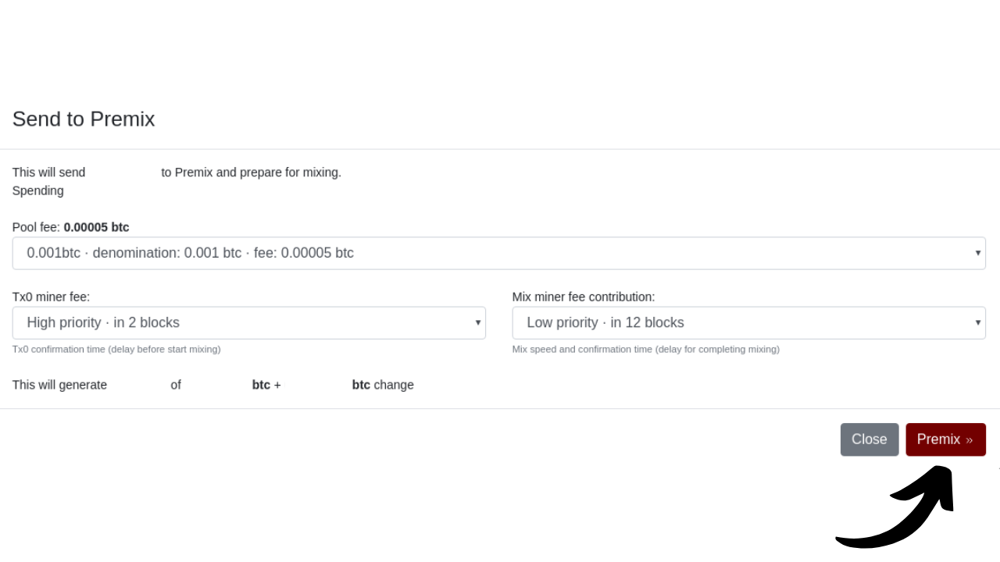

Kui `TX0` on loodud, näete oma võrdsustatud UTXOsid **Eelsegamine** kontol, oodates kinnitust. Et lubada oma müntidel automaatselt seguneda 24 tundi päevas, 7 päeva nädalas, soovitan aktiveerida `Sega automaatselt eelsegatud & järelsegatud` valiku. Selle funktsiooni leiate `Seadistused` vahelehelt, mis asub vasakul teie Whirlpool GUI aknas.

Pärast coinjoinide alustamist võite Whirlpool GUI-st ja Samourai Walletist väljuda. Ainult teie sõlm peab jääma ühendatuks, et osaleda pidevates coinjoinides. Siiski on soovitatav perioodiliselt kontrollida oma coinjoin tsüklite edenemist. Kui märkate, et teie UTXOsid ei valita mõnda aega coinjoini jaoks, võib see viidata veale. Sellisel juhul minge Whirlpool CLI-sse ja valige `Alusta`, et taastada teie kättesaadavus coinjoinide jaoks.

Teie segatud UTXOd on nähtavad Whirlpool GUI **Järelsegamine** kontolt. Lisaks on teil võimalus neid otse Whirlpooli liideses oma Samourai Walletis vaadata ja kulutada. Selle menüü avamiseks klõpsake ekraani allosas sinisel `+` nupul ja seejärel valige `Whirlpool`.

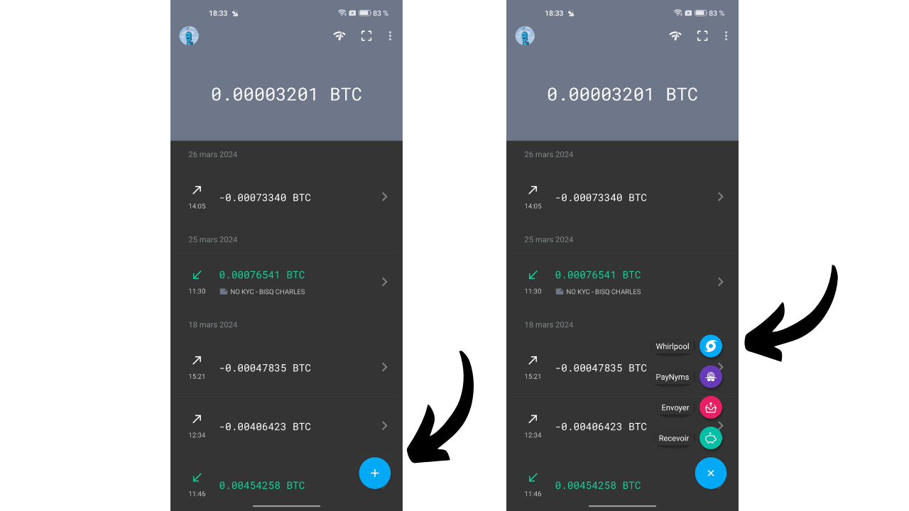

Whirlpooli kontod on Samourai Walletis sinise värviga hõlpsasti äratuntavad. See võimaldab teil oma segatud UTXOsid kulutada igal ajal ja igal pool, otse oma nutitelefonist.

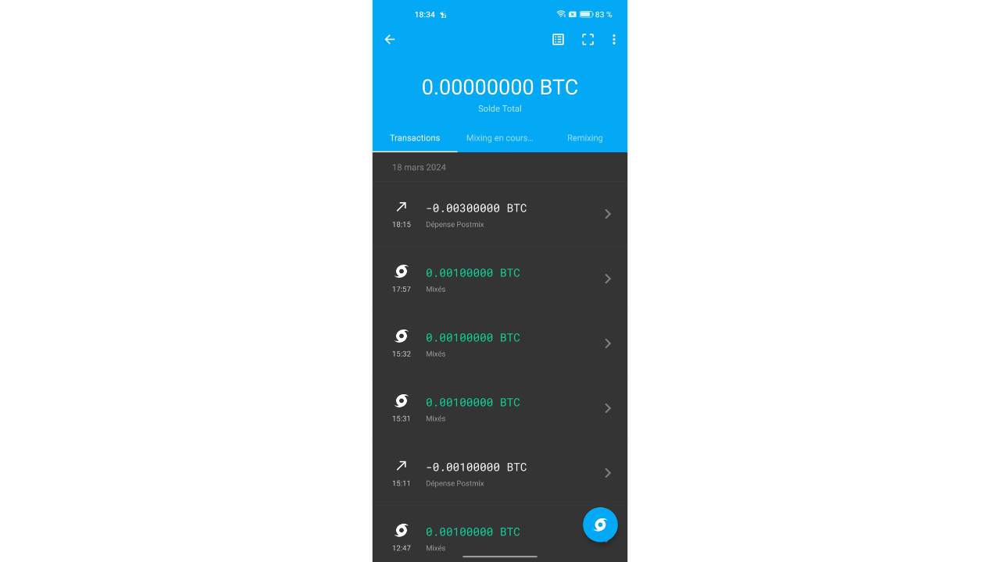
Selleks, et jälgida oma automaatseid coinjoine, soovitan samuti seadistada vaatlus-ainult rahakoti läbi Sentinel rakenduse. Lisa oma **Postmix** konto ZPUB ja jälgi oma coinjoin tsüklite edenemist reaalajas. Kui soovid mõista, kuidas Sentinelit kasutada, soovitan konsulteerida selle teise õpetusega PlanB võrgustikus: [**SENTINEL VAATLUS-AINULT**](https://planb.network/tutorials/wallet/sentinel)