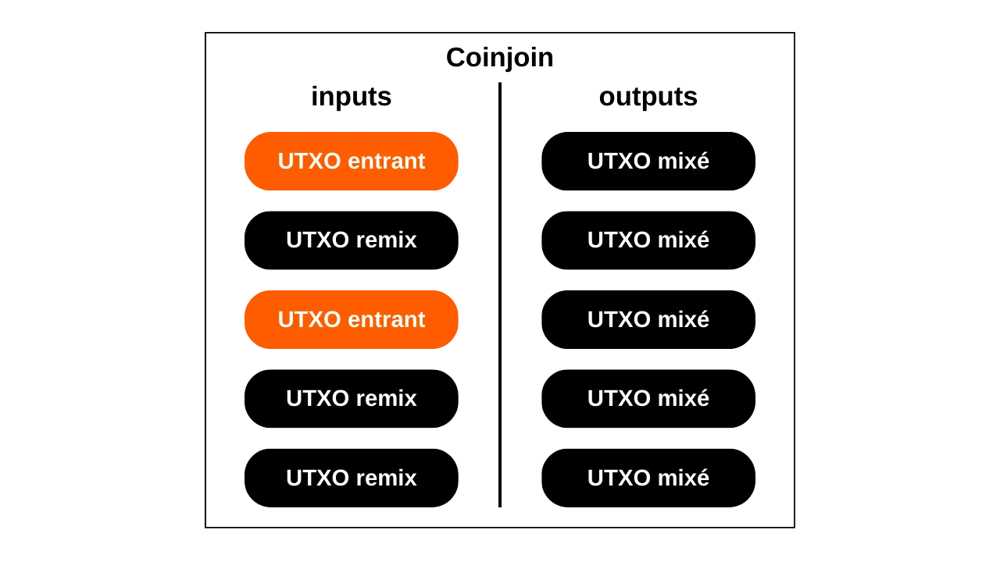
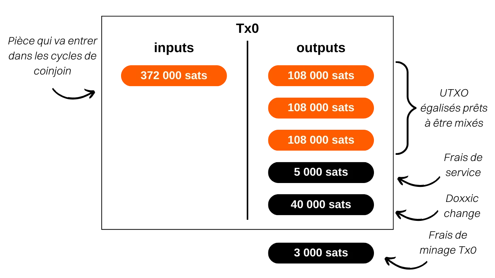

Dans ce tutoriel, vous allez apprendre ce qu'est un coinjoin et comment en réaliser avec le logiciel Samourai Wallet et l'implémentation Whirlpool, en utilisant votre propre Dojo. Cette méthode est selon moi la meilleure à l'heure actuelle pour mixer ses bitcoins.

## Qu'est-ce qu'un coinjoin sur Bitcoin ?
**Le coinjoin est une technique qui permet de casser le traçage des bitcoins sur la blockchain**. Il repose sur une transaction collaborative à la structure spécifique de même nom : la transaction coinjoin.

Les coinjoins renforcent la confidentialité des utilisateurs de Bitcoin en complexifiant l'analyse de chaîne pour les observateurs externes. Leur structure permet de fusionner plusieurs pièces de différents utilisateurs en une unique transaction, brouillant ainsi les pistes et rendant difficile la détermination des liens entre les adresses d'entrée et de sortie.

Le principe du coinjoin repose sur une approche collaborative : plusieurs utilisateurs qui souhaitent mélanger leurs bitcoins déposent des montants identiques en inputs d'une même transaction. Ces montants sont ensuite redistribués en outputs de valeur égale à chaque utilisateur. À l'issue de la transaction, il devient impossible d'associer un output spécifique à un utilisateur connu en entrée. Aucun lien direct n'existe entre les entrées et les sorties, ce qui vient rompre l'association entre les utilisateurs et leurs UTXO, de même que l'historique de chaque pièce.

Exemple d'une transaction coinjoin (qui ne provient pas de moi) : [323df21f0b0756f98336437aa3d2fb87e02b59f1946b714a7b09df04d429dec2](https://mempool.space/fr/tx/323df21f0b0756f98336437aa3d2fb87e02b59f1946b714a7b09df04d429dec2)

Afin de réaliser un coinjoin tout en garantissant que chaque utilisateur conserve le contrôle sur ses fonds à tout moment, le processus débute par la construction de la transaction par un coordinateur, qui la transmet ensuite aux participants. Chaque utilisateur procède alors à la signature de la transaction après avoir vérifié que celle-ci lui convient. Toutes les signatures collectées sont finalement intégrées à la transaction. Si une tentative de détournement des fonds est effectuée par un utilisateur ou le coordinateur, par le biais d'une modification des outputs de la transaction coinjoin, les signatures se révéleront invalides, ce qui conduira au rejet de la transaction par les nœuds.

Il existe plusieurs implémentations de coinjoin, telles que Whirlpool, JoinMarket ou Wabisabi, chacune ayant pour objectif de gérer la coordination entre les participants et d'accroître l'efficacité des transactions coinjoin.

Dans ce tutoriel, nous nous penchons sur l'implémentation **Whirlpool**, que je considère comme la solution la plus efficace pour faire des coinjoins sur Bitcoin. Bien que disponible sur plusieurs portefeuilles, nous explorons dans ce tutoriel exclusivement l'utilisation avec l'application mobile Samourai Wallet, sans Dojo.

## Pourquoi faire des coinjoins sur Bitcoin ?
Un des problèmes initiaux à tout système de paiement pair-à-pair est la double dépense : comment empêcher des individus mal intentionnés de dépenser à plusieurs reprises les mêmes unités monétaires sans faire appel à une autorité centrale pour arbitrer ?

Satoshi Nakamoto a apporté une solution à ce dilemme au travers du protocole Bitcoin, un système de paiement électronique pair-à-pair qui fonctionne indépendamment de toute autorité centrale. Dans son livre blanc, il souligne que la seule manière de certifier l'absence de double dépense est d'assurer la visibilité de toutes les transactions au sein du système de paiement.

Afin de garantir que chaque participant soit au courant des transactions, ces dernières doivent être publiquement divulguées. Le fonctionnement de Bitcoin repose donc sur une infrastructure transparente et distribuée, permettant à tout opérateur de nœud de vérifier l'intégralité des chaînes de signatures électroniques et l'historique de chaque pièce, depuis sa création par un mineur.

La nature transparente et distribuée de la blockchain de Bitcoin signifie que tout utilisateur du réseau peut suivre et analyser les transactions de tous les autres participants. En conséquence, l'anonymat au niveau des transactions est impossible. Cependant, l'anonymat est préservé au niveau de l'identification des individus. Contrairement au système bancaire classique où chaque compte est lié à une identité personnelle, sur Bitcoin, les fonds sont associés à des paires de clés cryptographiques, offrant ainsi aux utilisateurs une forme de pseudonymat derrière des identifiants cryptographiques.

Ainsi, la confidentialité sur Bitcoin est mise à mal lorsque des observateurs extérieurs parviennent à associer des UTXO spécifiques à des utilisateurs identifiés. Une fois cette association établie, il devient possible de tracer leurs transactions et d'analyser l'historique de leurs bitcoins. Le coinjoin est justement une technique développée pour casser la traçabilité des UTXO, offrant ainsi une certaine couche de confidentialité aux utilisateurs de Bitcoin au niveau des transactions.

## Comment fonctionne Whirlpool ?
Whirlpool se distingue des autres méthodes de coinjoin par l'utilisation de transactions "_ZeroLink_", qui assurent qu'il n'y a strictement aucun lien technique possible entre tous les inputs et tous les outputs. Ce mixage parfait est obtenu grâce à une structure où chaque participant contribue avec un montant identique en input (à l'exception des frais de minage), générant ainsi des outputs de montants parfaitement égaux.

Cette approche restrictive sur les inputs confère aux transactions coinjoin de Whirlpool une caractéristique unique : l'absence totale de liens déterministes entre les inputs et les outputs. Autrement dit, chaque output possède une probabilité égale d'être attribué à n'importe quel participant, par rapport à tous les autres outputs de la transaction.

Initialement, le nombre de participants à chaque coinjoin Whirlpool était limité à 5, avec 2 nouveaux entrants et 3 remixeurs (nous expliquerons ces concepts plus loin). Toutefois, l'augmentation des frais de transaction on-chain observée en 2023 a incité les équipes de Samourai à repenser leur modèle pour améliorer la confidentialité tout en réduisant les coûts. Ainsi, en tenant compte de la situation du marché des frais et du nombre de participants, le coordinateur peut désormais organiser des coinjoins incluant 6, 7 ou 8 participants. Ces sessions améliorées sont désignées sous le nom de "_Surge Cycles_". Il est important de noter que, quelle que soit la configuration, il y a toujours uniquement 2 nouveaux entrants dans les coinjoins Whirlpool.

Ainsi, les transactions Whirlpool se caractérisent par un nombre identique d'inputs et d'outputs, pouvant être de :
- 5 inputs et 5 outputs ;

- 6 inputs et 6 outputs ;

- 7 inputs et 7 outputs ;

- 8 inputs et 8 outputs.

Le modèle proposé par Whirlpool est ainsi basé sur de petites transactions coinjoin. À la différence de Wasabi et JoinMarket, où la robustesse des anonsets repose sur le volume de participants sur un cycle unique, Whirlpool mise sur l'enchaînement de plusieurs cycles de petite taille.

Dans ce modèle, l'utilisateur s'acquitte des frais uniquement lors de son entrée initiale dans une pool, lui permettant ensuite de participer à une multitude de remixages sans frais supplémentaires. Ce sont les nouveaux entrants qui prennent en charge les frais de minage pour les remixeurs.

À chaque coinjoin supplémentaire auquel participe une pièce, ainsi que ses pairs rencontrés par le passé, les anonsets vont croître exponentiellement. L'objectif est donc de profiter de ces remixages gratuits qui, à chaque occurrence, contribuent à renforcer la densité des anonsets associés à chaque pièce mixée.

Whirlpool a été conçu en prenant en compte deux exigences importantes :
- L'accessibilité de l'implémentation sur appareils mobiles, étant donné que Samourai Wallet est avant tout une application de smartphone ;
- La rapidité des cycles de remixage pour favoriser une augmentation significative des anonsets.

Ces impératifs ont guidé les choix des développeurs de Samourai Wallet dans la conception de Whirlpool, les amenant à restreindre les participants à un nombre limité par cycle. Un nombre trop restreint aurait compromis l'efficacité du coinjoin, réduisant drastiquement les anonsets générés à chaque cycle, tandis qu'un nombre trop important aurait posé des problèmes de gestion sur les applications mobiles et aurait entravé le flux de cycles.

**Finalement, nul besoin d'avoir un nombre élevé de participants par coinjoin sur Whirlpool puisque les anonsets se font sur l'accumulation de plusieurs cycles de coinjoins.**

[-> En savoir plus sur les anonsets Whirlpool.](https://planb.network/tutorials/privacy/wst-anonsets)

### Les pools et les frais de coinjoin
Pour que ces multiples cycles permettent bien de faire augmenter les anonsets des pièces mixées, il faut mettre un certain cadre afin de restreindre les montants des UTXO utilisés. Whirlpool définit ainsi différentes pools.

Une pool représente un ensemble d'utilisateurs souhaitant mixer ensemble, qui s'accorde sur le montant des UTXO à utiliser pour optimiser le processus de coinjoin. Chaque pool spécifie un montant fixe pour l'UTXO, auquel l'utilisateur doit se conformer pour y participer. Ainsi, pour faire des coinjoins avec Whirlpool, il vous faut sélectionner une pool. Les pools disponibles à l'heure actuelle sont les suivantes :
- 0,5 bitcoins ;
- 0,05 bitcoin ;
- 0,01 bitcoin ;
- 0,001 bitcoin (= 100 000 sats).

En intégrant une pool avec vos bitcoins, ceux-ci seront divisés afin de générer des UTXO parfaitement homogènes avec ceux des autres participants de la pool. Chaque pool possède une limite maximale ; ainsi, pour des montants excédant cette limite, vous serez contraint soit d'effectuer deux entrées distinctes au sein de la même pool, soit de vous orienter vers une autre pool de montant supérieur :

| Pool (bitcoin) | Montant maximum par entrée (bitcoin) |
|----------------|--------------------------------------|
| 0,5            | 35                                   |
| 0,05           | 3,5                                  |
| 0,01           | 0,7                                  |
| 0,001          | 0,025                                |

Comme mentionné précédemment, un UTXO est considéré comme appartenant à une pool lorsqu'il est prêt à être intégré dans un coinjoin. Cela ne signifie toutefois pas que l'utilisateur en perd la possession. **À travers les différents cycles de mixage, vous conservez intégralement le contrôle de vos clés et, par conséquent, de vos bitcoins.** C'est d'ailleurs ce qui différencie la technique du coinjoin des autres techniques de mixages centralisés.

Pour entrer dans une pool de coinjoin, il faut régler des frais de service ainsi que des frais de minage. Les frais de service sont fixes pour chaque pool et sont destinés à rémunérer les équipes en charge du développement et de la maintenance de Whirlpool. 

Les frais de service pour l'utilisation de Whirlpool sont à régler une unique fois à l'entrée dans la pool. Une fois cette étape franchie, vous avez la possibilité de participer à un nombre illimité de remixages sans frais supplémentaires. Voici les frais fixes actuellement appliqués pour chaque pool :

| Pool (bitcoin) | Frais d'entrée (bitcoin)        |
|----------------|---------------------------------|
| 0,5            | 0,0175                          |
| 0,05           | 0,00175                         |
| 0,01           | 0,0005 (50 000 sats)            |
| 0,001          | 0,00005 (5 000 sats)            |

Ces frais fonctionnent essentiellement comme un billet d'entrée pour la pool choisie, indépendamment de la somme que vous mettez en coinjoin. Ainsi, que vous intégriez la pool 0,01 avec exactement 0,01 BTC ou que vous y entriez avec 0,5 BTC, les frais demeureront identiques en valeur absolue.

Avant de procéder au coinjoins, l'utilisateur a donc le choix entre 2 stratégies : 
- Opter pour une pool plus petite afin de minimiser les frais de service, sachant qu'il obtiendra en retour plusieurs petits UTXO ;
- Ou bien privilégier une pool de plus grande taille, acceptant de régler des frais plus élevés pour finalement se retrouver avec un nombre réduit d'UTXO de plus grande valeur. 

Il est généralement déconseillé de fusionner plusieurs UTXO mixés après les cycles de coinjoins, car cela pourrait compromettre la confidentialité acquise, en particulier en raison de l'heuristique de possession commune des entrées (CIOH : *Common-Input-Ownership-Heuristic*). Par conséquent, il peut être judicieux de choisir une pool plus importante, même si cela implique de payer davantage, pour éviter d'avoir trop d'UTXO de petites valeurs en sortie. L'utilisateur doit évaluer ces compromis pour choisir la pool qu'il préfère.

Outre les frais de service, les frais de minage propres à toute transaction Bitcoin doivent également être pris en compte. En tant qu'utilisateur de Whirlpool, vous serez tenu de payer les frais de minage de la transaction de préparation (`Tx0`) ainsi que ceux du premier coinjoin. Tous les remixages ultérieurs seront gratuits, grâce au modèle de Whirlpool qui repose sur le paiement de nouveaux entrants.

En effet, dans chaque coinjoin Whirlpool, deux utilisateurs parmi les inputs sont des nouveaux entrants. Les autres inputs proviennent de remixeurs. De ce fait, les frais de minage pour l'ensemble des participants de la transaction sont pris en charge par ces deux nouveaux participants, qui pourront ensuite bénéficier eux aussi de remixages gratuits :

Grâce à ce système de frais, Whirlpool se différencie réellement des autres services de coinjoin puisque les anonsets des UTXO ne sont pas proportionnels au prix payé par l'utilisateur. Ainsi, il est possible d'atteindre des niveaux d'anonymat considérablement élevés en ne s'acquittant que des frais d'entrée de la pool et des frais de minage pour deux transactions (la `Tx0` et le mix initial).

Il est important de noter que l'utilisateur devra également prendre en charge les frais de minage pour retirer ses UTXO de la pool après avoir réalisé ses multiples coinjoins, sauf s'il a sélectionné l'option `mix to`, dont nous parlerons dans le tutoriel ci-dessous.

### Les comptes du portefeuille HD utilisés par Whirlpool
Pour réaliser un coinjoin via Whirlpool, le portefeuille doit générer plusieurs comptes distincts. Un compte, dans le contexte d'un portefeuille HD (*Hierarchical Deterministic*), constitue une section entièrement isolée des autres, cette séparation intervenant au niveau de la troisième profondeur de hiérarchie du portefeuille, c'est-à-dire au niveau des `xpub`.

Un portefeuille HD peut théoriquement dériver jusqu'à `2^(32/2)` comptes différents. Le compte initial, utilisé par défaut sur tous les portefeuilles Bitcoin, correspond à l'index `0'`.

Pour les portefeuilles adaptés à Whirlpool, tels que Samourai ou Sparrow, 4 comptes sont utilisés pour répondre aux besoins du processus de coinjoin :
- Le compte **dépôt**, identifié par l'index `0'` ;
- Le compte **bad bank** (ou doxxic change), identifié par l'index `2 147 483 644'` ;
- Le compte **premix**, identifié par l'index `2 147 483 645'` ;
- Le compte **postmix**, identifié par l'index `2 147 483 646'`.

Chacun de ces comptes remplit une fonction particulière dans le cadre du coinjoin.

Tous ces comptes sont liés à une unique graine (seed), ce qui permet à l'utilisateur de récupérer l'accès à l'ensemble de ses bitcoins en utilisant sa phrase de récupération et, le cas échéant, sa passphrase. Il est cependant nécessaire de préciser au logiciel, lors de cette opération de récupération, les différents index de comptes qui ont été utilisés.

Voyons maintenant les différentes étapes d'un coinjoin Whirlpool au sein de ces comptes.

### Les différentes étapes des coinjoins sur Whirlpool
**Étape 1 : La Tx0**
Le point de départ de tout coinjoin Whirlpool est le compte **dépôt**. Ce compte est celui que vous utilisez automatiquement lorsque vous créez un nouveau portefeuille Bitcoin. Ce compte devra être crédité des bitcoins que l'on souhaite mixer.

La `Tx0` représente la première étape du processus de mixage de Whirlpool. Elle vise à préparer et à égaliser les UTXO pour le coinjoin, en les divisant en unités correspondant au montant de la pool sélectionnée, afin d'assurer l'homogénéité du mixage. Les UTXO ainsi égalisés sont ensuite envoyés vers le compte **premix**. Quant à la différence ne pouvant pas entrer dans la pool, elle est séparée sur un compte spécifique : le **bad bank** (ou "doxxic change").

Cette transaction initiale `Tx0` sert aussi à régler les frais de service dus au coordinateur du mix. Contrairement aux étapes suivantes, cette transaction n'est pas collaborative ; l'utilisateur doit donc assumer l'intégralité des frais de minage :

Dans cet exemple d'une transaction `Tx0`, un input de `372 000 sats` issu de notre compte **dépôt** est divisé en plusieurs UTXO en sortie, qui se répartissent comme suit :
- Un montant de `5 000 sats` destiné au coordinateur pour les frais de service, correspondant à l'entrée dans la pool de `100 000 sats` ;
- Trois UTXO préparés pour le mixage, redirigés vers notre compte **premix** et enregistrés auprès du coordinateur. Ces UTXO sont égalisés à `108 000 sats` chacun, afin de couvrir les frais de minage pour leur futur mix initial ;
- Le surplus ne pouvant pas entrer dans la pool, car trop petit, est considéré comme change toxique. Il est envoyé vers son compte spécifique. Ici, ce change s'élève à `40 000 sats` ;
- Enfin, il reste `3 000 sats` qui ne constituent pas un output, mais qui sont les frais de minage nécessaires pour confirmer la `Tx0`.

Par exemple, voici une vraie Tx0 Whirlpool (qui ne provient pas de moi) : [edef60744f539483d868caff49d4848e5cc6e805d6cdc8d0f9bdbbaedcb5fc46](https://mempool.space/fr/tx/edef60744f539483d868caff49d4848e5cc6e805d6cdc8d0f9bdbbaedcb5fc46)

**Étape 2 : Le doxxic change**
Le surplus n'ayant pas pu intégrer la pool, ici équivalent à `40 000 sats`, est redirigé vers le compte **bad bank**, également désigné sous le terme de "doxxic change", pour en assurer une séparation stricte avec les autres UTXO du portefeuille.

Cet UTXO est dangereux pour la confidentialité de l'utilisateur, car non seulement il est toujours attaché à son passé, et donc éventuellement à l'identité de son propriétaire, mais en plus, il est noté comme appartenant à un utilisateur qui a fait un coinjoin.

Si cet UTXO est fusionné avec des outputs mixés, ces derniers perdront toute la confidentialité gagnée durant les cycles de coinjoins, notamment à cause de la CIOH (*Common-Input-Ownership-Heuristic*). S'il est fusionné avec d'autres doxxic changes, l'utilisateur risque de perdre en confidentialité puisque cela viendra faire un lien entre les différentes entrées des cycles de coinjoins. Il faut donc le traiter avec prudence. La manière de gérer cet UTXO toxique sera détaillée dans la dernière partie de cet article, et de futurs tutoriels aborderont ces méthodes plus en profondeur sur PlanB Network.

**Étape 3 : Le mix initial**
Après la réalisation de la `Tx0`, les UTXO égalisés sont envoyés sur le compte **premix** de notre portefeuille, prêts à être introduits dans leur premier cycle de coinjoin, également appelé "mix initial". Si, comme dans notre exemple, la `Tx0` génère plusieurs UTXO destinés au mixage, chacun d'entre eux sera intégré dans un coinjoin initial distinct.

Au terme de ces premiers mixes, le compte **premix** sera vide, tandis que nos pièces, ayant acquitté les frais de minage pour ce premier coinjoin, seront ajustées exactement au montant défini par la pool choisie. Dans notre exemple, nos UTXO initiaux de `108 000 sats` auront été réduits à exactement `100 000 sats`.

**Étape 4 : Les remix**
Après avoir fait le mix initial, les UTXO sont transférés dans le compte **postmix**. Ce compte rassemble les UTXO déjà mixés et ceux en attente de remixage. Lorsque le client Whirlpool est actif, les UTXO situés dans le compte **postmix** sont automatiquement disponibles pour des remixages et seront choisis de manière aléatoire pour participer à ces nouveaux cycles.

Pour rappel, les remixages sont ensuite à 100 % gratuits : aucuns frais de service additionnels ou frais de minage ne sont requis. Conserver les UTXO dans le compte **postmix** maintient donc leur valeur intacte, et améliore en même temps leurs anonsets. Voilà pourquoi il est important de permettre à ces pièces de participer à plusieurs cycles de coinjoins. Cela ne vous coûte strictement rien, et cela permet d'augmenter leurs niveaux d'anonymat.

Lorsque vous décidez de dépenser des UTXO mixés, vous pouvez le faire directement depuis ce compte **postmix**. Il est conseillé de garder les UTXO mixés dans ce compte pour bénéficier de remixages gratuits et pour éviter qu'ils ne quittent le circuit de Whirlpool, ce qui pourrait diminuer leur confidentialité.

Comme nous le verrons dans le tutoriel suivant, il y a également l'option `mix to` qui offre la possibilité d'envoyer automatiquement vos pièces mixées vers un autre portefeuille, tel qu'un cold wallet, après un nombre défini de coinjoins.

Après avoir abordé la théorie, plongeons dans la pratique avec un tutoriel sur l'utilisation de Whirlpool via l'application Android Samourai Wallet, synchronisée avec Whirlpool CLI et GUI sur votre propre Dojo !

## Tutoriel : Coinjoin Whirlpool avec son propre Dojo
Il existe de nombreuses options pour utiliser Whirlpool. Celle que je souhaite vous présenter ici est l'option Samourai Wallet, une application open-source de gestion de portefeuille Bitcoin sur Android, mais cette fois-ci avec son propre Dojo.

Effectuer des coinjoins via Samourai Wallet en utilisant son propre Dojo est, à mon avis, la stratégie la plus efficace pour réaliser des coinjoins sur Bitcoin à ce jour. Cette approche demande un certain investissement initial en termes de configuration, mais une fois mise en place, elle offre la possibilité de mixer et remixer vos bitcoins en continu, 24 heures sur 24, 7 jours sur 7, sans nécessité de garder votre application Samourai active en permanence. En effet, grâce à Whirlpool CLI opérant sur un nœud Bitcoin, vous restez en permanence prêt à participer à des coinjoins. L'application Samourai vous donne ensuite la possibilité de dépenser vos fonds mixés à tout moment, où que vous soyez, depuis votre smartphone. De plus, cette méthode a l'avantage de ne jamais vous connecter au serveur géré par l'équipe de Samourai, préservant ainsi vos `xpub` de toute exposition externe.

Cette technique est donc idéale pour ceux qui recherchent une confidentialité maximale et des cycles de coinjoin de la plus haute qualité. Néanmoins, elle exige d'avoir à sa disposition un nœud Bitcoin et, comme nous le verrons plus loin, nécessite une certaine mise en place. Elle s'adresse ainsi plutôt à des utilisateurs de niveau intermédiaire à avancé. Pour les débutants, je recommande de se familiariser avec le coinjoin à travers ces deux autres tutoriels, qui présentent comment en faire depuis Sparrow Wallet ou Samourai Wallet (sans Dojo) :
- **[Tutoriel coinjoin Sparrow Wallet](https://planb.network/fr/tutorials/privacy/coinjoin-sparrow-wallet)** ;
- **[Tutoriel coinjoin Samourai Wallet (sans Dojo)](https://planb.network/fr/tutorials/privacy/coinjoin-samourai-wallet)**.

### Comprendre le setup
Pour commencer, vous allez avoir besoin d'un Dojo ! Dojo est une implémentation de nœud Bitcoin basée sur Bitcoin Core, développée par les équipes de Samourai. 

Pour faire tourner votre propre Dojo, vous avez la possibilité soit d'[installer un nœud Dojo de façon autonome](https://samouraiwallet.com/dojo), soit de profiter de Dojo au sein d'une autre solution de nœud Bitcoin "node-in-box". À l'heure actuelle, les options disponibles sont :
- [RoninDojo](https://ronindojo.io/), qui est un Dojo agrémenté d'outils supplémentaires, y compris un assistant d'installation et un assistant d'administration. Je détaille la procédure de mise en place et d'utilisation de RoninDojo dans cet autre tutoriel : [RONINDOJO V2](https://planb.network/fr/tutorials/node/ronin-dojo-v2) ;
- [Umbrel](https://umbrel.com/) avec l'application "Samourai Server" ;
- [MyNode](https://mynodebtc.com/) avec l'application "Dojo" ;
- [Nodl](https://www.nodl.eu/) avec l'application "Dojo" ;
- [Citadel](https://runcitadel.space/) avec l'application "Samourai".

Dans notre configuration, nous interagirons avec trois interfaces distinctes :
- **Samourai Wallet**, qui accueillera notre portefeuille Bitcoin dédié aux coinjoins. Disponible gratuitement et en open-source pour Android, cette application permet de contrôler votre portefeuille de mixage, notamment pour les dépenses de vos postmix depuis votre smartphone ;
- **Whirlpool CLI** (_Command Line Interface_), qui fonctionnera sur le nœud hébergeant le Dojo. Ce logiciel aura accès aux clés de votre portefeuille Samourai. C'est lui qui se chargera de communiquer avec le coordinateur et qui gèrera les coinjoins en continu. Il agit comme une copie de votre portefeuille Samourai sur votre nœud, prête à participer aux coinjoins à tout moment ;
- **Whirlpool GUI** (_Graphical User Interface_), l'interface utilisateur graphique que nous utiliserons pour surveiller l'activité de Whirlpool CLI et initier des mixages à distance. Whirlpool GUI offre une représentation visuelle des opérations menées par Whirlpool CLI. Ce logiciel doit être installé sur un ordinateur séparé du Dojo. Pour les utilisateurs d'Umbrel, MyNode, Nodl, et Citadel, Whirlpool GUI est obligatoire. Cependant, avec RoninDojo, l'interface Whirlpool GUI est déjà intégrée à l'interface web de votre nœud. Vous n'aurez donc pas besoin de l'installer sur un PC séparé.

Selon moi, l'utilisation de RoninDojo représente la meilleure solution pour réaliser des coinjoins avec un Dojo. Puisque ce logiciel de node-in-box est en partenariat direct avec les équipes de Samourai, RoninDojo est bien plus optimisé pour faire cela. De plus, l'intégration de Whirlpool GUI dans l'interface web simplifie considérablement le processus de mise en place.
