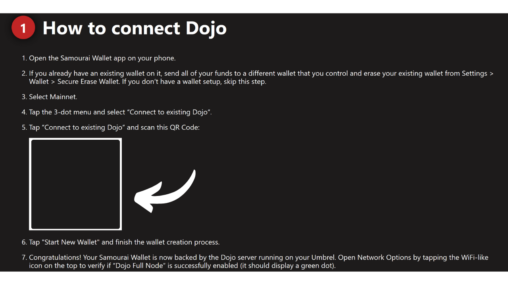
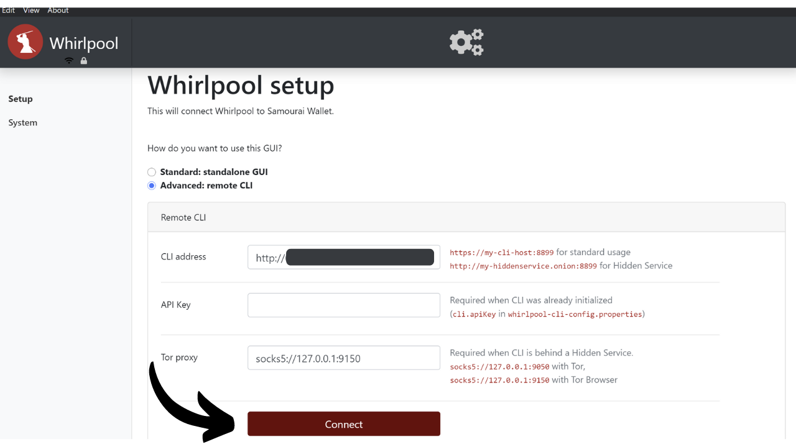
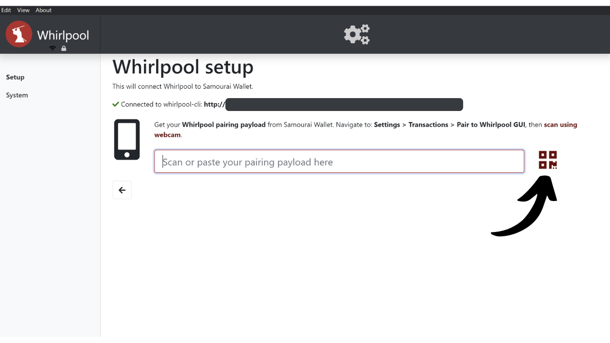

このチュートリアルでは、coinjoinが何であるか、そしてSamourai WalletソフトウェアとWhirlpoolの実装を利用して、自分のDojoを使ってcoinjoinを実行する方法を学びます。私の意見では、この方法は現在、ビットコインをミキシングするための最良の方法です。

## Bitcoin上のcoinjoinとは何か？
**Coinjoinは、ブロックチェーン上のビットコインの追跡可能性を破る技術です**。これは、同名の特定の構造を持つ協力的なトランザクションに依存しています：coinjoinトランザクション。

Coinjoinsは、外部の観察者によるチェーン分析を複雑にすることで、Bitcoinユーザーのプライバシーを向上させます。その構造は、異なるユーザーからの複数のコインを単一のトランザクションに統合することを可能にし、入力と出力のアドレス間のリンクを特定することが難しくなります。

Coinjoinの原理は協力的なアプローチに基づいています：ビットコインをミックスしたいと願う複数のユーザーが、同じトランザクションの入力として同額の金額を預けます。これらの金額は、各ユーザーに等しい価値の出力として再分配されます。トランザクションの終わりには、特定の出力を入力時の既知のユーザーに関連付けることが不可能になります。入力と出力の間に直接的なリンクは存在せず、これによりユーザーとそのUTXO、および各コインの履歴との関連が断ち切られます。

Coinjoinトランザクションの例（私からではありません）：[323df21f0b0756f98336437aa3d2fb87e02b59f1946b714a7b09df04d429dec2](https://mempool.space/en/tx/323df21f0b0756f98336437aa3d2fb87e02b59f1946b714a7b09df04d429dec2)

各ユーザーが常に自分の資金をコントロールすることを保証しながらcoinjoinを実行するために、プロセスはコーディネーターによってトランザクションが構築され、その後参加者に伝達されることから始まります。各ユーザーは、それが自分に適していることを確認した後にトランザクションに署名します。最終的に、すべての収集された署名がトランザクションに統合されます。ユーザーやコーディネーターによってcoinjoinトランザクションの出力が変更され、資金の流用が試みられた場合、署名は無効となり、トランザクションはノードによって拒否されます。

Coinjoinの実装には、Whirlpool、JoinMarket、Wabisabiなどがあり、それぞれが参加者間の調整を管理し、coinjoinトランザクションの効率を向上させることを目指しています。
このチュートリアルでは、Bitcoin上でcoinjoinsを実行するための最も効率的なソリューションであると考える**Whirlpool**の実装について詳しく説明します。いくつかのウォレットで利用可能ですが、このチュートリアルでは、DojoなしでSamourai Walletモバイルアプリケーションの使用に限定して探求します。

## なぜBitcoin上でcoinjoinsを実行するのか？
あらゆるピアツーピア支払いシステムにおける初期の問題の1つは、二重支払いです：悪意のある個人が同じ通貨単位を複数回支払うことを、中央機関による仲裁なしにどのように防ぐか？

サトシ・ナカモトは、Bitcoinプロトコルを通じて、このジレンマに対する解決策を提供しました。これは、任意の中央機関から独立して運営されるピアツーピアの電子支払いシステムです。彼のホワイトペーパーでは、二重支払いの不在を証明する唯一の方法は、支払いシステム内のすべてのトランザクションの可視性を確保することであると強調しています。
各参加者が取引について認識していることを確実にするために、それらは公に開示されなければなりません。したがって、Bitcoinの運用は透明で分散されたインフラストラクチャに依存しており、任意のノードオペレーターが電子署名チェーン全体と、マイナーによるその作成から各コインの履歴を検証できるようにしています。

Bitcoinのブロックチェーンの透明かつ分散された性質は、ネットワークの任意のユーザーが他のすべての参加者の取引を追跡し分析できることを意味します。その結果、取引レベルでの匿名性は不可能です。しかし、個人識別のレベルでは匿名性が保持されます。伝統的な銀行システムでは各アカウントが個人の身元にリンクされているのに対し、Bitcoinでは資金が暗号鍵のペアに関連付けられており、ユーザーに暗号識別子の背後にある一種の擬似匿名性を提供します。

したがって、外部の観察者が特定のUTXOを特定のユーザーと関連付けることに成功した場合、Bitcoin上での機密性が損なわれます。この関連付けが確立されると、その取引を追跡し、そのビットコインの履歴を分析することが可能になります。Coinjoinは、UTXOの追跡可能性を破るために開発された技術であり、取引レベルでBitcoinユーザーにある程度の機密性の層を提供します。

## Whirlpoolはどのように機能しますか？
Whirlpoolは、"_ZeroLink_"トランザクションを使用することで他のcoinjoin方法と差別化されます。これにより、すべての入力とすべての出力の間に技術的なリンクが厳密に存在しないことが保証されます。この完璧な混合は、各参加者が入力に同じ額を寄与する（マイニング手数料を除く）構造を通じて達成され、完全に等しい額の出力を生成します。
入力に対するこの制限的なアプローチは、Whirlpool coinjoin取引に独特の特徴を与えます：入力と出力の間の決定論的なリンクの完全な欠如。言い換えれば、各出力は、取引内の他のすべての出力と比較して、任意の参加者に帰属する可能性が等しくなります。
当初、Whirlpool coinjoinの各参加者の数は5に限定されていましたが、2人の新規参入者と3人のリミキサー（これらの概念については後で説明します）でした。しかし、2023年に観測されたオンチェーン取引手数料の増加により、Samouraiチームは、プライバシーを向上させると同時にコストを削減するために、モデルを再考しました。したがって、手数料の市場状況と参加者の数を考慮して、コーディネーターは現在、6、7、または8人の参加者を含むcoinjoinsを組織できます。これらの強化されたセッションは"_Surge Cycles_"として参照されます。設定に関係なく、Whirlpool coinjoinsには常に2人の新規参入者がいることに注意してください。

したがって、Whirlpool取引は、入力と出力の数が同一であることが特徴です。これは以下のようになります：
- 5つの入力と5つの出力；

- 6つの入力と6つの出力；

- 7つの入力と7つの出力；

- 8つの入力と8つの出力。

Whirlpoolが提案するモデルは、小規模なcoinjoin取引に基づいています。WasabiやJoinMarketのように、単一サイクルの参加者の量に依存するanonsetsの堅牢性とは異なり、Whirlpoolは複数の小規模なサイクルの連鎖に賭けています。

このモデルでは、ユーザーはプールへの初回入場時にのみ手数料を支払い、追加の手数料なしで多数のリミックスに参加できます。新規参入者がリミキサーのためのマイニング手数料を負担します。
コインが参加するコインジョインが増えるごとに、過去に遭遇したピアとともに、匿名セットは指数関数的に成長します。したがって、目標は、各混合コインに関連する匿名セットの密度を高めることに貢献する、これらの無料リミックスを利用することです。
Whirlpoolは、次の2つの重要な要件を考慮して設計されました：
- Samourai Walletが主にスマートフォンアプリケーションであることを考慮して、モバイルデバイスでの実装のアクセシビリティ；
- 匿名セットの顕著な増加を促進するためのリミックスサイクルの速度。
これらの命題は、Samourai Walletの開発者がWhirlpoolの設計において選択を導いたものであり、サイクルごとの参加者数を制限することにつながりました。参加者が少なすぎると、コインジョインの効率が損なわれ、各サイクルで生成される匿名セットが劇的に減少してしまいます。一方、参加者が多すぎると、モバイルアプリケーションでの管理問題が発生し、サイクルの流れが妨げられる可能性があります。
**結局のところ、Whirlpoolでのコインジョインごとに多数の参加者を必要とすることはありません。なぜなら、匿名セットは複数のコインジョインサイクルの蓄積を通じて達成されるからです。**

[-> Whirlpoolの匿名セットについてもっと学ぶ。](https://planb.network/tutorials/privacy/wst-anonsets)

### プールとコインジョイン手数料
これらの複数のサイクルが混合コインの匿名セットを効果的に増加させるためには、使用されるUTXOの金額を制限する特定の枠組みを確立する必要があります。Whirlpoolは、異なるプールを定義します。

プールは、一緒に混合したいと考えるユーザーのグループを表し、コインジョインプロセスを最適化するために使用するUTXOの金額に同意します。各プールはUTXOの固定金額を指定し、参加するためにはユーザーはこれに従う必要があります。したがって、Whirlpoolでコインジョインを実行するには、プールを選択する必要があります。現在利用可能なプールは以下の通りです：
- 0.5ビットコイン；
- 0.05ビットコイン；
- 0.01ビットコイン；
- 0.001ビットコイン（= 100,000サトシ）。

ビットコインをプールに参加させると、プール内の他の参加者と完全に均一なUTXOを生成するために分割されます。各プールには最大限度があり、この限度を超える金額の場合、同じプール内で2つの別々のエントリーを行うか、より高い金額の別のプールに移動する必要があります：

| プール（ビットコイン） | エントリーごとの最大金額（ビットコイン） |
|----------------|------------------------------------|
| 0.5            | 35                                 |
| 0.05           | 3.5                                |
| 0.01           | 0.7                                |
| 0.001          | 0.025                              |

前述のように、UTXOはコインジョインに統合される準備ができているときにプールに属していると考えられます。しかし、これはユーザーがそれを所有していないことを意味するものではありません。**異なる混合サイクルを通じて、あなたは鍵と、それによってあなたのビットコインを完全にコントロールします。**これがコインジョイン技術を他の中央集権的な混合技術と区別するものです。

コインジョインプールに入るためには、サービス手数料とマイニング手数料を支払う必要があります。サービス手数料は各プールごとに固定されており、Whirlpoolの開発と維持に責任を持つチームへの補償を目的としています。
Whirlpoolを使用するためのサービス手数料は、プールに入る際に一度だけ支払われます。このステップの後、追加の手数料なしで無制限のリミックスに参加する機会があります。こちらが各プールの現在の固定手数料です：
| プール（ビットコイン） | エントリー手数料（ビットコイン）        |
|----------------|---------------------------|
| 0.5            | 0.0175                    || 0.05           | 0.00175                   |
| 0.01           | 0.0005 (50,000 sats)      |
| 0.001          | 0.00005 (5,000 sats)      |

これらの手数料は、coinjoinに投入する金額に関係なく、選択したプールへの入場券として機能します。したがって、0.01 BTCをちょうど0.01プールに参加する場合でも、0.5 BTCでそれに参加する場合でも、手数料は絶対値で同じままです。

coinjoinに進む前に、ユーザーは2つの戦略から選択することができます：
- サービス手数料を最小限に抑えるために小さなプールを選択するが、その結果として複数の小さなUTXOを受け取ることになる；
- または、より大きなプールを選択し、より少ない数の大きな価値のUTXOを得るために高い手数料を支払うことに同意する。

coinjoinサイクルの後で複数の混合されたUTXOを統合することは一般的には勧められていません。これは、特にCommon-Input-Ownership Heuristic (CIOH)によって、獲得した機密性が損なわれる可能性があるためです。したがって、出力で多くの小さな価値のUTXOを持つことを避けるために、より多くを支払うことを意味しても、より大きなプールを選択することが賢明かもしれません。ユーザーはこれらのトレードオフを考慮して、好みのプールを選択する必要があります。

サービス手数料に加えて、任意のBitcoinトランザクションに固有のマイニング手数料も考慮する必要があります。Whirlpoolユーザーとして、準備トランザクション（`Tx0`）および最初のcoinjoinのためのマイニング手数料を支払う必要があります。その後のすべてのリミックスは、新規参入者の支払いに依存するWhirlpoolのモデルのおかげで無料です。

実際、Whirlpoolのcoinjoinでは、入力のうち2つのユーザーが新規参入者です。他の入力はリミキサーから来ます。その結果、トランザクションのすべての参加者のマイニング手数料は、これら2人の新参加者によってカバーされ、彼らも無料のリミックスの恩恵を受けることになります：

この手数料システムのおかげで、WhirlpoolはUTXOのanonsetsがユーザーが支払った価格に比例しないため、他のcoinjoinサービスとは明確に異なります。したがって、プールの入場料と2つのトランザクション（`Tx0`と初期ミックス）のマイニング手数料のみを支払うことで、かなり高いレベルの匿名性を達成することが可能です。
ユーザーは、複数のcoinjoinを完了した後、プールからUTXOを引き出すためのマイニング手数料もカバーする必要があることに注意することが重要です。ただし、後で説明する`mix to`オプションを選択した場合はこの限りではありません。

### Whirlpoolによって使用されるHDウォレットアカウント
Whirlpoolを介してcoinjoinを実行するために、ウォレットは複数の異なるアカウントを生成する必要があります。HD（*Hierarchical Deterministic*）ウォレットのコンテキストにおいて、アカウントは他と完全に隔離されたセクションを構成し、この分離はウォレットの階層の第3深度レベル、つまり`xpub`のレベルで発生します。

HDウォレットは理論的には`2^(32/2)`までの異なるアカウントを導出することができます。デフォルトですべてのBitcoinウォレットで使用される初期アカウントは、インデックス`0'`に対応します。

Whirlpoolに適応したウォレット、例えばSamouraiやSparrowでは、coinjoinプロセスのニーズを満たすために4つのアカウントが使用されます：
- **預金**アカウント、インデックス`0'`によって識別されます；
- **バッドバンク**（または有害な変更）口座は、インデックス`2 147 483 644`で識別されます。
- **プレミックス**口座は、インデックス`2 147 483 645`で識別されます。
- **ポストミックス**口座は、インデックス`2 147 483 646`で識別されます。

これらの各口座は、コインジョイン内で特定の機能を果たします。

これらの口座はすべて、単一のシードにリンクされており、ユーザーは回復フレーズと必要に応じてパスフレーズを使用して、すべてのビットコインへのアクセスを回復できます。ただし、この回復操作中に、使用された異なるアカウントインデックスをソフトウェアに指定する必要があります。

これらの口座内でのWhirlpoolコインジョインの異なる段階を見てみましょう。

### Whirlpoolでのコインジョインの異なる段階
**ステージ1: Tx0**
Whirlpoolコインジョインの出発点は、**デポジット**口座です。この口座は、新しいビットコインウォレットを作成するときに自動的に使用される口座です。この口座には、ミックスしたいビットコインを入金する必要があります。
`Tx0`は、Whirlpoolミキシングプロセスの最初のステップを表します。これは、コインジョインのためにUTXOを選択されたプールの金額に対応する単位に分割して準備し、均一化することを目的としています。均一化されたUTXOはその後、**プレミックス**口座に送られます。プールに入れない差額は、特定の口座：**バッドバンク**（または「有害な変更」）に分けられます。
この初期トランザクション`Tx0`は、ミックスコーディネーターに支払うサービス料も決済します。次のステップとは異なり、このトランザクションは協力的ではないため、ユーザーはすべてのマイニング料金を負担する必要があります：

この`Tx0`トランザクションの例では、**デポジット**口座からの`372,000 sats`の入力が、以下のように分配される複数の出力UTXOに分割されます：
- サービス料としてコーディネーターに支払われる`5,000 sats`、これは`100,000 sats`のプールへのエントリーに対応します；
- ミキシングのために準備され、コーディネーターに登録された、**プレミックス**口座にリダイレクトされた3つのUTXO。これらのUTXOは、将来の最初のミックスのマイニング料金をカバーするために、それぞれ`108,000 sats`で均一化されます；
- プールに入れない余剰分は、小さすぎるとして有害な変更とみなされます。これは、専用の口座に送られます。ここでは、この変更は`40,000 sats`になります；
- 最後に、出力を構成しないが、`Tx0`の確認に必要なマイニング料金としての`3,000 sats`があります。

例えば、こちらが実際のWhirlpool Tx0です（私のものではありません）：[edef60744f539483d868caff49d4848e5cc6e805d6cdc8d0f9bdbbaedcb5fc46](https://mempool.space/en/tx/edef60744f539483d868caff49d4848e5cc6e805d6cdc8d0f9bdbbaedcb5fc46)

**ステップ2: 有害な変更**
プールに統合できなかった余剰分は、`40,000 sats`に相当し、他のウォレット内のUTXOと厳格に分離するために、**bad bank**アカウント、別名「doxxic change」にリダイレクトされます。
このUTXOは、過去にまだ関連しており、したがって所有者の身元に可能性があるだけでなく、coinjoinを実行したユーザーに属していると記載されているため、ユーザーのプライバシーにとって危険です。
このUTXOが混合された出力と統合されると、coinjoinサイクル中に得られたすべての機密性が失われることになります。これは、Common-Input-Ownership-Heuristic（CIOH）のためです。doxxic changeと統合されると、coinjoinサイクルの異なる入力がリンクされるため、ユーザーは機密性を失うリスクがあります。したがって、慎重に扱う必要があります。この有害なUTXOの管理方法は、この記事の最後の部分で詳しく説明され、将来のチュートリアルでは、PlanB Networkでこれらの方法をより徹底的にカバーします。

**ステップ3: 初期ミックス**
`Tx0`が完了すると、等価化されたUTXOsは、最初のcoinjoinサイクル、別名「初期ミックス」に導入される準備ができたウォレットの**premix**アカウントに送られます。例のように、`Tx0`がミキシング用の複数のUTXOを生成する場合、それぞれが別々の初期coinjoinに統合されます。

これらの最初のミックスの終わりには、**premix**アカウントは空になり、私たちのコインは、この最初のcoinjoinのために支払ったマイニング手数料を考慮して、選択されたプールによって定義された金額に正確に調整されます。例では、当初のUTXOsの`108 000 sats`が正確に`100 000 sats`に減少します。

**ステップ4: リミックス**
初期ミックスの後、UTXOsは**postmix**アカウントに転送されます。このアカウントは、すでに混合されたUTXOsとリミックスを待っているUTXOsを集めます。Whirlpoolクライアントがアクティブな場合、**postmix**アカウントにあるUTXOsは自動的にリミックスに利用可能となり、これらの新しいサイクルにランダムに選ばれます。

リマインダーとして、リミックスはその後100％無料です：追加のサービス料金やマイニング手数料は必要ありません。**postmix**アカウントにUTXOsを保持することで、その価値をそのまま維持し、同時にそのanonsetsを改善します。これが、これらのコインを複数のcoinjoinサイクルに参加させることが重要な理由です。それはあなたに全く費用がかからず、その匿名性のレベルを高めます。

混合されたUTXOsを使うときは、この**postmix**アカウントから直接行うことができます。無料のリミックスを利用し、Whirlpool回路を離れることでその機密性が低下するのを避けるために、混合されたUTXOsをこのアカウントに保持することが推奨されます。

次のチュートリアルで見るように、`mix to`オプションもあり、これは定義された数のcoinjoinsの後に、混合されたコインを別のウォレット、例えばコールドウォレットに自動的に送る可能性を提供します。
理論をカバーした後、Samourai Wallet Androidアプリケーションを使用してWhirlpoolを通じて、自分のDojoとWhirlpool CLIおよびGUIと同期させるチュートリアルに実践的に取り組みましょう！
## チュートリアル: 自分のDojoでCoinjoin Whirlpool
Whirlpoolを使用するには多くのオプションがありますが、ここで紹介したいのは、Android上でオープンソースのBitcoinウォレット管理アプリケーションであるSamourai Walletオプション、**自分自身のDojoを使った場合**です。

自分のDojoを使用してSamourai Wallet経由でcoinjoinを実行することは、私の意見では、これまでのBitcoin上でcoinjoinを行う最も効果的な戦略です。このアプローチには初期設定に関してある程度の投資が必要ですが、一度設置すれば、Samouraiアプリケーションを常時アクティブに保つ必要なく、24時間365日、ビットコインを継続的にミックスおよびリミックスする可能性を提供します。実際、Whirlpool CLIがBitcoinノード上で動作するおかげで、いつでもcoinjoinに参加する準備が整います。その後、Samouraiアプリケーションは、どこにいても、スマートフォンから直接、ミックスされた資金をいつでも使う機会を提供します。さらに、この方法は、Samouraiチームが管理するサーバーに接続しないため、`xpub`を外部の露出から保護するという利点があります。

この技術は、最大限のプライバシーと最高品質のcoinjoinサイクルを求める人にとって理想的です。しかし、自分のBitcoinノードを持つことが必要であり、後ほど見るように、いくつかの設定が必要です。したがって、中級者から上級者により適しています。初心者の方には、Sparrow WalletまたはSamourai Wallet（Dojoなし）からcoinjoinを行う方法を示すこれらの2つのチュートリアルを通じてcoinjoinに慣れることをお勧めします：
- **[Sparrow Wallet coinjoinチュートリアル](https://planb.network/en/tutorials/privacy/coinjoin-sparrow-wallet)**;
- **[Samourai Wallet coinjoinチュートリアル（Dojoなし）](https://planb.network/en/tutorials/privacy/coinjoin-samourai-wallet)**。

### セットアップの理解
始めるには、Dojoが必要です！Dojoは、Samouraiチームによって開発されたBitcoin Coreに基づくBitcoinノードの実装です。

自分のDojoを実行するには、[Dojoノードを自律的にインストールする](https://samouraiwallet.com/dojo)オプションを選択するか、別の「ノード・イン・ボックス」Bitcoinノードソリューションの上にDojoを利用することができます。現在、利用可能なオプションは以下の通りです：
- [RoninDojo](https://ronindojo.io/)は、インストールアシスタントと管理アシスタントを含む追加ツールで強化されたDojoです。この他のチュートリアルでRoninDojoの設定と使用方法を詳しく説明しています：[RONINDOJO V2](https://planb.network/en/tutorials/node/ronin-dojo-v2);
- [Umbrel](https://umbrel.com/)の「Samourai Server」アプリケーション;
- [MyNode](https://mynodebtc.com/)の「Dojo」アプリケーション;
- [Nodl](https://www.nodl.eu/)の「Dojo」アプリケーション;
- [Citadel](https://runcitadel.space/)の「Samourai」アプリケーション。

セットアップでは、3つの異なるインターフェースと対話します：
- **Samourai Wallet**は、coinjoinsに専用のBitcoinウォレットをホストします。Androidで無料で利用できるこのFOSSアプリケーションを使用すると、特にスマートフォンからポストミックスを使うためのミキシングウォレットを制御できます。
- **Whirlpool CLI** (_コマンドラインインターフェース_) は、Dojoをホストしているノードで動作します。このソフトウェアは、あなたのSamouraiウォレットの鍵にアクセスできます。コーディネーターとの通信を担当し、コインジョインを継続的に管理します。あなたのSamouraiウォレットのコピーとしてノード上で動作し、いつでもコインジョインに参加する準備ができています。
- **Whirlpool GUI** (_グラフィカルユーザーインターフェース_) は、Whirlpool CLIの活動を監視し、遠隔地からミキシングを開始するために使用するグラフィカルユーザーインターフェースです。Whirlpool GUIは、Whirlpool CLIによって行われる操作の視覚的表現を提供します。このソフトウェアは、Dojoとは別のコンピューターにインストールする必要があります。Umbrel、MyNode、Nodl、Citadelのユーザーにとって、Whirlpool GUIは必須です。しかし、RoninDojoを使用する場合、Whirlpool GUIインターフェースは`Whirlpool`アプリケーションを通じてノードのウェブインターフェースに既に統合されているため、別のPCにインストールする必要はありません。

私の意見では、Dojoでコインジョインを行うためには、RoninDojoを使用することが最良の解決策です。このノードインボックスソフトウェアはSamouraiチームと直接パートナーシップを結んでいるため、これを行うためにはRoninDojoがより最適化されています。さらに、Whirlpool GUIをウェブインターフェースに統合することで、設定プロセスが大幅に簡素化されます。このチュートリアルでは、Dojoを統合する他のソリューション（Umbrel、Nodl、MyNode、およびCitadel）を使用して行う方法についても説明します。

### あなたのDojoの準備
始めるには、Dojoをインストールし、遠隔地から接続するためのQRコードまたはリンクを取得する必要があります。このリンクは`.onion`で終わるTorアドレスです。RoninDojoを使用している場合は、`Pairing`メニューに移動してこの情報にアクセスします。

`Samourai Dojo`の下で、`Pair now`ボタンをクリックします。

あなたの接続QRコードと対応するリンクが表示されます。

Umbrelを使用している場合は、App Storeに移動し、`Samourai Server`アプリケーションを検索します。これは`Bitcoin`タブにあります。

アプリケーションをインストールします。

アプリケーションを開くと、Dojoに接続するためのQRコードにアクセスできます。

MyNode、Citadel、またはNodlなどの他のノードインボックスソフトウェアを使用している場合、プロセスはUmbrelと同様です。SamouraiまたはDojoアプリケーションをインストールして、Dojoに接続するために必要な情報を取得する必要があります。

### あなたのSamouraiウォレットの準備
Dojoに接続する情報を取得した後、コインジョインのためにウォレットを設定する時が来ました。2つのシナリオがあります：もしまだスマートフォンにSamouraiウォレットを持っていない場合、プロセスは簡単です、新しいものを作成するだけです。
一方で、すでにSamourai Walletをお持ちの場合は、新しいDojoと関連付けるためにアプリケーションを再インストールする必要があります。Dojoへの接続はアプリケーションの最初の起動時にのみ確立できるため、このステップは必要です。しかし、Samouraiがあなたの電話に自動的に生成する暗号化されたバックアップファイルのおかげで、この手順は簡単かつ迅速です。
*Samouraiを使用したことがない場合は、これらの予備的なステップをスキップして、アプリケーションのインストールに直接進むことができます。*

まず最初に、Samourai Walletアプリケーションが最新であることを確認してください。これを行うには、Google Play Storeをチェックするか、`Settings > Other`でアプリケーションのバージョンを[Samouraiのウェブサイト](https://samouraiwallet.com/download)で利用可能なものと比較してください。

Samouraiウォレットのリカバリーフレーズを持っていて、それが読み取り可能であることを確認してください。次に、`Settings > Troubleshoot > Passphrase/Backup test`に移動してBIP39パスフレーズのテストを実施し、その正確性を確認してください。

パスフレーズを入力し、Samouraiがその有効性を確認することを確認してください。

パスフレーズが無効である場合、またはリカバリーフレーズを持っていない場合は、直ちに手続きを停止することが不可欠です！**この操作中にビットコインを失うリスクがあります。**この場合、資金を別のウォレットに転送し、新しい空白のSamouraiウォレットから始めることをお勧めします。次のステップは、必要なバックアップ情報をすべて持っており、パスフレーズが有効であることが確実な場合にのみ実行してください。

次に、ウォレットの暗号化バックアップを作成し、それをクリップボードにコピーしてください。この操作を実行するには、画面の右上にある3つの小さなドットをクリックし、`Export wallet backup`を選択してください。

**このステップからは、クリップボードに他の何もコピーしないでください！**コピーしたバックアップを保持することが絶対に必要です。

前のステップを正しく実行した場合、今や安全にSamouraiウォレットを削除することができます。これを行うには、`Settings > Wallet > Secure erase the wallet`に移動してください。

*Samouraiを使用したことがなく、アプリケーションを一からインストールしている場合は、このステップでチュートリアルを再開できます。*

あなたのSamouraiアプリケーションは今リセットされました。アプリケーションを開き、初めて使用するかのようにセットアップ手順を進めてください。

次のステップでは、Dojoの設定に専念するページにアクセスします。`Dojo`オプションを選択し、次にDojoのログイン情報を入力してください。これを行うには、`Scan QR`を押して情報をスキャンするオプションがあります。

*Samouraiの新規ユーザーの場合、最初からウォレットを作成する必要があります。アシスタンスが必要な場合は、[このチュートリアルの「ソフトウェアウォレットの作成」セクション](https://planb.network/tutorials/privacy/coinjoin-samourai-wallet)で新しいSamouraiウォレットの設定に関する指示を参照してください。*

既存のSamouraiウォレットの復元を進める場合は、`Restore existing wallet`を選択し、次に`I have a Samourai backup file`を選択してください。

通常、リカバリーファイルはクリップボードに常に保持しておくべきです。その後、`PASTE`をクリックして、指定された場所にファイルを挿入します。それを復号するためには、直下に位置する対応するフィールドに、ウォレットのBIP39パスフレーズを入力する必要があります。最後に、`FINISH`をクリックしてください。

そうすると、今度は自分自身のDojoに接続されたSamourai Walletにリダイレクトされます。

### Whirlpool GUIのインストール
これで、通常のPCからcoinjoinサイクルを管理できるグラフィカルユーザーインターフェースであるWhirlpool GUIをインストールする時が来ました。RoninDojoユーザーの場合、このステップは必要ありません。なぜなら、coinjoinの管理は`Apps > Whirlpool`で直接ウェブインターフェースを通じて行うことができるからです。しかし、他のBitcoin "node-in-box"ソリューションを使用している場合は、このインストールを行うことが必須です。

個人のコンピュータに移動し、[公式Samourai WalletウェブサイトからWhirlpoolソフトウェアをダウンロードしてください](https://samouraiwallet.com/download/whirlpool)。お使いのオペレーティングシステムに対応するバージョンを選択してください。

Whirlpool GUIを起動する前に、JAVA 8またはそれ以上のバージョンをマシンにインストールする必要があります。これには、[OpenJDKをインストールすることができます](https://adoptium.net/)。

また、コンピュータのバックグラウンドでTor DaemonまたはTor Browserが動作している必要があります。Whirlpool GUI使用セッションを開始する前に、必ずTorを起動してください。もしまだマシンにTorがインストールされていない場合は、[公式プロジェクトウェブサイトからダウンロードしてインストールしてください](https://www.torproject.org/download/)。その後、バックグラウンドで起動することを確認してください。

システムにJDKがインストールされ、Torがバックグラウンドで起動されたら、Whirlpool GUIを開始できます。

Whirlpool GUIから、`Advanced: Remote CLI`をクリックして、DojoにあるWhirlpool CLIに接続します。Whirlpool CLIのTorアドレスが必要になります。

Umbrelや他の"node-in-box"ソリューションでTorアドレスを見つけるには、単にSamourai ServerまたはDojoアプリケーション（使用するソフトウェアによって名前が異なる場合があります）を起動します。Torアドレスはアプリケーションのページに直接表示されます。

Whirlpool GUIで、先ほど取得したTorアドレスを`CLI address`フィールドに入力します。`http://`プレフィックスは保持しますが、末尾に`:8899`ポートを追加しないでください。提供された通りのアドレスのみを貼り付けてください。

Tor Proxyフィールドには、Tor Daemonを使用している場合は`socks5://127.0.0.1:9050`を、Tor Browserの場合は`socks5://127.0.0.1:9150`を入力します。Whirlpool CLIにWhirlpool GUI経由で初めて接続する場合、APIキーフィールドを空白のままにすることができます。これが初めての接続でない場合は、専用のスペースにAPIキーを入力してください。このキーはTorアドレスと同じページにあります。

すべてを入力したら、`Connect`ボタンをクリックしてください。接続には数分かかる場合がありますので、お待ちください。

### Samourai WalletをWhirlpool GUIとペアリングする
*RoninDojoを使用している方は、ここからチュートリアルを再開できます。*

ここでは、以前に設定したSamouraiウォレットをWhirlpool GUIソフトウェア、またはRoninDojoソフトウェアを使用している方は直接RoninDojoとペアリングします。Whirlpool GUIを使用しているかRoninDojoを使用しているかにかかわらず、Samouraiウォレットのペアリング情報を貼り付けるかスキャンするよう求められます。

この情報を見つけるには、ウォレットの設定に移動してください。

`Transactions`をクリックし、次に`Pair to Whirlpool GUI`をクリックします。

Samouraiは接続を確立するために必要な情報を提供します。注意してください、このデータは機密情報です！PCに直接コピーするか、QRコードシンボルをクリックした後、コンピュータのウェブカメラを使用して表示されるQRコードをスキャンすることで、このデータを転送できます。

この操作を行った後、Whirlpool GUIで`Initialize GUI`を選択します。このステップには少し時間がかかる場合がありますので、お待ちください。

Whirlpool GUIを使用しているかRoninDojoを使用しているかにかかわらず、Samouraiウォレットのパスフレーズを入力するよう求められます。専用のフィールドにそれを挿入し、`Login`ボタンを押して続行します。

そうすると、Whirlpool CLIのホームページに到着します。

### Whirlpool GUIからcoinjoinsを開始する
*RoninDojoユーザーの場合、フォローするプロセスは同じです。RoninDojoに統合されたWhirlpoolアプリインターフェースは、デスクトップ上のWhirlpool GUIソフトウェアと同じオプションと機能を提供します。したがって、これらの指示に同じ方法で従うことができます。*
すべての設定が完了したので、ビットコインのミキシングを開始する準備ができました。これを行うには、ミックスしたいビットコインをSamouraiウォレットの**Deposit**アカウントに転送します。この操作は、Samouraiウォレットアプリを直接使用するか、またはWhirlpool GUI上で行うことができます。メインページから、左上にある`+ Deposit`ボタンをクリックします。

Whirlpool GUIは受信アドレスを生成します。また、各coinjoinプールに参加するために必要な最小金額も表示します。この金額は手数料市場によって異なります。マイニング手数料が下がらない場合、あなたのUTXOが希望するプールに受け入れられない可能性があるため、最小要件よりもわずかに高い金額を預けることをお勧めします。したがって、提供されたアドレスにビットコインを送ってください。新しいアドレスを取得するには、`Renew address`ボタンをクリックするだけです。

預金が確認されると、Whirlpool GUIの**Deposit**アカウントに表示されるようになります。

コインジョインサイクルを開始するには、ミックスしたいUTXOを選択し、`Premix`ボタンを押してください。注意してください：複数の異なるUTXOを同時に選択すると、`TX0`準備トランザクション中にそれらが結合されます。この結合は、特にUTXOが異なるソースから来ている場合、Common Input Ownership Heuristic (CIOH)のため、プライバシーの低下につながる可能性があります。

Whirlpoolの設定ページが開きます。入りたいプールを選択できます。また、`TX0`と最初のコインジョインに割り当てられるマイニング手数料も選択してください。このページの下部には、ドクシックチェンジの量と、コインジョインサイクルに等価化されて含まれるUTXOの量と数が表示される要約があります。この設定に満足したら、コインジョインサイクルを開始するために`Premix`ボタンを押してください。

`TX0`が作成されると、**Premix**アカウントで等価化されたUTXOを確認できるようになり、確認を待っています。コインを24時間365日自動的にリミックスさせるためには、`Automatically mix premix & postmix`オプションを有効にすることをお勧めします。この機能は、Whirlpool GUIウィンドウの左側にある`Configuration`タブで見つけることができます。

コインジョインを開始した後、Whirlpool GUIとSamourai Walletを終了しても構いません。ノードだけが接続されていれば、継続的なコインジョインに参加できます。ただし、定期的にコインジョインサイクルの進行状況を確認することをお勧めします。UTXOがしばらくの間コインジョインに選択されなくなったことに気づいた場合、これはバグを示している可能性があります。その場合は、Whirlpool CLIに移動し、`Start`を選択してコインジョインの可用性を再開してください。

ミックスされたUTXOは、Whirlpool GUIの**Postmix**アカウントから確認できます。さらに、Samourai WalletのWhirlpoolインターフェースを介して直接閲覧および使用するオプションもあります。このメニューにアクセスするには、画面の下部にある青い`+`をクリックし、`Whirlpool`を選択してください。

WhirlpoolアカウントはSamourai Wallet上で青色で簡単に識別できます。これにより、スマートフォンからいつでもどこからでもミックスされたUTXOを直接使用できます。

自動コインジョインの進行状況を追跡するためには、Sentinelアプリを介してウォッチオンリーウォレットを設定することもお勧めします。**Postmix**アカウントのZPUBを追加し、リアルタイムでコインジョインサイクルの進行状況を監視してください。Sentinelの使用方法を理解したい場合は、PlanB Networkのこの他のチュートリアル[**SENTINEL WATCH-ONLY**](https://planb.network/tutorials/wallet/sentinel)を参照することをお勧めします。