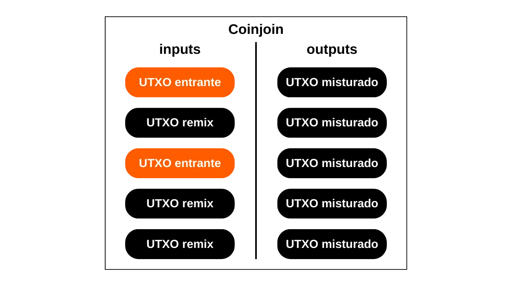
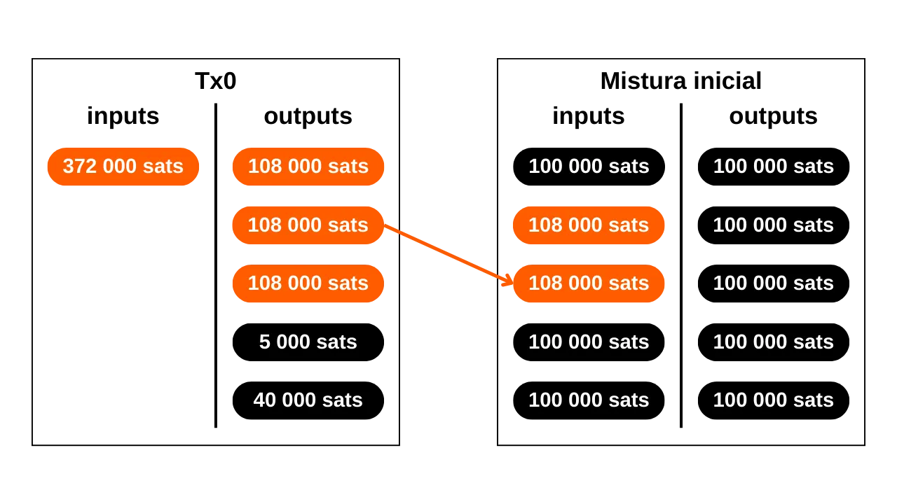

***ATENÇÃO:** Após a prisão dos fundadores da Samourai Wallet e a apreensão dos seus servidores em 24 de abril, a ferramenta Whirlpool não funciona mais, mesmo para pessoas que têm seu próprio Dojo ou usam Sparrow Wallet. No entanto, ainda é possível que essa ferramenta seja reativada nas próximas semanas ou relançada de uma forma diferente. Além disso, a parte teórica deste artigo permanece relevante para entender os princípios e objetivos dos coinjoins em geral (não apenas Whirlpool), bem como a eficácia do modelo Whirlpool.*

_Estamos acompanhando de perto a evolução deste caso, bem como os desenvolvimentos relacionados às ferramentas associadas. Fique assegurado de que atualizaremos este tutorial à medida que novas informações estiverem disponíveis._

_Este tutorial é fornecido apenas para fins educativos e informativos. Não endossamos nem encorajamos o uso dessas ferramentas para fins criminosos. É responsabilidade de cada usuário cumprir as leis em sua jurisdição._

---

Neste tutorial, você aprenderá o que é um coinjoin e como realizar um usando o software Samourai Wallet e a implementação Whirlpool, utilizando seu próprio Dojo. Na minha opinião, este método é atualmente o melhor para misturar seus bitcoins.

## O que é um coinjoin no Bitcoin?
**Um coinjoin é uma técnica que quebra a rastreabilidade dos bitcoins na blockchain**. Ele se baseia em uma transação colaborativa com uma estrutura específica de mesmo nome: a transação coinjoin.

Os coinjoins aumentam a privacidade dos usuários do Bitcoin complicando a análise de cadeia para observadores externos. Sua estrutura permite a fusão de várias moedas de diferentes usuários em uma única transação, assim, turvando os rastros e tornando difícil determinar os vínculos entre endereços de entrada e saída.

O princípio do coinjoin é baseado em uma abordagem colaborativa: vários usuários que desejam misturar seus bitcoins depositam quantias idênticas como entradas da mesma transação. Essas quantias são então redistribuídas como saídas de igual valor para cada usuário. Ao final da transação, torna-se impossível associar uma saída específica a um usuário conhecido na entrada. Não existe um vínculo direto entre as entradas e saídas, o que quebra a associação entre os usuários e seus UTXO, bem como o histórico de cada moeda.

Exemplo de uma transação coinjoin (não minha): [323df21f0b0756f98336437aa3d2fb87e02b59f1946b714a7b09df04d429dec2](https://mempool.space/pt/tx/323df21f0b0756f98336437aa3d2fb87e02b59f1946b714a7b09df04d429dec2)

Para realizar um coinjoin garantindo que cada usuário mantenha controle sobre seus fundos o tempo todo, o processo começa com a transação sendo construída por um coordenador, que então a transmite aos participantes. Cada usuário então assina a transação após verificar que ela lhes convém. Todas as assinaturas coletadas são finalmente integradas à transação. Se uma tentativa de desviar fundos for feita por um usuário ou pelo coordenador, por meio de uma modificação nas saídas da transação coinjoin, as assinaturas se provarão inválidas, levando à rejeição da transação pelos nós.

Existem várias implementações de coinjoin, como Whirlpool, JoinMarket ou Wabisabi, cada uma visando gerenciar a coordenação entre os participantes e aumentar a eficiência das transações coinjoin.
Neste tutorial, vamos nos aprofundar na implementação do **Whirlpool**, que considero ser a solução mais eficiente para realizar coinjoins no Bitcoin. Embora disponível em várias carteiras, neste tutorial, exploraremos exclusivamente seu uso com o aplicativo móvel Samourai Wallet, sem Dojo.

## Por que realizar coinjoins no Bitcoin?
Um dos problemas iniciais com qualquer sistema de pagamento peer-to-peer é o gasto duplo: como impedir que indivíduos mal-intencionados gastem as mesmas unidades monetárias várias vezes sem recorrer a uma autoridade central para arbitrar?

Satoshi Nakamoto forneceu uma solução para esse dilema por meio do protocolo Bitcoin, um sistema de pagamento eletrônico peer-to-peer que opera independentemente de qualquer autoridade central. Em seu white paper, ele enfatiza que a única maneira de certificar a ausência de gasto duplo é garantir a visibilidade de todas as transações dentro do sistema de pagamento.
Para garantir que cada participante esteja ciente das transações, elas devem ser divulgadas publicamente. Portanto, a operação do Bitcoin depende de uma infraestrutura transparente e distribuída, permitindo que qualquer operador de nó verifique a totalidade das cadeias de assinatura eletrônica e o histórico de cada moeda, desde sua criação por um minerador.
A natureza transparente e distribuída do blockchain do Bitcoin significa que qualquer usuário da rede pode seguir e analisar as transações de todos os outros participantes. Como resultado, a anonimidade no nível da transação é impossível. No entanto, a anonimidade é preservada no nível da identificação individual. Ao contrário do sistema bancário tradicional, onde cada conta está vinculada a uma identidade pessoal, no Bitcoin, os fundos estão associados a pares de chaves criptográficas, oferecendo assim aos usuários uma forma de pseudonimato por trás de identificadores criptográficos.

Assim, a confidencialidade no Bitcoin é comprometida quando observadores externos conseguem associar UTXOs específicos a usuários identificados. Uma vez estabelecida essa associação, torna-se possível rastrear suas transações e analisar o histórico de seus bitcoins. Coinjoin é precisamente uma técnica desenvolvida para quebrar a rastreabilidade dos UTXOs, oferecendo assim uma certa camada de confidencialidade aos usuários do Bitcoin no nível da transação.

## Como o Whirlpool funciona?
Whirlpool se destaca de outros métodos de coinjoin ao usar transações "_ZeroLink_", que garantem que não há absolutamente nenhum vínculo técnico possível entre todas as entradas e todas as saídas. Essa mistura perfeita é alcançada por meio de uma estrutura onde cada participante contribui com uma quantidade idêntica na entrada (exceto pelas taxas de mineração), gerando assim saídas de quantidades perfeitamente iguais.
Essa abordagem restritiva para as entradas dá às transações de coinjoin do Whirlpool uma característica única: a completa ausência de links determinísticos entre as entradas e as saídas. Em outras palavras, cada saída tem uma probabilidade igual de ser atribuída a qualquer participante, em comparação com todas as outras saídas na transação.
Inicialmente, o número de participantes em cada coinjoin do Whirlpool era limitado a 5, com 2 novos entrantes e 3 remixers (explicaremos esses conceitos mais adiante). No entanto, o aumento das taxas de transação on-chain observado em 2023 levou as equipes da Samourai a repensar seu modelo para melhorar a privacidade enquanto reduz custos. Assim, levando em conta a situação do mercado de taxas e o número de participantes, o coordenador pode agora organizar coinjoins incluindo 6, 7 ou 8 participantes. Essas sessões aprimoradas são referidas como "_Surge Cycles_". É importante notar que, independentemente da configuração, sempre há apenas 2 novos entrantes nos coinjoins do Whirlpool.

Assim, as transações do Whirlpool são caracterizadas por um número idêntico de entradas e saídas, que podem ser:
- 5 entradas e 5 saídas;

- 6 entradas e 6 saídas;

- 7 entradas e 7 saídas;

- 8 entradas e 8 saídas.

O modelo proposto pelo Whirlpool é baseado em pequenas transações de coinjoin. Ao contrário de Wasabi e JoinMarket, onde a robustez dos anonsets depende do volume de participantes em um único ciclo, Whirlpool aposta na cadeia de múltiplos ciclos de pequeno porte.

Neste modelo, o usuário paga taxas apenas na sua entrada inicial em um pool, permitindo-lhes participar de uma multitude de remixes sem taxas adicionais. São os novos entrantes que cobrem as taxas de mineração para os remixers.
Com cada coinjoin adicional em que uma moeda participa, juntamente com seus pares encontrados anteriormente, os anonsets crescerão exponencialmente. O objetivo é, portanto, tirar proveito desses remixes gratuitos que, a cada ocorrência, contribuem para aumentar a densidade dos anonsets associados a cada moeda misturada.
O Whirlpool foi projetado levando em conta dois requisitos importantes:
- A acessibilidade de implementação em dispositivos móveis, dado que o Samourai Wallet é primariamente um aplicativo para smartphone;
- A velocidade dos ciclos de remixagem para promover um aumento significativo nos anonsets.
Esses imperativos guiaram as escolhas dos desenvolvedores do Samourai Wallet no design do Whirlpool, levando-os a limitar o número de participantes por ciclo. Poucos participantes teriam comprometido a eficiência do coinjoin, reduzindo drasticamente os anonsets gerados a cada ciclo, enquanto muitos participantes teriam apresentado problemas de gestão em aplicativos móveis e teriam impedido o fluxo de ciclos.
**Em última análise, não é necessário ter um grande número de participantes por coinjoin no Whirlpool, uma vez que os anonsets são alcançados através do acúmulo de vários ciclos de coinjoin.**

[-> Saiba mais sobre os anonsets do Whirlpool.](https://planb.network/tutorials/privacy/wst-anonsets)

### As piscinas e taxas de coinjoin
Para que esses múltiplos ciclos aumentem efetivamente os anonsets das moedas misturadas, um certo quadro deve ser estabelecido para restringir as quantidades de UTXO usadas. O Whirlpool define diferentes piscinas.

Uma piscina representa um grupo de usuários que desejam misturar juntos, que concordam com a quantidade de UTXO a ser usada para otimizar o processo de coinjoin. Cada piscina especifica uma quantidade fixa para o UTXO, à qual o usuário deve aderir para participar. Assim, para realizar coinjoins com o Whirlpool, você precisa selecionar uma piscina. As piscinas atualmente disponíveis são as seguintes:
- 0,5 bitcoins;
- 0,05 bitcoin;
- 0,01 bitcoin;
- 0,001 bitcoin (= 100.000 sats).

Ao juntar-se a uma piscina com seus bitcoins, eles serão divididos para gerar UTXOs que são perfeitamente homogêneos com os dos outros participantes na piscina. Cada piscina tem um limite máximo; assim, para quantidades que excedam esse limite, você será forçado a fazer duas entradas separadas dentro da mesma piscina ou a mudar para outra piscina com uma quantidade maior:

| Piscina (bitcoin) | Quantidade máxima por entrada (bitcoin) |
|-------------------|-----------------------------------------|
| 0,5               | 35                                      |
| 0,05              | 3,5                                     |
| 0,01              | 0,7                                     |
| 0,001             | 0,025                                   |

Como mencionado anteriormente, um UTXO é considerado pertencente a uma piscina quando está pronto para ser integrado em um coinjoin. No entanto, isso não significa que o usuário perde a posse dele. **Através dos diferentes ciclos de mistura, você mantém o controle total de suas chaves e, consequentemente, de seus bitcoins.** Isso é o que diferencia a técnica de coinjoin de outras técnicas de mistura centralizadas.

Para entrar em uma piscina de coinjoin, taxas de serviço, bem como taxas de mineração, devem ser pagas. As taxas de serviço são fixas para cada piscina e destinam-se a compensar as equipes responsáveis pelo desenvolvimento e manutenção do Whirlpool.
As taxas de serviço para usar o Whirlpool devem ser pagas apenas uma vez ao entrar na piscina. Após esta etapa, você tem a oportunidade de participar de um número ilimitado de remixes sem quaisquer taxas adicionais. Aqui estão as taxas fixas atuais para cada piscina:
| Piscina (bitcoin) | Taxa de Entrada (bitcoin) |
|-------------------|---------------------------|
| 0.5            | 0.0175                    || 0.05           | 0.00175                   |
| 0.01           | 0.0005 (50,000 sats)      |
| 0.001          | 0.00005 (5,000 sats)      |

Essas taxas funcionam essencialmente como um ingresso de entrada para o pool escolhido, independentemente da quantidade que você coloca em coinjoin. Assim, seja você entrar no pool de 0.01 com exatamente 0.01 BTC ou entrar com 0.5 BTC, as taxas permanecerão as mesmas em valor absoluto.

Antes de prosseguir para os coinjoins, o usuário, portanto, tem uma escolha entre 2 estratégias:
- Optar por um pool menor para minimizar as taxas de serviço, sabendo que receberão vários UTXOs pequenos em retorno;
- Ou preferir um pool maior, concordando em pagar taxas mais altas para acabar com um número reduzido de UTXOs de maior valor.

Geralmente é aconselhado contra a fusão de vários UTXOs misturados após os ciclos de coinjoin, pois isso poderia comprometer a confidencialidade adquirida, especialmente devido à Heurística de Propriedade Comum de Entrada (CIOH). Portanto, pode ser sábio escolher um pool maior, mesmo que isso signifique pagar mais, para evitar ter muitos UTXOs de pequeno valor na saída. O usuário deve ponderar esses compromissos para escolher o pool que prefere.

Além das taxas de serviço, as taxas de mineração inerentes a qualquer transação Bitcoin também devem ser consideradas. Como usuário do Whirlpool, você será obrigado a pagar as taxas de mineração para a transação de preparação (`Tx0`) assim como aquelas para o primeiro coinjoin. Todos os remixes subsequentes serão gratuitos, graças ao modelo do Whirlpool que depende do pagamento de novos participantes.

De fato, em cada coinjoin do Whirlpool, dois usuários entre as entradas são novos participantes. As outras entradas vêm de remixers. Como resultado, as taxas de mineração para todos os participantes na transação são cobertas por esses dois novos participantes, que então também se beneficiarão de remixes gratuitos:

Graças a este sistema de taxas, o Whirlpool realmente se diferencia de outros serviços de coinjoin, já que os anonsets dos UTXOs não são proporcionais ao preço pago pelo usuário. Assim, é possível alcançar níveis consideravelmente altos de anonimato pagando apenas a taxa de entrada do pool e as taxas de mineração para duas transações (o `Tx0` e a mistura inicial).
É importante notar que o usuário também terá que cobrir as taxas de mineração para retirar seus UTXOs do pool após completar seus múltiplos coinjoins, a menos que tenham selecionado a opção `mix to`, que discutiremos no tutorial abaixo.

### As contas de carteira HD usadas pelo Whirlpool
Para realizar um coinjoin via Whirlpool, a carteira deve gerar várias contas distintas. Uma conta, no contexto de uma carteira HD (*Hierarchical Deterministic*), constitui uma seção completamente isolada das outras, essa separação ocorrendo no terceiro nível de profundidade da hierarquia da carteira, isto é, no nível do `xpub`.

Uma carteira HD pode teoricamente derivar até `2^(32/2)` contas diferentes. A conta inicial, usada por padrão em todas as carteiras Bitcoin, corresponde ao índice `0'`.

Para carteiras adaptadas ao Whirlpool, como Samourai ou Sparrow, 4 contas são usadas para atender às necessidades do processo de coinjoin:
- A conta **depósito**, identificada pelo índice `0'`;
- A conta do **bad bank** (ou troco tóxico), identificada pelo índice `2 147 483 644`;
- A conta **premix**, identificada pelo índice `2 147 483 645`;
- A conta **postmix**, identificada pelo índice `2 147 483 646`.

Cada uma dessas contas cumpre uma função específica dentro do coinjoin.

Todas essas contas estão vinculadas a uma única semente, o que permite ao usuário recuperar o acesso a todos os seus bitcoins usando sua frase de recuperação e, se necessário, sua passphrase. No entanto, é necessário especificar ao software, durante essa operação de recuperação, os diferentes índices de conta que foram usados.

Vamos agora olhar para as diferentes etapas de um coinjoin Whirlpool dentro dessas contas.

### As diferentes etapas dos coinjoins no Whirlpool
**Etapa 1: O Tx0**
O ponto de partida de qualquer coinjoin Whirlpool é a conta de **depósito**. Esta conta é a que você automaticamente usa quando cria uma nova carteira Bitcoin. Esta conta deve ser creditada com os bitcoins que se deseja misturar.
O `Tx0` representa o primeiro passo no processo de mistura do Whirlpool. Seu objetivo é preparar e igualar o UTXO para o coinjoin, dividindo-os em unidades correspondentes ao montante da piscina selecionada, para garantir a homogeneidade da mistura. Os UTXO igualados são então enviados para a conta **premix**. Quanto à diferença que não pode entrar na piscina, ela é separada em uma conta específica: o **bad bank** (ou "troco tóxico").
Esta transação inicial `Tx0` também serve para liquidar as taxas de serviço devidas ao coordenador da mistura. Ao contrário das etapas seguintes, esta transação não é colaborativa; o usuário deve, portanto, arcar com todas as taxas de mineração:

Neste exemplo de uma transação `Tx0`, uma entrada de `372,000 sats` de nossa conta de **depósito** é dividida em vários UTXO de saída, que são distribuídos da seguinte forma:
- Um montante de `5,000 sats` destinado ao coordenador para taxas de serviço, correspondendo à entrada na piscina de `100,000 sats`;
- Três UTXO preparados para mistura, redirecionados para nossa conta **premix** e registrados com o coordenador. Esses UTXO são igualados a `108,000 sats` cada, para cobrir as taxas de mineração para sua futura mistura inicial;
- O excedente que não pode entrar na piscina, por ser muito pequeno, é considerado troco tóxico. Ele é enviado para sua conta específica. Aqui, essa mudança soma `40,000 sats`;
- Finalmente, há `3,000 sats` que não constituem uma saída, mas são as taxas de mineração necessárias para confirmar o `Tx0`.

Por exemplo, aqui está um real Whirlpool Tx0 (não meu): [edef60744f539483d868caff49d4848e5cc6e805d6cdc8d0f9bdbbaedcb5fc46](https://mempool.space/pt/tx/edef60744f539483d868caff49d4848e5cc6e805d6cdc8d0f9bdbbaedcb5fc46)

**Etapa 2: O troco tóxico**
O excedente que não pôde ser integrado ao pool, aqui equivalente a `40,000 sats`, é redirecionado para a conta do **banco ruim**, também referido como "troco tóxico", para garantir uma separação estrita dos outros UTXO na carteira.
Este UTXO é perigoso para a privacidade do usuário porque não só ainda está ligado ao seu passado, e, portanto, possivelmente à identidade de seu proprietário, mas adicionalmente, é notado como pertencente a um usuário que realizou um coinjoin.
Se este UTXO for mesclado com saídas misturadas, elas perderão toda a confidencialidade obtida durante os ciclos de coinjoin, notavelmente por causa da Heurística de Propriedade Comum de Entrada (CIOH). Se for mesclado com outras mudanças tóxicas, o usuário corre o risco de perder confidencialidade, uma vez que isso vinculará as diferentes entradas dos ciclos de coinjoin. Portanto, deve ser manuseado com cautela. A maneira de gerenciar este UTXO tóxico será detalhada na última parte deste artigo, e futuros tutoriais cobrirão esses métodos mais a fundo na Rede PlanB.

**Etapa 3: A Mistura Inicial**
Após a `Tx0` ser concluída, os UTXOs equalizados são enviados para a conta **premix** de nossa carteira, prontos para serem introduzidos em seu primeiro ciclo de coinjoin, também chamado de "mistura inicial". Se, como em nosso exemplo, a `Tx0` gera vários UTXOs destinados à mistura, cada um deles será integrado em um coinjoin inicial separado.

Ao final dessas primeiras misturas, a conta **premix** estará vazia, enquanto nossas moedas, tendo pago as taxas de mineração para este primeiro coinjoin, serão ajustadas exatamente ao montante definido pelo pool escolhido. Em nosso exemplo, nossos UTXOs iniciais de `108 000 sats` terão sido reduzidos exatamente para `100 000 sats`.

**Etapa 4: Os Remixes**
Após a mistura inicial, os UTXOs são transferidos para a conta **postmix**. Esta conta reúne os UTXOs já misturados e aqueles à espera de remixagem. Quando o cliente Whirlpool está ativo, os UTXOs localizados na conta **postmix** estão automaticamente disponíveis para remixagem e serão escolhidos aleatoriamente para participar desses novos ciclos.

Como lembrete, os remixes são então 100% gratuitos: nenhuma taxa de serviço adicional ou taxas de mineração são necessárias. Manter os UTXOs na conta **postmix** assim mantém seu valor intacto e simultaneamente melhora seus anonsets. É por isso que é importante permitir que essas moedas participem de múltiplos ciclos de coinjoin. Isso não custa nada para você e aumenta seus níveis de anonimato.

Quando você decide gastar UTXOs misturados, você pode fazer isso diretamente desta conta **postmix**. É aconselhável manter os UTXOs misturados nesta conta para se beneficiar de remixes gratuitos e evitar que eles deixem o circuito Whirlpool, o que poderia diminuir sua confidencialidade.

Como veremos no tutorial seguinte, há também a opção `mix to` que oferece a possibilidade de enviar automaticamente suas moedas misturadas para outra carteira, como uma carteira fria, após um número definido de coinjoins.
Após cobrir a teoria, vamos mergulhar na prática com um tutorial sobre o uso do Whirlpool através do aplicativo Android Samourai Wallet, sincronizado com Whirlpool CLI e GUI em seu próprio Dojo!
## Tutorial: Coinjoin Whirlpool com Seu Próprio Dojo
Existem muitas opções para usar o Whirlpool. A que quero introduzir aqui é a opção da Samourai Wallet, uma aplicação de gestão de carteiras Bitcoin de código aberto no Android, mas desta vez **com o seu próprio Dojo**.
Realizar coinjoins através da Samourai Wallet usando o seu próprio Dojo é, na minha opinião, a estratégia mais eficaz para realizar coinjoins no Bitcoin até o momento. Esta abordagem requer algum investimento inicial em termos de configuração, mas uma vez no lugar, oferece a possibilidade de misturar e remisturar seus bitcoins continuamente, 24 horas por dia, 7 dias por semana, sem a necessidade de manter sua aplicação Samourai ativa o tempo todo. De fato, graças ao Whirlpool CLI operando em um nó Bitcoin, você está sempre pronto para participar em coinjoins. A aplicação Samourai então lhe dá a oportunidade de gastar seus fundos misturados a qualquer momento, onde quer que esteja, diretamente do seu smartphone. Além disso, este método tem a vantagem de nunca conectá-lo a servidores gerenciados pelas equipes da Samourai, preservando assim o seu `xpub` de qualquer exposição externa.

Esta técnica é, portanto, ideal para aqueles que buscam máxima privacidade e os ciclos de coinjoin de mais alta qualidade. No entanto, requer ter um nó Bitcoin à sua disposição e, como veremos mais tarde, requer alguma configuração. É, assim, mais adequado para usuários intermediários a avançados. Para iniciantes, recomendo se familiarizar com coinjoin através destes dois outros tutoriais, que mostram como fazê-lo a partir da Sparrow Wallet ou Samourai Wallet (sem Dojo):
- **[Tutorial de coinjoin da Sparrow Wallet](https://planb.network/pt/tutorials/privacy/coinjoin-sparrow-wallet)**;
- **[Tutorial de coinjoin da Samourai Wallet (sem Dojo)](https://planb.network/pt/tutorials/privacy/coinjoin-samourai-wallet)**.

### Entendendo a Configuração
Para começar, você vai precisar de um Dojo! Dojo é uma implementação de nó Bitcoin baseada no Bitcoin Core, desenvolvida pelas equipes da Samourai.

Para rodar o seu próprio Dojo, você tem a opção de instalar um nó Dojo autonomamente, ou aproveitar o Dojo em cima de outra solução de nó Bitcoin "nó-em-caixa". Atualmente, as opções disponíveis são:
- [RoninDojo](https://ronindojo.io/), que é um Dojo aprimorado com ferramentas adicionais, incluindo um assistente de instalação e um assistente de administração. Detalho o procedimento para configurar e usar o RoninDojo neste outro tutorial: [RONINDOJO V2](https://planb.network/pt/tutorials/node/ronin-dojo-v2);
- [Umbrel](https://umbrel.com/) com a aplicação "Samourai Server";
- [MyNode](https://mynodebtc.com/) com a aplicação "Dojo";
- [Nodl](https://www.nodl.eu/) com a aplicação "Dojo";
- [Citadel](https://runcitadel.space/) com a aplicação "Samourai".

Na nossa configuração, interagiremos com três interfaces distintas:
- **Samourai Wallet**, que hospedará nossa carteira Bitcoin dedicada a coinjoins. Disponível gratuitamente no Android, esta aplicação FOSS permite controlar sua carteira de mistura, especialmente para gastar seu pós-mix do seu smartphone;
- **Whirlpool CLI** (_Interface de Linha de Comando_), que operará no nó que hospeda o Dojo. Este software terá acesso às chaves da sua carteira Samourai. É responsável por comunicar com o coordenador e gerenciar os coinjoins continuamente. Atua como uma cópia da sua carteira Samourai no seu nó, pronta para participar em coinjoins a qualquer momento;
- **Whirlpool GUI** (_Interface Gráfica do Usuário_), a interface gráfica que usaremos para monitorar a atividade do Whirlpool CLI e iniciar a mistura remotamente. Whirlpool GUI fornece uma representação visual das operações conduzidas pelo Whirlpool CLI. Este software deve ser instalado em um computador separado do Dojo. Para usuários de Umbrel, MyNode, Nodl e Citadel, Whirlpool GUI é obrigatório. No entanto, com RoninDojo, a interface Whirlpool GUI já está integrada na interface web do seu nó através da aplicação `Whirlpool`. Portanto, você não precisará instalá-lo em um PC separado.

Na minha opinião, usar RoninDojo representa a melhor solução para realizar coinjoins com um Dojo. Uma vez que este software node-in-box está em parceria direta com as equipes Samourai, RoninDojo é muito mais otimizado para fazer isso. Além disso, a integração do Whirlpool GUI na interface web simplifica significativamente o processo de configuração. Neste tutorial, ainda explicarei como fazer isso com as outras soluções que integram Dojo (Umbrel, Nodl, MyNode e Citadel).

### Preparando Seu Dojo
Para começar, você precisará instalar o Dojo e obter o código QR ou o link que permitirá que você se conecte a ele remotamente. Este link é um endereço Tor terminando em `.onion`. Se você estiver usando RoninDojo, simplesmente navegue até o menu `Pairing` para acessar esta informação.

Abaixo de `Samourai Dojo`, clique no botão `Pair now`.

Seu código QR de conexão e o link correspondente serão exibidos.

Se você estiver no Umbrel, vá para a App Store e procure pela aplicação `Samourai Server`. Ela está localizada na aba `Bitcoin`.

Instale a aplicação.

Ao abrir a aplicação, você então terá acesso ao código QR para se conectar ao seu Dojo.

Se você estiver usando outro software node-in-box como MyNode, Citadel ou Nodl, o processo é semelhante ao do Umbrel. Você precisa instalar a aplicação Samourai ou Dojo para obter as informações necessárias para se conectar ao seu Dojo.

### Preparando sua Carteira Samourai
Após recuperar as informações de conexão ao seu Dojo, agora é hora de configurar sua carteira para coinjoins. Existem dois cenários: se você ainda não tem uma Carteira Samourai no seu smartphone, o processo é simples, basta criar uma nova.
Por outro lado, se você já possui uma Samourai Wallet, precisará reinstalar o aplicativo para associá-lo a um novo Dojo. Este passo é necessário porque a conexão com um Dojo só pode ser estabelecida no primeiro lançamento do aplicativo. No entanto, graças ao arquivo de backup criptografado gerado automaticamente pelo Samourai em seu telefone, este procedimento é simples e rápido.
*Se você nunca usou o Samourai, pode pular estas etapas preliminares e prosseguir diretamente para a instalação do aplicativo.*

Antes de tudo, certifique-se de que sua aplicação Samourai Wallet está atualizada. Para fazer isso, verifique a Google Play Store ou compare a versão do seu aplicativo em `Configurações > Outros` com a disponível no site do Samourai.

Certifique-se de que você tem sua frase de recuperação da carteira Samourai e que ela está legível. Em seguida, faça um teste da sua frase secreta BIP39 navegando até `Configurações > Solução de Problemas > Teste de Frase/Backup` para confirmar sua precisão.

Digite sua frase secreta e, em seguida, verifique se o Samourai confirma sua validade.

Se sua frase secreta for inválida, ou se você não tiver sua frase de recuperação, é imperativo interromper imediatamente o procedimento! **Você corre o risco de perder seus bitcoins durante esta operação.** Neste caso, é aconselhável transferir seus fundos para outra carteira e começar com uma nova carteira Samourai em branco. As próximas etapas devem ser seguidas apenas se você tiver certeza de que possui todas as informações de backup necessárias e que sua frase secreta é válida.

Em seguida, prossiga com a criação de um backup criptografado da sua carteira e copie-o para sua área de transferência. Para realizar esta operação, clique nos três pequenos pontos localizados no canto superior direito da tela e, em seguida, selecione `Exportar backup da carteira`.

**A partir deste passo, não copie mais nada para sua área de transferência!** É absolutamente essencial que você mantenha seu backup copiado.

Se você executou corretamente as etapas anteriores, agora você pode excluir com segurança sua carteira Samourai. Para fazer isso, vá para: `Configurações > Carteira > Apagar a carteira com segurança`.

*Se você nunca usou o Samourai e está instalando o aplicativo do zero, pode retomar o tutorial a partir desta etapa.*

Sua aplicação Samourai agora está reiniciada. Abra o aplicativo e prossiga com as etapas de configuração como se estivesse usando-o pela primeira vez.

Na próxima etapa, você acessará a página dedicada à configuração do seu Dojo. Selecione a opção `Dojo`, depois insira as informações de login do seu Dojo. Para fazer isso, você tem a opção de escanear as informações pressionando `Escanear QR`.

*Para novos usuários do Samourai, será então necessário criar uma carteira do zero. Se precisar de ajuda, você pode consultar as instruções para configurar uma nova carteira Samourai [neste tutorial, especificamente na seção "Criando uma carteira de software"](https://planb.network/tutorials/privacy/coinjoin-samourai-wallet).*

Se você está procedendo com a restauração de uma carteira Samourai já existente, selecione `Restaurar carteira existente`, depois escolha `Eu tenho um arquivo de backup do Samourai`.

Normalmente, você deve sempre ter seu arquivo de recuperação na sua área de transferência. Em seguida, clique em `PASTE` para inserir seu arquivo no local designado. Para descriptografá-lo, também será necessário inserir a frase secreta BIP39 da sua carteira no campo correspondente, localizado logo abaixo. Para finalizar, clique em `FINISH`. 

Você será então redirecionado para sua Samourai Wallet que, desta vez, estará conectada ao seu próprio Dojo.

### Instalando Whirlpool GUI
Agora é hora de instalar o Whirlpool GUI, a interface gráfica que permitirá que você gerencie seus ciclos de coinjoin do seu PC usual. Para usuários do RoninDojo, esta etapa não é necessária, pois a gestão dos coinjoins pode ser feita diretamente via interface web em `Apps > Whirlpool`. No entanto, se você estiver usando outra solução de "nó-em-caixa" Bitcoin, é imperativo proceder com esta instalação.

Vá ao seu computador pessoal e baixe o software Whirlpool do site oficial da Samourai Wallet, selecionando a versão que corresponde ao seu sistema operacional.

Antes de lançar o Whirlpool GUI, é necessário instalar o JAVA 8 ou uma versão superior na sua máquina. Para isso, [você pode instalar o OpenJDK](https://adoptium.net/).

Também é necessário ter o Tor Daemon ou o Tor Browser operacional em segundo plano no seu computador. Certifique-se de iniciar o Tor antes de cada sessão de uso do Whirlpool GUI. Se o Tor ainda não estiver instalado na sua máquina, [você pode baixar e instalar a partir do site oficial do projeto](https://www.torproject.org/download/), depois certifique-se de lançá-lo em segundo plano.

Uma vez que o JDK esteja instalado no seu sistema e o Tor esteja lançado em segundo plano, você pode iniciar o Whirlpool GUI.

No Whirlpool GUI, clique em `Advanced: Remote CLI` para conectar seu Whirlpool CLI que está no seu Dojo. Você precisará do endereço Tor do seu Whirlpool CLI.

Para localizar seu endereço Tor no Umbrel e outras soluções de "nó-em-caixa", basta iniciar o aplicativo Samourai Server ou Dojo (o nome pode variar dependendo do software usado). O endereço Tor será diretamente visível na página do aplicativo.

No Whirlpool GUI, insira o endereço Tor que você obteve anteriormente no campo `CLI address`. Mantenha o prefixo `http://`, mas não adicione a porta `:8899` no final. Cole apenas o endereço conforme foi fornecido a você.

No campo Tor Proxy, insira `socks5://127.0.0.1:9050` se você estiver usando o Tor Daemon, ou `socks5://127.0.0.1:9150` se for o Tor Browser. Quando você se conectar pela primeira vez ao Whirlpool CLI via Whirlpool GUI, é possível deixar o campo da chave API vazio. Se esta não for sua primeira conexão, por favor, insira sua chave API no espaço dedicado. Esta chave pode ser localizada na mesma página que seu endereço Tor.

Uma vez que tenha preenchido tudo, clique no botão `Connect`. Por favor, aguarde, a conexão pode levar alguns minutos.

### Emparelhando sua Samourai Wallet com Whirlpool GUI
*Para usuários do RoninDojo, vocês podem retomar o tutorial aqui.*

Agora vamos emparelhar a carteira Samourai que configuramos anteriormente com o software Whirlpool GUI, ou diretamente com o RoninDojo para aqueles que estão usando este software. Seja usando Whirlpool GUI ou RoninDojo, será solicitado que você cole ou escaneie as informações de emparelhamento da sua carteira Samourai.

Para encontrar esta informação, vá para as configurações da sua carteira.

Clique em `Transactions`, depois em `Pair to Whirlpool GUI`.

A Samourai então fornecerá as informações necessárias para estabelecer a conexão. Tenha cuidado, esses dados são sensíveis! Você pode transferi-los para o seu PC copiando diretamente ou escaneando o código QR exibido, usando a webcam do seu computador após clicar no símbolo do código QR.

Após realizar esta operação, no Whirlpool GUI, selecione `Initialize GUI`. Por favor, aguarde, pois esta etapa pode levar um momento.

Seja usando Whirlpool GUI ou RoninDojo, será solicitado que você insira a frase-senha da sua carteira Samourai. Insira-a no campo dedicado, depois pressione o botão `Login` para continuar.

Você então chegará na página inicial do Whirlpool CLI

### Iniciando coinjoins a partir do Whirlpool GUI
*Para usuários do RoninDojo, o processo a seguir é idêntico. A interface do aplicativo Whirlpool integrada ao RoninDojo oferece as mesmas opções e funcionalidades que o software Whirlpool GUI no desktop. Portanto, você pode seguir estas instruções da mesma forma.*
Agora que tudo está configurado, você está pronto para começar a misturar seus bitcoins. Para fazer isso, transfira os bitcoins que deseja misturar para a conta **Deposit** da sua Samourai Wallet. Esta operação pode ser realizada diretamente pelo aplicativo Samourai Wallet ou no Whirlpool GUI. Da página principal, clique no botão `+ Deposit` localizado no canto superior esquerdo.

O Whirlpool GUI gerará um endereço de recebimento. Ele também exibirá o valor mínimo necessário para participar de cada pool de coinjoin. Este valor varia dependendo do mercado de taxas. É aconselhável depositar um valor um pouco maior que o mínimo exigido, pois se as taxas de mineração não diminuírem, seu UTXO pode não ser aceito no pool desejado. Portanto, envie seus bitcoins para o endereço fornecido. Para obter um novo endereço, basta clicar no botão `Renew address`.

Uma vez que o depósito for confirmado, você poderá vê-lo aparecer na conta **Deposit** no Whirlpool GUI.

Para iniciar os ciclos de coinjoin, selecione os UTXOs que deseja misturar e pressione o botão `Premix`. Tenha cuidado: se você selecionar vários UTXOs diferentes ao mesmo tempo, eles serão combinados durante a transação de preparação `TX0`. Essa fusão pode levar a uma diminuição na privacidade, especialmente se os UTXOs vierem de fontes diferentes, por causa da Heurística de Propriedade de Entrada Comum (CIOH).

A página de configuração do Whirlpool é aberta. Você pode escolher o pool que deseja entrar. Selecione também as taxas de mineração dedicadas ao `TX0` e aos primeiros coinjoins. Na parte inferior desta página, um resumo apresentará a quantidade de troco doxxic, bem como a quantidade e número de UTXOs que serão equalizados e incluídos nos ciclos de coinjoin. Se estiver satisfeito com esta configuração, pressione o botão `Premix` para iniciar os ciclos de coinjoin.

Uma vez que o `TX0` é criado, você poderá ver seus UTXOs equalizados na conta **Premix**, aguardando confirmação. Para permitir que suas moedas sejam remixadas automaticamente 24 horas por dia, 7 dias por semana, recomendo ativar a opção `Automatically mix premix & postmix`. Você encontrará essa funcionalidade na aba `Configuration`, localizada à esquerda da janela do seu Whirlpool GUI.

Após iniciar os coinjoins, você pode sair do Whirlpool GUI assim como do Samourai Wallet. Apenas o seu nó precisa permanecer conectado para poder participar dos coinjoins contínuos. No entanto, é aconselhável verificar periodicamente o progresso dos seus ciclos de coinjoin. Se você notar que seus UTXOs não estão sendo selecionados para um coinjoin por algum tempo, isso pode indicar um bug. Nesse caso, vá até o Whirlpool CLI e selecione `Start` para reiniciar sua disponibilidade para coinjoins.

Seus UTXOs misturados são visíveis a partir da conta **Postmix** no Whirlpool GUI. Além disso, você tem a opção de visualizá-los e gastá-los diretamente através da interface do Whirlpool no seu Samourai Wallet. Para acessar este menu, clique no `+` azul na parte inferior da sua tela e, em seguida, selecione `Whirlpool`.

As contas do Whirlpool são facilmente identificáveis no Samourai Wallet pela sua cor azul. Isso permite que você gaste seus UTXOs misturados de qualquer lugar e a qualquer momento, diretamente do seu smartphone.

Para acompanhar seus coinjoins automáticos, também recomendo configurar uma carteira somente de visualização através do aplicativo Sentinel. Adicione o ZPUB da sua conta **Postmix** e monitore o progresso dos seus ciclos de coinjoin em tempo real. Se você quiser entender como usar o Sentinel, recomendo consultar este outro tutorial na PlanB Network: [**SENTINEL WATCH-ONLY**](https://planb.network/tutorials/wallet/sentinel).