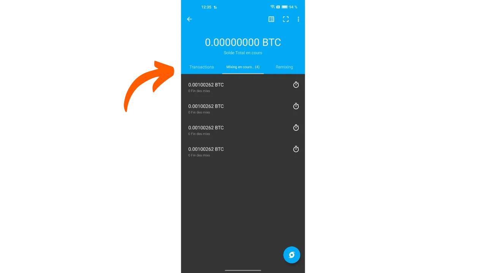

***ADVERTENCIA:** Tras la detención de los fundadores de Samourai Wallet y la incautación de sus servidores el 24 de abril, la herramienta Whirlpool ha dejado de funcionar, incluso para las personas que disponen de su propio Dojo o utilizan Sparrow Wallet. Sin embargo, sigue siendo posible que esta herramienta se reactive en las próximas semanas o se relance de una manera diferente. Además, la parte teórica de este artículo sigue siendo relevante para comprender los principios y objetivos de los coinjoins en general (no solo Whirlpool), así como la eficacia del modelo Whirlpool.*

_Estamos siguiendo de cerca la evolución de este caso así como los desarrollos relacionados con las herramientas asociadas. Ten la seguridad de que actualizaremos este tutorial a medida que estén disponibles nuevas informaciones._

_Este tutorial se proporciona únicamente con fines educativos e informativos. No respaldamos ni alentamos el uso de estas herramientas para fines criminales. Es responsabilidad de cada usuario cumplir con las leyes en su jurisdicción._

---

"*un monedero bitcoin para las calles*"

En este tutorial, aprenderás qué es un coinjoin y cómo realizar uno usando el software Samourai Wallet y la implementación Whirlpool.

## ¿Qué es un coinjoin en Bitcoin?
**Coinjoin es una técnica que rompe la trazabilidad de los bitcoins en la blockchain**. Se basa en una transacción colaborativa con una estructura específica del mismo nombre: la transacción coinjoin.

Los coinjoins mejoran la privacidad de los usuarios de Bitcoin complicando el análisis de cadena para observadores externos. Su estructura permite fusionar múltiples monedas de diferentes usuarios en una sola transacción, oscureciendo así los rastros y dificultando determinar los vínculos entre direcciones de entrada y salida.

El principio de coinjoin se basa en un enfoque colaborativo: varios usuarios que desean mezclar sus bitcoins depositan cantidades idénticas como entradas de la misma transacción. Estas cantidades se redistribuyen luego como salidas de igual valor a cada usuario. Al final de la transacción, se vuelve imposible asociar una salida específica con un usuario conocido en entrada. No existe un vínculo directo entre las entradas y salidas, rompiendo la asociación entre los usuarios y sus UTXO, así como el historial de cada moneda.


Ejemplo de una transacción coinjoin (no mía): [323df21f0b0756f98336437aa3d2fb87e02b59f1946b714a7b09df04d429dec2](https://mempool.space/es/tx/323df21f0b0756f98336437aa3d2fb87e02b59f1946b714a7b09df04d429dec2)

Para realizar un coinjoin asegurando que cada usuario mantenga el control sobre sus fondos en todo momento, el proceso comienza con la construcción de la transacción por un coordinador, quien luego la transmite a los participantes. Cada usuario firma entonces la transacción después de verificar que les conviene. Todas las firmas recopiladas se integran finalmente en la transacción. Si un usuario o el coordinador intentan desviar fondos modificando las salidas de la transacción coinjoin, las firmas resultarán inválidas, llevando al rechazo de la transacción por los nodos.

Existen varias implementaciones de coinjoin, como Whirlpool, JoinMarket o Wabisabi, cada una con el objetivo de gestionar la coordinación entre participantes y aumentar la eficiencia de las transacciones coinjoin.
En este tutorial, profundizaremos en la implementación de **Whirlpool**, que considero la solución más eficiente para realizar coinjoins en Bitcoin. Aunque está disponible en varios monederos, en este tutorial, exploraremos exclusivamente su uso con la aplicación móvil Samourai Wallet, sin Dojo.

## ¿Por qué realizar coinjoins en Bitcoin?
Uno de los problemas iniciales con cualquier sistema de pago de igual a igual es el doble gasto: ¿cómo prevenir que individuos malintencionados gasten las mismas unidades monetarias múltiples veces sin recurrir a una autoridad central para arbitrar?

Satoshi Nakamoto proporcionó una solución a este dilema a través del protocolo Bitcoin, un sistema de pago electrónico de igual a igual que opera independientemente de cualquier autoridad central. En su documento técnico, destaca que la única forma de certificar la ausencia de doble gasto es asegurar la visibilidad de todas las transacciones dentro del sistema de pago.
Para garantizar que cada participante esté al tanto de las transacciones, estas deben ser divulgadas públicamente. Por lo tanto, el funcionamiento de Bitcoin se basa en una infraestructura transparente y distribuida, permitiendo que cualquier operador de nodo verifique la totalidad de las cadenas de firma electrónica y el historial de cada moneda, desde su creación por un minero.
La naturaleza transparente y distribuida de la blockchain de Bitcoin significa que cualquier usuario de la red puede seguir y analizar las transacciones de todos los demás participantes. Como resultado, la anonimidad a nivel de transacción es imposible. Sin embargo, la anonimidad se preserva a nivel de identificación individual. A diferencia del sistema bancario tradicional donde cada cuenta está vinculada a una identidad personal, en Bitcoin, los fondos están asociados con pares de claves criptográficas, ofreciendo así a los usuarios una forma de pseudonimato detrás de identificadores criptográficos.

Por lo tanto, la confidencialidad en Bitcoin se ve comprometida cuando observadores externos logran asociar UTXOs específicos con usuarios identificados. Una vez establecida esta asociación, se hace posible rastrear sus transacciones y analizar el historial de sus bitcoins. Coinjoin es precisamente una técnica desarrollada para romper la trazabilidad de los UTXOs, ofreciendo así una cierta capa de confidencialidad a los usuarios de Bitcoin a nivel de transacción.

## ¿Cómo funciona Whirlpool?
Whirlpool se distingue de otros métodos de coinjoin al usar transacciones "_ZeroLink_", las cuales aseguran que estrictamente no es posible ningún vínculo técnico entre todas las entradas y todas las salidas. Esta mezcla perfecta se logra a través de una estructura donde cada participante contribuye con una cantidad idéntica en entrada (excepto por las comisiones de minería), generando así salidas de cantidades perfectamente iguales.
Este enfoque restrictivo para las entradas otorga a las transacciones coinjoin de Whirlpool una característica única: la total ausencia de vínculos deterministas entre entradas y salidas. En otras palabras, cada salida tiene una probabilidad igual de ser atribuida a cualquier participante, en comparación con todas las demás salidas en la transacción.
Inicialmente, el número de participantes en cada coinjoin de Whirlpool estaba limitado a 5, con 2 nuevos participantes y 3 remezcladores (explicaremos estos conceptos más adelante). Sin embargo, el aumento en las comisiones de transacción en cadena observado en 2023 impulsó a los equipos de Samourai a repensar su modelo para mejorar la privacidad mientras reducen costos. Así, teniendo en cuenta la situación del mercado de comisiones y el número de participantes, el coordinador ahora puede organizar coinjoins incluyendo 6, 7 u 8 participantes. Estas sesiones mejoradas se denominan "_Ciclos de Aumento_". Es importante notar que, independientemente de la configuración, siempre hay solo 2 nuevos participantes en los coinjoins de Whirlpool.

Así, las transacciones de Whirlpool se caracterizan por un número idéntico de entradas y salidas, que pueden ser:
- 5 entradas y 5 salidas;

- 6 entradas y 6 salidas;

- 7 entradas y 7 salidas;

- 8 entradas y 8 salidas.

El modelo propuesto por Whirlpool se basa así en pequeñas transacciones coinjoin. A diferencia de Wasabi y JoinMarket, donde la robustez de los anonsets depende del volumen de participantes en un solo ciclo, Whirlpool apuesta por la cadena de varios ciclos de tamaño pequeño.

En este modelo, el usuario paga las comisiones solo en su entrada inicial a un pool, permitiéndoles participar en una multitud de remezclas sin comisiones adicionales. Son los nuevos participantes quienes cubren las comisiones de minería para los remezcladores.
Con cada coinjoin adicional en el que participa una moneda, junto con sus pares encontrados en el pasado, los anonsets crecerán exponencialmente. El objetivo es, por lo tanto, aprovechar estos remixes gratuitos que, con cada ocurrencia, contribuyen a fortalecer la densidad de los anonsets asociados con cada moneda mezclada.
Whirlpool fue diseñado teniendo en cuenta dos requisitos importantes:
- La accesibilidad de implementación en dispositivos móviles, dado que Samourai Wallet es principalmente una aplicación para smartphones;
- La velocidad de los ciclos de remixing para promover un aumento significativo en anonsets.
Estos imperativos guiaron a los desarrolladores de Samourai Wallet en el diseño de Whirlpool, llevándolos a limitar el número de participantes por ciclo. Muy pocos participantes habrían comprometido la eficiencia del coinjoin, reduciendo drásticamente los anonsets generados en cada ciclo, mientras que demasiados participantes habrían planteado problemas de gestión en aplicaciones móviles y habrían obstaculizado el flujo de ciclos.
**En última instancia, no es necesario tener un alto número de participantes por coinjoin en Whirlpool ya que los anonsets se logran a través de la acumulación de varios ciclos de coinjoin.**

[-> Aprende más sobre los anonsets de Whirlpool.](https://planb.network/tutorials/privacy/wst-anonsets)

### Las piscinas y las tarifas de coinjoin
Para que estos múltiples ciclos aumenten efectivamente los anonsets de las monedas mezcladas, se debe establecer un cierto marco para restringir las cantidades de UTXO utilizadas. Whirlpool define diferentes piscinas.

Una piscina representa un grupo de usuarios que desean mezclarse juntos, quienes acuerdan la cantidad de UTXO a usar para optimizar el proceso de coinjoin. Cada piscina especifica una cantidad fija para el UTXO, a la cual el usuario debe adherirse para participar. Así, para realizar coinjoins con Whirlpool, necesitas seleccionar una piscina. Las piscinas actualmente disponibles son las siguientes:
- 0.5 bitcoins;
- 0.05 bitcoin;
- 0.01 bitcoin;
- 0.001 bitcoin (= 100,000 sats).

Al unirte a una piscina con tus bitcoins, estos se dividirán para generar UTXOs que son perfectamente homogéneos con los de los otros participantes en la piscina. Cada piscina tiene un límite máximo; así, para cantidades que excedan este límite, te verás obligado ya sea a hacer dos entradas separadas dentro de la misma piscina o a orientarte hacia otra piscina con una cantidad mayor:

| Piscina (bitcoin) | Cantidad máxima por entrada (bitcoin) |
|-------------------|---------------------------------------|
| 0.5               | 35                                    |
| 0.05              | 3.5                                   |
| 0.01              | 0.7                                   |
| 0.001             | 0.025                                 |

Como se mencionó anteriormente, un UTXO se considera que pertenece a una piscina cuando está listo para ser integrado en un coinjoin. Sin embargo, esto no significa que el usuario pierda la posesión de él. **A través de los diferentes ciclos de mezcla, retienes el control total de tus claves y, en consecuencia, de tus bitcoins.** Esto es lo que diferencia la técnica de coinjoin de otras técnicas de mezcla centralizadas.

Para entrar en una piscina de coinjoin, se deben pagar tarifas de servicio así como tarifas de minería. Las tarifas de servicio son fijas para cada piscina y están destinadas a compensar a los equipos responsables del desarrollo y mantenimiento de Whirlpool.
Las tarifas de servicio para usar Whirlpool se deben pagar solo una vez al entrar en la piscina. Después de este paso, tienes la oportunidad de participar en un número ilimitado de remixes sin ninguna tarifa adicional. Aquí están las tarifas fijas actuales para cada piscina:
| Piscina (bitcoin) | Tarifa de Entrada (bitcoin) |
|-------------------|-----------------------------|
| 0.5            | 0.0175                     || 0.05           | 0.00175                    |
| 0.01           | 0.0005 (50,000 sats)       |
| 0.001          | 0.00005 (5,000 sats)       |

Estas tarifas actúan esencialmente como un boleto de entrada para el pool elegido, independientemente de la cantidad que pongas en coinjoin. Por lo tanto, ya sea que te unas al pool de 0.01 con exactamente 0.01 BTC o entres con 0.5 BTC, las tarifas permanecerán iguales en valor absoluto.

Antes de proceder a los coinjoins, el usuario tiene entonces una elección entre 2 estrategias:
- Optar por un pool más pequeño para minimizar las tarifas de servicio, sabiendo que recibirán varios UTXOs pequeños a cambio;
- O preferir un pool más grande, aceptando pagar tarifas más altas para terminar con un número reducido de UTXOs de mayor valor.

Generalmente se desaconseja fusionar varios UTXOs mezclados después de los ciclos de coinjoin, ya que esto podría comprometer la confidencialidad adquirida, especialmente debido a la Heurística de Propiedad de Entrada Común (CIOH, por sus siglas en inglés). Por lo tanto, puede ser prudente elegir un pool más grande, incluso si eso significa pagar más, para evitar tener demasiados UTXOs de pequeño valor como salida. El usuario debe sopesar estos compromisos para elegir el pool que prefiera.

Además de las tarifas de servicio, también se deben considerar las tarifas de minería inherentes a cualquier transacción de Bitcoin. Como usuario de Whirlpool, se te requerirá pagar las tarifas de minería para la transacción de preparación (`Tx0`) así como las del primer coinjoin. Todos los remixes subsiguientes serán gratuitos, gracias al modelo de Whirlpool que se basa en el pago de los nuevos participantes.

De hecho, en cada coinjoin de Whirlpool, dos usuarios entre las entradas son nuevos participantes. Las otras entradas provienen de remezcladores. Como resultado, las tarifas de minería para todos los participantes en la transacción son cubiertas por estos dos nuevos participantes, quienes luego también se beneficiarán de remixes gratuitos:

Gracias a este sistema de tarifas, Whirlpool realmente se diferencia de otros servicios de coinjoin ya que los anonsets de los UTXOs no son proporcionales al precio pagado por el usuario. Por lo tanto, es posible alcanzar niveles considerablemente altos de anonimato pagando solo la tarifa de entrada del pool y las tarifas de minería para dos transacciones (la `Tx0` y la mezcla inicial).
Es importante notar que el usuario también tendrá que cubrir las tarifas de minería para retirar sus UTXOs del pool después de completar sus múltiples coinjoins, a menos que hayan seleccionado la opción `mix to`, la cual discutiremos en el tutorial a continuación.

### Las cuentas de billetera HD utilizadas por Whirlpool
Para realizar un coinjoin a través de Whirlpool, la billetera debe generar varias cuentas distintas. Una cuenta, en el contexto de una billetera HD (*Hierarchical Deterministic*), constituye una sección completamente aislada de las demás, esta separación ocurriendo en el tercer nivel de profundidad de la jerarquía de la billetera, es decir, en el nivel del `xpub`.

Una billetera HD teóricamente puede derivar hasta `2^(32/2)` cuentas diferentes. La cuenta inicial, utilizada por defecto en todas las billeteras de Bitcoin, corresponde al índice `0'`.

Para billeteras adaptadas a Whirlpool, como Samourai o Sparrow, se utilizan 4 cuentas para satisfacer las necesidades del proceso de coinjoin:
- La cuenta de **depósito**, identificada por el índice `0'`;
- La cuenta de **banco malo** (o cambio tóxico), identificada por el índice `2 147 483 644`;
- La cuenta de **premezcla**, identificada por el índice `2 147 483 645`;
- La cuenta de **postmezcla**, identificada por el índice `2 147 483 646`.

Cada una de estas cuentas cumple una función específica dentro del proceso de coinjoin.

Todas estas cuentas están vinculadas a una única semilla, lo que permite al usuario recuperar el acceso a todos sus bitcoins utilizando su frase de recuperación y, si es aplicable, su contraseña. Sin embargo, es necesario especificar al software, durante esta operación de recuperación, los diferentes índices de cuenta que se utilizaron.

Ahora veamos las diferentes etapas de un coinjoin de Whirlpool dentro de estas cuentas.

### Las diferentes etapas de coinjoins en Whirlpool
**Etapa 1: El Tx0**
El punto de partida de cualquier coinjoin de Whirlpool es la cuenta de **depósito**. Esta cuenta es la que automáticamente usas cuando creas una nueva cartera de Bitcoin. Esta cuenta debe ser acreditada con los bitcoins que uno desea mezclar.
El `Tx0` representa el primer paso en el proceso de mezcla de Whirlpool. Su objetivo es preparar e igualar el UTXO para el coinjoin, dividiéndolos en unidades correspondientes a la cantidad de la piscina seleccionada, para asegurar la homogeneidad de la mezcla. Los UTXO igualados son entonces enviados a la cuenta de **premezcla**. En cuanto a la diferencia que no puede entrar en la piscina, se separa en una cuenta específica: el **banco malo** (o "cambio tóxico").
Esta transacción inicial `Tx0` también sirve para liquidar las tarifas de servicio debidas al coordinador de la mezcla. A diferencia de los siguientes pasos, esta transacción no es colaborativa; el usuario debe asumir todas las tarifas de minería:


En este ejemplo de una transacción `Tx0`, una entrada de `372,000 sats` de nuestra cuenta de **depósito** se divide en varios UTXO de salida, que se distribuyen de la siguiente manera:
- Una cantidad de `5,000 sats` destinada al coordinador por tarifas de servicio, correspondiente a la entrada en la piscina de `100,000 sats`;
- Tres UTXO preparados para la mezcla, redirigidos a nuestra cuenta de **premezcla** y registrados con el coordinador. Estos UTXO se igualan a `108,000 sats` cada uno, para cubrir las tarifas de minería de su futura mezcla inicial;
- El excedente que no puede entrar en la piscina, por ser demasiado pequeño, se considera cambio tóxico. Se envía a su cuenta específica. Aquí, este cambio asciende a `40,000 sats`;
- Finalmente, hay `3,000 sats` que no constituyen una salida, pero son las tarifas de minería necesarias para confirmar el `Tx0`.

Por ejemplo, aquí hay un real Whirlpool Tx0 (no mío): [edef60744f539483d868caff49d4848e5cc6e805d6cdc8d0f9bdbbaedcb5fc46](https://mempool.space/es/tx/edef60744f539483d868caff49d4848e5cc6e805d6cdc8d0f9bdbbaedcb5fc46)

**Paso 2: El cambio tóxico**
El excedente que no pudo ser integrado en el pool, aquí equivalente a `40,000 sats`, es redirigido a la cuenta del **banco malo**, también referido como "cambio tóxico", para asegurar una estricta separación de los otros UTXO en la cartera.
Este UTXO es peligroso para la privacidad del usuario, ya que no solo sigue vinculado a su pasado, y por lo tanto posiblemente a la identidad de su propietario, sino que además, se señala como perteneciente a un usuario que ha realizado un coinjoin.
Si este UTXO se fusiona con salidas mezcladas, perderán toda la confidencialidad ganada durante los ciclos de coinjoin, notablemente debido a la Heurística de Propiedad de Entrada Común (CIOH, por sus siglas en inglés). Si se fusiona con otros cambios tóxicos, el usuario corre el riesgo de perder confidencialidad ya que esto vinculará las diferentes entradas de los ciclos de coinjoin. Por lo tanto, debe manejarse con precaución. La forma de gestionar este UTXO tóxico se detallará en la última parte de este artículo, y futuros tutoriales cubrirán estos métodos más a fondo en PlanB Network.

**Paso 3: La Mezcla Inicial**
Después de que se completa el `Tx0`, los UTXOs igualados se envían a la cuenta de **premezcla** de nuestra cartera, listos para ser introducidos en su primer ciclo de coinjoin, también llamado "mezcla inicial". Si, como en nuestro ejemplo, el `Tx0` genera múltiples UTXOs para mezclar, cada uno de ellos será integrado en un coinjoin inicial separado.

Al final de estas primeras mezclas, la cuenta de **premezcla** estará vacía, mientras que nuestras monedas, habiendo pagado las tarifas de minería para este primer coinjoin, se ajustarán exactamente a la cantidad definida por el pool elegido. En nuestro ejemplo, nuestros UTXOs iniciales de `108 000 sats` se habrán reducido exactamente a `100 000 sats`.

**Paso 4: Las Remezclas**
Después de la mezcla inicial, los UTXOs se transfieren a la cuenta de **postmezcla**. Esta cuenta reúne los UTXOs ya mezclados y aquellos que esperan ser remezclados. Cuando el cliente Whirlpool está activo, los UTXOs en la cuenta de **postmezcla** están automáticamente disponibles para ser remezclados y serán elegidos al azar para participar en estos nuevos ciclos.

Como recordatorio, las remezclas son entonces 100% gratuitas: no se requieren tarifas de servicio adicionales ni tarifas de minería. Mantener los UTXOs en la cuenta de **postmezcla** mantiene así su valor intacto y mejora simultáneamente sus anonsets. Por eso es importante permitir que estas monedas participen en múltiples ciclos de coinjoin. No te cuesta absolutamente nada, y aumenta sus niveles de anonimato.

Cuando decides gastar UTXOs mezclados, puedes hacerlo directamente desde esta cuenta de **postmezcla**. Es aconsejable mantener los UTXOs mezclados en esta cuenta para beneficiarse de las remezclas gratuitas y evitar que salgan del circuito Whirlpool, lo que podría disminuir su confidencialidad.

Como veremos en el siguiente tutorial, también existe la opción de `mezclar hacia`, que ofrece la posibilidad de enviar automáticamente tus monedas mezcladas a otra cartera, como una cartera fría, después de un número definido de coinjoins.
Después de cubrir la teoría, ¡sumergámonos en la práctica con un tutorial sobre cómo usar Whirlpool a través de la aplicación Samourai Wallet para Android!
## Tutorial: Coinjoin Whirlpool en Samourai Wallet
Hay numerosas opciones para usar Whirlpool. La que quiero presentar aquí es la opción de Samourai Wallet (sin Dojo), una aplicación de gestión de carteras Bitcoin de código abierto en Android.
Mezclar en Samourai sin Dojo tiene la ventaja de ser bastante fácil de manejar, rápido de configurar y no requiere otro dispositivo más que un teléfono Android y una conexión a internet.
Sin embargo, este método tiene dos desventajas notables:
- Los Coinjoins solo ocurrirán cuando Samourai esté ejecutándose en segundo plano y esté conectado. Esto significa que si quieres mezclar y remezclar tus bitcoins 24/7, debes mantener Samourai encendido constantemente;
- Si usas Whirlpool con Samourai Wallet sin cuidar de conectar tu propio Dojo, entonces tu aplicación tendrá que conectarse al servidor mantenido por los equipos de Samourai, y revelarás el `xpub` de tu billetera a ellos. Estos pedazos de información anónimos son necesarios para que tu aplicación encuentre tus transacciones.

La solución ideal para superar estas limitaciones es operar tu propio Dojo asociado con una instancia de Whirlpool CLI en tu nodo personal de Bitcoin. De esta manera, evitarás cualquier fuga de información y lograrás completa independencia. Aunque el tutorial presentado a continuación es útil para ciertos objetivos o para principiantes, para optimizar verdaderamente tu sesión de coinjoin, se recomienda usar tu propio Dojo. Una guía detallada sobre cómo configurar esta configuración estará disponible pronto en PlanB Network.

### Instalando Samourai Wallet
Para comenzar, obviamente necesitarás la aplicación Samourai Wallet. Puedes descargarla directamente desde el sitio web oficial con el APK, desde su GitLab, o desde la Google Play Store.

### Creando una Billetera de Software
Después de instalar el software, necesitarás proceder con la creación de una billetera de Bitcoin en Samourai. Si ya tienes una, puedes saltar directamente al siguiente paso.

Al abrir la aplicación, presiona el botón azul `Start`. Luego se te pedirá que selecciones una ubicación en los archivos de tu teléfono donde se almacenará la copia de seguridad cifrada de tu nueva billetera.


Activa Tor haciendo clic en la muesca correspondiente. En esta etapa, también tienes la opción de seleccionar un Dojo específico. Sin embargo, en este tutorial, continuaremos con el Dojo predeterminado; así que puedes dejar la opción desactivada. Cuando Tor esté conectado, presiona el botón `Crear una nueva billetera`.


Samourai Wallet luego te solicita que establezcas una frase de contraseña BIP39. Esta contraseña adicional es muy importante ya que actúa directamente en la derivación de tus claves privadas. Una pérdida potencial de esta frase de contraseña resultaría en la imposibilidad de acceder a tus bitcoins, haciéndolos irrecuperablemente perdidos. Para restaurar tu billetera Samourai, es imperativo tener tanto tu frase de recuperación de 12 palabras como la frase de contraseña.

Por lo tanto, es esencial elegir una frase de contraseña robusta y hacer una o más copias físicas, en papel o en un medio metálico, para asegurar la seguridad de tus bitcoins. Después de completar estas tareas, marca la casilla `Soy consciente de que en caso de pérdida...`, luego presiona el botón `SIGUIENTE`.


Luego debes definir un código PIN que consista de 5 a 8 dígitos. Este código asegurará el acceso a tu billetera en tu teléfono. Se solicitará cada vez que quieras abrir la aplicación Samourai. Opta por un código PIN robusto y asegúrate de mantener una copia de seguridad. Después de eso, puedes presionar el botón `SIGUIENTE`.

Samourai te invitará a ingresar tu código PIN nuevamente para confirmación. Ingrésalo, luego presiona `FINALIZE`.


Luego accederás a tu frase de recuperación compuesta por 12 palabras. Esta frase te permite recuperar tu billetera con la frase de paso ingresada previamente. Se recomienda encarecidamente hacer una o más copias de esta frase en medios físicos, como papel o un material metálico, para asegurar la seguridad de tus bitcoins en caso de un problema.

Después de hacer estas copias de seguridad, serás dirigido a la interfaz de tu nueva billetera Samourai.


Se te ofrecerá obtener tu PayNym Bot. Puedes solicitarlo si lo deseas, aunque no es esencial para nuestro tutorial.


Antes de proceder a recibir bitcoins en esta nueva billetera, se recomienda encarecidamente volver a verificar la validez de las copias de seguridad de tu billetera (la frase de paso y la frase de recuperación). Para verificar la frase de paso, puedes seleccionar el icono de tu PayNym Bot ubicado en la parte superior izquierda de la pantalla, luego seguir el camino:
```bash
Settings > Troubleshooting > Passphrase/backup test
```

Ingresa tu frase de paso para realizar la verificación.


Samourai confirmará si es válida.


Para verificar tu copia de seguridad de la frase de recuperación, accede al icono de tu PayNym Bot, ubicado en la parte superior izquierda de la pantalla, y sigue este camino:
```bash
Settings > Wallet > Show 12-word recovery phrase
```

Samourai mostrará una ventana con tu frase de recuperación. Asegúrate de que coincida exactamente con tu copia de seguridad física.

Para ir más allá y realizar una prueba de recuperación completa, anota un elemento testigo de tu billetera, como uno de los `xpubs`, luego procede a eliminar tu billetera (siempre que aún esté vacía). El objetivo es intentar restaurar esta billetera vacía usando solo tus copias de seguridad físicas. Si la restauración es exitosa, esto indica que tus copias de seguridad son válidas y confiables.

### Recibiendo bitcoins
Después de crear tu billetera, comenzarás con una única cuenta, identificada por el índice `0'`. Esta es la cuenta de **depósito** de la que hablamos en las partes anteriores. Es a esta cuenta a la que necesitarás transferir los bitcoins destinados a coinjoins.

Para hacerlo, haz clic en el símbolo azul `+` ubicado en la parte inferior derecha de la pantalla.


Luego haz clic en el botón verde `Receive`.


Samourai generará automáticamente una nueva dirección en blanco para recibir bitcoins.


Puedes enviar allí los bitcoins a mezclar.


### Realizando la Tx0
Cuando la transacción esté confirmada, podemos comenzar el proceso de coinjoins. Para hacerlo, haz clic en el botón azul `+` en la parte inferior derecha de la pantalla.


Luego haz clic en `Whirlpool` en azul.


Espera mientras Whirlpool se inicializa y Samourai crea las cuentas necesarias.


Luego llegarás a la página de inicio de Whirlpool. Haz clic en `Start`.

Selecciona el UTXO de la cuenta de **depósito** que deseas enviar en ciclos de coinjoin, luego haz clic en `Next`.


En el siguiente paso, necesitarás elegir el nivel de tarifa para asignar al `Tx0` así como a tu primer mezcla. Esta configuración determinará la velocidad a la que tu `Tx0` y tu coinjoin inicial (o coinjoins iniciales) serán confirmados. Ten en cuenta que las tarifas de minería para el `Tx0` y la mezcla inicial son tu responsabilidad, pero no tendrás que pagar tarifas de minería para los remixes subsiguientes. Tienes la opción entre las opciones `Low`, `Normal`, o `High`.


En la misma ventana, tienes la opción de elegir el pool en el que entrarás. Dado que inicialmente seleccioné un UTXO de `454,258 sats`, mi única opción posible es el pool de `100,000 sats`. Esta página también te presenta las tarifas de servicio del pool, además de las tarifas de minería, lo que te permite conocer el costo total para este ciclo de coinjoin. Si todo te parece bien, selecciona el pool apropiado y continúa haciendo clic en el botón azul `VERIFY CYCLE DETAILS`.


Luego puedes ver todos los detalles de tu ciclo de coinjoin:
- el número de UTXOs que entrarán en el pool;
- las diversas tarifas incurridas;
- la cantidad de cambio tóxico...

Verifica la información, luego haz clic en el botón verde `START CYCLE`.


Aparecerá una ventana para ofrecerte marcar el cambio tóxico resultante de tu entrada en el ciclo de coinjoin como "no gastable". Al seleccionar `YES`, este UTXO no será visible en tu billetera y no podrá ser seleccionado para futuras transacciones. Sin embargo, seguirá siendo accesible en la lista de UTXOs en tu billetera, donde puedes cambiar manualmente su estado. Se recomienda optar por esta opción para evitar cualquier error de manejo que pueda comprometer tu privacidad más adelante. Si eliges `NO`, el cambio tóxico permanecerá disponible para su uso en tu billetera. Si deseas aprender más sobre la gestión y uso de este cambio tóxico, te aconsejo leer la última parte de este tutorial.


Samourai entonces transmitirá tu Tx0.


### Realizando los coinjoins
Una vez transmitido el Tx0, puedes encontrarlo en la pestaña `Transactions` del menú Whirlpool.


Tus UTXOs listos para ser mezclados están en la pestaña `Mixing in progress...`, que corresponde a la cuenta **Premix**.


Una vez que el `Tx0` esté confirmado, tus UTXOs serán automáticamente registrados con el coordinador, y las mezclas iniciales comenzarán sucesivamente de manera automática.


Al revisar la pestaña `Remixing`, que corresponde a la cuenta **Postmix**, observarás los UTXOs resultantes de las mezclas iniciales. Estas monedas permanecerán listas para un remix posterior, lo cual no incurrirá en tarifas adicionales. Recomiendo consultar este otro artículo para aprender más sobre el proceso de remixing y la eficiencia de un ciclo de coinjoin: [REMIX - WHIRLPOOL](https://planb.network/tutorials/privacy/remix-whirlpool).


Es posible suspender temporalmente el remixing de un UTXO presionando el botón de pausa ubicado a su derecha. Para hacerlo elegible para el remixing nuevamente, simplemente haz clic en el mismo botón una segunda vez. Es importante notar que solo se puede realizar un coinjoin por usuario y por piscina simultáneamente. Así, si tienes 6 UTXOs de `100 000 sats` listos para el coinjoin, solo uno de ellos puede ser mezclado. Después de mezclar un UTXO, Samourai Wallet procede a seleccionar aleatoriamente un nuevo UTXO de tu disponibilidad, con el fin de diversificar y equilibrar el remixing de cada moneda.


Para asegurar la disponibilidad continua de tus UTXOs para el remixing, es necesario mantener la aplicación Samourai activa en segundo plano. Deberías ver una notificación en tu teléfono confirmando que Whirlpool está en funcionamiento. Cerrar la aplicación o apagar tu teléfono pausará los coinjoins.

### Completando los coinjoins
Para gastar tus bitcoins mezclados, ve a la cuenta **Postmix** señalada como `Remixing` en las pestañas del menú de Whirlpool.


Haz clic en el logo de Whirlpool azul ubicado en la parte inferior derecha.


Luego haz clic en `Gastar UTXOs Mezclados`.


A continuación, puedes ingresar la dirección del destinatario y la cantidad a enviar, de la misma manera que para cualquier otra transacción realizada con Samourai Wallet. El fondo azul indica que los fondos se están gastando desde una cuenta de Whirlpool, y no desde la cuenta de **depósito**.


Al hacer clic en los 3 pequeños puntos en la parte superior derecha, tienes la opción de seleccionar UTXOs específicos.

Al hacer clic en el cuadrado blanco en la parte superior derecha de la ventana, puedes escanear el código QR de la dirección de recepción con tu cámara.


Ingresa la información necesaria para tu transacción de gasto, luego haz clic en el botón azul `VERIFICAR TRANSACCIÓN`.


En el siguiente paso, tienes la opción de modificar la tasa de comisión asociada con tu transacción. También puedes habilitar la opción Stonewall marcando la casilla correspondiente. Si la opción Stonewall no es seleccionable, significa que tu cuenta **Postmix** no contiene un UTXO de tamaño suficiente para soportar esta estructura de transacción particular.

[-> Aprende más sobre las transacciones Stonewall.](https://planb.network/tutorials/privacy/stonewall)

Si todo es de tu satisfacción, haz clic en el botón verde `ENVIAR ... BTC`.


Samourai procederá entonces a firmar tu transacción antes de transmitirla en la red. Solo necesitas esperar hasta que sea agregada a un bloque por un minero.

### Usando un SCODE
A veces, los equipos de Samourai Wallet ofrecen "SCODEs". Un SCODE es un código promocional que proporciona un descuento en las tarifas de servicio del pool. Samourai Wallet ocasionalmente ofrece tales códigos a sus usuarios durante eventos especiales. Te aconsejo [seguir a Samourai Wallet](https://twitter.com/SamouraiWallet) en redes sociales para no perderte futuros SCODES.

Para aplicar un SCODE en Samourai, antes de iniciar un nuevo ciclo de coinjoin, ve al menú de Whirlpool y selecciona los tres pequeños puntos ubicados en la parte superior derecha de la pantalla.


Haz clic en `SCODE (código promocional) Whirlpool`.


Ingresa el SCODE en la ventana que se abrió, luego valida haciendo clic en `OK`.


Whirlpool se cerrará automáticamente. Espera a que Samourai termine de cargar, luego abre el menú de Whirlpool nuevamente.


Asegúrate de que tu SCODE haya sido registrado correctamente haciendo clic una vez más en los tres pequeños puntos, luego seleccionando `SCODE (código promocional) Whirlpool`. Si todo está en orden, estás listo para comenzar un nuevo ciclo de Whirlpool con un descuento en las tarifas de servicio. Es importante notar que estos SCODEs son temporales: permanecen válidos por unos días antes de volverse obsoletos.

## ¿Cómo saber la calidad de nuestros ciclos de coinjoin?
Para que un coinjoin sea verdaderamente efectivo, es esencial que demuestre una buena uniformidad entre las cantidades de entradas y salidas. Esta uniformidad amplifica el número de posibles interpretaciones a los ojos de un observador externo, aumentando así la incertidumbre que rodea a la transacción. Para cuantificar esta incertidumbre generada por un coinjoin, se puede recurrir a calcular la entropía de la transacción. Para una exploración en profundidad de estos indicadores, te remito al tutorial: [BOLTZMANN CALCULATOR](https://planb.network/es/tutorials/privacy/boltzmann-entropy). El modelo Whirlpool es reconocido como el que aporta más homogeneidad a los coinjoins.

A continuación, se evalúa el rendimiento de varios ciclos de coinjoin basándose en la extensión de los grupos en los que se oculta una moneda. El tamaño de estos grupos define lo que se llama los anonsets. Hay dos tipos de anonsets: el primero evalúa la privacidad obtenida contra un análisis retrospectivo (del presente al pasado) y el segundo, contra un análisis prospectivo (del pasado al presente). Para una explicación detallada de estos dos indicadores, te invito a consultar el tutorial: [WHIRLPOOL STATS TOOLS - ANONSETS](https://planb.network/tutorials/privacy/wst-anonsets).

## Cómo gestionar el postmix?
Después de realizar ciclos de coinjoin, la mejor estrategia es mantener tus UTXOs en la cuenta de **postmix**, esperando su uso futuro. Incluso es aconsejable dejarlos remixear indefinidamente hasta que necesites gastarlos.

Algunos usuarios podrían considerar transferir sus bitcoins mezclados a una billetera asegurada por un hardware wallet. Esto es posible, pero es importante seguir meticulosamente las recomendaciones de Samourai Wallet para no comprometer la confidencialidad adquirida.
La fusión de UTXOs constituye el error más frecuentemente cometido. Es necesario evitar combinar UTXOs mezclados con UTXOs no mezclados en la misma transacción, para evitar el CIOH (*Common-Input-Ownership-Heuristic*). Esto requiere una gestión cuidadosa de tus UTXOs dentro de tu billetera, particularmente en términos de etiquetado. Más allá del coinjoin, fusionar UTXOs generalmente es una mala práctica que a menudo conduce a una pérdida de confidencialidad cuando no se gestiona adecuadamente. También debes estar atento a la consolidación de UTXOs mezclados entre sí. Las consolidaciones moderadas son posibles si tus UTXOs mezclados tienen anonsets significativos, pero esto inevitablemente disminuirá la privacidad de tus monedas. Asegúrate de que las consolidaciones no sean demasiado grandes ni se realicen después de un número insuficiente de remezclas, ya que esto arriesga establecer enlaces deducibles entre tus UTXOs antes y después de los ciclos de coinjoin. En caso de duda sobre estas operaciones, la mejor práctica es no consolidar UTXOs postmezcla, y transferirlos uno por uno a tu billetera de hardware, generando una nueva dirección en blanco cada vez. Una vez más, recuerda etiquetar adecuadamente cada UTXO recibido.

También se aconseja no transferir tus UTXOs postmezcla a una billetera que use scripts poco comunes. Por ejemplo, si ingresas a Whirlpool desde una billetera multisig que usa scripts `P2WSH`, hay pocas posibilidades de que te mezcles con otros usuarios que tengan originalmente el mismo tipo de billetera. Si sales de tu postmezcla a esta misma billetera multisig, el nivel de privacidad de tus bitcoins mezclados se reducirá considerablemente. Más allá de los scripts, hay muchas otras huellas de billetera que pueden engañarte.

Como con cualquier transacción de Bitcoin, también es apropiado no reutilizar direcciones de recepción. Cada nueva transacción debe ser recibida en una nueva dirección en blanco.

La solución más simple y segura es dejar tus UTXOs mezclados descansar en su cuenta **postmix**, permitiéndoles remezclarse y solo tocarlos para gastar. Las billeteras Samourai y Sparrow tienen protecciones adicionales contra todos estos riesgos relacionados con el análisis de cadena. Estas protecciones te ayudan a evitar cometer errores.

## ¿Cómo gestionar el cambio doxxic?
A continuación, debes tener cuidado al gestionar el cambio doxxic, el cambio que no pudo entrar en la piscina de coinjoin. Estos UTXOs tóxicos, resultantes del uso de Whirlpool, representan un riesgo para tu privacidad ya que establecen un vínculo entre tú y el uso de coinjoin. Por lo tanto, es imperativo manejarlos con precaución y no combinarlos con otros UTXOs, especialmente UTXOs mezclados. Aquí hay diferentes estrategias a considerar para su uso:
- **Mézclalos en piscinas más pequeñas:** Si tu UTXO tóxico es lo suficientemente grande como para entrar en una piscina más pequeña por sí mismo, considera mezclarlo. Esta es a menudo la mejor opción. Sin embargo, es crucial no fusionar varios UTXOs tóxicos para acceder a una piscina, ya que esto podría vincular tus diferentes entradas.
- **Márcalos como "no gastables":** Otro enfoque es dejar de usarlos, marcarlos como "no gastables" en su cuenta dedicada y simplemente Hodl. Esto asegura que no los gastes accidentalmente. Si el valor del bitcoin aumenta, podrían surgir nuevas piscinas más adecuadas para tus UTXOs tóxicos;
- **Haz donaciones:** Considera hacer donaciones, incluso modestas, a desarrolladores que trabajan en Bitcoin y su software asociado. También puedes donar a organizaciones que aceptan BTC. Si gestionar tus UTXOs tóxicos parece demasiado complicado, simplemente puedes deshacerte de ellos haciendo una donación;
- **Comprar tarjetas de regalo:** Plataformas como [Bitrefill](https://www.bitrefill.com/) te permiten intercambiar bitcoins por tarjetas de regalo que pueden ser utilizadas en varios comercios. Esta puede ser una manera de deshacerte de tus UTXOs tóxicos sin perder el valor asociado.
- **Consolidarlos en Monero:** Samourai Wallet ahora ofrece un servicio de intercambio atómico entre BTC y XMR. Esto es ideal para manejar UTXOs tóxicos consolidándolos en Monero, sin comprometer tu privacidad a través de KYC, antes de enviarlos de vuelta a Bitcoin. Sin embargo, esta opción puede ser costosa en términos de tarifas de minería y el premium debido a restricciones de liquidez.
- **Enviarlos a la Red Lightning:** Transferir estos UTXOs a la Red Lightning para beneficiarse de tarifas de transacción reducidas es una opción que puede ser interesante. Sin embargo, este método puede revelar cierta información dependiendo de tu uso de Lightning y, por lo tanto, debe practicarse con precaución.

Tutoriales detallados sobre la implementación de estas diferentes técnicas se ofrecerán pronto en PlanB Network.

**Recursos adicionales:**
- [Tutorial en video de Samourai Wallet](https://planb.network/tutorials/wallet/samourai);
- [Documentación de Samourai Wallet - Whirlpool](https://docs.samourai.io/whirlpool/basic-concepts);
- [Hilo en Twitter sobre coinjoins](https://twitter.com/SamouraiWallet/status/1489220847336308739);
- [Publicación en blog sobre coinjoins](https://www.pandul.fr/post/comprendre-et-utiliser-le-coinjoin-sur-bitcoin).
