***PERINGATAN:** Menyusul penangkapan para pendiri Samourai Wallet dan penyitaan server mereka pada 24 April, alat Whirlpool tidak lagi berfungsi, bahkan bagi individu yang memiliki Dojo mereka sendiri atau menggunakan Sparrow Wallet. Namun, masih mungkin bahwa alat ini dapat diaktifkan kembali dalam beberapa minggu ke depan atau diluncurkan kembali dengan cara yang berbeda. Selain itu, bagian teoretis dari artikel ini tetap relevan untuk memahami prinsip dan tujuan coinjoin secara umum (bukan hanya Whirlpool), serta memahami efektivitas model Whirlpool.*

_Kami terus mengikuti perkembangan kasus ini serta perkembangan terkait alat yang terkait. Yakinlah bahwa kami akan memperbarui tutorial ini seiring dengan tersedianya informasi baru._

_Tutorial ini disediakan hanya untuk tujuan pendidikan dan informasi. Kami tidak mendukung atau mendorong penggunaan alat ini untuk tujuan kriminal. Tanggung jawab setiap pengguna untuk mematuhi hukum di yurisdiksi mereka._

---

"*dompet bitcoin untuk jalanan*"

Dalam tutorial ini, Anda akan belajar apa itu coinjoin dan bagaimana melakukan satu menggunakan perangkat lunak Samourai Wallet dan implementasi Whirlpool.

## Apa itu coinjoin di Bitcoin?
**Coinjoin adalah teknik yang memutuskan jejak bitcoin di blockchain**. Ini bergantung pada transaksi kolaboratif dengan struktur khusus yang bernama sama: transaksi coinjoin.

Coinjoin meningkatkan privasi pengguna Bitcoin dengan mempersulit analisis rantai bagi pengamat eksternal. Strukturnya memungkinkan penggabungan banyak koin dari pengguna yang berbeda ke dalam satu transaksi, sehingga menyamarkan jejak dan membuatnya sulit untuk menentukan hubungan antara alamat input dan output.

Prinsip coinjoin didasarkan pada pendekatan kolaboratif: beberapa pengguna yang ingin mencampur bitcoin mereka menyetorkan jumlah yang identik sebagai input dari transaksi yang sama. Jumlah ini kemudian didistribusikan kembali sebagai output dengan nilai yang sama untuk setiap pengguna. Di akhir transaksi, menjadi mustahil untuk mengaitkan output spesifik dengan pengguna yang diketahui di input. Tidak ada hubungan langsung antara input dan output, memutuskan asosiasi antara pengguna dan UTXO mereka, serta sejarah setiap koin.


Contoh transaksi coinjoin (bukan dari saya): [323df21f0b0756f98336437aa3d2fb87e02b59f1946b714a7b09df04d429dec2](https://mempool.space/en/tx/323df21f0b0756f98336437aa3d2fb87e02b59f1946b714a7b09df04d429dec2)

Untuk melakukan coinjoin sambil memastikan bahwa setiap pengguna tetap mengendalikan dana mereka setiap saat, proses dimulai dengan pembangunan transaksi oleh koordinator, yang kemudian mentransmisikannya kepada para peserta. Setiap pengguna kemudian menandatangani transaksi setelah memverifikasi bahwa itu sesuai dengan mereka. Semua tanda tangan yang dikumpulkan akhirnya diintegrasikan ke dalam transaksi. Jika ada upaya untuk mengalihkan dana oleh pengguna atau koordinator, dengan memodifikasi output dari transaksi coinjoin, tanda tangan akan terbukti tidak valid, menyebabkan penolakan transaksi oleh node.

Ada beberapa implementasi coinjoin, seperti Whirlpool, JoinMarket, atau Wabisabi, masing-masing bertujuan untuk mengelola koordinasi di antara peserta dan meningkatkan efisiensi transaksi coinjoin.
Dalam tutorial ini, kita akan mendalami implementasi **Whirlpool**, yang saya anggap sebagai solusi paling efisien untuk melakukan coinjoins pada Bitcoin. Meskipun tersedia di beberapa dompet, dalam tutorial ini, kita akan secara eksklusif menjelajahi penggunaannya dengan aplikasi mobile Samourai Wallet, tanpa Dojo.
## Mengapa melakukan coinjoins pada Bitcoin?
Salah satu masalah awal dengan sistem pembayaran peer-to-peer adalah double spending: bagaimana mencegah individu jahat menghabiskan unit moneter yang sama beberapa kali tanpa harus mengandalkan otoritas pusat untuk mengadili?

Satoshi Nakamoto menyediakan solusi untuk dilema ini melalui protokol Bitcoin, sistem pembayaran elektronik peer-to-peer yang beroperasi secara independen dari otoritas pusat manapun. Dalam white paper-nya, dia menyoroti bahwa satu-satunya cara untuk memastikan tidak adanya double spending adalah dengan memastikan visibilitas semua transaksi dalam sistem pembayaran.

Untuk menjamin setiap peserta mengetahui transaksi, mereka harus diungkapkan secara publik. Oleh karena itu, operasi Bitcoin bergantung pada infrastruktur yang transparan dan terdistribusi, memungkinkan setiap operator node untuk memverifikasi keseluruhan rantai tanda tangan elektronik dan sejarah setiap koin, dari penciptaannya oleh penambang.

Sifat transparan dan terdistribusi dari blockchain Bitcoin berarti bahwa setiap pengguna jaringan dapat mengikuti dan menganalisis transaksi semua peserta lain. Akibatnya, anonimitas pada tingkat transaksi adalah tidak mungkin. Namun, anonimitas dipertahankan pada tingkat identifikasi individu. Tidak seperti sistem perbankan tradisional di mana setiap akun dikaitkan dengan identitas pribadi, di Bitcoin, dana dikaitkan dengan pasangan kunci kriptografi, sehingga menawarkan pengguna bentuk pseudonimitas di balik pengenal kriptografi.

Dengan demikian, kerahasiaan pada Bitcoin terkompromi ketika pengamat eksternal berhasil mengasosiasikan UTXO tertentu dengan pengguna yang teridentifikasi. Setelah asosiasi ini terbentuk, menjadi mungkin untuk melacak transaksi mereka dan menganalisis sejarah bitcoin mereka. Coinjoin adalah teknik yang dikembangkan secara tepat untuk memutuskan traceability dari UTXO, dengan demikian menawarkan lapisan kerahasiaan tertentu kepada pengguna Bitcoin pada tingkat transaksi.

## Bagaimana cara Whirlpool bekerja?
Whirlpool menonjol dari metode coinjoin lainnya dengan menggunakan transaksi "_ZeroLink_", yang memastikan bahwa secara teknis tidak ada hubungan yang mungkin antara semua input dan semua output. Pencampuran sempurna ini dicapai melalui struktur di mana setiap peserta memberikan jumlah yang identik dalam input (kecuali untuk biaya penambangan), sehingga menghasilkan output dengan jumlah yang sama sempurna.
Pendekatan restriktif terhadap input memberikan transaksi coinjoin Whirlpool fitur unik: total ketiadaan link deterministik antara input dan output. Dengan kata lain, setiap output memiliki probabilitas yang sama untuk diatribusikan kepada peserta mana pun, dibandingkan dengan semua output lain dalam transaksi.
Awalnya, jumlah peserta dalam setiap coinjoin Whirlpool dibatasi menjadi 5, dengan 2 peserta baru dan 3 remixer (kami akan menjelaskan konsep ini lebih lanjut). Namun, peningkatan biaya transaksi on-chain yang diamati pada tahun 2023 mendorong tim Samourai untuk memikirkan kembali model mereka untuk meningkatkan privasi sambil mengurangi biaya. Dengan demikian, dengan mempertimbangkan situasi pasar biaya dan jumlah peserta, koordinator sekarang dapat mengorganisir coinjoins termasuk 6, 7, atau 8 peserta. Sesi yang ditingkatkan ini disebut sebagai "_Surge Cycles_". Penting untuk dicatat bahwa, terlepas dari konfigurasi, selalu hanya ada 2 peserta baru dalam coinjoins Whirlpool.

Dengan demikian, transaksi Whirlpool ditandai dengan jumlah input dan output yang identik, yang bisa:
- 5 input dan 5 output;

- 6 input dan 6 output;

- 7 input dan 7 output;
- 8 input dan 8 output.

Model yang diusulkan oleh Whirlpool didasarkan pada transaksi coinjoin berukuran kecil. Berbeda dengan Wasabi dan JoinMarket, di mana kekuatan anonset bergantung pada volume peserta dalam satu siklus, Whirlpool bertaruh pada penggabungan beberapa siklus berukuran kecil.

Dalam model ini, pengguna hanya membayar biaya saat mereka pertama kali masuk ke dalam pool, memungkinkan mereka untuk berpartisipasi dalam banyak remix tanpa biaya tambahan. Para peserta baru inilah yang menanggung biaya penambangan untuk para remixer.

Dengan setiap coinjoin tambahan yang diikuti oleh sebuah coin bersama dengan rekan-rekannya yang ditemui di masa lalu, anonset akan tumbuh secara eksponensial. Tujuannya adalah untuk memanfaatkan remix gratis ini yang, dengan setiap kejadian, berkontribusi pada penguatan densitas anonset yang terkait dengan setiap coin yang dicampur.

Whirlpool dirancang dengan mempertimbangkan dua persyaratan penting:
- Kemudahan implementasi pada perangkat mobile, mengingat Samourai Wallet terutama adalah aplikasi smartphone;
- Kecepatan siklus remix untuk mendorong peningkatan signifikan dalam anonset.
Imperatif ini memandu pengembang Samourai Wallet dalam perancangan Whirlpool, membawa mereka untuk membatasi jumlah peserta per siklus. Terlalu sedikit peserta akan mengompromikan efisiensi coinjoin, drastis mengurangi anonset yang dihasilkan setiap siklus, sementara terlalu banyak peserta akan menimbulkan masalah manajemen pada aplikasi mobile dan akan menghambat aliran siklus.
**Pada akhirnya, tidak perlu memiliki jumlah peserta yang tinggi per coinjoin di Whirlpool karena anonset dicapai melalui akumulasi beberapa siklus coinjoin.**

[-> Pelajari lebih lanjut tentang anonset Whirlpool.](https://planb.network/tutorials/privacy/wst-anonsets)

### Pool dan biaya coinjoin
Agar siklus-siklus ini secara efektif meningkatkan anonset dari coin yang dicampur, harus ada kerangka kerja tertentu yang ditetapkan untuk membatasi jumlah UTXO yang digunakan. Whirlpool mendefinisikan berbagai pool.

Sebuah pool mewakili sekelompok pengguna yang ingin mencampur bersama, yang sepakat tentang jumlah UTXO yang akan digunakan untuk mengoptimalkan proses coinjoin. Setiap pool menentukan jumlah tetap untuk UTXO, yang harus dipatuhi pengguna untuk berpartisipasi. Jadi, untuk melakukan coinjoin dengan Whirlpool, Anda perlu memilih sebuah pool. Pool yang saat ini tersedia adalah sebagai berikut:
- 0,5 bitcoin;
- 0,05 bitcoin;
- 0,01 bitcoin;
- 0,001 bitcoin (= 100.000 sats).

Dengan bergabung ke sebuah pool dengan bitcoin Anda, mereka akan dibagi untuk menghasilkan UTXO yang seragam sempurna dengan UTXO peserta lain di pool. Setiap pool memiliki batas maksimum; dengan demikian, untuk jumlah yang melebihi batas ini, Anda akan dipaksa baik untuk membuat dua entri terpisah dalam pool yang sama atau mengarahkan diri Anda ke pool lain dengan jumlah yang lebih tinggi:

| Pool (bitcoin) | Jumlah maksimum per entri (bitcoin) |
|----------------|------------------------------------|
| 0,5            | 35                                 |
| 0,05           | 3,5                                |
| 0,01           | 0,7                                |
| 0,001          | 0,025                              |
Seperti yang telah disebutkan sebelumnya, sebuah UTXO dianggap termasuk ke dalam sebuah kolam ketika siap untuk diintegrasikan ke dalam sebuah coinjoin. Namun, ini tidak berarti bahwa pengguna kehilangan kepemilikan atasnya. **Melalui berbagai siklus pencampuran, Anda tetap memiliki kontrol penuh atas kunci Anda dan, sebagai konsekuensinya, bitcoin Anda.** Inilah yang membedakan teknik coinjoin dari teknik pencampuran terpusat lainnya.

Untuk masuk ke dalam kolam coinjoin, biaya layanan serta biaya penambangan harus dibayar. Biaya layanan ditetapkan untuk setiap kolam dan dimaksudkan untuk mengkompensasi tim yang bertanggung jawab atas pengembangan dan pemeliharaan Whirlpool.

Biaya layanan untuk menggunakan Whirlpool hanya perlu dibayar sekali saat memasuki kolam. Setelah langkah ini, Anda memiliki kesempatan untuk berpartisipasi dalam jumlah remix tanpa batas tanpa biaya tambahan. Berikut adalah biaya tetap saat ini untuk setiap kolam:

| Kolam (bitcoin) | Biaya Masuk (bitcoin) |
|-----------------|----------------------|
| 0.5             | 0.0175               |
| 0.05            | 0.00175              |
| 0.01            | 0.0005 (50,000 sats) |
| 0.001           | 0.00005 (5,000 sats) |

Biaya ini pada dasarnya bertindak sebagai tiket masuk untuk kolam yang dipilih, terlepas dari jumlah yang Anda masukkan ke dalam coinjoin. Jadi, apakah Anda bergabung dengan kolam 0.01 dengan tepat 0.01 BTC atau memasukinya dengan 0.5 BTC, biaya akan tetap sama dalam nilai absolut.

Sebelum melanjutkan ke coinjoins, pengguna memiliki pilihan antara 2 strategi:
- Memilih kolam yang lebih kecil untuk meminimalkan biaya layanan, mengetahui bahwa mereka akan menerima beberapa UTXO kecil sebagai balikannya;
- Atau lebih memilih kolam yang lebih besar, setuju untuk membayar biaya lebih tinggi untuk mendapatkan jumlah UTXO yang lebih sedikit dengan nilai yang lebih besar.

Umumnya disarankan untuk tidak menggabungkan beberapa UTXO campuran setelah siklus coinjoin, karena ini dapat mengompromikan kerahasiaan yang diperoleh, terutama karena Heuristik Kepemilikan Input Bersama (CIOH). Oleh karena itu, mungkin bijaksana untuk memilih kolam yang lebih besar, meskipun berarti membayar lebih, untuk menghindari memiliki terlalu banyak UTXO bernilai kecil sebagai output. Pengguna harus menimbang kompromi ini untuk memilih kolam yang mereka sukai.

Selain biaya layanan, biaya penambangan yang melekat pada setiap transaksi Bitcoin juga harus dipertimbangkan. Sebagai pengguna Whirlpool, Anda akan diminta untuk membayar biaya penambangan untuk transaksi persiapan (`Tx0`) serta untuk coinjoin pertama. Semua remix selanjutnya akan gratis, berkat model Whirlpool yang mengandalkan pembayaran dari peserta baru.

Memang, dalam setiap coinjoin Whirlpool, dua pengguna di antara input adalah peserta baru. Input lainnya berasal dari remixer. Akibatnya, biaya penambangan untuk semua peserta dalam transaksi ditanggung oleh dua peserta baru ini, yang kemudian juga akan mendapat manfaat dari remix gratis:

Berkat sistem biaya ini, Whirlpool benar-benar membedakan dirinya dari layanan coinjoin lainnya karena anonset dari UTXO tidak proporsional dengan harga yang dibayar oleh pengguna. Dengan demikian, dimungkinkan untuk mencapai tingkat anonimitas yang cukup tinggi hanya dengan membayar biaya masuk kolam dan biaya penambangan untuk dua transaksi (the `Tx0` dan campuran awal).
Penting untuk dicatat bahwa pengguna juga harus menanggung biaya penambangan untuk menarik UTXO mereka dari kolam setelah menyelesaikan beberapa coinjoin, kecuali mereka telah memilih opsi `mix to`, yang akan kita bahas dalam tutorial di bawah ini.
### Akun dompet HD yang digunakan oleh Whirlpool
Untuk melakukan coinjoin melalui Whirlpool, dompet harus menghasilkan beberapa akun yang berbeda. Sebuah akun, dalam konteks dompet HD (*Hierarchical Deterministic*), merupakan bagian yang sepenuhnya terisolasi dari yang lain, pemisahan ini terjadi pada tingkat kedalaman ketiga dari hierarki dompet, yaitu, pada tingkat `xpub`.

Sebuah dompet HD secara teoritis dapat menghasilkan hingga `2^(32/2)` akun yang berbeda. Akun awal, yang digunakan secara default di semua dompet Bitcoin, sesuai dengan indeks `0'`.

Untuk dompet yang disesuaikan untuk Whirlpool, seperti Samourai atau Sparrow, 4 akun digunakan untuk memenuhi kebutuhan proses coinjoin:
- Akun **deposit**, diidentifikasi dengan indeks `0'`;
- Akun **bad bank** (atau perubahan doxxic), diidentifikasi dengan indeks `2 147 483 644'`;
- Akun **premix**, diidentifikasi dengan indeks `2 147 483 645'`;
- Akun **postmix**, diidentifikasi dengan indeks `2 147 483 646'`.

Masing-masing akun ini memenuhi fungsi tertentu dalam proses coinjoin.

Semua akun ini terhubung ke satu seed, yang memungkinkan pengguna untuk memulihkan akses ke semua bitcoin mereka menggunakan frasa pemulihan mereka dan, jika berlaku, passphrase mereka. Namun, perlu untuk menentukan ke perangkat lunak, selama operasi pemulihan ini, indeks akun yang berbeda yang digunakan.

Mari kita lihat tahapan yang berbeda dari coinjoin Whirlpool dalam akun-akun ini.

### Tahapan yang berbeda dari coinjoins di Whirlpool
**Tahap 1: Tx0**
Titik awal dari setiap coinjoin Whirlpool adalah akun **deposit**. Akun ini adalah yang Anda gunakan secara otomatis ketika Anda membuat dompet Bitcoin baru. Akun ini harus dikreditkan dengan bitcoin yang ingin dicampur.
`Tx0` mewakili langkah pertama dalam proses pencampuran Whirlpool. Tujuannya adalah untuk mempersiapkan dan menyamakan UTXO untuk coinjoin, dengan membagi mereka menjadi unit yang sesuai dengan jumlah kolam yang dipilih, untuk memastikan homogenitas campuran. UTXO yang disamakan kemudian dikirim ke akun **premix**. Sedangkan perbedaan yang tidak dapat masuk ke kolam, dipisahkan ke akun tertentu: **bad bank** (atau "perubahan doxxic").
Transaksi awal `Tx0` ini juga berfungsi untuk menyelesaikan biaya layanan yang harus dibayar kepada koordinator campuran. Tidak seperti langkah-langkah berikutnya, transaksi ini tidak kolaboratif; pengguna harus oleh karena itu menanggung semua biaya penambangan:


Dalam contoh transaksi `Tx0` ini, sebuah input sebesar `372,000 sats` dari akun **deposit** kita dibagi menjadi beberapa output UTXO, yang didistribusikan sebagai berikut:
- Sejumlah `5,000 sats` ditujukan untuk koordinator untuk biaya layanan, sesuai dengan masuknya ke kolam sebesar `100,000 sats`;
- Tiga UTXO disiapkan untuk pencampuran, dialihkan ke akun **premix** kita dan didaftarkan dengan koordinator. UTXO ini disamakan pada `108,000 sats` masing-masing, untuk menutupi biaya penambangan untuk campuran awal mereka;
- Kelebihan yang tidak bisa masuk ke dalam kolam, karena terlalu kecil, dianggap sebagai perubahan beracun. Ini dikirim ke akun spesifiknya. Di sini, perubahan ini berjumlah `40,000 sats`;
- Akhirnya, ada `3,000 sats` yang tidak merupakan output, tetapi merupakan biaya penambangan yang diperlukan untuk mengonfirmasi `Tx0`.

Sebagai contoh, berikut ini adalah Whirlpool Tx0 nyata (bukan dari saya): [edef60744f539483d868caff49d4848e5cc6e805d6cdc8d0f9bdbbaedcb5fc46](https://mempool.space/en/tx/edef60744f539483d868caff49d4848e5cc6e805d6cdc8d0f9bdbbaedcb5fc46)

**Langkah 2: Perubahan Beracun**
Kelebihan yang tidak bisa diintegrasikan ke dalam kolam, di sini setara dengan `40,000 sats`, dialihkan ke akun **bank buruk**, juga disebut sebagai "perubahan beracun", untuk memastikan pemisahan ketat dari UTXO lain dalam dompet.

UTXO ini berbahaya bagi privasi pengguna, karena tidak hanya masih terikat dengan masa lalunya, dan dengan demikian mungkin dengan identitas pemiliknya, tetapi juga dicatat sebagai milik pengguna yang telah melakukan coinjoin.
Jika UTXO ini digabungkan dengan output campuran, mereka akan kehilangan semua kerahasiaan yang diperoleh selama siklus coinjoin, terutama karena Heuristik-Kepemilikan-Input-Bersama (CIOH). Jika digabungkan dengan perubahan beracun lainnya, pengguna berisiko kehilangan kerahasiaan karena ini akan menghubungkan input yang berbeda dari siklus coinjoin. Oleh karena itu, harus ditangani dengan hati-hati. Cara mengelola UTXO beracun ini akan dijelaskan secara rinci di bagian terakhir dari artikel ini, dan tutorial mendatang akan membahas metode-metode ini lebih dalam di Jaringan PlanB.

**Langkah 3: Campuran Awal**
Setelah `Tx0` selesai, UTXO yang diseimbangkan dikirim ke akun **premix** dompet kami, siap untuk diperkenalkan ke dalam siklus coinjoin pertama mereka, juga disebut "campuran awal". Jika, seperti dalam contoh kami, `Tx0` menghasilkan beberapa UTXO untuk pencampuran, masing-masing akan diintegrasikan ke dalam coinjoin awal yang terpisah.

Di akhir campuran pertama ini, akun **premix** akan kosong, sementara koin kami, setelah membayar biaya penambangan untuk coinjoin pertama ini, akan disesuaikan tepat dengan jumlah yang ditentukan oleh kolam yang dipilih. Dalam contoh kami, UTXO awal kami sebesar `108 000 sats` akan dikurangi menjadi tepat `100 000 sats`.

**Langkah 4: Remix**
Setelah campuran awal, UTXO dipindahkan ke akun **postmix**. Akun ini mengumpulkan UTXO yang sudah dicampur dan yang menunggu pencampuran ulang. Ketika klien Whirlpool aktif, UTXO di akun **postmix** secara otomatis tersedia untuk pencampuran ulang dan akan dipilih secara acak untuk berpartisipasi dalam siklus baru ini.

Sebagai pengingat, remix kemudian 100% gratis: tidak diperlukan biaya layanan tambahan atau biaya penambangan. Menjaga UTXO di akun **postmix** dengan demikian mempertahankan nilai mereka tetap utuh dan secara simultan meningkatkan anonset mereka. Itulah mengapa penting untuk membiarkan koin-koin ini berpartisipasi dalam beberapa siklus coinjoin. Ini tidak mengeluarkan biaya apa pun dari Anda, dan itu meningkatkan tingkat anonimitas mereka.
Ketika Anda memutuskan untuk menghabiskan UTXO campuran, Anda dapat melakukannya langsung dari akun **postmix** ini. Disarankan untuk menyimpan UTXO campuran di akun ini untuk mendapatkan keuntungan dari remix gratis dan untuk menghindari mereka keluar dari sirkuit Whirlpool, yang dapat menurunkan kerahasiaan mereka.
Seperti yang akan kita lihat dalam tutorial berikut, ada juga opsi `mix to` yang menawarkan kemungkinan untuk secara otomatis mengirim koin campuran Anda ke dompet lain, seperti dompet dingin, setelah jumlah coinjoin yang ditentukan.

Setelah membahas teori, mari kita terjun ke praktik dengan tutorial menggunakan Whirlpool melalui aplikasi Android Samourai Wallet!
## Tutorial: Coinjoin Whirlpool di Samourai Wallet
Ada banyak pilihan untuk menggunakan Whirlpool. Yang ingin saya perkenalkan di sini adalah opsi Samourai Wallet (tanpa Dojo), sebuah aplikasi manajemen dompet Bitcoin sumber terbuka di Android.

Mencampur di Samourai tanpa Dojo memiliki keuntungan karena cukup mudah untuk dioperasikan, cepat untuk diatur, dan tidak memerlukan perangkat lain selain ponsel Android dan koneksi internet.

Namun, metode ini memiliki dua kelemahan yang mencolok:
- Coinjoin hanya akan terjadi ketika Samourai berjalan di latar belakang dan terhubung. Ini berarti jika Anda ingin mencampur dan mencampur ulang bitcoin Anda 24/7, Anda harus terus menjaga Samourai tetap aktif;
- Jika Anda menggunakan Whirlpool dengan Samourai Wallet tanpa berhati-hati untuk menghubungkan Dojo Anda sendiri, maka aplikasi Anda harus terhubung ke server yang dipelihara oleh tim Samourai, dan Anda akan mengungkapkan `xpub` dari dompet Anda kepada mereka. Informasi anonim ini diperlukan agar aplikasi Anda dapat menemukan transaksi Anda.

Solusi ideal untuk mengatasi keterbatasan ini adalah mengoperasikan Dojo Anda sendiri yang terkait dengan instansi Whirlpool CLI di node Bitcoin pribadi Anda. Dengan cara ini, Anda akan menghindari kebocoran informasi dan mencapai kemandirian penuh. Meskipun tutorial yang disajikan di bawah ini berguna untuk tujuan tertentu atau untuk pemula, untuk benar-benar mengoptimalkan sesi coinjoin Anda, menggunakan Dojo Anda sendiri disarankan. Panduan terperinci tentang pengaturan konfigurasi ini akan segera tersedia di PlanB Network.

### Menginstal Samourai Wallet
Untuk memulai, Anda tentu saja akan memerlukan aplikasi Samourai Wallet. Anda dapat mengunduhnya langsung dari situs web resmi menggunakan APK, dari GitLab mereka, atau dari Google Play Store.

### Membuat Dompet Perangkat Lunak
Setelah menginstal perangkat lunak, Anda perlu melanjutkan dengan membuat dompet Bitcoin di Samourai. Jika Anda sudah memiliki satu, Anda dapat langsung ke langkah selanjutnya.

Setelah membuka aplikasi, tekan tombol biru `Start`. Kemudian Anda akan diminta untuk memilih lokasi di file ponsel Anda di mana cadangan terenkripsi dari dompet baru Anda akan disimpan.

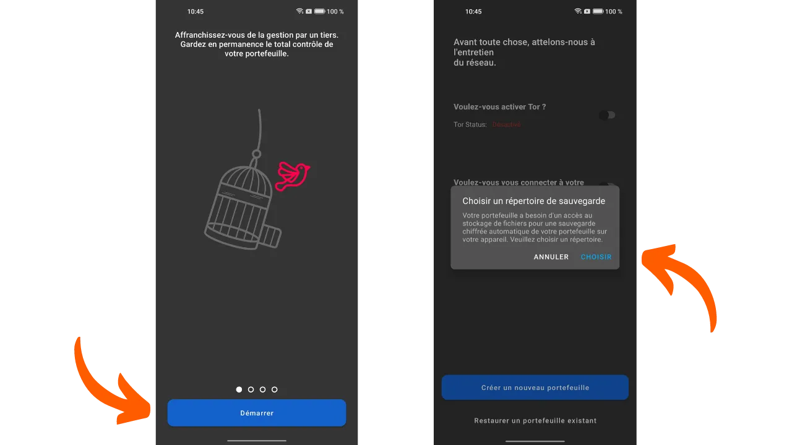
Aktifkan Tor dengan mengklik pada takik yang sesuai. Pada tahap ini, Anda juga memiliki opsi untuk memilih Dojo tertentu. Namun, dalam tutorial ini, kita akan melanjutkan dengan Dojo default; jadi Anda dapat meninggalkan opsi dinonaktifkan. Ketika Tor terhubung, tekan tombol `Create a new wallet`.


Samourai Wallet kemudian meminta Anda untuk menetapkan frasa sandi BIP39. Kata sandi tambahan ini sangat penting karena langsung bertindak dalam derivasi kunci pribadi Anda. Kehilangan frasa sandi ini akan mengakibatkan ketidakmampuan untuk mengakses bitcoin Anda, membuatnya hilang tanpa bisa dikembalikan. Untuk memulihkan dompet Samourai Anda, sangat penting untuk memiliki kedua frasa pemulihan 12 kata dan frasa sandi.
Oleh karena itu, sangat penting untuk memilih frasa sandi yang kuat dan membuat satu atau lebih salinan fisik, baik di atas kertas atau pada media logam, untuk memastikan keamanan bitcoin Anda. Setelah menyelesaikan tugas-tugas ini, centang kotak `Saya menyadari bahwa dalam kasus kehilangan...`, kemudian tekan tombol `NEXT`.

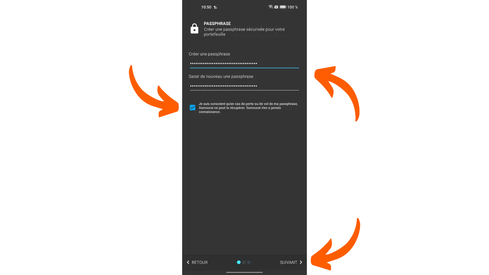

Anda kemudian harus menentukan kode PIN yang terdiri dari 5 hingga 8 digit. Kode ini akan mengamankan akses ke dompet Anda di ponsel. Kode ini akan diminta setiap kali Anda ingin membuka aplikasi Samourai. Pilihlah kode PIN yang kuat dan pastikan untuk menyimpan salinan cadangan. Setelah itu, Anda dapat menekan tombol `NEXT`.

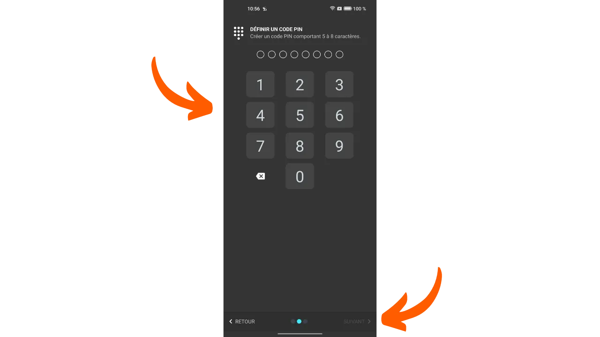

Samourai akan mengundang Anda untuk memasukkan kode PIN Anda lagi untuk konfirmasi. Masukkan, kemudian tekan `FINALIZE`.


Anda kemudian akan mengakses frasa pemulihan Anda yang terdiri dari 12 kata. Frasa ini memungkinkan Anda untuk memulihkan dompet Anda dengan frasa sandi yang dimasukkan sebelumnya. Sangat disarankan untuk membuat satu atau lebih salinan dari frasa ini pada media fisik, seperti kertas atau material logam, untuk memastikan keamanan bitcoin Anda dalam kasus terjadi masalah.

Setelah membuat cadangan ini, Anda akan diarahkan ke antarmuka dompet Samourai baru Anda.


Anda ditawarkan untuk mendapatkan PayNym Bot Anda. Anda dapat memintanya jika Anda mau, meskipun ini tidak esensial untuk tutorial kita.


Sebelum melanjutkan untuk menerima bitcoin pada dompet baru ini, sangat disarankan untuk memeriksa kembali validitas cadangan dompet Anda (frasa sandi dan frasa pemulihan). Untuk memverifikasi frasa sandi, Anda dapat memilih ikon PayNym Bot Anda yang terletak di pojok kiri atas layar, kemudian ikuti jalur:
```plaintext
Settings > Troubleshooting > Passphrase/backup test
```

Masukkan frasa sandi Anda untuk melakukan verifikasi.


Samourai akan mengonfirmasi jika itu valid.

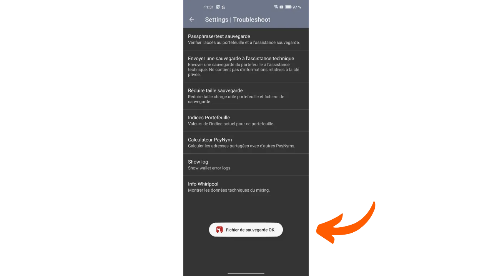

Untuk memverifikasi cadangan frasa pemulihan Anda, akses ikon PayNym Bot Anda, yang terletak di pojok kiri atas layar, dan ikuti jalur ini:
```plaintext
Settings > Wallet > Show 12-word recovery phrase
```

Samourai akan menampilkan jendela dengan frasa pemulihan Anda. Pastikan itu cocok persis dengan cadangan fisik Anda.

Untuk melangkah lebih jauh dan melakukan tes pemulihan lengkap, catat elemen saksi dari dompet Anda, seperti salah satu `xpubs`, kemudian lanjutkan untuk menghapus dompet Anda (dengan asumsi masih kosong). Tujuannya adalah untuk mencoba memulihkan dompet kosong ini hanya menggunakan cadangan fisik Anda. Jika pemulihan berhasil, ini menunjukkan bahwa cadangan Anda valid dan dapat diandalkan.

### Menerima bitcoin
Setelah membuat dompet Anda, Anda akan memulai dengan satu akun, yang diidentifikasi dengan indeks `0'`. Ini adalah akun **deposit** yang telah kita bahas di bagian sebelumnya. Ke akun inilah Anda perlu mentransfer bitcoin yang ditujukan untuk coinjoins.

Untuk melakukan ini, klik pada simbol `+` biru yang terletak di pojok kanan bawah layar.

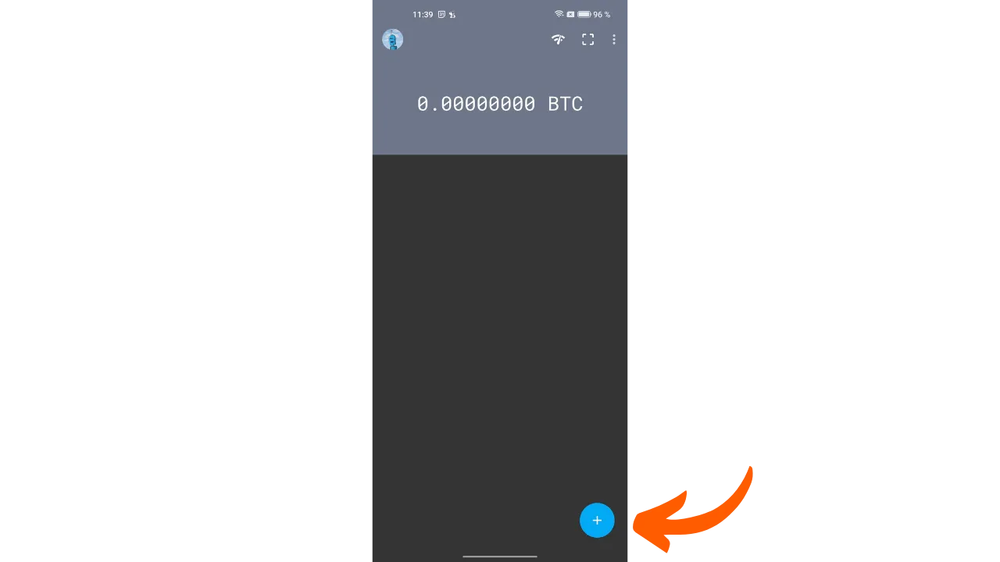

Kemudian klik tombol `Receive` hijau.

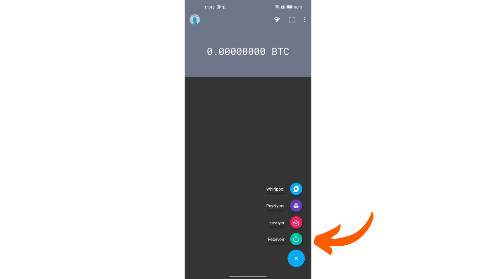

Samourai akan secara otomatis menghasilkan alamat baru kosong untuk menerima bitcoin.

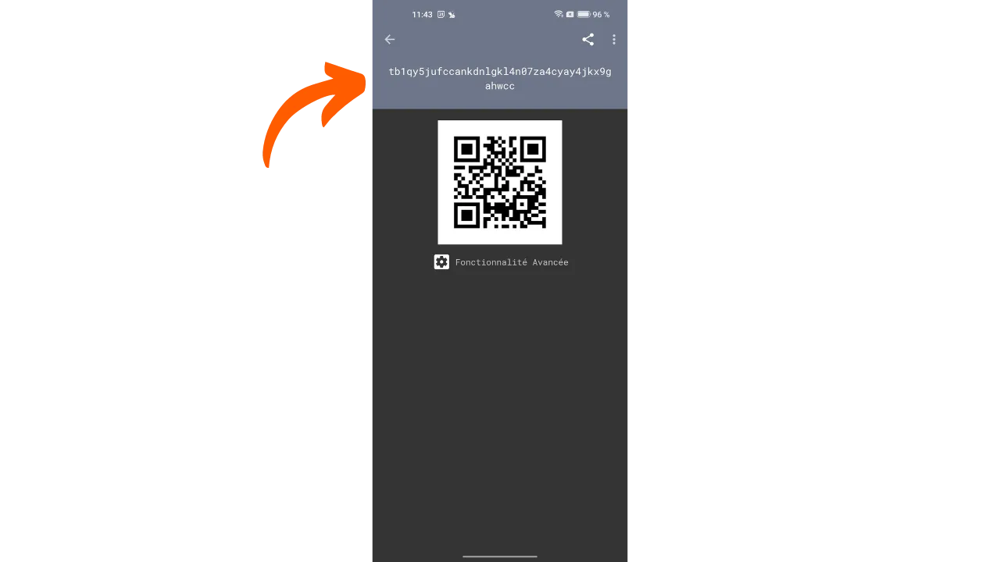
Anda dapat mengirimkan bitcoin untuk dicampur di sana.
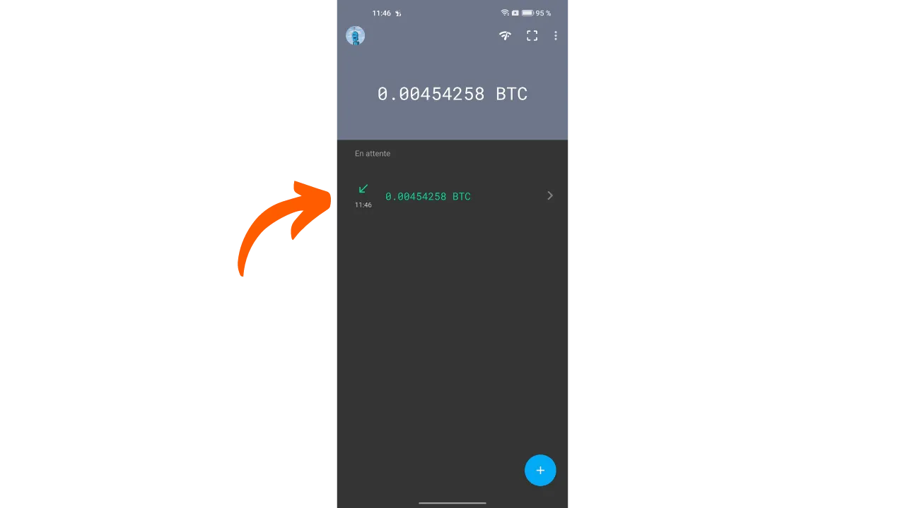

### Membuat Tx0
Ketika transaksi dikonfirmasi, kita dapat memulai proses coinjoin. Untuk melakukan ini, klik tombol biru `+` di pojok kanan bawah layar.


Kemudian klik pada `Whirlpool` yang berwarna biru.

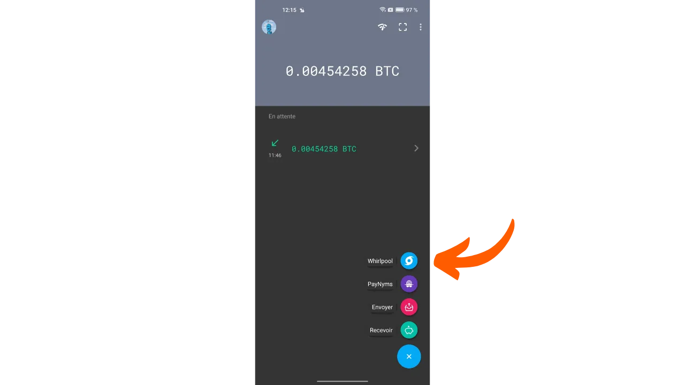

Tunggu sementara Whirlpool menginisialisasi dan Samourai membuat akun yang diperlukan.

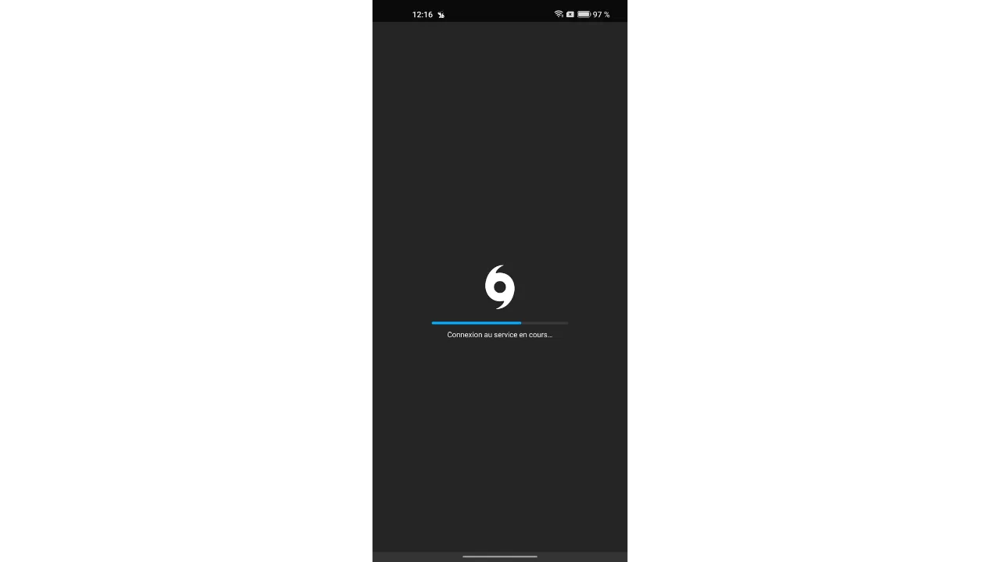

Anda kemudian akan tiba di halaman utama Whirlpool. Klik pada `Start`.
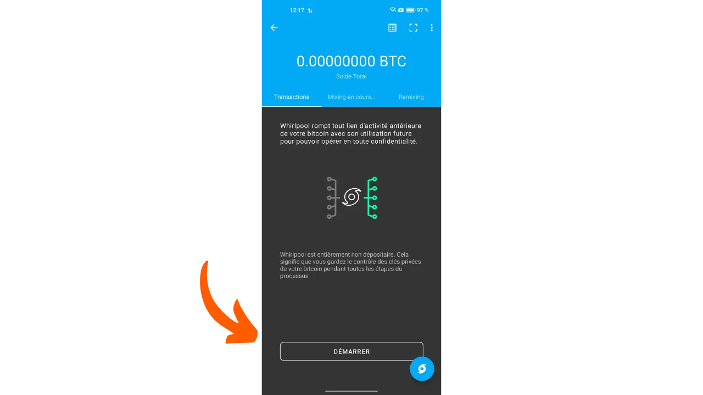
Pilih UTXO dari akun **deposit** yang ingin Anda kirim dalam siklus coinjoin, kemudian klik pada `Next`.

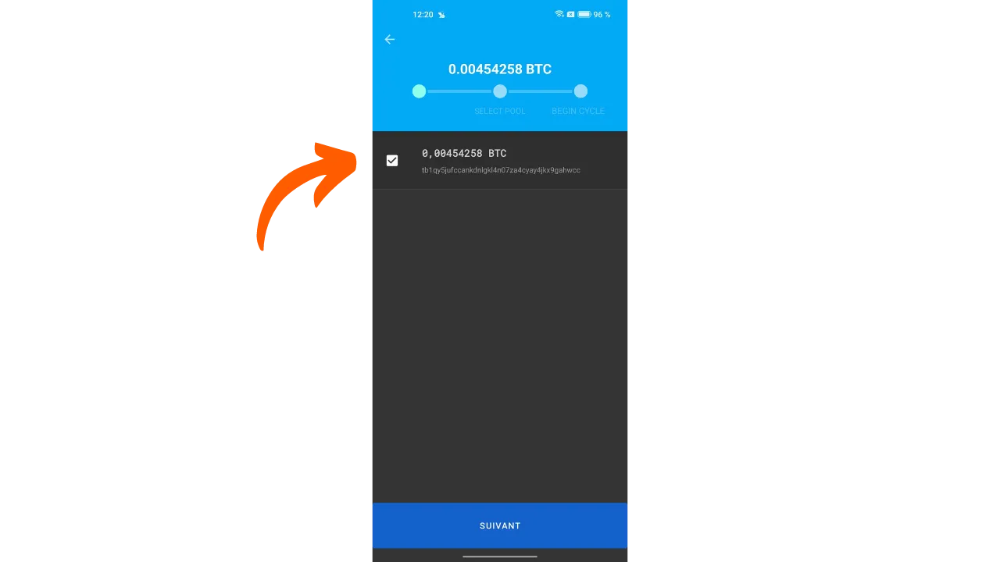

Pada langkah selanjutnya, Anda perlu memilih tingkat biaya yang akan dialokasikan untuk `Tx0` serta untuk mix pertama Anda. Pengaturan ini akan menentukan kecepatan di mana `Tx0` Anda dan coinjoin awal (atau coinjoins awal) akan dikonfirmasi. Ingatlah bahwa biaya penambangan untuk `Tx0` dan mix awal adalah tanggung jawab Anda, tetapi Anda tidak perlu membayar biaya penambangan untuk remix selanjutnya. Anda memiliki pilihan antara opsi `Low`, `Normal`, atau `High`.

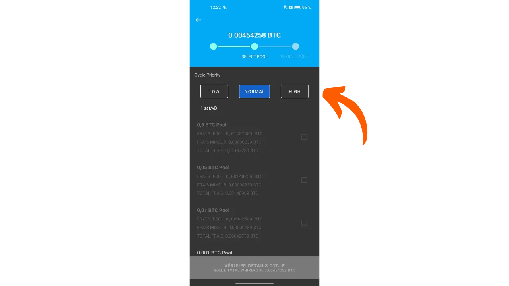

Di jendela yang sama, Anda memiliki opsi untuk memilih kolam yang akan Anda masuki. Mengingat saya awalnya memilih UTXO sebesar `454,258 sats`, pilihan saya satu-satunya adalah kolam `100,000 sats`. Halaman ini juga menyajikan biaya layanan kolam, selain biaya penambangan, yang memungkinkan Anda mengetahui total biaya untuk siklus coinjoin ini. Jika semuanya cocok untuk Anda, pilih kolam yang sesuai dan lanjutkan dengan mengklik tombol biru `VERIFY CYCLE DETAILS`.

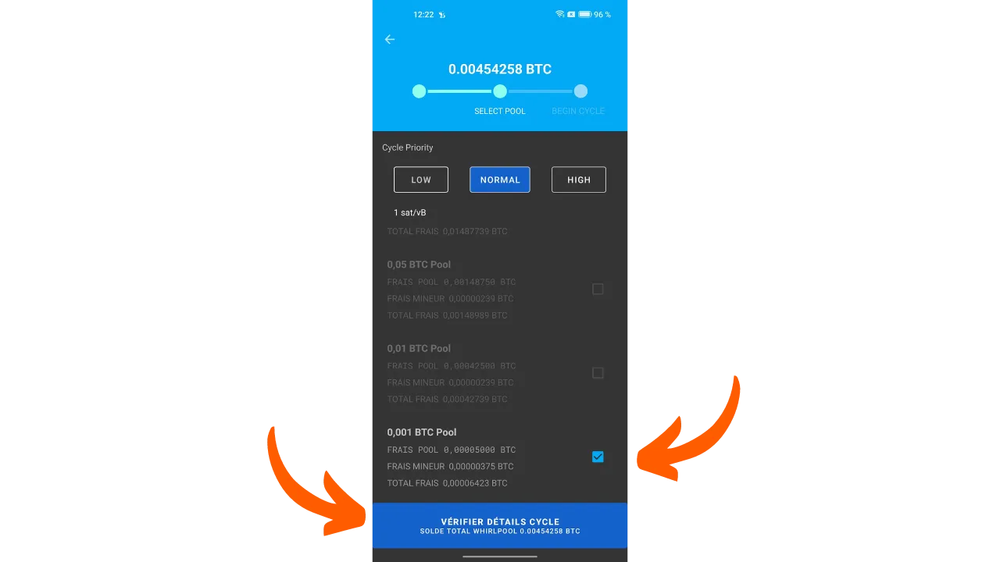

Anda kemudian dapat melihat semua detail siklus coinjoin Anda:
- jumlah UTXO yang akan masuk ke kolam;
- berbagai biaya yang dikeluarkan;
- jumlah perubahan doxxic...

Verifikasi informasi, kemudian klik pada tombol hijau `START CYCLE`.


Sebuah jendela akan muncul untuk menawarkan Anda menandai perubahan toksik yang dihasilkan dari masuk Anda ke dalam siklus coinjoin sebagai "tidak dapat dibelanjakan". Dengan memilih `YES`, UTXO ini tidak akan terlihat di dompet Anda dan tidak dapat dipilih untuk transaksi masa depan. Namun, itu akan tetap dapat diakses dalam daftar UTXO di dompet Anda, di mana Anda dapat secara manual mengubah statusnya. Disarankan untuk memilih opsi ini untuk menghindari kesalahan penanganan yang dapat membahayakan privasi Anda nantinya. Jika Anda memilih `NO`, perubahan toksik akan tetap tersedia untuk digunakan di dompet Anda. Jika Anda ingin mempelajari lebih lanjut tentang mengelola dan menggunakan perubahan toksik ini, saya menyarankan Anda untuk membaca bagian terakhir dari tutorial ini.


Samourai kemudian akan menyiarkan Tx0 Anda.


### Membuat coinjoins
Setelah Tx0 disiarkan, Anda dapat menemukannya di tab `Transactions` dari menu Whirlpool.

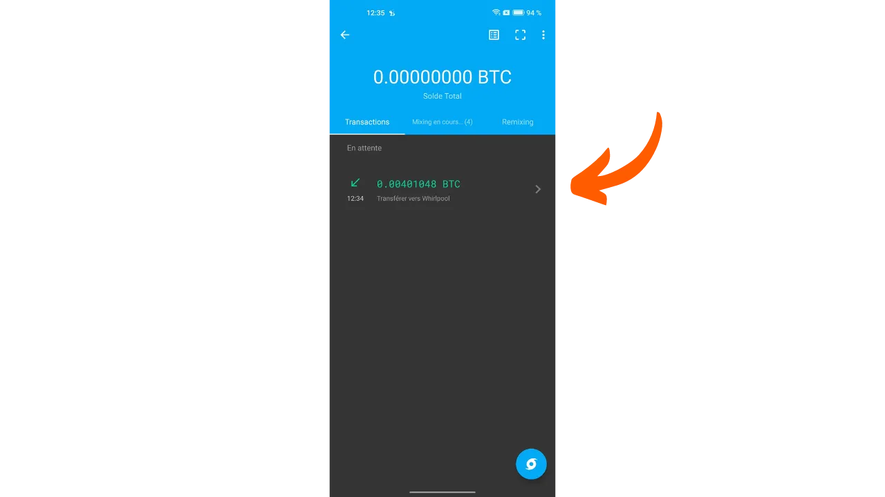
UTXO Anda yang siap dicampur berada di tab `Mixing in progress...`, yang sesuai dengan akun **Premix**. 

Setelah `Tx0` dikonfirmasi, UTXO Anda akan secara otomatis terdaftar dengan koordinator, dan pencampuran awal akan dimulai secara berturut-turut secara otomatis.


Dengan memeriksa tab `Remixing`, yang sesuai dengan akun **Postmix**, Anda akan melihat UTXO hasil dari pencampuran awal. Koin-koin ini akan tetap siap untuk pencampuran ulang, yang tidak akan menimbulkan biaya tambahan. Saya merekomendasikan untuk membaca artikel lain ini untuk mempelajari lebih lanjut tentang proses remixing dan efisiensi dari siklus coinjoin: [REMIX - WHIRLPOOL](https://planb.network/tutorials/privacy/remix-whirlpool).

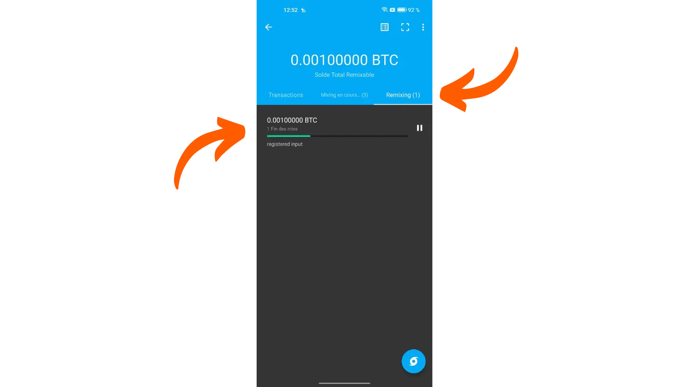

Anda dapat sementara waktu menghentikan remixing sebuah UTXO dengan menekan tombol jeda yang terletak di sebelah kanannya. Untuk membuatnya memenuhi syarat untuk remixing lagi, cukup klik pada tombol yang sama untuk kedua kalinya. Penting untuk dicatat bahwa hanya satu coinjoin yang dapat dilakukan per pengguna dan per kolam secara bersamaan. Jadi, jika Anda memiliki 6 UTXO sebesar `100 000 sats` yang siap untuk coinjoin, hanya salah satunya yang dapat dicampur. Setelah mencampur sebuah UTXO, Samourai Wallet melanjutkan untuk secara acak memilih UTXO baru dari ketersediaan Anda, untuk mendiversifikasi dan menyeimbangkan remixing setiap koin.

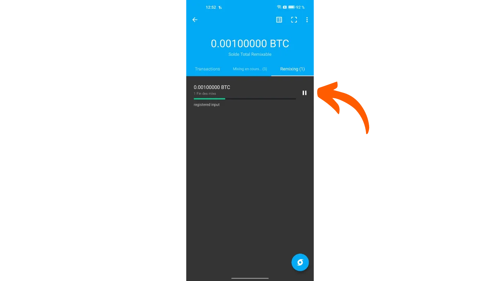

Untuk memastikan ketersediaan UTXO Anda secara terus-menerus untuk remixing, perlu untuk menjaga aplikasi Samourai aktif di latar belakang. Anda seharusnya melihat notifikasi di ponsel Anda yang mengonfirmasi bahwa Whirlpool sedang berjalan. Menutup aplikasi atau mematikan ponsel Anda akan menjeda coinjoins.

### Menyelesaikan coinjoins
Untuk menghabiskan bitcoin Anda yang telah dicampur, pergi ke akun **Postmix** yang dicatat `Remixing` di tab menu Whirlpool.

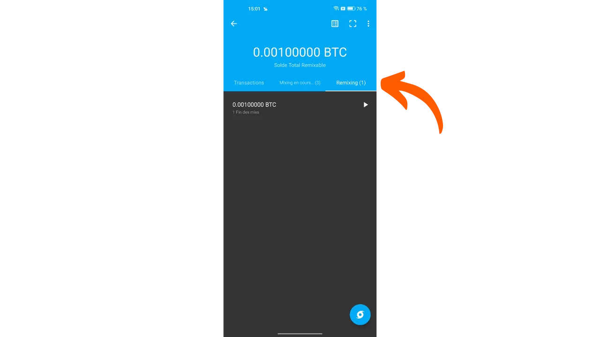

Klik pada logo Whirlpool biru yang terletak di pojok kanan bawah.

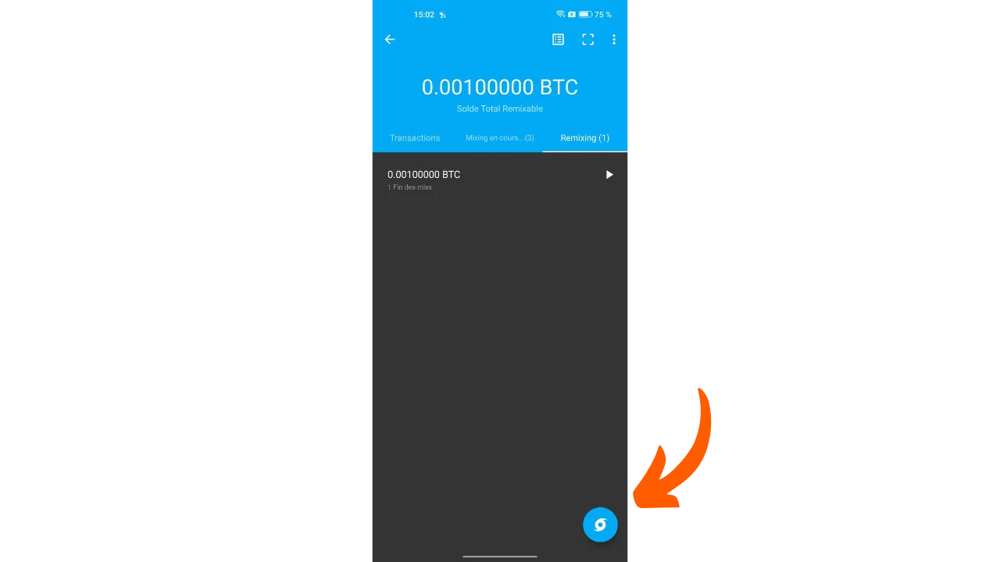

Kemudian klik pada `Spend Mixed UTXOs`.

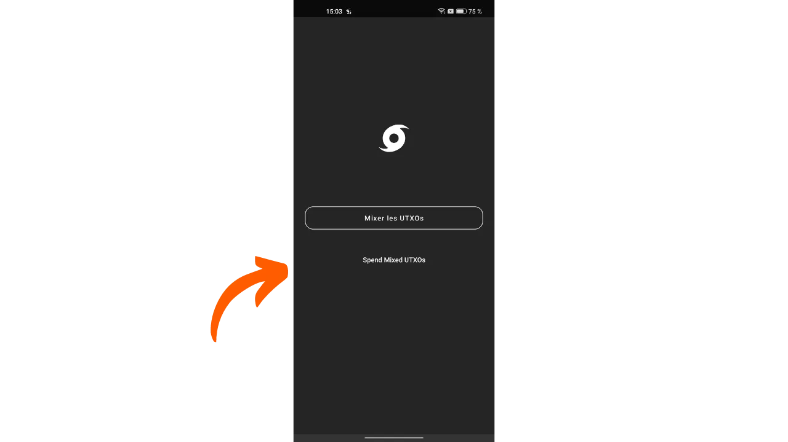

Anda kemudian dapat memasukkan alamat penerima dan jumlah yang akan dikirim, sama seperti untuk transaksi lain yang dilakukan dengan Samourai Wallet. Latar belakang biru menunjukkan bahwa dana sedang dihabiskan dari akun Whirlpool, dan bukan dari akun **deposit**.


Dengan mengklik 3 titik kecil di pojok kanan atas, Anda memiliki opsi untuk memilih UTXO tertentu.

Dengan mengklik kotak putih di pojok kanan atas jendela, Anda dapat memindai kode QR dari alamat penerima dengan kamera Anda.

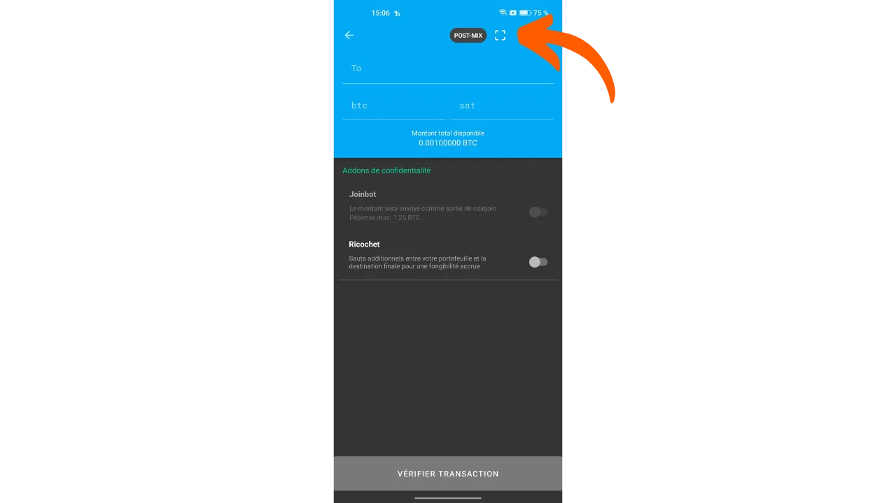

Masukkan informasi yang diperlukan untuk transaksi pengeluaran Anda, kemudian klik pada tombol biru `VERIFY TRANSACTION`.

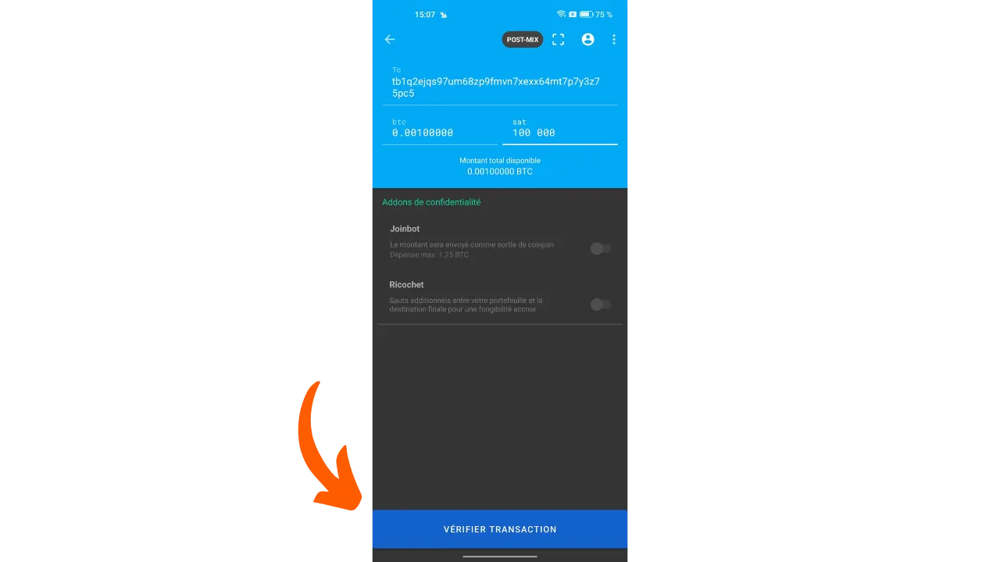
Pada langkah selanjutnya, Anda memiliki opsi untuk mengubah tarif biaya yang terkait dengan transaksi Anda. Anda juga dapat mengaktifkan opsi Stonewall dengan menandai kotak yang sesuai. Jika opsi Stonewall tidak dapat dipilih, itu berarti akun **Postmix** Anda tidak memiliki UTXO dengan ukuran yang cukup untuk mendukung struktur transaksi tertentu ini.
[-> Pelajari lebih lanjut tentang transaksi Stonewall.](https://planb.network/tutorials/privacy/stonewall)

Jika semuanya sesuai dengan kepuasan Anda, klik tombol hijau `KIRIM ... BTC`.

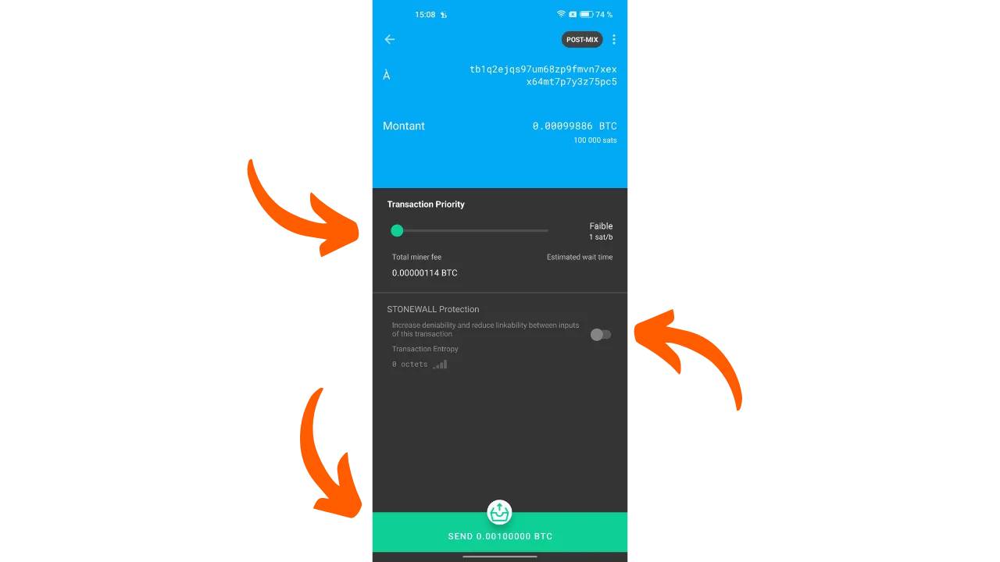

Samourai kemudian akan melanjutkan untuk menandatangani transaksi Anda sebelum menyiarkannya di jaringan. Anda hanya perlu menunggu sampai ditambahkan ke blok oleh penambang.

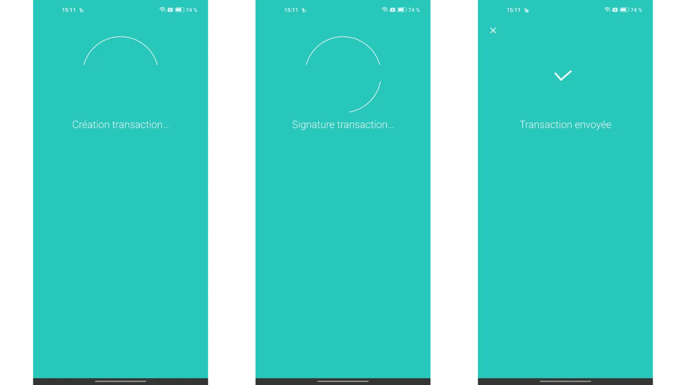

### Menggunakan SCODE
Terkadang, tim Dompet Samourai menawarkan "SCODE". SCODE adalah kode promosi yang memberikan diskon pada biaya layanan pool. Dompet Samourai sesekali menawarkan kode seperti itu kepada penggunanya selama acara khusus. Saya menyarankan Anda [untuk mengikuti Dompet Samourai](https://twitter.com/SamouraiWallet) di media sosial agar tidak ketinggalan SCODE masa depan.

Untuk menerapkan SCODE di Samourai, sebelum memulai siklus coinjoin baru, pergi ke menu Whirlpool dan pilih tiga titik kecil yang terletak di pojok kanan atas layar.


Klik pada `SCODE (kode promo) Whirlpool`.

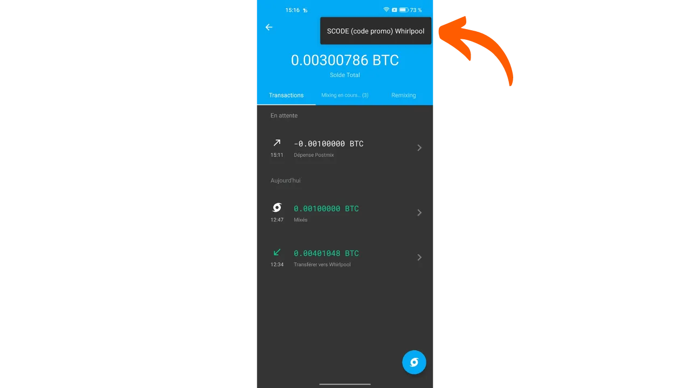

Masukkan SCODE di jendela yang terbuka, kemudian validasi dengan mengklik `OK`.


Whirlpool akan secara otomatis tertutup. Tunggu sampai Samourai selesai memuat, kemudian buka menu Whirlpool lagi.


Pastikan SCODE Anda telah terdaftar dengan benar dengan mengklik sekali lagi pada tiga titik kecil, kemudian memilih `SCODE (kode promo) Whirlpool`. Jika semuanya sudah beres, Anda siap untuk memulai siklus Whirlpool baru dengan diskon pada biaya layanan. Penting untuk dicatat bahwa SCODE ini bersifat sementara: mereka tetap valid selama beberapa hari sebelum menjadi usang.

## Bagaimana mengetahui kualitas siklus coinjoin kami?
Agar coinjoin benar-benar efektif, sangat penting bahwa ia menunjukkan keseragaman yang baik antara jumlah input dan output. Keseragaman ini memperkuat jumlah interpretasi yang mungkin di mata pengamat eksternal, sehingga meningkatkan ketidakpastian seputar transaksi. Untuk mengkuantifikasi ketidakpastian yang dihasilkan oleh coinjoin, seseorang dapat menggunakan perhitungan entropi transaksi. Untuk eksplorasi mendalam tentang indikator-indikator ini, saya merujuk Anda ke tutorial: [KALKULATOR BOLTZMANN](https://planb.network/en/tutorials/privacy/boltzmann-entropy). Model Whirlpool diakui sebagai salah satu yang membawa homogenitas terbanyak ke coinjoins.
Selanjutnya, kinerja dari beberapa siklus coinjoin dievaluasi berdasarkan sejauh mana kelompok-kelompok di mana sebuah koin disembunyikan. Ukuran dari kelompok-kelompok ini mendefinisikan apa yang disebut anonsets. Ada dua jenis anonsets: yang pertama menilai privasi yang diperoleh melawan analisis retrospektif (dari masa sekarang ke masa lalu) dan yang kedua, melawan analisis prospektif (dari masa lalu ke masa sekarang). Untuk penjelasan rinci tentang kedua indikator ini, saya mengundang Anda untuk berkonsultasi dengan tutorial: [WHIRLPOOL STATS TOOLS - ANONSETS](https://planb.network/tutorials/privacy/wst-anonsets).

## Bagaimana cara mengelola postmix?
Setelah melakukan siklus coinjoin, strategi terbaik adalah menyimpan UTXO Anda di akun **postmix**, menunggu penggunaan masa depan mereka. Bahkan disarankan untuk membiarkan mereka remix secara tak terbatas sampai Anda perlu menghabiskannya.

Beberapa pengguna mungkin mempertimbangkan untuk mentransfer bitcoin yang telah dicampur mereka ke dompet yang diamankan oleh dompet perangkat keras. Ini mungkin, tetapi penting untuk mengikuti rekomendasi dari Samourai Wallet secara teliti agar tidak mengompromikan kerahasiaan yang diperoleh.

Penggabungan UTXO merupakan kesalahan yang paling sering dilakukan. Perlu dihindari menggabungkan UTXO yang telah dicampur dengan UTXO yang belum dicampur dalam transaksi yang sama, untuk menghindari CIOH (*Common-Input-Ownership-Heuristic*). Ini memerlukan pengelolaan UTXO Anda dalam dompet Anda dengan hati-hati, terutama dalam hal pelabelan. Di luar coinjoin, penggabungan UTXO umumnya merupakan praktik buruk yang sering menyebabkan kehilangan kerahasiaan ketika tidak dikelola dengan benar.
Anda juga harus waspada terhadap konsolidasi UTXO yang telah dicampur satu sama lain. Konsolidasi moderat mungkin jika UTXO yang telah dicampur Anda memiliki anonsets yang signifikan, tetapi ini akan secara tak terhindarkan menurunkan privasi koin Anda. Pastikan bahwa konsolidasi tidak terlalu besar atau dilakukan setelah jumlah remix yang tidak cukup, karena ini berisiko menetapkan tautan yang dapat diturunkan antara UTXO Anda sebelum dan setelah siklus coinjoin. Dalam kasus keraguan tentang operasi ini, praktik terbaik adalah tidak mengkonsolidasikan UTXO postmix, dan mentransfer mereka satu per satu ke dompet perangkat keras Anda, menghasilkan alamat kosong baru setiap kali. Sekali lagi, ingat untuk memberi label yang tepat pada setiap UTXO yang diterima.

Juga disarankan untuk tidak mentransfer UTXO postmix Anda ke dompet yang menggunakan skrip tidak umum. Misalnya, jika Anda memasuki Whirlpool dari dompet multisig yang menggunakan skrip `P2WSH`, ada sedikit kemungkinan Anda akan dicampur dengan pengguna lain yang memiliki jenis dompet yang sama secara asli. Jika Anda keluar postmix Anda ke dompet multisig yang sama, tingkat privasi bitcoin yang telah dicampur Anda akan sangat berkurang. Di luar skrip, ada banyak jejak dompet lain yang dapat menipu Anda.

Seperti halnya transaksi Bitcoin apa pun, juga tepat untuk tidak menggunakan kembali alamat penerimaan. Setiap transaksi baru harus diterima di alamat kosong baru.

Solusi paling sederhana dan aman adalah membiarkan UTXO yang telah dicampur Anda beristirahat di akun **postmix** mereka, membiarkan mereka remix dan hanya menyentuh mereka untuk dibelanjakan. Dompet Samourai dan Sparrow memiliki perlindungan tambahan terhadap semua risiko ini yang terkait dengan analisis rantai. Perlindungan ini membantu Anda menghindari kesalahan.

## Bagaimana cara mengelola perubahan doxxic?
Selanjutnya, Anda harus berhati-hati dalam mengelola perubahan doxxic, perubahan yang tidak dapat masuk ke kolam coinjoin. UTXO beracun ini, yang dihasilkan dari penggunaan Whirlpool, menimbulkan risiko terhadap privasi Anda karena mereka menetapkan tautan antara Anda dan penggunaan coinjoin. Oleh karena itu, sangat penting untuk menanganinya dengan hati-hati dan tidak menggabungkannya dengan UTXO lain, terutama UTXO yang telah dicampur. Berikut adalah strategi yang berbeda untuk dipertimbangkan untuk penggunaan mereka:
- **Campurkan dalam kolam yang lebih kecil:** Jika UTXO beracun Anda cukup besar untuk masuk ke kolam yang lebih kecil sendirian, pertimbangkan untuk mencampurnya. Ini seringkali merupakan opsi terbaik. Namun, sangat penting untuk tidak menggabungkan beberapa UTXO beracun untuk mengakses sebuah kolam, karena ini bisa menghubungkan berbagai entri Anda.
- **Tandai sebagai "tidak dapat dibelanjakan":** Pendekatan lain adalah berhenti menggunakannya, tandai sebagai "tidak dapat dibelanjakan" di akun khusus mereka, dan hanya Hodl. Ini memastikan bahwa Anda tidak secara tidak sengaja menghabiskannya. Jika nilai bitcoin meningkat, kolam baru yang lebih cocok untuk UTXO beracun Anda bisa muncul;
- **Lakukan donasi:** Pertimbangkan untuk membuat donasi, meskipun yang sederhana, kepada pengembang yang bekerja pada Bitcoin dan perangkat lunak terkaitnya. Anda juga dapat mendonasikan ke organisasi yang menerima BTC. Jika mengelola UTXO beracun Anda terasa terlalu rumit, Anda bisa dengan mudah menyingkirkannya dengan membuat donasi;
- **Beli kartu hadiah:** Platform seperti [Bitrefill](https://www.bitrefill.com/) memungkinkan Anda untuk menukar bitcoin dengan kartu hadiah yang dapat digunakan di berbagai pedagang. Ini bisa menjadi cara untuk menyingkirkan UTXO beracun Anda tanpa kehilangan nilai terkait;
- **Konsolidasikan pada Monero:** Samourai Wallet kini menawarkan layanan pertukaran atomik antara BTC dan XMR. Ini ideal untuk mengelola UTXO beracun dengan mengkonsolidasikannya pada Monero, tanpa mengompromikan privasi Anda melalui KYC, sebelum mengirimkannya kembali ke Bitcoin. Namun, opsi ini bisa mahal dalam hal biaya penambangan dan premi karena kendala likuiditas;
- **Kirimkan ke Lightning Network:** Memindahkan UTXO ini ke Lightning Network untuk mendapatkan keuntungan dari biaya transaksi yang lebih rendah adalah opsi yang bisa menarik. Namun, metode ini mungkin mengungkapkan informasi tertentu tergantung pada penggunaan Lightning Anda dan oleh karena itu harus dilakukan dengan hati-hati.

Tutorial terperinci tentang penerapan teknik-teknik berbeda ini akan segera ditawarkan di PlanB Network.

**Sumber daya tambahan:**
- [Tutorial video Samourai Wallet](https://planb.network/tutorials/wallet/samourai);
- [Dokumentasi Samourai Wallet - Whirlpool](https://docs.samourai.io/whirlpool/basic-concepts);
- [Thread Twitter tentang coinjoins](https://twitter.com/SamouraiWallet/status/1489220847336308739);
- [Postingan blog tentang coinjoins](https://www.pandul.fr/post/comprendre-et-utiliser-le-coinjoin-sur-bitcoin).