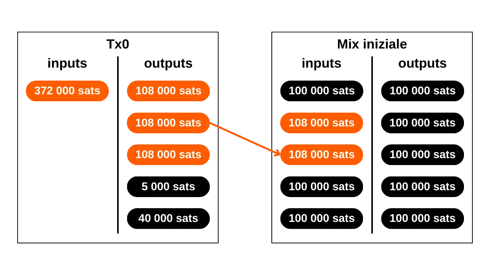

***ATTENZIONE:** In seguito all'arresto dei fondatori di Samourai Wallet e al sequestro dei loro server il 24 aprile, lo strumento Whirlpool non funziona più, anche per coloro che dispongono del proprio Dojo o utilizzano Sparrow Wallet. Tuttavia, rimane possibile che questo strumento possa essere rimesso in servizio nelle prossime settimane o rilanciato in modo diverso. Inoltre, la parte teorica di questo articolo rimane pertinente per comprendere i principi e gli obiettivi dei coinjoins in generale (non solo Whirlpool), oltre a comprendere l'efficacia del modello Whirlpool.*

_Stiamo seguendo da vicino l'evoluzione di questo caso così come gli sviluppi relativi agli strumenti associati. Siate certi che aggiorneremo questo tutorial non appena saranno disponibili nuove informazioni._

_Questo tutorial è fornito solo a scopo educativo e informativo. Non approviamo né incoraggiamo l'uso di questi strumenti per scopi criminali. È responsabilità di ogni utente rispettare le leggi vigenti nella propria giurisdizione._

---

"*un portafoglio bitcoin per le strade*"

In questo tutorial, imparerai cos'è un coinjoin e come eseguirne uno utilizzando il software Samourai Wallet e l'implementazione Whirlpool.

## Cos'è un coinjoin su Bitcoin?
**Il Coinjoin è una tecnica che interrompe la tracciabilità dei bitcoin sulla blockchain**. Si basa su una transazione collaborativa con una struttura specifica dello stesso nome: la transazione coinjoin.

I coinjoin migliorano la privacy degli utenti Bitcoin complicando l'analisi della catena per gli osservatori esterni. La loro struttura consente di unire più monete da diversi utenti in una singola transazione, oscurando così le tracce e rendendo difficile determinare i collegamenti tra gli indirizzi di input e output.

Il principio del coinjoin si basa su un approccio collaborativo: diversi utenti che desiderano mescolare i loro bitcoin depositano importi identici come input della stessa transazione. Questi importi vengono poi ridistribuiti come output di pari valore a ciascun utente. Al termine della transazione, diventa impossibile associare un output specifico a un utente conosciuto in input. Non esiste un collegamento diretto tra gli input e gli output, rompendo l'associazione tra gli utenti e i loro UTXO, così come la storia di ogni moneta.


Esempio di una transazione coinjoin (non mia): [323df21f0b0756f98336437aa3d2fb87e02b59f1946b714a7b09df04d429dec2](https://mempool.space/it/tx/323df21f0b0756f98336437aa3d2fb87e02b59f1946b714a7b09df04d429dec2)

Per eseguire un coinjoin garantendo che ciascun utente mantenga il controllo sui propri fondi in ogni momento, il processo inizia con la costruzione della transazione da parte di un coordinatore, che poi la trasmette ai partecipanti. Ogni utente firma quindi la transazione dopo aver verificato che sia di suo gradimento. Tutte le firme raccolte vengono infine integrate nella transazione. Se un utente o il coordinatore tenta di dirottare i fondi, modificando gli output della transazione coinjoin, le firme risulteranno invalide, portando al rifiuto della transazione da parte dei nodi.

Esistono diverse implementazioni di coinjoin, come Whirlpool, JoinMarket o Wabisabi, ognuna con l'obiettivo di gestire il coordinamento tra i partecipanti e aumentare l'efficienza delle transazioni coinjoin.
In questo tutorial, esploreremo l'implementazione di **Whirlpool**, che considero la soluzione più efficiente per eseguire coinjoins su Bitcoin. Sebbene disponibile su diversi portafogli, in questo tutorial, esploreremo esclusivamente il suo utilizzo con l'applicazione mobile Samourai Wallet, senza Dojo.

## Perché eseguire coinjoins su Bitcoin?
Uno dei problemi iniziali con qualsiasi sistema di pagamento peer-to-peer è il doppio pagamento: come impedire a individui malintenzionati di spendere le stesse unità monetarie più volte senza ricorrere a un'autorità centrale per arbitrare?

Satoshi Nakamoto ha fornito una soluzione a questo dilemma attraverso il protocollo Bitcoin, un sistema di pagamento elettronico peer-to-peer che opera indipendentemente da qualsiasi autorità centrale. Nel suo white paper, evidenzia che l'unico modo per certificare l'assenza di doppio pagamento è garantire la visibilità di tutte le transazioni all'interno del sistema di pagamento.
Per garantire che ogni partecipante sia a conoscenza delle transazioni, queste devono essere pubblicamente divulgate. Pertanto, il funzionamento di Bitcoin si basa su un'infrastruttura trasparente e distribuita, che consente a qualsiasi operatore di nodo di verificare l'intera catena di firme elettroniche e la storia di ogni moneta, dalla sua creazione da parte di un miner.

La natura trasparente e distribuita della blockchain di Bitcoin significa che qualsiasi utente della rete può seguire e analizzare le transazioni di tutti gli altri partecipanti. Di conseguenza, l'anonimato a livello di transazione è impossibile. Tuttavia, l'anonimato è preservato a livello di identificazione individuale. A differenza del sistema bancario tradizionale, dove ogni conto è collegato a un'identità personale, su Bitcoin i fondi sono associati a coppie di chiavi crittografiche, offrendo così agli utenti una forma di pseudonimato dietro identificatori crittografici.

Pertanto, la riservatezza su Bitcoin è compromessa quando osservatori esterni riescono ad associare specifici UTXO a utenti identificati. Una volta stabilita questa associazione, diventa possibile tracciare le loro transazioni e analizzare la storia dei loro bitcoin. Coinjoin è precisamente una tecnica sviluppata per rompere la tracciabilità degli UTXO, offrendo così un certo livello di riservatezza agli utenti di Bitcoin a livello di transazione.

## Come funziona Whirlpool?
Whirlpool si distingue dagli altri metodi coinjoin utilizzando transazioni "_ZeroLink_", che assicurano che non ci sia tecnicamente alcun collegamento possibile tra tutti gli input e tutti gli output. Questo perfetto mescolamento è ottenuto attraverso una struttura in cui ogni partecipante contribuisce con un importo identico in input (eccetto per le commissioni di mining), generando così output di importi perfettamente uguali.
Questo approccio restrittivo agli input conferisce alle transazioni coinjoin di Whirlpool una caratteristica unica: l'assenza totale di collegamenti deterministici tra input e output. In altre parole, ogni output ha la stessa probabilità di essere attribuito a qualsiasi partecipante, rispetto a tutti gli altri output nella transazione.
Inizialmente, il numero di partecipanti in ogni coinjoin di Whirlpool era limitato a 5, con 2 nuovi entranti e 3 remixer (spiegheremo questi concetti più avanti). Tuttavia, l'aumento delle commissioni per le transazioni on-chain osservato nel 2023 ha spinto i team di Samourai a ripensare il loro modello per migliorare la privacy riducendo i costi. Pertanto, tenendo conto della situazione di mercato delle commissioni e del numero di partecipanti, il coordinatore può ora organizzare coinjoin che includono 6, 7 o 8 partecipanti. Queste sessioni potenziate sono denominate "_Cicli di Surge_". È importante notare che, indipendentemente dalla configurazione, ci sono sempre solo 2 nuovi entranti nei coinjoin di Whirlpool.

Così, le transazioni Whirlpool sono caratterizzate da un numero identico di input e output, che possono essere:
- 5 input e 5 output;

- 6 input e 6 output;

- 7 input e 7 output;

- 8 input e 8 output.

Il modello proposto da Whirlpool si basa quindi su piccole transazioni coinjoin. A differenza di Wasabi e JoinMarket, dove la robustezza degli anonset si basa sul volume dei partecipanti in un singolo ciclo, Whirlpool scommette sulla catena di diversi cicli di piccole dimensioni.

In questo modello, l'utente paga le commissioni solo al suo ingresso iniziale in una pool, consentendogli di partecipare a una moltitudine di remix senza commissioni aggiuntive. Sono i nuovi entranti a coprire le commissioni di mining per i remixer.
Con ogni coinjoin aggiuntivo in cui una moneta partecipa, insieme ai suoi pari incontrati in passato, gli anonset cresceranno esponenzialmente. L'obiettivo è quindi sfruttare questi remix gratuiti che, ad ogni occorrenza, contribuiscono a rafforzare la densità degli anonset associati a ciascuna moneta miscelata.
Whirlpool è stato progettato tenendo conto di due requisiti importanti:
- L'accessibilità dell'implementazione su dispositivi mobili, dato che Samourai Wallet è principalmente un'applicazione per smartphone;
- La velocità dei cicli di remixing per promuovere un significativo aumento degli anonset.
Questi imperativi hanno guidato gli sviluppatori di Samourai Wallet nella progettazione di Whirlpool, portandoli a limitare il numero di partecipanti per ciclo. Troppo pochi partecipanti avrebbero compromesso l'efficienza del coinjoin, riducendo drasticamente gli anonset generati ogni ciclo, mentre troppi partecipanti avrebbero posto problemi di gestione sulle applicazioni mobili e avrebbero ostacolato il flusso dei cicli.
**In definitiva, non è necessario avere un alto numero di partecipanti per coinjoin su Whirlpool poiché gli anonset si ottengono attraverso l'accumulo di diversi cicli di coinjoin.**

[-> Scopri di più sugli anonset di Whirlpool.](https://planb.network/tutorials/privacy/wst-anonsets)

### Le pool e le commissioni per coinjoin
Affinché questi multipli cicli aumentino efficacemente gli anonset delle monete miscelate, deve essere stabilito un certo quadro per limitare le quantità di UTXO utilizzate. Whirlpool definisce quindi diverse pool.

Una pool rappresenta un gruppo di utenti che desiderano miscelarsi insieme, che concordano sulla quantità di UTXO da utilizzare per ottimizzare il processo di coinjoin. Ogni pool specifica una quantità fissa per l'UTXO, a cui l'utente deve attenersi per partecipare. Quindi, per eseguire coinjoin con Whirlpool, è necessario selezionare una pool. Le pool attualmente disponibili sono le seguenti:
- 0,5 bitcoin;
- 0,05 bitcoin;
- 0,01 bitcoin;
- 0,001 bitcoin (= 100.000 sats).

Unendoti a una pool con i tuoi bitcoin, questi verranno divisi per generare UTXO che sono perfettamente omogenei con quelli degli altri partecipanti nella pool. Ogni pool ha un limite massimo; quindi, per importi che superano questo limite, sarai costretto o a fare due ingressi separati all'interno della stessa pool o a orientarti verso un'altra pool con un importo più elevato:

| Pool (bitcoin) | Importo massimo per ingresso (bitcoin) |
|----------------|----------------------------------------|
| 0,5            | 35                                     |
| 0,05           | 3,5                                    |
| 0,01           | 0,7                                    |
| 0,001          | 0,025                                  |

Come menzionato in precedenza, un UTXO è considerato appartenente a una pool quando è pronto per essere integrato in un coinjoin. Tuttavia, questo non significa che l'utente perda il possesso di esso. **Attraverso i diversi cicli di miscelazione, mantieni il pieno controllo delle tue chiavi e, di conseguenza, dei tuoi bitcoin.** Questo è ciò che differenzia la tecnica del coinjoin da altre tecniche di miscelazione centralizzate.

Per entrare in una pool di coinjoin, devono essere pagate le commissioni di servizio così come le commissioni di mining. Le commissioni di servizio sono fisse per ogni pool e sono destinate a compensare i team responsabili dello sviluppo e della manutenzione di Whirlpool.
Le commissioni di servizio per l'utilizzo di Whirlpool devono essere pagate solo una volta all'ingresso nella pool. Dopo questo passaggio, hai l'opportunità di partecipare a un numero illimitato di remix senza alcuna commissione aggiuntiva. Ecco le attuali commissioni fisse per ogni pool:

| Pool (bitcoin) | Commissione di ingresso (bitcoin) |
| -------------- | --------------------------------- |
| 0,5            | 0,0175                            |
| 0,05           | 0,00175                           |
| 0,01           | 0,0005 (50 000 sats)              |
| 0,001          | 0,00005 (5 000 sats)              |


Queste commissioni agiscono essenzialmente come un biglietto d'ingresso per il pool scelto, indipendentemente dall'importo che si inserisce in coinjoin. Pertanto, sia che si partecipi al pool da 0,01 BTC con esattamente 0,01 BTC o si entri con 0,5 BTC, le commissioni rimarranno le stesse in valore assoluto.

Prima di procedere ai coinjoin, l'utente ha quindi la scelta tra 2 strategie:
- Optare per un pool più piccolo per minimizzare le commissioni di servizio, sapendo che riceveranno in cambio diversi piccoli UTXO;
- O preferire un pool più grande, accettando di pagare commissioni più elevate per finire con un numero ridotto di UTXO di maggiore valore.

Generalmente si sconsiglia di unire diversi UTXO mescolati dopo i cicli di coinjoin, poiché ciò potrebbe compromettere la riservatezza acquisita, soprattutto a causa dell'Euristica di Proprietà Comune dell'Input (CIOH). Pertanto, potrebbe essere saggio scegliere un pool più grande, anche se ciò significa pagare di più, per evitare di avere troppi UTXO di piccolo valore in output. L'utente deve valutare questi compromessi per scegliere il pool che preferisce.

Oltre alle commissioni di servizio, si devono considerare anche le commissioni di mining inerenti a qualsiasi transazione Bitcoin. Come utente di Whirlpool, sarà necessario pagare le commissioni di mining per la transazione di preparazione (`Tx0`) così come quelle per il primo coinjoin. Tutti i remix successivi saranno gratuiti, grazie al modello di Whirlpool che si basa sul pagamento dei nuovi partecipanti.

Infatti, in ogni coinjoin di Whirlpool, due utenti tra gli input sono nuovi partecipanti. Gli altri input provengono da remixers. Di conseguenza, le commissioni di mining per tutti i partecipanti alla transazione sono coperte da questi due nuovi partecipanti, che beneficeranno poi anche di remix gratuiti:

Grazie a questo sistema di commissioni, Whirlpool si differenzia veramente da altri servizi di coinjoin poiché gli anonset degli UTXO non sono proporzionali al prezzo pagato dall'utente. Così, è possibile raggiungere livelli di anonimato considerevolmente elevati pagando solo la commissione d'ingresso del pool e le commissioni di mining per due transazioni (la `Tx0` e il mix iniziale).
È importante notare che l'utente dovrà anche coprire le commissioni di mining per prelevare i loro UTXO dal pool dopo aver completato i loro multipli coinjoin, a meno che non abbiano selezionato l'opzione `mix to`, di cui parleremo nel tutorial qui sotto.

### Gli account del portafoglio HD utilizzati da Whirlpool
Per eseguire un coinjoin tramite Whirlpool, il portafoglio deve generare diversi account distinti. Un account, nel contesto di un portafoglio HD (*Hierarchical Deterministic*), costituisce una sezione completamente isolata dalle altre, questa separazione avviene al terzo livello di profondità della gerarchia del portafoglio, ovvero a livello dell'`xpub`.

Un portafoglio HD può teoricamente derivare fino a `2^(32/2)` account diversi. L'account iniziale, utilizzato di default su tutti i portafogli Bitcoin, corrisponde all'indice `0'`.

Per i portafogli adattati a Whirlpool, come Samourai o Sparrow, vengono utilizzati 4 account per soddisfare le esigenze del processo di coinjoin:
- L'account **deposito**, identificato dall'indice `0'`;
- Il conto della **bad bank** (o cambio tossico), identificato dall'indice `2 147 483 644`;
- Il conto **premix**, identificato dall'indice `2 147 483 645`;
- Il conto **postmix**, identificato dall'indice `2 147 483 646`.

Ciascuno di questi conti svolge una funzione specifica all'interno del processo di coinjoin.

Tutti questi conti sono collegati a un unico seed, che consente all'utente di recuperare l'accesso a tutti i loro bitcoin utilizzando la loro frase di recupero e, se applicabile, la loro passphrase. Tuttavia, è necessario specificare al software, durante questa operazione di recupero, i diversi indici dei conti che sono stati utilizzati.

Ora esaminiamo le diverse fasi di un coinjoin Whirlpool all'interno di questi conti.

### Le diverse fasi dei coinjoin su Whirlpool
**Fase 1: Il Tx0**
Il punto di partenza di qualsiasi coinjoin Whirlpool è il conto **deposito**. Questo conto è quello che si utilizza automaticamente quando si crea un nuovo portafoglio Bitcoin. Questo conto deve essere accreditato con i bitcoin che si desidera mixare.
Il `Tx0` rappresenta il primo passo nel processo di mixing di Whirlpool. Ha lo scopo di preparare e omogeneizzare gli UTXO per il coinjoin, dividendo questi ultimi in unità corrispondenti all'importo della pool selezionata, per garantire l'omogeneità del mix. Gli UTXO omogeneizzati vengono quindi inviati al conto **premix**. Per quanto riguarda la differenza che non può entrare nella pool, viene separata in un conto specifico: la **bad bank** (o "cambio tossico").
Questa transazione iniziale `Tx0` serve anche a regolare le commissioni di servizio dovute al coordinatore del mix. A differenza dei passaggi successivi, questa transazione non è collaborativa; l'utente deve quindi assumersi tutte le commissioni di mining:


In questo esempio di una transazione `Tx0`, un input di `372,000 sats` dal nostro conto **deposito** viene diviso in diversi UTXO di output, che sono distribuiti come segue:
- Un importo di `5,000 sats` destinato al coordinatore per le commissioni di servizio, corrispondente all'ingresso nella pool di `100,000 sats`;
- Tre UTXO preparati per il mixing, reindirizzati al nostro conto **premix** e registrati presso il coordinatore. Questi UTXO sono omogeneizzati a `108,000 sats` ciascuno, per coprire le commissioni di mining per il loro futuro mix iniziale;
- L'eccedenza che non può entrare nella pool, essendo troppo piccola, è considerata cambio tossico. Viene inviata al suo conto specifico. Qui, questo cambio ammonta a `40,000 sats`;
- Infine, ci sono `3,000 sats` che non costituiscono un output, ma sono le commissioni di mining necessarie per confermare il `Tx0`.

Per esempio, ecco un vero Whirlpool Tx0 (non mio): [edef60744f539483d868caff49d4848e5cc6e805d6cdc8d0f9bdbbaedcb5fc46](https://mempool.space/it/tx/edef60744f539483d868caff49d4848e5cc6e805d6cdc8d0f9bdbbaedcb5fc46)

**Fase 2: Il cambio tossico**
L'eccedenza che non può essere integrata nel pool, qui equivalente a `40.000 sats`, viene reindirizzata al conto della **bad bank**, anche denominato "cambio tossico", per garantire una rigorosa separazione dagli altri UTXO nel portafoglio. Questo UTXO è pericoloso per la privacy dell'utente, poiché non solo è ancora legato al suo passato, e quindi possibilmente all'identità del suo proprietario, ma inoltre, è noto come appartenente a un utente che ha eseguito un coinjoin. Se questo UTXO viene unito con output mescolati, perderanno tutta la riservatezza ottenuta durante i cicli di coinjoin, in particolare a causa dell'euristica di proprietà comune dell'input (CIOH). Se viene unito con altri cambi tossici, l'utente rischia di perdere la riservatezza poiché ciò collegherà i diversi input dei cicli di coinjoin. Pertanto, deve essere gestito con cautela. Il modo di gestire questo UTXO tossico sarà dettagliato nell'ultima parte di questo articolo, e futuri tutorial copriranno questi metodi più approfonditamente su PlanB Network.

**Fase 3: Il Mix Iniziale**
Dopo che il `Tx0` è completato, gli UTXO equalizzati vengono inviati al conto **premix** del nostro portafoglio, pronti per essere introdotti nel loro primo ciclo di coinjoin, chiamato anche "mix iniziale". Se, come nel nostro esempio, il `Tx0` genera più UTXO per il mixing, ognuno di essi sarà integrato in un coinjoin iniziale separato.

Alla fine di questi primi mix, il conto **premix** sarà vuoto, mentre le nostre monete, avendo pagato le commissioni di mining per questo primo coinjoin, saranno regolate esattamente all'importo definito dal pool scelto. Nel nostro esempio, i nostri UTXO iniziali di `108.000 sats` saranno stati ridotti esattamente a `100.000 sats`.

**Fase 4: I Remix**
Dopo il mix iniziale, gli UTXO vengono trasferiti al conto **postmix**. Questo conto raccoglie gli UTXO già mescolati e quelli in attesa di remix. Quando il client Whirlpool è attivo, gli UTXO nel conto **postmix** sono automaticamente disponibili per il remix e verranno scelti casualmente per partecipare a questi nuovi cicli.

Come promemoria, i remix sono poi completamente gratuiti: non sono richieste commissioni di servizio aggiuntive o commissioni di mining. Mantenere gli UTXO nel conto **postmix** mantiene quindi intatto il loro valore e migliora simultaneamente i loro anonset. Ecco perché è importante consentire a queste monete di partecipare a più cicli di coinjoin. Non ti costa assolutamente nulla e aumenta i loro livelli di anonimato.

Quando decidi di spendere UTXO mescolati, puoi farlo direttamente da questo conto **postmix**. È consigliabile mantenere gli UTXO mescolati in questo conto per beneficiare dei remix gratuiti e per evitare che lascino il circuito Whirlpool, il che potrebbe diminuire la loro riservatezza.

Come vedremo nel tutorial seguente, esiste anche l'opzione `mix to` che offre la possibilità di inviare automaticamente le tue monete mescolate a un altro portafoglio, come un cold wallet, dopo un numero definito di coinjoin.
Dopo aver coperto la teoria, immergiamoci nella pratica con un tutorial sull'uso di Whirlpool tramite l'app Android Samourai Wallet!
## Tutorial: Coinjoin Whirlpool su Samourai Wallet
Ci sono numerose opzioni per utilizzare Whirlpool. Quella che voglio presentare qui è l'opzione Samourai Wallet (senza Dojo), un'applicazione open-source per la gestione di portafogli Bitcoin su Android.
Mescolare su Samourai senza Dojo ha il vantaggio di essere abbastanza facile da gestire, veloce da configurare e non richiede altri dispositivi oltre a un telefono Android e una connessione internet.
Tuttavia, questo metodo presenta due svantaggi notevoli:
- I Coinjoin avverranno solo quando Samourai è in esecuzione in background e connesso. Questo significa che se vuoi mescolare e rimischiare i tuoi bitcoin 24/7, devi costantemente tenere Samourai acceso;
- Se utilizzi Whirlpool con Samourai Wallet senza preoccuparti di connettere il tuo Dojo, allora la tua applicazione dovrà connettersi al server mantenuto dai team di Samourai, e rivelerai loro l'`xpub` del tuo portafoglio. Questi pezzi di informazioni anonime sono necessari affinché la tua applicazione possa trovare le tue transazioni.

La soluzione ideale per superare queste limitazioni è gestire il proprio Dojo associato a un'istanza Whirlpool CLI sul proprio nodo Bitcoin personale. In questo modo, eviterai qualsiasi perdita di informazioni e raggiungerai una completa indipendenza. Anche se il tutorial presentato di seguito è utile per certi obiettivi o per i principianti, per ottimizzare veramente la tua sessione di coinjoin, si raccomanda di utilizzare il proprio Dojo. Una guida dettagliata su come configurare questa configurazione sarà presto disponibile su PlanB Network.

### Installare Samourai Wallet
Per iniziare, avrai ovviamente bisogno dell'app Samourai Wallet. Puoi scaricarla direttamente dal sito ufficiale tramite l'APK, dal loro GitLab, o dal Google Play Store.

### Creare un Portafoglio Software
Dopo aver installato il software, dovrai procedere con la creazione di un portafoglio Bitcoin su Samourai. Se ne hai già uno, puoi passare direttamente al passo successivo.

All'apertura dell'applicazione, premi il pulsante blu `Start`. Ti verrà quindi chiesto di selezionare una posizione nei file del tuo telefono dove verrà memorizzato il backup crittografato del tuo nuovo portafoglio.


Attiva Tor cliccando sulla corrispondente tacca. A questo punto, hai anche l'opzione di selezionare un Dojo specifico. Tuttavia, in questo tutorial, continueremo con il Dojo predefinito; quindi puoi lasciare disabilitata l'opzione. Quando Tor è connesso, premi il pulsante `Crea un nuovo portafoglio`.


Samourai Wallet ti chiede quindi di impostare una passphrase BIP39. Questa password aggiuntiva è molto importante poiché agisce direttamente nella derivazione delle tue chiavi private. Una potenziale perdita di questa passphrase comporterebbe l'impossibilità di accedere ai tuoi bitcoin, rendendoli irrimediabilmente persi. Per ripristinare il tuo portafoglio Samourai, è imperativo avere sia la tua frase di recupero di 12 parole che la passphrase.

È quindi essenziale scegliere una passphrase robusta e fare una o più copie fisiche, su carta o su un supporto metallico, per garantire la sicurezza dei tuoi bitcoin. Dopo aver completato queste operazioni, spunta la casella `Sono consapevole che in caso di perdita...`, poi premi il pulsante `NEXT`.


Dovrai quindi definire un codice PIN composto da 5 a 8 cifre. Questo codice garantirà l'accesso al tuo portafoglio sul tuo telefono. Sarà richiesto ogni volta che vorrai aprire l'applicazione Samourai. Opta per un codice PIN robusto e assicurati di tenere una copia di backup. Dopo di che, puoi premere il pulsante `NEXT`.
Samourai ti inviterà a inserire nuovamente il tuo codice PIN per conferma. Inseriscilo, poi premi `FINALIZE`.

Avrai quindi accesso alla tua frase di recupero composta da 12 parole. Questa frase ti permette di recuperare il tuo portafoglio con la passphrase precedentemente inserita. È fortemente consigliato fare una o più copie di questa frase su supporti fisici, come carta o materiale metallico, per garantire la sicurezza dei tuoi bitcoin in caso di problemi.

Dopo aver effettuato queste copie di sicurezza, sarai indirizzato all'interfaccia del tuo nuovo portafoglio Samourai.

Ti viene offerto di ottenere il tuo PayNym Bot. Puoi richiederlo se lo desideri, anche se non è essenziale per il nostro tutorial.

Prima di procedere a ricevere bitcoin su questo nuovo portafoglio, è fortemente consigliato ricontrollare la validità delle copie di sicurezza del tuo portafoglio (la passphrase e la frase di recupero). Per verificare la passphrase, puoi selezionare l'icona del tuo PayNym Bot situata in alto a sinistra dello schermo, poi seguire il percorso:
```plaintext
Impostazioni > Risoluzione problemi > Test passphrase/backup
```

Inserisci la tua passphrase per eseguire la verifica.

Samourai confermerà se è valida.

Per verificare il tuo backup della frase di recupero, accedi all'icona del tuo PayNym Bot, situata in alto a sinistra dello schermo, e segui questo percorso:
```plaintext
Impostazioni > Portafoglio > Mostra frase di recupero da 12 parole
```

Samourai mostrerà una finestra con la tua frase di recupero. Assicurati che corrisponda esattamente con il tuo backup fisico.

Per andare oltre e eseguire un test di recupero completo, annota un elemento testimone del tuo portafoglio, come uno degli `xpubs`, poi procedi a cancellare il tuo portafoglio (a patto che sia ancora vuoto). L'obiettivo è provare a ripristinare questo portafoglio vuoto utilizzando solo i tuoi backup fisici. Se il ripristino ha successo, ciò indica che i tuoi backup sono validi e affidabili.

### Ricevere bitcoin
Dopo aver creato il tuo portafoglio, inizierai con un singolo account, identificato dall'indice `0'`. Questo è l'account **deposito** di cui abbiamo parlato nelle parti precedenti. È su questo account che dovrai trasferire i bitcoin destinati ai coinjoins.

Per fare ciò, clicca sul simbolo blu `+` situato in basso a destra dello schermo.

Poi clicca sul pulsante verde `Ricevi`.

Samourai genererà automaticamente un nuovo indirizzo vuoto per ricevere bitcoin.

Puoi inviare lì i bitcoin da mescolare.

### Effettuare la Tx0
Quando la transazione è confermata, possiamo iniziare il processo di coinjoins. Per fare ciò, clicca sul pulsante blu `+` in basso a destra dello schermo.

Poi clicca su `Whirlpool` in blu.

Attendi mentre Whirlpool si inizializza e Samourai crea gli account necessari.

Arriverai quindi alla homepage di Whirlpool. Clicca su `Start`.
Seleziona l'UTXO dall'account **deposito** che desideri inviare nei cicli di coinjoin, quindi clicca su `Next`.


Nel passo successivo, dovrai scegliere il livello di commissione da allocare al `Tx0` così come al tuo primo mix. Questa impostazione determinerà la velocità con cui il tuo `Tx0` e il tuo coinjoin iniziale (o i coinjoin iniziali) verranno confermati. Tieni presente che le commissioni di mining per il `Tx0` e il mix iniziale sono a tuo carico, ma non dovrai pagare commissioni di mining per i remix successivi. Hai la scelta tra le opzioni `Bassa`, `Normale` o `Alta`.


Nella stessa finestra, hai l'opzione di scegliere la pool in cui entrerai. Dato che inizialmente ho selezionato un UTXO di `454,258 sats`, la mia unica scelta possibile è la pool da `100,000 sats`. Questa pagina ti presenta anche le commissioni di servizio della pool, in aggiunta alle commissioni di mining, il che ti permette di conoscere il costo totale per questo ciclo di coinjoin. Se tutto ti va bene, seleziona la pool appropriata e continua cliccando sul pulsante blu `VERIFY CYCLE DETAILS`.


Potrai quindi vedere tutti i dettagli del tuo ciclo di coinjoin:
- il numero di UTXO che entreranno nella pool;
- le varie commissioni sostenute;
- l'importo del cambio doxxic...

Verifica le informazioni, poi clicca sul pulsante verde `START CYCLE`.


Apparirà una finestra per offrirti di segnare il cambio tossico risultante dal tuo ingresso nel ciclo di coinjoin come "non spendibile". Selezionando `SÌ`, questo UTXO non sarà visibile nel tuo portafoglio e non potrà essere selezionato per future transazioni. Tuttavia, rimarrà accessibile nell'elenco degli UTXO nel tuo portafoglio, dove potrai manualmente cambiarne lo stato. Si raccomanda di optare per questa opzione per evitare qualsiasi errore di gestione che potrebbe compromettere la tua privacy in seguito. Se scegli `NO`, il cambio tossico rimarrà disponibile per l'uso nel tuo portafoglio. Se vuoi saperne di più sulla gestione e sull'uso di questo cambio tossico, ti consiglio di leggere l'ultima parte di questo tutorial.


Samourai trasmetterà quindi il tuo Tx0.


### Effettuare i coinjoin
Una volta trasmesso il Tx0, puoi trovarlo nella scheda `Transazioni` del menu Whirlpool.


I tuoi UTXO pronti per essere mixati si trovano nella scheda `Mixing in progress...`, che corrisponde all'account **Premix**.


Una volta confermato il `Tx0`, i tuoi UTXO verranno automaticamente registrati presso il coordinatore, e i mix iniziali inizieranno successivamente in modo automatico.


Controllando la scheda `Remixing`, che corrisponde all'account **Postmix**, osserverai gli UTXO risultanti dai mix iniziali. Queste monete rimarranno pronte per il remix successivo, che non comporterà alcun costo aggiuntivo. Ti consiglio di consultare quest'altro articolo per saperne di più sul processo di remix e sull'efficienza di un ciclo coinjoin: [REMIX - WHIRLPOOL](https://planb.network/tutorials/privacy/remix-whirlpool).


È possibile sospendere temporaneamente il remix di un UTXO premendo il pulsante di pausa situato alla sua destra. Per renderlo nuovamente idoneo al remix, è sufficiente fare clic sullo stesso pulsante una seconda volta. È importante notare che è possibile eseguire solo un coinjoin per utente e per pool contemporaneamente. Pertanto, se hai 6 UTXO di `100 000 sats` pronti per il coinjoin, solo uno di essi può essere mixato. Dopo aver mixato un UTXO, Samourai Wallet procede alla selezione casuale di un nuovo UTXO dalla tua disponibilità, al fine di diversificare ed equilibrare il remix di ogni moneta.


Per garantire la disponibilità continua dei tuoi UTXO per il remix, è necessario mantenere attiva l'applicazione Samourai in background. Dovresti vedere una notifica sul tuo telefono che conferma che Whirlpool è in esecuzione. Chiudere l'applicazione o spegnere il telefono metterà in pausa i coinjoin.

### Completare i coinjoin
Per spendere i tuoi bitcoin mixati, vai all'account **Postmix** indicato `Remixing` nelle schede del menu Whirlpool.


Fai clic sul logo Whirlpool blu situato in basso a destra.


Quindi fai clic su `Spend Mixed UTXOs`.


Puoi quindi inserire l'indirizzo del destinatario e l'importo da inviare, allo stesso modo di qualsiasi altra transazione effettuata con Samourai Wallet. Lo sfondo blu indica che i fondi vengono spesi da un account Whirlpool, e non dall'account **deposito**.


Facendo clic sui 3 piccoli punti in alto a destra, hai l'opzione di selezionare UTXO specifici.

Facendo clic sul quadrato bianco in alto a destra della finestra, puoi scansionare il codice QR dell'indirizzo del destinatario con la tua fotocamera.


Inserisci le informazioni necessarie per la tua transazione di spesa, quindi fai clic sul pulsante blu `VERIFY TRANSACTION`.


Nel passaggio successivo, hai l'opzione di modificare la tariffa associata alla tua transazione. Puoi anche abilitare l'opzione Stonewall spuntando la casella corrispondente. Se l'opzione Stonewall non è selezionabile, significa che il tuo account **Postmix** non contiene un UTXO di dimensioni sufficienti per supportare questa particolare struttura di transazione.

[-> Scopri di più sulle transazioni Stonewall.](https://planb.network/tutorials/privacy/stonewall)

Se tutto è di tuo gradimento, fai clic sul pulsante verde `SEND ... BTC`.


Samourai procederà quindi a firmare la tua transazione prima di trasmetterla sulla rete. Devi solo aspettare che venga aggiunta a un blocco da un miner.
### Utilizzo di uno SCODE
A volte, i team di Samourai Wallet offrono degli "SCODE". Uno SCODE è un codice promozionale che fornisce uno sconto sulle commissioni di servizio del pool. Samourai Wallet occasionalmente offre tali codici ai suoi utenti durante eventi speciali. Consiglio di [seguire Samourai Wallet](https://twitter.com/SamouraiWallet) sui social media per non perdere i futuri SCODE.

Per applicare uno SCODE su Samourai, prima di iniziare un nuovo ciclo di coinjoin, vai al menu Whirlpool e seleziona i tre piccoli punti situati in alto a destra dello schermo.

Clicca su `SCODE (codice promozionale) Whirlpool`.

Inserisci lo SCODE nella finestra che si è aperta, poi convalida cliccando su `OK`.

Whirlpool si chiuderà automaticamente. Attendi che Samourai finisca di caricare, poi apri nuovamente il menu Whirlpool.

Assicurati che il tuo SCODE sia stato correttamente registrato cliccando ancora una volta sui tre piccoli punti, poi selezionando `SCODE (codice promozionale) Whirlpool`. Se tutto è in ordine, sei pronto per iniziare un nuovo ciclo Whirlpool con uno sconto sulle commissioni di servizio. È importante notare che questi SCODE sono temporanei: rimangono validi per alcuni giorni prima di diventare obsoleti.

## Come conoscere la qualità dei nostri cicli di coinjoin?
Perché un coinjoin sia veramente efficace, è essenziale che dimostri una buona uniformità tra le quantità di input e output. Questa uniformità amplifica il numero di possibili interpretazioni agli occhi di un osservatore esterno, aumentando così l'incertezza che circonda la transazione. Per quantificare questa incertezza generata da un coinjoin, si può ricorrere al calcolo dell'entropia della transazione. Per un'esplorazione approfondita di questi indicatori, vi rimando al tutorial: [CALCOLATORE DI BOLTZMANN](https://planb.network/it/tutorials/privacy/boltzmann-entropy). Il modello Whirlpool è riconosciuto come quello che porta la maggiore omogeneità ai coinjoin.

Successivamente, la performance di diversi cicli di coinjoin viene valutata in base all'estensione dei gruppi nei quali una moneta è nascosta. La dimensione di questi gruppi definisce ciò che viene chiamato gli anonset. Esistono due tipi di anonset: il primo valuta la privacy ottenuta contro un'analisi retrospettiva (dal presente al passato) e il secondo, contro un'analisi prospettica (dal passato al presente). Per una spiegazione dettagliata di questi due indicatori, vi invito a consultare il tutorial: [WHIRLPOOL STATS TOOLS - ANONSET](https://planb.network/tutorials/privacy/wst-anonsets).

## Come gestire il postmix?
Dopo aver eseguito cicli di coinjoin, la migliore strategia è mantenere i propri UTXO nell'account **postmix**, in attesa del loro futuro utilizzo. È addirittura consigliabile lasciarli remixare all'infinito fino a quando non sarà necessario spenderli.

Alcuni utenti potrebbero considerare di trasferire i loro bitcoin mixati in un portafoglio protetto da un hardware wallet. Questo è possibile, ma è importante seguire meticolosamente le raccomandazioni di Samourai Wallet per non compromettere la riservatezza acquisita.
La fusione di UTXO costituisce l'errore più frequentemente commesso. È necessario evitare di combinare UTXO misti con UTXO non misti nella stessa transazione, al fine di evitare il CIOH (*Common-Input-Ownership-Heuristic*). Questo richiede una gestione attenta dei tuoi UTXO all'interno del tuo portafoglio, in particolare in termini di etichettatura. Oltre al coinjoin, la fusione di UTXO è generalmente una cattiva pratica che spesso porta a una perdita di riservatezza quando non gestita correttamente. Dovresti anche essere vigile riguardo alla consolidazione di UTXO misti tra loro. Consolidamenti moderati sono possibili se i tuoi UTXO misti hanno anonset significativi, ma ciò diminuirà inevitabilmente la privacy delle tue monete. Assicurati che le consolidazioni non siano né troppo grandi né effettuate dopo un numero insufficiente di remix, poiché ciò rischia di stabilire collegamenti deducibili tra i tuoi UTXO prima e dopo i cicli di coinjoin. In caso di dubbio su queste operazioni, la pratica migliore è non consolidare gli UTXO postmix, e trasferirli uno per uno al tuo portafoglio hardware, generando un nuovo indirizzo vuoto ogni volta. Ancora una volta, ricorda di etichettare correttamente ogni UTXO ricevuto.

È anche sconsigliato trasferire i tuoi UTXO postmix a un portafoglio che utilizza script non comuni. Ad esempio, se entri in Whirlpool da un portafoglio multisig che utilizza script `P2WSH`, c'è poca possibilità che tu venga miscelato con altri utenti che hanno lo stesso tipo di portafoglio originariamente. Se esci dal tuo postmix verso questo stesso portafoglio multisig, il livello di privacy dei tuoi bitcoin misti sarà notevolmente ridotto. Oltre agli script, ci sono molte altre impronte digitali del portafoglio che possono ingannarti.

Come per qualsiasi transazione Bitcoin, è anche appropriato non riutilizzare gli indirizzi di ricezione. Ogni nuova transazione deve essere ricevuta su un nuovo indirizzo vuoto.

La soluzione più semplice e sicura è lasciare riposare i tuoi UTXO misti nel loro conto **postmix**, permettendo loro di remixare e toccandoli solo per spendere. I portafogli Samourai e Sparrow hanno protezioni aggiuntive contro tutti questi rischi legati all'analisi della catena. Queste protezioni ti aiutano a evitare di commettere errori.

## Come gestire il cambio tossico?
Successivamente, devi essere attento nella gestione del cambio tossico, il cambio che non ha potuto entrare nella piscina di coinjoin. Questi UTXO tossici, risultanti dall'uso di Whirlpool, rappresentano un rischio per la tua privacy poiché stabiliscono un collegamento tra te e l'uso del coinjoin. È quindi imperativo gestirli con cautela e non combinarli con altri UTXO, specialmente UTXO misti. Ecco diverse strategie da considerare per il loro utilizzo:
- **Miscelali in piscine più piccole:** Se il tuo UTXO tossico è abbastanza grande da entrare da solo in una piscina più piccola, considera di miscelarlo. Questa è spesso la migliore opzione. Tuttavia, è cruciale non fondere diversi UTXO tossici per accedere a una piscina, poiché ciò potrebbe collegare le tue diverse entrate.
- **Segnali come "non spendibili":** Un altro approccio è smettere di usarli, segnarli come "non spendibili" nel loro conto dedicato e semplicemente Hodl. Questo assicura che non li spendi accidentalmente. Se il valore del bitcoin aumenta, potrebbero emergere nuove piscine più adatte ai tuoi UTXO tossici;
- **Fai donazioni:** Considera di fare donazioni, anche modeste, a sviluppatori che lavorano su Bitcoin e il suo software associato. Puoi anche donare a organizzazioni che accettano BTC. Se gestire i tuoi UTXO tossici sembra troppo complicato, puoi semplicemente liberartene facendo una donazione;
- **Acquista carte regalo:** Piattaforme come [Bitrefill](https://www.bitrefill.com/) ti permettono di scambiare bitcoin con carte regalo utilizzabili presso vari commercianti. Questo può essere un modo per liberarti dei tuoi UTXO tossici senza perdere il valore associato;
- **Consolidali su Monero:** Samourai Wallet offre ora un servizio di atomic swap tra BTC e XMR. Questo è ideale per gestire gli UTXO tossici consolidandoli su Monero, senza compromettere la tua privacy tramite KYC, prima di rimandarli a Bitcoin. Tuttavia, questa opzione può essere costosa in termini di commissioni di mining e del premio dovuto ai vincoli di liquidità;
- **Inviali alla Lightning Network:** Trasferire questi UTXO alla Lightning Network per beneficiare di commissioni di transazione ridotte è un'opzione che può essere interessante. Tuttavia, questo metodo potrebbe rivelare certe informazioni a seconda del tuo uso di Lightning e dovrebbe quindi essere praticato con cautela.

Tutorial dettagliati sull'implementazione di queste diverse tecniche saranno presto offerti su PlanB Network.

**Risorse aggiuntive:**
- [Tutorial video di Samourai Wallet](https://planb.network/tutorials/wallet/samourai);
- [Documentazione di Samourai Wallet - Whirlpool](https://docs.samourai.io/whirlpool/basic-concepts);
- [Thread su Twitter sui coinjoins](https://twitter.com/SamouraiWallet/status/1489220847336308739);
- [Post sul blog sui coinjoins](https://www.pandul.fr/post/comprendre-et-utiliser-le-coinjoin-sur-bitcoin).
