***ATTENZIONE:** A seguito dell’arresto dei fondatori di Samourai Wallet e del sequestro dei loro server in data 24 aprile 2024, lo strumento Whirlpool ha cessato di funzionare, anche per coloro che utilizzano un nodo personale Dojo o Sparrow Wallet.
Sebbene il servizio sia attualmente inattivo, non si esclude la possibilità che venga ripristinato o rilanciato in una forma diversa nelle prossime settimane.
La parte teorica di questo articolo conserva piena rilevanza per comprendere il funzionamento e gli obiettivi dei CoinJoin in generale, non limitatamente al modello Whirlpool, e analizzare i benefici in termini di privacy offerti da questo approccio.*

_Stiamo monitorando attentamente l'evoluzione di questo caso, così come gli sviluppi riguardanti gli strumenti coinvolti. Il presente tutorial verrà aggiornato non appena saranno disponibili nuove informazioni rilevanti._

_Questo contenuto è fornito esclusivamente a scopo educativo e informativo. Non incoraggiamo né approviamo l'uso di questi strumenti per fini illeciti. Ogni utente è pienamente responsabile del rispetto delle leggi vigenti nella propria giurisdizione._

---

In questo tutorial scoprirai che cos'è un coinjoin e come eseguirne uno utilizzando il software Samourai Wallet e la sua implementazione Whirlpool, tramite il tuo nodo Dojo.
A mio parere, si tratta attualmente del metodo più efficace per migliorare la privacy delle proprie transazioni Bitcoin.

## Cos'è un coinjoin in Bitcoin?
**Il coinjoin è una tecnica che interrompe la tracciabilità dei bitcoin sulla blockchain**. Si basa su una transazione collaborativa con una struttura specifica, chiamata appunto “transazione Coinjoin”.

I coinjoin migliorano la privacy degli utenti Bitcoin rendendo più complessa l’analisi della blockchain da parte di osservatori esterni. La loro struttura consente infatti di unire più input provenienti da diversi utenti in una singola transazione, offuscando i collegamenti tra indirizzi di input e output.

Il principio del coinjoin si fonda sulla collaborazione tra utenti: più persone che desiderano mixare i propri bitcoin forniscono importi identici come input nella stessa transazione. Tali importi vengono poi redistribuiti come output di pari valore.
Alla fine della transazione, diventa impossibile associare con certezza un output a uno degli input originali. In questo modo, viene interrotto il collegamento tra gli utenti e i loro UTXO, così come la cronologia associata a ciascuna moneta.


Esempio di una transazione coinjoin (non mia): [323df21f0b0756f98336437aa3d2fb87e02b59f1946b714a7b09df04d429dec2](https://mempool.space/it/tx/323df21f0b0756f98336437aa3d2fb87e02b59f1946b714a7b09df04d429dec2)

Per eseguire un coinjoin in modo che ogni partecipante mantenga sempre il pieno controllo sui propri fondi, il processo inizia con la costruzione della transazione da parte di un coordinatore, che la condivide poi con tutti i partecipanti.
Ogni utente verifica attentamente la transazione e, solo se la ritiene corretta, procede a firmare la propria parte. Una volta raccolte tutte le firme, queste vengono aggregate nella transazione finale.
Nel caso in cui il coordinatore o uno dei partecipanti tenti di alterare la transazione, ad esempio modificando gli output per dirottare fondi, le firme digitali diventeranno invalide. Di conseguenza, la transazione verrà rifiutata dai nodi della rete Bitcoin, impedendo qualsiasi spostamento non autorizzato di fondi.
Esistono diverse implementazioni del protocollo coinjoin, come **Whirlpool, JoinMarket e WabiSabi**, ognuna con un proprio approccio al coordinamento tra partecipanti e all'efficienza della transazione.
In questo tutorial ci concentreremo su Whirlpool, che ritengo essere oggi la soluzione più efficace per eseguire coinjoin su Bitcoin.
Sebbene Whirlpool sia compatibile con più wallet, ci focalizzeremo esclusivamente sull'utilizzo tramite l'app mobile Samourai Wallet, senza Dojo.

## Perché eseguire coinjoin su Bitcoin?
Uno dei problemi fondamentali nei sistemi di pagamento peer-to-peer è la doppia spesa: come impedire che un individuo malintenzionato spenda gli stessi fondi più di una volta, senza ricorrere a un'autorità centrale che faccia da garante?

Satoshi Nakamoto ha risolto questo dilemma introducendo il protocollo Bitcoin, un sistema di pagamento elettronico peer-to-peer che opera in modo completamente decentralizzato. Nel suo white paper, evidenzia che l’unico modo per prevenire la doppia spesa è rendere visibili tutte le transazioni del sistema. In altre parole, per garantire la corretta validazione, tutte le transazioni devono essere di pubblico dominio.

Il funzionamento di Bitcoin si basa quindi su un’infrastruttura trasparente e distribuita, in cui chiunque partecipi eseguendo un nodo può verificare autonomamente la chain completa delle firme elettroniche e la storia di ogni moneta, dalla creazione da parte di un miner in poi.

Questa trasparenza radicale implica che ogni utente della rete può osservare ed analizzare le transazioni effettuate da altri. Ne consegue che l'anonimato transazionale è, di fatto, impossibile. Tuttavia, Bitcoin garantisce un certo grado di pseudonimato: a differenza del sistema bancario tradizionale, dove i conti sono legati a identità personali, su Bitcoin i fondi sono associati a coppie di chiavi crittografiche, non a nomi o documenti.

La privacy può però essere compromessa nel momento in cui un osservatore riesce ad associare uno specifico UTXO a un'identità. Da lì, è possibile tracciare tutte le attività on-chain di quell'utente e ricostruire la storia dei suoi bitcoin.

Il coinjoin è una tecnica pensata per rompere questa tracciabilità, spezzando i collegamenti diretti tra input e output. In questo modo, offre agli utenti Bitcoin una forma concreta di privacy a livello transazionale.

## Come funziona Whirlpool?
Whirlpool si distingue dagli altri metodi di coinjoin utilizzando transazioni _ZeroLink_, che garantiscono che non ci sia tecnicamente alcun collegamento possibile tra tutti gli input e tutti gli output. Questo perfetto mescolamento è ottenuto attraverso una struttura in cui ogni partecipante contribuisce con un importo identico come input (ad eccezione delle commissioni di mining), generando così output di importi perfettamente uguali.

Questo approccio restrittivo agli input conferisce alle transazioni coinjoin di Whirlpool una caratteristica unica: l'assenza completa di collegamenti deterministici tra gli input e gli output. In altre parole, ogni output ha una probabilità uguale di essere attribuito a qualsiasi partecipante, rispetto a tutti gli altri output nella transazione.

Inizialmente, il numero di partecipanti in ogni coinjoin Whirlpool era limitato a 5, con 2 nuovi ingressi e 3 remixers (spiegheremo questi concetti più avanti). Tuttavia, l’aumento delle commissioni per le transazioni on-chain osservato nel 2023 ha spinto il team di Samourai a ripensare il loro modello per migliorare la privacy riducendo i costi. Pertanto, tenendo conto della situazione relativa al costo delle commissioni e al numero di partecipanti, il coordinatore può ora organizzare coinjoin che includono 6, 7 o 8 partecipanti. Queste sessioni potenziate sono denominate _Cicli di Surge_.

È importante notare che, indipendentemente dalla configurazione, ci sono sempre e solo 2 nuovi entranti (per ogni round di mix) nei coinjoin di Whirlpool.
Pertanto, le transazioni Whirlpool sono caratterizzate da un numero identico di input ed output, che possono essere:

- 5 input e 5 output;

- 6 input e 6 output;

- 7 input e 7 output;

- 8 input e 8 output.


Il modello proposto da Whirlpool si basa quindi su piccole transazioni coinjoin. A differenza di Wasabi e JoinMarket, dove la robustezza degli anonset dipende dal volume dei partecipanti in un singolo ciclo, Whirlpool punta su una catena di più cicli di dimensioni ridotte.

In questo modello, l’utente paga le commissioni solo al momento del suo ingresso iniziale in un pool, consentendogli di partecipare a numerosi remix senza costi aggiuntivi. Sono infatti i nuovi entranti a coprire le commissioni di mining per i remixers.
Con ogni coinjoin aggiuntivo a cui un UTXO partecipa, insieme ai peer incontrati in precedenza, gli anonset crescono esponenzialmente. L’obiettivo è quindi sfruttare questi remix “gratuiti” che, a ogni mix, contribuiscono ad aumentare la densità degli anonset associati a ciascun UTXO remixato.
Whirlpool è stato progettato tenendo conto di due requisiti fondamentali:
- L’accessibilità su dispositivi mobili, visto che Samourai Wallet è principalmente un’applicazione per smartphone;
- La velocità dei cicli di remixing, indispensabile per favorire un aumento significativo degli anonset.
  
Questi imperativi hanno guidato le scelte degli sviluppatori di Samourai Wallet nella progettazione di Whirlpool, portandoli a limitare il numero di partecipanti per ciclo. Troppi pochi partecipanti avrebbero compromesso l’efficacia del coinjoin, riducendo drasticamente gli anonset generati a ogni ciclo, mentre un numero eccessivo avrebbe creato difficoltà di gestione sulle app mobile e rallentato il flusso delle sessioni.

**In definitiva, non è necessario un elevato numero di partecipanti per ogni coinjoin su Whirlpool, poiché gli anonset si accumulano progressivamente attraverso la partecipazione a più cicli di coinjoin.**

[-> Scopri di più sugli anonset di Whirlpool.](https://planb.network/tutorials/privacy/analysis/wst-anonsets-0354b793-c301-48af-af75-f87569756375)

### Pool e commissioni nei coinjoin
Affinché questi cicli multipli aumentino efficacemente l'anonset, è necessario stabilire un sistema che limiti le quantità di UTXO utilizzati. Whirlpool definisce quindi diverse pool, o gruppi di utenti.
Una pool rappresenta un insieme di partecipanti che concordano su un importo fisso per gli UTXO da utilizzare, così da ottimizzare il processo di coinjoin. Ogni pool stabilisce un valore specifico a cui gli UTXO devono combaciare affinché l’utente possa partecipare.
Per eseguire un coinjoin con Whirlpool, è quindi necessario selezionare una specifica pool tra le seguenti:
- 0,5 bitcoin;
- 0,05 bitcoin;
- 0,01 bitcoin;
- 0,001 bitcoin (= 100.000 sats).

Unendoti a una pool con i tuoi bitcoin, questi verranno suddivisi in UTXO perfettamente uguali a quelli degli altri partecipanti. Ogni pool prevede un limite massimo di partecipazione; pertanto, se il tuo importo supera tale limite, dovrai effettuare due ingressi separati all’interno della stessa pool oppure scegliere una pool diversa con un importo maggiore:

| Pool (bitcoin) | Importo massimo per ingresso (bitcoin) |
|-------------------|----------------------------------------|
| 0,5               | 35                                     |
| 0,05              | 3,5                                    |
| 0,01              | 0,7                                    |
| 0,001             | 0,025                                  |

Come accennato in precedenza, un UTXO è considerato appartenente a una pool quando è pronto per essere incluso in un coinjoin. Tuttavia, ciò non implica che tu perda il controllo su di esso. **Attraverso i diversi cicli di mix, mantierrai il pieno controllo delle tue chiavi e, di conseguenza, dei tuoi bitcoin.** Questo è ciò che differenzia la tecnica del coinjoin da altre tecniche di mixing centralizzate.

Per entrare in una pool di coinjoin, è necessario pagare sia le commissioni di servizio sia le commissioni di mining.
Le commissioni di servizio sono fisse per ogni pool e servono a ricompensare il team responsabile dello sviluppo e della manutenzione di Whirlpool.
Queste commissioni devono essere pagate una sola volta al momento dell’ingresso nella pool e, dopo questo passaggio, potrai partecipare a un numero illimitato di remix senza costi aggiuntivi.
Di seguito, le commissioni fisse attualmente applicate per ciascuna pool:

| Pool (bitcoin) | Commissione di ingresso (bitcoin) |
| -------------- | --------------------------------- |
| 0,5            | 0,0175                            |
| 0,05           | 0,00175                           |
| 0,01           | 0,0005 (50 000 sats)              |
| 0,001          | 0,00005 (5 000 sats)              |


Queste commissioni funzionano sostanzialmente come un biglietto d’ingresso per la pool scelta, indipendentemente dall’importo che decidi di utilizzare nel coinjoin.
In altre parole, sia che tu entri nella pool da 0,01 BTC con esattamente 0,01 BTC, sia che tu vi acceda con 0,5 BTC, la commissione resterà invariata in termini assoluti.

Prima di procedere ai coinjoin, puoi scegliere tra due strategie:

- Optare per una pool più piccola, così da ridurre le commissioni di servizio, sapendo però che riceverai in cambio più UTXO di importo minore;
- Scegliere una pool più grande, accettando commissioni più alte, ma ottenendo meno UTXO, ciascuno di valore maggiore.

Generalmente, è sconsigliato unire diversi UTXO mixati dopo i cicli di coinjoin, poiché ciò potrebbe compromettere la privacy acquisita, riducendo anche quella degli altri partecipanti al coinjoin, a causa dell’Euristica di Proprietà Comune dell’Input (CIOH).
Per questo motivo, può essere più prudente scegliere fin da subito una pool più grande, anche a costo di commissioni più elevate, per evitare di generare troppi UTXO di piccolo valore in uscita.
Valuta attentamente questi compromessi per selezionare la pool più adatta alle tue esigenze.

Oltre alle commissioni di servizio, dovrai considerare anche le commissioni di mining inerenti a qualsiasi transazione Bitcoin. Come utente di Whirlpool, dovrai pagare le commissioni di mining per la transazione di preparazione (`Tx0`) così come quelle per il primo coinjoin. Tutti i remix successivi saranno gratuiti, grazie al modello di Whirlpool basato sulle spese dei nuovi partecipanti.

Infatti, in ogni coinjoin eseguito tramite Whirlpool, due utenti tra tutti gli input sono nuovi partecipanti, mentre gli altri input provengono da remixer, ovvero utenti che hanno già preso parte a un mix precedente.
Le commissioni di mining dell’intera transazione sono quindi interamente sostenute dai due nuovi ingressi, che in cambio ottengono l’accesso a remix successivi senza dover pagare ulteriori commissioni.

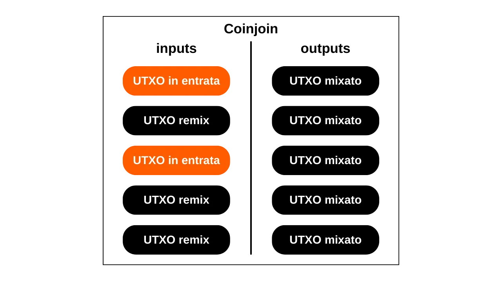

Grazie a questo sistema di commissioni, Whirlpool si distingue davvero da altri servizi di coinjoin, poiché il livello di anonimato raggiunto (anonset) non è proporzionale al costo sostenuto dall’utente.
È quindi possibile ottenere un’elevata privacy pagando soltanto la commissione d’ingresso nella pool, oltre alle commissioni di mining per due transazioni: la `Tx0` e il primo mix.
Va sottolineato che, al termine dei cicli di coinjoin, l’utente dovrà comunque coprire le commissioni di mining necessarie per prelevare i propri UTXO dalla pool, a meno che non abbia attivato l’opzione `mix to`, che verrà spiegata più avanti in questo tutorial.

### Gli account dell’HD wallet utilizzati da Whirlpool
Per eseguire un coinjoin tramite Whirlpool, il wallet deve generare diversi account distinti. Un account, nel contesto di un wallet HD (Hierarchical Deterministic), rappresenta una sezione completamente isolata dalle altre. Questa separazione avviene al terzo livello della gerarchia del wallet, ovvero a livello della xpub.

Un wallet HD può teoricamente derivare fino a 2^(32/2) account differenti. L’account iniziale, usato di default da tutti i wallet Bitcoin, corrisponde all’indice 0'.

Nei wallet compatibili con Whirlpool, come Samourai o Sparrow, vengono utilizzati quattro account per soddisfare le esigenze del processo di coinjoin:
- L'account **deposito**, identificato dall'indice `0'`;
- L'account **bad bank** (o doxxic change), identificato dall'indice `2 147 483 644`;
- L'account **premix**, identificato dall'indice `2 147 483 645`;
- L'account **postmix**, identificato dall'indice `2 147 483 646`.

Ciascuno di questi account svolge una funzione specifica all’interno del coinjoin.

Tutti questi account sono collegati a un unico seed, che consente all’utente di recuperare l’accesso a tutti i propri bitcoin utilizzando la recovery phrase e, se impostata, anche la passphrase.
Tuttavia, durante questa operazione di recupero, è necessario indicare al software gli indici degli account che sono stati effettivamente utilizzati.

Esaminiamo ora le diverse fasi di un coinjoin Whirlpool all'interno di questi account.

### Le diverse fasi dei coinjoin su Whirlpool
**Fase 1: La `Tx0`**
Il punto di partenza di qualsiasi coinjoin Whirlpool è l’account **deposito**. Questo è l’account utilizzato automaticamente dopo la  creazione di un nuovo wallet Bitcoin e deve essere finanziato con i bitcoin che si desidera mixare.
La `Tx0` rappresenta il primo passaggio del processo di mixing con Whirlpool. Serve a preparare e rendere uguali gli UTXO per il coinjoin, suddividendoli in unità corrispondenti all’importo della pool selezionata. Questo passaggio garantisce l’uniformità necessaria per il mixing. Gli UTXO standardizzati vengono poi inviati all’account premix.
Se parte del saldo non è compatibile con la pool, viene separata e inviata a un account specifico chiamato **bad bank** (o doxxic change).
Questa transazione iniziale `Tx0` include anche il pagamento della commissione di servizio destinata al coordinatore del mix. A differenza delle fasi successive, si tratta di una transazione non collaborativa, l’utente deve farsi carico per intero delle relative commissioni di mining.

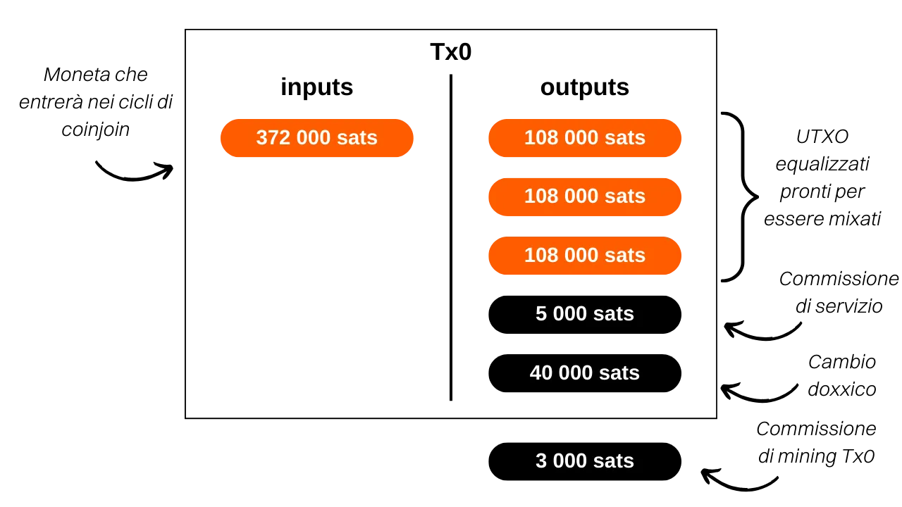

In questo esempio di transazione Tx0, un input di `372.000 sats` proveniente dal nostro account deposito viene suddiviso in diversi UTXO di output, così distribuiti:

- `5.000 sats` sono destinati al coordinatore come commissione di servizio, corrispondenti all’ingresso nella pool da `100.000 sats`;
- Tre UTXO uguali da `108.000 sats` ciascuno, preparati per il mixing, inviati al nostro account **premix** e registrati dal coordinatore. Questi importi coprono anche le future commissioni di mining del mix iniziale;
- Una cifra in eccesso troppo piccola per entrare nella pool, definita “doxxic change”, pari a `40.000 sats`, che viene inviata al relativo account dedicato;
- Infine, `3.000 sats` rappresentano le commissioni di mining necessarie per confermare la `Tx0`.

Ad esempio, ecco un vero Whirlpool `Tx0` (non mio): [edef60744f539483d868caff49d4848e5cc6e805d6cdc8d0f9bdbbaedcb5fc46](https://mempool.space/it/tx/edef60744f539483d868caff49d4848e5cc6e805d6cdc8d0f9bdbbaedcb5fc46)

**Fase 2: Il doxxic change**
La cifra in eccesso che non può essere integrata nella pool, in questo caso pari a `40.000 sats`, viene indirizzata all’account **bad bank**, noto anche come “doxxic change”, per garantire una netta separazione dagli altri UTXO nel wallet. Questo UTXO rappresenta un rischio per la privacy dell’utente, perché non solo è ancora collegato al suo storico, e quindi potenzialmente alla sua identità, ma risulta anche evidente a un osservatore esterno come esso appartenga a un utente che ha effettuato un coinjoin.
Se questo UTXO viene combinato con output mixati, gli output perderanno tutta la privacy acquisita nei cicli di coinjoin, soprattutto a causa della Common-Input-Ownership Heuristic (CIOH). Se invece viene unito ad altri "doxxic change", l’utente rischia di compromettere la privacy collegando tra loro diversi input di coinjoin. Per questo motivo, deve essere gestito con estrema attenzione.
La gestione di questo UTXO “doxxic” sarà approfondita nella parte finale di questo articolo; inoltre, futuri tutorial su Plan ₿ Network tratteranno questi metodi in modo più dettagliato.

**Passo 3: Il Mix Iniziale**
Una volta completata la Tx0, gli UTXO uniformati vengono trasferiti al conto **premix** del wallet, pronti per essere utilizzati nel loro primo ciclo di coinjoin, chiamato anche “mix iniziale”. Nel caso del nostro esempio, se la `Tx0` genera più UTXO destinati al mixing, ciascuno verrà inserito in un coinjoin iniziale separato.

Al termine di questi primi mix, il conto **premix** risulterà vuoto, mentre gli UTXO, avendo coperto le commissioni di mining di questo primo coinjoin, saranno esattamente dell’importo previsto dalla pool scelta. Nel nostro esempio, gli UTXO iniziali da `108.000 sats` saranno quindi stati ridotti a `100.000 sats` ciascuno.

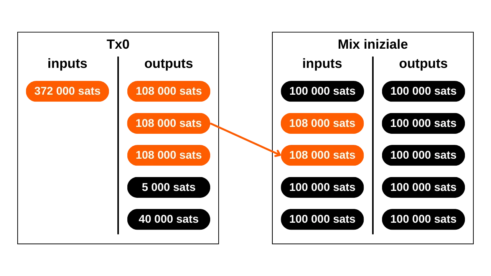

**Passo 4: I Remix**
Dopo il mix iniziale, gli UTXO vengono trasferiti al conto **postmix**. Questo conto raccoglie gli UTXO già mescolati e quelli in attesa di remix. Quando il client Whirlpool è attivo, gli UTXO in **postmix** sono automaticamente disponibili per il remix e vengono selezionati casualmente per partecipare a nuovi cicli di coinjoin.
Ricorda che i remix sono completamente gratuiti: non sono richieste commissioni di servizio aggiuntive né commissioni di mining. Mantenere gli UTXO nel conto postmix preserva quindi il loro valore e aumenta contemporaneamente il loro anonset. Per questo motivo, è importante lasciare che questi UTXO partecipino a più cicli di coinjoin. Non ti costa nulla e migliora la loro privacy.

Quando decidi di spendere UTXO mescolati, puoi farlo direttamente dal conto **postmix**. Si consiglia di mantenere gli UTXO mescolati in questo conto per beneficiare dei remix gratuiti e per evitare che escano dal circuito Whirlpool, riducendo così la loro privacy.
Come vedremo nel tutorial seguente, esiste anche l’opzione `mix to`, che consente di inviare automaticamente le monete mescolate a un altro wallet, come un cold wallet, dopo un numero definito di coinjoin.

Dopo aver esaminato la teoria, passiamo alla pratica con un tutorial sull'uso di Whirlpool tramite l'app Android Samourai Wallet!

## Tutorial: Coinjoin Whirlpool su Samourai Wallet
Ci sono numerose opzioni per utilizzare Whirlpool.
Quella che voglio presentare qui è l’opzione con Samourai Wallet (senza Dojo), un’app open-source per la gestione di wallet Bitcoin su Android.

Mixare tramite Samourai senza Dojo ha il vantaggio di essere piuttosto semplice da usare, veloce da configurare e non richiede altri dispositivi oltre a uno smartphone Android e una connessione internet.

Tuttavia, questo metodo presenta due svantaggi significativi:

- I coinjoin avverranno solo quando Samourai è in esecuzione in background e connesso.
Questo significa che, se desideri mixare e remixare i tuoi bitcoin in modo continuo (24/7), dovrai tenere l’app sempre attiva.

- Se utilizzi Whirlpool con Samourai Wallet senza collegarti al tuo Dojo personale, l’applicazione dovrà connettersi al server mantenuto dal team di Samourai.
In questo modo, rivelerai lo xpub del tuo wallet a loro.
Queste informazioni, pur essendo anonime, sono necessarie affinché l’app possa recuperare le tue transazioni.

La soluzione ideale per superare queste limitazioni è quella di utilizzare il proprio Dojo, associato a un’istanza di Whirlpool CLI sul proprio nodo Bitcoin.
In questo modo si evita qualsiasi fuga di informazioni e si ottiene una piena indipendenza.
Anche se il tutorial qui sotto è utile per determinati obiettivi o per chi è alle prime armi, per ottimizzare davvero le proprie sessioni di coinjoin è consigliato l’uso di un Dojo personale.
Una guida dettagliata per configurare questa soluzione sarà presto disponibile su Plan ₿ Network.

### Installare Samourai Wallet
Per iniziare, avrai ovviamente bisogno dell'app Samourai Wallet. Puoi scaricarla direttamente dal sito ufficiale tramite l'APK, dal loro GitLab, o dal Google Play Store.

### Creare un Wallet
Dopo aver installato il software, dovrai procedere con la creazione di un wallet Bitcoin su Samourai. Se ne hai già uno, puoi andare direttamente al passo successivo.

All'apertura dell'app, premi il pulsante blu `Start`. Ti verrà quindi chiesto di selezionare una posizione nei file del tuo telefono dove verrà memorizzato il backup crittografato del tuo nuovo wallet.

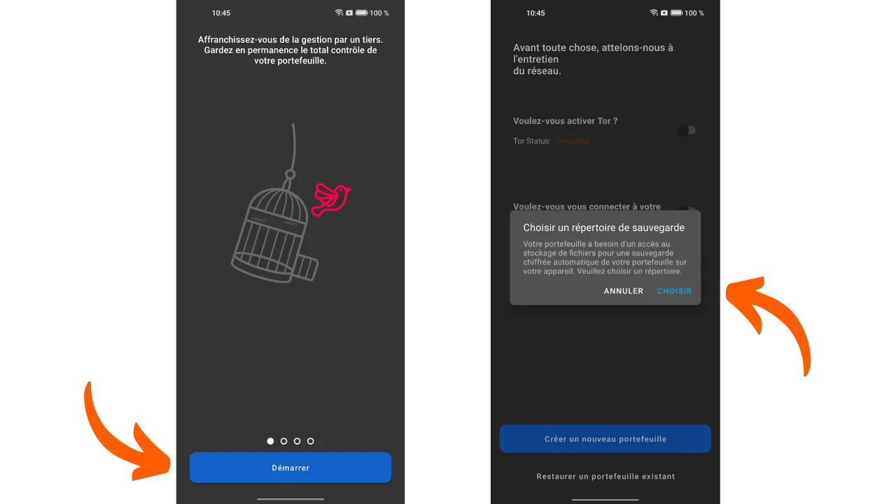

Attiva Tor selezionando l'opzione corrispondente.
A questo punto, hai anche la possibilità di selezionare un Dojo specifico. Tuttavia, in questo tutorial continueremo utilizzando il Dojo predefinito, quindi puoi lasciare questa opzione disattivata.
Quando Tor risulta connesso, clicca su `Create a new wallet`.

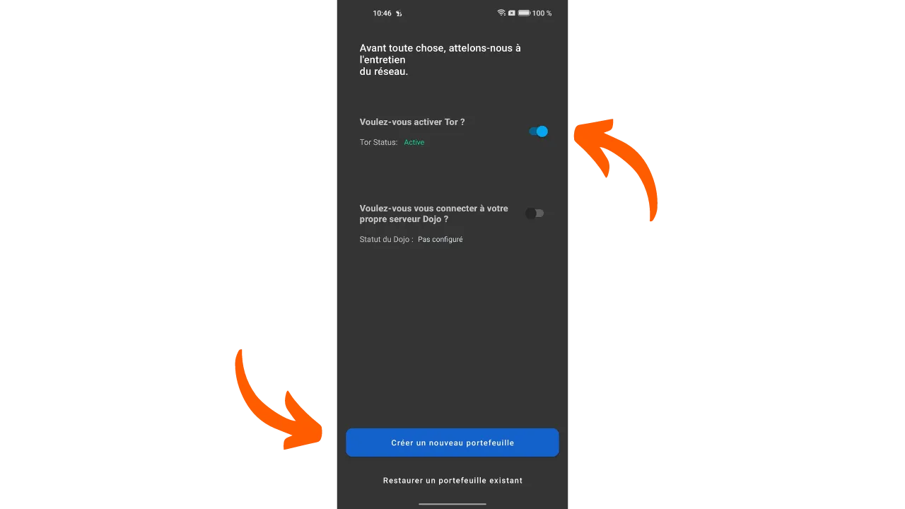

Samourai Wallet ti chiederà quindi di impostare una passphrase BIP39.
Questa password aggiuntiva è molto importante, poiché interviene direttamente nella derivazione delle tue chiavi private.
Un’eventuale perdita di questa passphrase comporterebbe l’impossibilità di accedere ai tuoi bitcoin, che risulterebbero persi in modo irreversibile.
Per ripristinare il tuo wallet Samourai, è indispensabile disporre sia della frase di recupero a 12 parole, sia della passphrase.

È quindi essenziale scegliere una passphrase robusta e conservarne una o più copie fisiche, su carta o su supporto metallico, per garantire la sicurezza dei tuoi bitcoin.
Dopo aver completato queste operazioni, spunta la casella `I am aware that in case of loss...`, quindi clicca `NEXT`.

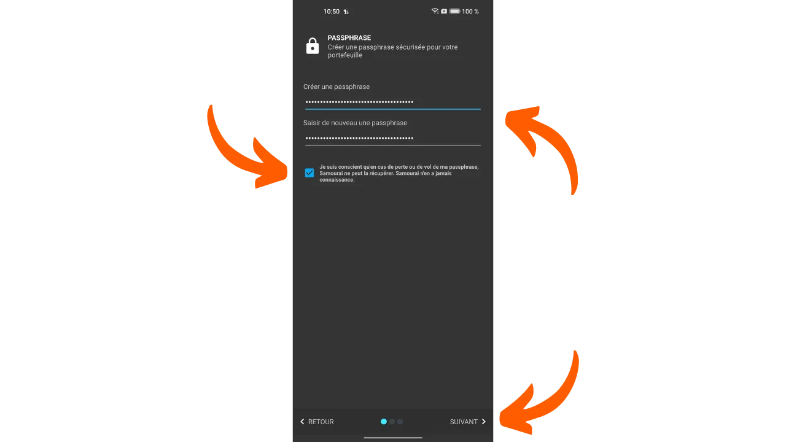

Devi quindi definire un codice PIN composto da 5 a 8 cifre.
Questo codice servirà a proteggere l’accesso al tuo wallet sul telefono ed è richiesto ogni volta che vorrai aprire l’applicazione Samourai.
Scegli un codice PIN robusto e assicurati di conservarne una copia di backup.
A questo punto, puoi premere il pulsante `NEXT`.

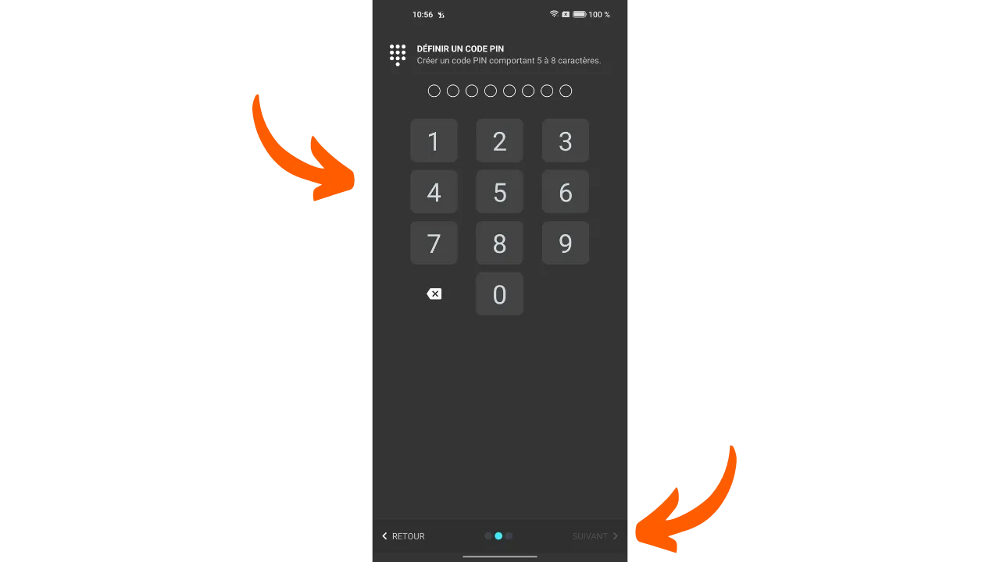

Samourai ti inviterà a inserire nuovamente il tuo codice PIN per conferma. Inseriscilo, poi clicca `FINALIZE`.


Accederai quindi alla tua frase di recupero composta da 12 parole.
Questa frase ti permette di recuperare il wallet insieme alla passphrase inserita in precedenza.
Si raccomanda vivamente di fare una o più copie di questa frase su supporti fisici, come carta o metallo, per garantire la sicurezza dei tuoi bitcoin in caso di problemi.

Dopo aver effettuato questi backup, verrai indirizzato all’interfaccia del tuo nuovo wallet Samourai.

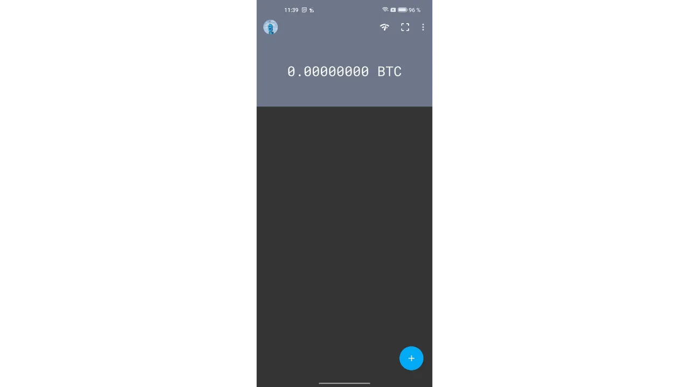

Ti viene offerta la possibilità di ottenere il tuo PayNym Bot. Puoi richiederlo se vuoi, anche se non è essenziale per questo tutorial.

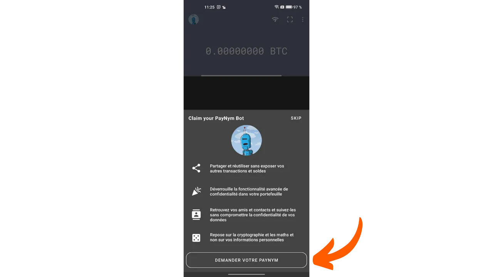

Prima di procedere a ricevere bitcoin su questo nuovo wallet, è fortemente consigliato verificare nuovamente la validità dei backup del wallet (la passphrase e la frase di recupero).
Per controllare la passphrase, puoi selezionare l’icona del tuo PayNym Bot situata in alto a sinistra dello schermo, quindi seguire il percorso:
```plaintext
Settings > Troubleshooting > Passphrase/backup test
```

Inserisci la tua passphrase per eseguire la verifica.

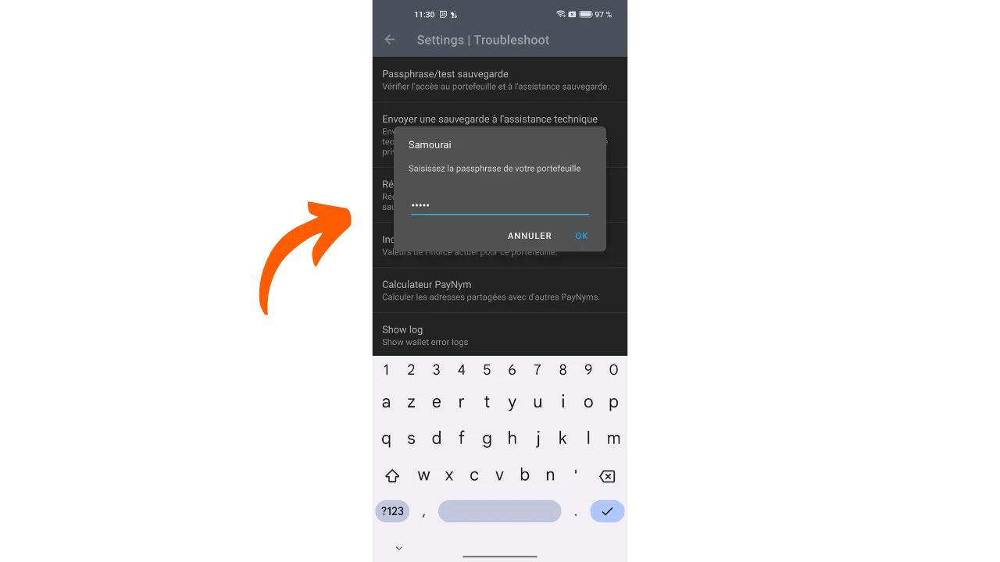

Samourai confermerà se è valida.

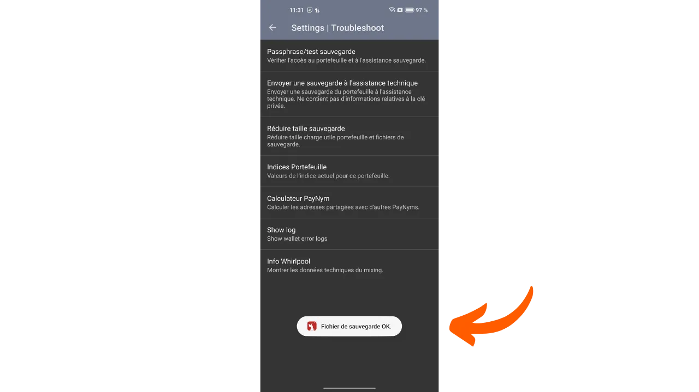

Per verificare il backup della frase di recupero, clicca sull'icona del tuo PayNym Bot, situata in alto a sinistra dello schermo, e segui questo percorso:
```plaintext
Settings > Wallet > Show 12-word recovery phrase
```

Samourai mostrerà una finestra con la tua frase di recupero. Accertati che corrisponda esattamente a quella del tuo backup fisico.

Per approfondire e fare un test completo di recupero, annota un elemento di riferimento del tuo wallet, come uno degli `xpubs`, quindi procedi a eliminare il wallet (a condizione che sia ancora vuoto).
L’obiettivo è tentare di ripristinare questo wallet vuoto utilizzando solo i backup fisici.
Se il ripristino ha successo, significa che i tuoi backup sono validi e affidabili.

### Ricevere bitcoin
Dopo aver creato il wallet, inizierai con un unico account, identificato dall’indice 0'. Si tratta dell’account **deposito** di cui abbiamo parlato precedentemente.
È a questo account che dovrai trasferire i bitcoin destinati ai coinjoin.

Per farlo, clicca sul simbolo blu `+` in basso a destra dello schermo.

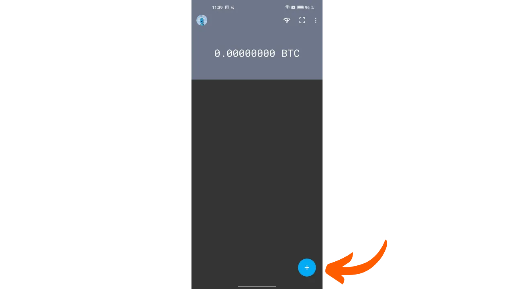

Poi clicca sul pulsante verde `Receive`.

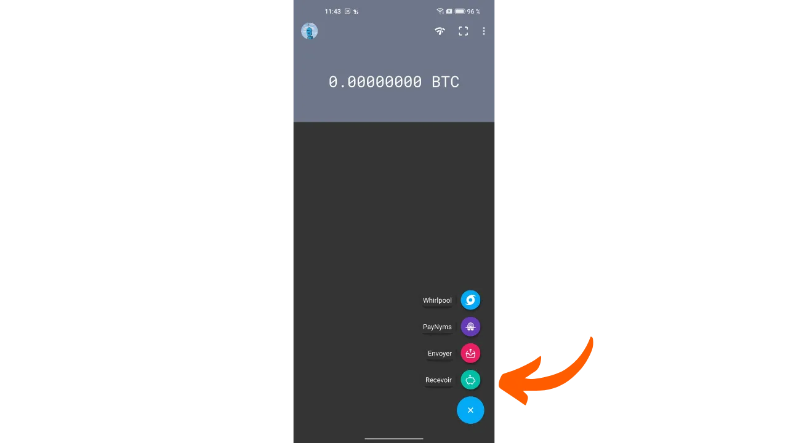

Samourai genererà automaticamente un nuovo indirizzo vuoto per ricevere bitcoin.

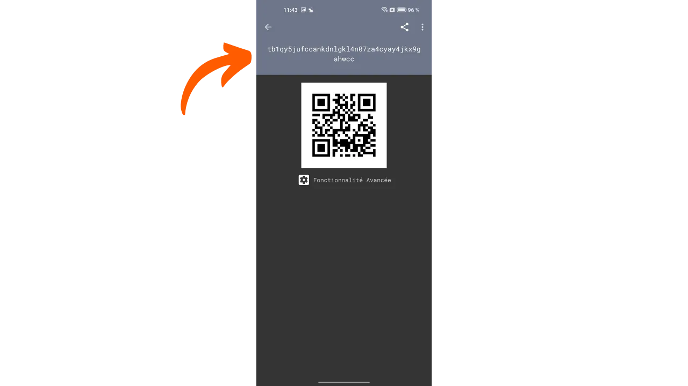

Puoi inviare lì i bitcoin da mixare.

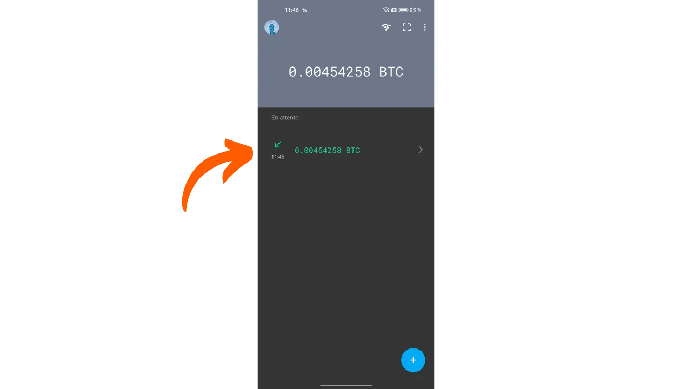

### Effettuare la Tx0
Quando la transazione è confermata, puoi iniziare il processo di coinjoins. Per fare ciò, clicca sul pulsante blu `+` in basso a destra dello schermo.


Poi clicca su `Whirlpool` in blu.

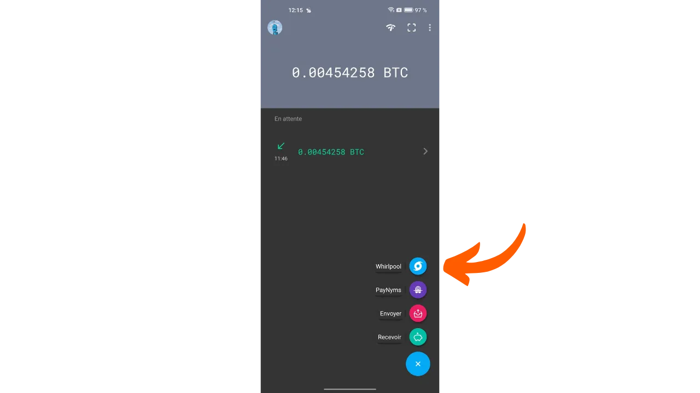

Attendi mentre Whirlpool si inizializza e Samourai crea gli account necessari.

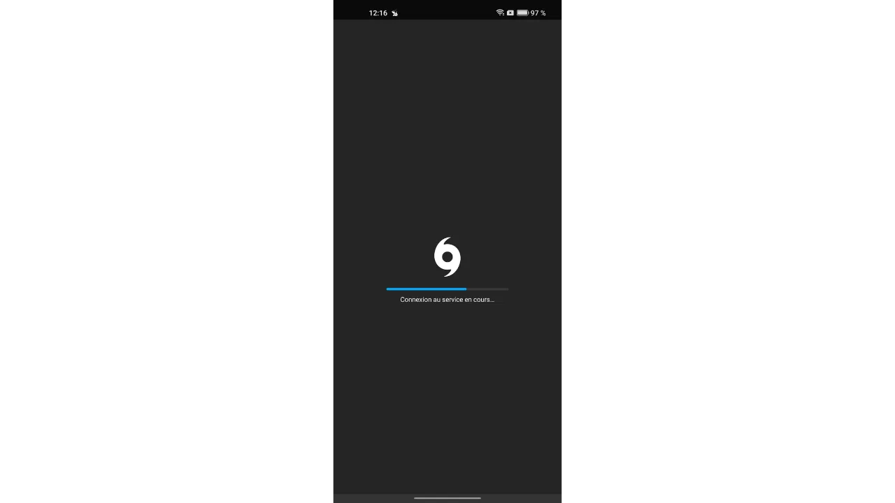

Arriverai quindi alla homepage di Whirlpool. Clicca su `Start`.

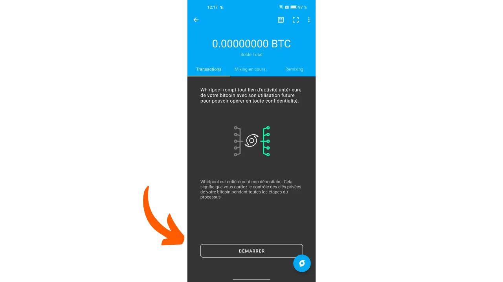

Seleziona l'UTXO dall'account **deposito** che desideri inviare nei cicli di coinjoin, quindi clicca su `Next`.

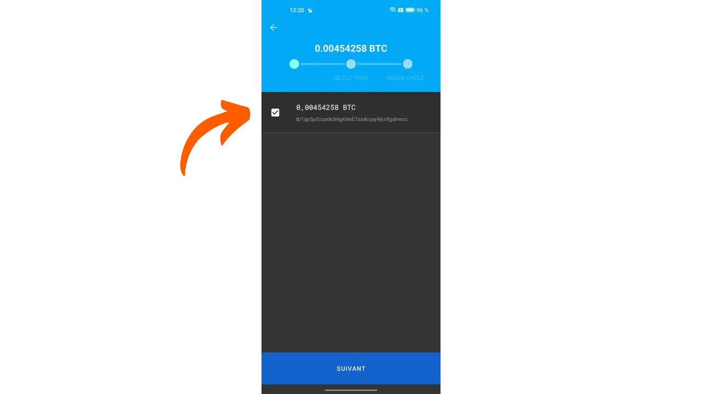

Nel passaggio successivo dovrai scegliere il livello di commissione da assegnare alla `Tx0` e al tuo primo mix.
Questa impostazione determinerà la velocità con cui verranno confermati la `Tx0` e il tuo coinjoin iniziale (o i coinjoin iniziali).
Ricorda che le commissioni di mining per la `Tx0` e per il primo mix sono a tuo carico, ma non dovrai pagare altre commissioni per i remix successivi.
Hai la possibilità di scegliere tra tre opzioni: `Low`, `Normal` o `High`.

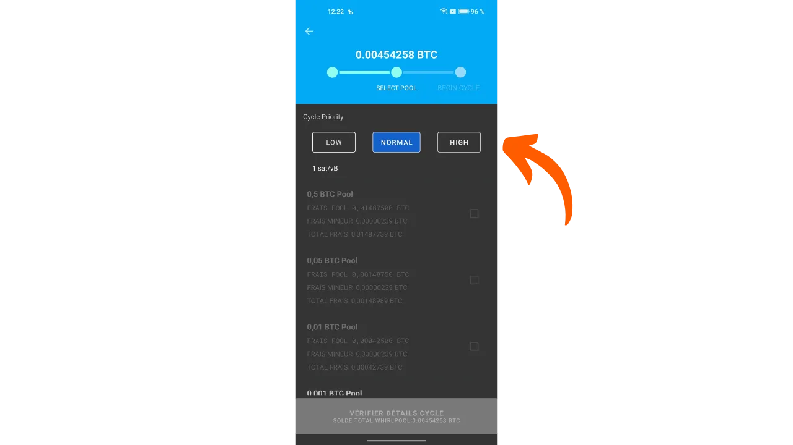

Nella stessa finestra, hai l'opzione di scegliere la pool in cui entrerai. Dato che inizialmente ho selezionato un UTXO di `454,258 sats`, la mia unica scelta possibile è la pool da `100,000 sats`. Questa pagina ti presenta anche le commissioni di servizio della pool, in aggiunta alle commissioni di mining, il che ti permette di conoscere il costo totale per questo ciclo di coinjoin. Se tutto ti va bene, seleziona la pool appropriata e continua cliccando sul pulsante blu `VERIFY CYCLE DETAILS`.

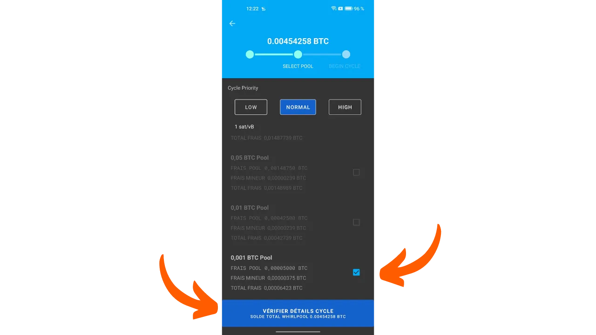

Potrai quindi vedere tutti i dettagli del tuo ciclo di coinjoin:
- il numero di UTXO che entreranno nella pool;
- le varie commissioni sostenute;
- l'importo del doxxic change...

Verifica le informazioni, poi clicca sul pulsante verde `START CYCLE`.

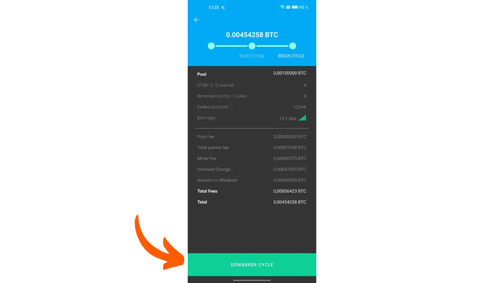

Apparirà una finestra che ti proporrà di contrassegnare come "non spendibile" il doxxic change generato dal tuo ingresso nel ciclo di coinjoin.
Se selezioni `YES`, questo UTXO non sarà visibile nel wallet e non potrà essere selezionato per le future transazioni. Tuttavia, rimarrà accessibile nell’elenco degli UTXO del wallet, dove potrai modificarne manualmente lo stato.
Si consiglia di scegliere questa opzione per evitare errori operativi che potrebbero compromettere la tua privacy in futuro.
Se invece selezioni `NO`, il doxxic change resterà disponibile per l’uso all’interno del wallet.
Se vuoi approfondire la gestione e l’utilizzo di questo tipo di UTXO, ti consiglio di leggere l’ultima parte di questo tutorial.

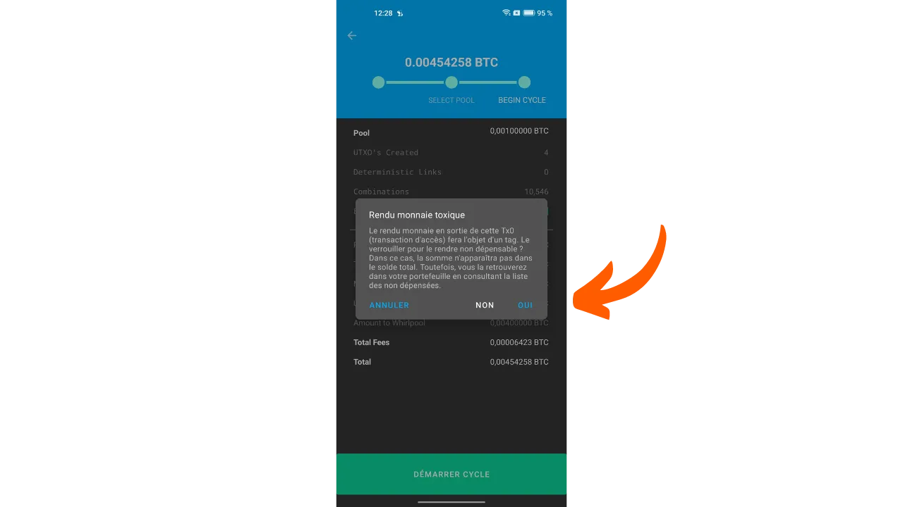

Samourai trasmetterà quindi la tua Tx0.

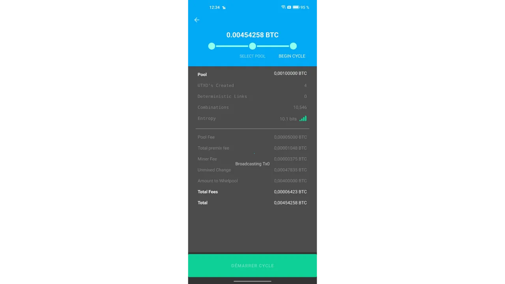

### Effettuare i coinjoin
Una volta pubblicata la Tx0, puoi trovarla nella scheda `Transactions` del menu Whirlpool.

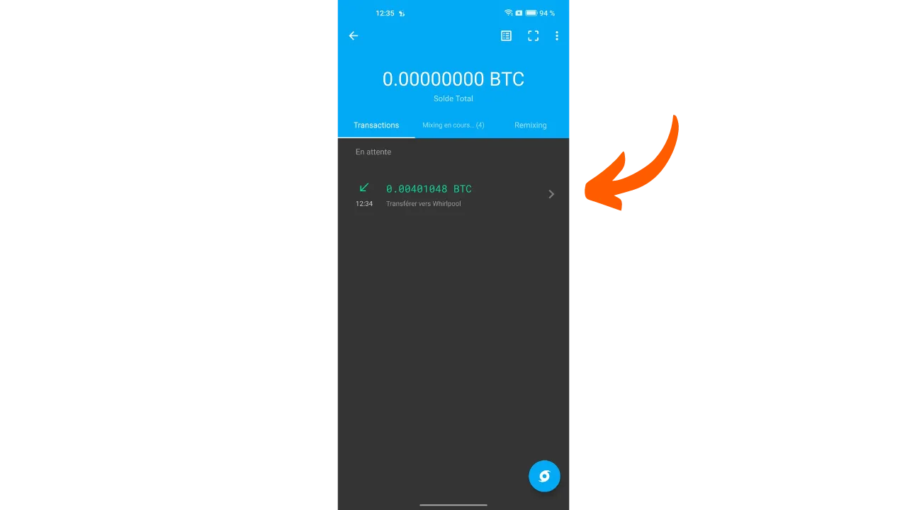

I tuoi UTXO pronti per essere mixati si trovano nella sezione `Mixing in progress...`, che corrisponde all'account **Premix**.

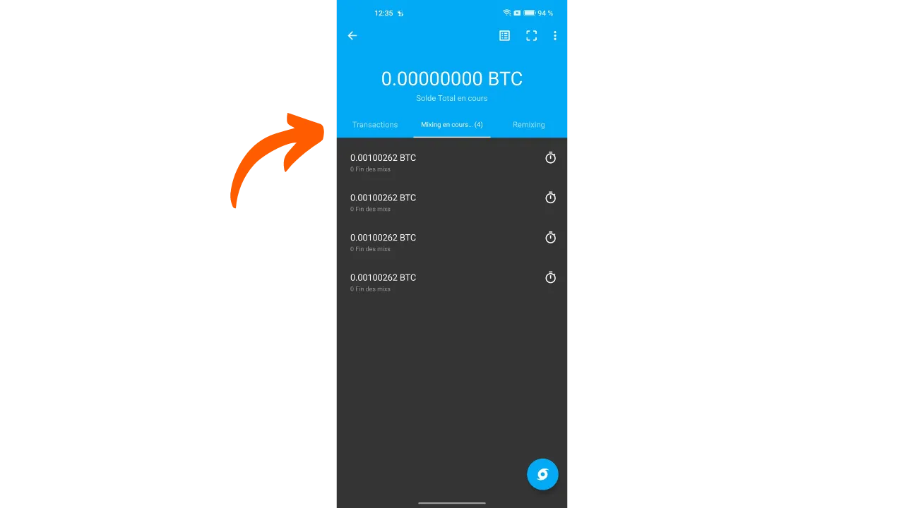

Una volta confermata la `Tx0`, i tuoi UTXO verranno automaticamente registrati dal coordinatore, e i mix iniziali inizieranno successivamente in modo automatico.

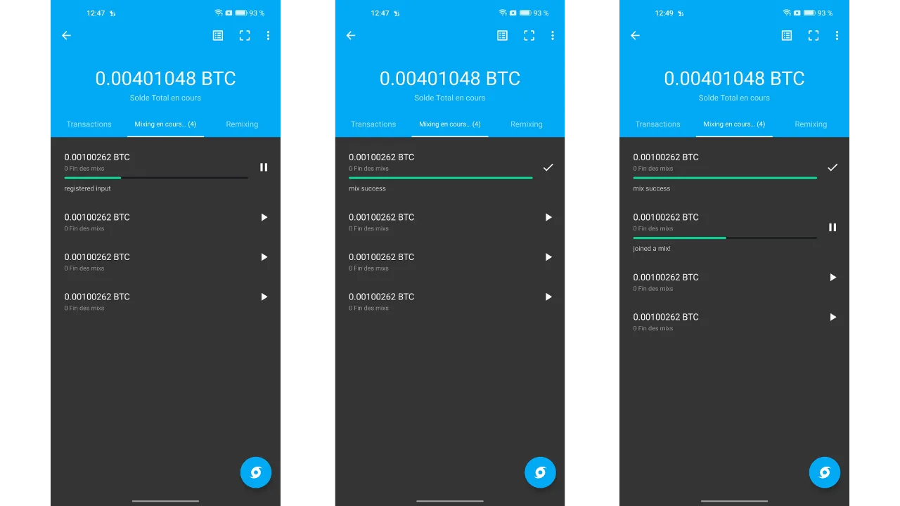

Controllando la scheda `Remixing`, che corrisponde all'account **Postmix**, osserverai gli UTXO risultanti dai mix iniziali. Queste UTXO rimarranno pronti per il remix successivo, che non comporterà alcun costo aggiuntivo. Ti consiglio di consultare quest'altro articolo per saperne di più sul processo di remix e sull'efficienza di un ciclo coinjoin: [REMIX - WHIRLPOOL](https://planb.network/tutorials/privacy/analysis/remix-whirlpool-2b887bd9-8a6a-4dca-8aa9-a1c33682b0aa)

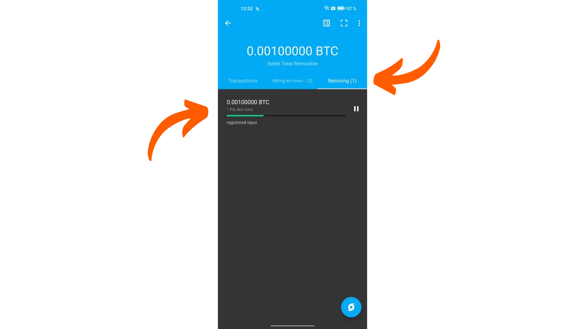

È possibile sospendere temporaneamente il remixing di un UTXO premendo il pulsante di pausa situato alla sua destra.
Per renderlo nuovamente idoneo al remixing, ti basterà fare clic una seconda volta sullo stesso pulsante.
È importante notare che può essere eseguito un solo coinjoin per utente e per pool alla volta.
Quindi, se hai 6 UTXO da `100 000 sats` pronti per il coinjoin, solo uno di essi potrà essere mixato.
Dopo aver mixato un UTXO, Samourai Wallet provvederà a selezionare casualmente un nuovo UTXO tra quelli disponibili, al fine di diversificare e bilanciare il remixing di ciascuna moneta.

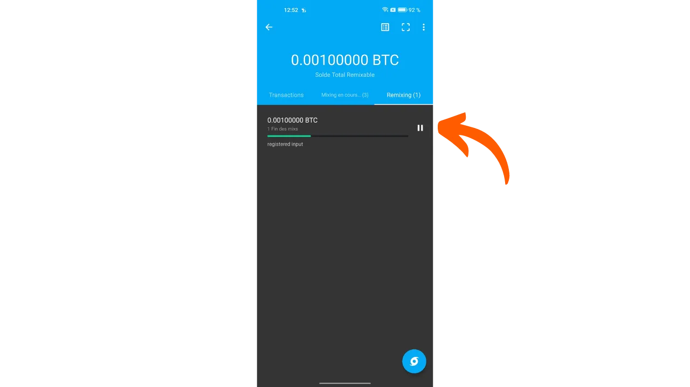

Per garantire la disponibilità continua dei tuoi UTXO per il remixing, è necessario mantenere attiva l’applicazione Samourai in background.
Dovresti vedere una notifica sul telefono che conferma l’esecuzione di Whirlpool.
Chiudere l’app o spegnere il telefono metterà in pausa i coinjoin.

### Completare i coinjoin
Per spendere i tuoi bitcoin mixati, vai all'account **Postmix** indicato `Remixing` nelle schede del menu Whirlpool.

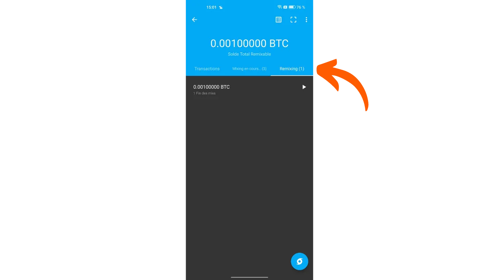

Fai clic sul logo Whirlpool blu situato in basso a destra.

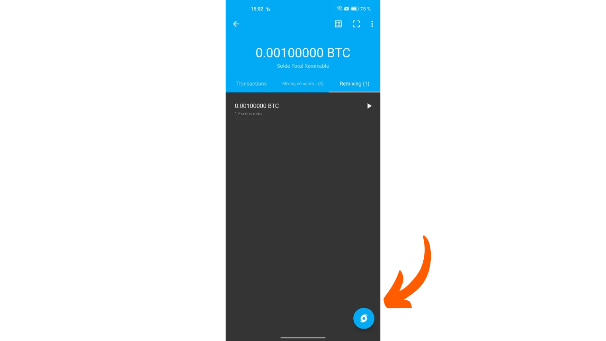

Quindi fai clic su `Spend Mixed UTXOs`.

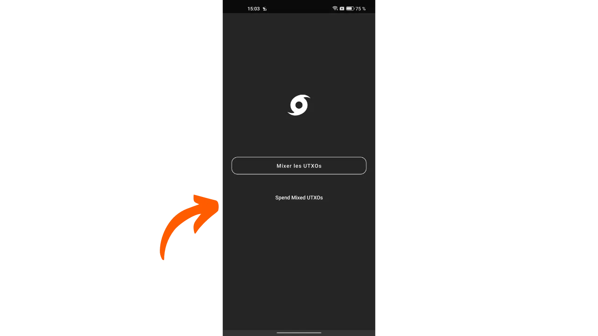

Puoi quindi inserire l'indirizzo del destinatario e l'importo da inviare, allo stesso modo di qualsiasi altra transazione effettuata con Samourai Wallet. Lo sfondo blu indica che i fondi vengono spesi da un account Whirlpool, e non dall'account **deposito**.

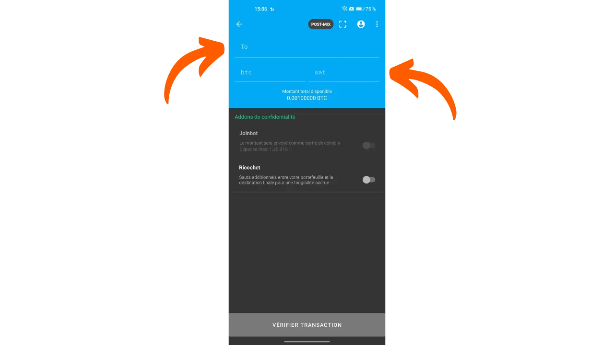

Facendo clic sui 3 piccoli punti in alto a destra, hai l'opzione di selezionare UTXO specifici.

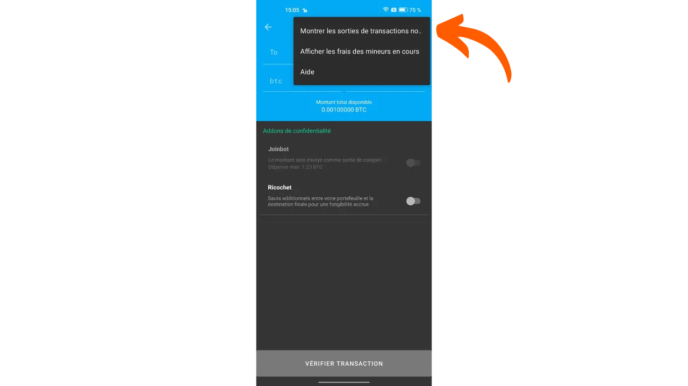

Facendo clic sul quadrato bianco in alto a destra della finestra, puoi scansionare il QR code dell'indirizzo del destinatario con la tua fotocamera.

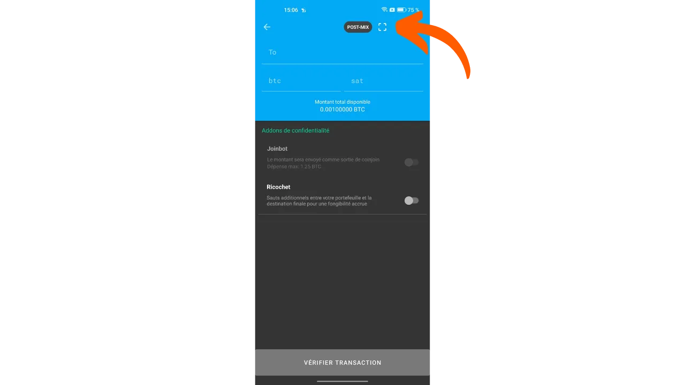

Inserisci le informazioni necessarie per la tua transazione di spesa, quindi fai clic sul pulsante blu `VERIFY TRANSACTION`.

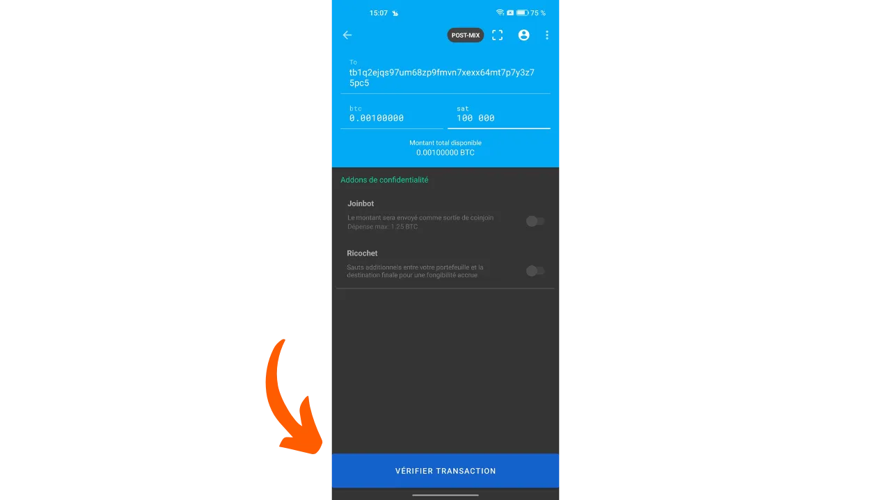

Nel passaggio successivo, hai l'opzione di modificare la commissione associata alla tua transazione. Puoi anche abilitare l'opzione Stonewall spuntando la casella corrispondente. Se l'opzione Stonewall non è selezionabile, significa che il tuo account **Postmix** non contiene UTXO di dimensioni sufficienti per supportare questa particolare struttura di transazione.

[-> Scopri di più sulle transazioni Stonewall.](https://planb.network/tutorials/privacy/on-chain/stonewall-033daa45-d42c-40e1-9511-cea89751c3d4)

Se il tutto ti soddisfa, fai clic sul pulsante verde `SEND ... BTC`.

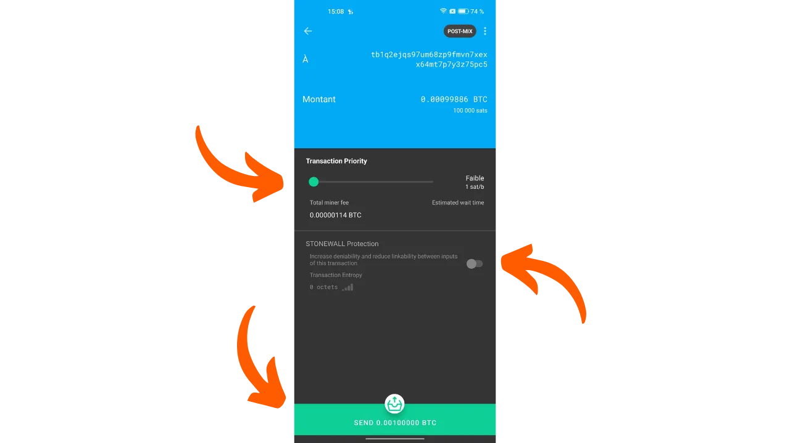

Samourai procederà quindi a firmare la tua transazione prima di trasmetterla sulla rete. Devi solo aspettare che venga aggiunta a un blocco da un miner.

### Utilizzo di uno SCODE
A volte, il team di Samourai Wallet offre degli "SCODE". Uno SCODE è un codice promozionale utile per uno sconto sulle commissioni di servizio della pool. Samourai Wallet occasionalmente li offre ai suoi utenti specie durante eventi particolari. Consiglio di [seguire Samourai Wallet](https://twitter.com/SamouraiWallet) sui social media per non perdere i futuri SCODE.

Per applicare uno SCODE su Samourai, prima di iniziare un nuovo ciclo di coinjoin, vai al menu Whirlpool e seleziona i tre piccoli punti situati in alto a destra dello schermo.

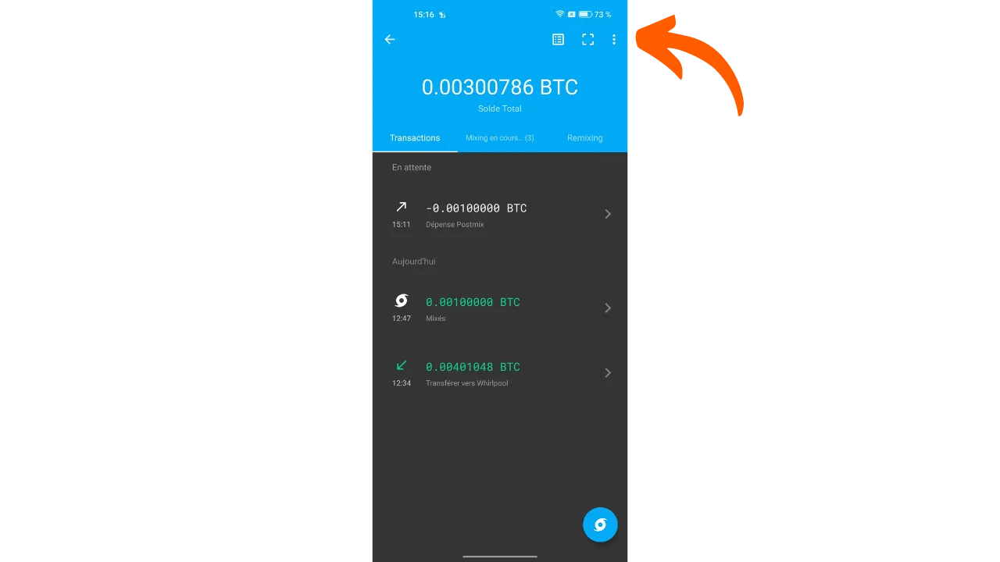

Clicca su `SCODE (codice promozionale) Whirlpool`.

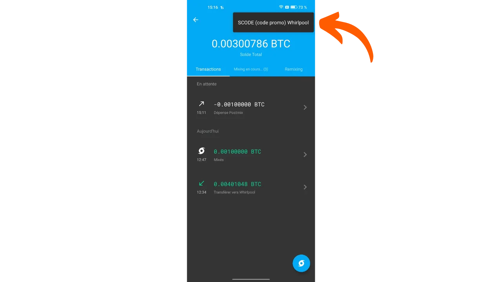

Inserisci lo SCODE nella finestra che si è aperta, poi convalida cliccando su `OK`.

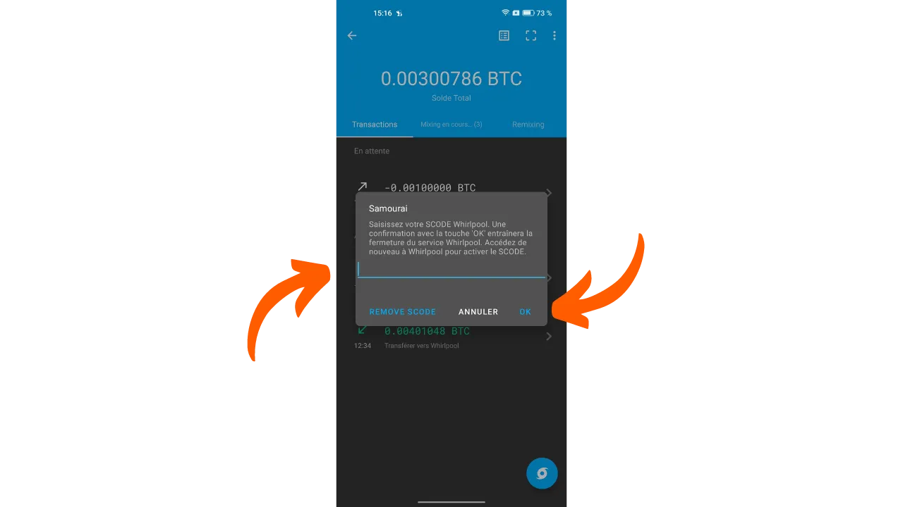

Whirlpool si chiuderà automaticamente. Attendi che Samourai finisca di caricare, poi apri nuovamente il menu Whirlpool.

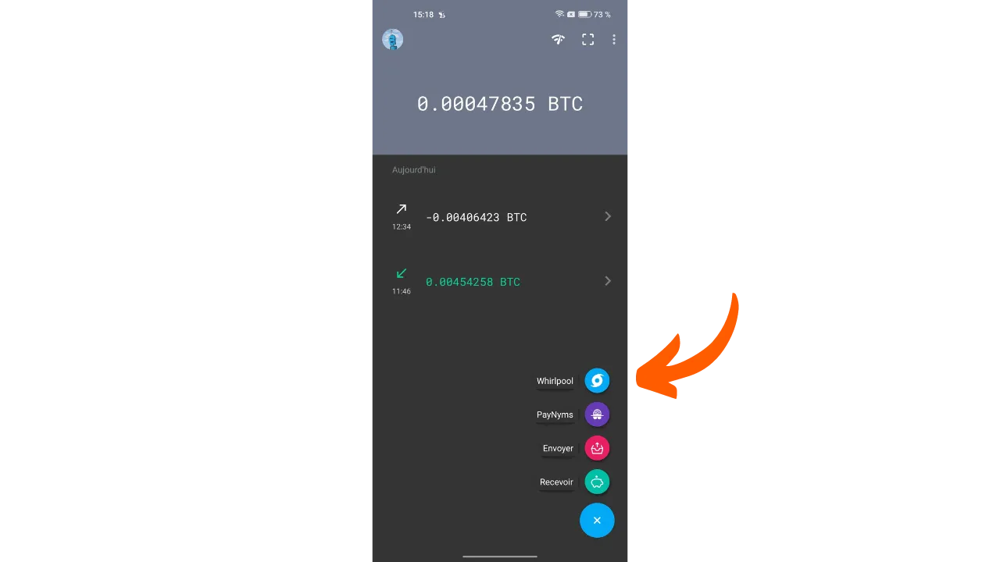

Assicurati che il tuo SCODE sia stato correttamente registrato cliccando ancora una volta sui tre piccoli punti, poi selezionando `SCODE (promo code) Whirlpool`. Se tutto è in ordine, sei pronto per iniziare un nuovo ciclo Whirlpool con uno sconto sulle commissioni di servizio. È importante notare che questi SCODE sono temporanei: rimangono validi per alcuni giorni prima di diventare obsoleti.

## Come valutare la qualità dei propri cicli di coinjoin?
Perché un coinjoin sia veramente efficace, è essenziale che dimostri una buona uniformità tra gli importi di input e output. Questa uniformità aumenta il numero di possibili interpretazioni agli occhi di un osservatore esterno, incrementando così l'incertezza che circonda la transazione. Per quantificare l'incertezza generata da un coinjoin, si può ricorrere al calcolo dell'entropia della transazione. Per un'approfondimento su questi indicatori, vi rimando al tutorial: [CALCOLATORE DI BOLTZMANN](https://planb.network/tutorials/privacy/analysis/boltzmann-entropy-738e45af-18a6-4ce6-af1a-1bf58e15f1fe). 

Successivamente, si valuta l’efficacia di più cicli di coinjoin in base all’estensione dei gruppi all’interno dei quali una moneta è nascosta.
La dimensione di questi gruppi definisce ciò che viene chiamato anonset.
Esistono due tipi di anonset:
- il primo misura la privacy ottenuta rispetto a un’analisi retrospettiva (dal presente verso il passato),
- il secondo rispetto a un’analisi prospettica (dal passato verso il presente).

Per una spiegazione dettagliata di questi due indicatori, ti invito a consultare il tutorial: [WHIRLPOOL STATS TOOLS - ANONSET](https://planb.network/tutorials/privacy/analysis/wst-anonsets-0354b793-c301-48af-af75-f87569756375)

## Come gestire il postmix?
Dopo aver eseguito cicli di coinjoin, la migliore strategia è mantenere i propri UTXO nell'account **postmix**, in attesa del loro futuro utilizzo. È addirittura consigliabile lasciarli remixare all'infinito fino a quando non sarà necessario spenderli.

Alcuni utenti potrebbero considerare di trasferire i loro bitcoin mixati in un portafoglio protetto da un hardware wallet. Questo è possibile, ma è importante seguire meticolosamente le raccomandazioni di Samourai Wallet per non compromettere la privacy acquisita.
L'unione di UTXO costituisce l'errore più frequentemente commesso. È necessario evitare di combinare UTXO mixati con UTXO non mixati nella stessa transazione, al fine di evitare il CIOH (*Common-Input-Ownership-Heuristic*). Questo richiede una gestione attenta dei tuoi UTXO all'interno del tuo wallet, in particolare in termini di "labelling". Oltre al coinjoin, la fusione di UTXO è generalmente una cattiva pratica che spesso porta a una perdita di privacy quando non gestita correttamente. Dovresti anche essere vigile riguardo al consolidamento di UTXO diversi tra loro. Consolidamenti moderati sono possibili se i tuoi UTXO mixati hanno anonset significativi, ma ciò diminuirà inevitabilmente la privacy dei tuoi UTXO. Assicurati di non consolidare importi troppo grandi, ne di farlo dopo un numero insufficiente di remix, poiché ciò rischia di stabilire collegamenti deducibili tra i tuoi UTXO prima e dopo i cicli di coinjoin. In caso di dubbio su queste operazioni, la pratica migliore è non consolidare gli UTXO postmix, ma trasferirli uno per uno al tuo hardware wallet, generando un nuovo indirizzo vuoto ogni volta. Ancora una volta, ricorda di "etichettare" correttamente ogni UTXO ricevuto.

È anche sconsigliato trasferire i tuoi UTXO postmix a un wallet che utilizza script non comuni. Ad esempio, se entri in Whirlpool da un wallet multisig che utilizza script `P2WSH`, c'è poca possibilità che tu venga mischiato con altri utenti che hanno lo stesso tipo di wallet. Se esci dal tuo postmix verso questo stesso wallet multisig, il livello di privacy dei tuoi bitcoin mixati sarà notevolmente ridotto. Oltre agli script, ci sono molte altre impronte digitali del wallet che possono ingannarti.

Come per qualsiasi transazione Bitcoin, è anche appropriato non riutilizzare gli indirizzi di ricezione. Ogni nuova transazione deve essere ricevuta su un nuovo indirizzo vuoto.

La soluzione più semplice e sicura è lasciare riposare gli UTXO mixati nel loro conto **postmix**, permettendo loro di remixarsi, muovendoli solo per spendere.Samourai e Sparrow wallet hanno protezioni aggiuntive contro tutti questi rischi legati alla chain analysis. Queste protezioni ti aiutano a evitare di commettere errori.

## Come gestire il doxxic change?
Successivamente, devi stare attento alla gestione del doxxic change, il cambio che non è potuto entrare nella pool di coinjoin. Questi UTXO "tossici", risultanti dall'uso di Whirlpool, rappresentano un rischio per la tua privacy poiché stabiliscono un collegamento tra te e l'uso del coinjoin. È quindi imperativo gestirli con cautela e non combinarli con altri UTXO, specialmente UTXO già mixati. Ecco diverse strategie da considerare per il loro utilizzo:
- **Mixali in pool più piccole:** Se il tuo UTXO tossico è abbastanza grande da entrare da solo in una pool più piccola, considera l'idea di mixarlo. Questa è spesso la migliore opzione. Tuttavia, è cruciale non unire diversi UTXO tossici per accedere ad una pool, poiché ciò potrebbe collegare le tue diverse entrate.
- **Segnali come "non spendibili":** Un altro approccio è smettere di usarli, segnarli come "non spendibili" nel loro conto dedicato e semplicemente Hodl. Questo assicura di non spenderli accidentalmente. Se il valore del bitcoin aumenta, potrebbero emergere nuove pool più adatte ai tuoi UTXO tossici;
- **Fai donazioni:** Considera di fare donazioni, anche modeste, a sviluppatori che lavorano su Bitcoin e i suoi software associati. Puoi anche donare ad organizzazioni che accettano BTC. Se gestire i tuoi UTXO tossici sembra troppo complicato, puoi semplicemente liberartene facendo una donazione;
- **Acquista carte regalo:** Piattaforme come [Bitrefill](https://www.bitrefill.com/) ti permettono di scambiare bitcoin con carte regalo utilizzabili presso vari commercianti. Questo può essere un modo per liberarti dei tuoi UTXO tossici senza perdere il valore associato;
- **Consolidali su Monero:** Samourai Wallet offre ora un servizio di atomic swap tra BTC e XMR. Questo è ideale per gestire gli UTXO tossici consolidandoli su Monero, senza compromettere la tua privacy tramite KYC, prima di rimandarli a Bitcoin. Tuttavia, questa opzione può essere costosa in termini di commissioni di mining e del premio dovuto ai vincoli di liquidità;
- **Inviali su Lightning Network:** Trasferire questi UTXO su Lightning Network per beneficiare di commissioni di transazione ridotte è un'opzione che può essere interessante. Tuttavia, questo metodo potrebbe rivelare certe informazioni a seconda del tuo uso di Lightning e dovrebbe quindi essere praticato con cautela.

Tutorial dettagliati sull'implementazione di queste diverse tecniche saranno presto offerti su PlanB Network.

**Risorse aggiuntive:**
[Tutorial video di Samourai Wallet](https://planb.network/tutorials/wallet/mobile/samourai-46f88b20-5d1e-47e0-be53-237ff8737956)
- [Documentazione di Samourai Wallet - Whirlpool](https://docs.samourai.io/whirlpool/basic-concepts);
- [Thread su Twitter sui coinjoins](https://twitter.com/SamouraiWallet/status/1489220847336308739);
- [Post sul blog sui coinjoins](https://www.pandul.fr/post/comprendre-et-utiliser-le-coinjoin-sur-bitcoin).


