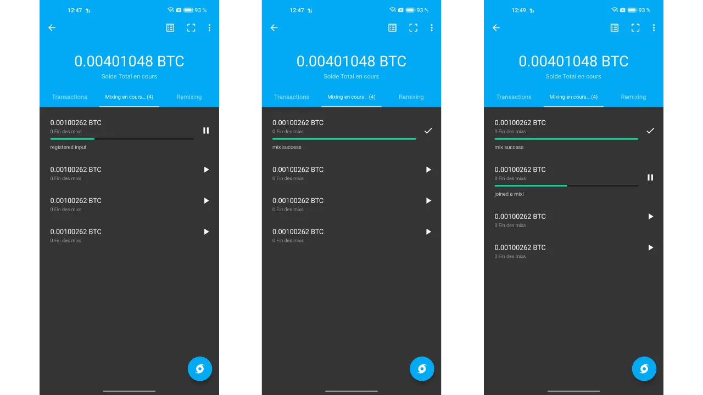

"*uma carteira bitcoin para as ruas*"

Neste tutorial, você aprenderá o que é um coinjoin e como realizar um usando o software Samourai Wallet e a implementação Whirlpool.

## O que é um coinjoin no Bitcoin?
**Coinjoin é uma técnica que quebra a rastreabilidade dos bitcoins na blockchain**. Ela depende de uma transação colaborativa com uma estrutura específica de mesmo nome: a transação coinjoin.

Coinjoins aumentam a privacidade dos usuários do Bitcoin ao complicar a análise de cadeia para observadores externos. Sua estrutura permite a fusão de múltiplas moedas de diferentes usuários em uma única transação, obscurecendo assim os rastros e tornando difícil determinar os vínculos entre endereços de entrada e saída.

O princípio do coinjoin é baseado em uma abordagem colaborativa: vários usuários que desejam misturar seus bitcoins depositam quantias idênticas como entradas da mesma transação. Essas quantias são então redistribuídas como saídas de igual valor para cada usuário. Ao final da transação, torna-se impossível associar uma saída específica a um usuário conhecido na entrada. Não existe um vínculo direto entre as entradas e saídas, quebrando a associação entre usuários e seus UTXO, bem como o histórico de cada moeda.


Exemplo de uma transação coinjoin (não minha): [323df21f0b0756f98336437aa3d2fb87e02b59f1946b714a7b09df04d429dec2](https://mempool.space/pt/tx/323df21f0b0756f98336437aa3d2fb87e02b59f1946b714a7b09df04d429dec2)

Para realizar um coinjoin garantindo que cada usuário mantenha controle sobre seus fundos o tempo todo, o processo começa com a construção da transação por um coordenador, que então a transmite aos participantes. Cada usuário então assina a transação após verificar que ela lhes convém. Todas as assinaturas coletadas são finalmente integradas à transação. Se uma tentativa de desviar fundos for feita por um usuário ou pelo coordenador, modificando as saídas da transação coinjoin, as assinaturas se provarão inválidas, levando à rejeição da transação pelos nós.

Existem várias implementações de coinjoin, como Whirlpool, JoinMarket ou Wabisabi, cada uma visando gerenciar a coordenação entre os participantes e aumentar a eficiência das transações coinjoin.
Neste tutorial, vamos nos aprofundar na implementação do **Whirlpool**, que considero ser a solução mais eficiente para realizar coinjoins no Bitcoin. Embora disponível em várias carteiras, neste tutorial, exploraremos exclusivamente seu uso com o aplicativo móvel Samourai Wallet, sem Dojo.

## Por que realizar coinjoins no Bitcoin?
Um dos problemas iniciais com qualquer sistema de pagamento peer-to-peer é o gasto duplo: como impedir que indivíduos mal-intencionados gastem as mesmas unidades monetárias várias vezes sem recorrer a uma autoridade central para arbitrar?

Satoshi Nakamoto forneceu uma solução para esse dilema por meio do protocolo Bitcoin, um sistema de pagamento eletrônico peer-to-peer que opera independentemente de qualquer autoridade central. Em seu white paper, ele destaca que a única maneira de certificar a ausência de gasto duplo é garantir a visibilidade de todas as transações dentro do sistema de pagamento.
Para garantir que cada participante esteja ciente das transações, elas devem ser divulgadas publicamente. Portanto, a operação do Bitcoin depende de uma infraestrutura transparente e distribuída, permitindo que qualquer operador de nó verifique a totalidade das cadeias de assinatura eletrônica e o histórico de cada moeda, desde sua criação por um minerador.
A natureza transparente e distribuída do blockchain do Bitcoin significa que qualquer usuário da rede pode seguir e analisar as transações de todos os outros participantes. Como resultado, a anonimidade no nível da transação é impossível. No entanto, a anonimidade é preservada no nível de identificação individual. Ao contrário do sistema bancário tradicional, onde cada conta está vinculada a uma identidade pessoal, no Bitcoin, os fundos estão associados a pares de chaves criptográficas, oferecendo assim aos usuários uma forma de pseudonimato por trás de identificadores criptográficos.

Assim, a confidencialidade no Bitcoin é comprometida quando observadores externos conseguem associar UTXOs específicos a usuários identificados. Uma vez estabelecida essa associação, torna-se possível rastrear suas transações e analisar o histórico de seus bitcoins. Coinjoin é precisamente uma técnica desenvolvida para quebrar a rastreabilidade dos UTXOs, oferecendo assim uma certa camada de confidencialidade aos usuários do Bitcoin no nível da transação.

## Como funciona o Whirlpool?
Whirlpool se destaca de outros métodos de coinjoin ao usar transações "_ZeroLink_", que garantem que não há absolutamente nenhum vínculo técnico possível entre todas as entradas e todas as saídas. Essa mistura perfeita é alcançada por meio de uma estrutura onde cada participante contribui com uma quantidade idêntica na entrada (exceto pelas taxas de mineração), gerando assim saídas de quantidades perfeitamente iguais.
Essa abordagem restritiva para as entradas dá às transações de coinjoin do Whirlpool uma característica única: a total ausência de links determinísticos entre entradas e saídas. Em outras palavras, cada saída tem uma probabilidade igual de ser atribuída a qualquer participante, em comparação com todas as outras saídas na transação.
Inicialmente, o número de participantes em cada coinjoin do Whirlpool era limitado a 5, com 2 novos entrantes e 3 remixers (explicaremos esses conceitos mais adiante). No entanto, o aumento nas taxas de transação on-chain observado em 2023 levou as equipes da Samourai a repensar seu modelo para melhorar a privacidade enquanto reduz custos. Assim, levando em conta a situação do mercado de taxas e o número de participantes, o coordenador pode agora organizar coinjoins incluindo 6, 7 ou 8 participantes. Essas sessões aprimoradas são referidas como "_Surge Cycles_". É importante notar que, independentemente da configuração, há sempre apenas 2 novos entrantes nos coinjoins do Whirlpool.

Assim, as transações do Whirlpool são caracterizadas por um número idêntico de entradas e saídas, que podem ser:
- 5 entradas e 5 saídas;

- 6 entradas e 6 saídas;

- 7 entradas e 7 saídas;

- 8 entradas e 8 saídas.

O modelo proposto pelo Whirlpool é baseado em pequenas transações de coinjoin. Ao contrário de Wasabi e JoinMarket, onde a robustez dos anonsets depende do volume de participantes em um único ciclo, Whirlpool aposta no encadeamento de vários ciclos de pequeno porte.

Neste modelo, o usuário paga as taxas apenas na sua entrada inicial em um pool, permitindo-lhes participar de uma multitude de remixes sem taxas adicionais. São os novos entrantes que cobrem as taxas de mineração para os remixers.
Com cada coinjoin adicional no qual uma moeda participa, juntamente com seus pares encontrados no passado, os anonsets crescerão exponencialmente. O objetivo, portanto, é tirar proveito desses remixes gratuitos que, a cada ocorrência, contribuem para fortalecer a densidade dos anonsets associados a cada moeda misturada.
O Whirlpool foi projetado levando em conta dois requisitos importantes:
- A acessibilidade da implementação em dispositivos móveis, dado que o Samourai Wallet é primariamente um aplicativo para smartphone;
- A velocidade dos ciclos de remixagem para promover um aumento significativo nos anonsets.
Esses imperativos guiaram os desenvolvedores do Samourai Wallet no design do Whirlpool, levando-os a limitar o número de participantes por ciclo. Poucos participantes teriam comprometido a eficiência do coinjoin, reduzindo drasticamente os anonsets gerados a cada ciclo, enquanto muitos participantes teriam apresentado problemas de gestão em aplicativos móveis e teriam impedido o fluxo de ciclos.
**Em última análise, não é necessário ter um alto número de participantes por coinjoin no Whirlpool, já que os anonsets são alcançados através do acúmulo de vários ciclos de coinjoin.**

[-> Saiba mais sobre os anonsets do Whirlpool.](https://planb.network/tutorials/privacy/wst-anonsets)

### As piscinas e as taxas de coinjoin
Para que esses múltiplos ciclos aumentem efetivamente os anonsets das moedas misturadas, um certo quadro deve ser estabelecido para restringir as quantidades de UTXO usadas. O Whirlpool define diferentes piscinas assim.

Uma piscina representa um grupo de usuários que desejam misturar juntos, que concordam com a quantidade de UTXO a ser usada para otimizar o processo de coinjoin. Cada piscina especifica uma quantidade fixa para o UTXO, à qual o usuário deve aderir para participar. Assim, para realizar coinjoins com o Whirlpool, você precisa selecionar uma piscina. As piscinas atualmente disponíveis são as seguintes:
- 0.5 bitcoins;
- 0.05 bitcoin;
- 0.01 bitcoin;
- 0.001 bitcoin (= 100.000 sats).

Ao juntar-se a uma piscina com seus bitcoins, eles serão divididos para gerar UTXOs que são perfeitamente homogêneos com os dos outros participantes na piscina. Cada piscina tem um limite máximo; assim, para quantidades que excedam este limite, você será forçado a fazer duas entradas separadas dentro da mesma piscina ou a orientar-se para outra piscina com uma quantidade maior:

| Piscina (bitcoin) | Quantidade máxima por entrada (bitcoin) |
|-------------------|-----------------------------------------|
| 0.5               | 35                                      |
| 0.05              | 3.5                                     |
| 0.01              | 0.7                                     |
| 0.001             | 0.025                                   |

Como mencionado anteriormente, um UTXO é considerado pertencente a uma piscina quando está pronto para ser integrado em um coinjoin. No entanto, isso não significa que o usuário perde a posse dele. **Através dos diferentes ciclos de mistura, você mantém o controle total de suas chaves e, consequentemente, de seus bitcoins.** Isso é o que diferencia a técnica de coinjoin de outras técnicas de mistura centralizadas.

Para entrar em uma piscina de coinjoin, taxas de serviço, bem como taxas de mineração, devem ser pagas. As taxas de serviço são fixas para cada piscina e destinam-se a compensar as equipes responsáveis pelo desenvolvimento e manutenção do Whirlpool.
As taxas de serviço para usar o Whirlpool devem ser pagas apenas uma vez ao entrar na piscina. Após esta etapa, você tem a oportunidade de participar de um número ilimitado de remixes sem quaisquer taxas adicionais. Aqui estão as taxas fixas atuais para cada piscina:
| Piscina (bitcoin) | Taxa de Entrada (bitcoin) |
|-------------------|---------------------------|
| 0.5            | 0.0175                     || 0.05           | 0.00175                    |
| 0.01           | 0.0005 (50,000 sats)       |
| 0.001          | 0.00005 (5,000 sats)       |

Essas taxas funcionam essencialmente como um ingresso de entrada para o pool escolhido, independentemente do montante que você coloca no coinjoin. Assim, seja você entrando no pool de 0.01 com exatamente 0.01 BTC ou entrando com 0.5 BTC, as taxas permanecerão as mesmas em valor absoluto.

Antes de prosseguir para os coinjoins, o usuário tem, portanto, uma escolha entre 2 estratégias:
- Optar por um pool menor para minimizar as taxas de serviço, sabendo que receberão vários UTXOs pequenos em retorno;
- Ou preferir um pool maior, concordando em pagar taxas mais altas para acabar com um número reduzido de UTXOs de maior valor.

Geralmente é aconselhado contra a fusão de vários UTXOs misturados após os ciclos de coinjoin, pois isso poderia comprometer a confidencialidade adquirida, especialmente devido à Heurística de Propriedade Comum de Entrada (CIOH, do inglês Common-Input-Ownership Heuristic). Portanto, pode ser sábio escolher um pool maior, mesmo que isso signifique pagar mais, para evitar ter muitos UTXOs de pequeno valor como saída. O usuário deve ponderar esses compromissos para escolher o pool de sua preferência.

Além das taxas de serviço, as taxas de mineração inerentes a qualquer transação Bitcoin também devem ser consideradas. Como usuário do Whirlpool, você será obrigado a pagar as taxas de mineração para a transação de preparação (`Tx0`) assim como aquelas para o primeiro coinjoin. Todos os remixes subsequentes serão gratuitos, graças ao modelo do Whirlpool que depende do pagamento de novos participantes.

De fato, em cada coinjoin do Whirlpool, dois usuários entre as entradas são novos participantes. As outras entradas vêm de remixers. Como resultado, as taxas de mineração para todos os participantes na transação são cobertas por esses dois novos participantes, que então também se beneficiarão de remixes gratuitos:

Graças a esse sistema de taxas, o Whirlpool realmente se diferencia de outros serviços de coinjoin, já que os anonsets dos UTXOs não são proporcionais ao preço pago pelo usuário. Assim, é possível alcançar níveis consideravelmente altos de anonimato pagando apenas a taxa de entrada do pool e as taxas de mineração para duas transações (o `Tx0` e a mistura inicial).
É importante notar que o usuário também terá que cobrir as taxas de mineração para retirar seus UTXOs do pool após completar seus múltiplos coinjoins, a menos que tenham selecionado a opção `mix to`, que discutiremos no tutorial abaixo.

### As contas de carteira HD usadas pelo Whirlpool
Para realizar um coinjoin via Whirlpool, a carteira deve gerar várias contas distintas. Uma conta, no contexto de uma carteira HD (*Hierarchical Deterministic*), constitui uma seção completamente isolada das outras, essa separação ocorrendo no terceiro nível de profundidade da hierarquia da carteira, isto é, no nível do `xpub`.

Uma carteira HD pode teoricamente derivar até `2^(32/2)` contas diferentes. A conta inicial, usada por padrão em todas as carteiras Bitcoin, corresponde ao índice `0'`.

Para carteiras adaptadas ao Whirlpool, como Samourai ou Sparrow, 4 contas são usadas para atender às necessidades do processo de coinjoin:
- A conta de **depósito**, identificada pelo índice `0'`;
- A conta **bad bank** (ou mudança tóxica), identificada pelo índice `2 147 483 644`;
- A conta **premix**, identificada pelo índice `2 147 483 645`;
- A conta **postmix**, identificada pelo índice `2 147 483 646`.

Cada uma dessas contas cumpre uma função específica dentro do processo de coinjoin.

Todas essas contas estão vinculadas a uma única semente, o que permite ao usuário recuperar o acesso a todos os seus bitcoins usando sua frase de recuperação e, se aplicável, sua passphrase. No entanto, é necessário especificar ao software, durante essa operação de recuperação, os diferentes índices de conta que foram usados.

Vamos agora olhar para as diferentes etapas de um coinjoin Whirlpool dentro dessas contas.

### As diferentes etapas dos coinjoins no Whirlpool
**Etapa 1: O Tx0**
O ponto de partida de qualquer coinjoin Whirlpool é a conta **depósito**. Esta conta é a que você usa automaticamente quando cria uma nova carteira Bitcoin. Esta conta deve ser creditada com os bitcoins que se deseja misturar.
O `Tx0` representa o primeiro passo no processo de mistura do Whirlpool. Seu objetivo é preparar e igualar o UTXO para o coinjoin, dividindo-os em unidades correspondentes ao valor do pool selecionado, para garantir a homogeneidade da mistura. Os UTXO equalizados são então enviados para a conta **premix**. Quanto à diferença que não pode entrar no pool, ela é separada em uma conta específica: o **bad bank** (ou "mudança tóxica").
Esta transação inicial `Tx0` também serve para liquidar as taxas de serviço devidas ao coordenador da mistura. Ao contrário das etapas seguintes, esta transação não é colaborativa; o usuário deve, portanto, assumir todas as taxas de mineração:


Neste exemplo de uma transação `Tx0`, uma entrada de `372,000 sats` de nossa conta **depósito** é dividida em vários UTXO de saída, que são distribuídos da seguinte forma:
- Um valor de `5,000 sats` destinado ao coordenador para taxas de serviço, correspondendo à entrada no pool de `100,000 sats`;
- Três UTXO preparados para mistura, redirecionados para nossa conta **premix** e registrados com o coordenador. Esses UTXO são equalizados em `108,000 sats` cada, para cobrir as taxas de mineração de suas futuras misturas iniciais;
- O excedente que não pode entrar no pool, por ser muito pequeno, é considerado mudança tóxica. Ele é enviado para sua conta específica. Aqui, essa mudança soma `40,000 sats`;
- Finalmente, há `3,000 sats` que não constituem uma saída, mas são as taxas de mineração necessárias para confirmar o `Tx0`.

Por exemplo, aqui está um real Whirlpool Tx0 (não meu): [edef60744f539483d868caff49d4848e5cc6e805d6cdc8d0f9bdbbaedcb5fc46](https://mempool.space/pt/tx/edef60744f539483d868caff49d4848e5cc6e805d6cdc8d0f9bdbbaedcb5fc46)

**Etapa 2: A mudança tóxica**
O excedente que não pôde ser integrado ao pool, aqui equivalente a `40,000 sats`, é redirecionado para a conta do **bad bank**, também referido como "mudança tóxica", para garantir uma separação estrita dos outros UTXO na carteira.
Este UTXO é perigoso para a privacidade do usuário, pois não só ainda está ligado ao seu passado, e assim possivelmente à identidade de seu proprietário, mas adicionalmente, é notado como pertencente a um usuário que realizou um coinjoin.
Se este UTXO for mesclado com saídas misturadas, eles perderão toda a confidencialidade obtida durante os ciclos de coinjoin, notavelmente por causa da Heurística de Propriedade Comum de Entrada (CIOH). Se for mesclado com outras mudanças tóxicas, o usuário corre o risco de perder confidencialidade, uma vez que isso vinculará as diferentes entradas dos ciclos de coinjoin. Portanto, deve ser manuseado com cautela. A maneira de gerenciar este UTXO tóxico será detalhada na última parte deste artigo, e tutoriais futuros cobrirão esses métodos mais a fundo na Rede PlanB.

**Etapa 3: A Mistura Inicial**
Após a `Tx0` ser concluída, os UTXOs equalizados são enviados para a conta **premix** da nossa carteira, prontos para serem introduzidos em seu primeiro ciclo de coinjoin, também chamado de "mistura inicial". Se, como no nosso exemplo, a `Tx0` gera múltiplos UTXOs para mistura, cada um deles será integrado em um coinjoin inicial separado.

Ao final dessas primeiras misturas, a conta **premix** estará vazia, enquanto nossas moedas, tendo pago as taxas de mineração para este primeiro coinjoin, serão ajustadas exatamente ao valor definido pelo pool escolhido. No nosso exemplo, nossos UTXOs iniciais de `108 000 sats` terão sido reduzidos exatamente para `100 000 sats`.

**Etapa 4: Os Remixes**
Após a mistura inicial, os UTXOs são transferidos para a conta **postmix**. Esta conta reúne os UTXOs já misturados e aqueles à espera de remixagem. Quando o cliente Whirlpool está ativo, os UTXOs na conta **postmix** estão automaticamente disponíveis para remixagem e serão escolhidos aleatoriamente para participar destes novos ciclos.

Como lembrete, os remixes são então 100% gratuitos: nenhuma taxa de serviço adicional ou taxas de mineração são necessárias. Manter os UTXOs na conta **postmix** assim mantém seu valor intacto e simultaneamente melhora seus anonsets. É por isso que é importante permitir que essas moedas participem de múltiplos ciclos de coinjoin. Isso não custa nada para você, e aumenta seus níveis de anonimato.

Quando você decide gastar UTXOs misturados, você pode fazer isso diretamente desta conta **postmix**. É aconselhável manter os UTXOs misturados nesta conta para se beneficiar de remixes gratuitos e para evitar que eles deixem o circuito Whirlpool, o que poderia diminuir sua confidencialidade.

Como veremos no tutorial seguinte, também existe a opção `mix to` que oferece a possibilidade de enviar automaticamente suas moedas misturadas para outra carteira, como uma carteira fria, após um número definido de coinjoins.
Após cobrir a teoria, vamos mergulhar na prática com um tutorial sobre o uso do Whirlpool através do aplicativo Samourai Wallet para Android!
## Tutorial: Coinjoin Whirlpool no Samourai Wallet
Existem inúmeras opções para usar o Whirlpool. A que quero apresentar aqui é a opção Samourai Wallet (sem Dojo), um aplicativo de gerenciamento de carteira Bitcoin de código aberto no Android.
Misturar no Samourai sem Dojo tem a vantagem de ser bastante fácil de manusear, rápido de configurar e não requer outro dispositivo além de um telefone Android e uma conexão com a internet.
No entanto, este método tem duas desvantagens notáveis:
- Coinjoins só ocorrerão quando o Samourai estiver rodando em segundo plano e conectado. Isso significa que, se você quiser misturar e remisturar seus bitcoins 24/7, você deve manter o Samourai constantemente ligado;
- Se você usar Whirlpool com a Samourai Wallet sem se preocupar em conectar seu próprio Dojo, então sua aplicação terá que se conectar ao servidor mantido pelas equipes do Samourai, e você revelará o `xpub` da sua carteira para eles. Essas peças de informação anônimas são necessárias para que sua aplicação encontre suas transações.

A solução ideal para superar essas limitações é operar seu próprio Dojo associado a uma instância Whirlpool CLI em seu nó Bitcoin pessoal. Desta forma, você evitará qualquer vazamento de informações e alcançará completa independência. Embora o tutorial apresentado abaixo seja útil para certos objetivos ou para iniciantes, para otimizar verdadeiramente sua sessão de coinjoin, usar seu próprio Dojo é recomendado. Um guia detalhado sobre a configuração desta configuração estará disponível em breve na PlanB Network.

### Instalando a Samourai Wallet
Para começar, você obviamente precisará da aplicação Samourai Wallet. Você pode baixá-la diretamente do [site oficial](https://samouraiwallet.com/download) com o APK, no [GitLab deles](https://code.samourai.io/wallet/samourai-wallet-android), ou na [Google Play Store](https://play.google.com/store/apps/details?id=com.samourai.wallet&pcampaignid=web_share).

### Criando uma Carteira de Software
Após instalar o software, você precisará prosseguir com a criação de uma carteira Bitcoin no Samourai. Se você já tem uma, pode pular diretamente para o próximo passo.

Ao abrir a aplicação, pressione o botão azul `Start`. Então, será solicitado que você selecione um local nos arquivos do seu telefone onde o backup criptografado da sua nova carteira será armazenado.


Ative o Tor clicando na respectiva marcação. Neste estágio, você também tem a opção de selecionar um Dojo específico. No entanto, neste tutorial, continuaremos com o Dojo padrão; então, você pode deixar a opção desativada. Quando o Tor estiver conectado, pressione o botão `Criar uma nova carteira`.


A Samourai Wallet então solicita que você defina uma frase-senha BIP39. Esta senha adicional é muito importante, pois atua diretamente na derivação de suas chaves privadas. Uma possível perda desta frase-senha resultaria na incapacidade de acessar seus bitcoins, tornando-os irrecuperavelmente perdidos. Para restaurar sua carteira Samourai, é imperativo ter tanto sua frase de recuperação de 12 palavras quanto a frase-senha.

Portanto, é essencial escolher uma frase-senha robusta e fazer uma ou mais cópias físicas, em papel ou em um meio metálico, para garantir a segurança de seus bitcoins. Após completar essas tarefas, marque a caixa `Estou ciente de que em caso de perda...`, então pressione o botão `PRÓXIMO`.


Você deve então definir um código PIN consistindo de 5 a 8 dígitos. Este código irá garantir o acesso à sua carteira no seu telefone. Ele será solicitado toda vez que você quiser abrir a aplicação Samourai. Opte por um código PIN robusto e certifique-se de manter uma cópia de backup. Depois disso, você pode pressionar o botão `PRÓXIMO`.

Samourai irá convidá-lo a inserir seu código PIN novamente para confirmação. Insira-o e pressione `FINALIZE`.


Você então terá acesso à sua frase de recuperação composta por 12 palavras. Esta frase permite que você recupere sua carteira com a passphrase previamente inserida. É altamente recomendado fazer uma ou mais cópias desta frase em um meio físico, como papel ou um material metálico, para garantir a segurança de seus bitcoins em caso de problema.

Após fazer esses backups, você será direcionado para a interface da sua nova carteira Samourai.


É oferecido para você obter seu PayNym Bot. Você pode solicitá-lo se desejar, embora não seja essencial para o nosso tutorial.


Antes de proceder para receber bitcoins nesta nova carteira, é altamente recomendado verificar novamente a validade dos backups da sua carteira (a passphrase e a frase de recuperação). Para verificar a passphrase, você pode selecionar o ícone do seu PayNym Bot localizado no canto superior esquerdo da tela, e seguir o caminho:
```
Settings > Troubleshooting > Passphrase/backup test
```

Insira sua passphrase para realizar a verificação.


Samourai confirmará se é válida.


Para verificar seu backup da frase de recuperação, acesse o ícone do seu PayNym Bot, localizado no canto superior esquerdo da tela, e siga este caminho:
```
Settings > Wallet > Show 12-word recovery phrase
```

Samourai exibirá uma janela com sua frase de recuperação. Certifique-se de que ela corresponde exatamente ao seu backup físico.

Para ir mais longe e realizar um teste de recuperação completo, anote um elemento testemunha da sua carteira, como um dos `xpubs`, e prossiga para deletar sua carteira (desde que ainda esteja vazia). O objetivo é tentar restaurar esta carteira vazia usando apenas seus backups físicos. Se a restauração for bem-sucedida, isso indica que seus backups são válidos e confiáveis.

### Recebendo bitcoins
Após criar sua carteira, você começará com uma única conta, identificada pelo índice `0'`. Esta é a conta de **depósito** sobre a qual falamos nas partes anteriores. É para esta conta que você precisará transferir os bitcoins destinados a coinjoins.

Para fazer isso, clique no símbolo azul `+` localizado no canto inferior direito da tela.


Em seguida, clique no botão verde `Receive`.


Samourai irá gerar automaticamente um novo endereço em branco para receber bitcoins.


Você pode enviar os bitcoins a serem misturados para lá.


### Realizando o Tx0
Quando a transação for confirmada, podemos iniciar o processo de coinjoins. Para fazer isso, clique no botão azul `+` no canto inferior direito da tela.


Em seguida, clique em `Whirlpool` em azul.


Aguarde enquanto o Whirlpool inicializa e o Samourai cria as contas necessárias.


Você então chegará à página inicial do Whirlpool. Clique em `Start`.

Selecione o UTXO da conta de **depósito** que deseja enviar em ciclos de coinjoin e, em seguida, clique em `Próximo`.


No próximo passo, você precisará escolher o nível de taxa para alocar ao `Tx0` assim como para sua primeira mistura. Esta configuração determinará a velocidade com que seu `Tx0` e seu coinjoin inicial (ou coinjoins iniciais) serão confirmados. Tenha em mente que as taxas de mineração para o `Tx0` e a mistura inicial são de sua responsabilidade, mas você não terá que pagar taxas de mineração para os remixes subsequentes. Você tem a escolha entre as opções `Baixa`, `Normal` ou `Alta`.


Na mesma janela, você tem a opção de escolher o pool que entrará. Dado que inicialmente selecionei um UTXO de `454,258 sats`, minha única escolha possível é o pool de `100,000 sats`. Esta página também apresenta as taxas de serviço do pool, além das taxas de mineração, o que permite saber o custo total para este ciclo de coinjoin. Se tudo estiver de acordo, selecione o pool apropriado e continue clicando no botão azul `VERIFICAR DETALHES DO CICLO`.


Você pode então ver todos os detalhes do seu ciclo de coinjoin:
- o número de UTXOs que entrarão no pool;
- as várias taxas incorridas;
- a quantidade de troco doxxic...

Verifique as informações e, em seguida, clique no botão verde `INICIAR CICLO`.


Uma janela aparecerá para oferecer a você marcar a troca tóxica resultante de sua entrada no ciclo de coinjoin como "não gastável". Ao selecionar `SIM`, este UTXO não será visível em sua carteira e não poderá ser selecionado para futuras transações. No entanto, permanecerá acessível na lista de UTXOs em sua carteira, onde você pode alterar manualmente seu status. É recomendado optar por esta opção para evitar qualquer erro de manipulação que possa comprometer sua privacidade mais tarde. Se você escolher `NÃO`, a troca tóxica permanecerá disponível para uso em sua carteira. Se você quiser saber mais sobre o gerenciamento e uso dessa troca tóxica, aconselho que leia a última parte deste tutorial.


O Samourai então transmitirá seu Tx0.


### Realizando os coinjoins
Uma vez que o Tx0 é transmitido, você pode encontrá-lo na aba `Transações` do menu Whirlpool.


Seus UTXOs prontos para serem misturados estão na aba `Misturando em progresso...`, que corresponde à conta **Premix**.


Uma vez que o `Tx0` é confirmado, seus UTXOs serão automaticamente registrados com o coordenador, e as misturas iniciais começarão sucessivamente de maneira automática.


Ao verificar a aba `Remixing`, que corresponde à conta **Postmix**, você observará os UTXOs resultantes das misturas iniciais. Essas moedas permanecerão prontas para remixagens subsequentes, o que não incorrerá em quaisquer taxas adicionais. Recomendo consultar este outro artigo para aprender mais sobre o processo de remixagem e a eficiência de um ciclo de coinjoin: [REMIX - WHIRLPOOL](https://planb.network/tutorials/privacy/remix-whirlpool).


É possível suspender temporariamente a remixagem de um UTXO pressionando o botão de pausa localizado à sua direita. Para torná-lo elegível para remixagem novamente, basta clicar no mesmo botão uma segunda vez. É importante notar que apenas um coinjoin pode ser realizado por usuário e por pool simultaneamente. Assim, se você tem 6 UTXOs de `100 000 sats` prontos para o coinjoin, apenas um deles pode ser misturado. Após misturar um UTXO, a Samourai Wallet procede à seleção aleatória de um novo UTXO da sua disponibilidade, a fim de diversificar e equilibrar a remixagem de cada moeda.


Para garantir a disponibilidade contínua dos seus UTXOs para remixagem, é necessário manter o aplicativo Samourai ativo em segundo plano. Você deve ver uma notificação no seu telefone confirmando que o Whirlpool está funcionando. Fechar o aplicativo ou desligar o telefone pausará os coinjoins.

### Completando os coinjoins
Para gastar seus bitcoins misturados, vá para a conta **Postmix** notada `Remixing` nas abas do menu Whirlpool.


Clique no logo Whirlpool azul localizado no canto inferior direito.


Em seguida, clique em `Spend Mixed UTXOs`.


Você pode então inserir o endereço do destinatário e o valor a enviar, da mesma forma que para qualquer outra transação feita com a Samourai Wallet. O fundo azul indica que os fundos estão sendo gastos de uma conta Whirlpool, e não da conta **depósito**.


Ao clicar nos 3 pequenos pontos no canto superior direito, você tem a opção de selecionar UTXOs específicos.

Ao clicar no quadrado branco no canto superior direito da janela, você pode escanear o código QR do endereço de recebimento com sua câmera.


Insira as informações necessárias para sua transação de gastos, em seguida, clique no botão azul `VERIFY TRANSACTION`.


Na próxima etapa, você tem a opção de modificar a taxa associada à sua transação. Você também pode habilitar a opção Stonewall marcando a caixa correspondente. Se a opção Stonewall não for selecionável, significa que sua conta **Postmix** não contém um UTXO de tamanho suficiente para suportar essa estrutura de transação específica.

[-> Saiba mais sobre transações Stonewall.](https://planb.network/tutorials/privacy/stonewall)

Se tudo estiver ao seu gosto, clique no botão verde `SEND ... BTC`.


A Samourai então procederá à assinatura da sua transação antes de transmiti-la na rede. Você só precisa esperar até que ela seja adicionada a um bloco por um minerador.

### Usando um SCODE
Às vezes, as equipes da Samourai Wallet oferecem "SCODEs". Um SCODE é um código promocional que fornece um desconto nas taxas de serviço do pool. A Samourai Wallet ocasionalmente oferece tais códigos aos seus usuários durante eventos especiais. Eu aconselho você [a seguir a Samourai Wallet](https://twitter.com/SamouraiWallet) nas redes sociais para não perder futuros SCODES.

Para aplicar um SCODE no Samourai, antes de iniciar um novo ciclo de coinjoin, vá ao menu Whirlpool e selecione os três pequenos pontos localizados no canto superior direito da tela.


Clique em `SCODE (código promocional) Whirlpool`.


Digite o SCODE na janela que abriu, em seguida, valide clicando em `OK`.


O Whirlpool fechará automaticamente. Aguarde o Samourai terminar de carregar, depois abra o menu Whirlpool novamente.


Certifique-se de que seu SCODE foi corretamente registrado clicando mais uma vez nos três pequenos pontos, em seguida, selecionando `SCODE (código promocional) Whirlpool`. Se tudo estiver em ordem, você está pronto para iniciar um novo ciclo Whirlpool com um desconto nas taxas de serviço. É importante notar que esses SCODEs são temporários: eles permanecem válidos por alguns dias antes de se tornarem obsoletos.

## Como saber a qualidade dos nossos ciclos de coinjoin?
Para que um coinjoin seja verdadeiramente eficaz, é essencial que demonstre boa uniformidade entre as quantidades de entradas e saídas. Essa uniformidade amplifica o número de interpretações possíveis aos olhos de um observador externo, aumentando assim a incerteza em torno da transação. Para quantificar essa incerteza gerada por um coinjoin, pode-se recorrer ao cálculo da entropia da transação. Para uma exploração aprofundada desses indicadores, refiro-me ao tutorial: [BOLTZMANN CALCULATOR](https://planb.network/pt/tutorials/privacy/boltzmann-entropy). O modelo Whirlpool é reconhecido como aquele que traz mais homogeneidade aos coinjoins.

Em seguida, o desempenho de vários ciclos de coinjoin é avaliado com base na extensão dos grupos nos quais uma moeda é ocultada. O tamanho desses grupos define o que é chamado de anonsets. Existem dois tipos de anonsets: o primeiro avalia a privacidade obtida contra uma análise retrospectiva (do presente para o passado) e o segundo, contra uma análise prospectiva (do passado para o presente). Para uma explicação detalhada desses dois indicadores, convido você a consultar o tutorial: [WHIRLPOOL STATS TOOLS - ANONSETS](https://planb.network/tutorials/privacy/wst-anonsets).

## Como gerenciar o pós-mix?
Após realizar ciclos de coinjoin, a melhor estratégia é manter seus UTXOs na conta **pós-mix**, aguardando seu uso futuro. É até aconselhável deixá-los remixar indefinidamente até que você precise gastá-los.

Alguns usuários podem considerar transferir seus bitcoins misturados para uma carteira protegida por uma carteira de hardware. Isso é possível, mas é importante seguir meticulosamente as recomendações da Samourai Wallet para não comprometer a confidencialidade adquirida.
A fusão de UTXOs constitui o erro mais frequentemente cometido. É necessário evitar combinar UTXOs misturados com UTXOs não misturados na mesma transação, a fim de evitar o CIOH (*Common-Input-Ownership-Heuristic*). Isso requer um gerenciamento cuidadoso dos seus UTXOs dentro da sua carteira, particularmente em termos de rotulagem. Além do coinjoin, a fusão de UTXOs é geralmente uma prática ruim que muitas vezes leva a uma perda de confidencialidade quando não gerenciada adequadamente. Você também deve estar vigilante sobre a consolidação de UTXOs misturados entre si. Consolidações moderadas são possíveis se seus UTXOs misturados tiverem anonsets significativos, mas isso inevitavelmente diminuirá a privacidade das suas moedas. Garanta que as consolidações não sejam nem muito grandes nem realizadas após um número insuficiente de remixagens, pois isso arrisca estabelecer ligações dedutíveis entre seus UTXOs antes e depois dos ciclos de coinjoin. Em caso de dúvida sobre essas operações, a melhor prática é não consolidar UTXOs pós-mixagem, e transferi-los um a um para sua carteira de hardware, gerando um novo endereço em branco cada vez. Mais uma vez, lembre-se de rotular adequadamente cada UTXO recebido.

Também é aconselhável não transferir seus UTXOs pós-mixagem para uma carteira que use scripts incomuns. Por exemplo, se você entrar no Whirlpool de uma carteira multisig usando scripts `P2WSH`, há pouca chance de você ser misturado com outros usuários que tenham o mesmo tipo de carteira originalmente. Se você sair da sua pós-mixagem para esta mesma carteira multisig, o nível de privacidade dos seus bitcoins misturados será grandemente diminuído. Além dos scripts, existem muitas outras impressões digitais de carteiras que podem enganá-lo.

Como em qualquer transação Bitcoin, também é apropriado não reutilizar endereços de recebimento. Cada nova transação deve ser recebida em um novo endereço em branco.

A solução mais simples e segura é deixar seus UTXOs misturados descansarem em sua conta **pós-mixagem**, permitindo que eles se remixem e só tocando neles para gastar. As carteiras Samourai e Sparrow têm proteções adicionais contra todos esses riscos relacionados à análise de cadeia. Essas proteções ajudam você a evitar cometer erros.

## Como gerenciar a mudança tóxica?
A seguir, você deve ter cuidado ao gerenciar a mudança tóxica, a mudança que não pôde entrar na piscina de coinjoin. Esses UTXOs tóxicos, resultantes do uso do Whirlpool, representam um risco para sua privacidade, pois estabelecem um link entre você e o uso do coinjoin. Portanto, é imperativo manuseá-los com cautela e não combiná-los com outros UTXOs, especialmente UTXOs misturados. Aqui estão diferentes estratégias a considerar para o uso deles:
- **Misture-os em piscinas menores:** Se o seu UTXO tóxico for grande o suficiente para entrar em uma piscina menor por conta própria, considere misturá-lo. Esta é muitas vezes a melhor opção. No entanto, é crucial não fundir vários UTXOs tóxicos para acessar uma piscina, pois isso poderia vincular suas diferentes entradas.
- **Marque-os como "não gastáveis":** Outra abordagem é parar de usá-los, marcá-los como "não gastáveis" em sua conta dedicada e apenas Hodl. Isso garante que você não os gaste acidentalmente. Se o valor do bitcoin aumentar, novas piscinas mais adequadas aos seus UTXOs tóxicos podem surgir;
- **Faça doações:** Considere fazer doações, mesmo modestas, para desenvolvedores que trabalham no Bitcoin e em seu software associado. Você também pode doar para organizações que aceitam BTC. Se gerenciar seus UTXOs tóxicos parecer muito complicado, você pode simplesmente se livrar deles fazendo uma doação;
- **Comprar cartões-presente:** Plataformas como [Bitrefill](https://www.bitrefill.com/) permitem que você troque bitcoins por cartões-presente que podem ser usados em diversos comerciantes. Esta pode ser uma maneira de se livrar dos seus UTXOs tóxicos sem perder o valor associado;
- **Consolidá-los em Monero:** A carteira Samourai agora oferece um serviço de troca atômica entre BTC e XMR. Isso é ideal para gerenciar UTXOs tóxicos consolidando-os em Monero, sem comprometer sua privacidade via KYC, antes de enviá-los de volta para o Bitcoin. No entanto, esta opção pode ser custosa em termos de taxas de mineração e o prêmio devido a restrições de liquidez;
- **Enviá-los para a Lightning Network:** Transferir esses UTXOs para a Lightning Network para se beneficiar de taxas de transação reduzidas é uma opção que pode ser interessante. No entanto, este método pode revelar certas informações dependendo do seu uso da Lightning e, portanto, deve ser praticado com cautela.

Tutoriais detalhados sobre a implementação dessas diferentes técnicas serão oferecidos em breve na PlanB Network.

**Recursos adicionais:**
- [Tutorial em vídeo da Samourai Wallet](https://planb.network/tutorials/wallet/samourai);
- [Documentação da Samourai Wallet - Whirlpool](https://docs.samourai.io/whirlpool/basic-concepts);
- [Thread no Twitter sobre coinjoins](https://twitter.com/SamouraiWallet/status/1489220847336308739);
- [Post no blog sobre coinjoins](https://www.pandul.fr/post/comprendre-et-utiliser-le-coinjoin-sur-bitcoin).
