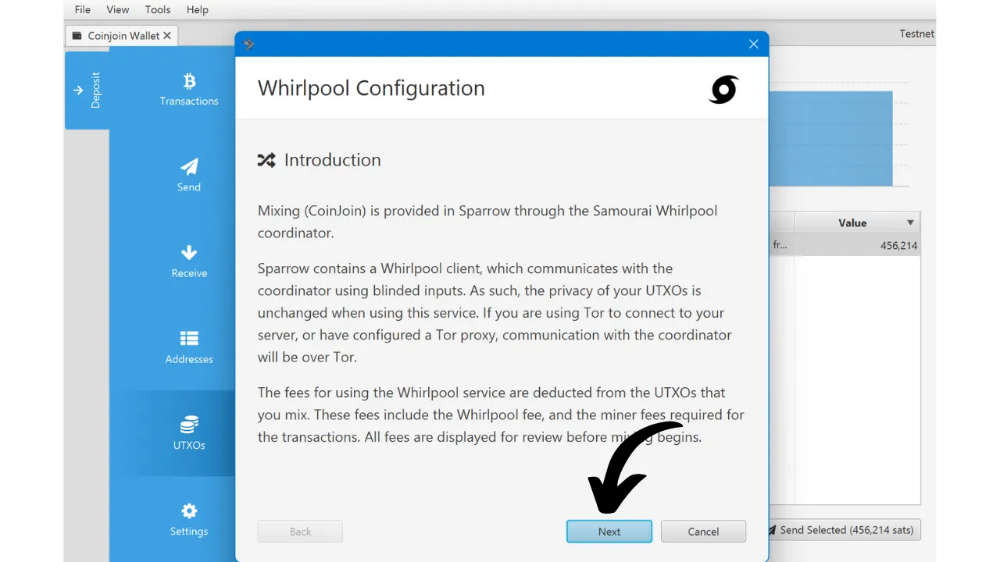

このチュートリアルでは、coinjoinが何であるか、およびSparrow WalletソフトウェアとWhirlpool実装を使用してcoinjoinを実行する方法を学びます。

## Bitcoin上のcoinjoinとは何か？
**Coinjoinは、ブロックチェーン上のビットコインの追跡可能性を破る技術です**。これは、同じ名前の特定の構造を持つ協力的なトランザクションに依存しています：coinjoinトランザクション。

Coinjoinsは、外部の観察者によるチェーン分析を複雑にすることで、Bitcoinユーザーのプライバシーを向上させます。その構造は、異なるユーザーからの複数のコインを単一のトランザクションに統合することを可能にし、入力と出力のアドレス間のリンクを決定することを困難にし、痕跡をぼかします。

Coinjoinの原理は、協力的なアプローチに基づいています：ビットコインを混ぜ合わせたいと願う複数のユーザーが、同じトランザクションの入力として同額を預けます。これらの金額は、各ユーザーに等しい価値の出力として再分配されます。トランザクションの終わりには、特定の出力を入力時の既知のユーザーに関連付けることが不可能になります。入力と出力の間に直接的なリンクは存在せず、これによりユーザーとそのUTXO、および各コインの履歴間の関連付けが断ち切られます。


Coinjoinトランザクションの例（私からではありません）： [323df21f0b0756f98336437aa3d2fb87e02b59f1946b714a7b09df04d429dec2](https://mempool.space/en/tx/323df21f0b0756f98336437aa3d2fb87e02b59f1946b714a7b09df04d429dec2)

各ユーザーが常に自分の資金をコントロールできるようにしながらcoinjoinを実行するプロセスは、コーディネーターによるトランザクションの構築から始まり、その後各参加者に伝達されます。各ユーザーは、それが自分に適していることを確認した後にトランザクションに署名します。最終的に、収集されたすべての署名がトランザクションに統合されます。ユーザーやコーディネーターによる、coinjoinトランザクションの出力の変更を通じて資金を横領しようとする試みがある場合、署名は無効となり、トランザクションはノードによって拒否されます。

Coinjoinの実装には、Whirlpool、JoinMarket、Wabisabiなどがあり、それぞれが参加者間の調整を管理し、coinjoinトランザクションの効率を高めることを目指しています。

このチュートリアルでは、Bitcoin上でcoinjoinsを実行するための最も効果的なソリューションと考える**Whirlpool**実装に焦点を当てます。このチュートリアルでは、Sparrow Walletデスクトップソフトウェアでの使用に限定してその使用法を探ります。
## なぜBitcoin上でCoinJoinsを実行するのか？

あらゆるピアツーピア支払いシステムにおける初期の問題の1つは、二重支払いです：悪意のある個人が同じ通貨単位を複数回支払うことを、中央機関による仲裁なしにどのように防ぐか？

サトシ・ナカモトは、Bitcoinプロトコルを通じてこのジレンマに対する解決策を提供しました。これは、任意の中央機関から独立して運用されるピアツーピアの電子支払いシステムです。彼のホワイトペーパーでは、二重支払いの不在を証明する唯一の方法は、支払いシステム内のすべてのトランザクションの可視性を確保することであると強調しています。

各参加者がトランザクションを認識していることを確保するために、それらは公に開示されなければなりません。したがって、Bitcoinの運用は、任意のノードオペレーターが電子署名チェーンの全体および各コインの履歴を検証できるようにする、透明で分散型のインフラストラクチャに依存しています。これは、マイナーによって作成された時点からです。
ビットコインのブロックチェーンが透明で分散された性質を持つことは、ネットワークのユーザーが他の参加者のトランザクションを追跡し分析できることを意味します。その結果、トランザクションレベルでの匿名性は不可能です。しかし、個人識別のレベルでは匿名性が保持されます。伝統的な銀行システムでは各アカウントが個人の身元にリンクされていますが、ビットコインでは、資金は暗号鍵のペアに関連付けられており、ユーザーに暗号識別子の背後にある形式の擬似匿名性を提供します。

したがって、ビットコインにおける機密性は、外部の観察者が特定のUTXOを特定のユーザーと関連付けることに成功した場合に損なわれます。この関連付けが確立されると、そのトランザクションを追跡し、ビットコインの履歴を分析することが可能になります。Coinjoinは、まさにUTXOの追跡可能性を断ち切るために開発された技術であり、トランザクションレベルでビットコインユーザーにある程度の機密性の層を提供します。

## Whirlpoolの仕組みは？

Whirlpoolは、"_ZeroLink_"トランザクションを使用することで他のcoinjoin方法と一線を画します。これにより、すべての入力とすべての出力の間に技術的なリンクが絶対に存在しないことが保証されます。この完璧なミキシングは、各参加者が入力に同一の金額（マイニング手数料を除く）を寄与する構造を通じて達成され、完全に等しい金額の出力を生成します。

入力に関するこの制限的なアプローチは、Whirlpool coinjoinトランザクションに独特の特徴を与えます：入力と出力の間の決定論的なリンクの完全な欠如。言い換えれば、各出力は、トランザクションの他のすべての出力と比較して、任意の参加者に帰属される可能性が等しくなります。
当初、Whirlpool coinjoinにおける参加者の数は5に限定されており、2人の新規参入者と3人のリミキサー（これらの概念については後で説明します）で構成されていました。しかし、2023年に観測されたオンチェーントランザクション手数料の増加により、Samouraiチームはプライバシーを向上させると同時にコストを削減するためにモデルを再考しました。したがって、手数料の市場状況と参加者の数を考慮して、コーディネーターは現在、6、7、または8人の参加者を含むcoinjoinsを組織することができます。これらの強化されたセッションは"_Surge Cycles_"として参照されます。設定に関係なく、Whirlpool coinjoinsには常に2人の新規参入者がいることに注意してください。

したがって、Whirlpoolトランザクションは、入力と出力の数が同一であることが特徴です。これは以下のようになります：
- 5つの入力と5つの出力；

- 6つの入力と6つの出力；

- 7つの入力と7つの出力；

- 8つの入力と8つの出力。

Whirlpoolが提案するモデルは、小規模なcoinjoinトランザクションに基づいています。WasabiやJoinMarketのように、単一サイクルの参加者の量に依存するアノンセットの堅牢性とは異なり、Whirlpoolは複数の小規模サイクルの連鎖に賭けています。

このモデルでは、ユーザーはプールへの初回参加時にのみ手数料を負担し、追加の手数料なしで多数のリミックスに参加できます。新規参入者がリミキサーのためのマイニング手数料を負担します。

コインが参加する追加のcoinjoinと、その過去に遭遇したピアとともに、アノンセットは指数関数的に成長します。目標は、これらの無料のリミックスを利用することで、各ミックスされたコインに関連付けられたアノンセットの密度を強化することです。

Whirlpoolは、次の2つの重要な要件を考慮して設計されました：
- Samourai Walletが主にスマートフォンアプリケーションであることを考慮して、モバイルデバイスでの実装のアクセシビリティ。
リミックスサイクルの速度を上げることで、匿名性セットの顕著な増加を促進します。これらの必須事項は、Samourai Walletの開発者がWhirlpoolの設計において選択を導いたもので、サイクルごとの参加者数を制限することにつながりました。参加者が少なすぎると、coinjoinの効果が損なわれ、各サイクルで生成される匿名性セットが大幅に減少してしまいます。一方、参加者が多すぎると、モバイルアプリケーション上での管理問題が生じ、サイクルの流れを妨げることになります。

**結局のところ、Whirlpoolでのcoinjoinに多数の参加者を必要とすることはありません。なぜなら、匿名性セットは複数のcoinjoinサイクルの積み重ねによって作られるからです。**
[-> Whirlpoolの匿名性セットについてもっと学ぶ。](https://planb.network/tutorials/privacy/wst-anonsets)
### Coinjoinプールと手数料
複数のサイクルが混合されたコインの匿名性セットを効果的に増加させるためには、使用されるUTXOsの量を制限する特定の枠組みを設ける必要があります。Whirlpoolはこの目的のために異なるプールを定義しています。

プールとは、一緒に混合したいと願うユーザーのグループで、coinjoinプロセスを最適化するために使用するUTXOsの量について合意します。各プールはUTXOの固定額を指定し、参加者はその額を守る必要があります。したがって、Whirlpoolでcoinjoinを実行するには、プールを選択する必要があります。現在利用可能なプールは以下の通りです：
- 0.5ビットコイン；
- 0.05ビットコイン；
- 0.01ビットコイン；
- 0.001ビットコイン（= 100,000 sats）。

ビットコインをプールに参加させると、他の参加者のプール内のUTXOsと完全に均一なUTXOsが生成されます。各プールには最大限度があり、この限度を超える金額の場合、同じプール内で2つの別々のエントリーを行うか、より高額の別のプールに移動する必要があります：

| プール (ビットコイン) | エントリーごとの最大額 (ビットコイン) |
|----------------|------------------------------------|
| 0.5            | 35                                 |
| 0.05           | 3.5                                |
| 0.01           | 0.7                                |
| 0.001          | 0.025                              |

前述のように、UTXOはcoinjoinに統合される準備ができたときにプールに属しているとみなされます。しかし、これはユーザーがそれを所有していないことを意味するわけではありません。**様々な混合サイクルを通じて、あなたは鍵とそれによってビットコインを完全にコントロールします。**これがcoinjoin技術が他の中央集権的な混合技術と異なる点です。

coinjoinプールに入るためには、サービス手数料とマイニング手数料を支払う必要があります。サービス手数料は各プールごとに固定されており、Whirlpoolの開発と維持を担当するチームへの補償を目的としています。Sparrow Walletユーザーの場合、これらの手数料はSamouraiチームによってSparrowの開発者に渡されます。

Whirlpoolを使用するためのサービス手数料は、プールに入る際に一度支払われます。このステップが完了すると、追加の手数料なしで無制限のリミックスに参加する機会が得られます。現在の各プールの固定手数料は以下の通りです：

| プール (ビットコイン) | エントリー手数料 (ビットコイン)           |
|----------------|-------------------------------|
| 0.5            | 0.0175                        |
| 0.05           | 0.00175                       |
| 0.01           | 0.0005 (50,000 sats)          |
| 0.001          | 0.00005 (5,000 sats)          |
これらの手数料は、coinjoinに投入する金額に関係なく、選択したプールへの入場券として機能します。したがって、0.01 BTCで0.01プールに参加する場合でも、0.5 BTCで入場する場合でも、手数料は絶対値で同じままです。
coinjoinを進める前に、ユーザーは2つの戦略から選択することができます：
- サービス手数料を最小限に抑えるために小さなプールを選択するが、その結果、複数の小さなUTXOを受け取ることになる；
- または、より大きなプールを選好し、より少ない数の大きな価値のUTXOを得るために高い手数料を支払うことに同意する。

coinjoinサイクルの後で複数の混合されたUTXOを統合することは一般的には勧められていません。これは、特にCommon-Input-Ownership Heuristic（CIOH）によって、獲得した機密性が損なわれる可能性があるためです。したがって、多くの小さな価値のUTXOを出力として持つことを避けるために、より多くを支払うことを意味しても、より大きなプールを選択することが賢明かもしれません。ユーザーはこれらのトレードオフを考慮して、好みのプールを選択する必要があります。

サービス手数料に加えて、任意のBitcoin取引に固有のマイニング手数料も考慮する必要があります。Whirlpoolユーザーとして、準備トランザクション（`Tx0`）および最初のcoinjoinのためのマイニング手数料を支払う必要があります。その後のすべてのリミックスは、新規参入者の支払いに依存するWhirlpoolのモデルのおかげで無料です。

実際、Whirlpoolのcoinjoinでは、入力の中の2ユーザーが新規参入者です。他の入力はリミキサーから来ます。その結果、トランザクションのすべての参加者のマイニング手数料は、これら2人の新参加者によってカバーされ、彼らも無料のリミックスの恩恵を受けることになります：

この手数料システムのおかげで、Whirlpoolはユーザーが支払った価格にUTXOのanonsetsが比例しないという点で、他のcoinjoinサービスとは明確に異なります。したがって、プールの入場料と2つのトランザクション（`Tx0`と初期ミックス）のマイニング手数料のみを支払うことで、かなり高いレベルの匿名性を実現することが可能です。

重要なのは、ユーザーが複数のcoinjoinを完了した後、プールからUTXOを引き出すためのマイニング手数料もカバーする必要があることです。ただし、後で説明する`mix to`オプションを選択した場合はこの限りではありません。

### Whirlpoolによって使用されるHDウォレットアカウント
Whirlpoolを介してcoinjoinを実行するために、ウォレットは複数の異なるアカウントを生成する必要があります。HD（Hierarchical Deterministic）ウォレットのコンテキストにおけるアカウントは、ウォレットの階層の第3深度レベル、つまり`xpub`のレベルで発生する他のセクションと完全に分離されたセクションを構成します。
HDウォレットは理論的に最大`2^(32/2)`異なるアカウントを導出することができます。デフォルトですべてのBitcoinウォレットで使用される初期アカウントは、インデックス`0'`に対応します。

Whirlpoolに適応したウォレット、例えばSamouraiやSparrowでは、coinjoinプロセスのニーズを満たすために4つのアカウントが使用されます：
- **預金**アカウント、インデックス`0'`によって識別されます；
- **バッドバンク**（またはdoxxic change）アカウント、インデックス`2 147 483 644'`によって識別されます；
- **プレミックス**アカウント、インデックス`2 147 483 645'`によって識別されます；
- **ポストミックス**アカウント、インデックス`2 147 483 646'`によって識別されます。

これらの各アカウントは、coinjoin内で特定の機能を果たします。
これらのアカウントはすべて単一のシードにリンクされており、ユーザーは回復フレーズを使用し、該当する場合はパスフレーズを使用して、すべてのビットコインへのアクセスを回復することができます。ただし、この回復操作中に、使用された異なるアカウントインデックスをソフトウェアに指定する必要があります。
これらのアカウント内でのWhirlpoolコインジョインの異なる段階を見てみましょう。

### Whirlpoolでのコインジョインの異なる段階
**ステージ1: Tx0**
どのWhirlpoolコインジョインの出発点も、**デポジット**アカウントです。このアカウントは、新しいBitcoinウォレットを作成するときに自動的に使用されるものです。このアカウントには、ミックスしたいビットコインを入金する必要があります。

`Tx0`はWhirlpoolミキシングプロセスの最初の段階を表します。これは、コインジョインのためにUTXOを選択されたプールの金額に対応する単位に分割して準備し、均一化することを目的としています。これにより、ミキシングの均一性が保証されます。均一化されたUTXOはその後、**プレミックス**アカウントに送られます。プールに入れない差額は、特定のアカウント：**バッドバンク**（または「doxxic change」）に分けられます。

この初期トランザクション`Tx0`は、ミックスコーディネーターに支払うサービス料金を決済するためにも使用されます。次の段階とは異なり、このトランザクションは協力的ではないため、ユーザーは全てのマイニング料金を負担する必要があります：

この`Tx0`トランザクションの例では、**デポジット**アカウントからの`372,000 sats`の入力がいくつかの送信UTXOに分割され、以下のように配布されます：
- コーディネーターへのサービス料金として`5,000 sats`、これは`100,000 sats`のプールへのエントリーに対応します；
- ミキシングのために準備され、コーディネーターに登録された3つのUTXOは、将来の最初のミックスのマイニング料金をカバーするために、それぞれ`108,000 sats`で均一化され、**プレミックス**アカウントにリダイレクトされます；
- プールに入れないほど小さすぎる余剰分は、有害な変更とみなされます。これは、その特定のアカウントに送られます。ここでは、この変更は`40,000 sats`になります；
- 最後に、出力を構成しないが、`Tx0`の確認に必要なマイニング料金として`3,000 sats`があります。

例えば、こちらが実際のTx0 Whirlpoolです（私からのものではありません）：[edef60744f539483d868caff49d4848e5cc6e805d6cdc8d0f9bdbbaedcb5fc46](https://mempool.space/en/tx/edef60744f539483d868caff49d4848e5cc6e805d6cdc8d0f9bdbbaedcb5fc46)

**ステップ2: 有害な変更**
プールに統合できなかった余剰分、ここでは`40,000 sats`に相当するものは、**バッドバンク**アカウントにリダイレクトされます。これは「有害な変更」とも呼ばれ、ウォレット内の他のUTXOから厳格に分離することを目的としています。

このUTXOは、過去に常に付随し、したがって所有者の身元に可能性があるだけでなく、コインジョインを実行したユーザーに属していると記録されているため、ユーザーのプライバシーにとって危険です。
このUTXOが混合されたアウトプットと統合される場合、後者はコインジョインサイクル中に得られたすべてのプライバシーを失います。これは特にCIOH（*Common-Input-Ownership-Heuristic*）のためです。他の有害な変更と統合される場合、ユーザーは異なるコインジョインサイクルのエントリーがリンクされるため、プライバシーを失うリスクがあります。したがって、慎重に扱う必要があります。この有害なUTXOの管理方法は、この記事の最後の部分で詳しく説明され、将来のチュートリアルではこれらの方法についてPlanBネットワークでさらに深く掘り下げます。
**ステップ3：初期ミックス**
`Tx0`の完了後、均等化されたUTXOは私たちのウォレットの**プレミックス**アカウントに送られ、最初のコインジョインサイクル、いわゆる"初期ミックス"に導入される準備が整います。例えば、`Tx0`がミキシング用の複数のUTXOを生成する場合、それぞれが別々の初期コインジョインに統合されます。
これらの初期ミックスの終了時には、**プレミックス**アカウントは空になり、私たちのコインは、この最初のコインジョインのマイニング手数料を支払った後、選択したプールによって定義された金額に正確に調整されます。例えば、私たちの初期UTXOの`108 000 sats`は正確に`100 000 sats`に減少します。

**ステップ4：リミックス**
初期ミックスの後、UTXOは**ポストミックス**アカウントに転送されます。このアカウントは、既にミックスされたUTXOとリミックス待ちのUTXOを集めます。Whirlpoolクライアントがアクティブな場合、**ポストミックス**アカウントにあるUTXOは自動的にリミックスに利用可能となり、これらの新しいサイクルにランダムに選ばれます。

リマインダーとして、リミックスはその後100%無料です：追加のサービス手数料やマイニング手数料は必要ありません。**ポストミックス**アカウントにUTXOを保持することで、その価値をそのまま維持し、同時にその匿名性を向上させます。そのため、これらのコインを複数のコインジョインサイクルに参加させることが重要です。これによるコストは一切かかりませんし、匿名性のレベルを高めます。

ミックスされたUTXOを使うことにした場合、この**ポストミックス**アカウントから直接行うことができます。無料のリミックスを利用し、Whirlpoolサーキットを離れることでプライバシーが低下するのを防ぐために、ミックスされたUTXOをこのアカウントに保持することが推奨されます。

次のチュートリアルで見るように、`mix to`オプションもあり、これはミックスされたコインを定義された数のコインジョイン後に別のウォレット、例えばコールドウォレットに自動的に送る可能性を提供します。

理論を説明した後、Sparrow Walletデスクトップソフトウェアを介してWhirlpoolを使用するチュートリアルで実践に移りましょう！

## チュートリアル：Sparrow WalletでのCoinjoin Whirlpool
Whirlpoolを使用するには多くのオプションがあります。最初に紹介したいのは、PC用のオープンソースBitcoinウォレット管理ソフトウェアであるSparrow Walletオプションです。
Sparrowを使用する利点は、始めやすく、設定が迅速で、コンピュータとインターネット接続以外に特別な機器を必要としないことです。ただし、顕著な欠点があります：coinjoinsはSparrowが起動して接続されているときにのみ発生します。つまり、ビットコインを24/7でミックスおよびリミックスしたい場合は、コンピュータを常にオンにしておく必要があります。

### Sparrow Walletのインストール
まず、Sparrow Walletソフトウェアが必要になります。[公式ウェブサイト](https://sparrowwallet.com/download/)または[GitHub](https://github.com/sparrowwallet/sparrow/releases)から直接ダウンロードできます。
ソフトウェアをインストールする前に、ダウンロードした実行ファイルの署名と完全性を確認することが重要です。Sparrowソフトウェアのインストールプロセスと検証の詳細については、この他のチュートリアルを読むことをお勧めします：*[The Sparrow Wallet Guides](https://planb.network/tutorials/wallet/sparrow)*。

### ソフトウェアウォレットの作成
ソフトウェアをインストールした後、Bitcoinウォレットの作成を進める必要があります。coinjoinに参加するためには、ソフトウェアウォレット（別名「ホットウォレット」）の使用が不可欠であることに注意してください。したがって、**ハードウェアウォレットで保護されたウォレットではcoinjoinを実行することはできません**。

必須ではありませんが、大量の混合を計画している場合は、このウォレットに強力なBIP39パスフレーズを使用することを強くお勧めします。

新しいウォレットを作成するには、Sparrowを開き、`File`タブをクリックして`New Wallet`を選択します。


例えば「Coinjoin Wallet」という名前をこのウォレットに付け、`Create Wallet`ボタンをクリックします。


デフォルト設定のままにして、`New or Imported Software Wallet`ボタンをクリックします。


ウォレット作成ウィンドウにアクセスしたら、12語のシーケンスを選択することをお勧めします。これは十分です。`Generate New`を選択して新しいリカバリーフレーズを生成し、BIP39パスフレーズを追加したい場合は`Use Passphrase`をクリックします。ビットコインのセキュリティを確保するために、リカバリー情報の物理的なバックアップ（紙や金属サポート上）を作成することが重要です。


リカバリーフレーズのバックアップの有効性を確認した後、`Confirm Backup...`をクリックします。Sparrowは、フレーズをメモしたことを確認するために、もう一度入力するように求めます。このステップが完了したら、`Create Keystore`をクリックして続行します。


提案された導出パスをデフォルトのままにして、`Import Keystore`を押します。このチュートリアルではTestnetを使用しているため、私の例では導出パスが若干異なります。あなたに表示されるべき導出パスは以下の通りです：
```bash
m/84'/0'/0'
```


その後、Sparrowは新しいウォレットの導出詳細を表示します。パスフレーズを設定した場合、`Master fingerprint`をメモすることを強くお勧めします。このマスターキーのフィンガープリントは機密データではありませんが、正しいウォレットにアクセスしていることを後で確認し、パスフレーズ入力時のエラーの有無を確認するのに役立ちます。

`Apply`ボタンをクリックします。


Sparrowはウォレットにパスワードを設定するように求めます。このパスワードはSparrow Walletソフトウェアを介してアクセスする際に必要になります。強力なパスワードを選び、バックアップを取った後、`Set Password`をクリックします。


### ビットコインの受け取り
ウォレットを作成した後、最初に単一のアカウントを持つことになり、そのインデックスは`0'`です。これは、前の部分で話した**預金**アカウントです。これは、ビットコインをミックスするために送る必要があるアカウントです。
これを行うには、ウィンドウの左側にある`Receive`タブを選択します。Sparrowは自動的に新しい空白のアドレスをビットコインを受け取るために生成します。


このアドレスにラベルを入力し、次にミックスするビットコインをそれに送ります。


### Tx0の作成
トランザクションが確認されたら、`UTXOs`タブに移動できます。


次に、コインジョインサイクルに提出したいUTXOを選択します。複数のUTXOを同時に選択するには、選択したいUTXOをクリックしながら`Ctrl`キーを押し続けます。


次に、ウィンドウの下部にある`Mix Selected`ボタンをクリックします。このボタンがインターフェースに表示されない場合は、ハードウェアウォレットで保護されたウォレットを使用しているためです。Sparrowでコインジョインを実行するには、ソフトウェアウォレットを使用する必要があります。

Whirlpoolの仕組みを説明するウィンドウが開きます。これは、前の部分で説明した内容の簡略化です。`Next`をクリックして進んでください。



次のページでは、「SCODE」を持っている場合は入力できます。SCODEは、プールのサービス料金に割引を提供するプロモーションコードです。Samourai Walletは、特別なイベント中にそのようなコードをユーザーに時々提供します。将来のSCODEを見逃さないように、[Samourai Walletをソーシャルメディアでフォローする](https://twitter.com/SamouraiWallet)ことをお勧めします。

同じページで、`Tx0`と最初のミックスのための手数料率も設定する必要があります。この選択は、準備トランザクションと最初のコインジョインの確認速度に影響します。`Tx0`と最初のミックスのマイニング手数料はあなたが負担することになりますが、その後のリミックスにはマイニング手数料を支払う必要はありません。`Premix Priority`スライダーを好みに応じて調整し、`Next`をクリックしてください。


この新しいウィンドウでは、ドロップダウンリストを使用して入りたいプールを選択するオプションがあります。私の場合、最初に選択したUTXOが`456 214 sats`であるため、唯一の可能な選択肢は`100 000 sats`のプールです。このインターフェースはまた、支払うべきサービス料金とプールに統合されるUTXOの数についても情報を提供します。条件が満足であれば、`Preview Premix`をクリックして続行します。


このステップの後、Sparrowはソフトウェアで作成した際に設定したウォレットのパスワードの入力を求めます。パスワードを入力すると、`Tx0`のプレビューにアクセスできます。ウィンドウの左側には、SparrowがWhirlpoolの使用に必要な異なるアカウント（`Deposit`、`Premix`、`Postmix`、および`Badbank`）を生成したことが表示されます。また、`Tx0`の構造と、異なる出力を見る機会もあります：
- サービス料金；
- プールに入ることを意図した均等化されたUTXO
- 有害な変更（Doxxic Change）


トランザクションがご希望の通りであれば、`Broadcast Transaction`をクリックして`Tx0`をブロードキャストしてください。そうでない場合は、`Clear`を選択して入力されたデータを消去し、作成プロセスを最初からやり直すオプションがあります。

### コインジョインの実行
Tx0がブロードキャストされると、`Premix`アカウントでミックスの準備ができたUTXOを見つけることができます。


`Tx0`が確認されると、UTXOはコーディネーターに登録され、初期のミックスが自動的に連続して開始されます。


`Postmix`アカウントをチェックすると、初期ミックスから得られたUTXOを観察できます。これらのコインは、追加料金なしで後続のリミックスの準備ができています。


`Mixes`列では、各コインによって実行されたコインジョインの数を確認できます。次のセクションで見るように、真に重要なのはリミックスの数そのものではなく、関連する匿名セットですが、これら二つの指標は部分的に関連しています。


コインジョインを一時的に停止するには、単に`Stop Mixing`をクリックします。いつでも操作を再開するオプションがあり、`Start Mixing`を選択します。


UTXOをリミックスのために継続的に利用可能に保つためには、Sparrowソフトウェアをアクティブに保つ必要があります。ソフトウェアを閉じるか、コンピューターをオフにすると、コインジョインは一時停止します。この問題を回避する解決策は、オペレーティングシステムの設定を通じてスリープ機能を無効にすることです。さらに、Sparrowはコンピューターが自動的にスリープ状態になるのを防ぐオプションを提供しており、`Tools`タブの`Prevent Computer Sleep`の下で見つけることができます。


### コインジョインの完了
ミックスされたビットコインを使うには、いくつかのオプションがあります。最も直接的な方法は、`Postmix`アカウントにアクセスし、`Send`タブを選択することです。


このセクションでは、Sparrow Walletで行う他のトランザクションと同じように、送信先アドレス、送信額、トランザクション手数料を入力するオプションがあります。ご希望であれば、`Privacy`ボタンをクリックしてStonewallなどの高度なプライバシー機能を利用することもできます。


[-> Stonewallトランザクションについてもっと学ぶ。](https://planb.network/tutorials/privacy/stonewall)

特定のコインを使って支払いを行いたい場合は、`UTXOs`タブに移動します。消費したいUTXOを選択し、`Send Selected`ボタンを押してトランザクションを開始します。


最後に、Sparrowで利用可能な`Mix to...`オプションは、追加料金を発生させることなく、選択したUTXOをコインジョインサイクルから自動的に除外することを可能にします。この機能により、UTXOが`Postmix`アカウントに再統合されないリミックスの回数を決定でき、代わりに別のウォレットに直接転送されます。このオプションは、混合されたビットコインを自動的にコールドウォレットに送信するためによく使用されます。このオプションを使用するには、まずSparrowソフトウェア内でコインジョインウォレットと受取人ウォレットを並べて開きます。


次に、`UTXOs`タブに移動し、興味のあるコインを選択してから、ウィンドウの下部にある`Mix to...`ボタンをクリックします。


ウィンドウが開いたら、ドロップダウンリストから送信先ウォレットを選択します。


引き出しが自動的に行われるコインジョインの閾値を選択します。個人の状況やプライバシーの目標によって異なるため、リミックスを行う正確な回数をお伝えすることはできませんが、閾値を低すぎる値に設定することは避けてください。リミックスプロセスについてもっと学ぶために、この他の記事を参照することをお勧めします：[REMIX - WHIRLPOOL](https://planb.network/tutorials/privacy/remix-whirlpool)。

`Index range`オプションは、デフォルト値の`Full`のままにしておいてください。この機能により、異なるクライアントから同時にミキシングすることが可能になりますが、これはこのチュートリアルで行いたいことではありません。`Mix to...`オプションを最終化して有効にするには、`Restart Whirlpool`を押します。


しかし、`Mix to`オプションを使用する際には注意が必要です。`Postmix`アカウントから混合コインを取り除くことは、プライバシーを著しく損なうリスクを大幅に高める可能性があります。この可能性の理由は、以下のセクションで詳しく説明されています。

## コインジョインサイクルの品質をどのように知るか？
コインジョインが真に効果的であるためには、入力と出力の金額の間に良好な均一性があることが不可欠です。この一様性は、外部の観察者の目における可能な解釈の数を増幅させ、取引を巡る不確実性を高めます。コインジョインによって生成されるこの不確実性を定量化するためには、取引のエントロピーを計算することができます。これらの指標の詳細な探求については、チュートリアル：[BOLTZMANN CALCULATOR](https://planb.network/en/tutorials/privacy/boltzmann-entropy)を参照してください。Whirlpoolモデルは、コインジョインにおいて最も均一性をもたらすと認識されています。
次に、いくつかのコインジョインサイクルのパフォーマンスは、コインが隠されるグループのサイズに基づいて評価されます。これらのグループのサイズは、アノンセットと呼ばれるものを定義します。アノンセットには2種類あります：一つ目は、遡及分析（現在から過去へ）に対するプライバシーの獲得を評価し、二つ目は、展望分析（過去から現在へ）に対するものです。これら二つの指標の詳細な説明については、チュートリアル：[WHIRLPOOL STATS TOOLS - ANONSETS](https://planb.network/tutorials/privacy/wst-anonsets)を参照してください。

## ポストミックスをどのように管理するか？
コインジョインサイクルを実行した後、最良の戦略は、UTXOを**postmix**アカウントに保持し、将来使用するまで待つことです。それらを使う必要が生じるまで、無期限にリミックスさせておくことさえ推奨されます。
一部のユーザーは、ミックスされたビットコインをハードウェアウォレットによって保護されたウォレットに移すことを検討するかもしれません。これは可能ですが、取得した機密性を損なわないように、Samourai Walletの推奨事項に細心の注意を払って従うことが重要です。
UTXOの統合は最も頻繁に行われる間違いです。CIOH（*Common-Input-Ownership-Heuristic*）を避けるために、ミックスされたUTXOをミックスされていないUTXOと同じトランザクションで組み合わせないようにする必要があります。これには、特にラベリングの面で、ウォレット内のUTXOを慎重に管理することが求められます。コインジョインを超えて、UTXOを適切に管理しない場合、プライバシーの損失につながることが多いため、一般的に悪い習慣です。

また、ミックスされたUTXOを互いに統合する際にも注意が必要です。ミックスされたUTXOが十分な匿名性を持っている場合、適度な統合は考えられますが、これは必然的にコインの機密性を低下させます。統合は大きすぎず、不十分な数のリミックスの後に行われないようにしてください。これは、コインジョインサイクルの前後でUTXO間に推測可能なリンクを確立するリスクがあります。これらの操作について疑問がある場合、最善の方法は、ポストミックスUTXOを統合せず、それらを一つずつハードウェアウォレットに移し、毎回新しい空白のアドレスを生成することです。再び、受け取った各UTXOを適切にラベル付けすることを忘れないでください。
また、ポストミックスUTXOを一般的でないスクリプトを使用するウォレットに移すことはお勧めしません。例えば、`P2WSH`スクリプトを使用するマルチシグウォレットからWhirlpoolに入る場合、元々同じタイプのウォレットを持っている他のユーザーと混ざる可能性はほとんどありません。この同じマルチシグウォレットにポストミックスを引き出すと、ミックスされたビットコインのプライバシーレベルが大幅に低下します。スクリプトを超えて、あなたを騙す可能性のある多くの他のウォレットの指紋があります。
ビットコイントランザクションにおいても、受信アドレスを再利用しないことが重要です。新しいトランザクションは、新しい空白のアドレスで受け取るべきです。

最もシンプルで安全な解決策は、ミックスされたUTXOを**ポストミックス**アカウントにそのまま残し、リミックスを繰り返し、使用する際にのみ触れることです。SamouraiとSparrowウォレットは、これらのチェーン分析関連のリスクに対する追加の保護を提供します。これらの保護は、間違いを犯すのを避けるのに役立ちます。

## ドキシックチェンジの管理方法は？
次に、コインジョインプールに入れなかった変更、ドキシックチェンジの管理に注意が必要です。Whirlpoolの使用から生じるこれらの有毒なUTXOは、コインジョインの使用とあなたとのリンクを確立するため、プライバシーにリスクをもたらします。したがって、それらを他のUTXO、特にミックスされたUTXOと組み合わせないように慎重に扱うことが不可欠です。ここに、それらを使用するために検討すべき異なる戦略があります：
- **より小さいプールでミックスする：** 有毒なUTXOが単独で小さいプールに入るのに十分な大きさである場合、ミックスを検討してください。これはしばしば最良の選択肢です。ただし、複数の有毒なUTXOを統合してプールにアクセスすることは、あなたの異なるエントリーをリンクする可能性があるため、重要です。
- **「非支出可能」としてマークする：** もう一つのアプローチは、それらを使用しないようにし、専用のアカウントで「非支出可能」としてマークし、ただHodlすることです。これにより、誤ってそれらを使うことがないようにします。ビットコインの価値が上がると、有毒なUTXOに適した新しいプールが出現するかもしれません。
- **寄付をする：** Bitcoinや関連ソフトウェアに取り組む開発者への寄付を検討してください。少額でも構いません。BTCを受け付ける団体への寄付も可能です。有害なUTXOの管理が複雑すぎると感じる場合は、寄付をすることでそれらを処分することができます。
- **ギフトカードを購入する：** [Bitrefill](https://www.bitrefill.com/)のようなプラットフォームでは、ビットコインを様々な商店で使用できるギフトカードと交換することができます。これは、関連する価値を失うことなく有害なUTXOを処分する方法となり得ます。
- **Moneroで統合する：** Samourai Walletは現在、BTCとXMR間のアトミックスワップサービスを提供しています。これは、CIOHを介してプライバシーを損なうことなく、Monero上で有害なUTXOを統合し、それからBitcoinに戻すための理想的な方法です。ただし、このオプションはマイニング手数料と流動性制約によるプレミアムのため、コストがかかる可能性があります。
- **Lightning Networkに送る：** これらのUTXOをLightning Networkに転送して、取引手数料を削減することは興味深いオプションかもしれません。しかし、この方法はLightningの使用によって特定の情報が明らかになる可能性があるため、慎重に行うべきです。

これらの異なる技術を実装するための詳細なチュートリアルは、間もなくPlanB Networkで提供される予定です。

**追加リソース：**
- [Sparrow Walletビデオチュートリアル](https://planb.network/tutorials/wallet/sparrow);
- [Samourai Walletビデオチュートリアル](https://planb.network/tutorials/wallet/samourai);
- [Samourai Walletドキュメント - Whirlpool](https://docs.samourai.io/whirlpool/basic-concepts);
- [CoinJoinsに関するTwitterスレッド](https://twitter.com/SamouraiWallet/status/1489220847336308739);
- [CoinJoinsに関するブログポスト](https://www.pandul.fr/post/comprendre-et-utiliser-le-coinjoin-sur-bitcoin).