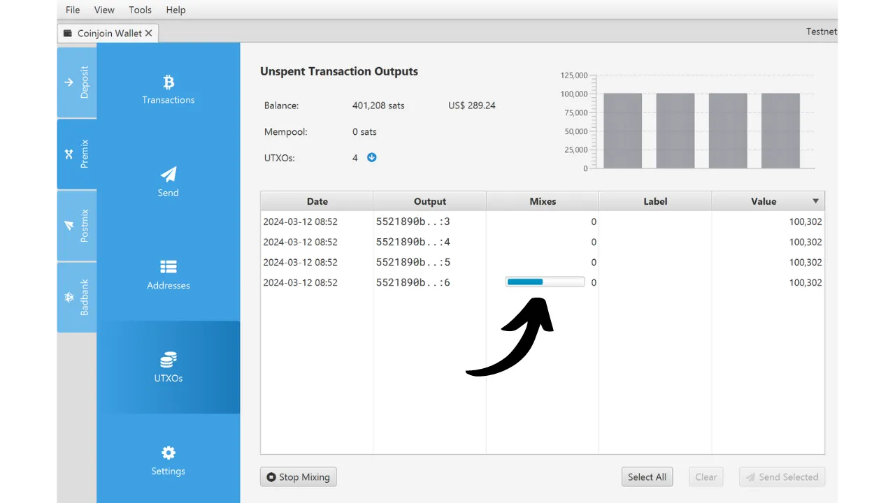
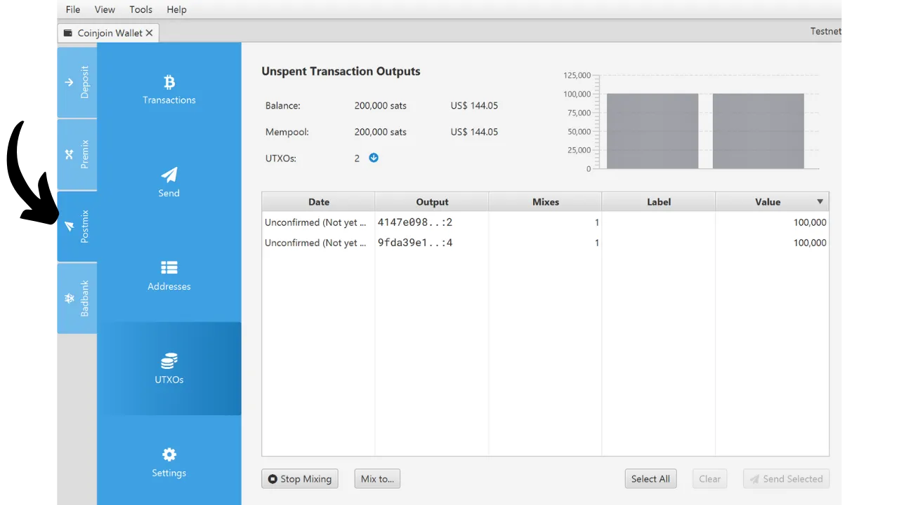
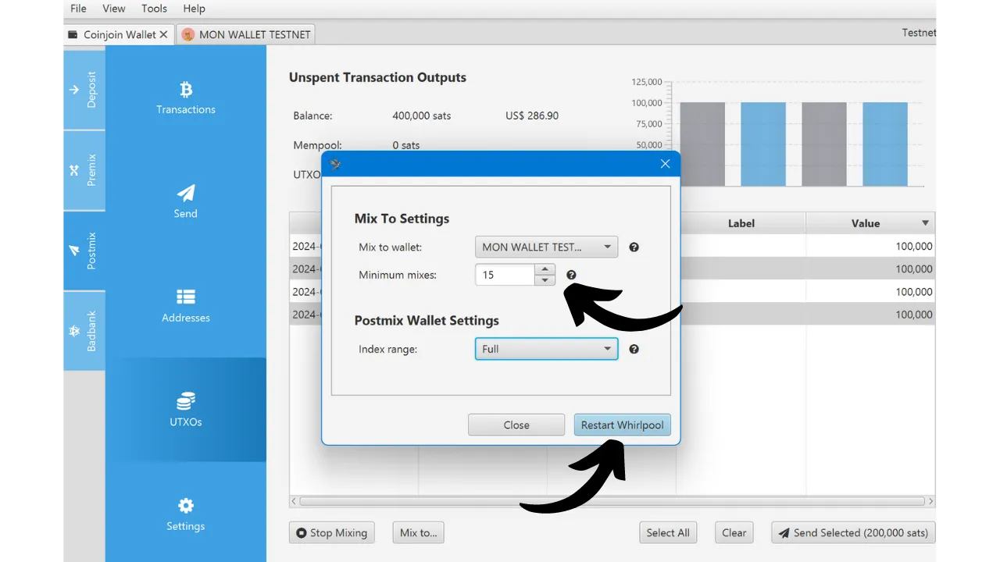

***ATENÇÃO:** Após a prisão dos fundadores da Samourai Wallet e a apreensão dos seus servidores em 24 de abril, a ferramenta Whirlpool não funciona mais, mesmo para pessoas que têm seu próprio Dojo ou usam Sparrow Wallet. No entanto, ainda é possível que essa ferramenta seja reativada nas próximas semanas ou relançada de uma forma diferente. Além disso, a parte teórica deste artigo permanece relevante para entender os princípios e objetivos dos coinjoins em geral (não apenas Whirlpool), bem como a eficácia do modelo Whirlpool.*

_Estamos acompanhando de perto a evolução deste caso, bem como os desenvolvimentos relacionados às ferramentas associadas. Fique assegurado de que atualizaremos este tutorial à medida que novas informações estiverem disponíveis._

_Este tutorial é fornecido apenas para fins educativos e informativos. Não endossamos nem encorajamos o uso dessas ferramentas para fins criminosos. É responsabilidade de cada usuário cumprir as leis em sua jurisdição._

---

Neste tutorial, você aprenderá o que é um coinjoin e como realizar um usando o software Sparrow Wallet e a implementação Whirlpool.

## O que é um coinjoin no Bitcoin?
**Um coinjoin é uma técnica que quebra a rastreabilidade dos bitcoins na blockchain**. Ele se baseia em uma transação colaborativa com uma estrutura específica de mesmo nome: a transação coinjoin.

Coinjoins aumentam a privacidade dos usuários do Bitcoin ao complicar a análise de cadeia para observadores externos. Sua estrutura permite a fusão de múltiplas moedas de diferentes usuários em uma única transação, assim, turvando os rastros e tornando difícil determinar os links entre endereços de entrada e saída.

O princípio do coinjoin é baseado em uma abordagem colaborativa: vários usuários que desejam misturar seus bitcoins depositam quantias idênticas como entradas da mesma transação. Essas quantias são então redistribuídas como saídas de igual valor para cada usuário. Ao final da transação, torna-se impossível associar uma saída específica a um usuário conhecido na entrada. Não existe um link direto entre as entradas e saídas, o que quebra a associação entre os usuários e seus UTXO, bem como o histórico de cada moeda.


Exemplo de uma transação coinjoin (não minha): [323df21f0b0756f98336437aa3d2fb87e02b59f1946b714a7b09df04d429dec2](https://mempool.space/pt/tx/323df21f0b0756f98336437aa3d2fb87e02b59f1946b714a7b09df04d429dec2)

Para realizar um coinjoin garantindo que cada usuário mantenha controle sobre seus fundos o tempo todo, o processo começa com a construção da transação por um coordenador, que então a transmite a cada participante. Cada usuário então assina a transação após verificar que ela lhes convém. Todas as assinaturas coletadas são finalmente integradas à transação. Se uma tentativa de desviar fundos for feita por um usuário ou pelo coordenador, por meio de uma modificação nas saídas da transação coinjoin, as assinaturas se provarão inválidas, levando à rejeição da transação pelos nós.

Existem várias implementações de coinjoin, como Whirlpool, JoinMarket ou Wabisabi, cada uma visando gerenciar a coordenação entre os participantes e aumentar a eficiência das transações coinjoin.

Neste tutorial, focamos na implementação **Whirlpool**, que considero ser a solução mais eficaz para realizar coinjoins no Bitcoin. Embora disponível em várias carteiras, este tutorial explora exclusivamente seu uso com o software Sparrow Wallet Desktop.
## Por que realizar CoinJoins no Bitcoin?

Um dos problemas iniciais com qualquer sistema de pagamento peer-to-peer é o double-spending: como prevenir que indivíduos mal-intencionados gastem as mesmas unidades monetárias múltiplas vezes sem recorrer a uma autoridade central para arbitragem?

Satoshi Nakamoto forneceu uma solução para esse dilema por meio do protocolo Bitcoin, um sistema de pagamento eletrônico peer-to-peer que opera independentemente de qualquer autoridade central. Em seu white paper, ele enfatiza que a única maneira de certificar a ausência de double-spending é garantir a visibilidade de todas as transações dentro do sistema de pagamento.

Para garantir que cada participante esteja ciente das transações, elas devem ser publicamente divulgadas. Assim, a operação do Bitcoin se baseia em uma infraestrutura transparente e distribuída, permitindo que qualquer operador de nó verifique a totalidade das cadeias de assinaturas eletrônicas e o histórico de cada moeda, desde sua criação por um minerador.
A natureza transparente e distribuída do blockchain do Bitcoin significa que qualquer usuário da rede pode seguir e analisar as transações de todos os outros participantes. Consequentemente, a anonimidade no nível da transação é impossível. No entanto, a anonimidade é preservada no nível da identificação individual. Ao contrário do sistema bancário tradicional, onde cada conta está vinculada a uma identidade pessoal, no Bitcoin, os fundos estão associados a pares de chaves criptográficas, oferecendo assim aos usuários uma forma de pseudonimato por trás de identificadores criptográficos.
Portanto, a confidencialidade no Bitcoin é comprometida quando observadores externos conseguem associar UTXOs específicos a usuários identificados. Uma vez estabelecida essa associação, torna-se possível rastrear suas transações e analisar o histórico de seus bitcoins. Coinjoin é precisamente uma técnica desenvolvida para quebrar a rastreabilidade dos UTXOs, oferecendo assim uma certa camada de confidencialidade aos usuários do Bitcoin no nível da transação.

## Como o Whirlpool Funciona?

Whirlpool se destaca de outros métodos de coinjoin ao usar transações "_ZeroLink_", que garantem que não há absolutamente nenhum vínculo técnico possível entre todas as entradas e todas as saídas. Essa mistura perfeita é alcançada por meio de uma estrutura onde cada participante contribui com uma quantidade idêntica na entrada (exceto pelas taxas de mineração), gerando assim saídas de quantidades perfeitamente iguais.

Essa abordagem restritiva nas entradas dá às transações de coinjoin do Whirlpool uma característica única: a total ausência de links determinísticos entre as entradas e as saídas. Em outras palavras, cada saída tem uma probabilidade igual de ser atribuída a qualquer participante, comparada a todas as outras saídas da transação.
Inicialmente, o número de participantes em cada coinjoin do Whirlpool era limitado a 5, com 2 novos entrantes e 3 remixers (explicaremos esses conceitos mais adiante). No entanto, o aumento das taxas de transação on-chain observado em 2023 levou as equipes da Samourai a repensar seu modelo para melhorar a privacidade enquanto reduz os custos. Assim, levando em conta a situação do mercado de taxas e o número de participantes, o coordenador pode agora organizar coinjoins incluindo 6, 7 ou 8 participantes. Essas sessões aprimoradas são referidas como "_Surge Cycles_". É importante notar que, independentemente da configuração, sempre há apenas 2 novos entrantes nos coinjoins do Whirlpool.

Portanto, as transações do Whirlpool são caracterizadas por um número idêntico de entradas e saídas, que podem ser:
- 5 entradas e 5 saídas;

- 6 entradas e 6 saídas;

- 7 entradas e 7 saídas;

- 8 entradas e 8 saídas.

O modelo proposto pelo Whirlpool é baseado, portanto, em pequenas transações de coinjoin. Ao contrário de Wasabi e JoinMarket, onde a robustez dos anonsets depende do volume de participantes em um único ciclo, Whirlpool aposta na cadeia de vários ciclos de pequeno porte.

Neste modelo, o usuário incorre em taxas apenas na sua entrada inicial em uma pool, permitindo-lhes participar de uma multitude de remixes sem taxas adicionais. São os novos entrantes que suportam as taxas de mineração para os remixers.

Com cada coinjoin adicional no qual uma moeda participa, juntamente com seus pares encontrados anteriormente, os anonsets crescerão exponencialmente. O objetivo é, portanto, tirar vantagem desses remixes gratuitos que, a cada ocorrência, contribuem para fortalecer a densidade dos anonsets associados a cada moeda misturada.

Whirlpool foi projetado levando em conta dois requisitos importantes:
- A acessibilidade de implementação em dispositivos móveis, dado que a Samourai Wallet é principalmente um aplicativo para smartphone;
- A velocidade dos ciclos de remixagem para promover um aumento significativo nos anonsets.
Esses imperativos guiaram as escolhas dos desenvolvedores da Samourai Wallet no design do Whirlpool, levando-os a limitar o número de participantes por ciclo. Poucos participantes comprometeriam a eficácia do coinjoin, reduzindo drasticamente os anonsets gerados a cada ciclo, enquanto muitos participantes apresentariam problemas de gestão em aplicações móveis e impediriam o fluxo de ciclos.

**Em última análise, não é necessário ter um número alto de participantes por coinjoin no Whirlpool, já que os anonsets são feitos ao longo da acumulação de vários ciclos de coinjoin.**
[-> Saiba mais sobre os anonsets do Whirlpool.](https://planb.network/tutorials/privacy/wst-anonsets)
### Piscinas de Coinjoin e taxas
Para garantir que múltiplos ciclos aumentem efetivamente os anonsets das moedas misturadas, um certo quadro deve ser estabelecido para restringir as quantidades de UTXOs usados. O Whirlpool define diferentes piscinas para este propósito.

Uma piscina representa um grupo de usuários que desejam misturar juntos, que concordam com a quantidade de UTXOs a ser usada para otimizar o processo de coinjoin. Cada piscina especifica uma quantidade fixa para o UTXO, à qual o usuário deve aderir para participar. Assim, para realizar coinjoins com o Whirlpool, você precisa selecionar uma piscina. As piscinas atualmente disponíveis são as seguintes:
- 0,5 bitcoins;
- 0,05 bitcoin;
- 0,01 bitcoin;
- 0,001 bitcoin (= 100.000 sats).

Ao juntar-se a uma piscina com seus bitcoins, eles serão divididos para gerar UTXOs que são perfeitamente homogêneos com os dos outros participantes na piscina. Cada piscina tem um limite máximo; assim, para quantidades que excedam este limite, você será forçado a fazer duas entradas separadas dentro da mesma piscina ou a mudar para outra piscina com uma quantidade maior:

| Piscina (bitcoin) | Quantidade máxima por entrada (bitcoin) |
|-------------------|-----------------------------------------|
| 0,5               | 35                                      |
| 0,05              | 3,5                                     |
| 0,01              | 0,7                                     |
| 0,001             | 0,025                                   |

Como mencionado anteriormente, um UTXO é considerado pertencente a uma piscina quando está pronto para ser integrado em um coinjoin. No entanto, isso não significa que o usuário perde a posse dele. **Através dos vários ciclos de mistura, você mantém o controle total de suas chaves e, consequentemente, de seus bitcoins.** Isso é o que diferencia a técnica de coinjoin de outras técnicas de mistura centralizadas.

Para entrar em uma piscina de coinjoin, taxas de serviço, bem como taxas de mineração, devem ser pagas. As taxas de serviço são fixas para cada piscina e destinam-se a compensar as equipes responsáveis pelo desenvolvimento e manutenção do Whirlpool. Para os usuários da Sparrow Wallet, essas taxas são repassadas pelas equipes da Samourai para os desenvolvedores da Sparrow.

As taxas de serviço para usar o Whirlpool devem ser pagas uma vez ao entrar na piscina. Uma vez concluída esta etapa, você tem a oportunidade de participar de um número ilimitado de remixagens sem taxas adicionais. Aqui estão as taxas fixas atuais para cada piscina:

| Piscina (bitcoin) | Taxa de entrada (bitcoin)     |
|-------------------|-------------------------------|
| 0,5               | 0,0175                        |
| 0,05              | 0,00175                       |
| 0,01              | 0,0005 (50.000 sats)          |
| 0,001             | 0,00005 (5.000 sats)          |
Essas taxas funcionam essencialmente como um ingresso de entrada para o pool escolhido, independentemente da quantidade que você colocar em coinjoin. Portanto, seja você entrando no pool de 0.01 com exatamente 0.01 BTC ou entrando com 0.5 BTC, as taxas permanecerão as mesmas em valor absoluto.
Antes de prosseguir com coinjoins, o usuário, portanto, tem uma escolha entre 2 estratégias:
- Optar por um pool menor para minimizar as taxas de serviço, sabendo que receberão vários UTXOs pequenos em retorno;
- Ou preferir um pool maior, concordando em pagar taxas mais altas para acabar com um número reduzido de UTXOs de maior valor.

Geralmente é aconselhado contra a fusão de vários UTXOs misturados após os ciclos de coinjoin, pois isso poderia comprometer a confidencialidade adquirida, especialmente devido à Heurística de Propriedade Comum de Entrada (CIOH, na sigla em inglês). Portanto, pode ser sábio escolher um pool maior, mesmo que isso signifique pagar mais, para evitar ter muitos UTXOs de pequeno valor como saída. O usuário deve ponderar esses compromissos para escolher o pool de sua preferência.

Além das taxas de serviço, as taxas de mineração inerentes a qualquer transação Bitcoin também devem ser consideradas. Como usuário do Whirlpool, você será obrigado a pagar as taxas de mineração para a transação de preparação (`Tx0`) assim como aquelas para o primeiro coinjoin. Todos os remixes subsequentes serão gratuitos, graças ao modelo do Whirlpool que depende do pagamento de novos participantes.

De fato, em cada coinjoin do Whirlpool, dois usuários entre as entradas são novos participantes. As outras entradas vêm de remixers. Como resultado, as taxas de mineração para todos os participantes na transação são cobertas por esses dois novos participantes, que então também se beneficiarão de remixes gratuitos:

Graças a este sistema de taxas, o Whirlpool realmente se diferencia de outros serviços de coinjoin, já que os anonsets dos UTXOs não são proporcionais ao preço pago pelo usuário. Assim, é possível alcançar níveis consideravelmente altos de anonimato pagando apenas as taxas de entrada do pool e as taxas de mineração para duas transações (o `Tx0` e a mistura inicial).

É importante notar que o usuário também terá que cobrir as taxas de mineração para retirar seus UTXOs do pool após completar seus múltiplos coinjoins, a menos que tenham selecionado a opção `mix to`, que discutiremos no tutorial abaixo.

### As contas de carteira HD usadas pelo Whirlpool
Para realizar um coinjoin via Whirlpool, a carteira deve gerar várias contas distintas. Uma conta, no contexto de uma carteira HD (Hierarchical Deterministic), constitui uma seção completamente isolada das outras, essa separação ocorrendo no terceiro nível de profundidade da hierarquia da carteira, isto é, no nível do `xpub`.
Uma carteira HD pode teoricamente derivar até `2^(32/2)` contas diferentes. A conta inicial, usada por padrão em todas as carteiras Bitcoin, corresponde ao índice `0'`.

Para carteiras adaptadas ao Whirlpool, como Samourai ou Sparrow, 4 contas são usadas para atender às necessidades do processo de coinjoin:
- A conta **depósito**, identificada pelo índice `0'`;
- A conta **bad bank** (ou mudança tóxica), identificada pelo índice `2 147 483 644'`;
- A conta **premix**, identificada pelo índice `2 147 483 645'`;
- A conta **postmix**, identificada pelo índice `2 147 483 646'`.

Cada uma dessas contas cumpre uma função específica dentro do coinjoin.
Todas essas contas estão vinculadas a uma única semente, o que permite ao usuário recuperar o acesso a todos os seus bitcoins usando sua frase de recuperação e, se aplicável, sua passphrase. No entanto, é necessário especificar ao software, durante essa operação de recuperação, os diferentes índices de conta que foram usados.
Vamos agora olhar para as diferentes etapas de um Whirlpool coinjoin nessas contas.

### As diferentes etapas dos coinjoins no Whirlpool
**Etapa 1: O Tx0**
O ponto de partida de qualquer Whirlpool coinjoin é a conta de **depósito**. Esta conta é a que você usa automaticamente quando cria uma nova carteira Bitcoin. Esta conta deve ser creditada com os bitcoins que você deseja misturar.

O `Tx0` representa a primeira etapa do processo de mistura do Whirlpool. Seu objetivo é preparar e equalizar os UTXOs para o coinjoin, dividindo-os em unidades correspondentes ao valor do pool selecionado, a fim de garantir a homogeneidade da mistura. Os UTXOs equalizados são então enviados para a conta de **premix**. Quanto à diferença que não pode entrar no pool, ela é separada em uma conta específica: o **bad bank** (ou "mudança tóxica").

Esta transação inicial `Tx0` também serve para liquidar as taxas de serviço devidas ao coordenador da mistura. Ao contrário das etapas seguintes, esta transação não é colaborativa; o usuário deve, portanto, assumir as taxas de mineração completas:

Neste exemplo de uma transação `Tx0`, uma entrada de `372.000 sats` da nossa conta de **depósito** é dividida em vários UTXOs de saída, que são distribuídos da seguinte forma:
- Uma quantia de `5.000 sats` destinada ao coordenador para taxas de serviço, correspondendo à entrada no pool de `100.000 sats`;
- Três UTXOs preparados para mistura, redirecionados para nossa conta de **premix** e registrados com o coordenador. Esses UTXOs são equalizados em `108.000 sats` cada, a fim de cobrir as taxas de mineração para sua futura mistura inicial;
- O excedente, que não pode entrar no pool porque é muito pequeno, é considerado mudança tóxica. Ele é enviado para sua conta específica. Aqui, essa mudança soma `40.000 sats`;
- Finalmente, há `3.000 sats` que não constituem uma saída, mas são as taxas de mineração necessárias para confirmar o `Tx0`.

Por exemplo, aqui está um real Tx0 Whirlpool (que não vem de mim): [edef60744f539483d868caff49d4848e5cc6e805d6cdc8d0f9bdbbaedcb5fc46](https://mempool.space/pt/tx/edef60744f539483d868caff49d4848e5cc6e805d6cdc8d0f9bdbbaedcb5fc46)

**Etapa 2: A Mudança Tóxica**
O excedente, não tendo conseguido integrar no pool, aqui equivalente a `40.000 sats`, é redirecionado para a conta do **bad bank**, também referida como "mudança tóxica", para garantir uma separação estrita dos outros UTXOs na carteira.

Este UTXO é perigoso para a privacidade do usuário porque não só está sempre ligado ao seu passado, e portanto possivelmente à identidade de seu proprietário, mas além disso, é notado como pertencente a um usuário que realizou um coinjoin.
Se este UTXO for mesclado com saídas misturadas, estas últimas perderão toda a privacidade obtida durante os ciclos de coinjoin, notavelmente por causa da CIOH (*Common-Input-Ownership-Heuristic*). Se for mesclado com outras mudanças tóxicas, o usuário corre o risco de perder privacidade, já que isso vinculará as diferentes entradas dos ciclos de coinjoin. Portanto, deve ser tratado com cautela. A maneira de gerenciar este UTXO tóxico será detalhada na última parte deste artigo, e tutoriais futuros explorarão mais profundamente esses métodos na Rede PlanB.
**Etapa 3: A Mistura Inicial**
Após a conclusão do `Tx0`, os UTXOs equalizados são enviados para a conta **premix** da nossa carteira, prontos para serem introduzidos em seu primeiro ciclo de coinjoin, também chamado de "mistura inicial". Se, como no nosso exemplo, o `Tx0` gera múltiplos UTXOs destinados à mistura, cada um deles será integrado em um coinjoin inicial separado.
Ao final dessas misturas iniciais, a conta **premix** estará vazia, enquanto nossas moedas, tendo pago as taxas de mineração para este primeiro coinjoin, serão ajustadas exatamente ao montante definido pela pool escolhida. No nosso exemplo, nossos UTXOs iniciais de `108 000 sats` terão sido reduzidos exatamente para `100 000 sats`.

**Etapa 4: Os Remixes**
Após a mistura inicial, os UTXOs são transferidos para a conta **postmix**. Esta conta reúne os UTXOs já misturados e aqueles à espera de remixagem. Quando o cliente Whirlpool está ativo, os UTXOs localizados na conta **postmix** estão automaticamente disponíveis para remixagem e serão escolhidos aleatoriamente para participar desses novos ciclos.

Como lembrete, os remixes são então 100% gratuitos: nenhuma taxa de serviço adicional ou taxas de mineração são necessárias. Manter os UTXOs na conta **postmix** assim mantém seu valor intacto, e ao mesmo tempo melhora seus anonsets. É por isso que é importante permitir que essas moedas participem de múltiplos ciclos de coinjoin. Isso não custa nada e aumenta seus níveis de anonimato.

Quando você decide gastar UTXOs misturados, pode fazê-lo diretamente desta conta **postmix**. É aconselhável manter os UTXOs misturados nesta conta para se beneficiar de remixes gratuitos e para evitar que saiam do circuito Whirlpool, o que poderia diminuir sua privacidade.

Como veremos no tutorial seguinte, existe também a opção `mix to` que oferece a possibilidade de enviar automaticamente suas moedas misturadas para outra carteira, como uma carteira fria, após um número definido de coinjoins.

Após discutir a teoria, vamos mergulhar na prática com um tutorial sobre o uso do Whirlpool via o software de desktop Sparrow Wallet!

## Tutorial: Coinjoin Whirlpool no Sparrow Wallet
Existem várias opções para usar o Whirlpool. A primeira que quero apresentar a você é a opção Sparrow Wallet, um software de gerenciamento de carteira Bitcoin de código aberto para PC.
Usar o Sparrow tem a vantagem de ser bastante fácil de começar, rápido de configurar e não requerer equipamento além de um computador e uma conexão com a internet. No entanto, há uma desvantagem notável: os coinjoins só ocorrerão quando o Sparrow for lançado e conectado. Isso significa que, se você quiser misturar e remixar seus bitcoins 24/7, precisará manter seu computador ligado constantemente.

### Instalar Sparrow Wallet
Para começar, você obviamente precisará do software Sparrow Wallet. Você pode baixá-lo diretamente do [site oficial](https://sparrowwallet.com/download/) ou no [GitHub deles](https://github.com/sparrowwallet/sparrow/releases).
Antes de instalar o software, será importante verificar a assinatura e a integridade do executável que acabou de baixar. Se você deseja mais detalhes sobre o processo de instalação e verificação do software Sparrow, aconselho que leia este outro tutorial: *[The Sparrow Wallet Guides](https://planb.network/tutorials/wallet/sparrow)*.

### Criar uma Carteira de Software
Após instalar o software, você precisará prosseguir com a criação de uma carteira Bitcoin. É importante notar que para participar de coinjoins, o uso de uma carteira de software (também chamada de "hot wallet") é essencial. Portanto, **não será possível realizar coinjoins com uma carteira protegida por uma carteira de hardware**.

Embora não seja imperativo, caso você planeje misturar quantias significativas, é altamente recomendado optar pelo uso de uma forte frase-senha BIP39 para esta carteira.

Para criar uma nova carteira, abra o Sparrow, clique na aba `File` e em `New Wallet`.


Escolha um nome para esta carteira, por exemplo: "Carteira Coinjoin". Clique no botão `Create Wallet`.


Deixe as configurações padrão, em seguida, clique no botão `New or Imported Software Wallet`.


Quando você acessar a janela de criação da carteira, recomendo escolher uma sequência de 12 palavras, pois é amplamente suficiente. Selecione `Generate New` para gerar uma nova frase de recuperação, e clique em `Use Passphrase` se desejar adicionar uma frase-senha BIP39. É importante fazer um backup físico das suas informações de recuperação, seja em papel ou em suporte de metal, para garantir a segurança dos seus bitcoins.


Certifique-se da validade do backup da sua frase de recuperação antes de clicar em `Confirm Backup...`. O Sparrow então pedirá que você insira sua frase novamente para verificar se você a anotou. Uma vez concluída esta etapa, continue clicando em `Create Keystore`.


Deixe o caminho de derivação sugerido como padrão e pressione `Import Keystore`. No meu exemplo, o caminho de derivação difere ligeiramente, pois estou usando o Testnet para este tutorial. O caminho de derivação que deve aparecer para você é o seguinte:
```bash
m/84'/0'/0'
```


Depois disso, o Sparrow exibirá os detalhes de derivação da sua nova carteira. Caso você tenha definido uma frase-senha, é altamente recomendado anotar seu `Master fingerprint`. Embora esta impressão digital da chave mestra não seja um dado sensível, será útil para você verificar mais tarde que está de fato acessando a carteira correta e para confirmar a ausência de erros ao inserir sua frase-senha.

Clique no botão `Apply`.


O Sparrow convida você a criar uma senha para sua carteira. Esta senha será necessária para acessá-la através do software Sparrow Wallet. Escolha uma senha forte, faça um backup dela e, em seguida, clique em `Set Password`.


### Recebendo bitcoins
Após criar sua carteira, você inicialmente terá uma única conta, com o índice `0'`. Esta é a conta de **depósito** sobre a qual falamos nas partes anteriores. Esta é a conta para a qual você precisará enviar os bitcoins para misturar.
Para fazer isso, selecione a aba `Receive` no lado esquerdo da janela. O Sparrow irá automaticamente gerar um novo endereço em branco para receber bitcoins.


Você pode inserir um rótulo para este endereço e, em seguida, enviar os bitcoins a serem misturados para ele.


### Realizando o Tx0
Uma vez que sua transação for confirmada, você pode então ir para a aba `UTXOs`.


Em seguida, escolha o(s) UTXO(s) que deseja submeter aos ciclos de coinjoin. Para selecionar múltiplos UTXOs simultaneamente, mantenha pressionada a tecla `Ctrl` enquanto clica nos UTXOs de sua escolha.


Então clique no botão `Mix Selected` na parte inferior da janela. Se este botão não aparecer na sua interface, é porque você está em uma carteira protegida com uma carteira de hardware. Você precisa usar uma carteira de software para realizar coinjoins com o Sparrow.

Uma janela se abre para explicar como funciona o Whirlpool. Esta é uma simplificação do que expliquei nas partes anteriores. Clique em `Next` para prosseguir.


Na próxima página, você pode inserir um "SCODE" se tiver um. Um SCODE é um código promocional que oferece um desconto nas taxas de serviço do pool. A Samourai Wallet ocasionalmente fornece tais códigos aos seus usuários durante eventos especiais. Aconselho que [siga a Samourai Wallet](https://twitter.com/SamouraiWallet) nas redes sociais para não perder futuros SCODES.

Na mesma página, você também precisará definir a taxa de fee para o `Tx0` e sua mistura inicial. Esta escolha influenciará a velocidade de confirmação para sua transação preparatória e seu primeiro coinjoin. Lembre-se de que você é responsável pelas taxas de mineração para o `Tx0` e a mistura inicial, mas não deverá taxas de mineração para remixagens subsequentes. Ajuste o controle deslizante `Premix Priority` de acordo com suas preferências e clique em `Next`.


Nesta nova janela, você terá a opção de selecionar o pool que deseja entrar usando a lista suspensa. No meu caso, tendo inicialmente selecionado um UTXO de `456 214 sats`, minha única escolha possível é o pool de `100 000 sats`. Esta interface também informa sobre as taxas de serviço a serem pagas, bem como o número de UTXOs que serão integrados ao pool. Se as condições parecerem satisfatórias para você, continue clicando em `Preview Premix`.


Após esta etapa, o Sparrow pedirá que você insira a senha da sua carteira, aquela que você estabeleceu ao criá-la no software. Uma vez inserida a senha, você acessará a pré-visualização do seu `Tx0`. No lado esquerdo da sua janela, você verá que o Sparrow gerou as diferentes contas necessárias para usar o Whirlpool (`Deposit`, `Premix`, `Postmix` e `Badbank`). Você também terá a oportunidade de visualizar a estrutura do seu `Tx0`, com as diferentes saídas:
- As taxas de serviço;
- Os UTXOs equalizados destinados a entrar no pool;
- A mudança tóxica (Doxxic Change).


Se a transação estiver do seu agrado, clique em `Broadcast Transaction` para transmitir o seu `Tx0`. Caso contrário, você tem a opção de ajustar os parâmetros deste `Tx0` selecionando `Clear` para apagar os dados inseridos e começar o processo de criação desde o início.

### Realizando Coinjoins
Uma vez que o Tx0 é transmitido, você encontrará seus UTXOs prontos para serem misturados na conta `Premix`.


Uma vez que o `Tx0` é confirmado, seus UTXOs serão registrados com o coordenador, e as misturas iniciais começarão automaticamente em sucessão.



Ao verificar a conta `Postmix`, você observará os UTXOs resultantes das misturas iniciais. Essas moedas permanecerão prontas para remixagens subsequentes, o que não incorrerá em taxas adicionais.



Na coluna `Mixes`, é possível ver o número de coinjoins realizados por cada uma de suas moedas. Como veremos nas seções seguintes, o que realmente importa não é tanto o número de remixagens por si só, mas sim os conjuntos anônimos associados, embora esses dois indicadores estejam parcialmente relacionados.


Para parar temporariamente os coinjoins, basta clicar em `Stop Mixing`. Você terá a opção de retomar as operações a qualquer momento selecionando `Start Mixing`.


Para garantir a disponibilidade contínua de seus UTXOs para remixagem, é necessário manter o software Sparrow ativo. Fechar o software ou desligar o computador pausará os coinjoins. Uma solução para contornar esse problema é desativar as funções de suspensão por meio das configurações do sistema operacional. Além disso, o Sparrow oferece uma opção para impedir que o computador entre automaticamente em modo de suspensão, que você pode encontrar na aba `Tools` intitulada `Prevent Computer Sleep`.


### Completando os coinjoins
Para gastar seus bitcoins misturados, você tem várias opções. O método mais direto é acessar a conta `Postmix` e selecionar a aba `Send`.


Nesta seção, você terá a opção de inserir o endereço de destino, a quantidade a enviar e as taxas de transação, da mesma forma que para qualquer outra transação feita com a Sparrow Wallet. Se desejar, você também pode aproveitar recursos avançados de privacidade, como o Stonewall, clicando no botão `Privacy`.


[-> Saiba mais sobre transações Stonewall.](https://planb.network/tutorials/privacy/stonewall)

Se desejar fazer uma seleção mais precisa de suas moedas para gastar, vá para a aba `UTXOs`. Selecione os UTXOs que você deseja consumir especificamente, depois pressione o botão `Send Selected` para iniciar a transação.


Finalmente, a opção `Mix to...` disponível no Sparrow permite a remoção automática de um UTXO selecionado dos ciclos de coinjoin, sem incorrer em taxas adicionais. Esta funcionalidade possibilita a determinação de um número de remixagens após o qual o UTXO não será reintegrado na sua conta `Postmix`, mas será, em vez disso, transferido diretamente para outra carteira. Esta opção é frequentemente utilizada para enviar automaticamente bitcoins misturados para uma carteira fria. Para usar esta opção, comece por abrir a carteira destinatária ao lado da sua carteira de coinjoin dentro do software Sparrow.


Em seguida, vá para a aba `UTXOs`, e selecione as moedas que lhe interessam, depois clique no botão `Mix to...` na parte inferior da janela.


Uma janela se abre, comece selecionando a carteira de destino na lista suspensa.


Escolha o limite de coinjoin além do qual o saque será feito automaticamente. Não posso lhe dar um número exato de remixagens a realizar, pois isso varia de acordo com sua situação pessoal e seus objetivos de privacidade, mas evite escolher um limite muito baixo. Recomendo consultar este outro artigo para saber mais sobre o processo de remixagem: [REMIX - WHIRLPOOL](https://planb.network/tutorials/privacy/remix-whirlpool).

Você pode deixar a opção `Index range` em seu valor padrão, `Full`. Esta função permite a mistura simultânea de diferentes clientes, mas não é o que queremos fazer neste tutorial. Para finalizar e ativar a opção `Mix to...`, pressione `Restart Whirlpool`.



No entanto, tenha cautela ao usar a opção `Mix to`, pois remover moedas misturadas da sua conta `Postmix` pode aumentar significativamente o risco de comprometer sua privacidade. As razões para este potencial são detalhadas nas seções seguintes.

## Como saber a qualidade dos nossos ciclos de coinjoin?
Para que um coinjoin seja verdadeiramente eficaz, é essencial que apresente boa homogeneidade entre as quantidades de entradas e saídas. Esta uniformidade amplifica o número de interpretações possíveis aos olhos de um observador externo, aumentando assim a incerteza em torno da transação. Para quantificar esta incerteza gerada por um coinjoin, pode-se recorrer ao cálculo da entropia da transação. Para uma exploração aprofundada desses indicadores, refiro-me ao tutorial: [BOLTZMANN CALCULATOR](https://planb.network/pt/tutorials/privacy/boltzmann-entropy). O modelo Whirlpool é reconhecido como aquele que traz mais homogeneidade nos coinjoins.
Em seguida, o desempenho de vários ciclos de coinjoin é avaliado com base no tamanho dos grupos nos quais uma moeda é ocultada. O tamanho destes grupos define o que se chama de anonsets. Existem dois tipos de anonsets: o primeiro avalia a privacidade ganha contra análise retrospectiva (do presente para o passado) e o segundo, contra análise prospectiva (do passado para o presente). Para uma explicação detalhada desses dois indicadores, convido você a consultar o tutorial: [WHIRLPOOL STATS TOOLS - ANONSETS](https://planb.network/tutorials/privacy/wst-anonsets).

## Como gerenciar o postmix?
Após realizar ciclos de coinjoin, a melhor estratégia é manter seus UTXOs na conta **postmix**, aguardando seu uso futuro. É até aconselhável deixá-los remixar indefinidamente até que você precise gastá-los.
Alguns usuários podem considerar transferir seus bitcoins misturados para uma carteira protegida por uma carteira de hardware. Isso é possível, mas é importante seguir meticulosamente as recomendações da Samourai Wallet para não comprometer a confidencialidade adquirida.
A fusão de UTXOs é o erro mais frequentemente cometido. É necessário evitar combinar UTXOs misturados com UTXOs não misturados na mesma transação, a fim de evitar o CIOH (*Common-Input-Ownership-Heuristic*). Isso requer um gerenciamento cuidadoso dos seus UTXOs dentro da sua carteira, especialmente em termos de rotulagem. Além do coinjoin, a fusão de UTXOs é geralmente uma prática ruim que muitas vezes leva a uma perda de privacidade quando não gerenciada adequadamente.

Também é importante ter cautela ao consolidar UTXOs misturados entre si. Consolidações moderadas são concebíveis se seus UTXOs misturados tiverem anonsets significativos, mas isso inevitavelmente diminuirá a confidencialidade de suas moedas. Garanta que as consolidações não sejam nem muito grandes nem realizadas após um número insuficiente de remixagens, pois isso arrisca estabelecer links dedutíveis entre seus UTXOs antes e depois dos ciclos de coinjoin. Em caso de dúvida sobre essas manipulações, a melhor prática é não consolidar os UTXOs pós-mixagem, e transferi-los um a um para sua carteira de hardware, gerando um novo endereço em branco cada vez. Novamente, lembre-se de rotular adequadamente cada UTXO recebido.
Também é aconselhado contra a transferência de seus UTXOs pós-mixagem para uma carteira que usa scripts incomuns. Por exemplo, se você entrar no Whirlpool de uma carteira multisig usando scripts `P2WSH`, há pouca chance de você ser misturado com outros usuários que têm o mesmo tipo de carteira originalmente. Se você retirar seu pós-mix para esta mesma carteira multisig, o nível de privacidade de seus bitcoins misturados será grandemente diminuído. Além de scripts, existem muitas outras impressões digitais de carteira que podem enganá-lo.
Como em qualquer transação Bitcoin, também é importante não reutilizar endereços de recebimento. Cada nova transação deve ser recebida em um novo endereço em branco.

A solução mais simples e segura é deixar seus UTXOs misturados descansarem em sua conta **pós-mixagem**, permitindo que eles remixem e só tocando neles para gastar. As carteiras Samourai e Sparrow têm proteções adicionais contra todos esses riscos relacionados à análise de cadeia. Essas proteções ajudam você a evitar cometer erros.

## Como gerenciar a mudança tóxica?
A seguir, você precisa ter cuidado ao gerenciar a mudança tóxica, a mudança que não pôde entrar na piscina de coinjoin. Esses UTXOs tóxicos, resultantes do uso do Whirlpool, representam um risco para sua privacidade, pois estabelecem um link entre você e o uso de coinjoin. Portanto, é imperativo manuseá-los com cuidado e não combiná-los com outros UTXOs, especialmente UTXOs misturados. Aqui estão diferentes estratégias a considerar para usá-los:
- **Misture-os em piscinas menores:** Se seu UTXO tóxico for significativo o suficiente para entrar sozinho em uma piscina menor, considere misturá-lo. Esta é muitas vezes a melhor opção. No entanto, é crucial não fundir vários UTXOs tóxicos para acessar uma piscina, pois isso poderia vincular suas diferentes entradas;
- **Marque-os como "não gastáveis":** Outra abordagem é não usá-los mais, marcá-los como "não gastáveis" em sua conta dedicada e apenas Hodl. Isso garante que você não os gaste acidentalmente. Se o valor do bitcoin aumentar, novas piscinas mais adequadas aos seus UTXOs tóxicos podem surgir.
- **Faça doações:** Considere fazer doações, mesmo modestas, para desenvolvedores trabalhando no Bitcoin e seu software associado. Você também pode doar para organizações que aceitam BTC. Se gerenciar seus UTXOs tóxicos parece muito complicado, você pode simplesmente se livrar deles fazendo uma doação;
- **Compre Cartões Presente:** Plataformas como [Bitrefill](https://www.bitrefill.com/) permitem que você troque bitcoins por cartões presente que podem ser usados em diversos comerciantes. Isso pode ser uma maneira de se desfazer dos seus UTXOs tóxicos sem perder o valor associado.
- **Consolide-os no Monero:** A Samourai Wallet agora oferece um serviço de troca atômica entre BTC e XMR. Isso é ideal para gerenciar UTXOs tóxicos consolidando-os no Monero, sem comprometer sua privacidade via o CIOH, antes de enviá-los de volta ao Bitcoin. No entanto, esta opção pode ser custosa em termos de taxas de mineração e o prêmio devido a restrições de liquidez.
- **Envie-os para a Lightning Network:** Transferir esses UTXOs para a Lightning Network para se beneficiar de taxas de transação reduzidas é uma opção que pode ser interessante. No entanto, este método pode revelar certas informações dependendo do seu uso da Lightning e, portanto, deve ser praticado com cautela.

Tutoriais detalhados sobre a implementação dessas diferentes técnicas serão oferecidos em breve na PlanB Network.

**Recursos Adicionais:**
- [Tutorial em Vídeo da Sparrow Wallet](https://planb.network/tutorials/wallet/sparrow);
- [Tutorial em Vídeo da Samourai Wallet](https://planb.network/tutorials/wallet/samourai);
- [Documentação da Samourai Wallet - Whirlpool](https://docs.samourai.io/whirlpool/basic-concepts);
- [Thread no Twitter sobre CoinJoins](https://twitter.com/SamouraiWallet/status/1489220847336308739);
- [Post no Blog sobre CoinJoins](https://www.pandul.fr/post/comprendre-et-utiliser-le-coinjoin-sur-bitcoin).