***警告：** 继Samourai Wallet的创始人于4月24日被捕，其服务器被查封之后，Whirlpool工具不再运作，即使是拥有自己的Dojo或使用麻雀钱包的个人也是如此。然而，这个工具在未来几周内可能会被重新启用或以不同的方式重新推出。此外，本文的理论部分对于理解coinjoin的原理和目标（不仅仅是Whirlpool），以及理解Whirlpool模型的有效性仍然具有相关性。*

_我们正在密切关注此案件以及相关工具的发展情况。请放心，一旦有新信息，我们将更新本教程。_

_本教程仅供教育和信息目的使用。我们不支持或鼓励使用这些工具进行犯罪活动。每个用户都有责任遵守其管辖区的法律。_

---

在本教程中，您将学习什么是coinjoin以及如何使用麻雀钱包软件和Whirlpool实现来执行coinjoin操作。

## 什么是比特币上的coinjoin？
**Coinjoin是一种打破比特币在区块链上可追踪性的技术**。它依赖于一种具有特定结构的协作交易，即同名的coinjoin交易。

Coinjoin通过使链上分析对外部观察者变得复杂，增强了比特币用户的隐私。它们的结构允许将来自不同用户的多个硬币合并到一个单独的交易中，从而模糊了路径，使得难以确定输入和输出地址之间的链接。

Coinjoin的原理基于协作方法：几个希望混合他们的比特币的用户将相同金额作为同一交易的输入存入。然后，这些金额作为等值的输出重新分配给每个用户。在交易结束时，将不可能将特定的输出与输入时已知的用户关联起来。输入和输出之间不存在直接链接，这打破了用户及其UTXO之间的关联，以及每个硬币的历史记录。


Coinjoin交易示例（非本人所做）：[323df21f0b0756f98336437aa3d2fb87e02b59f1946b714a7b09df04d429dec2](https://mempool.space/en/tx/323df21f0b0756f98336437aa3d2fb87e02b59f1946b714a7b09df04d429dec2)

为了在执行coinjoin时确保每个用户始终控制其资金，过程从由协调者构建交易开始，然后将其传输给每个参与者。每个用户在确认交易适合自己后签名。最后，所有收集到的签名被整合到交易中。如果用户或协调者试图通过修改coinjoin交易的输出来挪用资金，签名将被证明无效，导致节点拒绝该交易。

有几种实现coinjoin的方法，如Whirlpool、JoinMarket或Wabisabi，每种方法都旨在管理参与者之间的协调并提高coinjoin交易的效率。
在本教程中，我们专注于**Whirlpool**实现，我认为这是执行比特币上的coinjoins最有效的解决方案。尽管在几个钱包上都可以使用，但本教程专门探讨了其与Sparrow Wallet桌面软件的使用。## 为什么在比特币上执行CoinJoins？

任何点对点支付系统的最初问题之一是双重支付：如何防止恶意个体多次花费同一货币单位，而不求助于中央权威进行仲裁？

中本聪通过比特币协议提供了这一难题的解决方案，这是一个独立于任何中央权威运作的点对点电子支付系统。在他的白皮书中，他强调，证明不存在双重支付的唯一方法是确保支付系统内所有交易的可见性。

为了确保每个参与者都知道交易，必须公开披露这些交易。因此，比特币的运作依赖于一个透明和分布式的基础设施，允许任何节点操作者验证电子签名链的完整性以及每个硬币的历史，从其由矿工创建开始。

比特币区块链的透明和分布式特性意味着任何网络用户都可以跟踪和分析所有其他参与者的交易。因此，在交易级别上实现匿名是不可能的。然而，在个人识别级别上，匿名性得到了保留。与每个账户都与个人身份相关联的传统银行系统不同，在比特币上，资金与一对加密密钥相关联，从而为用户提供了一种在加密标识符后的伪匿名形式。

因此，当外部观察者设法将特定的UTXOs与已识别的用户关联起来时，比特币上的保密性就会受到威胁。一旦建立了这种关联，就有可能追踪他们的交易并分析他们比特币的历史。Coinjoin正是为了打破UTXOs的可追踪性而开发的技术，从而在交易级别为比特币用户提供了一定层次的保密性。

## Whirlpool是如何工作的？

Whirlpool从其他coinjoin方法中脱颖而出，是通过使用“_ZeroLink_”交易，确保所有输入和所有输出之间绝对没有技术链接的可能性。通过一种结构实现了这种完美的混合，其中每个参与者贡献了相同数量的输入（挖矿费用除外），从而生成了完全相等数量的输出。

这种对输入的限制性方法赋予了Whirlpool coinjoin交易一个独特的特征：输入和输出之间完全没有确定性链接。换句话说，每个输出都有相同的可能性被任何参与者所拥有，与交易中所有其他输出相比。
最初，每个Whirlpool coinjoin的参与者数量限制为5，有2个新参与者和3个重混者（我们将进一步解释这些概念）。然而，2023年观察到的链上交易费用的增加促使Samourai团队重新思考他们的模型，以在降低成本的同时提高隐私。因此，考虑到费用的市场情况和参与者数量，协调者现在可以组织包括6、7或8个参与者的coinjoins。这些增强的会话被称为“_Surge Cycles_”。重要的是要注意，无论设置如何，Whirlpool coinjoins总是只有2个新参与者。

因此，Whirlpool交易的特点是输入和输出的数量相同，可以是：
- 5个输入和5个输出；

- 6个输入和6个输出；
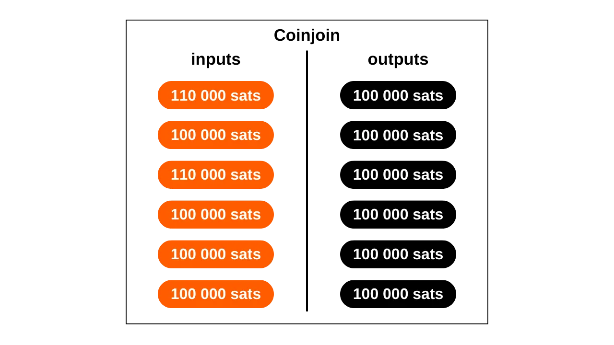
- 7个输入和7个输出；

- 8个输入和8个输出。
Whirlpool提出的模型基于小型coinjoin交易。与Wasabi和JoinMarket不同，后两者的匿名集的健壮性依赖于单个周期中参与者的数量，Whirlpool则依赖于多个小型周期的链接。

在这个模型中，用户仅在最初进入池时产生费用，允许他们参与多次重混而无需额外费用。是新加入者承担了重混者的挖矿费用。

每进行一次额外的coinjoin，参与的硬币及其过去遇到的伙伴，匿名集将呈指数级增长。因此，目标是利用这些免费的重混，每发生一次，就有助于增强与每个混合硬币相关联的匿名集的密度。

Whirlpool的设计考虑了两个重要要求：
- 在移动设备上实施的可访问性，鉴于Samourai Wallet主要是一款智能手机应用；
- 重混周期的速度，以促进匿名集的显著增加。

这些必要条件指导了Samourai Wallet的开发者在设计Whirlpool时的选择，使他们限制了每个周期的参与者数量。参与者太少会妨碍coinjoin的有效性，极大地减少每个周期生成的匿名集，而参与者过多则会在移动应用上造成管理问题，并会阻碍周期的流动。

**最终，在Whirlpool上每次coinjoin的参与者数量无需过多，因为匿名集是通过多个coinjoin周期的累积形成的。**
[-> 了解更多关于Whirlpool匿名集的信息。](https://planb.network/tutorials/privacy/wst-anonsets)
### Coinjoin池和费用
为了确保多个周期有效地增加混合硬币的匿名集，必须建立一定的框架来限制使用的UTXOs的金额。Whirlpool为此定义了不同的池。

一个池代表一组希望一起混合的用户，他们同意使用UTXOs的金额以优化coinjoin过程。每个池指定了UTXO的固定金额，用户必须遵守才能参与。因此，要使用Whirlpool进行coinjoins，你需要选择一个池。目前可用的池如下：
- 0.5比特币；
- 0.05比特币；
- 0.01比特币；
- 0.001比特币（= 100,000 sats）。

通过将你的比特币加入一个池，它们将被分割以生成与池中其他参与者完全同质的UTXOs。每个池都有一个最大限额；因此，对于超过此限额的金额，你将被迫要么在同一个池内进行两次单独的加入，要么转移到另一个金额更高的池：

| 池（比特币） | 每次加入的最大金额（比特币） |
|--------------|------------------------------|
| 0.5          | 35                           |
| 0.05         | 3.5                          |
| 0.01         | 0.7                          |
| 0.001        | 0.025                        |
如前所述，当UTXO准备好整合进coinjoin时，就被认为属于一个池。但这并不意味着用户就失去了它的所有权。**通过各种混合周期，你仍然完全控制你的密钥，因此，也控制着你的比特币。**这就是coinjoin技术与其他集中式混合技术的区别所在。

要进入coinjoin池，必须支付服务费用以及挖矿费用。每个池的服务费是固定的，旨在补偿负责Whirlpool开发和维护的团队。对于Sparrow Wallet用户，这些费用由Samourai团队转交给Sparrow的开发者。

使用Whirlpool的服务费用在进入池时支付一次。完成这一步骤后，你有机会参与无限次的重混，而无需额外费用。以下是每个池的当前固定费用：

| 池 (比特币) | 入场费 (比特币)        |
|------------|-----------------------|
| 0.5        | 0.0175                |
| 0.05       | 0.00175               |
| 0.01       | 0.0005 (50,000 sats)  |
| 0.001      | 0.00005 (5,000 sats)  |

这些费用本质上充当了进入所选池的入场券，无论你投入coinjoin的金额是多少。所以，无论你是以正好0.01 BTC加入0.01池，还是以0.5 BTC进入，费用在绝对值上保持不变。

因此，在进行coinjoins之前，用户有两种策略可供选择：
- 选择一个较小的池以最小化服务费，知道他们将收到几个小额的UTXO作为回报；
- 或者选择一个较大的池，同意支付更高的费用，以获得较少数量的大额UTXO。

通常不建议在coinjoin周期后合并几个混合过的UTXO，因为这可能会损害所获得的保密性，特别是由于Common-Input-Ownership Heuristic (CIOH)。因此，即使需要支付更多，选择一个较大的池也可能是明智的，以避免输出过多小额UTXO。用户必须权衡这些折中方案，以选择他们偏好的池。

除了服务费外，还必须考虑任何比特币交易固有的挖矿费用。作为Whirlpool用户，你将被要求支付准备交易（`Tx0`）以及第一次coinjoin的挖矿费用。所有后续的重混都是免费的，这得益于Whirlpool的模型，该模型依赖于新参与者的支付。

实际上，在每次Whirlpool coinjoin中，输入中的两个用户是新参与者。其他输入来自重混者。因此，交易中所有参与者的挖矿费用由这两个新参与者承担，他们随后也将从免费重混中受益：

得益于这种费用系统，Whirlpool真正地从其他coinjoin服务中脱颖而出，因为UTXOs的匿名集并不与用户支付的价格成正比。因此，仅通过支付池的入场费和两笔交易（`Tx0`和初始混合）的挖矿费，就有可能实现相当高水平的匿名性。
请注意，用户在完成多次coinjoin后从池中提取他们的UTXOs时，也必须支付挖矿费用，除非他们选择了`mix to`选项，我们将在下面的教程中讨论。

### Whirlpool使用的HD钱包账户
要通过Whirlpool执行coinjoin，钱包必须生成几个不同的账户。在HD（分层确定性）钱包的上下文中，一个账户构成了一个与其他账户完全隔离的部分，这种分隔发生在钱包层次结构的第三层深度，即`xpub`的层级。
理论上，一个HD钱包可以派生出多达`2^(32/2)`个不同的账户。初始账户，默认情况下用于所有比特币钱包，对应于索引`0'`。

对于适应Whirlpool的钱包，如Samourai或Sparrow，使用4个账户来满足coinjoin过程的需求：
- **存款**账户，由索引`0'`标识；
- **坏账**（或doxxic change）账户，由索引`2 147 483 644'`标识；
- **premix**账户，由索引`2 147 483 645'`标识；
- **postmix**账户，由索引`2 147 483 646'`标识。

这些账户中的每一个都在coinjoin中扮演特定的功能。

所有这些账户都链接到一个单一的种子，这允许用户通过使用他们的恢复短语和（如果适用的话）他们的密码短语来恢复访问他们所有的比特币。然而，在这个恢复操作期间，有必要向软件指定所使用的不同账户索引。

现在让我们来看看在这些账户中进行Whirlpool coinjoin的不同阶段。

### Whirlpool上coinjoins的不同阶段
**阶段1：Tx0**
任何Whirlpool coinjoin的起点都是**存款**账户。当你创建一个新的比特币钱包时，这个账户是你自动使用的账户。这个账户必须用你希望混合的比特币充值。

`Tx0`代表Whirlpool混合过程的第一阶段。它旨在通过将它们分成与所选池的金额相对应的单位来准备和均衡UTXOs，以确保混合的同质性。然后，均衡的UTXOs被发送到**premix**账户。至于不能进入池的差额，则被分到一个特定的账户：**坏账**（或"doxxic change"）。

这个初始交易`Tx0`还用于支付混合协调员的服务费用。与后续阶段不同，这笔交易不是协作性的；用户因此必须承担全部的挖矿费用：

在这个`Tx0`交易的例子中，我们的**存款**账户的一个输入`372,000 sats`被分成几个外发UTXOs，分布如下：
- 一个`5,000 sats`的金额，用于支付协调员的服务费，对应于进入池的`100,000 sats`；
- 三个为混合准备的UTXOs，重定向到我们的**premix**账户并向协调员注册。这些UTXOs在`108,000 sats`每个，以覆盖它们未来初始混合的挖矿费用；
- 无法进入池的剩余部分，因其太小而被视为有害变化。它被发送到其特定账户。在这里，这种变化相当于`40,000 sats`;
- 最后，有`3,000 sats`不构成输出，但是是确认`Tx0`所必需的挖矿费用。

例如，这里有一个真实的Tx0旋涡（并非来自我）：[edef60744f539483d868caff49d4848e5cc6e805d6cdc8d0f9bdbbaedcb5fc46](https://mempool.space/en/tx/edef60744f539483d868caff49d4848e5cc6e805d6cdc8d0f9bdbbaedcb5fc46)

**第二步：有害变化**
未能整合进池的剩余部分，在这里相当于`40,000 sats`，被重定向到**坏账**账户，也被称为“有害变化”，以确保与钱包中其他UTXO严格分离。

这个UTXO对用户的隐私是危险的，因为它不仅总是与其过去相关联，因此可能与其所有者的身份相关联，而且还被标记为属于执行了coinjoin的用户。

如果这个UTXO与混合输出合并，后者将失去在coinjoin周期中获得的所有隐私，特别是因为CIOH（*Common-Input-Ownership-Heuristic*）。如果它与其他有害变化合并，用户风险失去隐私，因为这将链接不同的coinjoin周期的输入。因此，必须谨慎处理这个有害UTXO。管理这个有害UTXO的方法将在本文的最后部分详细说明，未来的教程将在PlanB网络上深入探讨这些方法。

**第三步：初始混合**
完成`Tx0`后，等值UTXOs被发送到我们钱包的**预混**账户，准备引入它们的第一个coinjoin周期，也称为“初始混合”。如果像我们的例子那样，`Tx0`生成了多个用于混合的UTXOs，它们中的每一个都将被整合进一个单独的初始coinjoin。
在这些初始混合结束后，**预混**账户将为空，而我们的硬币，在支付了这第一次coinjoin的挖矿费用后，将被精确调整到所选池定义的金额。在我们的例子中，我们初始的UTXOs的`108 000 sats`将被减少到正好`100 000 sats`。

**第四步：重混**
在初始混合之后，UTXOs被转移到**后混**账户。这个账户收集了已经混合的UTXOs和那些等待重新混合的UTXOs。当Whirlpool客户端活跃时，位于**后混**账户中的UTXOs自动可用于重新混合，并将被随机选择参与这些新的周期。

作为提醒，然后重混是100%免费的：不需要额外的服务费或挖矿费。保持UTXOs在**后混**账户中，因此保持它们的价值不变，同时提高它们的匿名集。这就是为什么允许这些硬币参与多个coinjoin周期很重要。这对你来说严格来说没有任何成本，而且它增加了它们的匿名级别。
当您决定花费混合后的UTXOs时，可以直接从这个**postmix**账户进行。建议将混合后的UTXOs保留在此账户中，以便从免费的重新混合中受益，并防止它们离开Whirlpool循环，这可能会降低它们的隐私性。
如我们将在后续教程中看到的，还有一个`mix to`选项，它提供了一种可能性，即在定义的coinjoin次数后，自动将您混合的硬币发送到另一个钱包，比如冷钱包。

在讨论理论之后，让我们通过Sparrow Wallet桌面软件使用Whirlpool的教程，实践一下！

## 教程：在Sparrow Wallet上进行Coinjoin Whirlpool
使用Whirlpool有许多选项。我首先要向您介绍的是Sparrow Wallet选项，这是一款开源的比特币钱包管理软件，适用于PC。
使用Sparrow的优势在于开始使用相当容易，设置快速，且除了一台电脑和网络连接外，不需要任何其他设备。然而，有一个显著的缺点：coinjoin只会在启动并连接了Sparrow时发生。这意味着，如果您想要24/7混合和重新混合您的比特币，您需要不断保持电脑开机状态。

### 安装Sparrow Wallet
首先，您显然需要Sparrow Wallet软件。您可以直接从[官方网站](https://sparrowwallet.com/download/)或在[他们的GitHub](https://github.com/sparrowwallet/sparrow/releases)上下载。

在安装软件之前，验证您刚下载的可执行文件的签名和完整性将是重要的。如果您想了解有关Sparrow软件安装过程和验证的更多细节，我建议您阅读这个其他教程：*[The Sparrow Wallet Guides](https://planb.network/tutorials/wallet/sparrow)*。

### 创建软件钱包
安装软件后，您需要继续创建一个比特币钱包。重要的是要注意，要参与coinjoins，使用软件钱包（也称为"热钱包"）是必不可少的。因此，**使用硬件钱包保护的钱包将无法进行coinjoins**。

虽然不是必须的，但如果您计划混合大量资金，强烈推荐为这个钱包使用强大的BIP39密码短语。

要创建一个新钱包，打开Sparrow，然后点击`File`标签和`New Wallet`。

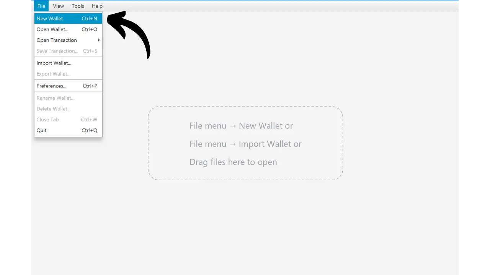

为这个钱包选择一个名称，例如："Coinjoin Wallet"。点击`Create Wallet`按钮。

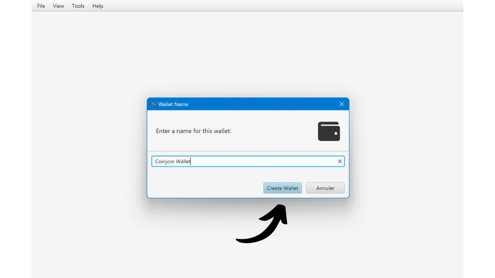

保留默认设置，然后点击`New or Imported Software Wallet`按钮。


当您进入钱包创建窗口时，我推荐选择一个12个词的序列，因为它已经足够充分。选择`Generate New`生成一个新的恢复短语，并点击`Use Passphrase`如果您希望添加一个BIP39密码短语。重要的是要对您的恢复信息进行物理备份，无论是在纸上还是在金属支持上，以确保您的比特币的安全。


在点击`Confirm Backup...`之前，确保您的恢复短语备份有效。Sparrow然后会要求您再次输入您的短语，以验证您已经记下了它。完成这一步骤后，继续点击`Create Keystore`。

将建议的派生路径保留为默认值，然后按`导入密钥库`。在我的示例中，由于我在本教程中使用Testnet，派生路径略有不同。应该为您显示的派生路径如下：
```plaintext
m/84'/0'/0'
```

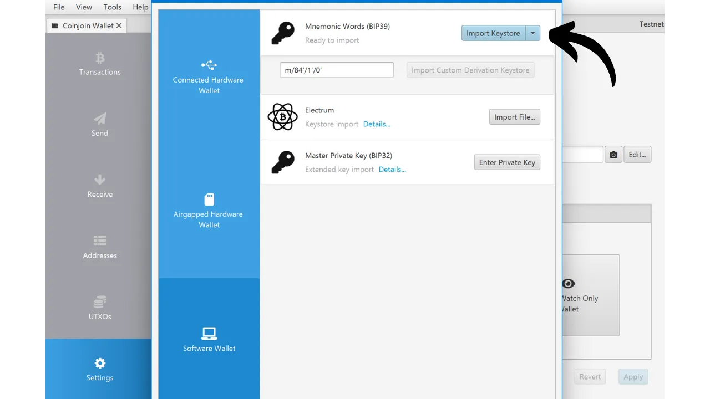

之后，Sparrow将显示您的新钱包的派生详情。如果您设置了密码短语，强烈建议记下您的`主指纹`。虽然这个主密钥指纹不是敏感数据，但它将对您稍后确实访问正确的钱包以及在输入密码短语时确认没有错误非常有用。

点击`应用`按钮。

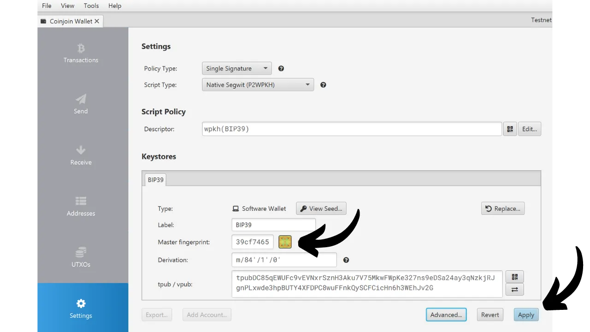

Sparrow邀请您为您的钱包创建一个密码。通过Sparrow Wallet软件访问它时将需要此密码。选择一个强密码，备份它，然后点击`设置密码`。

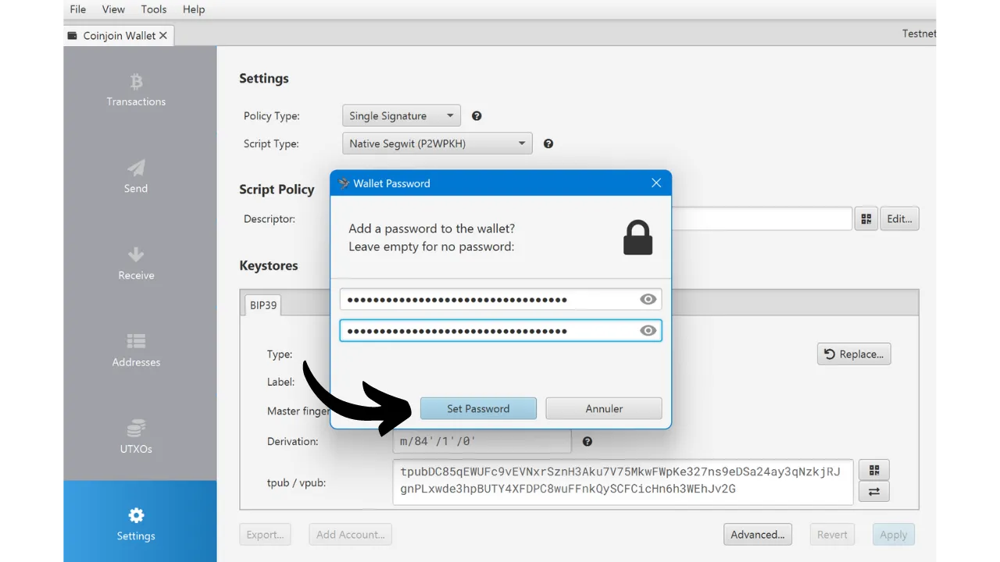

### 接收比特币
创建钱包后，您最初将有一个帐户，索引为`0'`。这是我们在前面部分谈到的**存款**帐户。这是您需要发送比特币以进行混币的帐户。

为此，选择窗口左侧的`接收`标签。Sparrow将自动生成一个新的空白地址以接收比特币。

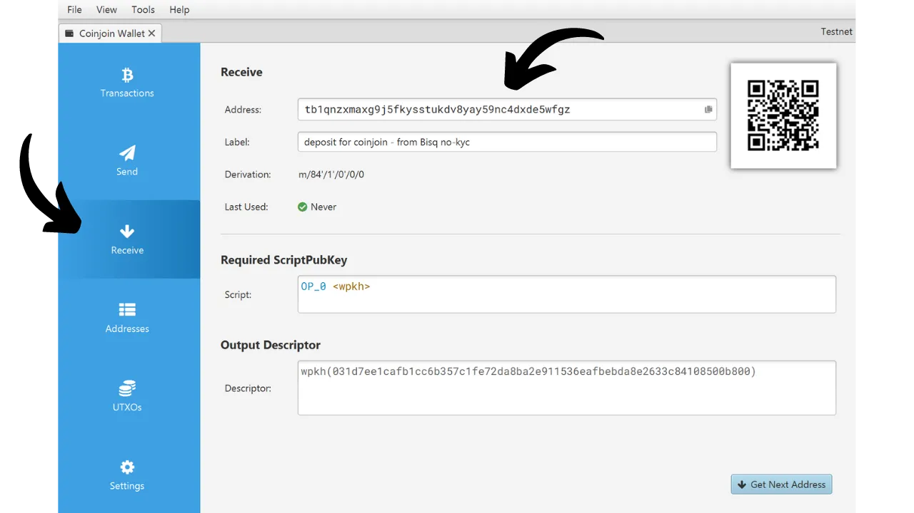

您可以为此地址输入一个标签，然后将要混合的比特币发送到该地址。


### 进行Tx0
一旦您的交易被确认，您就可以转到`UTXOs`标签。


接下来，选择您希望提交给coinjoin周期的UTXO(s)。要同时选择多个UTXO，请在点击您选择的UTXO时按住`Ctrl`键。


然后点击窗口底部的`混合选中的`按钮。如果这个按钮没有出现在您的界面上，那是因为您使用的是一个用硬件钱包保护的钱包。您需要使用软件钱包来执行Sparrow的coinjoins。
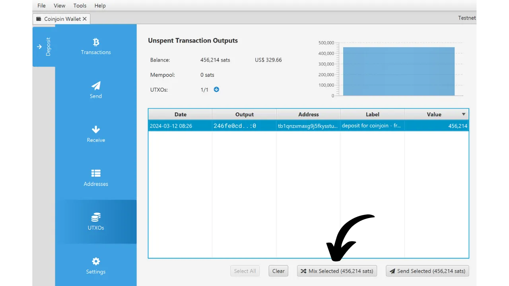
一个窗口打开解释Whirlpool是如何工作的。这是我在前面部分解释的简化版。点击`下一步`继续。


在下一页，如果您有SCODE，可以输入"SCODE"。SCODE是一个促销代码，为池的服务费提供折扣。Samourai Wallet偶尔会在特殊事件期间向其用户提供此类代码。我建议您[关注Samourai Wallet](https://twitter.com/SamouraiWallet)的社交媒体，以免错过未来的SCODES。
在同一页面上，您还需要为`Tx0`和您的初始混币设置费率。这个选择将影响您的准备交易和第一次混币的确认速度。请记住，您需要负责`Tx0`和初始混币的矿工费，但后续的重新混币不会产生矿工费。根据您的偏好调整`Premix Priority`滑块，然后点击`Next`。


在这个新窗口中，您将有选项通过下拉列表选择您希望进入的池。就我而言，最初选择了`456 214 sats`的UTXO，我的唯一可能选择是`100 000 sats`的池。这个界面还会告知您需要支付的服务费用以及将被整合到池中的UTXO数量。如果条件对您来说是满意的，继续点击`Preview Premix`。


完成这一步后，Sparrow将要求您输入钱包的密码，即您在软件上创建钱包时设置的密码。密码输入后，您将访问到您的`Tx0`预览。在窗口的左侧，您将看到Sparrow生成了使用Whirlpool所需的不同账户（`Deposit`、`Premix`、`Postmix`和`Badbank`）。您还将有机会查看您的`Tx0`的结构，包括不同的输出：
- 服务费；
- 意图进入池的等值UTXOs；
- 有害变化（Doxxic Change）。

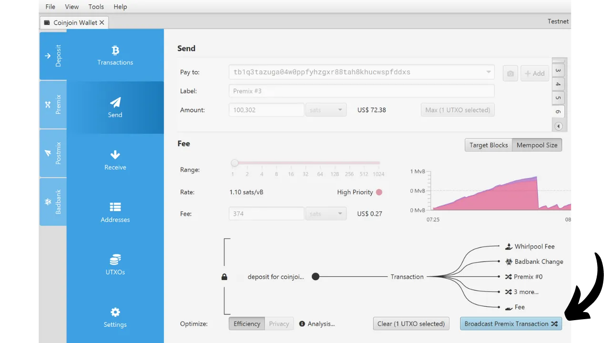

如果交易符合您的意愿，点击`Broadcast Transaction`来广播您的`Tx0`。否则，您可以通过选择`Clear`来清除输入的数据并从头开始创建过程，以调整这个`Tx0`的参数。

### 执行混币
一旦Tx0被广播，您将在`Premix`账户中找到准备混合的UTXOs。
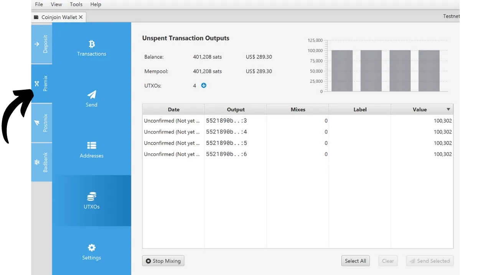

一旦`Tx0`被确认，您的UTXOs将被注册到协调器中，初始混币将自动连续开始。


通过检查`Postmix`账户，您将观察到来自初始混币的UTXOs。这些币将准备好进行后续的重新混币，这将不会产生任何额外的费用。


在`Mixes`列中，可以看到每个币进行的混币次数。正如我们将在后续部分看到的，真正重要的不是重新混币的次数本身，而是相关的匿名集，尽管这两个指标部分相关。

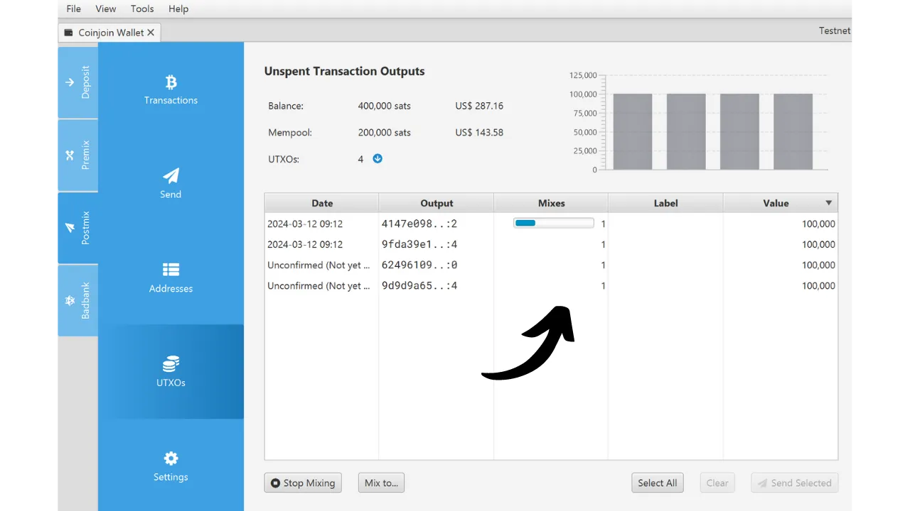

要暂时停止混币，只需点击`Stop Mixing`。您可以随时通过选择`Start Mixing`恢复操作。


为了确保您的UTXOs能够持续参与混币，必须保持Sparrow软件的活跃状态。关闭软件或关闭计算机将会暂停混币操作。一个解决这个问题的方法是通过操作系统的设置禁用休眠功能。此外，Sparrow提供了一个选项来防止计算机自动进入休眠状态，您可以在`工具`标签下找到名为`防止计算机休眠`的选项。


### 完成混币操作
要花费您混合后的比特币，您有几个选项。最直接的方法是访问`Postmix`账户并选择`发送`标签。


在这一部分，您将有选项输入目的地址、发送金额和交易费用，就像使用Sparrow钱包进行任何其他交易一样。如果您愿意，还可以通过点击`隐私`按钮来利用高级隐私功能，如Stonewall。

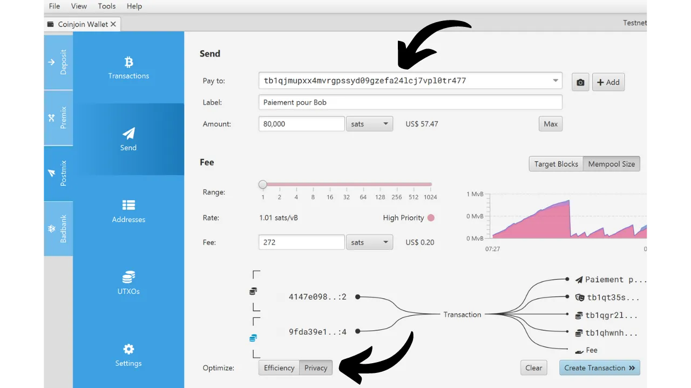

[-> 了解更多关于Stonewall交易的信息。](https://planb.network/tutorials/privacy/stonewall)

如果您希望更精确地选择要花费的硬币，请转到`UTXOs`标签。选择您特别想要消费的UTXOs，然后按`发送选中的`按钮来启动交易。


最后，Sparrow上的`混币到...`选项允许自动将选定的UTXO从混币周期中移除，而不会产生额外费用。此功能使得可以确定在一定数量的混币后，UTXO将不会被重新整合到您的`Postmix`账户中，而是直接转移到另一个钱包。这个选项通常用于自动将混合比特币发送到冷钱包。
要使用此选项，请首先在Sparrow软件中同时打开接收钱包和混币钱包。

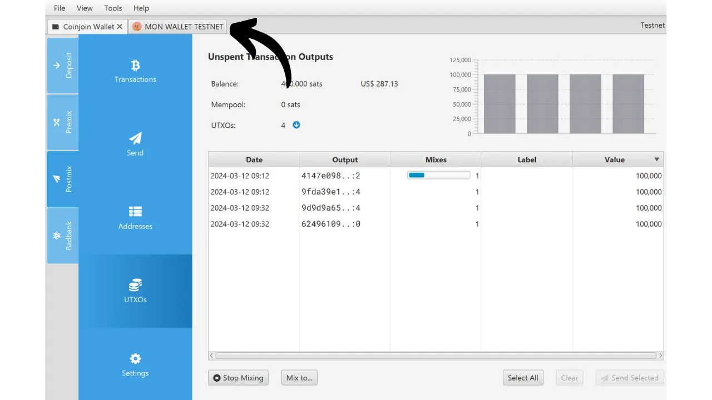

然后，转到`UTXOs`标签，并选择您感兴趣的硬币，然后点击窗口底部的`混币到...`按钮。


打开一个窗口，首先从下拉列表中选择目的钱包。


选择混币阈值，超过该阈值后将自动进行提款。我不能给您一个执行混币的确切次数，因为这根据您的个人情况和隐私目标而有所不同，但避免选择过低的阈值。我推荐咨询这篇其他文章来了解更多关于混币过程的信息：[REMIX - WHIRLPOOL](https://planb.network/tutorials/privacy/remix-whirlpool)。

您可以将`索引范围`选项保留在其默认值`Full`。这个功能允许从不同的客户端同时进行混币，但这不是我们在本教程中想要做的。要完成并激活`混币到...`选项，请按`重启Whirlpool`。


然而，在使用`混币到`选项时要小心，因为从您的`Postmix`账户中移除混合硬币可能会显著增加损害您隐私的风险。以下部分将详细说明这种可能性的原因。

## 如何了解我们的混币周期的质量？
为了确保coinjoin（联合交易）真正有效，至关重要的是它在输入和输出的金额之间呈现良好的同质性。这种一致性增加了外部观察者可能的解释数量，从而增加了围绕交易的不确定性。为了量化coinjoin产生的不确定性，可以通过计算交易的熵来实现。要深入探索这些指标，我推荐您参考教程：[BOLTZMANN CALCULATOR](https://planb.network/en/tutorials/privacy/boltzmann-entropy)。Whirlpool模型被认为是在coinjoins中带来最多同质性的模型。接下来，基于隐藏一个硬币的群组大小，评估几个coinjoin周期的性能。这些群组的大小定义了所谓的匿名集。有两种类型的匿名集：第一种是针对回顾性分析（从现在到过去）评估获得的隐私，第二种是针对前瞻性分析（从过去到现在）。要详细解释这两个指标，我邀请您参考教程：[WHIRLPOOL STATS TOOLS - ANONSETS](https://planb.network/tutorials/privacy/wst-anonsets)。

## 如何管理postmix？
在执行coinjoin周期后，最佳策略是将您的UTXOs保留在**postmix**账户中，等待将来使用。甚至建议让它们无限期地重新混合，直到您需要花费它们。

一些用户可能会考虑将他们混合的比特币转移到由硬件钱包保护的钱包中。这是可能的，但重要的是要严格遵循Samourai Wallet的建议，以免损害获得的保密性。

合并UTXOs是最常犯的错误。必须避免在同一笔交易中将混合的UTXOs与未混合的UTXOs结合起来，以避免CIOH（*Common-Input-Ownership-Heuristic*，共同输入所有权启发式）。这需要在钱包内仔细管理您的UTXOs，特别是在标记方面。除了coinjoin，合并UTXOs通常是一种不良做法，如果没有得到适当管理，往往会导致隐私损失。

合并混合的UTXOs时也要小心。如果您的混合UTXOs具有显著的匿名集，可以考虑适度的合并，但这将不可避免地降低您的硬币保密性。确保合并既不太大也不在重新混合次数不足的情况下进行，因为这会在coinjoin周期前后建立您的UTXOs之间可推断的链接。如果对这些操作有疑问，最佳做法是不合并postmix UTXOs，并一次一次地将它们转移到您的硬件钱包，每次生成一个新的空白地址。再次，记得正确标记每个接收到的UTXO。
还建议不要将您的postmix UTXOs转移到使用不常见脚本的钱包。例如，如果您从使用`P2WSH`脚本的多签名钱包进入Whirlpool，您与最初拥有同类型钱包的其他用户混合的机会很小。如果您将postmix提取到同一个多签名钱包，您混合比特币的隐私级别将大大降低。除了脚本，还有许多其他钱包指纹可能会欺骗您。
与任何比特币交易一样，不重用接收地址也很重要。每笔新交易都应该在一个新的、空白的地址上接收。
最简单也最安全的解决方案是让你的混合UTXOs在它们的**postmix**账户中休息，让它们重新混合，只在需要花费时才动用它们。Samourai和Sparrow钱包对所有这些链分析相关的风险提供了额外的保护。这些保护措施帮助你避免犯错。
## 如何管理有害变更？
接下来，你需要小心管理有害变更，即那些不能进入coinjoin池的变更。这些由Whirlpool使用产生的有毒UTXOs，因为它们建立了你与coinjoin使用之间的联系，所以对你的隐私构成了风险。因此，务必小心处理它们，不要将它们与其他UTXOs混合，尤其是混合过的UTXOs。以下是考虑使用它们的不同策略：
- **在较小的池中混合它们：**如果你的有毒UTXO足够大，可以单独进入一个较小的池，考虑混合它。这通常是最好的选择。然而，关键是不要合并几个有毒UTXOs以进入一个池，因为这可能会链接你的不同条目；
- **将它们标记为“不可花费”：**另一种方法是不再使用它们，将它们在专用账户中标记为“不可花费”，并且只是Hodl。这确保你不会意外花费它们。如果比特币的价值增加，可能会出现更适合你的有毒UTXOs的新池；
- **进行捐赠：**考虑进行捐赠，即使是微小的捐赠，也给在比特币及其相关软件上工作的开发者。你也可以捐赠给接受BTC的组织。如果管理你的有毒UTXOs似乎太复杂，你可以通过捐赠来简单地处理它们；
- **购买礼品卡：**像[Bitrefill](https://www.bitrefill.com/)这样的平台允许你用比特币换取可以在各种商家使用的礼品卡。这可以是一种处理你的有毒UTXOs而不失去相关价值的方式。
- **在门罗币上合并它们：**Samourai Wallet现在提供BTC和XMR之间的原子交换服务。这是通过在门罗币上合并它们来管理有毒UTXOs的理想方式，通过CIOH在发送回比特币之前不会损害你的隐私。然而，这个选项在挖矿费用和由于流动性限制而产生的溢价方面可能成本较高。
- **将它们发送到闪电网络：**将这些UTXOs转移到闪电网络以受益于降低的交易费用是一个可能有趣的选项。然而，这种方法可能会根据你使用闪电网络的方式揭露某些信息，因此应谨慎实践。

关于实施这些不同技术的详细教程将很快在PlanB Network上提供。

**额外资源：**
- [Sparrow Wallet视频教程](https://planb.network/tutorials/wallet/sparrow);
- [Samourai Wallet视频教程](https://planb.network/tutorials/wallet/samourai);
- [Samourai Wallet文档 - Whirlpool](https://docs.samourai.io/whirlpool/basic-concepts);
- [关于CoinJoins的Twitter讨论串](https://twitter.com/SamouraiWallet/status/1489220847336308739);
- [关于CoinJoins的博客文章](https://www.pandul.fr/post/comprendre-et-utiliser-le-coinjoin-sur-bitcoin).