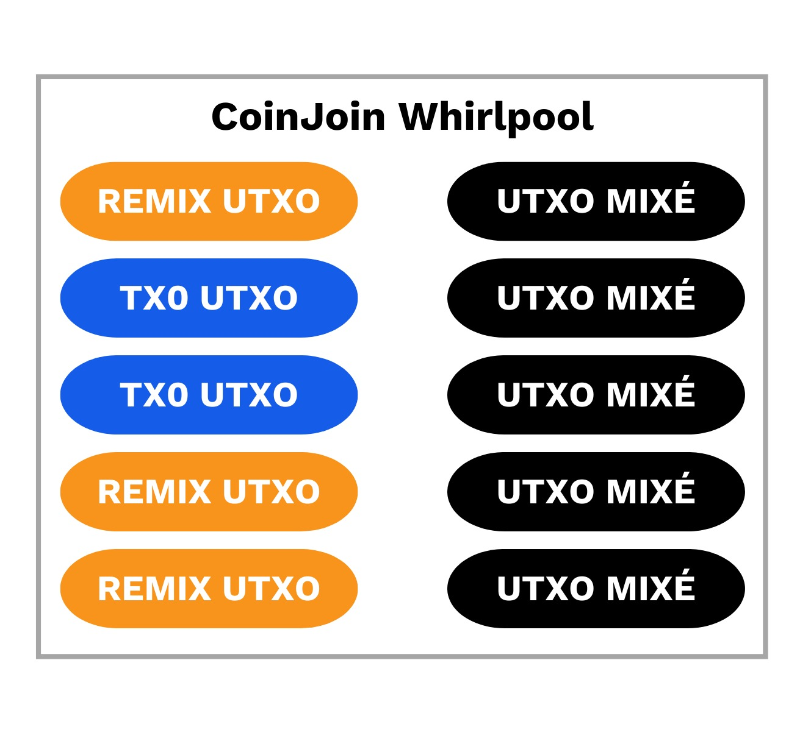
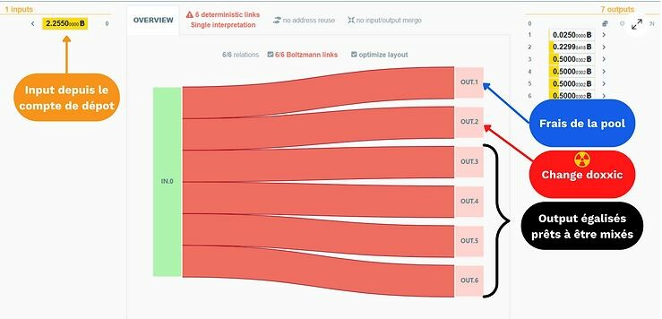

# فهم واستخدام تقنية CoinJoin في بيتكوين.

## مقدمة

أحد المشاكل الأولية في أي نظام للدفع الند-إلى-ند هي المصروف المزدوج. كيف يمكن تجنب أن يستغل المشاركون الخبيثون شبكة الدفع عن طريق إنفاق نفس الوحدات المالية عدة مرات دون اللجوء إلى سلطة مركزية؟

جاء ساتوشي ناكاموتو لحل هذه المشكلة من خلال بروتوكوله بيتكوين، وهو شبكة دفع إلكترونية ند-إلى-ند تعمل بدون تدخل من أي سلطة مركزية. في ورقته البيضاء، يشرح لنا أن الطريقة الوحيدة للتأكد من عدم وجود عملية دفع، وبالتالي التحقق من عدم وجود محاولة للمصروف المزدوج، هي أن يكون المرء على علم بجميع العمليات التي تمت على شبكة الدفع الموزعة.

لكي يتم إبلاغ كل مستخدم بالعمليات، يجب أن تُعلن هذه العمليات علنًا. لذلك، أصبحت البنية التحتية للدفع الند-إلى-ند المقترحة بواسطة بروتوكول بيتكوين ممكنة من خلال بنية شفافة وموزعة تمامًا. بالتالي، يمكن لأي شخص يمتلك عقدة التحقق من سلسلة التوقيعات الإلكترونية وتاريخ كل عملة، منذ إنشائها بواسطة عامل التعدين.

> يتم استخدام هذا المبدأ لتوزيع السجل والإعلان العام للعمليات الجديدة في العملة المشفرة الأخيرة (بيتكوين)، ولكنه كان مستخدمًا بالفعل في العملات المشفرة السابقة مثل بي-موني، الذي اخترعه وي داي في عام 1998.
>
> تعني هذه الشفافية والتوزيع أن كل مستخدم في شبكة بيتكوين قادر على تتبع ومراقبة عمليات الدفع لجميع المستخدمين الآخرين. لذلك، فإن الخصوصية غير ممكنة على مستوى الدفع. بدلاً من ذلك، يتم ضمان الخصوصية على مستوى هوية الشخص.

بدلاً من ربط كل وحدة حساب بهوية (اسم، لقب...)، كما هو الحال في النظام المصرفي التقليدي، يتم ربط البيتكوين بزوج من المفاتيح. بالتالي، يتم تمثيل المستخدمين بشكل مجهول من خلال معرف تشفيري.

بالتالي، يتم فقدان الخصوصية في بيتكوين عندما يكون المراقب قادرًا على إنشاء رابط بين بعض UTXO وبعض المستخدمين. عندما يتم إنشاء هذا الرابط بين مستخدم ووحدات حسابه، يصبح من الممكن تتبع مدفوعاته وتحليل تاريخ بيتكويناته.

تقنية CoinJoin هي ممارسة تسمح بكسر تاريخ UTXO هذه لتوفير مستوى معين من الخصوصية لمستخدم بيتكوين.
في هذه المقالة، سندرس معًا ما هو CoinJoin، وكيف يعمل، وكيفية استخدامه بالطريقة الصحيحة. سنتحدث بشكل أساسي عن Whirlpool، وهو تنفيذ CoinJoin الأكثر فعالية حاليًا برأيي، ولكننا سنتطرق أيضًا إلى التنفيذات الأخرى الموجودة. سأتحدث أيضًا عن المؤشرات التي تسمح بحساب مستوى سرية بيتكوين الخاص بك بدقة. ولكي لا نبقى فقط في النظرية، سأوضح لك كيفية إجراء عملية CoinJoin عملية بطرق مختلفة. وأخيرًا، سندرس الممارسات الجيدة التي يجب اتباعها لعدم فقدان السرية التي تم الحصول عليها بعد سلسلة من عمليات CoinJoin، وسأقدم لك أدوات محفظة Samourai Wallet المختلفة التي تسمح بذلك.
إذا أعجبك هذا المقال، شاركه على وسائل التواصل الاجتماعي ومعارفك الذين قد يحتاجون إليه.

> المحتويات:
>
> - CoinJoin وخلط البيتكوين.
> - التنفيذات المختلفة لـ CoinJoin.
> - عملية Whirlpool النظرية.
> - دليل: Whirlpool على Sparrow Wallet.
> - دليل: Whirpool CLI على Dojo و Whirlpool GUI.
> - الممارسات الجيدة بعد الخلط.
> - أدوات الإنفاق.
> - هل خلط البيتكوين أمر سيء؟

إذا كنت مستخدمًا مبتدئًا في البيتكوين، قبل أن تتمكن من قراءة هذه المقالة، أوصيك بشدة بفهم هيكل عملية البيتكوين (UTXO، inputs وoutputs) من خلال قراءة هذه المقالة القصيرة التي تناقش هذا الموضوع: آلية عملية البيتكوين: UTXO، inputs وoutputs.

_استخدام CoinJoin قد يشكل مخاطر غير مباشرة على المستخدم. قد يقوم بعض مزودي الخدمات بحظر أموالك و/أو حسابك نتيجة لأفعالك، وسيطلبون منك توضيحات بشأن أصل هذه الأموال. المعلومات الموجودة في هذه المقالة لا تشكل نصيحة في مجال أنظمة وبرامج الحوسبة، ولا تشكل أي تشجيع على إجراء عمليات CoinJoin. إجراء عملية CoinJoin يتطلب استخدام محفظة برمجية متصلة بالإنترنت (تسمى "ساخنة"). قد تفقد أموالك و/أو يتم سرقتها. أنصحك بإجراء بحوثك الخاصة حول المخاطر المختلفة الموجودة. هذه المقالة لا يمكن أن تكون مصدرًا وحيدًا للمعلومات حول هذه المواضيع._

## CoinJoin وخلط البيتكوين.

قبل أن نبدأ، من المهم فهم الفرق بين CoinJoin وخلط البيتكوين.

خلط البيتكوين (بالإنجليزية: "mixing"، "blender" أو "tumbler") هو تقنية تسمح بخلط UTXO، أي خلط البيتكوين، لكسر سجلاتها التاريخية وتشويش المسارات. الهدف من هذا النوع من العمليات هو تحقيق التعريف الزائف لـ UTXO حتى يكسب المستخدم في السرية. يحدث التعريف الزائف عندما يكون UTXO ضمن مجموعة من UTXO الأخرى التي لا يمكن تمييزها.
المزج والكوين جوين هما في الأصل تقنيتان تهدفان إلى الهدف نفسه، ولكنهما لا يعملان بنفس الطريقة. يعتمد المزج على طرف ثالث يثق فيه ويسلم له بيتكويناتنا ليقوم بخلطها، بينما يعتمد الكوين جوين فقط على منسق يتنسق عمل المستخدمين، ولكنه لن يتحكم في الأموال أبدًا.

مع ظهور الكوين جوين، أصبح المزج قديمًا بسرعة وتحول المستخدمون عنه. لا تزال هناك بعض خدمات المزج مثل ChipMixer. ومع ذلك، فإن هذه التقنية اليوم لم تعد موجودة سوى في الهامش بينما يستخدم الكوين جوين من قبل عدد متزايد من الأفراد.

وبناءً على ذلك، في اللغة اليومية لمستخدمي البيتكوين، يستخدم الكثيرون كلمة "مزج" في النهاية للإشارة إلى الكوين جوين. على الرغم من أن هذا الدلالة غير صحيحة في الأصل، إلا أنها مقبولة بشكل عام بين المستخدمين. وبالتالي، يشار إلى "البيتكوينات الممزوجة" للإشارة إلى UTXO التي تخرج من عملية كوين جوين.

الكوين جوين هو بالتالي تقنية تسمح بكسر تاريخ UTXO. يعتمد على عملية تعاونية بنية معينة تسمى عملية كوين جوين. اقترح هذا النوع من العملية أصلاً من قبل غريغوري ماكسويل في عام 2013 على منتدى Bitcoin Talk: https://bitcointalk.org/index.php?topic=279249.0

يتم تنفيذ العملية بالشكل التالي: يقوم مستخدمون مختلفون يرغبون في الخلط بإيداع مبلغ كإدخال في عملية. ستخرج هذه الإدخالات كمخرجات مختلفة بنفس المبلغ (قد يكون هناك تغيير، ولكن سندرس ذلك في وقت لاحق). عند خروج العملية، فمن المستحيل تحديد أي مخرج ينتمي إلى أي مستخدم. لا يوجد رابط تقني بين المدخلات والمخرجات لعملية كوين جوين. يتم كسر الرابط بين كل مستخدم وكل UTXO، بنفس الطريقة التي يتم بها كسر تاريخ كل قطعة.

لتمكين الكوين جوين دون أن يفقد أي مستخدم السيطرة على أمواله في أي وقت، يتم بناء العملية أولاً بواسطة المنسق ثم يتم إرسالها إلى كل مستخدم. يقوم كل مستخدم بتوقيع العملية بمفرده والتحقق مما إذا كانت تناسبه، ثم يتم إضافة جميع التوقيعات إلى العملية. إذا حاول أحد المستخدمين أو المنسق سرقة أموال الآخرين عن طريق تعديل مخرجات عملية كوين جوين، فسيكون التوقيع غير صالح وسيتم رفض العملية من قبل العقد.

إذا سمحت لي بمقارنة، يمكننا أن نتخيل الكوين جوين كمطاردة بين طائرة هليكوبتر وسيارة. لنتخيل هليكوبترًا يحاول متابعة سيارة بيضاء. يمثل الهليكوبتر الشخص الذي يرغب في تحليل مدفوعاتك وتمثل السيارة البيضاء UTXO الخاص بك. يمكن للهليكوبتر أن يتابع السيارة بسهولة عن طريق الطيران فوقها.
لنفترض الآن أن هناك أربع سيارات بيضاء أخرى مماثلة تسير على هذا الطريق بالقرب من السيارة التي يتم متابعتها. يمكن للمروحية متابعة السيارة البيضاء التي كانت تتابعها في البداية.
الآن، لنفترض أن هذه السيارات الخمسة تدخل نفقًا يمنع المروحية من رؤية السيارات لفترة قصيرة. عند خروجها من النفق، لن يتمكن الطيار من معرفة أي من السيارات البيضاء الخمسة تتوافق مع السيارة التي كان يتابعها في البداية. في هذا المثال، يعمل النفق كـ "كوين جوين". ستكون UTXO الخاصة بك بعد عملية كوين جوين مخفية بين مجموعة أخرى من UTXO. قد يعرف المراقب المحتمل أن UTXO الخاصة بك موجودة في هذه المجموعة، ولكنه لن يتمكن من تحديد بالتأكيد أي هي لك.

الهدف التقني لمستخدم كوين جوين هو أن يكون لديه "مجموعات التجهيز" الأكبر ممكنة على UTXO الخاصة به. هذا المفهوم مهم جدًا لفهم ما يلي. "مجموعات التجهيز"، ويشار إليها أحيانًا بـ "مجموعات الإخفاء"، تشير إلى المعلمات التي تسمح بحساب مستوى التجهيز لـ UTXO معينة. هناك نوعان منها: التصنيف المستقبلي والتصنيف السابق.

يعطي التصنيف المستقبلي حجم مجموعة UTXO التي يختبئ فيها UTXO الخاص بنا. على سبيل المثال، إذا قمت بعملية كوين جوين مع أربعة مستخدمين آخرين، فإن تصنيفي المستقبلي سيكون يساوي خمسة مباشرة بعد عملية كوين جوين.

إذا أعدنا إلى مثالنا عن المروحية، فإن كل سيارة بيضاء عند خروجها من النفق لديها تصنيف مستقبلي يساوي 5. يعلم الطيار أن هدفه موجود في هذه المجموعة من السيارات الخمسة، ولكنه غير قادر على تحديد أي هي السيارة المستهدفة الأصلية.

سأشرح لكم بالتفصيل أكثر ما تمثله هذه المعلمات الاثنتين في هذا الجزء: مجموعات الإخفاء. في الوقت الحالي، احتفظ بمعرفة أنه كلما زادت مجموعات الإخفاء لـ UTXO المختلطة، زادت صعوبة تعقبها بواسطة المراقب.

# تنفيذات كوين جوين المختلفة.

يمكن تنفيذ عملية كوين جوين يدويًا تمامًا، مباشرة مع مستخدمين آخرين من بيتكوين تلتقي بهم. ومع ذلك، هذا الحل، بالإضافة إلى أنه معقد للغاية، غير فعال بما فيه الكفاية. لكي تكون عملية كوين جوين فعالة وسريعة وتعمل على مستوى الشبكة، يجب أن تتفق مع أي مستخدم آخر في العالم. بدلاً من ذلك، يتم استخدام خدمات منسق يقوم بتطوير تنفيذ مع نموذج عملية، ويربط بين المستخدمين المختلفين وينقل المعلومات اللازمة لإتمام العملية التعاونية بشكل صحيح.

هناك بشكل رئيسي 3 تنفيذات لكوين جوين على بيتكوين:

> JoinMarket.
>
> Wasabi.
>
> Whirlpool.
حتى وإن كان الهدف النهائي لهذه الطرق الثلاثة هو نفسه، وهو كسر تاريخ UTXO عن طريق إجراء عمليات تجميع العملات المعدنية، إلا أن طرق عملها مختلفة جدًا. لذا، يجب أن نتعرف على تفاصيل كل طريقة لاختيار التنفيذ الأنسب لتوقعاتنا.

ربما قد فهمتم ذلك بالفعل إذا كنتم تتابعونني على تويتر، شخصيًا، أفضل استخدام تنفيذ Whirlpool. لذا، سأشرح لكم بسرعة كيفية عمل الحلول الأخرى نظريًا، وأشرح لماذا أجدها أقل ملاءمة. ثم، سندرس بالتفصيل أكثر عن كيفية عمل Whirlpool، وهو التنفيذ الذي طورته فرق Samourai Wallet، والذي يعتبر في رأيي أفضل حل لتجميع العملات المعدنية حاليًا.

الميزات المذكورة لكل تنفيذ صالحة حاليًا. قد تكون قد تغيرت عند قراءتك لهذه المقالة.


## JoinMarket.

يتميز JoinMarket بشكل واضح عن التنفيذات الرئيسية الأخرى بنموذجه لربط المستخدمين. فهو يعتمد على سوق تبادل بين المستخدمين الذين يوفرون السيولة للتجميع، والمستخدمين الذين يأخذون السيولة للتجميع.

عندما نرغب في إجراء تجميع للعملات المعدنية على JoinMarket، يجب أن نختار بين ترك عملاتنا المعدنية ليستخدمها الآخرون في التجميع مقابل مقابل مالي، أو أخذ سيولة المستخدمين الآخرين للتجميع مباشرة عن طريق دفع المقابل المطلوب. لذا، هناك "صانعون" يتركون عملاتهم المعدنية متاحة وهناك "مستخدمون" يستخدمون السيولة. يدفع المستخدمون المقابل المالي للصانعين عن خدمتهم.

لذا، نتحدث عن سوق حر تمامًا، بدون شروط استخدام.

العيب الرئيسي لهذه الخدمة هو أنها تعقيدة نسبيًا في الاستخدام. يجب أن يكون لديك معرفة أدنى بأوامر سطر الأوامر في Linux لتتمكن من استخدامها بشكل جيد. هذا التنفيذ فعال نسبيًا، ولكنه بالتأكيد ليس مناسبًا للجمهور العام.

من حيث الميزات المتعلقة بعملية تجميع العملات المعدنية، يعاني JoinMarket من بعض النقاط الضعيفة مقارنة بـ Whirlpool. على سبيل المثال، بنية عملية تجميع العملات المعدنية المستخدمة تعني أنه لا يمكن أن يكون هناك 0٪ من الروابط المحددة بين المدخلات والمخرجات. يمكن أيضًا ملاحظة أن JoinMarket لا يتضمن أداة لمنع عملية تجميع جديدة بين العملات التي التقت في الماضي.

من حيث الخدمات الإضافية المقدمة للمستخدم، لا يتضمن JoinMarket أداة لحساب مجموعات Anon Sets لـ UTXO بسهولة. أما بالنسبة لأدوات إنفاق UTXO المجموعة، فإن التنفيذ يقترح فقط PayJoin.
في النهاية ، يعد JoinMarket تنفيذًا مثيرًا للاهتمام لـ CoinJoin ، ولكنه ليس مصممًا لأي شخص. إذا كنت مرتاحًا مع سطر الأوامر وتفهم جيدًا كيفية عمل CoinJoin وإذا كنت تحب نموذج "المأخذ" / "الصانع" ، فقد يناسبك هذا التنفيذ.

## واسابي 2.0.

يعمل خدمة CoinJoin في Wasabi في النظرية بنفس طريقة Whirlpool. على عكس JoinMarket حيث يتم التنظيم في سوق حرة ، يعمل Wasabi كمنسق يقوم بخلط بيتكوينات جميع مستخدمي الخدمة تلقائيًا.

هيكل صفقة CoinJoin نفسه مختلف تمامًا عن هيكل Whirlpool. كما سنرى في الجزء التالي ، يتم زيادة النقاط المستقبلية (Anon Set) لـ UTXO المختلطة على Whirlpool عن طريق تراكم عدة عمليات CoinJoin مع عدد قليل من المستخدمين في كل مرة. على العكس من ذلك ، يتم إنشاء Anon Sets لـ UTXO المختلطة على Wasabi في عدد قليل من العمليات مع عدد كبير من المستخدمين.

مثال على Coinjoin يمكن أن يتم تنفيذه على Wasabi 1.0:
https://kycp.org/#/b994a9cbdc20e971207bde4f800b9ce99dba35478a2a997bc48e7f9f80bd2d02

مثال على Coinjoin تم تنفيذه على Whirlpool: https://kycp.org/#/323df21f0b0756f98336437aa3d2fb87e02b59f1946b714a7b09df04d429dec2

تختلف المنشآت الاثنتين أيضًا في إدارة الباقي. في Whirlpool ، يتم فصل الباقي وعزله عن UTXO قبل CoinJoin باستخدام TX0 (سأتحدث عنها في الجزء التالي). في Wasabi ، يكون الباقي ناتجًا لصفقة CoinJoin. يؤدي اختيار هذا الهيكل لـ CoinJoin على Wasabi إلى وجود روابط محددة بين المدخلات وبعض النواتج.

في الإصدار 2.0 ، قام Wasabi بتغيير سياسة رسوم CoinJoin بشكل كامل. رسوم المنسق الآن 0.3٪ لـ UTXO التي تزيد عن 0.01 بيتكوين ، وتكون مجانية لـ UTXO الأقل من هذا المبلغ. يستفيد UTXO الصغير أيضًا من remixes مجانية. يجب ملاحظة أنه حتى إذا تم تقديم رسوم المنسق مجانًا ، فإن المستخدم لا يزال ملزمًا بدفع رسوم التعدين لجميع الصفقات ، بما في ذلك صفقات remixes.
وبالتالي، على عكس Whirlpool، كلما كنت ترغب في وجود مجموعات Anon Sets كبيرة على UTXO المختلطة مع Wasabi، كلما كان عليك دفع رسوم أكثر. هذا صحيح سواء للإصدار 1.0 أو الإصدار 2.0 من Wasabi. على الرغم من أن الإصدار الأخير يوفر رسوم المنسق لـ UTXO الصغيرة، إلا أنه لا يزال هناك رسوم التعدين. بالإضافة إلى ذلك، كان لدي انطباع عند استخدام الإصدار 2.0 أن الحد الأقصى المحتمل للنقاط المستقبلية في Wasabi هو 300. يمكن بسهولة الوصول إلى نقاط مستقبلية مكونة من خمسة أرقام في Whirlpool خلال بضعة أشهر، وهذه النقاط ليست محدودة.

بالإضافة إلى بنية CoinJoin نفسها، يفتقر Wasabi بشدة في رأيي إلى أدوات إضافية لـ CoinJoin، بما في ذلك القدرة على إنفاق UTXO المختلطة بشكل صحيح. في الإصدار 1.0، لا يوجد أداة للإنفاق. في الإصدار 2.0، قام Wasabi بتضمين أداة للإنفاق على UTXO المختلطة التي تسمح بضبط المدخلات والمخرجات تلقائيًا لتعزيز السرية عن طريق إزالة التغيير. على الرغم من أن هذه الميزة يمكن أن تكون مفيدة، إلا أنها تبدو أقل فعالية وعملية للاستخدام مقارنة بالعديد من الأدوات المقدمة في Samourai و Sparrow Wallet لإنفاق UTXO المختلطة مع Whirlpool. سأتحدث عن كل هذه الأدوات في وقت لاحق في المقال، في هذا الجزء: أدوات الإنفاق.

على عكس Whirlpool، لا يفصل Wasabi بين حسابات UTXO المختلطة وغير المختلطة وتغيير UTXO. تسمح هذه البنية للمحفظة بإعادة استخدام العناوين بين UTXO المختلطة وغيرها من UTXO. إذا حدث ذلك، يمكن أن يفسد ذلك CoinJoin تمامًا.

أخيرًا، بعد تجربة الإصدار 2.0، أشعر حقًا بعدم السيطرة على CoinJoin الخاص بي عند استخدام Wasabi. كل شيء مبسط ومؤتمت، وواجهة المستخدم جميلة، ولكن هل هذا ما نتوقعه من تنفيذ CoinJoin؟

## عملية Whirlpool النظرية.

على عكس التنفيذات الأخرى المذكورة، يتميز Whirlpool ببناء معاملات CoinJoin "ZeroLink"، وهي معاملات لا يوجد فيها أي رابط تقني بين جميع المدخلات وجميع المخرجات.

يتم تحقيق ذلك من خلال معاملة CoinJoin حيث يقوم كل مستخدم بإيداع نفس المبلغ كمدخل، ويخرج نفس العدد من المخرجات بنفس المبلغ.

مع هذا النوع المقيد من البنية على المدخلات، تعتبر معاملة CoinJoin في Whirlpool الوحيدة التي تسمح للمستخدمين بعدم وجود روابط محددة بنسبة 0٪ بين المدخلات والمخرجات. هذا يعني أن كل مخرج له نفس احتمالية الانتماء لمستخدم ما مثل جميع المخرجات الأخرى في المعاملة.
يتم تحديد عدد المشاركين في كل مزيج إلى 5 أشخاص: 2 مشاركين و 3 معاد خلط (سنتعرف في وقت لاحق على ما يعنيه ذلك). لذلك، يحتوي أي عملية CoinJoin على Whirlpool دائمًا على 5 مدخلات و 5 مخرجات.


## تصميم Whirlpool.

يعتمد نموذج Whirlpool على عمليات صغيرة جدًا. على عكس Wasabi و JoinMarket، لا يتم الحصول على قوة مجموعات Anon من خلال عدد المستخدمين الذين يشاركون في CoinJoin، ولكن من خلال تتابع عدة عمليات CoinJoin صغيرة تشارك فيها 5 مشاركين في كل مرة.

سيتعين على المستخدم أن يدفع مرة واحدة فقط عندما يدخل إلى حوض، ثم يمكنه إعادة الخلط مجانًا بقدر ما يريد. يتم دفع رسوم التعدين من قبل المشاركين الجدد للمعاد خلطهم.

ستزداد مجموعات Anon بشكل متسارع مع كل عملية خلط للمستخدم وزملائه. لذا فإن الهدف هو الاستفادة إلى أقصى حد من كل هذه العمليات المجانية التي تضيف عمقًا إلى مجموعات Anon لـ UTXO.

تم تصميم Whirlpool وفقًا لمعايير رئيسية:

- أن يكون التنفيذ قابل للاستخدام على الهواتف المحمولة.

- أن تتم عمليات الخلط بسرعة.

لهذين السببين، اختار فريق Samourai تحديد عدد المستخدمين إلى 5 في كل دورة. لو كان العدد أقل، لم يكن سيؤدي إلى CoinJoin فعال بما فيه الكفاية ولكان سيقلل بشكل كبير من مجموعات Anon في كل دورة. ولو كان العدد أعلى، فمن المحتمل أنه لن يكون قابلاً للإدارة على العملاء المحمولة وسيقلل من تدفق الدورات.

في النهاية، ليس هناك حاجة لوجود عدد كبير من المشاركين في CoinJoin على Whirlpool لأن مجموعات Anon تتكون من تجميع عدة دورات للخلط.

## حمامات ورسوم.

لضمان أن هذه الدورات المتعددة تزيد فعلاً من مجموعات Anon لـ UTXO، يجب وضع إطار معين لتقييد مبالغ UTXO المستخدمة. يحدد Whirlpool حمامات مختلفة.

حمامة هي مجموعة من المستخدمين الذين يرغبون في الخلط واتفقوا على مبلغ UTXO المستخدم لتحسين عملية CoinJoin. تحدد كل حمامة مبلغًا ثابتًا من UTXO يجب على المستخدم أن يتكيف معه للدخول إليه. على سبيل المثال، عندما ترغب في إجراء عمليات CoinJoin، يجب عليك اختيار حمامة للدخول إليها للبدء في الخلط. الحمامات المختلفة المتوفرة حاليًا على Whirlpool هي:

- 0.5 بيتكوين.
- 0.05 بيتكوين.
- 0.01 بيتكوين.
- 0.001 بيتكوين (= 100,000 ساتوشي).

بالتالي، يمكن للجميع أن يجد ما يناسبه.

كل حمامة لها حد أقصى للمبلغ المسموح به للدخول إليه:

| حمامة (بيتكوين) | الحد الأقصى للمبلغ للدخول (بيتكوين) |
| -------------- | ------------------------------------ |
| 0.5            | 35                                   || 0.05           | 3.5                                  |
| 0.01           | 0.7                                  |
| 0.001          | 0.025                                |

للدخول إلى حوض السباحة ، يجب دفع رسوم. تكون ثابتة لكل حوض سباحة وتذهب إلى الفرق التي تطور وتدير Whirlpool لتعويضهم عن هذه الخدمة. تتم خصم الرسوم مرة واحدة فقط عند الوصول إلى حوض السباحة. بمجرد الدخول إلى حوض السباحة ، يمكنك إعادة الخلط مجانًا بقدر ما تريد.

حاليًا ، هنا هي الرسوم المطبقة لكل حوض سباحة:

| حوض (بيتكوين) | رسوم الدخول (بيتكوين) |
| -------------- | ------------------------ |
| 0.5            | 0.0175                   |
| 0.05           | 0.00175                  |
| 0.01           | 0.0005 (50,000 ساتوشي)  |
| 0.001          | 0.00005 (5,000 ساتوشي)  |

يمكنك بسهولة حساب الرسوم المترتبة على عمليات الخلط الخاصة بك مع Whirlpool على هذا الموقع: https://www.whirlpoolfees.com/

يرجى ملاحظة أيضًا أن هذه الرسوم هي "تذكرة دخول" إلى حوض السباحة. بالتالي ، سواء دخلت إلى حوض السباحة 0.01 بمقدار 0.01 بيتكوين أو 0.5 بيتكوين ، فإن الرسوم ستكون نفسها تمامًا. قبل الخلط ، يجب على المستخدم أن يتساءل ما إذا كان يرغب في دفع رسوم أقل مع حوض صغير ، في هذه الحالة ، سيخرج بعدة UTXO صغيرة ، أو إذا كان يفضل استخدام حوض أكبر بدفع رسوم أكثر ، ولكن سيخرج بعدد أقل من UTXO.

عند الخروج من دورات الخلط المختلفة ، عادةً ما يُنصح بعدم دمج عدة UTXO مختلطة معًا. قد يؤدي ذلك إلى كسر الخصوصية التي تم الحصول عليها بصعوبة مسبقًا. لذا ، في بعض الأحيان من الأفضل استخدام حوض أكبر ، حتى لو كان عليك دفع رسوم أكثر ، للخروج بعدد أقل من UTXO بحجم أكبر.

الرسوم الأخرى التي يجب النظر فيها هي بالطبع رسوم التعدين المرتبطة بأي عملية بيتكوين. كمستخدم لـ Whirlpool ، ستضطر إلى دفع رسوم التعدين لـ Tx0 ورسوم التعدين للخلط الأولي. ستكون جميع عمليات الخلط الأخرى مجانية بالنسبة لك لأن نموذج رسوم Whirlpool يعتمد على المشاركين الجدد.

يتألف كل CoinJoin من 5 مستخدمين. من بين هؤلاء ، هناك 2 مشاركين و 3 عمليات خلط. بالتالي ، سيدفع المشاركان الاثنان في كل عملية خلط رسوم التعدين للمشاركين الخمسة ، ثم يمكن لهؤلاء المشاركين الاثنين الاستفادة بدورهم من خلوص العمليات الخلفية المجانية.


بفضل هذا النموذج للرسوم، يختلف Whirlpool حقًا عن خدمات CoinJoin الأخرى حيث لا تكون مجموعات Anon Sets لـ UTXO متناسبة مع السعر الذي يدفعه المستخدم. يمكن أن يؤدي ذلك إلى وجود مجموعات Anon Sets عالية جدًا، مجرد دفع رسوم المجموعة ورسوم التعدين لعمليتين (Tx0 والمزج الأولي).
بالطبع، سيضطر المستخدم أيضًا لدفع رسوم التعدين عندما يرغب في سحب UTXO الخاص به من المجموعة بعد إجراء العديد من عمليات المزج.

كما تم شرحه سابقًا، يقال أن UTXO موجود في مجموعة عندما يكون متاحًا للمزج. هذا لا يعني أن المستخدم يفقد ملكيته. طوال عمليات CoinJoin المختلفة مع Whirlpool، تبقى مالكًا كاملًا لمفاتيحك، وبالتالي مالكًا لبيتكوين الخاص بك.

## الحسابات في Whirlpool.

لتتمكن من تنفيذ عملية CoinJoin من هذا النوع، يجب على المحفظة التي تستخدم Whirlpool أن تشتق عدة حسابات.

الحساب هو قسم فرعي في محفظة HD. يتم هذا التقسيم في العمق 3 للمحفظة، أي على مستوى xpub / xprv.

إذا كنت غير مرتاح مع هذا المفهوم للحسابات داخل محفظة HD، أنصحك بقراءة كتابي المخصص لهذا الموضوع الذي يمكنك تنزيله مجانًا من هنا. لقد كتبت أيضًا مقالًا كاملاً عن كيفية عمل مسارات الاشتقاق: فهم مسارات اشتقاق محفظة بيتكوين.

بالطبع، ليس عليك أن تفهم كل هذا لاستخدام Whirlpool، ولكن احتفظ بأن الحساب هو قسم فرعي في محفظة HD، والذي يكون منفصلًا تمامًا عن الحسابات الأخرى ولديه xpub / zpub الخاص به.

من خلال هذا الفصل الصارم بين الحسابات المختلفة، فإنه من المستحيل أن يحدث إعادة استخدام للعنوان بين البيتكوين المختلطة والبيتكوين غير المختلطة على Whirlpool.

يمكن تشتيت حتى 2^(32/2) حسابًا مختلفًا على كل محفظة HD. الحساب الأول، الذي تستخدمه افتراضيًا في محفظتك دون أن تعلم ذلك، هو الحساب 0'.

عند استخدام محفظة متوافقة مع استخدام Whirlpool، ستقوم تلقائيًا بإنشاء 5 حسابات:

    حساب الإيداع المحدد بالفهرس 0'.

    حساب البنك السيئ (تغيير doxxic) المحدد بالفهرس 2 147 483 644'.

    حساب ما قبل المزج المحدد بالفهرس 2 147 483 645'.

    حساب ما بعد المزج المحدد بالفهرس 2 147 483 646'.

    حساب Ricochet المحدد بالفهرس 2 147 483 647': هذا الحساب الأخير لا يستخدم مباشرة في بروتوكول Whirlpool، ولكنه مرتبط به. سأتحدث عن ذلك في الجزء المخصص لأدوات الإنفاق.
كل حساب له استخدامه الخاص وسيكون مخصصًا لمهمة محددة.
تعتمد جميع الحسابات على نفس البذرة. يمكن للمستخدم استعادة الوصول إلى جميع أمواله بسهولة في حالة وجود مشكلة في عبارة الاسترداد والعبارة السرية الاختيارية. ومع ذلك ، يجب على برنامج الاسترداد تحديد فهارس الحسابات المستخدمة.

لنلق نظرة على الخطوات المختلفة لـ CoinJoin Whirlpool داخل هذه الحسابات.

## Tx0.

في بداية CoinJoin ، يبدأ كل شيء من حساب الإيداع. هذا هو الحساب الذي تستخدمه افتراضيًا عند إنشاء محفظة بيتكوين جديدة. يجب أن يتم إيداع البيتكوينات التي يرغب المستخدم في خلطها في هذا الحساب.

تعد Tx0 هي أول عملية في عملية الخلط Whirlpool. هدفها هو تنظيف UTXO (مخرجات العملة غير المنفقة) التي ستتم خلطها قبل إرسالها إلى الخلطة الأولى. ستقوم هذه العملية بتقسيم UTXO المدخلة إلى عدة UTXO تتوافق مع مبلغ التجمع المختار. سيتم إرسال جميع هذه الـ UTXO المعادلة إلى حساب الـ Premix. سيتم فصل الفرق الباقي الذي لا يمكن أن يدخل في التجمع المختار في حساب مخصص له: Bad Bank (أو "Doxxic Change").

ستسمح هذه Tx0 أيضًا بدفع الرسوم إلى المنسق.

يجب عليك دفع رسوم التعدين لـ Tx0.



الائتمان (صورة معدلة): KYCP.org: https://kycp.org/#/a126e48d4a6eb8d19682ec0e23ad45e76cd52b45f6c17be5068ae051d4b2cc24

في هذا مثال لعملية Tx0 ، يمكننا رؤية إدخال بقيمة 2.2550 بيتكوين من حساب الإيداع للمستخدم الذي يبدأ Tx0. يتم تقسيم هذا الإدخال إلى عدة UTXO في الإخراج التي تمثل:

- رسوم المنسق ، هنا: 0.0250 بيتكوين.

- أربعة UTXO جاهزة للخلط ستذهب إلى حساب Premix للمستخدم. ستتم تسجيل هذه الـ UTXO أيضًا لدى المنسق.

- الفرق الذي لا يمكن أن يدخل في التجمع ، لأنه صغير جدًا: إنه تغيير سام.

الرسوم هنا مختلفة عن تلك التي أعطيتها في الجدول السابق لأن ساموراي قامت بتخفيض أسعارها لـ Whirlpool في مارس 2021.

## حساب تغيير سام.

يتم إرسال التغيير الذي لا يمكن إدخاله في التجمع إلى حساب تغيير سام (المعروف أيضًا باسم "Bad Bank") لفصله تمامًا عن بقية الحسابات.

هذا UTXO خطير على خصوصية المستخدم لأنه ليس فقط مرتبط دائمًا بماضيه ، وبالتالي بمالكه المحتمل ، ولكنه أيضًا مسجل كملك لشخص قام بعملية CoinJoin.
إذا تم دمج هذا UTXO مع UTXO مختلطة ، فإن هذه الأخيرة ستفقد كل السرية التي تم الحصول عليها مسبقًا. إذا تم دمجه مع تغييرات Doxxic أخرى ، فقد يفقد المستخدم السرية. لذا يجب التعامل معه بحذر. سأشرح لك بالضبط كيفية التعامل مع هذا UTXO السام في هذا الجزء.
## حساب Pre Mix.

في حساب Pre Mix ، ستجد UTXO المعاد تسويتها خلال Tx0 جاهزة للخلط. هذه الUTXO أعلى قليلاً من مبلغ الحوض لأنها يجب أن تسدد رسوم تعدين الخلط الأولي.

بمجرد أن تمر هذه الUTXO في الخلط الأولي الخاص بها ، ستكون حساب Pre Mix فارغًا وستكون هناك UTXO جديدة في الحساب التالي.

## حساب Post Mix.

يستقبل حساب Post Mix UTXOs المختلطة حديثًا من الخلط الأولي الخاص بها. كما يستقبل جميع الUTXO الأخرى المتاحة للخلط مرة أخرى.

إذا كان عميل Whirlpool قيد التشغيل ، فإن UTXO الموجودة في حساب Post Mix متاحة للخلط. سيتم اختيارها عشوائيًا للخلط.

عندما يرغب المستخدم في إنفاق UTXO المختلطة ، يمكنه القيام بذلك مباشرة من حساب Post Mix هذا. من الجيد أيضًا ترك UTXO المختلطة في هذا الحساب ، ليس فقط ليتم خلطها مجانًا ، ولكن أيضًا لعدم خروجها من دائرة Whirlpool ، وإلا فقد تفقد السرية.

## مجموعات Anon.

كما تم شرحه سابقًا ، فإن مجموعات Anon هي معلمتان تسمحان لك بحساب مدى سرية UTXO ، وبالتالي مدى فعالية جلسة CoinJoin الخاصة بك.

المعلمة الأولى هي التقدير المستقبلي (بالإنجليزية: "Forward-looking Anon Set"). على الرغم من أن هذا الاسم غير صحيح ، إلا أن هذا التقدير غالبًا ما يشار إليه مباشرة بـ "Anon Set".

يمثل التقدير المستقبلي لـ UTXO حجم المجموعة التي يتم إخفاؤها فيها في وقت معين.

لإعطائك فكرة ، فإن التقدير المستقبلي هو عدد الـ UTXO الحالية التي يمكن أن تتطابق مع UTXO معينة في الماضي. على سبيل المثال ، لنفترض وجود ممثل يراقب سلسلة بيتكوين ويتتبع UTXO تملكه قبل أن يدخل إلى حوض CoinJoin. بعد أن يمر عملة الخاصة بك بعدة عمليات خلط ، يبدأ المراقب في التتبع للمسارات المختلفة الممكنة وبفضل طبيعة CoinJoin ، سيصادف العديد من UTXO التي يمكن أن تتطابق بشكل محتمل مع عملتك. هذا العدد من الـ UTXO المحتملة هو التقدير المستقبلي لـ UTXO الخاص بك الذي يتواجد بينها.

بالتالي ، عند خروج CoinJoin Whirlpool الأولي ، ستكون لـ UTXO تقدير مستقبلي يساوي 5. وهذا يعني أنه سيتم إخفاءها في مجموعة محتملة تحتوي على 5 UTXO:
إذا كان شخص ما يراقب UTXO الخاص بي كمدخل، فلن يتمكن من معرفة أي من هذه الـ 5 UTXO الصادرة ينتمي إلي.

يزداد هذا النقاط المستقبلية مع كل عملية remix للمستخدم، وأيضًا مع remixes الأقران الذين قابلهم خلال عمليات الـ mix السابقة. دعنا نعيد النظر في مثالنا مع UTXO يحتوي على نقاط مستقبلية بقيمة 5 في الوقت الحالي. إذا تم remix هذا UTXO الذي ينتمي إلينا، فسوف ترتفع نقاطه إلى 9.

ما يجعل Whirlpool مثيرًا للاهتمام هو أنه حتى إذا لم يتم remix UTXO الخاص بي، لأنه ينتمي إلى مجموعة لا يمكن تمييزه عن الآخرين، فإن نقاطه ستزداد بناءً على remixes الأقران الذين قابلهم في الماضي.

لنفترض أن UTXO الخاص بنا قد مر بعملية mix أولى، وبالتالي يحتوي على نقاط بقيمة 5. إذا مر UTXO موجود في نفس الـ mix هذا في عملية remix جديدة، فسوف ترتفع نقاط UTXO الخاص بي إلى 9، حتى وإن لم يتغير منذ الـ mix الأول:

هذا الارتفاع في النقاط المستقبلية هو زيادة متسارعة، حيث إذا تم remix UTXO التي قابلتها UTXO الخاصة بي في الـ mix الأول، فإن مجموعة Anon الخاصة بي تزداد أيضًا:

هذا الارتفاع المتسارع ممكن بفضل نموذج Whirlpool الفريد المبني على العديد من عمليات CoinJoin الصغيرة المتتالية.

للتذكير، جميع هذه العمليات remix مجانية، لذا فمن الذكاء ترك UTXO الخاصة بك تختلط وتعاد remix، مع الاستفادة من remixes الأقران الذين قابلتهم، طالما أنه ليس لديك حاجة لإنفاق هذه الـ UTXO الخاصة بك.

المجموعة الثانية من Anon التي يمكن تحديدها لـ UTXO معينة لحساب مستوى سرية هو النقاط الرجعية (بالإنجليزية "Backward-looking Anon Set")

هذه النقاط الرجعية هي بمثابة التراث الذي يتركه الأقران السابقون لك قبل mix الأول. إنها تشير إلى عدد Tx0 التي يمكن أن تتطابق مع UTXO المختلط الخاص بك.

بالتالي، فإنه يسمح بتقييم مستوى سرية UTXO معينة في مواجهة محاولة تتبع معاكسة للمذكورة أولاً.

تذكر أنه بالنسبة للنقاط المستقبلية، يسمح هذا البارامتر بتقييم مدى سرية UTXO في حالة محاولة تتبع من UTXO كمدخل لدورات CoinJoin إلى UTXO الخاصة بنا كمخرج. بالنسبة للنقاط الرجعية، يسمح البارامتر بتقييم مدى سرية UTXO كمدخل من خلال اتخاذ UTXO كنقطة انطلاق للتتبع في دورة. أي أننا نسلك الطريق المعاكس.
على سبيل المثال، لنفترض أن مراقبًا لشبكة بيتكوين يعرف عنصر UTXO ويرغب في تتبع مصدره لمحاولة تحديد أصله. سيلاحظ أن هذا العنصر UTXO قد مر عبر عمليات CoinJoin، وسيصادف العديد من عناصر UTXO كمدخلات لعمليات CoinJoin التي يمكن أن تكون بحثه. يعد عدد العناصر UTXO المحتملة هو النتيجة الاستدلالية للعنصر UTXO المتتبع.

لحساب هذه النتيجة الاستدلالية، يجب أولاً عد العناصر UTXO المشتقة من Tx0 والتي تأتي بعد العنصر UTXO المستهدف. بعد ذلك، يجب تحليل عناصر UTXO لعمليات الخلط كمدخلات للعملية والعودة إلى ثلاث عمليات CoinJoin سابقة يتم استخلاصها منها. سيتم تنفيذ نفس الحساب على كل واحدة من هذه العمليات الثلاث، وهكذا متتالياً حتى الوصول إلى عملية CoinJoin Genesis، أي أول عملية CoinJoin في المجموعة.


في المخطط أعلاه، يتم حساب النتيجة الاستدلالية لأحد عناصر UTXO الناتجة من CoinJoin في الأعلى عن طريق حساب عدد Tx0 (الفقاعات الزرقاء) الموجودة في CoinJoin السابقة للعملية المستهدفة، حتى CoinJoin Genesis.

على عكس النتيجة الاستدلالية لعنصر UTXO التي تبدأ من 5 بعد عملية الخلط الأولى ثم تزداد، فإن النتيجة الاستدلالية لعنصر UTXO ستكون عالية جدًا على الفور بعد إجراء عملية الخلط الأولى. كلما تم خلط عنصر UTXO مؤخرًا، زادت نتيجته الاستدلالية. ستستفيد من تأثير الخلطات السابقة على المجموعة المختارة.

## أداة إحصاءات Whirlpool (WST).

لحساب مجموعات Anon بسهولة لعنصر UTXO مختلط على Whirlpool، يمكنك استخدام أداة إحصاءات Whirlpool (WST). أداة مصممة خصيصًا لحساب مجموعات Anon على Whirlpool.

إذا كنت مستخدمًا لـ RoninDojo، فإن الأداة مثبتة مسبقًا على عقدك. للوصول إليها من RoninCLI، انتقل إلى: `Samourai Toolkit > Whirlpool Stat Tool`.

إذا لم يكن لديك RoninDojo، فيمكنك تثبيت أداة WST على جهاز يعمل بنظام Linux على النحو التالي:

ستحتاج إلى: متصفح Tor (أو Tor)، Python 3.4.4 أو أحدث، git و pip3.

للتحقق من إصدارها، أدخل الأوامر:

```bash
python --version
git --version
pip --version
```

قم بتثبيت التبعيات:

```bash
pip install PySocks
pip install requests[sock5]
pip install plotly
pip install datasketch
pip install numpy
```

قم بتثبيت أداة إحصاءات Whirlpool:

```bash
# استنسخ المستودع:
git clone https://code.samourai.io/whirlpool/whirlpool_stats.git

# انتقل إلى الدليل /whirlpool_stats:
cd whirlpool_stats
# قم بتثبيت التبعيات باستخدام pip:
pip3 install -r ./requirements.txt
```

لقد واجهت بعض المشاكل الشخصية في هذا الإصدار الأخير من WST. إذا لم يعمل بالنسبة لك، يمكنك أيضًا استنساخ الإصدار السابق على github الذي يعمل بشكل مثالي: https://github.com/Samourai-Wallet/whirlpool_stats. ستكون الخطوات التالية هي نفسها. فقط لاحظ أن حمام 100k sats لم يكن موجودًا في تلك الفترة، لذا يجب إضافته يدويًا إلى الكود إذا كنت تستخدم الإصدار القديم.

ثم قم بإنشاء دليل عمل لتخزين بيانات المعاملات، ثم قم بتشغيل WST:

# انتقل إلى الدليل المطلوب، على سبيل المثال home:

```bash
cd ~

# قم بإنشاء دليل مخصص، على سبيل المثال اسمه "wst":
mkdir wst

# انتقل إلى الدليل الفرعي /whirlpool_stats:
cd whirlpool_stats/whirlpool_stats/

# قم بتشغيل WST:
python3 wst.py
```

بمجرد تثبيت وتشغيل WST، إليك كيفية حساب مجموعات Anon. هذه الخطوات مشابهة سواء كنت تستخدم جهازًا عاديًا أو RoninDojo:

اكتب الأمر التالي لتعيين الوكيل على Tor (سيكون هذا الأمر إلزاميًا لـ RoninDojo):

```bash
socks5 127.0.0.1:9050
```

إذا كنت تستخدم Tor Browser، فيجب أن يكون قيد التشغيل وسيكون الأمر كالتالي:

```bash
socks5 127.0.0.1:9150
```

ثم انتقل إلى دليل العمل الذي تم إنشاؤه في الخطوة السابقة باستخدام أمر workdir. إذا كنت تستخدم RoninDojo، فتخطى هذه الخطوة:

```bash
# استبدل المسار في هذا المثال بالمسار الخاص بك.
workdir /home/psyduck/wst
```

ثم قم بتنزيل بيانات الحمام الذي يحتوي على معاملتك:

```bash
# استبدل 0001 برمز تعريف الحمام الذي يهمك.
download 0001
```

رموز تعريف الحمام هي كما يلي في WST:

- حمام 0.5 بيتكوين: 05
- حمام 0.05 بيتكوين: 005
- حمام 0.01 بيتكوين: 001
- حمام 0.001 بيتكوين: 0001

بمجرد تنزيل البيانات، قم بتحميلها باستخدام الأمر:

```bash
# استبدل 0001 برمز تعريف الحمام الذي يهمك.
load 0001
```

بعد تحميل البيانات، اكتب الأمر score تليه TXID (معرف المعاملة) الخاص بك للحصول على مجموعات Anon الخاصة به:

```bash
# استبدل TXID بمعرف المعاملة الخاص بك.
score TXID
```
تعرض لك WST النتيجة الرجعية ثم النتيجة المستقبلية. بالإضافة إلى نتائج مجموعات Anon، يعطيك WST أيضًا معدل انتشار الناتج الخاص بك في المجموعة بناءً على مجموعة Anon.
يرجى ملاحظة أن النتيجة المستقبلية لـ UTXO الخاص بك تحسب من TXID للمزجة الأولية الخاصة بك، وليس من المزجة الأخيرة الخاصة بك. على العكس من ذلك، يتم حساب النتيجة الرجعية لـ UTXO من TXID للدورة الأخيرة.

## Muuuh xpubs.

هناك الكثير من المعلومات الخاطئة حول كيفية عمل Whirlpool. الانتقاد الأكثر انتشارًا هو بالتأكيد الانتقاد بأن Samourai يمكنها الوصول إلى xpubs للمستخدمين على خادم.

في الواقع، يعمل بروتوكول Whirlpool بدون الحاجة إلى الوصول إلى xpubs للمستخدمين. الحاجة إلى xpub تكمن على مستوى المحفظة، مثل جميع البرامج الأخرى، وتقتصر على استخدام محدد جيدًا:

- إذا كنت تستخدم Whirlpool على محفظة Samourai دون استخدام Dojo الخاص بك، فإن Dojo Samourai يعرف xpub الخاص بك.

- إذا كنت تستخدم Whirlpool على محفظة Samourai مع Dojo الخاص بك، فلا يتسرب أي xpub.

- إذا كنت تستخدم Whirlpool على محفظة Sparrow دون استخدام العقدة الخاصة بك، فإن العقدة الخارجية التي تتصل بها ترى مرور عملياتك.

- إذا كنت تستخدم Whirlpool على محفظة Sparrow مع العقدة الخاصة بك، فلا يتسرب أي شيء في هذا الصدد.

مثل أي محفظة بيتكوين أخرى، يجب استخدام العقدة الخاصة بك. وإلا، ستفقد الاستقلالية والخصوصية والثقة. ومع ذلك، فإن هذا لا يتعلق ببروتوكول Whirlpool. في هذا الصدد، يعمل Samourai Wallet مثل جميع المحافظ الأخرى الموجودة.

الآن بعد أن رأينا النظرية والعملية العامة، دعنا نجرب العملية العملية!

# القسم العملي

## دليل: Whirlpool على محفظة Sparrow.

هناك العديد من الخيارات لاستخدام Whirlpool. أول خيار أود أن أقدمه لك هو تنفيذ محفظة Sparrow، وهي برمجية مفتوحة المصدر لإدارة محفظة بيتكوين على الكمبيوتر.

تتميز هذه الطريقة بأنها سهلة الاستخدام وسريعة التنفيذ ولا تتطلب أي جهاز آخر غير جهاز الكمبيوتر واتصال بالإنترنت. ومع ذلك، توجد عيب واحد ملحوظ لهذه الطريقة والذي لا يوجد في الدليل الثاني الذي ستجده في الجزء التالي:

- سيتم إجراء عمليات الخلط فقط عندما يتم تشغيل Sparrow والاتصال به. وهذا يعني أنه إذا كنت ترغب في خلط وإعادة خلط بيتكوين الخاص بك على مدار 24 ساعة في اليوم، فسيتعين عليك ترك جهاز الكمبيوتر الخاص بك مشتغلاً بشكل مستمر.

الحل الوحيد لهذه المشكلة هو استخدام Dojo الخاص بك. سأتحدث عن ذلك في الجزء التالي.
إذا لم تستخدم Whirlpool من قبل وترغب في استخدامه الآن بغرض الفهم بدلاً من الكفاءة، فأنصحك بالبدء ببطء مع Sparrow حتى تفهم جيدًا الآليات.
لنبدأ، دعنا نرى معًا كيفية القيام بذلك:

أولاً وقبل كل شيء، ستحتاج بالطبع إلى برنامج Sparrow. يمكنك تنزيله مباشرة من موقع Sparrow Wallet الرسمي أو من GitHub الخاص بهم:

- https://sparrowwallet.com/download/

- https://github.com/sparrowwallet/sparrow/releases

قبل تثبيت البرنامج، سيكون من المهم التحقق من توقيع وسلامة الملف القابل للتنفيذ الذي قمت بتنزيله. إذا كنت لا تعرف كيفية القيام بذلك، سأشرح لك كيفية القيام بذلك في نظام Windows في هذه المقالة: كيفية التحقق من سلامة برنامج بيتكوين تحت نظام Windows؟

بمجرد تثبيت البرنامج، ستحتاج إلى إنشاء محفظة بيتكوين. يجب ملاحظة أنه لا بد من وجود محفظة برمجية (تسمى "ساخنة") للقيام بعملية الخلط. لذا، لن تتمكن من الخلط باستخدام محفظة مؤمنة بواسطة محفظة عتادية.

ليس ذلك إلزاميًا، ولكن إذا كنت تنوي خلط مبالغ كبيرة، فأنصحك بشدة باستخدام عبارة سرية قوية على هذه المحفظة. إذا كنت لا تعرف كيفية إنشاء محفظة على Sparrow، سأشرح لك بالتفصيل كيفية القيام بذلك في الجزء الخامس من المقالة التالية: كل ما تحتاج معرفته عن عبارة سر بيتكوين.

بمجرد إنشاء المحفظة، أرسل البتكوينات التي ترغب في خلطها إلى هذه المحفظة. انقر ببساطة على "Receive" وأرسلها إلى عنوان يخصك كما تفعل عادة.

هنا، يمكننا أن نرى أنني قد قمت بإنشاء محفظتي وأرسلت إليها أكثر من 199 ألف ساتوشي:


حاليًا، تستخدم حسابًا عاديًا. سيصبح هذا الحساب المُفهرس بـ 0' حساب الإيداع الخاص بك لعملية الخلط.

لخلط هذا الـ UTXO الذي تلقيته للتو، انتقل إلى قائمة UTXO للحساب عن طريق النقر على "UTXOs" على الجانب الأيسر من الواجهة:


ثم حدد مختلف UTXO التي ترغب في خلطها عن طريق النقر عليها. إذا كنت ترغب في تحديد عدة UTXO، اضغط على زر Ctrl واضغط على كل منها. بمجرد تحديد UTXO، سيتم تمييزه باللون الأزرق.

ثم انقر على زر "Mix Selected" في أسفل الواجهة:


سيتم فتح نافذة تشرح لك كيفية عمل Whirlpool. إنها تبسيط لما شرحته لك في الجزء السابق.

انقر على "Next" بعد قراءتها.


سنشرح لكم أيضًا كيفية عمل الحسابات. انقر على "التالي" بعد قراءة النص.


في الصفحة التالية، يمكنك إدخال SCODE إذا كان لديك واحد. SCODE هو رمز خصم يتم تطبيقه على رسوم الدخول إلى الحوض. يقدم Samourai Wallet أحيانًا هذه الرموز لمستخدميه خلال حدث ملحوظ (مثال: عيد الميلاد). تأكد من متابعتهم على تويتر لعدم تفويت الSCODES المقبلة: https://twitter.com/SamouraiWallet

ثم اختر الرسوم التعدين التي ترغب في تخصيصها لـ Tx0 والمزج الأولي. سيؤثر ذلك على سرعة تأكيد المزج الأولي الخاص بك. كما نذكركم، ستدفع رسوم التعدين عند Tx0 والمزج الأولي، ولكنك لن تدفع رسوم التعدين لجميع عمليات المزج الأخرى.

بمجرد اختيار الرسوم، انقر على "التالي".


في هذه النافذة الجديدة، يمكنك اختيار الحوض الذي ترغب في الانضمام إليه عن طريق النقر على القائمة المنسدلة. تعرض النافذة أيضًا رسوم الحوض التي ستدفعها وعدد UTXO التي ستدخل إلى هذا الحوض. ثم انقر على "معاينة المزج الأولي".

في مثالي، كان لدي UTXO بقيمة 199 ألف ساتوشي، لذا سأنضم إلى الحوض بـ UTXO واحد فقط بقيمة 100 ألف ساتوشي:


بعد ذلك، سيطلب منك Sparrow إدخال كلمة مرور محفظتك التي قمت بتعيينها عند إنشاء المحفظة على البرنامج.


ثم، ستصل إلى معاينة Tx0 الخاصة بك.

أولاً وقبل كل شيء، يمكنك رؤية أن Sparrow قام بإنشاء الحسابات المختلفة اللازمة لاستخدام Whirlpool. يمكنك رؤيتها على الجانب الأيسر من الشاشة.

يمكنك أيضًا رؤية هيكل عمليتك مع المخرجات المختلفة:

- رسوم الحوض (المنسق).

- UTXO المزج الأولي.

- تغيير Doxxic.


إذا كانت العملية تناسبك، انقر على زر "بث العملية" لبث Tx0 الخاص بك. وإلا، يمكنك أيضًا تعديل إعدادات هذه Tx0 عن طريق النقر على الزر "مسح" وإعادة بناء هذه العملية.


بمجرد بث Tx0، يمكنك العثور على UTXO الخاص بك الجاهزة للمزج في الحساب المزج الأولي. تم تسجيل UTXO الخاص بك الآن من قبل المنسق وسيتم إرساله إلى المزج الأولي الخاص به. 


هنا، يمكننا أن نرى أن UTXO الخاص بي من Tx0 تم تأكيده مرة واحدة. يمكننا أيضًا رؤية المزيج الأولي الذي تم بناؤه ونشره، ولكنه في انتظار التأكيد:


إذا ذهبنا إلى حساب Postmix، يمكننا أن نرى أن UTXO الخاص بالمزيج الأولي تم نشره، ولكنه لم يتم تأكيده بعد. بمجرد تأكيده، سيظل متاحًا تلقائيًا للمزيجات المستقبلية التي لن يتم تحصيل رسوم عليها.

في عمود "المزيجات"، يمكنك ملاحظة عدد المزيجات لـ UTXO المختلفة الخاصة بك. كما نذكر، ليس عدد المزيجات مهمًا بقدر ما هي مجموعات Anon، على الرغم من أن المعلومات الاثنين مرتبطة جزئيًا.


ها هو، تم مزج UTXO الخاص بك. حاليًا، هو في حوض السباحة في انتظار المزيجات. إذا كنت ترغب في إيقاف عملية الخلط، فقط انقر على زر "إيقاف الخلط". يمكنك إعادة تشغيله بالنقر على زر "بدء الخلط".

إذا كنت ترغب في السماح بتوفر UTXO الخاص بك للمزيج، يجب عليك ترك برنامج Sparrow Wallet مفتوحًا وتشغيل جهاز الكمبيوتر الخاص بك (لا توجد وضع استعداد).

يمكنك تعطيل وضع الاستعداد في خيارات نظام التشغيل الخاص بك. هناك أيضًا خيار يجب تحديده في برنامج Sparrow لمنع وضع الاستعداد لجهاز الكمبيوتر الخاص بك:

> أدوات > منع نوم الكمبيوتر


زر "Mix to" الموجود في حسابك Postmix في قسم UTXO يتيح لك ضبط إرسال تلقائي لـ UTXO المختلطة إلى المحفظة التي تختارها. يمكنك اختيار عدد المزيجات التي يجب إجراؤها قبل الإرسال إلى هذه المحفظة.

هذا الخيار يتيح لك، على سبيل المثال، إرسال Postmix الخاص بك تلقائيًا إلى محفظة الأجهزة الخاصة بك. ومع ذلك، يُنصح عمومًا بعدم استخدام هذا الخيار. سأشرح لك السبب في الجزء: الممارسات الجيدة في مرحلة ما بعد الخلط.

قدمت لك هنا واحدة من الخيارات للخلط باستخدام Whirlpool، ولكن هناك خيارات أخرى. على سبيل المثال، يمكنك خلطها مباشرة من هاتفك الذكي باستخدام تطبيق Samourai Wallet على نظام Android. ستكون العملية مشابهة لتلك الموضحة في هذا الجزء.


## دليل: Whirpool CLI على Dojo و Whirlpool GUI.

إذا كنت ترغب في المضي قدمًا، يمكنك الخلط باستخدام Whirlpool على Dojo الخاص بك.

Dojo هو تنفيذ لعقدة Bitcoin تم تطويره بواسطة فرق Samourai Wallet. إذا كنت تستخدم Dojo الخاص بك لعملية CoinJoin على Samourai، فلن يتم نقل xpub لحساباتك المختلفة إلى خوادم طرف ثالث. ستحصل بالتالي على مزيد من الخصوصية عن طريق إزالة أحد المخاطر المرتبطة بـ Whirlpool.
بالإضافة إلى ذلك ، يدمج Dojo Whirlpool CLI مما يتيح لك تشغيل الإعادة 24 ساعة في اليوم و 7 أيام في الأسبوع دون الحاجة إلى ترك محفظتك مفتوحة باستمرار على جهاز آخر.

تتطلب هذه الحلول تشغيل عقدة بيتكوين وتكون أكثر تعقيدًا قليلاً في الإعداد من المثال السابق. ومع ذلك ، فإنه يتيح لك الاستفادة من أفضل تجربة CoinJoin على Whirlpool مع أقل قدر من المخاطر المرتبطة.

لتشغيل Dojo الخاص بك ، يمكنك إما تثبيت عقدة Dojo الخاصة بك مباشرةً ، أو استخدام Dojo على تنفيذ Bitcoin آخر. تلك التي تسمح بذلك حتى الآن هي:

- RoninDojo وهو ببساطة Dojo مع أدوات إضافية ، والذي يتضمن مساعد التثبيت ومساعد الإدارة. سأشرح لك بالتفصيل كيفية إعداد واستخدام RoninDojo في هذه المقالة: تثبيت واستخدام عقدة Bitcoin RoninDojo الخاصة بك.

- Umbrel عبر تطبيق "Samourai Server".

- MyNode باستخدام تطبيق "Dojo".

- Nodl باستخدام تطبيق "Dojo".

لمثالنا ، سنستخدم ثلاث واجهات مختلفة:

- محفظة Samourai.

- واجهة Whirlpool GUI.

- Whirlpool CLI.

سيتم تشغيل Whirlpool CLI على Dojo لتتمكن من الاستفادة من المزايا المذكورة سابقًا. سيتولى التواصل مع المنسق وإدارة الخلط.

واجهة Whirlpool GUI هي الواجهة الرسومية التي سنستخدمها لرؤية ما يحدث على Whirlpool CLI ولبدء الخلط عن بُعد. سيتم تثبيت واجهة المستخدم الرسومية على جهاز كمبيوتر مختلف عن Dojo لسهولة الإدارة.

ستستضيف محفظة Samourai محفظتنا المخصصة لـ CoinJoin. إنه تطبيق مجاني ومفتوح المصدر يمكنك تنزيله على Android أو محاكي. من خلال هذا التطبيق ، ستكون لديك دائمًا السيطرة على محفظتك للخلط ويمكنك بسهولة إنفاق أموالك المختلطة أثناء تنقلك.

### الخطوة 1: إعداد Dojo الخاص بك.

لذا ، الخطوة الأولى هي الحصول على Dojo الخاص بك. ستحتاج إلى الحصول على عنوان URL للاتصال بـ Dojo والذي يأخذ شكل عنوان Tor. يمكنك أيضًا استخدام رمز الاستجابة السريعة الخاص به. سيتيح لك هذا العنوان توصيل محفظة Samourai بعقدتك عبر Dojo.

إذا كنت تستخدم Umbrel ، انتقل إلى متجر التطبيقات في القائمة اليسرى وقم بتثبيت "Samourai Server". بمجرد تشغيل التطبيق ، ستجد رمز الاستجابة السريعة للاتصال بـ Dojo.

إذا كنت تستخدم RoninDojo ، انتقل إلى RoninUI عبر المتصفح الخاص بك ، قم بتسجيل الدخول ، ثم انقر فوق "Manage" باللون الأزرق في أسفل مربع "Dojo". يمكنك الوصول إلى رمز الاستجابة السريعة لـ Samourai Dojo عن طريق النقر على "Display Values".


### الخطوة 2: إعداد المحفظة الخاصة بك.
سنستخدم محفظة Samourai للمحفظة. يمكنك تنزيلها من متجر Google Play أو مباشرةً باستخدام ملف APK من موقعهم الرسمي.
قم بتشغيل التطبيق وقم بتسجيل الدخول إلى Dojo الخاص بك باستخدام رمز الاستجابة السريعة في الخطوة السابقة. بمجرد الاتصال ، انقر على "إنشاء محفظة جديدة".

ثم ستطلب منك Samourai إنشاء عبارة سرية. إذا كنت لا تعرف ما هي عبارة السر وكيفية تكوينها بشكل صحيح ، فأنصحك بقراءة مقالتي حول هذا الموضوع: كل ما تحتاج إلى معرفته عن عبارة السر للبيتكوين.

اختر عبارة سر قوية وقم بإجراء نسخة احتياطية لها بشكل فيزيائي. انقر فوق "التالي" للمتابعة.

ثم ، ستحتاج إلى اختيار رمز PIN للوصول إلى التطبيق. هذا الرمز السري مهم جدًا ، ولكنه ليس له أي صلة بمحفظتك بيتكوين. إنه مرتبط بعمل تطبيق Samourai فقط. ستحتاج إليه للوصول إلى محفظتك من تطبيق Samourai. ولكن إذا كنت بحاجة إلى استعادة محفظتك ، فستحتاج فقط إلى عبارة السر وعبارة الاسترداد الخاصة بك (الذاكرة). اختر رمز PIN قويًا وقم بإجراء نسخة احتياطية له ، ثم انقر فوق "التالي".

سيُطلب منك تأكيد هذا الرمز السري مرة أخرى. بعد ذلك ، يمكنك الوصول إلى عبارة الاسترداد لمحفظتك Samourai. تمامًا مثل عبارة السر ، يجب حفظ هذه المعلومات بشكل مناسب على وسائط فيزيائية وآمنة ، وإلا فقد تفقد الوصول إلى بيتكوين الخاص بك في حالة حدوث مشكلة. لمعرفة المزيد حول عبارة الاسترداد ، أنصحك بقراءة هذه المقالة: ما هي عبارة استرداد بيتكوين؟

بعد التحقق ، ستصل إلى محفظتك الجديدة Samourai. قبل القيام بأي شيء ، قم بفحص نسخ الاحتياطية الخاصة بك. قبل القيام بذلك ، استرد xpub لمحفظتك للتأكد من أنك على المسار الصحيح:

> الإعدادات> المحفظة> عرض BIP44 XPUB

سنقدم لك رمز الاستجابة السريعة مع قيمة XPUB. اكتب ببساطة آخر 8 أحرف من هذا xpub على ورقة. على سبيل المثال:

> X2GGWaLt

سيتيح لك ذلك التأكد من أنك على المحفظة الصحيحة وأنك لم ترتكب أخطاء في عبارة السر.

ثم احذف المحفظة الفارغة أو أعد تثبيت تطبيق Samourai وحاول إعادة بنائها باستخدام فقط النسخ الاحتياطية التي قمت بها سابقًا. للقيام بذلك ، بعد تسجيل الدخول إلى Dojo الخاص بك ، انقر فوق "استعادة محفظة موجودة".
أدخل عبارة الاسترداد وعبارة المرور المدونة على النسخ الاحتياطية الخاصة بك، واختر نفس رمز التعريف الشخصي السابق، ثم استعد هذه المحفظة. إذا لم يعمل ذلك، فإن نسخة الاحتياطية لعبارة الاسترداد الخاصة بك غير صحيحة. أعد الخطوة 2 من البداية.
إذا تمكنت من الوصول إلى المحفظة، انتقل للتحقق مما إذا كانت XPUB BIP 44 الأولى لا تزال هي نفسها. انتقل إلى:

> الإعدادات > المحفظة > عرض BIP44 XPUB

تحقق مما إذا كانت الأحرف الثمانية الأخيرة تتطابق مع تلك التي كتبتها على الورقة سابقًا. إذا لم يكن الأمر كذلك، فإن نسخة الاحتياطية لعبارة المرور الخاصة بك غير صحيحة (أو قمت ب comettre خطأ في الكتابة). أعد الخطوة 2 من البداية.

إذا كانت نسخة الاحتياطية الخاصة بك تعمل بشكل صحيح، فيمكنك المتابعة إلى الخطوة التالية بسلام.

> يرجى ملاحظة أنه يجب أيضًا إجراء اختبار لنسخة احتياطية جديدة من المحفظة على أي محفظة أخرى، وليس فقط على Samourai.

### الخطوة 3: إعداد واجهة Whirlpool GUI.

سنقوم الآن بتثبيت واجهة Whirlpool GUI، وهي الواجهة الرسومية التي ستمكنك من إدارة CoinJoin الخاص بك. انتقل إلى جهاز الكمبيوتر الشخصي الخاص بك.

أولاً وقبل كل شيء، ستحتاج إلى تثبيت حزمة تطوير Java Developper Kit (JDK). يمكنك على سبيل المثال تثبيت OpenJDK مجانًا من هذا الموقع: https://adoptopenjdk.net/ هذا ما سيتيح لك تجميع وتشغيل البرامج المطورة بلغة Java.


بمجرد تثبيت OpenJDK، يمكنك الآن تثبيت واجهة Whirlpool GUI من الموقع الرسمي لمحفظة Samourai: https://samouraiwallet.com/download/whirlpool

قم بتشغيل واجهة Whirlpool GUI. لكي يتمكن Whirlpool GUI من الاتصال، يجب أن يكون لديك إما Tor Daemon أو Tor Browser يعملان في الخلفية على جهاز الكمبيوتر الخاص بك. يجب أن تتذكر تشغيلهما قبل كل استخدام لواجهة Whirlpool GUI على هذا الكمبيوتر. إذا لم يكن لديك Tor، قم بتثبيته من الموقع الرسمي قبل البدء: https://www.torproject.org/download/


من واجهة Whirlpool GUI، انقر على "Advanced: Remote CLI" لتوصيل Whirlpool CLI بـ Dojo الخاص بك. ستحتاج إلى عنوان Tor لـ Whirlpool CLI الخاص بك.

- للعثور عليها على Umbrel: قم ببساطة بتشغيل تطبيق Samourai Server، ستجدها على الصفحة.

- للعثور عليها على RoninDojo: انتقل إلى قائمة RoninCLI الرئيسية ثم انتقل إلى Credentials > Whirlpool.

في واجهة Whirlpool GUI، أدخل عنوان Tor الذي تم العثور عليه سابقًا في حقل "عنوان CLI". اترك "http://"، ولكن لا تضع ":8899". ما عليك سوى لصق العنوان الذي تم تزويدك به.
في الحقل التالي، أدخل 9050 إذا كنت تستخدم Tor Daemon أو 9150 إذا كنت تستخدم متصفح Tor. إذا كانت هذه هي المرة الأولى التي تقوم فيها بتوصيل واجهة سطر الأوامر الخاصة بـ Whirlpool بواجهة المستخدم الخاصة بـ Whirlpool، فيمكنك ترك حقل مفتاح API فارغًا. وإلا، قم بتعبئته.
انقر على زر "Connect" لربط واجهة المستخدم الخاصة بـ Whirlpool بواجهة سطر الأوامر الخاصة بـ Whirlpool. كن صبورًا، قد يستغرق بعض الوقت لإنشاء الاتصال.

بعد ذلك، يمكنك ربط محفظة Samourai الخاصة بك. انقر على رمز رمز الاستجابة السريعة على الجانب الأيمن من الشاشة للمسح.

من محفظة Samourai Wallet الخاصة بك، انتقل إلى:

> ... > الإعدادات > المعاملات > ربط مع واجهة المستخدم الخاصة بـ Whirlpool

مسح رمز الاستجابة السريعة الخاص بك Samourai على واجهة المستخدم الخاصة بـ Whirlpool.

تحقق من أن الاتصال قد تم إنشاؤه على واجهة المستخدم الخاصة بـ Whirlpool. على الصفحة التالية، قم بتفعيل "استخدام Dojo كخلفية للمحفظة". ثم انقر على زر "Initialize GUI".

ثم، سيُطلب منك تأكيد عبارة مرور محفظة Samourai الخاصة بك. انقر على "تسجيل الدخول" عند الانتهاء.

انتظر لبضع لحظات. بمجرد الانتهاء من التكوين، ستصل إلى واجهة المستخدم الخاصة بـ Whirlpool:

### الخطوة 4: خلط!

كل شيء جاهز، أنت جاهز لخلط بيتكوين الخاص بك. للقيام بذلك، أرسل البتكوينات المراد خلطها إلى حساب الإيداع في محفظة Samourai الخاصة بك. لديك أيضًا الخيار للقيام بذلك مباشرة من واجهة المستخدم الخاصة بـ Whirlpool.

انقر على زر "Deposit" لتوليد عنوان الاستلام.

على هذه الصفحة، يمكنك رؤية الحد الأدنى للمبالغ المطلوبة للإيداع في بركة معينة. تأكد دائمًا من وجود مبلغ أكبر قليلاً من هذا المبلغ، وإلا فقد لا يتمكن UTXO الخاص بك من الانضمام إلى البركة المطلوبة حتى تنخفض رسوم التعدين.

لذا، قم بإرسال بيتكويناتك المراد خلطها إلى العنوان المولد. يمكنك توليد عنوان جديد بالنقر على زر "Renew address".

لضمان سلامة إيداعك، يفضل إيداع الأموال باستخدام محفظة Samourai. ما عليك سوى النقر على الزر الأزرق + في الجزء السفلي الأيمن من التطبيق، ثم على "استلام".
بمجرد تأكيد الإيداع ، يمكنك رؤيته يظهر في الحساب "الإيداع" على واجهة Whirlpool GUI. لبدء سلسلة Coinjoins ، حدد UTXO التي ترغب في إرسالها للمزج وانقر على زر "Premix". تنبيه ، إذا قمت بتحديد عدة UTXO مختلفة في نفس الوقت ، فسيتم دمجها أثناء TX0. قد يؤدي ذلك إلى فقدان السرية ، خاصة إذا كانت مصادر UTXO مختلفة.


تفتح صفحة تكوين Whirlpool. حدد حوض السباحة الذي ترغب في الانضمام إليه. حدد رسوم التعدين المخصصة لـ TX0 و CoinJoin الأولي. في أسفل الصفحة ، يتم إعطاؤك مبلغ التغيير ومبلغ وعدد UTXO المعاد تسويتها. إذا كان التكوين يناسبك ، انقر فوق زر "Premix" لبدء عملية CoinJoin.


بمجرد إنشاء TX0 ، يمكنك رؤية UTXO المعاد تسويتها في الحساب "Premix" في انتظار التأكيد. إذا كنت ترغب في مزج Premix الخاص بك تلقائيًا ، وأن يتم مزج مستقبلك بشكل تلقائي على مدار 24 ساعة في اليوم و 7 أيام في الأسبوع ، قم بتمكين الخيار "مزج Premix و Postmix تلقائيًا" من علامة التبويب "التكوين" على الجانب الأيسر من النافذة.

يمكنك الآن الخروج من واجهة Whirlpool GUI ، حيث تكون UTXO الخاصة بك متاحة لعمليات CoinJoin على مدار 24 ساعة باستخدام Whirlpool CLI على Dojo الخاص بك.

يمكنك مراقبة UTXO الخاصة بك من الحساب "Postmix" على واجهة Whirlpool GUI ، أو من واجهة Whirlpool على محفظة Samourai. للقيام بذلك ، انقر فوق شعار Samourai الأبيض الصغير في الزاوية العلوية اليسرى من الشاشة. تتميز حسابات Whirlpool بسهولة على محفظة Samourai بلون فاتح:


لإنفاق Postmix الخاص بك ، انقر ببساطة على + في الزاوية السفلية اليمنى من الشاشة ، ثم اختر أداة إنفاق مناسبة.

لمتابعة عمليات الخلط التلقائي الخاصة بك بسهولة ، أوصي أيضًا بتكوين محفظة Watch-Only باستخدام تطبيق Android Sentinel. قم بإدخال ZPUB لحساب PostMix الخاص بك وتابع تطور CoinJoin الخاص بك في الوقت الحقيقي.

# الممارسات الجيدة بعد الخلط.

بعد الخلط ، ستكون هناك بعض الممارسات الجيدة التي يجب اتباعها إذا كنت لا ترغب في فقدان كل السرية التي حققتها بجهد أثناء الخلط.

## UTXO بعد الخلط.

أفضل خيار ممكن بعد الخلط هو ترك UTXOs في محفظتك PostMix في انتظار إنفاقها. يمكنك حتى تركها تختلط مرة أخرى بلا حدود حتى تحتاج إليها لشراء شيء ما.
بعض المستخدمين قد يفضلون نقل بيتكويناتهم المختلطة إلى محفظة آمنة باستخدام محفظة عتادية. يمكنك القيام بذلك، ولكن كن حذرًا جدًا واتبع التوصيات المقدمة من قبل محفظة Samourai. بدون ذلك، قد تفقد كل الخصوصية التي حصلت عليها سابقًا.

أكثر الأخطاء شيوعًا هي دمج UTXO. من الضروري عدم دمج UTXO المختلطة و UTXO غير المختلطة في نفس المعاملة. يتطلب ذلك إدارة UTXOs الخاصة بك في محفظتك وتسميتها بشكل صحيح لتجنب القيام بأي شيء عشوائي. بالإضافة إلى CoinJoin ، فإن دمج UTXO هو ممارسة سيئة بشكل عام تؤدي في كثير من الأحيان إلى فقدان الخصوصية عندما لا يتم التحكم فيها بشكل صحيح.

يجب أيضًا أن تكون حذرًا عند تجميع UTXO المختلطة مع بعضها البعض. يمكنك القيام بتجميعات صغيرة إذا كان لديك Anon Sets كبيرة لـ UTXO المختلطة الخاصة بك ، ولكن هذا سيقلل من مستوى خصوصية بيتكويناتك.

كن حذرًا جدًا من عدم جعل التجميع كبيرًا جدًا أو أنه لا يحدث بعد عدد قليل جدًا من عمليات الخلط ، وإلا فسيكون من الممكن ربط UTXO الخاص بك قبل CoinJoin وبعده ببساطة بالاستنتاج. إذا كنت لا تتقن هذه المفاهيم بشكل جيد ، فمن الأفضل عدم تجميع UTXO بعد الخلط ، وإرسالها واحدة تلو الأخرى إلى محفظة العتاد الخاصة بك مع كل مرة عنوان جديد. مرة أخرى ، تأكد من تسمية كل UTXO تلقيته بشكل صحيح.

أنصحك أيضًا بعدم نقل بيتكويناتك المختلطة إلى محفظة تستخدم نصوصًا غير شائعة. على سبيل المثال ، إذا قمت بالدخول إلى Whirlpool من محفظة متعددة التوقيع تستخدم نصوص P2WSH ، فمن غير المرجح أن تمتزج مع مستخدمين آخرين لديهم نفس نوع المحفظة الأصلي. إذا قمت بإخراج بيتكويناتك المختلطة إلى نفس المحفظة المتعددة التوقيع ، فسيتم تقليل مستوى خصوصية بيتكويناتك المختلطة بشكل كبير.

يجب أيضًا ، كما هو الحال في أي عملية بيتكوين أخرى ، عدم إعادة استخدام عناوين الاستلام. كما يجب تذكيركم بأن عناوين الاستلام للاستخدام المرة الواحدة فقط. أي عملية استلام جديدة تتطلب إنشاء عنوان جديد.

> 1 UTXO = 1 عنوان

أبسط وأكثر أمانًا هو ترك UTXO المختلطة الخاصة بك في محفظتها البعد الخلط. يمكنك تركها لتختلط مرة أخرى ولمسها فقط عندما ترغب في التخلص منها ، أي عندما ترغب في إنفاقها.

## UTXO doxxic change.
بعد ذلك، ستحتاج إلى أن تكون حذرًا في إدارة "Doxxic Change"، وهو التغيير الذي لم يتمكن من الدخول إلى مجموعة الخلط. هذه الـ UTXO السامة التي تم إنشاؤها بعد استخدام Whirlpool خطيرة على خصوصيتك لأنها تربط بينك وبين استخدامك لـ CoinJoin. لذا يجب عدم استخدامها لأي شيء، وعدم دمجها مع أي UTXO آخر. هنا ما يمكنك القيام به معها:
- خلطها في مجموعات أصغر: إذا كانت UTXO الخاصة بك كبيرة بما يكفي للدخول بمفردها في مجموعة أصغر، فقم بخلطها. هذا ربما يكون واحدًا من أفضل الحلول. ومع ذلك، يجب عدم دمج عدة doxxic change معًا للدخول في مجموعة. إنها فكرة سيئة تسمح بإنشاء رابط بين مداخلك المختلفة في Whirlpool.

- تسميتها كـ "غير قابلة للإنفاق" وتركها في الحساب المخصص: حلاً آخر جيد هو ببساطة عدم لمسها وتسميتها كـ "غير قابلة للإنفاق" للتأكد من عدم استخدامها. إذا ارتفع سعر البيتكوين، فمن المحتمل أن يتم إنشاء مجموعات أصغر، مما يتيح لك خلط doxxic change الصغيرة الخاصة بك بشكل صحيح.

- التبرع بها: من المهم أن تقوم بالتبرع بمبالغ صغيرة، بناءً على ما تستطيع، للمطورين المختلفين الذين يعملون على بيتكوين والبرامج المحيطة به، ولمنتجي المحتوى الذين يساعدوننا على فهم استخدام هذه البرامج نفسها. يمكنك أيضًا اختيار التبرع لمختلف الجمعيات التي تقبل الدفعات بالبيتكوين. إذا كان doxxic change يشكل عبئًا عليك، فقم بالتبرع به.

- استخدامها لشراء بطاقات هدايا: يسمح لك بعض المواقع بشراء بطاقات هدايا مقابل البيتكوين لتتمكن من الاستهلاك لدى مختلف التجار المعروفين. يمكنك التخلص من doxxic change الخاص بك عن طريق شراء هذا النوع من بطاقات الهدايا.

ربما توجد تقنيات أخرى للتخلص من doxxic change. يتحدث البعض عن تجهيزها باستخدام شبكة Lightning، ويستخدم البعض الآخر تبادل مع Monero. قد تكون هذه التقنيات جيدة، ولكنني لا أتطرق إليها في هذه المقالة لأنني لا أجيدها. أدعوك للبحث بنفسك حول هذه المواضيع.

# أدوات الإنفاق.

لقد فهمتم بالفعل، أكثر الممارسات الآمنة في مرحلة ما بعد الخلط هو ترك UTXO المختلطة في حسابها المخصص وعدم لمسها ما لم تكن ترغب في التخلص منها.

بالمناسبة، سيكون من المهم إنهاء العمل بشكل جيد واستخدام أدوات مصممة خصيصًا لتحسين خصوصيتنا حتى ننفق UTXO المختلطة.
تتوفر هذه الأدوات حسب البرنامج المحفظة المختار من قبل المستخدم. يتميز محفظة Samourai بتنوع وفعالية الأدوات المقدمة فيها. بعض هذه الأدوات متاحة أيضًا في محفظة Sparrow. دعونا نتعرف سويًا على هذه الأدوات وكيفية استخدامها.
## PayJoin - Stowaway.

PayJoin هو CoinJoin بين شخصين بنية معينة. يتم استخدامه في إطار إنفاق البيتكوين. يمكن استخدامه على حد سواء لإنفاق البيتكوين المختلطة والبيتكوين غير المختلطة.

تم تنفيذ هذه البنية المعينة للمعاملة لأول مرة بواسطة محفظة Samourai مع أداة Stowaway. تبعت هذه التنفيذ فكرة PayJoin وأعادت تسميتها إلى P2EP (Pay-to-End-Point).

يتميز PayJoin بأنه ينتج معاملة تبدو عادية ولكنها في الواقع CoinJoin صغير بين مستخدمين اثنين. لذلك ، تشمل بنية المعاملة المستلم للمعاملة في المداخل إلى جانب المرسل الفعلي. يتضمن المستلم بالتالي دفعة لنفسه في منتصف المعاملة لدفعه.

على سبيل المثال ، إذا قمت بشراء رغيف خبز من خبازك بقيمة 4000 ساتوشي من UTXO بقيمة 10،000 ساتوشي ، وترغب في إجراء PayJoin ، سيقوم خبازك بإضافة UTXO بقيمة 15،000 ساتوشي إلى المعاملة الأصلية الخاصة بك كمدخل ، وسيسترد القيمة بالكامل كمخرج ، لتشويش التحليل الاستدلالي:


في هذا المثال ، يمكننا أن نرى أن الخباز قد وضع 15،000 كمدخل وخرج بقيمة 19،000. الفرق هو بالفعل 4000 ساتوشي ، أي سعر الرغيف. أنت الذي ترغب في شراء الرغيف بقيمة 4000 ساتوشي قد دخلت بقيمة 10،000 وخرجت بقيمة 6،000. الفرق هو بالفعل -4000 ساتوشي ، أي سعر الرغيف. في هذا المثال ، قمت بتجاهل رسوم التعدين بشكل متعمد لتبسيط الأمور.

بفضل هذه البنية ، يكسر PayJoin استدلالية الملكية المشتركة لمداخل معاملة البيتكوين. عندما يرى شخص ما هذا الدفع ، سيعتقد أنك مجرد دمج 2 من UTXOs الخاصة بك لشراء سلعة بقيمة 19،000 ساتوشي ، واستردت الباقي بقيمة 6،000 ساتوشي. في الواقع ، رأينا أن الوضع مختلف تمامًا. يتم تشويش تحليل السلسلة ، ومعلمات الدفع صعبة التفسير لأي شخص يراقبها.

يمكن أن تكون هذه النوعية من المعاملات حلاً ممتازًا لإنفاق البيتكوين المختلطة حديثًا دون فقدان السرية.

تتضمن JoinMarket أيضًا أداة PayJoin للإنفاق ، أتركك لاكتشافها من خلال النقر هنا.
كما تم ذكره سابقًا ، يحتوي محفظة Samourai أيضًا على أداة PayJoin الخاصة بها: Stowaway. يمكنك استخدامها إما من خلال برنامج Sparrow Wallet أو من تطبيق محفظة Samourai.

تعتمد Stowaway على نوع من المعاملات يسمونه "Cahoots" ، وهو عبارة عن معاملة تعاونية بين عدة مستخدمين تتطلب تبادل معلومات خارج سلسلة بيتكوين. حتى الآن ، هناك اثنين من أدوات Cahoots في Samourai: Stowaway و StonewallX2 التي سنتعرف عليها لاحقًا.

تتطلب المعاملات التعاونية Cahoots تبادل المعاملات الموقعة جزئيًا بين المستخدمين. يمكن أن يكون هذا العملية طويلة ومثيرة للإشمئزاز للقيام بها ، خاصة إذا كنت بعيدًا عن المستخدم الآخر. ومع ذلك ، من الممكن دائمًا القيام بذلك يدويًا مع مستخدم آخر من محفظة Samourai ، وهو ما قد يكون خيارًا جيدًا إذا كنت متواجدًا جسديًا مع الشخص المتعاون. يتكون العملية اليدوية من تبادل 5 رموز QR للمسح الضوئي واحد تلو الآخر.

عن بُعد ، يصبح هذا العملية معقدًا للغاية. لذلك ، قامت Samourai بتطوير حل رائع: بروتوكول الاتصال المشفر الخاص بها المعروف باسم Soroban. بفضل Soroban ، لم يعد المستخدمون بحاجة إلى إجراء كل هذه المبادلات برمز QR. يتم تبادل المعلومات تلقائيًا في الخلفية ، ومخفية جيدًا وراء واجهة مستخدم محسنة.

ومع ذلك ، تتطلب المبادلات المشفرة شكلاً من أشكال الاتصال والمصادقة بين المشاركين في Cahoots. تتم إجراء مبادلات Soroban على PayNyms المستخدمين. إذا كنت لا تعرف ما هي PayNyms ، فسأتحدث عنها بالتفصيل في هذه المقالة: ما هو PayNym و BIP47؟

ببساطة ، PayNym هو نوع من المعرف المرتبط بمحفظتك يسمح بتنفيذ العديد من الميزات ، بما في ذلك تبادل الرسائل المشفرة. يتم تمثيل PayNym بواسطة معرف ورسم لروبوت. هذا هو مثال على PayNym الخاص بي (على Testnet):


لتتمكن من إجراء معاملة Cahoots عن بُعد ، وبالتالي PayJoin عبر Samourai أو Sparrow ، يجب عليك "متابعة" مستخدم آخر عبر PayNym الخاص به. على سبيل المثال ، لإجراء Stowaway (PayJoin) ، يجب أن تتابع الشخص الذي ترغب في إرسال بيتكوين له.

للقيام بذلك من خلال Sparrow Wallet ، ما عليك سوى إدخال PayNym أو مسح رمز الاستجابة السريعة للمشارك في خانة "العثور على جهة اتصال" كما يمكنك رؤيته في الصورة السابقة.

على Samourai ، انقر على الزر الأزرق "+" في الجزء السفلي الأيمن من الشاشة ، ثم انقر على "PayNyms" باللون البنفسجي. إذا لم يكن لديك PayNym بعد ، يمكنك إنشاء الخاص بك باتباع التعليمات.

**درس تم تنفيذه على Testnet: هذه ليست بيتكوين حقيقية.**
بمجرد الوصول إلى واجهة PayNym ، اضغط على الزر الأزرق "+". بعد ذلك ، يمكنك متابعة PayNym لشريكك عن طريق لصق هويته أو مسح رمز الاستجابة السريعة الخاص به.

ثم انقر على "متابعة":


ثم يُطلب منك ما إذا كنت ترغب في "الاتصال" به. تسمح هذه الميزة باستخدام BIP47 فيما بعد. يتطلب ذلك بعض الرسوم. في حالتنا ، ليس لدينا حاجة إليه ، لذلك لن نتصل.


في مثالي ، قمت بإجراء PayJoin بين محفظتي Samourai ومحفظتي Sparrow. للوصول إلى PayNym على محفظة Sparrow ، انقر ببساطة على "أدوات" ثم على "عرض PayNym".


هنا ، يمكننا رؤية أن PayNym البرتقالي الخاص بي تلقى طلب المتابعة من PayNym الأبيض الخاص بي (على Samourai). أنا لطيف ، لذلك قمت بمتابعته أيضًا:


الآن بعد ربط الـ Nyms ، يمكنهم التواصل مع بعضهم البعض عبر Soroban بشكل مشفر. لذا يمكننا الآن إجراء عملية تحويل Cahoots.

لإجراء PayJoin Stowaway من Samourai ، ستحتاج إلى بناء عملية تحويل. إذا كنت ترغب في إنفاق UTXO مختلطة ، انتقل إلى حساب Post-mix قبل إجراء العملية.

انقر على الزر الأزرق "+" ، ثم على "إرسال". يمكنك أيضًا اختيار بالضبط أي UTXO ترغب في إرساله:


ثم اكتب المبلغ الذي ترغب في إرساله. في مثالي ، أرسلت 45،000 ساتوشي Testnet:


انقر على "Cahoots". تظهر هذه النافذة ، يمكنك اختيار إما القيام بـ StonewallX2 أو Stowaway. هنا ، نريد القيام بـ Stowaway:


كما تم شرحه سابقًا ، يمكنك إما إجراء PayJoin يدويًا أو عن بُعد. من الأسرع والأسهل القيام به عن بُعد ، ولكن يتطلب أن تكون متصلاً عبر PayNym. في حالتنا ، سنختار هذا الخيار "عبر الإنترنت":


ثم يُطلب منك اختيار شريكك من بين جهات الاتصال PayNym الخاصة بك. هنا أختار "luckyfrost" وهو PayNym البرتقالي الخاص بي على Sparrow:


ثم قم بتأكيد ذلك بالنقر على "تحقق من العملية".


بعد ذلك ، يمكنك اختيار رسوم التعدين المخصصة لهذه المعاملة. يجب أن تعلم أن هذه الرسوم ستتحملها الجهة المرسلة الأصلية للمعاملة. انقر على "بدء Stowaway".

ثم يُطلب منك الانتظار حتى يؤكد الشخص الآخر موافقته على إجراء هذه المعاملة التعاونية.

لتأكيد طلب cahoot على Samourai ، انقر على الزر الأزرق "+" ، ثم على "استلام" باللون الأخضر. ستظهر عنوان. في الزاوية العلوية اليمنى ، انقر على النقاط الثلاث الصغيرة ، ثم على "استلام Cahoots عبر الإنترنت".

لتأكيد على Sparrow Wallet ، انقر على علامة التبويب "الأدوات" ، ثم على "العثور على شريك مزج". ستظهر نافذة ، انقر على "التالي" ثم على "التالي" مرة أخرى لتأكيد المعاملة التعاونية.

يتم إجراء Cahoot الآن. يتبادل محافظكان المعاملات المشفرة جزئيًا عبر Tor باستخدام Soroban.

بمجرد بناء معاملة Stowaway ، يمكنك بث المعاملة لإرسالها إلى عقد شبكة بيتكوين.

ها هي ، تم بث معاملة Stowaway. تهانينا.

عند مراقبة المعاملة ، يمكننا رؤية المدخلات والمخرجات للمستخدمين الاثنين. الفرق بين مخرجات PayNym البيضاء والمدخلات هو - 45،000 سات ، والفرق لـ PayNym البرتقالي هو + 45،000 سات ، وهو المبلغ الذي أرسلته في النهاية.

### Stonewall.

Stonewall هي هيكل معاملة محدد يقلد CoinJoin بين شخصين ، دون أن يكون عليه.

هذه المعاملة ليست تعاونية ، بل تشمل فقط UTXO التي تنتمي إلى المرسل للمعاملة. يمكنك إنشاء معاملة Stonewall لأي مناسبة ، دون الحاجة إلى التوافق مع أي شخص.

عملها بسيط جدًا: سنقوم بإدخال عدة UTXO تنتمي إلى المرسل ، وسنقوم بإنشاء 4 مخرجات. ستكون 2 من هذه المخرجات بنفس المبلغ تمامًا ، والأخرى ستكون تغييرًا. من بين هذه المخرجات المماثلة ، ستذهب واحدة فقط حقًا إلى مستلم الدفعة.

يضيف هذا الهيكل الكثير من الفوضى إلى المعاملة ويشوش الأدلة. عند مشاهدتها من الخارج ، نتخيل أن هذه المعاملة هي CoinJoin بين شخصين. في الواقع ، إنها دفعة. لذلك ، فإنه يسمح بإثارة الشكوك في تحليل السلسلة.

يتم استخدام أداة Stonewall بشكل افتراضي على محفظة Samourai إذا كانت محفظتك تلبي الشروط اللازمة لتنفيذها. دعنا نرى معًا كيفية إجراء Stonewall. لهذا ، أرسلت 50،125 سات بهذه الأداة:
كما يمكنك رؤية في هذا الفيديو، يتم تحديد الخيار Stonewall كافتراضيًا.

هنا نرى هيكل عملية Stonewall التي قمت بها في الفيديو:

يمكننا رؤية أن Samourai قامت بتجميع 2 UTXO تعود لي كمدخلات:

- 130،450 S

- 454،504 S

ويمكننا التعرف على 4 مخرجات لعملية Stonewall:

- 50،125 S وهي المبلغ الفعلي الذي قمت بإرساله.

- 50،125 S وهي المبلغ الذي يعود إلى عنوان آخر يخصني.

- التغييرين: 80،168 S و 404،222 S واللذان يعودان لي أيضًا.

لذا، تلقى المستلم فقط 50،125 ساتوشي، أي المبلغ الذي أردت أن أبدأ به الدفع.

بالطبع، إذا كنت ترغب في إنفاق العملات المختلطة، يجب أن تذهب أولاً إلى محفظة Whirlpool الخاصة بك قبل تنفيذ العملية.

لن يتم تحصيل أي رسوم من Samourai على بناء عملية Stonewall. ستضطر بالطبع إلى دفع رسوم التعدين لعمليتك. ستكون هذه الرسوم أعلى من العملية "العادية" لأنها تحتوي على مزيد من المدخلات والمخرجات.

إذا كنت ترغب في استخدام هذه الأداة على Sparrow، يمكنك الرجوع إلى هذا البرنامج التعليمي الذي يشرح بالتفصيل كيفية تنفيذ العملية: https://sparrowwallet.com/docs/spending-privately.html#paying-to-a-paynym

## StonewallX2.

يعمل StonewallX2 بالضبط مثل Stonewall باستثناء أن مدخلات العملية ليست فقط من المرسل، ولكن أيضًا من شخص ثالث. لذا، يعد StonewallX2 عملية تعاونية بين مستخدمين لـ Samourai. مثل Stowaway (PayJoin)، يمكن أن يتم التواصل بين المشاركين يدويًا (إذا كنتم في نفس المكان) أو عن بُعد باستخدام Soroban عبر Tor.

الفرق بين Stowaway و StonewallX2 يكمن في دور المشارك. في حالة Stowaway، يكون المشارك بالضرورة هو المستلم للدفعة. أما في حالة StonewallX2، فإن المشارك يضع ببساطة بيتكوينه متاحة للمزج، ولكنه ليس المستلم للدفعة.

على سبيل المثال، إذا كنت ترغب في إجراء صفقة سرية، ولكن التاجر الذي ترغب في إرسال البتكوين إليه لا يدعم Stowaway، فيمكنك ببساطة إجراء عملية StonewallX2 مع شخص آخر ليس له علاقة بالصفقة. سيظل التاجر هو المستلم، ولكنه لا يحتاج إلى إجراء جميع العمليات المتعلقة بـ Stowaway.
بالتالي، StonewallX2 هو عملة مشفرة صغيرة بين شخصين تتضمن إخراج للإنفاق. يسمح ذلك بإضافة الكثير من الفوضى إلى المعاملة. تضيف هذه الهيكلة الخاصة شكًا إحصائيًا حول الروابط بين المرسل والمستلم.
إذا نظرنا إلى معاملة StonewallX2 من الخارج، ستكون هيكلتها تمامًا كما هو الحال في معاملة Stonewall. هذا يسمح بزيادة الشك بشكل أكبر.

لإجراء معاملة StonewallX2 عن بُعد، يجب أن تكون متصلاً بـ PayNym شريكك، بنفس الطريقة المستخدمة في stowaway. بمجرد الاتصال بالشريك، دعنا نرى معًا كيفية إجراء معاملة StonewallX2 عن بُعد. في هذا المثال، أعمل بالتعاون مع PayNym الثاني على Sparrow Wallet. لا أظهر ذلك في الفيديو، ولكن يجب على شريك Cahoot تأكيد على محفظته أنه يرغب في المشاركة في المعاملة المشتركة.


هنا كيف يبدو StonewallX2 المعاملة التي أجريتها في الفيديو:


الإدخال الأول بقيمة 102 588 S يأتي من محفظتي Samourai. الإدخال الثاني بقيمة 104 255 S يأتي من محفظة شريكي. يمكننا ملاحظة 4 إخراجات بما في ذلك 2 بنفس القيمة لتشويش الأدلة:

- 50 125 ساتوشي تذهب إلى مستلم دفعتي.

- 52 306 ساتوشي تمثل تغييري وتعود إلى عنوان في محفظتي.

- 50 125 ساتوشي تعود إلى شريكي.

- 53 973 ساتوشي تعود إلى شريكي.

بالنسبة لمعاملات StonewallX2، يتم تقاسم رسوم التعدين بين الشريكين. إذا قمنا بحساب رصيد كل شخص بعد المعاملة، فسيكون على النحو التالي:

- الشريك الذي دخل بقيمة 104 255 ساتوشي وخرج بقيمة 104 098 ساتوشي. الفرق يمثل حصته من رسوم التعدين. إذا قمنا بتجاهل هذه الرسوم، فقد قام الشريك بإجراء عملية بيضاء.

- بالنسبة للمرسل، دخلت بقيمة 102 588 ساتوشي وخرجت بقيمة 52 306 ساتوشي. الفرق بقيمة 50 282 ساتوشي يمثل المبلغ الذي أدين به للمستلم (50 125 ساتوشي) بالإضافة إلى حصتي من رسوم التعدين.

- المستلم لم يدخل في المعاملة وخرج بقيمة 50 125 ساتوشي، وهو المبلغ الذي أرغب في دفعه له.

ساموراي لن يفرض عليك أي رسوم على بناء معاملة StonewallX2. ستحتاج بالطبع إلى دفع رسوم التعدين لمعاملتك. ستكون هذه الرسوم أعلى من المعاملة "العادية" لأنها تحتوي على مزيد من المداخل والمخرجات.
إذا كنت ترغب في استخدام هذه الأداة على Sparrow، فأنصحك بالرجوع إلى هذا البرنامج التعليمي الذي يشرح بالتفصيل كيفية القيام بالعملية: https://sparrowwallet.com/docs/spending-privately.html#paying-to-a-paynym
## Ricochet.

الأداة الأخيرة التي أود أن أقدمها لك هي Ricochet. هذه الأداة مختلفة قليلاً عن الأدوات السابقة التي كانت تهدف جميعها إلى زيادة الخصوصية المستقبلية. تسمح هذه الأداة بتقليل الأثر الذي يتركه CoinJoin على UTXO وبالتالي زيادة الخصوصية الماضية.

إذا كنت تقوم بإجراء معاملات مثل CoinJoin وتقوم بإعادة إرسال بيتكويناتك المختلطة مباشرة إلى منصة تداول، فقد يتم حظر حسابك من قبل مزود الخدمة أو يطلب منك تقديم تبريرات بشأن أصل أموالك. لتجنب هذه الحجب النمطي والظالم، يمكنك استخدام Ricochet لإرسال أموالك المختلطة إلى منصة التداول.

بالتالي، الحالة الوحيدة لاستخدام Ricochet هي عندما ترغب في إخفاء حقيقة أنك قمت بإجراء CoinJoin في الماضي على UTXO الخاص بك.

لتقليل هذا الأثر، سيقوم Ricochet بإجراء 4 معاملات حيث سترسل الأموال إلى نفسك على عناوين مختلفة، ثم ستقوم الأداة بإرسال الأموال إلى الهدف النهائي الخاص بك (منصة التداول). الهدف هو إضافة مسافة بين معاملة CoinJoin ومعاملة الإيداع. بفضل ذلك، ستعتقد أدوات تحليل السلسلة أن هناك تغييرًا في المالك منذ CoinJoin، وبالتالي فإن مزود الخدمة ربما لن يخاطر بحظر حسابك أو طلب تبريرات منك.

يمكن أن تكون هذه الأداة ضرورية إذا كنت بحاجة إلى تبادل بيتكوينات مختلطة، أو إذا كنت ترغب ببساطة في تقليل "الأثر" الذي تركه عملية الخلط السابقة.

كما رأينا سابقًا، يتم استخدام حساب Ricochet المستخدم لعناوين الارتداد بشكل مستقل تمامًا عن حساب الإيداع.

هناك خياران لـ Ricochet:

- Ricochet المعزز: يُطلق عليه أيضًا "التسليم المتدرج"، يقوم هذا الخيار بتوزيع الرسوم المدفوعة إلى Samourai على خمسة معاملات ارتداد. كما أنه يضمن أن كل ارتداد سيكون موجودًا في كتلة مختلفة. لذا فإن هذا الخيار مصمم ليكون بطيئًا، ولكنه يسمح بتحسين الخصوصية ومقاومة تحليل السلسلة لعمليتك.

- Ricochet العادي: يسمح هذا الخيار بإجراء العملية بسرعة، ولكنه سيكون أقل سرية ومقاومة للتحليل من الخيار السابق. يُفضل استخدامه للإرسالات العاجلة.

Ricochet هو خدمة مدفوعة. ستحتاج إلى دفع 100,000 ساتوشي كرسوم لـ Samourai.

هنا كيفية إجراء Ricochet على محفظة Samourai:


أنت الآن جاهز تمامًا لاستخدام Whirlpool بأفضل طريقة ممكنة وإنفاق أموالك بشكل صحيح. أدوات إنفاق محفظة Samourai Wallet ، والتي تم تضمينها أيضًا في محفظة Sparrow Wallet بشكل كبير ، ليست لديك أسرار بعد الآن. أوصيك بالتدرب وتجربة جميع هذه الأدوات. لعدم تعريض أموالك الشخصية للخطر ، لا تتردد في استخدامها أولاً على شبكة الاختبار! هذه الشبكة ليست مخصصة فقط للمطورين.
# هل خلط البيتكوين سيئ؟

غالبًا ما يتم وصف CoinJoin في خطابات altcoiners أو المبتدئين على أنه ممارسة مظلمة أو مشبوهة أو خطيرة. يرجع هذا النوع من السرد الغامض غالبًا إلى عدم معرفة فنية بالبيتكوين وتخيل لـ CoinJoin.

كل هذا غير صحيح بالطبع. CoinJoin هو استخدام نبيل للبيتكوين يسمح لأي فرد باستعادة السيطرة على خصوصية مدفوعاته ، مع تحسين القابلية للتبادل الخارجي لشبكة الدفع ، دون الوقوع في التمويه المطلق.

كما تم شرحه سابقًا ، يسمح CoinJoin ببساطة للمستخدم بقطع تاريخ بيتكوين الخاص به ، وبالتالي زيادة الخصوصية في مدفوعاته ، خاصة إذا كانت هويته قد تم ربطها بـ UTXO في الماضي.

من خلال هذه الأدوات التي تسمح لكل مستخدم بحماية خصوصيتهم ، يمكننا أن نتجه نحو شبكة دفع حرة وبدون قيود. بدون احترام الخصوصية ، لا حرية موجودة.

العمل على احترام خصوصية مستخدمي البيتكوين هو قضية نبيلة. عندما تقوم بعملية CoinJoin ، فإنك لا تضمن فقط خصوصية شخصية معينة ، بل تساعد أيضًا العديد من الأفراد الآخرين على تحسين خصوصيتهم.

نعم ، يستخدم CoinJoin أحيانًا من قبل أشخاص غير أمنين. ولكنه أيضًا يستخدم على نطاق واسع من قبل الأشخاص الملتزمين ، الذين ليس لديهم حاجة للخصوصية كرفاهية ، ولكنها التزام. إذا كان الجميع يستخدمون CoinJoin فقط عندما يصبح ضروريًا بشكل فردي ، فإن الأشخاص الذين يضطرون حقًا لاستخدام هذه الأداة سيتم خلطهم فقط مع الأشخاص غير الأمنين ، وبالتالي سيصبحون قابلين للاكتشاف بسهولة أكبر لسلطة استبدادية.

أعيد أيضًا استدراج حجة غريغوري ماكسويل ، المعروضة في Bitcoin Talk في عام 2013 عندما قدم CoinJoin: "في الواقع ، ليس لدى المجرمين الحقيقيين حاجة لـ CoinJoin ، [...] يمكنهم أن يسمحوا لأنفسهم بشراء الخصوصية بطريقة لا يمكن للمستخدمين العاديين تحملها ، إنها مجرد تكلفة إضافية لأعمالهم (غالبًا ما تكون مربحة جدًا)."

على أي حال ، لنتذكر أن CoinJoin هو أداة. مثل أي أداة ، يمكن استخدامها بشكل بناء أو مدمر.
أخيرًا، برأيي، يتناسب CoinJoin تمامًا مع الأيديولوجيا والخط الأولي لتطوير بيتكوين. يكتب السايفربانك رموزًا. إنهم يطورون أدوات تسمح لكل فرد بالسيطرة على خصوصيته وسيادته على الإنترنت، وهما خاصتان ضروريتان لضمان الحرية الفردية.

حتى ساتوشي ناكاموتو نفسه يخصص جزءًا كبيرًا من ورقته البيضاء لاحترام خصوصية مستخدم بيتكوين. في هذا الوثيقة، يشير إلى خطر فقدان الخصوصية إذا تم الكشف عن مالك زوج المفاتيح. يشرح أنه إذا حدث ذلك، فيمكن تتبع جميع معاملات المالك. حاليًا، يعد CoinJoin أفضل حل لكسر هذا الارتباط بين بيتكوين وأصحابه، كما وصفه ساتوشي ناكاموتو في الورقة البيضاء.

أخيرًا، أنصحك بدراسة المحتويات المختلفة التي ذكرتها في الجزء "موارد خارجية" أدناه، والتي استندت إليها لإنتاج هذه المقالة، والتي ستمنحك بالتأكيد مزيدًا من المعرفة.

## للمزيد من المعلومات:

- [كل ما تحتاج معرفته عن عبارة سر بيتكوين.](https://www.pandul.fr/post/tout-savoir-sur-la-passphrase-bitcoin)

- [كيفية إنشاء عبارة ذاكرية للبيتكوين بنفسك؟](https://www.pandul.fr/post/comment-g%C3%A9n%C3%A9rer-soi-m%C3%AAme-sa-phrase-mn%C3%A9monique-bitcoin)

- [ما هو PayNym و BIP47؟](https://www.pandul.fr/post/qu-est-ce-que-paynym-et-bip47)

## موارد خارجية:

موضوع Twitter "Why we CoinJoin" من @SamouraiWallet:

https://twitter.com/SamouraiWallet/status/1489220847336308739

مقالة "HOW TO WHIRLPOOL ON DESKTOP WITH RONINDOJO" بقلم ECONOALCHEMIST على https://bitcoinmagazine.com/:

https://bitcoinmagazine.com/guides/how-to-whirlpool-with-ronindojo

مقالة "THE EASIEST WAY TO WHIRLPOOL YOUR BITCOIN AND PRESERVE PRIVACY" بقلم ECONOALCHEMIST على https://bitcoinmagazine.com/:

https://bitcoinmagazine.com/guides/how-to-whirlpool-bitcoin-on-mobile

مقالة "HOW TO WHIRLPOOL YOUR BITCOIN ON DESKTOP WITH SPARROW WALLET" بقلم ECONOALCHEMIST على https://bitcoinmagazine.com/:

https://bitcoinmagazine.com/technical/how-to-whirlpool-bitcoin-sparrow-wallet

مقالة "Diving head first into Whirlpool Anonymity Sets" من Samourai Wallet.

https://medium.com/samourai-wallet/diving-head-first-into-whirlpool-anonymity-sets-4156a54b0bc7

موضوع Twitter من @BrotherRabbit/\_ حول تقييم Whirlpool المستقبلي:

https://twitter.com/BrotherRabbit_/status/1528399310227906561

دروس Samouraï بواسطة JohnOnChain (الخصوصية) من قناة YouTube Découvre Bitcoin:

https://www.youtube.com/watch?v=kS6iC_ovarQ
الموارد على Ricochet:
https://docs.samourai.io/en/wallet/features/ricochet

الموارد على أدوات الإنفاق في Sparrow Wallet:
https://sparrowwallet.com/docs/spending-privately.html#paying-to-a-paynym

الموارد على أدوات الإنفاق في Samourai Wallet:
https://docs.samourai.io/en/spend-tools#ricochet

مقال عن تثبيت واستخدام WST (بالإسبانية):
https://estudiobitcoin.com/como-instalar-y-utilizar-whirlpool-stats-tools-wst-para-los-calculos-de-los-sets-de-anonimato-de-las-transacciones-coinjoins/

مقال Dealing with Coinjoin Change Outputs من BitcoinQ+A على https://bitcoiner.guide/:
https://bitcoiner.guide/doxxic/

سلسلة مقالات Understanding Bitcoin Privacy with OXT من Samourai Wallet:
https://medium.com/oxt-research/understanding-bitcoin-privacy-with-oxt-part-4-4-16cc0a8759d5

موارد على Whirlpool من Samourai Wallet:
https://code.samourai.io/whirlpool/Whirlpool/-/blob/whirlpool/README.md

https://docs.samourai.io/whirlpool/basic-concepts

https://docs.samourai.io/en/wallet/features/whirlpool