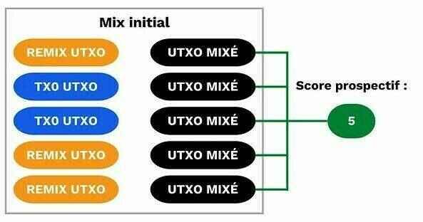
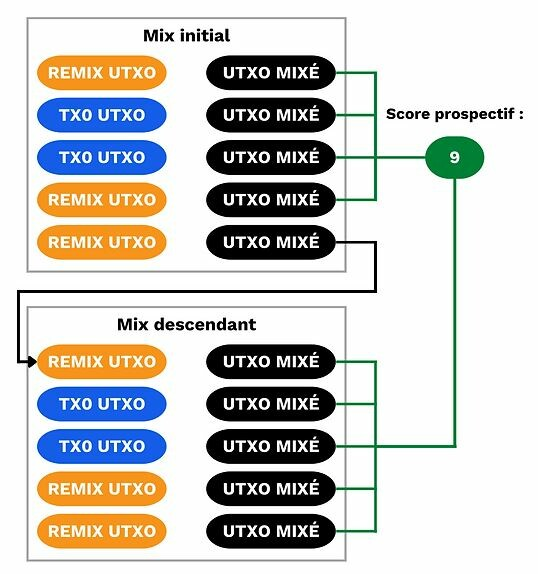
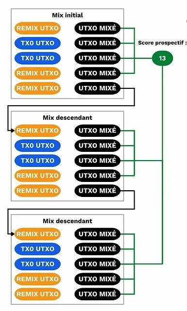
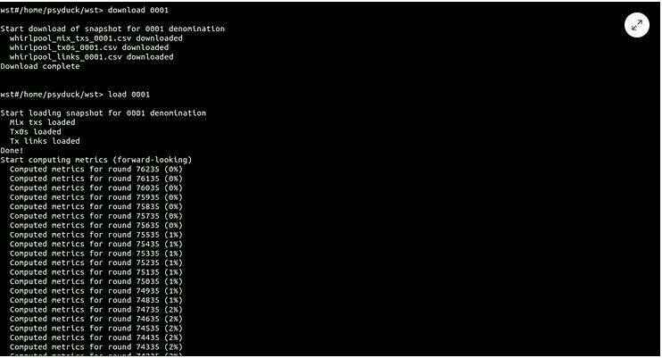

# CoinJoin auf Bitcoin verstehen und nutzen.

Text zur Verfügung gestellt von Loïc Morel als Teil seiner Schriften in Pandul. Originaltext [hier](https://www.pandul.fr/post/comprendre-et-utiliser-le-coinjoin-sur-bitcoin)\*\*\_

## Einleitung

Eines der anfänglichen Probleme bei jedem Peer-to-Peer-Zahlungssystem sind doppelte Ausgaben. Wie kann man verhindern, dass böswillige Akteure das Zahlungsnetzwerk missbrauchen, indem sie dieselben Einheiten mehrfach ausgeben, ohne sich auf eine zentrale Autorität zu verlassen?

Satoshi Nakamoto hat dieses Problem mit seinem Bitcoin-Protokoll gelöst, einem elektronischen Peer-to-Peer-Zahlungsnetz, das ohne das Eingreifen einer zentralen Behörde funktioniert. In seinem Weißbuch erklärt er, dass die einzige Möglichkeit, das Nichtvorhandensein einer Transaktion zu bestätigen und somit zu überprüfen, dass keine doppelten Ausgaben getätigt werden, darin besteht, alle Transaktionen im verteilten Zahlungsnetz zu kennen.

Damit jeder Nutzer über die Transaktionen informiert ist, müssen sie öffentlich bekannt gegeben werden. Das vom Bitcoin-Protokoll vorgeschlagene Peer-to-Peer-Zahlungssystem wird also durch eine völlig transparente und verteilte Infrastruktur ermöglicht. So kann jeder, der über einen Knotenpunkt verfügt, die Kette der elektronischen Unterschriften und die Geschichte jeder Münze ab ihrer Erzeugung durch einen Miner überprüfen.

> Dieses Prinzip der Verteilung des Hauptbuchs und der öffentlichen Bekanntgabe neuer Transaktionen wird in der neuesten Kryptowährung (Bitcoin) verwendet, aber es wurde bereits in früheren Kryptowährungen wie b-money, das 1998 von Wei Dai erfunden wurde, eingesetzt.
>
> Diese Transparenz und Verbreitung bedeutet, dass jeder Nutzer des Bitcoin-Netzwerks die Transaktionen aller anderen Nutzer verfolgen und beobachten kann. Privatsphäre ist daher auf der Ebene der Zahlungen nicht möglich. Stattdessen wird sie auf der Ebene der persönlichen Identifikation ausgeübt.

Anstatt wie im traditionellen Bankensystem jede Kontoeinheit mit einer Identität (Name, Nachname...) zu verknüpfen, werden Bitcoins mit einem Schlüsselpaar verbunden. Die Benutzer werden daher anonym durch eine kryptografische Kennung repräsentiert.

Der Verlust der Privatsphäre bei Bitcoin tritt also ein, wenn ein Beobachter in der Lage ist, bestimmte UTXOs (Unspent Transaction Outputs) mit bestimmten Benutzern zu verknüpfen. Wenn diese Verbindung zwischen einem Nutzer und seinen Kontoeinheiten hergestellt wird, ist es möglich, seine Zahlungen zu verfolgen und die Geschichte seiner Bitcoins zu analysieren.

CoinJoin ist eine Praxis, die es ermöglicht, die Historie von UTXOs zu unterbrechen, um dem Bitcoin-Nutzer ein gewisses Maß an Privatsphäre zu bieten.

In diesem Artikel werden wir gemeinsam untersuchen, was CoinJoin ist, wie es funktioniert und wie es richtig verwendet wird. Wir werden hauptsächlich über Whirlpool sprechen, die meiner Meinung nach effizienteste CoinJoin-Implementierung heute, aber wir werden auch andere bestehende Implementierungen behandeln. Ich werde Ihnen auch über die Indikatoren sprechen, mit denen Sie das Maß an Privatsphäre Ihrer Bitcoins genau berechnen können. Um nicht nur in der Theorie zu bleiben, werde ich Ihnen konkret zeigen, wie Sie eine CoinJoin-Transaktion auf verschiedene Arten durchführen können. Schließlich werden wir bewährte Verfahren untersuchen, um die gewonnene Privatsphäre nach einer Reihe von CoinJoin nicht zu verlieren, und ich werde Ihnen die verschiedenen Tools der Samourai Wallet vorstellen, die dies ermöglichen.

Wenn Ihnen dieser Artikel gefällt, teilen Sie ihn in sozialen Netzwerken und mit Personen, die ihn benötigen.

> Inhaltsverzeichnis:
>
> - CoinJoin und Bitcoin-Mixing.
> - Die verschiedenen CoinJoin-Implementierungen.
> - Theoretische Funktionsweise von Whirlpool.
> - Anleitung: Whirlpool auf Sparrow Wallet.
> - Anleitung: Whirlpool CLI auf Dojo und Whirlpool GUI.
> - Bewährte Verfahren nach dem Mixing.
> - Ausgabewerkzeuge.
> - Ist es schlecht, Bitcoins zu mixen?

Wenn Sie ein Anfänger im Umgang mit Bitcoin sind, empfehle ich Ihnen dringend, die Struktur einer Bitcoin-Transaktion (UTXO, Inputs und Outputs) zu verstehen, indem Sie diesen kurzen Artikel zu diesem Thema lesen: Mechanismus einer Bitcoin-Transaktion: UTXO, Inputs und Outputs.

Die Verwendung von CoinJoin kann indirekte Risiken für den Benutzer mit sich bringen. Einige Anbieter können potenziell Ihre Gelder und/oder Ihr Konto aufgrund Ihrer Handlungen blockieren und Sie um Rechtfertigungen für die Herkunft dieser Gelder bitten. Die in diesem Artikel enthaltenen Informationen stellen weder eine Beratung zu Computersystemen und -software dar, noch eine Aufforderung, CoinJoin durchzuführen. Die Durchführung eines CoinJoin erfordert die Verwendung einer mit dem Internet verbundenen Software-Wallet (sogenanntes "Hot Wallet"). Es besteht die Möglichkeit, dass Ihre Gelder verloren gehen und/oder gestohlen werden. Ich empfehle Ihnen, Ihre eigenen Recherchen zu den verschiedenen bestehenden Risiken anzustellen. Dieser Artikel kann in keiner Weise die einzige Informationsquelle zu diesen Themen sein.

## CoinJoin und Bitcoin-Mixing.

Bevor wir beginnen, ist es wichtig, den Unterschied zwischen CoinJoin und Mixing zu verstehen.

Mixing (auf Englisch: "mixing", "blender" oder "tumbler") ist eine Technik, bei der UTXOs, also Bitcoins, gemischt werden, um ihre Historie zu verwischen und die Rückverfolgbarkeit zu erschweren. Das Ziel dieser Art von Operation ist es, UTXOs zu pseudonymisieren, damit der Benutzer mehr Privatsphäre hat. Die Pseudonymisierung tritt auf, wenn die UTXO Teil einer Gruppe von anderen nicht unterscheidbaren UTXOs ist.

Mixing und CoinJoin sind ursprünglich zwei Techniken, die das gleiche Ziel verfolgen, aber nicht auf die gleiche Weise funktionieren. Beim Mixing wird eine vertrauenswürdige dritte Partei beauftragt, die Bitcoins zu mixen, während CoinJoin nur auf einen Koordinator angewiesen ist, der die Aktionen der Nutzer synchronisiert, aber nie die Kontrolle über die Gelder hat.

Mit dem Aufkommen von CoinJoin wurde das Mischen schnell veraltet und die Nutzer wandten sich davon ab. Es gibt noch einige Mixing-Dienste wie ChipMixer. Heute existiert diese Technik jedoch nur noch am Rande, während CoinJoin von immer mehr Menschen genutzt wird.

In der Alltagssprache der Bitcoiner verwenden daher viele das Wort "mixen", um letztendlich von einem CoinJoin zu sprechen. Auch wenn diese Semantik zunächst falsch ist, wird sie unter den Nutzern im Großen und Ganzen akzeptiert. Man spricht dann von "gemischten Bitcoins", wenn man von UTXOs spricht, die aus einer CoinJoin-Transaktion hervorgegangen sind.


Der CoinJoin ist also eine Technik, mit der die Geschichte der UTXOs gebrochen werden kann. Sie beruht auf einer kollaborativen Transaktion mit einer spezifischen Struktur gleichen Namens: der CoinJoin-Transaktion. Diese Art von Transaktion wurde ursprünglich 2013 von Gregory Maxwell im Forum Bitcoin Talk vorgeschlagen: [https://bitcointalk.org/index.php?topic=279249.0](https://bitcointalk.org/index.php?topic=279249.0).

Die allgemeine Funktionsweise ist wie folgt: Verschiedene Nutzer, die mischen wollen, zahlen einen Betrag als Input einer Transaktion ein. Diese Inputs kommen in verschiedenen Outputs mit demselben Betrag wieder heraus (eventuell mit einem Wechsel, aber das untersuchen wir später). Beim Verlassen der Transaktion ist es daher unmöglich zu bestimmen, welcher Output welchem Nutzer gehört. Es gibt technisch gesehen keine Verbindung zwischen den Inputs und Outputs der CoinJoin-Transaktion. Die Verbindung zwischen jedem Nutzer und jeder UTXO ist ebenso gebrochen wie die Historie jeder Münze.

Um CoinJoin zu ermöglichen, ohne dass ein Nutzer zu irgendeinem Zeitpunkt die Kontrolle über sein Geld verliert, wird die Transaktion zunächst vom Koordinator aufgebaut und dann an jeden Nutzer weitergeleitet. Jeder von ihnen unterschreibt dann die Transaktion für sich selbst, indem er überprüft, ob sie für ihn in Ordnung ist, und dann werden alle Unterschriften der Transaktion hinzugefügt. Wenn ein Nutzer oder der Koordinator versucht, anderen das Geld aus der Tasche zu ziehen, indem er die Outputs der CoinJoin-Transaktion ändert, dann sind die Unterschriften ungültig und die Transaktion wird von den Knoten abgelehnt.

Wenn ich mir eine Analogie erlauben darf, können wir uns den CoinJoin wie eine Verfolgungsjagd zwischen einem Hubschrauber und einem Auto vorstellen. Stellen wir uns einen Hubschrauber vor, der versucht, ein weißes Auto zu verfolgen. Der Hubschrauber stellt die Person dar, die Ihre Zahlungen analysieren möchte, und das weiße Auto stellt Ihren UTXO dar. Der Hubschrauber kann das Auto leicht verfolgen, indem er über ihm fliegt.

Imaginieren wir, dass es jetzt vier weitere ähnliche weiße Fahrzeuge gibt, die in der Nähe des verfolgten Autos auf dieser Straße fahren. Der Hubschrauber kann immer noch das weiße Auto verfolgen, dem er anfangs gefolgt ist.
Nun stellen wir uns vor, dass diese fünf Autos einen Tunnel nehmen, der den Hubschrauber für einen kurzen Moment daran hindert, die Autos zu sehen. Am Ausgang des Tunnels wird der Hubschrauber nicht wissen, welches der fünf weißen Autos dem Auto entspricht, dem er anfangs gefolgt ist. In diesem Beispiel fungiert der Tunnel als CoinJoin. Ihre UTXO nach dem CoinJoin-Transaktion wird unter einer Gruppe anderer UTXO versteckt sein. Ein potenzieller Beobachter wird wissen, dass Ihre UTXO sich in dieser Gruppe befindet, aber er wird nicht sicher bestimmen können, welche Ihre ist.

Das technische Ziel für den CoinJoin-Benutzer besteht darin, möglichst große "Anonymity Sets" auf seinen UTXO zu haben. Dieses Konzept ist sehr wichtig für das Verständnis in der Folge. "Anonymity Sets", manchmal auch als "Anon Sets" bezeichnet, bezieht sich auf die Parameter, die verwendet werden, um das Anonymitätsniveau eines bestimmten UTXO zu berechnen. Es gibt zwei davon: den prospektiven Score und den retrospektiven Score.

Der prospektive Score gibt die Größe der UTXO-Gruppe an, in der sich unsere UTXO versteckt. Zum Beispiel, wenn ich einen CoinJoin mit vier anderen Benutzern mache, wird mein prospektiver Score direkt nach der CoinJoin-Transaktion fünf betragen.

Wenn wir unser Beispiel mit dem Hubschrauber wieder aufgreifen, hat jedes weiße Auto am Ausgang des Tunnels einen prospektiven Score von 5. Der Hubschrauber weiß, dass sein Ziel sich in dieser Gruppe von fünf Autos befindet, aber er kann nicht unterscheiden, welches sein ursprüngliches Zielauto ist.

Ich erkläre Ihnen in diesem Abschnitt "Anon Sets" genauer, was diese beiden Parameter bedeuten. Merken Sie sich vorerst einfach, dass je höher die Anon Sets für einen gemischten UTXO sind, desto schwieriger wird es für einen Beobachter sein, ihn zu verfolgen.

# Die verschiedenen Implementierungen von CoinJoin.

Eine CoinJoin-Transaktion könnte theoretisch manuell durchgeführt werden, direkt mit anderen Bitcoin-Benutzern, die Sie treffen. Aber diese Lösung ist nicht nur sehr mühsam, sondern auch ziemlich ineffizient. Damit die CoinJoin-Transaktion effizient, schnell und im Netzwerk skalierbar ist, muss man sich mit jedem anderen Benutzer weltweit einigen können. Stattdessen werden die Dienste eines Koordinators verwendet, dessen Rolle es ist, eine Implementierung mit einem Transaktionsmodell zu entwickeln, die verschiedenen Benutzer miteinander zu verbinden und die Informationen zur ordnungsgemäßen Durchführung der gemeinsamen Transaktion zu übermitteln.

Es gibt hauptsächlich drei Implementierungen von CoinJoin auf Bitcoin:

> JoinMarket.
>
> Wasabi.
>
> Whirlpool.
> Auch wenn das endgültige Ziel dieser drei Implementierungen dasselbe ist, nämlich das Brechen der UTXO-Historie durch CoinJoin-Transaktionen, unterscheiden sich ihre Funktionsweisen stark voneinander. Es ist daher ratsam, sich über die Details jeder Implementierung zu informieren, um diejenige auszuwählen, die am besten zu unseren Erwartungen passt.

Sie haben es sicherlich schon verstanden, wenn Sie mir auf Twitter folgen, persönlich bevorzuge ich die Verwendung der Whirlpool-Implementierung. Ich werde Ihnen daher kurz die theoretische Funktionsweise der beiden anderen Lösungen erklären und Ihnen im Detail erläutern, warum ich sie weniger geeignet finde. Anschließend werden wir uns genauer mit der Funktionsweise von Whirlpool befassen, der Implementierung, die von den Teams von Samourai Wallet entwickelt wurde und meiner Meinung nach die beste CoinJoin-Lösung ist.

Die genannten Merkmale für jede Implementierung gelten derzeit. Es ist möglich, dass sie sich geändert haben, wenn Sie diesen Artikel lesen.


## JoinMarket.

JoinMarket unterscheidet sich deutlich von anderen Hauptimplementierungen durch sein Modell zur Verbindung von Benutzern. Es basiert auf einem Marktplatz, auf dem Benutzer Liquidität bereitstellen, um zu mischen, und Benutzer, die Liquidität nehmen, um zu mischen.

Wenn Sie ein CoinJoin in JoinMarket durchführen möchten, müssen Sie sich entscheiden, ob Sie Ihre Bitcoins hinterlassen möchten, damit andere sie gegen Bezahlung zum Mischen verwenden können, oder ob Sie die Liquidität anderer Benutzer nehmen möchten, um direkt gegen Bezahlung zu mischen. Es gibt also "Macher", die ihre Bitcoins zur Verfügung stellen, und "Nehmer", die die Liquidität nutzen. Die "Nehmer" vergüten die "Macher" für ihren Service.

Es handelt sich also um einen völlig freien Markt ohne Nutzungsbedingungen.

Der Hauptnachteil dieses Dienstes besteht darin, dass er ziemlich komplex zu bedienen ist. Man muss über grundlegende Kenntnisse in der Verwendung von Linux-Befehlszeilen verfügen, um ihn effektiv nutzen zu können. Diese Implementierung ist relativ effizient, aber sie ist definitiv nicht für die breite Öffentlichkeit geeignet.

In Bezug auf die mit der CoinJoin-Transaktion verbundenen Funktionen hat JoinMarket im Vergleich zu Whirlpool einige Schwächen. Zum Beispiel ermöglicht die Struktur der verwendeten CoinJoin-Transaktion keine 0% deterministischen Verbindungen zwischen den Inputs und Outputs. Es ist auch zu beachten, dass JoinMarket kein Tool enthält, um eine erneute CoinJoin zwischen Münzen zu verhindern, die sich in der Vergangenheit bereits getroffen haben.

Was die zusätzlichen Dienstleistungen für den Benutzer betrifft, enthält JoinMarket kein Tool, um die Anon Sets einer UTXO einfach zu berechnen. Was die Tools zum Ausgeben von gemischten UTXOs betrifft, bietet die Implementierung nur PayJoin an.
Finalement, JoinMarket ist eine interessante Implementierung von CoinJoin, aber sie ist nicht für jeden geeignet. Wenn Sie mit Befehlszeilen vertraut sind, das Funktionieren von CoinJoin gut verstehen und das "Takers" / "Makers" Modell mögen, dann könnte Ihnen diese Implementierung gefallen.

## Wasabi 2.0.

Der CoinJoin-Service von Wasabi funktioniert theoretisch ähnlich wie der von Whirlpool. Im Gegensatz zu JoinMarket, wo die Organisation auf einem freien Markt stattfindet, fungiert Wasabi als Koordinator, der automatisch die Bitcoins aller Benutzer des Services mixt.

Die Struktur der CoinJoin-Transaktion selbst unterscheidet sich jedoch stark von der von Whirlpool. Wie wir im nächsten Abschnitt sehen werden, erfolgt die Erhöhung des Anon Set der gemischten UTXOs auf Whirlpool durch die Akkumulation mehrerer CoinJoins mit jeweils wenigen Benutzern. Im Gegensatz dazu erfolgt die Anon Set der gemischten UTXOs auf Wasabi durch wenige Transaktionen mit einer großen Anzahl von Benutzern.

Beispiel für einen möglichen CoinJoin auf Wasabi 1.0:
https://kycp.org/#/b994a9cbdc20e971207bde4f800b9ce99dba35478a2a997bc48e7f9f80bd2d02

Beispiel für einen CoinJoin auf Whirlpool: https://kycp.org/#/323df21f0b0756f98336437aa3d2fb87e02b59f1946b714a7b09df04d429dec2

Die beiden Implementierungen unterscheiden sich auch in der Wechselgeldverwaltung. Bei Whirlpool wird das Wechselgeld vor dem CoinJoin durch die TX0 ausgeschlossen und von den UTXOs isoliert (darauf gehe ich im nächsten Abschnitt ein). Bei Wasabi ist das Wechselgeld ein Output der CoinJoin-Transaktion. Die Wahl dieser CoinJoin-Struktur bei Wasabi führt dazu, dass deterministische Links zwischen den Inputs und bestimmten Outputs bestehen bleiben.

In der Version 2.0 hat Wasabi seine CoinJoin-Gebührenpolitik vollständig geändert. Die Koordinationsgebühren betragen nun 0,3 % für UTXOs über 0,01 Bitcoin und sie sind kostenlos für UTXOs unter diesem Betrag. Kleine UTXOs profitieren auch von kostenlosen Remixes. Beachten Sie, dass auch wenn die Koordinationsgebühren kostenlos sind, der Benutzer weiterhin die Mining-Gebühren für alle Transaktionen, einschließlich der Remix-Transaktionen, zahlen muss.

Im Gegensatz zu Whirlpool gilt also: Je mehr Anon Sets Sie auf Ihren UTXOs haben wollen, die mit Wasabi gemischt werden, desto mehr Gebühren müssen Sie zahlen. Dies gilt sowohl für die Version 1.0 als auch für die Version 2.0 von Wasabi. Auch wenn die letztere Version kleineren UTXOs die Koordinatorengebühr anbietet, bleiben immer noch die Mining-Gebühren. Außerdem hatte ich bei der Verwendung der Version 2.0 den Eindruck, dass die maximal erreichbare prospektive Punktzahl auf Wasabi bei 300 liegt. Auf Whirlpool kann man innerhalb weniger Monate leicht einen fünfstelligen prospektiven Score erreichen, und dieser Score ist nicht begrenzt.

Abgesehen von der Struktur des CoinJoin an sich, fehlt es Wasabi meiner Meinung nach stark an zusätzlichen Tools zum CoinJoin, insbesondere um die gemischten UTXOs sauber ausgeben zu können. In der Version 1.0 gibt es kein Tool zum Ausgeben. In der Version 2.0 hat Wasabi jedoch ein Tool zum Ausgeben von gemischten UTXOs eingebaut, mit dem die Inputs und Outputs automatisch angepasst werden können, um die Privatsphäre zu maximieren, indem der Geldwechsel unterdrückt wird. Obwohl diese Funktion nützlich sein kann, scheint sie weit weniger effektiv und praktisch in der Anwendung zu sein als die unzähligen Tools, die auf Samourai und Sparrow Wallet angeboten werden, um die mit Whirlpool gemischten UTXOs sauber auszugeben. Auf all diese Tools gehe ich weiter unten im Artikel ein, in diesem Abschnitt: Die Ausgabetools.

Im Gegensatz zu Whirlpool trennt Wasabi die Konten für gemischte UTXOs, ungemischte UTXOs und Devisen-UTXOs nicht. Diese Portfoliostruktur führt dazu, dass Adresswiederverwendungen zwischen gemischten und anderen UTXOs möglich sind. Wenn das passiert, kann es dazu kommen, dass ein CoinJoin komplett kaputt geht.

Schließlich, nachdem ich die Version 2.0 ausprobiert hatte, hatte ich wirklich das Gefühl, dass ich meine Coinjoin nicht unter Kontrolle habe, wenn ich Wasabi benutze. Alles ist vereinfacht und automatisiert, die Benutzeroberfläche ist wunderschön, aber ist es das, was man von einer CoinJoin-Implementierung erwartet?

## Theoretische Funktionsweise von Whirlpool.

Im Gegensatz zu den anderen erwähnten Implementierungen zeichnet sich Whirlpool durch die Konstruktion von "ZeroLink"-CoinJoin-Transaktionen aus, d. h. mit strikt keiner technisch möglichen Verbindung zwischen allen Inputs und allen Outputs.

Dies wird durch eine Coinjoin-Transaktion ermöglicht, bei der jeder Nutzer denselben Betrag an Inputs einzahlt, die in ebenso vielen Outputs mit demselben Betrag wieder ausgeben werden.

Mit dieser restriktiven Konstruktion bezüglich der Inputs ist die CoinJoin-Transaktion von Whirlpool die einzige, die es den Nutzern ermöglicht, 0% deterministische Verbindungen zwischen Inputs und Outputs zu haben. Das bedeutet, dass jeder Output vollkommen dieselbe Wahrscheinlichkeit hat, einem Nutzer zu gehören, wie alle anderen Outputs in der Transaktion.'

Die Anzahl der Teilnehmer für jeden Mix ist auf 5 begrenzt: 2 Eingänge und 3 Remixers (wir werden später sehen, was das bedeutet). Jeder CoinJoin-Transaktion auf Whirlpool hat daher immer 5 Eingänge und 5 Ausgänge.


## Whirlpool-Konzept.

Das von Whirlpool vorgeschlagene Modell basiert auf sehr kleinen Transaktionen. Im Gegensatz zu Wasabi und JoinMarket wird die Stärke der Anon Sets nicht durch die Anzahl der teilnehmenden Benutzer beim CoinJoin erreicht, sondern durch die Abfolge mehrerer kleiner CoinJoins mit jeweils 5 Teilnehmern.

Der Benutzer wird einmalig beim Eintritt in einen Pool bezahlen und dann so oft wie gewünscht kostenlos remixen können. Die neuen Teilnehmer zahlen die Mining-Gebühren für die Remixers.

Die Anon Sets werden exponentiell größer, je mehr der Benutzer und seine getroffenen Peers remixen. Das Ziel ist es also, von all diesen kostenlosen Remixes zu profitieren, die jedes Mal mehr Tiefe in die Anon Sets der UTXO bringen.

Whirlpool wurde nach 2 Hauptkriterien entwickelt:

- Die Implementierung sollte auf Mobilgeräten nutzbar sein.

- Die Remix-Zyklen sollten schnell ablaufen.

Aus diesen beiden Gründen haben sich die Samourai-Teams dafür entschieden, die Anzahl der Benutzer pro Zyklus auf 5 zu begrenzen. Eine geringere Anzahl hätte keinen effektiven CoinJoin ermöglicht und die Anon Sets pro Zyklus zu stark reduziert. Eine höhere Anzahl wäre wahrscheinlich auf mobilen Clients nicht handhabbar gewesen und hätte den Zyklusfluss verringert.

Letztendlich ist es nicht erforderlich, eine hohe Anzahl von Teilnehmern pro CoinJoin auf Whirlpool zu haben, da die Anon Sets durch die Akkumulation mehrerer Mixing-Zyklen entstehen.

## Pools und Gebühren.

Damit diese mehrfachen Zyklen die Anon Sets der UTXO tatsächlich erhöhen, muss ein gewisser Rahmen geschaffen werden, um die Beträge der verwendeten UTXO einzuschränken. Whirlpool definiert daher verschiedene Pools.

Ein Pool ist eine Gruppe von Benutzern, die mixen möchten und sich auf den Betrag der verwendeten UTXO geeinigt haben, um die CoinJoin-Funktion zu optimieren. Jeder Pool definiert einen festen Betrag der UTXO, an den sich der Benutzer anpassen muss, um beitreten zu können. Konkret müssen Sie beim Durchführen von CoinJoin einen Pool auswählen, in den Sie eintreten möchten, um mit dem Mixen zu beginnen. Die derzeit auf Whirlpool verfügbaren Pools sind:

- 0,5 Bitcoin.
- 0,05 Bitcoin.
- 0,01 Bitcoin.
- 0,001 Bitcoin (= 100.000 Sats).

Jeder kann also den passenden Pool finden.

Jeder Pool hat ein maximales Betragslimit für den Eintritt:

| Pool (Bitcoin) | Maximaler Betrag pro Eingang (Bitcoin) |
| -------------- | -------------------------------------- | --- | --- | ---- | --- |
| '              | 0,5                                    | 35  |     | 0,05 | 3,5 |
| 0,01           | 0,7                                    |
| 0,001          | 0,025                                  |

Um in einen Pool einzutreten, müssen Gebühren entrichtet werden. Diese sind für jeden Pool festgelegt und dienen dazu, die Teams zu entlohnen, die Whirlpool entwickeln und verwalten. Die Gebühren werden nur einmal erhoben, wenn Sie auf den Pool zugreifen. Sobald Sie in einen Pool eingetreten sind, können Sie so oft wie Sie möchten kostenlos remixen.

Derzeit gelten folgende Gebühren für jeden Pool:

| Pool (Bitcoin) | Eingangsgebühr (Bitcoin) |
| -------------- | ------------------------ |
| 0,5            | 0,0175                   |
| 0,05           | 0,00175                  |
| 0,01           | 0,0005 (50.000 Sats)     |
| 0,001          | 0,00005 (5.000 Sats)     |

Sie können die Gebühren für Ihre Whirlpool-Mixe leicht auf dieser Website berechnen: [https://www.whirlpoolfees.com/](https://www.whirlpoolfees.com/)

Beachten Sie auch, dass diese Gebühren ein "Eintrittsticket" für den Pool sind. Daher sind die Gebühren für den Eintritt in den Pool 0,01 BTC genauso hoch wie für den Eintritt in den Pool 0,5 BTC. Bevor Sie mixen, sollten Sie sich also überlegen, ob Sie weniger Gebühren für einen kleinen Pool zahlen möchten, in diesem Fall jedoch mit mehreren kleinen UTXOs herauskommen, oder ob Sie lieber einen größeren Pool nutzen möchten, um mehr Gebühren zu zahlen, aber mit weniger UTXOs herauskommen.

Nach Abschluss der verschiedenen Mischzyklen wird in der Regel davon abgeraten, mehrere gemischte UTXOs zusammenzuführen. Dies könnte die zuvor hart erkämpfte Vertraulichkeit gefährden. Manchmal ist es also besser, einen größeren Pool zu nutzen und mehr Gebühren zu zahlen, um mit weniger UTXOs größerer Größe herauszukommen.

Die anderen zu berücksichtigenden Gebühren sind natürlich die Mining-Gebühren, die bei jeder Bitcoin-Transaktion anfallen. Als Whirlpool-Benutzer müssen Sie die Mining-Gebühren für Tx0 und die Mining-Gebühren für den ersten Mix bezahlen. Alle anderen Remixes sind für Sie kostenlos, da das Gebührenmodell von Whirlpool auf neuen Teilnehmern basiert.

Jeder CoinJoin besteht aus 5 Benutzern. Davon sind 2 Eingänge und 3 Remixes. Daher zahlen die beiden Eingänge jedes Mixes die Mining-Gebühren für die 5 Benutzer, und diese beiden Eingänge können dann die kostenlosen Remixes nutzen.


Dank dieses Gebührenmodells unterscheidet sich Whirlpool wirklich von anderen CoinJoin-Diensten, da die Anon Sets der UTXO nicht proportional zum Preis sind, den der Benutzer bezahlt. Es ist also möglich, sehr hohe Anon Sets zu erreichen, indem man einfach die Poolgebühren und die Mining-Gebühren für zwei Transaktionen (Tx0 und Initialmix) bezahlt.
Natürlich muss der Benutzer auch die Mining-Gebühren bezahlen, wenn er seine UTXO aus dem Pool abheben möchte, nachdem er seine vielen Remixes durchgeführt hat.

Wie bereits erklärt, befindet sich eine UTXO in einem Pool, wenn sie für das Mixing verfügbar ist. Das bedeutet nicht, dass der Benutzer sein Eigentum verliert. Während der verschiedenen CoinJoin-Vorgänge mit Whirlpool behalten Sie die volle Kontrolle über Ihre Schlüssel und somit über Ihre Bitcoins.

## Konten in Whirlpool.

Um diese Art von CoinJoin-Transaktion einzurichten, muss eine Wallet, die Whirlpool verwendet, mehrere Konten ableiten.

Ein Konto ist ein Unterabschnitt in einer HD-Wallet. Diese Trennung erfolgt in einer Tiefe von 3 der Wallet, also auf der Ebene der xpub/xprv.

Wenn Sie mit dem Konzept von Konten in einer HD-Wallet nicht vertraut sind, empfehle ich Ihnen, mein E-Book zu diesem Thema zu lesen, das Sie hier kostenlos herunterladen können. Ich habe auch einen Artikel über die Funktionsweise der Ableitungspfade geschrieben: Understanding Bitcoin Wallet Derivation Paths.

Sie müssen natürlich nicht alles verstehen, um Whirlpool zu verwenden, aber merken Sie sich einfach, dass ein Konto ein Unterabschnitt einer HD-Wallet ist, der vollständig von anderen Konten getrennt ist und über seine eigene xpub/zpub verfügt.

Es ist aufgrund dieser strikten Trennung der verschiedenen Konten unmöglich, dass eine Adresswiederverwendung zwischen gemischten und nicht gemischten Bitcoins in Whirlpool auftritt.

In jeder HD-Wallet können bis zu 2^(32/2) verschiedene Konten abgeleitet werden. Das erste Konto, das Sie standardmäßig in Ihrer Wallet verwenden, ohne es zu wissen, ist das Konto 0'.

Wenn Sie eine Wallet verwenden, die für die Verwendung von Whirlpool geeignet ist, erstellt diese automatisch 5 Konten:

> Das Konto "Depot" mit dem Index 0'.

> Das Konto "Bad Bank" (doxxic change) mit dem Index 2 147 483 644'.

> Das Konto "Pre Mix" mit dem Index 2 147 483 645'.

> Das Konto "Post Mix" mit dem Index 2 147 483 646'.

> Das Konto "Ricochet" mit dem Index 2 147 483 647': Dieses letzte Konto wird nicht direkt im Whirlpool-Protokoll verwendet, ist aber damit verbunden. Ich werde weiter unten in dem Abschnitt über Ausgabewerkzeuge darüber sprechen.

Jeder Account hat seinen eigenen Zweck und ist für eine bestimmte Aufgabe vorgesehen.

Alle Accounts hängen von einem gemeinsamen Seed ab. Der Benutzer kann daher leicht auf alle seine Gelder zugreifen, falls es Probleme mit seinem Wiederherstellungssatz und seinem optionalen Passwort gibt. Es ist jedoch erforderlich, dem Wiederherstellungssoftware die verschiedenen Indexe der verwendeten Konten anzugeben.

Lassen Sie uns nun die verschiedenen Schritte eines CoinJoin Whirlpool innerhalb dieser Konten betrachten.

## Tx0.

Am Anfang eines CoinJoin steht das Deposit-Konto. Dies ist das Konto, das standardmäßig verwendet wird, wenn Sie eine neue Bitcoin-Wallet erstellen. Dieses Konto muss mit den Bitcoins aufgeladen werden, die der Benutzer mischen möchte.

Tx0 ist die erste Transaktion im Whirlpool-Mischprozess. Ihr Ziel ist es, die zu mischenden UTXOs zu bereinigen, bevor sie an den ersten Mix gesendet werden. Diese Transaktion teilt den Eingangs-UTXO in mehrere UTXOs auf, die dem ausgewählten Poolbetrag entsprechen. Alle diese ausgeglichenen UTXOs werden an das Premix-Konto gesendet. Der restliche Betrag, der nicht in den ausgewählten Pool passt, wird auf ein dediziertes Konto namens Bad Bank (oder "Doxxic Change") übertragen.

Tx0 wird auch verwendet, um die Gebühren an den Koordinator zu zahlen.

Sie müssen Mining-Gebühren für Tx0 bezahlen.


Bildnachweis (modifiziert): KYCP.org: https://kycp.org/#/a126e48d4a6eb8d19682ec0e23ad45e76cd52b45f6c17be5068ae051d4b2cc24

In diesem Beispiel einer Tx0-Transaktion sehen wir eine Eingabe von 2,2550 Bitcoins vom Deposit-Konto des Benutzers, der die Tx0 initiiert. Diese Eingabe wird in mehrere Ausgabe-UTXOs aufgeteilt, die Folgendes repräsentieren:

- Die Koordinationsgebühren, hier: 0,0250 B.

- Die vier UTXOs, die zum Premix-Konto des Benutzers gehen und bereit sind, gemischt zu werden. Diese UTXOs sind auch beim Koordinator registriert.

- Der Restbetrag, der nicht in den Pool passt, da er zu klein ist: dies ist der toxische Wechsel, der zu seinem dedizierten und isolierten Konto geht.

Die Gebühren hier unterscheiden sich von denen, die ich Ihnen in der vorherigen Tabelle gegeben habe, da Samourai seine Preise für Whirlpool im März 2021 gesenkt hat.

## Doxxic Change-Konto.

Der Wechsel, der nicht in den Pool passt, wird an das Doxxic Change-Konto (auch als "Bad Bank" bezeichnet) gesendet, um es vollständig von den anderen Konten zu trennen.

Dieser UTXO gefährdet die Privatsphäre des Benutzers, da er nicht nur immer noch mit seiner Vergangenheit verbunden ist und möglicherweise die Identität seines Eigentümers preisgibt, sondern auch als einem Eigentümer zugehörig gekennzeichnet ist, der an einem CoinJoin teilgenommen hat.
'Si cet UTXO est fusionné avec des UTXO mixés, ces derniers perdront toute confidentialité gagnée précédemment. S'il est fusionné avec d'autres Doxxic Changes, l'utilisateur risque de perdre en confidentialité. Il faut donc le traiter avec prudence. Je vous explique précisément comment traiter cet UTXO toxique dans cette partie.

## Compte Pre Mix.

Im Konto Pre Mix befinden sich die bei Tx0 ausgeglichenen UTXOs, die bereit sind, gemischt zu werden. Diese UTXOs sind etwas höher als der Poolbetrag, da sie die Kosten für das Mining ihres Anfangsmixes ausgleichen müssen.

Sobald diese UTXOs in ihren ursprünglichen Mix übergegangen sind, wird das Pre Mix-Konto leer sein und neue UTXOs werden im nächsten Konto vorhanden sein.

## Post-Mix-Konto.

Das Post-Mix-Konto enthält alle UTXOs, die seit ihrem ursprünglichen Mix frisch gemischt wurden. Es beherbergt auch alle anderen UTXOs, die noch für Remixe verfügbar sind.

Wenn der Whirlpool-Client läuft, stehen die UTXOs im Post-Mix-Konto für Remixe zur Verfügung. Sie werden nach dem Zufallsprinzip für Remixe ausgewählt.

Wenn der Nutzer gemixte UTXOs ausgeben möchte, kann er dies direkt von diesem Post-Mix-Konto aus tun. Es ist übrigens ratsam, seine Post Mix-UTXOs in diesem Konto zu belassen, nicht nur, damit sie kostenlos remixt werden können, sondern auch, damit sie den Whirlpool-Kreislauf nicht verlassen, da sie sonst ihre Vertraulichkeit verlieren könnten.

## Anon Sets.

Wie bereits erläutert, sind Anon Sets zwei Parameter, mit denen Sie berechnen können, wie vertraulich ein UTXO ist und wie effizient Ihre CoinJoin-Sitzung daher ist.

Der erste Parameter ist der prospektive Score (auf Englisch: "Forward-looking Anon Set"). Obwohl diese Semantik falsch ist, wird dieser Score oft als Abkürzung direkt als "Anon Set" bezeichnet.

Die prospektive Punktzahl eines UTXOs stellt die Größe der Gruppe dar, in der dieser zu einem bestimmten Zeitpunkt versteckt ist.

Um Ihnen ein Bild zu geben: Die prospektive Punktzahl ist die Anzahl der aktuellen UTXOs, die mit einem bestimmten UTXO in der Vergangenheit übereinstimmen können. Stellen wir uns zum Beispiel vor, dass ein Akteur, der die Bitcoin-Kette beobachtet, ein UTXO aufspürt, das Ihnen gehört, bevor es in den CoinJoin-Pool gelangt. Nachdem Ihre Münze mehrere Mixe durchlaufen hat, fragt sich der Beobachter, wo sie geblieben ist. Er beginnt dann, die verschiedenen möglichen Wege nachzuvollziehen, und dank der Natur der CoinJoin wird er auf mehrere UTXOs stoßen, die potenziell mit Ihrem übereinstimmen könnten. Diese Anzahl an potenziellen UTXOs ist die prospektive Punktzahl Ihres UTXOs, der sich unter ihnen befindet.

Bei der ersten Whirlpool-CoinJoin wird ein UTXO also eine prospektive Punktzahl von 5 haben. Das bedeutet, dass er in einer wahrscheinlichen Gruppe von 5 UTXOs versteckt sein wird:



Wenn jemand mein Eingangs-UTXO überwacht, wird er nicht wissen, welches dieser 5 Ausgangs-UTXOs mir gehört.

Dieser prospektive Score erhöht sich mit jeder Remix-Aktion des Benutzers sowie mit den Remix-Aktionen der Peers, die er während seiner vorherigen Mischungen getroffen hat. Nehmen wir unser Beispiel mit einem UTXO, das derzeit einen prospektiven Score von 5 hat. Wenn dieses UTXO, das uns gehört, remixt wird, wird sein Score auf 9 steigen.

Was bei Whirlpool sehr interessant ist, ist, dass selbst wenn mein UTXO nicht remixt wird, da er Teil einer Gruppe ist, in der er nicht von den anderen unterschieden werden kann, sein Score aufgrund der Remix-Aktionen seiner in der Vergangenheit getroffenen Peers steigen wird.

Angenommen, unser UTXO hat eine erste Mischung durchlaufen und hat daher einen Score von 5. Wenn ein UTXO, der sich in derselben Mischung befindet, in einer neuen Remix-Aktion verwendet wird, wird der Score meines UTXOs auf 9 erhöht, obwohl er sich seit der ersten Mischung nicht bewegt hat:



Diese exponentielle Erhöhung des prospektiven Scores wird möglich, wenn ein UTXO, das das UTXO, das ich während meiner ersten Mischung getroffen habe, getroffen hat, sich remixt, dann erhöht sich mein Anon Set weiter:



Diese exponentielle Erhöhung wird durch das einzigartige Modell von Whirlpool ermöglicht, das auf vielen aufeinanderfolgenden kleinen CoinJoin basiert.

Zur Erinnerung, all diese Remix-Aktionen sind kostenlos, daher ist es sehr klug, seine UTXOs zu mischen und remixen zu lassen und gleichzeitig von den Remix-Aktionen der getroffenen Peers zu profitieren, solange man seine eigenen UTXOs nicht ausgeben muss.


Das zweite Anon Set, das zur Berechnung des Vertraulichkeitsniveaus eines bestimmten UTXOs verwendet werden kann, ist der retrospektive Score (auf Englisch "Backward-looking Anon Set").

Dieser retrospektive Score ist sozusagen das Erbe, das Ihnen die vorherigen Peers Ihrer ersten Mischung hinterlassen. Er gibt an, wie viele Tx0 Ihrem gemischten UTXO entsprechen können.

Er ermöglicht es also, das Vertraulichkeitsniveau eines UTXOs in Bezug auf einen Versuch des Trackings entgegen der zuvor genannten Methode zu beurteilen.

Erinnern Sie sich, dass der prospektive Score es ermöglicht, einzuschätzen, wie vertraulich man ist, wenn versucht wird, von einem Eingangs-UTXO in CoinJoin-Zyklen zu unserem Ausgangs-UTXO zu verfolgen. Beim retrospektiven Score ermöglicht dieser Parameter die Beurteilung, wie vertraulich ein Eingangs-UTXO ist, wenn man als Ausgangspunkt für das Tracking ein Ausgangs-UTXO des Zyklus nimmt. Das heißt, man geht den umgekehrten Weg.

Nehmen wir zum Beispiel an, ein Beobachter der Bitcoin-Kette kennt einen UTXO und würde gerne zurückverfolgen, woher er kommt, um zu versuchen, seine Herkunft zu bestimmen. Er wird sehen, dass dieser UTXO durch CoinJoins gelaufen ist, und er wird auf viele UTXOs am Eingang von CoinJoins stoßen, die potenziell der gesuchte UTXO sein könnten. Diese Anzahl potenzieller UTXOs ist der retrospektive Score des getrackten UTXOs.

Um diesen Rückwärtsscore zu berechnen, müssen wir zunächst von dem anvisierten UTXO aus alle Eingangs-UTXOs zählen, die von einem Tx0 stammen. Dann müssen wir die Remixing-Eingangs-UTXOs der Transaktion analysieren und zu den drei vorherigen CoinJoin-Transaktionen zurückverfolgen, aus denen sie stammen. Bei jeder dieser drei Transaktionen führen wir die gleiche Berechnung durch. Das geht so weiter bis zur CoinJoin Genesis-Transaktion, d.h. der ersten CoinJoin-Transaktion des Pools.


Im obigen Schema ist die Berechnung des retrospektiven Scores eines der UTXOs, die aus dem CoinJoin ganz oben kommen, gleichbedeutend mit der Berechnung der Anzahl der Tx0 (die blauen Blasen), die in den CoinJoins vorhanden sind, die dem anvisierten CoinJoin aufsteigen, bis hin zum CoinJoin Genesis.

Im Gegensatz zum prospektiven Score eines UTXO, der nach seinem anfänglichen Mix mit 5 beginnt und dann ansteigt, wird der retrospektive Score eines UTXO sofort sehr hoch sein, wenn Sie Ihren anfänglichen Mix gemacht haben. Je jünger ein UTXO gemischt wurde, desto höher ist seine rückblickende Punktzahl. Sie profitieren von der Vererbung früherer Mixe auf den gewählten Pool.

## Whirlpool Stats Tool (WST).

Um die Anon Sets eines Ihrer UTXOs, die auf Whirlpool gemixt wurden, einfach zu berechnen, können Sie das Whirlpool Stats Tool (WST) verwenden. Ein Tool, das speziell für die Berechnung Ihrer Anon Sets auf Whirlpool entwickelt wurde.

Wenn Sie ein Benutzer von RoninDojo sind, ist das Tool auf Ihrem Knoten vorinstalliert. Um von RoninCLI aus darauf zuzugreifen, gehen Sie auf :

```
Samourai Toolkit > Whirlpool Stat Tool
```

Wenn Sie kein RoninDojo haben, erfahren Sie hier, wie Sie das WST-Tool auf einem Rechner mit Linux installieren:

Sie benötigen: Tor Browser (oder Tor), Python 3.4.4 oder höher, git und pip3.

Um ihre Version zu überprüfen, geben Sie die Befehle :

```
python --version
git --version
pip --version
```

Installieren Sie die Abhängigkeiten :

```
pip install PySocks
pip install requests[sock5]
pip install plotly
pip install datasketch
pip install numpy
```

Installez Whirlpool Stats Tool :

```
#Clonnez le répertoire :
git clone https://code.samourai.io/whirlpool/whirlpool_stats.git

#Accédez au répertoire /whirlpool_stats :'
'cd whirlpool_stats
#Installieren Sie die Abhängigkeiten mit pip:
pip3 install -r ./requirements.txt
```

Ich persönlich hatte einige Probleme mit dieser neuesten Version von WST. Wenn es bei Ihnen nicht funktioniert, können Sie auch die vorherige Version auf github klonen, die perfekt funktioniert: https://github.com/Samourai-Wallet/whirlpool_stats. Die folgenden Schritte sind die gleichen. Beachten Sie nur, dass der 100k sats-Pool zu diesem Zeitpunkt noch nicht existierte, so dass Sie ihn manuell zum Code hinzufügen müssen, wenn Sie die alte Version verwenden.

Legen Sie dann ein Arbeitsverzeichnis an, in dem die Transaktionsdaten gespeichert werden, und starten Sie WST:

#Zugriff auf das gewünschte Verzeichnis, zum Beispiel home:

```
cd ~

#Erstellen Sie ein eigenes Verzeichnis, zum Beispiel mit dem Namen "wst":
mkdir wst

#Zugriff auf das Unterverzeichnis /whirlpool_stats:
cd whirlpool_stats/whirlpool_stats/

#Starten Sie WST:
python3 wst.py
```

Sobald WST installiert und gestartet ist, können Sie die Anon-Sets wie folgt berechnen. Diese Schritte sind ähnlich, egal ob Sie sich auf einem normalen Rechner oder auf RoninDojo befinden:

Gib den folgenden Befehl ein, um den Proxy auf Tor zu setzen (für RoninDojo ist dieser Befehl obligatorisch):

```
        socks5 127.0.0.1:9050
```

Wenn du den Tor-Browser verwendest, muss er laufen und der Befehl lautet:

```
        socks5 127.0.0.1:9150
```

Rufen Sie dann das im vorherigen Schritt erstellte Arbeitsverzeichnis mit dem Befehl workdir auf. Wenn Sie mit RoninDojo arbeiten, überspringen Sie diesen Schritt:

```
workdir /home/psyduck/wst
#Replace the path in this example with your own path.
```


Laden Sie dann die Daten aus dem Pool herunter, der Ihre Transaktion enthält:

```
0001 herunterladen

#Ersetzen Sie 0001 durch den Code der Poolbezeichnung, an der Sie interessiert sind.
```

Die Stückelungscodes sind wie folgt in WST:

- Pool 0,5 Bitcoins: 05
- Pool 0,05 Bitmünzen: 005
- Pool 0,01 Bitmünzen: 001
- Pool 0,001 Bitmünzen: 0001

Sobald die Daten heruntergeladen sind, laden Sie sie mit dem Befehl:

```
laden 0001

#Ersetzen Sie 0001 durch den Code des Pools, an dem Sie interessiert sind.
```

Herunterladen von WST-Daten aus OXT-Befehlszeilen](assets/11.jpeg)

Nachdem Sie die Daten geladen haben, geben Sie den Befehl score gefolgt von Ihrer TXID (Transaktionskennung) ein, um die Anon Sets zu erhalten:

```
TXID auswerten

#Ersetzen Sie TXID durch den Bezeichner Ihrer Transaktion.
```



'WST zeigt Ihnen zunächst die rückblickenden Kennzahlen (Backward-looking metrics) und dann die zukunftsgerichteten Kennzahlen (Forward-looking metrics) an. Zusätzlich zu den Bewertungen der Anon Sets gibt Ihnen WST auch die Verbreitungsrate Ihrer Ausgabe im Pool basierend auf dem Anon Set an.
Bitte beachten Sie, dass die zukunftsgerichtete Bewertung Ihrer UTXO von der TXID Ihres ersten Mixes und nicht von Ihrem letzten Mix berechnet wird. Im Gegensatz dazu wird die rückblickende Bewertung einer UTXO von der TXID des letzten Zyklus berechnet.

## Muuuh xpubs.

Es gibt viele Fehlinformationen über die Funktionsweise von Whirlpool. Die verbreitetste Kritik ist wahrscheinlich die Behauptung, dass Samourai auf einem Server Zugriff auf die xpubs der Benutzer hätte.

In Wirklichkeit funktioniert das Whirlpool-Protokoll, ohne auf die xpubs der Benutzer zugreifen zu müssen. Der Bedarf an xpubs liegt auf der Wallet-Ebene, wie bei allen anderen Softwareanwendungen, und beschränkt sich auf eine spezifische Verwendung:

- Wenn Sie Whirlpool auf Samourai Wallet verwenden, ohne Ihren eigenen Dojo zu verwenden, kennt der Samourai Dojo Ihre xpub.

- Wenn Sie Whirlpool auf Samourai Wallet mit Ihrem eigenen Dojo verwenden, werden keine xpubs preisgegeben.

- Wenn Sie Whirlpool auf Sparrow Wallet verwenden, ohne Ihren eigenen Knoten zu verwenden, sieht der von Ihnen verbundene Drittknoten Ihre Transaktionen.

- Wenn Sie Whirlpool auf Sparrow Wallet mit Ihrem eigenen Knoten verwenden, wird in dieser Hinsicht nichts preisgegeben.

Wie bei jeder anderen Bitcoin-Wallet sollten Sie Ihren eigenen Knoten verwenden. Andernfalls verlieren Sie an Unabhängigkeit, Vertraulichkeit und Vertrauen. Aber letztendlich hat dies nichts mit dem Whirlpool-Protokoll zu tun. In dieser Hinsicht verhält sich Samourai Wallet wie alle anderen bestehenden Wallets.

Nun, da wir die Theorie und den allgemeinen Betrieb gesehen haben, lassen Sie uns die Praxis ausprobieren!

# Praktischer Abschnitt

## Anleitung: Whirlpool auf Sparrow Wallet.

Es gibt viele Möglichkeiten, Whirlpool zu verwenden. Die erste, die ich Ihnen vorstellen möchte, ist die Implementierung von Sparrow Wallet, einer Open-Source-Software zur Verwaltung von Bitcoin-Wallets auf dem PC.

Diese Methode hat den Vorteil, recht einfach zu handhaben, schnell einzurichten und keine andere Ausrüstung als einen Computer und eine Internetverbindung zu erfordern. Allerdings hat diese Methode einen bemerkenswerten Nachteil, der in der nächsten Anleitung in diesem Abschnitt nicht vorhanden ist:

- Die Mischungen erfolgen nur, wenn Sparrow gestartet und verbunden ist. Das bedeutet, dass Sie Ihren Computer ständig eingeschaltet lassen müssen, wenn Sie Ihre Bitcoins rund um die Uhr mischen und remixen möchten.

Die einzige Lösung für dieses Problem besteht darin, Ihren eigenen Dojo zu verwenden. Dazu komme ich im nächsten Abschnitt.'
Wenn Sie Whirlpool noch nie zuvor verwendet haben und es im Moment eher aus Verständnisgründen als aus Effizienzgründen tun möchten, empfehle ich Ihnen, langsam mit Sparrow zu beginnen, um die Mechanismen gut zu verstehen.

Los geht's, schauen wir uns gemeinsam an, wie es funktioniert:

Zunächst benötigen Sie natürlich die Sparrow-Software. Sie können sie direkt von der offiziellen Sparrow Wallet-Website oder von ihrem GitHub herunterladen:

- [https://sparrowwallet.com/download/](https://sparrowwallet.com/download/)

- [https://github.com/sparrowwallet/sparrow/releases](https://github.com/sparrowwallet/sparrow/releases)

Bevor Sie die Software installieren, ist es wichtig, die Signatur und Integrität der heruntergeladenen ausführbaren Datei zu überprüfen. Wenn Sie nicht wissen, wie Sie dies tun können, erkläre ich es Ihnen in diesem Artikel für Windows: Wie überprüft man die Integrität einer Bitcoin-Software unter Windows?

Nach der Installation der Software müssen Sie eine Bitcoin-Wallet erstellen. Beachten Sie, dass Sie für das Mixing unbedingt eine Software-Wallet (sogenannte "Hot Wallet") benötigen. Sie können also nicht mit einer durch eine Hardware-Wallet gesicherten Wallet mixen.

Es ist nicht zwingend erforderlich, aber wenn Sie größere Beträge mixen möchten, empfehle ich Ihnen dringend, auf dieser Wallet eine starke Passphrase zu verwenden. Wenn Sie nicht wissen, wie Sie eine Wallet in Sparrow erstellen, erkläre ich Ihnen in Teil 5 des folgenden Artikels ausführlich, wie Sie dies tun können: Alles über die Bitcoin-Passphrase wissen.

Nachdem die Wallet erstellt wurde, senden Sie die zu mixenden Sats dorthin. Klicken Sie einfach auf "Receive" und senden Sie sie wie gewohnt an eine Adresse, die Ihnen gehört.

Hier sehen Sie, dass ich gerade meine Wallet erstellt habe und etwas mehr als 199k Sats dorthin gesendet habe:


Im Moment verwenden Sie ein Standardkonto. Dieses mit 0' indizierte Konto wird Ihr Mixing-Depotkonto.

Um diese gerade empfangene UTXO zu mixen, gehen Sie zur UTXO-Liste des Kontos, indem Sie auf "UTXOs" auf der linken Seite der Benutzeroberfläche klicken:


Wählen Sie dann die verschiedenen UTXOs aus, die Sie mixen möchten, indem Sie darauf klicken. Wenn Sie mehrere auswählen möchten, halten Sie die Strg-Taste gedrückt und klicken Sie auf jeden von ihnen. Sobald der UTXO ausgewählt ist, wird er blau hervorgehoben.

Klicken Sie dann auf die Schaltfläche "Mix Selected" am unteren Rand der Benutzeroberfläche:


Es öffnet sich ein Fenster, das Ihnen den Betrieb von Whirlpool erklärt. Dies ist eine Vereinfachung dessen, was ich Ihnen im vorherigen Teil erklärt habe.

Klicken Sie nach dem Lesen auf "Next".


Außerdem wird Ihnen erklärt, wie die Konten funktionieren. Klicken Sie nach dem Lesen auf "Next".


Auf der nächsten Seite können Sie einen SCODE eingeben, falls Sie einen haben. Ein SCODE ist ein Rabattcode, der auf die Poolgebühr angewendet wird. Samourai Wallet stellt seinen Nutzern manchmal einen solchen SCODE zur Verfügung, wenn ein bemerkenswertes Ereignis stattfindet (z. B. Weihnachten). Denken Sie daran, ihnen auf Twitter zu folgen, um die nächsten SCODES nicht zu verpassen: https://twitter.com/SamouraiWallet

Wählen Sie dann die Mining-Gebühren, die Sie für die Tx0 und den Anfangsmix bereitstellen möchten. Dies wird sich darauf auswirken, wie schnell Ihr erster Mix bestätigt wird. Zur Erinnerung: Sie zahlen die Mining-Gebühren bei Ihrer Tx0 und Ihrem Anfangsmix, aber Sie werden keine Mining-Gebühren für alle anderen Remixe zahlen.

Wenn Sie die Gebühren ausgewählt haben, klicken Sie auf "Weiter".


In diesem neuen Fenster können Sie auswählen, welchen Pool Sie eingeben möchten, indem Sie auf die Dropdown-Liste klicken. Das Fenster sagt Ihnen auch die Poolgebühr an, die Sie zahlen werden, und die Anzahl der UTXOs, die in diesen Pool eingehen werden. Klicken Sie dann auf "Preview Premix".

In meinem Beispiel hatte ich einen UTXO von 199k sats, also werde ich mit nur einem UTXO in den Pool von 100k sats eintreten:


Sparrow wird Sie anschließend auffordern, das Passwort Ihrer Wallet einzugeben, das Sie bei der Erstellung der Wallet in der Software eingerichtet haben.


Und: Sie gelangen zur Vorschau Ihres Tx0.

Zunächst können Sie dort sehen, dass Sparrow die verschiedenen Konten abgeleitet hat, die für die Nutzung von Whirlpool erforderlich sind. Sie können sie auf der linken Seite des Bildschirms sehen.

Sie können auch die Struktur Ihrer Transaktion mit den verschiedenen Outputs sehen:

- Die Gebühren des Pools (Koordinators).

- Die UTXOs von Premix.

- Die Doxxic Change.


Wenn Sie mit der Transaktion zufrieden sind, klicken Sie auf die Schaltfläche "Broadcast Transaction", um Ihre Tx0 zu verbreiten. Andernfalls können Sie die Einstellungen dieser Tx0 auch ändern, indem Sie auf die Schaltfläche "Clear" klicken und den Aufbau dieser Transaktion erneut beginnen.


Sobald die Tx0 ausgestrahlt wurde, können Sie Ihre mischfertigen UTXOs im Premix-Konto finden. Ihr UTXO ist nun vom Koordinator registriert und wird nun zu seinem ursprünglichen Mix geschickt.


Hier kann man sehen, dass meine UTXO aus Tx0 einmal bestätigt wurde. Man kann auch das ursprüngliche Mix sehen, das erstellt und verbreitet wurde, aber noch auf Bestätigung wartet:


Wenn man zum Postmix-Konto geht, kann man sehen, dass die UTXO aus dem ursprünglichen Mix verbreitet, aber noch nicht bestätigt ist. Sobald sie bestätigt ist, wird sie automatisch für zukünftige Remixes verfügbar sein, die nicht berechnet werden.

In der Spalte "Mixes" können Sie die Anzahl der Remixes Ihrer verschiedenen UTXO beobachten. Zur Erinnerung, es ist nicht so sehr die Anzahl der Remixes, die wichtig ist, sondern die Anon Sets, obwohl die beiden Informationen teilweise miteinander verbunden sind.


So, Ihre UTXO wurde gemischt. Sie befindet sich derzeit im Pool und wartet auf Remixes. Wenn Sie das Mixing stoppen möchten, klicken Sie einfach auf die Schaltfläche "Stop Mixing". Sie können es erneut starten, indem Sie auf die Schaltfläche "Start Mixing" klicken.

Wenn Sie Ihre UTXO für Remixing verfügbar lassen möchten, müssen Sie die Sparrow Wallet-Software geöffnet lassen und Ihren Computer eingeschaltet lassen (nicht im Ruhezustand).

Sie können möglicherweise den Ruhezustand in den Optionen Ihres Betriebssystems deaktivieren. Es gibt auch eine Option in der Sparrow-Software, um den Ruhezustand Ihres Computers zu verhindern:

> Tools > Computer Sleep verhindern


Die Schaltfläche "Mix to" in Ihrem Postmix-Konto im UTXO-Bereich ermöglicht es Ihnen, eine automatische Sendung Ihrer gemischten UTXO an die gewünschte Brieftasche einzurichten. Sie können die Anzahl der Remixes auswählen, die vor dem Versand an diese Brieftasche durchgeführt werden sollen.

Diese Option ermöglicht es Ihnen zum Beispiel, Ihren Postmix automatisch an Ihre Hardware-Brieftasche zu senden. Beachten Sie jedoch, dass es im Allgemeinen nicht empfohlen wird, diese Option zu verwenden. Ich erkläre Ihnen warum im Abschnitt: Best Practices im Post-Mix.

Ich habe Ihnen hier eine der Optionen vorgestellt, um mit Whirlpool zu mixen, aber es gibt auch andere. Zum Beispiel können Sie direkt von Ihrem Smartphone aus mit der Samourai Wallet-App unter Android mixen. Die Funktionsweise wird ähnlich sein wie in diesem Abschnitt beschrieben.


## Tutorial: Whirlpool CLI auf Dojo und Whirlpool GUI.

Wenn Sie zum nächsten Schritt übergehen möchten, können Sie mit Whirlpool auf Ihrem eigenen Dojo mixen.

Dojo ist eine Implementierung eines Bitcoin-Knotens, die von den Teams von Samourai Wallet entwickelt wurde. Wenn Sie Ihren eigenen Dojo für CoinJoin auf Samourai verwenden, werden die xpubs Ihrer verschiedenen Konten nicht an Drittanbieter-Server übertragen. Sie gewinnen also an Vertraulichkeit, indem Sie eines der mit Whirlpool verbundenen Risiken beseitigen.

De plus, Dojo integriert Whirlpool CLI, was es Ihnen ermöglicht, 24 Stunden am Tag und 7 Tage die Woche Remixes auszuführen, ohne Ihren Geldbeutel ständig auf einem anderen Gerät geöffnet lassen zu müssen.
Diese Lösung erfordert das Betreiben eines Bitcoin-Knotens und ist etwas komplexer einzurichten als das vorherige Beispiel. Dennoch ermöglicht sie Ihnen, die bestmögliche CoinJoin-Erfahrung mit Whirlpool bei minimalen Risiken zu genießen.

Um Ihren eigenen Dojo zu betreiben, können Sie entweder Ihren Dojo-Knoten direkt installieren oder Dojo auf einer anderen Bitcoin-Knoten-Implementierung verwenden. Diejenigen, die dies derzeit ermöglichen, sind:

- RoninDojo, das einfach ein Dojo mit zusätzlichen Tools ist und eine Installations- und Verwaltungsanleitung enthält. Ich erkläre Ihnen in diesem Artikel ausführlich, wie Sie RoninDojo einrichten und verwenden können: Installieren und Verwenden Sie Ihren Bitcoin-Knoten RoninDojo.

- Umbrel über die Anwendung "Samourai Server".

- MyNode mit der Anwendung "Dojo".

- Nodl mit der Anwendung "Dojo".

Für unser Beispiel werden wir drei verschiedene Schnittstellen verwenden:

- Samourai Wallet.

- Whirlpool GUI.

- Whirlpool CLI.

Whirlpool CLI wird also auf dem Dojo laufen, um die oben genannten Vorteile nutzen zu können. Es wird die Kommunikation mit dem Koordinator übernehmen und die Mischungen verwalten.

Whirlpool GUI ist die grafische Benutzeroberfläche, die wir verwenden werden, um zu sehen, was auf Whirlpool CLI passiert und um Mischungen aus der Ferne zu initiieren. Die GUI wird auf einem beliebigen PC installiert, der sich vom Dojo unterscheidet, um eine einfache Verwaltung zu ermöglichen.

Samourai Wallet wird unsere Geldbörse für CoinJoin hosten. Es handelt sich um eine kostenlose und Open-Source-Anwendung, die Sie auf Android oder einem Emulator herunterladen können. Mit dieser Anwendung haben Sie immer die Kontrolle über Ihre Mischungsgeldbörse und können Ihre Postmixes problemlos während Ihrer Reisen ausgeben.

### Schritt 1: Dojo vorbereiten.

Der erste Schritt besteht darin, über einen Dojo zu verfügen. Sie müssen die Verbindungs-URL zum Dojo abrufen, die in Form einer Tor-Adresse vorliegt. Sie können auch den QR-Code verwenden. Diese Adresse ermöglicht es Ihnen, Ihre Samourai Wallet-Geldbörse über Dojo mit Ihrem Knoten zu verbinden.

Wenn Sie Umbrel verwenden, gehen Sie zum App Store im linken Menü und installieren Sie "Samourai Server". Sobald die Anwendung gestartet ist, finden Sie den QR-Code zur Verbindung mit dem Dojo.

Wenn Sie RoninDojo verwenden, gehen Sie über Ihren Browser zu RoninUI, melden Sie sich an und klicken Sie auf "Manage" in Blau unten im "Dojo"-Feld. Sie können auf den Samourai Dojo QR-Code zugreifen, indem Sie auf "Display Values" klicken.


### Schritt 2: Geldbörse vorbereiten.

Für das Wallet verwenden wir Samourai Wallet. Sie können es entweder aus dem Google Play Store herunterladen oder direkt von ihrer offiziellen Website mit der APK-Datei.

Starten Sie die Anwendung und verbinden Sie sich mit Ihrem Dojo mithilfe des QR-Codes aus dem vorherigen Schritt. Sobald Sie verbunden sind, klicken Sie auf "Neues Wallet erstellen".


Samourai wird Sie dann auffordern, eine Passphrase zu erstellen. Wenn Sie nicht wissen, was eine Passphrase ist und wie Sie sie richtig konfigurieren, empfehle ich Ihnen dringend, meinen Artikel dazu zu lesen: Alles über die Bitcoin-Passphrase wissen.

Wählen Sie eine starke Passphrase und machen Sie eine physische Sicherung. Klicken Sie auf "Weiter", um fortzufahren.


Dann müssen Sie eine PIN für den Zugriff auf die Anwendung festlegen. Diese PIN ist sehr wichtig, hat aber keine Verbindung zu Ihrer Bitcoin-Wallet. Sie ist spezifisch für die Funktionsweise der Samourai-Anwendung. Sie benötigen sie, um auf Ihre Wallet von der Samourai-Anwendung aus zuzugreifen. Wenn Sie jedoch Ihre Wallet wiederherstellen müssen, benötigen Sie nur Ihre Passphrase und Ihre Wiederherstellungsphrase (mnemonische Phrase). Wählen Sie eine starke PIN, machen Sie eine Sicherung und klicken Sie auf "Weiter".


Sie werden aufgefordert, diese PIN ein zweites Mal zu bestätigen. Danach haben Sie Zugriff auf die Wiederherstellungsphrase Ihrer Samourai-Wallet. Genau wie die Passphrase muss diese Information angemessen auf einem physischen und sicheren Medium gesichert werden, da Sie sonst dauerhaft den Zugriff auf Ihre Bitcoins verlieren können. Um mehr über die Wiederherstellungsphrase zu erfahren, empfehle ich Ihnen, diesen Artikel zu lesen: Was ist die Bitcoin-Wiederherstellungsphrase?

Nach der Bestätigung gelangen Sie zu Ihrer neuen Samourai-Wallet. Bevor Sie etwas tun, testen Sie Ihre Sicherungen. Bevor Sie dies tun, erhalten Sie eine xpub Ihrer Wallet, um sicherzustellen, dass Sie sich auf der richtigen befinden:

> Einstellungen > Wallet > BIP44 XPUB anzeigen

Es wird Ihnen ein QR-Code mit dem Wert der XPUB gegeben. Notieren Sie einfach die letzten 8 Zeichen dieser xpub auf einem Blatt Papier. Zum Beispiel:

> X2GGWaLt

Dies stellt sicher, dass Sie sich auf der richtigen Wallet befinden und keinen Tippfehler bei der Passphrase gemacht haben.

Löschen Sie dann das leere Wallet oder installieren Sie die Samourai-Anwendung neu und versuchen Sie, es nur mit Ihren zuvor erstellten Sicherungen wiederherzustellen. Dazu klicken Sie nach der Verbindung mit Ihrem Dojo auf "Existierendes Wallet wiederherstellen".

Geben Sie die Wiederherstellungsphrase und die Passphrase ein, die Sie auf Ihren physischen Backups notiert haben. Wählen Sie die gleiche PIN wie zuvor und stellen Sie dann diese Brieftasche wieder her. Wenn dies nicht funktioniert, ist Ihr Wiederherstellungssatz nicht korrekt. Beginnen Sie mit Schritt 2 von vorne.

Wenn Sie auf die Brieftasche zugreifen können, überprüfen Sie, ob die erste XPUB BIP 44 immer noch dieselbe ist. Gehen Sie zu:

> Einstellungen > Brieftasche > BIP44 XPUB anzeigen

Überprüfen Sie, ob die letzten 8 Zeichen mit denen übereinstimmen, die Sie zuvor aufgeschrieben haben. Wenn dies nicht der Fall ist, ist Ihre Passphrase-Sicherung nicht korrekt (oder Sie haben einen Tippfehler gemacht). Beginnen Sie mit Schritt 2 von vorne.
Wenn Ihre Sicherung ordnungsgemäß funktioniert, können Sie beruhigt zum nächsten Schritt übergehen.

> Bitte beachten Sie, dass dieser Test für das Backup einer neuen Brieftasche auch für jede andere Brieftasche durchgeführt werden sollte, nicht nur für Samourai.

### Schritt 3: Whirlpool GUI vorbereiten.

Jetzt werden wir Whirlpool GUI installieren, die grafische Benutzeroberfläche, mit der Sie Ihre CoinJoin verwalten können. Gehen Sie zu Ihrem persönlichen Computer.

Zunächst müssen Sie das Java Development Kit (JDK) installieren. Sie können zum Beispiel OpenJDK kostenlos von dieser Website installieren: https://adoptopenjdk.net/ Dadurch können Softwareprogramme, die in Java entwickelt wurden, kompiliert und ausgeführt werden.


Nachdem OpenJDK installiert ist, können Sie Whirlpool GUI von der offiziellen Samourai Wallet-Website herunterladen: https://samouraiwallet.com/download/whirlpool

Starten Sie Whirlpool GUI. Damit Whirlpool GUI eine Verbindung herstellen kann, müssen entweder der Tor-Daemon oder der Tor-Browser auf Ihrem PC im Hintergrund ausgeführt werden. Sie müssen daran denken, sie vor jeder Verwendung von Whirlpool GUI auf diesem Computer zu starten. Wenn Sie Tor nicht haben, installieren Sie es von der offiziellen Website, bevor Sie beginnen: https://www.torproject.org/download/


Klicken Sie in Whirlpool GUI auf "Advanced: Remote CLI", um Ihre Whirlpool CLI mit Ihrem Dojo zu verbinden. Sie benötigen die Tor-Adresse Ihrer Whirlpool CLI.

- Um sie auf Umbrel zu finden: Starten Sie einfach die Samourai Server-Anwendung, Sie finden sie auf der Seite.

- Um sie auf RoninDojo zu finden: Gehen Sie zum Hauptmenü RoninCLI und dann zu Credentials > Whirlpool.

Geben Sie in Whirlpool GUI die zuvor gefundene Tor-Adresse in das Feld "CLI-Adresse" ein. Lassen Sie das "http://" stehen, aber geben Sie nicht ":8899" ein. Fügen Sie einfach die Ihnen gegebene Adresse ein.
Auf dem nächsten Feld geben Sie 9050 ein, wenn Sie den Tor-Daemon verwenden, oder 9150, wenn Sie den Tor-Browser verwenden. Wenn Sie zum ersten Mal von Ihrer Whirlpool CLI aus eine Verbindung zu Ihrer Whirlpool GUI herstellen, können Sie das API-Schlüsselfeld leer lassen. Andernfalls füllen Sie es aus.


Klicken Sie auf die Schaltfläche "Verbinden", um Ihre Whirlpool GUI mit Ihrer Whirlpool CLI zu verbinden. Bitte haben Sie Geduld, die Verbindung kann einige Augenblicke dauern.

Anschließend können Sie Ihre Samourai Wallet verbinden. Klicken Sie auf das QR-Code-Symbol auf der rechten Seite des Bildschirms, um den Code zu scannen.


Gehen Sie von Ihrer Samourai Wallet zu:

> ... > Einstellungen > Transaktionen > Mit Whirlpool GUI verbinden

Scannen Sie den QR-Code Ihrer Samourai Wallet mit der Whirlpool GUI.


Stellen Sie sicher, dass die Verbindung in der Whirlpool GUI hergestellt wurde. Aktivieren Sie auf der nächsten Seite "Dojo als Wallet-Backend verwenden". Klicken Sie dann auf die Schaltfläche "GUI initialisieren".


Anschließend werden Sie aufgefordert, das Passwort Ihrer Samourai Wallet zu bestätigen. Klicken Sie auf "Anmelden", wenn Sie fertig sind.


Bitte warten Sie einen Moment. Sobald die Konfiguration abgeschlossen ist, gelangen Sie zur Whirlpool GUI:


### Schritt 4: Mischen!

Alles ist bereit, Sie sind bereit, Ihre Bitcoins zu mischen. Senden Sie dazu die zu mischenden Sats auf das Deposit-Konto Ihrer Samourai Wallet. Sie haben auch die Möglichkeit, dies direkt über die Whirlpool GUI zu tun.

Klicken Sie auf die Schaltfläche "Deposit", um eine Empfangsadresse zu generieren.


Auf dieser Seite können Sie die Mindesteinzahlungsbeträge für den Zugang zu einem bestimmten Pool sehen. Planen Sie immer etwas mehr als diesen Betrag ein, da sonst Ihre UTXO möglicherweise nicht in den gewünschten Pool gelangen kann, bis die Mining-Gebühren sinken.

Senden Sie also Ihre zu mischenden Bitcoins an die generierte Adresse. Sie können eine neue Adresse generieren, indem Sie auf die Schaltfläche "Adresse erneuern" klicken.

Für mehr Sicherheit bei Ihrer Einzahlung empfehlen wir die Verwendung der Samourai Wallet. Klicken Sie einfach auf das blaue + unten rechts in der Anwendung und dann auf "Empfangen".
Nachdem die Einzahlung bestätigt wurde, können Sie diese im "Deposit"-Konto auf der Whirlpool GUI sehen. Um mit der Coinjoin-Serie zu beginnen, wählen Sie die UTXOs aus, die Sie zum Mischen senden möchten, und klicken Sie auf die Schaltfläche "Premix". Achten Sie darauf, dass wenn Sie mehrere verschiedene UTXOs gleichzeitig auswählen, diese bei TX0 zusammengeführt werden. Dies kann zu einem Verlust der Vertraulichkeit führen, insbesondere wenn die Quellen der UTXOs unterschiedlich sind.


Die Whirlpool-Konfigurationsseite wird geöffnet. Wählen Sie den Pool aus, dem Sie beitreten möchten. Wählen Sie die Mining-Gebühren für TX0 und den ersten CoinJoin aus. Am Ende der Seite wird Ihnen der Wechselbetrag sowie der Betrag und die Anzahl der ausgeglichenen UTXOs angezeigt. Wenn Ihnen die Konfiguration gefällt, klicken Sie auf die Schaltfläche "Premix", um den CoinJoin-Prozess zu starten.


Nachdem TX0 erstellt wurde, können Sie Ihre ausgeglichenen UTXOs im "Premix"-Konto sehen, die auf Bestätigung warten. Wenn Sie möchten, dass Ihr Premix automatisch gemischt wird und Ihre zukünftigen Postmixes automatisch rund um die Uhr gemischt werden, aktivieren Sie die Option "Automatically mix premix & postmix" im "Configuration"-Tab auf der linken Seite Ihres Fensters.

Sie können nun die Whirlpool GUI verlassen, Ihre UTXOs stehen Ihnen rund um die Uhr für CoinJoins zur Verfügung, dank Ihrer Whirlpool CLI auf Ihrem Dojo.

Sie können Ihre UTXOs im "Postmix"-Konto auf der Whirlpool GUI beobachten oder über die Whirlpool-Schnittstelle in der Samourai Wallet. Klicken Sie dazu auf das kleine weiße Samourai-Logo oben links auf Ihrem Bildschirm. Whirlpool-Konten sind in der Samourai Wallet leicht erkennbar an ihrer hellblauen Farbe:


Um Ihre Postmixes auszugeben, klicken Sie einfach auf das + unten rechts auf dem Bildschirm und wählen Sie ein geeignetes Ausgabewerkzeug aus.

Um Ihre automatischen Mixe einfach zu verfolgen, empfehle ich Ihnen auch, eine Watch-Only-Wallet mit der Android-App Sentinel einzurichten. Geben Sie dort die ZPUB Ihres PostMix-Kontos ein und verfolgen Sie die Entwicklung Ihrer CoinJoins in Echtzeit.

# Best Practices nach dem Mixen.

Nach dem Mixen ist es wichtig, einige bewährte Praktiken zu beachten, um nicht die gesamte Vertraulichkeit zu verlieren, die Sie durch das Mischen gewonnen haben.

## Post-Mix UTXOs.

Die beste Option nach dem Mixen ist es, die UTXOs in Ihrer PostMix-Wallet zu belassen und auf ihre Ausgabe zu warten. Sie können sie sogar unbegrenzt weitermischen, bis Sie sie für einen Kauf benötigen.
Einige Benutzer ziehen es vor, ihre gemischten Bitcoins in eine sichere Wallet mit Hardware-Wallet zu verschieben. Sie können dies tun, aber seien Sie sehr vorsichtig und befolgen Sie die Empfehlungen von Samourai Wallet. Ohne dies riskieren Sie, alle zuvor gewonnene Vertraulichkeit zu verlieren.

Der häufigste Fehler ist die Fusion von UTXOs. Es ist wichtig, keine Fusion durchzuführen, d.h. gemischte UTXOs und nicht gemischte UTXOs in eine einzige Transaktion einzugeben. Dies erfordert eine Verwaltung Ihrer UTXOs in Ihrer Wallet und eine Kennzeichnung dieser, um keine Fehler zu machen. Über CoinJoin hinaus ist die Fusion von UTXOs im Allgemeinen eine schlechte Praxis, die oft zu einem Verlust der Vertraulichkeit führt, wenn sie nicht beherrscht wird.

Sie sollten auch vorsichtig sein bei der Konsolidierung von gemischten UTXOs untereinander. Es ist möglich, kleine Konsolidierungen durchzuführen, wenn Ihre gemischten UTXOs wichtige Anon Sets haben, aber dies wird das Vertraulichkeitsniveau Ihrer Bitcoins verringern.

Achten Sie darauf, dass die Konsolidierung nicht zu groß ist oder nicht nach zu wenigen Remixes erfolgt, da sonst eine Verbindung zwischen Ihren UTXOs vor und nach dem CoinJoin durch einfache Deduktion möglich ist. Wenn Sie diese Konzepte nicht gut beherrschen, ist es am sichersten, die UTXOs nach dem Mix nicht zu konsolidieren und sie einzeln auf Ihre Hardware-Wallet zu senden, jedes Mal mit einer neuen leeren Adresse. Denken Sie auch hier daran, jede empfangene UTXO gut zu kennzeichnen.

Ich rate Ihnen auch davon ab, Ihre Post-Mix zu einer Wallet mit Minderheitsskripten zu verschieben. Zum Beispiel, wenn Sie von einer Multisig-Wallet mit P2WSH-Skripten zu Whirlpool wechseln, ist es unwahrscheinlich, dass Sie mit anderen Benutzern, die den gleichen Wallet-Typ verwenden, gemischt werden. Wenn Sie Ihre Post-Mix zurück zu dieser Multisig-Wallet senden, wird das Vertraulichkeitsniveau Ihrer gemischten Bitcoins stark reduziert.

Es ist auch wichtig, wie bei jeder anderen Bitcoin-Transaktion, die Empfangsadressen nicht wiederzuverwenden. Zur Erinnerung, Empfangsadressen sind einmalig verwendbar. Jede neue eingehende Transaktion erfordert die Generierung einer neuen leeren Adresse.

> 1 UTXO = 1 Adresse

Am einfachsten und sichersten ist es daher, die gemischten UTXOs in ihrer PostMix-Wallet in Ruhe zu lassen. Sie können sie sich selbst überlassen und sie nur berühren, wenn Sie sie ausgeben möchten.

## Die UTXO doxxic-Änderung.

Ensuite müssen Sie vorsichtig sein bei der Verwaltung des "Doxxic Change", des Wechsels, der nicht in den Mischpool aufgenommen werden konnte. Diese giftigen UTXOs, die durch die Verwendung von Whirlpool entstehen, sind gefährlich für Ihre Privatsphäre, da sie eine Verbindung zwischen Ihnen und Ihrer Nutzung von CoinJoin herstellen. Daher sollten sie nicht für beliebige Zwecke verwendet und auf keinen Fall mit anderen UTXOs fusioniert werden. Hier ist, was Sie damit tun können:

- Mischen Sie sie in kleineren Pools: Wenn Ihr UTXO groß genug ist, um alleine in einen kleineren Pool zu passen, dann mischen Sie es. Das ist wahrscheinlich eine der besten Lösungen. Sie sollten jedoch auf keinen Fall mehrere Doxxic Change zusammenführen, um in einen Pool einzutreten. Das ist eine schlechte Idee, die eine Verbindung zwischen Ihren verschiedenen Eingängen in Whirlpool ermöglicht.

- Markieren Sie sie als "nicht ausgebbar" und lassen Sie sie auf dem dedizierten Konto: Eine andere gute Lösung besteht darin, sie einfach nicht anzufassen und als "nicht ausgebbar" zu kennzeichnen, um sicherzustellen, dass Sie sie nicht verwenden. Wenn der Bitcoin-Preis steigt, werden wahrscheinlich neue kleinere Pools entstehen, in denen Sie Ihre kleinen Doxxic Change nach den Regeln des Handwerks mischen können.

- Spenden Sie sie: Es ist wichtig, kleine Spenden an verschiedene Entwickler, die an Bitcoin und den umliegenden Softwarelösungen arbeiten, sowie an Inhaltsproduzenten, die uns helfen, die Verwendung dieser Software zu verstehen, zu machen, je nachdem, was Sie können. Sie können auch wählen, an verschiedene Organisationen zu spenden, die Bitcoin-Zahlungen akzeptieren. Wenn Ihr Doxxic Change eine Belastung für Sie ist, spenden Sie ihn.

- Verwenden Sie sie zum Kauf von Geschenkkarten: Einige Websites ermöglichen es Ihnen, Geschenkkarten gegen Bitcoin zu kaufen, um bei verschiedenen bekannten Händlern einzukaufen. Sie können Ihren Doxxic Change loswerden, indem Sie diese Art von Geschenkkarte kaufen.

Es gibt sicherlich andere Techniken, um einen Doxxic Change loszuwerden. Einige sprechen davon, sie mit Hilfe des Lightning-Netzwerks zu anonymisieren, andere verwenden einen Swap mit Monero. Diese Techniken mögen gut sein, aber ich gehe in diesem Artikel nicht darauf ein, da ich sie nicht beherrsche. Ich lade Sie ein, Ihre eigenen Recherchen zu diesen Themen anzustellen.

# Ausgabewerkzeuge.

Sie haben es also verstanden, die sicherste Praxis im Post-Mix besteht darin, die gemischten UTXOs auf ihrem dedizierten Konto zu lassen und sie nicht anzufassen, solange Sie sie nicht loswerden möchten.

Es ist wichtig, die Arbeit mit speziell entwickelten Tools abzuschließen, um unsere Privatsphäre bis zur Ausgabe eines gemischten UTXO zu optimieren.
Die Verfügbarkeit dieser Tools hängt von der vom Benutzer gewählten Wallet-Software ab. Samourai Wallet unterscheidet sich deutlich von seinen Konkurrenten durch die Vielfalt und Effizienz der angebotenen Tools. Einige von ihnen sind auch in der Sparrow Wallet verfügbar. Lassen Sie uns gemeinsam sehen, welche Tools das sind und wie man sie verwendet.

## PayJoin - Stowaway.

PayJoin ist ein CoinJoin zwischen zwei Personen mit einer spezifischen Struktur. Es wird im Rahmen einer Bitcoin-Ausgabe verwendet. Es kann sowohl zum Ausgeben von gemischten Bitcoins als auch zum Ausgeben von nicht gemischten Bitcoins verwendet werden.

Diese spezifische Transaktionsstruktur wurde erstmals von Samourai Wallet mit dem Tool Stowaway implementiert. Ein BIP folgte dieser Implementierung und übernahm die Idee des PayJoin und nannte sie P2EP (Pay-to-End-Point).

Die Besonderheit von PayJoin besteht darin, dass es eine Transaktion erzeugt, die gewöhnlich erscheint, aber in Wirklichkeit ein Mini-CoinJoin zwischen zwei Benutzern ist. Dazu wird der Empfänger der Transaktion neben dem tatsächlichen Absender in die Eingänge der Transaktion einbezogen. Der Empfänger fügt also eine Zahlung an sich selbst in die Mitte der Transaktion ein, um bezahlt zu werden.

Zum Beispiel, wenn Sie eine Baguette von Ihrem Bäcker für 4000 Sats ausgeben möchten, basierend auf einem UTXO von 10.000 Sats, und Sie einen PayJoin machen möchten, wird Ihr Bäcker Ihrem ursprünglichen Transaktion einen UTXO von 15.000 Sats als Eingabe hinzufügen, den er als Ganzes als Ausgabe erhalten wird, um die heuristische Analyse zu verwirren:


In diesem Beispiel sehen wir, dass der Bäcker 15.000 als Eingabe hinzugefügt hat und mit 19.000 herausgekommen ist. Der Unterschied beträgt genau 4.000 Sats, der Preis für das Baguette. Sie, die das Baguette für 4.000 Sats kaufen möchten, sind mit 10.000 hereingekommen und mit 6.000 herausgekommen. Der Unterschied beträgt genau -4.000 Sats, der Preis für das Baguette. In diesem Beispiel habe ich die Mining-Gebühren absichtlich vernachlässigt, um es zu vereinfachen.

Dank dieser Struktur bricht PayJoin die heuristische Eigentumsannahme der Eingänge einer Bitcoin-Transaktion. Wenn jemand diese Zahlung beobachtet, wird er denken, dass Sie einfach 2 Ihrer UTXOs zusammengeführt haben, um etwas für 19.000 Sats zu kaufen und dass Sie das Wechselgeld für 6.000 Sats erhalten haben. In Wirklichkeit ist die Situation jedoch ganz anders. Die Blockchain-Analyse wird also verwirrt und die Zahlungsparameter sind für jeden Beobachter schwer zu verstehen.

Diese Art von Transaktion kann eine ausgezeichnete Lösung sein, um frisch gemischte Bitcoins auszugeben, ohne an Vertraulichkeit zu verlieren.

JoinMarket enthält auch ein PayJoin-Tool zum Ausgeben, das Sie hier entdecken können.
Wie zuvor erwähnt, verfügt Samourai Wallet auch über sein PayJoin-Tool: Stowaway. Sie können es entweder über die Sparrow Wallet-Software oder über die Samourai Wallet-App verwenden.
Stowaway basiert auf einem Transaktionstyp, den sie "Cahoots" nennen, das heißt eine kollaborative Transaktion zwischen mehreren Benutzern, die einen Informationsaustausch außerhalb der Bitcoin-Blockchain erfordert. Es gibt derzeit zwei Cahoots-Tools auf Samourai: Stowaway und StonewallX2, die wir später kennenlernen werden.

Cahoots-Kollaborationstransaktionen erfordern den Austausch teilweise signierter Transaktionen zwischen den Benutzern. Dieser Prozess kann ziemlich langwierig und umständlich sein, insbesondere wenn man sich in der Ferne mit dem anderen Benutzer befindet. Es ist jedoch immer noch möglich, dies manuell mit einem anderen Samourai Wallet-Benutzer durchzuführen, was eine gute Option sein kann, wenn man sich physisch mit der zusammenarbeitenden Person befindet. Der manuelle Prozess besteht aus dem Austausch von 5 QR-Codes, die nacheinander gescannt werden müssen.

Auf Distanz wird dieser Vorgang zu komplex. Samourai hat daher eine ausgezeichnete Lösung entwickelt: sein eigenes verschlüsseltes Kommunikationsprotokoll namens Soroban, das auf Tor basiert. Dank Soroban müssen Benutzer nicht mehr alle diese QR-Code-Austausche durchführen. Die Austausche erfolgen automatisch im Hintergrund, gut versteckt hinter einer optimierten Benutzeroberfläche.

Die verschlüsselten Austausche erfordern dennoch eine Form der Verbindung und Authentifizierung zwischen den Cahoots-Mitarbeitern. Die Soroban-Austausche basieren daher auf den PayNyms der Benutzer. Wenn Sie nicht wissen, was PayNyms sind, erkläre ich es Ihnen in diesem Artikel im Detail: Was ist PayNym und BIP47?

Um es einfach auszudrücken, ist ein PayNym eine Art Identifikator, der mit Ihrer Brieftasche verknüpft ist und eine Vielzahl von Funktionen ermöglicht, einschließlich des Austauschs verschlüsselter Nachrichten. Der PayNym wird durch eine Kennung und eine Zeichnung eines Roboters dargestellt. Hier ist zum Beispiel meins (auf dem Testnetz):


Um eine Cahoots-Transaktion auf Distanz durchzuführen und somit ein PayJoin über Samourai oder Sparrow zu ermöglichen, müssen Sie einem anderen Benutzer über seinen PayNym "folgen". Um beispielsweise ein Stowaway (PayJoin) durchzuführen, müssen Sie der Person, an die Sie Bitcoin senden möchten, folgen.

Um dies in der Sparrow Wallet zu tun, geben Sie einfach den PayNym ein oder scannen Sie den QR-Code des Mitarbeiters in das Feld "Kontakt suchen", wie Sie auf dem vorherigen Screenshot sehen können.

Auf Samourai klicken Sie auf das blaue "+" unten rechts auf dem Bildschirm und dann auf "PayNyms" in Violett. Wenn Sie noch keinen PayNym haben, können Sie Ihren eigenen gemäß den Anweisungen generieren.


**Tutorial durchgeführt auf dem Testnetzwerk: Es handelt sich nicht um echte Bitcoins.**

Sobald Sie sich in der PayNym-Benutzeroberfläche befinden, klicken Sie auf das blaue "+"-Symbol. Anschließend können Sie dem PayNym Ihres Mitarbeiters folgen, indem Sie seine ID eingeben oder seinen QR-Code scannen.

Klicken Sie dann auf "Folgen":


Sie werden dann gefragt, ob Sie sich "verbinden" möchten. Diese Funktion ermöglicht die Verwendung von BIP47. Dies ist mit einigen Gebühren verbunden. In unserem Fall benötigen wir dies jedoch nicht, daher werden wir uns nicht verbinden.


In meinem Beispiel habe ich einen PayJoin zwischen meiner Samourai Wallet und meiner Sparrow Wallet durchgeführt. Um auf PayNym in der Sparrow Wallet zuzugreifen, klicken Sie einfach auf "Tools" und dann auf "Show PayNym".


Hier können Sie sehen, dass mein orangefarbener PayNym die Follow-Anfrage von meinem weißen PayNym (auf Samourai) erhalten hat. Ich bin nett, also habe ich zurückgefolgt:


Jetzt, da die Nyms verbunden sind, können sie über Soroban verschlüsselt miteinander kommunizieren. Wir können also eine Cahoots-Transaktion starten.

Um einen PayJoin Stowaway von Samourai aus durchzuführen, müssen Sie eine Transaktion erstellen. Wenn Sie gemischte UTXOs ausgeben möchten, gehen Sie zum Post-Mix-Konto, bevor Sie die Transaktion starten.

Klicken Sie auf das blaue "+"-Symbol und dann auf "Senden". Sie können auch speziell auswählen, welche UTXOs Sie senden möchten:


Geben Sie dann den Betrag ein, den Sie senden möchten. In meinem Beispiel sende ich 45.000 Testnet-Sats:


Klicken Sie dann auf "Cahoots". Dieses Fenster öffnet sich, hier können Sie entweder einen StonewallX2 oder einen Stowaway auswählen. Hier möchten wir einen Stowaway machen:


Wie bereits erwähnt, können Sie den PayJoin entweder manuell oder remote durchführen. Es ist schneller und einfacher, dies remote zu tun, erfordert jedoch eine Verbindung über PayNym. In unserem Fall wählen wir diese Option "Online":


Sie werden dann aufgefordert, Ihren Mitarbeiter aus Ihren PayNym-Kontakten auszuwählen. Hier wähle ich "luckyfrost", der mein orangefarbener PayNym in Sparrow ist:


Bestätigen Sie dann, indem Sie auf "Transaktion überprüfen" klicken.


Sie können dann die Mining-Gebühren für diese Transaktion auswählen. Beachten Sie, dass diese Gebühren vom ursprünglichen Absender der Transaktion beglichen werden. Klicken Sie auf "Starten Sie Stowaway".


Sie werden dann aufgefordert, zu warten, bis Ihr Peer bestätigt, dass er mit dieser gemeinsamen Transaktion einverstanden ist.

Um eine Cahoot-Anfrage auf Samourai zu bestätigen, klicken Sie auf das blaue "+" und dann auf "Empfangen" in grün. Eine Adresse wird angezeigt. Klicken Sie oben rechts auf die drei Punkte und dann auf "Online Cahoots empfangen".

Um auf Sparrow Wallet zu bestätigen, klicken Sie auf die Registerkarte "Tools" und dann auf "Mix-Partner finden". Ein Fenster öffnet sich, klicken Sie auf "Weiter" und dann noch einmal auf "Weiter", um die gemeinsame Transaktion zu bestätigen.

Die Cahoot wird durchgeführt. Ihre beiden Wallets tauschen teilweise signierte, verschlüsselte Transaktionen über Tor mit Soroban aus.


Sobald die Stowaway-Transaktion erstellt ist, können Sie die Transaktion verbreiten, um sie an die Bitcoin-Netzknoten zu senden.


Die Stowaway-Transaktion wurde verbreitet. Herzlichen Glückwunsch.

Wenn Sie die Transaktion betrachten, können Sie die Inputs und Outputs der beiden Benutzer sehen. Der Unterschied zwischen dem Output und dem Input des weißen PayNym beträgt -45.000 Sats, und der Unterschied für den orangefarbenen PayNym beträgt +45.000 Sats, was dem Betrag entspricht, den ich letztendlich gesendet habe.


### Stonewall.

Stonewall ist eine spezifische Transaktionsstruktur, die einen CoinJoin zwischen zwei Personen imitiert, ohne jedoch einer zu sein.

Diese Transaktion ist nicht kollaborativ, sie bezieht nur die UTXOs des Transaktionsabsenders ein. Sie können also zu jedem Anlass eine Stonewall-Transaktion erstellen, ohne sich mit jemandem abstimmen zu müssen.

Die Funktionsweise ist recht einfach: Es werden mehrere UTXOs des Absenders als Input verwendet und es werden 4 Outputs erstellt. 2 dieser Outputs haben den gleichen Betrag, die anderen sind Wechselgeld. Von diesen 2 ähnlichen Outputs geht nur einer tatsächlich an den Zahlungsempfänger.

Diese Struktur fügt der Transaktion eine erhebliche Entropie hinzu und verwischt die Spuren. Wenn man sie von außen betrachtet, könnte man denken, dass es sich um einen CoinJoin zwischen zwei Personen handelt. In Wirklichkeit handelt es sich um eine Zahlung. Sie ermöglicht es also, Zweifel bei der Kettenanalyse zu erzeugen.

Diese Stonewall-Funktion wird standardmäßig in der Samourai Wallet verwendet, wenn Ihr Wallet die erforderlichen Bedingungen erfüllt. Schauen wir uns an, wie man einen Stonewall erstellt. Dazu sende ich 50.125 Sats mit diesem Tool:

Wie Sie in diesem Video sehen können, ist die Stonewall-Option standardmäßig ausgewählt.

Hier ist, wie die Stonewall-Transaktion aussieht, die ich gerade im Video durchgeführt habe:


Man kann sehen, dass Samourai 2 UTXOs von mir als Inputs aggregiert hat:

- 130 450 S

- 454 504 S

Und man kann die 4 Outputs der Stonewall-Transaktion erkennen:

- 50 125 S, die die tatsächliche Zahlung darstellen, die ich gerade getätigt habe.

- 50 125 S, die zu einer anderen meiner Adressen zurückgehen.

- Die beiden Wechsel: 80 168 S und 404 222 S, die ebenfalls an mich zurückgehen.

Mein Empfänger hat also nur 50 125 Sats erhalten, den Wert der Zahlung, die ich initiieren wollte.

Natürlich müssen Sie, wenn Sie Post-Mix ausgeben möchten, zuerst zu Ihrer Whirlpool-Wallet gehen, bevor Sie die Transaktion auslösen.

Samourai berechnet Ihnen keine Gebühren für den Aufbau einer Stonewall-Transaktion. Sie müssen natürlich die Mining-Gebühren für Ihre Transaktion bezahlen. Diese werden höher sein als bei einer "normalen" Transaktion, da sie mehr Eingänge und Ausgänge hat.

Wenn Sie dieses Tool in Sparrow verwenden möchten, verweise ich Sie auf dieses Tutorial, das im Detail erklärt, wie Sie die Operation durchführen können: https://sparrowwallet.com/docs/spending-privately.html#paying-to-a-paynym

## StonewallX2.

StonewallX2 funktioniert genauso wie Stonewall, mit dem Unterschied, dass die Inputs der Transaktion nicht nur vom Absender stammen, sondern auch von einer dritten Person. StonewallX2 ist daher eine kollaborative Transaktion zwischen zwei Samourai-Benutzern. Wie bei Stowaway (PayJoin) kann die Kommunikation zwischen den Teilnehmern manuell erfolgen (wenn sie sich am selben Ort befinden) oder über Soroban über Tor.

Der Unterschied zwischen Stowaway und StonewallX2 liegt in der Rolle des Teilnehmers. Im Fall von Stowaway ist der Teilnehmer zwangsläufig der Zahlungsempfänger. Im Fall von StonewallX2 stellt der Teilnehmer einfach seine Bitcoins für das Mixing zur Verfügung, ist aber nicht der Zahlungsempfänger.

Zum Beispiel, wenn Sie eine vertrauliche Ausgabe tätigen möchten, aber der Händler, dem Sie Bitcoins senden möchten, Stowaway nicht unterstützt, können Sie einfach ein StonewallX2 mit einer anderen Person machen, die nichts mit der Transaktion zu tun hat. Der Empfänger wird immer der Händler sein, aber er muss nicht alle mit Stowaway verbundenen Operationen durchführen.

So ist StonewallX2 eine Mini-CoinJoin zwischen zwei Personen, die einen Output an Ausgaben beinhaltet. Dadurch wird der Transaktion enorm viel Entropie hinzugefügt. Diese spezielle Struktur fügt statistischen Zweifel an den Verbindungen zwischen Sender und Empfänger hinzu.

Wenn man eine StonewallX2-Transaktion von außen betrachtet, wird ihre Struktur genau die gleiche sein wie die einer Stonewall-Transaktion. Dadurch können noch mehr Zweifel hinzugefügt werden.

Um eine StonewallX2-Transaktion aus der Ferne durchzuführen, müssen Sie mit dem PayNym Ihres Mitarbeiters verbunden sein, ähnlich wie bei stowaway. Sobald Sie mit Ihrem Mitarbeiter verbunden sind, lassen Sie uns gemeinsam sehen, wie Sie eine StonewallX2-Transaktion aus der Ferne durchführen können. In diesem Beispiel arbeite ich mit meinem zweiten PayNym auf Sparrow Wallet zusammen. Ich zeige es Ihnen nicht im Video, aber der Cahoot-Mitarbeiter muss auf seinem Wallet bestätigen, dass er an der angehängten Transaktion teilnehmen möchte.


So sieht die StonewallX2-Transaktion aus, die ich gerade im Video durchgeführt habe:

.

Der erste Input von 102.588 S stammt aus meiner Samurai-Wallet. Der zweite Input in Höhe von 104.255 S stammt aus der Wallet meines Mitarbeiters. Es sind 4 Outputs zu beobachten, von denen 2 den gleichen Betrag aufweisen, um die Spuren zu verwischen:

- 50.125 Sats, die an den Empfänger meiner Zahlung gehen.

- 52.306 sats, die meinen Wechsel darstellen und daher an eine Adresse in meiner Brieftasche zurückgehen.

- 50.125 sats, die an meinen Mitarbeiter zurückgehen.

- 53 973 sats, die an meinen Mitarbeiter zurückgehen.

Bei StonewallX2-Transaktionen werden die Kosten für das Mining zwischen den beiden Mitarbeitern geteilt. Wenn wir das Guthaben jedes Einzelnen nach der Transaktion berechnen, haben wir dann :

- Der Mitarbeiter, der mit 104.255 Sats hineingegangen ist und mit 104.098 Sats wieder herausgekommen ist. Die Differenz stellt seinen Anteil an den Mining-Kosten dar. Wenn man diese Kosten vernachlässigt, hat der Mitarbeiter tatsächlich eine Blankoaktion durchgeführt.

- Für den Absender ging ich mit 102 588 Sats hinein und kam mit 52 306 Sats heraus. Die Differenz von 50 282 Sats entspricht dem Betrag, den ich dem Empfänger schulde (50 125 Sats), zuzüglich meines Anteils an den Mining-Kosten.

- Der Empfänger hat sich nicht an der Transaktion beteiligt und kommt mit 50 125 Sats heraus, was dem Betrag entspricht, den ich ihm zahlen möchte.

Samourai wird Ihnen keine Gebühren für den Aufbau einer StonewallX2-Transaktion berechnen. Sie müssen natürlich die Kosten für das Mining Ihrer Transaktion bezahlen. Diese werden höher sein als bei einer "normalen" Transaktion, da sie mehr Inputs und Outputs hat.

## Ricochet.

Das letzte Tool, das ich Ihnen vorstellen möchte, ist Ricochet. Dieses Tool unterscheidet sich leicht von den vorherigen, die alle darauf abzielten, die zukünftige Vertraulichkeit zu erhöhen. Mit Ricochet können Sie die Spuren, die ein CoinJoin auf einer UTXO hinterlässt, reduzieren und somit die rückwirkende Vertraulichkeit erhöhen.

Wenn Sie Transaktionen wie CoinJoin durchführen und Ihre gemischten Bitcoins direkt an eine Börse senden, besteht die Möglichkeit, dass der Anbieter Ihr Konto sperrt oder Nachweise über die Herkunft Ihrer Mittel verlangt. Um diese heuchlerischen und ungerechten Blockaden zu vermeiden, können Sie Ricochet verwenden, um Ihre gemischten Mittel an eine Börse zu senden.

Der einzige Anwendungsfall für Ricochet besteht darin, zu verbergen, dass Sie in der Vergangenheit einen CoinJoin auf einer UTXO durchgeführt haben, die Ihnen gehört.

Um diese Spur zu reduzieren, führt Ricochet 4 Transaktionen durch, bei denen Sie die Mittel an verschiedene Adressen senden und das Tool die Mittel an Ihr endgültiges Ziel (die Börse) sendet. Das Ziel besteht darin, Abstand zwischen der CoinJoin-Transaktion und der Einzahlungstransaktion zu schaffen. Dadurch werden die Chain-Analyse-Tools denken, dass es einen Eigentümerwechsel seit dem CoinJoin gegeben hat, und der Anbieter wird wahrscheinlich nicht das Risiko eingehen, Ihr Konto zu sperren oder Nachweise zu verlangen.

Dieses Tool kann entscheidend sein, wenn Sie gemischte Bitcoins tauschen müssen oder einfach nur die "Spur" ihrer vergangenen Mischung reduzieren möchten.

Wie wir zuvor gesehen haben, ist das Ricochet-Konto, das für die Bounce-Adressen verwendet wird, ein vollständig separates Konto vom Einzahlungskonto.

Es gibt zwei Optionen für Ricochet:

- Verstärktes Ricochet: Diese Option, auch als "gestaffelte Lieferung" bezeichnet, verteilt die von Samourai gezahlten Gebühren auf die fünf Bounce-Transaktionen. Sie stellt auch sicher, dass jeder Bounce in einem anderen Block enthalten ist. Diese Option ist also darauf ausgelegt, langsam zu sein, optimiert jedoch die Vertraulichkeit und Widerstandsfähigkeit gegen Chain-Analysen Ihrer Operation.

- Normales Ricochet: Diese Option ermöglicht eine schnelle Durchführung der Operation, ist jedoch weniger vertraulich und widerstandsfähig gegen Analysen als die vorherige Option. Sie ist für dringende Sendungen zu bevorzugen.

Ricochet ist ein kostenpflichtiger Service. Sie müssen 100.000 Sats an Samourai bezahlen.

So führen Sie einen Ricochet auf der Samourai Wallet durch:


Sie sind jetzt bereit, Whirlpool auf bestmögliche Weise zu nutzen und Ihre Postmixes ordnungsgemäß auszugeben. Die Ausgabewerkzeuge von Samourai Wallet, die größtenteils auch in Sparrow Wallet enthalten sind, haben keine Geheimnisse mehr für Sie. Ich empfehle Ihnen, zu üben und all diese Werkzeuge auszuprobieren. Um Ihr eigenes Geld nicht zu riskieren, zögern Sie nicht, sie zuerst im Testnetzwerk zu verwenden! Dieses Netzwerk ist nicht nur für Entwickler reserviert.

# Ist es schlecht, Bitcoins zu mischen?

In den Reden von Altcoinern oder Anfängern wird CoinJoin oft als dunkle, zweifelhafte oder sogar gefährliche Praxis beschrieben. Diese Art von nebulöser Erzählung ist oft auf mangelnde technische Kenntnisse über Bitcoin und eine Fantasie von CoinJoin zurückzuführen.

All dies ist natürlich falsch. CoinJoin ist eine noble Verwendung von Bitcoin, die es jedem Einzelnen ermöglicht, die Kontrolle über die Privatsphäre seiner Zahlungen zu übernehmen, die externe Fungibilität des Zahlungsnetzwerks zu verbessern, ohne dabei in absolute Anonymität zu verfallen.

Wie bereits erklärt, ermöglicht CoinJoin einem Benutzer lediglich, die Historie seiner Bitcoins zu trennen und somit mehr Privatsphäre bei seinen Zahlungen zu gewinnen, insbesondere wenn seine Identität in der Vergangenheit mit einer UTXO verknüpft war.

Es ist dank dieser Werkzeuge, die es jedem Benutzer ermöglichen, ihre Privatsphäre zu schützen, dass wir zu einem freien und uneingeschränkten Zahlungsnetzwerk gelangen können. Ohne Datenschutz gibt es keine Freiheit.

Die Wahrung der Privatsphäre der Bitcoin-Benutzer ist eine noble Sache. Wenn Sie eine CoinJoin-Transaktion durchführen, stellen Sie nicht nur Ihre persönliche Privatsphäre sicher, sondern helfen auch vielen anderen Personen, ihre Privatsphäre zu verbessern.

Ja, CoinJoin wird manchmal von unehrlichen Personen verwendet. Es wird jedoch auch weitgehend von Personen verwendet, die dazu verpflichtet sind, für die Vertraulichkeit nicht nur ein Komfort, sondern eine Verpflichtung ist. Wenn jeder CoinJoin nur dann verwendet, wenn er individuell obligatorisch wird, würden diejenigen, die wirklich gezwungen sind, dieses Werkzeug zu verwenden, nur mit den unehrlichen Personen vermischt werden und wären daher leichter von einer tyrannischen Autorität zu erkennen.

Ich möchte auch das Argument von Gregory Maxwell aufgreifen, das er 2013 in Bitcoin Talk bei der Einführung von CoinJoin vorgebracht hat: "In Wirklichkeit benötigen echte Kriminelle kein CoinJoin, [...] sie können es sich leisten, Privatsphäre auf eine Weise zu kaufen, die normale Benutzer nicht können, es ist nur ein zusätzlicher Kostenfaktor für ihr Unternehmen (oft sehr lukrativ)."

In jedem Fall sollten wir uns daran erinnern, dass CoinJoin ein Werkzeug ist. Wie jedes Werkzeug kann es konstruktiv oder destruktiv verwendet werden.

Schließlich passt CoinJoin meiner Meinung nach perfekt in die Ideologie und die ursprüngliche Entwicklungslinie von Bitcoin. Die Cypherpunk schreiben Code. Sie entwickeln Werkzeuge, die es jedem Einzelnen ermöglichen, die Kontrolle über seine Privatsphäre und seine Souveränität im Internet zu behalten - zwei Eigenschaften, die für die individuelle Freiheit unerlässlich sind.

Satoshi Nakamoto selbst widmet einen ganzen Teil seines White Papers der Privatsphäre des Bitcoin-Nutzers. In diesem Papier weist er auf die Gefahr des Verlusts der Privatsphäre hin, wenn der Besitzer eines Schlüsselpaares bekannt wird. Er erklärt, dass man in diesem Fall alle Transaktionen des Besitzers nachverfolgen könnte. Der CoinJoin ist derzeit die beste Lösung, um diese von Satoshi Nakamoto im White Paper beschriebene Verbindung zwischen Bitcoins und Eigentümern zu durchbrechen.

Abschließend empfehle ich Ihnen, die verschiedenen Inhalte zu studieren, die ich im Abschnitt "Externe Ressourcen" unten erläutere und auf die ich mich bei der Erstellung dieses Artikels gestützt habe und die Ihnen sicherlich noch viel mehr Wissen vermitteln werden.

## Pour aller plus loin :

- [Tout savoir sur la Passphrase Bitcoin.](https://www.pandul.fr/post/tout-savoir-sur-la-passphrase-bitcoin)

- [Comment générer soi-même sa phrase mnémonique Bitcoin ?](https://www.pandul.fr/post/comment-g%C3%A9n%C3%A9rer-soi-m%C3%AAme-sa-phrase-mn%C3%A9monique-bitcoin)

- [Qu'est-ce que PayNym et BIP47 ?](https://www.pandul.fr/post/qu-est-ce-que-paynym-et-bip47)

## Ressources externes :

Thread Twitter Why we CoinJoin de @SamouraiWallet :

https://twitter.com/SamouraiWallet/status/1489220847336308739

Article HOW TO WHIRLPOOL ON DESKTOP WITH RONINDOJO de ECONOALCHEMIST sur https://bitcoinmagazine.com/ :

https://bitcoinmagazine.com/guides/how-to-whirlpool-with-ronindojo

Article THE EASIEST WAY TO WHIRLPOOL YOUR BITCOIN AND PRESERVE PRIVACY de ECONOALCHEMIST sur https://bitcoinmagazine.com/ :

https://bitcoinmagazine.com/guides/how-to-whirlpool-bitcoin-on-mobile

Article HOW TO WHIRLPOOL YOUR BITCOIN ON DESKTOP WITH SPARROW WALLET de ECONOALCHEMIST sur https://bitcoinmagazine.com/ :

https://bitcoinmagazine.com/technical/how-to-whirlpool-bitcoin-sparrow-wallet

Article Diving head first into Whirlpool Anonymity Sets. De Samourai Wallet.

https://medium.com/samourai-wallet/diving-head-first-into-whirlpool-anonymity-sets-4156a54b0bc7

Thread Twitter de @BrotherRabbit/\_ sur le score prospectif sur Whirlpool :

https://twitter.com/BrotherRabbit_/status/1528399310227906561

Tutoriel Samouraï par JohnOnChain (Vie privée), de la chaine Youtube Découvre Bitcoin :

https://www.youtube.com/watch?v=kS6iC_ovarQ
'Ressources sur Ricochet :
[https://docs.samourai.io/en/wallet/features/ricochet](https://docs.samourai.io/en/wallet/features/ricochet)

Ressources sur les outils de dépenses sur Sparrow Wallet :
[https://sparrowwallet.com/docs/spending-privately.html#paying-to-a-paynym](https://sparrowwallet.com/docs/spending-privately.html#paying-to-a-paynym)

Ressources sur les outils de dépenses sur Samourai Wallet :
[https://docs.samourai.io/en/spend-tools#ricochet](https://docs.samourai.io/en/spend-tools#ricochet)

Article sur l'installation et l'utilisation de WST (en espagnol) :
[https://estudiobitcoin.com/como-instalar-y-utilizar-whirlpool-stats-tools-wst-para-los-calculos-de-los-sets-de-anonimato-de-las-transacciones-coinjoins/](https://estudiobitcoin.com/como-instalar-y-utilizar-whirlpool-stats-tools-wst-para-los-calculos-de-los-sets-de-anonimato-de-las-transacciones-coinjoins/)

Article Dealing with Coinjoin Change Outputs de BitcoinQ+A sur [https://bitcoiner.guide/](https://bitcoiner.guide/):
[https://bitcoiner.guide/doxxic/](https://bitcoiner.guide/doxxic/)

Série de 4 articles Understanding Bitcoin Privacy with OXT par Samourai Wallet :
[https://medium.com/oxt-research/understanding-bitcoin-privacy-with-oxt-part-4-4-16cc0a8759d5](https://medium.com/oxt-research/understanding-bitcoin-privacy-with-oxt-part-4-4-16cc0a8759d5)

Ressources sur Whirlpool par Samourai Wallet :
[https://code.samourai.io/whirlpool/Whirlpool/-/blob/whirlpool/README.md](https://code.samourai.io/whirlpool/Whirlpool/-/blob/whirlpool/README.md)

[https://docs.samourai.io/whirlpool/basic-concepts](https://docs.samourai.io/whirlpool/basic-concepts)

[https://docs.samourai.io/en/wallet/features/whirlpool](https://docs.samourai.io/en/wallet/features/whirlpool)

> **Cet article a été rédigé par Loïc Morel, sur son site de conseil Pandul; [https://www.pandul.fr/post/comprendre-et-utiliser-le-coinjoin-sur-bitcoin](https://www.pandul.fr/post/comprendre-et-utiliser-le-coinjoin-sur-bitcoin)**'
