## Introducción

Uno de los problemas iniciales de cualquier sistema de pago peer-to-peer es el doble gasto. ¿Cómo evitar que actores malintencionados abusen de la red de pagos gastando las mismas unidades varias veces sin recurrir a una autoridad central?

Satoshi Nakamoto vino a resolver este problema con su protocolo Bitcoin, una red de pagos electrónicos entre pares que funciona sin la intervención de ninguna autoridad central. En su Libro Blanco, nos explica que la única forma de confirmar la ausencia de una transacción, y por tanto de verificar que no se intenta realizar un doble gasto, es estar al corriente de todas las transacciones realizadas en la red de pago distribuida.

Para que cada usuario esté informado de las transacciones, éstas deben anunciarse públicamente. Por tanto, el sistema de pago entre iguales propuesto por el protocolo Bitcoin es posible gracias a una infraestructura totalmente transparente y distribuida. Así, cualquiera que disponga de un nodo puede verificar la cadena de firmas electrónicas y el historial de cada moneda, desde su creación por un minero.

> Este principio de distribuir el libro de contabilidad y anunciar públicamente las nuevas transacciones se utiliza en la última criptomoneda (bitcoin), pero ya se utilizaba en criptomonedas anteriores como b-money, inventada por Wei Dai en 1998.
>
> Esta transparencia y distribución implican que cada usuario de la red Bitcoin puede rastrear y observar las transacciones de todos los demás usuarios. Por tanto, la privacidad es imposible a nivel de pago. En cambio, se hace a nivel de identificación personal.

En lugar de asociar cada unidad de cuenta a una identidad (nombre, apellidos...), como en el sistema bancario tradicional, los bitcoins se asocian a un par de claves. Por tanto, los usuarios están representados de forma anónima por un identificador criptográfico.

Así, la pérdida de privacidad en Bitcoin se produce cuando un observador es capaz de vincular determinados UTXOs a determinados usuarios. Cuando se establece este vínculo entre un usuario y sus unidades de cuenta, entonces es posible rastrear sus pagos y analizar el historial de sus bitcoins.

CoinJoin es una práctica que permite romper el historial de UTXOs con el fin de proporcionar un cierto nivel de privacidad al usuario de Bitcoin.

En este artículo, vamos a estudiar juntos qué es el CoinJoin, cómo funciona y cómo utilizarlo de la manera correcta. Hablaremos principalmente de Whirlpool, la implementación de CoinJoin más eficiente en la actualidad según mi opinión, pero también abordaremos otras implementaciones existentes. También les hablaré sobre los indicadores que permiten calcular con precisión el nivel de privacidad de tus bitcoins. Para no quedarnos solo en la teoría, les mostraré concretamente cómo realizar una transacción CoinJoin de diferentes maneras. Por último, estudiaremos las buenas prácticas a seguir para no perder la privacidad obtenida después de una serie de CoinJoin, y les presentaré las diferentes herramientas de la billetera Samourai Wallet que lo permiten.

Si les gusta este artículo, compártanlo en las redes sociales y con las personas que lo necesiten.

> Índice:
>
> - CoinJoin y mezcla de bitcoins.
> - Las diferentes implementaciones de CoinJoin.
> - Funcionamiento teórico de Whirlpool.
> - Tutorial: Whirlpool en Sparrow Wallet.
> - Tutorial: Whirpool CLI en Dojo y Whirlpool GUI.
> - Buenas prácticas después de mezclar.
> - Herramientas de gasto.
> - ¿Es malo mezclar bitcoins?

Si eres un usuario principiante de Bitcoin, antes de poder abordar este artículo, te recomiendo encarecidamente que comprendas la estructura de una transacción de Bitcoin (UTXO, inputs y outputs) leyendo este breve artículo sobre el tema: Mecanismo de una transacción de Bitcoin: UTXO, inputs y outputs.

El uso de CoinJoin puede presentar riesgos indirectos para el usuario. Algunos proveedores potencialmente bloquearán sus fondos y/o su cuenta como resultado de sus acciones, y le pedirán justificaciones sobre el origen de esos fondos. La información contenida en este artículo no constituye un consejo sobre sistemas y software informáticos, ni una incitación a realizar CoinJoin. Realizar un CoinJoin implica utilizar una billetera de software conectada a Internet (llamada "caliente"). Es posible que sus fondos se pierdan y/o sean robados. Le recomiendo que realice su propia investigación sobre los diferentes riesgos existentes. Este artículo no puede ser de ninguna manera la única fuente de información sobre estos temas.

## CoinJoin y mezcla de bitcoins.

Antes de comenzar, es importante entender la diferencia entre CoinJoin y mezcla.

La mezcla (en inglés: "mixing", "blender" o "tumbler") es una técnica que permite mezclar UTXO, es decir, mezclar bitcoins, para romper su historial y difuminar las pistas de rastreo. El objetivo de este tipo de operación es pseudonimizar UTXO para que el usuario gane en privacidad. La pseudonimización ocurre cuando el UTXO se encuentra dentro de un grupo de varios otros UTXO indistinguibles.
El mixaje y el CoinJoin son inicialmente dos técnicas con el mismo objetivo, pero no funcionan de la misma manera. El mixaje se basa en un tercero de confianza al que le confiamos nuestros bitcoins para mezclar, mientras que el CoinJoin se basa únicamente en un coordinador que sincroniza la acción de los usuarios, pero que nunca tiene control sobre los fondos.

Con la llegada del CoinJoin, el mixaje rápidamente quedó obsoleto y los usuarios lo abandonaron. Aún existen algunos servicios de mixaje como ChipMixer. Sin embargo, hoy en día esta técnica solo existe marginalmente, mientras que el CoinJoin es utilizado por cada vez más personas.

Como resultado, en el lenguaje común de los bitcoiners, muchos utilizan la palabra "mixaje" para referirse finalmente a un CoinJoin. Aunque esta semántica es inicialmente incorrecta, es ampliamente aceptada entre los usuarios. Entonces hablamos de "bitcoins mezclados" para referirnos a UTXO que salen de una transacción CoinJoin.


El CoinJoin es una técnica que permite romper el historial de los UTXO. Se basa en una transacción colaborativa con una estructura específica del mismo nombre: la transacción CoinJoin. Este tipo de transacción fue propuesto inicialmente por Gregory Maxwell en 2013 en el foro Bitcoin Talk: https://bitcointalk.org/index.php?topic=279249.0

El funcionamiento general es el siguiente: diferentes usuarios que desean mezclar depositan una cantidad como entrada de una transacción. Estas entradas se convierten en diferentes salidas del mismo valor (con posiblemente un cambio, pero lo estudiaremos más adelante). Al final de la transacción, es imposible determinar a qué usuario pertenece cada salida. No hay técnicamente ninguna conexión entre las entradas y las salidas de la transacción CoinJoin. La conexión entre cada usuario y cada UTXO se rompe, de la misma manera que se rompe el historial de cada moneda.

Para permitir el CoinJoin sin que ningún usuario pierda el control de sus fondos en ningún momento, la transacción es construida primero por el coordinador y luego se transmite a cada usuario. Cada usuario firma la transacción por su cuenta, verificando que le convenga, y luego todas las firmas se agregan a la transacción. Si un usuario o el coordinador intenta robar los fondos de los demás modificando las salidas de la transacción CoinJoin, las firmas serán inválidas y los nodos rechazarán la transacción.

Si me permiten una analogía, podemos imaginar el CoinJoin como una persecución entre un helicóptero y un automóvil. Imaginemos un helicóptero tratando de seguir a un automóvil blanco. El helicóptero representa a la persona que desea analizar sus pagos y el automóvil blanco representa su UTXO. El helicóptero puede seguir fácilmente al automóvil volando sobre él.
Imaginemos que ahora hay otros cuatro vehículos blancos similares circulando por esta carretera cerca del automóvil que está siendo seguido. El helicóptero todavía puede seguir al automóvil blanco que seguía inicialmente.

Ahora, imaginemos que estos cinco autos toman un túnel que impide al helicóptero ver los autos durante un breve momento. A la salida del túnel, el helicóptero no podrá saber cuál de los cinco autos blancos corresponde al auto que seguía inicialmente. En este ejemplo, el túnel actúa como un CoinJoin. Su UTXO de salida de la transacción CoinJoin estará oculto entre un grupo de otros UTXO. Un observador potencial sabrá que su UTXO está en este grupo, pero no podrá determinar con certeza cuál es el suyo.

El objetivo técnico para el usuario de CoinJoin será tener los "Anonymity Sets" más grandes posibles en sus UTXO. Este concepto es muy importante de entender para el futuro. "Anonymity Sets", a veces también llamados "Anon Sets", se refieren a los parámetros que permiten calcular el nivel de anonimato de un UTXO dado. Hay dos: el puntaje prospectivo y el puntaje retrospectivo.

El puntaje prospectivo indica el tamaño del grupo de UTXO entre los cuales se esconde nuestro UTXO. Por ejemplo, si hago un CoinJoin con otros cuatro usuarios, mi puntaje prospectivo será igual a cinco inmediatamente después de la transacción CoinJoin.

Si retomamos nuestro ejemplo del helicóptero, cada auto blanco a la salida del túnel tiene un puntaje prospectivo igual a 5. El helicóptero sabe que su objetivo está entre este grupo de cinco autos, pero no puede distinguir cuál es su auto objetivo inicial.

Explicaré más detalladamente qué representan estos dos parámetros en esta sección: Anon Sets. Por ahora, simplemente recuerde que cuanto más altos sean los Anon Sets para un UTXO mezclado, más difícil será rastrearlo para un observador.

# Las diferentes implementaciones de CoinJoin.

Una transacción CoinJoin podría realizarse perfectamente de forma manual, directamente con otros usuarios de Bitcoin que encuentre. Sin embargo, esta solución, además de ser muy tediosa, es bastante ineficiente. Para que la transacción CoinJoin sea eficiente, rápida y se pueda escalar en la red, es necesario poder ponerse de acuerdo con cualquier otro usuario en el mundo. En su lugar, se utilizan los servicios de un coordinador cuyo papel será desarrollar una implementación con un modelo de transacción, poner en contacto a los diferentes usuarios y transmitir la información necesaria para la correcta realización de la transacción colaborativa.

Principalmente existen 3 implementaciones de CoinJoin en Bitcoin:

> JoinMarket.
>
> Wasabi.
>
> Whirlpool.

Aunque el objetivo final de estas tres implementaciones es el mismo, que es romper el historial de un UTXO realizando transacciones CoinJoin, sus funcionamientos son muy diferentes. Por lo tanto, es importante informarse sobre los detalles de cada una para elegir la implementación que mejor se adapte a nuestras expectativas.
Seguramente ya lo habrán entendido si me siguen en Twitter, personalmente, prefiero utilizar la implementación Whirlpool. Por lo tanto, les explicaré brevemente el funcionamiento teórico de las otras dos soluciones, detallando por qué las considero menos adecuadas. Luego, estudiaremos más detalladamente el funcionamiento de Whirlpool, la implementación desarrollada por el equipo de Samourai Wallet, que en mi opinión es la mejor solución de CoinJoin actualmente.

Las características mencionadas para cada implementación son válidas en la actualidad. Es posible que hayan cambiado cuando estén leyendo este artículo.


## JoinMarket.

JoinMarket se diferencia claramente de las otras principales implementaciones gracias a su modelo de conexión entre usuarios. De hecho, se basa en un mercado de intercambio entre usuarios que proporcionan liquidez para mezclar y usuarios que toman la liquidez para mezclar.

Cuando se desea realizar un CoinJoin en JoinMarket, se debe elegir entre dejar los bitcoins para que otros los utilicen para mezclar a cambio de una remuneración, o tomar la liquidez de otros usuarios para mezclar directamente pagando la remuneración solicitada. Por lo tanto, hay "creadores" que dejan sus bitcoins disponibles y "tomadores" que utilizan la liquidez. Los "tomadores" remuneran a los "creadores" por su servicio.

Por lo tanto, estamos hablando de un mercado totalmente libre, sin condiciones de uso.

La principal desventaja de este servicio es que es bastante complejo de usar. Se requiere un mínimo de conocimientos en comandos de Linux para poder utilizarlo correctamente. Esta implementación es relativamente eficiente, pero claramente no está adaptada para el público en general.

En cuanto a las características relacionadas con la transacción CoinJoin, JoinMarket tiene algunas debilidades en comparación con Whirlpool. Por ejemplo, la estructura de la transacción CoinJoin utilizada impide que haya un 0% de vínculos deterministas entre las entradas y las salidas. También se puede observar que JoinMarket no incluye una herramienta para prevenir una nueva CoinJoin entre monedas que ya se han encontrado en el pasado.

En cuanto a los servicios complementarios ofrecidos al usuario, JoinMarket no incluye una herramienta para calcular fácilmente los conjuntos Anon de un UTXO. En cuanto a las herramientas de gasto de UTXO mezclados, la implementación solo ofrece PayJoin.

## Wasabi 2.0.

El servicio de CoinJoin de Wasabi funciona teóricamente de la misma manera que el de Whirlpool. A diferencia de JoinMarket, donde la organización se realiza en un mercado libre, Wasabi actúa como un coordinador que mezcla automáticamente los bitcoins de todos los usuarios del servicio.

Sin embargo, la estructura de la transacción CoinJoin en sí es muy diferente a la de Whirlpool. Como veremos en la siguiente sección, el aumento del puntaje prospectivo (Anon Set) de las UTXO mezcladas en Whirlpool se logra acumulando varias CoinJoin con pocos usuarios cada vez. En cambio, los Anon Sets de las UTXO mezcladas en Wasabi se logran en pocas transacciones con un gran número de usuarios.

Ejemplo de Coinjoin posiblemente realizado en Wasabi 1.0:
https://kycp.org/#/b994a9cbdc20e971207bde4f800b9ce99dba35478a2a997bc48e7f9f80bd2d02

Ejemplo de Coinjoin realizado en Whirlpool: https://kycp.org/#/323df21f0b0756f98336437aa3d2fb87e02b59f1946b714a7b09df04d429dec2

Ambas implementaciones también difieren en la gestión del cambio. En Whirlpool, el cambio se separa y se aísla de las UTXO antes de la CoinJoin mediante la TX0 (se hablará de esto en la siguiente sección). En Wasabi, el cambio es una salida de la transacción CoinJoin. La elección de esta estructura de CoinJoin en Wasabi hace que existan enlaces deterministas entre las entradas y algunas salidas.

En la versión 2.0, Wasabi ha cambiado por completo su política de tarifas de CoinJoin. Las tarifas del coordinador ahora son del 0.3% para las UTXO superiores a 0.01 bitcoin, y son gratuitas para las UTXO inferiores a esta cantidad. Las UTXO pequeñas también se benefician de remezclas gratuitas. Es importante tener en cuenta que aunque las tarifas del coordinador sean gratuitas, el usuario aún deberá pagar las tarifas de minería para todas las transacciones, incluidas las transacciones de remezclas.

Así, a diferencia de Whirlpool, cuanto más desee tener conjuntos de Anon Sets significativos en sus UTXO mezclados con Wasabi, más deberá pagar en tarifas. Esto es cierto tanto para la versión 1.0 como para la versión 2.0 de Wasabi. Aunque esta última versión ofrece tarifas de coordinador para UTXO pequeños, todavía hay tarifas de minería. Además, al usar la versión 2.0, tuve la impresión de que la puntuación prospectiva máxima alcanzable en Wasabi es de 300. En Whirlpool, se puede alcanzar fácilmente una puntuación prospectiva de cinco dígitos en cuestión de meses, y esta puntuación no está limitada.

Más allá de la estructura del CoinJoin en sí, en mi opinión, Wasabi carece gravemente de herramientas complementarias para el CoinJoin, especialmente para poder gastar adecuadamente los UTXO mezclados. En la versión 1.0 no hay herramienta de gasto. En la versión 2.0, Wasabi incluyó una herramienta de gasto de UTXO mezclados que ajusta automáticamente las entradas y salidas para maximizar la privacidad eliminando el cambio. Aunque esta funcionalidad puede ser útil, parece ser mucho menos efectiva y práctica de usar que la multitud de herramientas ofrecidas en Samourai y Sparrow Wallet para gastar adecuadamente los UTXO mezclados con Whirlpool. Hablo de todas estas herramientas más adelante en el artículo, en esta sección: Las herramientas de gasto.

A diferencia de Whirlpool, Wasabi no separa las cuentas de UTXO mezclados, UTXO no mezclados y UTXO de cambio. Esta estructura de billetera permite la reutilización de direcciones entre UTXO mezclados y otros UTXO. Si esto ocurre, puede romper por completo un CoinJoin.

Finalmente, después de probar la versión 2.0, realmente tengo la impresión de no tener control sobre mi CoinJoin cuando uso Wasabi. Todo está simplificado y automatizado, la interfaz de usuario es hermosa, pero ¿es esto lo que se espera de una implementación de CoinJoin?

## Funcionamiento teórico de Whirlpool.

A diferencia de otras implementaciones mencionadas, Whirlpool se destaca por la construcción de transacciones CoinJoin "ZeroLink", es decir, sin ningún vínculo técnico posible entre todas las entradas y todas las salidas.

Esto es posible mediante una transacción CoinJoin en la que cada usuario deposita la misma cantidad como entrada, que se convierte en la misma cantidad de salidas.

Con este tipo de construcción restrictiva en las entradas, la transacción CoinJoin de Whirlpool es la única que permite a los usuarios tener un 0% de vínculos deterministas entre las entradas y las salidas. Esto significa que cada salida tiene la misma probabilidad de pertenecer a un usuario que todas las demás salidas de la transacción.
El número de participantes en cada mezcla está limitado a 5: 2 entrantes y 3 remixadores (descubriremos más adelante en qué consiste esto). Por lo tanto, cada transacción CoinJoin en Whirlpool siempre tiene 5 entradas y 5 salidas.


## Diseño de Whirlpool.

El modelo propuesto por Whirlpool se basa en transacciones muy pequeñas. A diferencia de Wasabi y JoinMarket, la fortaleza de los conjuntos anónimos no se basa en el número de usuarios que participan en el CoinJoin, sino en la sucesión de varios CoinJoin pequeños con 5 participantes cada vez.

El usuario solo pagará una vez al ingresar a un grupo y luego podrá remezclar de forma gratuita tantas veces como desee. Los nuevos participantes pagan las tarifas de minería para los remixadores.

Los conjuntos anónimos aumentarán exponencialmente a medida que el usuario y sus compañeros realicen más remixes. Por lo tanto, el objetivo es aprovechar al máximo todos estos remixes gratuitos que agregan profundidad a los conjuntos anónimos de las UTXO.

Whirlpool fue diseñado con 2 criterios principales:

- Que la implementación sea utilizable en dispositivos móviles.

- Que los ciclos de remixes se realicen rápidamente.

Por estas dos razones, los equipos de Samourai eligieron limitar el número de usuarios a 5 por ciclo. Un número menor no habría permitido un CoinJoin lo suficientemente eficiente y habría reducido demasiado los conjuntos anónimos por ciclo. Un número mayor probablemente no habría sido manejable en clientes móviles y habría reducido el flujo de ciclos.

Finalmente, no es necesario tener un gran número de participantes por CoinJoin en Whirlpool, ya que los conjuntos anónimos se forman acumulando varios ciclos de mezcla.

## Grupos y tarifas.

Para que estos múltiples ciclos realmente aumenten los conjuntos anónimos de las UTXO, es necesario establecer ciertos límites para restringir los montos de las UTXO utilizadas. Whirlpool define diferentes grupos.

Un grupo es una agrupación de usuarios que desean mezclar y que han acordado el monto de las UTXO utilizadas para optimizar el funcionamiento del CoinJoin. Cada grupo define un monto fijo de UTXO al que el usuario debe adaptarse para poder ingresar. Concretamente, cuando desea realizar CoinJoin, debe elegir un grupo al que unirse para comenzar a mezclar. Los diferentes grupos existentes actualmente en Whirlpool son:

- 0.5 bitcoin.
- 0.05 bitcoin.
- 0.01 bitcoin.
- 0.001 bitcoin (= 100,000 sats).

Por lo tanto, todos pueden encontrar un grupo adecuado para ellos.

Cada grupo tiene un monto máximo para poder ingresar:

| Grupo (bitcoin) | Monto máximo por entrada (bitcoin) |
| --------------- | ---------------------------------- | --- | --- | ---- | --- |
| '               | 0,5                                | 35  |     | 0,05 | 3,5 |
| 0,01            | 0,7                                |
| 0,001           | 0,025                              |

Para ingresar a un pool, se deben pagar tarifas. Estas tarifas son fijas para cada pool y están destinadas a los equipos que desarrollan y administran Whirlpool para remunerarlos por este servicio. Las tarifas solo se cobran una vez cuando se accede al pool. Una vez que ingrese a un pool, podrá remezclar de forma gratuita tantas veces como desee.

Actualmente, estas son las tarifas aplicadas para cada pool:

| Pool (bitcoin) | Tarifas de entrada (bitcoin) |
| -------------- | ---------------------------- |
| 0,5            | 0,0175                       |
| 0,05           | 0,00175                      |
| 0,01           | 0,0005 (50 000 sats)         |
| 0,001          | 0,00005 (5 000 sats)         |

Puede calcular fácilmente las tarifas incurridas en sus mezclas con Whirlpool en este sitio: [https://www.whirlpoolfees.com/](https://www.whirlpoolfees.com/)

También tenga en cuenta que estas tarifas son "un boleto de entrada" al pool. Por lo tanto, ya sea que ingrese al pool 0,01 con 0,01 btc o con 0,5 btc, las tarifas serán exactamente las mismas. Antes de mezclar, un usuario debe preguntarse si desea pagar menos tarifas con un pool pequeño, en cuyo caso saldrá con varias pequeñas UTXO, o si prefiere usar un pool más grande pagando más tarifas, pero saliendo con menos UTXO.

Al final de los diferentes ciclos de mezcla, generalmente se desaconseja fusionar varias UTXO mezcladas juntas. Esto podría comprometer la privacidad obtenida anteriormente. Por lo tanto, a veces es mejor usar un pool más grande, incluso si eso implica pagar más tarifas, para salir con menos UTXO de un tamaño más grande.

Otros cargos a considerar son obviamente las tarifas de minería inherentes a cualquier transacción de Bitcoin. Como usuario de Whirlpool, deberá pagar las tarifas de minería de la Tx0 y las tarifas de minería de la mezcla inicial. Todos los demás remixes serán gratuitos para usted, ya que el modelo de tarifas de Whirlpool se basa en los nuevos participantes.

Cada CoinJoin está compuesto por 5 usuarios. De estos, 2 son participantes iniciales y 3 son remixes. Por lo tanto, los dos participantes iniciales de cada mezcla pagarán las tarifas de minería para los 5 usuarios, y luego estos dos participantes podrán disfrutar de la gratuidad de los remixes siguientes.


Gracias a este modelo de tarifas, Whirlpool realmente se diferencia de otros servicios de CoinJoin, ya que los conjuntos anónimos de UTXO no son proporcionales al precio pagado por el usuario. Por lo tanto, es posible obtener conjuntos anónimos muy altos, simplemente pagando las tarifas del grupo y las tarifas de minería para dos transacciones (Tx0 y mezcla inicial).

Por supuesto, el usuario también deberá pagar las tarifas de minería cuando desee sacar sus UTXO del grupo después de realizar sus numerosas mezclas.

Como se explicó anteriormente, se dice que un UTXO está en un grupo cuando está disponible para mezcla. Esto no significa que el usuario pierda la propiedad. A lo largo de las diferentes CoinJoin con Whirlpool, usted sigue siendo el dueño completo de sus claves y, por lo tanto, de sus bitcoins.

## Cuentas en Whirlpool.

Para poder realizar este tipo de transacción CoinJoin, una billetera que utiliza Whirlpool deberá derivar varias cuentas.

Una cuenta es una subsección en una billetera HD. Esta separación se realiza en la profundidad 3 de la billetera, es decir, en el nivel de xpub/xprv.

Si no está familiarizado con el concepto de cuentas dentro de una billetera HD, le recomiendo que lea mi libro electrónico dedicado a este tema, que puede descargar de forma gratuita haciendo clic aquí. También he escrito un artículo completo sobre cómo funcionan los caminos de derivación en una billetera Bitcoin: Comprendiendo los caminos de derivación de una billetera Bitcoin.

Obviamente, no es necesario que comprenda todo esto para usar Whirlpool, pero simplemente tenga en cuenta que una cuenta es una subsección de una billetera HD, que está completamente separada de las demás cuentas y que tiene su propio xpub/zpub.

Es gracias a esta estricta separación de las diferentes cuentas que es imposible que se produzca una reutilización de direcciones entre bitcoins mezclados y bitcoins no mezclados en Whirlpool.

En cada billetera HD, es posible derivar hasta 2^(32/2) cuentas diferentes. La primera cuenta, la que utiliza por defecto en su billetera sin saberlo, es la cuenta 0'.

Cuando utiliza una billetera adaptada para usar Whirlpool, esta creará automáticamente 5 cuentas:

> La cuenta de Depósito determinada por el índice 0'.
>
> La cuenta de Bad Bank (cambio doxxic) determinada por el índice 2 147 483 644'.
>
> La cuenta de Pre Mix determinada por el índice 2 147 483 645'.
>
> La cuenta de Post Mix determinada por el índice 2 147 483 646'.
>
> La cuenta de Ricochet determinada por el índice 2 147 483 647': Esta última cuenta no se utiliza directamente en el protocolo Whirlpool, pero está relacionada con él. Hablaré más sobre esto en la sección dedicada a las herramientas de gasto.

Cada cuenta tiene su propia utilidad y se destinará a una tarea específica.
La totalidad de las cuentas depende de una misma semilla. Por lo tanto, el usuario puede recuperar fácilmente el acceso a todos sus fondos en caso de problemas con su frase de recuperación y su posible frase adicional. Sin embargo, aún será necesario indicar al software de recuperación los diferentes índices de las cuentas utilizadas.

Ahora veamos los diferentes pasos de una mezcla de CoinJoin Whirlpool dentro de estas cuentas.

## Tx0.

Al comienzo de un CoinJoin, todo parte de la cuenta de Depósito. Esta es la cuenta que se utiliza de forma predeterminada al crear una nueva billetera de Bitcoin. Esta cuenta debe ser acreditada con los bitcoins que el usuario desea mezclar.

La Tx0 es la primera transacción en el proceso de mezcla de Whirlpool. Su objetivo es limpiar la(s) UTXO a mezclar antes de enviarlas a una primera mezcla. Esta transacción permitirá dividir la UTXO de entrada en varias UTXO que corresponden al monto del grupo elegido. Todas estas UTXO igualadas se enviarán a la cuenta de Prémix. La diferencia restante que no puede ingresar al grupo elegido se separará en una cuenta dedicada: Bad Bank (o "Doxxic Change").

Esta Tx0 también permitirá pagar las tarifas al coordinador.

Deberá pagar tarifas de minería para la Tx0.


Crédito (imagen modificada): KYCP.org: https://kycp.org/#/a126e48d4a6eb8d19682ec0e23ad45e76cd52b45f6c17be5068ae051d4b2cc24

En este ejemplo de una transacción Tx0, podemos ver una entrada de 2,2550 bitcoins desde la cuenta de depósito del usuario que inicia la Tx0. Esta entrada se divide en varias UTXO de salida que representan:

- Las tarifas del coordinador, aquí: 0,0250 B.

- Las cuatro UTXO listas para mezclar que irán a la cuenta de Premix del usuario. Estas UTXO también se registran con el coordinador.

- La diferencia que no puede ingresar al grupo, ya que es demasiado pequeña: es el cambio tóxico que irá a su cuenta dedicada y aislada.

Las tarifas aquí son diferentes a las que les di en la tabla anterior, ya que Samourai ha reducido sus precios para Whirlpool en marzo de 2021.

## Cuenta doxxic change.

El cambio que no se puede ingresar en el grupo se envía a la cuenta Doxxic Change (también conocida como "Bad Bank") para separarlo completamente del resto de las cuentas.

Esta UTXO es peligrosa para la privacidad del usuario, ya que no solo está siempre vinculada a su pasado y, por lo tanto, posiblemente a la identidad de su propietario, sino que también está registrada como perteneciente a un propietario que ha realizado un CoinJoin.
Si cet UTXO est fusionné avec des UTXO mixés, ces derniers perdront toute confidentialité gagnée précédemment. S'il est fusionné avec d'autres Doxxic Changes, l'utilisateur risque de perdre en confidentialité. Il faut donc le traiter avec prudence. Je vous explique précisément comment traiter cet UTXO toxique dans cette partie.

## Cuenta Pre Mix.

La cuenta Pre Mix contiene los UTXO igualados durante Tx0, listos para ser mezclados. Estos UTXO son ligeramente superiores a la cantidad del pool, ya que tendrán que equilibrar los costes de minería de su mezcla inicial.

Una vez que estos UTXO hayan pasado a su mezcla inicial, la cuenta Pre Mix estará vacía y habrá nuevos UTXO en la siguiente cuenta.

## Cuenta Post Mix.

La cuenta Post Mix contiene los UTXO que han pasado a su mezcla inicial. También contiene todos los demás UTXO que aún están disponibles para remezclas.

Si el cliente Whirlpool se está ejecutando, los UTXO de la cuenta Post Mix están disponibles para remezclas. Se seleccionarán aleatoriamente para la remezcla.

Cuando los usuarios deseen gastar UTXO remezclados, podrán hacerlo directamente desde esta cuenta Post Mix. También es aconsejable dejar los UTXO remezclados en esta cuenta, no sólo para que puedan ser remezclados gratuitamente, sino también para que no salgan del circuito del Remolino, ya que de lo contrario corren el riesgo de perder su confidencialidad.

## Anon Sets.

Como se ha explicado anteriormente, los Anon Sets son dos parámetros que te permitirán calcular el grado de confidencialidad de un UTXO y, por tanto, la eficacia de tu sesión CoinJoin.

El primer parámetro es el Forward-looking Anon Set. Aunque la semántica es errónea, a menudo se hace referencia a esta puntuación directamente como "Anon Set" para abreviar.

La puntuación prospectiva de un UTXO representa el tamaño del grupo en el que está oculto en un momento dado.

Para que se haga una idea, la puntuación prospectiva es el número de UTXO actuales que pueden corresponder a un UTXO dado en el pasado. Por ejemplo, imaginemos a un actor observando la cadena Bitcoin que rastrea un UTXO que le pertenece antes de que entre en el pool de CoinJoin. Después de que su moneda haya pasado por varias mezclas, el observador se pregunta dónde ha ido. Entonces empieza a rastrear los diferentes caminos posibles y, gracias a la naturaleza de CoinJoin, se encontrará con varios UTXO que potencialmente podrían coincidir con el tuyo. Este número de UTXO potenciales es la puntuación prospectiva de tu UTXO entre ellos.

Así, cuando se lance el primer CoinJoin de Remolino, un UTXO tendrá una puntuación prospectiva igual a 5. En otras palabras, estará oculto en un grupo probable de 5 UTXO :


Si una persona está vigilando mi UTXO de entrada, no podrá saber cuál de estos 5 UTXO de salida me pertenece.

Este score prospectivo aumenta a medida que el usuario realiza mezclas, pero también a medida que los pares que ha encontrado durante sus mezclas anteriores realizan mezclas. Volvamos a nuestro ejemplo con un UTXO que tiene un score prospectivo de 5 por el momento. Si este UTXO que nos pertenece se mezcla, entonces su score aumentará a 9.

Lo interesante de Whirlpool es que incluso si mi UTXO no se mezcla, ya que forma parte de un grupo en el que no se puede diferenciar de los demás, su score aumentará en función de las mezclas de sus pares encontrados en el pasado.

Imaginemos que nuestro UTXO ha pasado por una primera mezcla y, por lo tanto, tiene un score de 5. Si un UTXO presente en esta misma mezcla pasa por una nueva mezcla, entonces el score de mi UTXO aumentará a 9, incluso si no se ha movido desde la mezcla inicial:


Este aumento del score prospectivo es exponencial, ya que si un UTXO encontrado por el UTXO que encontré durante mi primera mezcla se mezcla, entonces mi Anon Set aumenta aún más:


Este aumento exponencial es posible gracias al modelo único de Whirlpool establecido en numerosas pequeñas CoinJoin sucesivas.

Como recordatorio, todas estas mezclas son gratuitas, por lo que es muy inteligente permitir que mis UTXO se mezclen y se vuelvan a mezclar, aprovechando las mezclas de mis pares encontrados, siempre y cuando no necesite gastar esos UTXO que me pertenecen.


El segundo Anon Set que se puede determinar en un UTXO dado para calcular su nivel de confidencialidad es el score retrospectivo (en inglés "Backward-looking Anon Set").

Este score retrospectivo es de alguna manera la herencia que los pares anteriores a su mezcla inicial le dejan. Indica la cantidad de Tx0 que pueden corresponder a su UTXO mezclado.

Por lo tanto, permite evaluar el nivel de confidencialidad de un UTXO frente a un intento de rastreo opuesto al primero mencionado.

Recuerde que para el score prospectivo, este parámetro permite evaluar qué tan confidencial es en caso de intento de rastreo desde un UTXO de entrada de ciclos de CoinJoin hacia nuestro UTXO de salida. Para el score retrospectivo, el parámetro permite evaluar qué tan confidencial es un UTXO de entrada tomando como punto de partida de rastreo un UTXO de salida del ciclo. Es decir, se sigue el camino inverso.
Por ejemplo, imaginemos que un observador de la cadena Bitcoin conoce un UTXO y desea rastrear su origen. Luego verá que este UTXO ha pasado por CoinJoin y encontrará muchos UTXO de entrada en CoinJoin que podrían ser el que está buscando. Este número de UTXO potenciales es el puntaje retrospectivo del UTXO rastreado.

Para calcular este puntaje retrospectivo, primero debe contar todos los UTXO de entrada provenientes de una Tx0 a partir del UTXO objetivo. Luego, deberá analizar los UTXO de mezcla en la entrada de la transacción y retroceder hasta las 3 transacciones CoinJoin anteriores de las cuales provienen. En cada una de estas tres transacciones, se realizará el mismo cálculo. Continuamos de esta manera hasta la transacción CoinJoin Genesis, es decir, la primera transacción CoinJoin del grupo.


En el esquema anterior, calcular el puntaje retrospectivo de uno de los UTXO en la salida de CoinJoin en la parte superior implica contar el número de Tx0 (las burbujas azules) presentes en los CoinJoin ascendentes al CoinJoin objetivo, hasta el CoinJoin Genesis.

A diferencia del puntaje prospectivo de un UTXO que comienza en 5 después de su mezcla inicial y luego aumenta, el puntaje retrospectivo de un UTXO será inmediatamente muy alto una vez que haya realizado su mezcla inicial. Cuanto más recientemente se haya mezclado un UTXO, mayor será su puntaje retrospectivo. Se beneficia de la herencia de las mezclas anteriores en el grupo elegido.

## Herramienta de estadísticas de Whirlpool (WST).

Para calcular fácilmente los conjuntos anónimos de uno de sus UTXO mezclados en Whirlpool, puede utilizar la Herramienta de estadísticas de Whirlpool (WST). Una herramienta especialmente diseñada para calcular sus conjuntos anónimos en Whirlpool.

Si eres usuario de RoninDojo, la herramienta está preinstalada en tu nodo. Para acceder a ella desde RoninCLI, ve a:

```
Samourai Toolkit > Whirlpool Stat Tool
```

Si no tienes un RoninDojo, aquí te explicamos cómo instalar la herramienta WST en una máquina con Linux:

Necesitarás: Tor Browser (o Tor), Python 3.4.4 o superior, git y pip3.

Para verificar su versión, ingresa los siguientes comandos:

```
python --version
git --version
pip --version
```

Instala las dependencias:

```
pip install PySocks
pip install requests[sock5]
pip install plotly
pip install datasketch
pip install numpy
```

Instala la Herramienta de estadísticas de Whirlpool:

```
#Clona el repositorio:
git clone https://code.samourai.io/whirlpool/whirlpool_stats.git

#Accede al directorio /whirlpool_stats:
cd whirlpool_stats
#Installez les dépendances avec pip :
pip3 install -r ./requirements.txt
```

Personalmente, he tenido algunos problemas con esta última versión de WST. Si no funciona para ti, también puedes clonar la versión anterior en github que funciona perfectamente: https://github.com/Samourai-Wallet/whirlpool_stats. Los siguientes pasos serán los mismos. Solo ten en cuenta que la pool de 100k sats no existía en ese momento, por lo que debes agregarla manualmente al código si estás utilizando la versión anterior.

Luego, crea un directorio de trabajo para almacenar los datos de las transacciones y ejecuta WST:

#Accede al directorio deseado, por ejemplo home:

```
cd ~

#Crea un directorio dedicado, por ejemplo llamado "wst":
mkdir wst

#Accede al subdirectorio /whirlpool_stats:
cd whirlpool_stats/whirlpool_stats/

#Ejecuta WST:
python3 wst.py
```

Una vez que WST esté instalado y en funcionamiento, aquí te explico cómo calcular Anon Sets. Estos pasos son similares tanto si estás en una máquina normal como en RoninDojo:

Escribe el siguiente comando para configurar el proxy en Tor (para RoninDojo, este comando es obligatorio):

```
        socks5 127.0.0.1:9050
```

Si estás utilizando Tor Browser, este debe estar en ejecución y el comando será:

```
        socks5 127.0.0.1:9150
```

Luego, accede al directorio de trabajo creado en el paso anterior con el comando workdir. Si estás en RoninDojo, omite este paso:

```
workdir /home/psyduck/wst
#Reemplaza la ruta en este ejemplo por tu propia ruta.
```


A continuación, descarga los datos de la pool que contiene tu transacción:

```
download 0001

#Reemplaza 0001 con el código de denominación de la pool que te interesa.
```

Los códigos de denominación son los siguientes en WST:

- Pool 0,5 bitcoins: 05
- Pool 0,05 bitcoins: 005
- Pool 0,01 bitcoins: 001
- Pool 0,001 bitcoins: 0001

Una vez que los datos se hayan descargado, cárgalos con el comando:

```
load 0001

#Reemplaza 0001 con el código de denominación de la pool que te interesa.
```


Después de cargar los datos, escribe el comando score seguido de tu TXID (identificador de transacción) para obtener sus Anon Sets:

```
score TXID

#Reemplaza TXID con el identificador de tu transacción.
```

'
WST muestra primero las métricas retrospectivas y luego las métricas prospectivas. Además de las puntuaciones de los conjuntos anónimos, WST también proporciona la tasa de difusión de su salida en el grupo en función del conjunto anónimo.
Tenga en cuenta que la puntuación prospectiva de su UTXO se calcula a partir de la TXID de su mezcla inicial, no de su última mezcla. Por otro lado, la puntuación retrospectiva de un UTXO se calcula a partir de la TXID del último ciclo.

## Muuuh xpubs.

Hay mucha desinformación sobre cómo funciona Whirlpool. La crítica más común es que Samourai tendría acceso a los xpubs de los usuarios en un servidor.

En realidad, el protocolo Whirlpool funciona sin necesidad de acceder a los xpubs de los usuarios. La necesidad de xpub se encuentra a nivel de la billetera, al igual que todos los demás software, y se limita a un uso muy específico:

- Si utiliza Whirlpool en Samourai Wallet sin usar su propio Dojo, entonces sí, el Dojo de Samourai conoce su xpub.

- Si utiliza Whirlpool en Samourai Wallet con su propio Dojo, no se filtra ningún xpub.

- Si utiliza Whirlpool en Sparrow Wallet sin usar su propio nodo, el nodo de terceros al que está conectado verá sus transacciones.

- Si utiliza Whirlpool en Sparrow Wallet con su propio nodo, no se filtrará nada en este aspecto.

Al igual que con cualquier otra billetera de Bitcoin, es necesario utilizar su propio nodo. De lo contrario, se pierde independencia, confidencialidad y confianza. Pero, en última instancia, esto no tiene nada que ver con el protocolo Whirlpool. En este sentido, Samourai Wallet actúa como todas las demás billeteras existentes.

Ahora que hemos visto la teoría y el funcionamiento general, ¡vamos a la práctica!

# Sección práctica

## Tutorial: Whirlpool en Sparrow Wallet.

Hay muchas opciones para usar Whirlpool. La primera que quiero presentarles es la implementación de Sparrow Wallet, un software de código abierto para administrar billeteras de Bitcoin en PC.

Este método tiene la ventaja de ser bastante fácil de usar, rápido de configurar y no requiere ningún dispositivo aparte de una computadora y una conexión a internet. Sin embargo, este método tiene una desventaja notable que no se encuentra en el segundo tutorial que encontrarán en la siguiente parte:

- Las mezclas solo se realizarán cuando Sparrow esté abierto y conectado. Esto significa que si desea mezclar y volver a mezclar sus bitcoins las 24 horas del día, deberá dejar su computadora encendida constantemente.

La única solución a este problema es utilizar su propio Dojo. Hablaré de esto en la siguiente parte.
Si nunca has utilizado Whirlpool antes y deseas hacerlo ahora más por comprensión que por eficiencia, te recomiendo que comiences tranquilamente con Sparrow para entender bien los mecanismos.
¡Vamos a ver juntos cómo hacerlo!

Para empezar, obviamente necesitarás el software Sparrow. Puedes descargarlo directamente desde el sitio web oficial de Sparrow Wallet o desde su GitHub:

- [https://sparrowwallet.com/download/](https://sparrowwallet.com/download/)
- [https://github.com/sparrowwallet/sparrow/releases](https://github.com/sparrowwallet/sparrow/releases)

Antes de instalar el software, será importante verificar la firma y la integridad del ejecutable que acabas de descargar. Si no sabes cómo hacerlo, te explico cómo hacerlo en Windows en este artículo: [Cómo verificar la integridad de un software de Bitcoin en Windows](https://example.com)

Una vez instalado el software, deberás crear una billetera de Bitcoin. Ten en cuenta que para mezclar, necesitarás obligatoriamente una billetera de software (llamada "caliente"). Por lo tanto, no podrás mezclar con una billetera segura mediante hardware wallet.

No es obligatorio, pero si planeas mezclar cantidades importantes, te recomiendo encarecidamente que uses una frase de contraseña sólida en esta billetera. Si no sabes cómo crear una billetera en Sparrow, te explico detalladamente cómo hacerlo en la parte 5 del siguiente artículo: [Todo sobre la frase de contraseña de Bitcoin](https://example.com)

Una vez creada la billetera, envía los satoshis a mezclar. Simplemente haz clic en "Recibir" y envíalos a una dirección que te pertenezca, como lo harías normalmente.

Aquí puedes ver que acabo de crear mi billetera y he enviado un poco más de 199k satoshis:

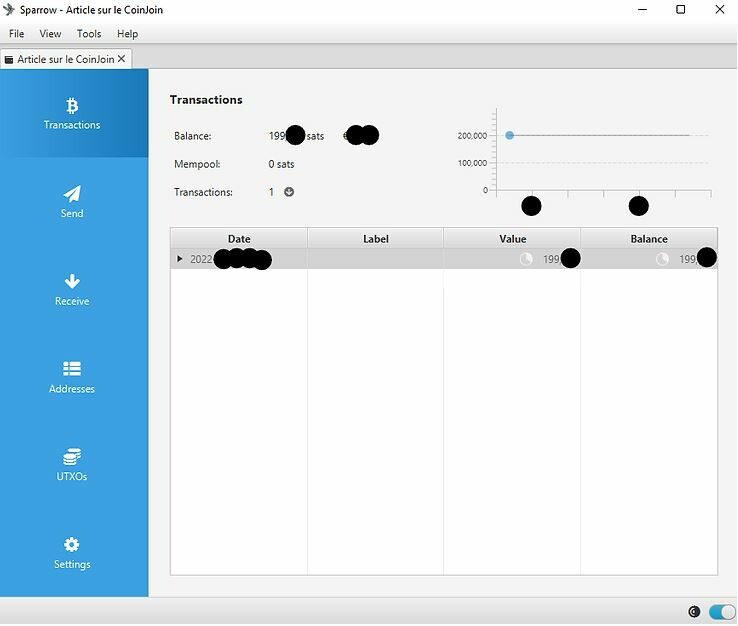

Por ahora, estás utilizando una cuenta clásica. Esta cuenta indexada como 0' se convertirá en tu cuenta de Depósito para mezclar.

Para mezclar esta UTXO que acabas de recibir, ve a la lista de UTXO de la cuenta haciendo clic en "UTXOs" en el lado izquierdo de la interfaz:

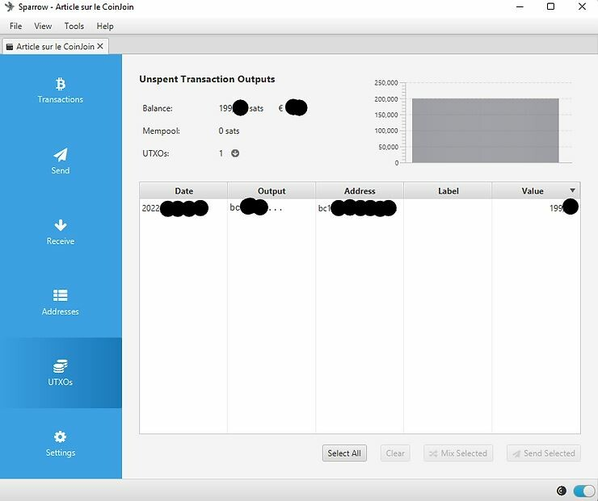

Luego, selecciona las diferentes UTXO que deseas mezclar haciendo clic en ellas. Si deseas seleccionar varias, mantén presionada la tecla Control y haz clic en cada una de ellas. Una vez seleccionada la UTXO, se resaltará en azul.

Luego, haz clic en el botón "Mezclar seleccionados" en la parte inferior de la interfaz:


Se abrirá una ventana para explicarte el funcionamiento de Whirlpool. Es una simplificación de lo que te expliqué en la parte anterior.

Haz clic en "Siguiente" después de leerlo.

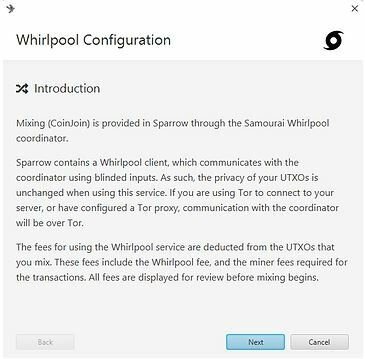

A continuación, se explica el funcionamiento de las cuentas. Haga clic en "Next" después de leer.

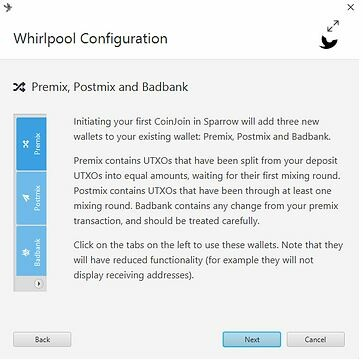

En la siguiente página, podrá ingresar un SCODE si tiene uno. Un SCODE es un código de descuento que se aplica a las tarifas de entrada a la piscina. Samourai Wallet a veces lo proporciona a sus usuarios durante un evento notable (por ejemplo, para Navidad). Asegúrese de seguirlos en Twitter para no perderse los próximos SCODES: https://twitter.com/SamouraiWallet

Luego elija las tarifas de minería que desea asignar a Tx0 y a la mezcla inicial. Esto afectará la velocidad a la que se confirmará su primera mezcla. Recuerde que pagará las tarifas de minería en su Tx0 y en su mezcla inicial, pero no pagará tarifas de minería por todas las demás mezclas.

Una vez que haya elegido las tarifas, haga clic en "Next".

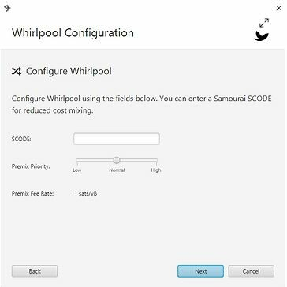

En esta nueva ventana, puede elegir a qué piscina ingresar haciendo clic en la lista desplegable. La ventana también le informa sobre las tarifas de la piscina que pagará y la cantidad de UTXO que ingresarán a esta piscina. Luego haga clic en "Preview Premix".

En mi ejemplo, tenía un UTXO de 199k sats, por lo que ingresaré con solo un UTXO en la piscina de 100k sats:

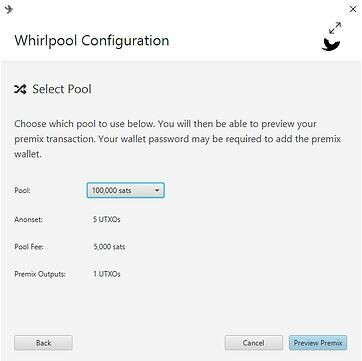

Luego, Sparrow le pedirá que ingrese la contraseña de su billetera que configuró al crearla en el software.

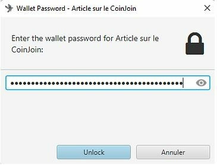

Y accederá a una vista previa de su Tx0.

En primer lugar, puede ver que Sparrow ha derivado las diferentes cuentas necesarias para usar Whirlpool. Puede verlas a la izquierda de la pantalla.

También puede ver la estructura de su transacción con las diferentes salidas:

- Las tarifas de la piscina (coordinador).

- Los UTXO de Premix.

- El cambio Doxxic.

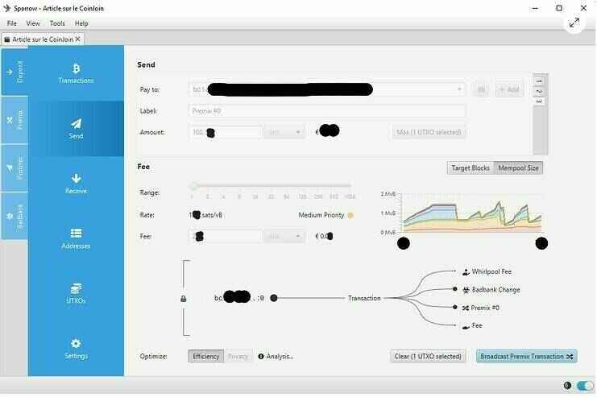

Si está satisfecho con la transacción, haga clic en el botón "Broadcast Transaction" para difundir su Tx0. De lo contrario, también puede modificar los parámetros de esta Tx0 haciendo clic en el botón "Clear" y comenzar la construcción de esta transacción nuevamente.

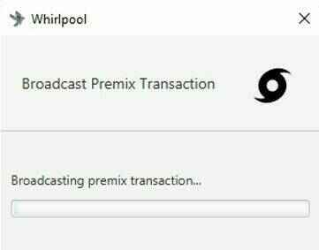

Una vez que se haya difundido la Tx0, encontrará sus UTXO listos para mezclar en la cuenta Premix. Su UTXO ahora está registrado por el coordinador y se enviará a su mezcla inicial.

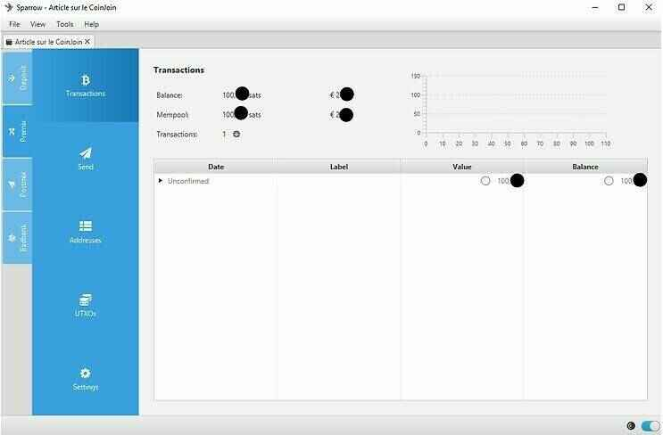
Aquí podemos ver que mi UTXO proveniente de la Tx0 ha sido confirmado una vez. También se puede observar la mezcla inicial que ha sido construida y difundida, pero está esperando confirmación:
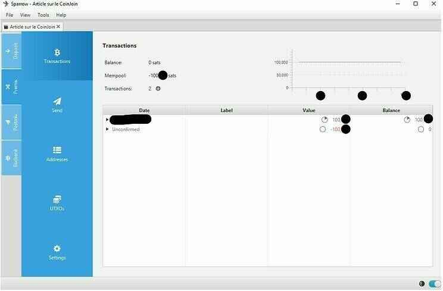

Si vamos a la cuenta Postmix, podemos ver que el UTXO proveniente de la mezcla inicial ha sido difundido, pero aún no está confirmado. Una vez que lo esté, estará automáticamente disponible para futuras mezclas que no serán cobradas.

En la columna "Mixes", podrás observar el número de mezclas de tus diferentes UTXO. Como recordatorio, no es tanto el número de mezclas lo que es importante, sino los Anon Sets, aunque ambas informaciones están parcialmente relacionadas.

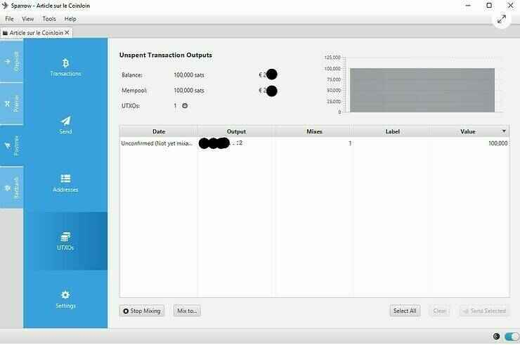

Ahí tienes, tu UTXO ha sido mezclado. Actualmente está en el pool esperando mezclas. Si deseas detener la mezcla, simplemente haz clic en el botón "Stop Mixing". Puedes reiniciarla haciendo clic en el botón "Start Mixing".

Si deseas dejar tu UTXO disponible para mezclas, debes dejar obligatoriamente abierta la aplicación Sparrow Wallet y tu computadora encendida (no en reposo).

También puedes desactivar la suspensión en las opciones de tu sistema operativo. También hay una opción en el software Sparrow para evitar la suspensión de tu máquina:

> Herramientas > Prevenir suspensión de la computadora

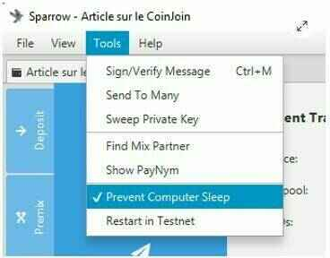

El botón "Mix to" en tu cuenta Postmix en la sección UTXO te permite configurar un envío automático de tu UTXO mezclado a la billetera de tu elección. Puedes elegir el número de mezclas a realizar antes del envío a esta billetera.

Esta opción te permite, por ejemplo, enviar automáticamente tu Postmix a tu billetera de hardware. Sin embargo, generalmente se desaconseja utilizar esta opción. Te explicaré por qué en la sección: Buenas prácticas en post-mix.

Aquí te he presentado una de las opciones para mezclar con Whirlpool, pero hay otras. Por ejemplo, puedes mezclar directamente desde tu teléfono inteligente con la aplicación Samourai Wallet en Android. El funcionamiento será similar al descrito en esta sección.


## Tutorial: Whirpool CLI en Dojo y Whirlpool GUI.

Si deseas pasar al siguiente nivel, puedes mezclar con Whirlpool en tu propio Dojo.

Dojo es una implementación de un nodo Bitcoin desarrollada por el equipo de Samourai Wallet. Si utilizas tu propio Dojo para CoinJoin en Samourai, las xpub de tus diferentes cuentas no se transmitirán a servidores de terceros. Por lo tanto, ganarás en privacidad al eliminar uno de los riesgos inherentes a Whirlpool.
De plus, Dojo integra Whirlpool CLI lo que le permite ejecutar remixes las 24 horas del día, los 7 días de la semana sin necesidad de dejar constantemente su billetera abierta en otro dispositivo.

Esta solución requiere ejecutar un nodo Bitcoin y es ligeramente más compleja de configurar que el ejemplo anterior. Sin embargo, es la que le permite disfrutar de la mejor experiencia de CoinJoin en Whirlpool con el menor riesgo posible asociado.

Para ejecutar su propio Dojo, puede instalar directamente su nodo Dojo o utilizar Dojo en otra implementación de un nodo Bitcoin. Hasta la fecha, las opciones disponibles son:

- RoninDojo, que es simplemente un Dojo con herramientas adicionales e incluye un asistente de instalación y un asistente de administración. Le explicaré en detalle cómo configurar y utilizar RoninDojo en este artículo: Instalar y utilizar su nodo Bitcoin RoninDojo.

- Umbrel a través de la aplicación "Samourai Server".

- MyNode con la aplicación "Dojo".

- Nodl con la aplicación "Dojo".

Para nuestro ejemplo, utilizaremos tres interfaces diferentes:

- Samourai Wallet.

- Whirlpool GUI.

- Whirlpool CLI.

Por lo tanto, Whirlpool CLI se ejecutará en el Dojo para poder aprovechar las ventajas mencionadas anteriormente. Será el encargado de comunicarse con el coordinador y gestionar las mezclas.

Whirlpool GUI es la interfaz gráfica que utilizaremos para ver lo que sucede en Whirlpool CLI e iniciar mezclas de forma remota. La GUI se instalará en cualquier PC diferente al Dojo para poder gestionarlo fácilmente.

Samourai Wallet alojará nuestra billetera destinada a CoinJoin. Es una aplicación gratuita y de código abierto que puede descargar en Android o en un emulador. Con esta aplicación, siempre tendrá control sobre su billetera de mezcla y podrá gastar fácilmente sus postmix en todos sus desplazamientos.

### Paso 1: Preparar su Dojo.

El primer paso es tener un Dojo. Deberá obtener la URL de conexión al Dojo, que se presenta en forma de una dirección Tor. También puede utilizar su código QR. Esta dirección le permitirá conectar su billetera Samourai Wallet a su nodo a través de Dojo.

Si está utilizando Umbrel, vaya a la App Store en el menú izquierdo e instale "Samourai Server". Una vez que se haya iniciado la aplicación, encontrará el código QR de conexión al Dojo.

Si está utilizando RoninDojo, vaya a RoninUI a través de su navegador, inicie sesión y haga clic en "Manage" en azul en la parte inferior del cuadro "Dojo". Podrá acceder al código QR de Samourai Dojo haciendo clic en "Display Values".

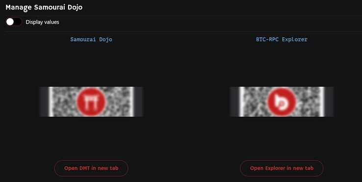

### Paso 2: Preparar su billetera.

Para el monedero, vamos a utilizar Samourai Wallet. Puedes descargarlo desde Google Play Store o directamente con el archivo APK en su sitio web oficial.
Lanza la aplicación y conéctate a tu Dojo utilizando el código QR del paso anterior. Una vez conectado, haz clic en "Crear un nuevo monedero".

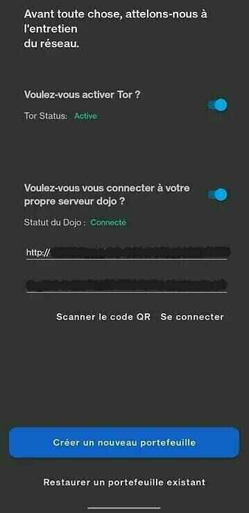

Luego, se te pedirá que crees una Frase de Contraseña. Si no sabes qué es una Frase de Contraseña y cómo configurarla correctamente, te recomiendo que leas mi artículo al respecto: Todo sobre la Frase de Contraseña de Bitcoin.

Elige una Frase de Contraseña fuerte y haz una copia de seguridad física de ella. Haz clic en "siguiente" para continuar.

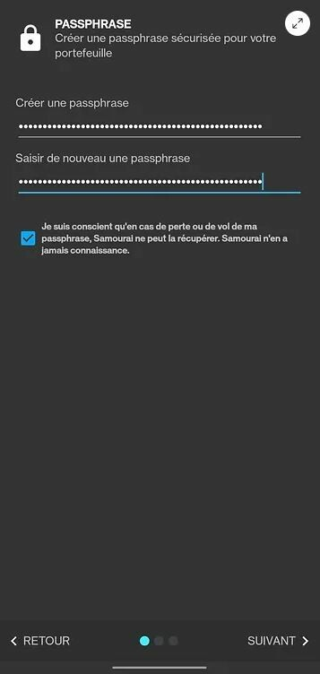

Después, deberás elegir un PIN para acceder a la aplicación. Este PIN es muy importante, pero no está relacionado con tu monedero de Bitcoin. Es específico para el funcionamiento de la aplicación Samourai. Lo necesitarás para acceder a tu monedero desde la aplicación Samourai. Sin embargo, si necesitas recuperar tu monedero, solo necesitarás tu Frase de Contraseña y tu frase de recuperación (mnemotécnica). Elige un PIN fuerte, haz una copia de seguridad y haz clic en "Siguiente".

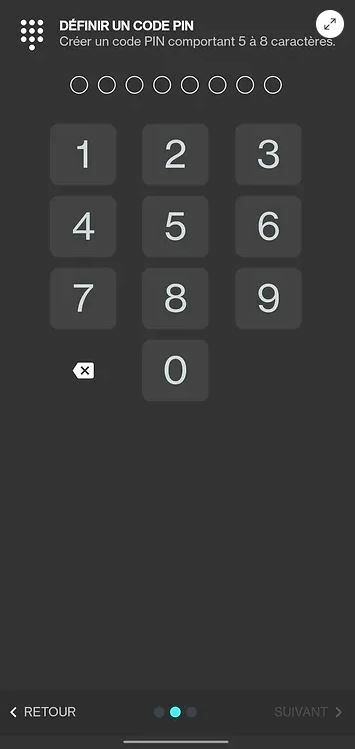

Se te pedirá que confirmes este PIN una segunda vez. Luego, podrás acceder a la frase de recuperación de tu monedero Samourai. Al igual que la frase de contraseña, esta información debe ser adecuadamente respaldada en un medio físico y seguro, de lo contrario podrías perder permanentemente el acceso a tus bitcoins en caso de problemas. Para obtener más información sobre la frase de recuperación, te recomiendo que leas este artículo: ¿Qué es la frase de recuperación de Bitcoin?

Después de validar, llegarás a tu nuevo monedero Samourai. Antes de hacer cualquier cosa, comienza probando tus copias de seguridad. Antes de hacer esto, obtén una xpub de tu monedero para asegurarte de que estás en el correcto:

> Configuración > Monedero > Mostrar BIP44 XPUB

Se te dará un código QR con el valor de la XPUB. Simplemente anota en un papel los últimos 8 caracteres de esta xpub. Por ejemplo:

> X2GGWaLt

Esto te permitirá asegurarte de que estás en el monedero correcto y de que no has cometido errores al escribir la frase de contraseña.

Luego, borra el monedero vacío o reinstala la aplicación Samourai e intenta reconstruirlo solo con tus copias de seguridad realizadas anteriormente. Para hacer esto, después de conectarte a tu Dojo, haz clic en "Restaurar un monedero existente".
Introduzca la frase de recuperación y la frase de contraseña anotadas en sus copias de seguridad físicas, elija el mismo PIN que antes y restaure esta cartera. Si esto no funciona, entonces su respaldo de frase de contraseña no es bueno. Repita el paso 2 desde el principio.
Si consigue acceder a la cartera, compruebe que el primer XPUB BIP 44 sigue siendo el mismo. Vaya a :

> Configuración > Monedero > Mostrar BIP44 XPUB

Compruebe que los últimos 8 caracteres coinciden con los que anotó antes en el papel. Si no es así, su frase de contraseña no se ha guardado correctamente (o ha cometido un error de escritura). Repita el paso 2 desde el principio.

Si la copia de seguridad funciona correctamente, puedes pasar al siguiente paso con total tranquilidad.

> Tenga en cuenta que esta prueba de copia de seguridad de una nueva cartera debe realizarse también en cualquier otra cartera, no sólo en Samourai.

### Paso 3: Preparar Whirlpool GUI.

Ahora vamos a instalar Whirlpool GUI, la interfaz gráfica que le permitirá gestionar su CoinJoin. Ve a tu ordenador personal.

En primer lugar, tendrá que instalar el Java Developer Kit (JDK). Puedes, por ejemplo, instalar gratuitamente OpenJDK desde este sitio: https://adoptopenjdk.net/. Esto es lo que te permitirá compilar y ejecutar software desarrollado en Java.

Instalación de OpenJDK](assets/31.jpeg)

Una vez instalado OpenJDK, puede instalar Whirlpool GUI desde el sitio web oficial de Samourai Wallet: https://samouraiwallet.com/download/whirlpool.

Inicie Whirlpool GUI. Para que Whirlpool GUI se conecte, necesitará tener Tor Daemon o Tor Browser ejecutándose en segundo plano en su PC. Deberá recordar ejecutarlos antes de cada uso de Whirlpool GUI en ese ordenador. Si no tiene Tor, instálelo desde la web oficial antes de empezar: https://www.torproject.org/download/

Elección de conexión de Whirlpool GUI](assets/32.jpeg)

Desde la GUI de Whirlpool, haz clic en "Avanzado: CLI Remoto" para conectar tu CLI de Whirlpool a tu Dojo. Necesitarás la dirección Tor de tu Whirlpool CLI.

- Para encontrarlo en Umbrel: simplemente lanza la aplicación Samourai Server y lo encontrarás en la página.

- Para encontrarlo en RoninDojo: ve al menú principal RoninCLI, luego ve a Credenciales > Whirlpool.

En la GUI de Whirlpool, introduce la dirección Tor que encontraste antes en la casilla "CLI address". Deja el "http://", pero no pongas el ":8899". Simplemente pega la dirección que te dieron'.

En la siguiente casilla, ingrese 9050 si está utilizando Tor Daemon o 9150 si está utilizando el navegador Tor. Si es la primera vez que se conecta a su Whirlpool CLI desde un Whirlpool GUI, puede dejar vacía la casilla de clave API. De lo contrario, ingrésela.

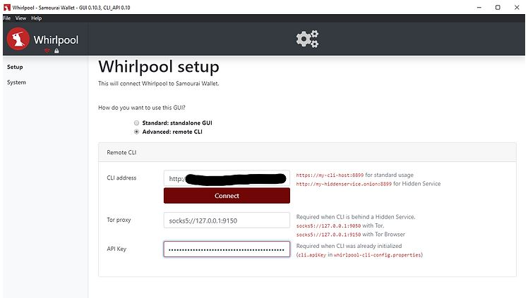

Haga clic en el botón "Connect" para emparejar su Whirlpool GUI con su Whirlpool CLI. Tenga paciencia, puede tomar unos momentos establecer la conexión.

Luego, podrá emparejar su billetera Samourai. Haga clic en el símbolo del código QR a la derecha de la pantalla para poder escanearlo.

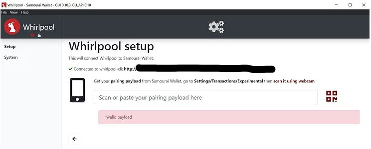

Desde su billetera Samourai Wallet, vaya a:

> ... > Configuración > Transacciones > Emparejar con Whirlpool GUI

Escanee el código QR de su Samourai en Whirlpool GUI.

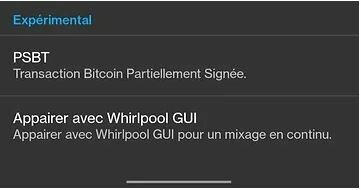

Verifique que la conexión esté establecida en Whirlpool GUI. En la siguiente página, active "Use Dojo as wallet backend". Luego haga clic en el botón "Initialize GUI".

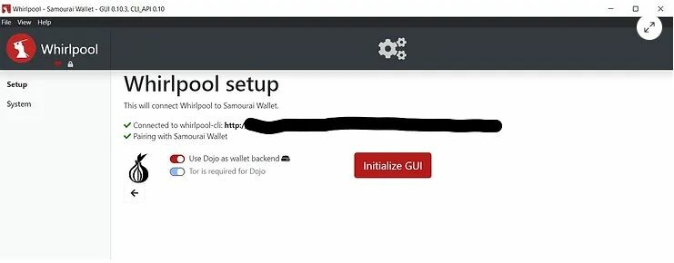

Luego, se le pedirá que confirme la frase de contraseña de su billetera Samourai. Haga clic en "Sign in" una vez que haya terminado.

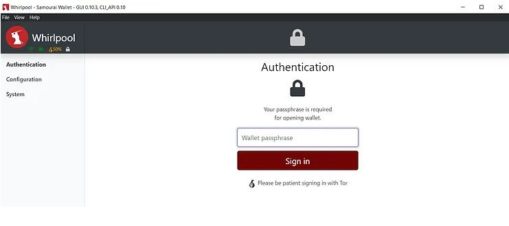

Espere unos momentos. Una vez que se haya completado la configuración, llegará a Whirlpool GUI:

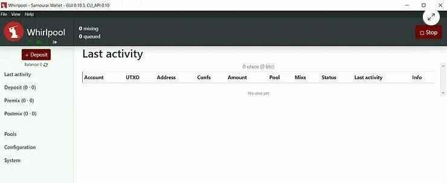

### Paso 4: ¡Mezcle!

Todo está listo, está listo para mezclar sus bitcoins. Para hacerlo, envíe los satoshis a mezclar a la cuenta de depósito de su billetera Samourai. También tiene la opción de hacerlo directamente desde Whirlpool GUI.

Haga clic en el botón "Deposit" para generar una dirección de recepción.

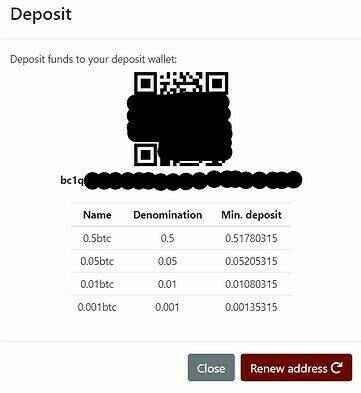

En esta página, puede ver los montos mínimos a depositar para ingresar a un grupo específico. Siempre planee un poco más que ese monto, de lo contrario, su UTXO puede no poder ingresar al grupo deseado hasta que las tarifas de minería disminuyan.

Por lo tanto, envíe sus bitcoins a mezclar a la dirección generada. Puede generar una nueva dirección haciendo clic en el botón "Renew address".

Para mayor seguridad en su depósito, prefiera depositar sus fondos con Samourai Wallet. Simplemente haga clic en el + azul en la parte inferior derecha de la aplicación, luego en "Recevoir".
Una vez confirmado el depósito, podrás verlo aparecer en la cuenta "Deposit" en Whirlpool GUI. Para comenzar la serie de Coinjoins, selecciona las UTXO que deseas enviar a la mezcla y haz clic en el botón "Premix". Ten en cuenta que si seleccionas varias UTXO diferentes al mismo tiempo, se fusionarán durante la TX0. Esto puede llevar a una pérdida de confidencialidad, especialmente si las fuentes de las UTXO son diferentes.

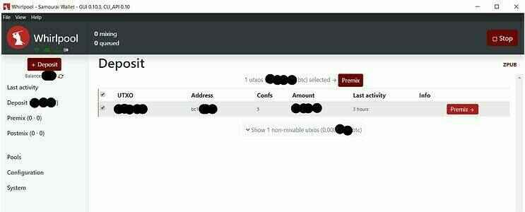

Se abrirá la página de configuración de Whirlpool. Elige el grupo al que deseas unirte. Selecciona las tarifas de minería asignadas a la TX0 y al CoinJoin inicial. En la parte inferior de la página, se muestra el monto del cambio y la cantidad y el número de UTXO igualados. Si la configuración te parece correcta, haz clic en el botón "Premix" para iniciar el proceso de CoinJoin.

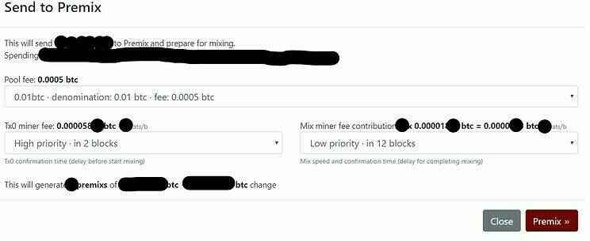

Una vez creada la TX0, puedes ver tus UTXO igualados en la cuenta "Premix" esperando confirmación. Si deseas que tu Premix se mezcle automáticamente y que tus futuros postmix se mezclen automáticamente las 24 horas del día y los 7 días de la semana, activa la opción "Automatically mix premix & postmix" en la pestaña "Configuration" a la izquierda de tu ventana.

Ahora puedes salir de Whirlpool GUI, tus UTXO están disponibles para CoinJoin las 24 horas del día gracias a tu Whirlpool CLI en tu Dojo.

Puedes observar tus UTXO desde la cuenta "Postmix" en Whirlpool GUI, o desde la interfaz Whirlpool en Samourai Wallet. Para hacerlo, haz clic en el pequeño logotipo blanco de Samourai en la parte superior izquierda de tu pantalla. Las cuentas de Whirlpool se diferencian fácilmente en Samourai Wallet con un color azul claro:

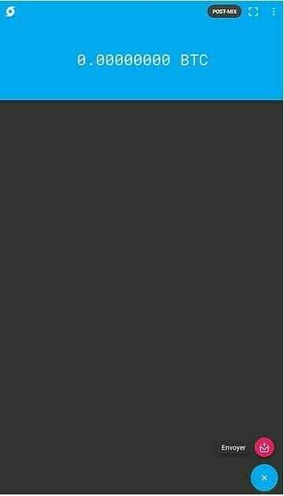

Para gastar tus postmix, simplemente haz clic en el símbolo + en la parte inferior derecha de la pantalla y elige una herramienta de gasto adecuada.

Para seguir fácilmente tus mezclas automáticas, también te recomiendo configurar una billetera Watch-Only con la aplicación Android Sentinel. Ingresa la ZPUB de tu cuenta PostMix y sigue en tiempo real la evolución de tus CoinJoin.

# Buenas prácticas en el post-mix.

Después de mezclar, será importante seguir algunas buenas prácticas si no quieres perder toda la confidencialidad que has ganado con tanto esfuerzo al mezclar.

## Las UTXO post-mix.

La mejor opción después de mezclar es dejar tus UTXO en tu billetera PostMix en espera de gastarlas. Incluso puedes dejar que se mezclen sin límites hasta que las necesites para comprar algo.
Algunos usuarios preferirán mover sus bitcoins mezclados a una billetera segura mediante una billetera de hardware. Puedes hacer esto, pero ten mucho cuidado y sigue las recomendaciones dadas por Samourai Wallet. Sin hacerlo, corres el riesgo de perder toda la privacidad ganada anteriormente.

El error más común es la fusión de UTXO. Es esencial no fusionar, es decir, poner en la entrada de una misma transacción UTXO mezclados y UTXO no mezclados. Esto implica gestionar tus UTXO dentro de tu billetera y etiquetarlos para no hacer cualquier cosa. Más allá de CoinJoin, la fusión de UTXO es una mala práctica en general que a menudo conduce a una pérdida de privacidad cuando no se domina.

También debes tener cuidado con las consolidaciones entre UTXO mezclados entre sí. Es posible hacer pequeñas consolidaciones si tus UTXO mezclados tienen conjuntos de anonimato importantes, pero esto reducirá el nivel de privacidad de tus bitcoins.

Ten mucho cuidado de que la consolidación no sea demasiado grande, o que no ocurra después de muy pocos remixes, de lo contrario será posible vincular tus UTXO antes de CoinJoin y después de CoinJoin por simple deducción. Si no comprendes bien estos conceptos, lo más seguro es no consolidar los UTXO después de la mezcla y enviarlos uno por uno a tu billetera de hardware, cada vez con una nueva dirección en blanco. Una vez más, asegúrate de etiquetar cada UTXO recibido correctamente.

También te desaconsejo mover tus post-mix a una billetera que utilice scripts minoritarios. Por ejemplo, si ingresas a Whirlpool desde una billetera multisig que utiliza scripts P2WSH, es poco probable que te mezcles con otros usuarios que tengan el mismo tipo de billetera originalmente. Si sacas tus post-mix hacia la misma billetera multisig, el nivel de privacidad de tus bitcoins mezclados se verá fuertemente reducido.

También es importante, como en cualquier otra transacción de Bitcoin, no reutilizar las direcciones de recepción. Recuerda que las direcciones de recepción son de un solo uso. Cada nueva transacción entrante implica la generación de una nueva dirección en blanco.

> 1 UTXO = 1 Dirección

Lo más simple y seguro es dejar tus UTXO mezclados en paz, en su billetera PostMix. Puedes dejar que se mezclen nuevamente y solo tocarlos cuando quieras deshacerte de ellos, es decir, cuando desees gastarlos.

## Los UTXO doxxic cambian.

A continuación, será necesario tener cuidado con la gestión del "Doxxic Change", el cambio que no pudo ingresar al grupo de mezcla. Estas UTXO tóxicas creadas como resultado del uso de Whirlpool son peligrosas para su privacidad, ya que establecen un vínculo entre usted y su uso de CoinJoin. Por lo tanto, es importante no utilizarlas para cualquier cosa y, sobre todo, no fusionarlas con ninguna otra UTXO. Esto es lo que puedes hacer con ellas:

- Mezclarlas en grupos más pequeños: si su UTXO es lo suficientemente grande como para ingresar solo a un grupo más pequeño, entonces mézclelo. Esta es probablemente una de las mejores soluciones. Sin embargo, no se deben fusionar varios cambios doxxic juntos para ingresar a un grupo. Es una mala idea que permitirá establecer un vínculo entre sus diferentes entradas en Whirlpool.

- Etiquetarlas como "no gastables" y dejarlas en la cuenta designada: otra buena solución es simplemente no tocarlas y etiquetarlas como "no gastables" para asegurarse de no utilizarlas. Si el precio de bitcoin aumenta, es probable que se creen nuevos grupos más pequeños, lo que le permitirá mezclar sus pequeños cambios doxxic de manera adecuada.

- Donarlas: es importante hacer pequeñas donaciones, según lo que uno pueda, a los diferentes desarrolladores que trabajan en Bitcoin y en los software relacionados, así como a los productores de contenido que nos permiten comprender el uso de estos mismos software. También puede optar por donar a diferentes asociaciones que aceptan pagos en bitcoins. Si su cambio doxxic es una carga para usted, hágalo en forma de donación.

- Utilizarlas para comprar tarjetas de regalo: algunos sitios le permiten comprar tarjetas de regalo con bitcoin para poder consumir en diferentes comercios conocidos. Puede deshacerse de su cambio doxxic comprando este tipo de tarjetas de regalo.

Seguramente existen otras técnicas para deshacerse de un cambio doxxic. Algunos hablan de anonimizarlos utilizando Lightning Network, otros utilizan un intercambio con Monero. Estas técnicas pueden ser buenas, pero no las abordo en este artículo porque no las domino. Le invito a realizar sus propias investigaciones sobre estos temas.

# Herramientas de gasto.

Como habrá entendido, la práctica más segura en Post-Mix es dejar sus UTXO mezclados en su cuenta designada y no tocarlos hasta que desee deshacerse de ellos.

Precisamente, será importante terminar el trabajo de manera óptima y utilizar herramientas especialmente diseñadas para optimizar nuestra privacidad hasta el gasto de una UTXO mezclada.
La disponibilidad de estas herramientas depende del software de billetera elegido por el usuario. Samourai Wallet se diferencia claramente de sus competidores gracias a la diversidad y eficacia de las herramientas que ofrece. Algunas de ellas también están disponibles en Sparrow Wallet. Veamos juntos cuáles son estas herramientas y cómo utilizarlas.

## PayJoin - Stowaway.

PayJoin es un CoinJoin entre dos personas con una estructura específica. Se utiliza en el contexto de un gasto en bitcoins. Puede ser utilizado tanto para gastar bitcoins mezclados como para gastar bitcoins no mezclados.

Esta estructura específica de transacción fue implementada por primera vez por Samourai Wallet con la herramienta Stowaway. Un BIP siguió esta implementación, retomando la idea de PayJoin y renombrándola como P2EP (Pay-to-End-Point).

La especificidad de PayJoin es que produce una transacción que parece común, pero que en realidad es un mini CoinJoin entre dos usuarios. Para ello, la estructura de la transacción involucra al destinatario de la transacción en las entradas junto con el remitente real. El destinatario incluye un pago a sí mismo en medio de la transacción para poder recibir el pago.

Por ejemplo, si compras una baguette a tu panadero por 4000 sats a partir de un UTXO de 10,000 sats, y deseas hacer un PayJoin, tu panadero agregará a tu transacción original un UTXO de 15,000 sats que le pertenece como entrada, que recuperará en su totalidad como salida, para confundir el análisis heurístico:

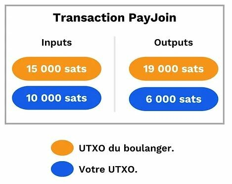

En este ejemplo, se puede ver que el panadero ingresó 15,000 y salió con 19,000. La diferencia es de 4,000 sats, que es el precio de su baguette. Tú, que deseas comprar la baguette por 4,000 sats, ingresaste con 10,000 y saliste con 6,000. La diferencia es de -4,000 sats, que es el precio de la baguette. En este ejemplo, he descuidado intencionalmente las tarifas de minería para simplificar.

Gracias a esta estructura, PayJoin rompe la heurística de propiedad común de las entradas de una transacción Bitcoin. Cuando alguien observe este pago, pensará que simplemente has combinado 2 de tus UTXOs para comprar un bien por 19,000 sats y que has recibido el cambio por 6,000 sats. En realidad, hemos visto que la situación es muy diferente. El análisis de la cadena está confundido y los parámetros del pago son difíciles de entender para cualquiera que los observe.

Este tipo de transacción puede ser una excelente solución para gastar tus bitcoins recién mezclados sin perder privacidad.

JoinMarket también incluye una herramienta de PayJoin para gastar, te invito a descubrirla haciendo clic aquí.
Como se mencionó anteriormente, Samourai Wallet también tiene su propia herramienta de PayJoin: Stowaway. Puedes usarlo tanto desde el software Sparrow Wallet como desde la aplicación Samourai Wallet.
Stowaway se basa en un tipo de transacción que llaman "Cahoots", que es una transacción colaborativa entre varios usuarios que requiere un intercambio de información fuera de la cadena de Bitcoin. Hasta ahora, existen dos herramientas Cahoots en Samourai: Stowaway y StonewallX2, que veremos más adelante.

Las transacciones colaborativas Cahoots requieren intercambios de transacciones parcialmente firmadas entre los usuarios. Este proceso puede ser bastante largo y complicado de realizar, especialmente si estás lejos del otro usuario. Sin embargo, siempre es posible hacerlo manualmente con otro usuario de Samourai Wallet, lo cual puede ser una buena opción si estás físicamente con la persona que colabora. El proceso manual consiste en intercambiar 5 códigos QR para escanear uno por uno.

A distancia, este proceso se vuelve demasiado complejo. Por lo tanto, Samourai ha desarrollado una excelente solución: su propio protocolo de comunicación cifrada basado en Tor, Soroban. Gracias a Soroban, los usuarios ya no necesitan realizar todos estos intercambios de códigos QR. Los intercambios se realizan automáticamente en segundo plano, ocultos detrás de una interfaz de usuario optimizada.

Sin embargo, los intercambios cifrados aún requieren alguna forma de conexión y autenticación entre los colaboradores de Cahoots. Por lo tanto, los intercambios de Soroban se basan en los PayNyms de los usuarios. Si no sabes qué son los PayNyms, te lo explico en detalle en este artículo: ¿Qué es PayNym y BIP47?

En resumen, un PayNym es una especie de identificador asociado a tu billetera que permite establecer una variedad de funciones, incluyendo intercambios de mensajes cifrados. El PayNym está representado por un identificador y un dibujo de un robot. Aquí está el mío, por ejemplo (en Testnet):


Para poder realizar una transacción Cahoots a distancia, y por lo tanto un PayJoin a través de Samourai o Sparrow, debes "seguir" a otro usuario a través de su PayNym. En este caso, para realizar un Stowaway (PayJoin), debes seguir a la persona a la que deseas enviar bitcoins.

Para hacer esto desde Sparrow Wallet, simplemente ingresa el PayNym o escanea el código QR del colaborador en el campo "Buscar contacto", como se muestra en la captura anterior.

En Samourai, haz clic en el "+" azul en la esquina inferior derecha de la pantalla, luego en "PayNyms" en violeta. Si aún no tienes un PayNym, puedes generar el tuyo siguiendo las instrucciones.

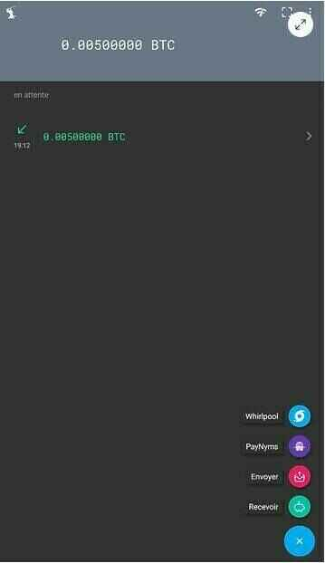

**Tutorial realizado en Testnet: estos no son bitcoins reales.**
Una vez en la interfaz de PayNym, haga clic en el botón azul "+". Luego podrá seguir al PayNym de su colaborador pegando su identificador o escaneando su código QR.

Luego haga clic en "Seguir":

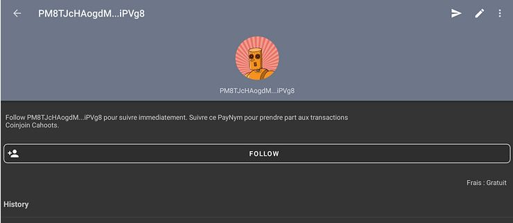

Luego se le preguntará si desea "conectarse" a él. Esta función permite utilizar BIP47 más adelante. Esto tiene un costo adicional. En nuestro caso, no lo necesitamos, así que no nos conectaremos.

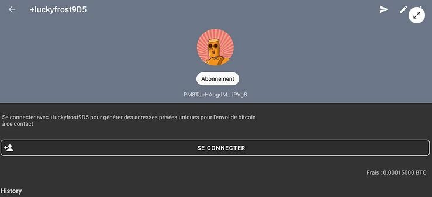

En mi ejemplo, hice un PayJoin entre mi Samourai Wallet y mi Sparrow Wallet. Para acceder a PayNym en Sparrow Wallet, simplemente haga clic en "Herramientas" y luego en "Mostrar PayNym".

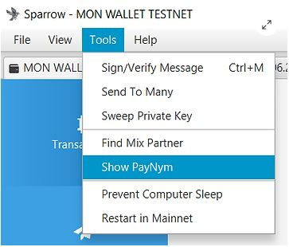

Aquí se puede ver que mi PayNym naranja ha recibido la solicitud de seguimiento de mi PayNym blanco (en Samourai). Soy amable, lo he seguido de vuelta:

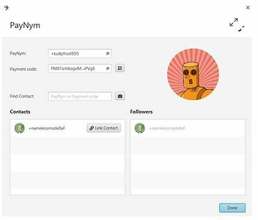

Ahora que los Nyms están conectados, podrán comunicarse entre sí de forma cifrada a través de Soroban. Por lo tanto, podemos iniciar una transacción Cahoots.

Para realizar un PayJoin Stowaway desde Samourai, deberá construir una transacción. Si desea gastar UTXO mezclados, vaya a la cuenta Post-mix antes de iniciar la transacción.

Haga clic en el botón azul "+", luego en "enviar". También puede elegir específicamente qué UTXO desea enviar:

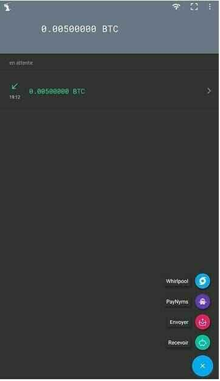

Luego ingrese la cantidad que desea enviar. En mi ejemplo, envío 45,000 sats Testnet:

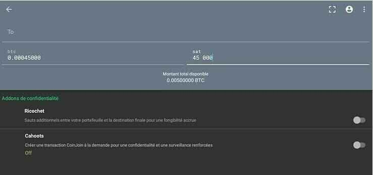

Luego haga clic en "Cahoots". Se abrirá esta ventana, donde podrá elegir entre hacer un StonewallX2 o un Stowaway. Aquí queremos hacer un Stowaway:

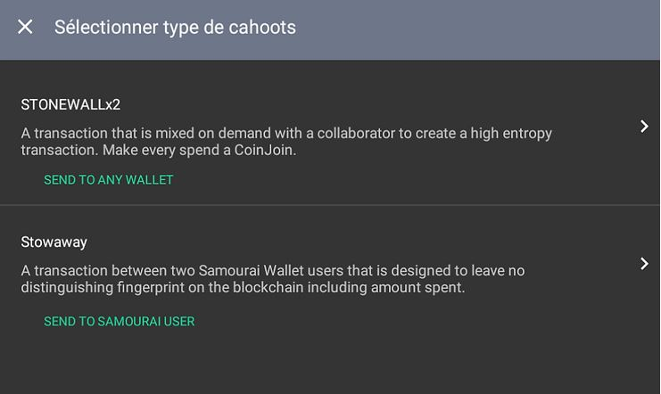

Como se explicó anteriormente, puede realizar el PayJoin manualmente o hacerlo de forma remota. Es más rápido y fácil hacerlo de forma remota, pero requiere estar conectado a través de PayNym. En nuestro caso, elegiremos esta opción "En línea":

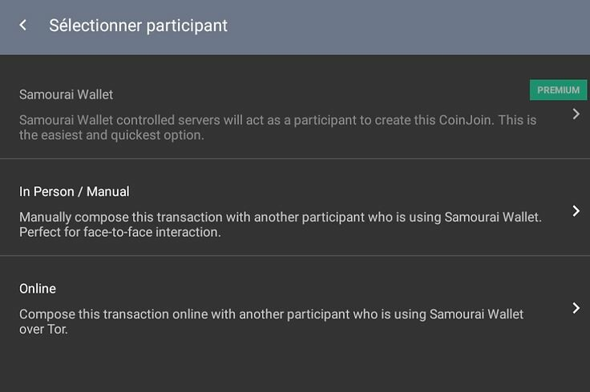

Luego se le pedirá que elija a su colaborador entre sus contactos de PayNym. Aquí elijo "luckyfrost", que es mi PayNym naranja en Sparrow:

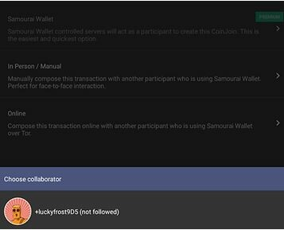

Luego confirme haciendo clic en "Verificar Transacción".

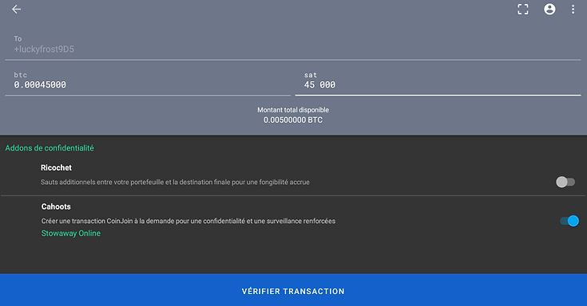

A continuación, podrás elegir las tarifas de minería asignadas a esta transacción. Debes saber que estas tarifas serán pagadas por el emisor inicial de la transacción. Haz clic en "Démarrer Stowaway".

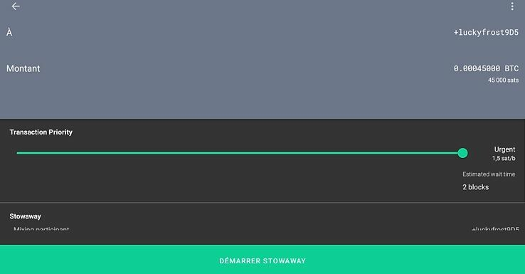

Luego se te pedirá que esperes a que tu par confirme que está de acuerdo en realizar esta transacción colaborativa.

Para confirmar una solicitud de cahoot en Samourai, haz clic en el signo "+" azul, luego en "Recevoir" en verde. Se mostrará una dirección. En la esquina superior derecha, haz clic en los tres puntos, luego en "Receive Online Cahoots".

Para confirmar en Sparrow Wallet, haz clic en la pestaña "Tools", luego en "Find Mix Partner". Se abrirá una ventana, haz clic en "Next" y luego en "Next" nuevamente para confirmar la transacción colaborativa.

El Cahoot está en proceso. Tus dos billeteras intercambian transacciones parcialmente firmadas y cifradas a través de Tor gracias a Soroban.

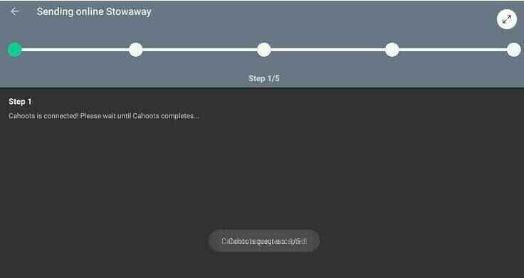

Una vez construida la transacción Stowaway, podrás difundir la transacción para enviarla a los nodos de la red Bitcoin.

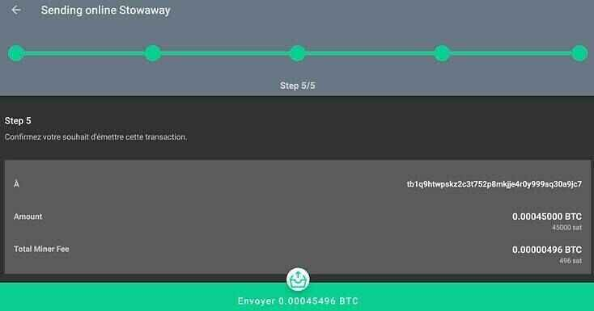

¡Listo, la transacción Stowaway ha sido difundida! Felicitaciones.

Al observar la transacción, se pueden ver las entradas y salidas de los dos usuarios. La diferencia entre la salida y la entrada del PayNym blanco es de -45,000 sats, y la diferencia para el PayNym naranja es de +45,000 sats, que es la cantidad que finalmente envié.

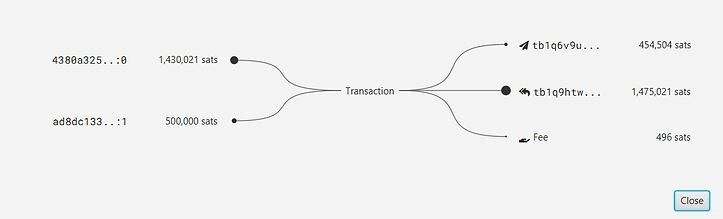

### Stonewall.

Stonewall es una estructura de transacción específica que imita un CoinJoin entre dos personas, sin ser realmente uno.

Esta transacción no es colaborativa, solo involucra las UTXO pertenecientes al emisor de la transacción. Por lo tanto, puedes crear una transacción Stonewall para cualquier ocasión sin necesidad de ponerte de acuerdo con nadie.

Su funcionamiento es bastante simple: se utilizan varias UTXO del emisor como entrada y se crean 4 salidas. 2 de estas salidas tendrán exactamente la misma cantidad, mientras que las otras serán de cambio. De estas 2 salidas similares, solo una irá realmente al destinatario del pago.

Esta estructura agrega mucha entropía a la transacción y confunde las pistas. Al observarla desde el exterior, se podría pensar que esta transacción es un CoinJoin entre dos personas. En realidad, es un pago. Por lo tanto, permite generar dudas en el análisis de la cadena.

Esta herramienta Stonewall se utiliza de forma predeterminada en Samourai Wallet si tu billetera cumple con las condiciones necesarias. Veamos juntos cómo hacer un Stonewall. Para ello, envío 50,125 sats utilizando esta herramienta:


Como puedes ver en este video, la opción Stonewall está preseleccionada por defecto.

Aquí está cómo se ve la transacción Stonewall que acabo de realizar en el video:

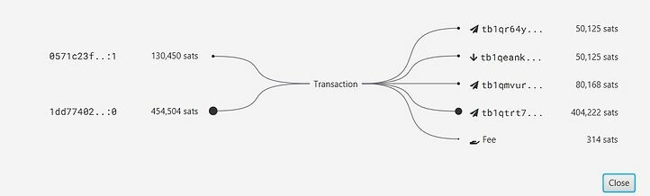

Se puede ver que Samourai ha agregado 2 UTXO que me pertenecen como inputs:

- 130 450 S

- 454 504 S

Y se pueden reconocer los 4 outputs de la transacción Stonewall:

- 50 125 S que constituyen el pago real que acabo de realizar.

- 50 125 S que vuelven a otra dirección que me pertenece.

- Los dos cambios: 80 168 S y 404 222 S que también me vuelven.

Por lo tanto, mi destinatario ha recibido solo 50 125 sats, que es el valor del pago que quería iniciar.

Por supuesto, si deseas gastar post-mix, primero debes ir a tu billetera Whirlpool antes de iniciar la transacción.

Samourai no te cobrará ninguna tarifa por la construcción de una transacción Stonewall. Por supuesto, deberás pagar las tarifas de minería de tu transacción. Estas serán más altas que una transacción "clásica" ya que tiene más entradas y salidas.

Si deseas utilizar esta herramienta en Sparrow, te remito a este tutorial que explica en detalle cómo realizar la operación: [https://sparrowwallet.com/docs/spending-privately.html#paying-to-a-paynym](https://sparrowwallet.com/docs/spending-privately.html#paying-to-a-paynym)

## StonewallX2.

StonewallX2 funciona exactamente como Stonewall, excepto que los inputs de la transacción no son solo los del remitente, sino también los de otra persona. StonewallX2 es, por lo tanto, una transacción colaborativa entre dos usuarios de Samourai. Al igual que Stowaway (PayJoin), la comunicación entre los colaboradores puede ser manual (si están en el mismo lugar) o a distancia a través de Soroban a través de Tor.

La diferencia entre Stowaway y StonewallX2 radica en el papel del colaborador. En el caso de Stowaway, el colaborador es necesariamente el destinatario del pago. En el caso de StonewallX2, el colaborador simplemente pone a disposición sus bitcoins para la mezcla, pero no es el destinatario del pago.

Por ejemplo, si deseas realizar un gasto de forma confidencial, pero el comerciante al que deseas enviar bitcoins no admite Stowaway, simplemente puedes hacer un StonewallX2 con otra persona que no tenga nada que ver con la transacción. El destinatario seguirá siendo el comerciante, pero no necesita realizar todas las operaciones relacionadas con Stowaway.
Así, StonewallX2 es un mini CoinJoin entre 2 personas que incluye una salida de gasto. Esto permite agregar una gran cantidad de entropía a la transacción. Esta estructura específica agrega dudas estadísticas sobre los vínculos entre el remitente y el destinatario.
Si observamos una transacción StonewallX2 desde el exterior, su estructura será exactamente la misma que una transacción Stonewall. Esto permite agregar aún más dudas.

Para realizar una transacción StonewallX2 a distancia, debes estar conectado con el PayNym de tu colaborador, de la misma manera que con stowaway. Una vez conectado con el colaborador, veamos juntos cómo hacer una transacción StonewallX2 a distancia. En este ejemplo, colaboro con mi segundo PayNym en Sparrow Wallet. No lo muestro en el video, pero el colaborador de Cahoot debe confirmar en su billetera que desea participar en la transacción conjunta.


Aquí está cómo se ve la transacción StonewallX2 que acabo de realizar en el video:

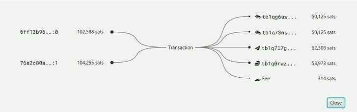

La primera entrada de 102 588 S proviene de mi billetera Samourai. La segunda entrada de 104 255 S proviene de la billetera de mi colaborador. Se pueden observar 4 salidas, incluyendo 2 del mismo monto para confundir las pistas:

- 50 125 sats que van al destinatario de mi pago.

- 52 306 sats que representan mi cambio y que regresan a una dirección de mi billetera.

- 50 125 sats que regresan a mi colaborador.

- 53 973 sats que regresan a mi colaborador.

Para las transacciones StonewallX2, los costos de minería se comparten entre los dos colaboradores. Si calculamos el saldo de cada uno después de la transacción, tenemos:

- El colaborador que ingresó con 104 255 sats y salió con 104 098 sats. La diferencia representa su parte de los costos de minería. Si ignoramos estos costos, el colaborador ha realizado una acción en blanco.

- Para el remitente, ingresé con 102 588 sats y salí con 52 306 sats. La diferencia de 50 282 sats representa la cantidad que debo al destinatario (50 125 sats) más mi parte de los costos de minería.

- El destinatario no participó en la transacción y sale con 50 125 sats, que es la cantidad que quiero pagarle.

Samourai no te cobrará ninguna tarifa por la construcción de una transacción StonewallX2. Obviamente, deberás pagar los costos de minería de tu transacción. Estos serán más altos que una transacción "clásica" ya que tiene más entradas y salidas.
Si desea utilizar esta herramienta en Sparrow, le remito a este tutorial que explica en detalle cómo realizar la operación: [https://sparrowwallet.com/docs/spending-privately.html#paying-to-a-paynym](https://sparrowwallet.com/docs/spending-privately.html#paying-to-a-paynym)

## Ricochet.

La última herramienta que quiero presentarles es Ricochet. Esta herramienta es ligeramente diferente a las anteriores, que tenían como objetivo aumentar la privacidad prospectiva. Ricochet permite reducir la huella dejada por una CoinJoin en un UTXO, y por lo tanto aumentar la privacidad retrospectiva.

Si realiza transacciones como CoinJoin y envía sus bitcoins mezclados directamente a un exchange, es posible que el proveedor bloquee su cuenta o le solicite justificaciones sobre el origen de sus fondos. Para evitar estos bloqueos hipócritas e injustos, puede utilizar Ricochet para enviar sus fondos mezclados a un exchange.

Por lo tanto, el único caso de uso de Ricochet es cuando desea ocultar el hecho de que ha realizado una CoinJoin en el pasado en un UTXO que le pertenece.

Para reducir esta huella, Ricochet realizará 4 transacciones donde se enviará los fondos a sí mismo a diferentes direcciones, y luego la herramienta enviará los fondos a su destino final (el exchange). El objetivo es agregar distancia entre la transacción CoinJoin y la transacción de depósito. Gracias a esto, las herramientas de análisis de cadena pensarán que ha habido un cambio de propietario desde CoinJoin, por lo que es probable que el proveedor no se arriesgue a bloquear su cuenta o solicitar justificaciones.

Esta herramienta puede ser esencial si necesita intercambiar bitcoins mezclados, o simplemente si desea reducir la "huella" de su mezcla pasada.

Como vimos anteriormente, la cuenta Ricochet utilizada para las direcciones de rebote es una cuenta completamente separada de la cuenta de depósito.

Hay dos opciones para Ricochet:

- Ricochet reforzado: también conocido como "entrega escalonada", esta opción distribuirá las tarifas pagadas a Samourai en las cinco transacciones de rebote. También garantizará que cada rebote esté presente en un bloque diferente. Esta opción está diseñada para ser lenta, pero optimiza la privacidad y la resistencia al análisis de cadena de su operación.

- Ricochet normal: esta opción permite realizar la operación rápidamente, pero será menos confidencial y resistente al análisis que la opción anterior. Se recomienda para envíos urgentes.

Ricochet es un servicio de pago. Deberá pagar 100,000 sats en tarifas a Samourai.

Así es como se realiza un Ricochet en Samourai Wallet:


Ahora estás listo para usar Whirlpool de la mejor manera posible y gastar tus postmix correctamente. Las herramientas de gasto de Samourai Wallet, también incluidas en Sparrow Wallet en su mayoría, ya no tienen secretos para ti. Te recomiendo que practiques y pruebes todas estas herramientas. ¡Para no arriesgar tus fondos personales, no dudes en usarlos primero en Testnet! Esta red no está reservada solo para desarrolladores.

# ¿Es malo mezclar bitcoins?

A menudo se encuentra en los discursos de los altcoiners o principiantes una descripción de CoinJoin como una práctica oscura, dudosa o incluso peligrosa. Este tipo de narrativa confusa a menudo se debe a un desconocimiento técnico de Bitcoin y a una fantasía de CoinJoin.

Todo esto es obviamente falso. CoinJoin es un uso noble de Bitcoin que permite a cualquier individuo tomar el control de la privacidad de sus pagos, al tiempo que mejora la fungibilidad externa de la red de pagos, sin caer en un anonimato absoluto.

Como se explicó anteriormente, CoinJoin simplemente permite a un usuario cortar el historial de sus bitcoins y, por lo tanto, aumentar la privacidad de sus pagos, especialmente si su identidad ha sido asociada con un UTXO en el pasado.

Es gracias a estas herramientas que permiten a cada usuario proteger su privacidad que podemos lograr una red de pagos libre y sin restricciones. Sin respeto a la privacidad, no existe libertad.

Trabajar para proteger la privacidad de los usuarios de Bitcoin es una causa noble. Cuando realizas un CoinJoin, no solo aseguras cierta privacidad personal, sino que también ayudas a muchos otros individuos a mejorar la suya.

Sí, a veces las personas deshonestas utilizan CoinJoin. Pero también es ampliamente utilizado por personas sujetas a obligaciones, para quienes la necesidad de privacidad no es un lujo, sino una obligación. Si todos usaran CoinJoin solo cuando se vuelva obligatorio individualmente, las personas realmente obligadas a usar esta herramienta estarían mezcladas solo con personas deshonestas, y por lo tanto serían más fácilmente detectables por una autoridad tiránica.

También retomo el argumento de Gregory Maxwell, expuesto en Bitcoin Talk en 2013 durante su introducción de CoinJoin: "En realidad, los verdaderos criminales no necesitan CoinJoin, [...] pueden permitirse comprar privacidad de una manera que los usuarios regulares no pueden, es solo un costo adicional para su negocio (a menudo muy lucrativo)."

En cualquier caso, recordemos que CoinJoin es una herramienta. Como cualquier herramienta, puede ser utilizada de manera constructiva o destructiva.
En fin, según mi opinión, el CoinJoin se ajusta perfectamente a la ideología y la línea de desarrollo inicial de Bitcoin. Los Cypherpunk escriben código. Desarrollan herramientas que permiten a cada individuo tener control sobre su privacidad y soberanía en Internet, dos características indispensables para garantizar la libertad individual.

Satoshi Nakamoto mismo dedica una parte completa de su White Paper al respeto de la privacidad del usuario de Bitcoin. En este documento, destaca el riesgo de pérdida de privacidad si se revela el propietario de un par de claves. Explica que si esto ocurre, se podrían rastrear todas las transacciones del propietario. El CoinJoin es actualmente la mejor solución para romper este vínculo entre bitcoins y propietarios, descrito por Satoshi Nakamoto en el White Paper.

Para terminar, te recomiendo que estudies los diferentes contenidos que expongo en la sección "Recursos externos" a continuación, en los que me he basado para producir este artículo, y que seguramente te brindarán aún más conocimientos.

## Para ir más allá:

- [Todo sobre la Passphrase Bitcoin.](https://www.pandul.fr/post/tout-savoir-sur-la-passphrase-bitcoin)

- [Cómo generar tu propia frase mnemotécnica de Bitcoin.](https://www.pandul.fr/post/comment-g%C3%A9n%C3%A9rer-soi-m%C3%AAme-sa-phrase-mn%C3%A9monique-bitcoin)

- [¿Qué es PayNym y BIP47?](https://www.pandul.fr/post/qu-est-ce-que-paynym-et-bip47)

## Recursos externos:

Hilo de Twitter Why we CoinJoin de @SamouraiWallet:

https://twitter.com/SamouraiWallet/status/1489220847336308739

Artículo HOW TO WHIRLPOOL ON DESKTOP WITH RONINDOJO de ECONOALCHEMIST en https://bitcoinmagazine.com/:

https://bitcoinmagazine.com/guides/how-to-whirlpool-with-ronindojo

Artículo THE EASIEST WAY TO WHIRLPOOL YOUR BITCOIN AND PRESERVE PRIVACY de ECONOALCHEMIST en https://bitcoinmagazine.com/:

https://bitcoinmagazine.com/guides/how-to-whirlpool-bitcoin-on-mobile

Artículo HOW TO WHIRLPOOL YOUR BITCOIN ON DESKTOP WITH SPARROW WALLET de ECONOALCHEMIST en https://bitcoinmagazine.com/:

https://bitcoinmagazine.com/technical/how-to-whirlpool-bitcoin-sparrow-wallet

Artículo Diving head first into Whirlpool Anonymity Sets. De Samourai Wallet.

https://medium.com/samourai-wallet/diving-head-first-into-whirlpool-anonymity-sets-4156a54b0bc7

Hilo de Twitter de @BrotherRabbit/\_ sobre el puntaje prospectivo en Whirlpool:

https://twitter.com/BrotherRabbit_/status/1528399310227906561

Tutorial Samouraï por JohnOnChain (Privacidad), del canal de Youtube Découvre Bitcoin:

https://www.youtube.com/watch?v=kS6iC_ovarQ
Recursos sobre Ricochet:
https://docs.samourai.io/en/wallet/features/ricochet

Recursos sobre herramientas de gasto en Sparrow Wallet:
https://sparrowwallet.com/docs/spending-privately.html#paying-to-a-paynym

Recursos sobre herramientas de gasto en Samourai Wallet:
https://docs.samourai.io/en/spend-tools#ricochet

Artículo sobre la instalación y uso de WST (en español):
https://estudiobitcoin.com/como-instalar-y-utilizar-whirlpool-stats-tools-wst-para-los-calculos-de-los-sets-de-anonimato-de-las-transacciones-coinjoins/

Artículo "Dealing with Coinjoin Change Outputs" de BitcoinQ+A en https://bitcoiner.guide/:
https://bitcoiner.guide/doxxic/

Serie de 4 artículos "Understanding Bitcoin Privacy with OXT" por Samourai Wallet:
https://medium.com/oxt-research/understanding-bitcoin-privacy-with-oxt-part-4-4-16cc0a8759d5

Recursos sobre Whirlpool por Samourai Wallet:
https://code.samourai.io/whirlpool/Whirlpool/-/blob/whirlpool/README.md

https://docs.samourai.io/whirlpool/basic-concepts

https://docs.samourai.io/en/wallet/features/whirlpool
