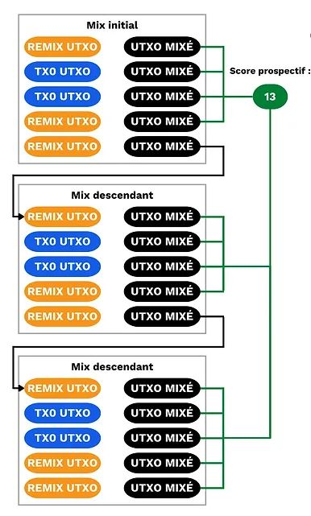

# Comprendre et utiliser le CoinJoin sur Bitcoin.

_**Texte offert par Loïc Morel dans le cadre de ses écrits dans Pandul. texte origina [ici](https://www.pandul.fr/post/comprendre-et-utiliser-le-coinjoin-sur-bitcoin)**_

## Introduction

Un des problèmes initiaux à tout système de paiement pair-à-pair est la double dépense. Comment éviter que des acteurs malveillants abusent du réseau de paiement, en dépensant plusieurs fois des mêmes unités compte sans pour autant recourir à une autorité centrale ?

Satoshi Nakamoto est venu résoudre ce problème avec son protocole Bitcoin, un réseau de paiement électronique pair-à-pair fonctionnant sans l'intervention d'une quelconque autorité centrale. Dans son White Paper, il nous explique que le seul moyen de confirmer l'absence d'une transaction, et donc de vérifier qu'il n'y a pas de tentative de double dépense, est d'être au courant de toutes les transactions effectuées sur le réseau de paiement distribué.

Pour que chaque utilisateur soit informé des transactions, celles-ci doivent être annoncées publiquement. Le système de paiement pair-à-pair proposé par le protocole Bitcoin a donc été rendu possible par une infrastructure complètement transparente et distribuée. Ainsi, quiconque dispose d'un nœud est en capacité de vérifier la chaine de signatures électroniques et l'historique de chaque pièce, depuis sa création par un mineur.

    Ce principe de distribution du registre et d'annonce publique des nouvelles transactions est utilisé sur la dernière crypto-monnaie (bitcoin), mais il l'était déjà sur les crypto-monnaies précédentes comme b-money, inventé par Wei Dai en 1998.

    Cette transparence et cette distribution impliquent que chaque utilisateur du réseau Bitcoin est en capacité de retracer et d'observer les transactions de tous les autres usagers. La confidentialité est donc impossible au niveau du paiement. Au lieu de cela, elle se fait au niveau de l'identification de la personne.

Au lieu d'associer chaque unité de compte à une identité (nom, prénom...), comme dans le système bancaire traditionnel, les bitcoins sont associés à une paire de clés. Les utilisateurs sont donc représentés anonymement par un identifiant cryptographique.

Ainsi, la perte de confidentialité sur Bitcoin s'opère lorsqu'un observateur est capable de faire un lien entre certains UTXO et certains utilisateurs. Lorsque ce lien est fait entre un usager et ses unités de compte, il est alors possible de suivre ses paiements et d'analyser l'histoire de ses bitcoins.

Le CoinJoin est une pratique qui permet de casser cet historique des UTXO afin d'apporter un certain niveau de confidentialité à l'utilisateur de Bitcoin.

Dans cet article, nous allons étudier ensemble ce qu'est le CoinJoin, comment il fonctionne et comment l'utiliser de la bonne façon. Nous parlerons essentiellement de Whirlpool, l'implémentation de CoinJoin la plus efficace aujourd'hui selon moi, mais nous aborderons aussi les autres implémentations existantes. Je vais également vous parler des indicateurs permettant de calculer précisément le niveau de confidentialité de vos bitcoins. Pour ne pas rester uniquement dans la théorie, je vous montrerai concrètement comment réaliser une transaction CoinJoin de différentes manières. Enfin, nous étudierons les bonnes pratiques à observer pour ne pas perdre la confidentialité gagnée après une série de CoinJoin, et je vous présenterai les différents outils du portefeuille Samourai Wallet qui permettent cela.

Si cet article vous plait, partagez-le sur les réseaux sociaux et à vos connaissances qui en ont besoin.

        Sommaire :

        - CoinJoin et mixage de bitcoins.
        - Les différentes implémentations de CoinJoin.
        - Fonctionnement théorique de Whirlpool.
        - Tutoriel : Whirlpool sur Sparrow Wallet.
        - Tutoriel : Whirpool CLI sur Dojo et Whirlpool GUI.
        - Les bonnes pratiques en post-mix.
        - Les outils de dépense.
        - Est-ce mal de mixer des bitcoins ?

Si vous êtes un utilisateur débutant de Bitcoin, avant de pouvoir aborder cet article, je vous conseille fortement de comprendre la structure d'une transaction Bitcoin (UTXO, inputs et outputs) en lisant ce court article traitant ce sujet : Mécanisme d'une transaction Bitcoin : UTXO, inputs et outputs.

_L'utilisation du CoinJoin peut présenter des risques indirects pour son utilisateur. Certains prestataires bloqueront potentiellement vos fonds et/ou votre compte en conséquence de vos agissements, et vous demanderont des justifications quant à l'origine de ces fonds. Les informations contenues dans cet article ne constituent pas un conseil en système et logiciels informatiques, ni une incitation quelconque à réaliser des CoinJoin. La réalisation d'un CoinJoin implique d'utiliser un portefeuille logiciel connecté à internet (dit « chaud »). Il est possible que vos fonds soient perdus et/ou volés. Je vous conseille de faire vos propres recherches sur les différents risques existants. Cet article ne peut en aucun cas constituer une source unique d'information sur ces sujets._

## CoinJoin et mixage de bitcoins.

Avant de commencer, il est important de comprendre la différence entre le CoinJoin et le mixage.

Le mixage (en anglais : "mixing", "blender" ou "tumbler"), est une technique permettant de mélanger des UTXO, c'est-à-dire mélanger des bitcoins, afin de rompre leurs historiques et afin de brouiller les pistes de traçage. L'objectif de ce type d'opération est de pseudonymiser des UTXO pour que l'utilisateur gagne en confidentialité. La pseudonymisation se produit lorsque l'UTXO se trouve au sein d'un groupe de plusieurs autres UTXO indifférenciables.

Le mixage et le CoinJoin sont initialement deux techniques ayant le même objectif, mais ne fonctionnant pas de la même façon. Le mixage s'établit sur un tiers de confiance à qui l'on va confier nos bitcoins à mixer, alors que le CoinJoin repose lui uniquement sur un coordinateur qui va synchroniser l'action des utilisateurs, mais qui n'aura jamais la main sur les fonds.

Avec l'arrivée du CoinJoin, le mixage est rapidement devenu désuet et les utilisateurs s'en sont détournés. Il existe encore quelques services de mixage comme ChipMixer. Cependant, aujourd'hui cette technique n'existe plus qu'en marge alors que le CoinJoin est utilisé par de plus en plus d'individus.

En conséquence, dans le langage courant des bitcoiners, beaucoup utilisent le mot « mixage » pour parler finalement d'un CoinJoin. Même si cette sémantique est initialement fausse, elle est globalement admise au sein des utilisateurs. On parle alors de « bitcoins mixés » pour évoquer des UTXO sortis d'une transaction CoinJoin.


Le CoinJoin est donc une technique permettant de casser l'historique des UTXO. Il repose sur une transaction collaborative à la structure spécifique de même nom : la transaction CoinJoin. Ce type de transaction a été initialement proposé par Gregory Maxwell en 2013 sur le forum Bitcoin Talk : https://bitcointalk.org/index.php?topic=279249.0

Le fonctionnement général est le suivant : différents utilisateurs souhaitant mixer déposent un montant en input d'une transaction. Ces inputs ressortiront en différents outputs de même montant (avec éventuellement un change, mais nous étudierons cela plus loin). À la sortie de la transaction, il est donc impossible de déterminer quel output appartient à quel utilisateur. Il n'y a techniquement aucun lien entre les entrées et les sorties de la transaction CoinJoin. Le lien entre chaque utilisateur et chaque UTXO est cassé, de la même manière que l'historique de chaque pièce.

Pour permettre le CoinJoin sans qu'aucun utilisateur ne perde la main sur ses fonds à aucun moment, la transaction est d'abord construite par le coordinateur puis transmise à chaque utilisateur. Chacun d'eux signe alors la transaction de son côté en vérifiant qu'elle lui convient, puis toutes les signatures sont ajoutées à la transaction. Si un utilisateur ou le coordinateur tente de voler les fonds des autres en modifiant les outputs de la transaction CoinJoin, alors les signatures seront invalides et la transaction sera refusée par les nœuds.

Si je peux me permettre une analogie, nous pouvons imaginer le CoinJoin comme une course poursuite entre un hélicoptère et une voiture. Imaginons un hélicoptère qui tente de suivre une voiture blanche. L'hélicoptère représente la personne qui souhaite analyser vos paiements et la voiture blanche représente votre UTXO. L'hélicoptère peut facilement suivre la voiture en volant au-dessus d'elle.

Imaginons qu'il y ait maintenant quatre autres véhicules blancs similaires qui circulent sur cette route à proximité de la voiture suivie. L'hélicoptère peut toujours suivre la voiture blanche qu'il suivait initialement.

Maintenant, imaginons que ces cinq voitures prennent un tunnel empêchant l'hélicoptère de voir les voitures durant un court instant. À la sortie du tunnel, l'hélicoptère ne pourra pas savoir laquelle des cinq voitures blanches correspond à la voiture qu'il suivait initialement. Dans cet exemple, le tunnel agit comme un CoinJoin. Votre UTXO en sortie de transaction CoinJoin sera caché parmi un groupe d'autres UTXO. Un éventuel observateur saura que votre UTXO se trouve dans ce groupe, mais il ne pourra pas déterminer avec certitude quel est le vôtre.

L'objectif technique pour l'utilisateur de CoinJoin sera de disposer sur ses UTXO d' "Anonymity Sets" les plus grands possibles. Ce concept est très important à comprendre pour la suite. "Anonymity Sets", parfois également nommé "Anon Sets" désigne les paramètres permettant de calculer le niveau d'anonymat d'un UTXO donné. Il en existe deux : le score prospectif et le score rétrospectif.

Le score prospectif donne la taille du groupe d'UTXO parmi lequel l'UTXO qui nous appartient se cache. Par exemple, si je fais un CoinJoin avec quatre autres utilisateurs, mon score prospectif sera égal à cinq directement après la transaction CoinJoin.

Si l'on reprend notre exemple de l'hélicoptère, chaque voiture blanche à la sortie du tunnel dispose d'un score prospectif égal à 5. L'hélicoptère sait que sa cible se trouve parmi ce groupe de cinq voitures, mais il est incapable de distinguer quelle est sa voiture cible initiale.

Je vous explique plus en détail ce que représentent ces deux paramètres dans cette partie : Anon Sets. Pour le moment, retenez simplement qu'au plus les Anon Sets sont élevés pour un UTXO mixé, au plus celui-ci sera difficile à traquer par un observateur.

# Les différentes implémentations de CoinJoin.

Une transaction CoinJoin pourrait parfaitement être réalisée manuellement, directement avec d'autres utilisateurs de Bitcoin que vous rencontrez. Mais, cette solution, en plus d'être très fastidieuse, est assez peu efficace. Pour que la transaction CoinJoin soit efficace, rapide et passe à l'échelle du réseau, il faut pouvoir s'entendre avec n'importe quel autre utilisateur dans le monde. On utilise alors plutôt les services d'un coordinateur dont le rôle sera de développer une implémentation avec un modèle de transaction, de mettre en relation les différents utilisateurs et de transmettre les informations permettant la bonne réalisation de la transaction collaborative.

Il existe principalement 3 implémentations de CoinJoin sur Bitcoin :

    JoinMarket.
    Wasabi.
    Whirlpool.

Même si l'objectif final de ces trois implémentations est le même, à savoir casser l'historique d'un UTXO en réalisant des transactions CoinJoin, leurs fonctionnements sont très différents. Il convient donc de s'informer sur les rouages de chacun afin de choisir l'implémentation qui correspond le mieux à nos attentes.

Vous l'aurez sûrement compris si vous me suivez sur Twitter, personnellement, je préfère utiliser l'implémentation Whirlpool. Je vais donc vous expliquer rapidement le fonctionnement théorique des deux autres solutions, en vous détaillant pourquoi je les trouve moins adaptées. Puis, nous étudierons plus en détail le fonctionnement de Whirlpool, l'implémentation développée par les équipes de Samourai Wallet, qui est selon moi la meilleure solution de CoinJoin actuellement.

Les caractéristiques évoquées pour chaque implémentation sont valables actuellement. Il est possible qu'elles aient évoluées lorsque vous lisez cet article.


## JoinMarket.

JoinMarket se différencie franchement des autres principales implémentations grâce à son modèle de mise en relation des utilisateurs. En effet, il est établi sur un marché d'échange entre des utilisateurs qui fournissent des liquidités pour mixer, et des utilisateurs qui prennent les liquidités pour mixer.

Lorsque l'on souhaite réaliser un CoinJoin sur JoinMarket, on va devoir choisir entre laisser ses bitcoins pour que les autres puissent les utiliser pour mixer contre rémunération, ou bien prendre les liquidités des autres utilisateurs pour mixer directement en payant la rémunération demandée. Il y a donc les "makers" qui laissent leurs bitcoins à disposition et les "takers" qui utilisent les liquidités. Les "takers" rémunèrent les "makers" pour leur service.

On parle donc d'un marché totalement libre, sans condition d'utilisation.

L'inconvénient principal de ce service est qu'il est assez complexe à prendre en main. Il faut disposer d'un minimum de connaissance en lignes de commandes Linux pour arriver à bien l'utiliser. Cette implémentation est relativement efficace, mais elle n'est clairement pas adaptée pour le grand public.

Au niveau des fonctionnalités liées à la transaction CoinJoin, JoinMarket dispose de quelques points faibles par rapport à Whirlpool. Par exemple, la structure de la transaction CoinJoin utilisée fait qu'il ne peut pas y avoir 0 % de liens déterministes entre les inputs et les outputs. On peut également remarquer que JoinMarket n'inclut pas d'outil permettant de prévenir un nouveau CoinJoin entre des pièces qui se sont déjà rencontrées par le passé.

Au niveau des services complémentaires proposés à l'utilisateur, JoinMarket n'inclut pas d'outil pour calculer facilement les Anon Sets d'un UTXO. Quant aux outils de dépense d'UTXO mixés, l'implémentation propose seulement le PayJoin.

Finalement, JoinMarket est une implémentation de CoinJoin intéressante, mais elle n'est pas destinée à n'importe qui. Si vous êtes à l'aise avec les lignes de commande, si vous maîtrisez bien le fonctionnement du CoinJoin et si le modèle de "takers" / "makers" vous plait, alors cette implémentation peut vous convenir.

## Wasabi 2.0.

Le service de CoinJoin de Wasabi fonctionne en théorie comme celui de Whirlpool. Contrairement à JoinMarket où l'organisation se fait sur un marché libre, Wasabi agit comme un coordinateur qui va automatiquement mixer les bitcoins de tous les utilisateurs du service.

La structure de la transaction CoinJoin en elle-même est en revanche bien différente de celle de Whirlpool. Comme nous le verrons dans la partie suivante, l'augmentation du score prospectif (Anon Set) des UTXO mixés sur Whirlpool se fait sur l'accumulation de plusieurs CoinJoin avec peu d'utilisateurs à chaque fois. Au contraire, les Anon Sets des UTXO mixés sur Wasabi se font sur peu de transactions avec un grand nombre d'utilisateurs.

Exemple de Coinjoin possiblement réalisé sur Wasabi 1.0 :
https://kycp.org/#/b994a9cbdc20e971207bde4f800b9ce99dba35478a2a997bc48e7f9f80bd2d02

Exemple de Coinjoin réalisé sur Whirlpool : https://kycp.org/#/323df21f0b0756f98336437aa3d2fb87e02b59f1946b714a7b09df04d429dec2

Les deux implémentations se différencient également dans la gestion du change. Sur Whirlpool, le change est écarté et isolé des UTXO avant le CoinJoin grâce à la TX0 (je vous en parle dans la partie suivante). Sur Wasabi, le change est un output de la transaction CoinJoin. Le choix de cette structure de CoinJoin sur Wasabi fait que des liens déterministes subsistent entre les inputs et certains outputs.

Sur la version 2.0, Wasabi a complètement changé sa politique de frais de CoinJoin. Les frais de coordinateur sont dorénavant de 0.3 % pour les UTXO supérieurs à 0.01 bitcoin, et ils sont offerts pour les UTXO inférieur à cette somme. Les petits UTXO bénéficient également de remixes gratuits. Notons que même si les frais de coordinateur sont offerts, l'utilisateur devra toujours s'acquitter des frais de minage pour toutes les transactions, y compris les transactions de remixes.

Ainsi, contrairement à Whirlpool, au plus vous voudrez avoir des Anon Sets conséquents sur vos UTXO mixés avec Wasabi, au plus vous devrez payer de frais. Cela est vrai autant pour la version 1.0, que pour la version 2.0 de Wasabi. Même si cette dernière version offre les frais de coordinateur aux petits UTXO, il reste toujours les frais de minage. De plus, j'ai eu l'impression en utilisant la version 2.0 que le score prospectif maximum atteignable est de 300 sur Wasabi. Sur Whirlpool, on peut facilement atteindre un score prospectif à cinq chiffres en l'espace de quelques mois, et ce score n'est pas limité.

Au-delà de la structure du CoinJoin en lui-même, selon moi, Wasabi manque cruellement d'outils complémentaires au CoinJoin, notamment pour pouvoir dépenser proprement les UTXO mixés. Sur la version 1.0 il n'y a pas d'outil de dépense. Sur la version 2.0, Wasabi a tout de même inclut un outil de dépense des UTXO mixés qui permet d'ajuster les inputs et les outputs automatiquement afin de maximiser la confidentialité en supprimant le change. Bien que cette fonctionnalité puisse être utile, elle semble être bien moins efficace et pratique à utiliser que la myriade d'outils proposés sur Samourai et Sparrow Wallet pour dépenser proprement les UTXO mixés avec Whirlpool. Je vous parle de tous ces outils plus loin dans l'article, dans cette partie : Les outils de dépense.

Contrairement à Whirlpool, Wasabi ne sépare pas les comptes des UTXO mixés, des UTXO non mixés et des UTXO de change. Cette structure du portefeuille fait que des réutilisations d'adresse sont possibles entre des UTXO mixés et d'autres UTXO. Si ça se produit, cela peut venir casser complètement un CoinJoin.

Finalement, après avoir essayé la version 2.0, je ressors vraiment avec cette impression de ne pas maîtriser mon Coinjoin lorsque j'utilise Wasabi. Tout y est simplifié et automatisé, l'interface utilisateur est magnifique, mais est-ce cela que l'on attend d'une implémentation de CoinJoin ?

## Fonctionnement théorique de Whirlpool.

Contrairement aux autres implémentations évoquées, Whirlpool se démarque par la construction de transactions CoinJoin "ZeroLink", c'est-à-dire avec strictement aucun lien technique possible entre tous les inputs et tous les outputs.

Cela est rendu possible par une transaction Coinjoin où chaque utilisateur dépose un même montant en input, qui ressortent en autant d'outputs de même montant.

Avec ce type de construction restrictive sur les inputs, la transaction CoinJoin de Whirlpool est la seule qui permette aux utilisateurs de disposer de 0 % de liens déterministes entre les inputs et les outputs. Cela signifie que chaque output a parfaitement la même probabilité d'appartenir à un utilisateur que tous les autres outputs de la transaction.

Le nombre de participants à chaque mix est limité à 5 : 2 entrants et 3 remixeurs (nous découvrirons plus tard en quoi cela consiste). Toute transaction CoinJoin sur Whirlpool dispose donc toujours de 5 entrées et de 5 sorties.


## Conception de Whirlpool.

Le modèle proposé par Whirlpool est ainsi basé sur de toutes petites transactions. Contrairement à Wasabi et à JoinMarket, la force des Anon Sets n'est pas acquise par le nombre d'utilisateurs participant au CoinJoin, mais par la succession de plusieurs petits CoinJoin de 5 participants à chaque fois.

L'utilisateur sera amené à payer une seule fois, lors de son entrée dans une pool, puis il pourra gratuitement remixer autant qu'il le souhaite. Ce sont les nouveaux entrants qui paient les frais de minage pour les remixeurs.

Les Anon Sets viendront augmenter de façon exponentielle au fur et à mesure des remixes de l'utilisateur et de ses pairs rencontrés. L'objectif est donc de profiter au maximum de tous ces remixes gratuits qui viennent à chaque fois ajouter de la profondeur aux Anon Sets de l'UTXO.

Whirlpool a été imaginé selon 2 critères principaux :

- Que l'implémentation soit utilisable sur mobile.

- Que les cycles de remixes se fassent rapidement.

Ce sont pour ces deux raisons que les équipes de Samourai ont choisi de limiter le nombre d'utilisateurs à 5 par cycle. Un nombre plus faible n'aurait pas permis un CoinJoin assez efficace et serait venu réduire trop fortement les Anon Sets par cycle. Un nombre plus élevé n'aurait sûrement pas été gérable sur des clients mobiles, et il serait venu réduire le flux de cycles.

Finalement, nul besoin d'avoir un nombre élevé de participants par CoinJoin sur Whirlpool puisque les Anon Sets se font sur l'accumulation de plusieurs cycles de mixage.

## Pools et frais.

Pour que ces multiples cycles permettent bien de faire augmenter les Anon Sets des UTXO, il faut mettre un certain cadre afin de restreindre les montants des UTXO utilisés. Whirlpool défini ainsi différentes pools (en français : « bassins »).

Une pool est un groupement d'utilisateurs souhaitant mixer, qui se sont entendus sur le montant des UTXO utilisés afin d'optimiser le fonctionnement du CoinJoin. Chaque pool définit un montant fixe de l'UTXO auquel l'utilisateur doit s'adapter pour pouvoir y entrer. Concrètement, lorsque vous souhaitez réaliser des CoinJoin, vous devez choisir une pool dans laquelle entrer pour commencer à mixer. Les différentes pools existantes sur Whirlpool actuellement sont :

- 0,5 bitcoin.
- 0,05 bitcoin.
- 0,01 bitcoin.
- 0,001 bitcoin (= 100 000 sats).

Tout le monde peut donc trouver chaussure à son pied.

Chaque pool dispose d'un montant maximal pour pouvoir y entrer :

| Pool (bitcoin) | Montant maximum par entrée (bitcoin) |
| -------------- | ------------------------------------ |
| 0,5            | 35                                   |
| 0,05           | 3,5                                  |
| 0,01           | 0,7                                  |
| 0,001          | 0,025                                |

Pour entrer dans une pool, il faut régler des frais. Ils sont fixes pour chaque pool et sont destinés aux équipes qui développent et gèrent Whirlpool afin de les rémunérer pour ce service. Les frais sont uniquement prélevés une fois lorsque vous accédez à la pool. Une fois entré dans une pool, vous pourrez gratuitement remixer autant de fois que vous le souhaitez.

Actuellement, voici les frais appliqués pour chaque pool :

| Pool (bitcoin) | Frais d'entrée (bitcoin) |
| -------------- | ------------------------ |
| 0,5            | 0,0175                   |
| 0,05           | 0,00175                  |
| 0,01           | 0,0005 (50 000 sats)     |
| 0,001          | 0,00005 (5 000 sats)     |

Vous pouvez facilement calculer les frais engagés sur vos mix avec Whirlpool sur ce site : https://www.whirlpoolfees.com/

Notez également que ces frais sont "un ticket d'entrée" pour la pool. Ainsi, que vous entriez dans la pool 0,01 avec 0,01 btc, ou avec 0,5 btc, les frais seront exactement les mêmes. Avant de mixer, un utilisateur doit donc se demander s'il souhaite payer moins de frais avec une petite pool, auquel cas, il ressortira avec plusieurs petits UTXO, ou bien s'il préfère utiliser une plus grosse pool en payant plus de frais, mais en ressortant avec moins d'UTXO.

A la sortie des différents cycles de mixage, il est généralement déconseillé de fusionner ensemble plusieurs UTXO mixés. Cela pourrait venir casser la confidentialité durement gagnée précédemment. Alors, il vaut mieux parfois utiliser une plus grosse pool, quitte à payer plus de frais, afin de ressortir avec moins d'UTXO d'une taille plus importante.

Les autres frais à considérer seront évidemment les frais de minage inhérents à toute transaction Bitcoin. En tant qu'utilisateur de Whirlpool, vous devrez payer les frais de minage de la Tx0 et les frais de minage du mix initial. Tous les autres remixes seront gratuits pour vous puisque le modèle de frais de Whirlpool est fondé sur les nouveaux entrants.

Chaque CoinJoin est composé de 5 utilisateurs. Parmi ceux-ci, 2 sont des entrants et 3 sont des remixes. Ainsi, les deux entrants de chaque mix paieront les frais de minage pour les 5 utilisateurs, puis ces deux entrants pourront à leur tour profiter de la gratuité des remixes suivants.


Grâce à ce modèle de frais, Whirlpool se différencie réellement des autres services de CoinJoin puisque les Anon Sets des UTXO ne sont pas proportionnels au prix payé par l'utilisateur. On peut donc aboutir à des Anon Sets très élevés, en ayant simplement payé les frais de la pool, et les frais de minage pour deux transactions (Tx0 et mix initial).

Évidemment, l'utilisateur devra également payer les frais de minage lorsqu'il souhaitera sortir ses UTXO de la pool après avoir effectué ses nombreux remixes.

    Comme expliqué précédemment, on dit qu'un UTXO est dans une pool lorsque celui-ci est disponible pour mixage. Cela ne signifie pas que l'utilisateur en perd sa propriété. Tout au long des différents CoinJoin avec Whirlpool, vous restez pleinement maître de vos clés, et donc maître de vos bitcoins.

## Les comptes sur Whirlpool.

Pour pouvoir mettre en place ce type de transaction CoinJoin, un portefeuille utilisant Whirlpool va devoir dériver plusieurs comptes.

Un compte est une sous-section dans un portefeuille HD. Cette séparation se fait en profondeur 3 du portefeuille, c'est-à-dire au niveau des xpub/xprv.

Si vous êtes peu à l'aise avec ce concept de comptes au sein d'un portefeuille HD, je vous conseille de lire mon e-book dédié à ce sujet que vous pouvez gratuitement télécharger en cliquant ici. J'ai également écrit tout un article sur le fonctionnement des chemins de dérivations : Comprendre les chemins de dérivation d'un portefeuille Bitcoin.

Vous n'avez évidemment pas besoin de comprendre tout cela pour utiliser Whirlpool, mais retenez simplement qu'un compte est une sous-section d'un portefeuille HD, qui est complètement séparée des autres comptes et qui dispose de sa propre xpub/zpub.

    C'est grâce à cette séparation stricte des différents comptes qu'il est impossible qu'une réutilisation d'adresse se produise entre des bitcoins mixés et des bitcoins non-mixés sur Whirlpool.

Sur chaque portefeuille HD, il est possible de dériver jusqu'à 2^(32/2) comptes différents. Le premier compte, celui que vous utilisez par défaut sur votre portefeuille sans le savoir est le compte 0'.

Lorsque que vous utilisez un portefeuille adapté à l'utilisation de Whirlpool, celui-ci va automatiquement créer 5 comptes :

    Le compte Dépôt déterminé par l'index 0'.

    Le compte Bad Bank (doxxic change) déterminé par l'index 2 147 483 644'.

    Le compte Pre Mix déterminé par l'index 2 147 483 645'.

    Le compte Post Mix déterminé par l'index 2 147 483 646'.

    Le compte Ricochet déterminé par l'index 2 147 483 647' : Ce dernier compte n'est pas utilisé directement au sein du protocole Whirlpool, mais il y est lié. Je vous en parle plus bas, dans la partie dédiée aux outils de dépense.

Chaque compte a sa propre utilité et sera destiné à une tâche précise.

L'intégralité des comptes dépend d'une même graine. L'utilisateur peut donc récupérer facilement l'accès à tous ses fonds en cas de problème avec sa phrase de récupération et son éventuelle passphrase. Il faudra tout de même indiquer au logiciel de récupération les différents index des comptes utilisés.

Voyons maintenant les différentes étapes d'un CoinJoin Whirlpool au sein de ces comptes.

## Tx0.

Au départ d'un CoinJoin, tout part du compte Dépôt. C'est le compte que vous utilisez par défaut lorsque vous créez un nouveau portefeuille Bitcoin. Ce compte devra être crédité des bitcoins que l'utilisateur souhaite mixer.

La Tx0 est la première transaction dans le processus de mixage Whirlpool. Son objectif est de venir nettoyer le ou les UTXO à mixer avant de les envoyer vers un premier mix. Cette transaction va permettre de venir diviser l'UTXO en entrée en plusieurs UTXO qui correspondent au montant de la pool choisie. Tous ces UTXO égalisés seront envoyés vers le compte Prémix. La différence restante ne pouvant pas entrer dans la pool choisie sera séparée sur un compte qui lui est dédié : Bad Bank (ou "Doxxic Change").

Cette Tx0 permettra également de payer les frais au coordinateur.

Vous devrez payer des frais de minage pour la Tx0.


Crédit (image modifiée) : KYCP.org : https://kycp.org/#/a126e48d4a6eb8d19682ec0e23ad45e76cd52b45f6c17be5068ae051d4b2cc24

Sur cet exemple d'une transaction Tx0, nous pouvons voir un input de 2,2550 bitcoins depuis le compte de dépôt de l'utilisateur qui initie la Tx0. Cet input est divisé en plusieurs UTXO en sortie qui représentent :

- Les frais du coordinateur, ici : 0,0250 B.

- Les quatre UTXO prêts à être mixés qui vont aller vers le compte Premix de l'utilisateur. Ces UTXO sont également enregistrés auprès du coordinateur.

- La différence qui ne peut pas entrer dans la pool, car elle demeure trop petite : c'est le change toxique qui va aller vers son compte dédié et isolé.

Les frais ici sont différents de ceux que je vous ai donnés dans le tableau précédent car Samourai a revu à la baisse ses prix pour Whirlpool en Mars 2021.

## Compte doxxic change.

Le change que l'on ne peut pas faire entrer dans la pool est envoyé vers le compte Doxxic Change (également nommé "Bad Bank") afin de le séparer complètement du reste des comptes.

Cet UTXO est dangereux pour la confidentialité de l'utilisateur puisque non seulement il est toujours attaché à son passé, et donc éventuellement à l'identité de son propriétaire, mais en plus, il est noté comme appartenant à un propriétaire qui a fait un CoinJoin.

Si cet UTXO est fusionné avec des UTXO mixés, ces derniers perdront toute confidentialité gagnée précédemment. S'il est fusionné avec d'autres Doxxic Changes, l'utilisateur risque de perdre en confidentialité. Il faut donc le traiter avec prudence. Je vous explique précisément comment traiter cet UTXO toxique dans cette partie.

## Compte Pre Mix.

Dans le compte Pre Mix, on retrouvera les UTXO égalisés lors de la Tx0 prêts à être mélangés. Ces UTXO sont légèrement supérieurs au montant de la pool puisqu'ils devront solder les frais de minage de leur mix initial.

Une fois que ces UTXO sont passés dans leur mix initial, le compte Pre Mix sera vide et de nouveaux UTXO seront présents dans le compte suivant.

## Compte Post Mix.

Le compte Post Mix accueille les UTXOs fraichement mixés depuis leur mix initial. Il accueille également tous les autres UTXO qui restent disponibles pour des remixes.

Si le client Whirlpool est en cours d'exécution, les UTXO présents dans le compte Post Mix sont disponibles pour des remixes. Ils seront sélectionnés aléatoirement pour être remixés.

Lorsque l'utilisateur souhaite dépenser des UTXO mixés, il peut directement le faire depuis ce compte Post Mix. Il est par ailleurs conseillé de laisser ses UTXO mixés dans ce compte, non seulement pour qu'ils soient remixés gratuitement, mais également pour qu'ils ne sortent pas du circuit Whirlpool, sans quoi ils risquent de perdre en confidentialité.

## Anon Sets.

Comme expliqué précédemment, les Anon Sets sont deux paramètres qui vont vous permettre de calculer à quel point un UTXO est confidentiel, et donc à quel point votre session de CoinJoin est efficace.

Le premier paramètre est le score prospectif (en anglais : "Forward-looking Anon Set"). Bien que cette sémantique soit fausse, ce score est souvent nommé directement "Anon Set" par raccourci.

Le score prospectif d'un UTXO représente la taille du groupe parmi lequel celui-ci est caché à un moment donné.

Pour vous donner une image, le score prospectif est le nombre d'UTXO actuels qui peuvent correspondre à un UTXO donné dans le passé. Par exemple, imaginons un acteur observant la chaine Bitcoin qui traque un UTXO qui vous appartient avant que celui-ci entre dans la pool de CoinJoin. Après que votre pièce a passé plusieurs mix, l'observateur se demande où elle est passée. Il commence alors à tracer les différents chemins possibles et, grâce à la nature du CoinJoin, il tombera sur plusieurs UTXO qui peuvent potentiellement correspondre au vôtre. Ce nombre d'UTXO potentiels, c'est le score prospectif de votre UTXO qui se trouve parmi eux.

Ainsi, à la sortie d'un premier CoinJoin Whirlpool, un UTXO aura un score prospectif égal à 5. C'est-à-dire qu'il sera caché dans un groupe probable de 5 UTXO :


Si une personne surveille mon UTXO en entrée, il ne pourra pas savoir lequel de ces 5 UTXO en sortie m'appartient.

Ce score prospectif augmente au fur et à mesure des remixes de l'utilisateur, mais également des remixes des pairs qu'il a rencontrés durant ses mix précédents. Reprenons notre exemple avec un UTXO qui dispose d'un score prospectif de 5 pour le moment. Si cet UTXO qui nous appartient est remixé, alors son score passera à 9.

Ce qui est très intéressant avec Whirlpool, c'est que même si mon UTXO n'est pas remixé, puisqu'il fait partie d'un groupe dans lequel on ne peut pas le différencier des autres, son score augmentera en fonction des remixes de ses pairs rencontrés dans le passé.

Imaginons que notre UTXO ait passé un premier mix, et qu'il dispose donc d'un score de 5. Si un UTXO présent dans ce même mix passe dans un nouveau remixe, alors le score de mon UTXO augmentera à 9, alors même que celui-ci n'a pas bougé depuis le mix initial :


Cette augmentation du score prospectif est exponentielle puisque, si un UTXO rencontré par l'UTXO que j'ai rencontré lors de mon premier mix se remixe, alors mon Anon Set augmente encore :



Cette augmentation exponentielle est rendue possible par le modèle unique de Whirlpool établi sur de nombreux petits CoinJoin successifs.

Pour rappel, tous ces remixes sont gratuits, il est donc très judicieux de laisser ses UTXO se mixer et se remixer, tout en profitant des remixes de ses pairs rencontrés, tant que l'on n'a pas besoin de dépenser ces UTXO qui nous appartiennent.


Le deuxième Anon Set que l'on peut déterminer sur un UTXO donné pour calculer son niveau de confidentialité est le score rétrospectif (en anglais "Backward-looking Anon Set")

Ce score rétrospectif est en quelque sorte l'héritage que vous laissent les pairs précédents votre mix initial. Il indique le nombre de Tx0 qui peuvent correspondre à votre UTXO mixé.

Il permet donc de juger du niveau de confidentialité d'un UTXO face à une tentative de traçage opposée à la première évoquée.

Rappelez-vous pour le score prospectif, ce paramètre permet de juger à quel point on est confidentiel en cas de tentative de traçage depuis un UTXO en entrée de cycles de CoinJoin, vers notre UTXO en sortie. Pour le score rétrospectif, le paramètre permet de juger à quel point un UTXO en entrée est confidentiel en prenant comme point de départ de traçage un UTXO en sortie de cycle. C'est-à-dire que l'on fait le chemin inverse.

Par exemple, imaginons qu'un observateur de la chaine Bitcoin connaisse un UTXO, et qu'il souhaiterait tracer d'où il vient pour essayer d'en déterminer son origine. Il va alors voir que cet UTXO a traversé des CoinJoin, et il va tomber sur de nombreux UTXO en entrée de CoinJoin qui pourraient potentiellement être celui recherché. Ce nombre d'UTXO potentiels est le score rétrospectif de l'UTXO tracé.

Pour calculer ce score rétrospectif, il faut d'abord compter à partir de l'UTXO visé tous les UTXO en entrée issus d'une Tx0. Ensuite, il faudra analyser les UTXO de remixage en entrée de la transaction et remonter vers les 3 transactions CoinJoin antérieures dont ils sont issus. Sur chacune de ces trois transactions, on effectuera le même calcul. On continue aussi ainsi de suite jusqu'à la transaction CoinJoin Genesis, c'est-à-dire la première transaction CoinJoin de la pool.


Sur le schéma ci-dessus, le calcul du score rétrospectif d'un des UTXO en sortie du CoinJoin tout en haut revient à calculer le nombre de Tx0 (les bulles bleues) présentes dans les CoinJoin ascendants au CoinJoin visé, jusqu'au CoinJoin Genesis.

Contrairement au score prospectif d'un UTXO qui commencera à 5 après son mix initial puis augmentera, le score rétrospectif d'un UTXO sera immédiatement très élevé lorsque vous avez effectué votre mix initial. Au plus un UTXO a été mixé récemment, au plus son score rétrospectif est élevé. Vous bénéficiez de l'héritage des mix précédents sur la pool choisie.

## Whirlpool Stats Tool (WST).

Pour calculer facilement les Anon Sets d'un de vos UTXO mixé sur Whirlpool, vous pouvez utiliser le Whirlpool Stats Tool (WST). Un outil spécialement conçu pour calculer vos Anon Sets sur Whirlpool.

Si vous êtes un utilisateur de RoninDojo, l'outil est préinstallé sur votre nœud. Pour y accéder depuis RoninCLI, allez dans : `Samourai Toolkit > Whirlpool Stat Tool`.

Si vous ne disposez pas d'un RoninDojo, voici comment installer l'outil WST sur une machine sous Linux:

Vous aurez besoin de : Tor Browser (ou Tor), Python 3.4.4 ou supérieur, git et pip3.

Pour vérifier leur version, entrez les commandes :

```bash
python --version
git --version
pip --version
```

Installez les dépendances :

```bash
pip install PySocks
pip install requests[sock5]
pip install plotly
pip install datasketch
pip install numpy
```

Installez Whirlpool Stats Tool :

```bash
# Clonez le répertoire :
git clone https://code.samourai.io/whirlpool/whirlpool_stats.git

# Accédez au répertoire /whirlpool_stats :
cd whirlpool_stats

# Installez les dépendances avec pip :
pip3 install -r ./requirements.txt
```

J'ai personnellement eu quelques soucis sur cette dernière version de WST. Si jamais elle ne fonctionne pas pour vous, vous pouvez également cloner la version précédente sur github qui fonctionne parfaitement : https://github.com/Samourai-Wallet/whirlpool_stats. Les étapes suivantes seront les mêmes. Notez simplement que la pool 100k sats n'existait pas à cette époque, il faut donc l'ajouter manuellement au code si vous utilisez l'ancienne release.

Créez ensuite un répertoire de travail pour stocker les données des transactions, puis lancez WST :

#Accédez au répertoire souhaité, par exemple home :

```bash
cd ~

# Créez un répertoire dédié, par exemple nommé "wst" :
mkdir wst

# Accèdez au sous-répertoire /whirlpool_stats :
cd whirlpool_stats/whirlpool_stats/

# Lancez WST :
python3 wst.py
```

Une fois WST installé et lancé, voici comment calculer des Anon Sets. Ces étapes sont similaires que vous soyez sur une machine lambda ou sur RoninDojo :

Tapez la commande suivante pour définir le proxy sur Tor (pour RoninDojo ce sera obligatoirement cette commande) :

```bash
socks5 127.0.0.1:9050
```

Si vous utilisez Tor Browser, celui-ci doit être en cours d'exécution et la commande sera :

```bash
socks5 127.0.0.1:9150
```

Accédez ensuite au répertoire de travail créé à l'étape précédente avec la commande workdir. Si vous êtes sur RoninDojo, passez cette étape :

```bash
# Remplacez le chemin dans cet exemple par votre propre chemin.
workdir /home/psyduck/wst
```


Téléchargez ensuite les données de la pool qui contient votre transaction :

```bash
# Remplacez 0001 par le code de dénomination de la pool qui vous intéresse.
download 0001
```

Les codes de dénominations sont les suivants sur WST :

- Pool 0,5 bitcoins : 05
- Pool 0,05 bitcoins : 005
- Pool 0,01 bitcoins : 001
- Pool 0,001 bitcoins : 0001

Une fois les données téléchargées, chargez-les avec la commande :

```bash
# Remplacez 0001 par le code de dénomination de la pool qui vous intéresse.
load 0001
```


Après avoir chargé les données, tapez la commande score suivie de votre TXID (identifiant de transaction) pour obtenir ses Anon Sets :

```bash
# Remplacez TXID par l'identifiant de votre transaction.
score TXID
```


WST vous affiche alors le score rétrospectif (Backward-looking metrics) puis le score prospectif (Forward-looking metrics). En plus des scores des Anon Sets, WST vous donne également le taux de diffusion de votre output dans la pool en fonction de l'anon set.

Veuillez noter que le score prospectif de votre UTXO se calcul à partir de la TXID de votre mix initial, et non pas à partir de votre dernier mix. Au contraire, le score rétrospectif d'un UTXO se calcul à partir de la TXID du dernier cycle.

## Muuuh xpubs.

Il existe beaucoup de désinformations sur le fonctionnement de Whirlpool. La plus rependue est sûrement la critique sur le fait que Samourai aurait accès aux xpubs des utilisateurs sur un serveur.

En réalité, le protocole Whirlpool fonctionne sans avoir besoin d'accéder aux xpubs des utilisateurs. Le besoin de xpub se trouve au niveau du portefeuille, comme tous les autres logiciels, et se limite à une utilisation bien spécifique :

- Si vous utilisez Whirlpool sur Samourai Wallet sans utiliser votre propre Dojo, alors oui, le Dojo de Samourai connait votre xpub.

- Si vous utilisez Whirlpool sur Samourai Wallet avec votre propre Dojo, aucune xpub ne fuite.

- Si vous utilisez Whirlpool sur Sparrow Wallet sans utiliser votre propre nœud, le nœud tiers auquel vous êtes connecté voit passer vos transactions.

- Si vous utilisez Whirlpool sur Sparrow Wallet avec votre propre nœud, rien ne fuite sur ce plan.

Comme pour tout autre portefeuille Bitcoin, il faut utiliser son propre nœud. Sinon, on perd en indépendance, en confidentialité et en confiance. Mais, finalement, cela n’a rien à voir avec le protocole Whirlpool. Sur ce point, Samourai Wallet agit comme tous les autres portefeuilles existants.

Maintenant que nous avons vu la théorie et le fonctionnement général, essayons la pratique !

# Section pratique

## Tutoriel : Whirlpool sur Sparrow Wallet.

Il existe de nombreuses options pour utiliser Whirlpool. La première que je souhaite vous présenter est l'implémentation de Sparrow Wallet, un logiciel open-source de gestion de portefeuille Bitcoin sur PC.

Cette méthode a pour avantage d'être assez facile à prendre en main, d'être rapide à mettre en place et de ne nécessiter aucun dispositif autre qu'un ordinateur et une connexion internet. En revanche, cette méthode dispose d'un inconvénient notable qui ne se retrouve pas dans le second tutoriel que vous trouverez dans la partie suivante :

- Les mix ne se feront que lorsque Sparrow est lancé et connecté. Ce qui veut dire que si vous souhaitez mixer et remixer vos bitcoins 24h/24, vous devrez constamment laisser votre ordinateur allumé.

La solution unique à ce problème est d'utiliser votre propre Dojo. Je vous en parle dans la partie suivante.

Si vous n'avez jamais utilisé Whirlpool auparavant, et que vous souhaitez le faire pour le moment plutôt dans un souci de compréhension que d'efficacité, je vous conseille de commencer tranquillement avec Sparrow le temps de bien comprendre les mécanismes.

C'est parti, voyons ensemble comment faire :

Pour commencer, vous allez évidemment avoir besoin du logiciel Sparrow. Vous pouvez directement le télécharger sur le site officiel de Sparrow Wallet ou sur leur GitHub :

- https://sparrowwallet.com/download/

- https://github.com/sparrowwallet/sparrow/releases

Avant d'installer le logiciel, il sera important de vérifier la signature et l'intégrité de l'exécutable que vous venez de télécharger. Si vous ignorez comment réaliser cette opération, je vous explique comment le faire sur Windows dans cet article : Comment vérifier l'intégrité d'un logiciel Bitcoin sous Windows ?

Une fois le logiciel installé, vous allez devoir créer un portefeuille Bitcoin. Notons que pour mixer, il faut obligatoirement disposer d'un portefeuille logiciel (dit "chaud"). Vous ne pourrez donc pas mixer avec un portefeuille sécurisé par hardware wallet.

Ce n'est pas obligatoire, mais si vous comptez mixer des sommes importantes, je vous conseille fortement d'utiliser une passphrase solide sur ce portefeuille. Si vous ne savez pas comment créer un portefeuille sur Sparrow, je vous explique en détail comment faire cela dans la 5ᵉ partie de l'article suivant : Tout savoir sur la Passphrase Bitcoin.

Une fois le portefeuille créé, envoyez y les sats à mixer. Cliquez simplement sur "Receive" et envoyez-les vers une adresse qui vous appartient comme vous le feriez habituellement.

Ici, on peut voir que je viens de créer mon portefeuille et que j'y ai envoyé un peu plus de 199k sats :


Pour le moment, vous utilisez un compte classique. Ce compte indexé 0' deviendra votre compte de Dépot pour mixer.

Pour mixer cet UTXO que vous venez de recevoir, allez dans la liste des UTXO du compte en cliquant sur "UTXOs" à gauche de l'interface :


Sélectionnez ensuite les différents UTXO à mixer en cliquant dessus. Si vous souhaitez en sélectionner plusieurs, maintenez enfoncée la touche contrôle et cliquez sur chacun d'eux. Une fois l'UTXO sélectionné, celui-ci s'affiche en surbrillance en bleu.

Puis cliquez sur le bouton "Mix Selected" en bas de l'interface :


Une fenêtre s'ouvre pour vous expliquer le fonctionnement de Whirlpool. C'est une simplification de ce que je vous ai expliqué dans la partie précédente.

Cliquez sur "Next" après avoir lu.


On vous explique également le fonctionnement des comptes. Cliquez sur "Next" après avoir lu.


Sur la page suivante, vous pourrez entrer un SCODE si vous en avez un. Un SCODE est un code de réduction à appliquer sur les frais d'entrée de pool. Samourai Wallet en fournit parfois à ses utilisateurs lors d'un évènement notable (exemple : pour Noël). Pensez à les suivre sur Twitter pour ne pas manquer les prochains SCODES : https://twitter.com/SamouraiWallet

Choisissez ensuite les frais de minage que vous souhaitez allouer à la Tx0 et au mix initial. Cela affectera la vitesse à laquelle votre premier mix sera confirmé. Pour rappel, vous payez les frais de minage lors de votre Tx0 et de votre mix initial, mais vous ne paierez pas de frais de minage pour tous les autres remixes.

Une fois les frais choisis, cliquez sur "Next".


Sur cette nouvelle fenêtre, vous pourrez choisir sur quelle pool entrer en cliquant sur la liste déroulante. La fenêtre vous annonce également les frais de pool que vous allez payer et le nombre d'UTXO qui entreront dans cette pool. Puis cliquez sur "Preview Premix".

Dans mon exemple, je disposais d'un UTXO de 199k sats, je vais donc entrer avec seulement un UTXO dans la pool de 100k sats :


Sparrow vous demandera ensuite d'entrer le mot de passe de votre portefeuille que vous avez paramétré lors de sa création sur le logiciel.


Et, vous accèderez à l'aperçu de votre Tx0.

Tout d'abord, vous pouvez y voir que Sparrow a dérivé les différents comptes nécessaires à l'utilisation de Whirlpool. Vous pouvez les apercevoir sur la gauche de l'écran.

Vous pouvez également voir la structure de votre transaction avec les différents outputs :

- Les frais de la pool (coordinateur).

- Les UTXO de Premix.

- Le Doxxic Change.


Si la transaction vous convient, cliquez sur le bouton "Broadcast Transaction" pour diffuser votre Tx0. Sinon, vous pouvez également modifier les paramètres de cette Tx0 en cliquant sur le bouton "Clear" et en recommençant la construction de cette transaction.


Une fois la Tx0 diffusée, vous pourrez retrouver vos UTXO prêts à être mixés dans le compte Premix. Votre UTXO est maintenant enregistré par le coordinateur et va être envoyé vers son mix initial.


Ici, on peut voir que mon UTXO issu de la Tx0 a été confirmé une fois. On aperçoit également le mix initial qui a été construit et diffusé, mais qui est en attente de confirmation :


Si l'on va dans le compte Postmix, on peut voir que l'UTXO issu du mix initial est diffusé, mais pas encore confirmé. Une fois qu'il le sera, il restera automatiquement disponible pour de futurs remixes qui ne seront pas facturés.

Dans la colonne "Mixes", vous pourrez observer le nombre de remixes de vos différents UTXO. Pour rappel, ce n'est pas tant le nombre de remixes qui est important, mais bien les Anon Sets, même si les deux informations sont en partie liées.


Voilà, votre UTXO a été mixé. Il est actuellement dans la pool en attendant des remixes. Si vous souhaitez arrêter le mixage, cliquez simplement sur le bouton "Stop Mixing". Vous pourrez le relancer en cliquant sur le bouton "Start Mixing".

Si vous souhaitez laisser votre UTXO disponible pour remixage, vous devez obligatoirement laisser le logiciel Sparrow Wallet ouvert et votre ordinateur allumé (pas en veille).

Vous pouvez éventuellement désactiver la mise en veille dans les options de votre système d'exploitation. Il existe également une option à sélectionner sur le logiciel Sparrow pour empêcher la mise en veille de votre machine :

> Tools > Prevent Computer Sleep


Le bouton "Mix to" présent sur votre compte Postmix dans la section UTXO vous permet de paramétrer un envoi automatique de votre UTXO mixé vers le portefeuille de votre choix. Vous pouvez choisir le nombre de remixes à effectuer avant l'envoi vers ce portefeuille.

Cette option vous permet, par exemple, d'envoyer automatiquement votre Postmix sur votre portefeuille hardware. Attention tout de même, il est généralement déconseillé d'utiliser cette option. Je vous explique pourquoi dans la partie : Les bonnes pratiques en post-mix.

Je vous ai ici présenté une des options pour mixer avec Whirlpool, mais il en existe d'autres. Par exemple, vous pouvez directement mixer depuis votre smartphone avec l'application Samourai Wallet sous Android. Le fonctionnement sera semblable à celui décrit dans cette partie.


## Tutoriel : Whirpool CLI sur Dojo et Whirlpool GUI.

Si vous souhaitez passer au stade suivant, vous pouvez mixer avec Whirlpool sur votre propre Dojo.

Dojo est une implémentation d'un nœud Bitcoin développée par les équipes de Samourai Wallet. Si vous utilisez votre propre Dojo pour CoinJoin sur Samourai, les xpub de vos différents comptes ne seront pas transmises à des serveurs tiers. Vous gagnerez donc en confidentialité en supprimant un des risques inhérents à Whirlpool.

De plus, Dojo intègre Whirlpool CLI ce qui vous permet d'exécuter des remixes 24h/24 et 7j/7 sans avoir besoin de constamment laisser ouvert votre portefeuille sur un autre appareil.

Cette solution nécessite de faire tourner un nœud Bitcoin et demeure légèrement plus complexe à mettre en place que l'exemple précédent. Néanmoins, c'est elle qui vous permet de profiter de la meilleure expérience de CoinJoin sur Whirlpool avec le moins de risques possibles associés.

Pour faire tourner votre propre Dojo, vous pourrez soit installer directement votre nœud Dojo, soit utiliser Dojo sur une autre implémentation d'un nœud Bitcoin. Ceux qui le permettent à ce jour sont :

- RoninDojo qui est simplement un Dojo avec des outils supplémentaires, et qui inclut un assistant d'installation et un assistant d'administration. Je vous explique en détail comment mettre en place et utiliser RoninDojo dans cet article : Installer et utiliser son nœud Bitcoin RoninDojo.

- Umbrel via l'application "Samourai Server".

- MyNode avec l'application "Dojo".

- Nodl avec l'application "Dojo".

Pour notre exemple, nous allons utiliser trois interfaces différentes :

- Samourai Wallet.

- Whirlpool GUI.

- Whirlpool CLI.

Whirlpool CLI tournera donc sur le Dojo afin de pouvoir disposer des avantages cités précédemment. C'est lui qui se chargera de communiquer avec le coordinateur et qui gèrera les mix.

Whirlpool GUI est l'interface graphique que nous utiliserons pour voir ce qui se passe sur Whirlpool CLI et pour initier des mix à distance. La GUI sera installée sur un PC quelconque différent du Dojo afin de pouvoir le gérer facilement.

Samourai Wallet hébergera notre portefeuille destiné au CoinJoin. C'est une application gratuite et open-source que vous pouvez télécharger sur Android ou sur un émulateur. Grâce à cette application, vous aurez toujours la main sur votre portefeuille de mixage et vous pourrez facilement dépenser vos postmix lors de tous vos déplacements.

### Etape 1 : Préparer son Dojo.

La première étape est donc de disposer d'un Dojo. Vous allez devoir y récupérer l'URL de connexion au Dojo qui se présente sous la forme d'une adresse Tor. Vous pouvez également utiliser son QR code. Cette adresse va vous permettre de connecter votre portefeuille Samourai Wallet à votre nœud via Dojo.

Si vous utilisez Umbrel, rendez-vous sur l'App Store dans le menu de gauche et installez "Samourai Server". Une fois l'application lancée, vous trouverez le QR code de connexion au Dojo.

Si vous utilisez RoninDojo, rendez-vous sur RoninUI via votre navigateur, connectez-vous, puis cliquez sur "Manage" en bleu en bas de la case "Dojo". Vous pourrez accéder au QR code Samourai Dojo en cliquant sur "Display Values".


### Etape 2 : Préparer son portefeuille.

Pour le portefeuille, nous allons utiliser Samourai Wallet. Vous pouvez le télécharger depuis le Google Play Store ou bien directement avec le fichier APK sur leur site officiel.

Lancez l'application et connectez-vous à votre Dojo à l'aide du QR code de l'étape précédente. Une fois connecté, cliquez sur "Créer un nouveau portefeuille".


Samourai vous demandera ensuite de créer une Passphrase. Si vous ignorez ce qu'est une Passphrase et comment bien la configurer, je vous conseille fortement de lire mon article à ce sujet : Tout savoir sur la Passphrase Bitcoin.

Choisissez une Passphrase forte et faites en une sauvegarde physique. Cliquez sur "suivant" pour continuer.


Puis, vous devrez choisir un PIN pour accéder à l'application. Ce PIN est très important, mais il n'a aucun lien avec votre portefeuille Bitcoin. Il est propre au fonctionnement de l'application Samourai. Vous en aurez besoin pour accéder à votre portefeuille depuis l'application Samourai. Mais, si vous avez besoin de récupérer votre portefeuille, seules votre Passphrase et votre phrase de récupération (mnémonique) seront nécessaires. Choisissez un PIN fort, faites en une sauvegarde, et cliquez sur "Suivant".


On vous demandera de confirmer ce PIN une seconde fois. Ensuite, vous pourrez accéder à la phrase de récupération de votre portefeuille Samourai. Au même titre que la passphrase, cette information doit convenablement être sauvegardée sur un support physique et sécurisé, sans quoi vous pourrez définitivement perdre l'accès à vos bitcoins en cas de problème. Pour en savoir plus sur la phrase de récupération, je vous conseille de lire cet article : Qu'est-ce que la phrase de récupération Bitcoin ?

Après avoir validé, vous arriverez sur votre nouveau portefeuille Samourai. Avant de faire quoi que ce soit, commencez par tester vos sauvegardes. Avant de faire cela, récupérez une xpub de votre portefeuille pour être sûr que vous êtes bien sur le bon :

> Paramètres > Portefeuille > Afficher BIP44 XPUB

On va vous donner un QR code avec la valeur de la XPUB. Notez simplement sur un papier les 8 derniers caractères de cette xpub. Par exemple :

> X2GGWaLt

Cela vous permettra d'être persuadé que vous êtes bien sur le bon portefeuille et que vous n'avez pas fait de faute de frappe sur la passphrase.

Écrasez ensuite le portefeuille vide ou réinstallez l'application Samourai et essayez de le reconstruire avec uniquement vos sauvegardes réalisées précédemment. Pour ce faire, après vous être connecté à votre Dojo, cliquez sur "Restaurer un portefeuille existant".

Entrez la phrase de récupération et la passphrase notées sur vos sauvegardes physiques, choisissez le même PIN que précédemment, puis restaurez ce portefeuille. Si cela ne fonctionne pas, alors la sauvegarde de votre phrase de récupération n'est pas bonne. Recommencez l'étape 2 depuis le début.

Si vous arrivez à accéder au portefeuille, allez vérifier que la première XPUB BIP 44 est toujours la même. Rendez-vous dans :

> Paramètres > Portefeuille > Afficher BIP44 XPUB

Vérifiez que les 8 derniers caractères correspondent à ceux que vous aviez notés sur le bout de papier précédemment. Si ce n'est pas le cas, alors la sauvegarde de votre passphrase n'est pas bonne (ou bien, vous avez fait une erreur de frappe). Recommencez l'étape 2 depuis le début.

Si votre sauvegarde est bien fonctionnelle, vous pouvez passer à l'étape suivante en toute tranquillité.

> Veuillez noter que ce test de la sauvegarde d'un nouveau portefeuille doit aussi être réalisé sur n'importe quel autre portefeuille, pas que sur Samourai.

### Etape 3 : Préparer Whirlpool GUI.

On va maintenant installer Whirlpool GUI, l'interface graphique qui vous permettra de gérer vos CoinJoin. Rendez-vous sur votre ordinateur personnel.

Tout d'abord, il va falloir installer le kit de développement Java Developper Kit (JDK). Vous pouvez, par exemple, installer OpenJDK gratuitement depuis ce site : https://adoptopenjdk.net/ C'est ce qui va permettre de compiler et d'exécuter des logiciels développés en Java.


Une fois OpenJDK installé, vous allez pouvoir installer Whirlpool GUI depuis le site officiel de Samourai Wallet : https://samouraiwallet.com/download/whirlpool

Lancez Whirlpool GUI. Pour que Whirlpool GUI puisse se connecter, vous devrez avoir soit Tor Daemon, soit Tor Browser qui tournent en fond sur votre PC. Vous devrez penser à les lancer avant chaque utilisation de Whirlpool GUI sur cet ordinateur. Si vous ne disposez pas de Tor, installez-le à partir du site officiel avant de commencer : https://www.torproject.org/download/


Depuis Whirlpool GUI, cliquez sur "Advanced: Remote CLI" pour connecter votre Whirlpool CLI sur votre Dojo. Vous allez avoir besoin de l'adresse Tor de votre Whirlpool CLI.

- Pour la trouver sur Umbrel : lancez simplement l'application Samourai Server, vous la trouverez sur la page.

- Pour la trouver sur RoninDojo : rendez-vous sur le menu principal RoninCLI puis allez dans Credentials > Whirlpool.

Sur Whirlpool GUI, entrez l'adresse Tor trouvée précédemment dans la case "CLI address". Laissez le "http://", mais ne mettez pas le ":8899". Collez simplement l'adresse qui vous a été donnée.

Sur la case suivante, entrez 9050 si vous utilisez Tor Daemon ou 9150 si vous utilisez le navigateur Tor. Si c'est la première fois que vous vous connectez à votre Whirlpool CLI depuis un Whirlpool GUI, vous pouvez laisser la case de clé API vide. Sinon, renseignez-la.


Cliquez sur le bouton "Connect" pour appairer votre Whirlpool GUI avec votre Whirlpool CLI. Patience, cela peut prendre quelques instants avant d'établir la connexion.

Ensuite, vous allez pouvoir appairer votre portefeuille Samourai. Cliquez sur le symbole QR code à droite de l'écran pour pouvoir scanner.


Depuis votre portefeuille Samourai Wallet, rendez-vous dans :

> ... > Paramètres > Transactions > Appairer avec Whirlpool GUI

Flashez le QR code de votre Samourai sur Whirlpool GUI.


Vérifiez que la connexion soit établie sur Whirlpool GUI. Sur la prochaine page, activez "Use Dojo as wallet backend". Puis cliquez sur le bouton "Initialize GUI".


Puis, on vous demande de confirmer la passphrase de votre portefeuille Samourai. Cliquez sur "Sign in" une fois terminé.


Patientez quelques instants. Une fois la configuration terminée, vous arrivez sur Whirlpool GUI :


### Etape 4 : Mixer !

Tout est en place, vous êtes fin prêts à mixer vos bitcoins. Pour ce faire, envoyez les sats à mixer sur le compte Deposit de votre portefeuille Samourai. Vous avez également la possibilité de le faire directement depuis Whirlpool GUI.

Cliquez sur le bouton "Deposit" afin de générer une adresse de réception.


Sur cette page, vous pouvez voir les montants minimums à déposer pour entrer dans une pool donnée. Prévoyez toujours légèrement plus que ce montant, sans quoi votre UTXO risque de ne pas pouvoir entrer dans la pool souhaitée temps que les frais de minage ne baissent pas.

Envoyez donc vos bitcoins à mixer sur l'adresse générée. Vous pouvez générer une nouvelle adresse en cliquant sur le bouton "Renew address".

Pour plus de sécurité sur votre dépot, préférez déposer vos fonds avec Samourai Wallet. Cliquez simplement sur le + bleu en bas à droite de l'application, puis sur "Recevoir".

Une fois le dépôt confirmé, vous pourrez le voir apparaitre dans le compte "Deposit" sur Whirlpool GUI. Pour commencer la série de Coinjoins, sélectionnez les UTXO à envoyer en mix et cliquez sur le bouton "Premix". Attention, si vous sélectionnez plusieurs UTXO différents simultanément, ceux-ci seront fusionnés lors de la TX0. Cela peut mener à une perte de confidentialité, notamment si les sources des UTXO sont différentes.


La page de configuration Whirlpool s'ouvre. Choisissez la pool dans laquelle vous souhaitez entrer. Choisissez les frais de minages alloués à la TX0 et au CoinJoin initial. En bas de page, on vous indique le montant du change et le montant et le nombre d'UTXO égalisés. Si la configuration vous convient, cliquez sur le bouton "Premix" pour lancer le processus de CoinJoin.


Une fois la TX0 créée, vous pouvez voir vos UTXO égalisés dans le compte "Premix" en attente de confirmation. Si vous souhaitez que votre Premix soit automatiquement mixé, et que vos futurs postmix se remixent automatiquement 24h/24 et 7j/7, activez l'option "Automatically mix premix & postmix" depuis l'onglet "Configuration" à gauche de votre fenêtre.

Vous pouvez maintenant quitter Whirlpool GUI, vos UTXO sont disponibles pour des CoinJoin 24h/24 grâce à votre Whirlpool CLI sur votre Dojo.

Vous pouvez observer vos UTXO depuis le compte "Postmix" sur Whirlpool GUI, ou bien depuis l'interface Whirlpool sur Samourai Wallet. Pour ce faire, cliquez sur le petit logo Samourai blanc en haut à gauche de votre écran. Les comptes Whirlpool se différencient facilement sur Samourai Wallet avec une couleur bleu clair :


Pour dépenser vos postmix, cliquez simplement sur le + en bas à droite de l'écran, puis choisissez un outil de dépense adapté.

Pour suivre facilement vos mix automatiques, je vous conseille également de configurer un portefeuille Watch-Only avec l'application Android Sentinel. Renseignez-y la ZPUB de votre compte PostMix, et suivez en temps réel l'évolution de vos CoinJoin.

# Les bonnes pratiques en post-mix.

Après avoir mixé, il sera important de respecter quelques bonnes pratiques si vous ne voulez pas perdre toute la confidentialité que vous avez durement gagnée en mixant.

## Les UTXO post-mix.

La meilleure option possible après avoir mixé est de laisser ses UTXOs dans son portefeuille PostMix dans l'attente de les dépenser. Vous pouvez même les laisser se remixer sans limites, jusqu'à que vous en aillez besoin pour acheter quelque chose.

Certains utilisateurs préfèreront déplacer leurs bitcoins mixés vers un portefeuille sécurisé par un hardware wallet. Vous pouvez faire cela, mais faites très attention et suivre les recommandations données par Samourai Wallet. Sans cela, vous risquez de perdre toute confidentialité gagnée précédemment.

L'erreur la plus courante est la fusion d'UTXO. Il est essentiel de ne pas fusionner, c'est-à-dire mettre en input d'une même transaction, des UTXO mixés et des UTXO non mixés. Cela implique une gestion de vos UTXOs au sein de votre portefeuille et une labellisation de ceux-ci afin de ne pas faire n'importe quoi. Au-delà du CoinJoin, la fusion d'UTXO est une mauvaise pratique en général qui mène souvent à une perte de confidentialité lorsqu'elle n'est pas maîtrisée.

Il faut également être vigilant sur les consolidations entre UTXO mixés eux-mêmes. Il est possible de faire de petites consolidations si vos UTXO mixés ont des Anon Sets importants, mais cela viendra réduire le niveau de confidentialité de vos bitcoins.

Faites très attention à ce que la consolidation ne soit pas trop grosse, ou qu'elle n'intervienne pas après trop peu de remixes, sans quoi il sera possible de faire un lien entre vos UTXO avant le CoinJoin et après le CoinJoin par simple déduction. Si vous maîtrisez mal ces concepts, le plus sûr reste de ne pas consolider les UTXO en post-mix, et de les envoyer un par un sur votre hardware wallet avec à chaque fois une nouvelle adresse vierge. Encore une fois, pensez à bien labelliser chaque UTXO reçu.

Je vous déconseille aussi de déplacer vos post-mix vers un portefeuille utilisant des scripts minoritaires. Par exemple, si vous entrez sur Whirlpool depuis un portefeuille multisig utilisant des scripts P2WSH, il y a peu de chance que vous soyez mélangés avec d'autres utilisateurs ayant le même type de portefeuille à l'origine. Si vous ressortez vos post-mix vers ce même portefeuille multisig, le niveau de confidentialité de vos bitcoins mixés sera fortement diminué.

Il convient également, comme pour toute autre transaction Bitcoin, de ne pas réutiliser les adresses de réception. Pour rappel, les adresses de réception sont à usage unique. Toute nouvelle transaction entrante implique la génération d'une nouvelle adresse vierge.

> 1 UTXO = 1 Adresse

Le plus simple et le plus sûr est donc de laisser ses UTXO mixés tranquilles, dans leur portefeuille PostMix. On peut les laisser se remixer et n'y toucher que lorsque l'on veut s'en séparer, c'est-à-dire lorsque l'on souhaite les dépenser.

## Les UTXO doxxic change.

Ensuite, il faudra être prudent sur sa gestion du "Doxxic Change", le change qui n'a pas pu entrer dans la pool de mixage. Ces UTXO toxiques créés suite à l'utilisation de Whirlpool sont dangereux pour votre vie privée puisqu'ils font un lien entre vous et votre utilisation du CoinJoin. Il convient donc de ne pas les utiliser pour n'importe quoi, et de ne surtout pas les fusionner avec tout autre UTXO. Voici ce que vous pouvez faire avec :

- Les mixer dans des pools plus petites : si votre UTXO est assez conséquent pour entrer seul dans une pool plus petite, alors mixez-le. C'est sûrement une des meilleures solutions. En revanche, il ne faut surtout pas fusionner plusieurs doxxic change ensemble pour entrer dans une pool. C'est une fausse bonne idée qui permettra de faire un lien entre vos différentes entrées dans Whirlpool.

- Les labelliser comme "non dépensables" et les laisser dans le compte dédié : une autre bonne solution est tout simplement de ne plus les toucher et de les labelliser comme "non dépensables" afin d'être persuadé de ne pas les utiliser. Si le prix du bitcoin s'apprécie, de nouvelles pools plus petites seront sûrement créées, ce qui vous permettra de mixer vos petits doxxic change dans les règles de l'art.

- Les donner : il est important de faire de petites donations, en fonction de ce que l'on peut, aux différents développeurs qui travaillent sur Bitcoin et sur les logiciels environnants, ainsi qu'aux producteurs de contenus qui nous permettent d'appréhender l'utilisation de ces mêmes logiciels. Vous pouvez également choisir de donner à différentes associations qui acceptent les paiements en bitcoins. Si votre doxxic change est un fardeau pour vous, faites en donation.

- Les utiliser pour acheter des cartes-cadeaux : certains sites vous permettent d'acheter des cartes-cadeaux contre du bitcoin afin de pouvoir consommer chez différents marchants connus. Vous pouvez vous débarrasser de votre doxxic change en achetant ce type de carte-cadeau.

D'autres techniques existent sûrement pour se débarrasser d'un doxxic change. Certains parlent de les anonymiser à l'aide du Lightning Network, d'autres utilisent un swap avec Monero. Ces techniques sont peut-être bonnes, mais je ne les aborde pas dans cet article puisque je ne les maitrise pas. Je vous invite à faire vos propres recherches sur ces sujets.

# Les outils de dépense.

Vous l'aurez donc compris, la pratique la plus sûre en Post-Mix est de laisser ses UTXO mixés sur leur compte dédié, et de ne pas les toucher tant que l'on ne souhaite pas s'en séparer.

Justement, il sera important de terminer le travail en beauté et d'utiliser des outils spécialement conçus pour optimiser notre confidentialité jusqu'à la dépense d'un UTXO mixé.

La disponibilité de ces outils dépend du logiciel de portefeuille choisi par l'utilisateur. Samourai Wallet se différencie franchement de ses pairs grâce à la diversité et l'efficacité des outils qui y sont proposés. Certains d'entre eux sont également disponibles sur Sparrow Wallet. Voyons ensemble quels sont ces outils et comment les utiliser.

## PayJoin - Stowaway.

Le PayJoin est un CoinJoin entre deux personnes avec une structure spécifique. Il est utilisé dans le cadre d'une dépense en bitcoins. Il peut être aussi bien utilisé pour dépenser des bitcoins mixés que pour dépenser des bitcoins non mixés.

Cette structure spécifique de transaction a été implémentée pour la première fois par Samourai Wallet avec l'outil Stowaway. Un BIP a suivi cette implémentation, reprenant l'idée du PayJoin et la renommant P2EP (Pay-to-End-Point).

La spécificité du PayJoin est qu'il produit une transaction qui parait banale, mais qui est en réalité un mini CoinJoin entre deux utilisateurs. Pour cela, la structure de la transaction fait intervenir le destinataire de la transaction dans les entrées aux côtés de l'expéditeur réel. Le destinataire inclut donc un paiement vers lui-même au milieu de la transaction qui permet de le payer.

Par exemple, si vous achetez une baguette à votre boulanger pour 4000 sats à partir d’un UTXO de 10 000 sats, et que vous souhaitez faire un PayJoin, votre boulanger va ajouter à votre transaction originelle un UTXO de 15 000 sats qui lui appartient en input, qu’il va récupérer en intégralité en output, afin de brouiller l’analyse heuristique :


Dans cet exemple, on peut voir que le Boulanger a mis 15 000 en entrée et est ressorti avec 19 000. La différence fait bien 4 000 sats, soit le prix de sa baguette. Vous qui souhaitez acheter la baguette à 4 000 sats êtes rentré avec 10 000 et ressorti avec 6 000. La différence fait bien – 4 000 sats, soit le prix de la baguette. Dans cet exemple, j'ai intentionnellement négligé les frais de minage pour simplifier.

Grâce à cette structure, le PayJoin casse l'heuristique de propriété commune des entrées d'une transaction Bitcoin. Lorsque qu'une personne observera ce paiement, il pensera que vous avez simplement joint 2 de vos UTXOs pour acheter un bien à 19 000 sats, et que vous avez récupéré la monnaie pour 6 000 sats. En réalité, nous avons vu que la situation est bien différente. L'analyse de chaine est donc brouillée, et les paramètres du paiement sont difficiles à comprendre pour quiconque les observe.

Ce type de transaction peut être une excellente solution pour dépenser ses bitcoins fraichement mixés sans perdre en confidentialité.

JoinMarket inclut également un outil de PayJoin pour dépenser, je vous laisse le découvrir en cliquant ici.

Comme vu précédemment, Samourai Wallet dispose également de son outil de PayJoin : Stowaway. Vous pouvez l'utiliser au choix depuis le logiciel Sparrow Wallet, ou depuis l'application Samourai wallet.

Stowaway est fondé sur un type de transaction qu'ils nomment "Cahoots", c'est-à-dire une transaction collaborative entre plusieurs utilisateurs qui nécessite un échange d'informations en dehors de la chaine Bitcoin. Il existe à ce jour deux outils Cahoots sur Samourai : Stowaway et StonewallX2 que nous découvrirons plus loin.

Les transactions collaboratives Cahoots nécessitent de réaliser des échanges de transactions partiellement signées entre les utilisateurs. Ce processus peut être assez long et rédhibitoire à réaliser, surtout si l'on est à distance avec l'autre utilisateur. Il est néanmoins toujours possible de réaliser cela manuellement avec un autre utilisateur de Samourai Wallet, ce qui peut être une bonne option si l'on se trouve physiquement avec la personne qui collabore. Le processus manuel consiste en un échange de 5 QR codes à scanner un par un.

À distance, ce procédé devient trop complexe. Samourai a donc développé une excellente solution : son propre protocole de communication chiffré établi sur Tor, Soroban. Grâce à Soroban, les utilisateurs n'ont plus besoin de réaliser tous ces échanges de QR code. Les échanges se font automatiquement en arrière-plan, bien cachés derrière une interface utilisateur optimisée.

Les échanges chiffrés nécessitent tout de même une forme de connexion et d'authentification entre les collaborateurs de Cahoots. Les échanges Soroban sont donc établis sur les PayNyms des utilisateurs. Si vous ignorez ce que sont les PayNyms, je vous en parle en détail dans cet article : Qu'est-ce que PayNym et BIP47 ?

Pour faire simple, un PayNym est une sorte d'identifiant lié à votre portefeuille permettant de mettre en place tout un tas de fonctionnalités, et notamment des échanges de messages chiffrés. Le PayNym est donc représenté par un identifiant et part un dessin d'un robot. Voici le mien par exemple (sur le Testnet) :


Pour pouvoir réaliser une transaction Cahoots en distanciel, et donc un PayJoin via Samourai ou Sparrow, vous devez "Follow" un autre utilisateur via son PayNym. En l'occurrence, pour effectuer un Stowaway (PayJoin), il faut suivre la personne à qui l'on souhaite envoyer des bitcoins.

Pour faire cela depuis Sparrow Wallet il suffit d'entrer le PayNym ou de scanner le QR code du collaborateur dans la case "Find Contact" comme vous pouvez le voir sur la capture précédente.

Sur Samourai, cliquez sur le "+" bleu en bas à droite de l'écran, puis sur "PayNyms" en violet. Si vous n'avez pas encore de PayNym, vous pouvez générer le vôtre en suivant les instructions.


**Tutoriel effectué sur le Testnet : ce ne sont pas des vrais bitcoins.**

Une fois dans l'interface PayNym, retapez sur le "+" bleu. Vous pourrez ensuite follow le PayNym de votre collaborateur en collant son identifiant ou en scannant son QR code.

Cliquez ensuite sur "Follow" :


On vous demande ensuite si vous souhaitez vous y "connecter". Cette fonctionnalité permet d'utiliser par la suite BIP47. Cela coûte quelques frais. Dans notre cas, nous n'en avons pas besoin, donc nous ne nous connecterons pas.


Dans mon exemple, j'ai fait un PayJoin entre mon Samourai Wallet et mon Sparrow Wallet. Pour accéder à PayNym sur Sparrow Wallet, cliquez simplement sur "Tools" puis sur "Show PayNym".


Ici, on peut voir que mon PayNym orange a bien reçu la demande de Follow de mon PayNym Blanc (sur Samourai). Je suis gentil, je l'ai Follow Back :


Maintenant que les Nyms sont connectés, ils pourront communiquer entre eux via Soroban de manière chiffrée. Nous pouvons donc lancer une transaction Cahoots.

Pour réaliser un PayJoin Stowaway depuis Samourai, il va falloir construire une transaction. Si vous souhaitez dépenser des UTXO mixés, rendez-vous sur le compte Post-mix avant de lancer la transaction.

Cliquez sur le "+" bleu, puis sur "envoyer". Vous pouvez également choisir spécifiquement quel UTXO vous souhaitez envoyer :


Tapez ensuite le montant que vous souhaitez envoyer. Dans mon exemple, j'envoie 45 000 sats Testnet :


Cliquer ensuite sur "Cahoots". Cette fenêtre s'ouvre, vous pourrez y choisir soit de faire un StonewallX2, soit un Stowaway. Ici, nous voulons faire un Stowaway :


Comme expliqué précédemment, vous pouvez soit réaliser le PayJoin manuellement, soit le faire à distance. C'est plus rapide et plus facile de le faire à distance, mais cela nécessite d'être connecté via PayNym. Dans notre cas, nous allons choisir cette option "Online" :


On vous demande ensuite de choisir votre collaborateur parmi vos contacts PayNym. Ici je choisis "luckyfrost" qui est mon PayNym orange sur Sparrow :


On confirme ensuite en cliquant sur "Vérifier Transaction".


Vous pourrez ensuite choisir les frais de minage alloués à cette transaction. Il faut savoir que ces frais seront soldés par l'émetteur initial de la transaction. Cliquez sur "Démarrer Stowaway".


Vous êtes ensuite invité à attendre afin que votre pair confirme qu'il est bien d'accord de réaliser cette transaction collaborative.

Pour confirmer une demande de cahoot sur Samourai, cliquez sur le "+" bleu, puis sur "Recevoir" en vert. Une adresse s'affiche. En haut à droite, cliquez sur les trois petits points, puis sur "Receive Online Cahoots".

Pour confirmer sur Sparrow Wallet, cliquez sur l'onglet "Tools", puis sur "Find Mix Partner". Une fenêtre s'ouvre, cliquez sur "Next" puis sur "Next" encore une fois pour confirmer la transaction collaborative.

Le Cahoot est en train de se faire. Vos deux wallets s'échangent des transactions partiellement signées chiffrées sur Tor grâce à Soroban.


Une fois la transaction Stowaway construite, vous pourrez diffuser la transaction pour l'envoyer aux nœuds du réseau Bitcoin.


Voilà, la transaction Stowaway est diffusée. Félicitations.

En observant la transaction, on peut voir les inputs et les outputs des deux utilisateurs. La différence entre l'output et l'input du PayNym blanc fait bien – 45 000 sats, et la différence pour le PayNym orange fait +45 000 sats, soit le montant que j'ai finalement envoyé.


### Stonewall.

Stonewall est une structure de transaction spécifique qui va imiter un CoinJoin entre deux personnes, sans pour autant en être un.

Cette transaction n'est pas collaborative, elle fait uniquement intervenir les UTXO appartenant à l'émetteur de la transaction. Vous pouvez donc créer une transaction Stonewall pour n'importe quelle occasion, sans avoir besoin de vous entendre avec qui que ce soit.

Son fonctionnement est assez simple : on va mettre en input plusieurs UTXO appartenant à l'émetteur, et l'on fera 4 outputs. 2 de ces outputs seront exactement du même montant, les autres seront du change. Parmi ces 2 outputs similaires, un seul va réellement aller au destinataire du paiement.

Cette structure ajoute énormément d'entropie à la transaction et vient brouiller les pistes. En l'observant depuis l'extérieur, on imagine que cette transaction est un CoinJoin entre deux personnes. En réalité, c'est un paiement. Elle permet donc de créer des doutes dans l'analyse de chaîne.

Cet outil Stonewall est utilisé par défaut sur Samourai Wallet si votre portefeuille réunit les conditions nécessaires à sa mise en place. Voyons ensemble comment faire un Stonewall. Pour cela, j'envoie 50 125 sats grâce à cet outil :


Comme vous pouvez le voir sur cette vidéo, l'option Stonewall est présélectionnée par défaut.

Voici à quoi ressemble la transaction Stonewall que je viens d'effectuer sur la vidéo :


On peut voir que Samourai a agrégé 2 UTXO m'appartenant en inputs :

- 130 450 S

- 454 504 S

Et, l'on peut reconnaitre les 4 outputs de la transaction Stonewall :

- 50 125 S qui constituent le paiement réel que je viens d'effectuer.

- 50 125 S qui reviennent vers une autre adresse qui m'appartient.

- Les deux changes : 80 168 S et 404 222 S qui me reviennent également.

Mon destinataire a donc bien reçu uniquement 50 125 sats, soit la valeur du paiement que je souhaitais initier.

Évidemment, si vous souhaitez dépenser du post-mix, vous devrez vous rendre d'abord dans votre portefeuille Whirlpool avant de déclencher la transaction.

Samourai ne vous facturera aucuns frais sur la construction d'une transaction Stonewall. Vous devrez évidemment payer les frais de minage de votre transaction. Ceux-ci seront plus élevés qu'une transaction "classique" puisqu'elle dispose de plus d'entrées et de sorties.

Si vous souhaitez utiliser cet outil sur Sparrow, je vous renvoie vers ce tutoriel qui explique en détail comment effectuer l'opération : https://sparrowwallet.com/docs/spending-privately.html#paying-to-a-paynym

## StonewallX2.

StonewallX2 fonctionne exactement comme Stonewall à la différence près que les inputs de la transaction ne sont pas uniquement ceux de l'expéditeur, mais également ceux d'une personne tierce. StonewallX2 est donc une transaction collaborative entre deux utilisateurs de Samourai. Comme pour Stowaway (PayJoin), la communication entre les collaborateurs peut se faire manuellement (si vous êtes dans le même lieu) ou bien en distanciel grâce à Soroban via Tor.

La différence entre Stowaway et StonewallX2 réside dans le rôle du collaborateur. Dans le cas de Stowaway, le collaborateur est forcément le destinataire du paiement. Dans le cas de StonewallX2, le collaborateur met simplement à disposition ses bitcoins pour le mélange, mais il n'est pas le destinataire du paiement.

Par exemple, si vous souhaitez faire une dépense de façon confidentielle, mais que le marchand à qui vous souhaitez envoyer des bitcoins ne prend pas en charge Stowaway, alors vous pouvez simplement faire un StonewallX2 avec une autre personne qui n'a rien à voir avec la transaction. Le destinataire sera toujours le marchand, mais celui-ci n'a pas besoin d'effectuer toutes les opérations liées à Stowaway.

Ainsi, StonewallX2 est un mini CoinJoin entre 2 personnes qui inclut un output de dépense. Cela permet d'ajouter énormément d'entropie à la transaction. Cette structure spécifique ajoute du doute statistique sur les liens entre l'expéditeur et le destinataire.

Si l'on regarde une transaction StonewallX2 de l'extérieur, sa structure sera exactement la même qu'une transaction Stonewall. Cela permet d'ajouter encore plus de doutes.

Pour réaliser une transaction StonewallX2 à distance, vous devrez être connecté avec le PayNym de votre collaborateur, de la même façon que pour stowaway. Une fois connecté avec le collaborateur, voyons ensemble comment faire une transaction StonewallX2 à distance. Dans cet exemple, je collabore avec mon second PayNym sur Sparrow Wallet. Je ne vous le montre pas dans la vidéo, mais le collaborateur du Cahoot doit confirmer sur son wallet qu'il souhaite bien participer à la transaction jointe.


Voici à quoi ressemble la transaction StonewallX2 que je viens d'effectuer sur la vidéo :


Le premier input de 102 588 S provient de mon portefeuille Samourai. Le deuxième input de 104 255 S provient du wallet de mon collaborateur. On peut observer 4 outputs dont 2 de même montant afin de brouiller les pistes :

- 50 125 sats qui vont au destinataire de mon paiement.

- 52 306 sats qui représentent mon change et qui reviennent donc vers une adresse de mon portefeuille.

- 50 125 sats qui reviennent vers mon collaborateur.

- 53 973 sats qui reviennent vers mon collaborateur.

Pour les transactions StonewallX2 les frais de minage sont partagés entre les deux collaborateurs. Si l'on calcule le solde de chacun après la transaction, on a alors :

- Le collaborateur qui est entré avec 104 255 sats et ressorti avec 104 098 sats. La différence représente sa part de frais de minage. Si l'on néglige ces frais, le collaborateur a bien réalisé une action à blanc.

- Pour l'expéditeur, je suis entré avec 102 588 sats et ressorti avec 52 306 sats. La différence de 50 282 sats représente le montant que je dois au destinataire (50 125 sats) plus ma part de frais de minage.

- Le destinataire n'est pas entré dans la transaction et il ressort avec 50 125 sats, soit le montant que je souhaite lui payer.

Samourai ne vous facturera aucuns frais sur la construction d'une transaction StonewallX2. Vous devrez évidemment payer les frais de minage de votre transaction. Ceux-ci seront plus élevés qu'une transaction "classique" puisqu'elle dispose de plus d'entrées et de sorties.

Si vous souhaitez utiliser cet outil sur Sparrow, je vous renvoie vers ce tutoriel qui explique en détail comment effectuer l'opération : https://sparrowwallet.com/docs/spending-privately.html#paying-to-a-paynym

## Ricochet.

Le dernier outil que je souhaite vous présenter est Ricochet. Cet outil est légèrement différent des précédents qui avaient tous pour objectif de gagner en confidentialité prospective. Celui-ci permet de réduire la trace laissée par un CoinJoin sur un UTXO, et donc de gagner en confidentialité rétrospective.

Si vous réalisez des transactions comme le CoinJoin et que vous renvoyez vos bitcoins mixés directement sur un exchange, il est possible que le prestataire vous bloque votre compte ou vous demande des justifications quant à l'origine de vos fonds. Pour vous éviter ces blocages hypocrites et injustes, vous pouvez utiliser Ricochet pour envoyer vos fonds mixés vers un exchange.

Ainsi, le seul cas d'utilisation de Ricochet est lorsque vous souhaitez masquer le fait que vous avez effectué un CoinJoin par le passé sur un UTXO qui vous appartient.

Afin de réduire cette trace, Ricochet va réaliser 4 transactions où vous vous enverrez les fonds à vous-même sur des adresses différentes, puis l'outil enverra les fonds vers votre cible finale (l'exchange). L'objectif est d'ajouter de la distance entre la transaction CoinJoin et la transaction de dépôt. Grâce à cela, les outils d'analyse de chaîne penseront qu'il y a eu un changement de propriétaire depuis le CoinJoin, et donc le prestataire ne prendra probablement pas le risque de bloquer votre compte ou de vous demander des justifications.

Cet outil peut être essentiel si vous avez besoin d'échanger des bitcoins mixés, ou bien tout simplement si vous souhaitez réduire la "trace" de leur mixage passé.

Comme nous l'avons vu précédemment, le compte Ricochet utilisé pour les adresses de rebond est un compte complètement séparé du compte de dépôt.

Il existe deux options pour Ricochet :

- Ricochet renforcé : également nommée "livraison échelonnée", cette option va répartir les frais payés à Samourai sur les cinq transactions de rebond. Elle va également garantir que chaque rebond sera présent dans un bloc différent. Cette option est donc conçue pour être lente, mais elle permet d'optimiser la confidentialité et la résistance aux analyses de chaîne de votre opération.

- Ricochet normal : cette option permet de réaliser l'opération rapidement, mais elle sera moins confidentielle et résistante aux analyses que l'option précédente. Elle est à privilégier pour des envois urgents.

Ricochet est un service payant. Vous devrez vous acquitter de 100 000 sats de frais versés à Samourai.

Voici comment réaliser un Ricochet sur Samourai Wallet :


Vous êtes maintenant fin prêt à utiliser Whirlpool de la meilleure façon possible et à dépenser vos postmix proprement. Les outils de dépense de Samourai Wallet, également inclus dans Sparrow Wallet pour la plupart, n'ont plus de secrets pour vous. Je vous conseille de vous entrainer, et d'essayer tous ces outils. Pour ne pas risquer vos fonds personnels, n'hésitez pas à d'abord les utiliser sur le Testnet ! Ce réseau n'est pas réservé uniquement aux développeurs.

# Est-ce mal de mixer des bitcoins ?

On retrouve souvent dans les discours d'altcoiners ou de débutants une description du CoinJoin comme une pratique sombre, douteuse ou encore dangereuse. Ce type de récit nébuleux est souvent dû à une méconnaissance technique de Bitcoin et à un fantasme du CoinJoin.

Tout cela est évidemment faux. Le CoinJoin est une utilisation noble de Bitcoin qui permet à tout individu de reprendre la main sur la confidentialité de ses paiements, tout en améliorant la fongibilité externe du réseau de paiement, et sans pour autant tomber dans un anonymat absolu.

Comme expliqué précédemment, le CoinJoin permet simplement à un utilisateur de couper l'historique de ses bitcoins, et donc de gagner en confidentialité sur ses paiements, notamment si son identité avait été associée à un UTXO dans le passé.

C'est grâce à ces outils qui permettent à chaque utilisateur de protéger leur confidentialité que l'on peut déboucher sur un réseau de paiement libre et sans contrainte. Sans respect de la vie privée, aucune liberté n'existe.

Œuvrer au respect de la vie privée des utilisateurs de Bitcoin est une cause noble. Lorsque vous réalisez un CoinJoin, non seulement vous vous assurez une certaine confidentialité personnelle, mais vous aidez également de nombreux autres individus à améliorer la leur.

Oui, le CoinJoin est parfois utilisé par des personnes malhonnêtes. Mais, il est aussi largement utilisé par des personnes assujetties, pour qui le besoin en confidentialité n'est pas un confort, mais une obligation. Si tout le monde n'utilisait le CoinJoin qu'au moment où il devient obligatoire individuellement, les personnes réellement contraintes d'utiliser cet outil seraient uniquement mélangées avec les personnes malhonnêtes, et donc deviendraient détectables plus facilement pour une autorité tyrannique.

Je reprends également l'argument de Gregory Maxwell, exposé sur Bitcoin Talk en 2013 lors de son introduction du CoinJoin : "En réalité, les vrais criminels n'ont pas besoin de CoinJoin, [...] ils peuvent se permettre d'acheter la confidentialité d'une manière que les utilisateurs réguliers ne le peuvent pas, c'est juste un coût supplémentaire pour leur entreprise (souvent très lucrative)."

Dans tous les cas, retenons que le CoinJoin est un outil. Comme tout outil, il peut être utilisé de façon constructive ou de façon destructive.

Enfin, selon moi, le CoinJoin s'inscrit parfaitement dans l'idéologie et la ligne de développement initiale de Bitcoin. Les Cypherpunk écrivent du code. Ils développent des outils permettant à chaque individu d'avoir la main sur sa confidentialité et sa souveraineté sur Internet, deux caractéristiques indispensables pour assurer la liberté individuelle.

Satoshi Nakamoto lui-même consacre toute une partie de son White Paper au respect de la vie privée de l'utilisateur de Bitcoin. Dans ce document, il met en avant le risque de perte de confidentialité si le propriétaire d'une paire de clés est révélé. Il explique que si cela se produit, on pourrait alors tracer toutes les transactions du propriétaire. Le CoinJoin est actuellement la meilleure solution pour casser ce lien entre bitcoins et propriétaires, décrit par Satoshi Nakamoto dans le White Paper.

Pour terminer, je vous conseille d'aller étudier les différents contenus, que je vous expose dans la partie "Ressources externes" ci-dessous, sur lesquels je me suis appuyé pour produire cet article, et qui vous donneront sûrement encore bien plus de savoir.

## Pour aller plus loin :

- [Tout savoir sur la Passphrase Bitcoin.](https://www.pandul.fr/post/tout-savoir-sur-la-passphrase-bitcoin)

- [Comment générer soi-même sa phrase mnémonique Bitcoin ?](https://www.pandul.fr/post/comment-g%C3%A9n%C3%A9rer-soi-m%C3%AAme-sa-phrase-mn%C3%A9monique-bitcoin)

- [Qu'est-ce que PayNym et BIP47 ?](https://www.pandul.fr/post/qu-est-ce-que-paynym-et-bip47)

## Ressources externes :

Thread Twitter Why we CoinJoin de @SamouraiWallet :

https://twitter.com/SamouraiWallet/status/1489220847336308739

Article HOW TO WHIRLPOOL ON DESKTOP WITH RONINDOJO de ECONOALCHEMIST sur https://bitcoinmagazine.com/ :

https://bitcoinmagazine.com/guides/how-to-whirlpool-with-ronindojo

Article THE EASIEST WAY TO WHIRLPOOL YOUR BITCOIN AND PRESERVE PRIVACY de ECONOALCHEMIST sur https://bitcoinmagazine.com/ :

https://bitcoinmagazine.com/guides/how-to-whirlpool-bitcoin-on-mobile

Article HOW TO WHIRLPOOL YOUR BITCOIN ON DESKTOP WITH SPARROW WALLET de ECONOALCHEMIST sur https://bitcoinmagazine.com/ :

https://bitcoinmagazine.com/technical/how-to-whirlpool-bitcoin-sparrow-wallet

Article Diving head first into Whirlpool Anonymity Sets. De Samourai Wallet.

https://medium.com/samourai-wallet/diving-head-first-into-whirlpool-anonymity-sets-4156a54b0bc7

Thread Twitter de @BrotherRabbit/\_ sur le score prospectif sur Whirlpool :

https://twitter.com/BrotherRabbit_/status/1528399310227906561

Tutoriel Samouraï par JohnOnChain (Vie privée), de la chaine Youtube Découvre Bitcoin :

https://www.youtube.com/watch?v=kS6iC_ovarQ

Ressources sur Ricochet :

https://docs.samourai.io/en/wallet/features/ricochet

Ressources sur les outils de dépenses sur Sparrow Wallet :

https://sparrowwallet.com/docs/spending-privately.html#paying-to-a-paynym

Ressources sur les outils de dépenses sur Samourai Wallet :

https://docs.samourai.io/en/spend-tools#ricochet

Article sur l'installation et l'utilisation de WST (en espagnol) :

https://estudiobitcoin.com/como-instalar-y-utilizar-whirlpool-stats-tools-wst-para-los-calculos-de-los-sets-de-anonimato-de-las-transacciones-coinjoins/

Article Dealing with Coinjoin Change Outputs de BitcoinQ+A sur https://bitcoiner.guide/ :

https://bitcoiner.guide/doxxic/

Série de 4 articles Understanding Bitcoin Privacy with OXT par Samourai Wallet :

https://medium.com/oxt-research/understanding-bitcoin-privacy-with-oxt-part-4-4-16cc0a8759d5

Ressources sur Whirlpool par Samourai Wallet :

https://code.samourai.io/whirlpool/Whirlpool/-/blob/whirlpool/README.md

https://docs.samourai.io/whirlpool/basic-concepts

https://docs.samourai.io/en/wallet/features/whirlpool

> **Cet article a été rédigé par Loïc Morel, sur son site de conseil Pandul; https://www.pandul.fr/post/comprendre-et-utiliser-le-coinjoin-sur-bitcoin**
