## Introduzione

Uno dei problemi iniziali di qualsiasi sistema di pagamento peer-to-peer è la doppia spesa. Come si può evitare che soggetti malintenzionati abusino della rete di pagamento spendendo più volte le stesse unità senza affidarsi a un'autorità centrale?

Satoshi Nakamoto è arrivato a risolvere questo problema con il suo protocollo Bitcoin, una rete di pagamento elettronico peer-to-peer che opera senza l'intervento di alcuna autorità centrale. Nel suo Libro Bianco, spiega che l'unico modo per confermare l'assenza di una transazione, e quindi per verificare che non ci sia un tentativo di doppia spesa, è quello di essere a conoscenza di tutte le transazioni effettuate sulla rete di pagamento distribuita.

Affinché ogni utente sia informato delle transazioni, queste devono essere annunciate pubblicamente. Il sistema di pagamento peer-to-peer proposto dal protocollo Bitcoin è stato quindi reso possibile da un'infrastruttura completamente trasparente e distribuita. Pertanto, chiunque disponga di un nodo è in grado di verificare la catena di firme elettroniche e la storia di ogni moneta, a partire dalla sua creazione da parte di un miner.

> Questo principio di distribuzione del libro mastro e di annuncio pubblico delle nuove transazioni è utilizzato nell'ultima criptovaluta (bitcoin), ma era già utilizzato in criptovalute precedenti come la b-money, inventata da Wei Dai nel 1998.
>
> Questa trasparenza e distribuzione implica che ogni utente della rete Bitcoin è in grado di tracciare e osservare le transazioni di tutti gli altri utenti. La privacy è quindi impossibile a livello di pagamento. La privacy si realizza invece a livello di identificazione personale.

Invece di associare ogni unità di conto a un'identità (nome, cognome...), come nel sistema bancario tradizionale, i bitcoin sono associati a una coppia di chiavi. Gli utenti sono quindi rappresentati in modo anonimo da un identificatore crittografico.

Pertanto, la perdita di privacy su Bitcoin si verifica quando un osservatore è in grado di collegare determinate UTXO a determinati utenti. Quando si crea questo collegamento tra un utente e le sue unità di conto, è possibile tracciare i suoi pagamenti e analizzare la storia dei suoi bitcoin.

CoinJoin è una pratica che consente di interrompere la cronologia degli UTXO per fornire un certo livello di privacy all'utente Bitcoin.

In questo articolo, studieremo insieme cosa è il CoinJoin, come funziona e come utilizzarlo correttamente. Parleremo principalmente di Whirlpool, l'implementazione di CoinJoin più efficace secondo me, ma affronteremo anche altre implementazioni esistenti. Vi parlerò anche degli indicatori che consentono di calcolare con precisione il livello di privacy dei vostri bitcoin. Per non rimanere solo nella teoria, vi mostrerò concretamente come effettuare una transazione CoinJoin in modi diversi. Infine, esamineremo le buone pratiche da seguire per non perdere la privacy acquisita dopo una serie di CoinJoin e vi presenterò gli strumenti diversi del portafoglio Samourai Wallet che lo consentono.

Se questo articolo vi piace, condividetelo sui social media e con le persone che ne hanno bisogno.

> Sommario:
>
> - CoinJoin e miscelazione di bitcoin.
> - Le diverse implementazioni di CoinJoin.
> - Funzionamento teorico di Whirlpool.
> - Tutorial: Whirlpool su Sparrow Wallet.
> - Tutorial: Whirpool CLI su Dojo e Whirlpool GUI.
> - Buone pratiche dopo la miscelazione.
> - Strumenti di spesa.
> - È sbagliato miscelare bitcoin?

Se sei un utente principiante di Bitcoin, prima di poter affrontare questo articolo, ti consiglio vivamente di comprendere la struttura di una transazione Bitcoin (UTXO, input e output) leggendo questo breve articolo che tratta l'argomento: Meccanismo di una transazione Bitcoin: UTXO, input e output.

L'uso del CoinJoin può comportare rischi indiretti per l'utente. Alcuni fornitori potrebbero potenzialmente bloccare i tuoi fondi e/o il tuo account a seguito delle tue azioni e richiederti giustificazioni sull'origine di tali fondi. Le informazioni contenute in questo articolo non costituiscono un consiglio su sistemi e software informatici, né un'incitazione a effettuare CoinJoin. L'esecuzione di un CoinJoin implica l'uso di un portafoglio software connesso a Internet (detto "caldo"). È possibile che i tuoi fondi vengano persi e/o rubati. Ti consiglio di fare le tue ricerche sui diversi rischi esistenti. Questo articolo non può in alcun caso costituire una fonte unica di informazioni su questi argomenti.

## CoinJoin e miscelazione di bitcoin.

Prima di iniziare, è importante comprendere la differenza tra CoinJoin e miscelazione.

La miscelazione (in inglese: "mixing", "blender" o "tumbler") è una tecnica che consente di mescolare UTXO, cioè mescolare bitcoin, al fine di rompere la loro storia e confondere le tracce. L'obiettivo di questo tipo di operazione è pseudonimizzare gli UTXO in modo che l'utente guadagni in privacy. La pseudonimizzazione avviene quando l'UTXO si trova all'interno di un gruppo di altri UTXO indistinguibili.
Il mixaggio e il CoinJoin sono inizialmente due tecniche che hanno lo stesso obiettivo, ma non funzionano allo stesso modo. Il mixaggio si basa su un intermediario di fiducia a cui affidiamo i nostri bitcoin da mixare, mentre il CoinJoin si basa solo su un coordinatore che sincronizza l'azione degli utenti, ma non ha mai il controllo sui fondi.

Con l'avvento del CoinJoin, il mixaggio è diventato rapidamente obsoleto e gli utenti si sono allontanati da esso. Ci sono ancora alcuni servizi di mixaggio come ChipMixer. Tuttavia, oggi questa tecnica esiste solo marginalmente mentre il CoinJoin è utilizzato da sempre più persone.

Di conseguenza, nel linguaggio comune dei bitcoiners, molti usano la parola "mixaggio" per parlare in definitiva di un CoinJoin. Anche se questa semantica è inizialmente errata, è generalmente accettata dagli utenti. Si parla quindi di "bitcoin mixati" per indicare UTXO provenienti da una transazione CoinJoin.


Il CoinJoin è quindi una tecnica che consente di rompere la cronologia delle UTXO. Si basa su una transazione collaborativa con la stessa struttura: la transazione CoinJoin. Questo tipo di transazione è stato inizialmente proposto da Gregory Maxwell nel 2013 sul forum Bitcoin Talk: https://bitcointalk.org/index.php?topic=279249.0

Il funzionamento generale è il seguente: diversi utenti che desiderano mixare depositano un importo in input di una transazione. Questi input verranno restituiti in diversi output dello stesso importo (eventualmente con un resto, ma lo studieremo più avanti). Alla fine della transazione, quindi, è impossibile determinare quale output appartiene a quale utente. Non c'è tecnicamente alcun collegamento tra gli input e gli output della transazione CoinJoin. Il collegamento tra ogni utente e ogni UTXO viene interrotto, allo stesso modo della cronologia di ogni moneta.

Per consentire il CoinJoin senza che nessun utente perda il controllo dei propri fondi in alcun momento, la transazione viene prima costruita dal coordinatore e poi trasmessa a ciascun utente. Ognuno di loro firma quindi la transazione dal proprio lato verificando che sia adatta a lui, quindi tutte le firme vengono aggiunte alla transazione. Se un utente o il coordinatore cerca di rubare i fondi degli altri modificando gli output della transazione CoinJoin, le firme saranno invalide e la transazione verrà rifiutata dai nodi.

Se mi permettete un'analogia, possiamo immaginare il CoinJoin come un inseguimento tra un elicottero e una macchina. Immaginiamo un elicottero che cerca di seguire una macchina bianca. L'elicottero rappresenta la persona che desidera analizzare i vostri pagamenti e la macchina bianca rappresenta la vostra UTXO. L'elicottero può facilmente seguire la macchina volando sopra di essa.
Immaginiamo che ci siano ora altre quattro auto bianche simili che circolano su questa strada vicino all'auto seguita. L'elicottero può ancora seguire l'auto bianca che stava seguendo inizialmente.

Ora, immaginiamo che queste cinque auto prendano un tunnel che impedisce all'elicottero di vedere le auto per un breve istante. All'uscita dal tunnel, l'elicottero non potrà sapere quale delle cinque auto bianche corrisponde all'auto che stava seguendo inizialmente. In questo esempio, il tunnel agisce come un CoinJoin. La tua UTXO in uscita dalla transazione CoinJoin sarà nascosta tra un gruppo di altre UTXO. Un osservatore potenziale saprà che la tua UTXO si trova in questo gruppo, ma non potrà determinare con certezza quale sia la tua.

L'obiettivo tecnico per l'utente di CoinJoin sarà quello di avere il più grande "Anonymity Set" possibile sulle proprie UTXO. Questo concetto è molto importante da capire per il futuro. "Anonymity Sets", talvolta anche chiamati "Anon Sets", si riferiscono ai parametri che consentono di calcolare il livello di anonimato di una determinata UTXO. Ce ne sono due: il punteggio prospettico e il punteggio retrospettivo.

Il punteggio prospettico indica la dimensione del gruppo di UTXO tra cui si nasconde la nostra UTXO. Ad esempio, se faccio un CoinJoin con altri quattro utenti, il mio punteggio prospettico sarà pari a cinque subito dopo la transazione CoinJoin.

Se riprendiamo il nostro esempio dell'elicottero, ogni auto bianca all'uscita dal tunnel ha un punteggio prospettico pari a 5. L'elicottero sa che il suo obiettivo si trova tra questo gruppo di cinque auto, ma non è in grado di distinguere quale sia la sua auto obiettivo iniziale.

Vi spiego più in dettaglio cosa rappresentano questi due parametri in questa sezione: Anon Sets. Per ora, ricordate semplicemente che più alti sono gli Anon Sets per una UTXO mixata, più difficile sarà rintracciarla da parte di un osservatore.

# Le diverse implementazioni di CoinJoin.

Una transazione CoinJoin potrebbe essere realizzata manualmente, direttamente con altri utenti di Bitcoin che si incontrano. Ma questa soluzione, oltre ad essere molto laboriosa, è abbastanza inefficace. Perché la transazione CoinJoin sia efficace, veloce e scalabile sulla rete, è necessario poter collaborare con qualsiasi altro utente nel mondo. Si utilizza quindi principalmente i servizi di un coordinatore il cui ruolo sarà quello di sviluppare un'implementazione con un modello di transazione, mettere in contatto gli utenti e trasmettere le informazioni necessarie per il corretto svolgimento della transazione collaborativa.

Esistono principalmente 3 implementazioni di CoinJoin su Bitcoin:

> JoinMarket.
>
> Wasabi.
>
> Whirlpool.

Anche se l'obiettivo finale di queste tre implementazioni è lo stesso, ovvero rompere la cronologia di un UTXO attraverso transazioni CoinJoin, il loro funzionamento è molto diverso. Pertanto, è importante informarsi sui dettagli di ciascuna per scegliere l'implementazione che meglio si adatta alle nostre aspettative.
Come avrete sicuramente capito se mi seguite su Twitter, personalmente preferisco utilizzare l'implementazione Whirlpool. Quindi vi spiegherò brevemente il funzionamento teorico delle altre due soluzioni, illustrando perché le trovo meno adatte. Successivamente, analizzeremo più in dettaglio il funzionamento di Whirlpool, l'implementazione sviluppata dal team di Samourai Wallet, che secondo me è attualmente la migliore soluzione CoinJoin.

Le caratteristiche menzionate per ciascuna implementazione sono valide al momento attuale. È possibile che siano cambiate quando leggete questo articolo.


## JoinMarket.

JoinMarket si differenzia nettamente dalle altre principali implementazioni grazie al suo modello di connessione degli utenti. Infatti, si basa su un mercato di scambio tra utenti che forniscono liquidità per il mixing e utenti che prendono la liquidità per il mixing.

Quando si desidera effettuare un CoinJoin su JoinMarket, si deve scegliere se lasciare i propri bitcoin affinché gli altri possano utilizzarli per il mixing in cambio di una ricompensa, oppure prendere la liquidità dagli altri utenti per effettuare il mixing direttamente pagando la ricompensa richiesta. Ci sono quindi i "makers" che mettono a disposizione i loro bitcoin e i "takers" che utilizzano la liquidità. I "takers" pagano i "makers" per il loro servizio.

Si tratta quindi di un mercato completamente libero, senza condizioni di utilizzo.

Lo svantaggio principale di questo servizio è che è piuttosto complesso da utilizzare. È necessario avere una conoscenza minima delle righe di comando di Linux per riuscire a utilizzarlo correttamente. Questa implementazione è relativamente efficiente, ma chiaramente non è adatta al grande pubblico.

Per quanto riguarda le funzionalità legate alla transazione CoinJoin, JoinMarket presenta alcune debolezze rispetto a Whirlpool. Ad esempio, la struttura della transazione CoinJoin utilizzata impedisce che ci siano collegamenti deterministici al 0% tra gli input e gli output. Si può anche notare che JoinMarket non include uno strumento per prevenire un nuovo CoinJoin tra monete che si sono già incontrate in passato.

Per quanto riguarda i servizi complementari offerti all'utente, JoinMarket non include uno strumento per calcolare facilmente gli Anon Sets di un UTXO. Per quanto riguarda gli strumenti di spesa degli UTXO mixati, l'implementazione offre solo il PayJoin.
Finalement, JoinMarket è un'implementazione interessante di CoinJoin, ma non è adatta a tutti. Se ti senti a tuo agio con i comandi da terminale, se comprendi bene il funzionamento di CoinJoin e se ti piace il modello di "takers" / "makers", allora questa implementazione potrebbe essere adatta a te.

## Wasabi 2.0.

Il servizio CoinJoin di Wasabi funziona in teoria come quello di Whirlpool. A differenza di JoinMarket, dove l'organizzazione avviene su un mercato libero, Wasabi agisce come un coordinatore che mescola automaticamente i bitcoin di tutti gli utenti del servizio.

La struttura della transazione CoinJoin in sé è però molto diversa da quella di Whirlpool. Come vedremo nella parte successiva, l'aumento del punteggio prospettico (Anon Set) degli UTXO mescolati su Whirlpool avviene accumulando diverse CoinJoin con pochi utenti ogni volta. Al contrario, gli Anon Set degli UTXO mescolati su Wasabi si basano su poche transazioni con un gran numero di utenti.

Esempio di Coinjoin potenzialmente realizzato su Wasabi 1.0:
[link](https://kycp.org/#/b994a9cbdc20e971207bde4f800b9ce99dba35478a2a997bc48e7f9f80bd2d02)

Esempio di Coinjoin realizzato su Whirlpool: [link](https://kycp.org/#/323df21f0b0756f98336437aa3d2fb87e02b59f1946b714a7b09df04d429dec2)

Le due implementazioni differiscono anche nella gestione del resto. Su Whirlpool, il resto viene separato e isolato dagli UTXO prima del CoinJoin tramite la TX0 (ne parlerò nella parte successiva). Su Wasabi, il resto è un output della transazione CoinJoin. La scelta di questa struttura di CoinJoin su Wasabi fa sì che rimangano dei collegamenti deterministici tra gli input e alcuni output.

Nella versione 2.0, Wasabi ha completamente cambiato la sua politica sui costi di CoinJoin. I costi del coordinatore sono ora dello 0,3% per gli UTXO superiori a 0,01 bitcoin e sono gratuiti per gli UTXO inferiori a questa cifra. I piccoli UTXO beneficiano anche di remix gratuiti. È importante notare che anche se i costi del coordinatore sono gratuiti, l'utente dovrà comunque pagare le commissioni di mining per tutte le transazioni, comprese le transazioni di remix.
Così, a differenza di Whirlpool, più vorrai avere un numero significativo di Anon Sets sulle tue UTXO mescolate con Wasabi, più dovrai pagare commissioni. Questo è vero sia per la versione 1.0 che per la versione 2.0 di Wasabi. Anche se quest'ultima versione offre commissioni di coordinazione per le piccole UTXO, ci sono comunque le commissioni di mining. Inoltre, utilizzando la versione 2.0 ho avuto l'impressione che il punteggio massimo prospettico raggiungibile su Wasabi sia di 300. Su Whirlpool, è possibile raggiungere facilmente un punteggio prospettico a cinque cifre in pochi mesi, e questo punteggio non è limitato.

Oltre alla struttura del CoinJoin stesso, secondo me, Wasabi manca gravemente di strumenti complementari al CoinJoin, in particolare per poter spendere correttamente le UTXO mescolate. Nella versione 1.0 non c'è uno strumento di spesa. Nella versione 2.0, Wasabi ha comunque incluso uno strumento di spesa per le UTXO mescolate che consente di regolare gli input e gli output automaticamente al fine di massimizzare la privacy eliminando il resto. Sebbene questa funzionalità possa essere utile, sembra essere molto meno efficace e pratico da utilizzare rispetto alla miriade di strumenti offerti su Samourai e Sparrow Wallet per spendere correttamente le UTXO mescolate con Whirlpool. Parlo di tutti questi strumenti più avanti nell'articolo, in questa sezione: Gli strumenti di spesa.

A differenza di Whirlpool, Wasabi non separa gli account delle UTXO mescolate, delle UTXO non mescolate e delle UTXO di resto. Questa struttura del portafoglio rende possibile il riutilizzo degli indirizzi tra UTXO mescolate e altre UTXO. Se ciò accade, può completamente compromettere un CoinJoin.

Infine, dopo aver provato la versione 2.0, ho davvero l'impressione di non avere il controllo del mio Coinjoin quando uso Wasabi. Tutto è semplificato e automatizzato, l'interfaccia utente è bellissima, ma è questo ciò che ci si aspetta da un'implementazione di CoinJoin?

## Funzionamento teorico di Whirlpool.

A differenza delle altre implementazioni menzionate, Whirlpool si distingue per la costruzione di transazioni CoinJoin "ZeroLink", cioè senza alcun collegamento tecnico possibile tra tutti gli input e tutti gli output.

Ciò è reso possibile da una transazione CoinJoin in cui ogni utente deposita la stessa quantità in input, che viene restituita in un numero uguale di output della stessa quantità.

Con questo tipo di costruzione restrittiva sugli input, la transazione CoinJoin di Whirlpool è l'unica che consente agli utenti di avere lo 0% di collegamenti deterministici tra gli input e gli output. Ciò significa che ogni output ha la stessa probabilità di appartenere a un utente di tutti gli altri output della transazione.
Il numero di partecipanti per ogni mix è limitato a 5: 2 ingressi e 3 remixatori (scopriremo in seguito di cosa si tratta). Quindi ogni transazione CoinJoin su Whirlpool avrà sempre 5 ingressi e 5 uscite.

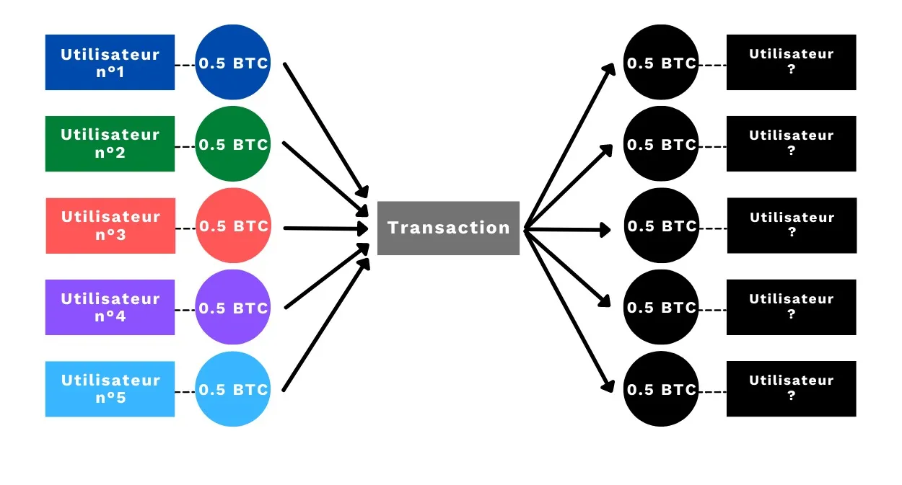

## Progettazione di Whirlpool.

Il modello proposto da Whirlpool si basa su transazioni molto piccole. A differenza di Wasabi e JoinMarket, la forza degli Anon Sets non è determinata dal numero di utenti che partecipano al CoinJoin, ma dalla successione di numerosi piccoli CoinJoin con 5 partecipanti ogni volta.

L'utente dovrà pagare solo una volta, all'ingresso in un pool, e poi potrà remixare gratuitamente quante volte desidera. Sono i nuovi partecipanti che pagano le commissioni di mining per i remixatori.

Gli Anon Sets aumenteranno in modo esponenziale man mano che l'utente e i suoi compagni remixano. L'obiettivo è quindi sfruttare al massimo tutti questi remix gratuiti che ogni volta aggiungono profondità agli Anon Sets dell'UTXO.

Whirlpool è stato concepito secondo 2 criteri principali:

- Che l'implementazione sia utilizzabile su dispositivi mobili.

- Che i cicli di remix si svolgano rapidamente.

Per questi due motivi, il team di Samourai ha scelto di limitare il numero di utenti a 5 per ciclo. Un numero inferiore non avrebbe permesso un CoinJoin sufficientemente efficace e avrebbe ridotto troppo gli Anon Sets per ciclo. Un numero maggiore probabilmente non sarebbe stato gestibile su client mobili e avrebbe ridotto il flusso di cicli.

In definitiva, non è necessario avere un numero elevato di partecipanti per CoinJoin su Whirlpool poiché gli Anon Sets si basano sull'accumulo di numerosi cicli di mixaggio.

## Pool e commissioni.

Affinché questi cicli multipli aumentino effettivamente gli Anon Sets dell'UTXO, è necessario stabilire un certo quadro per limitare gli importi delle UTXO utilizzate. Whirlpool definisce quindi diverse pool.

Una pool è un gruppo di utenti che desiderano mixare e che si sono accordati sulle quantità di UTXO utilizzate per ottimizzare il funzionamento del CoinJoin. Ogni pool definisce un importo fisso di UTXO a cui l'utente deve adattarsi per poter entrare. Concretamente, quando si desidera effettuare CoinJoin, è necessario scegliere una pool in cui entrare per iniziare a mixare. Le diverse pool attualmente disponibili su Whirlpool sono:

- 0,5 bitcoin.
- 0,05 bitcoin.
- 0,01 bitcoin.
- 0,001 bitcoin (= 100 000 sats).

Quindi chiunque può trovare la soluzione adatta alle proprie esigenze.

Ogni pool ha un importo massimo per potervi entrare:

| Pool (bitcoin) | Importo massimo per ingresso (bitcoin) |
| -------------- | -------------------------------------- | --- | --- | ---- | --- |
| '              | 0,5                                    | 35  |     | 0,05 | 3,5 |
| 0,01           | 0,7                                    |
| 0,001          | 0,025                                  |

Per entrare in un pool, è necessario pagare una commissione. Queste sono fisse per ogni pool e sono destinate alle squadre che sviluppano e gestiscono Whirlpool per compensarle per questo servizio. Le commissioni vengono addebitate solo una volta quando si accede al pool. Una volta entrati in un pool, è possibile remixare gratuitamente quante volte si desidera.

Attualmente, queste sono le commissioni applicate per ogni pool:

| Pool (bitcoin) | Commissione di ingresso (bitcoin) |
| -------------- | --------------------------------- |
| 0,5            | 0,0175                            |
| 0,05           | 0,00175                           |
| 0,01           | 0,0005 (50 000 sats)              |
| 0,001          | 0,00005 (5 000 sats)              |

È possibile calcolare facilmente le commissioni sostenute per i propri mix con Whirlpool su questo sito: [https://www.whirlpoolfees.com/](https://www.whirlpoolfees.com/)

Si noti inoltre che queste commissioni sono "un biglietto d'ingresso" per il pool. Pertanto, che si entri nel pool 0,01 con 0,01 btc o con 0,5 btc, le commissioni saranno esattamente le stesse. Prima di mixare, un utente deve quindi chiedersi se desidera pagare commissioni inferiori con un piccolo pool, in tal caso, uscirà con più piccoli UTXO, o se preferisce utilizzare un pool più grande pagando commissioni più alte, ma uscendo con meno UTXO.

Alla fine dei diversi cicli di mixaggio, di solito è sconsigliato unire insieme più UTXO mixati. Ciò potrebbe compromettere la privacy ottenuta precedentemente. Pertanto, a volte è meglio utilizzare un pool più grande, anche se ciò comporta il pagamento di commissioni più alte, al fine di uscire con meno UTXO di dimensioni più grandi.

Altri costi da considerare saranno ovviamente i costi di mining associati a qualsiasi transazione Bitcoin. Come utente di Whirlpool, sarà necessario pagare i costi di mining per la Tx0 e i costi di mining per il mix iniziale. Tutti gli altri remix saranno gratuiti per voi poiché il modello di commissioni di Whirlpool si basa sui nuovi partecipanti.

Ogni CoinJoin è composto da 5 utenti. Tra questi, 2 sono ingressi e 3 sono remix. Pertanto, i due ingressi di ogni mix pagheranno i costi di mining per i 5 utenti, quindi questi due ingressi potranno a loro volta beneficiare della gratuità dei remix successivi.

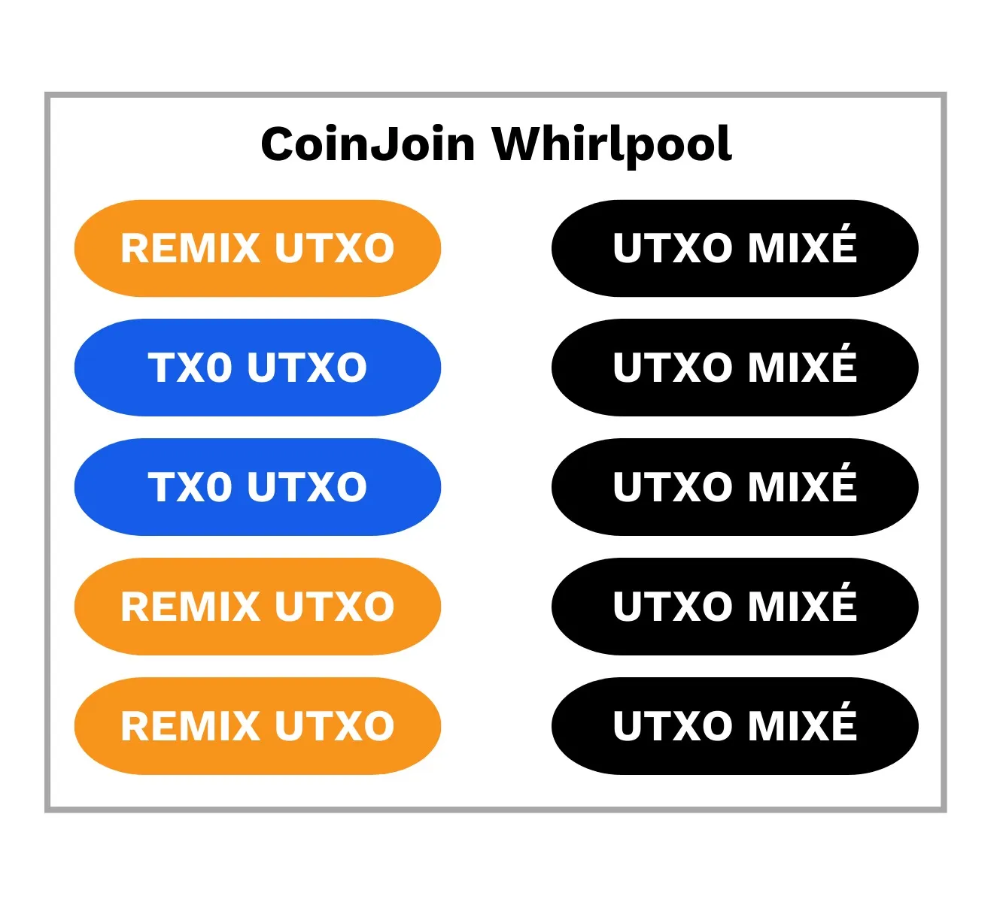'
Grazie a questo modello di spese, Whirlpool si differenzia davvero dagli altri servizi di CoinJoin poiché gli Anon Sets degli UTXO non sono proporzionali al prezzo pagato dall'utente. È quindi possibile ottenere Anon Sets molto elevati, avendo semplicemente pagato le spese del pool e le spese di mining per due transazioni (Tx0 e mix iniziale).
Ovviamente, l'utente dovrà anche pagare le spese di mining quando vorrà prelevare i suoi UTXO dal pool dopo aver effettuato i suoi numerosi remix.

Come spiegato in precedenza, si dice che un UTXO è nel pool quando è disponibile per il mixaggio. Ciò non significa che l'utente ne perde la proprietà. Durante i diversi CoinJoin con Whirlpool, rimani pienamente padrone delle tue chiavi e quindi dei tuoi bitcoin.

## Gli account su Whirlpool.

Per poter implementare questo tipo di transazione CoinJoin, un portafoglio che utilizza Whirlpool dovrà derivare diversi account.

Un account è una sotto-sezione in un portafoglio HD. Questa separazione avviene a una profondità di 3 del portafoglio, cioè al livello di xpub/xprv.

Se non ti senti a tuo agio con questo concetto di account all'interno di un portafoglio HD, ti consiglio di leggere il mio e-book dedicato a questo argomento che puoi scaricare gratuitamente cliccando qui. Ho anche scritto un intero articolo sul funzionamento dei percorsi di derivazione: Comprendere i percorsi di derivazione di un portafoglio Bitcoin.

Ovviamente non è necessario comprendere tutto ciò per utilizzare Whirlpool, ma ricorda semplicemente che un account è una sotto-sezione di un portafoglio HD, completamente separata dagli altri account e con la propria xpub/zpub.

È grazie a questa rigorosa separazione dei diversi account che è impossibile che si verifichi una riutilizzazione di indirizzi tra bitcoin mixati e bitcoin non mixati su Whirlpool.

Su ogni portafoglio HD è possibile derivare fino a 2^(32/2) account diversi. Il primo account, quello che utilizzi di default nel tuo portafoglio senza saperlo, è l'account 0'.

Quando utilizzi un portafoglio adatto all'uso di Whirlpool, questo creerà automaticamente 5 account:

> L'account Deposito determinato dall'indice 0'.
>
> L'account Bad Bank (doxxic change) determinato dall'indice 2 147 483 644'.
>
> L'account Pre Mix determinato dall'indice 2 147 483 645'.
>
> L'account Post Mix determinato dall'indice 2 147 483 646'.
>
> L'account Ricochet determinato dall'indice 2 147 483 647': Questo ultimo account non viene utilizzato direttamente nel protocollo Whirlpool, ma è collegato ad esso. Ne parlerò più avanti, nella sezione dedicata agli strumenti di spesa.

Ogni account ha la propria utilità e sarà destinato a un compito specifico.

L'intero insieme degli account dipende da un unico seed. L'utente può quindi facilmente recuperare l'accesso a tutti i suoi fondi in caso di problemi con la sua frase di recupero e la sua eventuale passphrase. Tuttavia, sarà necessario indicare al software di recupero gli indici dei diversi account utilizzati.

Vediamo ora i diversi passaggi di un CoinJoin Whirlpool all'interno di questi account.

## Tx0.

All'inizio di un CoinJoin, tutto parte dall'account Deposito. Questo è l'account che si utilizza di default quando si crea un nuovo portafoglio Bitcoin. Questo account dovrà essere accreditato dei bitcoin che l'utente desidera mixare.

La Tx0 è la prima transazione nel processo di mixaggio Whirlpool. Il suo obiettivo è quello di pulire l'UTXO o gli UTXO da mixare prima di inviarli al primo mix. Questa transazione permetterà di dividere l'UTXO in ingresso in diversi UTXO che corrispondono all'importo del pool scelto. Tutti questi UTXO equalizzati saranno inviati all'account Premix. La differenza rimanente che non può entrare nel pool scelto sarà separata su un account dedicato: Bad Bank (o "Doxxic Change").

Questa Tx0 permetterà anche di pagare le commissioni al coordinatore.

Dovrete pagare le commissioni di mining per la Tx0.

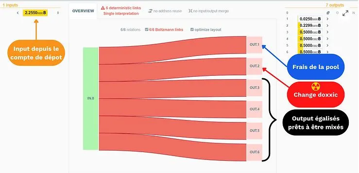

Credito (immagine modificata): KYCP.org: https://kycp.org/#/a126e48d4a6eb8d19682ec0e23ad45e76cd52b45f6c17be5068ae051d4b2cc24

In questo esempio di una transazione Tx0, possiamo vedere un input di 2,2550 bitcoin dall'account di deposito dell'utente che inizia la Tx0. Questo input viene diviso in diversi UTXO in output che rappresentano:

- Le commissioni del coordinatore, qui: 0,0250 B.

- I quattro UTXO pronti per essere mixati che andranno all'account Premix dell'utente. Questi UTXO sono anche registrati presso il coordinatore.

- La differenza che non può entrare nel pool, perché è troppo piccola: è il cambio tossico che andrà al suo account dedicato e isolato.

Le commissioni qui sono diverse da quelle che vi ho fornito nella tabella precedente perché Samourai ha ridotto i suoi prezzi per Whirlpool nel marzo 2021.

## Account doxxic change.

Il cambio che non può essere inserito nel pool viene inviato all'account Doxxic Change (anche chiamato "Bad Bank") per separarlo completamente dagli altri account.

Questo UTXO è pericoloso per la privacy dell'utente poiché non solo è sempre legato al suo passato e quindi potenzialmente all'identità del proprietario, ma è anche segnalato come appartenente a un proprietario che ha fatto un CoinJoin.

Se questo UTXO viene fuso con UTXO mixati, questi ultimi perderanno tutta la privacy guadagnata in precedenza. Se viene fuso con altri Doxxic Changes, l'utente rischia di perdere privacy. Pertanto, è necessario trattarlo con cautela. Spiegherò precisamente come gestire questo UTXO tossico in questa sezione.

## Conto Pre Mix.

Nel conto Pre Mix, troveremo gli UTXO bilanciati durante la Tx0 pronti per essere mescolati. Questi UTXO sono leggermente superiori all'importo del pool poiché dovranno coprire le spese di mining del loro mix iniziale.

Una volta che questi UTXO sono passati nel loro mix iniziale, il conto Pre Mix sarà vuoto e nuovi UTXO saranno presenti nel conto successivo.

## Conto Post Mix.

Il conto Post Mix accoglie gli UTXO appena mixati dal loro mix iniziale. Accoglie anche tutti gli altri UTXO disponibili per nuovi mix.

Se il client Whirlpool è in esecuzione, gli UTXO presenti nel conto Post Mix sono disponibili per nuovi mix. Saranno selezionati casualmente per essere remixati.

Quando l'utente desidera spendere gli UTXO mixati, può farlo direttamente da questo conto Post Mix. È inoltre consigliabile lasciare gli UTXO mixati in questo conto, non solo per essere remixati gratuitamente, ma anche per evitare che escano dal circuito Whirlpool, altrimenti potrebbero perdere privacy.

## Set Anonimi.

Come spiegato in precedenza, i Set Anonimi sono due parametri che ti permettono di calcolare quanto un UTXO sia confidenziale e quindi quanto efficace sia la tua sessione di CoinJoin.

Il primo parametro è il punteggio prospettico (in inglese: "Forward-looking Anon Set"). Anche se questa semantica è sbagliata, questo punteggio è spesso chiamato semplicemente "Anon Set" per comodità.

Il punteggio prospettico di un UTXO rappresenta la dimensione del gruppo in cui è nascosto in un dato momento.

Per darti un'immagine, il punteggio prospettico è il numero di UTXO attuali che possono corrispondere a un determinato UTXO nel passato. Ad esempio, immaginiamo un attore che osserva la catena Bitcoin che traccia un UTXO di tua proprietà prima che entri nel pool di CoinJoin. Dopo che la tua moneta ha passato diversi mix, l'osservatore si chiede dove sia passata. Inizia quindi a tracciare i diversi percorsi possibili e, grazie alla natura del CoinJoin, troverà diversi UTXO che potrebbero potenzialmente corrispondere al tuo. Questo numero di UTXO potenziali è il punteggio prospettico del tuo UTXO che si trova tra di loro.

Quindi, all'uscita di un primo CoinJoin Whirlpool, un UTXO avrà un punteggio prospettico pari a 5. Cioè, sarà nascosto in un gruppo probabile di 5 UTXO:

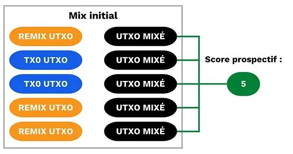

Se una persona sta monitorando il mio UTXO in ingresso, non sarà in grado di sapere quale di questi 5 UTXO in uscita mi appartiene.

Questo punteggio prospettico aumenta man mano che l'utente fa remix, ma anche quando i suoi pari fanno remix durante i suoi mix precedenti. Riprendiamo il nostro esempio con un UTXO che ha attualmente un punteggio prospettico di 5. Se questo UTXO che ci appartiene viene remixato, allora il suo punteggio passerà a 9.

Ciò che è molto interessante con Whirlpool è che anche se il mio UTXO non viene remixato, poiché fa parte di un gruppo in cui non può essere differenziato dagli altri, il suo punteggio aumenterà in base ai remix dei suoi pari incontrati in passato.

Immaginiamo che il nostro UTXO abbia passato un primo mix e abbia quindi un punteggio di 5. Se un UTXO presente nello stesso mix passa a un nuovo remix, allora il punteggio del mio UTXO aumenterà a 9, anche se non si è mosso dal mix iniziale:


Questo aumento del punteggio prospettico è esponenziale, poiché se un UTXO incontrato dall'UTXO che ho incontrato durante il mio primo mix viene remixato, allora il mio Anon Set aumenta ancora:

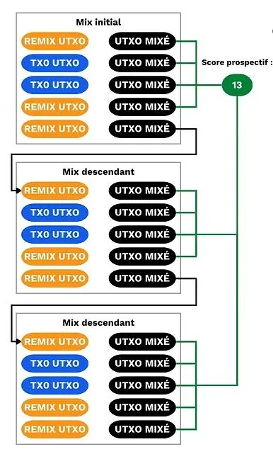

Questo aumento esponenziale è reso possibile dal modello unico di Whirlpool basato su numerosi piccoli CoinJoin successivi.

Per ricordare, tutti questi remix sono gratuiti, quindi è molto conveniente lasciare che i propri UTXO si mixino e si remixino, approfittando dei remix dei propri pari incontrati, finché non si ha bisogno di spendere questi UTXO che ci appartengono.


Il secondo Anon Set che si può determinare su un dato UTXO per calcolare il suo livello di privacy è il punteggio retrospettivo (in inglese "Backward-looking Anon Set").

Questo punteggio retrospettivo è in qualche modo l'eredità che i peer precedenti al tuo mix iniziale ti lasciano. Indica il numero di Tx0 che possono corrispondere al tuo UTXO mixato.

Quindi permette di valutare il livello di privacy di un UTXO di fronte a un tentativo di tracciamento opposto al primo menzionato.

Ricordatevi che per il punteggio prospettico, questo parametro permette di valutare quanto si è confidenziali in caso di tentativo di tracciamento da un UTXO in ingresso ai cicli di CoinJoin, verso il nostro UTXO in uscita. Per il punteggio retrospettivo, il parametro permette di valutare quanto un UTXO in ingresso sia confidenziale prendendo come punto di partenza del tracciamento un UTXO in uscita dal ciclo. Cioè, si fa il percorso inverso.

Per esempio, immaginiamo che un osservatore della catena Bitcoin conosca un UTXO e desideri tracciare da dove proviene per cercare di determinarne l'origine. Vedrà quindi che questo UTXO ha attraversato dei CoinJoin e si imbatterà in molti UTXO in ingresso al CoinJoin che potrebbero potenzialmente essere quello cercato. Questo numero di UTXO potenziali è il punteggio retrospettivo dell'UTXO tracciato.

Per calcolare questo punteggio retrospettivo, è necessario contare tutti gli UTXO in ingresso provenienti da una Tx0 a partire dall'UTXO preso in considerazione. Successivamente, sarà necessario analizzare gli UTXO di remixaggio in ingresso alla transazione e risalire alle 3 transazioni CoinJoin precedenti da cui provengono. Su ciascuna di queste tre transazioni, si effettuerà lo stesso calcolo. Si continua così fino alla transazione CoinJoin Genesis, cioè la prima transazione CoinJoin del pool.

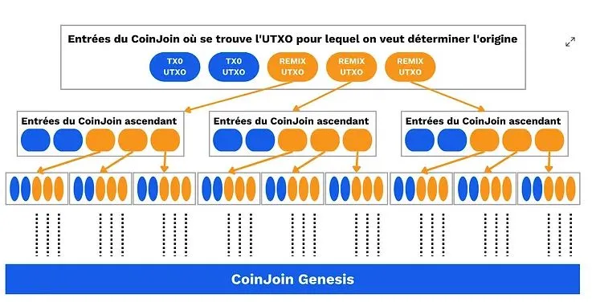

Nello schema sopra, il calcolo del punteggio retrospettivo di uno degli UTXO in uscita dal CoinJoin in alto consiste nel calcolare il numero di Tx0 (le bolle blu) presenti nei CoinJoin ascendenti al CoinJoin preso in considerazione, fino al CoinJoin Genesis.

A differenza del punteggio prospettico di un UTXO che inizierà da 5 dopo il suo mix iniziale e aumenterà, il punteggio retrospettivo di un UTXO sarà immediatamente molto elevato una volta effettuato il mix iniziale. Più un UTXO è stato mixato di recente, più il suo punteggio retrospettivo sarà elevato. Si beneficia dell'eredità dei mix precedenti nel pool scelto.

## Whirlpool Stats Tool (WST).

Per calcolare facilmente gli Anon Sets di uno dei tuoi UTXO mixati su Whirlpool, puoi utilizzare il Whirlpool Stats Tool (WST). Uno strumento appositamente progettato per calcolare i tuoi Anon Sets su Whirlpool.

Se sei un utente di RoninDojo, lo strumento è preinstallato sul tuo nodo. Per accedervi da RoninCLI, vai su:

```
Samourai Toolkit > Whirlpool Stat Tool
```

Se non hai un RoninDojo, ecco come installare lo strumento WST su una macchina Linux:

Avrai bisogno di: Tor Browser (o Tor), Python 3.4.4 o versione successiva, git e pip3.

Per verificare la loro versione, inserisci i comandi:

```
python --version
git --version
pip --version
```

Installa le dipendenze:

```
pip install PySocks
pip install requests[sock5]
pip install plotly
pip install datasketch
pip install numpy
```

Installa Whirlpool Stats Tool:

```
#Clona la directory:
git clone https://code.samourai.io/whirlpool/whirlpool_stats.git

#Accedi alla directory /whirlpool_stats:
cd whirlpool_stats
# Install dependencies with pip:
pip3 install -r ./requirements.txt
```

I personally had some issues with this latest version of WST. If it doesn't work for you, you can also clone the previous version on github which works perfectly: https://github.com/Samourai-Wallet/whirlpool_stats. The following steps will be the same. Just note that the 100k sats pool did not exist at that time, so you need to manually add it to the code if you are using the old release.

Then create a working directory to store transaction data, and launch WST:

# Access the desired directory, for example home:

```
cd ~

# Create a dedicated directory, for example named "wst":
mkdir wst

# Access the subdirectory /whirlpool_stats:
cd whirlpool_stats/whirlpool_stats/

# Launch WST:
python3 wst.py
```

Once WST is installed and launched, here's how to calculate Anon Sets. These steps are similar whether you are on a regular machine or on RoninDojo:

Enter the following command to set the proxy to Tor (for RoninDojo this command is mandatory):

```
        socks5 127.0.0.1:9050
```

If you are using Tor Browser, it must be running and the command will be:

```
        socks5 127.0.0.1:9150
```

Then access the working directory created in the previous step with the workdir command. If you are on RoninDojo, skip this step:

```
workdir /home/psyduck/wst
# Replace the path in this example with your own path.
```

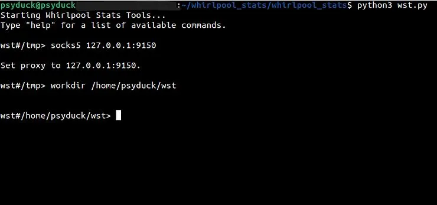

Next, download the data from the pool that contains your transaction:

```
download 0001

# Replace 0001 with the pool denomination code you are interested in.
```

The denomination codes are as follows on WST:

- 0.5 bitcoins pool: 05
- 0.05 bitcoins pool: 005
- 0.01 bitcoins pool: 001
- 0.001 bitcoins pool: 0001

Once the data is downloaded, load it with the command:

```
load 0001

# Replace 0001 with the pool denomination code you are interested in.
```

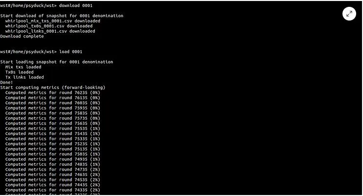

After loading the data, enter the score command followed by your TXID (transaction identifier) to obtain its Anon Sets:

```
score TXID

# Replace TXID with the identifier of your transaction.
```


WST ti mostra prima il punteggio retrospettivo (metriche backward-looking) e poi il punteggio prospettico (metriche forward-looking). Oltre ai punteggi degli Anon Sets, WST ti fornisce anche il tasso di diffusione del tuo output nel pool in base all'anon set.

Si prega di notare che il punteggio prospettico del tuo UTXO viene calcolato a partire dalla TXID del tuo mix iniziale, e non dalla tua ultima miscelazione. Al contrario, il punteggio retrospettivo di un UTXO viene calcolato a partire dalla TXID dell'ultimo ciclo.

## Muuuh xpubs.

Ci sono molte disinformazioni sul funzionamento di Whirlpool. La critica più diffusa è sicuramente quella secondo cui Samourai avrebbe accesso agli xpub degli utenti su un server.

In realtà, il protocollo Whirlpool funziona senza bisogno di accedere agli xpub degli utenti. La necessità di xpub si trova a livello del portafoglio, come tutti gli altri software, e si limita a un'utilizzo specifico:

- Se utilizzi Whirlpool su Samourai Wallet senza utilizzare il tuo proprio Dojo, allora sì, il Dojo di Samourai conosce il tuo xpub.

- Se utilizzi Whirlpool su Samourai Wallet con il tuo proprio Dojo, nessun xpub viene divulgato.

- Se utilizzi Whirlpool su Sparrow Wallet senza utilizzare il tuo proprio nodo, il nodo di terze parti a cui sei connesso vede le tue transazioni.

- Se utilizzi Whirlpool su Sparrow Wallet con il tuo proprio nodo, nulla viene divulgato su questo fronte.

Come per tutti gli altri portafogli Bitcoin, è necessario utilizzare il proprio nodo. Altrimenti, si perde in indipendenza, riservatezza e fiducia. Ma, alla fine, questo non ha nulla a che fare con il protocollo Whirlpool. Su questo punto, Samourai Wallet agisce come tutti gli altri portafogli esistenti.

Ora che abbiamo visto la teoria e il funzionamento generale, proviamo la pratica!

# Sezione pratica

## Tutorial: Whirlpool su Sparrow Wallet.

Ci sono molte opzioni per utilizzare Whirlpool. La prima che desidero presentarti è l'implementazione di Sparrow Wallet, un software open-source per la gestione del portafoglio Bitcoin su PC.

Questo metodo ha il vantaggio di essere abbastanza facile da imparare, veloce da configurare e non richiede alcun dispositivo oltre a un computer e una connessione internet. Tuttavia, questo metodo ha un inconveniente significativo che non si trova nel secondo tutorial che troverai nella parte successiva:

- Le miscelazioni avvengono solo quando Sparrow è avviato e connesso. Ciò significa che se desideri miscelare e rimiscelare i tuoi bitcoin 24 ore su 24, dovrai lasciare costantemente il tuo computer acceso.

La soluzione unica a questo problema è utilizzare il tuo proprio Dojo. Ne parlerò nella parte successiva.
Se non hai mai utilizzato Whirlpool in precedenza e desideri farlo al momento più per una questione di comprensione che di efficienza, ti consiglio di iniziare tranquillamente con Sparrow per capire bene i meccanismi.
Partiamo, vediamo insieme come fare:

Per iniziare, ovviamente avrai bisogno del software Sparrow. Puoi scaricarlo direttamente dal sito ufficiale di Sparrow Wallet o dal loro GitHub:

- [https://sparrowwallet.com/download/](https://sparrowwallet.com/download/)

- [https://github.com/sparrowwallet/sparrow/releases](https://github.com/sparrowwallet/sparrow/releases)

Prima di installare il software, sarà importante verificare la firma e l'integrità dell'eseguibile che hai appena scaricato. Se non sai come fare questa operazione, ti spiego come farlo su Windows in questo articolo: [Come verificare l'integrità di un software Bitcoin su Windows?](https://example.com)

Una volta installato il software, dovrai creare un portafoglio Bitcoin. Nota che per fare il mixing, è necessario avere un portafoglio software (detto "caldo"). Non potrai quindi fare il mixing con un portafoglio sicuro tramite hardware wallet.

Non è obbligatorio, ma se hai intenzione di mixare somme consistenti, ti consiglio vivamente di utilizzare una passphrase robusta per questo portafoglio. Se non sai come creare un portafoglio su Sparrow, ti spiego dettagliatamente come farlo nella 5ᵃ parte dell'articolo seguente: [Tutto quello che devi sapere sulla Passphrase Bitcoin](https://example.com)

Una volta creato il portafoglio, invia i satoshi da mixare. Clicca semplicemente su "Receive" e inviali a un indirizzo che ti appartiene come faresti normalmente.

Qui puoi vedere che ho appena creato il mio portafoglio e ho inviato poco più di 199k satoshi:

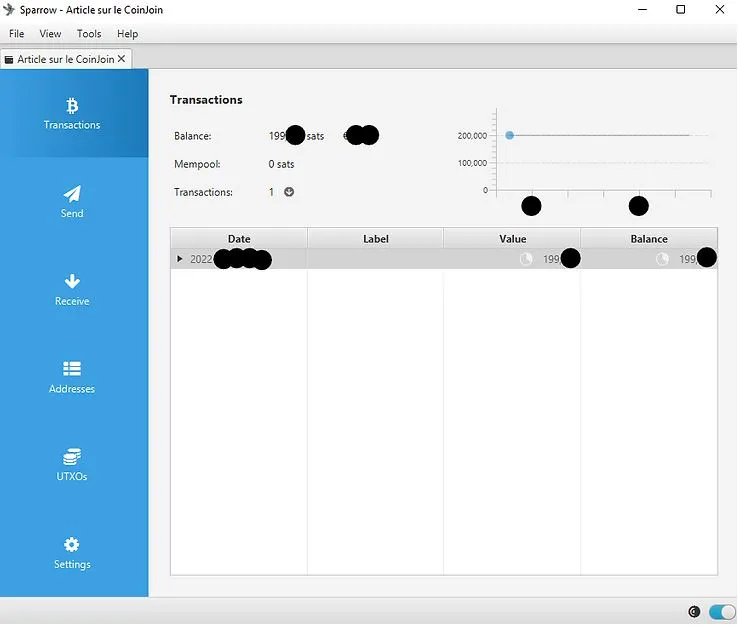

Al momento, stai utilizzando un account classico. Questo account indicizzato 0' diventerà il tuo account di Deposito per il mixing.

Per mixare questo UTXO che hai appena ricevuto, vai nella lista degli UTXO dell'account cliccando su "UTXOs" a sinistra dell'interfaccia:

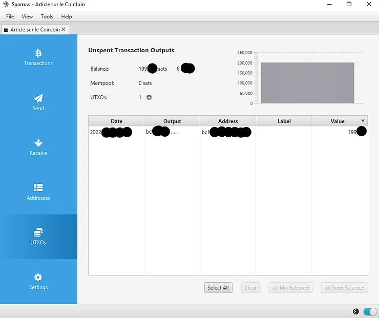

Seleziona quindi i diversi UTXO da mixare cliccandoci sopra. Se desideri selezionarne più di uno, tieni premuto il tasto Control e clicca su ognuno di essi. Una volta selezionato l'UTXO, verrà evidenziato in blu.

Quindi clicca sul pulsante "Mix Selected" in fondo all'interfaccia:

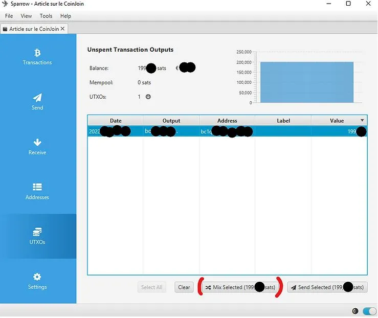

Si apre una finestra che ti spiega il funzionamento di Whirlpool. È una semplificazione di ciò che ti ho spiegato nella parte precedente.

Clicca su "Next" dopo aver letto.

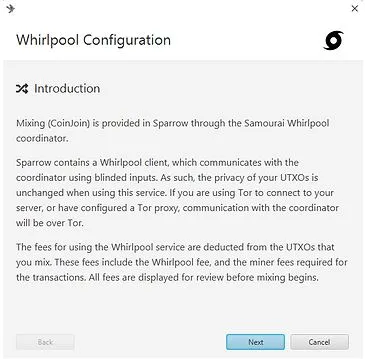
On vous explique également le fonctionnement des comptes. Cliquez sur "Next" après avoir lu.

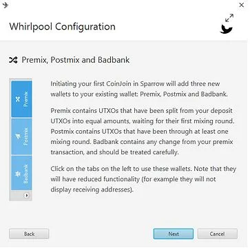

Sur la page suivante, vous pourrez entrer un SCODE si vous en avez un. Un SCODE est un code de réduction à appliquer sur les frais d'entrée de pool. Samourai Wallet en fournit parfois à ses utilisateurs lors d'un évènement notable (exemple : pour Noël). Pensez à les suivre sur Twitter pour ne pas manquer les prochains SCODES : https://twitter.com/SamouraiWallet

Choisissez ensuite les frais de minage que vous souhaitez allouer à la Tx0 et au mix initial. Cela affectera la vitesse à laquelle votre premier mix sera confirmé. Pour rappel, vous payez les frais de minage lors de votre Tx0 et de votre mix initial, mais vous ne paierez pas de frais de minage pour tous les autres remixes.

Une fois les frais choisis, cliquez sur "Next".

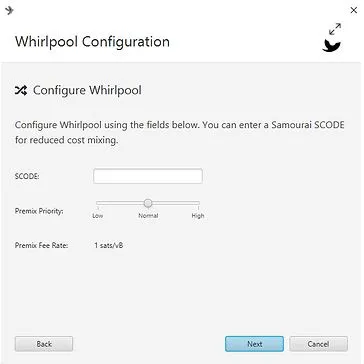

Sur cette nouvelle fenêtre, vous pourrez choisir sur quelle pool entrer en cliquant sur la liste déroulante. La fenêtre vous annonce également les frais de pool que vous allez payer et le nombre d'UTXO qui entreront dans cette pool. Puis cliquez sur "Preview Premix".

Dans mon exemple, je disposais d'un UTXO de 199k sats, je vais donc entrer avec seulement un UTXO dans la pool de 100k sats :

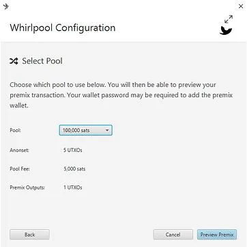

Sparrow vous demandera ensuite d'entrer le mot de passe de votre portefeuille que vous avez paramétré lors de sa création sur le logiciel.

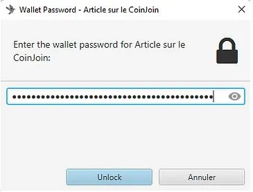

Et, vous accèderez à l'aperçu de votre Tx0.

Tout d'abord, vous pouvez y voir que Sparrow a dérivé les différents comptes nécessaires à l'utilisation de Whirlpool. Vous pouvez les apercevoir sur la gauche de l'écran.

Vous pouvez également voir la structure de votre transaction avec les différents outputs :

- Les frais de la pool (coordinateur).

- Les UTXO de Premix.

- Le Doxxic Change.

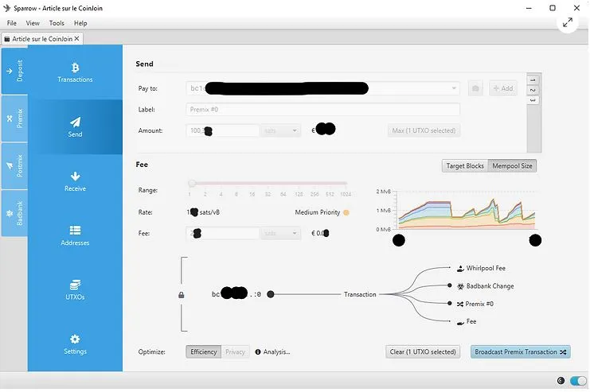

Si la transaction vous convient, cliquez sur le bouton "Broadcast Transaction" pour diffuser votre Tx0. Sinon, vous pouvez également modifier les paramètres de cette Tx0 en cliquant sur le bouton "Clear" et en recommençant la construction de cette transaction.

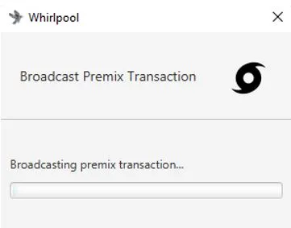

Une fois la Tx0 diffusée, vous pourrez retrouver vos UTXO prêts à être mixés dans le compte Premix. Votre UTXO est maintenant enregistré par le coordinateur et va être envoyé vers son mix initial.

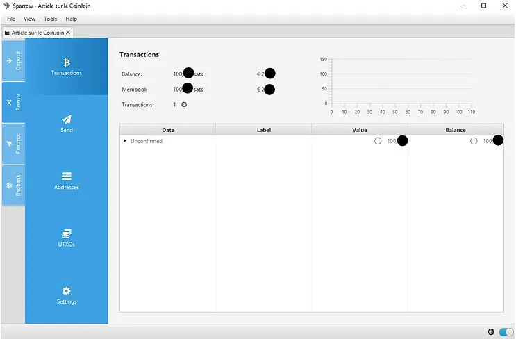
Qui, qui possiamo vedere che il mio UTXO proveniente da Tx0 è stato confermato una volta. Possiamo anche vedere il mix iniziale che è stato costruito e diffuso, ma che è in attesa di conferma:
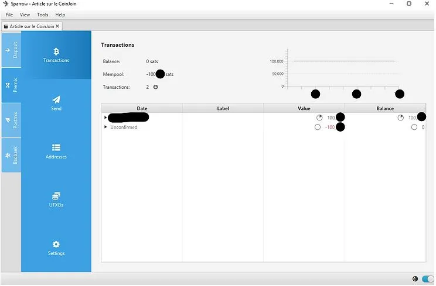

Se andiamo nell'account Postmix, possiamo vedere che l'UTXO proveniente dal mix iniziale è stato diffuso, ma non ancora confermato. Una volta confermato, rimarrà automaticamente disponibile per futuri remix che non saranno addebitati.

Nella colonna "Mixes", potrete osservare il numero di remix dei vostri diversi UTXO. Ricordatevi che non è tanto il numero di remix che è importante, ma gli Anon Sets, anche se le due informazioni sono in parte correlate.

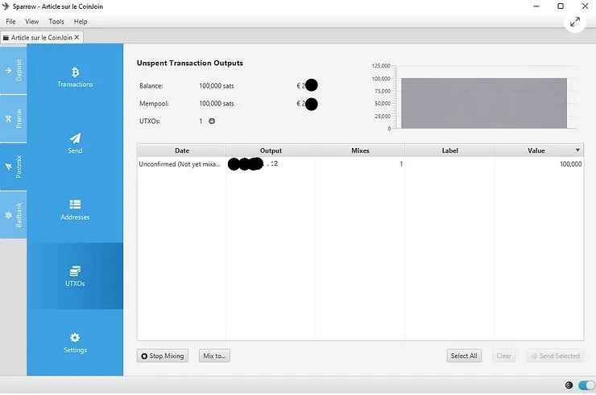

Ecco, il vostro UTXO è stato mixato. Attualmente si trova nel pool in attesa di remix. Se desiderate interrompere il mixing, basta cliccare sul pulsante "Stop Mixing". Potrete riavviarlo cliccando sul pulsante "Start Mixing".

Se desiderate lasciare il vostro UTXO disponibile per il remixaggio, è necessario lasciare aperto il software Sparrow Wallet e il vostro computer acceso (non in standby).

Potete eventualmente disattivare la modalità standby nelle opzioni del vostro sistema operativo. Esiste anche un'opzione da selezionare nel software Sparrow per impedire la modalità standby del vostro computer:

> Strumenti > Impedisci lo standby del computer

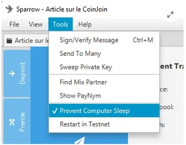

Il pulsante "Mix to" presente nel vostro account Postmix nella sezione UTXO vi permette di configurare l'invio automatico del vostro UTXO mixato al portafoglio da voi scelto. Potete scegliere il numero di remix da effettuare prima dell'invio a questo portafoglio.

Questa opzione vi permette, ad esempio, di inviare automaticamente il vostro Postmix al vostro portafoglio hardware. Fate attenzione, però, di solito è sconsigliato utilizzare questa opzione. Vi spiegherò il motivo nella sezione: Best Practices in post-mix.

Vi ho presentato qui una delle opzioni per mixare con Whirlpool, ma ne esistono altre. Ad esempio, potete mixare direttamente dal vostro smartphone con l'applicazione Samourai Wallet su Android. Il funzionamento sarà simile a quello descritto in questa sezione.


## Tutorial: Whirpool CLI su Dojo e Whirlpool GUI.

Se desiderate passare alla fase successiva, potete mixare con Whirlpool sul vostro Dojo personale.

Dojo è un'implementazione di un nodo Bitcoin sviluppata dal team di Samourai Wallet. Se utilizzate il vostro Dojo personale per CoinJoin su Samourai, gli xpub dei vostri diversi account non saranno trasmessi a server di terze parti. Guadagnerete quindi in privacy eliminando uno dei rischi associati a Whirlpool.
De plus, Dojo integra Whirlpool CLI che ti consente di eseguire remix 24/7 senza dover tenere aperto il tuo portafoglio su un altro dispositivo.

Questa soluzione richiede l'esecuzione di un nodo Bitcoin ed è leggermente più complessa da configurare rispetto all'esempio precedente. Tuttavia, ti consente di godere dell'esperienza migliore di CoinJoin su Whirlpool con il minor rischio possibile.

Per eseguire il tuo Dojo personale, puoi installare direttamente il tuo nodo Dojo o utilizzare Dojo su un'altra implementazione di un nodo Bitcoin. Al momento, quelli che lo consentono sono:

- RoninDojo, che è semplicemente un Dojo con strumenti aggiuntivi e include un assistente di installazione e un assistente di amministrazione. Ti spiegherò dettagliatamente come configurare e utilizzare RoninDojo in questo articolo: Installare e utilizzare il tuo nodo Bitcoin RoninDojo.

- Umbrel tramite l'applicazione "Samourai Server".

- MyNode con l'applicazione "Dojo".

- Nodl con l'applicazione "Dojo".

Per il nostro esempio, useremo tre interfacce diverse:

- Samourai Wallet.

- Whirlpool GUI.

- Whirlpool CLI.

Whirlpool CLI sarà eseguito sul Dojo per poter usufruire dei vantaggi citati in precedenza. Sarà lui a comunicare con il coordinatore e a gestire i mix.

Whirlpool GUI è l'interfaccia grafica che utilizzeremo per visualizzare ciò che accade su Whirlpool CLI e per avviare mix a distanza. La GUI verrà installata su un qualsiasi PC diverso dal Dojo per poterlo gestire facilmente.

Samourai Wallet ospiterà il nostro portafoglio destinato al CoinJoin. È un'applicazione gratuita e open-source che puoi scaricare su Android o su un emulatore. Grazie a questa applicazione, avrai sempre il controllo sul tuo portafoglio di mixaggio e potrai facilmente spendere i tuoi postmix durante i tuoi spostamenti.

### Passaggio 1: Preparare il tuo Dojo.

Il primo passaggio è quindi avere un Dojo. Dovrai ottenere l'URL di connessione al Dojo, che si presenta sotto forma di un indirizzo Tor. Puoi anche utilizzare il suo codice QR. Questo indirizzo ti permetterà di collegare il tuo portafoglio Samourai Wallet al tuo nodo tramite Dojo.

Se stai utilizzando Umbrel, vai su App Store nel menu di sinistra e installa "Samourai Server". Una volta avviata l'applicazione, troverai il codice QR di connessione al Dojo.

Se stai utilizzando RoninDojo, vai su RoninUI tramite il tuo browser, accedi e clicca su "Manage" in blu nella parte inferiore della sezione "Dojo". Potrai accedere al codice QR di Samourai Dojo cliccando su "Display Values".

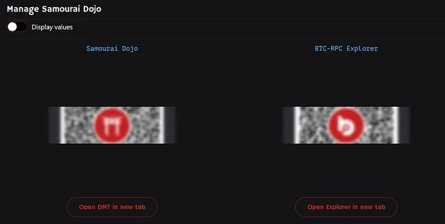

### Passaggio 2: Preparare il tuo portafoglio.

Per il portafoglio, utilizzeremo Samourai Wallet. Puoi scaricarlo dal Google Play Store o direttamente con il file APK dal loro sito ufficiale.

Avvia l'applicazione e accedi al tuo Dojo utilizzando il codice QR del passaggio precedente. Una volta connesso, fai clic su "Crea un nuovo portafoglio".

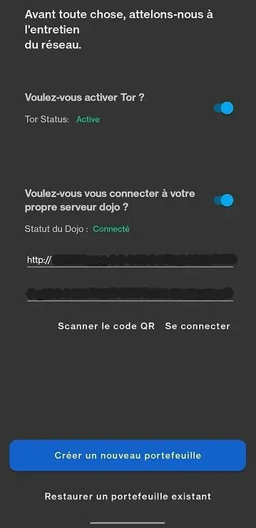

Successivamente, Samourai ti chiederà di creare una Passphrase. Se non sai cosa sia una Passphrase e come configurarla correttamente, ti consiglio vivamente di leggere il mio articolo a riguardo: Tutto quello che devi sapere sulla Passphrase Bitcoin.

Scegli una Passphrase forte e fai un backup fisico. Fai clic su "Avanti" per continuare.

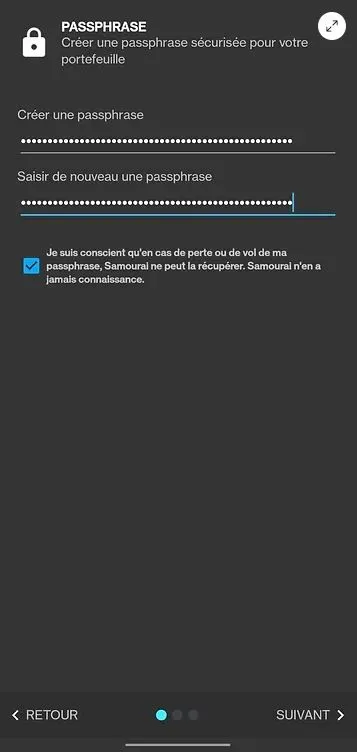

Successivamente, dovrai scegliere un PIN per accedere all'applicazione. Questo PIN è molto importante, ma non ha alcuna connessione con il tuo portafoglio Bitcoin. È specifico per il funzionamento dell'applicazione Samourai. Avrai bisogno di esso per accedere al tuo portafoglio dall'applicazione Samourai. Tuttavia, se hai bisogno di recuperare il tuo portafoglio, saranno necessarie solo la tua Passphrase e la tua frase di recupero (mnemonica). Scegli un PIN forte, fai un backup e fai clic su "Avanti".

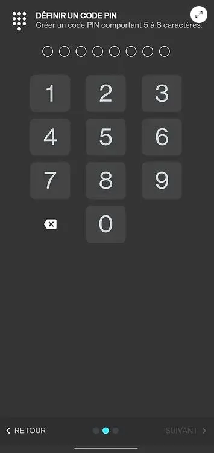

Ti verrà chiesto di confermare nuovamente questo PIN. Successivamente, potrai accedere alla frase di recupero del tuo portafoglio Samourai. Come la passphrase, queste informazioni devono essere adeguatamente salvate su un supporto fisico e sicuro, altrimenti potresti perdere definitivamente l'accesso ai tuoi bitcoin in caso di problemi. Per saperne di più sulla frase di recupero, ti consiglio di leggere questo articolo: Cos'è la frase di recupero Bitcoin?

Dopo aver confermato, arriverai al tuo nuovo portafoglio Samourai. Prima di fare qualsiasi cosa, inizia testando i tuoi backup. Prima di farlo, recupera un xpub del tuo portafoglio per assicurarti di essere nel posto giusto:

> Impostazioni > Portafoglio > Mostra BIP44 XPUB

Ti verrà fornito un codice QR con il valore di XPUB. Semplicemente annota su un foglio gli ultimi 8 caratteri di questo xpub. Ad esempio:

> X2GGWaLt

Questo ti permetterà di essere sicuro di essere nel portafoglio corretto e di non aver commesso errori di battitura nella passphrase.

Successivamente, sovrascrivi il portafoglio vuoto o reinstalla l'applicazione Samourai e prova a ricostruirlo utilizzando solo i tuoi backup precedenti. Per farlo, dopo esserti connesso al tuo Dojo, fai clic su "Ripristina un portafoglio esistente".
Inserisci la frase di recupero e la passphrase annotate sulle tue copie di backup fisiche, scegli lo stesso PIN di prima, quindi ripristina questo portafoglio. Se ciò non funziona, allora il backup della tua frase di recupero non è corretto. Ripeti il passaggio 2 dall'inizio.
Se riesci ad accedere al portafoglio, vai a verificare che il primo XPUB BIP 44 sia ancora lo stesso. Vai su:

> Impostazioni > Portafoglio > Mostra XPUB BIP44

Verifica che gli ultimi 8 caratteri corrispondano a quelli che hai annotato sul pezzo di carta precedentemente. Se non è così, allora il backup della tua passphrase non è corretto (o hai commesso un errore di battitura). Ripeti il passaggio 2 dall'inizio.

Se il tuo backup funziona correttamente, puoi passare tranquillamente al passaggio successivo.

> Si prega di notare che questo test del backup di un nuovo portafoglio deve essere eseguito anche su qualsiasi altro portafoglio, non solo su Samourai.

### Passaggio 3: Preparare Whirlpool GUI.

Ora installeremo Whirlpool GUI, l'interfaccia grafica che ti permetterà di gestire i tuoi CoinJoin. Vai sul tuo computer personale.

Prima di tutto, dovrai installare il kit di sviluppo Java Developper Kit (JDK). Puoi ad esempio installare OpenJDK gratuitamente da questo sito: https://adoptopenjdk.net/ Questo ti permetterà di compilare ed eseguire software sviluppati in Java.

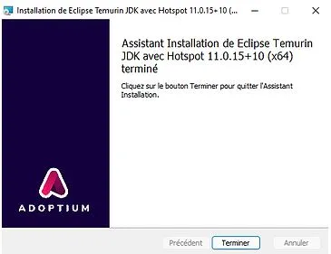

Una volta installato OpenJDK, potrai installare Whirlpool GUI dal sito ufficiale di Samourai Wallet: https://samouraiwallet.com/download/whirlpool

Avvia Whirlpool GUI. Affinché Whirlpool GUI possa connettersi, dovrai avere in esecuzione Tor Daemon o Tor Browser sul tuo PC. Dovrai assicurarti di avviarli prima di ogni utilizzo di Whirlpool GUI su questo computer. Se non hai Tor, installalo dal sito ufficiale prima di iniziare: https://www.torproject.org/download/

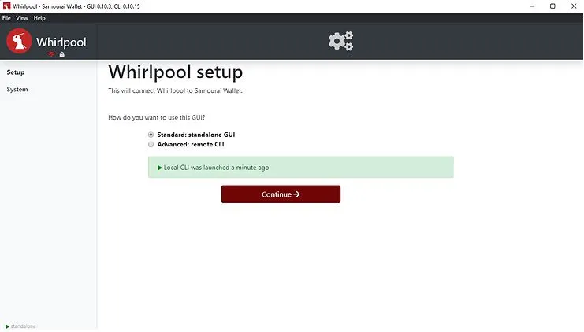

Da Whirlpool GUI, clicca su "Advanced: Remote CLI" per connettere la tua Whirlpool CLI al tuo Dojo. Avrai bisogno dell'indirizzo Tor della tua Whirlpool CLI.

- Per trovarlo su Umbrel: avvia semplicemente l'applicazione Samourai Server, lo troverai sulla pagina.

- Per trovarlo su RoninDojo: vai al menu principale di RoninCLI e vai su Credentials > Whirlpool.

Su Whirlpool GUI, inserisci l'indirizzo Tor trovato in precedenza nel campo "Indirizzo CLI". Lascia "http://", ma non inserire ":8899". Incolla semplicemente l'indirizzo che ti è stato fornito.
Sur la prossima casella, inserisci 9050 se stai usando Tor Daemon o 9150 se stai usando il browser Tor. Se è la prima volta che ti connetti al tuo Whirlpool CLI da un Whirlpool GUI, puoi lasciare vuota la casella della chiave API. Altrimenti, inseriscila.

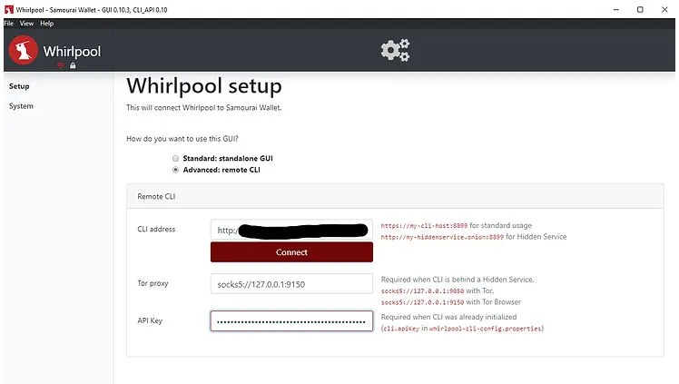

Clicca sul pulsante "Connect" per abbinare il tuo Whirlpool GUI al tuo Whirlpool CLI. Sii paziente, potrebbe richiedere qualche istante per stabilire la connessione.

Successivamente, potrai abbinare il tuo portafoglio Samourai. Clicca sul simbolo del codice QR a destra dello schermo per poterlo scannerizzare.

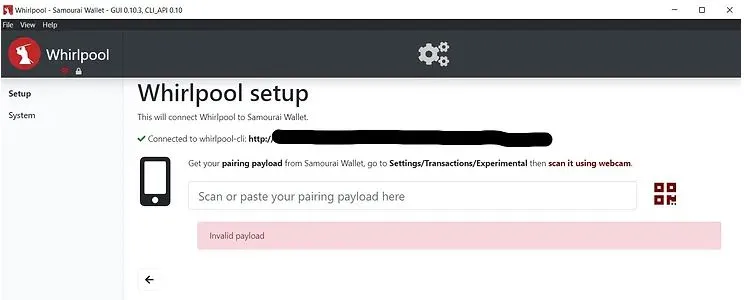

Dal tuo portafoglio Samourai Wallet, vai su:

> ... > Impostazioni > Transazioni > Abbinare con Whirlpool GUI

Scannerizza il codice QR del tuo Samourai su Whirlpool GUI.


Verifica che la connessione sia stabilita su Whirlpool GUI. Nella prossima pagina, attiva "Use Dojo as wallet backend". Poi clicca sul pulsante "Initialize GUI".

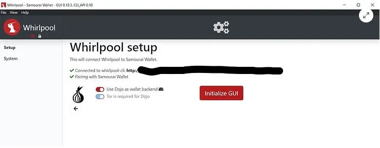

Successivamente, ti verrà chiesto di confermare la passphrase del tuo portafoglio Samourai. Clicca su "Sign in" una volta terminato.

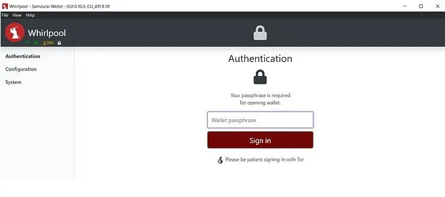

Attendi qualche istante. Una volta completata la configurazione, accederai a Whirlpool GUI:

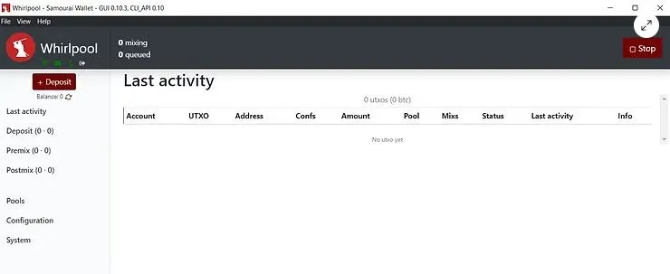

### Passaggio 4: Mixare!

Tutto è pronto, sei pronto per mixare i tuoi bitcoin. Per farlo, invia i satoshi da mixare all'account Deposit del tuo portafoglio Samourai. Hai anche la possibilità di farlo direttamente da Whirlpool GUI.

Clicca sul pulsante "Deposit" per generare un indirizzo di ricezione.

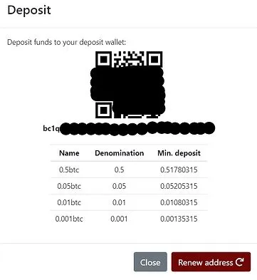

In questa pagina, puoi vedere gli importi minimi da depositare per entrare in un pool specifica. Prevedi sempre un importo leggermente superiore a questo, altrimenti la tua UTXO potrebbe non riuscire ad entrare nella pool desiderata fino a quando le commissioni di mining non diminuiscono.

Quindi invia i tuoi bitcoin da mixare all'indirizzo generato. Puoi generare un nuovo indirizzo cliccando sul pulsante "Renew address".

Per una maggiore sicurezza del tuo deposito, preferisci depositare i tuoi fondi con Samourai Wallet. Basta cliccare sul + blu in basso a destra dell'applicazione, poi su "Ricevi".
Una volta confermato il deposito, potrai vederlo apparire nell'account "Deposit" su Whirlpool GUI. Per iniziare la serie di Coinjoin, seleziona gli UTXO da inviare al mix e clicca sul pulsante "Premix". Attenzione, se selezioni contemporaneamente più UTXO diversi, verranno fusi durante la TX0. Ciò può comportare una perdita di privacy, soprattutto se le fonti degli UTXO sono diverse.

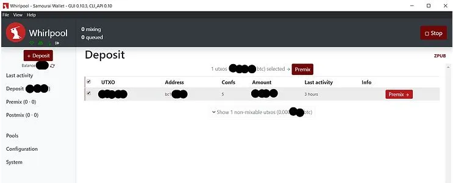

Si apre la pagina di configurazione di Whirlpool. Scegli il pool in cui desideri entrare. Scegli le commissioni di mining allocate a TX0 e al CoinJoin iniziale. In fondo alla pagina vengono indicati l'importo del resto e l'importo e il numero di UTXO equalizzati. Se la configurazione ti soddisfa, clicca sul pulsante "Premix" per avviare il processo di CoinJoin.

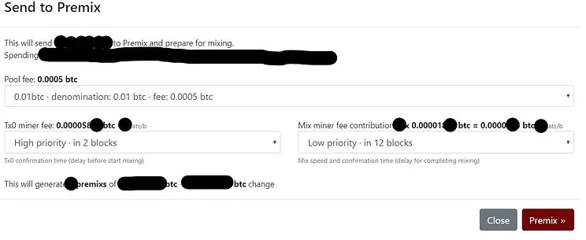

Una volta creata la TX0, puoi vedere i tuoi UTXO equalizzati nell'account "Premix" in attesa di conferma. Se desideri che il tuo Premix venga automaticamente mixato e che i tuoi futuri postmix si remixino automaticamente 24 ore su 24 e 7 giorni su 7, attiva l'opzione "Mix automaticamente premix e postmix" dalla scheda "Configurazione" a sinistra della finestra.

Ora puoi uscire da Whirlpool GUI, i tuoi UTXO sono disponibili per CoinJoin 24 ore su 24 grazie al tuo Whirlpool CLI sul tuo Dojo.

Puoi osservare i tuoi UTXO dall'account "Postmix" su Whirlpool GUI o dall'interfaccia Whirlpool su Samourai Wallet. Per farlo, clicca sul piccolo logo Samourai bianco in alto a sinistra dello schermo. Gli account Whirlpool si distinguono facilmente su Samourai Wallet con un colore azzurro chiaro:

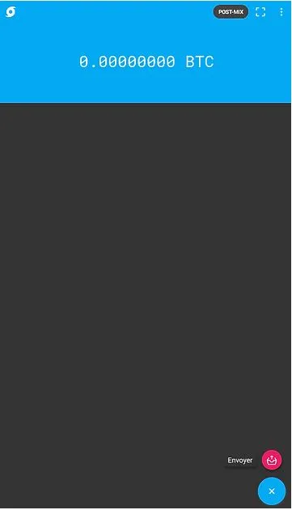

Per spendere i tuoi postmix, clicca semplicemente sull'icona + in basso a destra dello schermo, quindi scegli uno strumento di spesa adatto.

Per seguire facilmente i tuoi mix automatici, ti consiglio anche di configurare un portafoglio Watch-Only con l'applicazione Android Sentinel. Inserisci l'ZPUB del tuo account PostMix e segui in tempo reale l'evoluzione dei tuoi CoinJoin.

# Best practices in post-mix.

Dopo aver mixato, sarà importante rispettare alcune buone pratiche se non vuoi perdere tutta la privacy che hai ottenuto mixando duramente.

## Gli UTXO post-mix.

La migliore opzione possibile dopo aver mixato è lasciare i tuoi UTXO nel tuo portafoglio PostMix in attesa di spenderli. Puoi anche lasciarli remixare senza limiti, fino a quando ne hai bisogno per acquistare qualcosa.
Certuni utenti preferiranno spostare i loro bitcoin mixati in un portafoglio sicuro tramite un hardware wallet. Puoi farlo, ma fai molta attenzione e segui le raccomandazioni fornite da Samourai Wallet. Senza di esse, rischi di perdere tutta la privacy guadagnata in precedenza.

L'errore più comune è la fusione degli UTXO. È essenziale non fondere, cioè mettere come input della stessa transazione UTXO mixati e UTXO non mixati. Ciò comporta una gestione dei tuoi UTXO all'interno del tuo portafoglio e un'etichettatura di essi per evitare di fare cose sbagliate. Oltre al CoinJoin, la fusione degli UTXO è una pratica sbagliata in generale che spesso porta a una perdita di privacy quando non è controllata.

È anche necessario fare attenzione alle consolidazioni tra gli stessi UTXO mixati. È possibile fare piccole consolidazioni se i tuoi UTXO mixati hanno insiemi anonimi importanti, ma ciò ridurrà il livello di privacy dei tuoi bitcoin.

Fai molta attenzione affinché la consolidazione non sia troppo grande o non avvenga dopo un numero troppo ridotto di remix, altrimenti sarà possibile collegare i tuoi UTXO prima del CoinJoin e dopo il CoinJoin per semplice deduzione. Se non hai una buona padronanza di questi concetti, è meglio non consolidare gli UTXO dopo il mix e inviarli uno per uno nel tuo hardware wallet, ogni volta con un nuovo indirizzo vuoto. Ancora una volta, ricorda di etichettare correttamente ogni UTXO ricevuto.

Sconsiglio anche di spostare i tuoi post-mix verso un portafoglio che utilizza script minoritari. Ad esempio, se accedi a Whirlpool da un portafoglio multisig che utilizza script P2WSH, è improbabile che tu venga mescolato con altri utenti che hanno lo stesso tipo di portafoglio originale. Se invii i tuoi post-mix a questo stesso portafoglio multisig, il livello di privacy dei tuoi bitcoin mixati sarà notevolmente ridotto.

È inoltre importante, come per qualsiasi altra transazione Bitcoin, non riutilizzare gli indirizzi di ricezione. Ricorda che gli indirizzi di ricezione sono ad uso unico. Ogni nuova transazione in entrata comporta la generazione di un nuovo indirizzo vuoto.

> 1 UTXO = 1 Indirizzo

Quindi, la cosa più semplice e sicura è lasciare i tuoi UTXO mixati tranquilli nel loro portafoglio PostMix. Puoi lasciarli remixare e toccarli solo quando vuoi separartene, cioè quando desideri spenderli.

## Gli UTXO doxxic cambiano.

Ensuite, sarà importante fare attenzione alla gestione del "Doxxic Change", il cambio che non è riuscito ad entrare nel pool di miscelazione. Questi UTXO tossici creati a seguito dell'utilizzo di Whirlpool sono pericolosi per la tua privacy in quanto collegano te e il tuo utilizzo di CoinJoin. Pertanto, è importante non utilizzarli per qualsiasi cosa e soprattutto non fonderli con altri UTXO. Ecco cosa puoi fare:

- Miscelarli in pool più piccole: se il tuo UTXO è abbastanza consistente da entrare da solo in una pool più piccola, allora miscelalo. È probabilmente una delle migliori soluzioni. Tuttavia, non devi assolutamente fondere più doxxic change insieme per entrare in una pool. È una cattiva idea che creerà un collegamento tra le tue diverse entrate in Whirlpool.

- Etichettarli come "non spendibili" e lasciarli nel conto dedicato: un'altra buona soluzione è semplicemente non toccarli più e etichettarli come "non spendibili" per essere sicuri di non utilizzarli. Se il prezzo del bitcoin aumenta, probabilmente verranno create nuove pool più piccole, che ti permetteranno di miscelare i tuoi piccoli doxxic change nel modo corretto.

- Donarli: è importante fare piccole donazioni, in base alle proprie possibilità, ai vari sviluppatori che lavorano su Bitcoin e sui software correlati, così come ai produttori di contenuti che ci permettono di comprendere l'utilizzo di questi stessi software. Puoi anche scegliere di donare a diverse associazioni che accettano pagamenti in bitcoin. Se il tuo doxxic change è un peso per te, donalo.

- Utilizzarli per acquistare carte regalo: alcuni siti ti permettono di acquistare carte regalo in cambio di bitcoin per poter fare acquisti presso diversi negozi conosciuti. Puoi liberarti del tuo doxxic change acquistando questo tipo di carte regalo.

Ci sono sicuramente altre tecniche per liberarsi di un doxxic change. Alcuni parlano di renderli anonimi utilizzando il Lightning Network, altri utilizzano uno swap con Monero. Queste tecniche potrebbero essere valide, ma non le affronto in questo articolo poiché non le conosco bene. Ti invito a fare le tue ricerche su questi argomenti.

# Gli strumenti di spesa.

Come avrai capito, la pratica più sicura nel Post-Mix è lasciare i tuoi UTXO miscelati nel loro conto dedicato e non toccarli finché non desideri separartene.

Proprio per questo, sarà importante concludere il lavoro in bellezza e utilizzare strumenti appositamente progettati per ottimizzare la nostra privacy fino alla spesa di un UTXO miscelato.
La disponibilità di questi strumenti dipende dal software di portafoglio scelto dall'utente. Samourai Wallet si differenzia nettamente dai suoi concorrenti grazie alla diversità e all'efficacia degli strumenti offerti. Alcuni di essi sono disponibili anche su Sparrow Wallet. Vediamo insieme quali sono questi strumenti e come utilizzarli.

## PayJoin - Stowaway.

Il PayJoin è un CoinJoin tra due persone con una struttura specifica. Viene utilizzato per una spesa in bitcoin. Può essere utilizzato sia per spendere bitcoin mixati che per spendere bitcoin non mixati.

Questa struttura specifica di transazione è stata implementata per la prima volta da Samourai Wallet con lo strumento Stowaway. Un BIP ha seguito questa implementazione, riprendendo l'idea del PayJoin e rinominandola P2EP (Pay-to-End-Point).

La particolarità del PayJoin è che produce una transazione che sembra normale, ma che in realtà è un mini CoinJoin tra due utenti. Per fare ciò, la struttura della transazione coinvolge il destinatario della transazione insieme al mittente effettivo. Il destinatario include quindi un pagamento a se stesso nel mezzo della transazione che gli permette di essere pagato.

Ad esempio, se acquisti una baguette dal tuo panettiere per 4000 sats da un UTXO di 10.000 sats e desideri fare un PayJoin, il tuo panettiere aggiungerà alla tua transazione originale un UTXO di 15.000 sats che gli appartiene come input, che recupererà completamente come output, al fine di confondere l'analisi euristica:

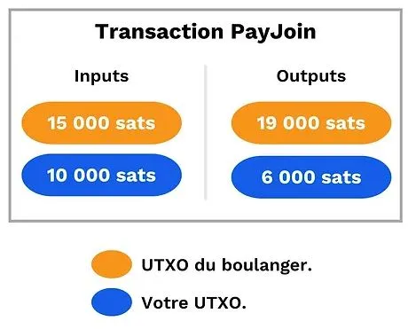

In questo esempio, si può vedere che il panettiere ha inserito 15.000 come input ed è uscito con 19.000. La differenza è effettivamente di 4.000 sats, ovvero il prezzo della sua baguette. Tu, che desideri acquistare la baguette a 4.000 sats, sei entrato con 10.000 e sei uscito con 6.000. La differenza è effettivamente di -4.000 sats, ovvero il prezzo della baguette. In questo esempio, ho intenzionalmente trascurato le commissioni di mining per semplificare.

Grazie a questa struttura, il PayJoin rompe l'euristica della proprietà comune degli input di una transazione Bitcoin. Quando una persona osserverà questo pagamento, penserà che tu abbia semplicemente unito 2 dei tuoi UTXO per acquistare un bene a 19.000 sats e che tu abbia recuperato il resto per 6.000 sats. In realtà, abbiamo visto che la situazione è molto diversa. L'analisi della catena è quindi confusa e i parametri del pagamento sono difficili da capire per chiunque li osservi.

Questo tipo di transazione può essere una soluzione eccellente per spendere i tuoi bitcoin appena mixati senza perdere in riservatezza.

JoinMarket include anche uno strumento PayJoin per spendere, ti lascio scoprire di più cliccando qui.
Come visto in precedenza, Samourai Wallet ha anche il suo strumento PayJoin: Stowaway. Puoi usarlo sia tramite il software Sparrow Wallet che tramite l'applicazione Samourai Wallet.
Stowaway si basa su un tipo di transazione chiamata "Cahoots", ovvero una transazione collaborativa tra più utenti che richiede uno scambio di informazioni al di fuori della catena Bitcoin. Attualmente ci sono due strumenti Cahoots su Samourai: Stowaway e StonewallX2, che scopriremo più avanti.

Le transazioni collaborative Cahoots richiedono lo scambio di transazioni parzialmente firmate tra gli utenti. Questo processo può essere abbastanza lungo e scomodo da fare, soprattutto se si è lontani dall'altro utente. Tuttavia, è sempre possibile farlo manualmente con un altro utente di Samourai Wallet, il che può essere una buona opzione se si è fisicamente con la persona che collabora. Il processo manuale prevede lo scambio di 5 codici QR da scannerizzare uno per uno.

A distanza, questo processo diventa troppo complesso. Samourai ha quindi sviluppato una soluzione eccellente: il proprio protocollo di comunicazione crittografato basato su Tor, Soroban. Grazie a Soroban, gli utenti non devono più fare tutti questi scambi di codici QR. Gli scambi avvengono automaticamente in background, ben nascosti dietro un'interfaccia utente ottimizzata.

Gli scambi crittografati richiedono comunque una forma di connessione e autenticazione tra i collaboratori di Cahoots. Gli scambi Soroban sono quindi basati sui PayNyms degli utenti. Se non sai cosa sono i PayNyms, ne parlo in dettaglio in questo articolo: Cos'è PayNym e BIP47?

In breve, un PayNym è una sorta di identificatore legato al tuo portafoglio che consente di implementare una serie di funzionalità, tra cui scambi di messaggi crittografati. Il PayNym è rappresentato da un identificatore e da un disegno di un robot. Ecco il mio ad esempio (sul Testnet):

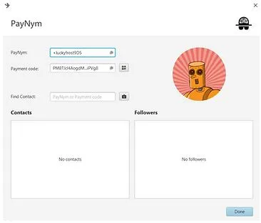

Per poter effettuare una transazione Cahoots a distanza e quindi un PayJoin tramite Samourai o Sparrow, devi "Seguire" un altro utente tramite il suo PayNym. Nel caso specifico, per effettuare uno Stowaway (PayJoin), devi seguire la persona a cui desideri inviare bitcoin.

Per fare ciò da Sparrow Wallet, è sufficiente inserire il PayNym o scannerizzare il codice QR del collaboratore nella casella "Trova contatto", come puoi vedere nella schermata precedente.

Su Samourai, fai clic sul "+" blu in basso a destra dello schermo, quindi su "PayNyms" in viola. Se non hai ancora un PayNym, puoi generarne uno seguendo le istruzioni.

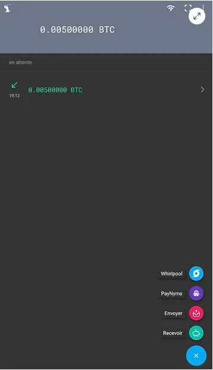

**Tutorial eseguito su Testnet: questi non sono veri bitcoin.**
Una volta nell'interfaccia PayNym, tocca il "+" blu. Potrai quindi seguire il PayNym del tuo collaboratore incollando il suo identificativo o scannerizzando il suo codice QR.

Successivamente, clicca su "Segui":

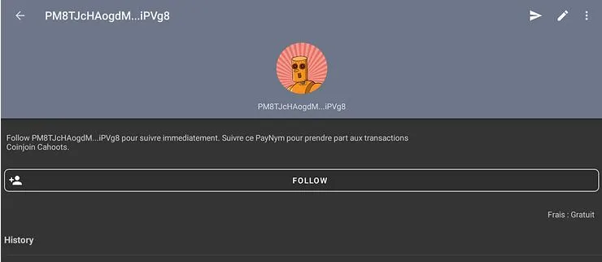

Ti verrà poi chiesto se desideri "connetterti" ad esso. Questa funzionalità consente di utilizzare successivamente BIP47. Ciò comporta alcuni costi. Nel nostro caso, non ne abbiamo bisogno, quindi non ci connetteremo.

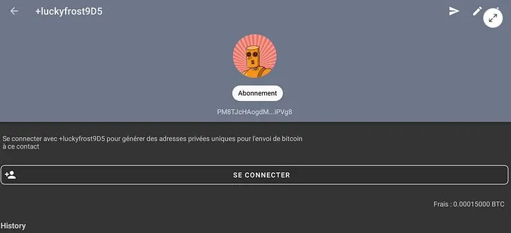

Nel mio esempio, ho effettuato un PayJoin tra il mio Samourai Wallet e il mio Sparrow Wallet. Per accedere a PayNym su Sparrow Wallet, basta cliccare su "Strumenti" e poi su "Mostra PayNym".

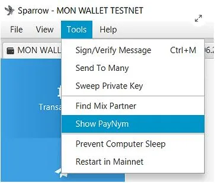

Qui si può vedere che il mio PayNym arancione ha ricevuto correttamente la richiesta di Follow dal mio PayNym Bianco (su Samourai). Sono gentile, l'ho seguito anche io:

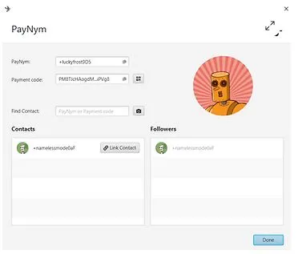

Ora che i Nyms sono connessi, potranno comunicare tra loro in modo crittografato tramite Soroban. Possiamo quindi avviare una transazione Cahoots.

Per effettuare un PayJoin Stowaway da Samourai, sarà necessario costruire una transazione. Se desideri spendere UTXO mixati, vai al conto Post-mix prima di avviare la transazione.

Clicca sul "+" blu, poi su "invia". Puoi anche scegliere specificamente quale UTXO desideri inviare:

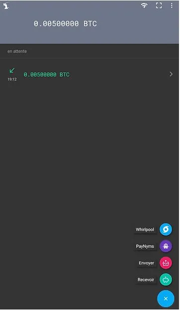

Successivamente, inserisci l'importo che desideri inviare. Nel mio esempio, invio 45.000 sats Testnet:

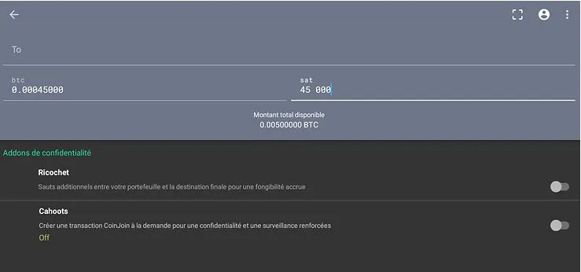

Clicca poi su "Cahoots". Si aprirà questa finestra, dove potrai scegliere se fare uno StonewallX2 o uno Stowaway. Qui, vogliamo fare uno Stowaway:

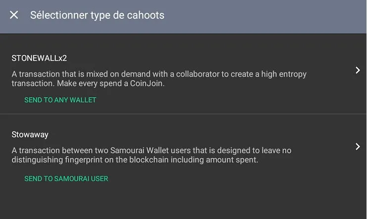

Come spiegato in precedenza, puoi effettuare il PayJoin manualmente o a distanza. È più veloce e facile farlo a distanza, ma richiede di essere connessi tramite PayNym. Nel nostro caso, sceglieremo questa opzione "Online":

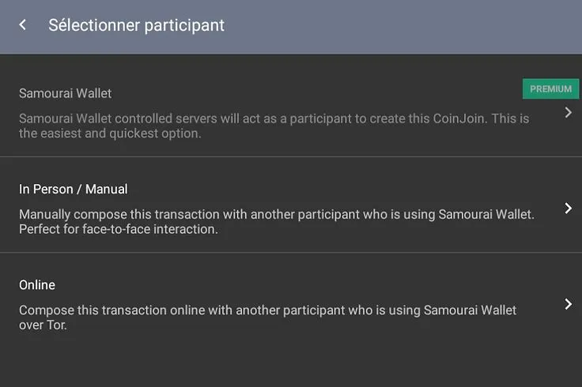

Ti verrà quindi chiesto di scegliere il tuo collaboratore tra i tuoi contatti PayNym. Qui scelgo "luckyfrost", che è il mio PayNym arancione su Sparrow:

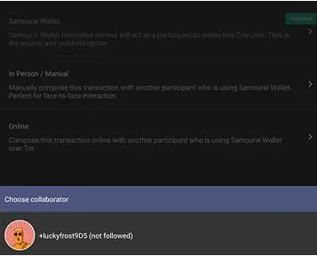

Conferma cliccando su "Verifica Transazione".

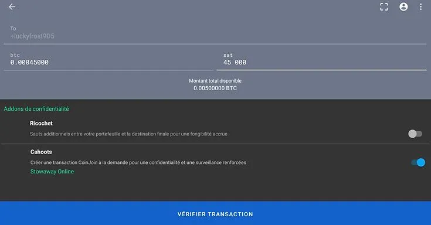

Successivamente potrai scegliere le commissioni di mining allocate a questa transazione. È importante sapere che queste commissioni saranno pagate dall'emittente iniziale della transazione. Clicca su "Démarrer Stowaway".

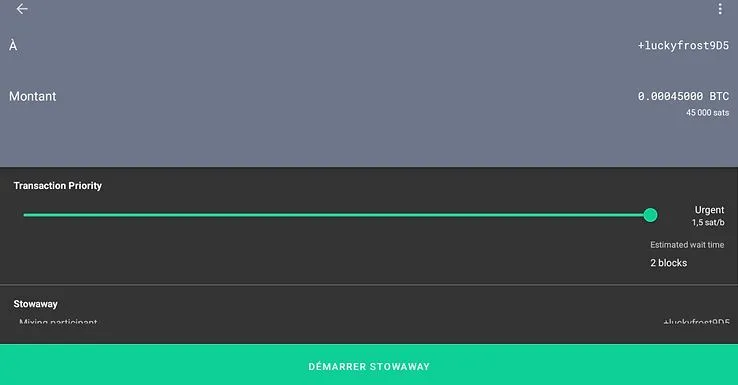

Successivamente verrai invitato ad attendere che il tuo partner confermi di essere d'accordo nel realizzare questa transazione collaborativa.

Per confermare una richiesta di cahoot su Samourai, clicca sul "+" blu, poi su "Recevoir" in verde. Verrà visualizzato un indirizzo. In alto a destra, clicca sui tre puntini, poi su "Receive Online Cahoots".

Per confermare su Sparrow Wallet, clicca sulla scheda "Tools", poi su "Find Mix Partner". Si aprirà una finestra, clicca su "Next" e poi ancora su "Next" per confermare la transazione collaborativa.

Il Cahoot è in corso. I tuoi due portafogli si scambiano transazioni parzialmente firmate e crittografate su Tor grazie a Soroban.

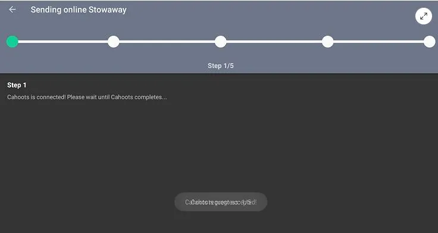

Una volta costruita la transazione Stowaway, potrai diffondere la transazione per inviarla ai nodi della rete Bitcoin.

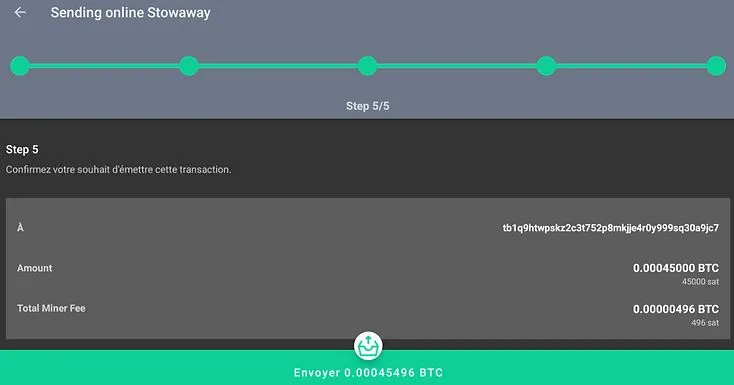

Ecco, la transazione Stowaway è stata diffusa. Congratulazioni.

Osservando la transazione, è possibile vedere gli input e gli output dei due utenti. La differenza tra l'output e l'input del PayNym bianco è di -45.000 sats, mentre la differenza per il PayNym arancione è di +45.000 sats, ovvero l'importo che ho inviato effettivamente.

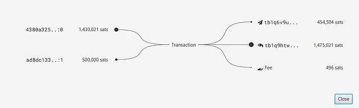

### Stonewall.

Stonewall è una struttura di transazione specifica che imita un CoinJoin tra due persone, senza però esserlo.

Questa transazione non è collaborativa, coinvolge solo gli UTXO dell'emittente della transazione. Puoi quindi creare una transazione Stonewall per qualsiasi occasione, senza doverti accordare con nessuno.

Il suo funzionamento è piuttosto semplice: si mettono in input diversi UTXO appartenenti all'emittente e si creano 4 output. 2 di questi output avranno lo stesso importo, gli altri saranno il resto. Tra questi 2 output simili, solo uno andrà effettivamente al destinatario del pagamento.

Questa struttura aggiunge molta entropia alla transazione e confonde le tracce. Osservandola dall'esterno, sembra che questa transazione sia un CoinJoin tra due persone. In realtà, è un pagamento. Quindi permette di creare dubbi nell'analisi della catena.

Questo strumento Stonewall è utilizzato di default su Samourai Wallet se il tuo portafoglio soddisfa le condizioni necessarie per la sua implementazione. Vediamo insieme come fare uno Stonewall. Per farlo, invio 50.125 sats grazie a questo strumento:


Come puoi vedere in questo video, l'opzione Stonewall è preselezionata per impostazione predefinita.

Ecco come appare la transazione Stonewall che ho appena effettuato nel video:

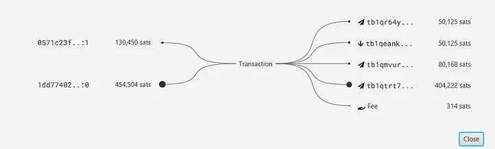

Si può vedere che Samourai ha aggregato 2 UTXO di mia proprietà come input:

- 130 450 S

- 454 504 S

E si possono riconoscere i 4 output della transazione Stonewall:

- 50 125 S che costituiscono il pagamento effettivo che ho appena effettuato.

- 50 125 S che tornano a un altro indirizzo di mia proprietà.

- I due resti: 80 168 S e 404 222 S che mi tornano anche a me.

Il mio destinatario ha quindi ricevuto solo 50 125 sats, ovvero il valore del pagamento che volevo iniziare.

Ovviamente, se desideri spendere del post-mix, dovrai prima recarti nel tuo portafoglio Whirlpool prima di avviare la transazione.

Samourai non ti addebiterà alcuna commissione per la costruzione di una transazione Stonewall. Dovrai ovviamente pagare le commissioni di mining della tua transazione. Queste saranno più alte rispetto a una transazione "classica" poiché ha più input e output.

Se desideri utilizzare questo strumento su Sparrow, ti rimando a questo tutorial che spiega dettagliatamente come eseguire l'operazione: [https://sparrowwallet.com/docs/spending-privately.html#paying-to-a-paynym](https://sparrowwallet.com/docs/spending-privately.html#paying-to-a-paynym)

## StonewallX2.

StonewallX2 funziona esattamente come Stonewall, con la differenza che gli input della transazione non sono solo quelli del mittente, ma anche quelli di una terza persona. StonewallX2 è quindi una transazione collaborativa tra due utenti di Samourai. Come per Stowaway (PayJoin), la comunicazione tra i collaboratori può avvenire manualmente (se si trovano nello stesso luogo) o a distanza tramite Soroban tramite Tor.

La differenza tra Stowaway e StonewallX2 risiede nel ruolo del collaboratore. Nel caso di Stowaway, il collaboratore è necessariamente il destinatario del pagamento. Nel caso di StonewallX2, il collaboratore mette semplicemente a disposizione i suoi bitcoin per il mixing, ma non è il destinatario del pagamento.

Ad esempio, se desideri effettuare una spesa in modo confidenziale, ma il commerciante a cui desideri inviare bitcoin non supporta Stowaway, puoi semplicemente fare un StonewallX2 con un'altra persona che non ha nulla a che fare con la transazione. Il destinatario sarà sempre il commerciante, ma non sarà necessario che effettui tutte le operazioni legate a Stowaway.

Così, StonewallX2 è un mini CoinJoin tra 2 persone che include un output di spesa. Ciò consente di aggiungere molta entropia alla transazione. Questa struttura specifica aggiunge dubbi statistici sui collegamenti tra mittente e destinatario.
Se si guarda a una transazione StonewallX2 dall'esterno, la sua struttura sarà esattamente la stessa di una transazione Stonewall. Ciò consente di aggiungere ancora più dubbi.

Per effettuare una transazione StonewallX2 a distanza, è necessario essere connessi con il PayNym del collaboratore, allo stesso modo di stowaway. Una volta connessi con il collaboratore, vediamo insieme come effettuare una transazione StonewallX2 a distanza. In questo esempio, collaboro con il mio secondo PayNym su Sparrow Wallet. Non lo mostro nel video, ma il collaboratore di Cahoot deve confermare sul suo wallet di voler partecipare alla transazione congiunta.


Ecco come appare la transazione StonewallX2 che ho appena effettuato nel video:

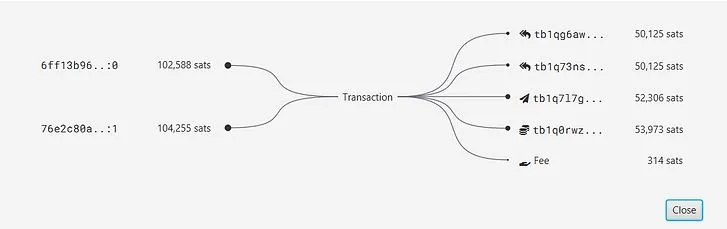

Il primo input di 102.588 S proviene dal mio portafoglio Samourai. Il secondo input di 104.255 S proviene dal portafoglio del mio collaboratore. Possiamo osservare 4 output di cui 2 dello stesso importo per confondere le tracce:

- 50.125 sats che vanno al destinatario del mio pagamento.

- 52.306 sats che rappresentano il mio resto e quindi tornano a un indirizzo del mio portafoglio.

- 50.125 sats che tornano al mio collaboratore.

- 53.973 sats che tornano al mio collaboratore.

Per le transazioni StonewallX2, le commissioni di mining sono divise tra i due collaboratori. Se calcoliamo il saldo di ciascuno dopo la transazione, abbiamo quindi:

- Il collaboratore che è entrato con 104.255 sats ed è uscito con 104.098 sats. La differenza rappresenta la sua quota di commissioni di mining. Se trascuriamo queste commissioni, il collaboratore ha effettivamente compiuto un'azione a vuoto.

- Per il mittente, sono entrato con 102.588 sats ed è uscito con 52.306 sats. La differenza di 50.282 sats rappresenta l'importo che devo al destinatario (50.125 sats) più la mia quota di commissioni di mining.

- Il destinatario non è entrato nella transazione ed esce con 50.125 sats, ovvero l'importo che desidero pagargli.

Samourai non addebiterà alcuna commissione per la costruzione di una transazione StonewallX2. Dovrai ovviamente pagare le commissioni di mining della tua transazione. Queste saranno più alte rispetto a una transazione "classica" poiché ha più input e output.

Se desideri utilizzare questo strumento su Sparrow, ti rimando a questo tutorial che spiega in dettaglio come effettuare l'operazione:

[https://sparrowwallet.com/docs/spending-privately.html#paying-to-a-paynym](https://sparrowwallet.com/docs/spending-privately.html#paying-to-a-paynym)

## Ricochet.

L'ultimo strumento che desidero presentarti è Ricochet. Questo strumento è leggermente diverso dai precedenti che avevano tutti l'obiettivo di aumentare la privacy prospettica. Questo permette di ridurre la traccia lasciata da un CoinJoin su un UTXO, e quindi di aumentare la privacy retrospettiva.

Se effettui transazioni come il CoinJoin e invii i tuoi bitcoin mixati direttamente su un exchange, è possibile che il provider blocchi il tuo account o ti richieda giustificazioni sull'origine dei tuoi fondi. Per evitare questi blocchi ipocriti e ingiusti, puoi utilizzare Ricochet per inviare i tuoi fondi mixati verso un exchange.

Quindi, l'unico caso d'uso di Ricochet è quando desideri nascondere il fatto di aver effettuato un CoinJoin in passato su un UTXO di tua proprietà.

Per ridurre questa traccia, Ricochet effettuerà 4 transazioni in cui invierai i fondi a te stesso su indirizzi diversi, quindi lo strumento invierà i fondi alla tua destinazione finale (l'exchange). L'obiettivo è aggiungere distanza tra la transazione CoinJoin e la transazione di deposito. Grazie a questo, gli strumenti di analisi della blockchain penseranno che ci sia stato un cambio di proprietario dal CoinJoin, e quindi il provider probabilmente non assumerà il rischio di bloccare il tuo account o richiederti giustificazioni.

Questo strumento può essere essenziale se hai bisogno di scambiare bitcoin mixati, o semplicemente se desideri ridurre la "traccia" del loro mixaggio passato.

Come abbiamo visto in precedenza, l'account Ricochet utilizzato per gli indirizzi di rimbalzo è un account completamente separato dall'account di deposito.

Ci sono due opzioni per Ricochet:

- Ricochet potenziato: anche chiamato "consegna scalata", questa opzione distribuirà le commissioni pagate a Samourai sulle cinque transazioni di rimbalzo. Garantirà inoltre che ogni rimbalzo sia presente in un blocco diverso. Questa opzione è quindi progettata per essere lenta, ma ottimizza la privacy e la resistenza all'analisi della blockchain della tua operazione.

- Ricochet normale: questa opzione consente di eseguire l'operazione rapidamente, ma sarà meno confidenziale e resistente all'analisi rispetto all'opzione precedente. È preferibile per invii urgenti.

Ricochet è un servizio a pagamento. Dovrai pagare una commissione di 100.000 sats a Samourai.

Ecco come eseguire un Ricochet su Samourai Wallet:


Ora siete pronti a utilizzare Whirlpool nel miglior modo possibile e a spendere il vostro postmix in modo pulito. Gli strumenti di spesa di Samourai Wallet, la maggior parte dei quali sono inclusi anche in Sparrow Wallet, non hanno segreti per voi. Vi consiglio di fare pratica e di provare tutti questi strumenti. Per non rischiare i vostri fondi personali, non esitate a utilizzarli prima sulla Testnet! Questa rete non è solo per gli sviluppatori.

# È sbagliato mescolare i bitcoin?

Gli altcoiners e i principianti spesso descrivono CoinJoin come una pratica oscura, dubbia o addirittura pericolosa. Questo tipo di narrazione nebulosa è spesso dovuta a una mancanza di conoscenza tecnica di Bitcoin e a una fantasia su CoinJoin.

Nulla di tutto ciò è vero, ovviamente. CoinJoin è un uso nobile del Bitcoin che consente a qualsiasi individuo di riprendere il controllo sulla riservatezza dei propri pagamenti, migliorando al contempo la fungibilità esterna della rete di pagamento, senza cadere nell'anonimato assoluto.

Come spiegato in precedenza, CoinJoin permette semplicemente agli utenti di tagliare la loro storia di Bitcoin, ottenendo così una maggiore riservatezza sui loro pagamenti, in particolare se la loro identità è stata associata a un UTXO in passato.

È grazie a questi strumenti, che consentono a ogni utente di proteggere la propria riservatezza, che possiamo realizzare una rete di pagamenti libera e senza vincoli. Senza privacy, non c'è libertà.

Lavorare per rispettare la privacy degli utenti Bitcoin è una nobile causa. Quando si effettua un CoinJoin, non solo si garantisce un certo grado di privacy personale, ma si aiutano anche molte altre persone a migliorare la propria.

Certo, CoinJoin è talvolta utilizzato da persone disoneste. Ma è anche ampiamente utilizzato da persone che ne sono soggette, per le quali la necessità di riservatezza non è una comodità, ma un obbligo. Se tutti usassero CoinJoin solo quando diventa obbligatorio a livello individuale, le persone realmente obbligate a usare questo strumento si mescolerebbero solo con i disonesti, e diventerebbero quindi più facilmente individuabili da un'autorità tirannica.

Faccio anche eco all'argomentazione di Gregory Maxwell, esposta su Bitcoin Talk nel 2013 quando presentò CoinJoin: "In realtà, i veri criminali non hanno bisogno di CoinJoin, [...] possono permettersi di acquistare la privacy in un modo che gli utenti normali non possono, è solo un costo aggiuntivo per la loro attività (spesso molto redditizia)".

In ogni caso, ricordate che CoinJoin è uno strumento. Come ogni strumento, può essere usato in modo costruttivo o distruttivo.

Enfin, secondo me, il CoinJoin si inserisce perfettamente nell'ideologia e nella linea di sviluppo iniziale di Bitcoin. I Cypherpunk scrivono codice. Sviluppano strumenti che consentono a ogni individuo di avere il controllo sulla propria privacy e sovranità su Internet, due caratteristiche indispensabili per garantire la libertà individuale.

Satoshi Nakamoto stesso dedica una parte del suo White Paper al rispetto della privacy dell'utente di Bitcoin. In questo documento, mette in evidenza il rischio di perdita di privacy se il proprietario di una coppia di chiavi viene rivelato. Spiega che se ciò accade, tutte le transazioni del proprietario potrebbero essere tracciate. Attualmente, il CoinJoin è la migliore soluzione per rompere questo legame tra bitcoin e proprietari, descritto da Satoshi Nakamoto nel White Paper.

Per concludere, vi consiglio di studiare i diversi contenuti, che vi espongo nella sezione "Risorse esterne" di seguito, su cui mi sono basato per produrre questo articolo e che sicuramente vi forniranno ancora più conoscenza.

## Per approfondire:

- [Tutto quello che c'è da sapere sulla Passphrase Bitcoin.](https://www.pandul.fr/post/tout-savoir-sur-la-passphrase-bitcoin)

- [Come generare la propria frase mnemonica Bitcoin?](https://www.pandul.fr/post/comment-g%C3%A9n%C3%A9rer-soi-m%C3%AAme-sa-phrase-mn%C3%A9monique-bitcoin)

- [Cos'è PayNym e BIP47?](https://www.pandul.fr/post/qu-est-ce-que-paynym-et-bip47)

## Risorse esterne:

Thread Twitter Why we CoinJoin di @SamouraiWallet:

https://twitter.com/SamouraiWallet/status/1489220847336308739

Articolo HOW TO WHIRLPOOL ON DESKTOP WITH RONINDOJO di ECONOALCHEMIST su https://bitcoinmagazine.com/:

https://bitcoinmagazine.com/guides/how-to-whirlpool-with-ronindojo

Articolo THE EASIEST WAY TO WHIRLPOOL YOUR BITCOIN AND PRESERVE PRIVACY di ECONOALCHEMIST su https://bitcoinmagazine.com/:

https://bitcoinmagazine.com/guides/how-to-whirlpool-bitcoin-on-mobile

Articolo HOW TO WHIRLPOOL YOUR BITCOIN ON DESKTOP WITH SPARROW WALLET di ECONOALCHEMIST su https://bitcoinmagazine.com/:

https://bitcoinmagazine.com/technical/how-to-whirlpool-bitcoin-sparrow-wallet

Articolo Diving head first into Whirlpool Anonymity Sets. Di Samourai Wallet.

https://medium.com/samourai-wallet/diving-head-first-into-whirlpool-anonymity-sets-4156a54b0bc7

Thread Twitter di @BrotherRabbit/\_ sul punteggio prospettico su Whirlpool:

https://twitter.com/BrotherRabbit_/status/1528399310227906561

Tutorial Samouraï di JohnOnChain (Privacy), del canale YouTube Découvre Bitcoin:

https://www.youtube.com/watch?v=kS6iC_ovarQ
Risorse su Ricochet:
https://docs.samourai.io/en/wallet/features/ricochet

Risorse sugli strumenti di spesa su Sparrow Wallet:
https://sparrowwallet.com/docs/spending-privately.html#paying-to-a-paynym

Risorse sugli strumenti di spesa su Samourai Wallet:
https://docs.samourai.io/en/spend-tools#ricochet

Articolo sull'installazione e l'utilizzo di WST (in spagnolo):
https://estudiobitcoin.com/como-instalar-y-utilizar-whirlpool-stats-tools-wst-para-los-calculos-de-los-sets-de-anonimato-de-las-transacciones-coinjoins/

Articolo Dealing with Coinjoin Change Outputs di BitcoinQ+A su https://bitcoiner.guide/:
https://bitcoiner.guide/doxxic/

Serie di 4 articoli Understanding Bitcoin Privacy with OXT di Samourai Wallet:
https://medium.com/oxt-research/understanding-bitcoin-privacy-with-oxt-part-4-4-16cc0a8759d5

Risorse su Whirlpool di Samourai Wallet:
https://code.samourai.io/whirlpool/Whirlpool/-/blob/whirlpool/README.md

https://docs.samourai.io/whirlpool/basic-concepts

https://docs.samourai.io/en/wallet/features/whirlpool
