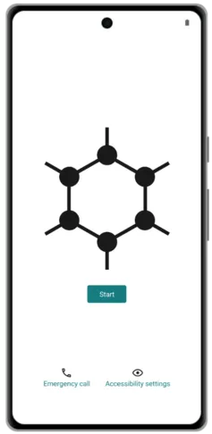
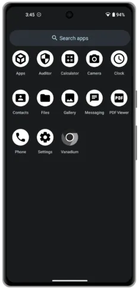
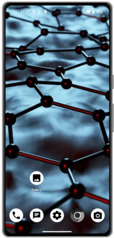
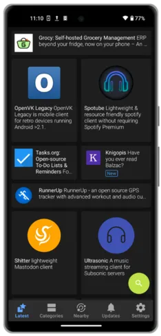

> "[GrapheneOS](https://grapheneos.org/) é um sistema operacional móvel focado em privacidade e segurança, com compatibilidade de aplicativos Android, desenvolvido como um projeto de código aberto sem fins lucrativos."

O GrapheneOS, originalmente fundado em 2014 como 'CopperheadOS', é baseado no código tradicional do Android (AOSP), mas com muitas mudanças e melhorias com o objetivo de melhorar a privacidade e segurança do usuário. O GrapheneOS coloca o usuário no controle do seu telefone, não das grandes empresas de tecnologia.

### Sumário:

- Introdução
- Preparação
- Instalação
- Alternativas de aplicativos
- Desvantagens
- Informações úteis

Guia por https://github.com/BitcoinQnA/Bitcoiner.Guide/blob/main/grapheneos.md

## Por que usar o GrapheneOS?

Os telefones modernos são dispositivos de rastreamento e coleta de dados de $500 a $1000. Todos os aspectos de nossa vida passam por eles e, infelizmente, grande parte desses dados é compartilhada com terceiros de alguma forma.
O GrapheneOS é construído especificamente para reduzir esse compartilhamento de dados e melhorar a segurança do seu dispositivo contra possíveis vetores de ataque. Não existe algo como uma conta do GrapheneOS. Você não precisa de uma para baixar aplicativos ou interagir com o sistema operacional. Simplificando, você não é o produto.

O GrapheneOS oferece segurança adicional à sua experiência no Android por meio de alguns princípios básicos simples.

1. **Redução da superfície de ataque** - Remover código desnecessário (ou bloatware).
2. **Prevenção de exposição a vulnerabilidades** - Permitir ao usuário escolher os compromissos com os quais se sentem confortáveis.
3. **Contenção de sandbox** - O GrapheneOS fortalece as sandboxes existentes do Android, restringindo ainda mais a capacidade de cada aplicativo se comunicar com o restante do seu telefone.

Saiba mais sobre os detalhes técnicos do conjunto de recursos do GrapheneOS [aqui](https://grapheneos.org/features).

### Facilitando a Transição

Se você esteve imerso no ecossistema do Google ou da Apple por anos, a ideia de perder toda essa conveniência da noite para o dia pode ser assustadora. Mas, com algumas decisões cuidadosas de instalação de aplicativos (abordadas posteriormente), grande parte dessa dificuldade esperada pode ser reduzida ou eliminada.

Por melhores que as alternativas estejam se tornando, a ideia de uma mudança ainda pode ser desanimadora. Se você se encontrar nessa situação, meu melhor conselho é usar seu novo dispositivo GrapheneOS ao lado do seu telefone atual por um tempo. A partir daí, você pode gradualmente se desvincular de 2-3 aplicativos por semana até chegar ao ponto em que só usa o dispositivo GrapheneOS.

Se você adotar essa abordagem, seja rigoroso consigo mesmo e corte sua dependência das alternativas vigiadas o mais rápido possível. Nós, seres humanos, somos preguiçosos e frequentemente escolhemos o caminho de menor resistência. Lembre-se por que você fez a troca em primeiro lugar.

**Em vez de pagar com seus dados pessoais, você escolheu pagar com seu tempo e, às vezes, com seu dinheiro suado (dependendo dos aplicativos alternativos que você instala).**

## Primeiros Passos

Atualmente, o GrapheneOS está disponível apenas para a linha de telefones [Google Pixel](https://grapheneos.org/faq#supported-devices) _(ironicamente)_. Isso não acontece sem motivo. Os Pixels oferecem a melhor segurança baseada em hardware para complementar o trabalho realizado para fortalecer o sistema operacional. Isso inclui coisas como isolamento de componentes específicos e inicialização verificada.

### Escolhendo um dispositivo

Ao escolher o Pixel em que você deseja instalar o GrapheneOS, verifique por quanto tempo o dispositivo continuará recebendo [atualizações de segurança](https://support.google.com/pixelphone/answer/4457705?hl=en#zippy=%2Cpixel-xl-a-a-g-a-g) padrão.
No momento da escrita, o Pixel 6a é o modelo mais barato disponível com bom suporte a longo prazo, garantido até julho de 2027. Se você escolher este modelo, o desbloqueio OEM não funcionará com a versão do sistema operacional original de fábrica. Você precisa atualizá-lo para a versão de junho de 2022 ou posterior por meio de uma atualização over-the-air. Depois de atualizá-lo, você também precisará redefinir as configurações de fábrica do dispositivo para corrigir o desbloqueio OEM. Todos os outros modelos desbloqueados pela operadora estarão prontos para o GrapheneOS assim que saírem da caixa.

Ao escolher um dispositivo, você também deve garantir que compre uma versão desbloqueada. Certas operadoras, como a Verizon, enviam unidades com bootloader bloqueado, o que impede completamente o processo a seguir.

### Instalando o GrapheneOS

O instalador web do GrapheneOS torna todo o processo fácil e pode ser concluído por qualquer pessoa em menos de 10 minutos. As seguintes instruções são uma versão resumida retirada do link acima.

Tudo o que você precisa ter em mãos é:

- O Pixel
- Um cabo USB para conectar o telefone ao seu computador
- Um computador para executar um navegador da web (qualquer navegador baseado em Chromium: Chrome, Edge, Brave, etc.)

1. O primeiro passo é ir para **Configurações** > **Sobre o telefone** e tocar repetidamente no número da versão até ver que o **'Modo de desenvolvedor'** está ativado.
2. Em seguida, vá para **Configurações** > **Sistema** > **Opções do desenvolvedor** e ative **'Desbloqueio OEM'**.
3. Agora reinicie o dispositivo e segure o botão de volume para baixo enquanto o telefone está ligando novamente.
4. Conecte o telefone ao seu laptop e, se solicitado autorização, permita a conexão.
5. Na página do instalador web, clique em 'Desbloquear o bootloader'.
6. Em seguida, você verá as opções do telefone mudarem. Use o botão de volume para alterar a seleção para `desbloquear` e use o botão de energia para aceitar.
7. Em seguida, clique em baixar a versão mais recente na página do instalador web.
8. Uma vez totalmente baixado, passe para a próxima etapa e clique em 'Flash release'. Isso levará um ou dois minutos e você não precisa tocar no telefone.
9. Por fim, vá para a próxima etapa do instalador web e clique em **Bloquear o bootloader**. Você precisará alterar a seleção e confirmar com o botão de energia da mesma maneira que fez anteriormente no processo.
10. Quando você vir a palavra `Iniciar`, confirme com o botão de energia e o dispositivo inicializará no seu novo sistema operacional sem o Google.

Tela inicial do GrapheneOS

_Após a inicialização e configuração inicial, é uma boa prática desativar o desbloqueio OEM em Configurações > Sistema > Opções do desenvolvedor._

_Você também pode querer seguir a etapa extra, opcional, mas recomendada, de verificar a instalação por meio do aplicativo Auditor. Você precisará de um telefone Android separado com o aplicativo instalado para concluir esta etapa. As instruções para isso podem ser encontradas [aqui](https://attestation.app/tutorial)._

Vídeo detalhando os passos simples descritos acima

Se esses passos simples parecerem um pouco complicados demais, você pode considerar comprar um Pixel com o software GrapheneOS [pré-instalado](https://ronindojo.io/en/roninmobile). Apenas esteja ciente de que você está depositando um pequeno nível de confiança no provedor.

### Aplicativos Pré-instalados

Agora que você está configurado, pode notar como o GrapheneOS parece básico após a instalação inicial. Por padrão, você terá esses aplicativos instalados:

Aplicativos padrão
Os únicos dois termos com os quais você pode não estar familiarizado são 'Auditor' e 'Vanadium'.
- 'O [aplicativo Auditor](https://play.google.com/store/apps/details?id=app.attestation.auditor) usa recursos de segurança baseados em hardware para validar a identidade de um dispositivo, juntamente com a autenticidade e integridade do sistema operacional. Ele verificará se o dispositivo está executando o sistema operacional original com o bootloader bloqueado e se nenhuma adulteração do sistema operacional ocorreu.'
- [Vanadium](https://github.com/GrapheneOS/Vanadium) é uma variante do navegador da web Chromium com privacidade e segurança reforçadas.

## Personalização

As configurações do telefone são pessoais, mas aqui estão algumas das primeiras coisas que eu mudo ao instalar o GrapheneOS para me sentir mais em casa.

### Definindo um papel de parede e atualizando o tema

Vá para Configurações > Papel de Parede e Estilo. A partir daqui, eu:

- Atualizo os papéis de parede da tela inicial e de bloqueio com imagens baixadas da web.
- Escolho as cores de destaque usadas em toda a interface do usuário.
- Ativo o tema escuro.

### Mostrar porcentagem da bateria

Vá para **Configurações** > **Bateria**, em seguida, ative **Mostrar porcentagem da bateria** na barra de status.

### Importar contatos

**De outro telefone Android** - Vá para o aplicativo Contatos e procure pela opção Exportar para VCF.

**Do iOS** - Use um aplicativo como Exportar Contato e use a opção de exportação 'vCard' para exportar um arquivo VCF.
Depois de ter o arquivo VCF, você pode transferi-lo para o seu dispositivo GrapheneOS usando uma opção de armazenamento externo como cartão microSD ou pen drive USB. Se você não tiver nenhum desses à mão, você pode optar por compartilhar através de um dos muitos aplicativos listados abaixo.

Tela inicial personalizada

## Aplicativos Alternativos

Para tornar seu telefone útil, você vai querer instalar alguns aplicativos! As opções a seguir são incluídas porque eu pessoalmente usei todos eles ou porque recebem fortes recomendações da comunidade de privacidade em geral. Existem muitas outras ótimas alternativas disponíveis que não são mencionadas, e o [Awesome Privacy](https://awesome-privacy.xyz) oferece uma lista incrivelmente extensa de aplicativos que preservam a privacidade para todos os tipos de dispositivos.

Apenas porque um aplicativo é Software Livre e de Código Aberto (FOSS) não significa que ele esteja livre de possíveis vazamentos de privacidade. Use o [Exodus](https://reports.exodus-privacy.eu.org/en/) para ver como seus aplicativos preferidos se saem em suas auditorias de privacidade.

### F-Droid

O [F-Droid](https://f-droid.org/) é um catálogo instalável de aplicativos FOSS para Android. O cliente facilita a navegação, instalação e atualização de aplicativos em seu dispositivo. Vale mencionar que as atualizações via F-Droid às vezes podem ser mais lentas do que com outras lojas de aplicativos. Isso depende principalmente se o aplicativo é encontrado no repositório principal do F-Droid ou em um personalizado.

Para instalar o F-Droid, basta acessar o site deles através de um navegador em seu telefone GrapheneOS e tocar em download. Isso irá baixar um arquivo `.apk`. Em seguida, você será perguntado se deseja instalar o aplicativo.

Além dos aplicativos encontrados no repositório padrão do F-Droid, muitos projetos de código aberto também hospedarão seu próprio repositório que pode ser adicionado nas configurações do aplicativo F-Droid. Se esse for o caso, o projeto em questão irá orientá-lo pelos passos muito simples necessários para fazer isso em seu site.

Tela inicial do F-Droid

### Aurora Store
A Aurora Store é uma versão de código aberto da Google Play Store. A Aurora tem uma aparência e funcionalidade muito semelhantes à Play Store tradicional e permite que você baixe e atualize qualquer aplicativo que normalmente encontraria por meio da opção do Google.
A principal característica da Aurora é o login anônimo. Isso significa que você pode baixar qualquer um dos seus aplicativos favoritos que não estão disponíveis via F-Droid ou APK direto, sem precisar estar conectado à sua conta do Google.

Antes de tornar isso sua opção de instalação padrão, lembre-se de que muitos dos aplicativos dos quais estamos tentando nos afastar foram instalados pela Play Store. O fato de eles estarem acessíveis pela Aurora não muda o fato de que alguns podem ter recursos de rastreamento incorporados. Nem sempre será possível, mas sempre que puder, procure uma alternativa do F-Droid antes de baixar via Aurora.

Para instalar a Aurora, basta pesquisar 'Aurora Store' no F-Droid.

A Aurora também possui alguns vetores de ataque potenciais, pois as "contas anônimas" são realmente criadas e controladas pela Aurora. Em teoria, eles poderiam fornecer atualizações maliciosas ou enviar aplicativos para o seu telefone, embora você ainda precise aceitar a solicitação de instalação no dispositivo. A Aurora também às vezes apresenta problemas com aplicativos que não aparecem devido a leituras incorretas de região e dispositivo. Isso geralmente pode ser contornado com as etapas abaixo.

**Dica principal** - Às vezes, a Aurora Store sofre limitação de taxa, o que limita sua capacidade de pesquisar e instalar aplicativos. Para contornar isso, vá em **Configurações** > **Aplicativos** > **Aurora** > **Abrir por padrão**, em seguida, adicione o domínio `play.google.com`. Agora, sempre que você navegar para o site de um produto ou serviço que tenha o link 'Baixar via Play Store', ao tocar nele, o aplicativo será aberto dentro da Aurora para você baixar.

Tela inicial da Aurora Store

### Download de APK

Os aplicativos no Android também podem ser baixados e instalados por meio de um arquivo `.apk`. Essa é uma ótima alternativa que não requer lojas de aplicativos de terceiros, basta baixar o arquivo diretamente do site do projeto ou serviço ou do repositório do GitHub.

A desvantagem desse método é que você não recebe atualizações automáticas, portanto, precisará acompanhar os canais de comunicação desse serviço para saber sobre novos lançamentos. No entanto, existe um ótimo projeto chamado Obtainium que visa resolver isso. O Obtainium permite que você instale e atualize aplicativos de código aberto diretamente de suas páginas de lançamento e receba notificações quando novos lançamentos estiverem disponíveis.

Visualização do Obtainium

### Aplicativos da Web

Para momentos em que você deseja usar um serviço com pouca frequência e não deseja baixar um aplicativo nativo, você pode simplesmente acessar a versão web. Muitos sites hoje em dia também oferecem suporte a Progressive Web App (PWA). Isso permite que você adicione um site específico (por exemplo, Twitter.com) à tela inicial do seu telefone. Quando você toca no ícone, ele é aberto como um aplicativo em tela cheia, sem as distrações usuais da experiência típica do navegador. Você pode ver um exemplo de como isso fica abaixo.

Para fazer isso no Vanadium, o navegador nativo do GrapheneOS, basta acessar o site de sua escolha, tocar nos três pontos verticais no canto superior direito da tela e, em seguida, tocar em **'Adicionar à tela inicial'**.

A única desvantagem desse método é que, como se trata apenas de uma página da web marcada, você não receberá nenhum tipo de notificação. Embora alguns possam ver isso como algo positivo!

PWA do Twitter

### Navegadores da Web
Você realmente não pode errar com a opção pré-embalada, Vanadium. O aplicativo se comporta de forma idêntica a qualquer outro navegador móvel que eu tenha experimentado e nunca tive problemas de compatibilidade.

Para acessar sites nativos do Tor `.onion`, você pode baixar o Tor Browser APK diretamente do [site](https://www.torproject.org/download/#android) deles ou via F-Droid.

### VPNs

Para proteger sua atividade online do seu provedor de serviços de internet (ISP) bisbilhoteiro, um aplicativo de Rede Privada Virtual (VPN) é uma boa opção. Uma VPN envia seu tráfego de internet por um túnel criptografado para um endereço IP compartilhado controlado pelo provedor de serviços de VPN para garantir que a atividade do seu dispositivo não possa ser vinculada a você.

As seguintes são 3 opções bem respeitadas que permitem que você pague pelo serviço com Bitcoin e sem fornecer nenhuma informação pessoal. Todas as 3 opções estão disponíveis via F-Droid.

- [Mullvad](https://f-droid.org/packages/net.mullvad.mullvadvpn/)
- [Proton](https://f-droid.org/en/packages/ch.protonvpn.android/)
- [iVPN](https://f-droid.org/en/packages/net.ivpn.client/)

### Mensagens

Nos últimos anos, as soluções de mensagens criptografadas se tornaram abundantes. O problema ainda persiste, no entanto, você pode ter a melhor e mais privada opção instalada no seu telefone, mas se você não tiver contatos que a usem, qual é o sentido?

A maioria das pessoas que não têm interesse no espaço de privacidade provavelmente está usando o WhatsApp ou o iMessage. O primeiro pode ser baixado via Aurora Store, mas o último não funcionará no GrapheneOS (obviamente!).

- [Signal](https://signal.org/) é um dos mensageiros criptografados de ponta a ponta (E2EE) mais populares, com um histórico sólido e um conjunto de recursos ricos. O Signal requer um número de telefone para se inscrever, portanto, se você planeja conversar com pessoas que prefeririam não saber o seu número de telefone, talvez procure algumas das alternativas. O Signal deve ser baixado via Aurora Store.
- [Simplex](https://f-droid.org/en/packages/chat.simplex.app/) é um mensageiro E2EE bastante novo. Ele não possui um ID de usuário, não requer número de telefone ou informações pessoais. As pessoas encontram você escaneando seu código QR pessoal ou visitando seu link exclusivo. O Simplex também permite que usuários avançados executem seu próprio servidor para reduzir ainda mais a dependência de qualquer entidade centralizada. O Simplex não possui um cliente para desktop, portanto, pode não ser adequado se a compatibilidade com vários dispositivos estiver no topo da sua lista de prioridades. O Simplex para Android está disponível via F-Droid.
- [Threema](https://threema.ch/en/faq/libre_installation) oferece uma experiência semelhante ao Simplex, mas está presente há mais tempo e, como resultado, parece um pouco mais polido. O Threema não é gratuito, uma licença vitalícia custa $4.99 e pode ser comprada com Bitcoin. O Threema oferece um cliente web e aplicativos nativos para desktop. O aplicativo Android está disponível via F-Droid.
- [Telegram FOSS](https://f-droid.org/en/packages/org.telegram.messenger/) é um fork não oficial FOSS do aplicativo oficial do Telegram para Android. O Telegram possui 'conversas secretas' E2EE, mas a opção padrão não é privada. O Telegram FOSS pode ser baixado do F-Droid.

Esquerda: Threema
Direita: Simplex

### Mídia

- [Spotube](https://f-droid.org/packages/oss.krtirtho.spotube/) é um cliente do Spotify multiplataforma que não requer uma conta Premium. O Spotube está disponível via F-Droid.
- [Nextcloud](https://nextcloud.com/) is a self-hosted productivity platform that allows you to store, sync, and share your files, calendars, contacts, and more. Nextcloud can be downloaded from the Aurora Store.
- [Joplin](https://f-droid.org/en/packages/net.cozic.joplin/) is an open-source note-taking and to-do app with synchronization capabilities. Joplin can be downloaded from F-Droid.
- [LibreOffice Viewer](https://f-droid.org/en/packages/org.documentfoundation.libreoffice/) allows you to view and edit documents, spreadsheets, and presentations on your device. LibreOffice Viewer is available via F-Droid.

Left: Nextcloud
Right: Joplin
- [KDE Connect](https://f-droid.org/packages/org.kde.kdeconnect_tp/) conecta todos os seus dispositivos para que possam se comunicar facilmente quando conectados à sua rede doméstica. É possível enviar facilmente arquivos, fotos e dados da área de transferência entre todos os seus dispositivos (inclusive no iOS!). O KDE Connect pode ser baixado no F-Droid.
- [Notesnook](https://f-droid.org/en/packages/com.streetwriters.notesnook/) é um aplicativo de notas com criptografia de ponta a ponta para sincronizar seus pensamentos e listas de tarefas em todos os seus dispositivos. O plano gratuito deve atender à maioria dos casos de uso pessoal. O Notesnook está disponível no F-Droid.
- [Standard Notes](https://f-droid.org/en/packages/com.standardnotes/) é muito semelhante ao Notesnook, mas requer um plano pago para ter acesso a todos os recursos. O Standard Notes está disponível no F-Droid.
- [Anysoft Keyboard](https://f-droid.org/packages/com.menny.android.anysoftkeyboard/) é um aplicativo de teclado que permite personalizar praticamente tudo relacionado à digitação no seu telefone. Ele pode ser baixado via F-Droid.
- [GBoard](https://play.google.com/store/apps/details?id=com.google.android.inputmethod.latin&hl=en&gl=US) é o aplicativo de teclado padrão do Google. Em minha experiência, ele oferece a melhor experiência de digitação e deslize. Se você baixar este aplicativo, certifique-se de desativar completamente todas as permissões relacionadas à rede. Ele pode ser baixado via Aurora.

Esquerda: Notesnook
Direita: KDE Connect

### Estilo de Vida

- [Geometric Weather](https://f-droid.org/en/packages/wangdaye.com.geometricweather/) é um aplicativo de previsão do tempo de código aberto com um design bonito, disponível no F-Droid. Ele também suporta vários tamanhos de widgets para que você possa ver o clima em sua localização escolhida diretamente na tela inicial.
- [Translate You](https://f-droid.org/packages/com.bnyro.translate/) é um aplicativo de tradução de código aberto e que preserva a privacidade, com suporte a mais de 200 idiomas. O Translate You está disponível no F-Droid.
- [Proton Calendar](https://proton.me/calendar/download) é um calendário fácil de usar e com criptografia de ponta a ponta que se integra perfeitamente às suas contas de e-mail do Proton. O Proton Calendar pode ser baixado como um APK ou via Aurora Store.
- [PassAndroid](https://f-droid.org/en/packages/org.ligi.passandroid/) é um aplicativo para exibir e armazenar cartões de embarque, cupons, ingressos de cinema, cartões de associação, etc. Basta baixar o arquivo `pkpass` ou `espass` relevante e abrir com o aplicativo. O PassAndroid está disponível no F-Droid.

Esquerda: Geometric Weather
Direita: Proton Calendar

### Segurança/Privacidade

- [Bitwarden](https://mobileapp.bitwarden.com/fdroid/) oferece uma solução gratuita e com criptografia de ponta a ponta para gerenciamento de senhas em todas as suas dispositivos. O serviço pago permite integrar códigos de autenticação de dois fatores (2FA) ao aplicativo. O servidor do Bitwarden pode ser hospedado por você mesmo e o aplicativo para Android está disponível no F-Droid.
- [Proton Pass](https://proton.me/pass/download) oferece um serviço gratuito semelhante ao Bitwarden, mas os clientes do [Proton Unlimited](https://proton.me/pricing) têm acesso a recursos avançados adicionais. O Proton Pass está disponível como APK ou via Aurora.
- [FreeOTP](https://f-droid.org/packages/org.fedorahosted.freeotp/) é um aplicativo de autenticação de dois fatores para sistemas que utilizam protocolos de senha única. Os tokens podem ser adicionados facilmente escaneando um código QR. O FreeOTP está disponível no F-Droid.
- [Aegis](https://f-droid.org/pt/packages/com.beemdevelopment.aegis/) é um aplicativo gratuito, seguro e de código aberto para Android que permite gerenciar seus tokens de verificação em duas etapas para seus serviços online. Aegis está disponível através do F-Droid.
- [Cryptomator](https://f-droid.org/pt/packages/org.cryptomator.lite/) é um serviço pago e multiplataforma que criptografa seus dados localmente para que você possa fazer upload com segurança para o seu serviço de nuvem favorito. Cryptomator pode ser baixado através do F-Droid.

Esquerda: Proton Pass
Direita: Bitwarden

### Soluções em Nuvem

- [Proton Drive](https://proton.me/drive/download) é uma solução em nuvem paga com criptografia de ponta a ponta para fazer backup e armazenar todos os seus arquivos. No momento da escrita, eles acabaram de anunciar um cliente para desktop do Windows, mas os usuários de Mac e Linux devem continuar usando a versão web para sincronizar a partir de seus computadores (por enquanto). O cliente para Android está disponível como um APK ou através do Aurora.
- [Skiff](https://skiff.com/download) também oferece armazenamento em nuvem pago com criptografia de ponta a ponta e ferramentas de colaboração de arquivos. Eles oferecem um cliente para desktop do Mac e Windows (além de um aplicativo web) e seus clientes para Android devem ser baixados através do Aurora.
- [Nextcloud](https://f-droid.org/pt/packages/com.nextcloud.client/) oferece uma solução em nuvem completa para colaboração, sincronização entre dispositivos e armazenamento de arquivos. Usuários avançados podem optar por hospedar seu software livre e de código aberto em qualquer hardware que desejarem. Os clientes para Android podem ser baixados através do F-Droid.
- [Cryptpad](https://cryptpad.fr/) oferece uma alternativa gratuita baseada na web e com criptografia de ponta a ponta ao Google Docs.

Proton Drive

## As Desvantagens

As alternativas de código aberto e preservação da privacidade para os aplicativos das grandes empresas de tecnologia com os quais você está acostumado a usar são abundantes, e algumas delas são frequentemente melhores do que as alternativas de código fechado e cheias de spyware.

No entanto, ao mudar para o GrapheneOS, há alguns confortos que você terá que abrir mão por falta de alternativas. Estes incluem:

- **Apple CarPlay/Android Auto** - Você precisará continuar usando o bom e velho Bluetooth, USB ou Auxiliar.
- **Apple/Google Pay** - A maioria das pessoas já carrega sua carteira consigo mesmo!
- **Aplicativos bancários** - Não é que eles não funcionem de forma alguma. Alguns funcionam perfeitamente, na verdade. Outros funcionam apenas com o Google Play Services ativado (leia mais sobre isso abaixo) e outros simplesmente não funcionam. Leia o relatório do seu banco [aqui](https://privsec.dev/posts/android/banking-applications-compatibility-with-grapheneos/) para ver o estado atual. Não se preocupe se o seu estiver na lista dos que não funcionam, lembre-se de que você pode salvar a URL como um aplicativo web na tela inicial.
- **Notificações Push** - A maioria dos aplicativos que enviam atualizações quando você não está usando um aplicativo específico o fazem através do Google Play Services. Esses serviços não são instalados por padrão no GrapheneOS, então se você perceber que não está sendo notificado imediatamente quando um amigo lhe envia um e-mail, provavelmente é por isso. A boa notícia é que alguns dos aplicativos mencionados acima implementaram sua própria conexão em segundo plano para verificar periodicamente as atualizações e, em seguida, fornecer uma notificação quando necessário.

### Google Play em Ambiente Controlado
O GrapheneOS possui uma camada de compatibilidade que oferece a opção de instalar e usar as versões oficiais do Google Play no sandbox padrão do aplicativo. O Google Play não recebe nenhum acesso especial ou privilégios no GrapheneOS, ao contrário de contornar o sandbox do aplicativo e receber um grande acesso altamente privilegiado.

Se você descobrir que simplesmente não consegue viver sem aquelas notificações push para o seu aplicativo favorito ou se um determinado aplicativo "imprescindível" é inútil sem os Serviços do Google Play, o GrapheneOS permite que você [instale](https://grapheneos.org/usage#sandboxed-google-play-installation) esses serviços em um ambiente completamente isolado. Uma vez instalados, esses serviços não exigem uma conta do Google para funcionar, e as permissões de cada um podem ser controladas com precisão.

Antes de correr para instalá-los no primeiro dia, sugiro que você veja até onde consegue chegar sem eles. Você provavelmente ficará surpreso com quantos aplicativos funcionam perfeitamente normalmente sem eles.

Se você realmente deseja instalá-los, basta tocar no aplicativo pré-instalado 'Apps', seguido por 'Google Play Services'. Considere instalá-los ao lado daqueles aplicativos menos privados dos quais você não pode viver sem, dentro de um perfil de usuário completamente separado para fornecer uma camada extra de segregação do restante do seu telefone.

Tela de instalação do Play Services

### Perfis

O GrapheneOS permite que você tenha uma experiência de telefone separada, dentro do seu telefone. Perfis adicionais podem instalar seus próprios aplicativos e serviços e não podem acessar nenhum arquivo ou dado da conta do proprietário.
Se você tiver apenas um ou dois desses aplicativos indispensáveis que exigem os Serviços do Google Play, mas são usados muito raramente, instalar esses aplicativos ao lado dos Serviços do Google Play em um perfil separado pode ser uma ótima ideia para reforçar ainda mais quaisquer implicações mínimas de privacidade que possam ser deixadas ao executá-los no perfil do proprietário.

Você pode ler mais sobre esse caso de uso [aqui](https://discuss.grapheneos.org/d/168-ideas-for-user-profiles/2).

Se você decidir adicionar um perfil separado para atender ao seu caso de uso, o aplicativo [Insular](https://f-droid.org/en/packages/com.oasisfeng.island.fdroid/) pode ser útil para você. O Insular permite que você clone facilmente qualquer um de seus aplicativos existentes para o novo perfil, sem a necessidade de passar por nenhuma das rotas de instalação tradicionais mencionadas anteriormente neste guia. O Insular também permite que você "congele" rapidamente qualquer um desses aplicativos para desativar completamente todos os serviços em segundo plano do aplicativo.

Tela de gerenciamento de perfil de usuário

### e-SIMs

Se você deseja levar sua privacidade no telefone para o próximo nível e ter um serviço de celular que esteja separado de sua identidade no mundo real, um eSIM pode ser para você. Um eSIM é um SIM virtual que você pode comprar online e adicionar ao seu telefone por meio de um código QR. Empresas que oferecem tais serviços que podem ser pagos anonimamente com Bitcoin incluem [Silent.Link](https://silent.link/) e [Bitrefill](https://www.bitrefill.com/gb/en/esims/).

Os eSIMs não devem ser vistos como uma panaceia completa para a privacidade no telefone. Eles podem ser uma ferramenta útil nas mãos certas, mas por favor, pesquise sobre as [compensações](https://grapheneos.org/faq#cellular-tracking) de usar qualquer tipo de serviço de celular se sua intenção é ficar completamente "fora da rede".

Os Serviços do Google Play isolados devem ser instalados para a provisão de eSIM no GrapheneOS.

## Backups

Depois de configurar seu novo telefone Pixel sem Google, é uma boa ideia criar um backup. Esse backup permitirá que você restaure o telefone para um estado idêntico no caso de perder o telefone ou se ele for perdido/roubado.
Você pode optar por armazenar o arquivo de backup em qualquer mídia de armazenamento externa ou em uma solução de nuvem auto-hospedada, como o Nextcloud, embora alguns usuários relatem níveis variados de sucesso com essa última opção.
Para criar seu primeiro backup:

1. Vá para **Configurações** > **Sistema** > **Backup**, em seguida, anote seu código de recuperação de 12 palavras. Esse código é necessário para descriptografar o arquivo de backup posteriormente. Perder o código significa perder o acesso ao backup do seu telefone.
2. Em seguida, escolha o local de armazenamento. Eu recomendaria um disco USB externo ou um cartão microSD de grau industrial.
3. Escolha os dados a serem salvos. Se você tiver espaço no meio de armazenamento especificado, aconselho selecionar tudo.
4. Toque nos três pontos no canto superior direito e escolha **Fazer backup agora**.

Tela de backup

Lembre-se de que, se você estiver fazendo backups offline em mídias de armazenamento externas, faz sentido concluir esta etapa regularmente para garantir que quaisquer atualizações importantes recentes do seu telefone não sejam perdidas caso ocorra o pior.

Vídeo detalhando o processo de backup

## Conclusão

Nos últimos anos, o software GrapheneOS amadureceu significativamente. Está mais estável e compatível do que nunca. Aliado a um ecossistema de aplicativos de código aberto e preservação da privacidade em crescimento, o GrapheneOS se torna uma alternativa verdadeiramente viável ao Android ou iOS padrão, mesmo para pessoas "normais" como você!

Violacões de dados e vigilância em massa são tão comuns no mundo de hoje que mal fazem manchetes. Cabe a você se proteger. Haverá ajustes e sacrifícios a serem feitos ao longo do caminho, mas reduzir sua exposição a tais violações está longe de ser tão difícil quanto você pensa.

Espero que este guia ajude você em sua jornada. Se você achou este guia útil e gostaria de apoiar meu trabalho, considere enviar uma [doação](/tips).

Se você é um usuário existente do GrapheneOS ou se torna um como resultado deste guia, considere [fazer uma doação](https://grapheneos.org/donate) para apoiar seu trabalho importante.

### Saiba mais

O GrapheneOS é um buraco de coelho em que qualquer pessoa poderia facilmente passar semanas explorando. Há tanto para aprender e ajustar para adaptar a experiência às suas necessidades e modelos de ameaças. Abaixo estão alguns links onde você pode continuar sua jornada:

- [Guia Oficial de Uso do GrapheneOS](https://grapheneos.org/usage) - Site Oficial
- [Fórum do GrapheneOS](https://discuss.grapheneos.org/) - Site Oficial
- [Aula Master de Configurações do GrapheneOS](https://www.youtube.com/watch?app=desktop&v=GLJyD9MJgIQ) - Vídeo por 'The Privacy Wayfinder'
- [Podcast Geral do GrapheneOS](https://www.youtube.com/watch?app=desktop&v=UCPX0mFFRNA) - Podcast por 'Watchman Privacy'

Créditos completos para: https://github.com/BitcoinQnA/Bitcoiner.Guide/blob/main/grapheneos.md
