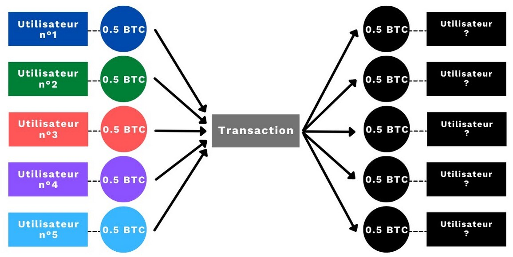
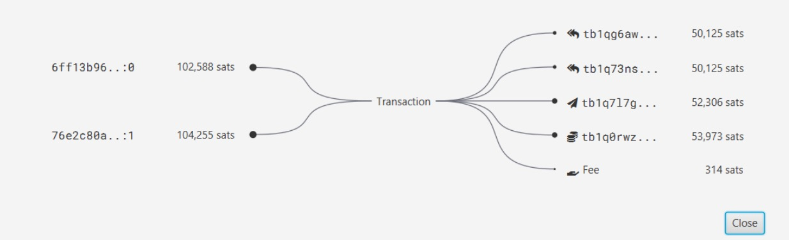
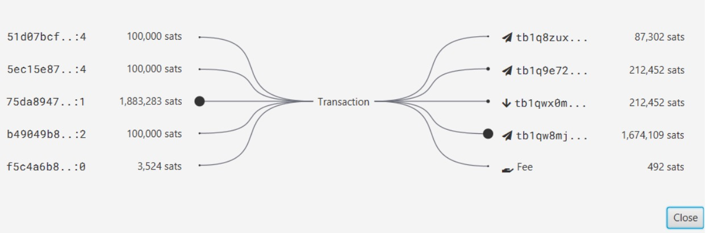

# ¡Si no tienes amigos, usa JoinBot!

JoinBot es una nueva herramienta que se agrega a la suite Samourai Wallet con la última actualización 0.99.98f del famoso software de billetera Bitcoin. Te permite realizar fácilmente una transacción colaborativa para optimizar tu privacidad, sin tener que encontrar un compañero.

**¡Gracias al excelente Fanis Michalakis por la idea de usar DALL-E para la miniatura!**

## ¿Qué es una transacción colaborativa en Bitcoin?

Bitcoin se basa en un registro de cuentas distribuido y transparente. Cualquiera puede rastrear las transacciones de los usuarios de este sistema de efectivo electrónico. Para asegurar cierta privacidad, el usuario de Bitcoin puede realizar transacciones con una estructura específica para agregar una negación plausible en la interpretación de las mismas.

La idea no es ocultar directamente la información, sino confundirla entre otras. Este objetivo se utiliza especialmente en Coinjoins, transacciones que permiten romper el historial de una moneda en Bitcoin y dificultar su rastreo. Para lograr este resultado, se deben crear varias entradas y salidas del mismo monto en la transacción.

Las entradas son las entradas de una transacción de Bitcoin, y las salidas representan las salidas. La transacción consume sus entradas para crear nuevas salidas al cambiar las condiciones de gasto en una moneda. Este mecanismo permite mover bitcoins entre usuarios.
Hablo de esto en detalle en este artículo: Mecanismo de una transacción de Bitcoin: UTXO, entradas y salidas.

Una forma de confundir las pistas en una transacción de Bitcoin es realizar una transacción colaborativa. Como su nombre indica, implica un acuerdo entre varios usuarios que cada uno depositará una cantidad de bitcoins como entrada en una misma transacción y recibirá una cantidad como salida.

Como se mencionó anteriormente, la estructura de transacción colaborativa más conocida es Coinjoin. Por ejemplo, en el protocolo Coinjoin Whirlpool, las transacciones involucran a 5 participantes como entrada y salida, cada uno con la misma cantidad de bitcoins.

Un observador externo de esta transacción no podrá saber a qué usuario pertenece cada salida como entrada. Si tomamos el ejemplo del usuario n°4 (violeta), podemos reconocer su UTXO como entrada, pero no sabremos cuál de las 5 salidas es realmente suya. La información inicial no está oculta, sino confundida en un grupo.
El usuario tiene la capacidad de negar la posesión de cierto UTXO en la salida. Este fenómeno se llama "plausible deniability" y permite obtener privacidad en una transacción de Bitcoin que, sin embargo, es transparente.

Para obtener más información sobre Coinjoin, te explico TODO en este largo artículo: Comprender y utilizar CoinJoin en Bitcoin.

Aunque es muy eficaz para romper el rastreo de un UTXO, Coinjoin no es adecuado para gastos directos. De hecho, su estructura implica tener que utilizar inputs de un monto predefinido y outputs del mismo valor (modulo las tarifas de minería). Sin embargo, la transacción de gasto en Bitcoin es un momento crítico para la privacidad, ya que a menudo vincula físicamente al usuario con su actividad en la cadena. Por lo tanto, parece esencial utilizar herramientas de privacidad en el gasto. Existen otras estructuras de transacciones colaborativas diseñadas específicamente para transacciones de pago efectivo.

## La transacción StonewallX2

Entre la miríada de herramientas de gasto ofrecidas en Samourai Wallet, existe la transacción colaborativa StonewallX2. Es un mini Coinjoin entre dos usuarios diseñado para el pago. Desde el exterior, esta transacción puede dar lugar a varias interpretaciones posibles. Por lo tanto, se encuentra la plausible deniability y, en consecuencia, la privacidad para el usuario.

Este montaje de transacción colaborativa StonewallX2 está disponible en Samourai Wallet y en Sparrow Wallet. Esta herramienta es interoperable entre los dos programas.

Su mecanismo es bastante simple de entender. Aquí está su funcionamiento práctico:

> - Un usuario desea realizar un pago en bitcoins (por ejemplo, en un comercio).
> - Obtiene la dirección de recepción del destinatario real del pago (el comerciante).
> - Construye una transacción específica con varios inputs: al menos uno que le pertenece y otro que pertenece a un colaborador externo.
> - La transacción tendrá 4 outputs, incluyendo 2 del mismo monto: uno hacia la dirección del comerciante para pagarle, uno de cambio que vuelve al usuario, un output del mismo valor que el pago que va hacia el colaborador y otro output que también vuelve al colaborador.

Por ejemplo, aquí hay una transacción StonewallX2 clásica en la que realicé un pago de 50,125 sats. El primer input de 102,588 sats proviene de mi billetera Samourai. El segundo input de 104,255 sats proviene de la billetera de mi colaborador:

Se pueden observar 4 outputs, incluyendo 2 del mismo monto para confundir las pistas:

> - 50,125 sats que van al destinatario real de mi pago.
> - 52,306 sats que representan mi cambio y que, por lo tanto, vuelven a una dirección de mi billetera.
> - 50,125 sats que vuelven a mi colaborador.
> - 53 973 sats que vuelven a mi colaborador.
>   Al final de la operación, el colaborador recupera todo su saldo inicial (excepto los gastos de minería), y el usuario habrá pagado al comerciante. Esto permite agregar una gran cantidad de entropía a la transacción y romper los vínculos inequívocos entre el remitente y el destinatario del pago.

La fortaleza de la transacción de tipo StonewallX2 es que contrarresta completamente una de las reglas empíricas utilizadas por los analistas de cadena: la propiedad común de las entradas en una transacción de múltiples entradas. En otras palabras, en la mayoría de los casos, si observamos una transacción de Bitcoin que tiene varias entradas, podemos asumir que todas estas entradas pertenecen a la misma persona. Satoshi Nakamoto ya había identificado este problema para la privacidad del usuario en su Libro Blanco:

> "Como cortafuegos adicional, se podrían utilizar nuevas parejas de claves para cada transacción con el fin de mantenerlas sin conexión a un propietario común. Sin embargo, la conexión es inevitable con las transacciones de múltiples entradas, que necesariamente revelan que sus entradas eran propiedad de un mismo propietario".

Esta es una de las muchas reglas empíricas utilizadas en el análisis en cadena para construir grupos de direcciones. Para obtener más información sobre estas heurísticas, le recomiendo que lea esta serie de 4 artículos de Samourai que introduce muy bien el tema.

La fortaleza de la transacción StonewallX2 radica en el hecho de que un observador externo pensará que las diferentes entradas de la transacción pertenecen a un propietario común. En realidad, son dos usuarios diferentes los que colaboran. El análisis del pago se dirige hacia una falsa pista y se preserva la privacidad de los usuarios.

Desde el exterior, una transacción StonewallX2 no se puede diferenciar de una transacción Stonewall. La diferencia efectiva entre ellas radica simplemente en el hecho de que Stonewall no es colaborativo. Solo utiliza las UTXO de un mismo usuario. Pero, en sus estructuras en el registro de cuentas, Stonewall y StonewallX2 son perfectamente idénticos. Esto permite agregar aún más interpretaciones posibles a esta estructura de transacción, ya que un observador externo no podrá saber si las entradas provienen de la misma persona o de dos colaboradores.

Luego, la ventaja de StonewallX2 en comparación con un PayJoin de tipo Stowaway es que se puede utilizar en todas las situaciones. El receptor efectivo del pago no deposita ninguna entrada en la transacción. Por lo tanto, se puede utilizar un StonewallX2 para pagar en cualquier comercio que acepte Bitcoin, incluso si este último no utiliza Samourai o Sparrow.
En revanche, l’inconvénient principal de cette structure de transaction est qu’elle nécessite un collaborateur qui veuille bien utiliser ses bitcoins pour participer à votre paiement. Si vous avez des amis bitcoiners prêts à vous aider en toute circonstance, cela n’est pas un problème. En revanche, si vous ne connaissez pas d’autres utilisateurs de Samourai Wallet, ou bien si personne n’est disponible pour collaborer, alors vous êtes bloqué.

Il existe toutefois un groupe Telegram où vous pouvez trouver d’autres utilisateurs de Samourai qui voudront bien collaborer avec vous. Vous pouvez le retrouver en cliquant ici.

Pour résoudre cette problématique, les équipes de Samourai ont récemment ajouté une nouvelle fonctionnalité à leur application : JoinBot.

# C’est quoi JoinBot ?

Le principe de JoinBot est simple. Si vous ne trouvez personne avec qui collaborer pour une transaction StonewallX2, vous pouvez collaborer avec lui. Concrètement, vous allez en fait réaliser une transaction collaborative directement avec Samourai Wallet.

Ce service est très commode, notamment pour les utilisateurs novices, puisqu’il est disponible 24h/24 et 7j/7. Si vous devez effectuer un paiement urgent et que vous souhaitez faire un StonewallX2, vous n’aurez plus besoin de contacter un ami, ou bien de chercher un collaborateur en ligne. JoinBot se chargera de vous assister.

Un autre avantage de JoinBot est que les UTXO qu’il fournit en input sont issus exclusivement de postmix Whirlpool, ce qui vient améliorer la confidentialité de votre paiement. De plus, puisque JoinBot est tout le temps en ligne, vous devriez collaborer avec des UTXO qui disposent de larges Anonset prospectifs.

Évidemment, JoinBot dispose de certains compromis qu’il convient de signaler :

> Comme pour un StonewallX2 classique, votre collaborateur est forcément au courant des UTXO utilisés et de leur destination. Dans le cas de JoinBot, Samourai connait les détails de cette transaction. Ce n’est pas forcément une mauvaise chose, mais il faut le garder à l’esprit.
> Pour éviter les spams, Samourai prélève 3,5 % de frais de service sur le montant de la transaction effective, avec une limite maximale de 0,01 BTC. Par exemple, si j’envoie un paiement réel de 100 kilosats avec JoinBot, le montant des frais de service sera de 3 500 sats.
> Pour utiliser JoinBot, vous devez obligatoirement disposer d’au moins deux UTXO non liés et disponibles sur votre portefeuille.
> Sur un StonewallX2 classique, les frais de minage sont partagés équitablement entre les deux collaborateurs. Avec JoinBot, vous devrez évidemment payer l’intégralité des frais de minage.
> Para que una transacción JoinBot sea exactamente igual a una transacción StonewallX2 clásica o Stonewall, el pago de las tarifas de servicio se realiza en una transacción totalmente separada. El reembolso de la mitad de las tarifas de minería inicialmente pagadas por Samourai se realizará en esta segunda transacción. Para optimizar su privacidad hasta el final, el pago de las tarifas se realiza utilizando una transacción con la estructura Stowaway (PayJoin).

## ¿Cómo utilizar JoinBot?

Para realizar una transacción JoinBot, debe tener una billetera Samourai Wallet. Puede descargarlo aquí, o desde Google Playstore.

A diferencia de la mayoría de las herramientas desarrolladas por Samourai, hasta el momento, Sparrow Wallet aún no ha anunciado la implementación de JoinBot. Por lo tanto, esta herramienta solo está disponible en Samourai.

Descubra paso a paso cómo realizar una transacción StonewallX2 con JoinBot en este video:

Aquí está el esquema de la transacción que acabamos de realizar en el video:

Podemos ver 5 inputs:

> - 3 inputs de 100 kilosats que provienen de Samourai (JoinBot).
> - 2 inputs que provienen de mi billetera personal, de 3,524 sats y 1.8 megasat.

Los 4 outputs de la transacción son los siguientes:

> - 1 de 212,452 sats hacia el destinatario efectivo de mi pago.
> - Otro de la misma cantidad que vuelve a una dirección de Samourai.
> - 1 cambio que también vuelve a Samourai por 87,302 sats. Esto representa la diferencia entre el total de sus inputs (300,000 sats) y el output de ofuscación (212,452 sats) menos las tarifas de minería.
> - 1 cambio que vuelve a otra dirección de mi billetera. Representa la diferencia entre el total de mis inputs y el pago efectivo, menos las tarifas de minería.

Como recordatorio, las tarifas de minería no representan un output de las transacciones. Simplemente representan la diferencia entre el total de los inputs y el total de los outputs.

## Conclusión

JoinBot es una herramienta adicional que permite agregar más opciones y libertad para el usuario de Samourai. Permite realizar una transacción colaborativa StonewallX2 directamente con Samourai como colaborador. Este tipo de transacción ayuda a mejorar la privacidad de los usuarios.

Si puede realizar un StonewallX2 clásico con un amigo, le recomiendo que prefiera esta forma de uso de la herramienta. Sin embargo, si está bloqueado y no encuentra ningún colaborador para realizar un pago, sabe que JoinBot estará disponible las 24 horas del día, los 7 días de la semana para colaborar con usted.

> Recursos externos:
> '
>
> - https://medium.com/oxt-research/understanding-bitcoin-privacy-with-oxt-part-1-4-8177a40a5923
> - https://youtu.be/vhUREWiY570
> - https://docs.samourai.io/wallet/privacy-enhanced-transactions
> - https://www.pandul.fr/post/comprendre-et-utiliser-le-coinjoin-sur-bitcoin
