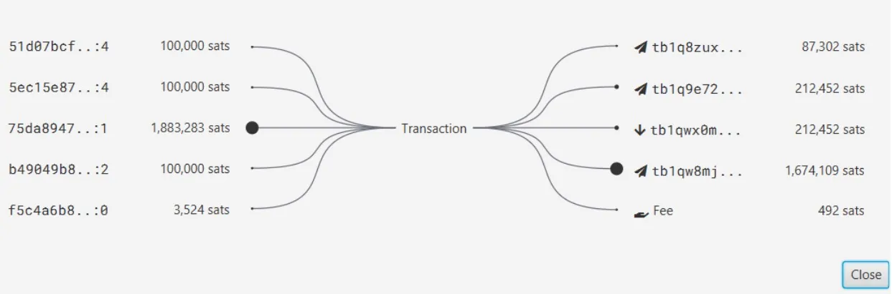

***WARNING:** Following the arrest of the founders of Samourai Wallet and the seizure of their servers on April 24th, **the JoinBot service is no longer available**. As of now, it is no longer possible to use this tool. However, you can still carry out Stonewall X2, but you need to find a collaborator and manually exchange PSBTs. This service may be relaunched in the coming months depending on the progress of the case.*

_We are closely following the developments of this case as well as developments concerning the associated tools. Rest assured that we will update this tutorial as new information becomes available._

_This tutorial is provided for educational and informational purposes only. We do not endorse or encourage the use of these tools for criminal purposes. It is the responsibility of each user to comply with the laws in their jurisdiction._

---

JoinBot is a new tool that is added to the Samourai Wallet suite with the latest update 0.99.98f of the famous Bitcoin wallet software. It allows you to easily make a collaborative transaction to optimize your privacy, without having to find a partner.

*Thanks to the excellent Fanis Michalakis for the idea of using DALL-E for the thumbnail!*

## What is a collaborative transaction on Bitcoin?

Bitcoin is based on a distributed and transparent account ledger. Anyone is able to trace the transactions of users of this electronic cash system. To ensure a certain level of privacy, Bitcoin users can make transactions with a specific structure to add plausible deniability in their interpretation.

The idea is not to directly hide the information, but to confuse it among others. This objective is used in Coinjoins, transactions that break the history of a coin on Bitcoin and make its tracing complex. To achieve this result, multiple inputs and outputs of the same amount must be created in the transaction.

Inputs are the inputs of a Bitcoin transaction, and outputs represent the outputs. The transaction consumes its inputs to create new outputs by changing the spending conditions of a coin. This mechanism allows bitcoins to be moved between users.
I discuss this in detail in this article: Bitcoin Transaction Mechanism: UTXO, Inputs, and Outputs.

One way to blur the tracks in a Bitcoin transaction is to make a collaborative transaction. As the name suggests, it involves an agreement between multiple users, each of whom deposits a sum of bitcoins as input in the same transaction and receives a sum as output.

As mentioned earlier, the most well-known structure of a collaborative transaction is Coinjoin. For example, on the Coinjoin Whirlpool protocol, transactions involve 5 participants as inputs and outputs, each with the same amount of bitcoins.

An external observer of this transaction will be unable to know which output belongs to which user as input. If we take the example of user #4 (purple), we can recognize their input UTXO, but we will not know which of the 5 outputs is actually theirs. The initial information is not hidden, but rather confused within a group.
The user is able to deny the possession of a certain UTXO as output. This phenomenon is called "plausible deniability", and it allows for confidentiality in a transparent Bitcoin transaction.

To learn more about Coinjoin, I explain EVERYTHING in this long article: Understanding and using CoinJoin on Bitcoin.

Although very effective in breaking the tracing of a UTXO, Coinjoin is not suitable for direct spending. Indeed, its structure implies having to use inputs of a predefined amount and outputs of the same value (modulo mining fees). However, the spending transaction on Bitcoin is a critical moment for privacy as it often creates a physical link between the user and their on-chain activity. It therefore seems essential to use privacy tools for spending. There are other collaborative transaction structures specifically designed for actual payment transactions.

## The StonewallX2 transaction

Among the myriad of spending tools offered on Samourai Wallet, there is the collaborative transaction StonewallX2. It is a mini Coinjoin between two users designed for payment. From the outside, this transaction can lead to several possible interpretations. It thus provides plausible deniability and consequently, confidentiality for the user.

This StonewallX2 collaborative transaction setup is available on Samourai Wallet and Sparrow Wallet. This tool is interoperable between the two software.

Its mechanism is quite simple to understand. Here is how it works in practice:

> - A user wants to make a payment in bitcoins (for example, at a merchant).
> - They retrieve the receiving address of the actual payment recipient (the merchant).
> - They construct a specific transaction with multiple inputs: at least one belonging to them and one belonging to an external collaborator.
> - The transaction will have 4 outputs, including 2 of the same amounts: one to the merchant's address for payment, one as change that returns to the user, one output of the same value as the payment that goes to the collaborator, and another output that also returns to the collaborator.

For example, here is a typical StonewallX2 transaction in which I made a payment of 50,125 sats. The first input of 102,588 sats comes from my Samourai wallet. The second input of 104,255 sats comes from my collaborator's wallet:

We can observe 4 outputs, including 2 of the same amount to confuse the tracks:

> - 50,125 sats that go to the actual recipient of my payment.
> - 52,306 sats that represent my change and therefore return to an address in my wallet.
> - 50,125 sats that return to my collaborator.
> - 53,973 sats returning to my collaborator.
>   At the end of the operation, the collaborator will have their initial balance restored (minus mining fees), and the user will have paid the merchant. This adds a significant amount of entropy to the transaction and breaks the undeniable links between the sender and recipient of the payment.

The strength of the StonewallX2 transaction is that it completely counters one of the empirical rules used by chain analysts: the common ownership of inputs in a multi-input transaction. In other words, in most cases, if we observe a Bitcoin transaction with multiple inputs, we can assume that all of these inputs belong to the same person. Satoshi Nakamoto had already identified this problem for user privacy in his White Paper:

> "As an additional firewall, a new key pair could be used for each transaction to keep them from being linked to a common owner. However, the linkage is unavoidable with multi-input transactions, which necessarily reveal that their inputs were owned by the same owner."

This is one of the many empirical rules used in on-chain analysis to construct address clusters. To learn more about these heuristics, I recommend reading this series of four articles by Samourai, which introduces the topic wonderfully.

The strength of the StonewallX2 transaction lies in the fact that an external observer will think that the different inputs of the transaction belong to a common owner. In reality, they are two different users collaborating. The analysis of the payment is thus led to a decoy, and user privacy is preserved.

From the outside, a StonewallX2 transaction cannot be differentiated from a Stonewall transaction. The only effective difference between them is that Stonewall is not collaborative. It only uses the UTXOs of a single user. However, in their structures on the account ledger, Stonewall and StonewallX2 are perfectly identical. This allows for even more possible interpretations of this transaction structure since an external observer will not be able to tell if the inputs come from the same person or from two collaborators.

Furthermore, the advantage of StonewallX2 over a Stowaway-type PayJoin is that it can be used in any situation. The actual recipient of the payment does not contribute any inputs to the transaction. Thus, a StonewallX2 can be used to pay at any merchant accepting Bitcoin, even if the merchant does not use Samourai or Sparrow.
On the other hand, the main disadvantage of this transaction structure is that it requires a collaborator who is willing to use their bitcoins to participate in your payment. If you have bitcoin friends willing to help you in any situation, this is not a problem. However, if you don't know any other Samourai Wallet users, or if no one is available to collaborate, then you are stuck.

To solve this problem, the Samourai team recently added a new feature to their application: JoinBot.

# What is JoinBot?

The principle of JoinBot is simple. If you can't find anyone to collaborate with for a StonewallX2 transaction, you can collaborate with JoinBot. In practice, you will actually be conducting a collaborative transaction directly with Samourai Wallet.

This service is very convenient, especially for novice users, as it is available 24/7. If you need to make an urgent payment and want to do a StonewallX2, you no longer need to contact a friend or search for an online collaborator. JoinBot will assist you.

Another advantage of JoinBot is that the UTXOs it provides as input are exclusively from postmix Whirlpool, which improves the privacy of your payment. Additionally, since JoinBot is always online, you should collaborate with UTXOs that have large prospective Anonsets.

Obviously, JoinBot has some compromises that should be noted:

> Like with a classic StonewallX2, your collaborator is necessarily aware of the UTXOs used and their destination. In the case of JoinBot, Samourai knows the details of this transaction. This is not necessarily a bad thing, but it should be kept in mind.
> To avoid spam, Samourai charges a 3.5% service fee on the amount of the actual transaction, with a maximum limit of 0.01 BTC. For example, if I send a real payment of 100 kilosats with JoinBot, the service fee amount will be 3,500 sats.
> To use JoinBot, you must have at least two unrelated and available UTXOs in your wallet.
> In a classic StonewallX2, mining fees are shared equally between the two collaborators. With JoinBot, you will obviously have to pay the full mining fees.
> In order for a JoinBot transaction to be exactly the same as a classic StonewallX2 or Stonewall transaction, the payment of service fees is made on a completely separate transaction. The refund of half of the mining fees initially paid by Samourai will be made during this second transaction. In order to optimize your privacy to the end, the fee settlement is done using a Stowaway (PayJoin) structured transaction.

## How to use JoinBot?

To perform a JoinBot transaction, you must have a Samourai Wallet. You can download it here, or from the Google Playstore.

Unlike the majority of tools developed by Samourai, Sparrow Wallet has not yet announced the implementation of JoinBot. This tool is therefore only available on Samourai.

Discover step by step how to perform a StonewallX2 transaction with JoinBot in this video:

Here is the transaction diagram that we just performed in the video:

We can see 5 inputs:

> - 3 inputs of 100 kilosats coming from Samourai (JoinBot).
> - 2 inputs coming from my personal wallet, of 3,524 sats and 1.8 megasat.

The 4 outputs of the transaction are as follows:

> - 1 of 212,452 sats to the actual recipient of my payment.
> - Another one of the same amount that goes back to a Samourai address.
> - 1 change that also goes back to Samourai for 87,302 sats. This represents the difference between the total of their inputs (300,000 sats) and the obfuscation output (212,452 sats) minus the mining fees.
> - 1 change that goes back to another address in my wallet. It represents the difference between the total of my inputs and the actual payment, minus the mining fees.

As a reminder, mining fees do not represent transaction outputs. They simply represent the difference between the total inputs and the total outputs.

## Conclusion

JoinBot is an additional tool that adds more choices and freedom for Samourai users. It allows for a collaborative StonewallX2 transaction directly with Samourai as a collaborator. This type of transaction helps improve user privacy.

If you can perform a classic StonewallX2 with a friend, I still recommend using this tool. However, if you are stuck and cannot find any collaborators to make a payment, you know that JoinBot will be available 24/7 to collaborate with you.

**External resources:**
- https://medium.com/oxt-research/understanding-bitcoin-privacy-with-oxt-part-1-4-8177a40a5923
- https://www.pandul.fr/post/comprendre-et-utiliser-le-coinjoin-sur-bitcoin
