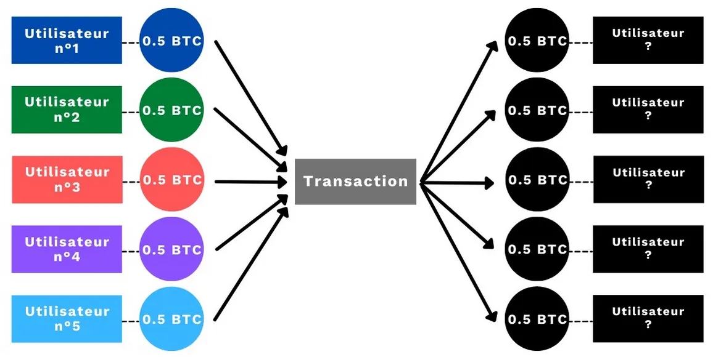
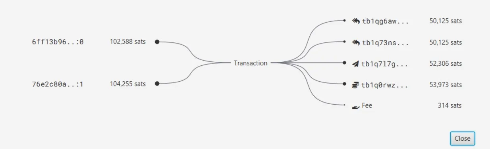
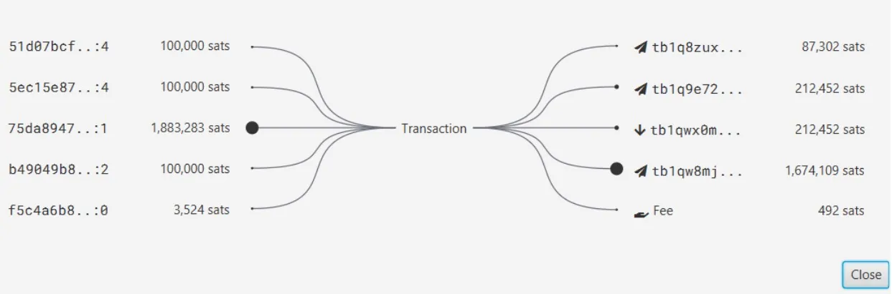

***ATTENZIONE:** In seguito all'arresto dei fondatori di Samourai Wallet e al sequestro dei loro server il 24 aprile 2024, il servizio JoinBot non è più disponibile. Attualmente, non è più possibile utilizzare questo strumento. Tuttavia, è ancora possibile eseguire Stonewall X2, a condizione di trovare un collaboratore e scambiare manualmente i PSBT. Il servizio potrebbe essere riattivato prossimamente, a seconda dell'evoluzione del caso.*

_Stiamo monitorando attentamente la situazione e gli sviluppi legati agli strumenti associati. Questo tutorial verrà aggiornato non appena saranno disponibili nuove informazioni._

_Questo tutorial è fornito esclusivamente a scopo educativo e informativo. Non approviamo né incoraggiamo l'utilizzo di questi strumenti per finalità illecite. È responsabilità di ciascun utente rispettare le leggi vigenti nella propria giurisdizione._

---

JoinBot è uno strumento introdotto nella suite Samourai Wallet con la versione 0.99.98f del celebre portafoglio Bitcoin. Permette di avviare con facilità una transazione collaborativa, ottimizzando la propria privacy senza la necessità di trovare manualmente un partner. Questo semplifica l'utilizzo di tecniche avanzate di offuscamento come StonewallX2, rendendole accessibili anche agli utenti meno esperti.

*Un ringraziamento al magnifico Fanis Michalakis per l'idea di utilizzare DALL-E per la miniatura!*

## Cos'è una transazione collaborativa su Bitcoin?

Bitcoin si basa su un registro distribuito e trasparente. Chiunque può tracciare le transazioni degli utenti all'interno di questo sistema di denaro elettronico. Per preservare un certo livello di privacy, un utente Bitcoin può costruire una transazione in modo da introdurre negabilità plausibile nelle possibili interpretazioni.

L'obiettivo non è nascondere direttamente le informazioni, ma piuttosto confonderle tra molteplici possibilità. Questa strategia viene adottata soprattutto nelle transazioni Coinjoin, che permettono di interrompere la tracciabilità della cronologia di un UTXO e rendere più difficile l’analisi dei flussi. Per raggiungere questo scopo, la transazione viene costruita con più input e output dello stesso importo.

Ogni transazione Bitcoin consuma i suoi input per generare nuovi output, modificando così le condizioni di spesa delle monete. Questo è il meccanismo fondamentale con cui i bitcoin vengono trasferiti tra utenti.
(Ne parlo più nel dettaglio in questo articolo: Meccanismo di una transazione Bitcoin: UTXO, input e output.)

Una delle modalità per offuscare le tracce all'interno di una transazione è ricorrere a una transazione collaborativa. Come suggerisce il nome, si tratta di un accordo tra più utenti, ciascuno dei quali contribuisce con un input e riceve un output nella stessa transazione.

Come accennato, la forma più conosciuta di transazione collaborativa è il Coinjoin. Ad esempio, nel protocollo Whirlpool, ogni transazione coinvolge 5 partecipanti, ognuno con input e output di pari importo.

Un osservatore esterno non sarà in grado di stabilire con certezza quale output sia associato a ogni utente che ha fornito un input nella transazione. Ad esempio, considerando l’utente n.°4 (colore viola), possiamo identificare il suo UTXO in input, ma non possiamo sapere quale dei 5 output sia effettivamente il suo. L’informazione non viene nascosta, bensì confusa all’interno di un insieme.
L’utente può quindi negare di possedere un determinato UTXO in output: questo fenomeno è noto come negabilità plausibile (plausible deniability) e rappresenta un efficace meccanismo di privacy in un sistema altrimenti totalmente trasparente come Bitcoin.

Per saperne di più sul funzionamento di Coinjoin, ti spiego tutto in questo articolo: Comprendere e utilizzare CoinJoin su Bitcoin.

## La transazione StonewallX2

Tra i numerosi strumenti di spesa offerti da Samourai Wallet, c’è la transazione collaborativa StonewallX2. Si tratta di un mini Coinjoin tra due utenti, pensato appositamente per i pagamenti. Dal punto di vista di un osservatore esterno, questa transazione può dare origine a diverse interpretazioni possibili. Ne deriva una negabilità plausibile e, di conseguenza, una maggiore privacy per l’utente.

Questa configurazione collaborativa è disponibile sia su Samourai Wallet sia su Sparrow Wallet, garantendo interoperabilità tra i due software.

Il meccanismo è piuttosto semplice da comprendere. Ecco come funziona in pratica:

> - Un utente desidera effettuare un pagamento in bitcoin (ad esempio, presso un commerciante).
> - Ottiene l’indirizzo di ricezione del destinatario effettivo (il commerciante).
> - Costruisce una transazione con più input: almeno uno di sua proprietà e uno appartenente a un collaboratore esterno.
> - La transazione avrà 4 output, di cui 2 dello stesso importo: uno all’indirizzo del commerciante per il pagamento, uno di resto che torna all’utente, un output dello stesso valore del pagamento che va al collaboratore, e un altro output di resto per il collaboratore.

Ad esempio, ecco una tipica transazione StonewallX2 in cui ho effettuato un pagamento di 50.125 sats. Il primo input, pari a 102.588 sats, proviene dal mio portafoglio Samourai. Il secondo input, di 104.255 sats, proviene dal portafoglio del mio collaboratore:

Possiamo osservare 4 output di cui 2 dello stesso importo per confondere le tracce:

> - 50.125 sats che vanno al destinatario effettivo del mio pagamento.
> - 52.306 sats che rappresentano il mio resto e quindi tornano a un indirizzo del mio portafoglio.
> - 50.125 sats che tornano al mio collaboratore.
> - 53 973 sats che tornano ancora al mio collaboratore.

Alla fine dell’operazione, il collaboratore recupera l’intero saldo iniziale (al netto delle commissioni di mining), mentre l’utente avrà effettuato il pagamento al commerciante. Questo tipo di transazione introduce un’elevata entropia, rompendo i collegamenti diretti e inequivocabili tra il mittente e il destinatario, e migliorando così significativamente la privacy.
   
La forza della transazione di tipo StonewallX2 risiede nel fatto che contrasta direttamente una delle principali regole empiriche utilizzate dagli analisti della blockchain: l’assunzione di proprietà comune degli input in una transazione con più input. In altre parole, in una tipica transazione Bitcoin con input multipli, si presume che tutti gli input appartengano a un unico utente.
Questo rappresenta un rischio per la privacy, già individuato da Satoshi Nakamoto nel suo white paper originale:

> "Come ulteriore misura di sicurezza, una nuova coppia di chiavi potrebbe essere utilizzata per ogni transazione al fine di mantenerle non collegate a un proprietario comune. Tuttavia, il collegamento è inevitabile con le transazioni multi-input, che rivelano necessariamente che i loro input erano detenuti da un unico proprietario."

Questa è solo una delle numerose regole empiriche utilizzate nell’analisi on-chain per costruire cluster di indirizzi. Se vuoi approfondire queste euristiche, ti consiglio questa serie di quattro articoli pubblicata da Samourai Wallet: un'introduzione completa e accessibile all’argomento.

La forza della transazione StonewallX2 consiste proprio nel frustrare l’euristica della proprietà comune degli input. Un osservatore esterno, infatti, tenderà a presumere che tutti gli input in una transazione appartengano allo stesso utente. Ma nel caso di una StonewallX2, si tratta invece di due persone distinte che collaborano volontariamente alla costruzione della transazione. Questo inganna l’analisi comportamentale e reindirizza le deduzioni verso una falsa pista, rafforzando la privacy degli utenti.

On-chain una transazione StonewallX2 è indistinguibile da una Stonewall “standard”. La differenza è che quest’ultima non è collaborativa: utilizza solamente UTXO appartenenti a un singolo utente, ma essendo nella struttura identiche, aumenta ulteriormente l’ambiguità. Nessuno potrà dire con certezza se si tratti di una transazione singola o collaborativa, né dedurre se gli input appartengano a una sola persona o a due.

Un altro vantaggio di StonewallX2, rispetto ad altre tecniche come Stowaway (PayJoin), è la sua universalità. In questo caso, il destinatario del pagamento non deve partecipare alla transazione, inserendo input propri. Di conseguenza, puoi usare StonewallX2 per pagare chiunque accetti bitcoin, anche se non utilizza Samourai Wallet o Sparrow.

Lo svantaggio principale, però, è che è necessaria la disponibilità di un collaboratore, disposto a utilizzare i propri bitcoin per aiutarti a costruire la transazione. Se hai amici bitcoiner fidati con cui coordinarti, non è un problema. Ma in assenza di contatti disponibili, diventa impossibile utilizzare questa modalità.

Per risolvere questo limite, Samourai ha introdotto una nuova funzione nell'applicazione: JoinBot.

# Che cos'è JoinBot?

Il principio alla base di JoinBot è semplice: se non riesci a trovare un collaboratore per una transazione StonewallX2, puoi collaborare direttamente con Samourai Wallet.

Questo servizio è particolarmente comodo, soprattutto per chi è alle prime armi, poiché è disponibile 24 ore su 24, 7 giorni su 7. Se hai bisogno di effettuare un pagamento urgente con la struttura di una StonewallX2, non dovrai più contattare un amico o cercare un collaboratore online: sarà JoinBot a supportarti.

Un ulteriore vantaggio è che gli UTXO forniti da JoinBot provengono esclusivamente dai postmix di Whirlpool, il che aumenta la riservatezza del pagamento. Inoltre, dato che JoinBot è sempre attivo, è consigliabile utilizzarlo con UTXO caratterizzati da un elevato Anonset, così da rafforzare ulteriormente il livello di privacy.

Ovviamente, JoinBot presenta alcuni compromessi che vale la pena sottolineare:

> - Come in un classico StonewallX2, il vostro collaboratore è necessariamente a conoscenza degli UTXO utilizzati e della loro destinazione. Nel caso di JoinBot, Samourai conosce i dettagli della transazione. Questo non è necessariamente un male, ma è un aspetto da tenere presente.
> - Per evitare lo spam, Samourai applica una commissione di servizio del 3,5% sull'importo effettivo della transazione, con un limite massimo di 0,01 BTC. Ad esempio, se invio un pagamento effettivo di 100 kilosats utilizzando JoinBot, il costo del servizio sarà di 3.500 sats.
> - Per utilizzare JoinBot, è necessario avere almeno due UTXO non collegati (non devono condividere uno stesso TxID) disponibili sul proprio portafoglio.
> - In un classico StonewallX2, i costi di mining vengono suddivisi equamente tra i due collaboratori. Con JoinBot, dovrete ovviamente pagare l'intera tariffa di mining.
> - Affinché una transazione JoinBot sia esattamente uguale a una StonewallX2 o Stonewall, il pagamento delle commissioni di servizio avviene su una transazione completamente separata. Il rimborso della metà delle commissioni di mining inizialmente pagate da Samourai avverrà durante questa seconda transazione. Per ottimizzare la tua privacy fino alla fine, il pagamento delle commissioni avviene tramite una transazione con struttura Stowaway (PayJoin).

## Come utilizzare JoinBot?

Per effettuare una transazione con JoinBot, è necessario utilizzare il portafoglio Samourai Wallet. Puoi scaricarlo direttamente dal sito ufficiale oppure tramite Google Play Store.

A differenza di molti altri strumenti sviluppati dal team di Samourai, JoinBot non è ancora disponibile su Sparrow Wallet. Al momento, questo strumento è utilizzabile esclusivamente tramite Samourai.

Scopri passo dopo passo come effettuare una transazione StonewallX2 con JoinBot in questo video:

Ecco lo schema della transazione appena effettuata nel video:

Possiamo notare 5 input:

> - 3 input di 100 kilosat provenienti da Samourai (JoinBot).
> - 2 input provenienti dal mio portafoglio personale, di 3.524 sat e 1,8 megasat.

I 4 output della transazione sono:

> - 1 di 212.452 sat verso il destinatario effettivo del mio pagamento.
> - 1 altro dello stesso importo che ritorna a un indirizzo di Samourai.
> - 1 resto che ritorna ancora a Samourai per 87.302 sat. Questo rappresenta la differenza tra il totale dei loro input (300.000 sat) e l'output di offuscamento (212.452 sat) meno le commissioni di mining.
> - 1 resto che ritorna a un altro indirizzo del mio portafoglio. Rappresenta la differenza tra il totale dei miei input e il pagamento effettivo, meno le commissioni di mining.

Promemoria: le commissioni di mining non sono un output esplicito della transazione. Rappresentano semplicemente la differenza tra la somma totale degli input e quella degli output.

## Conclusioni

JoinBot è uno strumento aggiuntivo che offre agli utenti di Samourai maggiore scelta e libertà. Permette di effettuare una transazione collaborativa StonewallX2 direttamente con Samourai come collaboratore, migliorando così la privacy delle transazioni.

Se hai la possibilità di fare una transazione StonewallX2 classica con un amico, ti consiglio comunque di preferire questa modalità. Tuttavia, se sei in difficoltà e non trovi un collaboratore per effettuare un pagamento, puoi contare su JoinBot, disponibile 24 ore su 24, 7 giorni su 7, pronto a collaborare con te.

**Risorse esterne:**
- https://medium.com/oxt-research/understanding-bitcoin-privacy-with-oxt-part-1-4-8177a40a5923
- https://www.pandul.fr/post/comprendre-et-utiliser-le-coinjoin-sur-bitcoin
