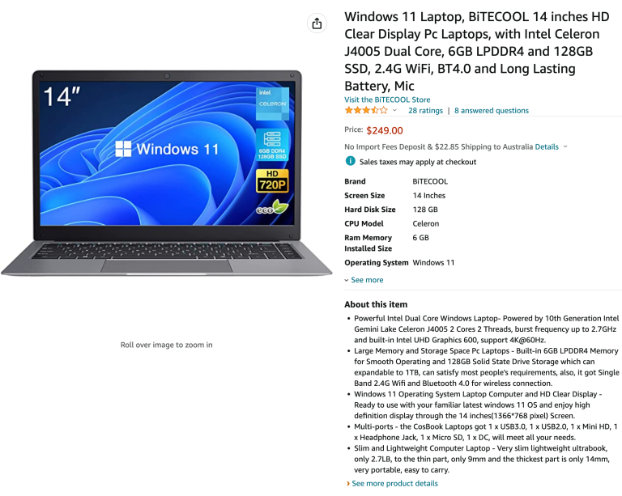
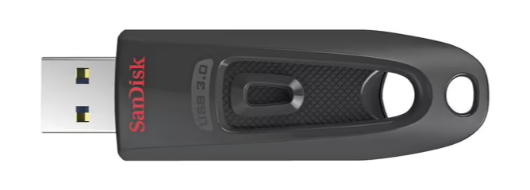
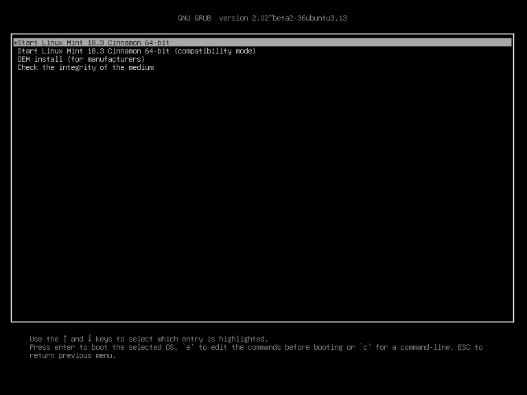

## ¿Qué sucede si usas una computadora regular?

Cuando realizas transacciones de Bitcoin, es ideal que tu computadora no tenga malware. Obviamente.

Si mantienes tu frase de recuperación de Bitcoin (generalmente de 12 o 24 palabras) fuera de la computadora con un dispositivo de firma (por ejemplo, una billetera de hardware, su principal propósito), entonces podrías pensar que no es tan importante tener una computadora "limpia", pero eso no es cierto.

Una computadora infectada con malware puede leer tus direcciones de Bitcoin, exponiendo tu saldo a un atacante: no pueden tomar bitcoins solo conociendo la dirección, pero pueden ver cuánto tienes y calcular a partir de eso si eres un objetivo valioso. También pueden descubrir de alguna manera dónde vives, por ejemplo, y extraerte uñas o niños para obligarte a pagar un rescate.

## ¿Cuál es la solución?

Recomiendo a la mayoría de los usuarios de Bitcoin que utilicen una computadora dedicada libre de malware (con acceso a Internet) para realizar transacciones de Bitcoin. Sugiero que las personas utilicen un sistema operativo de código abierto como Linux Mint, pero si es necesario, pueden usar Windows o Mac, eso es mejor que usar una computadora regular y muy utilizada que inevitablemente tiene malware oculto en ella.

Un obstáculo con el que se encuentran las personas es la instalación de un nuevo sistema operativo en dichas computadoras. Esta guía está diseñada para ayudar con eso.

Existen muchas variedades de Linux y he probado varias. Mi recomendación para los usuarios de Bitcoin es Linux Mint, porque es fácil de instalar, muy rápido (especialmente al iniciar y apagar), no está sobrecargado (cada software adicional es un riesgo) y rara vez se ha bloqueado o se ha comportado de manera extraña (en comparación con otras versiones como Ubuntu y Debian).

Algunos pueden ser muy reacios a un nuevo sistema operativo y prefieren Windows o Mac OS. Lo entiendo, pero los sistemas operativos de Windows y Apple son de código cerrado, por lo que tenemos que confiar en lo que están haciendo; no creo que esa sea una buena política, pero no es todo o nada. Preferiría que las personas utilicen una computadora recién instalada con Windows o Mac OS en lugar de una computadora muy utilizada (con quién sabe qué malware se ha acumulado en ella). Un paso mejor es utilizar una computadora Linux recién instalada, que es lo que voy a demostrar.

Si estás nervioso por usar Linux debido a lo desconocido, eso es natural, pero también lo es dedicar algo de tiempo para aprender. Hay tanta información disponible en línea. Aquí tienes un excelente video corto que introduce los conceptos básicos de la línea de comandos y que recomiendo encarecidamente.
Elige una computadora

Comenzaré con lo que creo que es la mejor opción. Luego daré mi opinión sobre las alternativas.

Opción ideal:

Mi recomendación, si puedes permitírtelo y si el tamaño de tu billetera de Bitcoin lo justifica, es obtener una computadora portátil nueva de nivel básico. El modelo más básico construido en estos días es lo suficientemente bueno para manejar para lo que se va a utilizar. Las especificaciones del procesador y la RAM no son relevantes, porque todas serán lo suficientemente buenas.

Evita:

- Cualquier combinación de tableta, incluido Surface Pro
- Chromebooks: a menudo la capacidad de almacenamiento es demasiado baja
- Cualquier computadora con una unidad eMMC; si tiene una unidad SSD, eso es perfecto
- Mac: son caras y el hardware no se lleva bien con los sistemas operativos Linux en mi experiencia
- Cualquier cosa reacondicionada o de segunda mano (aunque no es un factor decisivo absoluto)
  En su lugar, busca una laptop con Windows 11 (Actualmente, Windows 11 es la última versión. Nos desharemos de ese software, no te preocupes). Busqué en amazon.com "Laptop con Windows 11" y encontré este buen ejemplo:
  

El precio de este es bueno. Las especificaciones son suficientes. Tiene una cámara incorporada que podemos usar para transacciones de códigos QR PSBT (de lo contrario, tendrías que comprar una cámara USB para hacerlo). No te preocupes por el hecho de que no sea una marca reconocida (es barata). Si quieres una marca mejor, te costará, por ejemplo:


Algunos de los más baratos solo tienen 64 GB de espacio en el disco; no he probado laptops con unidades tan pequeñas, probablemente esté bien tener 64 GB, pero podría ser un poco justo.

## Otras opciones - Tails

Tails es un sistema operativo que se inicia desde una memoria USB y toma temporalmente el control del hardware de cualquier computadora. Solo utiliza conexiones Tor, por lo que debes sentirte cómodo usando Tor. Ninguno de los datos que escribas en la memoria durante tu sesión se guarda en el disco (comienza desde cero cada vez) a menos que ajustes la configuración y crees una opción de almacenamiento permanente (en la memoria USB) que bloqueas con una contraseña.

No es una mala opción y es gratuita, pero es un poco engorrosa para nuestro propósito. Instalar nuevo software en ella no es tan sencillo. Una buena característica es que viene con Electrum, pero la desventaja es que no lo instalaste tú mismo. Asegúrate de que la memoria USB que uses tenga al menos 8 GB.

Tu flexibilidad se reduce si usas Tails. Es posible que no puedas seguir varias guías para configurar lo que necesitas y hacer que funcione correctamente. Por ejemplo, si sigues mi guía para instalar Bitcoin Core, se necesitan modificaciones para que funcione. No creo que haga una guía específica para Tails, así que tendrías que desarrollar tus habilidades y hacerlo por tu cuenta.

Tampoco estoy seguro de cómo interactuarán las carteras de hardware con este sistema operativo.

Dicho esto, una computadora con Tails para transacciones de Bitcoin es una buena opción adicional y sin duda te ayudará a mejorar tus habilidades de privacidad en general al aprender a usar Tails.

## Otras opciones - Arranque de sistema operativo en vivo

Esto es muy similar a Tails, excepto que el sistema operativo no está dedicado a la privacidad. La forma básica de usar esto es grabar una memoria USB con el sistema operativo Linux de tu elección y hacer que la computadora arranque desde esa memoria en lugar del disco interno. Cómo hacer esto se explica más adelante.

La ventaja es que tienes menos restricciones y las cosas funcionarán sin ajustes avanzados.

No estoy seguro de qué tan bien este sistema aísla el malware en la computadora existente del disco de arranque USB que utilizas para el nuevo sistema operativo. Probablemente haga un buen trabajo y probablemente no sea tan bueno como Tails. Debido a que no lo sé, mi preferencia es la laptop dedicada.
Otras opciones - Tu propia laptop o computadora de escritorio usada

Usar una computadora usada no es lo ideal, principalmente porque desconozco el funcionamiento interno de malware sofisticado, ni si borrar un disco es suficiente para deshacerse de él. Probablemente lo sea, pero no quiero subestimar la astucia de los hackers malintencionados. Tú puedes decidir, yo no quiero comprometerme.
Si eliges usar una computadora de escritorio antigua en lugar de una computadora portátil antigua, esto estará bien, excepto que ocupará permanentemente espacio para tus transacciones de bitcoin, que probablemente sean raras; no deberías usarla para otra cosa. En cambio, con una computadora portátil, simplemente puedes guardarla e incluso ocultarla para mayor seguridad.

## Instalando Linux Mint en cualquier computadora

Estas son instrucciones para eliminar cualquier sistema operativo de tu nueva computadora portátil e instalar Linux Mint, pero puedes adaptarlas para instalar casi cualquier versión de Linux en casi cualquier computadora.

Vamos a usar cualquier computadora para grabar el sistema operativo en una memoria USB de algún tipo. No importa qué memoria USB uses, siempre y cuando sea compatible con un puerto USB, y sugiero un mínimo de 16 GB.

Consigue una de estas cosas:



O puedes usar algo como esto:


A continuación, ve a linuxmint.com


Pasa el mouse sobre el menú de Descargas en la parte superior y luego haz clic en el enlace "Linux Mint 20.3" o cualquier versión que sea la última recomendada en el momento en que hagas esto.


Habrá algunos "sabores" para elegir. Elige "Cinnamon" para seguir esta guía. Haz clic en el botón Descargar.


En la siguiente página, puedes desplazarte hacia abajo para ver los espejos (los espejos son varios servidores que tienen una copia del archivo que queremos). Puedes verificar la descarga usando SHA256 y gpg (recomendado), pero voy a omitir explicarlo aquí ya que he escrito guías al respecto anteriormente.


Elige un espejo que esté más cerca de ti y haz clic en su enlace (el texto verde en la columna del espejo). El archivo comenzará a descargarse, la versión que estoy descargando tiene 2.1 gigabytes.

Una vez descargado, puedes grabar el archivo en un dispositivo de memoria portátil y hacerlo arrancable. Para hacer esto, la forma más fácil es usar Balena Etcher. Descárgalo e instálalo si no lo tienes.

Luego ejecútalo:


Haz clic en "Flash from file" y selecciona el archivo de LinuxMint que descargaste.

Luego haz clic en "Select target". Asegúrate de que el dispositivo de memoria esté conectado y asegúrate de seleccionar la unidad correcta, ¡de lo contrario podrías destruir el contenido de la unidad equivocada!

Después de eso, ¡selecciona "Flash"! Es posible que necesites ingresar tu contraseña. Cuando se complete, es probable que la unidad no sea legible por tu computadora con Windows o Mac porque se ha transformado en un dispositivo Linux. Simplemente retíralo.
Preparando la computadora de destino

Enciende la nueva computadora portátil y, mientras se está encendiendo, mantén presionada la tecla del BIOS. Esto suele ser F2, pero podría ser F1, F8, F10, F11, F12 o Delete. Prueba cada una hasta que lo encuentres, o busca en internet el modelo de tu computadora y haz la pregunta correcta.

Por ejemplo, "tecla del BIOS para laptops Dell".

Cada computadora tendrá un menú de BIOS diferente. Explora y encuentra qué menú te permite configurar el orden de arranque. Para nuestros propósitos, queremos que la computadora intente arrancar desde un dispositivo USB conectado (si hay uno conectado), antes de intentar arrancar desde el disco duro interno (de lo contrario, se cargará Windows). Una vez que lo configures, es posible que debas guardar antes de salir o que se guarde automáticamente.

Reinicia la computadora y debería cargarse desde el dispositivo de memoria USB. No podemos instalar Linux en el disco interno y Windows se eliminará para siempre.
Cuando llegues a la siguiente pantalla, selecciona "Instalación OEM (para fabricantes)". Si en cambio eliges "Iniciar Linux Mint", se cargará una sesión de Linux Mint en el dispositivo de memoria, pero una vez que apagues la computadora, no se guardará ninguna de tu información, es básicamente una sesión temporal para que puedas probarlo.


Se te guiará a través de un asistente gráfico que te hará varias preguntas que deberían ser sencillas. Una de ellas será la configuración del idioma, otra será la conexión a tu red de internet doméstica y la contraseña. Si se te solicita instalar software adicional, recházalo. Cuando llegues a la pregunta sobre el tipo de instalación, algunas personas pueden dudar: debes elegir "Borrar disco e instalar Linux Mint". Además, no encriptes la unidad y no selecciones LVM.

Finalmente llegarás al escritorio. En este punto, aún no has terminado. En realidad, estás actuando como el fabricante (es decir, alguien que construye una computadora y configura Linux para el cliente). Necesitas hacer doble clic en el icono del escritorio "Instalar Linux Mint" para finalizarlo.


Recuerda quitar la memoria USB y luego reiniciar. Después de reiniciar, estarás utilizando el sistema operativo por primera vez como un nuevo usuario. Felicitaciones.

Una de las primeras cosas que debes hacer (y hacer regularmente) es mantener el sistema actualizado.

Abre la aplicación Terminal y escribe lo siguiente:

```
    sudo apt-get update
```

presiona <enter>, confirma tu elección y luego este comando:

```
    sudo apt-get upgrade
```

presiona <enter> y confirma tu elección.

Déjalo hacer su trabajo, podría llevar varios minutos.

A continuación, me gusta instalar Tor (sensible a mayúsculas):

```
    sudo apt-get install tor
```

> _ADICIÓN: También puedes ejecutar el inicio de Linux Mint desde "Instalación OEM" (Asegúrate de estar conectado a internet, de lo contrario podrías obtener errores). Si haces esto, más tarde necesitarás hacer clic en el icono "enviar al usuario final" que debería estar en el escritorio. Luego reinicias y comienzas el sistema operativo como si estuvieras abriendo la computadora por primera vez._

Esta guía explicó por qué puedes necesitar una computadora dedicada para transacciones de Bitcoin y cómo instalar un sistema operativo Linux Mint nuevo en ella.
