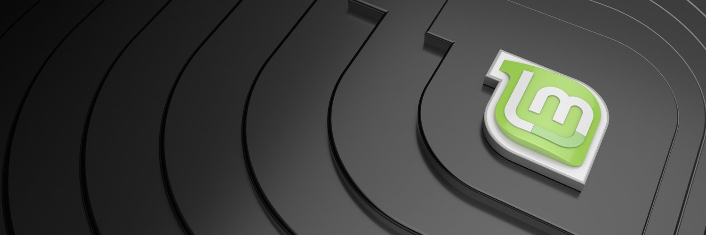

## O que há de errado em usar um computador comum?

Ao fazer transações de bitcoin, é ideal que seu computador não tenha malware. Obviamente.

Se você mantiver sua frase-semente de bitcoin (geralmente composta por 12 ou 24 palavras) fora do computador com um dispositivo de assinatura (por exemplo, uma carteira de hardware - seu principal objetivo), você pode pensar que não é tão importante ter um computador "limpo" - mas isso não é verdade.

Um computador infectado por malware pode ler seus endereços de bitcoin, expondo seu saldo a um atacante - eles não podem pegar bitcoin apenas conhecendo o endereço, mas podem ver quanto você tem e calcular a partir disso se você é um alvo valioso. Eles também podem de alguma forma descobrir onde você mora, por exemplo, e extrair unhas ou crianças de você para exigir um resgate.

## Qual é a solução?

Eu incentivo a maioria dos usuários de bitcoin a usar um computador dedicado, livre de malware (com acesso à internet) para fazer transações de bitcoin. Sugiro que as pessoas usem um sistema operacional de código aberto como o Linux Mint, mas usem o Windows ou o Mac se for necessário - isso é melhor do que usar um computador comum e bem usado que inevitavelmente tem malware oculto nele.

Um obstáculo comum que as pessoas encontram é a instalação de um novo sistema operacional nesses computadores. Este guia é para ajudar com isso.

Existem muitas variedades de Linux e eu já experimentei várias. Minha recomendação para usuários de bitcoin é o Linux Mint, porque é fácil de instalar, muito rápido (especialmente na inicialização e desligamento), não é inchado (cada software extra é um risco) e raramente travou ou se comportou de forma estranha para mim (em comparação com outras versões como o Ubuntu e o Debian).

Alguns podem ser muito resistentes a um novo sistema operacional, preferindo o Windows ou o Mac OS. Eu entendo, mas os sistemas operacionais Windows e Apple são de código fechado, então temos que confiar no que eles estão fazendo; eu não acho que essa seja uma boa política, mas não é tudo ou nada. Eu prefiro muito mais que as pessoas usem um computador recém-instalado com Windows ou Mac OS do que um computador bem usado (com quem sabe que tipo de malware acumulou nele). Um passo melhor é usar um computador Linux recém-instalado, que é o que vou demonstrar.

Se você está nervoso em usar o Linux por causa do desconhecido, isso é natural, mas também é natural dedicar algum tempo para aprender. Tantas informações estão disponíveis online. Aqui está um excelente vídeo curto que introduz o básico da linha de comando e que eu recomendo muito.
Escolha um computador

Vou começar com o que eu acho que é a melhor opção. Em seguida, darei minha opinião sobre alternativas.

Opção ideal:

Minha recomendação, se você puder pagar e se o tamanho do seu saldo de bitcoin justificar, é adquirir um laptop novo de nível básico. O modelo mais básico construído hoje em dia é bom o suficiente para lidar com o que será usado. As especificações do processador e da RAM não são relevantes, porque todas serão boas o suficiente.

Evite:

- Qualquer tablet combo, incluindo o Surface Pro
- Chromebooks - frequentemente a capacidade de armazenamento é muito baixa
- Qualquer computador com uma unidade eMMC; Se tiver uma unidade SSD, é perfeito
- Macs - eles são caros e o hardware não se integra bem com sistemas operacionais Linux na minha experiência
- Qualquer coisa recondicionada ou de segunda mão (embora isso não seja um impeditivo absoluto)
  Em vez disso, procure um laptop com Windows 11 (Atualmente, o Windows 11 é a versão mais recente. Vamos nos livrar desse software, não se preocupe.). Pesquisei no amazon.com por "Laptop com Windows 11" e encontrei esse bom exemplo:
  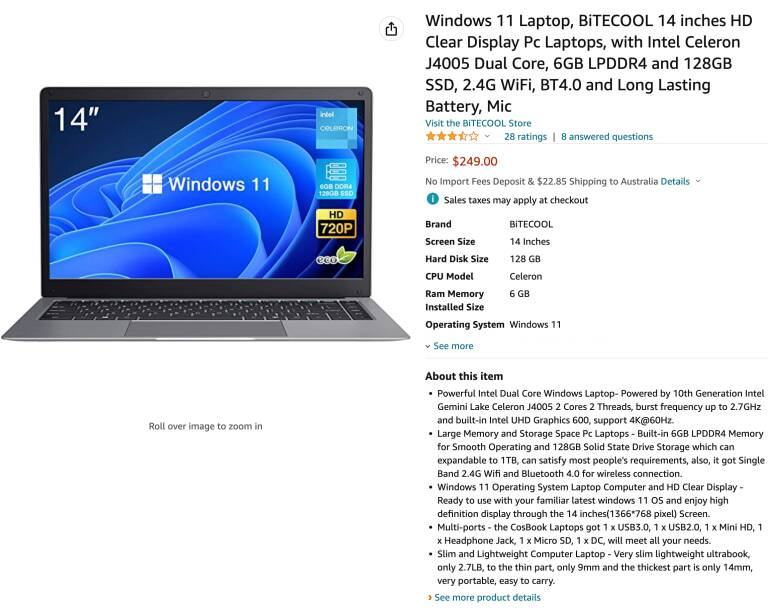

O preço desse acima é bom. As especificações são boas o suficiente. Ele tem uma câmera embutida que podemos usar para transações de QR code PSBT (caso contrário, você teria que comprar uma câmera USB para fazer isso). Não se preocupe com o fato de não ser uma marca reconhecida (é barato). Se você quiser uma marca melhor, vai custar mais, por exemplo:

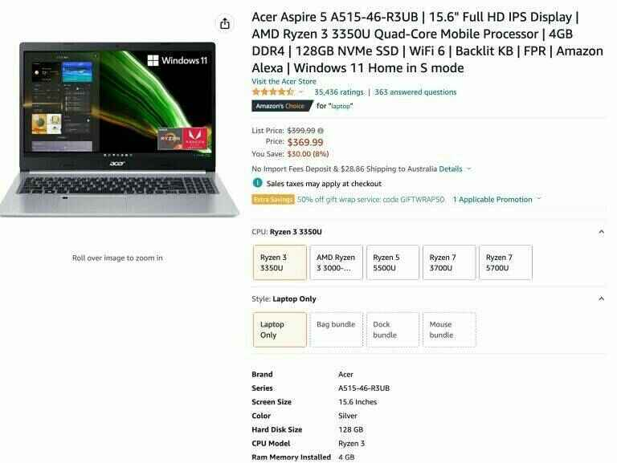

Alguns dos mais baratos têm apenas 64Gb de espaço de armazenamento; eu não testei laptops com unidades tão pequenas - provavelmente está tudo bem ter 64Gb, mas pode ser um pouco apertado.

## Outras opções - Tails

Tails é um sistema operacional que inicializa a partir de um pen drive USB e temporariamente assume o controle do hardware de qualquer computador. Ele usa apenas conexões Tor, então você precisa se sentir confortável usando o Tor. Nenhum dos dados que você escreve na memória durante sua sessão é salvo no disco (ele começa do zero toda vez) a menos que você ajuste as configurações e crie uma opção de armazenamento permanente (no pen drive USB) - que você bloqueia com uma senha.

Não é uma má opção e é gratuita, mas é um pouco complicada para o nosso propósito. Instalar novo software nele não é tão simples. Uma boa característica é que ele vem com o Electrum, mas a desvantagem disso é que você não o instalou por conta própria. Certifique-se de que o pen drive USB que você usa tenha pelo menos 8Gb.

Sua flexibilidade é reduzida se você usar o Tails. Você pode não conseguir seguir vários guias para configurar o que você precisa e fazê-lo funcionar corretamente. Por exemplo, se você seguir meu guia para instalar o Bitcoin Core, serão necessárias modificações para fazê-lo funcionar. Não acho que farei um guia específico para o Tails, então você precisará desenvolver suas habilidades e fazer isso sozinho.

Também não tenho certeza de como as carteiras de hardware interagirão com esse sistema operacional.

Dito tudo isso, um computador com Tails para transações de Bitcoin é uma boa opção adicional e certamente ajudará suas habilidades gerais de privacidade ao aprender a usar o Tails.

## Outras opções - Inicialização de sistema operacional ao vivo

Isso é muito semelhante ao Tails, exceto que o sistema operacional não é dedicado à privacidade. A maneira básica de usar isso é gravar um pen drive USB com o sistema operacional Linux de sua escolha e fazer o computador inicializar a partir dele em vez do disco interno. Como fazer isso é explicado posteriormente.

A vantagem é que você tem menos restrições e as coisas funcionarão sem ajustes avançados.

Não tenho certeza de quão bem esse sistema isola malware no computador existente do pen drive de inicialização USB que você usa para armazenar o novo sistema operacional. Provavelmente faz um bom trabalho e provavelmente não é tão bom quanto o Tails. Como não sei, minha preferência é pelo laptop dedicado.
Outras opções - Seu próprio laptop ou computador desktop usado

Usar um computador usado não é ideal, principalmente porque desconheço o funcionamento interno de malwares sofisticados, nem se apagar um disco é suficiente para se livrar deles. Provavelmente é, mas não quero subestimar a inteligência dos hackers maliciosos. Você pode decidir, não quero me comprometer.
Se você optar por usar um desktop antigo em vez de um laptop antigo, isso será bom, exceto que ele ocupará permanentemente espaço para suas transações de bitcoin provavelmente raras; você não deve usá-lo para mais nada. Enquanto com um laptop, você pode simplesmente guardá-lo e até mesmo escondê-lo para segurança extra.

## Instalando o Linux Mint em qualquer computador

Estas são instruções para apagar qualquer sistema operacional do seu novo laptop e instalar o Linux Mint, mas você pode adaptá-las para instalar praticamente qualquer versão do Linux em praticamente qualquer computador.

Vamos usar qualquer computador para gravar o sistema operacional em um dispositivo de memória. Não importa qual dispositivo de memória, desde que seja compatível com uma porta USB, e eu sugiro no mínimo 16Gb.

Obtenha uma dessas coisas:

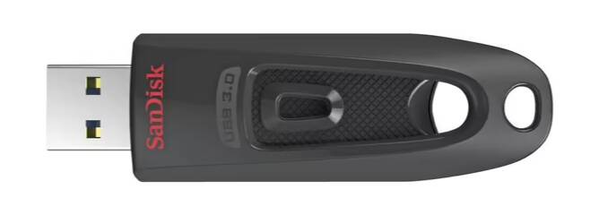

Ou você pode usar algo assim:

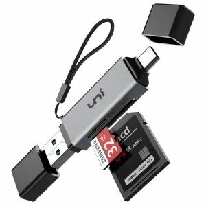

Em seguida, acesse linuxmint.com

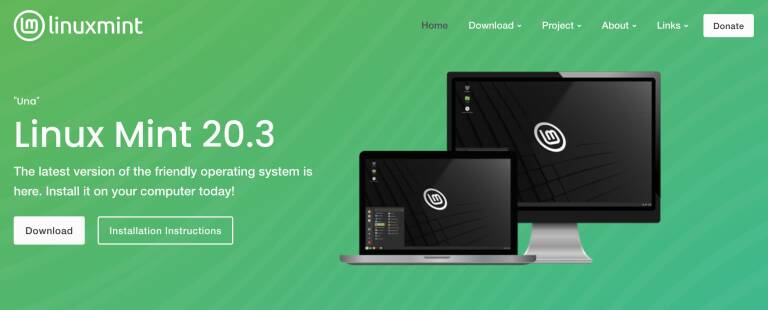

Passe o mouse sobre o menu Download no topo e clique no link "Linux Mint 20.3" ou qualquer versão mais recente recomendada no momento em que você fizer isso.

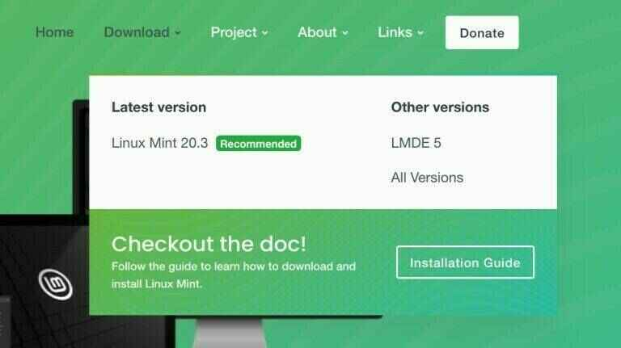

Haverá algumas "versões" para escolher. Vá com "Cinnamon" para seguir este guia. Clique no botão Download.

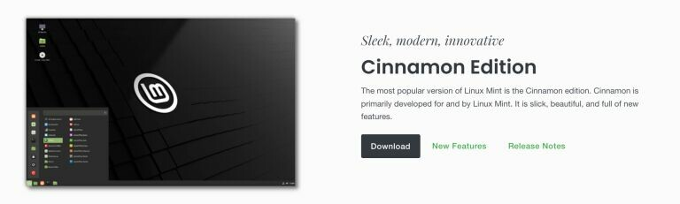

Na próxima página, você pode rolar para baixo para ver os espelhos (espelhos são vários servidores que possuem uma cópia do arquivo que queremos). Você pode verificar o download usando SHA256 e gpg (recomendado), mas vou pular a explicação disso aqui, pois já escrevi guias sobre isso.

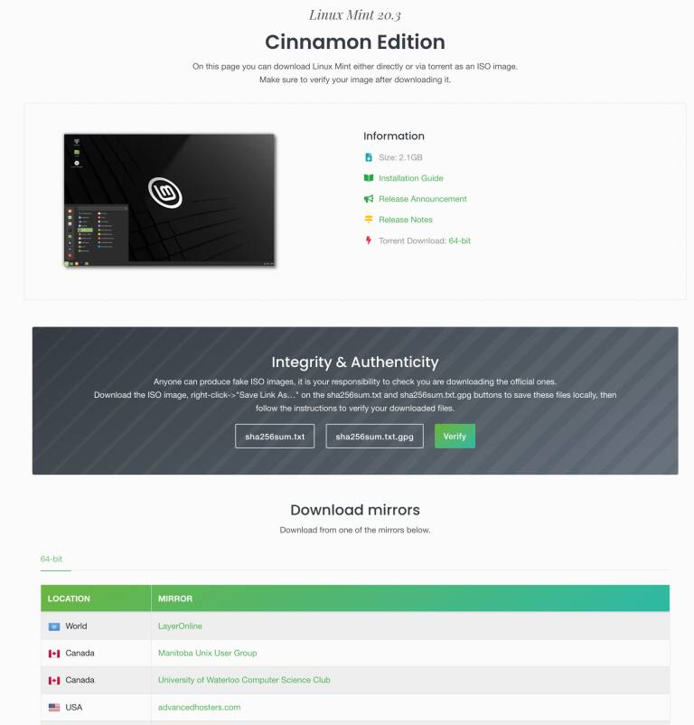

Escolha um espelho que esteja mais próximo de você e clique no link dele (o texto verde na coluna do espelho). O arquivo começará a ser baixado - a versão que estou baixando tem 2,1 gigabytes.

Depois de baixado, você pode gravar o arquivo em um dispositivo de memória portátil e torná-lo inicializável. Para fazer isso, a maneira mais fácil é usar o Balena Etcher. Baixe e instale-o se você não o tiver.

Em seguida, execute-o:

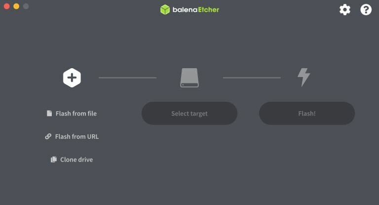

Clique em "flash from file" e selecione o arquivo LinuxMint que você baixou.

Em seguida, clique em "Select target". Certifique-se de que o dispositivo de memória esteja conectado e certifique-se de selecionar a unidade correta, caso contrário, você pode destruir o conteúdo da unidade errada!

Depois disso, selecione "Flash!" Você pode precisar digitar sua senha. Quando estiver concluído, a unidade provavelmente não será legível pelo seu computador Windows ou Mac porque foi transformada em um dispositivo Linux. Basta removê-lo.
Preparando o computador de destino

Ligue o novo laptop e, enquanto ele está ligando, segure a tecla do BIOS. Isso geralmente é F2, mas pode ser F1, F8, F10, F11, F12 ou Delete. Tente cada um até conseguir, ou pesquise na internet pelo modelo do seu computador e faça a pergunta certa.

Por exemplo, "tecla do BIOS para laptops Dell".

Cada computador terá um menu de BIOS diferente. Explore e encontre qual menu permite configurar a ordem de inicialização. Para nossos propósitos, queremos que o computador tente inicializar a partir de um dispositivo USB conectado (se houver um conectado), antes de tentar inicializar a partir do disco rígido interno (caso contrário, o Windows será carregado). Depois de definir isso, você pode precisar salvar antes de sair ou ele pode salvar automaticamente.

Reinicie o computador e ele deve carregar a partir do dispositivo de memória USB. Não podemos instalar o Linux no disco interno e o Windows será removido para sempre.
Quando você chegar à tela a seguir, selecione "Instalação OEM (para fabricantes)". Se você escolher "Iniciar o Linux Mint", você terá uma sessão do Linux Mint carregada do dispositivo de memória, mas assim que desligar o computador, nenhuma das suas informações será salva - é basicamente uma sessão temporária para que você possa experimentá-lo.
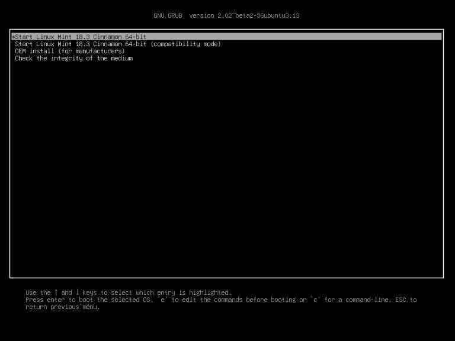

Você será guiado por um assistente gráfico que fará várias perguntas que devem ser simples. Uma delas será as configurações de idioma, outra será a conexão de rede doméstica e a senha. Se solicitado a instalar software adicional, rejeite. Quando chegar à pergunta sobre o tipo de instalação, algumas pessoas podem hesitar - você precisa escolher "Apagar disco e instalar o Linux Mint". Além disso, não criptografe o disco e não selecione LVM.

Eventualmente, você chegará à área de trabalho. Neste ponto, você ainda não terminou. Você está agindo como o fabricante (ou seja, alguém que está montando um computador e configurando o Linux para o cliente). Você precisa clicar duas vezes no ícone da área de trabalho "Instalar o Linux Mint" para finalizá-lo.

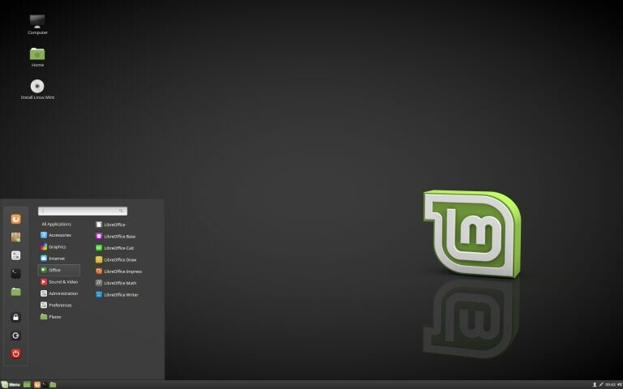

Lembre-se de remover o dispositivo de memória e reiniciar. Após a reinicialização, você estará usando o sistema operacional pela primeira vez como um novo usuário. Parabéns.

Uma das primeiras coisas a fazer (e fazer regularmente) é manter o sistema atualizado.

Abra o aplicativo Terminal e digite o seguinte:

```
    sudo apt-get update
```

pressione <enter>, confirme sua escolha e, em seguida, este comando:

```
    sudo apt-get upgrade
```

pressione <enter> e confirme sua escolha.

Deixe-o fazer o seu trabalho, pode levar vários minutos.

Em seguida, gosto de instalar o Tor (sensível a maiúsculas):

```
    sudo apt-get install tor
```

> _ADICIONAL: Você também pode executar o boot do Linux Mint a partir de "Instalação OEM" (Certifique-se de estar conectado à internet, caso contrário, você pode receber erros). Se fizer isso, mais tarde você precisará clicar no ícone "enviar para o usuário final", que deve estar na área de trabalho. Em seguida, reinicie e inicie o sistema operacional como se estivesse abrindo o computador pela primeira vez._

Este guia explicou por que você pode precisar de um computador dedicado para transações de Bitcoin e como instalar um sistema operacional Linux Mint novo nele.
