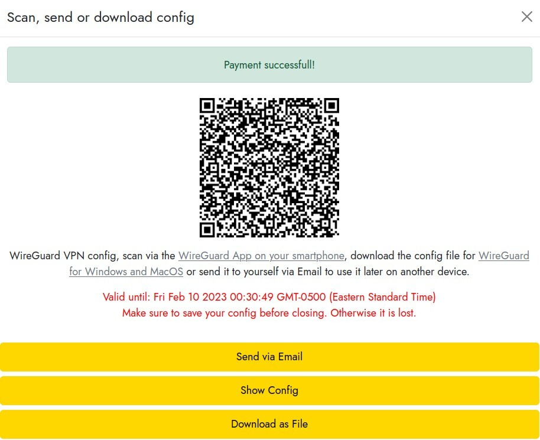

# LN⚡VPN

_**Guía propuesta por FranklynHart en el marco de Agora256, publicación original https://agora256.com/lnvpn/**_

LN VPN es un servicio VPN personalizado que solo acepta pagos con lightning. Hoy te mostraré cómo utilizarlo y dejar menos rastros cuando navegas por Internet.

Existen muchos proveedores de servicios VPN de calidad, de hecho, hicimos una revisión exhaustiva en este artículo (hipervínculo), pero LN VPN se destaca y no podíamos dejar de presentártelo.

La mayoría de los proveedores de servicios VPN como ProtonVPN y Mullvad ofrecen la opción de pagar con bitcoins, pero requieren la creación de una cuenta y la compra de un plan a largo plazo, lo cual no se ajusta necesariamente a todos los presupuestos.

LN VPN permite utilizar un VPN personalizado por un período tan corto como una hora gracias a su implementación de pagos en bitcoins a través de la red lightning. Los pagos lightning son instantáneos y anónimos, abriendo un mundo de posibilidades en cuanto a micropagos.

> 💡 Esta guía describe cómo utilizar LN VPN desde un sistema Linux Ubuntu 22.04 LTS

## Requisitos previos: Wireguard

En términos muy simples, Wireguard se utiliza para crear un túnel seguro entre tu computadora y el servidor remoto a través del cual navegarás por Internet. Durante el tiempo que sigas esta guía, la dirección IP de este servidor aparecerá como la tuya.

Guía oficial de instalación de Wireguard: https://www.wireguard.com/install/

```
Instalación de Wireguard
          $ sudo apt-get update
          $ sudo apt install wireguard
```

## Requisitos previos: Monedero Bitcoin Lightning

Si aún no tienes un monedero Bitcoin Lightning, no te preocupes, hemos creado una guía muy sencilla para ti, aquí. (la sección de tutoriales de LN puede ayudarte)

## Paso 1: Contratar un plan

Desde https://lnvpn.com, deberás seleccionar el país de la IP de salida del túnel VPN y la duración del plan. Una vez que hayas definido estos parámetros, haz clic en "Pagar con lightning".


Aparecerá una factura lightning, simplemente escanéala con tu monedero lightning.

Una vez que hayas pagado la factura, deberás esperar unos segundos o hasta dos minutos para que se generen tus configuraciones de Wireguard. Si esto lleva un poco más de tiempo, no te preocupes, hemos realizado este procedimiento decenas de veces y a veces puede llevar un poco más de tiempo.

El siguiente pantalla se mostrará y simplemente tienes que hacer clic en "Descargar como archivo" para recibir tu archivo de configuración. Este archivo llevará un nombre similar a lnvpn-xx-xx.conf, donde "xx" corresponderá a la fecha del día.



## paso 2: Activar el túnel

Primero, deberás cambiar el nombre del archivo de configuración obtenido en el paso anterior para que pueda ser reconocido automáticamente por Wireguard.

Dirígete a tu carpeta de descargas, ya sea en una ventana de terminal o con el explorador de archivos, y cambia el nombre del archivo lnvpn-xx-xx.conf a: wg0.conf.

```
    $ sudo ln -s usrbin/resolvectl usrlocal/bin/resolvconf
    $ sudo wg-quick up ~/Downloads/wg0.conf
```

Voilà, ça y est! Le tunnel est activé!

## Paso 3: Verificar

Utiliza un servicio en línea como "whatismyip" para verificar que tu dirección IP pública ahora es la del VPN que acabas de activar.

## Paso 4: Desactivar

Cuando el arrendamiento expire, deberás desactivar la conexión para volver a tener acceso a Internet. Luego podrás repetir los pasos 1 a 3 sin problemas cada vez que quieras establecer una conexión con LN VPN.

Para desactivar el túnel:

```
    $ sudo ip link delete dev wg0
```

¡Excelente! ¡Ahora sabes cómo utilizar LN VPN, un servicio VPN único en su clase!

> Guía proporcionada por FranklynHart en el marco de Agora256, publicación original en https://agora256.com/lnvpn/
