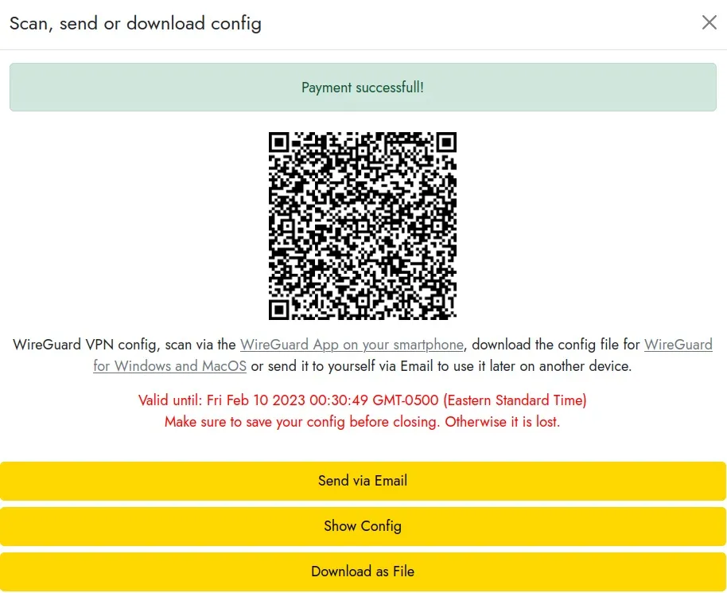

LN VPNは、ライトニング決済のみを受け付けるカスタマイズ可能なVPNサービスです。今日は、インターウェブをブラウジングする際に、より少ない痕跡を残す方法をご紹介します。

多くの高品質なVPNサービスプロバイダーが存在し、この記事で包括的なレビューを行っています（ハイパーリンク）。しかし、LN VPNは際立っており、この機会を逃すわけにはいきませんでした。

ProtonVPNやMullvadのようなほとんどのVPNサービスプロバイダーはビットコインでの支払いオプションを提供していますが、アカウントの作成と長期または短期のプランの購入が必要で、これが全ての人の予算に合うわけではありません。

LN VPNは、ライトニングネットワークを介したビットコイン決済の実装により、1時間という短い期間からオンデマンドでVPNの使用を可能にします。即時かつ匿名のライトニング決済は、マイクロペイメントのための新たな可能性を開きます。

> 💡 このガイドは、Linux Ubuntu 22.04 LTSシステムからLN VPNを使用する方法を説明します。

## 前提条件: Wireguard

簡単に言うと、Wireguardは、インターネットをブラウズするためにリモートサーバーとコンピューターの間に安全なトンネルを作成するために使用されます。このガイドに従って契約するリースの期間中、あなたのIPアドレスとして表示されるのはこのサーバーのIPアドレスです。

公式Wireguardインストールガイド: https://www.wireguard.com/install/

```
Wireguardのインストール
          $ sudo apt-get update
          $ sudo apt install wireguard
```

## 前提条件: Lightning Bitcoin Wallet

もしまだLightning Bitcoinウォレットを持っていなければ心配無用です、こちらで非常にシンプルなガイドを作成しました。（LNチュートリアルセクションが役立ちます）

## ステップ 1: リース契約

https://lnvpn.com から、VPNトンネルの出口IPの国と期間を選択する必要があります。これらのパラメーターを設定したら、ライトニングで支払うをクリックします。


ライトニングインボイスが表示され、ライトニングウォレットでスキャンするだけです。

インボイスを支払ったら、Wireguard設定設定が生成されるまで数秒から最大2分待つ必要があります。もし少し時間がかかる場合でも、パニックにならないでください。私たちはこの手続きを何十回も行っており、時には少し時間がかかることがあります。
次の画面が表示され、「ファイルとしてダウンロード」をクリックするだけで、lnvpn-xx-xx.confという名前の設定ファイルを受け取ります。ここでの「xx」は現在の日付に対応します。


## ステップ 2: トンネルの有効化

まず、前のステップで取得した設定ファイルの名前を、Wireguardによって自動的に認識されるように変更する必要があります。

ターミナルウィンドウまたはファイルエクスプローラーを使用してダウンロードフォルダに移動し、lnvpn-xx-xx.confファイルの名前を以下のようにwg0.confに変更します：

```
    $ sudo ln -s usrbin/resolvectl usrlocal/bin/resolvconf
    $ sudo wg-quick up ~/Downloads/wg0.conf
```

これで、トンネルが有効になりました！

## ステップ 3: 確認

whatismyipのようなオンラインサービスを使用して、あなたの公開IPアドレスが今、ちょうど有効にしたVPNのものであることを確認してください。

## ステップ 4: 無効化
リース期間が終了したら、インターネットへのアクセスを回復するために接続を無効にする必要があります。その後、LN VPNとのリースを確立したい場合は、いつでも手順1から3を繰り返すことができます。
トンネルを無効にする：

```
    $ sudo ip link delete dev wg0
```

さあ、これで完了です！これで、ユニークなVPNサービスであるLN VPNの使用方法を理解しました！