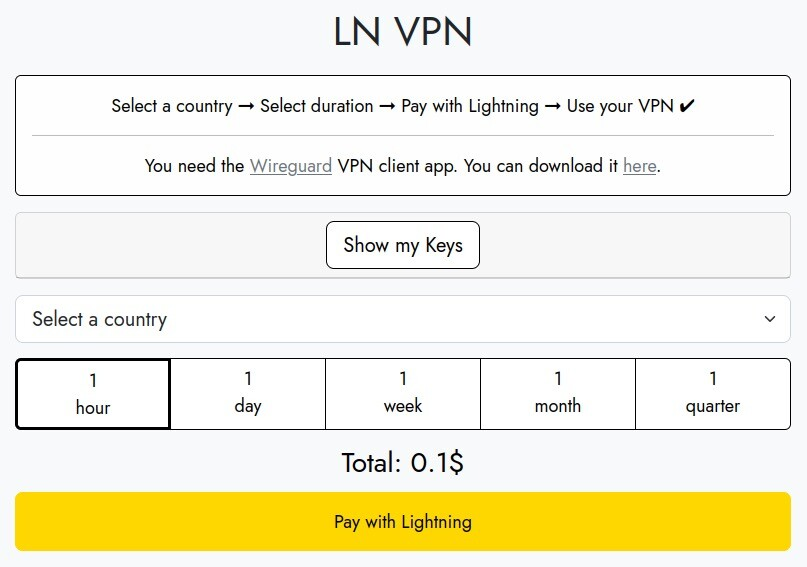

# LN⚡VPN

_**Guia oferecido por FranklynHart como parte do Agora256, post original https://agora256.com/lnvpn/**_

LN VPN é um serviço de VPN personalizado que aceita apenas pagamentos em lightning. Hoje, vou te mostrar como usá-lo e deixar menos rastros enquanto navega na internet.

Existem muitos provedores de serviços de VPN de qualidade, inclusive fizemos uma revisão completa neste artigo (link), mas o LN VPN se destaca e não poderíamos deixar de apresentá-lo a você.

A maioria dos provedores de serviços de VPN, como ProtonVPN e Mullvad, oferece a opção de pagamento com bitcoins, mas requer a criação de uma conta e a compra de um plano de longo prazo, o que pode não ser adequado para todos os orçamentos.

O LN VPN possibilita o uso de VPN personalizada por um período tão curto quanto uma hora, graças à sua implementação de pagamentos em bitcoins pela rede lightning. Instantâneos e anônimos, os pagamentos em lightning abrem um mundo de possibilidades para micropagamentos.

> 💡 Este guia descreve como usar o LN VPN a partir de um sistema Linux Ubuntu 22.04 LTS

## Pré-requisitos: Wireguard

Em termos simples, o Wireguard é usado para criar um túnel seguro entre o seu computador e o servidor remoto por meio do qual você navegará na internet. É o endereço IP desse servidor que aparecerá como o seu durante o período do contrato que você seguirá neste guia.

Guia oficial de instalação do Wireguard: https://www.wireguard.com/install/

```
Instalação do wireguard
          $ sudo apt-get update
          $ sudo apt install wireguard
```

## Pré-requisitos: Carteira Bitcoin Lightning

Se você ainda não tem uma carteira Bitcoin Lightning, não se preocupe, criamos um guia muito simples para você aqui. (a seção de tutorial LN pode te ajudar)

## Passo 1: Contratar um contrato

A partir de https://lnvpn.com, você precisará selecionar o país do IP de saída do túnel VPN e a duração. Depois de definir esses parâmetros, clique em Pagar com lightning.



Uma fatura lightning será exibida, basta escaneá-la com sua carteira lightning.

Após o pagamento da fatura, você precisará aguardar alguns segundos a até dois minutos para que suas configurações do Wireguard sejam geradas. Se isso levar um pouco mais de tempo, não se preocupe, já fizemos esse procedimento dezenas de vezes, às vezes pode demorar um pouco mais.

A seguinte tela será exibida e você só precisa clicar em "Download as File" para receber o seu arquivo de configuração, ele terá um nome parecido com lnvpn-xx-xx.conf, onde os "xx" corresponderão à data de hoje.

## Passo 2: Ativar o túnel

Primeiro, você precisará renomear o arquivo de configuração obtido na etapa anterior para que ele possa ser reconhecido automaticamente pelo Wireguard.

Vá até a sua pasta de downloads, seja em uma janela do terminal ou com o explorador de arquivos, e renomeie o arquivo lnvpn-xx-xx.conf para wg0.conf.

bash

```
    $ sudo ln -s usrbin/resolvectl usrlocal/bin/resolvconf
    $ sudo wg-quick up ~/Downloads/wg0.conf
```

Pronto! O túnel está ativado!

## Passo 3: Verificar

Utilize um serviço online como o "whatismyip" para verificar se o seu endereço IP público agora é o do VPN que você acabou de ativar.
Passo 4: Desativar

Quando o contrato expirar, você precisará desativar a conexão para recuperar o acesso à internet. Em seguida, você poderá repetir os passos de 1 a 3 sem problemas sempre que desejar estabelecer uma conexão com o LN VPN.

Desativar o túnel:

perl

```
    $ sudo ip link delete dev wg0
```

Pronto! Agora você sabe como usar o LN VPN, um serviço VPN único em sua categoria!

> Guia fornecido por FranklynHart como parte do Agora256, post original em https://agora256.com/lnvpn/"
