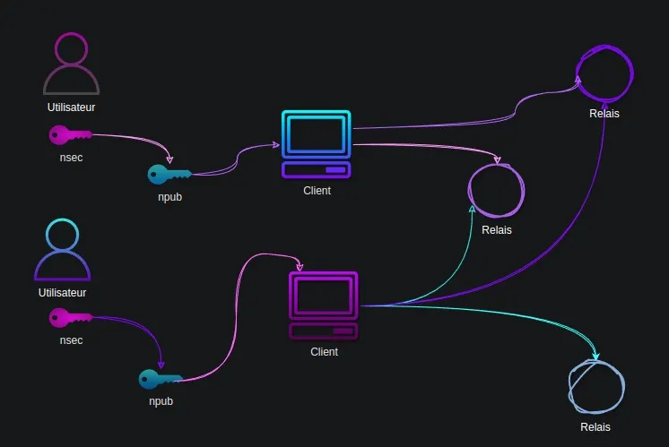
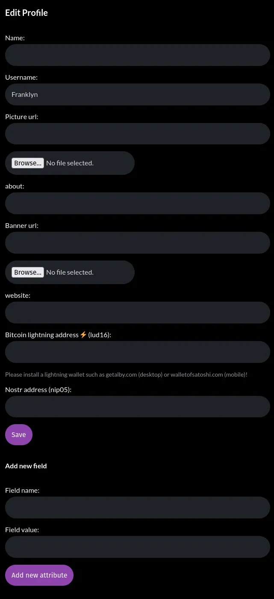
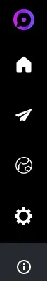

At the end of this guide, you will understand what Nostr is, you will have created an account, and you will be able to use it.

## What is Nostr?

Nostr is a protocol that has the power to replace Twitter, Telegram, and other social media platforms. It is a simple open protocol capable of creating a globally resistant social network once and for all.

## How does it work?

Nostr is based on three components: key pairs, clients, and relays.

Each user has one or more identities, and each identity is determined by a cryptographic key pair.

To access the network, you need to use client software and connect to relays to receive and transmit content.

## 1. Cryptographic Keys

Unlike Facebook or Twitter, where users have to provide an email address and a plethora of information to a private company, Nostr operates without a central authority. Users generate a cryptographic key pair, a secret key (also known as a private key), and a public key.

The secret key, nsec, known only to the user, is used for authentication and publishing content.

The public key, npub, is a unique identifier to which all content published by a user is attached. Your public key is like a username that allows other users to find you and subscribe to your Nostr feed.

## 2. Clients

Clients are software that allows interaction with Nostr. The main clients are:

> iOS: damus
> Android: amethyst
> Web: iris.to; snort.social; astral.ninja

Clients allow users to generate a new key pair (equivalent to creating an account) or authenticate with an existing key pair.

## 3. Relays

Relays are simplistic servers that you can abandon at any time if you don't like the content they deliver to you. You can also run your own relay if you wish.

> 💡 Pro tip: Paid relays are generally more effective at filtering spam and unwanted content.

# Guide

Now you know enough about Nostr to get started and create your first identity on this protocol.

For the purposes of this guide, we will use iris.to (https://iris.to/) as this web client works on any platform.

## Step 1: Generating keys

ris will create a set of keys for you without you having to do anything more than enter a name (real or fictional) for your profile. Then click on GO and you're done!

> ⚠️ Attention! You will need to keep track of your keys if you want to be able to access your profile again once your session is closed. I will show you how to do this at the very end of this guide.

## Step 2: Publish content

To publish content, it's as simple and intuitive as writing a few words in the publication field.

There you go! You have published your first note on Nostr.

## Step 3: Find a friend

Find me on Nostr and never be alone again. I will subscribe back to anyone who subscribes to my feed. To do this, simply enter my public key

npub1hartx53w6t3q5wv9xdqdwrk7h6r5866t8u775q0304zedpn5zgssasp7d3 in the search bar.

Click on "follow" and in a few days at most, I will also subscribe to your feed. We will be friends. I will also be happy to read your message if you want to write me one.

Finally, make sure to also subscribe to Agora256's feed to receive a note every time we publish something new: npub1ag0rawstycy7nanuc6sz4v287rneen2yapcq3fd06972f8ncrhzqx

## Step 4: Customize your profile

You still have some work to do to customize your profile. To do this, click on the avatar that iris automatically generated for you in the upper right corner of the screen and then click on "edit profile".

All you have to do now is tell iris where to find your image and profile banner on the interwebs. I recommend hosting your own content: protect what is yours.

If you prefer, you can also upload images, they will be stored for you by iris on nostr.build, a free visual content hosting service for Nostr.

As you can see, you can also configure your client to be able to receive and send sats. This way, you can reward the authors of content you liked or, even better, accumulate sats for the great content you will publish.

## Step 5: Backup the key pair

This step is crucial if you want to keep access to your profile once you have logged out of the client or your session has expired.
First, click on the "settings" icon represented by a gear

Then, copy and paste one by one your npub, npub hex, nsec, and nsec hex into a text file that you will keep secure. I recommend encrypting this file if you know how to do it.

> ⚠️ Take note of the warning that iris gives you. While you can share your public key without fear, it is a different story for your private key. Anyone who has the latter will be able to access your account.

## Conclusion

There you go, little ostrich, you have taken your first steps on Nostr. Now, you will need to learn to run at lightning speed. We will soon publish guides that will show you how to manage your keys and how to integrate lightning into your Nostr experience using getalby.
