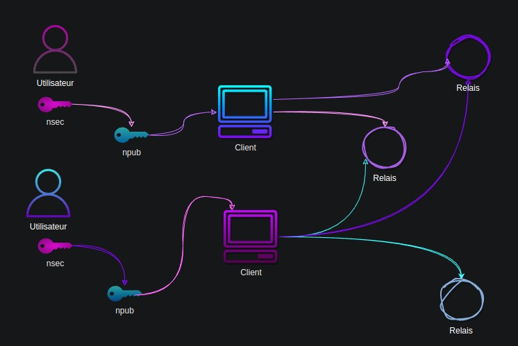
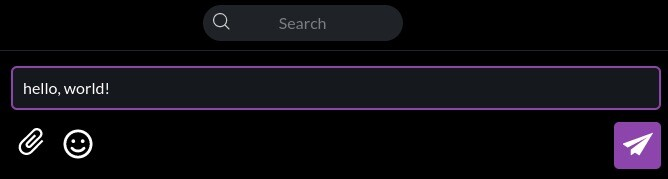
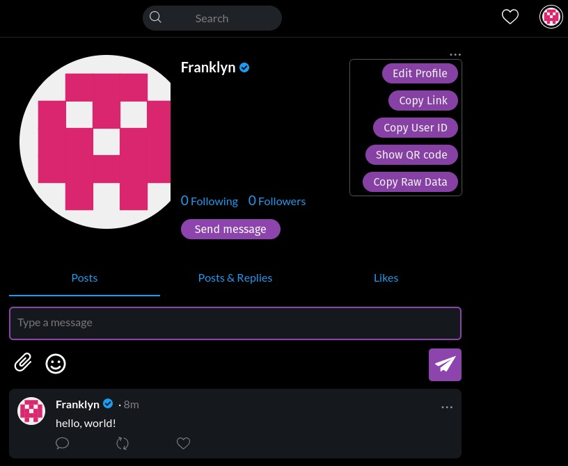
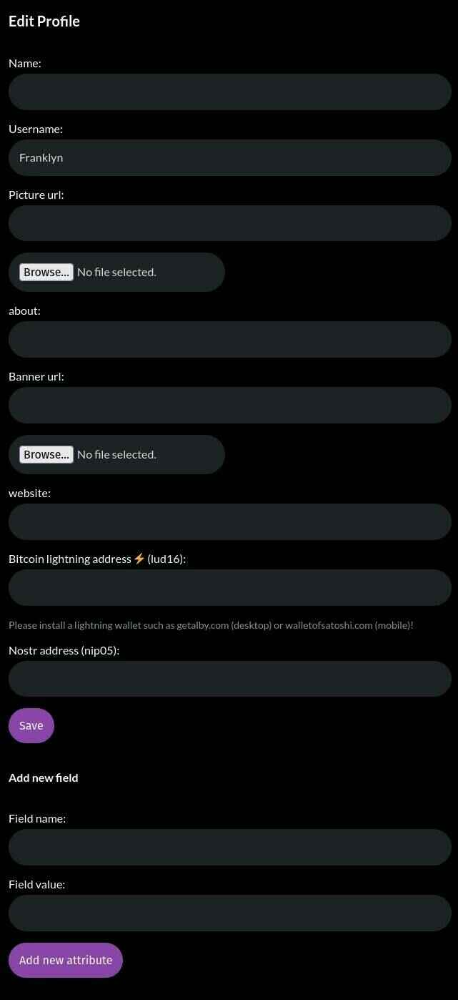
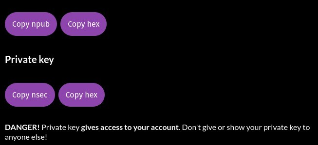

名前：NOSTR

説明：NOSTR の概要と使用方法を紹介します。

# 2023 年に Nostr を使用する方法：初心者向けガイド

このガイドの終わりまでに、Nostr とは何かを理解し、アカウントを作成し、使用することができるようになります。

## Nostr とは何ですか？

Nostr は、Twitter や Telegram などの他のソーシャルメディアを置き換える力を持つプロトコルです。これは、一度作成された抵抗力のあるグローバルなソーシャルネットワークを作成するためのシンプルなオープンプロトコルです。

## どのように機能しますか？

Nostr は、鍵ペア、クライアント、リレーの 3 つのコンポーネントに基づいています。

各ユーザーは 1 つ以上のアイデンティティを持ち、各アイデンティティは暗号鍵ペアによって決定されます。

ネットワークにアクセスするには、クライアントソフトウェアを使用し、コンテンツの受信と送信のためにリレーに接続する必要があります。

## 1. 暗号鍵

Facebook や Twitter とは異なり、ユーザーはプライベート企業にメールアドレスや多くの情報を提供する必要はありません。Nostr は中央機関の存在しない状態で動作します。ユーザーは暗号鍵ペア（秘密鍵とも呼ばれる）と公開鍵を生成します。

秘密鍵（nsec）はユーザーだけが知っている鍵で、認証およびコンテンツの公開に使用されます。

公開鍵（npub）は、ユーザーが公開したコンテンツに関連付けられた一意の識別子です。公開鍵は、他のユーザーがあなたを見つけて Nostr のフィードに購読するためのユーザー名のようなものです。

## 2. クライアント

クライアントは Nostr との対話を可能にするソフトウェアです。主なクライアントは次のとおりです。

> iOS: damus
> Android: amethyst
> Web: iris.to; snort.social; astral.ninja

クライアントは、ユーザーが新しい鍵ペア（アカウントの作成に相当）を生成したり、既存の鍵ペアで認証したりすることができます。

## 3. リレー

リレーは、いつでも好きな時にやめることができるシンプルなサーバーです。また、必要に応じて独自のリレーを運用することもできます。

> 💡 プロのヒント：有料のリレーは、スパムや望ましくないコンテンツをフィルタリングするのに一般的に効果的です。

# ガイド

これで、Nostr についての基本を知り、このプロトコルで最初のアイデンティティを作成して始める準備が整いました。

このガイドでは、どのプラットフォームでも動作する Web クライアントである iris.to（https://iris.to/）を使用します。

## ステップ 1：鍵の生成

ris は、あなたのためにキーペアを作成します。あなたはプロフィールの名前（実在または架空のもの）を入力するだけで、何もする必要はありません。その後、GO をクリックすると完了です！

> ⚠️ 注意！セッションを終了した後にプロフィールに再アクセスするためには、キーを記録しておく必要があります。このガイドの最後で、その方法を説明します。

## ステップ 2：コンテンツの投稿

コンテンツを投稿するには、投稿フィールドにいくつかの単語を書くだけで簡単です。

これで完了です！Nostr に最初のノートを投稿しました。

## ステップ 3：友達を見つける

Nostr で私を見つけて、もう一人でいることはありません。私は私のフィードにサブスクライブしてくれた人々にもサブスクライブします。そのためには、検索バーに公開鍵を入力するだけです。

npub1hartx53w6t3q5wv9xdqdwrk7h6r5866t8u775q0304zedpn5zgssasp7d3

「フォロー」をクリックし、数日以内に私もあなたのフィードにサブスクライブします。私たちは友達になります。メッセージを書きたい場合は、喜んで読みます。

最後に、新しいものが投稿されるたびに Agora256 のフィードを購読するようにしてください：npub1ag0rawstycy7nanuc6sz4v287rneen2yapcq3fd06972f8ncrhzqx

## ステップ 4：プロフィールのカスタマイズ

プロフィールをカスタマイズするためには、画面右上の iris が自動的に生成したアバターをクリックし、「プロフィールの編集」をクリックします。

iris に画像とプロフィールバナーの場所を教えるだけです。コンテンツは自分でホストすることをお勧めします：あなたの所有物を保護してください。

お好みで、画像をアップロードすることもできます。iris が Nostr 用の無料のビジュアルコンテンツホスティングサービスである nostr.build に保存します。

ご覧の通り、クライアントを設定して sats を受け取ったり送信したりすることもできます。これにより、気に入ったコンテンツの作者に報酬を与えたり、さらには自分自身が素晴らしいコンテンツに sats を蓄積したりすることができます。

## ステップ 5：キーペアのバックアップ

このステップは重要です。クライアントからログアウトしたり、セッションが期限切れになったりしても、プロフィールへのアクセスを保持するためには、キーペアをバックアップする必要があります。
まず、歯車のアイコンをクリックしてください。

次に、npub、npub hex、nsec、nsec hex の順にテキストファイルにコピー＆ペーストして、安全な場所に保存してください。ファイルを暗号化することをおすすめしますが、方法がわかる場合に限ります。

> ⚠️ iris からの警告に注意してください。公開鍵は安全に共有できるかもしれませんが、秘密鍵は別です。秘密鍵を持っている人はあなたのアカウントにアクセスできます。

## 結論

おめでとう、小さなダチョウさん。Nostr で最初のステップを踏みました。次は、光の速さで走る方法を学ぶ必要があります。近日中に、キーの管理方法や getalby を使用して Nostr 体験にライトニングを統合する方法を紹介するガイドを公開します。
