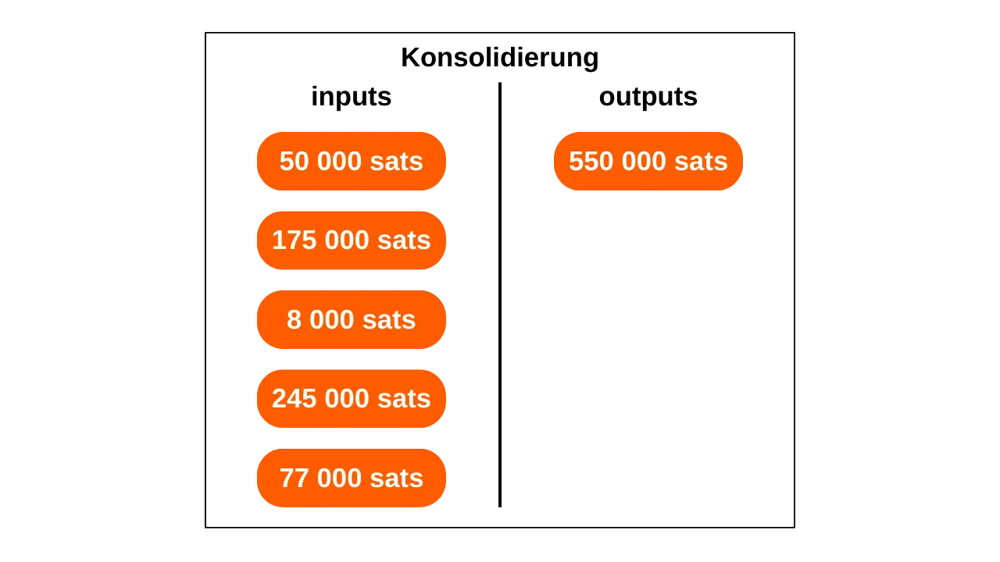
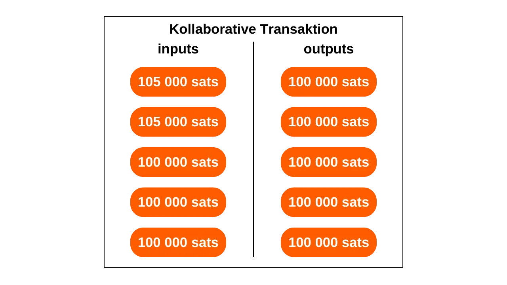
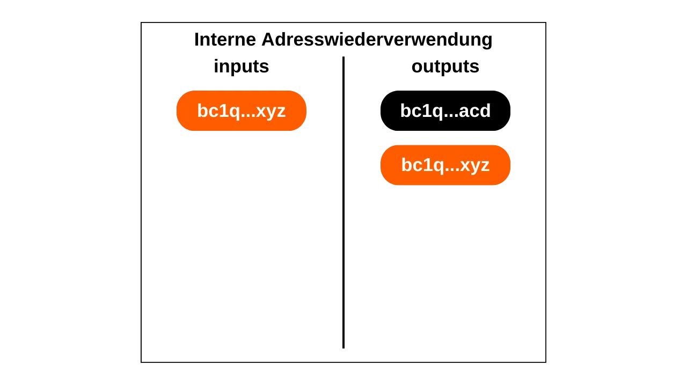
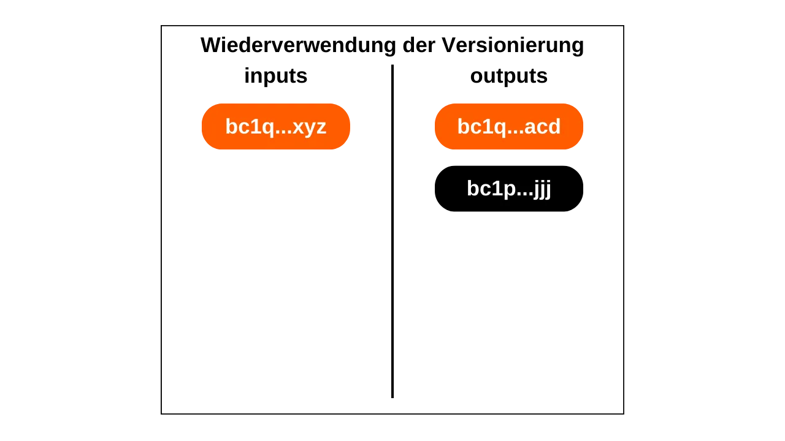

In diesem Artikel lernen Sie die wesentlichen theoretischen Grundlagen kennen, die erforderlich sind, um mit grundlegenden Chain-Analysen bei Bitcoin zu beginnen und noch wichtiger, um zu verstehen, wie diejenigen, die Sie beobachten, operieren. Obwohl dieser Artikel kein praktisches Tutorial zum OXT-Tool ist (ein Thema, das wir in einem zukünftigen Tutorial behandeln werden), stellt er eine Reihe von entscheidenden Kenntnissen für dessen Verwendung zusammen. Für jedes vorgestellte Modell, jede Metrik und jeden Indikator wird ein Link zu einer Beispieltransaktion auf OXT bereitgestellt, der es Ihnen ermöglicht, dessen Verwendung besser zu verstehen und parallel zu Ihrer Lektüre zu üben.

## Einführung
Eine der Funktionen von Geld ist es, das Problem der doppelten Koinzidenz der Wünsche zu lösen. In einem auf Tauschhandel basierenden System erfordert der Abschluss eines Austauschs nicht nur, eine Person zu finden, die ein Gut anbietet, das meinen Bedarf deckt, sondern auch ihnen ein Gut von äquivalentem Wert zu bieten, das ihren eigenen Bedarf befriedigt. Diese Balance zu finden, erweist sich als komplex. Deshalb greifen wir auf Geld zurück, das es uns ermöglicht, Wert sowohl im Raum als auch in der Zeit zu bewegen.

Damit Geld dieses Problem lösen kann, ist es wesentlich, dass die Partei, die ein Gut oder eine Dienstleistung bereitstellt, von ihrer Fähigkeit überzeugt ist, diese Summe später ausgeben zu können. Daher wird jede rationale Person, die bereit ist, ein Geldstück, ob digital oder physisch, zu akzeptieren, sicherstellen, dass es zwei grundlegende Kriterien erfüllt:
- Die Münze muss intakt und authentisch sein;
- und sie darf nicht doppelt ausgegeben worden sein.

Wenn wir physisches Geld verwenden, ist es die erste Eigenschaft, die am schwierigsten zu behaupten ist. In verschiedenen Perioden der Geschichte wurde die Integrität von Metallmünzen oft durch Praktiken wie Beschneiden oder Bohren beeinträchtigt. Zum Beispiel war es im antiken Rom üblich, dass Bürger die Ränder von Goldmünzen abschabten, um ein wenig Edelmetall zu sammeln, während sie sie dennoch für zukünftige Transaktionen aufbewahrten. Dies ist insbesondere der Grund, warum später Rillen am Rand der Münzen geprägt wurden. Auch die Authentizität ist eine schwierige Eigenschaft, die bei einem physischen Geldmedium zu überprüfen ist. Heutzutage sind die Techniken zur Bekämpfung von Fälschungen zunehmend komplex, was Händler dazu zwingt, in teure Verifizierungssysteme zu investieren.

Andererseits ist Doppelausgaben bei physischen Währungen kein Problem. Wenn ich Ihnen einen 10-Euro-Schein gebe, verlässt er unwiderruflich meinen Besitz, um in Ihren überzugehen, wodurch jede Möglichkeit der mehrfachen Ausgabe der darin vertretenen Geldeinheiten ausgeschlossen wird.
Bei digitaler Währung ist die Herausforderung anders. Die Authentizität und Integrität einer Münze zu gewährleisten, ist oft einfacher, aber die Abwesenheit von Doppelausgaben zu gewährleisten, ist komplexer. Jedes digitale Gut ist im Wesentlichen Information. Im Gegensatz zu physischen Gütern teilt sich Information bei Austauschvorgängen nicht, sondern verbreitet sich durch Vervielfältigung. Wenn ich Ihnen beispielsweise ein Dokument per E-Mail sende, wird es dann dupliziert. Von Ihrer Seite aus können Sie nicht mit Sicherheit überprüfen, dass ich das Originaldokument gelöscht habe.

Die einzige Möglichkeit, diese Duplizierung eines digitalen Gutes zu vermeiden, besteht darin, über alle Austauschvorgänge im System informiert zu sein. Auf diese Weise kann man wissen, wer was besitzt und die Konten aller basierend auf den getätigten Transaktionen aktualisieren. Dies wird beispielsweise mit Buchgeld gemacht. Wenn Sie einem Händler 10 Euro per Kreditkarte zahlen, notiert die Bank diesen Austausch und aktualisiert das Hauptbuch.

Bei Bitcoin wird die Verhinderung von Doppelausgaben auf die gleiche Weise durchgeführt. Es wird versucht, die Abwesenheit einer Transaktion zu bestätigen, die die in Frage stehenden Münzen bereits ausgegeben hat. Wenn diese nie verwendet wurden, dann können wir sicher sein, dass keine Doppelausgaben stattfinden werden. Dies ist der berühmte Satz von Satoshi Nakamoto im White Paper: "*Der einzige Weg, die Abwesenheit einer Transaktion zu bestätigen, besteht darin, über alle Transaktionen informiert zu sein.*"
Im Gegensatz zum Bankenmodell möchten wir bei Bitcoin nicht darauf angewiesen sein, einer zentralen Entität vertrauen zu müssen. Daher müssen alle Nutzer in der Lage sein, diese Abwesenheit von Doppelausgaben zu bestätigen, ohne sich auf eine dritte Partei verlassen zu müssen. Somit muss jeder über alle Bitcoin-Transaktionen informiert sein.
Es ist genau diese öffentliche Verbreitung von Informationen, die den Schutz der Privatsphäre bei Bitcoin kompliziert. Im traditionellen Bankensystem sind theoretisch nur die Finanzinstitutionen über die getätigten Transaktionen informiert. Bei Bitcoin jedoch sind alle Nutzer über alle Transaktionen informiert, über ihre jeweiligen Knotenpunkte.

Aufgrund dieser Verbreitungsbeschränkung unterscheidet sich das Datenschutzmodell von Bitcoin von dem des Bankensystems. Im letzteren sind Transaktionen mit der Identität des Nutzers verbunden, aber der Informationsfluss wird zwischen der vertrauenswürdigen dritten Partei und der Öffentlichkeit unterbrochen. Mit anderen Worten, Ihr Banker weiß, dass Sie jeden Morgen Ihre Baguette in der lokalen Bäckerei kaufen, aber Ihr Nachbar ist sich all dieser Transaktionen nicht bewusst. Im Falle von Bitcoin, da der Informationsfluss zwischen Transaktionen und dem öffentlichen Bereich nicht unterbrochen werden kann, beruht das Datenschutzmodell darauf, die Identität des Nutzers von den Transaktionen selbst zu trennen.

*Diagramm inspiriert von Satoshi Nakamotos im White Paper: Bitcoin: Ein Peer-to-Peer Electronic Cash System, Abschnitt 10 "Datenschutz".*
Da Bitcoin-Transaktionen öffentlich gemacht werden, wird es möglich, Verbindungen zwischen ihnen herzustellen, um Informationen über die beteiligten Parteien abzuleiten. Diese Aktivität stellt sogar eine Spezialität an sich dar, die gemeinhin als "Chain-Analyse" bezeichnet wird. In diesem Artikel lade ich Sie ein, die Grundlagen der Chain-Analyse zu erkunden, um zu verstehen, wie Ihre Bitcoins verfolgt werden.

Die Mehrheit der Unternehmen, die sich auf Chain-Analyse spezialisiert haben, operieren als Black Boxes und legen ihre Methodologien nicht offen. Daher ist es schwierig, Informationen über diese Praxis zu erhalten. Für die Erstellung dieses Artikels stützte ich mich hauptsächlich auf die wenigen offenen Ressourcen, die verfügbar sind:
- Der Großteil meines Artikels ist aus der Serie von vier Artikeln mit dem Namen: [Understanding Bitcoin Privacy with OXT](https://medium.com/oxt-research/understanding-bitcoin-privacy-with-oxt-part-1-4-8177a40a5923), produziert von Samourai Wallet im Jahr 2021, entnommen;
- Ich habe auch verschiedene Berichte von [OXT Research](https://medium.com/oxt-research) verwendet, sowie [ihr kostenloses Chain-Analyse-Tool](https://oxt.me/);
- Im Allgemeinen stammt mein Wissen aus den verschiedenen Tweets und Inhalten von [@LaurentMT](https://twitter.com/LaurentMT) und [@ErgoBTC](https://twitter.com/ErgoBTC);
- Ich ließ mich auch von [Space Kek #19](https://podcasters.spotify.com/pod/show/decouvrebitcoin/episodes/SpaceKek-19---Analyse-de-chane--anonsets-et-entropie-e1vfuji) inspirieren, an dem ich neben [@louneskmt](https://twitter.com/louneskmt), [@TheoPantamis](https://twitter.com/TheoPantamis), [@Sosthene___](https://twitter.com/Sosthene___), und [@LaurentMT](https://twitter.com/LaurentMT) teilnahm.

Ich möchte ihren Autoren, Entwicklern und Produzenten danken. Ohne ihre verschiedenen Inhalte und Software würde dieser Artikel nicht existieren. Ich danke auch den Rezensenten, die diesen Text sorgfältig korrigiert und mich mit ihrem Expertenrat beglückt haben:
- [Gilles Cadignan](https://twitter.com/gillesCadignan);
- [Ludovic Lars](https://twitter.com/lugaxker) ([https://viresinnumeris.fr/](https://viresinnumeris.fr/)).

*Zu Ihrer Information, ich habe am Ende des Artikels ein technisches Mini-Glossar hinzugefügt, um bestimmte Begriffe zu definieren. Wenn Sie auf ein Wort stoßen, das Sie nicht verstehen und das mit einem Sternchen markiert ist, finden Sie dessen Definition am Ende der Seite.*

## Was ist Chain-Analyse?
Chain-Analyse ist eine Praxis, die alle Methoden zur Verfolgung von Bitcoin-Flüssen auf der Blockchain umfasst. Allgemein stützt sich die Chain-Analyse auf die Beobachtung von Merkmalen in Proben vorheriger Transaktionen. Dann geht es darum, diese gleichen Merkmale in einer Transaktion zu identifizieren, die man analysieren möchte, und plausible Interpretationen abzuleiten. Diese Problemlösungsmethode, die auf einem praktischen Ansatz beruht, um eine hinreichend gute Lösung zu finden, wird als Heuristik bezeichnet.

Vereinfacht gesagt, wird die Chain-Analyse in zwei Hauptphasen durchgeführt:
1. Die Identifizierung bekannter Merkmale;
2. Die Ableitung von Hypothesen.

Eines der Ziele der Chain-Analyse ist es, verschiedene Aktivitäten auf Bitcoin zu gruppieren, um die Einzigartigkeit des Benutzers, der sie durchgeführt hat, zu bestimmen. Anschließend wird es möglich sein, zu versuchen, dieses Bündel von Aktivitäten mit einer realen Identität zu verknüpfen.

Erinnern Sie sich an meine Einleitung. Ich erklärte, warum das Datenschutzmodell von Bitcoin ursprünglich darauf beruhte, die Identität des Benutzers von seinen Transaktionen zu trennen. Daher könnte man versucht sein zu denken, dass Chain-Analyse unnötig ist, da selbst wenn es gelingt, On-Chain-Aktivitäten zu gruppieren, diese nicht mit einer realen Identität in Verbindung gebracht werden können. Theoretisch ist diese Aussage korrekt. Kryptografische Schlüsselpaare werden verwendet, um Bedingungen für die UTXOs festzulegen. Ihrer Natur nach geben diese Schlüsselpaare keine Informationen über die Identität ihrer Inhaber preis. Somit sagt uns selbst die Gruppierung von Aktivitäten, die mit verschiedenen Schlüsselpaaren verbunden sind, nichts über die Entität hinter diesen Aktivitäten aus.

Die praktische Realität ist jedoch viel komplexer. Es gibt eine Vielzahl von Verhaltensweisen, die das Risiko bergen, eine reale Identität mit einer On-Chain-Aktivität zu verknüpfen. In der Analyse wird dies als Eintrittspunkt bezeichnet, und es gibt viele davon. Der häufigste ist natürlich KYC (Know Your Customer). Wenn Sie Ihre Bitcoins von einer regulierten Plattform an eine Ihrer persönlichen Empfangsadressen abheben, dann sind einige Personen in der Lage, Ihre Identität mit dieser Adresse zu verknüpfen. Allgemeiner gesagt, kann ein Eintrittspunkt jede Form der Interaktion zwischen Ihrem realen Leben und einer Bitcoin-Transaktion sein. Wenn Sie beispielsweise eine Empfangsadresse in Ihren sozialen Netzwerken veröffentlichen, kann dies ein Eintrittspunkt für die Analyse sein. Wenn Sie eine Zahlung in Bitcoins an Ihren Bäcker leisten, können sie Ihr Gesicht (das Teil Ihrer Identität ist) mit einer Bitcoin-Adresse in Verbindung bringen.
Diese Eintrittspunkte sind fast unvermeidlich bei der Verwendung von Bitcoin. Obwohl man versuchen könnte, ihren Umfang zu begrenzen, werden sie dennoch präsent bleiben. Deshalb ist es entscheidend, Methoden zu kombinieren, die darauf abzielen, Ihre Privatsphäre zu bewahren. Obwohl die Aufrechterhaltung einer akzeptablen Trennung zwischen Ihrer realen Identität und Ihren Transaktionen ein lobenswerter Ansatz ist, bleibt er unzureichend. Tatsächlich, wenn alle Ihre On-Chain-Aktivitäten zusammengefasst werden können, dann könnte selbst der kleinste Eintrittspunkt die einzige Datenschutzebene, die Sie etabliert hatten, kompromittieren.
Daher ist es auch notwendig, sich mit der Kettenanalyse bei unserer Verwendung von Bitcoin auseinanderzusetzen. Indem wir dies tun, können wir die Aggregation unserer Aktivitäten minimieren und die Auswirkungen eines Einstiegspunkts auf unsere Privatsphäre begrenzen. Genau genommen, um der Kettenanalyse besser entgegenzuwirken, was gibt es Besseres, als sich mit den in der Kettenanalyse verwendeten Methoden vertraut zu machen? Wenn Sie wissen möchten, wie Sie Ihre Privatsphäre bei Bitcoin verbessern können, müssen Sie diese Methoden verstehen. Dies ermöglicht es Ihnen, Techniken wie [Coinjoin](https://planb.network/de/tutorials/privacy/coinjoin-samourai-wallet) oder [Payjoin](https://planb.network/de/tutorials/privacy/payjoin) besser zu erfassen und die Fehler, die Sie möglicherweise machen, zu reduzieren.
In diesem Zusammenhang können wir eine Analogie zur Kryptographie und Kryptoanalyse ziehen. Ein guter Kryptograph ist in erster Linie ein guter Kryptoanalytiker. Um einen neuen Verschlüsselungsalgorithmus zu entwerfen, muss man wissen, welchen Angriffen er ausgesetzt sein wird, und auch studieren, warum frühere Algorithmen gebrochen wurden. Das gleiche Prinzip gilt für die Privatsphäre bei Bitcoin. Das Verständnis der Methoden der Kettenanalyse ist der Schlüssel zum Schutz davor. Deshalb biete ich Ihnen diesen Artikel an.

Es ist entscheidend zu verstehen, dass die Kettenanalyse keine exakte Wissenschaft ist. Sie stützt sich auf Heuristiken, die aus früheren Beobachtungen oder logischen Interpretationen abgeleitet sind. Diese Regeln ermöglichen ziemlich zuverlässige Ergebnisse, aber nie mit absoluter Präzision. Mit anderen Worten, die Kettenanalyse beinhaltet immer eine Dimension der Wahrscheinlichkeit in den gezogenen Schlussfolgerungen. Wir können mit mehr oder weniger Sicherheit schätzen, dass zwei Adressen derselben Entität gehören, aber totale Sicherheit wird immer unerreichbar sein.

Das gesamte Ziel der Kettenanalyse liegt genau in der Aggregation verschiedener Heuristiken, um das Risiko eines Fehlers zu minimieren. Es ist gewissermaßen eine Ansammlung von Beweisen, die es uns ermöglicht, der Realität näher zu kommen.

Diese berühmten Heuristiken können in verschiedene Kategorien eingeteilt werden, die wir gemeinsam im Detail betrachten werden:
- Transaktionsmuster (oder Transaktionsmodelle);
- Interne Heuristiken zur Transaktion;
- Externe Heuristiken zur Transaktion.

Es ist erwähnenswert, dass die ersten beiden Heuristiken zu Bitcoin von Satoshi Nakamoto selbst formuliert wurden. Er diskutiert sie in Teil 10 des White Papers. Wie wir später sehen werden, ist es interessant zu beobachten, dass diese beiden Heuristiken auch heute noch eine Vorrangstellung in der Kettenanalyse einnehmen. Diese sind:
- die Common Input Ownership Heuristic (CIOH);
- und die Wiederverwendung von Adressen.

Lassen Sie uns gemeinsam die beobachtbaren Merkmale und die Interpretationen, die gezogen werden können, um eine Analyse durchzuführen, erkunden.

## Transaktionsmuster (oder Transaktionsmodelle)
Ein Transaktionsmuster ist einfach ein typisches Transaktionsmodell, das auf der Blockchain gefunden werden kann, dessen Interpretation wahrscheinlich bekannt ist. Bei der Untersuchung von Mustern werden wir uns auf eine einzelne Transaktion konzentrieren, die wir auf hoher Ebene analysieren werden. Mit anderen Worten, wir werden nur die Anzahl der Eingänge und Ausgänge betrachten, ohne uns auf seine spezifischeren Details oder seine Umgebung zu konzentrieren. Aus dem beobachteten Modell werden wir in der Lage sein, die Natur der Transaktion zu interpretieren. Wir werden dann nach Merkmalen über seine Struktur suchen und eine Interpretation ableiten.

### Die einfache Sendung (oder einfache Zahlung)
Dieses Modell ist gekennzeichnet durch den Verbrauch von einem oder mehreren UTXOs als Eingang und die Produktion von zwei UTXOs als Ausgang.

Die Interpretation dieses Modells ist, dass wir in Anwesenheit einer Send- oder Zahlungstransaktion sind. Der Benutzer hat seine eigenen UTXOs als Eingabe verbraucht, um als Ausgabe ein Zahlungs-UTXO und ein Wechselgeld-UTXO (Wechselgeld, das an denselben Benutzer zurückgeht) zu befriedigen. Wir wissen daher, dass der beobachtete Benutzer wahrscheinlich nicht mehr im Besitz eines der beiden UTXOs in der Ausgabe (das Zahlungs-UTXO) ist, aber immer noch im Besitz des anderen UTXOs (das Wechselgeld-UTXO) ist.
An diesem Punkt ist es uns unmöglich zu spezifizieren, welche Ausgabe welches UTXO repräsentiert, da dies nicht das Ziel dieses Modells ist. Wir werden dies tun können, indem wir uns auf die Heuristiken verlassen, die wir im folgenden Teil studieren werden. In diesem Stadium ist unser Ziel darauf beschränkt, die Art der in Frage stehenden Transaktion zu identifizieren, die in diesem Fall eine einfache Sendung ist.

Zum Beispiel, hier ist eine Bitcoin-Transaktion, die das einfache Sendemuster annimmt:
### Sweep ("sweep" auf Englisch)
Dieses Modell ist durch den Verbrauch eines einzigen UTXOs als Eingabe und die Produktion eines einzigen UTXOs als Ausgabe gekennzeichnet.

Die Interpretation dieses Modells ist, dass wir in Anwesenheit einer Selbstübertragung sind. Der Benutzer hat seine Bitcoins an sich selbst, an eine andere Adresse, die sie besitzen, übertragen. Da es in der Transaktion kein Wechselgeld gibt, ist es sehr unwahrscheinlich, dass wir es mit einer Zahlung zu tun haben. Wir wissen dann, dass der beobachtete Benutzer wahrscheinlich immer noch im Besitz dieses UTXOs ist.

Zum Beispiel, hier ist eine Bitcoin-Transaktion, die das Sweep-Muster annimmt:
[35f1072a0fda5ae106efb4fda871ab40e1f8023c6c47f396441ad4b995ea693d](https://oxt.me/transaction/35f1072a0fda5ae106efb4fda871ab40e1f8023c6c47f396441ad4b995ea693d)

Jedoch kann dieser Typ von Muster auch eine Selbstübertragung auf ein Exchange-Konto (Kryptowährungsbörse) aufdecken. Es wird die Untersuchung bekannter Adressen und der Kontext der Transaktion sein, die es uns ermöglichen wird zu wissen, ob es sich um ein Sweep zu einem Wallet in Eigenverwahrung oder eine Auszahlung an eine Plattform handelt.

### Konsolidierung
Dieses Modell ist durch den Verbrauch mehrerer UTXOs als Eingabe und die Produktion eines einzigen UTXOs als Ausgabe gekennzeichnet.

Die Interpretation dieses Modells ist, dass wir in Anwesenheit einer Konsolidierung sind. Dies ist eine gängige Praxis unter Bitcoin-Benutzern, mit dem Ziel, mehrere UTXOs im Vorfeld einer möglichen Erhöhung der Transaktionsgebühren zusammenzuführen. Indem diese Operation in einer Zeit durchgeführt wird, in der die Gebühren niedrig sind, ist es möglich, bei zukünftigen Gebühren zu sparen.

Wir können ableiten, dass der Benutzer hinter dieser Transaktion wahrscheinlich im Besitz aller UTXOs in der Eingabe war und immer noch im Besitz des UTXOs in der Ausgabe ist. Daher ist es sicherlich eine Selbstübertragung.

Genau wie das Sweep kann auch dieser Typ von Muster eine Selbstübertragung auf ein Exchange-Konto aufdecken. Es wird die Untersuchung bekannter Adressen und der Kontext der Transaktion sein, die es uns ermöglichen wird zu wissen, ob es sich um eine Konsolidierung zu einem Wallet in Eigenverwahrung oder eine Auszahlung an eine Plattform handelt.

Zum Beispiel, hier ist eine Bitcoin-Transaktion, die das Konsolidierungsmuster annimmt:
[77c16914211e237a9bd51a7ce0b1a7368631caed515fe51b081d220590589e94](https://oxt.me/transaction/77c16914211e237a9bd51a7ce0b1a7368631caed515fe51b081d220590589e94)### Das Batch-Spending-Modell
Dieses Modell zeichnet sich durch den Verbrauch weniger UTXOs als Eingabe (oft nur eines) und die Erzeugung vieler UTXOs als Ausgabe aus.

Die Interpretation dieses Modells ist, dass wir in Anwesenheit eines Batch-Spendings sind. Dies ist eine Praxis, die auf erhebliche wirtschaftliche Aktivitäten hinweist, wie zum Beispiel einen Austausch. Batch-Spending ermöglicht es diesen Entitäten, Gebühren zu sparen, indem sie ihre Ausgaben in einer einzigen Transaktion zusammenfassen.

Wir können ableiten, dass der UTXO-Eingang von einem Unternehmen mit erheblicher wirtschaftlicher Aktivität stammt und dass die UTXO-Ausgänge sich verteilen werden. Einige werden zu Kunden des Unternehmens gehören. Andere könnten an Partnerunternehmen gehen. Schließlich wird sicherlich eine Änderung zurück an das ausstellende Unternehmen gehen.

Zum Beispiel hier ist eine Bitcoin-Transaktion, die das Batch-Spending-Muster annimmt:
[8a7288758b6e5d550897beedd13c70bcbaba8709af01a7dbcc1f574b89176b43](https://oxt.me/transaction/8a7288758b6e5d550897beedd13c70bcbaba8709af01a7dbcc1f574b89176b43)

### Protokollspezifische Transaktionen
Unter den Transaktionsmustern können wir auch Modelle identifizieren, die die Verwendung eines spezifischen Protokolls offenbaren. Zum Beispiel werden Whirlpool-Coinjoins eine leicht identifizierbare Struktur haben, die sie von anderen klassischen Transaktionen unterscheidet.

Die Analyse dieses Musters legt nahe, dass wir wahrscheinlich in Anwesenheit einer kollaborativen Transaktion sind. Es ist auch möglich, einen Coinjoin zu beobachten. Wenn sich diese letztere Hypothese als zutreffend erweist, könnte uns die Anzahl der Ausgänge eine ungefähre Schätzung der Anzahl der Teilnehmer liefern.

Zum Beispiel hier ist eine Bitcoin-Transaktion, die das Muster des kollaborativen Transaktionstyps Coinjoin annimmt:
[00601af905bede31086d9b1b79ee8399bd60c97e9c5bba197bdebeee028b9bea](https://oxt.me/transaction/00601af905bede31086d9b1b79ee8399bd60c97e9c5bba197bdebeee028b9bea)

Es gibt viele andere Protokolle, die ihre eigenen spezifischen Strukturen haben. So könnten wir zum Beispiel Transaktionen des Typs Wabisabi oder Stamps-Transaktionen unterscheiden.

## Interne Transaktionsheuristiken
Eine interne Heuristik ist eine spezifische Eigenschaft, die innerhalb einer Transaktion selbst identifiziert wird, ohne dass ihr Umfeld untersucht werden muss, was uns erlaubt, Schlussfolgerungen zu ziehen. Im Gegensatz zu Mustern, die sich auf die Gesamtstruktur der Transaktion konzentrieren, basieren interne Heuristiken auf dem Satz extrahierbarer Daten. Dies umfasst:
- Die Beträge verschiedener UTXOs, sowohl eingehend als auch ausgehend;
- Alles, was mit Skripten zu tun hat: Empfangsadressen, Versionierung, Locktimes...

Im Allgemeinen ermöglicht uns diese Art von Heuristik, die Änderung in einer spezifischen Transaktion zu identifizieren. Indem wir dies tun, können wir dann weiterhin eine Entität über mehrere verschiedene Transaktionen hinweg verfolgen.
Ich möchte Sie erneut daran erinnern, dass diese Heuristiken nicht absolut präzise sind. Einzeln genommen, ermöglichen sie uns lediglich, plausible Szenarien zu identifizieren. Es ist die Ansammlung mehrerer Heuristiken, die dazu beiträgt, die Unsicherheit zu reduzieren, ohne sie jemals vollständig zu beseitigen.

### Interne Ähnlichkeiten
Diese Heuristik beinhaltet die Untersuchung der Ähnlichkeiten zwischen den Eingaben und Ausgaben derselben Transaktion. Wenn dieselbe Eigenschaft bei den Eingaben und nur bei einer der Ausgaben der Transaktion beobachtet wird, dann ist es wahrscheinlich, dass diese Ausgabe das Wechselgeld darstellt.

Die offensichtlichste Eigenschaft ist die Wiederverwendung einer Empfangsadresse in derselben Transaktion.

Diese Heuristik lässt wenig Raum für Zweifel. Sofern ihr privater Schlüssel nicht kompromittiert wurde, offenbart dieselbe Empfangsadresse unweigerlich die Aktivität eines einzelnen Benutzers. Die daraus folgende Interpretation ist, dass das Wechselgeld der Transaktion die Ausgabe mit derselben Adresse wie die Eingabe ist. Dies ermöglicht es uns, die Spur der Person von diesem Wechselgeld aus weiterzuverfolgen.

Hier ist zum Beispiel eine Transaktion, bei der diese Heuristik wahrscheinlich angewendet werden kann:
[54364146665bfc453a55eae4bfb8fdf7c721d02cb96aadc480c8b16bdeb8d6d0](https://oxt.me/transaction/54364146665bfc453a55eae4bfb8fdf7c721d02cb96aadc480c8b16bdeb8d6d0)

Diese Ähnlichkeiten zwischen den Eingaben und Ausgaben beschränken sich nicht auf die Wiederverwendung von Adressen. Jede Ähnlichkeit in der Verwendung von Skripten kann die Anwendung einer Heuristik ermöglichen. Zum Beispiel kann manchmal dieselbe Versionierung zwischen einer Eingabe und einer der Ausgaben der Transaktion beobachtet werden.

In diesem Diagramm können wir sehen, dass Eingabe Nummer 0 ein P2WPKH-Skript (SegWit V0, beginnend mit "bc1q") entsperrt. Ausgabe Nummer 0 verwendet denselben Skripttyp. Jedoch verwendet Ausgabe Nummer 1 ein P2TR-Skript (SegWit V1, beginnend mit "bc1p"). Die Interpretation dieser Eigenschaft ist, dass es wahrscheinlich ist, dass die Adresse mit derselben Versionierung wie die Eingabe die Wechseladresse ist. Sie würde daher immer noch demselben Benutzer gehören.
Hier ist eine Transaktion, bei der diese Heuristik wahrscheinlich angewendet werden kann:
[db07516288771ce5d0a06b275962ec4af1b74500739f168e5800cbcb0e9dd578](https://oxt.me/transaction/db07516288771ce5d0a06b275962ec4af1b74500739f168e5800cbcb0e9dd578)

In dieser Transaktion können wir sehen, dass Eingabe Nummer 0 und Ausgabe Nummer 1 P2WPKH-Skripte (SegWit V0) verwenden, während Ausgabe Nummer 0 einen anderen Skripttyp verwendet, P2PKH (Legacy).

### Zahlungen mit runden Beträgen
Eine weitere interne Heuristik, die uns helfen kann, das Wechselgeld zu identifizieren, ist die der runden Beträge. Generell, wenn man mit einem einfachen Zahlungsmuster konfrontiert ist (1 Eingabe und 2 Ausgaben), wenn eine der Ausgaben einen runden Betrag ausgibt, dann stellt sie die Zahlung dar.

Durch Ausschlussverfahren, wenn eine Ausgabe die Zahlung darstellt, repräsentiert die andere das Wechselgeld. Daher können wir interpretieren, dass es wahrscheinlich ist, dass der Benutzer in der Eingabe immer noch die als Wechselgeld identifizierte Ausgabe besitzt.
Es sollte beachtet werden, dass diese Heuristik nicht immer anwendbar ist, da die Mehrheit der Zahlungen immer noch in Fiat-Währungseinheiten getätigt wird. Tatsächlich, wenn ein Händler in Frankreich Bitcoin akzeptiert, zeigen sie in der Regel keine stabilen Preise in Sats an. Sie würden eher eine Umrechnung zwischen dem Preis in Euro und dem zu zahlenden Bitcoin-Betrag bevorzugen. Daher sollte in der Transaktionsausgabe keine runde Zahl stehen. Dennoch könnte ein Analyst versuchen, diese Umrechnung unter Berücksichtigung des zum Zeitpunkt der Übertragung im Netzwerk geltenden Wechselkurses durchzuführen.
Wenn eines Tages Bitcoin zur bevorzugten Recheneinheit in unseren Transaktionen wird, könnte diese Heuristik noch nützlicher für die Analyse werden.

Zum Beispiel, hier ist eine Transaktion, bei der diese Heuristik wahrscheinlich angewendet werden kann:
### Der Große Ausgaben

Wenn eine ausreichend große Lücke zwischen zwei Transaktionsausgaben in einem einfachen Zahlungsmodell festgestellt wird, kann geschätzt werden, dass die größere Ausgabe wahrscheinlich das Wechselgeld ist.

Diese Heuristik der größten Ausgabe ist wahrscheinlich die ungenaueste von allen. Wenn sie allein identifiziert wird, ist sie ziemlich schwach. Diese Eigenschaft kann jedoch mit anderen Heuristiken kombiniert werden, um die Unsicherheit unserer Interpretation zu verringern.

Zum Beispiel, wenn wir eine Transaktion untersuchen, die eine Ausgabe mit einem runden Betrag und eine andere Ausgabe mit einem größeren Betrag aufweist, ermöglicht die gemeinsame Anwendung der Heuristik der runden Zahlungen und derjenigen, die die größte Ausgabe betrifft, unsere Unsicherheit zu reduzieren.

Zum Beispiel, hier ist eine Transaktion, bei der diese Heuristik wahrscheinlich angewendet werden kann:
[b79d8f8e4756d34bbb26c659ab88314c220834c7a8b781c047a3916b56d14dcf](https://oxt.me/transaction/b79d8f8e4756d34bbb26c659ab88314c220834c7a8b781c047a3916b56d14dcf)

## Externe Heuristiken zur Transaktion
Die Untersuchung externer Heuristiken ist die Analyse von Ähnlichkeiten, Mustern und Merkmalen bestimmter Elemente, die nicht inhärent zur Transaktion selbst sind. Mit anderen Worten, wenn wir uns zuvor darauf beschränkt haben, Elemente zu nutzen, die der Transaktion intrinsisch sind, mit internen Heuristiken, erweitern wir nun unser Analysefeld auf die Umgebung der Transaktion dank externer Heuristiken.

### Adresswiederverwendung
Dies ist eine der bekanntesten Heuristiken unter Bitcoinern. Die Wiederverwendung von Adressen ermöglicht es, eine Verbindung zwischen verschiedenen Transaktionen und verschiedenen UTXOs herzustellen. Sie wird beobachtet, wenn eine Bitcoin-Empfangsadresse mehrmals verwendet wird.

Die Interpretation der Adresswiederverwendung ist, dass alle auf dieser Adresse gesperrten UTXOs derselben Entität gehören (oder gehört haben). Diese Heuristik lässt wenig Raum für Unsicherheit. Wenn sie identifiziert wird, hat die darauffolgende Interpretation eine starke Chance, der Realität zu entsprechen.
Wie in der Einleitung erklärt, wurde diese Heuristik von Satoshi Nakamoto selbst entdeckt. Im White Paper erwähnt er speziell eine Lösung, um Benutzer davon abzuhalten, sie zu produzieren, was einfach darin besteht, für jede neue Transaktion eine frische Adresse zu verwenden: "*Als zusätzliche Firewall könnte für jede Transaktion ein neues Schlüsselpaar verwendet werden, um sie nicht mit einem gemeinsamen Besitzer in Verbindung zu bringen.*"

Zum Beispiel, hier ist eine Adresse, die in mehreren Transaktionen wiederverwendet wurde:
[bc1qqtmeu0eyvem9a85l3sghuhral8tk0ar7m4a0a0](https://oxt.me/address/bc1qqtmeu0eyvem9a85l3sghuhral8tk0ar7m4a0a0)

### Die Ähnlichkeit von Skripten und Wallet-Fingerabdrücken
Neben der Wiederverwendung von Adressen gibt es viele andere Heuristiken, die Aktionen demselben Wallet oder einem Cluster von Adressen zuordnen können.
Zunächst kann ein Analyst Ähnlichkeiten in der Skriptnutzung verwenden. Zum Beispiel können bestimmte Minderheitenskripte wie Multisig leichter erkannt werden als SegWit V0-Skripte. Je größer die Gruppe, in der wir uns verstecken, desto schwieriger ist es, uns zu entdecken. Dies ist insbesondere der Grund, warum beim Coinjoin Whirlpool-Protokoll alle Teilnehmer genau denselben Skripttyp verwenden.

Allgemeiner kann sich ein Analyst auch auf die charakteristischen Fingerabdrücke eines Wallets konzentrieren. Dies sind spezifische Prozesse einer Nutzung, die man zu identifizieren versuchen könnte, um sie als Verfolgungsheuristiken zu nutzen. Mit anderen Worten, wenn man eine Ansammlung derselben internen Merkmale bei Transaktionen beobachtet, die der verfolgten Entität zugeschrieben werden, kann man versuchen, diese gleichen Merkmale bei anderen Transaktionen zu identifizieren.

Zum Beispiel kann identifiziert werden, dass der verfolgte Benutzer systematisch ihr Wechselgeld an P2TR*-Adressen (bc1p…) sendet. Wenn sich dieser Prozess wiederholt, kann er als Heuristik für die Fortsetzung unserer Analyse verwendet werden. Andere Fingerabdrücke können ebenfalls verwendet werden, wie die Reihenfolge der UTXOs, die Platzierung des Wechselgelds in den Ausgängen, das Signalisieren von RBF (Replace-by-Fee) oder sogar die Versionsnummer und die Locktime.
Wie [@LaurentMT](https://twitter.com/LaurentMT) in [Space Kek #19](https://podcasters.spotify.com/pod/show/decouvrebitcoin/episodes/SpaceKek-19---Analyse-de-chane--anonsets-et-entropie-e1vfuji) (ein frankophoner Podcast) spezifiziert, nimmt die Nützlichkeit von Wallet-Fingerabdrücken in der Kettenanalyse im Laufe der Zeit signifikant zu. Tatsächlich betonen die wachsende Anzahl von Skripttypen und die zunehmend schrittweise Einführung dieser neuen Funktionen durch Wallet-Software die Unterschiede. Es kommt sogar vor, dass man die von der verfolgten Entität verwendete Software genau identifizieren kann. Daher ist es wichtig zu verstehen, dass die Untersuchung eines Wallet-Fingerabdrucks besonders relevant für neuere Transaktionen ist, mehr als für solche, die Anfang der 2010er Jahre initiiert wurden.
Zusammenfassend kann ein Fingerabdruck jede spezifische Praxis sein, die automatisch vom Wallet oder manuell vom Benutzer durchgeführt wird, die bei anderen Transaktionen gefunden werden kann, um unsere Analyse zu unterstützen.

### Die CIOH
Die CIOH, für "Common Input Ownership Heuristic", die als "Heuristik des gemeinsamen Besitzes von Eingaben" oder "Co-Spending-Heuristik" übersetzt werden könnte, ist eine Heuristik, die besagt, dass, wenn eine Transaktion mehrere Eingaben hat, diese wahrscheinlich alle von einer einzigen Entität stammen. Folglich ist ihr Besitz gemeinsam.

Um die CIOH anzuwenden, beobachtet man zunächst eine Transaktion, die mehrere Eingaben hat. Dies könnte zwei Eingaben sein, ebenso wie dreißig Eingaben. Sobald dieses Merkmal erkannt ist, überprüft man, ob die Transaktion nicht in ein bekanntes Muster passt. Zum Beispiel, wenn sie 5 Eingaben mit ungefähr demselben Betrag und 5 Ausgänge mit genau demselben Betrag hat, wissen wir, dass es die Struktur eines Coinjoin Whirlpools ist. Daher kann die CIOH nicht angewendet werden.

Wenn die Transaktion jedoch in kein bekanntes Muster einer kollaborativen Transaktion passt, dann kann interpretiert werden, dass alle Eingaben wahrscheinlich von derselben Entität stammen. Dies kann sehr nützlich sein, um einen bereits bekannten Cluster zu erweitern oder die Verfolgung fortzusetzen.

Das CIOH wurde von Satoshi Nakamoto entdeckt. Er diskutiert es in Teil 10 des White Papers: "*[...] der Zusammenhang ist unvermeidlich bei Multi-Input-Transaktionen, die notwendigerweise offenlegen, dass ihre Inputs vom selben Besitzer gehalten wurden. Das Risiko besteht darin, dass, wenn der Besitzer eines Schlüssels enthüllt wird, die Verbindungen andere Transaktionen offenbaren können, die demselben Besitzer gehörten.*" Es ist besonders faszinierend festzustellen, dass Satoshi Nakamoto, noch vor dem offiziellen Start von Bitcoin, bereits die zwei Hauptdatenschutzschwachstellen für Nutzer identifiziert hatte, nämlich das CIOH und die Wiederverwendung von Adressen. Eine solche Weitsicht ist bemerkenswert, da diese zwei Heuristiken auch heute noch die nützlichsten in der Kettenanalyse sind.

### Off-Chain-Daten
Offensichtlich beschränkt sich die Kettenanalyse nicht nur auf On-Chain-Daten. Jede Daten aus vorherigen Analysen oder die im Internet zugänglich sind, können ebenfalls verwendet werden, um eine Analyse zu verfeinern.

Beispielsweise, wenn beobachtet wird, dass die verfolgten Transaktionen systematisch vom selben Bitcoin-Knoten ausgesendet werden und dessen IP-Adresse identifiziert werden kann, könnte es möglich sein, andere Transaktionen derselben Entität zu erkennen.

Der Analyst hat auch die Möglichkeit, sich auf zuvor öffentlich gemachte Analysen oder auf eigene frühere Analysen zu stützen. Vielleicht findet man einen Ausgang, der auf einen Cluster von Adressen hinweist, der bereits identifiziert wurde. Manchmal ist es auch möglich, sich auf Ausgänge zu stützen, die auf eine Börse hinweisen, deren Adressen im Allgemeinen bekannt sind.

Ebenso kann man eine Analyse durch Eliminierung durchführen. Wenn beispielsweise bei der Analyse einer Transaktion mit zwei Ausgängen einer davon mit einem bekannten, aber unterschiedlichen Adressencluster von der verfolgten Entität verknüpft ist, dann kann interpretiert werden, dass der andere Ausgang wahrscheinlich das Wechselgeld darstellt.

Die Kettenanalyse beinhaltet auch einen Teil von OSINT (Open Source Intelligence), der etwas allgemeiner mit Internetsuchen ist. Deshalb wird davon abgeraten, Empfangsadressen direkt in sozialen Medien oder auf einer Website zu posten, egal ob unter einem Pseudonym oder nicht.

### Zeitliche Modelle
Man denkt vielleicht nicht sofort daran, aber bestimmte menschliche Verhaltensweisen sind On-Chain erkennbar. Das Nützlichste in einer Studie ist Ihr Schlafmuster! Ja, wenn Sie schlafen, senden Sie vermutlich keine Bitcoin-Transaktionen aus. Da Sie im Allgemeinen zu ungefähr denselben Stunden schlafen, ist es üblich, zeitliche Analysen in der On-Chain-Analyse zu verwenden. Es beinhaltet einfach die Aufzeichnung der Zeiten, zu denen die Transaktionen einer bestimmten Entität im Bitcoin-Netzwerk ausgestrahlt werden. Die Analyse dieser zeitlichen Muster ermöglicht es uns, zahlreiche Informationen abzuleiten.
Zuallererst kann eine zeitliche Analyse manchmal die Natur der verfolgten Entität identifizieren. Wenn man beobachtet, dass Transaktionen konsequent über 24 Stunden ausgestrahlt werden, kann dies auf eine starke wirtschaftliche Aktivität hinweisen. Die Entität hinter diesen Transaktionen ist wahrscheinlich ein Geschäft, möglicherweise international, und vielleicht mit automatisierten Verfahren intern.

Zum Beispiel hatte ich dieses Muster vor ein paar Wochen erkannt, während ich eine Transaktion analysierte, die versehentlich 19 Bitcoins in Gebühren zugeteilt hatte. Eine einfache zeitliche Analyse hatte mir erlaubt zu hypothetisieren, dass wir es mit einem automatisierten Dienst zu tun hatten, und daher wahrscheinlich eine große Entität wie eine Börse: https://twitter.com/Loic_Pandul/status/1701127409712452072

Tatsächlich wurde ein paar Tage später entdeckt, dass die Gelder PayPal gehörten, über die Paxos-Börse.

Umgekehrt, wenn man sieht, dass das zeitliche Muster eher über 16 spezifische Stunden verteilt ist, dann kann geschätzt werden, dass wir es mit einem individuellen Nutzer zu tun haben, oder vielleicht einem lokalen Geschäft, abhängig von den ausgetauschten Volumen.

Über die Natur der beobachteten Entität hinaus kann das zeitliche Muster uns auch einen ungefähren Standort des Nutzers geben. Wir können somit andere Transaktionen korrelieren und den Zeitstempel dieser als zusätzliche Heuristik verwenden, die zu unserer Analyse hinzugefügt werden kann.
Zum Beispiel, bei der mehrfach genutzten Adresse, die ich zuvor erwähnt habe, kann man beobachten, dass die Transaktionen, egal ob eingehend oder ausgehend, sich über ein 13-Stunden-Intervall konzentrieren. 
*Kredit: [https://oxt.me/address/bc1qqtmeu0eyvem9a85l3sghuhral8tk0ar7m4a0a0](https://oxt.me/address/bc1qqtmeu0eyvem9a85l3sghuhral8tk0ar7m4a0a0)*

Dieses Intervall entspricht wahrscheinlich Europa, Afrika oder dem Nahen Osten. Daher kann interpretiert werden, dass der Nutzer hinter diesen Transaktionen dort lebt.

In einem anderen Register ist es auch eine zeitliche Analyse dieser Art, die die Hypothese ermöglichte, dass Satoshi Nakamoto nicht aus Japan operierte, sondern tatsächlich aus den Vereinigten Staaten: [https://medium.com/@insearchofsatoshi/the-time-zones-of-satoshi-nakamoto-aa40f035178f](https://medium.com/@insearchofsatoshi/the-time-zones-of-satoshi-nakamoto-aa40f035178f)

### Die Analyse der Volumina
Eine weitere externe Heuristik, die verwendet werden kann, ist die Analyse der Handelsvolumina. Basierend auf den Beträgen in jeder einer Entität zugeschriebenen Transaktion kann diese Information als zusätzliche Heuristik für den Rest der Analyse verwendet werden.
Diese Heuristik ist offensichtlich ziemlich schwach, aber sie kann helfen, die Unsicherheit zu reduzieren, wenn sie zu anderen Heuristiken hinzugefügt wird.

## Wie schützt man sich gegen Kettenanalyse?
Als Bitcoin-Nutzer haben Sie das Recht, Ihre Privatsphäre zu schützen. Dies ergibt sich aus Ihren natürlichen Rechten, über sich selbst zu verfügen, die jedem Individuum innewohnen, unabhängig von jeglichen gesetzlichen Einschränkungen.

Dieses natürliche Recht, die eigene Privatsphäre zu schützen, wird auch in ein Anspruchsrecht umgewandelt, das in Artikel 12 der Allgemeinen Erklärung der Menschenrechte verankert ist und besagt, dass "*niemand willkürlichen Eingriffen in sein Privatleben, seine Familie, seine Wohnung oder seinen Schriftverkehr ausgesetzt sein darf, noch Angriffen auf seine Ehre und seinen Ruf. Jeder hat das Recht auf Schutz des Gesetzes gegen solche Eingriffe oder Angriffe.*".

Jedoch besteht das Kerngeschäft von Unternehmen, die sich auf Kettenanalyse spezialisieren, genau darin, in Ihre Privatsphäre einzudringen und somit die Vertraulichkeit Ihrer Korrespondenz zu kompromittieren. Während man hoffen könnte, dass Staaten unser Privatleben im Einklang mit dem genannten Anspruchsrecht energisch verteidigen würden, vernachlässigen sie dies nicht nur, sondern finanzieren auch wesentlich die Finanzierung dieser Analyseunternehmen. Es wäre auch vergeblich, auf Unterstützung von Branchenverbänden zu hoffen, die bereit zu sein scheinen, alle Zugeständnisse im Angesicht des Gesetzgebers zu machen.

De facto existiert dieses Anspruchsrecht auf Privatsphäre bei Bitcoin nicht. Es liegt daher an Ihnen, dem Nutzer, Ihr natürliches Recht zu behaupten und die Vertraulichkeit Ihrer Korrespondenz zu schützen. Dies beinhaltet die Anwendung verschiedener Techniken und Nutzungsmethoden, die es Ihnen ermöglichen werden, die für die Kettenanalyse verwendeten Heuristiken zu verhindern oder zu täuschen.

### Dem Verfallen in Heuristiken entgehen
Zunächst einmal, bevor man radikalere Methoden in Betracht zieht, ist es ratsam, unsere Exposition gegenüber den für die Kettenanalyse verwendeten Heuristiken so weit wie möglich zu begrenzen. Wie zuvor erwähnt, sind die beiden mächtigsten Heuristiken die Wiederverwendung von Adressen und der COINJOIN.

Das grundlegende Prinzip, um Ihre Privatsphäre bei Bitcoin zu gewährleisten, liegt darin, für jede eingehende Transaktion an Ihr Wallet eine neue, saubere Adresse zu verwenden. Die Wiederverwendung von Adressen ist wirklich die Hauptbedrohung für die Vertraulichkeit bei Bitcoin.
Für einen einzelnen Benutzer ist es sehr einfach, für jede eingehende Zahlung eine neue Adresse zu generieren. Moderne Wallets tun dies automatisch, sobald Sie auf "Empfangen" klicken. Wenn Sie also auch nur den geringsten Wert auf die Privatsphäre Ihrer Transaktionen legen, stellt die Verwendung frischer Adressen das absolute Minimum dar. Wenn Sie jemals einen statischen Kontaktpunkt im Internet benötigen, anstatt eine Empfangsadresse anzugeben, können Sie Lösungen verwenden [wie PayNym, das BIP47 implementiert](https://planb.network/de/tutorials/privacy/paynym-bip47). Als Nächstes, wenn Sie gegen Chain-Analysen vorgehen möchten, vermeiden Sie es, UTXOs am Eingang einer Transaktion zusammenzuführen. Mindestens, wenn Sie wirklich zusammenführen müssen, bevorzugen Sie UTXOs, die dieselbe Quelle haben. Diese Empfehlung impliziert ein gutes Management Ihrer UTXOs. Beim Kauf Ihrer Bitcoins bevorzugen Sie Überweisungen mit großen Beträgen, um die Anzahl der Zahlungen, die Sie tätigen können, ohne zusammenführen zu müssen, zu maximieren. Ich rate Ihnen auch, Ihre UTXOs in Ihrer Software zu kennzeichnen, um deren Herkunft zu identifizieren und Zusammenführungen aus unterschiedlichen Quellen zu vermeiden.

Mehr allgemein, für alle anderen Heuristiken, müssen Sie sie kennen, um zu versuchen, nicht in sie zu fallen:
- Verwenden Sie keine Minderheitenskripte. Bevorzugen Sie SegWit V0 oder möglicherweise SegWit V1;
- Tätigen Sie keine Zahlungen in runden Zahlen. Wenn Sie beispielsweise 100k Sats an einen Freund senden müssen, senden Sie ihm 114.486 Sats. Sie werden Ihnen im Gegenzug ein Getränk kaufen;
- Versuchen Sie nicht, immer ein Wechselgeld zu haben, das viel größer ist als der Zahlungsausgang;
- Veröffentlichen Sie Ihre Empfangsadressen nicht in sozialen Medien;
- Verwenden Sie Ihren eigenen Knoten unter Tor, um Ihre Transaktionen zu übertragen;
- Versuchen Sie nicht, Ihre Bitcoin-Transaktionen immer zur gleichen Zeit zu übertragen…

### Verwendung von Datenschutztools
Sie können sich auch Methoden zuwenden, die Ihre Nutzung von Bitcoin mehrdeutig machen, um Chain-Analysen zu verhindern oder zu täuschen.

Die beliebteste Technik ist sicherlich Coinjoin, eine kollaborative Transaktionsstruktur, die mehrere UTXOs derselben Beträge mobilisiert. Das Ziel hier ist es, deterministische Verbindungen zu brechen, wodurch Analysen von der Gegenwart in die Vergangenheit und von der Vergangenheit in die Gegenwart verhindert werden. Coinjoin ermöglicht eine plausible Abstreitbarkeit, indem es Ihre Münzen innerhalb einer großen Gruppe von nicht unterscheidbaren Münzen verbirgt. Wenn Sie mehr über Coinjoin erfahren möchten, sowohl technisch als auch praktisch, schlage ich vor, Sie lesen diese anderen Artikel und Tutorials:
- [COINJOIN - SAMOURAI WALLET](https://planb.network/de/tutorials/privacy/coinjoin-samourai-wallet);
- [COINJOIN - SPARROW WALLET](https://planb.network/de/tutorials/privacy/coinjoin-sparrow-wallet);
- [WHIRLPOOL STATS TOOLS - ANONSETS](https://planb.network/de/tutorials/privacy/wst-anonsets).

CoinJoin ist ein ausgezeichnetes Werkzeug, um eine plausible Abstreitbarkeit für Münzen zu schaffen, aber es ist nicht für alle Datenschutzbedürfnisse der Benutzer optimiert. Insbesondere wurde CoinJoin nicht als Zahlungswerkzeug konzipiert. Es ist sehr starr bezüglich der ausgetauschten Beträge, um die Erzeugung einer plausiblen Abstreitbarkeit zu perfektionieren. Da man den Betrag der Transaktionsausgänge nicht frei wählen kann, kann CoinJoin nicht verwendet werden, um Zahlungen in Bitcoins zu tätigen.

Stellen Sie sich zum Beispiel vor, ich möchte meine Baguette in Bitcoins bezahlen und dabei meine Privatsphäre optimieren. Angesichts der Unmöglichkeit, den Betrag des resultierenden UTXO aus dem CoinJoin auszuwählen, würde ich mich außerstande sehen, den Betrag meiner Ausgabe an den vom Bäcker festgesetzten Preis anzupassen. Daher erweist sich CoinJoin als unzureichend für Zahlungstransaktionen.
Andere Werkzeuge wurden entwickelt, um Datenschutzbedürfnisse in spezifischeren Anwendungsfällen zu erfüllen. Zum Beispiel haben wir [PayJoin](https://planb.network/de/tutorials/privacy/payjoin), eine Art Mini-CoinJoin, der nur zwei Teilnehmer involviert und auf einer Struktur basiert, die eine Zahlung ermöglicht.
Die Einzigartigkeit von PayJoin liegt in seiner Fähigkeit, eine Transaktion zu erzeugen, die gewöhnlich aussieht, während sie tatsächlich ein Mini-CoinJoin zwischen zwei Nutzern ist. In dieser Struktur nimmt der Empfänger der Transaktion unter den Inputs neben dem eigentlichen Sender teil. Somit fügt der Empfänger eine Zahlung an sich selbst innerhalb der Transaktion ein, die die eigentliche Zahlung erleichtert.

Zum Beispiel, wenn Sie eine Baguette von Ihrem Bäcker für 6.000 Sats aus einem UTXO von 10.000 Sats kaufen und einen PayJoin durchführen möchten, wird Ihr Bäcker ein UTXO von 15.000 Sats, das ihnen gehört, als Input zu Ihrer ursprünglichen Transaktion hinzufügen, welches sie vollständig als Output wiedererlangen, um die Heuristiken zu täuschen:

Transaktionsgebühren werden vernachlässigt, um das Verständnis des Schemas zu vereinfachen.

Die Ziele von PayJoin sind zweifach. Erstens zielt es darauf ab, einen externen Beobachter durch die Erstellung eines Köders durch die COH zu täuschen. Tatsächlich, wenn ein Analyst diese Transaktion beobachtet, wird er denken, dass er die COH anwenden kann und somit eine gemeinsame Eigentümerschaft der verschiedenen Inputs vermutet. In Wirklichkeit ist diese Annahme falsch, da ein Input dem Sender gehört, während der andere vom Empfänger besessen wird. Daher korrumpiert PayJoin die Kettenanalyse, indem es den Analysten auf den falschen Weg führt.
Das zweite Ziel von PayJoin ist es, den Analysten über den tatsächlichen Betrag der Transaktion zu täuschen, dank der spezifischen Struktur seiner Outputs. Somit fällt PayJoin in den Bereich der Steganographie. Es ermöglicht, den wahren Betrag der Transaktion innerhalb einer täuschenden Transaktion zu verbergen.

Tatsächlich, wenn wir unser Beispiel der Verwendung von PayJoin zum Kauf einer Baguette erneut betrachten, könnte ein externer Beobachter denken, dass wir es mit einer Zahlung von 4.000 Sats oder 21.000 Sats zu tun haben. In Wirklichkeit ist die Zahlung für die Baguette 6.000 Sats: 21.000 - 15.000 = 6.000. Der reale Wert der Zahlung ist daher innerhalb einer falschen Zahlung verborgen, die als Köder für die Kettenanalyse dient.

Über PayJoin und CoinJoin hinaus gibt es viele andere Bitcoin-Transaktionsstrukturen, die entweder die Kettenanalyse blockieren oder sie täuschen. Unter diesen könnte ich die [Stonewall](https://planb.network/de/tutorials/privacy/stonewall)- und [StonewallX2](https://planb.network/de/tutorials/privacy/stonewall-x2)-Transaktionen erwähnen, die entweder einen flexiblen Mini-Coinjoin ermöglichen oder einen flexiblen Mini-Coinjoin imitieren. Es gibt auch [Ricochet](https://planb.network/de/tutorials/privacy/ricochet)-Transaktionen, die einen Besitzwechsel von Bitcoins simulieren, indem sie eine Vielzahl von Scheinüberweisungen an sich selbst durchführen.

Alle diese Werkzeuge sind auf Samourai Wallet auf Mobilgeräten und Sparrow Wallet auf dem PC verfügbar. Wenn Sie mehr über diese spezifischen Transaktionsstrukturen erfahren möchten, rate ich Ihnen, meine Tutorials zu entdecken:
- [PAYJOIN](https://planb.network/de/tutorials/privacy/payjoin);
- [PAYJOIN - SAMOURAI WALLET](https://planb.network/de/tutorials/privacy/payjoin-samourai-wallet);
- [PAYJOIN - SPARROW WALLET](https://planb.network/de/tutorials/privacy/payjoin-sparrow-wallet);
- [STONEWALL](https://planb.network/de/tutorials/privacy/stonewall);
- [STONEWALL X2](https://planb.network/de/tutorials/privacy/stonewall-x2);
- [RICOCHET](https://planb.network/de/tutorials/privacy/ricochet).

## Schlussfolgerung
Die Kettenanalyse ist eine Praxis, die versucht, den Fluss von Bitcoins in der Blockchain nachzuverfolgen. Analysten suchen dabei nach Mustern und Merkmalen, um mehr oder weniger plausible Hypothesen und Interpretationen zu ziehen.

Die Genauigkeit dieser Heuristiken variiert: Einige bieten einen höheren Grad an Sicherheit als andere, aber keine kann für sich in Anspruch nehmen, unfehlbar zu sein. Die Ansammlung mehrerer konvergierender Heuristiken kann jedoch diesen inhärenten Zweifel mildern, obwohl es unmöglich bleibt, ihn vollständig zu beseitigen.
Wir können diese Methoden in drei unterschiedliche Hauptkategorien einteilen:
- Muster, die sich auf die Gesamtstruktur jeder Transaktion konzentrieren;
- Interne Heuristiken, die eine erschöpfende Untersuchung aller Details einer Transaktion ermöglichen, ohne sich auf ihren Kontext zu erstrecken;
- Externe Heuristiken, die die Analyse der Transaktion in ihrer Umgebung umfassen, sowie alle externen Daten, die Einblicke bieten können.

Als Bitcoin-Nutzer ist es wesentlich, die grundlegenden Prinzipien der Kettenanalyse zu beherrschen, um sie effektiv zu bekämpfen und somit Ihre Privatsphäre zu schützen.

## Technisches Mini-Glossar:
**P2PKH:** Akronym für Pay to Public Key Hash. Es handelt sich um ein standardisiertes Skriptmodell, das verwendet wird, um Ausgabebedingungen für ein UTXO festzulegen. Es ermöglicht das Sperren von Bitcoins auf einem Hash eines öffentlichen Schlüssels, das heißt, auf einer Empfangsadresse. Dieses Skript ist mit dem Legacy-Standard verbunden und wurde in den ersten Versionen von Bitcoin von Satoshi Nakamoto eingeführt. Im Gegensatz zu P2PK, wo der öffentliche Schlüssel explizit im Skript enthalten ist, verwendet P2PKH einen kryptografischen Abdruck des öffentlichen Schlüssels, mit einigen Metadaten, auch "Empfangsadresse" genannt. Dieses Skript beinhaltet den RIPEMD160-Hash des SHA256 des öffentlichen Schlüssels und stipuliert, dass der Empfänger, um auf die Mittel zugreifen zu können, einen öffentlichen Schlüssel vorlegen muss, der mit diesem Hash übereinstimmt, sowie eine gültige digitale Signatur, die mit dem zugehörigen privaten Schlüssel generiert wurde. P2PKH-Adressen werden im Base58Check-Format kodiert, was ihnen durch die Verwendung einer Prüfsumme eine Widerstandsfähigkeit gegen Tippfehler verleiht. Diese Adressen beginnen immer mit der Zahl 1.
**P2TR:** Akronym für Pay to Taproot ("Zahlung an die Wurzel"). Es handelt sich um ein standardisiertes Skriptmodell, das verwendet wird, um Ausgabebedingungen für ein UTXO festzulegen. P2TR wurde mit der Implementierung von Taproot im November 2021 eingeführt. Es nutzt das Schnorr-Protokoll zur Aggregation kryptografischer Schlüssel sowie Merkle-Bäume für alternative Skripte, bekannt als MAST (Merkelized Alternative Script Tree). Im Gegensatz zu traditionellen Transaktionen, bei denen die Ausgabebedingungen öffentlich offengelegt werden (manchmal bei Erhalt, manchmal bei Ausgabe), ermöglicht P2TR das Verbergen komplexer Skripte hinter einem einzigen scheinbaren öffentlichen Schlüssel. Technisch gesehen sperrt ein P2TR-Skript Bitcoins auf einem einzigartigen Schnorr-öffentlichen Schlüssel, bezeichnet als K. Dieser K-Schlüssel ist jedoch tatsächlich eine Aggregation eines öffentlichen Schlüssels P und eines öffentlichen Schlüssels M, wobei letzterer aus der Merkle-Wurzel einer Liste von ScriptPubKeys berechnet wird. Die Schlüsselaggregation wird mit dem Schnorr-Signaturprotokoll durchgeführt. Mit einem P2TR-Skript gesperrte Bitcoins können auf zwei verschiedene Arten ausgegeben werden: entweder durch Veröffentlichung einer Signatur für den öffentlichen Schlüssel P oder durch Erfüllung eines der Skripte im Merkle-Baum. Die erste Option wird als "Schlüsselpfad" und die zweite als "Skriptpfad" bezeichnet. Somit ermöglicht P2TR den Benutzern, Bitcoins entweder an einen öffentlichen Schlüssel oder an mehrere Skripte ihrer Wahl zu senden. Ein weiterer Vorteil dieses Skripts ist, dass, obwohl es mehrere Möglichkeiten gibt, eine P2TR-Ausgabe auszugeben, nur die tatsächlich verwendete Methode bei der Ausgabe offenbart werden muss, sodass die ungenutzten Alternativen privat bleiben können. Zum Beispiel kann dank der Schnorr-Schlüsselaggregation der öffentliche Schlüssel P selbst ein aggregierter Schlüssel sein, der potenziell eine Multisig darstellt. P2TR ist eine Version 1 SegWit-Ausgabe, was bedeutet, dass Signaturen für P2TR-Eingaben im Zeugen einer Transaktion gespeichert werden und nicht im ScriptSig. P2TR-Adressen verwenden die Bech32m-Kodierung und beginnen mit bc1p.

**P2WPKH:** Akronym für Pay to Witness Public Key Hash. Es handelt sich um ein standardisiertes Skriptmodell, das verwendet wird, um Ausgabebedingungen für ein UTXO festzulegen. P2WPKH wurde mit der Implementierung von SegWit im August 2017 eingeführt. Dieses Skript ähnelt P2PKH (Pay to Public Key Hash), da es ebenfalls Bitcoins auf Basis des Hashs eines öffentlichen Schlüssels, also einer Empfangsadresse, sperrt. Der Unterschied liegt darin, wie Signaturen und Skripte in die Transaktion einbezogen werden. Im Falle von P2WPKH werden die Signaturskriptinformationen (ScriptSig) von der traditionellen Transaktionsstruktur in einen separaten Abschnitt namens Witness verschoben. Diese Verschiebung ist ein Merkmal des SegWit-Updates (Segregated Witness). Diese Technik hat den Vorteil, dass sie die Größe der Transaktionsdaten im Hauptkörper reduziert, während die notwendigen Skriptinformationen zur Validierung in einem separaten Abschnitt beibehalten werden. Folglich sind P2WPKH-Transaktionen im Allgemeinen weniger kostspielig in Bezug auf Gebühren im Vergleich zu Legacy-Transaktionen. P2WPKH-Adressen werden unter Verwendung der Bech32-Kodierung geschrieben, was dank der BCH-Prüfsumme zu einer präziseren und weniger fehleranfälligen Schreibweise beiträgt. Diese Adressen beginnen immer mit bc1q, was sie leicht von Legacy-Empfangsadressen unterscheidbar macht. P2WPKH ist eine Version 0 SegWit-Ausgabe.
**UTXO:** Akronym für Unspent Transaction Output. Ein UTXO ist ein Transaktionsausgang, der noch nicht ausgegeben oder als Eingabe für eine neue Transaktion verwendet wurde. UTXOs repräsentieren den Anteil an Bitcoins, den ein Benutzer besitzt und der derzeit verfügbar ist, um ausgegeben zu werden. Jeder UTXO ist mit einem spezifischen Ausgabeskript verbunden, das die notwendigen Bedingungen definiert, um die Bitcoins auszugeben. Transaktionen in Bitcoin verbrauchen diese UTXOs als Eingaben und erzeugen neue UTXOs als Ausgaben. Das UTXO-Modell ist grundlegend für Bitcoin, da es eine einfache Überprüfung ermöglicht, dass Transaktionen nicht versuchen, Bitcoins auszugeben, die nicht existieren oder bereits ausgegeben wurden. Im Wesentlichen ist ein UTXO ein Stück Bitcoin.