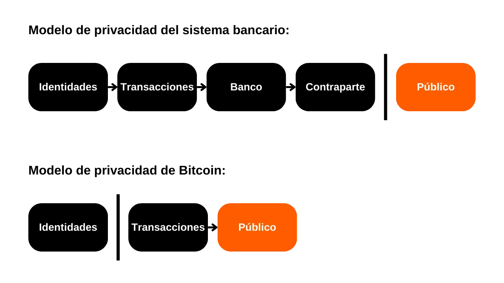
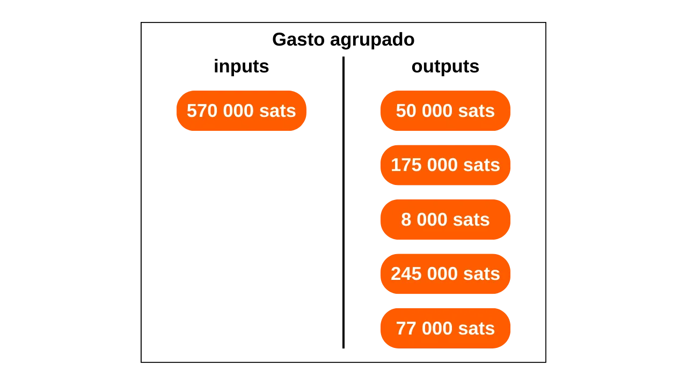
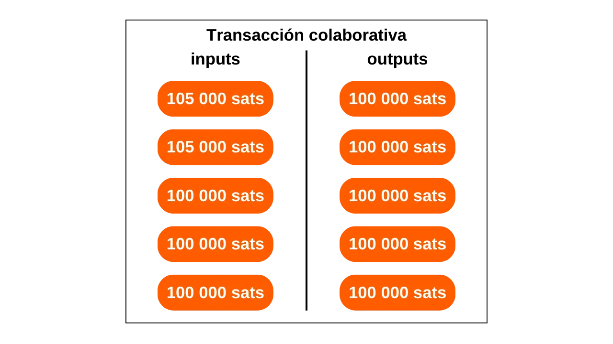
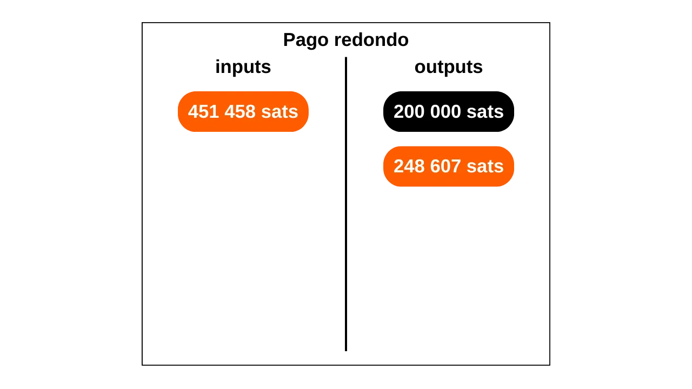
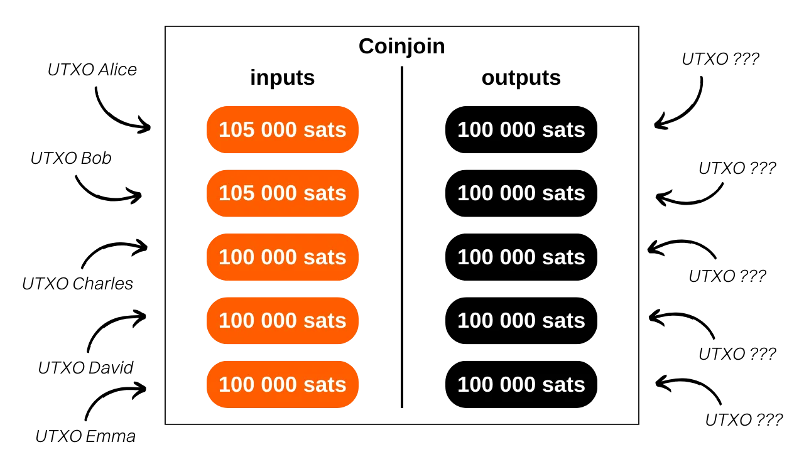

En este artículo, aprenderás los fundamentos teóricos esenciales necesarios para embarcarte en análisis básicos de cadena en Bitcoin y, más importante aún, para entender cómo operan aquellos que te observan. Aunque este artículo no es un tutorial práctico sobre la herramienta OXT (un tema que cubriremos en un tutorial futuro), compila un conjunto de conocimientos cruciales para su uso. Para cada modelo, métrica e indicador presentado, se proporciona un enlace a una transacción de ejemplo en OXT, lo que te permitirá entender mejor su uso y practicar mientras lees.

## Introducción
Una de las funciones del dinero es resolver el problema de la doble coincidencia de deseos. En un sistema basado en el trueque, completar un intercambio requiere no solo encontrar a un individuo que ofrezca un bien que satisfaga mi necesidad, sino también proporcionarles un bien de valor equivalente que satisfaga su propia necesidad. Encontrar este equilibrio resulta complejo. Por eso recurrimos al dinero, que nos permite mover valor tanto en el espacio como en el tiempo.

Para que el dinero resuelva este problema, es esencial que la parte que proporciona un bien o servicio esté convencida de su capacidad para gastar esa suma más adelante. Así, cualquier individuo racional dispuesto a aceptar una pieza de dinero, ya sea digital o física, se asegurará de que cumpla con dos criterios fundamentales:
- La moneda debe estar intacta y ser auténtica;
- y no debe haber sido gastada doblemente.

Si usamos dinero físico, es la primera característica la más compleja de afirmar. En diferentes períodos de la historia, la integridad de las monedas metálicas a menudo ha sido afectada por prácticas como el recorte o la perforación. Por ejemplo, durante la antigua Roma, era común que los ciudadanos rasparan los bordes de las monedas de oro para recolectar un poco de metal precioso, mientras las conservaban para futuras transacciones. Esto es notablemente por qué más tarde se estamparon ranuras en el borde de las monedas. La autenticidad también es una característica difícil de verificar en un medio monetario físico. Hoy en día, las técnicas para combatir la falsificación son cada vez más complejas, obligando a los comerciantes a invertir en sistemas de verificación costosos.

Por otro lado, debido a su naturaleza, el doble gasto no es un problema para las monedas físicas. Si te doy un billete de €10, este irrevocablemente deja mi posesión para entrar en la tuya, excluyendo así cualquier posibilidad de gasto múltiple de las unidades monetarias que representa.
Para la moneda digital, el desafío es diferente. Asegurar la autenticidad e integridad de una moneda es a menudo más simple, pero asegurar la ausencia de doble gasto es más complejo. Todo bien digital es esencialmente información. A diferencia de los bienes físicos, la información no se divide durante los intercambios sino que se propaga multiplicándose. Por ejemplo, si te envío un documento por correo electrónico, este luego se duplica. Por tu parte, no puedes verificar con certeza que he eliminado el documento original.

La única forma de evitar esta duplicación de un bien digital es estar al tanto de todos los intercambios en el sistema. De esta manera, se puede saber quién posee qué y actualizar las cuentas de todos en función de las transacciones realizadas. Esto es lo que se hace, por ejemplo, con el dinero scriptural. Cuando pagas €10 a un comerciante con tarjeta de crédito, el banco anota este intercambio y actualiza el libro mayor.

En Bitcoin, la prevención del doble gasto se hace de la misma manera. Busca confirmar la ausencia de una transacción que ya haya gastado las monedas en cuestión. Si estas nunca han sido utilizadas, entonces podemos estar seguros de que no ocurrirá un doble gasto. Esta es la famosa frase de Satoshi Nakamoto en el White Paper: "*La única forma de confirmar la ausencia de una transacción es estar al tanto de todas las transacciones.*"
A diferencia del modelo bancario, en Bitcoin, no deseamos tener que confiar en una entidad central. Por lo tanto, todos los usuarios deben poder confirmar esta ausencia de doble gasto, sin depender de un tercero. Así, todos deben estar al tanto de todas las transacciones de Bitcoin.

Es precisamente esta difusión pública de información la que complica la protección de la privacidad en Bitcoin. En el sistema bancario tradicional, en teoría, solo la institución financiera está al tanto de las transacciones realizadas. Sin embargo, en Bitcoin, todos los usuarios están informados de todas las transacciones, a través de sus respectivos nodos.

Debido a esta restricción en la difusión, el modelo de privacidad de Bitcoin difiere del sistema bancario. En este último, las transacciones están asociadas con la identidad del usuario, pero el flujo de información se corta entre el tercero de confianza y el público. En otras palabras, tu banquero sabe que compras tu baguette todas las mañanas en la panadería local, pero tu vecino no está al tanto de todas estas transacciones. En el caso de Bitcoin, dado que el flujo de información no puede interrumpirse entre las transacciones y el dominio público, el modelo de privacidad se basa en separar la identidad del usuario de las transacciones en sí mismas.

*Diagrama inspirado por Satoshi Nakamoto en el White Paper: Bitcoin: A Peer-to-Peer Electronic Cash System, sección 10 "Privacidad".*
Dado que las transacciones de Bitcoin se hacen públicas, se vuelve posible establecer vínculos entre ellas para deducir información sobre las partes involucradas. Esta actividad incluso constituye una especialidad en sí misma, comúnmente llamada "análisis de cadena". En este artículo, te invito a explorar los fundamentos del análisis de cadena para entender cómo se rastrean tus bitcoins.

La mayoría de las empresas especializadas en análisis de cadena operan como cajas negras y no revelan sus metodologías. Por lo tanto, es difícil obtener información sobre esta práctica. Para la redacción de este artículo, me basé principalmente en los pocos recursos abiertos disponibles:
- La mayor parte de mi artículo se extrae de la serie de cuatro artículos llamada: [Understanding Bitcoin Privacy with OXT](https://medium.com/oxt-research/understanding-bitcoin-privacy-with-oxt-part-1-4-8177a40a5923), producida por Samourai Wallet en 2021;
- También utilicé varios informes de [OXT Research](https://medium.com/oxt-research), así como [su herramienta gratuita de análisis de cadena](https://oxt.me/);
- Más ampliamente, mi conocimiento proviene de los diferentes tweets y contenidos de [@LaurentMT](https://twitter.com/LaurentMT) y [@ErgoBTC](https://twitter.com/ErgoBTC);
- También me inspiré en [Space Kek #19](https://podcasters.spotify.com/pod/show/decouvrebitcoin/episodes/SpaceKek-19---Analyse-de-chane--anonsets-et-entropie-e1vfuji) en el que participé junto a [@louneskmt](https://twitter.com/louneskmt), [@TheoPantamis](https://twitter.com/TheoPantamis), [@Sosthene___](https://twitter.com/Sosthene___), y [@LaurentMT](https://twitter.com/LaurentMT).

Me gustaría agradecer a sus autores, desarrolladores y productores. Sin sus diversos contenidos y software, este artículo no existiría. También agradezco a los revisores que meticulosamente corrigieron este texto y me honraron con su asesoramiento experto:
- [Gilles Cadignan](https://twitter.com/gillesCadignan);
- [Ludovic Lars](https://twitter.com/lugaxker) ([https://viresinnumeris.fr/](https://viresinnumeris.fr/)).
*Para tu información, he añadido un miniglosario técnico al final del artículo para definir ciertos términos. Si ves una palabra que no entiendes con un asterisco, su definición está al final de la página.*

## ¿Qué es el análisis de cadena?
El análisis de cadena es una práctica que abarca todos los métodos para rastrear flujos de Bitcoin en la blockchain. Generalmente, el análisis de cadena se basa en observar características en muestras de transacciones anteriores. Luego implica identificar estas mismas características en una transacción que se desea analizar y deducir interpretaciones plausibles. Este método de resolución de problemas, basado en un enfoque práctico para encontrar una solución suficientemente buena, es lo que se llama una heurística.

Para simplificar, el análisis de cadena se realiza en dos pasos principales:
1. La identificación de características conocidas;
2. La deducción de hipótesis.

Uno de los objetivos del análisis de cadena es agrupar diversas actividades en Bitcoin para determinar la singularidad del usuario que las llevó a cabo. Posteriormente, será posible intentar vincular este conjunto de actividades a una identidad real.

Recuerda mi introducción. Expliqué por qué el modelo de privacidad de Bitcoin originalmente se basaba en separar la identidad del usuario de sus transacciones. Por lo tanto, sería tentador pensar que el análisis de cadena es innecesario, ya que incluso si uno logra agrupar actividades en la cadena, no se pueden asociar con una identidad real. Teóricamente, esta afirmación es precisa. Los pares de claves criptográficas se utilizan para establecer condiciones sobre los UTXOs. Por esencia, estos pares de claves no revelan ninguna información sobre la identidad de sus titulares. Así, incluso si uno tiene éxito en agrupar actividades asociadas con diferentes pares de claves, esto no nos dice nada sobre la entidad detrás de estas actividades.

Sin embargo, la realidad práctica es mucho más compleja. Hay una multitud de comportamientos que arriesgan vincular una identidad real con una actividad en la cadena. En análisis, esto se llama un punto de entrada, y hay muchos de ellos. El más común, por supuesto, es el KYC (Conoce a Tu Cliente). Si retiras tus bitcoins de una plataforma regulada a una de tus direcciones de recepción personales, entonces algunas personas pueden vincular tu identidad a esta dirección. Más ampliamente, un punto de entrada puede ser cualquier forma de interacción entre tu vida real y una transacción de Bitcoin. Por ejemplo, si publicas una dirección de recepción en tus redes sociales, esto puede ser un punto de entrada para el análisis. Si haces un pago en bitcoins a tu panadero, ellos pueden asociar tu rostro (que es parte de tu identidad) con una dirección de Bitcoin.
Estos puntos de entrada son casi inevitables al usar Bitcoin. Aunque uno podría buscar limitar su alcance, permanecerán presentes. Por eso es crucial combinar métodos destinados a preservar tu privacidad. Si bien mantener una separación aceptable entre tu identidad real y tus transacciones es un enfoque loable, sigue siendo insuficiente. De hecho, si todas tus actividades en la cadena pueden agruparse, entonces incluso el más pequeño punto de entrada podría comprometer la única capa de privacidad que habías establecido.
Por lo tanto, también es necesario abordar el análisis de cadena en nuestro uso de Bitcoin. Al hacerlo, podemos minimizar la agregación de nuestras actividades y limitar el impacto de un punto de entrada en nuestra privacidad. Precisamente, para contrarrestar mejor el análisis de cadena, ¿qué mejor enfoque que familiarizarse con los métodos utilizados en el análisis de cadena? Si quieres saber cómo mejorar tu privacidad en Bitcoin, debes entender estos métodos. Esto te permitirá comprender mejor técnicas como [Coinjoin](https://planb.network/es/tutorials/privacy/coinjoin-samourai-wallet) o [Payjoin](https://planb.network/es/tutorials/privacy/payjoin), y reducir los errores que podrías cometer.
En esto, podemos trazar una analogía con la criptografía y el criptoanálisis. Un buen criptógrafo es, ante todo, un buen criptoanalista. Para imaginar un nuevo algoritmo de cifrado, uno debe saber a qué ataques se enfrentará, y también estudiar por qué se rompieron los algoritmos anteriores. El mismo principio se aplica a la privacidad en Bitcoin. Entender los métodos del análisis de cadena es la clave para protegerse contra él. Por eso te ofrezco este artículo.

Es crucial entender que el análisis de cadena no es una ciencia exacta. Se basa en heurísticas derivadas de observaciones previas o interpretaciones lógicas. Estas reglas permiten resultados bastante fiables, pero nunca con precisión absoluta. En otras palabras, el análisis de cadena siempre implica una dimensión de probabilidad en las conclusiones obtenidas. Podemos estimar con más o menos certeza que dos direcciones pertenecen a la misma entidad, pero la certeza total siempre estará fuera de nuestro alcance.

El objetivo completo del análisis de cadena radica precisamente en la agregación de varias heurísticas para minimizar el riesgo de error. Es, de cierta manera, una acumulación de evidencia que nos permite acercarnos a la realidad.

Estas famosas heurísticas se pueden agrupar en diferentes categorías que detallaremos juntos:
- Patrones de transacción (o modelos de transacción);
- Heurísticas internas a la transacción;
- Heurísticas externas a la transacción.

Cabe señalar que las primeras dos heurísticas sobre Bitcoin fueron formuladas por el propio Satoshi Nakamoto. Las discute en la parte 10 del Libro Blanco. Como veremos más adelante, es interesante observar que estas dos heurísticas todavía mantienen una preeminencia en el análisis de cadena hoy en día. Estas son:
- la Heurística de Propiedad de Entrada Común (CIOH, por sus siglas en inglés);
- y la reutilización de direcciones.

Exploremos juntos las características observables y las interpretaciones que se pueden extraer para realizar un análisis.

## Patrones de transacción (o modelos de transacción)
Un patrón de transacción es simplemente un modelo de transacción típico que se puede encontrar en la blockchain, cuya interpretación es probablemente conocida. Al estudiar patrones, nos centraremos en una sola transacción que analizaremos a un alto nivel. En otras palabras, solo miraremos el número de entradas y salidas, sin detenernos en sus detalles más específicos o su entorno. A partir del modelo observado, podremos interpretar la naturaleza de la transacción. Luego buscaremos características sobre su estructura y deduciremos una interpretación.

### El envío simple (o pago simple)
Este modelo se caracteriza por el consumo de uno o más UTXOs como entrada y la producción de dos UTXOs como salida.

La interpretación de este modelo es que estamos ante una transacción de envío o pago. El usuario ha consumido sus propios UTXOs como entrada para satisfacer en salida un UTXO de pago y un UTXO de cambio (cambio que regresa al mismo usuario). Por lo tanto, sabemos que el usuario observado probablemente ya no posee uno de los dos UTXOs en salida (el de pago), pero aún está en posesión del otro UTXO (el de cambio).
En este punto, es imposible para nosotros especificar qué salida representa cuál UTXO, ya que ese no es el objetivo de este modelo. Podremos hacerlo apoyándonos en las heurísticas que estudiaremos en la siguiente parte. En esta etapa, nuestro objetivo se limita a identificar la naturaleza de la transacción en cuestión, que es, en este caso, un envío simple.

Por ejemplo, aquí hay una transacción de Bitcoin que adopta el patrón de envío simple:
### Barrido ("sweep" en inglés)
Este modelo se caracteriza por el consumo de un único UTXO como entrada y la producción de un único UTXO como salida.

La interpretación de este modelo es que estamos ante una auto-transferencia. El usuario ha transferido sus bitcoins a sí mismo, a otra dirección que posee. De hecho, dado que no hay cambio en la transacción, es muy improbable que estemos tratando con un pago. Entonces sabemos que el usuario observado probablemente aún esté en posesión de este UTXO.

Por ejemplo, aquí hay una transacción de Bitcoin que adopta el patrón de barrido:
[35f1072a0fda5ae106efb4fda871ab40e1f8023c6c47f396441ad4b995ea693d](https://oxt.me/transaction/35f1072a0fda5ae106efb4fda871ab40e1f8023c6c47f396441ad4b995ea693d)

Sin embargo, este tipo de patrón también puede revelar una auto-transferencia a una cuenta de intercambio (plataforma de intercambio de criptomonedas). Será el estudio de direcciones conocidas y el contexto de la transacción lo que nos permitirá saber si es un barrido a una billetera de auto-custodia o una retirada a una plataforma.

### Consolidación
Este modelo se caracteriza por el consumo de varios UTXOs como entrada y la producción de un único UTXO como salida.

La interpretación de este modelo es que estamos ante una consolidación. Esta es una práctica común entre los usuarios de Bitcoin, con el objetivo de fusionar varios UTXOs en anticipación a un posible aumento en las tarifas de transacción. Al realizar esta operación durante un período en que las tarifas son bajas, es posible ahorrar en tarifas futuras.

Podemos deducir que el usuario detrás de esta transacción probablemente estaba en posesión de todos los UTXOs en entrada y aún está en posesión del UTXO en salida. Por lo tanto, seguramente es una auto-transferencia.

Al igual que el barrido, este tipo de patrón también puede revelar una auto-transferencia a una cuenta de intercambio. Será el estudio de direcciones conocidas y el contexto de la transacción lo que nos permitirá saber si es una consolidación a una billetera de auto-custodia o una retirada a una plataforma.

Por ejemplo, aquí hay una transacción de Bitcoin que adopta el patrón de consolidación:
[77c16914211e237a9bd51a7ce0b1a7368631caed515fe51b081d220590589e94](https://oxt.me/transaction/77c16914211e237a9bd51a7ce0b1a7368631caed515fe51b081d220590589e94)
### El Modelo de Gasto por Lotes
Este modelo se caracteriza por el consumo de unos pocos UTXOs como entrada (a menudo solo uno) y la producción de muchos UTXOs como salida.

La interpretación de este modelo es que estamos en presencia de un gasto por lotes. Esta es una práctica que probablemente revela una actividad económica significativa, como un intercambio, por ejemplo. El gasto por lotes permite a estas entidades ahorrar en comisiones al combinar sus gastos en una única transacción.

Podemos deducir que la entrada de UTXO proviene de una empresa con actividad económica significativa y que los UTXOs de salida se dispersarán. Algunos pertenecerán a los clientes de la empresa. Otros pueden ir hacia empresas asociadas. Finalmente, ciertamente habrá un cambio que regresa a la empresa emisora.

Por ejemplo, aquí hay una transacción de Bitcoin que adopta el patrón de gasto por lotes:
[8a7288758b6e5d550897beedd13c70bcbaba8709af01a7dbcc1f574b89176b43](https://oxt.me/transaction/8a7288758b6e5d550897beedd13c70bcbaba8709af01a7dbcc1f574b89176b43)

### Transacciones Específicas del Protocolo
Entre los patrones de transacción, también podemos identificar modelos que revelan el uso de un protocolo específico. Por ejemplo, los coinjoins de Whirlpool tendrán una estructura fácilmente identificable que permite diferenciarlos de otras transacciones clásicas.

El análisis de este patrón sugiere que probablemente estamos en presencia de una transacción colaborativa. También es posible observar un coinjoin. Si esta última hipótesis resulta ser precisa, entonces el número de salidas podría proporcionarnos una estimación aproximada del número de participantes.

Por ejemplo, aquí hay una transacción de Bitcoin que adopta el patrón del tipo de transacción colaborativa coinjoin:
[00601af905bede31086d9b1b79ee8399bd60c97e9c5bba197bdebeee028b9bea](https://oxt.me/transaction/00601af905bede31086d9b1b79ee8399bd60c97e9c5bba197bdebeee028b9bea)

Existen muchos otros protocolos que tienen sus propias estructuras específicas. Así, podríamos distinguir transacciones del tipo Wabisabi o transacciones Stamps, por ejemplo.

## Heurísticas de Transacción Internas
Una heurística interna es una característica específica identificada dentro de una transacción misma, sin necesidad de examinar su entorno, que nos permite hacer deducciones. A diferencia de los patrones que se centran en la estructura general de la transacción, las heurísticas internas se basan en el conjunto de datos extraíbles. Esto incluye:
- Las cantidades de diferentes UTXOs tanto entrantes como salientes;
- Todo lo relacionado con scripts: direcciones de recepción, versiones, locktimes...

Generalmente, este tipo de heurística nos permite identificar el cambio en una transacción específica. Al hacerlo, podemos continuar rastreando una entidad a través de múltiples transacciones diferentes.
Una vez más, les recuerdo que estas heurísticas no son absolutamente precisas. Tomadas individualmente, solo nos permiten identificar escenarios plausibles. Es la acumulación de varias heurísticas lo que contribuye a reducir la incertidumbre, sin nunca eliminarla por completo.

### Similitudes Internas
Esta heurística implica estudiar las similitudes entre las entradas y salidas de la misma transacción. Si se observa la misma característica en las entradas y en solo una de las salidas de la transacción, entonces es probable que esta salida constituya el cambio.

La característica más obvia es la reutilización de una dirección de recepción en la misma transacción.

Esta heurística deja poco margen para la duda. A menos que su clave privada haya sido comprometida, la misma dirección de recepción revela inevitablemente la actividad de un único usuario. La interpretación que sigue es que el cambio de la transacción es la salida con la misma dirección que la entrada. Esto nos permite continuar rastreando al individuo a partir de este cambio.

Por ejemplo, aquí hay una transacción donde esta heurística probablemente se pueda aplicar:
[54364146665bfc453a55eae4bfb8fdf7c721d02cb96aadc480c8b16bdeb8d6d0](https://oxt.me/transaction/54364146665bfc453a55eae4bfb8fdf7c721d02cb96aadc480c8b16bdeb8d6d0)

Estas similitudes entre las entradas y salidas no se detienen en la reutilización de direcciones. Cualquier semejanza en el uso de scripts puede permitir la aplicación de una heurística. Por ejemplo, a veces se puede observar la misma versión entre una entrada y una de las salidas de la transacción.

En este diagrama, podemos ver que la entrada número 0 desbloquea un script P2WPKH (SegWit V0 que comienza con "bc1q"). La salida número 0 utiliza el mismo tipo de script. Sin embargo, la salida número 1 utiliza un script P2TR (SegWit V1 que comienza con "bc1p"). La interpretación de esta característica es que es probable que la dirección con la misma versión que la entrada sea la dirección de cambio. Por lo tanto, todavía pertenecería al mismo usuario.
Aquí hay una transacción donde esta heurística probablemente se pueda aplicar:
[db07516288771ce5d0a06b275962ec4af1b74500739f168e5800cbcb0e9dd578](https://oxt.me/transaction/db07516288771ce5d0a06b275962ec4af1b74500739f168e5800cbcb0e9dd578)

En esta transacción, podemos ver que la entrada número 0 y la salida número 1 usan scripts P2WPKH (SegWit V0), mientras que la salida número 0 utiliza un tipo de script diferente, P2PKH (Legacy).

### Pagos de Números Redondos
Otra heurística interna que puede ayudarnos a identificar el cambio es la de los números redondos. Generalmente, cuando nos enfrentamos a un patrón de pago simple (1 entrada y 2 salidas), si una de las salidas gasta una cantidad redonda, entonces representa el pago.

Por proceso de eliminación, si una salida representa el pago, la otra representa el cambio. Por lo tanto, podemos interpretar que es probable que el usuario en la entrada todavía posea la salida identificada como siendo el cambio.
Debe tenerse en cuenta que esta heurística no siempre es aplicable, ya que la mayoría de los pagos todavía se realizan en unidades de moneda fiat. De hecho, cuando un comerciante en Francia acepta bitcoin, generalmente, no muestran precios estables en sats. Preferirían optar por una conversión entre el precio en euros y la cantidad en bitcoins a pagar. Por lo tanto, no debería haber un número redondo en el resultado de la transacción. Sin embargo, un analista podría intentar realizar esta conversión teniendo en cuenta el tipo de cambio vigente cuando la transacción fue transmitida en la red.
Si algún día, bitcoin se convierte en la unidad de cuenta preferida en nuestros intercambios, esta heurística podría volverse aún más útil para el análisis.

Por ejemplo, aquí hay una transacción donde esta heurística probablemente se pueda aplicar:
### El Gran Gasto

Cuando se detecta una brecha suficientemente grande entre dos salidas de transacción en un modelo de pago simple, se puede estimar que la salida más grande es probablemente el cambio.

Esta heurística de la salida más grande es probablemente la más imprecisa de todas. Si se identifica por sí sola, es bastante débil. Sin embargo, esta característica se puede combinar con otras heurísticas para reducir la incertidumbre de nuestra interpretación.

Por ejemplo, si examinamos una transacción que presenta una salida con una cantidad redonda y otra salida con una cantidad mayor, la aplicación conjunta de la heurística de pagos redondos y la que concierne a la salida más grande nos permite reducir nuestro nivel de incertidumbre.

Por ejemplo, aquí hay una transacción donde esta heurística probablemente se pueda aplicar:
[b79d8f8e4756d34bbb26c659ab88314c220834c7a8b781c047a3916b56d14dcf](https://oxt.me/transaction/b79d8f8e4756d34bbb26c659ab88314c220834c7a8b781c047a3916b56d14dcf)

## Heurísticas Externas a la Transacción
El estudio de las heurísticas externas es el análisis de similitudes, patrones y características de ciertos elementos que no son inherentes a la transacción misma. En otras palabras, si anteriormente nos limitábamos a explotar elementos intrínsecos a la transacción con heurísticas internas, ahora estamos expandiendo nuestro campo de análisis al entorno de la transacción gracias a las heurísticas externas.

### Reutilización de Direcciones
Esta es una de las heurísticas más conocidas entre los Bitcoiners. La reutilización de direcciones permite establecer un vínculo entre diferentes transacciones y diferentes UTXOs. Se observa cuando una dirección de recepción de Bitcoin se utiliza varias veces.

La interpretación de la reutilización de direcciones es que todos los UTXOs bloqueados en esta dirección pertenecen (o han pertenecido) a la misma entidad. Esta heurística deja poco margen para la incertidumbre. Cuando se identifica, la interpretación que sigue tiene una gran posibilidad de corresponder a la realidad.
Como se explicó en la introducción, esta heurística fue descubierta por el propio Satoshi Nakamoto. En el White Paper, menciona específicamente una solución para evitar que los usuarios la produzcan, que es simplemente usar una dirección fresca para cada nueva transacción: "*Como un cortafuegos adicional, un nuevo par de claves podría ser utilizado para cada transacción para mantenerlas no vinculadas a un propietario común.*"

Por ejemplo, aquí hay una dirección reutilizada en múltiples transacciones:
[bc1qqtmeu0eyvem9a85l3sghuhral8tk0ar7m4a0a0](https://oxt.me/address/bc1qqtmeu0eyvem9a85l3sghuhral8tk0ar7m4a0a0)

### La Similitud de Scripts y Huellas Digitales de Carteras
Más allá de la reutilización de direcciones, existen muchas otras heurísticas que pueden vincular acciones a la misma billetera o a un grupo de direcciones.
En primer lugar, un analista puede utilizar similitudes en el uso de scripts. Por ejemplo, ciertos scripts minoritarios como multisig pueden ser más fácilmente identificados que los scripts SegWit V0. Cuanto mayor sea el grupo en el que nos ocultamos, más difícil es detectarnos. Esto es notablemente por qué, en el protocolo Coinjoin Whirlpool, todos los participantes usan exactamente el mismo tipo de script.

Más ampliamente, un analista también puede centrarse en las huellas características de una billetera. Estos son procesos específicos de un uso que uno podría buscar identificar para explotarlos como heurísticas de rastreo. En otras palabras, si uno observa una acumulación de las mismas características internas en transacciones atribuidas a la entidad rastreada, se puede intentar identificar estas mismas características en otras transacciones.

Por ejemplo, se puede identificar que el usuario rastreado envía sistemáticamente su cambio a direcciones P2TR* (bc1p…). Si este proceso se repite, puede utilizarse como una heurística para la continuación de nuestro análisis. Otras huellas también pueden ser utilizadas, como el orden de los UTXOs, la colocación del cambio en las salidas, la señalización de RBF (Replace-by-Fee), o incluso, el número de versión y el locktime.
Como [@LaurentMT](https://twitter.com/LaurentMT) especifica en [Space Kek #19](https://podcasters.spotify.com/pod/show/decouvrebitcoin/episodes/SpaceKek-19---Analyse-de-chane--anonsets-et-entropie-e1vfuji) (un podcast francófono), la utilidad de las huellas de billetera en el análisis de cadena está aumentando significativamente con el tiempo. De hecho, el creciente número de tipos de script y la implementación cada vez más gradual de estas nuevas características por parte del software de billetera acentúan las diferencias. Incluso sucede que se puede identificar con precisión el software utilizado por la entidad rastreada. Por lo tanto, es importante entender que el estudio de la huella de una billetera es particularmente relevante para transacciones recientes, más que para aquellas iniciadas a principios de la década de 2010.
Para resumir, una huella puede ser cualquier práctica específica, realizada automáticamente por la billetera o manualmente por el usuario, que se puede encontrar en otras transacciones para asistir en nuestro análisis.

### La CIOH
La CIOH, por sus siglas en inglés "Common Input Ownership Heuristic," que podría traducirse como "heurística de propiedad común de entradas" o "heurística de co-gasto," es una heurística que afirma que cuando una transacción tiene múltiples entradas, estas probablemente provienen de una sola entidad. Consecuentemente, su propiedad es común.

Para aplicar la CIOH, primero se observa una transacción que tiene múltiples entradas. Esto podría ser dos entradas, así como treinta entradas. Una vez que se detecta esta característica, se verifica si la transacción no encaja en un patrón conocido. Por ejemplo, si tiene 5 entradas con cantidades aproximadamente iguales y 5 salidas con exactamente la misma cantidad, sabemos que es la estructura de un Coinjoin Whirlpool. Por lo tanto, la CIOH no se puede aplicar.

Sin embargo, si la transacción no encaja en ningún patrón conocido de transacción colaborativa, entonces se puede interpretar que todas las entradas probablemente provienen de la misma entidad. Esto puede ser muy útil para expandir un grupo ya conocido o para continuar el rastreo.

El CIOH fue descubierto por Satoshi Nakamoto. Lo discute en la parte 10 del White Paper: "*[...] el enlace es inevitable con transacciones de múltiples entradas, que necesariamente revelan que sus entradas pertenecían al mismo propietario. El riesgo es que si se revela el propietario de una clave, los enlaces pueden revelar otras transacciones que pertenecieron al mismo propietario.*" Es particularmente fascinante notar que Satoshi Nakamoto, incluso antes del lanzamiento oficial de Bitcoin, ya había identificado las dos principales vulnerabilidades de privacidad para los usuarios, a saber, el CIOH y la reutilización de direcciones. Tal previsión es bastante notable, ya que estas dos heurísticas permanecen, incluso hoy, las más útiles en el análisis de cadena.

### Datos Fuera de la Cadena
Obviamente, el análisis de cadena no se limita a datos en cadena. Cualquier dato de un análisis previo o accesible en Internet también puede ser utilizado para refinar un análisis.

Por ejemplo, si se observa que las transacciones rastreadas se emiten sistemáticamente desde el mismo nodo de Bitcoin y se puede identificar su dirección IP, podría ser posible detectar otras transacciones de la misma entidad.

El analista también tiene la opción de confiar en análisis previamente hechos de código abierto, o en sus propios análisis anteriores. Quizás se encuentre una salida que apunte a un clúster de direcciones que ya había sido identificado. A veces, también es posible confiar en salidas que apuntan a un exchange, siendo las direcciones de estas plataformas generalmente conocidas.

De manera similar, se puede realizar un análisis por eliminación. Por ejemplo, si durante el análisis de una transacción con dos salidas, una de ellas está vinculada a un clúster de direcciones conocido pero distinto de la entidad que se está rastreando, entonces se puede interpretar que la otra salida probablemente representa el cambio.

El análisis de cadena también incluye una parte de OSINT (Inteligencia de Fuentes Abiertas) que es un poco más generalista con búsquedas en internet. Es por esto que se aconseja no publicar direcciones de recepción directamente en redes sociales o en un sitio web, ya sea bajo un seudónimo o no.

### Modelos Temporales
Uno podría no pensar inmediatamente en ello, pero ciertos comportamientos humanos son reconocibles en cadena. ¡Lo más útil en un estudio es tu patrón de sueño! Sí, cuando estás durmiendo, presumiblemente no estás emitiendo transacciones de Bitcoin. Dado que generalmente duermes aproximadamente a las mismas horas, es común usar análisis temporales en el análisis en cadena. Simplemente implica registrar los momentos en los que las transacciones de una entidad dada se emiten a la red de Bitcoin. Analizar estos patrones temporales nos permite deducir numerosas piezas de información.
En primer lugar, un análisis temporal a veces puede identificar la naturaleza de la entidad que se está rastreando. Si se observa que las transacciones se emiten consistentemente durante 24 horas, esto puede indicar una fuerte actividad económica. La entidad detrás de estas transacciones probablemente es un negocio, potencialmente internacional, y quizás con procedimientos automatizados internamente.

Por ejemplo, había reconocido este patrón hace unas semanas mientras analizaba una transacción que había asignado erróneamente 19 bitcoins en comisiones. Un simple análisis temporal me había permitido hipotetizar que estábamos tratando con un servicio automatizado, y por lo tanto probablemente una gran entidad como un exchange: https://twitter.com/Loic_Pandul/status/1701127409712452072

De hecho, unos días después, se descubrió que los fondos pertenecían a PayPal, a través del exchange Paxos.

Por el contrario, si se ve que el patrón temporal está más bien distribuido durante 16 horas específicas, entonces se puede estimar que estamos tratando con un usuario individual, o quizás un negocio local dependiendo de los volúmenes intercambiados.

Más allá de la naturaleza de la entidad observada, el patrón temporal también puede darnos una ubicación aproximada del usuario. Así podemos correlacionar otras transacciones, y usar el timestamp de estas como una heurística adicional que se puede añadir a nuestro análisis.
Por ejemplo, en la dirección que se ha reutilizado varias veces que mencioné anteriormente, se puede observar que las transacciones, ya sean entrantes o salientes, están concentradas en un intervalo de 13 horas. 
*Crédito: [https://oxt.me/address/bc1qqtmeu0eyvem9a85l3sghuhral8tk0ar7m4a0a0](https://oxt.me/address/bc1qqtmeu0eyvem9a85l3sghuhral8tk0ar7m4a0a0)*

Este intervalo probablemente corresponde a Europa, África o Medio Oriente. Por lo tanto, se puede interpretar que el usuario detrás de estas transacciones vive allí.

En un registro diferente, también es un análisis temporal de este tipo el que permitió la hipótesis de que Satoshi Nakamoto no operaba desde Japón, sino de hecho desde Estados Unidos: [https://medium.com/@insearchofsatoshi/the-time-zones-of-satoshi-nakamoto-aa40f035178f](https://medium.com/@insearchofsatoshi/the-time-zones-of-satoshi-nakamoto-aa40f035178f)

### El Análisis de Volúmenes
Otra heurística externa que se puede utilizar es el análisis de volúmenes de comercio. Basándose en las cantidades presentes en cada transacción atribuida a una entidad, esta información puede utilizarse como una heurística adicional para el resto del análisis.
Esta heurística es obviamente bastante débil, pero puede ayudar a reducir la incertidumbre cuando se añade a otras heurísticas.

## ¿Cómo protegerse contra el análisis de cadena?
Como usuario de Bitcoin, tienes el derecho de proteger tu privacidad. Esto se deriva de tus derechos naturales a poseer y disponer de ti mismo, que son inherentes a cada individuo, independientemente de cualquier restricción legislativa.

Este derecho natural a proteger la privacidad de uno también se convierte en un derecho-reclamo, consagrado en el Artículo 12 de la Declaración Universal de Derechos Humanos, que establece que "*Nadie será objeto de injerencias arbitrarias en su privacidad, familia, hogar o correspondencia, ni de ataques a su honor y reputación. Toda persona tiene derecho a la protección de la ley contra tales injerencias o ataques.*".

Sin embargo, el negocio principal de las empresas especializadas en análisis de cadena consiste precisamente en intrusión en tu esfera privada, comprometiendo así la confidencialidad de tu correspondencia. Aunque uno podría esperar que, de acuerdo con el derecho-reclamo mencionado anteriormente, los estados defenderían vigorosamente nuestra privacidad, no solo descuidan hacerlo, sino que también financian sustancialmente la financiación de estas empresas de análisis. También sería en vano esperar apoyo de las asociaciones del sector, que parecen dispuestas a hacer todas las concesiones frente al legislador.

De facto, este derecho-reclamo a la privacidad en Bitcoin no existe. Por lo tanto, depende de ti, el usuario, afirmar tu derecho natural y proteger la confidencialidad de tu correspondencia. Esto implica adoptar diversas técnicas y prácticas de uso, que te permitirán prevenir o engañar las heurísticas utilizadas para el análisis de cadena.

### Evitando caer en las heurísticas
En primer lugar, antes de considerar métodos más radicales, es aconsejable limitar nuestra exposición a las heurísticas utilizadas para el análisis de cadena tanto como sea posible. Como se mencionó anteriormente, las dos heurísticas más poderosas son la reutilización de direcciones y el COINJOIN.

El principio básico para asegurar tu privacidad en Bitcoin radica en usar una nueva dirección limpia para cada transacción entrante a tu billetera. La reutilización de direcciones es verdaderamente la principal amenaza para la confidencialidad en Bitcoin.
Para un usuario individual, generar una nueva dirección para cada pago entrante es muy simple. Las carteras modernas hacen esto automáticamente tan pronto como haces clic en "Recibir". Por lo tanto, si le das incluso la mínima importancia a la privacidad de tus transacciones, usar direcciones nuevas representa el mínimo esencial. Si alguna vez necesitas un punto de contacto estático en internet, en lugar de poner una dirección de recepción, puedes usar soluciones [como PayNym que implementa BIP47](https://planb.network/es/tutorials/privacy/paynym-bip47). A continuación, si quieres actuar contra el análisis de cadena, evita fusionar UTXOs en la entrada de una transacción. Como mínimo, si realmente necesitas fusionar, prefiere UTXOs que tengan la misma fuente. Esta recomendación implica tener una buena gestión de tus UTXOs. Al comprar tus bitcoins, prefiere transferencias que involucren grandes cantidades para maximizar el número de pagos que puedes hacer sin tener que fusionar. También te aconsejo etiquetar tus UTXOs en tu software para identificar su origen y evitar fusionar de fuentes distintas.

Más ampliamente, para todas las otras heurísticas, necesitas conocerlas para intentar no caer en ellas:
- No uses scripts minoritarios. Prefiere SegWit V0 o posiblemente SegWit V1;
- No hagas pagos en números redondos. Por ejemplo, si necesitas enviar 100k sats a un amigo, envíales 114,486 sats. Ellos te comprarán una bebida a cambio;
- Intenta no tener siempre un cambio que sea mucho mayor que el pago;
- No publiques tus direcciones de recepción en redes sociales;
- Usa tu propio nodo bajo Tor para transmitir tus transacciones;
- Intenta no transmitir siempre tus transacciones de Bitcoin al mismo tiempo…

### Usando herramientas de privacidad
También puedes recurrir a métodos que hacen ambiguo tu uso de Bitcoin para prevenir o engañar al análisis de cadena.

La técnica más popular es seguramente Coinjoin, una estructura de transacción colaborativa que moviliza varios UTXOs de los mismos montos. El objetivo aquí es romper enlaces determinísticos, impidiendo así análisis del presente al pasado y del pasado al presente. Coinjoin permite una negación plausible al ocultar tus monedas dentro de un gran grupo de monedas indistinguibles. Si quieres aprender más sobre Coinjoin, tanto técnicamente como prácticamente, te sugiero que leas estos otros artículos y tutoriales:
- [COINJOIN - SAMOURAI WALLET](https://planb.network/es/tutorials/privacy/coinjoin-samourai-wallet);
- [COINJOIN - SPARROW WALLET](https://planb.network/es/tutorials/privacy/coinjoin-sparrow-wallet);
- [WHIRLPOOL STATS TOOLS - ANONSETS](https://planb.network/es/tutorials/privacy/wst-anonsets).

CoinJoin es una excelente herramienta para crear una negación plausible para las monedas, pero no está optimizado para todas las necesidades de privacidad del usuario. Específicamente, CoinJoin no fue diseñado para convertirse en una herramienta de pago. Es muy rígido sobre los montos intercambiados para perfeccionar la producción de negación plausible. Dado que uno no puede elegir libremente el monto de las salidas de la transacción, CoinJoin no puede ser utilizado para hacer pagos en bitcoins.

Por ejemplo, imagina que quiero pagar mi baguette en bitcoins mientras optimizo mi privacidad. Dada la imposibilidad de seleccionar el monto del UTXO resultante del CoinJoin, me encontraría incapaz de ajustar el monto de mi gasto al precio establecido por el panadero. Por lo tanto, CoinJoin resulta inadecuado para transacciones de pago.
Se han concebido otras herramientas para satisfacer las necesidades de privacidad en casos de uso más específicos. Por ejemplo, tenemos [PayJoin](https://planb.network/es/tutorials/privacy/payjoin), una especie de mini-CoinJoin, que involucra solo a dos participantes y se basa en una estructura que permite realizar un pago.
La singularidad de PayJoin radica en su capacidad para producir una transacción que parece ordinaria, mientras que en realidad es un mini-CoinJoin entre dos usuarios. En esta estructura, el destinatario de la transacción participa entre las entradas junto con el emisor real. Así, el destinatario inserta un pago a sí mismo dentro de la transacción que facilita el pago real.

Por ejemplo, si compras una baguette a tu panadero por 6,000 sats de un UTXO de 10,000 sats, y quieres hacer un PayJoin, tu panadero añadirá un UTXO de 15,000 sats que le pertenece como una entrada a tu transacción original, la cual recuperarán completamente como una salida, para engañar a las heurísticas:

Las tarifas de transacción se omiten para simplificar la comprensión del esquema.

Los objetivos de PayJoin son dobles. En primer lugar, pretende engañar a un observador externo creando un señuelo a través del COH. De hecho, cuando un analista observa esta transacción, pensarán que pueden aplicar el COH, y así presumir una propiedad común de las diferentes entradas. En realidad, esta suposición es incorrecta, ya que una entrada pertenece al emisor, mientras que la otra es propiedad del destinatario. Por lo tanto, PayJoin corrompe el análisis de la cadena al llevar al analista por el camino equivocado.
El segundo objetivo de PayJoin es engañar al analista sobre la cantidad real de la transacción, gracias a la estructura específica de sus salidas. Así, PayJoin se inscribe en el campo de la esteganografía. Permite que la cantidad real de la transacción se oculte dentro de una transacción engañosa.

De hecho, si revisamos nuestro ejemplo de usar PayJoin para comprar una baguette, un observador externo podría pensar que estamos tratando con un pago de 4,000 sats o 21,000 sats. En realidad, el pago por la baguette es de 6,000 sats: 21,000 - 15,000 = 6,000. El valor real del pago, por lo tanto, está oculto dentro de un pago falso que actúa como señuelo para el análisis de la cadena.

Más allá de PayJoin y CoinJoin, hay muchas otras estructuras de transacción de Bitcoin que bloquean el análisis de la cadena o lo engañan. Entre estas, podría mencionar las transacciones [Stonewall](https://planb.network/es/tutorials/privacy/stonewall) y [StonewallX2](https://planb.network/es/tutorials/privacy/stonewall-x2), que permiten hacer un mini Coinjoin flexible o imitar un mini Coinjoin flexible. También hay transacciones [Ricochet](https://planb.network/es/tutorials/privacy/ricochet) que simulan un cambio de propiedad de bitcoins al realizar una multitud de transferencias falsas a uno mismo.

Todas estas herramientas están disponibles en Samourai Wallet en móviles y Sparrow Wallet en PC. Si quieres aprender más sobre estas estructuras de transacción específicas, te aconsejo descubrir mis tutoriales:
- [PAYJOIN](https://planb.network/es/tutorials/privacy/payjoin);
- [PAYJOIN - SAMOURAI WALLET](https://planb.network/es/tutorials/privacy/payjoin-samourai-wallet);
- [PAYJOIN - SPARROW WALLET](https://planb.network/es/tutorials/privacy/payjoin-sparrow-wallet);
- [STONEWALL](https://planb.network/es/tutorials/privacy/stonewall);
- [STONEWALL X2](https://planb.network/es/tutorials/privacy/stonewall-x2);
- [RICOCHET](https://planb.network/es/tutorials/privacy/ricochet).

## Conclusión
El análisis de cadena es una práctica que implica intentar rastrear el flujo de bitcoins en la cadena. Para hacer esto, los analistas buscan patrones y características con el fin de elaborar hipótesis e interpretaciones más o menos plausibles.

La precisión de estas heurísticas varía: algunas proporcionan un grado de certeza más alto que otras, pero ninguna puede afirmar ser infalible. Sin embargo, la acumulación de varias heurísticas convergentes puede mitigar esta duda inherente, aunque sigue siendo imposible eliminarla por completo.
Podemos categorizar estos métodos en tres categorías principales distintas:
- Patrones, enfocados en la estructura general de cada transacción;
- Heurísticas internas, que permiten el examen exhaustivo de todos los detalles de una transacción, sin extenderse a su contexto;
- Heurísticas externas, que abarcan el análisis de la transacción en su entorno, así como cualquier dato externo que pueda proporcionar información.

Como usuario de Bitcoin, es esencial dominar los principios fundamentales del análisis de cadena para contrarrestarlo efectivamente y así proteger tu privacidad.

## Mini-Glosario Técnico:
**P2PKH:** acrónimo de Pay to Public Key Hash. Es un modelo de script estándar utilizado para establecer condiciones de gasto en un UTXO. Permite bloquear bitcoins en un hash de una clave pública, es decir, en una dirección de recepción. Este script está asociado con el estándar Legacy y fue introducido en las primeras versiones de Bitcoin por Satoshi Nakamoto. A diferencia de P2PK, donde la clave pública se incluye explícitamente en el script, P2PKH utiliza una huella criptográfica de la clave pública, con algunos metadatos, también llamada "dirección de recepción". Este script incluye el hash RIPEMD160 del SHA256 de la clave pública y estipula que, para acceder a los fondos, el destinatario debe proporcionar una clave pública que coincida con este hash, así como una firma digital válida generada a partir de la clave privada asociada. Las direcciones P2PKH se codifican utilizando el formato Base58Check, lo que les otorga resistencia a errores tipográficos mediante el uso de un checksum. Estas direcciones siempre comienzan con el número 1.
**P2TR:** acrónimo de Pay to Taproot ("pagar a la raíz"). Es un modelo de script estándar utilizado para establecer condiciones de gasto en un UTXO. P2TR fue introducido con la implementación de Taproot en noviembre de 2021. Utiliza el protocolo Schnorr para agregar claves criptográficas, así como árboles Merkle para scripts alternativos, conocidos como MAST (Merkelized Alternative Script Tree). A diferencia de las transacciones tradicionales donde las condiciones de gasto se exponen públicamente (a veces al recibir, a veces al gastar), P2TR permite ocultar scripts complejos detrás de una única clave pública aparente. Técnicamente, un script P2TR bloquea bitcoins en una única clave pública Schnorr, denotada como K. Sin embargo, esta clave K es en realidad una agregación de una clave pública P y una clave pública M, siendo esta última calculada a partir de la raíz Merkle de una lista de ScriptPubKeys. La agregación de claves se realiza utilizando el protocolo de firma Schnorr. Los bitcoins bloqueados con un script P2TR pueden gastarse de dos maneras distintas: publicando una firma para la clave pública P, o satisfaciendo uno de los scripts contenidos en el árbol Merkle. La primera opción se llama "ruta de clave" y la segunda "ruta de script". Así, P2TR permite a los usuarios enviar bitcoins ya sea a una clave pública o a múltiples scripts de su elección. Otra ventaja de este script es que, aunque hay múltiples formas de gastar una salida P2TR, solo la que se utiliza necesita ser revelada al gastar, permitiendo que las alternativas no utilizadas permanezcan privadas. Por ejemplo, gracias a la agregación de claves Schnorr, la clave pública P puede ser en sí misma una clave agregada, representando potencialmente un multisig. P2TR es una salida SegWit versión 1, lo que significa que las firmas para entradas P2TR se almacenan en el testigo de una transacción, y no en el ScriptSig. Las direcciones P2TR utilizan la codificación Bech32m y comienzan con bc1p.

**P2WPKH:** Acrónimo de Pay to Witness Public Key Hash. Es un modelo de script estándar utilizado para establecer condiciones de gasto en un UTXO. P2WPKH fue introducido con la implementación de SegWit en agosto de 2017. Este script es similar a P2PKH (Pay to Public Key Hash), en el sentido de que también bloquea bitcoins basados en el hash de una clave pública, es decir, una dirección de recepción. La diferencia radica en cómo se incluyen las firmas y los scripts en la transacción. En el caso de P2WPKH, la información del script de firma (ScriptSig) se mueve de la estructura de transacción tradicional a una sección separada llamada Testigo. Este movimiento es una característica de la actualización SegWit (Testigo Segregado). Esta técnica tiene la ventaja de reducir el tamaño de los datos de transacción en el cuerpo principal, mientras retiene la información de script necesaria para la validación en una sección separada. Consecuentemente, las transacciones P2WPKH generalmente son menos costosas en términos de tarifas en comparación con las transacciones Legacy. Las direcciones P2WPKH se escriben usando la codificación Bech32, lo que contribuye a una escritura más concisa y menos propensa a errores gracias al checksum BCH. Estas direcciones siempre comienzan con bc1q, haciéndolas fácilmente distinguibles de las direcciones de recepción Legacy. P2WPKH es una salida SegWit versión 0.
**UTXO:** Acrónimo de Unspent Transaction Output (Salida de Transacción No Gastada). Un UTXO es una salida de transacción que aún no ha sido gastada o utilizada como entrada para una nueva transacción. Los UTXOs representan la fracción de bitcoins que un usuario posee y que actualmente están disponibles para ser gastados. Cada UTXO está asociado con un script de salida específico, el cual define las condiciones necesarias para gastar los bitcoins. Las transacciones en Bitcoin consumen estos UTXOs como entradas y crean nuevos UTXOs como salidas. El modelo UTXO es fundamental para Bitcoin, ya que permite una fácil verificación de que las transacciones no intentan gastar bitcoins que no existen o que ya han sido gastados. Esencialmente, un UTXO es una pieza de Bitcoin.