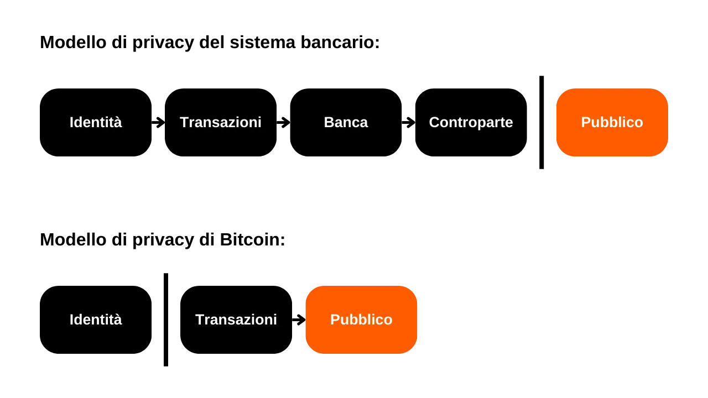
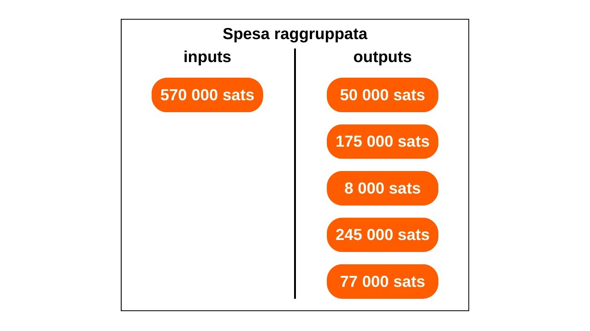
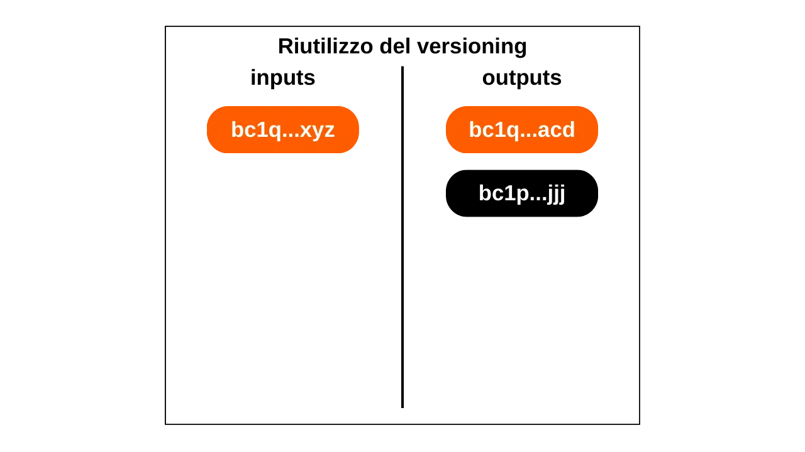
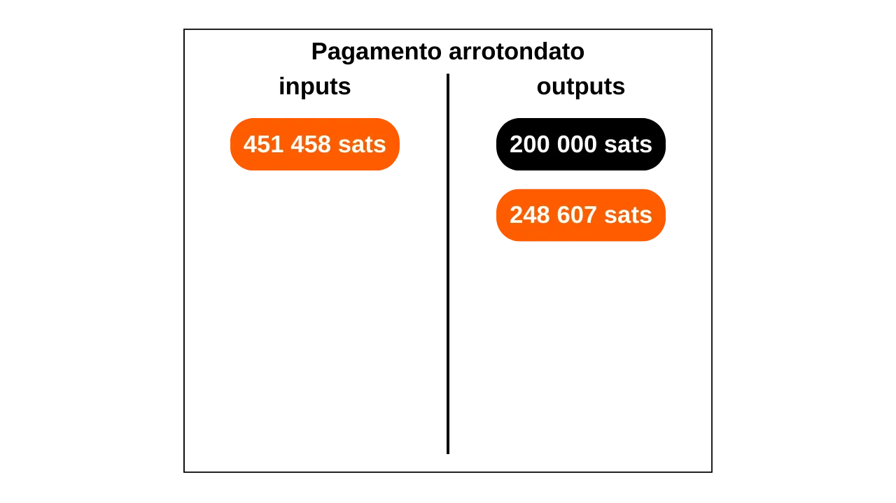

***ATTENZIONE:** In seguito all'arresto dei fondatori di Samourai Wallet e al sequestro dei loro server il 24 aprile, **il sito web OXT.me non è attualmente accessibile**. Tuttavia, rimane possibile che questo strumento possa essere riattivato nelle prossime settimane. Nel frattempo, puoi ancora approfittare di questo tutorial per comprendere le basi dell'analisi della catena su Bitcoin. Tutte le euristiche e i pattern che presento rimangono applicabili alle transazioni Bitcoin. Anche se questi strumenti sono meno ottimizzati di OXT, puoi utilizzare temporaneamente [Mempool.space](https://mempool.space/) o [Bitcoin Explorer](https://bitcoinexplorer.org/) per mettere in pratica i concetti teorici di questo articolo.*

_Stiamo seguendo da vicino l'evoluzione di questo caso così come gli sviluppi relativi agli strumenti associati. Siate certi che aggiorneremo questo tutorial non appena saranno disponibili nuove informazioni._

_Questo tutorial è fornito solo a scopo educativo e informativo. Non approviamo né incoraggiamo l'uso di questi strumenti per scopi criminali. È responsabilità di ogni utente rispettare le leggi vigenti nella propria giurisdizione._

---

In questo articolo, imparerai le fondamenta teoriche essenziali necessarie per intraprendere analisi di base della catena su Bitcoin e, cosa ancora più importante, per comprendere come coloro che ti osservano operano. Sebbene questo articolo non sia un tutorial pratico sullo strumento OXT (un argomento che tratteremo in un futuro tutorial), raccoglie un insieme di conoscenze cruciali per il suo utilizzo. Per ogni modello, metrica e indicatore presentato, viene fornito un link a una transazione esemplificativa su OXT, che ti permetterà di comprendere meglio il suo utilizzo e di esercitarti durante la lettura.

## Introduzione
Una delle funzioni del denaro è risolvere il problema della doppia coincidenza dei desideri. In un sistema basato sul baratto, completare uno scambio richiede non solo di trovare un individuo che offre un bene che soddisfa il mio bisogno, ma anche di fornirgli un bene di valore equivalente che soddisfi il suo bisogno. Trovare questo equilibrio si rivela complesso. Ecco perché ricorriamo al denaro, che ci permette di spostare valore sia nello spazio che nel tempo.

Perché il denaro risolva questo problema, è essenziale che la parte che fornisce un bene o un servizio sia convinta della propria capacità di spendere quella somma in seguito. Pertanto, qualsiasi individuo razionale disposto ad accettare una somma di denaro, sia essa digitale o fisica, si assicurerà che essa soddisfi due criteri fondamentali:
- La moneta deve essere integra e autentica;
- e non deve essere stata spesa due volte.

Se usiamo denaro fisico, è la prima caratteristica ad essere la più complessa da affermare. In diversi periodi della storia, l'integrità delle monete metalliche è stata spesso compromessa da pratiche come il taglio o la perforazione. Ad esempio, durante l'antica Roma, era comune per i cittadini raschiare i bordi delle monete d'oro per raccogliere un po' di metallo prezioso, pur conservandole per future transazioni. Questo è notevolmente il motivo per cui in seguito furono impressi dei solchi sul bordo delle monete. Anche l'autenticità è una caratteristica difficile da verificare su un mezzo monetario fisico. Oggi, le tecniche per combattere la contraffazione sono sempre più complesse, costringendo i commercianti ad investire in costosi sistemi di verifica.

D'altra parte, a causa della loro natura, il doppio pagamento non è un problema per le valute fisiche. Se ti do una banconota da €10, essa lascia irrevocabilmente il mio possesso per entrare nel tuo, escludendo così qualsiasi possibilità di spesa multipla delle unità monetarie che rappresenta.
Per la valuta digitale, la sfida è diversa. Garantire l'autenticità e l'integrità di una moneta è spesso più semplice, ma assicurare l'assenza di doppio pagamento è più complesso. Ogni bene digitale è essenzialmente informazione. A differenza dei beni fisici, l'informazione non si divide durante gli scambi ma si propaga moltiplicandosi. Ad esempio, se ti invio un documento via email, questo viene duplicato. Da parte tua, non puoi verificare con certezza che io abbia cancellato il documento originale.

L'unico modo per evitare questa duplicazione di un bene digitale è essere a conoscenza di tutti gli scambi sul sistema. In questo modo, si può sapere chi possiede cosa e aggiornare i conti di tutti in base alle transazioni effettuate. Questo è ciò che viene fatto, ad esempio, con il denaro scritturale. Quando paghi €10 a un commerciante con carta di credito, la banca registra questo scambio e aggiorna il registro contabile.

Su Bitcoin, la prevenzione del doppio pagamento avviene nello stesso modo. Si cerca di confermare l'assenza di una transazione che ha già speso le monete in questione. Se queste non sono mai state utilizzate, allora possiamo essere sicuri che non si verificherà alcun doppio pagamento. Questa è la famosa frase di Satoshi Nakamoto nel White Paper: "*L'unico modo per confermare l'assenza di una transazione è essere a conoscenza di tutte le transazioni.*"
A differenza del modello bancario, su Bitcoin non desideriamo dover fidarci di un'entità centrale. Pertanto, tutti gli utenti devono essere in grado di confermare questa assenza di doppia spesa, senza fare affidamento su una terza parte. Così, tutti devono essere a conoscenza di tutte le transazioni Bitcoin.

È proprio questa diffusione pubblica delle informazioni che complica la protezione della privacy su Bitcoin. Nel sistema bancario tradizionale, in teoria, solo l'istituzione finanziaria è a conoscenza delle transazioni effettuate. Tuttavia, su Bitcoin, tutti gli utenti sono informati di tutte le transazioni, tramite i rispettivi nodi.

A causa di questo vincolo sulla diffusione, il modello di privacy di Bitcoin differisce da quello del sistema bancario. In quest'ultimo, le transazioni sono associate all'identità dell'utente, ma il flusso di informazioni è interrotto tra la terza parte fidata e il pubblico. In altre parole, il tuo banchiere sa che compri la tua baguette ogni mattina nella panetteria locale, ma il tuo vicino non è a conoscenza di tutte queste transazioni. Nel caso di Bitcoin, poiché il flusso di informazioni non può essere interrotto tra le transazioni e il dominio pubblico, il modello di privacy si basa sulla separazione dell'identità dell'utente dalle transazioni stesse.

*Diagramma ispirato da quello di Satoshi Nakamoto nel White Paper: Bitcoin: A Peer-to-Peer Electronic Cash System, sezione 10 "Privacy".*
Poiché le transazioni Bitcoin sono rese pubbliche, diventa possibile stabilire collegamenti tra di esse per dedurre informazioni sulle parti coinvolte. Questa attività costituisce addirittura una specialità a sé stante, comunemente chiamata "analisi della catena". In questo articolo, vi invito a esplorare i fondamenti dell'analisi della catena per capire come vengono tracciati i vostri bitcoin.

La maggior parte delle aziende specializzate in analisi della catena opera come scatole nere e non divulga le proprie metodologie. Pertanto, è difficile ottenere informazioni su questa pratica. Per la stesura di questo articolo, mi sono principalmente affidato alle poche risorse aperte disponibili:
- La maggior parte del mio articolo è estratta dalla serie di quattro articoli denominata: [Understanding Bitcoin Privacy with OXT](https://medium.com/oxt-research/understanding-bitcoin-privacy-with-oxt-part-1-4-8177a40a5923), prodotta da Samourai Wallet nel 2021;
- Ho utilizzato anche vari rapporti di [OXT Research](https://medium.com/oxt-research), così come il loro strumento gratuito di analisi della catena ;
- Più in generale, le mie conoscenze provengono dai diversi tweet e contenuti di [@LaurentMT](https://twitter.com/LaurentMT) e [@ErgoBTC](https://twitter.com/ErgoBTC);
- Sono stato anche ispirato da [Space Kek #19](https://podcasters.spotify.com/pod/show/decouvrebitcoin/episodes/SpaceKek-19---Analyse-de-chane--anonsets-et-entropie-e1vfuji) in cui ho partecipato insieme a [@louneskmt](https://twitter.com/louneskmt), [@TheoPantamis](https://twitter.com/TheoPantamis), [@Sosthene___](https://twitter.com/Sosthene___), e [@LaurentMT](https://twitter.com/LaurentMT).

Desidero ringraziare i loro autori, sviluppatori e produttori. Senza i loro vari contenuti e software, questo articolo non esisterebbe. Ringrazio anche i revisori che hanno meticolosamente corretto questo testo e mi hanno onorato con i loro consigli esperti:
- [Gilles Cadignan](https://twitter.com/gillesCadignan);
- [Ludovic Lars](https://twitter.com/lugaxker) ([https://viresinnumeris.fr/](https://viresinnumeris.fr/)).
*Per tua informazione, ho aggiunto alla fine dell'articolo un miniglossario tecnico per definire alcuni termini. Se incontri una parola che non comprendi con un asterisco, la sua definizione si trova in fondo alla pagina.*

## Cos'è l'analisi della catena?
L'analisi della catena è una pratica che comprende tutti i metodi per tracciare i flussi di Bitcoin sulla blockchain. Generalmente, l'analisi della catena si basa sull'osservazione delle caratteristiche in campioni di transazioni precedenti. Coinvolge quindi l'identificazione di queste stesse caratteristiche in una transazione che si desidera analizzare e la deduzione di interpretazioni plausibili. Questo metodo di risoluzione dei problemi, basato su un approccio pratico per trovare una soluzione sufficientemente buona, è ciò che viene chiamato euristico.

Per semplificare, l'analisi della catena si svolge in due passaggi principali:
1. L'identificazione delle caratteristiche note;
2. La deduzione di ipotesi.

Uno degli obiettivi dell'analisi della catena è raggruppare varie attività su Bitcoin per determinare l'unicità dell'utente che le ha eseguite. Successivamente, sarà possibile tentare di collegare questo insieme di attività a un'identità reale.

Ricorda la mia introduzione. Ho spiegato perché il modello di privacy di Bitcoin si basava originariamente sulla separazione dell'identità dell'utente dalle loro transazioni. Sarebbe quindi tentante pensare che l'analisi della catena sia inutile, poiché anche se si riesce a raggruppare le attività on-chain, queste non possono essere associate a un'identità reale. Teoricamente, questa affermazione è accurata. Le coppie di chiavi crittografiche sono utilizzate per stabilire condizioni sugli UTXO. Per essenza, queste coppie di chiavi non rivelano alcuna informazione sull'identità dei loro detentori. Quindi, anche se si riesce a raggruppare le attività associate a diverse coppie di chiavi, ciò non ci dice nulla sull'entità dietro queste attività.

Tuttavia, la realtà pratica è molto più complessa. Esiste una moltitudine di comportamenti che rischiano di collegare un'identità reale a un'attività on-chain. Nell'analisi, questo viene chiamato un punto di ingresso, e ce ne sono molti. Il più comune, ovviamente, è il KYC (Know Your Customer). Se prelevi i tuoi bitcoin da una piattaforma regolamentata a uno dei tuoi indirizzi di ricezione personali, allora alcune persone sono in grado di collegare la tua identità a questo indirizzo. Più in generale, un punto di ingresso può essere qualsiasi forma di interazione tra la tua vita reale e una transazione Bitcoin. Ad esempio, se pubblichi un indirizzo di ricezione sui tuoi social network, questo può essere un punto di ingresso per l'analisi. Se effettui un pagamento in bitcoin al tuo panettiere, possono associare il tuo volto (che fa parte della tua identità) a un indirizzo Bitcoin.
Questi punti di ingresso sono quasi inevitabili quando si utilizza Bitcoin. Anche se si potrebbe cercare di limitarne la portata, rimarranno presenti. Ecco perché è cruciale combinare metodi volti a preservare la tua privacy. Sebbene mantenere una separazione accettabile tra la tua identità reale e le tue transazioni sia un approccio lodevole, rimane insufficiente. Infatti, se tutte le tue attività on-chain possono essere raggruppate, allora anche il più piccolo punto di ingresso potrebbe compromettere l'unico strato di privacy che avevi stabilito.
Pertanto, è necessario anche occuparsi dell'analisi della catena nel nostro uso di Bitcoin. Facendo ciò, possiamo minimizzare l'aggregazione delle nostre attività e limitare l'impatto di un punto di ingresso sulla nostra privacy. Precisamente, per contrastare meglio l'analisi della catena, quale approccio migliore se non familiarizzare con i metodi utilizzati nell'analisi della catena? Se vuoi sapere come migliorare la tua privacy su Bitcoin, devi comprendere questi metodi. Questo ti permetterà di comprendere meglio tecniche come [Coinjoin](https://planb.network/it/tutorials/privacy/coinjoin-samourai-wallet) o [Payjoin](https://planb.network/it/tutorials/privacy/payjoin), e di ridurre gli errori che potresti commettere.
In questo, possiamo tracciare un'analogia con la crittografia e la crittoanalisi. Un buon crittografo è prima di tutto un buon crittoanalista. Per immaginare un nuovo algoritmo di crittografia, bisogna sapere quali attacchi dovrà affrontare, e studiare anche perché gli algoritmi precedenti sono stati violati. Lo stesso principio si applica alla privacy su Bitcoin. Comprendere i metodi di analisi della catena è la chiave per proteggersi da essa. Ecco perché ti offro questo articolo.

È fondamentale comprendere che l'analisi della catena non è una scienza esatta. Si basa su euristiche derivate da osservazioni precedenti o interpretazioni logiche. Queste regole consentono risultati abbastanza affidabili, ma mai con precisione assoluta. In altre parole, l'analisi della catena coinvolge sempre una dimensione di probabilità nelle conclusioni tratte. Possiamo stimare con maggiore o minore certezza che due indirizzi appartengano alla stessa entità, ma la certezza totale sarà sempre fuori portata.

L'intero obiettivo dell'analisi della catena risiede proprio nell'aggregazione di varie euristiche per minimizzare il rischio di errore. È, in un certo senso, un'accumulazione di prove che ci permette di avvicinarci alla realtà.

Queste famose euristiche possono essere raggruppate in diverse categorie che dettaglieremo insieme:
- Modelli di transazione (o modelli di transazione);
- Euristiche interne alla transazione;
- Euristiche esterne alla transazione.

Vale la pena notare che le prime due euristiche su Bitcoin sono state formulate dallo stesso Satoshi Nakamoto. Le discute nella parte 10 del White Paper. Come vedremo più avanti, è interessante osservare che queste due euristiche mantengono ancora oggi una preminenza nell'analisi della catena. Queste sono:
- l'Euristica di Proprietà Comune dell'Input (CIOH);
- e il riutilizzo degli indirizzi.

Esploriamo insieme le caratteristiche osservabili e le interpretazioni che possono essere tratte per condurre un'analisi.

## Modelli di transazione (o modelli di transazione)
Un modello di transazione è semplicemente un modello di transazione tipico che può essere trovato sulla blockchain, la cui interpretazione è presumibilmente nota. Quando studiamo i modelli, ci concentreremo su una singola transazione che analizzeremo ad alto livello. In altre parole, guarderemo solo al numero di input e output, senza soffermarci sui suoi dettagli più specifici o sul suo ambiente. Dal modello osservato, saremo in grado di interpretare la natura della transazione. Cercheremo quindi caratteristiche riguardo alla sua struttura e dedurremo un'interpretazione.

### Il semplice invio (o pagamento semplice)
Questo modello è caratterizzato dal consumo di uno o più UTXO come input e dalla produzione di due UTXO come output.

L'interpretazione di questo modello è che ci troviamo di fronte a una transazione di invio o pagamento. L'utente ha consumato i propri UTXO come input per soddisfare in output un UTXO di pagamento e un UTXO di resto (resto che ritorna allo stesso utente). Sappiamo quindi che l'utente osservato probabilmente non è più in possesso di uno dei due UTXO in output (quello di pagamento), ma è ancora in possesso dell'altro UTXO (quello di resto).
A questo punto, è impossibile per noi specificare quale output rappresenti quale UTXO, poiché questo non è l'obiettivo di questo modello. Saremo in grado di farlo affidandoci alle euristiche che studieremo nella parte seguente. In questa fase, il nostro obiettivo è limitato all'identificazione della natura della transazione in questione, che in questo caso è un semplice invio.

Per esempio, ecco una transazione Bitcoin che adotta il modello di invio semplice:
### Sweep ("sweep" in inglese)
Questo modello è caratterizzato dal consumo di un singolo UTXO come input e dalla produzione di un singolo UTXO come output.

L'interpretazione di questo modello è che ci troviamo di fronte a un auto-trasferimento. L'utente ha trasferito i propri bitcoin a se stesso, a un altro indirizzo di sua proprietà. Infatti, poiché non c'è cambio nella transazione, è molto improbabile che ci troviamo di fronte a un pagamento. Sappiamo quindi che l'utente osservato probabilmente è ancora in possesso di questo UTXO.

Per esempio, ecco una transazione Bitcoin che adotta il modello di sweep:
[35f1072a0fda5ae106efb4fda871ab40e1f8023c6c47f396441ad4b995ea693d](https://mempool.space/tx/35f1072a0fda5ae106efb4fda871ab40e1f8023c6c47f396441ad4b995ea693d)

Tuttavia, questo tipo di modello può anche rivelare un auto-trasferimento a un conto di scambio (piattaforma di scambio di criptovalute). Sarà lo studio degli indirizzi noti e il contesto della transazione che ci permetterà di sapere se si tratta di uno sweep a un portafoglio di auto-custodia o di un prelievo a una piattaforma.

### Consolidamento
Questo modello è caratterizzato dal consumo di diversi UTXO come input e dalla produzione di un singolo UTXO come output.

L'interpretazione di questo modello è che ci troviamo di fronte a un consolidamento. Questa è una pratica comune tra gli utenti Bitcoin, che mira a unire diversi UTXO in previsione di un possibile aumento delle commissioni di transazione. Eseguendo questa operazione durante un periodo in cui le commissioni sono basse, è possibile risparmiare sulle future commissioni.

Possiamo dedurre che l'utente dietro questa transazione era probabilmente in possesso di tutti gli UTXO in input ed è ancora in possesso dell'UTXO in output. Pertanto, è sicuramente un auto-trasferimento.

Proprio come lo sweep, anche questo tipo di modello può rivelare un auto-trasferimento a un conto di scambio. Sarà lo studio degli indirizzi noti e il contesto della transazione che ci permetterà di sapere se si tratta di un consolidamento a un portafoglio di auto-custodia o di un prelievo a una piattaforma.

Per esempio, ecco una transazione Bitcoin che adotta il modello di consolidamento:
[77c16914211e237a9bd51a7ce0b1a7368631caed515fe51b081d220590589e94](https://mempool.space/tx/77c16914211e237a9bd51a7ce0b1a7368631caed515fe51b081d220590589e94)### Il Modello di Spesa in Batch
Questo modello è caratterizzato dal consumo di pochi UTXO come input (spesso solo uno) e dalla produzione di molti UTXO come output.

L'interpretazione di questo modello è che ci troviamo di fronte a una spesa in batch. Si tratta di una pratica che probabilmente rivela un'attività economica significativa, come ad esempio uno scambio. La spesa in batch permette a queste entità di risparmiare sulle commissioni combinando le loro spese in una singola transazione.

Possiamo dedurre che l'input UTXO proviene da un'azienda con un'attività economica significativa e che gli output UTXO si disperderanno. Alcuni apparterranno ai clienti dell'azienda. Altri potrebbero andare verso aziende partner. Infine, ci sarà certamente un resto che ritorna all'azienda emittente.

Per esempio, ecco una transazione Bitcoin che adotta il modello di spesa in batch:
[8a7288758b6e5d550897beedd13c70bcbaba8709af01a7dbcc1f574b89176b43](https://mempool.space/tx/8a7288758b6e5d550897beedd13c70bcbaba8709af01a7dbcc1f574b89176b43)

### Transazioni Specifiche del Protocollo
Tra i modelli di transazione, possiamo anche identificare modelli che rivelano l'uso di un protocollo specifico. Ad esempio, i coinjoin di Whirlpool avranno una struttura facilmente identificabile che permette di differenziarli da altre transazioni classiche.

L'analisi di questo modello suggerisce che probabilmente ci troviamo di fronte a una transazione collaborativa. È anche possibile osservare un coinjoin. Se quest'ultima ipotesi si rivela accurata, allora il numero di output potrebbe fornirci una stima approssimativa del numero di partecipanti.

Per esempio, ecco una transazione Bitcoin che adotta il modello del tipo di transazione collaborativa coinjoin:
[00601af905bede31086d9b1b79ee8399bd60c97e9c5bba197bdebeee028b9bea](https://mempool.space/tx/00601af905bede31086d9b1b79ee8399bd60c97e9c5bba197bdebeee028b9bea)

Ci sono molti altri protocolli che hanno le loro specifiche strutture. Così, potremmo distinguere transazioni del tipo Wabisabi o transazioni Stamps, ad esempio.

## Euristiche delle Transazioni Interne
Un'euristica interna è una caratteristica specifica identificata all'interno di una transazione stessa, senza la necessità di esaminare il suo ambiente, che ci permette di fare deduzioni. A differenza dei modelli che si concentrano sulla struttura generale della transazione, le euristiche interne si basano sull'insieme dei dati estrabili. Questo include:
- Le quantità di diversi UTXO sia in entrata che in uscita;
- Tutto ciò che è relativo agli script: indirizzi di ricezione, versioning, locktimes...

Generalmente, questo tipo di euristica ci permette di identificare il resto in una transazione specifica. Facendo ciò, possiamo poi continuare a tracciare un'entità attraverso diverse transazioni differenti.
Ancora una volta, vi ricordo che queste euristiche non sono assolutamente precise. Prese singolarmente, ci permettono solo di identificare scenari plausibili. È l'accumulo di diverse euristiche che contribuisce a ridurre l'incertezza, senza mai eliminarla completamente.

### Similarità Interne
Questa euristica implica lo studio delle somiglianze tra gli input e gli output della stessa transazione. Se la stessa caratteristica è osservata sugli input e su solo uno degli output della transazione, allora è probabile che questo output costituisca il resto.

La caratteristica più ovvia è il riutilizzo di un indirizzo di ricezione nella stessa transazione.

Questa euristica lascia poco spazio al dubbio. A meno che la loro chiave privata non sia stata compromessa, lo stesso indirizzo di ricezione rivela inevitabilmente l'attività di un singolo utente. L'interpretazione che ne segue è che il resto della transazione è l'output con lo stesso indirizzo dell'input. Questo ci permette di continuare a tracciare l'individuo da questo cambio.

Ad esempio, ecco una transazione dove questa euristica può probabilmente essere applicata:
[54364146665bfc453a55eae4bfb8fdf7c721d02cb96aadc480c8b16bdeb8d6d0](https://mempool.space/tx/54364146665bfc453a55eae4bfb8fdf7c721d02cb96aadc480c8b16bdeb8d6d0)

Queste somiglianze tra gli input e gli output non si fermano al riutilizzo degli indirizzi. Qualsiasi somiglianza nell'uso degli script può permettere l'applicazione di un'euristica. Ad esempio, a volte si può osservare la stessa versione tra un input e uno degli output della transazione.

In questo diagramma, possiamo vedere che l'input numero 0 sblocca uno script P2WPKH (SegWit V0 che inizia con "bc1q"). L'output numero 0 utilizza lo stesso tipo di script. Tuttavia, l'output numero 1 utilizza uno script P2TR (SegWit V1 che inizia con "bc1p"). L'interpretazione di questa caratteristica è che è probabile che l'indirizzo con la stessa versione dell'input sia l'indirizzo di cambio. Apparterrebbe quindi ancora allo stesso utente.
Ecco una transazione dove questa euristica può probabilmente essere applicata:
[db07516288771ce5d0a06b275962ec4af1b74500739f168e5800cbcb0e9dd578](https://mempool.space/tx/db07516288771ce5d0a06b275962ec4af1b74500739f168e5800cbcb0e9dd578)

In questa transazione, possiamo vedere che l'input numero 0 e l'output numero 1 utilizzano script P2WPKH (SegWit V0), mentre l'output numero 0 utilizza un tipo di script diverso, P2PKH (Legacy).

### Pagamenti con Numeri Tondi
Un'altra euristica interna che può aiutarci a identificare il resto è quella dei numeri tondi. Generalmente, quando ci troviamo di fronte a un semplice schema di pagamento (1 input e 2 output), se uno degli output spende un importo tondo, allora rappresenta il pagamento.

Per processo di eliminazione, se un output rappresenta il pagamento, l'altro rappresenta il resto. Pertanto, possiamo interpretare che è probabile che l'utente in input possieda ancora l'output identificato come essendo il resto.
Va notato che questa euristica non è sempre applicabile, poiché la maggior parte dei pagamenti è ancora effettuata in unità di valuta fiat. Infatti, quando un commerciante in Francia accetta bitcoin, generalmente, non mostra prezzi stabili in sats. Preferirebbero optare per una conversione tra il prezzo in euro e l'importo in bitcoin da pagare. Pertanto, non dovrebbe esserci un numero tondo nell'output della transazione. Tuttavia, un analista potrebbe tentare di eseguire questa conversione tenendo conto del tasso di cambio in vigore quando la transazione è stata trasmessa sulla rete.
Se un giorno, il bitcoin diventa l'unità di conto preferita nei nostri scambi, questa euristica potrebbe diventare ancora più utile per l'analisi.

Ad esempio, ecco una transazione dove questa euristica può probabilmente essere applicata:
### La Grande Spesa

Quando si nota un divario sufficientemente ampio tra due output di transazione in un semplice modello di pagamento, si può stimare che l'output più grande sia probabilmente il resto.

Questa euristica dell'output più grande è probabilmente la più imprecisa di tutte. Se identificata da sola, è piuttosto debole. Tuttavia, questa caratteristica può essere combinata con altre euristiche per ridurre l'incertezza della nostra interpretazione.

Ad esempio, se esaminiamo una transazione che presenta un output con un importo tondo e un altro output con un importo maggiore, l'applicazione congiunta dell'euristica dei pagamenti tondi e quella relativa all'output più grande ci permette di ridurre il nostro livello di incertezza.

Ad esempio, ecco una transazione dove questa euristica può probabilmente essere applicata:
[b79d8f8e4756d34bbb26c659ab88314c220834c7a8b781c047a3916b56d14dcf](https://mempool.space/tx/b79d8f8e4756d34bbb26c659ab88314c220834c7a8b781c047a3916b56d14dcf)

## Euristiche Esterne alla Transazione
Lo studio delle euristiche esterne è l'analisi delle somiglianze, dei modelli e delle caratteristiche di certi elementi che non sono intrinseci alla transazione stessa. In altre parole, se precedentemente ci siamo limitati a sfruttare elementi intrinseci alla transazione con euristiche interne, ora stiamo espandendo il nostro campo di analisi all'ambiente della transazione grazie alle euristiche esterne.

### Riutilizzo degli Indirizzi
Questa è una delle euristiche più note tra i Bitcoiners. Il riutilizzo degli indirizzi permette di stabilire un collegamento tra diverse transazioni e diversi UTXO. Si osserva quando un indirizzo di ricezione Bitcoin viene utilizzato più volte.

L'interpretazione del riutilizzo degli indirizzi è che tutti gli UTXO bloccati su questo indirizzo appartengono (o sono appartenuti) alla stessa entità. Questa euristica lascia poco spazio all'incertezza. Quando viene identificata, l'interpretazione che ne segue ha una forte possibilità di corrispondere alla realtà.
Come spiegato nell'introduzione, questa euristica è stata scoperta da Satoshi Nakamoto stesso. Nel White Paper, menziona specificamente una soluzione per prevenire che gli utenti la producano, che è semplicemente quella di utilizzare un nuovo indirizzo per ogni nuova transazione: "*Come ulteriore firewall, una nuova coppia di chiavi potrebbe essere utilizzata per ogni transazione per mantenerle non collegate a un proprietario comune.*"

Ad esempio, ecco un indirizzo riutilizzato in più transazioni:
[bc1qqtmeu0eyvem9a85l3sghuhral8tk0ar7m4a0a0](https://mempool.space/address/bc1qqtmeu0eyvem9a85l3sghuhral8tk0ar7m4a0a0)

### La Somiglianza degli Script e le Impronte dei Portafogli
Oltre al riutilizzo degli indirizzi, esistono molte altre euristiche che possono collegare azioni allo stesso portafoglio o a un cluster di indirizzi.
In primo luogo, un analista può utilizzare somiglianze nell'uso degli script. Ad esempio, certi script minoritari come multisig possono essere individuati più facilmente rispetto agli script SegWit V0. Più grande è il gruppo in cui ci nascondiamo, più difficile è individuarci. Questo è il motivo per cui, nel protocollo Coinjoin Whirlpool, tutti i partecipanti utilizzano esattamente lo stesso tipo di script.

Più in generale, un analista può anche concentrarsi sulle impronte caratteristiche di un portafoglio. Questi sono processi specifici per un uso che si potrebbe cercare di identificare per sfruttarli come euristiche di tracciamento. In altre parole, se si osserva un'accumulazione delle stesse caratteristiche interne sulle transazioni attribuite all'entità tracciata, si può tentare di identificare queste stesse caratteristiche su altre transazioni.

Ad esempio, può essere identificato che l'utente tracciato invia sistematicamente il loro resto agli indirizzi P2TR* (bc1p…). Se questo processo si ripete, può essere utilizzato come euristica per la continuazione della nostra analisi. Altre impronte possono essere utilizzate, come l'ordine degli UTXO, il posizionamento del resto negli output, la segnalazione di RBF (Replace-by-Fee), o anche, il numero di versione e il locktime.
Come [@LaurentMT](https://twitter.com/LaurentMT) specifica in [Space Kek #19](https://podcasters.spotify.com/pod/show/decouvrebitcoin/episodes/SpaceKek-19---Analyse-de-chane--anonsets-et-entropie-e1vfuji) (un podcast francofono), l'utilità delle impronte dei portafogli nell'analisi delle catene sta aumentando significativamente nel tempo. Infatti, il crescente numero di tipi di script e il dispiegamento sempre più graduale di queste nuove funzionalità da parte del software del portafoglio accentuano le differenze. Accade persino che si possa identificare con precisione il software utilizzato dall'entità tracciata. Pertanto, è importante comprendere che lo studio dell'impronta di un portafoglio è particolarmente rilevante per le transazioni recenti, più che per quelle avviate nei primi anni 2010.
Per riassumere, un'impronta può essere qualsiasi pratica specifica, eseguita automaticamente dal portafoglio o manualmente dall'utente, che può essere trovata su altre transazioni per assistere nella nostra analisi.

### Il CIOH
Il CIOH, per "Common Input Ownership Heuristic," che potrebbe essere tradotto come "euristica della proprietà comune degli input" o "euristica del co-spending," è un'euristica che afferma che quando una transazione ha più input, questi provengono probabilmente da una singola entità. Di conseguenza, la loro proprietà è comune.

Per applicare il CIOH, si osserva prima una transazione che ha più input. Questo potrebbe essere due input, così come trenta input. Una volta individuata questa caratteristica, si verifica se la transazione non si adatta a un modello noto. Ad esempio, se ha 5 input con importi più o meno uguali e 5 output con esattamente lo stesso importo, sappiamo che è la struttura di un Coinjoin Whirlpool. Pertanto, il CIOH non può essere applicato.

Tuttavia, se la transazione non si adatta a nessun modello noto di transazione collaborativa, allora si può interpretare che tutti gli input provengono probabilmente dalla stessa entità. Questo può essere molto utile per espandere un cluster già noto o per continuare il tracciamento.

Il CIOH è stato scoperto da Satoshi Nakamoto. Ne parla nella parte 10 del White Paper: "*[...] il collegamento è inevitabile con le transazioni multi-input, che necessariamente rivelano che i loro input appartenevano allo stesso proprietario. Il rischio è che se il proprietario di una chiave viene rivelato, i collegamenti possono rivelare altre transazioni che appartenevano allo stesso proprietario.*" È particolarmente affascinante notare che Satoshi Nakamoto, ancor prima del lancio ufficiale di Bitcoin, aveva già identificato le due principali vulnerabilità per la privacy degli utenti, ovvero il CIOH e il riutilizzo degli indirizzi. Tale lungimiranza è piuttosto notevole, poiché queste due euristiche rimangono, ancora oggi, le più utili nell'analisi delle catene.

### Dati Off-chain
Ovviamente, l'analisi delle catene non si limita ai dati on-chain. Qualsiasi dato proveniente da un'analisi precedente o accessibile su Internet può essere utilizzato per affinare un'analisi.

Ad esempio, se si osserva che le transazioni tracciate vengono sistematicamente trasmesse dallo stesso nodo Bitcoin e si può identificare il suo indirizzo IP, potrebbe essere possibile individuare altre transazioni dalla stessa entità.

L'analista ha anche l'opzione di fare affidamento su analisi precedentemente rese open-source, o sulle proprie analisi precedenti. Forse si potrebbe trovare un output che punta a un cluster di indirizzi che era già stato identificato. A volte, è anche possibile fare affidamento su output che puntano a uno scambio, gli indirizzi di queste piattaforme essendo generalmente noti.

Analogamente, si può eseguire un'analisi per eliminazione. Ad esempio, se durante l'analisi di una transazione con due output, uno di essi è collegato a un cluster di indirizzi noto ma distinto dall'entità che si sta tracciando, allora si può interpretare che l'altro output rappresenti probabilmente il resto.

L'analisi delle catene include anche una parte di OSINT (Open Source Intelligence) che è un po' più generalista con ricerche su internet. Questo è il motivo per cui si sconsiglia di postare indirizzi di ricezione direttamente sui social media o su un sito web, sia sotto pseudonimo che no.

### Modelli Temporali
Non ci si potrebbe immediatamente pensare, ma certi comportamenti umani sono riconoscibili on-chain. Il più utile in uno studio è il tuo modello di sonno! Sì, quando stai dormendo, presumibilmente non stai trasmettendo transazioni Bitcoin. Dato che generalmente dormi nelle stesse ore, è comune utilizzare analisi temporali nell'analisi on-chain. Si tratta semplicemente di registrare gli orari in cui le transazioni di una data entità vengono trasmesse alla rete Bitcoin. Analizzare questi modelli temporali ci permette di dedurre numerose informazioni.
Prima di tutto, un'analisi temporale può talvolta identificare la natura dell'entità che si sta tracciando. Se si osserva che le transazioni vengono trasmesse costantemente nel corso delle 24 ore, ciò può indicare una forte attività economica. L'entità dietro queste transazioni è probabilmente un'azienda, potenzialmente internazionale, e forse con procedure automatizzate internamente.

Ad esempio, avevo riconosciuto questo modello alcune settimane fa mentre analizzavo una transazione che aveva erroneamente allocato 19 bitcoin in commissioni. Una semplice analisi temporale mi aveva permesso di ipotizzare che stavamo trattando con un servizio automatizzato, e quindi probabilmente una grande entità come uno scambio: https://twitter.com/Loic_Pandul/status/1701127409712452072

Infatti, pochi giorni dopo, è stato scoperto che i fondi appartenevano a PayPal, tramite lo scambio Paxos.

Al contrario, se si vede che il modello temporale è piuttosto distribuito su 16 ore specifiche, allora si può stimare che stiamo trattando con un utente individuale, o forse un'attività locale a seconda dei volumi scambiati.

Oltre alla natura dell'entità osservata, il modello temporale può anche darci una posizione approssimativa dell'utente. Possiamo così correlare altre transazioni, e usare il timestamp di queste come un'euristica aggiuntiva che può essere aggiunta alla nostra analisi.
Ad esempio, riguardo all'indirizzo riutilizzato più volte che ho precedentemente menzionato, si può osservare che le transazioni, sia in entrata che in uscita, sono concentrate in un intervallo di 13 ore. 
*Credit: OXT*

Questo intervallo corrisponde probabilmente all'Europa, all'Africa o al Medio Oriente. Pertanto, si può interpretare che l'utente dietro queste transazioni viva lì.

In un registro diverso, è anche un'analisi temporale di questo tipo che ha permesso l'ipotesi che Satoshi Nakamoto non operasse dal Giappone, ma effettivamente dagli Stati Uniti: [https://medium.com/@insearchofsatoshi/the-time-zones-of-satoshi-nakamoto-aa40f035178f](https://medium.com/@insearchofsatoshi/the-time-zones-of-satoshi-nakamoto-aa40f035178f)

### L'Analisi dei Volumi
Un'altra euristica esterna che può essere utilizzata è l'analisi dei volumi di trading. Basandosi sugli importi presenti in ogni transazione attribuita a un'entità, queste informazioni possono essere utilizzate come un'euristica aggiuntiva per il resto dell'analisi.
Questa euristica è ovviamente piuttosto debole, ma può aiutare a ridurre l'incertezza quando aggiunta ad altre euristiche.

## Come proteggersi dall'analisi della catena?
Come utente di Bitcoin, hai il diritto di proteggere la tua privacy. Questo deriva dai tuoi diritti naturali di possedere e disporre di te stesso, che sono intrinseci a ogni individuo, indipendentemente da qualsiasi vincolo legislativo.

Questo diritto naturale di proteggere la propria privacy si trasforma anche in un diritto-pretensione, sancito nell'Articolo 12 della Dichiarazione Universale dei Diritti Umani, che afferma che "*Nessuno può essere sottoposto ad interferenze arbitrarie nella sua privacy, famiglia, casa o corrispondenza, né a lesioni al suo onore e alla sua reputazione. Ognuno ha diritto alla protezione della legge contro tali interferenze o lesioni.*".

Tuttavia, il core business delle aziende specializzate nell'analisi della catena consiste proprio nell'intrusione nella tua sfera privata, compromettendo così la confidenzialità della tua corrispondenza. Sebbene si possa sperare che, in conformità con il suddetto diritto-pretensione, gli stati difendano vigorosamente la nostra privacy, non solo trascurano di farlo, ma finanziano anche sostanzialmente il finanziamento di queste aziende di analisi. Sarebbe anche vano sperare nel sostegno delle associazioni di settore, che sembrano disposte a fare tutte le concessioni di fronte al legislatore.

Di fatto, questo diritto-pretensione alla privacy su Bitcoin non esiste. Spetta quindi a te, utente, affermare il tuo diritto naturale e proteggere la confidenzialità della tua corrispondenza. Questo comporta l'adozione di varie tecniche e pratiche d'uso, che ti permetteranno di prevenire o ingannare le euristiche utilizzate per l'analisi della catena.

### Evitare di cadere nelle euristiche
Prima di tutto, prima di considerare metodi più radicali, è consigliabile limitare il più possibile la nostra esposizione alle euristiche utilizzate per l'analisi della catena. Come menzionato in precedenza, le due euristiche più potenti sono il riutilizzo degli indirizzi e il COINJOIN.

Il principio di base per garantire la tua privacy su Bitcoin risiede nell'uso di un nuovo indirizzo pulito per ogni transazione in entrata nel tuo portafoglio. Il riutilizzo degli indirizzi è veramente la principale minaccia alla confidenzialità su Bitcoin.
Per un utente individuale, generare un nuovo indirizzo per ogni pagamento in entrata è molto semplice. I portafogli moderni lo fanno automaticamente non appena si clicca su "Ricevi". Quindi, se dai anche la minima importanza alla privacy delle tue transazioni, utilizzare indirizzi freschi rappresenta il minimo indispensabile. Se hai mai bisogno di un punto di contatto statico su internet, invece di mettere un indirizzo di ricezione, puoi utilizzare soluzioni [come PayNym che implementa BIP47](https://planb.network/it/tutorials/privacy/paynym-bip47). Successivamente, se vuoi agire contro l'analisi della catena, evita di unire UTXO all'ingresso di una transazione. Al minimo, se hai davvero bisogno di unire, preferisci UTXO che hanno la stessa fonte. Questa raccomandazione implica avere una buona gestione dei tuoi UTXO. Quando acquisti i tuoi bitcoin, preferisci trasferimenti che coinvolgono grandi quantità per massimizzare il numero di pagamenti che puoi effettuare senza dover unire. Consiglio anche di etichettare i tuoi UTXO nel tuo software per identificarne l'origine ed evitare l'unione da fonti distinte.

Più in generale, per tutte le altre euristiche, devi conoscerle per cercare di non cadere in esse:
- Non usare script di minoranza. Preferisci SegWit V0 o, eventualmente, SegWit V1;
- Non effettuare pagamenti in numeri tondi. Ad esempio, se devi inviare 100k sats a un amico, inviagli 114.486 sats. Ti offriranno da bere in cambio;
- Cerca di non avere sempre un resto molto più grande dell'output del pagamento;
- Non pubblicare i tuoi indirizzi di ricezione sui social media;
- Usa il tuo nodo sotto Tor per trasmettere le tue transazioni;
- Cerca di non trasmettere sempre le tue transazioni Bitcoin alla stessa ora...

### Utilizzo di strumenti per la privacy
Puoi anche rivolgerti a metodi che rendono ambiguo il tuo uso di Bitcoin per prevenire o ingannare l'analisi della catena.

La tecnica più popolare è sicuramente Coinjoin, una struttura di transazione collaborativa che mobilita diversi UTXO degli stessi importi. L'obiettivo qui è rompere i collegamenti deterministici, impedendo così analisi dal presente al passato e dal passato al presente. Coinjoin consente una negazione plausibile nascondendo le tue monete all'interno di un grande gruppo di monete indistinguibili. Se vuoi saperne di più su Coinjoin, sia tecnicamente che praticamente, ti suggerisco di leggere questi altri articoli e tutorial:
- [COINJOIN - SAMOURAI WALLET](https://planb.network/it/tutorials/privacy/coinjoin-samourai-wallet);
- [COINJOIN - SPARROW WALLET](https://planb.network/it/tutorials/privacy/coinjoin-sparrow-wallet);
- [WHIRLPOOL STATS TOOLS - ANONSETS](https://planb.network/it/tutorials/privacy/wst-anonsets).

CoinJoin è uno strumento eccellente per creare una negazione plausibile per le monete, ma non è ottimizzato per tutte le esigenze di privacy degli utenti. In particolare, CoinJoin non è stato progettato per diventare uno strumento di pagamento. È molto rigido riguardo agli importi scambiati al fine di perfezionare la produzione di negazione plausibile. Poiché non si può scegliere liberamente l'importo degli output della transazione, CoinJoin non può essere utilizzato per effettuare pagamenti in bitcoin.

Ad esempio, immagina che voglia pagare la mia baguette in bitcoin ottimizzando la mia privacy. Data l'impossibilità di selezionare l'importo dell'UTXO risultante dal CoinJoin, mi troverei incapace di adeguare l'importo della mia spesa al prezzo fissato dal panettiere. Pertanto, CoinJoin si dimostra inadeguato per le transazioni di pagamento.
Altri strumenti sono stati concepiti per soddisfare le esigenze di privacy in casi d'uso più specifici. Ad esempio, abbiamo [PayJoin](https://planb.network/it/tutorials/privacy/payjoin), una sorta di mini-CoinJoin, che coinvolge solo due partecipanti e si basa su una struttura che consente il pagamento.
L'unicità di PayJoin risiede nella sua capacità di produrre una transazione che appare ordinaria, mentre in realtà è un mini-CoinJoin tra due utenti. In questa struttura, il destinatario della transazione partecipa tra gli input insieme al mittente effettivo. Così, il destinatario inserisce un pagamento a se stesso all'interno della transazione che facilita il pagamento effettivo.

Per esempio, se acquisti una baguette dal tuo panettiere per 6.000 sats da un UTXO di 10.000 sats, e vuoi fare un PayJoin, il tuo panettiere aggiungerà un UTXO di 15.000 sats che gli appartiene come input alla tua transazione originale, che recupererà completamente come output, al fine di ingannare le euristiche:

Le commissioni di transazione sono trascurate per semplificare la comprensione dello schema.

Gli obiettivi di PayJoin sono doppi. In primo luogo, mira a ingannare un osservatore esterno creando un diversivo attraverso il COH. Infatti, quando un analista osserva questa transazione, penserà di poter applicare il COH, e quindi presumere una proprietà comune dei diversi input. In realtà, questa supposizione è errata, poiché un input appartiene al mittente, mentre l'altro è di proprietà del destinatario. Pertanto, PayJoin corrompe l'analisi della catena guidando l'analista sulla strada sbagliata.
Il secondo obiettivo di PayJoin è ingannare l'analista riguardo l'importo effettivo della transazione, grazie alla struttura specifica dei suoi output. Così, PayJoin rientra nel campo della steganografia. Consente di nascondere l'importo reale della transazione all'interno di una transazione ingannevole.

Infatti, se riprendiamo il nostro esempio di utilizzo di PayJoin per comprare una baguette, un osservatore esterno potrebbe pensare che stiamo trattando un pagamento di 4.000 sats o 21.000 sats. In realtà, il pagamento per la baguette è di 6.000 sats: 21.000 - 15.000 = 6.000. Il valore reale del pagamento è quindi nascosto all'interno di un falso pagamento che funge da diversivo per l'analisi della catena.

Oltre a PayJoin e CoinJoin, esistono molte altre strutture di transazione Bitcoin che bloccano l'analisi della catena o la ingannano. Tra queste, posso menzionare le transazioni [Stonewall](https://planb.network/it/tutorials/privacy/stonewall) e [StonewallX2](https://planb.network/it/tutorials/privacy/stonewall-x2), che consentono di realizzare un mini Coinjoin flessibile o di imitare un mini Coinjoin flessibile. Ci sono anche transazioni [Ricochet](https://planb.network/it/tutorials/privacy/ricochet) che simulano un cambio di proprietà dei bitcoin effettuando una moltitudine di falsi trasferimenti a se stessi.

Tutti questi strumenti sono disponibili su Samourai Wallet su mobile e Sparrow Wallet su PC. Se vuoi saperne di più su queste specifiche strutture di transazione, ti consiglio di scoprire i miei tutorial:
- [PAYJOIN](https://planb.network/it/tutorials/privacy/payjoin);
- [PAYJOIN - SAMOURAI WALLET](https://planb.network/it/tutorials/privacy/payjoin-samourai-wallet);
- [PAYJOIN - SPARROW WALLET](https://planb.network/it/tutorials/privacy/payjoin-sparrow-wallet);
- [STONEWALL](https://planb.network/it/tutorials/privacy/stonewall);
- [STONEWALL X2](https://planb.network/it/tutorials/privacy/stonewall-x2);
- [RICOCHET](https://planb.network/it/tutorials/privacy/ricochet).

## Conclusione
L'analisi della catena è una pratica che coinvolge il tentativo di tracciare il flusso di bitcoin sulla catena. Per fare ciò, gli analisti cercano modelli e caratteristiche al fine di formulare ipotesi e interpretazioni più o meno plausibili.

L'accuratezza di queste euristiche varia: alcune forniscono un grado di certezza più elevato rispetto ad altre, ma nessuna può affermare di essere infallibile. Tuttavia, l'accumulo di diverse euristiche convergenti può mitigare questo dubbio intrinseco, sebbene rimanga impossibile eliminarlo completamente.
Possiamo categorizzare questi metodi in tre principali categorie distinte:
- Modelli, concentrati sulla struttura complessiva di ogni transazione;
- Euristiche interne, che consentono l'esame esaustivo di tutti i dettagli di una transazione, senza estendersi al suo contesto;
- Euristiche esterne, che comprendono l'analisi della transazione nel suo ambiente, così come qualsiasi dato esterno che possa fornire intuizioni.

Come utente Bitcoin, è essenziale padroneggiare i principi fondamentali dell'analisi della catena per contrastarla efficacemente e quindi proteggere la propria privacy.

## Mini-Glossario Tecnico:
**P2PKH:** acronimo di Pay to Public Key Hash. È un modello di script standard utilizzato per stabilire le condizioni di spesa su un UTXO. Consente di bloccare bitcoin su un hash di una chiave pubblica, ovvero su un indirizzo di ricezione. Questo script è associato allo standard Legacy ed è stato introdotto nelle prime versioni di Bitcoin da Satoshi Nakamoto. A differenza di P2PK, dove la chiave pubblica è inclusa esplicitamente nello script, P2PKH utilizza un'impronta crittografica della chiave pubblica, con alcuni metadati, anche chiamata "indirizzo di ricezione". Questo script include l'hash RIPEMD160 dello SHA256 della chiave pubblica e stabilisce che, per accedere ai fondi, il destinatario deve fornire una chiave pubblica corrispondente a questo hash, così come una firma digitale valida generata dalla chiave privata associata. Gli indirizzi P2PKH sono codificati utilizzando il formato Base58Check, che conferisce loro resistenza agli errori tipografici attraverso l'uso di un checksum. Questi indirizzi iniziano sempre con il numero 1.
**P2TR:** acronimo di Pay to Taproot ("pagare alla radice"). Si tratta di un modello di script standard utilizzato per stabilire le condizioni di spesa su un UTXO. P2TR è stato introdotto con l'implementazione di Taproot nel novembre 2021. Utilizza il protocollo Schnorr per aggregare chiavi crittografiche, così come alberi di Merkle per script alternativi, noti come MAST (Merkelized Alternative Script Tree). A differenza delle transazioni tradizionali dove le condizioni di spesa sono esposte pubblicamente (a volte al ricevimento, a volte alla spesa), P2TR consente di nascondere script complessi dietro una singola chiave pubblica apparente. Tecnicamente, uno script P2TR blocca bitcoin su una unica chiave pubblica Schnorr, denotata come K. Tuttavia, questa chiave K è in realtà un aggregato di una chiave pubblica P e una chiave pubblica M, quest'ultima calcolata dalla radice di Merkle di un elenco di ScriptPubKeys. L'aggregazione delle chiavi è eseguita utilizzando il protocollo di firma Schnorr. I bitcoin bloccati con uno script P2TR possono essere spesi in due modi distinti: o pubblicando una firma per la chiave pubblica P, o soddisfacendo uno degli script contenuti nell'albero di Merkle. La prima opzione è chiamata "percorso chiave" e la seconda "percorso script". Così, P2TR consente agli utenti di inviare bitcoin sia a una chiave pubblica sia a più script a loro scelta. Un altro vantaggio di questo script è che, sebbene ci siano più modi per spendere un output P2TR, solo quello che viene utilizzato deve essere rivelato alla spesa, consentendo alle alternative inutilizzate di rimanere private. Ad esempio, grazie all'aggregazione delle chiavi Schnorr, la chiave pubblica P può essere essa stessa una chiave aggregata, rappresentando potenzialmente un multisig. P2TR è un output SegWit versione 1, il che significa che le firme per gli input P2TR sono memorizzate nel testimone di una transazione, e non nello ScriptSig. Gli indirizzi P2TR utilizzano la codifica Bech32m e iniziano con bc1p.

**P2WPKH:** Acronimo di Pay to Witness Public Key Hash. Si tratta di un modello di script standard utilizzato per stabilire le condizioni di spesa su un UTXO. P2WPKH è stato introdotto con l'implementazione di SegWit nell'agosto 2017. Questo script è simile a P2PKH (Pay to Public Key Hash), in quanto anch'esso blocca bitcoin basandosi sull'hash di una chiave pubblica, ovvero un indirizzo di ricezione. La differenza risiede nel modo in cui firme e script sono inclusi nella transazione. Nel caso di P2WPKH, le informazioni dello script di firma (ScriptSig) vengono spostate dalla struttura tradizionale della transazione a una sezione separata chiamata Witness. Questo spostamento è una caratteristica dell'aggiornamento SegWit (Segregated Witness). Questa tecnica ha il vantaggio di ridurre la dimensione dei dati della transazione nel corpo principale, mantenendo al contempo le necessarie informazioni dello script per la validazione in una sezione separata. Di conseguenza, le transazioni P2WPKH generalmente comportano costi inferiori in termini di commissioni rispetto alle transazioni Legacy. Gli indirizzi P2WPKH sono scritti utilizzando la codifica Bech32, che contribuisce a una scrittura più concisa e meno soggetta a errori grazie al checksum BCH. Questi indirizzi iniziano sempre con bc1q, rendendoli facilmente distinguibili dagli indirizzi di ricezione Legacy. P2WPKH è un output SegWit versione 0.
**UTXO:** Acronimo di Unspent Transaction Output (Output di Transazione Non Speso). Un UTXO è un output di transazione che non è ancora stato speso o utilizzato come input per una nuova transazione. Gli UTXO rappresentano la frazione di bitcoin che un utente possiede e che sono attualmente disponibili per essere spesi. Ogni UTXO è associato a uno specifico script di output, che definisce le condizioni necessarie per spendere i bitcoin. Le transazioni in Bitcoin consumano questi UTXO come input e creano nuovi UTXO come output. Il modello UTXO è fondamentale per Bitcoin, poiché permette una facile verifica che le transazioni non stiano tentando di spendere bitcoin che non esistono o che sono già stati spesi. Essenzialmente, un UTXO è un pezzo di Bitcoin.