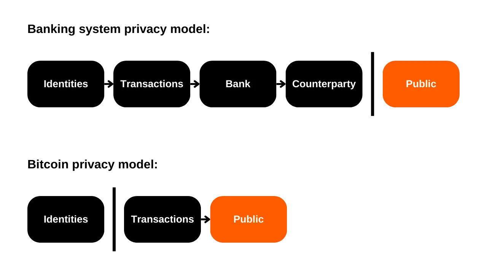
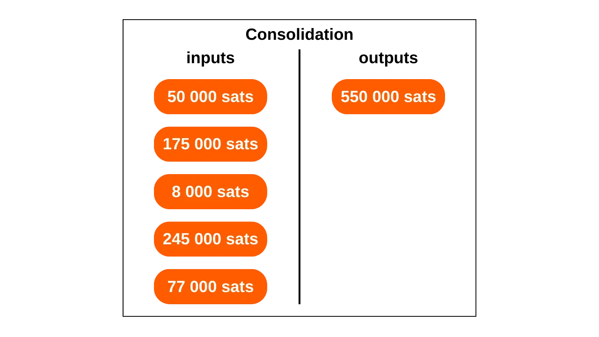
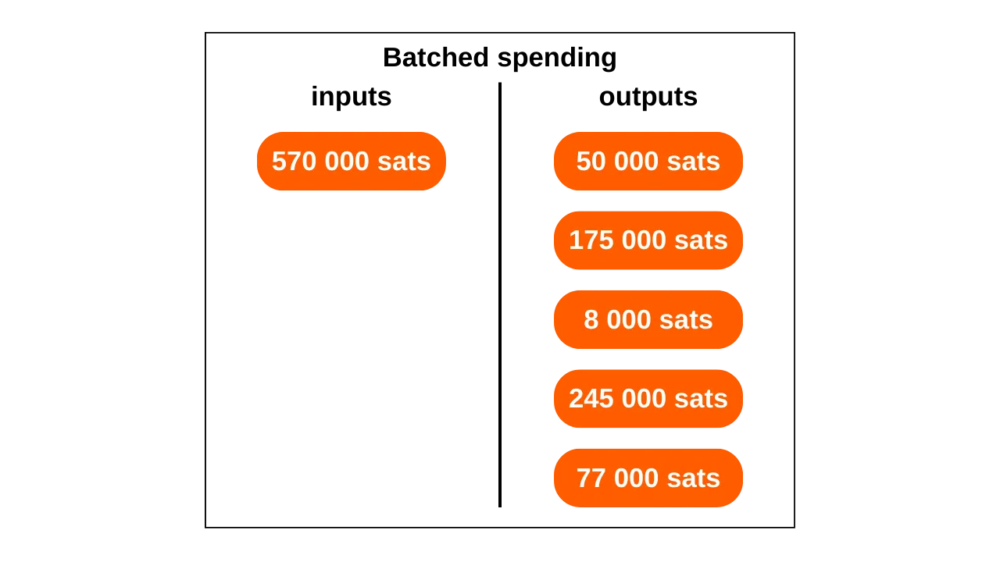
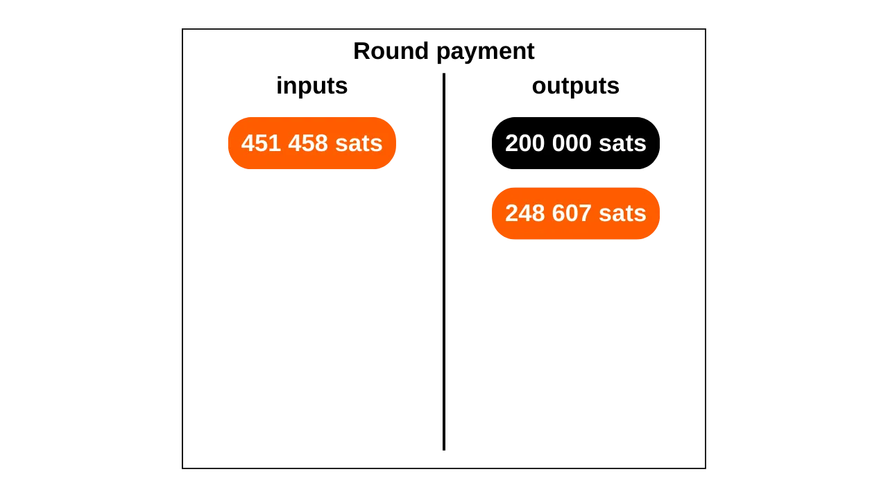
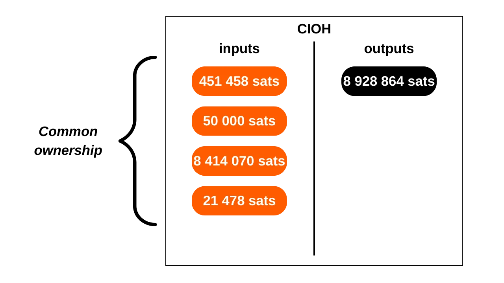
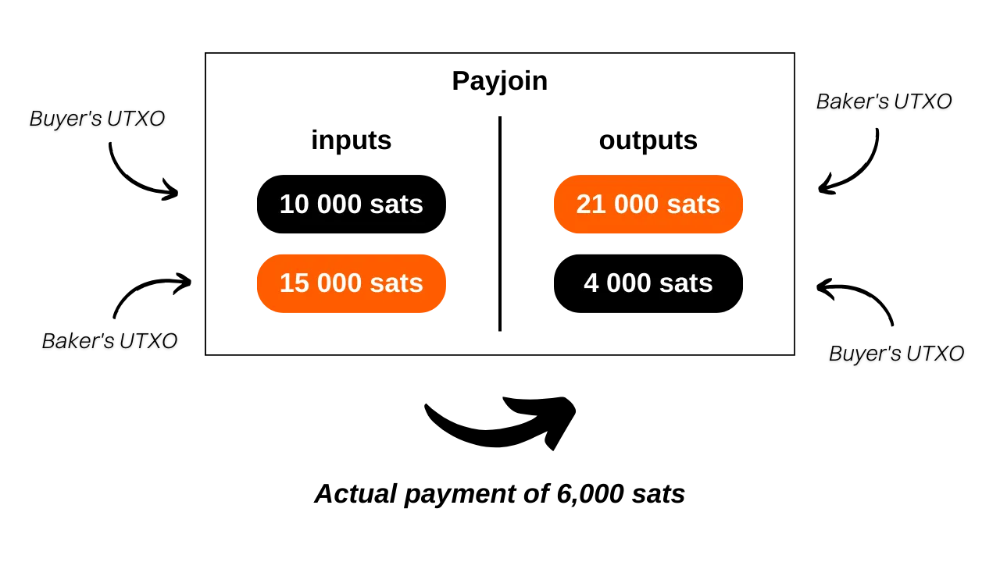

この記事では、Bitcoinにおける基本的なチェーン分析を始めるために必要な、基本的な理論的基盤を学びます。そして、もっと重要なことに、あなたを観察している人々がどのように操作しているかを理解します。この記事はOXTツールに関する実践的なチュートリアルではありません（このトピックは将来のチュートリアルで取り上げますが）、その使用に必要な重要な知識をまとめたものです。提示される各モデル、メトリック、指標について、OXT上の例示トランザクションへのリンクが提供されており、これによりその使用法をよりよく理解し、読みながら実践することができます。

## はじめに
お金の機能の一つは、欲望の二重の偶然の問題を解決することです。物々交換に基づくシステムでは、取引を完了するためには、私のニーズに合った商品を提供している個人を見つけるだけでなく、彼らのニーズを満たす同等の価値の商品を提供する必要があります。このバランスを見つけることは複雑です。そのため、私たちはお金を使い、空間と時間の両方で価値を移動させることができます。

お金がこの問題を解決するためには、商品やサービスを提供する当事者が、後でその金額を使うことができると確信していることが不可欠です。したがって、デジタルでも物理的でも、お金の一片を受け入れる意思があるどんな合理的な個人も、それが以下の二つの基本的な基準を満たしていることを確認します：
- コインは無傷で本物であること。
- そして、二重支払いされていないこと。

物理的なお金を使用する場合、最初の特性が最も確認が複雑です。歴史の異なる時期に、金属コインの完全性は、切り取りや穿孔などの慣行によってしばしば影響を受けました。例えば、古代ローマでは、市民が将来の取引のためにそれらを保持しながら、金貨の端を削って少しの貴金属を集めることが一般的でした。これが、後にコインの端に溝が打たれた理由です。物理的な貨幣媒体での真正性もまた、確認が難しい特性です。現在では、偽造と戦う技術はますます複雑になり、商人は高価な検証システムに投資することを強いられています。

一方、物理通貨では、その性質上、二重支払いは問題ではありません。もし私があなたに10ユーロ紙幣を渡したら、それは私の所有からあなたの所有に不可逆的に移り、それが表す通貨単位の複数回の支出の可能性を排除します。
デジタル通貨においては、挑戦は異なります。コインの真正性と完全性を確保することはしばしば簡単ですが、二重支払いの不在を確保することはより複雑です。すべてのデジタル商品は本質的に情報です。物理的な商品とは異なり、情報は交換中に分割されるのではなく、複製することによって伝播します。例えば、もし私があなたにメールでドキュメントを送ると、それは複製されます。あなたの側では、私が元のドキュメントを削除したかどうかを確実に検証することはできません。

デジタル商品のこの複製を避ける唯一の方法は、システム上のすべての交換を知ることです。この方法で、誰が何を所有しているか、そして取引に基づいて誰もがのアカウントを更新することができます。これは、例えば、記帳式のお金で行われていることです。クレジットカードで商人に10ユーロを支払うと、銀行はこの交換を記録し、元帳を更新します。

Bitcoinでは、二重支払いの防止は同じ方法で行われます。問題のコインが既に使用されたトランザクションがないことを確認することを目指します。これらが一度も使用されていなければ、二重支払いが発生しないことを確信できます。これは、サトシ・ナカモトがホワイトペーパーで述べた有名なフレーズです：「*トランザクションの不在を確認する唯一の方法は、すべてのトランザクションを知ることです。*」
銀行モデルとは異なり、Bitcoinでは中央のエンティティを信頼する必要がないことを望んでいます。したがって、第三者に頼ることなく、すべてのユーザーが二重支払いの不在を確認できる必要があります。このため、全員がすべてのBitcoin取引を認識していなければなりません。
まさにこの情報の公開が、Bitcoin上でのプライバシー保護を複雑にしています。伝統的な銀行システムでは、理論上、取引を知っているのは金融機関のみです。しかし、Bitcoinでは、すべてのユーザーがそれぞれのノードを通じてすべての取引を知ることになります。

この情報の拡散に関する制約のため、Bitcoinのプライバシーモデルは銀行システムのそれとは異なります。後者では、取引がユーザーの身元と関連付けられていますが、情報の流れは信頼できる第三者と公衆の間で遮断されます。言い換えれば、あなたの銀行はあなたが毎朝地元のパン屋でバゲットを買っていることを知っていますが、あなたの隣人はこれらの取引をすべて知ることはありません。Bitcoinの場合、取引と公共領域の間の情報の流れを遮断することができないため、プライバシーモデルはユーザーの身元を取引自体から分離することに依存しています。

*サトシ・ナカモトのホワイトペーパー「Bitcoin: A Peer-to-Peer Electronic Cash System」セクション10「プライバシー」に触発された図。*
Bitcoin取引が公開されているため、それらの間のリンクを確立して関与する当事者に関する情報を推測することが可能になります。この活動は、一般に「チェーン分析」と呼ばれる専門分野を構成しています。この記事では、あなたのビットコインがどのように追跡されているかを理解するために、チェーン分析の基礎を探求することにします。

チェーン分析を専門とする企業の大多数はブラックボックスとして運営され、その方法論を公開していません。したがって、この実践に関する情報を得ることは困難です。この記事の執筆にあたって、私は主に以下の少数の公開リソースに依存しました：
- 私の記事の大部分は、2021年にSamourai Walletが制作した4つの記事のシリーズ「[Understanding Bitcoin Privacy with OXT](https://medium.com/oxt-research/understanding-bitcoin-privacy-with-oxt-part-1-4-8177a40a5923)」から抜粋されています。
- また、[OXT Research](https://medium.com/oxt-research)の様々なレポートや[彼らの無料のチェーン分析ツール](https://oxt.me/)も使用しました。
- より広範には、[@LaurentMT](https://twitter.com/LaurentMT)や[@ErgoBTC](https://twitter.com/ErgoBTC)からの異なるツイートやコンテンツからの知識に依存しています。
- また、[@louneskmt](https://twitter.com/louneskmt)、[@TheoPantamis](https://twitter.com/TheoPantamis)、[@Sosthene___](https://twitter.com/Sosthene___)、そして[@LaurentMT](https://twitter.com/LaurentMT)と一緒に参加した[Space Kek #19](https://podcasters.spotify.com/pod/show/decouvrebitcoin/episodes/SpaceKek-19---Analyse-de-chane--anonsets-et-entropie-e1vfuji)にも触発されました。

これらの著者、開発者、プロデューサーに感謝します。彼らの様々なコンテンツやソフトウェアがなければ、この記事は存在しません。また、このテキストを入念に修正し、専門的なアドバイスを与えてくれたレビュアーにも感謝します：
- [Gilles Cadignan](https://twitter.com/gillesCadignan);
- [Ludovic Lars](https://twitter.com/lugaxker) ([https://viresinnumeris.fr/](https://viresinnumeris.fr/))。
*ご参考までに、記事の最後に特定の用語を定義するための技術的なミニ用語集を追加しました。理解できない単語にアスタリスクが付いている場合は、その定義がページの下部にあります。*

## チェーン分析とは何ですか？
チェーン分析は、ブロックチェーン上でのビットコインの流れを追跡するためのすべての方法を包含する実践です。一般的に、チェーン分析は以前のトランザクションのサンプルでの特徴の観察に依存しています。それから、分析したいトランザクションでこれらの同じ特徴を特定し、妥当な解釈を導き出すことに関わります。この問題解決方法は、十分に良い解決策を見つけるための実践的なアプローチに基づいており、これをヒューリスティックと呼びます。

簡単に言うと、チェーン分析は主に2つのステップで行われます：
1. 既知の特徴の特定；
2. 仮説の導出。

チェーン分析の目的の一つは、ビットコイン上のさまざまな活動をグループ化して、それらを行ったユーザーのユニークさを決定することです。その後、この活動の束を実際のアイデンティティにリンクしようと試みることが可能になります。

私の導入部を思い出してください。ビットコインのプライバシーモデルが元々、ユーザーのアイデンティティをそのトランザクションから分離することに依存していた理由を説明しました。したがって、チェーン分析は不要だと考えるのは誘惑的です。なぜなら、たとえオンチェーン活動をグループ化できたとしても、それらを実際のアイデンティティに関連付けることはできないからです。理論的には、この声明は正確です。暗号鍵ペアはUTXOに条件を設定するために使用されます。本質的に、これらの鍵ペアはその保持者のアイデンティティに関する情報を開示しません。したがって、異なる鍵ペアに関連付けられた活動をグループ化することに成功したとしても、これらの活動の背後にいる実体については何も教えてくれません。

しかし、実際の現実ははるかに複雑です。実際のアイデンティティをオンチェーン活動にリンクするリスクとなる多くの行動があります。分析では、これをエントリーポイントと呼び、それらは多数存在します。もちろん、最も一般的なのはKYC（Know Your Customer）です。規制されたプラットフォームからビットコインを個人の受信アドレスに引き出す場合、ある人々はあなたのアイデンティティをこのアドレスにリンクすることができます。より広く言えば、エントリーポイントはあなたの実生活とビットコイントランザクションとの間の任意の形態の相互作用である可能性があります。例えば、あなたが受信アドレスをソーシャルネットワークに公開した場合、これは分析のためのエントリーポイントになる可能性があります。あなたがあなたのパン屋にビットコインで支払いをする場合、彼らはあなたの顔（あなたのアイデンティティの一部）をビットコインアドレスに関連付けることができます。
これらのエントリーポイントは、ビットコインを使用する際にほぼ避けられません。その範囲を限定しようとするかもしれませんが、それらは存在し続けます。だからこそ、あなたのプライバシーを保護することを目的とした方法を組み合わせることが重要です。あなたの実際のアイデンティティとあなたのトランザクションとの間に受け入れられる分離を維持することは称賛に値するアプローチですが、それだけでは不十分です。実際、あなたのすべてのオンチェーン活動を一緒にグループ化することができれば、最小のエントリーポイントでさえ、あなたが確立していた唯一のプライバシーの層を危険にさらす可能性があります。
したがって、Bitcoinの使用においては、チェーン分析にも対処する必要があります。そうすることで、私たちの活動の集約を最小限に抑え、エントリーポイントが私たちのプライバシーに与える影響を限定することができます。正確には、チェーン分析に対抗するためには、チェーン分析で使用される方法に自分自身を慣れさせるより良いアプローチは何でしょうか？Bitcoinでプライバシーを向上させる方法を知りたい場合は、これらの方法を理解する必要があります。これにより、[Coinjoin](https://planb.network/en/tutorials/privacy/coinjoin-samourai-wallet)や[Payjoin](https://planb.network/en/tutorials/privacy/payjoin)のような技術をよりよく把握し、あなたが犯すかもしれないミスを減らすことができます。
この点で、暗号学と暗号解析との類似性を引き合いに出すことができます。優れた暗号学者は、まず何よりも優れた暗号解析者です。新しい暗号アルゴリズムを想像するためには、それが直面するであろう攻撃を知り、また以前のアルゴリズムがなぜ破られたのかを研究する必要があります。同じ原則がBitcoinのプライバシーにも適用されます。チェーン分析の方法を理解することが、それに対抗する鍵です。それが、この記事を提供する理由です。

チェーン分析が正確な科学ではないことを理解することが重要です。それは以前の観察や論理的な解釈から導き出されたヒューリスティックに依存しています。これらのルールにより、かなり信頼性の高い結果が得られますが、絶対的な精度は決してありません。言い換えれば、チェーン分析には常に結論に導かれる確率の次元が含まれています。2つのアドレスが同じエンティティに属しているということを、より多かれ少なかれ確実に推定することができますが、完全な確実性は常に手の届かないところにあります。

チェーン分析の全体的な目的は、誤りのリスクを最小限に抑えるためにさまざまなヒューリスティックを集約することに正確にあります。これは、ある意味で、私たちを現実に近づけることを可能にする証拠の蓄積です。

これらの有名なヒューリスティックは、後で詳しく説明するさまざまなカテゴリに分類することができます：
- トランザクションパターン（またはトランザクションモデル）；
- トランザクション内の内部ヒューリスティック；
- トランザクション外の外部ヒューリスティック。

Bitcoinにおける最初の2つのヒューリスティックは、サトシ・ナカモト自身によって定式化されたことに注意する価値があります。彼はホワイトペーパーの第10部でそれらについて議論しています。後で見るように、これら2つのヒューリスティックが今日でもチェーン分析において優位性を保っていることを観察することは興味深いです。これらは以下の通りです：
- 共通入力所有権ヒューリスティック（CIOH）；
- そしてアドレスの再利用。

一緒に、観察可能な特性と分析を行うために引き出すことができる解釈を探りましょう。

## トランザクションパターン（またはトランザクションモデル）
トランザクションパターンは、単にブロックチェーン上で見つけることができる典型的なトランザクションモデルであり、その解釈はおそらく知られています。パターンを研究する際、私たちは単一のトランザクションに焦点を当て、高いレベルで分析します。言い換えれば、入力と出力の数だけを見て、より具体的な詳細やその環境には立ち入りません。観察されたモデルから、トランザクションの性質を解釈することができます。次に、その構造についての特性を探し、解釈を導き出します。

### シンプル送信（またはシンプル支払い）
このモデルは、1つ以上のUTXOを入力として消費し、2つのUTXOを出力として生成することが特徴です。

このモデルの解釈は、送金または支払いトランザクションの存在下にあるということです。ユーザーは自身のUTXOを入力として消費し、出力として支払いUTXOとお釣りUTXO（同じユーザーに戻ってくるお釣り）を満たしています。したがって、観察されたユーザーは出力の2つのUTXOのうち1つ（支払いのもの）をもはや所有していない可能性が高いが、もう1つのUTXO（お釣りのもの）はまだ所有しているとわかります。

この時点で、どの出力がどのUTXOを表しているかを特定することはできません。なぜなら、それはこのモデルの目的ではないからです。私たちは、次の部分で学習するヒューリスティックに依存することによって、それを行うことができるでしょう。この段階での私たちの目標は、問題の取引の性質を特定することに限定されています。この場合、それは単純な送金です。

例えば、ここに単純な送金パターンを採用したBitcoinトランザクションがあります：
### スイープ（英語で"sweep"）
このモデルは、入力として単一のUTXOを消費し、出力として単一のUTXOを生成することが特徴です。

このモデルの解釈は、自己転送の存在下にあるということです。ユーザーは自分のビットコインを自分自身に、自分が所有する別のアドレスに転送しました。実際、取引にお釣りがないため、支払いを扱っている可能性は非常に低いです。したがって、観察されたユーザーはこのUTXOをまだ所有している可能性が高いとわかります。

例えば、ここにスイープパターンを採用したBitcoinトランザクションがあります：
[35f1072a0fda5ae106efb4fda871ab40e1f8023c6c47f396441ad4b995ea693d](https://oxt.me/transaction/35f1072a0fda5ae106efb4fda871ab40e1f8023c6c47f396441ad4b995ea693d)

しかし、このタイプのパターンは、取引所アカウント（暗号通貨交換プラットフォーム）への自己転送も明らかにすることがあります。既知のアドレスと取引の文脈の研究によって、それが自己保管ウォレットへのスイープなのか、プラットフォームへの引き出しなのかを知ることができます。

### 統合
このモデルは、入力として複数のUTXOを消費し、出力として単一のUTXOを生成することが特徴です。

このモデルの解釈は、統合の存在下にあるということです。これはBitcoinユーザーの間で一般的な実践であり、取引手数料の可能性のある増加に備えて複数のUTXOを統合することを目的としています。手数料が低い期間にこの操作を実行することにより、将来の手数料を節約することが可能です。

したがって、この取引の背後にいるユーザーは、入力のすべてのUTXOを所有していた可能性が高く、出力のUTXOもまだ所有していると推測できます。従って、それは確実に自己転送です。

スイープと同様に、このタイプのパターンも取引所アカウントへの自己転送を明らかにすることがあります。既知のアドレスと取引の文脈の研究によって、それが自己保管ウォレットへの統合なのか、プラットフォームへの引き出しなのかを知ることができます。

例えば、ここに統合パターンを採用したBitcoinトランザクションがあります：
### バッチ支出モデル
このモデルは、少数のUTXOを入力として消費し（多くの場合は1つのみ）、多数のUTXOを出力として生成することが特徴です。

このモデルの解釈は、バッチ支出の存在下にあるということです。これは、例えば取引所のような、顕著な経済活動を示唆する実践です。バッチ支出により、これらのエンティティは単一のトランザクションに支出を組み合わせることで手数料を節約できます。

UTXOの入力が顕著な経済活動を持つ企業から来ていると推測でき、UTXOの出力は分散されるでしょう。一部はその企業のクライアントに属することになります。他の出力はパートナー企業に向かうかもしれません。最終的には、発行企業に戻る変更が確実に存在します。

例えば、こちらはバッチ支出パターンを採用したBitcoinトランザクションです：
[8a7288758b6e5d550897beedd13c70bcbaba8709af01a7dbcc1f574b89176b43](https://oxt.me/transaction/8a7288758b6e5d550897beedd13c70bcbaba8709af01a7dbcc1f574b89176b43)

### プロトコル固有のトランザクション
トランザクションのパターンの中には、特定のプロトコルの使用を明らかにするモデルも識別できます。例えば、Whirlpool coinjoinsは他のクラシックなトランザクションと区別できる容易に識別可能な構造を持っています。

このパターンの分析は、私たちが協力的なトランザクションの存在下にある可能性が高いことを示唆しています。また、coinjoinの観察も可能です。この後者の仮説が正確である場合、出力の数から参加者のおおよその推定数を提供できるかもしれません。

例えば、こちらは協力的なトランザクションタイプのcoinjoinパターンを採用したBitcoinトランザクションです：
[00601af905bede31086d9b1b79ee8399bd60c97e9c5bba197bdebeee028b9bea](https://oxt.me/transaction/00601af905bede31086d9b1b79ee8399bd60c97e9c5bba197bdebeee028b9bea)

WabisabiタイプやStampsトランザクションなど、独自の特定の構造を持つ他の多くのプロトコルがあります。

## 内部トランザクションヒューリスティックス
内部ヒューリスティックスは、トランザクション自体内に識別される特定の特徴であり、その環境を調査する必要なく、推測を可能にします。トランザクションの全体的な構造に焦点を当てるパターンとは異なり、内部ヒューリスティックスは抽出可能なデータのセットに基づいています。これには以下が含まれます：
- 異なるUTXOの入出金額；
- スクリプトに関連するすべて：受信アドレス、バージョニング、ロックタイム...

一般的に、このタイプのヒューリスティックスにより、特定のトランザクション内での変更を識別できます。そうすることで、異なる複数のトランザクションを通じてエンティティを追跡し続けることができます。
再度、これらのヒューリスティックが完全に正確であるわけではないことを思い出してください。個々に取り上げた場合、それらは私たちがありそうなシナリオを特定することを可能にするだけです。複数のヒューリスティックの蓄積が不確実性を減少させることに寄与しますが、完全に排除することは決してありません。

### 内部の類似性
このヒューリスティックは、同一トランザクションの入力と出力の間の類似性を研究することを含みます。同じ特性が入力とトランザクションの出力のうちの1つにのみ観察される場合、その出力がお釣りである可能性が高いです。

最も明白な特性は、同一トランザクションでの受信アドレスの再利用です。

このヒューリスティックは疑問の余地がほとんどありません。プライベートキーが侵害されていない限り、同じ受信アドレスは必然的に単一のユーザーの活動を明らかにします。その後の解釈は、入力と同じアドレスを持つ出力がトランザクションのお釣りであるということです。これにより、このお釣りから個人を追跡し続けることができます。

例えば、ここにこのヒューリスティックが適用されそうなトランザクションがあります：
[54364146665bfc453a55eae4bfb8fdf7c721d02cb96aadc480c8b16bdeb8d6d0](https://oxt.me/transaction/54364146665bfc453a55eae4bfb8fdf7c721d02cb96aadc480c8b16bdeb8d6d0)

入力と出力の間の類似性は、アドレスの再利用にとどまりません。スクリプトの使用における任意の類似性も、ヒューリスティックの適用を可能にすることができます。例えば、時々、トランザクションの入力と出力の1つの間で同じバージョニングが観察されることがあります。

この図では、入力番号0がP2WPKHスクリプト（SegWit V0で「bc1q」で始まる）を解除することがわかります。出力番号0は同じタイプのスクリプトを使用しています。しかし、出力番号1はP2TRスクリプト（SegWit V1で「bc1p」で始まる）を使用しています。この特性の解釈は、入力と同じバージョニングを持つアドレスがお釣りのアドレスである可能性が高いということです。したがって、それはまだ同じユーザーに属しているでしょう。
ここにこのヒューリスティックが適用されそうなトランザクションがあります：
[db07516288771ce5d0a06b275962ec4af1b74500739f168e5800cbcb0e9dd578](https://oxt.me/transaction/db07516288771ce5d0a06b275962ec4af1b74500739f168e5800cbcb0e9dd578)

このトランザクションでは、入力番号0と出力番号1がP2WPKHスクリプト（SegWit V0）を使用しているのに対し、出力番号0は異なるスクリプトタイプ、P2PKH（レガシー）を使用していることがわかります。

### 丸い数字の支払い
変更を特定するのに役立つ別の内部ヒューリスティックは、丸い数字です。一般的に、単純な支払いパターン（1つの入力と2つの出力）に直面した場合、出力の1つが丸い金額を使っているなら、それは支払いを表しています。

排除法により、1つの出力が支払いを表している場合、もう1つはお釣りを表しています。したがって、入力にいるユーザーがまだお釣りとして特定された出力を保持している可能性が高いと解釈できます。
このヒューリスティックが常に適用可能であるわけではないことに注意すべきです。なぜなら、支払いの大半は依然として法定通貨単位で行われているからです。実際に、フランスの商人がビットコインを受け入れる場合、一般的には、sats（サトシ）で安定した価格を表示しません。彼らは、ユーロでの価格と支払うべきビットコインの量との間で変換を選択することが多いです。したがって、トランザクションの出力には丸い数字があるべきではありません。それにもかかわらず、アナリストは、トランザクションがネットワーク上で放送されたときの為替レートを考慮に入れて、この変換を試みることができます。
もしいつか、ビットコインが私たちの取引で好まれる勘定単位になるならば、このヒューリスティックは分析にさらに役立つかもしれません。

例えば、ここにこのヒューリスティックが適用されそうなトランザクションがあります：
### 大きな支出

単純な支払いモデルの2つのトランザクション出力間に十分に大きな差が見られる場合、大きな出力がお釣りである可能性が高いと推定できます。

最大出力のヒューリスティックはおそらくすべての中で最も不正確です。それ自体で特定された場合、非常に弱いです。しかし、この特性は他のヒューリスティックと組み合わせることで、私たちの解釈の不確実性を減らすことができます。

例えば、丸い金額の出力とより大きな金額の出力を特徴とするトランザクションを調べる場合、丸い支払いのヒューリスティックと最大出力に関するヒューリスティックの共同適用により、私たちの不確実性のレベルを減らすことができます。

例として、ここにこのヒューリスティックが適用されそうなトランザクションがあります：
[b79d8f8e4756d34bbb26c659ab88314c220834c7a8b781c047a3916b56d14dcf](https://oxt.me/transaction/b79d8f8e4756d34bbb26c659ab88314c220834c7a8b781c047a3916b56d14dcf)

## トランザクション外部のヒューリスティック
トランザクション外部のヒューリスティックの研究は、トランザクション自体に固有ではない特定の要素の類似性、パターン、特徴の分析です。言い換えれば、以前はトランザクションに固有の要素を利用することに限定していた場合、私たちは今、外部のヒューリスティックのおかげで分析の範囲をトランザクションの環境に拡大しています。

### アドレスの再利用
これはビットコイナーの間で最もよく知られているヒューリスティックの一つです。アドレスの再利用は、異なるトランザクションと異なるUTXO間のリンクを確立することを可能にします。ビットコイン受取アドレスが複数回使用されると観察されます。

アドレスの再利用の解釈は、このアドレスにロックされているすべてのUTXOが（または属していた）同じエンティティに属しているということです。このヒューリスティックは不確実性の余地がほとんどありません。それが特定されたとき、その後の解釈は現実に対応する可能性が高いです。
導入で説明されているように、このヒューリスティックはサトシ・ナカモト自身によって発見されました。ホワイトペーパーでは、彼はユーザーがそれを生産するのを防ぐための解決策を具体的に言及しており、それは単に新しいトランザクションごとに新しいアドレスを使用することです："*追加のファイアウォールとして、各トランザクションに対して新しいキーペアを使用して、それらを共通の所有者にリンクしないようにすることができます。*"

例えば、ここに複数のトランザクションで再利用されたアドレスがあります：
[bc1qqtmeu0eyvem9a85l3sghuhral8tk0ar7m4a0a0](https://oxt.me/address/bc1qqtmeu0eyvem9a85l3sghuhral8tk0ar7m4a0a0)

### スクリプトとウォレットの指紋の類似性
アドレスの再利用を超えて、同じウォレットやアドレスのクラスターにアクションをリンクすることができる多くの他のヒューリスティックがあります。まず、アナリストはスクリプトの使用における類似性を利用することができます。例えば、マルチシグのような特定の少数派スクリプトは、SegWit V0スクリプトよりも容易に見つけることができます。私たちが隠れるグループが大きければ大きいほど、私たちを見つけることは難しくなります。これは、Coinjoin Whirlpoolプロトコルでは、すべての参加者がまったく同じタイプのスクリプトを使用する理由です。

より広範に、アナリストはウォレットの特徴的な指紋にも焦点を当てることができます。これらは、追跡ヒューリスティックとして利用するために特定しようとするかもしれない使用に特有のプロセスです。言い換えれば、追跡されたエンティティに帰属するトランザクションに同じ内部特性の蓄積が観察される場合、他のトランザクションにおいてこれらの同じ特性を特定しようと試みることができます。

例えば、追跡されたユーザーがシステマティックに変更をP2TR*アドレス（bc1p…）に送ることが特定される場合、このプロセスが繰り返されると、分析の継続のためのヒューリスティックとして使用することができます。UTXOsの順序、出力内の変更の配置、RBF（Replace-by-Fee）のシグナリング、または、バージョン番号やロックタイムなど、他の指紋も使用することができます。
[@LaurentMT](https://twitter.com/LaurentMT)が[Space Kek #19](https://podcasters.spotify.com/pod/show/decouvrebitcoin/episodes/SpaceKek-19---Analyse-de-chane--anonsets-et-entropie-e1vfuji)（フランコフォンのポッドキャスト）で指摘しているように、チェーン分析におけるウォレットの指紋の有用性は時間とともに顕著に増加しています。実際、スクリプトタイプの増加とこれらの新機能の徐々に展開されるウォレットソフトウェアによる違いが強調されます。追跡されたエンティティが使用しているソフトウェアを正確に特定できることさえあります。したがって、ウォレットの指紋の研究は、2010年代初頭に開始されたものよりも、特に最近のトランザクションに関して特に関連があることを理解することが重要です。
要約すると、指紋は、分析を支援するために他のトランザクションで見つけることができる、ウォレットが自動的にまたはユーザーが手動で行う特定の実践です。

### CIOH
CIOHは、「Common Input Ownership Heuristic」の略で、「入力の共通所有権のヒューリスティック」または「共同支出のヒューリスティック」と訳されるかもしれません。これは、トランザクションに複数の入力がある場合、これらはすべて単一のエンティティから来る可能性が高いと述べるヒューリスティックです。その結果、所有権は共通です。

CIOHを適用するには、まず複数の入力を持つトランザクションを観察します。これは2つの入力でも、30の入力でもかまいません。この特性が見つかったら、トランザクションが既知のパターンに当てはまらないかを確認します。例えば、ほぼ同じ量の5つの入力と、まったく同じ量の5つの出力を持つ場合、それがCoinjoin Whirlpoolの構造であることを私たちは知っています。したがって、CIOHは適用できません。

しかし、トランザクションが協力的なトランザクションの既知のパターンに当てはまらない場合、すべての入力が同じエンティティから来る可能性が高いと解釈できます。これは、既知のクラスターを拡大するためや、追跡を続けるために非常に役立ちます。

CIOHは、サトシ・ナカモトによって発見されました。彼はホワイトペーパーの第10部でこれについて議論しています："*[...] マルチインプットトランザクションではリンクが避けられず、それらのインプットが同じ所有者によって所有されていたことを必然的に明らかにします。リスクは、あるキーの所有者が明らかになった場合、そのリンクが同じ所有者に属する他のトランザクションを明らかにする可能性があることです。*"特に興味深いのは、ビットコインの公式ローンチ前でさえ、サトシ・ナカモトがユーザーのプライバシーに関する2つの主要な脆弱性、すなわちCIOHとアドレスの再利用を既に特定していたことです。このような先見の明は非常に注目に値します。なぜなら、これら2つのヒューリスティックは、今日でもチェーン分析で最も有用なものであるからです。

### オフチェーンデータ
明らかに、チェーン分析はオンチェーンデータに限定されるわけではありません。以前の分析からのデータやインターネット上でアクセス可能なデータも、分析を洗練するために使用できます。

例えば、追跡されたトランザクションが系統的に同じビットコインノードからブロードキャストされており、そのIPアドレスが特定できる場合、同じエンティティからの他のトランザクションを特定することが可能かもしれません。

分析者は、以前にオープンソースで行われた分析や自身の以前の分析にも依存する選択肢を持っています。おそらく、既に特定されていたアドレスのクラスターを指すアウトプットを見つけることができるかもしれません。時には、交換所を指すアウトプットに依存することも可能です。これらのプラットフォームのアドレスは一般的に知られています。

同様に、除外による分析を行うことができます。例えば、2つのアウトプットを持つトランザクションの分析中に、そのうちの1つが追跡されているエンティティとは異なる既知のアドレスクラスターにリンクされている場合、もう1つのアウトプットはおそらくおつりを表していると解釈できます。

チェーン分析には、インターネット検索を伴うOSINT（オープンソースインテリジェンス）の一部も含まれます。これが、受信アドレスをソーシャルメディアやウェブサイトに直接、匿名であっても投稿することは勧められない理由です。

### 時間モデル
すぐには思いつかないかもしれませんが、特定の人間の行動はオンチェーンで認識できます。研究で最も有用なのは、あなたの睡眠パターンです！はい、あなたが寝ているとき、おそらくビットコイントランザクションをブロードキャストしていません。一般的にほぼ同じ時間に寝るため、オンチェーン分析では時間分析がよく使用されます。これは、特定のエンティティのトランザクションがビットコインネットワークにブロードキャストされる時間を記録することを単に含みます。これらの時間パターンを分析することで、多くの情報を推測することができます。
まず第一に、時間分析は時々、追跡されているエンティティの性質を特定することができます。トランザクションが24時間にわたって一貫してブロードキャストされていることが観察された場合、これは強い経済活動を示す可能性があります。これらのトランザクションの背後にあるエンティティは、おそらくビジネスであり、国際的であり、おそらく内部で自動化された手続きを持っている可能性があります。

例えば、数週間前に19ビットコインの手数料が誤って割り当てられたトランザクションを分析していたとき、このパターンを認識しました。単純な時間分析により、私たちは自動化されたサービス、したがっておそらく大きなエンティティ、例えば交換所を扱っていると仮定することができました：https://twitter.com/Loic_Pandul/status/1701127409712452072

実際、数日後、資金がPaxos交換を通じてPayPalに属していることが発見されました。

逆に、時間パターンがむしろ特定の16時間に広がっている場合、個々のユーザーや、交換されるボリュームに応じて地元のビジネスを扱っていると推定できます。

観察されたエンティティの性質を超えて、時間パターンはまた、ユーザーのおおよその位置を私たちに与えることができます。このようにして、他のトランザクションと相関させ、これらのタイムスタンプを分析に追加できる追加のヒューリスティックとして使用することができます。
たとえば、以前に言及した複数回使用されたアドレスについて、着信または発信のトランザクションが13時間の間隔に集中していることが観察できます。
*クレジット: [https://oxt.me/address/bc1qqtmeu0eyvem9a85l3sghuhral8tk0ar7m4a0a0](https://oxt.me/address/bc1qqtmeu0eyvem9a85l3sghuhral8tk0ar7m4a0a0)*

この間隔は、おそらくヨーロッパ、アフリカ、または中東に対応していると考えられます。したがって、これらのトランザクションの背後にいるユーザーはそこに住んでいると解釈できます。

異なる観点から、このタイプの時間分析がサトシ・ナカモトが日本ではなく、実際にはアメリカから活動していたという仮説を許可したこともあります：[https://medium.com/@insearchofsatoshi/the-time-zones-of-satoshi-nakamoto-aa40f035178f](https://medium.com/@insearchofsatoshi/the-time-zones-of-satoshi-nakamoto-aa40f035178f)

### 取引量の分析
別の外部ヒューリスティックとして使用できるのは、取引量の分析です。エンティティに帰属される各トランザクションの金額に基づいて、この情報は分析の残りの部分に追加のヒューリスティックとして使用できます。
このヒューリスティックは明らかにかなり弱いですが、他のヒューリスティックに追加することで不確実性を減らすのに役立ちます。

## チェーン分析に対する自己防衛はどうすればよいか？
ビットコインユーザーとして、あなたは自分のプライバシーを守る権利があります。これは、立法的な制約にかかわらず、すべての個人に固有の自己所有および処分の自然権から生じるものです。

このプライバシーを守る自然権は、また、普遍的人権宣言の第12条に記載されている請求権に変換され、「*誰も、そのプライバシー、家族、住居または通信に対する恣意的な干渉、または名誉および評判に対する攻撃を受けることはない。すべての人は、そのような干渉または攻撃に対する法の保護を受ける権利を有する。*」と述べています。

しかし、チェーン分析を専門とする企業のコアビジネスは、まさにあなたのプライベートな領域に侵入し、あなたの通信の機密性を妨げることにあります。前述の請求権に従って、国家が私たちのプライバシーを積極的に守ることを期待したいものですが、彼らはそれを怠るだけでなく、これらの分析会社の資金提供も大幅に支援しています。立法者の前であらゆる譲歩をする意志があるように見える業界団体からの支援を期待することも虚しいでしょう。

事実上、ビットコイン上のプライバシーに関するこの請求権は存在しません。したがって、ユーザーであるあなたが自分の自然権を主張し、通信の機密性を守ることが求められます。これには、チェーン分析に使用されるヒューリスティックを防ぐまたは欺くさまざまな技術や使用慣行を採用することが含まれます。

### ヒューリスティックに陥るのを避ける
まず、より根本的な方法を検討する前に、できるだけチェーン分析に使用されるヒューリスティックへの露出を限定することが望ましいです。前述のように、最も強力なヒューリスティックはアドレスの再利用とCOINJOINです。

ビットコイン上でのプライバシーを確保する基本原則は、ウォレットへの各着信トランザクションに対して新しいクリーンなアドレスを使用することにあります。アドレスの再利用は、ビットコイン上の機密性に対する真の主要な脅威です。
個々のユーザーにとって、受け取る支払いごとに新しいアドレスを生成することは非常に簡単です。現代のウォレットは、「受け取る」をクリックするとすぐに自動的にこれを行います。したがって、取引のプライバシーに少しでも重要性を置くのであれば、新鮮なアドレスを使用することは最低限の要件です。インターネット上で静的な連絡先が必要な場合は、受け取りアドレスを掲載する代わりに、[BIP47を実装するPayNymのようなソリューション](https://planb.network/en/tutorials/privacy/paynym-bip47)を使用できます。次に、チェーン分析に対抗したい場合は、トランザクションの入力でUTXOを統合することを避けてください。最低限、本当に統合する必要がある場合は、同じソースからのUTXOを選好してください。この推奨事項は、UTXOの良好な管理を意味します。ビットコインを購入する際は、統合せずに多くの支払いを行えるよう、大量の転送を選好してください。また、異なるソースからの統合を避けるために、ソフトウェアでUTXOにラベルを付けてその起源を識別することをお勧めします。

より広範囲にわたって、他のすべてのヒューリスティックスについては、それらに陥らないように知っておく必要があります：
- 少数派のスクリプトを使用しないでください。SegWit V0、あるいは可能であればSegWit V1を選好してください；
- 丸い数字での支払いを避けてください。例えば、友人に100k satsを送る必要がある場合は、114,486 satsを送ってください。彼らはお返しにあなたにドリンクを買ってくれるでしょう；
- 支払い出力よりもはるかに大きなおつりを常に持つことは避けてください；
- 受け取りアドレスをソーシャルメディアに投稿しないでください；
- トランザクションをブロードキャストするために自分のノードをTor下で使用してください；
- ビットコインのトランザクションを常に同じ時間にブロードキャストしないようにしてください…

### プライバシーツールの使用
チェーン分析を防ぐまたは欺くために、ビットコインの使用を曖昧にする方法にも頼ることができます。

最も人気のある技術は、確実にCoinjoinでしょう。これは、同じ金額の複数のUTXOを動員する協力的なトランザクション構造です。ここでの目標は、決定論的なリンクを破壊し、過去から現在へ、現在から過去への分析を防ぐことです。Coinjoinは、大きなグループ内であなたのコインを区別できないコインと一緒に隠すことにより、合理的な否認可能性を提供します。Coinjoinについて、技術的にも実践的にも、もっと学びたい場合は、これらの他の記事やチュートリアルを読むことをお勧めします：
- [COINJOIN - SAMOURAI WALLET](https://planb.network/en/tutorials/privacy/coinjoin-samourai-wallet);
- [COINJOIN - SPARROW WALLET](https://planb.network/en/tutorials/privacy/coinjoin-sparrow-wallet);
- [WHIRLPOOL STATS TOOLS - ANONSETS](https://planb.network/en/tutorials/privacy/wst-anonsets).

CoinJoinはコインの合理的な否認可能性を作り出すための優れたツールですが、すべてのユーザープライバシーのニーズに最適化されているわけではありません。具体的には、CoinJoinは支払いツールとして設計されていません。合理的な否認可能性の生産を完璧にするために、交換される金額について非常に厳格です。トランザクション出力の金額を自由に選択できないため、CoinJoinはビットコインでの支払いには使用できません。

例えば、私がプライバシーを最適化しながらビットコインでバゲットを支払いたいと想像してください。CoinJoinからの結果としてのUTXOの金額を選択することができないため、私はパン屋が設定した価格に支出の金額を調整することができずに困るでしょう。したがって、CoinJoinは支払いトランザクションには不適切です。
プライバシーのニーズをより具体的な使用例で満たすために考案された他のツールがあります。例えば、[PayJoin](https://planb.network/en/tutorials/privacy/payjoin)は、2人の参加者のみを含み、支払いを可能にする構造に基づいた、ミニCoinJoinの一種です。
PayJoinのユニークさは、通常のトランザクションのように見えるが、実際には2人のユーザー間のミニCoinJoinであるトランザクションを生成する能力にあります。この構造では、トランザクションの受取人が実際の送信者とともに入力の中に参加します。したがって、受取人は実際の支払いを容易にするトランザクション内に自分自身への支払いを挿入します。

例えば、10,000 satsのUTXOから6,000 satsでバゲットを購入し、PayJoinを行いたい場合、あなたのパン屋は彼らに属する15,000 satsのUTXOをあなたの元のトランザクションに入力として追加します。これは、彼らが出力として完全に回収することで、ヒューリスティックを欺くためです：

スキームの理解を簡素化するために、トランザクション手数料は無視されます。

PayJoinの目標は二つあります。第一に、COHを通じてデコイを作成することで外部の観察者を欺くことを目指しています。実際に、このトランザクションを観察するアナリストは、COHを適用できると考え、異なる入力の共通の所有権を推定します。しかし、実際にはこの仮定は正しくなく、一つの入力は送信者に属し、もう一つは受取人が所有しています。したがって、PayJoinはアナリストを誤った道に導くことでチェーン分析を破壊します。
PayJoinの二つ目の目標は、その出力の特定の構造のおかげで、トランザクションの実際の金額についてアナリストを欺くことです。したがって、PayJoinはステガノグラフィーの分野に属します。これにより、実際のトランザクションの金額を欺瞞的なトランザクション内に隠すことができます。

実際に、PayJoinを使用してバゲットを購入する例に戻ると、外部の観察者は4,000 satsまたは21,000 satsの支払いを扱っていると考えるかもしれません。実際には、バゲットの支払いは6,000 satsです：21,000 - 15,000 = 6,000。したがって、実際の支払いの価値は、チェーン分析のためのデコイとして機能する偽の支払い内に隠されています。

PayJoinやCoinJoinを超えて、チェーン分析をブロックするか欺くかのどちらかを可能にする多くの他のBitcoinトランザクション構造があります。これらの中には、柔軟なミニCoinJoinを作成するか、柔軟なミニCoinJoinを模倣することを可能にする[Stonewall](https://planb.network/en/tutorials/privacy/stonewall)や[StonewallX2](https://planb.network/en/tutorials/privacy/stonewall-x2)トランザクションが含まれます。また、自分自身への偽の転送の多数を作成することでビットコインの所有権の変更をシミュレートする[Ricochet](https://planb.network/en/tutorials/privacy/ricochet)トランザクションもあります。

これらのツールはすべて、モバイルのSamourai WalletとPCのSparrow Walletで利用可能です。これらの特定のトランザクション構造についてもっと学びたい場合は、私のチュートリアルを発見することをお勧めします：
- [PAYJOIN](https://planb.network/en/tutorials/privacy/payjoin);
- [PAYJOIN - SAMOURAI WALLET](https://planb.network/en/tutorials/privacy/payjoin-samourai-wallet);
- [PAYJOIN - SPARROW WALLET](https://planb.network/en/tutorials/privacy/payjoin-sparrow-wallet);
- [STONEWALL](https://planb.network/en/tutorials/privacy/stonewall);
- [STONEWALL X2](https://planb.network/en/tutorials/privacy/stonewall-x2);
- [RICOCHET](https://planb.network/en/tutorials/privacy/ricochet).

## 結論
チェーン分析は、オンチェーン上でビットコインの流れを追跡しようとする実践です。これを行うために、分析者はパターンや特徴を探し、よりまたはあまりにも妥当な仮説や解釈を導き出します。

これらのヒューリスティックの精度は異なります：いくつかは他よりも高い確実性を提供しますが、どれも絶対に間違いがないと主張することはできません。しかし、いくつかの収束するヒューリスティックの蓄積は、この固有の疑問を軽減することができますが、それを完全に排除することは不可能です。
これらの方法を三つの明確な主要カテゴリーに分類することができます：
- パターン、各トランザクションの全体的な構造に焦点を当てる；
- 内部ヒューリスティック、トランザクションのすべての詳細を徹底的に調査することを可能にするが、そのコンテキストには及ばない；
- 外部ヒューリスティック、トランザクションをその環境で分析し、洞察を提供する可能性のある任意の外部データを含む。

ビットコインユーザーとして、チェーン分析の基本原則を習得し、それに効果的に対抗し、プライバシーを保護することが不可欠です。

## 技術ミニ用語集:
**P2PKH:** Pay to Public Key Hashの略称です。UTXOに支払い条件を設定するために使用される標準的なスクリプトモデルです。これにより、ビットコインを公開鍵のハッシュ、つまり受信アドレスにロックすることができます。このスクリプトはレガシー標準に関連付けられており、ビットコインの最初のバージョンでサトシ・ナカモトによって導入されました。P2PKでは公開鍵がスクリプトに明示的に含まれているのに対し、P2PKHでは公開鍵の暗号学的な印影を使用し、"受信アドレス"とも呼ばれるいくつかのメタデータを使用します。このスクリプトには公開鍵のSHA256のRIPEMD160ハッシュが含まれ、資金にアクセスするためには、このハッシュに一致する公開鍵と、関連する秘密鍵から生成された有効なデジタル署名を提供する必要があります。P2PKHアドレスはBase58Check形式を使用してエンコードされ、チェックサムを使用することでタイプミスに対する耐性を持ちます。これらのアドレスは常に数字の1で始まります。
**P2TR:** 「Pay to Taproot」の略語で、「根への支払い」という意味です。UTXOに支出条件を設定するために使用される標準的なスクリプトモデルです。P2TRは、2021年11月にTaprootの実装と共に導入されました。これは、暗号鍵を集約するためにSchnorrプロトコルを利用し、また、MAST（Merkelized Alternative Script Tree、マークル化された代替スクリプトツリー）として知られる代替スクリプトのためにマークルツリーを使用します。従来のトランザクションでは支出条件が公開されることがありますが（時には受領時、時には支出時）、P2TRは複雑なスクリプトを単一の公開鍵の背後に隠すことを可能にします。技術的には、P2TRスクリプトはビットコインを一意のSchnorr公開鍵、Kとして示される鍵にロックします。しかし、このK鍵は実際には公開鍵Pと、ScriptPubKeysのリストのマークルルートから計算される公開鍵Mの集約です。鍵の集約はSchnorr署名プロトコルを使用して行われます。P2TRスクリプトでロックされたビットコインは、公開鍵Pの署名を公開するか、マークルツリーに含まれるスクリプトのいずれかを満たすことによって、2つの異なる方法で支出することができます。最初のオプションは「キーパス」と呼ばれ、2番目は「スクリプトパス」と呼ばれます。したがって、P2TRはユーザーがビットコインを公開鍵または複数のスクリプトに送ることを可能にします。このスクリプトのもう一つの利点は、P2TR出力を支出する方法が複数あるにもかかわらず、使用されるもののみが支出時に明らかにされ、使用されない代替案がプライベートのままでいられることです。例えば、Schnorr鍵の集約のおかげで、公開鍵P自体が集約された鍵であり、マルチシグを表す可能性があります。P2TRはバージョン1のSegWit出力であり、P2TR入力の署名はトランザクションの証人部分に格納され、ScriptSigには含まれません。P2TRアドレスはBech32mエンコーディングを使用し、bc1pで始まります。

**P2WPKH:** 「Pay to Witness Public Key Hash」の略語です。UTXOに支出条件を設定するために使用される標準的なスクリプトモデルです。P2WPKHは、2017年8月のSegWitの実装と共に導入されました。このスクリプトは、公開鍵のハッシュ、つまり受信アドレスに基づいてビットコインをロックする点で、P2PKH（Pay to Public Key Hash）と似ています。違いは、署名とスクリプトがトランザクションにどのように含まれるかにあります。P2WPKHの場合、署名スクリプト情報（ScriptSig）は従来のトランザクション構造からWitnessと呼ばれる別のセクションに移動されます。この移動はSegWit（Segregated Witness、分離証人）アップデートの特徴です。この技術は、メインボディのトランザクションデータのサイズを削減しながらも、検証に必要なスクリプト情報を別のセクションに保持するという利点があります。その結果、P2WPKHトランザクションは一般的にLegacyトランザクションと比較して手数料が安くなります。P2WPKHアドレスはBech32エンコーディングを使用して書かれており、BCHチェックサムのおかげでより簡潔で誤りにくい書き方になっています。これらのアドレスは常にbc1qで始まり、Legacy受信アドレスと容易に区別できます。P2WPKHはバージョン0のSegWit出力です。
**UTXO:** 「Unspent Transaction Output」の略語です。UTXOは、まだ使われていない、または新しいトランザクションの入力として使用されていないトランザクションの出力を指します。UTXOは、ユーザーが所有し、現在使用可能なビットコインの一部を表しています。各UTXOは特定の出力スクリプトに関連付けられており、ビットコインを使用するために必要な条件を定義します。ビットコインのトランザクションは、これらのUTXOを入力として消費し、出力として新しいUTXOを作成します。UTXOモデルはビットコインにとって基本的なものであり、トランザクションが存在しないビットコインや既に使われたビットコインを使おうとしていないことを簡単に検証できるようにします。本質的に、UTXOはビットコインの一部です。