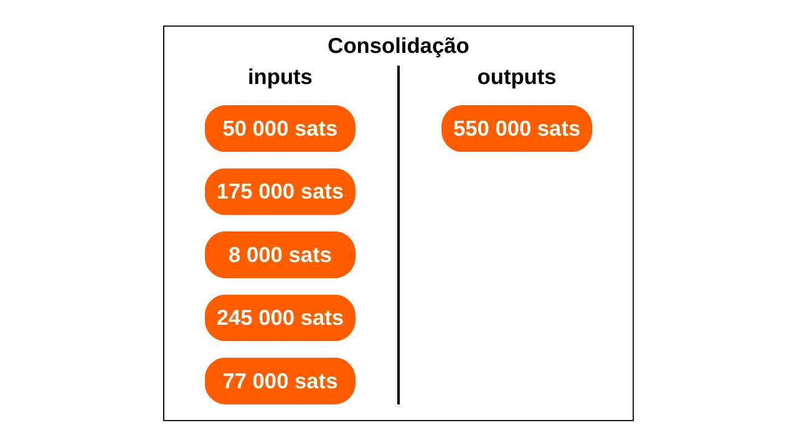
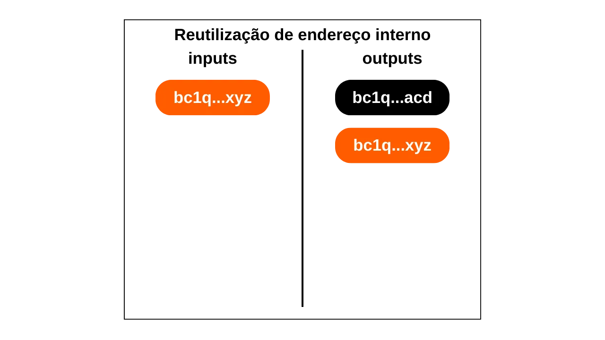
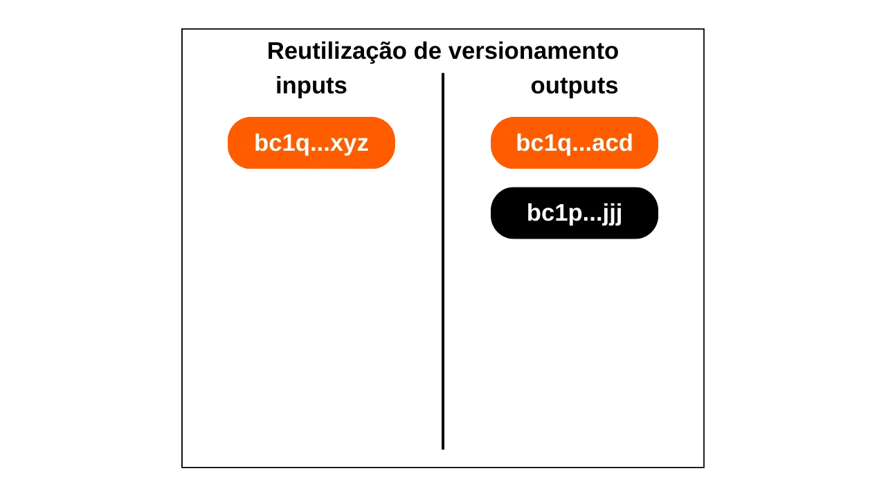
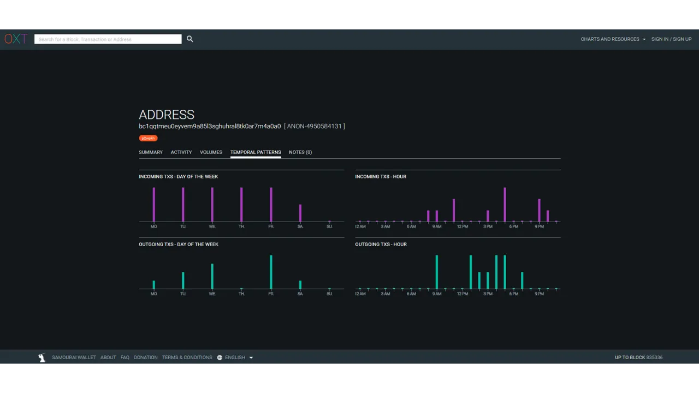
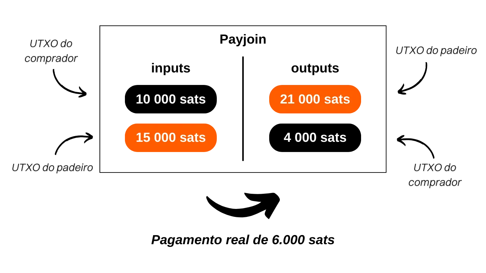

***ATENÇÃO:** Após a prisão dos fundadores da Samourai Wallet e a apreensão dos seus servidores em 24 de abril, **o site OXT.me atualmente não está acessível**. No entanto, ainda é possível que essa ferramenta seja relançada nas próximas semanas. Enquanto isso, você ainda pode aproveitar este tutorial para entender as bases da análise de cadeia no Bitcoin. Todas as heurísticas e padrões que apresento continuam aplicáveis às transações de Bitcoin. Embora essas ferramentas sejam menos otimizadas do que OXT, você pode usar temporariamente [Mempool.space](https://mempool.space/) ou [Bitcoin Explorer](https://bitcoinexplorer.org/) para aplicar os conceitos teóricos deste artigo.*

_Estamos acompanhando de perto a evolução deste caso, bem como os desenvolvimentos relacionados aos ferramentas associadas. Fique assegurado de que atualizaremos este tutorial à medida que novas informações estiverem disponíveis._

_Este tutorial é fornecido apenas para fins educativos e informativos. Não endossamos nem encorajamos o uso dessas ferramentas para fins criminosos. É responsabilidade de cada usuário cumprir as leis em sua jurisdição._

---

Neste artigo, você aprenderá os fundamentos teóricos essenciais necessários para embarcar em análises básicas de cadeia no Bitcoin e, mais importante, para entender como aqueles que observam você operam. Embora este artigo não seja um tutorial prático sobre a ferramenta OXT (um tópico que abordaremos em um tutorial futuro), ele compila um conjunto de conhecimentos cruciais para seu uso. Para cada modelo, métrica e indicador apresentado, um link para uma transação de exemplo no OXT é fornecido, o que permitirá que você entenda melhor seu uso e pratique ao lado de sua leitura.

## Introdução
Uma das funções do dinheiro é resolver o problema da dupla coincidência de desejos. Em um sistema baseado em escambo, completar uma troca requer não apenas encontrar um indivíduo que esteja oferecendo um bem que atenda à minha necessidade, mas também fornecer-lhes um bem de valor equivalente que satisfaça a própria necessidade deles. Encontrar esse equilíbrio prova ser complexo. É por isso que recorremos ao dinheiro, que nos permite mover valor tanto no espaço quanto no tempo.

Para que o dinheiro resolva esse problema, é essencial que a parte que fornece um bem ou serviço esteja convencida de sua capacidade de gastar essa soma mais tarde. Assim, qualquer indivíduo racional disposto a aceitar uma peça de dinheiro, seja digital ou física, garantirá que ela atenda a dois critérios fundamentais:
- A moeda deve estar intacta e autêntica;
- e ela não deve ser gasta duas vezes.

Se usarmos dinheiro físico, é a primeira característica que é a mais complexa de afirmar. Em diferentes períodos da história, a integridade das moedas metálicas muitas vezes foi afetada por práticas como o recorte ou a perfuração. Por exemplo, durante a Roma antiga, era comum para os cidadãos raspar as bordas das moedas de ouro para coletar um pouco de metal precioso, enquanto ainda as mantinham para transações futuras. É por isso que, mais tarde, sulcos foram estampados na borda das moedas. A autenticidade também é uma característica difícil de verificar em um meio monetário físico. Atualmente, as técnicas para combater a falsificação são cada vez mais complexas, forçando os comerciantes a investir em sistemas de verificação caros.

Por outro lado, devido à sua natureza, o gasto duplo não é um problema para as moedas físicas. Se eu lhe der uma nota de €10, ela irrevogavelmente deixa minha posse para entrar na sua, excluindo assim qualquer possibilidade de gasto múltiplo das unidades monetárias que representa.
Para a moeda digital, o desafio é diferente. Garantir a autenticidade e integridade de uma moeda é frequentemente mais simples, mas assegurar a ausência de gasto duplo é mais complexo. Todo bem digital é essencialmente informação. Ao contrário dos bens físicos, a informação não se divide durante as trocas, mas propaga-se multiplicando-se. Por exemplo, se eu enviar um documento por e-mail, ele então é duplicado. Do seu lado, você não pode verificar com certeza que eu deletei o documento original.

A única maneira de evitar essa duplicação de um bem digital é estar ciente de todas as trocas no sistema. Dessa forma, pode-se saber quem possui o quê e atualizar as contas de todos com base nas transações realizadas. Isso é o que é feito, por exemplo, com o dinheiro escritural. Quando você paga €10 a um comerciante com cartão de crédito, o banco anota essa troca e atualiza o livro-razão.

No Bitcoin, a prevenção de gasto duplo é feita da mesma maneira. Busca-se confirmar a ausência de uma transação que já tenha gasto as moedas em questão. Se estas nunca foram usadas, então podemos ter certeza de que não ocorrerá gasto duplo. Esta é a famosa frase de Satoshi Nakamoto no White Paper: "*A única maneira de confirmar a ausência de uma transação é estar ciente de todas as transações.*"
Ao contrário do modelo bancário, no Bitcoin, não desejamos ter que confiar em uma entidade central. Portanto, todos os usuários devem ser capazes de confirmar a ausência de gastos duplos, sem depender de um terceiro. Assim, todos devem estar cientes de todas as transações de Bitcoin.
É precisamente essa disseminação pública de informações que complica a proteção da privacidade no Bitcoin. No sistema bancário tradicional, em teoria, apenas a instituição financeira está ciente das transações realizadas. No entanto, no Bitcoin, todos os usuários são informados de todas as transações, por meio de seus respectivos nós.

Devido a essa restrição na disseminação, o modelo de privacidade do Bitcoin difere do sistema bancário. Neste último, as transações são associadas à identidade do usuário, mas o fluxo de informações é interrompido entre o terceiro confiável e o público. Em outras palavras, seu banqueiro sabe que você compra sua baguete todas as manhãs na padaria local, mas seu vizinho não está ciente de todas essas transações. No caso do Bitcoin, uma vez que o fluxo de informações não pode ser interrompido entre transações e o domínio público, o modelo de privacidade depende de separar a identidade do usuário das próprias transações.

*Diagrama inspirado por Satoshi Nakamoto no White Paper: Bitcoin: Um Sistema de Dinheiro Eletrônico Peer-to-Peer, seção 10 "Privacidade".*
Uma vez que as transações de Bitcoin são tornadas públicas, torna-se possível estabelecer ligações entre elas para deduzir informações sobre as partes envolvidas. Esta atividade até constitui uma especialidade em si, comumente chamada de "análise de cadeia". Neste artigo, convido você a explorar os fundamentos da análise de cadeia para entender como seus bitcoins são rastreados.

A maioria das empresas especializadas em análise de cadeia opera como caixas-pretas e não divulga suas metodologias. Portanto, é difícil obter informações sobre essa prática. Para a redação deste artigo, baseei-me principalmente nos poucos recursos abertos disponíveis:
- A maior parte do meu artigo é extraída da série de quatro artigos chamada: [Entendendo a Privacidade do Bitcoin com OXT](https://medium.com/oxt-research/understanding-bitcoin-privacy-with-oxt-part-1-4-8177a40a5923), produzida pela Samourai Wallet em 2021;
- Também utilizei vários relatórios da [Pesquisa OXT](https://medium.com/oxt-research), bem como sua ferramenta gratuita de análise de cadeia;
- De forma mais ampla, meu conhecimento vem dos diferentes tweets e conteúdos de [@LaurentMT](https://twitter.com/LaurentMT) e [@ErgoBTC](https://twitter.com/ErgoBTC);
- Também me inspirei em [Space Kek #19](https://podcasters.spotify.com/pod/show/decouvrebitcoin/episodes/SpaceKek-19---Analyse-de-chane--anonsets-et-entropie-e1vfuji) no qual participei ao lado de [@louneskmt](https://twitter.com/louneskmt), [@TheoPantamis](https://twitter.com/TheoPantamis), [@Sosthene___](https://twitter.com/Sosthene___), e [@LaurentMT](https://twitter.com/LaurentMT).

Gostaria de agradecer aos seus autores, desenvolvedores e produtores. Sem seus diversos conteúdos e softwares, este artigo não existiria. Agradeço também aos revisores que meticulosamente corrigiram este texto e me agraciaram com seus conselhos especializados:
- [Gilles Cadignan](https://twitter.com/gillesCadignan);
- [Ludovic Lars](https://twitter.com/lugaxker) ([https://viresinnumeris.fr/](https://viresinnumeris.fr/)).
*Para sua informação, adicionei um miniglossário técnico no final do artigo para definir certos termos. Se você encontrar uma palavra que não entende com um asterisco, sua definição está no final da página.*

## O que é análise de cadeia?
Análise de cadeia é uma prática que engloba todos os métodos para rastrear fluxos de Bitcoin na blockchain. Geralmente, a análise de cadeia depende da observação de características em amostras de transações anteriores. Em seguida, envolve a identificação dessas mesmas características em uma transação que se deseja analisar e deduzir interpretações plausíveis. Este método de resolução de problemas, baseado em uma abordagem prática para encontrar uma solução suficientemente boa, é o que se chama de heurística.

Para simplificar, a análise de cadeia é feita em duas etapas principais:
1. A identificação de características conhecidas;
2. A dedução de hipóteses.

Um dos objetivos da análise de cadeia é agrupar várias atividades no Bitcoin para determinar a unicidade do usuário que as realizou. Posteriormente, será possível tentar vincular esse conjunto de atividades a uma identidade real.

Lembre-se da minha introdução. Eu expliquei por que o modelo de privacidade do Bitcoin originalmente dependia de separar a identidade do usuário de suas transações. Portanto, seria tentador pensar que a análise de cadeia é desnecessária, já que mesmo se alguém conseguir agrupar atividades on-chain, elas não podem ser associadas a uma identidade real. Teoricamente, esta afirmação é precisa. Pares de chaves criptográficas são usados para estabelecer condições nos UTXOs. Por essência, esses pares de chaves não divulgam nenhuma informação sobre a identidade de seus detentores. Assim, mesmo que alguém tenha sucesso em agrupar atividades associadas a diferentes pares de chaves, isso não nos diz nada sobre a entidade por trás dessas atividades.

No entanto, a realidade prática é muito mais complexa. Existem uma infinidade de comportamentos que arriscam vincular uma identidade real a uma atividade on-chain. Na análise, isso é chamado de ponto de entrada, e há muitos deles. O mais comum, claro, é o KYC (Conheça Seu Cliente). Se você retirar seus bitcoins de uma plataforma regulamentada para um de seus endereços de recebimento pessoais, então algumas pessoas são capazes de vincular sua identidade a este endereço. De forma mais ampla, um ponto de entrada pode ser qualquer forma de interação entre sua vida real e uma transação Bitcoin. Por exemplo, se você publicar um endereço de recebimento em suas redes sociais, isso pode ser um ponto de entrada para análise. Se você fizer um pagamento em bitcoins para seu padeiro, eles podem associar seu rosto (que faz parte da sua identidade) a um endereço Bitcoin.
Esses pontos de entrada são quase inevitáveis ao usar o Bitcoin. Embora se possa procurar limitar seu escopo, eles permanecerão presentes. É por isso que é crucial combinar métodos voltados para preservar sua privacidade. Embora manter uma separação aceitável entre sua identidade real e suas transações seja uma abordagem louvável, ela permanece insuficiente. De fato, se todas as suas atividades on-chain puderem ser agrupadas, então até mesmo o menor ponto de entrada poderia comprometer a única camada de privacidade que você havia estabelecido.
Portanto, também é necessário lidar com a análise de cadeia no nosso uso do Bitcoin. Ao fazer isso, podemos minimizar a agregação de nossas atividades e limitar o impacto de um ponto de entrada na nossa privacidade. Precisamente, para melhor contrariar a análise de cadeia, que abordagem melhor do que familiarizar-se com os métodos usados na análise de cadeia? Se você quer saber como melhorar sua privacidade no Bitcoin, você deve entender esses métodos. Isso permitirá que você compreenda melhor técnicas como [Coinjoin](https://planb.network/pt/tutorials/privacy/coinjoin-samourai-wallet) ou [Payjoin](https://planb.network/pt/tutorials/privacy/payjoin), e reduzir os erros que você pode cometer.
Nisso, podemos traçar uma analogia com criptografia e criptoanálise. Um bom criptógrafo é, antes de tudo, um bom criptoanalista. Para imaginar um novo algoritmo de criptografia, é preciso saber quais ataques ele enfrentará, e também estudar por que algoritmos anteriores foram quebrados. O mesmo princípio se aplica à privacidade no Bitcoin. Entender os métodos de análise de cadeia é a chave para se proteger contra ela. É por isso que estou oferecendo este artigo.

É crucial entender que a análise de cadeia não é uma ciência exata. Ela se baseia em heurísticas derivadas de observações anteriores ou interpretações lógicas. Essas regras permitem resultados bastante confiáveis, mas nunca com precisão absoluta. Em outras palavras, a análise de cadeia sempre envolve uma dimensão de probabilidade nas conclusões tiradas. Podemos estimar com mais ou menos certeza que dois endereços pertencem à mesma entidade, mas a certeza total sempre estará fora de alcance.

O objetivo total da análise de cadeia reside precisamente na agregação de várias heurísticas para minimizar o risco de erro. É, de certa forma, uma acumulação de evidências que nos permite chegar mais perto da realidade.

Essas famosas heurísticas podem ser agrupadas em diferentes categorias que detalharemos juntos:
- Padrões de transação (ou modelos de transação);
- Heurísticas internas à transação;
- Heurísticas externas à transação.

Vale ressaltar que as duas primeiras heurísticas sobre o Bitcoin foram formuladas pelo próprio Satoshi Nakamoto. Ele as discute na parte 10 do White Paper. Como veremos mais tarde, é interessante observar que essas duas heurísticas ainda mantêm uma preeminência na análise de cadeia hoje. São elas:
- a Heurística de Propriedade de Entrada Comum (CIOH);
- e reutilização de endereço.

Vamos explorar juntos as características observáveis e as interpretações que podem ser tiradas para conduzir uma análise.

## Padrões de transação (ou modelos de transação)
Um padrão de transação é simplesmente um modelo de transação típico que pode ser encontrado na blockchain, cuja interpretação é provavelmente conhecida. Ao estudar padrões, focaremos em uma única transação que analisaremos em alto nível. Em outras palavras, olharemos apenas para o número de entradas e saídas, sem nos deter em seus detalhes mais específicos ou seu ambiente. A partir do modelo observado, seremos capazes de interpretar a natureza da transação. Em seguida, procuraremos características sobre sua estrutura e deduziremos uma interpretação.

### O envio simples (ou pagamento simples)
Este modelo é caracterizado pelo consumo de um ou mais UTXOs como entrada e a produção de dois UTXOs como saída.

A interpretação deste modelo é que estamos na presença de uma transação de envio ou pagamento. O usuário consumiu seus próprios UTXOs como entrada para satisfazer na saída um UTXO de pagamento e um UTXO de troco (troco voltando para o mesmo usuário). Portanto, sabemos que o usuário observado provavelmente não está mais na posse de um dos dois UTXOs na saída (o de pagamento), mas ainda está na posse do outro UTXO (o de troco).
Neste ponto, é impossível para nós especificar qual saída representa qual UTXO, já que esse não é o objetivo deste modelo. Seremos capazes de fazer isso ao nos basearmos nas heurísticas que estudaremos na parte seguinte. Nesta etapa, nosso objetivo é limitado a identificar a natureza da transação em questão, que é, neste caso, um simples envio.

Por exemplo, aqui está uma transação Bitcoin que adota o padrão de envio simples:
### Sweep ("varredura" em inglês)
Este modelo é caracterizado pelo consumo de um único UTXO como entrada e a produção de um único UTXO como saída.

A interpretação deste modelo é que estamos na presença de uma auto-transferência. O usuário transferiu seus bitcoins para si mesmo, para outro endereço que possui. De fato, uma vez que não há troco na transação, é muito improvável que estejamos lidando com um pagamento. Então sabemos que o usuário observado provavelmente ainda está na posse deste UTXO.

Por exemplo, aqui está uma transação Bitcoin que adota o padrão de varredura:
[35f1072a0fda5ae106efb4fda871ab40e1f8023c6c47f396441ad4b995ea693d](https://mempool.space/tx/35f1072a0fda5ae106efb4fda871ab40e1f8023c6c47f396441ad4b995ea693d)

No entanto, este tipo de padrão também pode revelar uma auto-transferência para uma conta de exchange (plataforma de troca de criptomoedas). Será o estudo de endereços conhecidos e o contexto da transação que nos permitirá saber se é uma varredura para uma carteira de auto-custódia ou um saque para uma plataforma.

### Consolidação
Este modelo é caracterizado pelo consumo de vários UTXOs como entrada e a produção de um único UTXO como saída.

A interpretação deste modelo é que estamos na presença de uma consolidação. Esta é uma prática comum entre os usuários de Bitcoin, visando mesclar vários UTXOs em antecipação a um possível aumento nas taxas de transação. Ao realizar esta operação durante um período em que as taxas estão baixas, é possível economizar em taxas futuras.

Podemos deduzir que o usuário por trás desta transação provavelmente estava na posse de todos os UTXOs na entrada e ainda está na posse do UTXO na saída. Portanto, é certamente uma auto-transferência.

Assim como a varredura, este tipo de padrão também pode revelar uma auto-transferência para uma conta de exchange. Será o estudo de endereços conhecidos e o contexto da transação que nos permitirá saber se é uma consolidação para uma carteira de auto-custódia ou um saque para uma plataforma.

Por exemplo, aqui está uma transação Bitcoin que adota o padrão de consolidação:
[77c16914211e237a9bd51a7ce0b1a7368631caed515fe51b081d220590589e94](https://mempool.space/tx/77c16914211e237a9bd51a7ce0b1a7368631caed515fe51b081d220590589e94)### O Modelo de Gastos em Lote
Este modelo é caracterizado pelo consumo de poucos UTXOs como entrada (muitas vezes apenas um) e a produção de muitos UTXOs como saída.

A interpretação deste modelo é que estamos na presença de um gasto em lote. Esta é uma prática que provavelmente revela uma atividade econômica significativa, como uma exchange, por exemplo. O gasto em lote permite que essas entidades economizem em taxas ao combinar seus gastos em uma única transação.

Podemos deduzir que a entrada de UTXO vem de uma empresa com atividade econômica significativa e que os UTXOs de saída se dispersarão. Alguns pertencerão aos clientes da empresa. Outros podem ir para empresas parceiras. Finalmente, certamente haverá um troco que retorna à empresa emissora.

Por exemplo, aqui está uma transação Bitcoin que adota o padrão de gasto em lote:
[8a7288758b6e5d550897beedd13c70bcbaba8709af01a7dbcc1f574b89176b43](https://mempool.space/tx/8a7288758b6e5d550897beedd13c70bcbaba8709af01a7dbcc1f574b89176b43)

### Transações Específicas de Protocolo
Entre os padrões de transação, também podemos identificar modelos que revelam o uso de um protocolo específico. Por exemplo, os coinjoins do Whirlpool terão uma estrutura facilmente identificável que permite diferenciá-los de outras transações clássicas.

A análise deste padrão sugere que provavelmente estamos na presença de uma transação colaborativa. Também é possível observar um coinjoin. Se esta última hipótese se provar precisa, então o número de saídas poderia nos fornecer uma estimativa aproximada do número de participantes.

Por exemplo, aqui está uma transação Bitcoin que adota o padrão do tipo de transação colaborativa coinjoin:
[00601af905bede31086d9b1b79ee8399bd60c97e9c5bba197bdebeee028b9bea](https://mempool.space/tx/00601af905bede31086d9b1b79ee8399bd60c97e9c5bba197bdebeee028b9bea)

Existem muitos outros protocolos que têm suas próprias estruturas específicas. Assim, poderíamos distinguir transações do tipo Wabisabi ou transações Stamps, por exemplo.

## Heurísticas de Transação Interna
Uma heurística interna é uma característica específica identificada dentro de uma transação em si, sem a necessidade de examinar seu ambiente, o que nos permite fazer deduções. Ao contrário dos padrões que se concentram na estrutura geral da transação, as heurísticas internas são baseadas no conjunto de dados extraíveis. Isso inclui:
- Os montantes de diferentes UTXOs, tanto de entrada quanto de saída;
- Tudo relacionado a scripts: endereços de recebimento, versionamento, locktimes...

Geralmente, este tipo de heurística nos permite identificar o troco em uma transação específica. Ao fazer isso, podemos então continuar a rastrear uma entidade através de múltiplas transações diferentes.
Mais uma vez, lembro-lhes que essas heurísticas não são absolutamente precisas. Tomadas individualmente, elas apenas nos permitem identificar cenários plausíveis. É o acúmulo de várias heurísticas que contribui para reduzir a incerteza, sem nunca eliminá-la completamente.

### Semelhanças Internas
Esta heurística envolve estudar as semelhanças entre as entradas e saídas da mesma transação. Se a mesma característica for observada nas entradas e em apenas uma das saídas da transação, então é provável que esta saída constitua o troco.

A característica mais óbvia é a reutilização de um endereço de recebimento na mesma transação.

Esta heurística deixa pouco espaço para dúvidas. A menos que sua chave privada tenha sido comprometida, o mesmo endereço de recebimento inevitavelmente revela a atividade de um único usuário. A interpretação que se segue é que o troco da transação é a saída com o mesmo endereço que a entrada. Isso nos permite continuar rastreando o indivíduo a partir deste troco.

Por exemplo, aqui está uma transação onde esta heurística pode provavelmente ser aplicada:
[54364146665bfc453a55eae4bfb8fdf7c721d02cb96aadc480c8b16bdeb8d6d0](https://mempool.space/tx/54364146665bfc453a55eae4bfb8fdf7c721d02cb96aadc480c8b16bdeb8d6d0)

Essas semelhanças entre as entradas e saídas não param na reutilização de endereços. Qualquer semelhança no uso de scripts pode permitir a aplicação de uma heurística. Por exemplo, às vezes a mesma versão entre uma entrada e uma das saídas da transação pode ser observada.

Neste diagrama, podemos ver que a entrada número 0 desbloqueia um script P2WPKH (SegWit V0 começando com "bc1q"). A saída número 0 usa o mesmo tipo de script. No entanto, a saída número 1 usa um script P2TR (SegWit V1 começando com "bc1p"). A interpretação desta característica é que é provável que o endereço com a mesma versão que a entrada seja o endereço de troco. Portanto, ainda pertenceria ao mesmo usuário.
Aqui está uma transação onde esta heurística pode provavelmente ser aplicada:
[db07516288771ce5d0a06b275962ec4af1b74500739f168e5800cbcb0e9dd578](https://mempool.space/tx/db07516288771ce5d0a06b275962ec4af1b74500739f168e5800cbcb0e9dd578)

Nesta transação, podemos ver que a entrada número 0 e a saída número 1 usam scripts P2WPKH (SegWit V0), enquanto a saída número 0 usa um tipo de script diferente, P2PKH (Legacy).

### Pagamentos de Números Redondos
Outra heurística interna que pode nos ajudar a identificar o troco é a dos números redondos. Geralmente, quando enfrentamos um padrão de pagamento simples (1 entrada e 2 saídas), se uma das saídas gasta um valor redondo, então ela representa o pagamento.

Por processo de eliminação, se uma saída representa o pagamento, a outra representa o troco. Portanto, podemos interpretar que é provável que o usuário na entrada ainda possua a saída identificada como sendo o troco.
Deve-se notar que essa heurística nem sempre é aplicável, já que a maioria dos pagamentos ainda é feita em unidades de moeda fiduciária. De fato, quando um comerciante na França aceita bitcoin, geralmente, eles não exibem preços estáveis em sats. Eles prefeririam optar por uma conversão entre o preço em euros e a quantidade em bitcoins a ser paga. Portanto, não deve haver um número redondo na saída da transação. No entanto, um analista poderia tentar realizar essa conversão levando em conta a taxa de câmbio vigente quando a transação foi transmitida na rede.
Se um dia, o bitcoin se tornar a unidade de conta preferida em nossas trocas, essa heurística poderia se tornar ainda mais útil para análise.

Por exemplo, aqui está uma transação onde essa heurística pode provavelmente ser aplicada:
### O Grande Gasto

Quando uma lacuna suficientemente grande é identificada entre duas saídas de transação em um modelo de pagamento simples, pode-se estimar que a saída maior é provavelmente o troco.

Esta heurística da maior saída é provavelmente a mais imprecisa de todas. Se identificada por si só, é bastante fraca. No entanto, essa característica pode ser combinada com outras heurísticas para reduzir a incerteza de nossa interpretação.

Por exemplo, se examinarmos uma transação que apresenta uma saída com um valor redondo e outra saída com um valor maior, a aplicação conjunta da heurística de pagamentos redondos e aquela referente à maior saída nos permite reduzir nosso nível de incerteza.

Por exemplo, aqui está uma transação onde essa heurística pode provavelmente ser aplicada:
[b79d8f8e4756d34bbb26c659ab88314c220834c7a8b781c047a3916b56d14dcf](https://mempool.space/tx/b79d8f8e4756d34bbb26c659ab88314c220834c7a8b781c047a3916b56d14dcf)

## Heurísticas Externas à Transação
O estudo de heurísticas externas é a análise de semelhanças, padrões e características de certos elementos que não são inerentes à própria transação. Em outras palavras, se anteriormente nos limitávamos a explorar elementos intrínsecos à transação com heurísticas internas, agora estamos expandindo nosso campo de análise para o ambiente da transação graças às heurísticas externas.

### Reutilização de Endereços
Esta é uma das heurísticas mais conhecidas entre os Bitcoiners. A reutilização de endereços permite estabelecer uma ligação entre diferentes transações e diferentes UTXOs. É observada quando um endereço de recebimento de Bitcoin é usado várias vezes.

A interpretação da reutilização de endereços é que todos os UTXOs bloqueados neste endereço pertencem (ou pertenceram) à mesma entidade. Esta heurística deixa pouco espaço para incerteza. Quando é identificada, a interpretação que se segue tem uma grande chance de corresponder à realidade.
Como explicado na introdução, esta heurística foi descoberta pelo próprio Satoshi Nakamoto. No White Paper, ele menciona especificamente uma solução para evitar que os usuários a produzam, que é simplesmente usar um novo endereço para cada nova transação: "*Como uma barreira adicional, um novo par de chaves poderia ser usado para cada transação para mantê-las desvinculadas de um proprietário comum.*"

Por exemplo, aqui está um endereço reutilizado em várias transações:
[bc1qqtmeu0eyvem9a85l3sghuhral8tk0ar7m4a0a0](https://mempool.space/address/bc1qqtmeu0eyvem9a85l3sghuhral8tk0ar7m4a0a0)

### A Semelhança de Scripts e Impressões Digitais de Carteiras
Além da reutilização de endereços, existem muitas outras heurísticas que podem vincular ações à mesma carteira ou a um cluster de endereços.
Primeiramente, um analista pode usar semelhanças no uso de scripts. Por exemplo, certos scripts minoritários como multisig podem ser mais facilmente identificados do que os scripts SegWit V0. Quanto maior o grupo no qual nos escondemos, mais difícil é nos localizar. É por isso que, no protocolo Coinjoin Whirlpool, todos os participantes usam exatamente o mesmo tipo de script.

De forma mais ampla, um analista também pode se concentrar nas impressões digitais características de uma carteira. Estes são processos específicos de um uso que alguém pode procurar identificar para explorá-los como heurísticas de rastreamento. Em outras palavras, se observa uma acumulação das mesmas características internas em transações atribuídas à entidade rastreada, pode-se tentar identificar essas mesmas características em outras transações.

Por exemplo, pode ser identificado que o usuário rastreado envia sistematicamente seu troco para endereços P2TR* (bc1p…). Se esse processo se repete, ele pode ser usado como uma heurística para a continuação de nossa análise. Outras impressões digitais também podem ser usadas, como a ordem dos UTXOs, o posicionamento do troco nas saídas, o sinal de RBF (Replace-by-Fee), ou até mesmo, o número da versão e o locktime.
Como [@LaurentMT](https://twitter.com/LaurentMT) especifica em [Space Kek #19](https://podcasters.spotify.com/pod/show/decouvrebitcoin/episodes/SpaceKek-19---Analyse-de-chane--anonsets-et-entropie-e1vfuji) (um podcast francófono), a utilidade das impressões digitais de carteiras na análise de cadeias está aumentando significativamente com o tempo. De fato, o crescente número de tipos de scripts e a implantação cada vez mais gradual dessas novas funcionalidades pelo software de carteira acentuam as diferenças. Até acontece de se poder identificar com precisão o software usado pela entidade rastreada. Portanto, é importante entender que o estudo da impressão digital de uma carteira é particularmente relevante para transações recentes, mais do que para aquelas iniciadas no início dos anos 2010.
Para resumir, uma impressão digital pode ser qualquer prática específica, realizada automaticamente pela carteira ou manualmente pelo usuário, que pode ser encontrada em outras transações para auxiliar em nossa análise.

### O CIOH
O CIOH, para "Common Input Ownership Heuristic," que poderia ser traduzido como "heurística de propriedade comum de entradas" ou "heurística de co-gasto," é uma heurística que afirma que quando uma transação tem múltiplas entradas, estas provavelmente vêm de uma única entidade. Consequentemente, a propriedade é comum.

Para aplicar o CIOH, primeiro observa-se uma transação que tem múltiplas entradas. Isso pode ser duas entradas, bem como trinta entradas. Uma vez que essa característica é identificada, verifica-se se a transação não se encaixa em um padrão conhecido. Por exemplo, se ela tem 5 entradas com quantias aproximadamente iguais e 5 saídas com exatamente a mesma quantia, sabemos que é a estrutura de um Coinjoin Whirlpool. Portanto, o CIOH não pode ser aplicado.

No entanto, se a transação não se encaixa em nenhum padrão conhecido de transação colaborativa, então pode-se interpretar que todas as entradas provavelmente vêm da mesma entidade. Isso pode ser muito útil para expandir um cluster já conhecido ou para continuar o rastreamento.

O CIOH foi descoberto por Satoshi Nakamoto. Ele discute isso na parte 10 do White Paper: "*[...] a ligação é inevitável com transações de múltiplas entradas, que necessariamente revelam que suas entradas pertenciam ao mesmo proprietário. O risco é que, se o proprietário de uma chave for revelado, as ligações podem revelar outras transações que pertenciam ao mesmo proprietário.*" É particularmente fascinante notar que Satoshi Nakamoto, mesmo antes do lançamento oficial do Bitcoin, já havia identificado as duas principais vulnerabilidades de privacidade para os usuários, nomeadamente o CIOH e a reutilização de endereços. Tal previsão é bastante notável, pois essas duas heurísticas permanecem, até hoje, as mais úteis na análise de cadeias.

### Dados Off-chain
Obviamente, a análise de cadeias não se limita a dados on-chain. Qualquer dado de análises anteriores ou acessível na Internet também pode ser usado para refinar uma análise.

Por exemplo, se for observado que as transações rastreadas são sistematicamente transmitidas a partir do mesmo nó Bitcoin e seu endereço IP pode ser identificado, pode ser possível identificar outras transações da mesma entidade.

O analista também tem a opção de confiar em análises anteriormente tornadas open-source, ou em suas próprias análises anteriores. Talvez se encontre uma saída que aponte para um cluster de endereços que já havia sido identificado. Às vezes, também é possível confiar em saídas que apontam para uma exchange, sendo os endereços dessas plataformas geralmente conhecidos.

Da mesma forma, pode-se realizar uma análise por eliminação. Por exemplo, se durante a análise de uma transação com duas saídas, uma delas estiver ligada a um cluster de endereços conhecido, mas distinto da entidade que está sendo rastreada, então pode-se interpretar que a outra saída provavelmente representa o troco.

A análise de cadeias também inclui uma parte de OSINT (Open Source Intelligence) que é um pouco mais generalista com pesquisas na internet. É por isso que é aconselhável não postar endereços de recebimento diretamente nas redes sociais ou em um site, seja sob um pseudônimo ou não.

### Modelos Temporais
Pode-se não pensar imediatamente nisso, mas certos comportamentos humanos são reconhecíveis on-chain. O mais útil em um estudo é o seu padrão de sono! Sim, quando você está dormindo, presumivelmente não está transmitindo transações Bitcoin. Como geralmente você dorme aproximadamente nos mesmos horários, é comum usar análises temporais na análise on-chain. Isso simplesmente envolve registrar os horários em que as transações de uma determinada entidade são transmitidas para a rede Bitcoin. Analisar esses padrões temporais nos permite deduzir inúmeras informações.
Antes de mais nada, uma análise temporal pode, às vezes, identificar a natureza da entidade que está sendo rastreada. Se observarmos que as transações são transmitidas consistentemente ao longo de 24 horas, isso pode indicar uma forte atividade econômica. A entidade por trás dessas transações provavelmente é um negócio, potencialmente internacional, e talvez com procedimentos automatizados internamente.

Por exemplo, eu havia reconhecido esse padrão algumas semanas atrás enquanto analisava uma transação que havia alocado erroneamente 19 bitcoins em taxas. Uma simples análise temporal me permitiu hipotetizar que estávamos lidando com um serviço automatizado, e portanto provavelmente uma grande entidade como uma exchange: https://twitter.com/Loic_Pandul/status/1701127409712452072

De fato, alguns dias depois, descobriu-se que os fundos pertenciam ao PayPal, via a exchange Paxos.

Por outro lado, se observarmos que o padrão temporal está mais espalhado por 16 horas específicas, então pode-se estimar que estamos lidando com um usuário individual, ou talvez um negócio local dependendo dos volumes trocados.

Além da natureza da entidade observada, o padrão temporal também pode nos dar uma localização aproximada do usuário. Podemos assim correlacionar outras transações, e usar o timestamp destas como uma heurística adicional que pode ser adicionada à nossa análise.
Por exemplo, no endereço reutilizado várias vezes que mencionei anteriormente, pode-se observar que as transações, sejam elas de entrada ou saída, estão concentradas em um intervalo de 13 horas. 
*Crédito: OXT*

Esse intervalo provavelmente corresponde à Europa, África ou Oriente Médio. Portanto, pode-se interpretar que o usuário por trás dessas transações vive lá.

Em um registro diferente, também é uma análise temporal desse tipo que permitiu a hipótese de que Satoshi Nakamoto não estava operando do Japão, mas de fato dos Estados Unidos: [https://medium.com/@insearchofsatoshi/the-time-zones-of-satoshi-nakamoto-aa40f035178f](https://medium.com/@insearchofsatoshi/the-time-zones-of-satoshi-nakamoto-aa40f035178f)

### A Análise de Volumes
Outra heurística externa que pode ser usada é a análise dos volumes de negociação. Baseando-se nos montantes presentes em cada transação atribuída a uma entidade, essa informação pode ser usada como uma heurística adicional para o restante da análise.
Essa heurística é obviamente bastante fraca, mas pode ajudar a reduzir a incerteza quando adicionada a outras heurísticas.

## Como se proteger contra a análise de cadeia?
Como usuário do Bitcoin, você tem o direito de proteger sua privacidade. Isso decorre dos seus direitos naturais de possuir e dispor de si mesmo, que são inerentes a cada indivíduo, independentemente de qualquer restrição legislativa.

Esse direito natural de proteger a própria privacidade também é convertido em um direito-afirmação, consagrado no Artigo 12 da Declaração Universal dos Direitos Humanos, afirmando que "*Ninguém será sujeito a interferências arbitrárias em sua privacidade, família, lar ou correspondência, nem a ataques à sua honra e reputação. Todos têm o direito à proteção da lei contra tais interferências ou ataques.*".

No entanto, o negócio principal das empresas especializadas em análise de cadeia consiste precisamente em invadir sua esfera privada, comprometendo assim a confidencialidade de sua correspondência. Embora se possa esperar que, de acordo com o direito-afirmação mencionado, os estados defendessem vigorosamente nossa privacidade, eles não apenas negligenciam fazê-lo, mas também financiam substancialmente o financiamento dessas empresas de análise. Também seria em vão esperar apoio das associações do setor, que parecem dispostas a fazer todas as concessões diante do legislador.

De fato, esse direito-afirmação à privacidade no Bitcoin não existe. Portanto, cabe a você, usuário, afirmar seu direito natural e proteger a confidencialidade de sua correspondência. Isso envolve adotar várias técnicas e práticas de uso, que permitirão prevenir ou enganar as heurísticas usadas para análise de cadeia.

### Evitando cair em heurísticas
Antes de tudo, antes de considerar métodos mais radicais, é aconselhável limitar o máximo possível nossa exposição às heurísticas usadas para análise de cadeia. Como mencionado anteriormente, as duas heurísticas mais poderosas são a reutilização de endereços e o COINJOIN.

O princípio básico para garantir sua privacidade no Bitcoin reside em usar um novo endereço limpo para cada transação de entrada em sua carteira. A reutilização de endereços é verdadeiramente a principal ameaça à confidencialidade no Bitcoin.
Para um usuário individual, gerar um novo endereço para cada pagamento recebido é muito simples. Carteiras modernas fazem isso automaticamente assim que você clica em "Receber". Portanto, se você dá a mínima importância para a privacidade de suas transações, usar endereços novos representa o mínimo indispensável. Se você precisar de um ponto de contato estático na internet, em vez de colocar um endereço de recebimento, você pode usar soluções [como PayNym que implementa BIP47](https://planb.network/pt/tutorials/privacy/paynym-bip47). A seguir, se você quer agir contra a análise de cadeia, evite mesclar UTXOs na entrada de uma transação. No mínimo, se realmente precisar mesclar, prefira UTXOs que tenham a mesma fonte. Esta recomendação implica ter uma boa gestão dos seus UTXOs. Ao comprar seus bitcoins, prefira transferências envolvendo grandes quantidades para maximizar o número de pagamentos que você pode fazer sem ter que mesclar. Eu também aconselho você a etiquetar seus UTXOs no seu software para identificar sua origem e evitar mesclar de fontes distintas.

De forma mais ampla, para todas as outras heurísticas, você precisa conhecê-las para tentar não cair nelas:
- Não use scripts minoritários. Prefira SegWit V0 ou possivelmente SegWit V1;
- Não faça pagamentos em números redondos. Por exemplo, se você precisa enviar 100k sats para um amigo, envie 114.486 sats. Eles vão te comprar uma bebida em troca;
- Tente não ter sempre um troco que é muito maior do que o valor do pagamento;
- Não poste seus endereços de recebimento nas redes sociais;
- Use seu próprio nó sob Tor para transmitir suas transações;
- Tente não transmitir sempre suas transações de Bitcoin no mesmo horário…

### Usando ferramentas de privacidade
Você também pode recorrer a métodos que tornam o uso do Bitcoin ambíguo para prevenir ou enganar a análise de cadeia.

A técnica mais popular é certamente o Coinjoin, uma estrutura de transação colaborativa que mobiliza vários UTXOs dos mesmos valores. O objetivo aqui é quebrar ligações determinísticas, impedindo análises do presente para o passado e do passado para o presente. Coinjoin permite uma negação plausível ao esconder suas moedas dentro de um grande grupo de moedas indistinguíveis. Se você quer aprender mais sobre Coinjoin, tanto tecnicamente quanto na prática, sugiro que leia estes outros artigos e tutoriais:
- [COINJOIN - SAMOURAI WALLET](https://planb.network/pt/tutorials/privacy/coinjoin-samourai-wallet);
- [COINJOIN - SPARROW WALLET](https://planb.network/pt/tutorials/privacy/coinjoin-sparrow-wallet);
- [WHIRLPOOL STATS TOOLS - ANONSETS](https://planb.network/pt/tutorials/privacy/wst-anonsets).

CoinJoin é uma excelente ferramenta para criar uma negação plausível para moedas, mas não é otimizado para todas as necessidades de privacidade do usuário. Especificamente, CoinJoin não foi projetado para se tornar uma ferramenta de pagamento. É muito rígido sobre os valores trocados para aperfeiçoar a produção de negação plausível. Uma vez que não se pode escolher livremente o valor dos outputs da transação, CoinJoin não pode ser usado para fazer pagamentos em bitcoins.

Por exemplo, imagine que eu queira pagar minha baguete em bitcoins otimizando minha privacidade. Dada a impossibilidade de selecionar o valor do UTXO resultante do CoinJoin, eu me encontraria incapaz de ajustar o valor do meu gasto ao preço estabelecido pelo padeiro. Portanto, CoinJoin prova ser inadequado para transações de pagamento.
Outras ferramentas foram concebidas para atender às necessidades de privacidade em casos de uso mais específicos. Por exemplo, temos o [PayJoin](https://planb.network/pt/tutorials/privacy/payjoin), uma espécie de mini-CoinJoin, envolvendo apenas dois participantes e baseado em uma estrutura que permite o pagamento.
A singularidade do PayJoin reside na sua capacidade de produzir uma transação que parece comum, enquanto na verdade é um mini-CoinJoin entre dois usuários. Nesta estrutura, o destinatário da transação participa entre as entradas ao lado do remetente real. Assim, o destinatário insere um pagamento para si mesmo dentro da transação que facilita o pagamento real.

Por exemplo, se você comprar uma baguete do seu padeiro por 6.000 sats de um UTXO de 10.000 sats, e você quiser fazer um PayJoin, seu padeiro adicionará um UTXO de 15.000 sats que pertence a eles como uma entrada para sua transação original, que eles recuperarão totalmente como uma saída, para enganar as heurísticas:

As taxas de transação são negligenciadas para simplificar o entendimento do esquema.

Os objetivos do PayJoin são duplos. Primeiramente, visa enganar um observador externo criando um chamariz através do COH. De fato, quando um analista observa esta transação, eles pensarão que podem aplicar o COH, e assim presumir uma propriedade comum das diferentes entradas. Na realidade, essa suposição é incorreta, pois uma entrada pertence ao remetente, enquanto a outra é de propriedade do destinatário. Portanto, o PayJoin corrompe a análise de cadeia ao levar o analista por um caminho errado.
O segundo objetivo do PayJoin é enganar o analista sobre o valor real da transação, graças à estrutura específica de suas saídas. Assim, o PayJoin se enquadra no campo da esteganografia. Ele permite que o valor real da transação seja ocultado dentro de uma transação enganosa.

De fato, se revisarmos nosso exemplo de usar o PayJoin para comprar uma baguete, um observador externo pode pensar que estamos lidando com um pagamento de 4.000 sats ou 21.000 sats. Na realidade, o pagamento pela baguete é de 6.000 sats: 21.000 - 15.000 = 6.000. O valor real do pagamento, portanto, está escondido dentro de um pagamento falso que atua como um chamariz para análise de cadeia.

Além do PayJoin e CoinJoin, existem muitas outras estruturas de transação Bitcoin que bloqueiam a análise de cadeia ou a enganam. Entre estas, eu poderia mencionar as transações [Stonewall](https://planb.network/pt/tutorials/privacy/stonewall) e [StonewallX2](https://planb.network/pt/tutorials/privacy/stonewall-x2), que permitem fazer um mini Coinjoin flexível ou imitar um mini Coinjoin flexível. Há também transações [Ricochet](https://planb.network/pt/tutorials/privacy/ricochet) que simulam uma mudança de propriedade de bitcoins fazendo uma multitude de transferências falsas para si mesmo.

Todas essas ferramentas estão disponíveis no Samourai Wallet em dispositivos móveis e no Sparrow Wallet em PC. Se você quiser aprender mais sobre essas estruturas de transação específicas, aconselho que descubra meus tutoriais:
- [PAYJOIN](https://planb.network/pt/tutorials/privacy/payjoin);
- [PAYJOIN - SAMOURAI WALLET](https://planb.network/pt/tutorials/privacy/payjoin-samourai-wallet);
- [PAYJOIN - SPARROW WALLET](https://planb.network/pt/tutorials/privacy/payjoin-sparrow-wallet);
- [STONEWALL](https://planb.network/pt/tutorials/privacy/stonewall);
- [STONEWALL X2](https://planb.network/pt/tutorials/privacy/stonewall-x2);
- [RICOCHET](https://planb.network/pt/tutorials/privacy/ricochet).

## Conclusão
A análise de cadeia é uma prática que envolve tentar rastrear o fluxo de bitcoins na cadeia. Para fazer isso, os analistas procuram padrões e características a fim de elaborar hipóteses e interpretações mais ou menos plausíveis.

A precisão dessas heurísticas varia: algumas fornecem um grau maior de certeza do que outras, mas nenhuma pode se declarar infalível. No entanto, a acumulação de várias heurísticas convergentes pode mitigar essa dúvida inerente, embora permaneça impossível eliminá-la completamente.
Podemos categorizar esses métodos em três categorias principais distintas:
- Padrões, focados na estrutura geral de cada transação;
- Heurísticas internas, que permitem a análise exaustiva de todos os detalhes de uma transação, sem se estender ao seu contexto;
- Heurísticas externas, que abrangem a análise da transação em seu ambiente, bem como quaisquer dados externos que possam fornecer insights.

Como usuário do Bitcoin, é essencial dominar os princípios fundamentais da análise de cadeia para efetivamente contrariá-la e, assim, proteger sua privacidade.

## Mini-Glossário Técnico:
**P2PKH:** acrônimo para Pay to Public Key Hash. É um modelo de script padrão usado para estabelecer condições de gasto em um UTXO. Permite bloquear bitcoins em um hash de uma chave pública, ou seja, em um endereço de recebimento. Este script está associado ao padrão Legacy e foi introduzido nas primeiras versões do Bitcoin por Satoshi Nakamoto. Diferentemente do P2PK, onde a chave pública é explicitamente incluída no script, P2PKH usa uma impressão criptográfica da chave pública, com alguns metadados, também chamada de "endereço de recebimento". Este script inclui o hash RIPEMD160 do SHA256 da chave pública e estipula que, para acessar os fundos, o destinatário deve fornecer uma chave pública que corresponda a este hash, bem como uma assinatura digital válida gerada a partir da chave privada associada. Os endereços P2PKH são codificados usando o formato Base58Check, o que lhes confere resistência a erros tipográficos por meio do uso de um checksum. Esses endereços sempre começam com o número 1.
**P2TR:** acrônimo para Pay to Taproot ("pagar para a raiz"). É um modelo de script padrão usado para estabelecer condições de gasto em um UTXO. O P2TR foi introduzido com a implementação do Taproot em novembro de 2021. Utiliza o protocolo Schnorr para agregar chaves criptográficas, bem como árvores Merkle para scripts alternativos, conhecidos como MAST (Merkelized Alternative Script Tree). Diferentemente das transações tradicionais onde as condições de gasto são expostas publicamente (às vezes no recebimento, às vezes no gasto), o P2TR permite ocultar scripts complexos atrás de uma única chave pública aparente. Tecnicamente, um script P2TR bloqueia bitcoins em uma chave pública Schnorr única, denotada como K. No entanto, essa chave K é na verdade um agregado de uma chave pública P e uma chave pública M, sendo esta última calculada a partir da raiz Merkle de uma lista de ScriptPubKeys. A agregação de chaves é realizada usando o protocolo de assinatura Schnorr. Bitcoins bloqueados com um script P2TR podem ser gastos de duas maneiras distintas: ou publicando uma assinatura para a chave pública P, ou satisfazendo um dos scripts contidos na árvore Merkle. A primeira opção é chamada de "caminho da chave" e a segunda de "caminho do script". Assim, o P2TR permite que os usuários enviem bitcoins tanto para uma chave pública quanto para múltiplos scripts de sua escolha. Outra vantagem deste script é que, embora existam várias maneiras de gastar uma saída P2TR, apenas a que é usada precisa ser revelada no momento do gasto, permitindo que as alternativas não utilizadas permaneçam privadas. Por exemplo, graças à agregação de chaves Schnorr, a chave pública P pode ser ela mesma uma chave agregada, representando potencialmente um multisig. P2TR é uma saída SegWit versão 1, o que significa que assinaturas para entradas P2TR são armazenadas na testemunha de uma transação, e não no ScriptSig. Endereços P2TR usam a codificação Bech32m e começam com bc1p.

**P2WPKH:** Acrônimo para Pay to Witness Public Key Hash. É um modelo de script padrão usado para estabelecer condições de gasto em um UTXO. P2WPKH foi introduzido com a implementação do SegWit em agosto de 2017. Este script é semelhante ao P2PKH (Pay to Public Key Hash), na medida em que também bloqueia bitcoins com base no hash de uma chave pública, ou seja, um endereço de recebimento. A diferença reside em como assinaturas e scripts são incluídos na transação. No caso do P2WPKH, as informações do script de assinatura (ScriptSig) são movidas da estrutura tradicional da transação para uma seção separada chamada Testemunha. Esse movimento é uma característica da atualização SegWit (Segregated Witness). Esta técnica tem a vantagem de reduzir o tamanho dos dados da transação no corpo principal, enquanto retém as informações de script necessárias para validação em uma seção separada. Consequentemente, transações P2WPKH geralmente são menos caras em termos de taxas comparadas às transações Legacy. Endereços P2WPKH são escritos usando a codificação Bech32, o que contribui para uma escrita mais concisa e menos propensa a erros graças ao checksum BCH. Esses endereços sempre começam com bc1q, tornando-os facilmente distinguíveis de endereços de recebimento Legacy. P2WPKH é uma saída SegWit versão 0.
**UTXO:** Acrônimo para Unspent Transaction Output (Saída de Transação Não Gasta). Um UTXO é uma saída de transação que ainda não foi gasta ou utilizada como entrada para uma nova transação. Os UTXOs representam a fração de bitcoins que um usuário possui e que estão atualmente disponíveis para serem gastos. Cada UTXO está associado a um script de saída específico, que define as condições necessárias para gastar os bitcoins. As transações em Bitcoin consomem esses UTXOs como entradas e criam novos UTXOs como saídas. O modelo UTXO é fundamental para o Bitcoin, pois permite uma fácil verificação de que as transações não estão tentando gastar bitcoins que não existem ou que já foram gastos. Essencialmente, um UTXO é uma peça de Bitcoin.