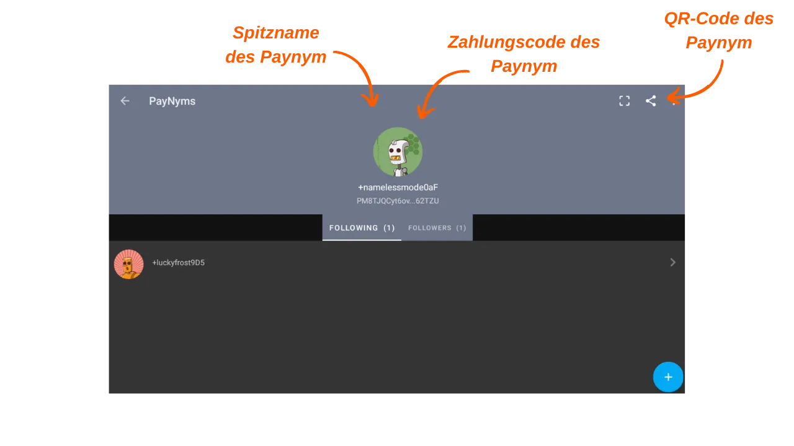

***ACHTUNG:** Nach der Verhaftung der Gründer von Samourai Wallet und der Beschlagnahme ihrer Server am 24. April funktionieren die Payjoins Stowaway nur noch durch manuellen Austausch der PSBT zwischen den beteiligten Parteien, vorausgesetzt beide Benutzer sind mit ihrem eigenen Dojo verbunden. Es besteht jedoch die Möglichkeit, dass diese Werkzeuge in den kommenden Wochen wieder eingeführt werden. In der Zwischenzeit können Sie diesen Artikel konsultieren, um das theoretische Funktionieren der Stowaway zu verstehen.*

_Wenn Sie planen, ein Stowaway manuell durchzuführen, ist das Verfahren sehr ähnlich dem in diesem Tutorial beschriebenen. Der Hauptunterschied besteht in der Auswahl des Typs der Stowaway-Transaktion: Statt `Online` wählen Sie `In Person / Manual`. Anschließend müssen Sie die PSBT manuell austauschen, um die Stowaway-Transaktion zu erstellen. Wenn Sie physisch nahe bei Ihrem Partner sind, können Sie die QR-Codes nacheinander scannen. Wenn Sie sich auf Distanz befinden, können die JSON-Dateien über einen sicheren Kommunikationskanal ausgetauscht werden. Der Rest des Tutorials bleibt unverändert._

_Wir verfolgen die Entwicklungen in diesem Fall sowie die Entwicklungen bezüglich der zugehörigen Tools genau. Seien Sie versichert, dass wir dieses Tutorial aktualisieren werden, sobald neue Informationen verfügbar sind._

_Dieses Tutorial wird nur zu Bildungs- und Informationszwecken bereitgestellt. Wir befürworten oder ermutigen die Verwendung dieser Tools zu kriminellen Zwecken nicht. Es liegt in der Verantwortung jedes Benutzers, die Gesetze in seiner Gerichtsbarkeit zu beachten._

---

> *"Zwingen Sie Blockchain-Spione dazu, alles, was sie zu wissen glauben, neu zu überdenken."*

Payjoin ist eine spezifische Bitcoin-Transaktionsstruktur, die die Privatsphäre des Benutzers bei einer Ausgabe verbessert, indem sie mit dem Zahlungsempfänger zusammenarbeitet. Es gibt mehrere Implementierungen, die die Einrichtung und Automatisierung von PayJoin ermöglichen. Unter diesen Implementierungen ist die bekannteste Stowaway, entwickelt von den Teams bei Samourai Wallet. Dieses Tutorial erklärt, wie man eine Stowaway Payjoin-Transaktion mit der Samourai Wallet-Anwendung durchführt.

## Wie funktioniert Stowaway?

Wie bereits erwähnt, bietet Samourai Wallet ein PayJoin-Tool namens "Stowaway" an. Es ist über die Sparrow Wallet-Software auf dem PC oder die Samourai Wallet-Anwendung auf Android zugänglich. Um eine Payjoin-Transaktion durchzuführen, muss der Empfänger, der auch als Kollaborateur fungiert, eine Software verwenden, die mit Stowaway kompatibel ist, nämlich Sparrow oder Samourai. Diese beiden Software sind interoperabel und ermöglichen eine Stowaway-Transaktion zwischen einer Sparrow Wallet und einer Samourai Wallet sowie umgekehrt.

Stowaway basiert auf einer Kategorie von Transaktionen, die Samourai als "Cahoots" bezeichnet. Ein Cahoot ist im Wesentlichen eine kollaborative Transaktion zwischen mehreren Benutzern, die einen Informationsaustausch außerhalb der Blockchain erfordert. Samourai bietet derzeit zwei Cahoots-Tools an: Stowaway (Payjoins) und StonewallX2 (das wir in einem zukünftigen Artikel behandeln werden).

Cahoots-Transaktionen beinhalten den Austausch von teilweise signierten Transaktionen zwischen Benutzern. Dieser Prozess kann langwierig und umständlich sein, insbesondere wenn er remote durchgeführt wird. Er kann jedoch immer noch manuell mit einem anderen Benutzer durchgeführt werden, was praktisch ist, wenn die Kollaborateure sich physisch nahe sind. In der Praxis beinhaltet dies den manuellen Austausch von fünf QR-Codes, die nacheinander gescannt werden müssen.

Bei einer Remote-Durchführung wird dieser Prozess zu komplex. Um dieses Problem zu lösen, hat Samourai ein verschlüsseltes Kommunikationsprotokoll namens "Soroban" entwickelt, das auf Tor basiert. Mit Soroban werden die für eine Payjoin-Transaktion erforderlichen Austausche automatisiert und über eine benutzerfreundliche Schnittstelle abgewickelt. Dies ist die zweite Methode, die wir in diesem Artikel untersuchen werden.

Diese verschlüsselten Austausche erfordern den Aufbau einer Verbindung und Authentifizierung zwischen den Cahoots-Teilnehmern. Die Soroban-Kommunikation basiert daher auf den Paynyms der Benutzer. Wenn Sie mit Paynyms nicht vertraut sind, lade ich Sie ein, diesen Artikel für weitere Details zu konsultieren: [BIP47 - PAYNYM](https://planb.network/tutorials/privacy/paynym-bip47).
Einfach ausgedrückt ist ein Paynym eine eindeutige Kennung, die mit Ihrer Wallet verknüpft ist und verschiedene Funktionen ermöglicht, einschließlich verschlüsselter Kommunikation. Der Paynym wird in Form einer Kennung und einer Illustration, die einen Roboter darstellt, präsentiert. Hier ist ein Beispiel für meinen auf dem Testnetzwerk: 

**Zusammenfassend:**
- _Payjoin_ = Spezifische Struktur kollaborativer Transaktionen;
- _Stowaway_ = Payjoin-Implementierung, verfügbar auf Samourai und Sparrow Wallet;
- _Cahoots_ = Name, den Samourai allen ihren Arten von kollaborativen Transaktionen gibt, einschließlich Payjoin Stowaway;
- _Soroban_ = Verschlüsseltes Kommunikationsprotokoll, das auf Tor basiert und die Zusammenarbeit mit anderen Benutzern im Rahmen einer Cahoots-Transaktion ermöglicht;
- _Paynym_ = Eindeutige Kennung einer Wallet, die die Kommunikation mit einem anderen Benutzer über Soroban ermöglicht, um eine Cahoots-Transaktion durchzuführen.

[**-> Erfahren Sie mehr über Payjoin-Transaktionen und ihren Nutzen**](https://planb.network/tutorials/privacy/payjoin)

## Wie man eine Verbindung zwischen Paynyms herstellt
Um eine Remote-Cahoots-Transaktion, speziell einen PayJoin (Stowaway) über Samourai, durchzuführen, ist es notwendig, dem Benutzer, mit dem Sie zusammenarbeiten möchten, zu "folgen", indem Sie seinen Paynym verwenden. Im Falle eines Stowaway bedeutet dies, der Person zu folgen, an die Sie Bitcoins senden möchten.

**Hier ist das Verfahren, um diese Verbindung herzustellen:**

Zunächst müssen Sie den Zahlungscode des Paynyms des Empfängers für den Payjoin erhalten. In der Samourai Wallet-Anwendung muss der Empfänger auf das Symbol seines Paynyms (den kleinen Roboter) oben links auf dem Bildschirm tippen und dann auf seinen Paynym-Nickname klicken, der mit `+...` beginnt. Zum Beispiel ist meiner `+namelessmode0aF`. Wenn Ihr Kollege Sparrow Wallet verwendet, lade ich Sie ein, unser spezielles Tutorial hier zu konsultieren.

Ihr Kollege wird dann auf seine Paynym-Seite weitergeleitet. Von dort aus können sie entweder ihre Paynym-Anmeldeinformationen mit Ihnen teilen oder ihren QR-Code zum Scannen freigeben. Dazu müssen sie auf das kleine "Freigabe" -Symbol oben rechts auf ihrem Bildschirm klicken.

Auf Ihrer Seite starten Sie Ihre Samourai Wallet-Anwendung und greifen auf das Menü "PayNyms" auf die gleiche Weise zu. Wenn Sie Ihren Paynym zum ersten Mal verwenden, müssen Sie die Kennung erhalten.

Klicken Sie dann auf das blaue "+" unten rechts auf dem Bildschirm.

Sie können dann den Zahlungscode Ihres Kollegen einfügen, indem Sie `COLLER LE CODE PAIEMENT` auswählen oder die Kamera öffnen, um ihren QR-Code zu scannen, indem Sie `SCANNEZ LE CODE QR` drücken.

Klicken Sie auf die Schaltfläche `SUIVRE`.

Bestätigen Sie, indem Sie auf `OUI` klicken.

Die Software bietet Ihnen dann eine Schaltfläche `SE CONNECTER` an. Es ist nicht notwendig, auf diese Schaltfläche für unser Tutorial zu klicken. Dieser Schritt ist nur erforderlich, wenn Sie Zahlungen an den anderen Paynym im Rahmen des [BIP47](https://planb.network/tutorials/privacy/paynym-bip47) planen, was nichts mit unserem Tutorial zu tun hat.

Sobald der Paynym des Empfängers von Ihrem Paynym aus gefolgt wird, wiederholen Sie diesen Vorgang in umgekehrter Richtung, damit der Empfänger Ihnen ebenfalls folgt. Sie können dann einen Payjoin durchführen.

## Wie man einen Payjoin in der Samourai Wallet durchführt

Wenn Sie diese vorbereitenden Schritte abgeschlossen haben, sind Sie endlich bereit, die Payjoin-Transaktion durchzuführen! Folgen Sie dazu unserem Video-Tutorial:

**Externe Ressourcen:**
- https://docs.samourai.io/en/spend-tools#stowaway.
