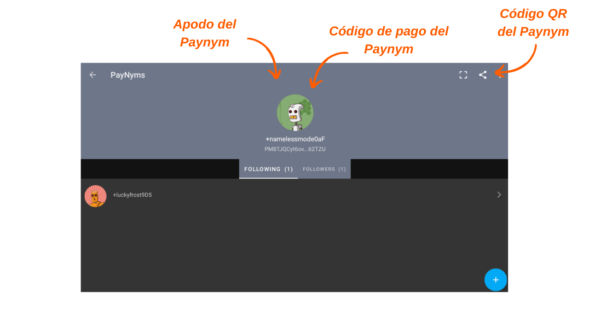

> *"Obliga a los espías de la cadena de bloques a replantearse todo lo que creen saber."*

Payjoin es una estructura específica de transacción de Bitcoin que mejora la privacidad del usuario durante un gasto al colaborar con el receptor del pago. Existen varias implementaciones que facilitan la configuración y automatización de PayJoin. Entre estas implementaciones, la más conocida es Stowaway, desarrollada por los equipos de [Samourai Wallet](https://samouraiwallet.com/stowaway). Este tutorial explica cómo realizar una transacción Payjoin de Stowaway utilizando la aplicación Samourai Wallet.

## ¿Cómo funciona Stowaway?

Como se mencionó anteriormente, Samourai Wallet ofrece una herramienta PayJoin llamada "Stowaway". Es accesible a través del software Sparrow Wallet en PC o la aplicación Samourai Wallet en Android. Para realizar un Payjoin, el receptor, que también actúa como colaborador, debe utilizar un software compatible con Stowaway, es decir, Sparrow o Samourai. Estos dos software son interoperables, lo que permite una transacción Stowaway entre una billetera Sparrow y una billetera Samourai, y viceversa.

Stowaway se basa en una categoría de transacciones que Samourai denomina "Cahoots". Un Cahoot es esencialmente una transacción colaborativa entre varios usuarios que requiere un intercambio de información fuera de la cadena. Hasta la fecha, Samourai ofrece dos herramientas Cahoots: Stowaway (Payjoins) y StonewallX2 (que exploraremos en un artículo futuro).

Las transacciones Cahoots implican intercambios de transacciones parcialmente firmadas entre usuarios. Este proceso puede ser largo y engorroso, especialmente cuando se realiza de forma remota. Sin embargo, aún se puede realizar manualmente con otro usuario, lo cual puede ser conveniente si los colaboradores están físicamente cerca. En la práctica, esto implica intercambiar manualmente cinco códigos QR que se escanean sucesivamente.

Cuando se realiza de forma remota, este proceso se vuelve demasiado complejo. Para abordar este problema, Samourai ha desarrollado un protocolo de comunicación cifrada basado en Tor, llamado "Soroban". Con Soroban, los intercambios necesarios para un Payjoin se automatizan detrás de una interfaz fácil de usar. Este es el segundo método que estudiaremos en este artículo.

Estos intercambios cifrados requieren establecer una conexión y autenticación entre los participantes de Cahoots. Por lo tanto, las comunicaciones de Soroban se basan en los Paynyms de los usuarios. Si no está familiarizado con los Paynyms, lo invito a consultar este artículo para obtener más detalles: [BIP47 - PAYNYM](https://planb.network/tutorials/privacy/paynym-bip47).
En resumen, un Paynym es un identificador único vinculado a su billetera que permite diversas funcionalidades, incluido el envío de mensajes cifrados. El Paynym se presenta en forma de un identificador y una ilustración que representa a un robot. Aquí tienes un ejemplo del mío en Testnet: 

**En resumen:**
- _Payjoin_ = Estructura específica de transacciones colaborativas;
- _Stowaway_ = Implementación de Payjoin disponible en Samourai y Sparrow Wallet;
- _Cahoots_ = Nombre dado por Samourai a todos sus tipos de transacciones colaborativas, incluido Payjoin Stowaway;
- _Soroban_ = Protocolo de comunicación cifrada establecido en Tor, que permite la colaboración con otros usuarios en el contexto de una transacción Cahoots;
- _Paynym_ = Identificador único de una billetera que permite la comunicación con otro usuario en Soroban, con el fin de realizar una transacción Cahoots.
## Cómo establecer una conexión entre Paynyms?
Para llevar a cabo una transacción remota de Cahoots, específicamente un PayJoin (Stowaway) a través de Samourai, es necesario "Seguir" al usuario con quien deseas colaborar, utilizando su Paynym. En el caso de un Stowaway, esto significa seguir a la persona a quien deseas enviar bitcoins.

**Aquí está el procedimiento para establecer esta conexión:**

Para comenzar, necesitas obtener el código de pago del Paynym del destinatario para el Payjoin. En la aplicación Samourai Wallet, el destinatario debe tocar el icono de su Paynym (el pequeño robot) ubicado en la parte superior izquierda de la pantalla, y luego hacer clic en su apodo de Paynym, que comienza con `+...`. Por ejemplo, el mío es `+namelessmode0aF`. Si tu colaborador utiliza Sparrow Wallet, te invito a consultar nuestro tutorial dedicado haciendo clic aquí.

Tu colaborador será redirigido a su página de Paynym. Desde allí, pueden compartirte sus credenciales de Paynym o compartirte su código QR para que lo escanees. Para hacer esto, deben hacer clic en el pequeño ícono de "compartir" ubicado en la parte superior derecha de su pantalla.

Por tu parte, inicia la aplicación Samourai Wallet y accede al menú "PayNyms" de la misma manera. Si es la primera vez que utilizas tu Paynym, necesitarás obtener el identificador.

Luego haz clic en el signo "+" azul en la parte inferior derecha de la pantalla.

Luego puedes pegar el código de pago de tu colaborador seleccionando `COLLER LE CODE PAIEMENT`, o abrir la cámara para escanear su código QR presionando `SCANNEZ LE CODE QR`.

Haz clic en el botón `SUIVRE`.

Confirma haciendo clic en `YES`.

El software te ofrecerá un botón `SE CONNECTER`. No es necesario hacer clic en este botón para nuestro tutorial. Este paso solo es necesario si planeas hacer pagos al otro Paynym como parte del [BIP47](https://planb.network/tutorials/privacy/paynym-bip47), que no está relacionado con nuestro tutorial.

Una vez que el Paynym del destinatario es seguido por tu Paynym, repite esta operación en dirección opuesta para que el destinatario también te siga. Luego puedes realizar un Payjoin.

## ¿Cómo hacer un Payjoin en Samourai Wallet?

Si has completado estos pasos preliminares, ¡finalmente estás listo para realizar la transacción de Payjoin! Para hacer esto, sigue nuestro tutorial en video:

**Recursos externos:**
- https://docs.samourai.io/en/spend-tools#stowaway;
- https://samouraiwallet.com/stowaway.
