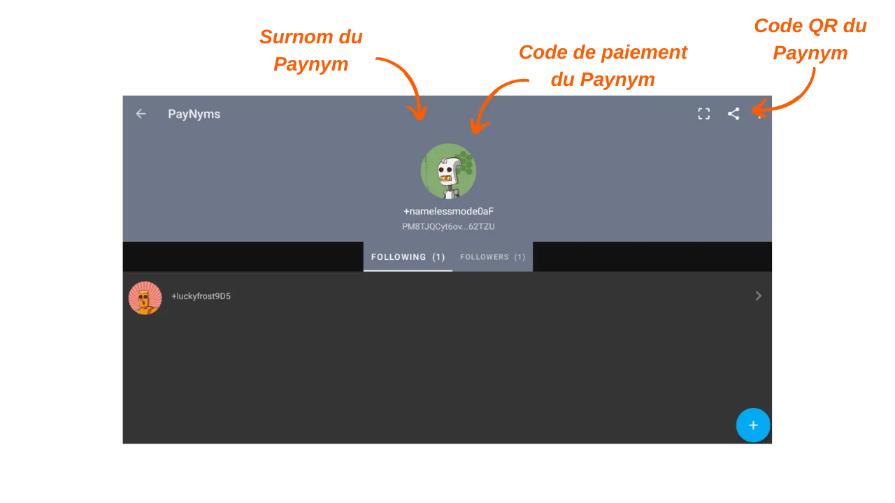

***ATTENTION :** Suite à l'arrestation des fondateurs de Samourai Wallet et à la saisie de leurs serveurs le 24 avril dernier, les Payjoins Stowaway sur Samourai Wallet ne fonctionnent plus qu'en échangeant manuellement les PSBT entre les parties concernées, à condition que les deux utilisateurs soient connectés à leur propre Dojo. Pour ce qui est de Sparrow, les Payjoins via le BIP78 fonctionnent toujours (nous vous proposerons un tuto prochainement). Toutefois, il est possible que ces outils soient relancés dans les semaines à venir. En attendant, vous pouvez toujours consulter cet article pour comprendre le fonctionnement théorique des Stowaway.*

*Si vous envisagez de réaliser un Stowaway manuellement, la procédure est très similaire à celle décrite dans ce tutoriel. La principale différence réside dans le choix du type de transaction Stowaway : au lieu de sélectionner `Online`, cliquez sur `In Person / Manual`. Ensuite, vous devrez échanger manuellement les PSBT pour construire la transaction Stowaway. Si vous êtes physiquement proche de votre collaborateur, vous pouvez scanner les QR codes successivement. Si vous êtes à distance, les fichiers JSON peuvent être échangés via un canal de communication sécurisé. Le reste du tutoriel demeure inchangé.*

_Nous suivons de près l'évolution de cette affaire ainsi que les développements concernant les outils associés. Soyez assuré que nous mettrons ce tutoriel à jour au fur et à mesure que de nouvelles informations seront disponibles._

_Ce tutoriel est fourni à des fins éducatives et informatives uniquement. Nous ne cautionnons ni n'encourageons l'utilisation de ces outils à des fins criminelles. Il est de la responsabilité de chaque utilisateur de respecter les lois en vigueur dans sa juridiction._

---

> *"Force blockchain spies to rethink everything they think they know."*

Le Payjoin est une structure spécifique de transaction Bitcoin qui permet d'améliorer la confidentialité des utilisateurs lors d'une dépense en collaborant avec le destinataire du paiement. Il existe plusieurs implémentations qui permettent de faciliter la mise en place d'un PayJoin et d'automatiser son opération. Parmi ces implémentations, la plus connue est Stowaway développée par les équipes de Samourai Wallet. Ce tutoriel vous explique comment réaliser une transaction Payjoin Stowaway via l'application Samourai Wallet.

## Comment fonctionne Stowaway ?

Comme évoqué précédemment, Samourai Wallet propose un outil de PayJoin dénommé « _Stowaway_ ». Il est accessible via le logiciel Sparrow Wallet sur PC, ou via l'application Samourai Wallet sur Android. Pour effectuer un Payjoin, le destinataire, qui joue aussi le rôle de collaborateur, doit utiliser un logiciel compatible avec Stowaway, à savoir Sparrow ou Samourai. Ces deux logiciels sont interopérables, ce qui permet de réaliser une transaction Stowaway d'un portefeuille Sparrow vers un portefeuille Samourai, et vice-versa.

Stowaway s'appuie sur une catégorie de transactions que Samourai nomme les « _Cahoots_ ». Un Cahoot est en fait une transaction collaborative entre plusieurs utilisateurs, nécessitant un échange d'informations hors de la blockchain Bitcoin. À ce jour, Samourai propose deux outils de Cahoots : Stowaway (les Payjoins) et StonewallX2 (que nous découvrirons dans un prochain article).

Les transactions Cahoots requièrent des échanges de transactions partiellement signées entre les utilisateurs. Ce processus peut s'avérer long et contraignant, particulièrement quand on est à distance. Néanmoins, il reste réalisable manuellement avec un autre utilisateur, ce qui peut être pratique si les collaborateurs sont physiquement proches. En pratique, cela implique l'échange manuel de cinq codes QR à scanner successivement.

À distance, ce procédé devient trop complexe. Pour résoudre ce problème, Samourai a mis au point un protocole de communication chiffré basé sur Tor, baptisé « _Soroban_ ». Avec Soroban, les échanges nécessaires à un Payjoin se font automatiquement, derrière une interface utilisateur conviviale. C'est cette seconde méthode que nous allons étudier dans cet article.

Ces échanges chiffrés exigent d'établir une connexion et une authentification entre les participants des Cahoots. Les communications Soroban s'appuient donc sur les Paynyms des utilisateurs. Si vous n'êtes pas familier avec les Paynyms, je vous invite à consulter cet article pour plus de détails : [BIP47 - PAYNYM](https://planb.network/tutorials/privacy/paynym-bip47).

Pour faire simple, un Paynym est un identifiant unique lié à votre portefeuille, qui permet diverses fonctionnalités, dont des échanges de messages chiffrés. Le Paynym se présente sous la forme d'un identifiant et d'une illustration représentant un robot. Voici, à titre d'exemple, le mien sur le Testnet :

**Pour résumer :**
- _Payjoin_ = Structure spécifique de transaction collaborative ;
- _Stowaway_ = Implémentation de Payjoin disponible sur Samourai et Sparrow Wallet ;
- _Cahoots_ = Nom donné par Samourai à tous leurs types de transactions collaboratives, notamment les Payjoin Stowaway ;
- _Soroban_ = Protocole de communication chiffré établi sur Tor permettant de collaborer avec d'autres utilisateurs dans le cadre d'une transaction Cahoots ;
- _Paynym_ = Identifiant unique d'un portefeuille permettant d'établir une communication avec un autre utilisateur sur Soroban, en vue d'effectuer une transaction Cahoots.

[**-> En savoir plus sur les transactions Payjoin et leur utilité**](https://planb.network/tutorials/privacy/payjoin)

## Comment établir une connexion entre Paynyms ?

Pour réaliser une transaction Cahoots à distance, notamment un PayJoin (Stowaway) via Samourai, il est nécessaire de « _Suivre_ » l'utilisateur avec qui vous envisagez de collaborer, en utilisant son Paynym. Dans le cas d'un Stowaway, il s'agit de suivre la personne à qui vous désirez envoyer des bitcoins.

**Voici la procédure pour établir cette connexion :**

Pour commencer, il est nécessaire d'obtenir le code de paiement du Paynym du destinataire du Payjoin. Dans l'application Samourai Wallet, le destinataire doit appuyer sur l'icône de son Paynym (le petit robot) située en haut à gauche de l'écran, puis cliquer sur son surnom de Paynym, commençant par `+...`. Par exemple, le mien est `+namelessmode0aF`. Si votre collaborateur utilise Sparrow Wallet, je vous invite à consulter notre tutoriel dédié en cliquant ici.

Votre collaborateur sera alors redirigé vers la page de son Paynym. De là, il pourra soit vous transmettre les identifiants de son Paynym, soit partager avec vous son code QR pour que vous puissiez le scanner. Pour cela, il doit cliquer sur la petite icône `partager` située en haut à droite de son écran.

De votre côté, lancez votre application Samourai Wallet et accédez au menu `PayNyms` de la même manière. Si c'est la première utilisation de votre Paynym, vous devrez en obtenir l'identifiant. 

Cliquez ensuite sur le `+` bleu en bas à droite de l'écran.

Vous pouvez alors coller le code de paiement de votre collaborateur en sélectionnant `COLLER LE CODE PAIEMENT`, ou ouvrir la caméra pour scanner son code QR en appuyant sur `SCANNEZ LE CODE QR`.

Cliquez sur le bouton `SUIVRE`.

Validez en cliquant sur `YES`.

Le logiciel vous proposera alors un bouton `SE CONNECTER`. Il n'est pas nécessaire de cliquer sur ce bouton pour notre tutoriel. Cette étape est obligatoire uniquement si vous envisagez d'effectuer des paiements vers l'autre Paynym dans le cadre du [BIP47](https://planb.network/tutorials/privacy/paynym-bip47), ce qui n'a rien à voir avec notre tutoriel.

Une fois le Paynym du destinataire suivi par votre Paynym, refaites cette opération dans l'autre sens afin que votre destinataire vous suive également. Vous pourrez ensuite effectuer un Payjoin.

## Comment faire un Payjoin sur Samourai Wallet ?

Si vous avez réalisé ces quelques étapes préalables, vous êtes enfin prêt pour réaliser la transaction Payjoin ! Pour ce faire, suivez notre tutoriel vidéo :

**Ressources externes :** 
- https://docs.samourai.io/en/spend-tools#stowaway.
